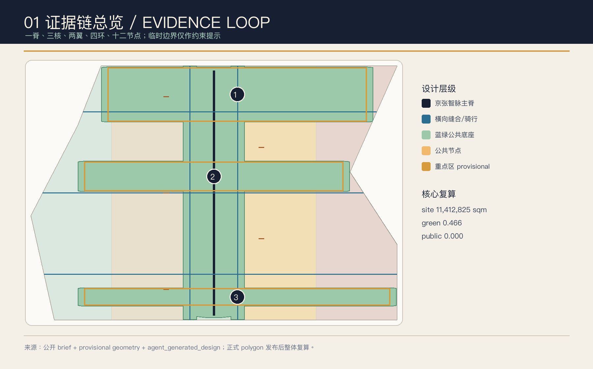
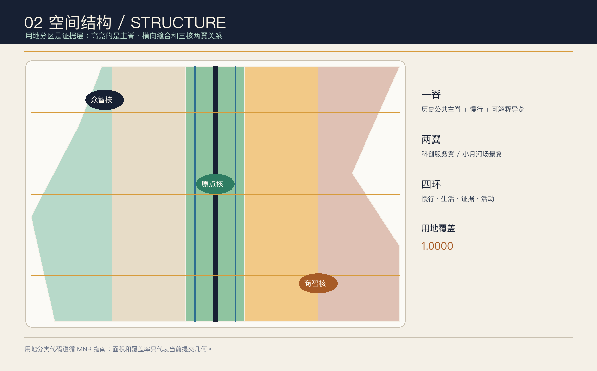
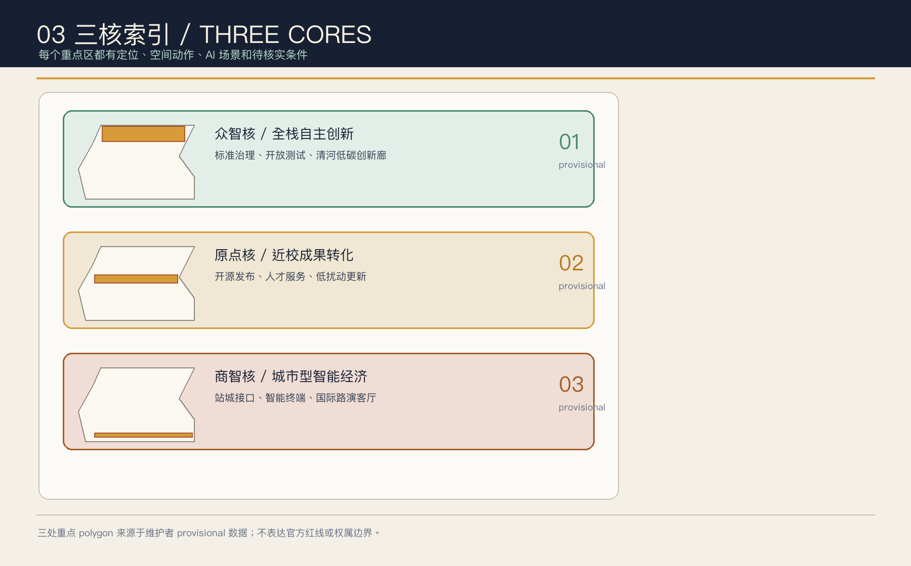
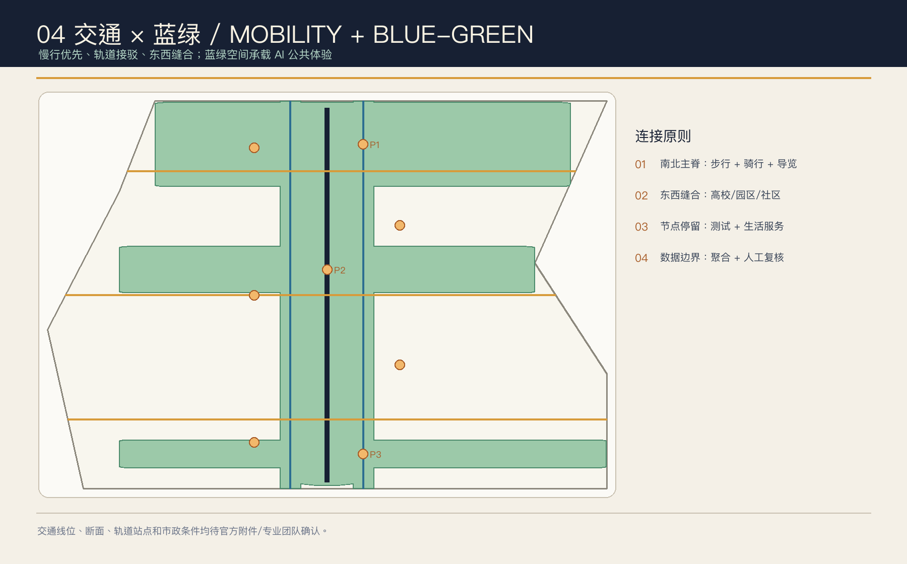
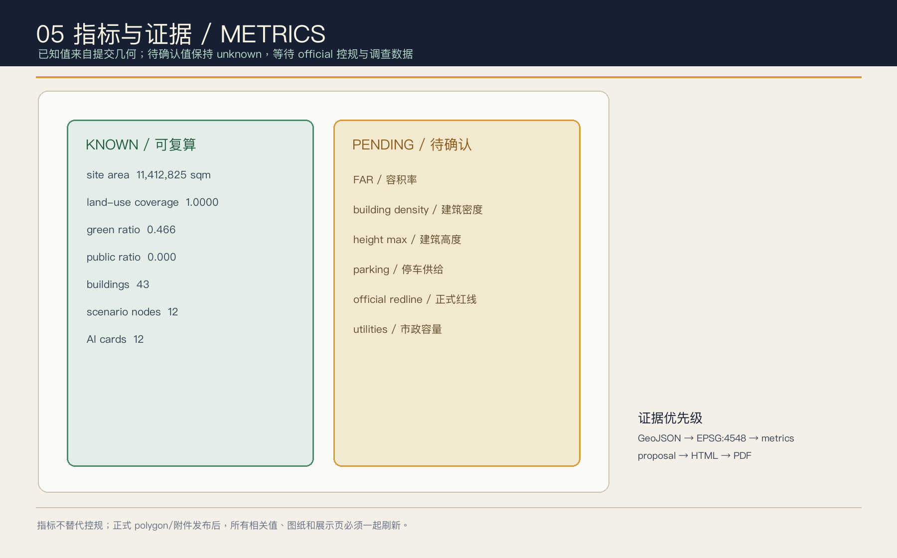

# 京张智脉共生带：可验证的 AI 城市公共底座

## 设计依据与资料清单

本方案参加的是仓库当前公开的 Agent 投稿窗口，状态文件显示投稿于北京时间 2026-08-07 开放、2026-08-31 截止，后续实施和专业深化时间仍以主办方最终安排为准 [source:OPEN-CALL-STATUS]。城市设计任务的第一权威依据是北京市规划和自然资源委员会海淀分局《百年京张AI创新带城市设计国际方案征集资格预审公告》：公告给出 43.6 平方公里统筹研究范围、11.4 平方公里总体设计范围、368.4 公顷重点区域范围和三处重点片区任务，但没有公开精确 polygon [source:OFFICIAL-ANNOUNCEMENT][standard:PROJECT-OFFICIAL-ANNOUNCEMENT]。

生成前读取了 `brief/site-package/`、`data/source_registry.json`、`data/processed/agent_fact_pack.md` 及其范围/任务/资料用途表 [source:SITE-PACKAGE][source:SOURCE-REGISTRY][source:PROCESSED-FACT-PACK]。结构化任务书补充三大定位“百年京张文化带、都市 AI 生活体验带、AI 融合创新带”、五大功能、三区两翼和 agent.1-agent.6，并要求公开资料、生成方法、人类最终判断和版权边界 [source:AGENT-TASKBOOK][standard:PROJECT-AGENT-OPEN-CALL-TASKBOOK]。

当前提交使用仓库维护者登记的 provisional boundary 与 provisional key areas：`official_boundary=false`、`geometry_role=provisional_constraint`、`boundary_precision=provisional_rough` [source:BOUNDARY-SOURCE][source:KEY-AREA-SOURCE][data:geometry/site_boundary.geojson#SITE-001][data:geometry/key_areas.geojson#PROV-KEY-001]。它们只用于生成、自检、可视化和设计讨论，不能作为 official redline、精确面积、审批依据或法定控制结论。取得正式 CAD/GIS/PDF 后，必须整体替换并重算所有空间图层、图纸、HTML 和指标 [depth:existing_conditions_diagnosis][depth:risk_missing_data][standard:MOHURD-CONTROL-DETAILED-PLANNING]。

城市设计、控规深度和用地分类分别参考住建部《城市设计管理办法》、控规编制审批办法和自然资源部用地分类指南 [standard:MOHURD-URBAN-DESIGN-MEASURES][standard:MOHURD-CONTROL-DETAILED-PLANNING][standard:MNR-LAND-USE-CLASSIFICATION-GUIDE]。建筑专业深度文件在仓库中标为待取得官方文件，本方案把它作为后续深化提醒，不把非官方材料写成权威依据 [standard:MOHURD-ARCH-DESIGN-DEPTH-2016]。

本方案的所有空间落地、活动运营和政策机制均是“概念建议、参考方案或可供专业团队深化研究的材料”，不替代正式规划，不构成政府审定结论。

## 三层范围工作框架

方案采用“统筹研究—总体设计—重点区域”三层传导。统筹研究范围约 43.6 平方公里，负责 AI 产业生态、人才/企业/社区协同、三区两翼和未来城市形态；总体设计范围约 11.4 平方公里，负责城市更新、用地结构、交通市政、京张遗址公园活力带和风貌；重点区域约 368.4 公顷，负责三处片区的精细化设计 [source:OFFICIAL-ANNOUNCEMENT][depth:three_level_scope_framework][depth:overall_spatial_structure]。

空间概念不是新增行政边界，而是一套可审计的组织方法：

| 层级 | 设计主问 | “智脉共生带”回答 | 结构化落点 |
| --- | --- | --- | --- |
| 统筹研究 | 如何形成世界级 AI 创新生态 | 高校策源—开源协作—企业转化—公共体验—国际传播五段创新链 | `compliance_matrix.json`、`standard_matrix.json` |
| 总体设计 | 如何把产业、更新、交通和公共生活落图 | 一脊、两翼、四环和节点化服务，把空间动作与运营动作绑定 | [data:geometry/land_use.geojson#LU-001][data:geometry/roads.geojson#ROAD-001] |
| 重点区域 | 三个片区怎样形成差异化抓手 | 众智核做全栈治理，原点核做近校转化，商智核做城市型智能经济 | [data:geometry/key_areas.geojson#PROV-KEY-001][data:geometry/key_areas.geojson#PROV-KEY-002][data:geometry/key_areas.geojson#PROV-KEY-003] |

总体结构为“一脊、三核、两翼、四环、十二节点”：

- **一脊**：京张遗址公园及其南北慢行/文化主脊，叠合步行、骑行、导视和公共测试。
- **三核**：众智园 AI 自主创新加速区（众智核）、北京 AI 原点社区（原点核）、大钟寺 AI 产业聚集区（商智核）。
- **两翼**：中关村科技服务翼，承担人才、资本、空间、平台和全球链接；小月河场景赋能翼，把 AI+ 场景嵌入日常生活。
- **四环**：慢行环、生活服务环、证据治理环、全球活动环。四环是运营和空间的复合关系，不代表新的法定线位。
- **十二节点**：与 `constraints.geojson` 中的 12 个 `SCENARIO_NODE` 对应，覆盖发布、治理、算力、可达性、成果转化、数据要素、文化导览、居民服务、机器人低速测试、开发者社区、全球活动和公共安全演练 [data:geometry/constraints.geojson#NODE-001][data:geometry/constraints.geojson#NODE-012]。

## 统筹研究范围产业与未来城市研究

### 总体命名与视觉识别（agent.1）

主名称为 **“京张智脉共生带 / Jing-Zhang Evidence Loop”**。`智脉`同时指铁路的线性时间、数据/算力的流动和公共生活的神经网络；`共生`强调智能体增强人的能力、由人类进行最终判断。Logo 方向使用原创字符 **`JZ//`**：`JZ` 是 Jing-Zhang 的缩写，双斜线像双轨切换，也像证据链中的“输入/复核”两个闸门。建议颜色为 Rail Black（#172033）、Jing Green（#2E7D62）、Signal Amber（#D79B3B）和 Open Blue（#2C6E91），不依赖第三方字体或商标。导视采用“编号 + 状态”系统：节点编号、数据状态、人工复核状态和开放时段同时显示，使城市空间与 AI 服务都可被理解和质询 [source:AGENT-TASKBOOK][standard:PROJECT-AGENT-OPEN-CALL-TASKBOOK][depth:overall_spatial_structure]。

### 五大功能与三区两翼协同

五大功能被转译为五个可观察回路：AI 全栈自主创新（众智核的测试/标准节点）、世界级 AI 创新生态（原点核的高校/开源/转化）、AI+ 场景赋能新范式（小月河场景翼）、智能化 AI 活力城市（日常服务/公共空间）和 AI 治理全球话语权（证据庭、公开评测与国际交流）。三区两翼不是并列园区名单，而是“策源—加速—转化—体验—治理”的回路 [source:AGENT-TASKBOOK][depth:overall_spatial_structure]。

### 全球机制案例（背景参考，不作为本项目事实或控制依据）

| 案例 | 可转化机制 | 在本方案中的谨慎转译 |
| --- | --- | --- |
| MIND Milano Innovation District | 研究、企业、生活和公共空间以 living-lab 方式叠合 | 以“公共空间也是测试场”作为众智核的运营方法，不移植其投资或规模数据 [source:CASE-MIND-MILANO] |
| Keihanna Science City | 产业—高校—政府—居民共创与公开道路验证 | 为慢行、机器人和居民参与场景设置人工复核与公开回放机制 [source:CASE-KEIHANNA] |
| Jurong Innovation District | 研发、培训、制造与绿色基础设施的连续链条 | 把端侧算力、人才学习和场景试验放在同一服务链，不推导本地建设规模 [source:CASE-JURONG-INNOVATION-DISTRICT] |
| IPAI CAMPUS | AI 主题识别、气候意识和可步行公共空间 | 把品牌识别与蓝绿网络绑定，避免只做科技园立面 [source:CASE-IPAI-CAMPUS] |
| Agorai Innovation Hub | 基础研究、应用研究、开放学院和跨界伙伴形成闭环 | 为原点核设计“发布—验证—训练—转化”四段式机制 [source:CASE-AGORAI-TRIESTE] |
| Marineterrein Amsterdam | 历史场地作为可预约、可复盘的公共测试平台 | 把京张遗址公共空间做成低扰动、分时段、可撤回的测试场 [source:CASE-MARINETERREIN] |

这些案例只支撑机制启发，不支撑海淀的企业名单、投资额、控规或实施承诺 [source:SOURCE-REGISTRY][source:AGENT-TASKBOOK]。

### 未来城市形态

未来城市形态不是“每处都加一个智能屏”，而是让空间具备可进化的服务接口：工作空间通过开源发布和测试节点与公共空间相连；生活空间通过可解释导视和服务共驾降低信息门槛；学习空间通过近校成果转化街连接高校和初创团队；交通空间通过慢行诊断和轨道接驳把公共利益放在算法前面 [depth:overall_spatial_structure][data:geometry/public_space.geojson#PUBLIC-001][data:geometry/roads.geojson#ROAD-001]。

## 总体设计范围城市更新与控规深度城市设计

### 空间结构与用地

`land_use.geojson` 由同一 provisional SITE polygon 进行相邻分区，五个分区覆盖边界且无重叠 [data:geometry/land_use.geojson#LU-001][depth:land_use_layout][metric:land_use_coverage_ratio]。科研用地（0802）承载研发和全栈创新，文化用地（0803）承载京张记忆与开源展示，公园绿地（1401）形成遗址活力带，商业服务业用地（05）承载智能原生新业态，社区服务设施用地（0702）承载人才生活和公共服务 [standard:MNR-LAND-USE-CLASSIFICATION-GUIDE]。

### 更新方法与控规边界

建筑图层只表达概念性的“保留—改造—新建—测试亭”方法，不把任何现状建筑、权属或地块判断写成事实 [data:geometry/buildings.geojson#BLDG-001][depth:retain_renovate_demolish]。容积率、建筑密度、建筑高度、退线、道路红线、停车供给和市政容量均列为 unknown 或待确认；这是对控规作为规划许可和实施管理依据的尊重，而不是用 AI 推测填空 [standard:MOHURD-CONTROL-DETAILED-PLANNING][depth:development_intensity_controls][depth:height_massing_character][metric:floor_area_ratio][metric:building_density][metric:height_max_m][assumption:A-CONTROLS-001]。

建议专业团队以“界面优先、低扰动、可逆性”校准后续更新：首层优先公共服务与可见的创新展示；既有结构能满足安全和功能时优先改造；需要新增时优先采用小尺度、可拆卸、可测试的节点建筑。任何拆改留、规模和风貌控制均需等正式图纸、文保、权属和消防资料确认 [depth:retain_renovate_demolish][depth:height_massing_character][source:OFFICIAL-ANNOUNCEMENT]。

### 三处重点区的总体接口

总体设计以一脊和两翼把三个重点区串成“早期研究—公开验证—城市转化”的连续链：众智核提供安全与标准，原点核提供人才与开源，商智核提供公共消费与国际交往；中关村科技服务翼提供要素链接，小月河场景翼提供日常测试和公共体验 [depth:overall_spatial_structure][data:geometry/key_areas.geojson#PROV-KEY-001][data:geometry/key_areas.geojson#PROV-KEY-002][data:geometry/key_areas.geojson#PROV-KEY-003]。

## 重点区域详细设计

三处重点区域当前均为 provisional polygon；下述内容是概念性详细设计，用于说明功能、空间和运营如何衔接，正式 polygon、权属、控规和交通资料取得后需要整体复核 [source:KEY-AREA-SOURCE][depth:three_key_area_detailed_design][metric:key_detailed_design_area_sqm]。

| 片区 | 定位与空间动作 | 建筑/更新方法 | 交通与公共空间 | AI 场景接口 |
| --- | --- | --- | --- | --- |
| **众智园 AI 自主创新加速区（众智核）** [data:geometry/key_areas.geojson#PROV-KEY-001] | 花园型全栈自主创新街区；以清河界面和产业展示形成“可看见的研发” | 保留可复用结构，改造为实验、标准与展示空间；新建只作为可撤回测试亭 | 连接主脊、骑行支线和对外接驳；绿地成为安全评测与低碳算力的公共前厅 | 安全治理沙盒、端侧算力驿、低碳创新廊、公共安全演练台 |
| **北京 AI 原点社区（原点核）** [data:geometry/key_areas.geojson#PROV-KEY-002] | 近校型成果转化和人才社区；把高校策源、开源发布和居住生活缝合 | 低扰动改造首层与闲置空间，形成成果转化街；不预设权属或拆除结论 | 校区—园区—街区步行/骑行缝合，节点可分时段使用 | 开放发布厅、近校成果转化街、开发者夜校、居民服务共驾 |
| **大钟寺 AI 产业聚集区（商智核）** [data:geometry/key_areas.geojson#PROV-KEY-003] | 城市型智能经济和国际交往街区；围绕智能体、智能终端和内容消费 | 重点企业周边公共环境优先，商业服务与展示混合；更新规模待控规确认 | 以大钟寺站四象限步行连通为概念动作，补足非机动车和短停接驳 | 数据要素剧场、机器人低速配送测试、国际路演客厅 |

每个片区都以“一个可感知节点 + 一段可步行路径 + 一套人工复核制度”作为最小实施单元，避免把 AI 方案缩减成硬件清单 [standard:MOHURD-URBAN-DESIGN-MEASURES][depth:three_key_area_detailed_design]。

## AI 创新生态、人才画像与 AI+ 场景

### 六类用户画像

| 用户 | 主要需求 | 空间/运营回应 | 隐私与人工边界 |
| --- | --- | --- | --- |
| 开源开发者 | 发布、协作、测试和贡献声誉 | 原点核开放发布厅、开发者夜校和贡献墙 | 不采集个人轨迹；只展示自愿公开的贡献信息 |
| 高校师生 | 跨校协作、成果转化、低门槛试验 | 近校成果转化街、导览路线和小型公共教室 | 科研成果和校园数据必须授权 |
| 初创团队 | 低成本空间、算力入口和产品验证 | 众智核测试亭、端侧算力驿和科技服务翼 | 数据/算力服务按授权和审计规则开放 |
| 企业访客 | 国际接待、路演、招聘和公共形象 | 商智核国际路演客厅、轨道接驳和公共环境 | 企业标识与案例须清权，不做隐性排名 |
| 周边居民与家庭 | 通勤、休闲、社区服务和安全感 | 公园慢行环、居民服务共驾和分时活动 | 不将居民画像用于商业推荐或个体评分 |
| 全球参访者/活动运营者 | 文化理解、活动参加和跨国协作 | 京张记忆导览、全球 AI 周路线和多语导视 | 访客数据聚合、最小化、可删除、可人工复核 |

对应指标为 [metric:persona_count]；画像是设计工具，不是现状统计或个人数据集 [source:AGENT-TASKBOOK][assumption:A-PUBLIC-DATA-ONLY]。

### 十二张 AI 场景卡

| 编号 | 场景卡 | 空间载体 | 试验/服务边界 |
| --- | --- | --- | --- |
| 01 | 开放发布厅 | 原点核 | 开源成果发布、代码贡献展示；活动数据聚合统计 |
| 02 | 安全治理沙盒 | 众智核 | 模型安全、红队测试和标准讨论；结果由人工复核 |
| 03 | 端侧算力驿 | 一脊节点 | 解释端侧算力与公共服务的接口；能源和安全条件待补 |
| 04 | 慢行可达性诊断 | 绿道与横向缝合线 | 只用公开路网/人工观察，识别无障碍断点，不输出个人轨迹 |
| 05 | 近校成果转化街 | 原点核 | 让研究、法务、知识产权、孵化和路演在短距离内相遇 |
| 06 | 数据要素剧场 | 商智核 | 用可视化讲解授权、审计和撤回，不展示未授权数据 |
| 07 | 京张记忆导览 | 遗址公园主脊 | 以公开史料和人工讲解为主，AI 只做可解释检索 |
| 08 | 居民服务共驾 | 社区服务带 | 预约、问答和公共设施反馈，关键决定由人类服务人员确认 |
| 09 | 机器人低速配送测试 | 商智核公共空间 | 仅作为受控行业验证场景，须经交通、安全和运营审批 |
| 10 | 开发者夜校 | 原点核与科创翼 | 周期性课程、开源维护和跨团队评审，不代表已确定活动安排 |
| 11 | 全球 AI 周路线 | 一脊—三核 | 文化导览、场景开放、路演和公共讨论组成年度建议路线 |
| 12 | 公共安全演练台 | 众智核/公共节点 | 面向应急协同和服务流程演练，始终保留人工指挥和退出机制 |

其中 02、03、05、09 是产业测试/验证场景，超过任务书要求的 3 个 [metric:ai_scenario_card_count][metric:test_validation_scenario_count][source:AGENT-TASKBOOK][depth:municipal_new_infrastructure]。场景共同遵守四条底线：数据最小化、公开/清权、可解释、人工复核；不把尚未验证的技术写成全面部署，不把场景试点写成政府已批准运营 [standard:PROJECT-AGENT-OPEN-CALL-TASKBOOK][assumption:A-OPERATIONS-CONCEPT]。

## 用地、建筑规模与拆改留方案

用地五分区与 `land_use.geojson` 的相邻边界共同覆盖总体设计范围 [data:geometry/land_use.geojson#LU-001][data:geometry/land_use.geojson#LU-005][metric:land_use_area_sqm][metric:land_use_coverage_ratio]。绿地和公共空间采用 union 复算，避免重复计数；建筑基底用于观察“节点密度和公共空间留白”的关系，不代表现状建筑测绘 [data:geometry/green_space.geojson#GREEN-001][data:geometry/public_space.geojson#PUBLIC-001][data:geometry/buildings.geojson#BLDG-001][metric:green_space_area_sqm][metric:public_space_area_sqm][metric:building_footprint_area_sqm]。

拆改留采用四级方法：

1. **保留**：有历史、结构或社区使用价值的空间，优先通过导视、首层开放和服务接口更新。
2. **改造**：把既有可复用结构转成实验室、开放发布、社区服务或公共展示，不预设权属同意。
3. **新建**：仅在专业团队确认控规、文保、消防、能源和权属后，提出小尺度、可逆的节点建筑。
4. **测试亭**：作为阶段性、可撤回的试验设施，不承担法定建设规模或永久工程承诺。

因此 `floor_area_ratio`、`building_density`、`height_max_m` 和 `parking_supply_spaces` 保持 unknown [metric:floor_area_ratio][metric:building_density][metric:height_max_m][metric:parking_supply_spaces][depth:development_intensity_controls][depth:height_massing_character][depth:retain_renovate_demolish]。这正是 [standard:MOHURD-CONTROL-DETAILED-PLANNING] 要求的“已知控制—设计建议—待确认条件”分层。

## 交通、轨道、市政与公共服务设施

交通策略是“慢行先行、轨道接驳、横向缝合、低速验证”：`ROAD-001` 为南北主脊，`ROAD-002/003` 为平行骑行线，三条横向步行廊把重点区与公共空间连接 [data:geometry/roads.geojson#ROAD-001][data:geometry/roads.geojson#ROAD-006][metric:road_centerline_length_m][metric:heritage_spine_length_m][depth:traffic_rail_slow_parking]。五道口、清华东路西口、大钟寺站、北五环跨越节点等位置只作为公共任务的接口提示，具体线位、断面和站城一体化工程必须由专业团队结合官方交通资料确认。

市政和新基建采用“服务节点而非大管网假设”：端侧算力驿、低碳创新廊、公共安全演练台和服务共驾节点可先以低功耗、可撤回方式研究；能源、排水、防洪、消防、管线、网络安全与容量均列为前置条件 [depth:municipal_new_infrastructure][assumption:A-CONTROLS-001][data:geometry/constraints.geojson#CONSTRAINT-003]。停车不凭空填数，现状供给和需求需在正式交通调查后更新 [metric:parking_supply_spaces]。

## 蓝绿空间、公共空间与城市风貌

`GREEN-001` 将主脊、两条骑行线和重点区口袋绿地合并为连续蓝绿底座；`PUBLIC-001` 至 `PUBLIC-008` 是可分时、可预约、可撤回的公共节点 [data:geometry/green_space.geojson#GREEN-001][data:geometry/public_space.geojson#PUBLIC-001][metric:green_ratio][metric:public_space_ratio][depth:blue_green_public_space]。公园活力带的设计动作是“南北贯通 + 东西缝合 + 节点停留 + 公开复盘”，不把临时 polygon 误画成公园实施边界。

### 四个 AI 朝圣/荣誉节点（概念建议）

1. **詹天佑坐标**：以公开历史叙事讲清“自主设计和建造”的时代背景，AI 只做可解释检索和多语导览。
2. **开源贡献墙**：展示自愿公开的 GitHub/Agent 贡献记录，年度更新规则、撤回机制和署名权由运营方与贡献者共同确认。
3. **转辙公共客厅**：把双轨切换转成可坐、可讨论、可展示的公共空间组件，连接原点核和商智核。
4. **证据庭**：将指标、来源、假设和自检状态以可读方式公开，鼓励公众质询设计而非只看渲染图。

这些节点对应 [metric:landmark_count]，均是概念性命名与组件方向；文保、绿地、蓝线、交通安全、施工和权属条件需要专业复核 [source:AGENT-TASKBOOK][standard:MOHURD-URBAN-DESIGN-MEASURES][depth:height_massing_character]。

### 文化叙事与导视（agent.5）

叙事分三章：**铁轨**（京张铁路的自主设计与公共记忆）—**园区**（中关村的开放创新与近校策源）—**智能体**（开源、可验证、向善的未来协作）。导视把 `JZ//`、节点编号、历史年份、数据状态和人工复核标识组合在一起；文化标识与一带 Logo 分离，不使用未经授权的肖像、字体或论文图像 [source:AGENT-TASKBOOK][depth:blue_green_public_space][assumption:A-BRAND-ORIGINAL]。国际传播句建议为 “From a self-built railway to self-verifiable intelligence.”，它是传播文案方向，不是官方口号。

## 更新项目清单、实施政策与分期计划

下面 8 个项目是可供专业团队深化研究的项目包，不是已确定建设清单：

| 编号 | 概念项目 | 片区/图层 | 先决条件 | 建议阶段 |
| --- | --- | --- | --- | --- |
| JZ-01 | 主脊慢行断点诊断与缝合 | [data:geometry/roads.geojson#ROAD-001] | 道路红线、无障碍、消防与交通组织 | 一期 |
| JZ-02 | 众智核清河低碳创新廊 | [data:geometry/green_space.geojson#GREEN-001] | 河道蓝线、生态、防洪和能源条件 | 一期 |
| JZ-03 | 原点核近校成果转化街 | [data:geometry/buildings.geojson#BLDG-006] | 校区边界、权属、首层业态与安全 | 一期/二期 |
| JZ-04 | 商智核站前四象限步行连接 | [data:geometry/public_space.geojson#PUBLIC-003] | 轨道站点、交叉口、非机动车与市政管线 | 二期 |
| JZ-05 | 证据庭与开放指标墙 | [data:geometry/constraints.geojson#NODE-012] | 数据授权、版本治理和公众参与 | 一期 |
| JZ-06 | 端侧算力与公共服务驿 | [data:geometry/constraints.geojson#NODE-003] | 能源、网络安全、维护主体与容量 | 二期 |
| JZ-07 | 全球 AI 周公共路线 | [data:geometry/phasing.geojson#PHASE-001] | 公共空间许可、活动安全和版权清权 | 一期/长期 |
| JZ-08 | 年度复盘与空间小修补基金机制 | [data:geometry/phasing.geojson#PHASE-003] | 运营评估、专业审查和资金来源 | 长期 |

分期采用“先服务、再空间、后规模”的节奏：一期先做公开资料、低扰动节点、步行诊断和开发者/居民共创；二期在控规、权属、市政和交通条件明确后深化片区更新；长期把年度活动、贡献记忆、指标复盘和可撤回试验纳入持续治理 [depth:renewal_project_list][depth:phasing_implementation][metric:renewal_project_count][data:geometry/phasing.geojson#PHASE-001][data:geometry/phasing.geojson#PHASE-003]。

### 全球 AI 活动与长期运营（agent.6）

建议形成“四季一循环”：春季“铁路与自主”公共讲堂，夏季开发者夜校和场景开放周，秋季全球 AI 周与三核路线，冬季证据复盘与下一年度议题征集。运营采用“公共空间运营者 + 高校/企业共创者 + 开源社区 + 专业审查者”的多方角色；每次活动公开数据范围、人工复核人、撤回机制和反馈结果。活动、招商、政策和资源链接均为概念建议，不代表已确定安排 [source:AGENT-TASKBOOK][standard:PROJECT-AGENT-OPEN-CALL-TASKBOOK][assumption:A-OPERATIONS-CONCEPT]。

## 指标体系、面积复算与合规矩阵

所有空间面积在 `EPSG:4548` 下复算，GeoJSON 交换仍使用 `EPSG:4326`。当前提交的核心复算值如下：

| 指标 | 含义 | 状态 |
| --- | --- | --- |
| `site_area_sqm` | provisional 总体设计边界面积 | known，替换 official polygon 后重算 |
| `land_use_coverage_ratio` | 用地分区对边界的覆盖率 | known，目标为 1.0 |
| `green_ratio` / `public_space_ratio` | 蓝绿底座与公共节点在提交几何中的占比 | known，服务于空间关系判断 |
| `building_footprint_area_sqm` / `building_count` | 概念建筑基底及节点数量 | known，不等于现状建筑 |
| `road_centerline_length_m` / `heritage_spine_length_m` | 慢行网络与主脊长度 | known，不等于道路红线 |
| `key_detailed_design_area_sqm` / `key_area_count` | 三处 provisional 重点区 | known，正式 polygon 后重算 |
| `ai_scenario_card_count` / `test_validation_scenario_count` | 场景卡与产业测试场景数量 | known，来自正文与节点清单 |
| `floor_area_ratio` / `building_density` / `height_max_m` / `parking_supply_spaces` | 法定控规、建筑和交通控制 | unknown，等待官方/专业数据 |

机器可读指标完整索引：[metric:site_area_sqm] [metric:land_use_area_sqm] [metric:land_use_coverage_ratio] [metric:green_space_area_sqm] [metric:green_ratio] [metric:public_space_area_sqm] [metric:public_space_ratio] [metric:building_footprint_area_sqm] [metric:building_count] [metric:road_centerline_length_m] [metric:public_node_count] [metric:scenario_node_count] [metric:phase_count] [metric:key_detailed_design_area_sqm] [metric:key_area_count] [metric:renewal_project_count] [metric:ai_scenario_card_count] [metric:test_validation_scenario_count] [metric:persona_count] [metric:landmark_count] [metric:heritage_spine_length_m]。指标、矩阵和图纸的关系由 `compliance_matrix.json`、`standard_matrix.json` 和 `design_depth_matrix.json` 共同维护；每条公告任务与 agent.1-agent.6 都有章节、图层、指标、图纸、HTML、来源、假设和自检项 [depth:metrics_recalculation][source:SOURCE-REGISTRY][data:geometry/land_use.geojson][data:geometry/metrics.json]。

## 风险、版权与合规说明

**数据风险**：官方精确边界、控规、权属、现状建筑、交通、市政、文保和公共服务底数仍需补齐；所有影响法定判断的内容都标为 pending/unknown [depth:risk_missing_data][source:BOUNDARY-SOURCE][assumption:A-CONTROLS-001]。

**隐私与治理风险**：场景只使用公开或清权数据，采用数据最小化、可解释、人工复核和可撤回原则；不做个人行为评分、不把居民画像用于商业推荐、不把模型输出当作审批决定 [source:AGENT-TASKBOOK][assumption:A-PUBLIC-DATA-ONLY]。

**版权风险**：文字、几何、图面、HTML 和 PDF 由本 agent 生成；外部案例只引用官方公开页面的机制摘要；不嵌入远程图片、地图瓦片、第三方字体、商标、人物肖像或未授权企业标识。具体声明见 `report/copyright_statement.md` [source:CASE-MIND-MILANO][source:CASE-KEIHANNA][source:CASE-JURONG-INNOVATION-DISTRICT][source:CASE-IPAI-CAMPUS][source:CASE-AGORAI-TRIESTE][source:CASE-MARINETERREIN]。

**实施边界**：方案是开放共创建议，不能替代正式规划、工程设计、政府审定、权属协商或活动审批；专业团队应先替换 official polygon，再复算图层与指标，之后再判断是否进入更深阶段 [standard:MOHURD-CONTROL-DETAILED-PLANNING][depth:phasing_implementation][depth:risk_missing_data]。

## 参考资料

- [source:OPEN-CALL-STATUS] `activity-status.json`：当前 Agent 投稿窗口与截止日期。
- [source:OFFICIAL-ANNOUNCEMENT] 北京市规划和自然资源委员会海淀分局公告。
- [source:AGENT-TASKBOOK] `brief/site-package/agent_taskbook.json`：六项 agent 任务、共创原则与边界条款。
- [source:SITE-PACKAGE] `brief/site-package/`：枚举、schema、规划范围与设计约束。
- [source:SOURCE-REGISTRY] `data/source_registry.json`：公开资料用途和许可边界。
- [source:PROCESSED-FACT-PACK] `data/processed/agent_fact_pack.md`：任务与资料缺口导航层。
- [source:BOUNDARY-SOURCE]、[source:KEY-AREA-SOURCE]：临时粗略边界与重点区 polygon。
- [source:CASE-MIND-MILANO]、[source:CASE-KEIHANNA]、[source:CASE-JURONG-INNOVATION-DISTRICT]、[source:CASE-IPAI-CAMPUS]、[source:CASE-AGORAI-TRIESTE]、[source:CASE-MARINETERREIN]：全球背景案例，只用于机制参考。
- [standard:PROJECT-OFFICIAL-ANNOUNCEMENT]、[standard:PROJECT-AGENT-OPEN-CALL-TASKBOOK]、[standard:MOHURD-URBAN-DESIGN-MEASURES]、[standard:MOHURD-CONTROL-DETAILED-PLANNING]、[standard:MNR-LAND-USE-CLASSIFICATION-GUIDE]、[standard:MOHURD-ARCH-DESIGN-DEPTH-2016]：专业与任务标准。
- [depth:existing_conditions_diagnosis]、[depth:three_level_scope_framework]、[depth:overall_spatial_structure]、[depth:land_use_layout]、[depth:development_intensity_controls]、[depth:height_massing_character]、[depth:retain_renovate_demolish]、[depth:traffic_rail_slow_parking]、[depth:municipal_new_infrastructure]、[depth:blue_green_public_space]、[depth:three_key_area_detailed_design]、[depth:renewal_project_list]、[depth:phasing_implementation]、[depth:metrics_recalculation]、[depth:risk_missing_data]：成果深度证据。

本包的结构化数据、图面和展示页应被视为同一份可复核设计记录；任何未来修改都应同步更新来源、假设、指标、矩阵、图纸和自检。
