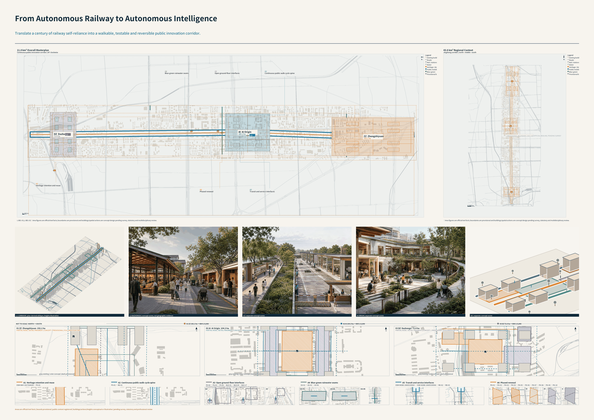
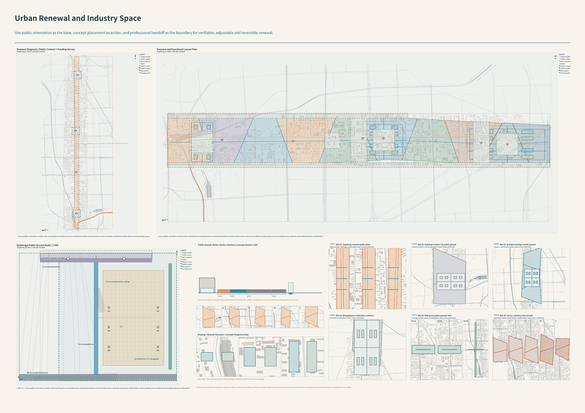
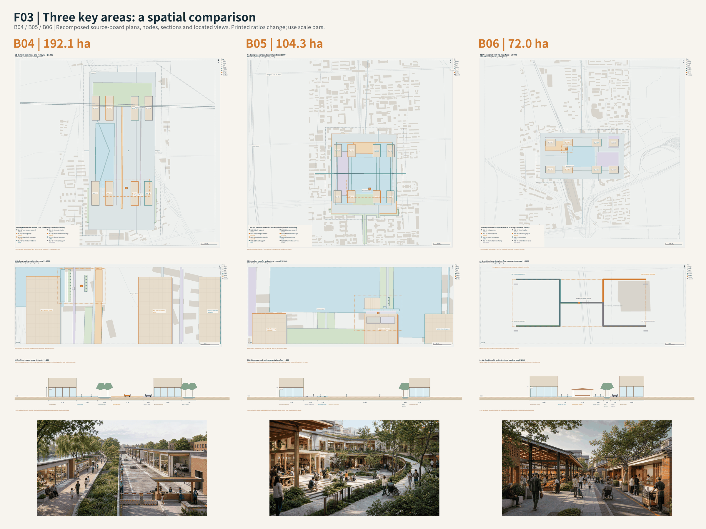
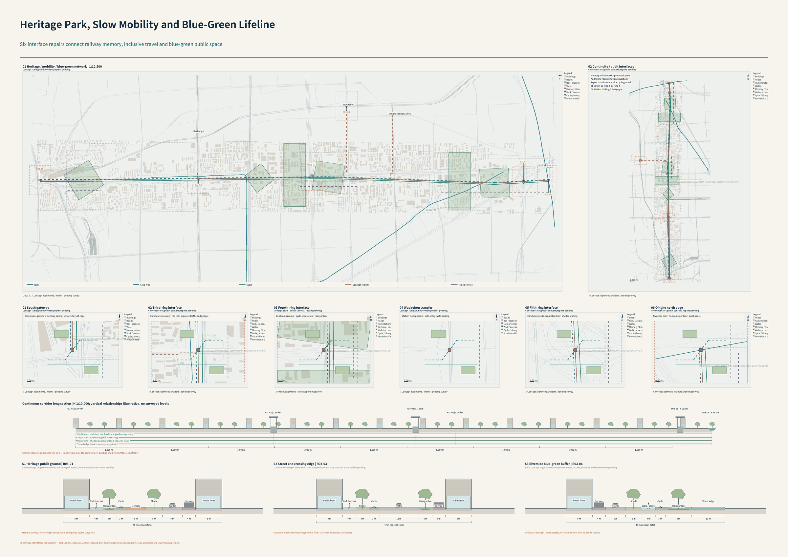
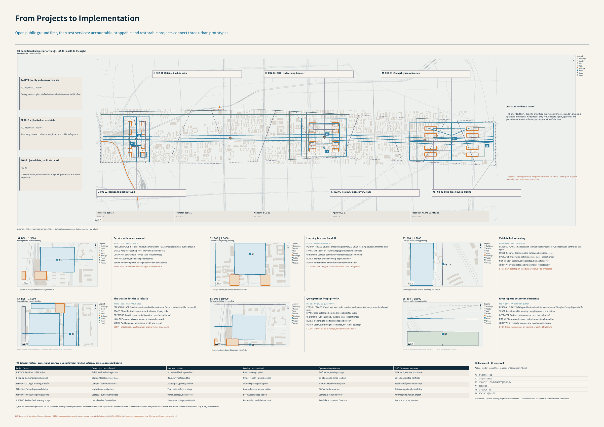

# Jingzhang Symbiotic City — An AI City That Grows with Ordinary People

> A century ago, the Jingzhang Railway enabled China to reach distant places through its own strength. Today, the Jingzhang AI Innovation Belt should enable every ordinary person's idea to reach reality.

This report follows the official thirteen-section structure and has completed the v1.0 machine assembly of eight resident capabilities and 0+13: 96 service chains, 48 stable bindings, 96 work packages, 192 runtime-metric slots, and 192 red lines now share one evidence structure. The five bilingual core figures translate that same structure into a human-readable explanation layer; they form the competition communication layer but do not prove deployment or a statutory result. Exact redlines, statutory controls, ownership, existing buildings, engineering alignments, precise key-area conditions, investment, and approvals remain unestablished. Rough site/key-area boundaries remain `provisional_constraint`; submitted generated layers use the official format's `design_proposal` value, still meaning low-confidence concepts rather than existing or approved projects. Both retain `official_boundary=false` and cannot support official redlines, exact statutory areas, or controls. `manifest.json` and `self_check.json` remain the only readable authorities for delivery completeness and formal-tool status. [source:FORMAL-GUIDE] [source:PROVISIONAL-BOUNDARIES] [source:OFFICIAL-SPATIAL-CONTRACT-V09]  (continued evidence) [source:CHECKPOINT-V10-ASSEMBLY]

## Design Basis and Source List

The primary bases are the official Haidian announcement, the official GitHub repository, the agent-facing taskbook, the formal submission guide, and the locked site package. [source:OFFICIAL-ANNOUNCEMENT] [source:AGENT-TASKBOOK] [source:FORMAL-GUIDE]

Spatial Master v0.9 previously reviewed `main` at commit `1684719d9868b0b4c2b45e3e96c939eeff9e733c`; v1.0 then froze the current official contract at `ad05ae25a80b4097b04e9d9d68281b0d8906e1b8`. The operative design brief, allowed design space, and Agent taskbook blobs remain unchanged from the prior observation. That finding locks the format/tool contract only and adds no official boundary or professional data. [source:SITE-PACKAGE] [source:OFFICIAL-SPATIAL-CONTRACT-V09]

Sources are separated by permitted use. Official tasks support requirement judgments; official provisional geometry supports generation, discussion, and entry-level checking only; Beijing and Haidian public policies provide context; resident experience supports need hypotheses but not statutory spatial conclusions. Capability Seven also uses current copyright, personal-information, synthetic-content labeling, Beijing experimental data-IP, and Supreme People's Court public materials to define design limits, never to declare that a particular personal object is legally titled. [source:COPYRIGHT-LAW] [source:PIPL] [source:AI-CONTENT-LABELING-2025]  (continued evidence) [source:BEIJING-DATA-IP-2026]

Capability Eight uses the following authorities only as design interfaces and retains each source's nature and limitation. These current laws, administrative regulation, Beijing normative document, current departmental rules, synthetic-content regulatory norm, government legal-text republications, and approved plan are not at the same legal level; citation of none automatically creates a permit for this project or government endorsement, and applicability remains item specific. The Ecological Environment Code is current law whose effective date is 2026-08-15 and supports ecological zoning, EIA, energy-review, and climate interfaces; older environmental laws repealed by the Code must not continue as the current primary authority, and the Code does not determine this project's EIA category, energy-review result, carbon quota, ecological attainment, or approval. The revised Cybersecurity Law supports classified-protection, logging, incident, and AI-risk interfaces, but the fixed page is the amendment decision, not a consolidated current-law full text; it cannot determine a protection level, critical-information-infrastructure status, log period, or regulatory outcome. The government republication of the Emergency Response Law supports prevention, plans, monitoring and warning, information release, response and rescue, and recovery and reconstruction interfaces but does not replace item-specific legal review or grant an Agent warning/command authority. The administrative regulation on major administrative decisions supports public participation, expert review, risk assessment, legality review, and collective deliberation, but catalogue entry, procedures, and timing require item-by-item decisions. Beijing's current normative public-data measure supports municipal coordination, operator selection, raw-public-data secure domains, product/service review, and lawful personal-information handling, but a project or district team cannot declare itself an authorized public-data operator, and de-identification is not automatically anonymization. [source:ECOLOGICAL-ENVIRONMENT-CODE-2026] [source:CYBERSECURITY-LAW-2026] [source:EMERGENCY-RESPONSE-LAW-2024]  (continued evidence) [source:MAJOR-ADMIN-DECISION-2019] [source:BEIJING-PUBLIC-DATA-2026]

The current departmental face-recognition rule adds necessity, conspicuous notice, a non-face alternative, impact assessment, and applicable filing gates for specific necessary activities; public safety does not authorize routine commercial profiling, forced facial recognition, or cross-context reuse. The official synthetic-content regulatory text supplies explicit, implicit, and user-declaration labeling interfaces for publicly distributed AI-generated or synthetic content; applicability requires item-by-item judgment by content, actor, and dissemination activity, while labels, filings, and technical standards are not government endorsement, safety certification, or project permission. When public-facing AI forms sustained emotional interaction, the current anthropomorphic-interaction departmental rule supports AI-identity notice, easy exit, risk intervention, and protections for minors and older people plus applicable assessment and filing interfaces; applicability to ordinary knowledge Q&A and work assistants remains assessed item by item by product form, audience, and function. The republication of the Accessibility Law supports facility, information, service, terminal, and necessary human-service interfaces, but proves no terminal/site acceptance and does not allow one app to replace continuous accessible service. The approved resilience spatial plan published by the Beijing Municipal Commission of Planning and Natural Resources supplies design direction for three rings/eight corridors, 39 groups, resilience living circles, lifelines, and digital twins; it does not replace project initiation, controls, EIA, energy, safety, or engineering approvals, or prove the Jingzhang axis is an official eight-corridor segment. [source:FACE-RECOGNITION-2025] [source:AI-CONTENT-LABELING-2025] [source:AI-ANTHROPOMORPHIC-2026]  (continued evidence) [source:ACCESSIBILITY-LAW-2023] [source:BEIJING-RESILIENCE-PLAN-2024]

`CHECKPOINT-V08` is participant design evidence for the complete Capability Eight concept specification—twelve chains, six cards, twenty-four runtime definitions, twelve packages, and twenty-four redlines—not evidence of deployment, legal review, approval, or implementation readiness. [source:CHECKPOINT-V08]

The machine index is in `sources.json`, while gaps and replacement paths are in `assumptions.json`.

The principal blockers are the precise three-level boundaries, three key-area polygons, regulatory controls, roads, rail, water, heritage, utilities, existing buildings, and ownership data expected in qualification or formal task attachments. The proposal will not draw locked constraints on its own. An explained empty layer is preferable to a fabricated “complete” map.

## Three-Level Scope Framework

The official task establishes three linked levels: an approximately 43.6 km² coordinated research area for industry and future-city research; an approximately 11.4 km² overall design area for urban renewal and regulatory-plan-level urban design; and approximately 368.4 hectares of key areas for detailed design. They are one evidence chain from strategy to overall network to implementation, not three unrelated schemes. [source:OFFICIAL-ANNOUNCEMENT] [standard:PROJECT-OFFICIAL-ANNOUNCEMENT]

The repository supplies rough features `PROV-RESEARCH-001`, `PROV-SITE-001`, `PROV-KEY-SCOPE-001`, and three `PROV-KEY-*` features. Spatial Master v0.9 uses only the rough overall-design feature in `site_boundary.geojson`, whose model area is 11,412,825.385553982 square metres, and the three rough key areas in `key_areas.geojson`; the other scope features remain in the source snapshot. Every boundary retains `official_boundary=false`, and the area is a model-internal recalculation only. [data:geometry/site_boundary.geojson#PROV-SITE-001] [metric:site_area_sqm] [depth:three_level_scope_framework]

When official polygons arrive, all boundaries and generated layers must be replaced and rebuilt, and all areas and ratios must be recalculated in EPSG:4548. The three key areas remain `PROV-KEY-001` through 003, including the unresolved Dazhongsi location risk; no “exact proportion” or “compliant area” is reported before official replacement. [data:geometry/key_areas.geojson#PROV-KEY-001] [source:OFFICIAL-SPATIAL-CONTRACT-V09]

Capability Eight adds candidate interfaces only: the coordinated-research level links city-scale risk, ecology, lifelines, accountability evidence, and data controls; the overall-design level links district, subdistrict, and community interfaces; the key-area level links buildings, facility edges, and human service points. Until D3/D4 evidence, accountable actors, and applicable procedures exist, the design will not draw official corridors, 39 groups, control lines, facilities, evacuation routes, or vulnerable-population geometry, or treat an interface as an approved boundary. [source:CHECKPOINT-V08]

## Coordinated Research Area: Industry and Future City Research

The central proposition is “Jingzhang Symbiotic City”: people are the protagonists; Agents are service providers, connectors, and capability amplifiers. The thematic weighting remains 60% ordinary people turning ideas into reality with Agents, 30% Zhan Tianyou’s spirit of self-reliance and engineering verification, and 10% warmth and dignity. That spirit enters every system through autonomy, surveying, problem solving, verification, connection, and maintenance—not through a single portrait. [source:AGENT-TASKBOOK] [source:CHECKPOINT-V05]

People are the protagonists of the city; Agents make each person’s presence more consequential. Capability Eight is not a standalone application: resident co-governance, rule-of-law and algorithm accountability, public safety and urban resilience, and ecological stewardship form a citywide control layer that constrains how the first seven capabilities express, decide, execute, remedy, and recover. Beijing's resilience plan supplies capital-city design direction only; it does not prove that Jingzhang is an official eight-corridor segment, an initiated project, or an approved intervention. [source:BEIJING-RESILIENCE-PLAN-2024]

The organizing concept is “Three Areas, Two Wings, Six Connected Flows.” The three areas support autonomous innovation acceleration, the AI Origin Community, and intelligent-industry clustering. The Zhongguancun Technology Services Wing supplies professional, legal, standards, open-source, and commercialization capacity. The Xiaoyuehe Scenario Empowerment Wing supports low-disturbance, reversible, reviewable public experiences. The six flows connect innovation, daily life, learning, health, culture, and ecology without pretending that six unverified physical corridors already exist.

Future urban form combines three layers: the Jingzhang Heritage Park as a historical and public-space spine; the Qinghe and Xiaoyuehe waterways as blue-green and resilience interfaces; and a network of rail stations, slow mobility, communities, and industry nodes. A one-door dual-Agent system connects eight resident capabilities, while the internal 0+13 matrix translates needs into transport, land use, space, ecology, education, healthcare, industry, culture, data, governance, community, implicit spatial order, and risk design.

Capability Six defines industry as a Human Capability Cycle plus a City Industrial-Capability Cycle, not a company roster. A person moves from expressing intent through user-controlled evidence, learning/practice, employment/team formation/entrepreneurship, and real delivery to pay, attribution, or dignified exit. The city uses anonymous aggregate needs to improve directories for opportunities, enterprise services, compute, data, models, tools, evaluation, safety, scenarios, professional support, and markets. Public capacity may be scheduled by disclosed rules, but citywide efficiency never justifies access to unrelated personal or enterprise secrets. [source:CHECKPOINT-V06]

Twelve industrial service chains cover opportunity/evidence, learning-to-work, fair hiring, neighborhood livelihoods, one-door entrepreneurship, enterprise lifecycle service, research/open-source transfer, shared AI full stack, scenario testing, finance/procurement/markets, innovation community, and resilient exit. Beijing and Haidian AI, Agent, enterprise-service, and business-environment policies provide context for this structure; they are not approved Jingzhang projects, funding, or targets. [source:BEIJING-AGENT-MEASURES-2026] [source:BEIJING-ENTERPRISE-SERVICES-2025]

Capability Seven adds a Personal Creativity and Contribution Rights System beside that industrial action chain. “Real-person asset” is a plain-language internal design concept, not a new legal asset category. Its three layers are: a private vault that is neither public nor trainable by default; a licensed-use ledger that specifies object, version, actor, purpose, action, duration, attribution, return, and exit; and an opt-in civic-contribution ledger that records project-specific contribution, response, and return without producing an overall personal contribution score. Ideas can therefore remain protected first and enter collaboration, civic improvement, or industry only when the person chooses. [source:CHECKPOINT-V07]

## Overall Design Area: Urban Renewal and Regulatory-Plan-Level Urban Design

The current spatial judgment is “One Spine, Two Waters, Three Areas, Two Wings, and Six Seam Types.” Jingzhang Heritage Park is the cultural/public-space spine; Qinghe and Xiaoyuehe are blue-green climate interfaces; the three areas take differentiated roles; the two wings provide professional and scenario support; and railways, ring roads, waterways, station edges, campus/park edges, and community/public-service entrances are six categories requiring verification. They are problem types, not six approved construction sites. [source:OFFICIAL-ANNOUNCEMENT] [source:CHECKPOINT-V05] [standard:MOHURD-URBAN-DESIGN-MEASURES]

Urban renewal retains the complete system rather than a reduced set of pilots. Phasing expresses dependencies: first establish sources, rules, responsibility, safety, and non-AI access; then connect existing services and real status; then form spatial projects from official surveys and controls; and finally test them across users, times, weather, and failure conditions. Any intervention involving roads, bridges, tunnels, buildings, utilities, or ownership remains a professional study direction.

Rights infrastructure is not a centralized data center. Individuals and households hold private objects; communities and libraries provide human and accessible access; campuses and parks support collaboration, reproduction, and professional services; and the Three Areas–Two Wings connect display, licensing, procurement, and controlled validation. City Agent C maintains only necessary directories, permission routing, and civic-contribution status rather than reading every resident's private draft or workflow.

Spatial Master v0.9 translates One Spine, Two Waters, Three Areas, Two Wings, and Six Seam Types into one-source concept geometry: 10 concept land-use cells, 12 concept design cells, 24 concept building footprints, 12 concept connection lines, 8 green-space polygons, 19 public-space features, and 10 dependency-phase cells; `constraints` remains empty. Every feature carries capabilities, 0+13 units, official chapters, AR items, scenarios, professional gates, non-AI alternatives, and failure/exit rules. [depth:overall_spatial_structure] [data:geometry/land_use.geojson#LU-01] [data:geometry/roads.geojson#RD-01]

All participant-generated features remain low-confidence concepts (`confidence=low`). The submitted export uses the official enumeration `geometry_role=design_proposal`, without converting them into official or existing-condition evidence. [data:geometry/green_space.geojson#GS-01] [data:geometry/public_space.geojson#PS-01] Historical v0.9 used `source_mode=provisional_only` after two failed Overpass requests. [source:SPATIAL-CONTEXT-V09]

Professional-v2 separately registers 3,619 public OSM context features, including 1,894 building footprints, for orientation and urban-fabric reference only. They are not promoted to official survey data, and participant concepts are not relabelled as existing conditions. Any official input still triggers replacement and recalculation. [source:OSM-OVERPASS-PROFESSIONAL-V2] [source:OSM-OVERPASS-PROFESSIONAL-V2-BUILDINGS]

The current visual delivery contains seven A0 boards and a 26-page A3 booklet in each language, ten same-source core PNGs and four offline HTML pages. B01 covers the overall plan, B02 renewal, B03 heritage/mobility/blue-green, B04-B06 the three detailed areas, and B07 implementation/scenarios. The A3 appendices cover global cases, resident personas, scenarios and landmarks, industrial validation and annual operation. The 0+13 matrix supports projects, spaces and evidence rather than replacing urban-design drawings. Submission A0 files retain native 150 ppi dimensions with compression to meet the 40 MiB package limit; lossless masters remain in the mother package.

Capability Eight uses a lawful-authority/evidence base, six gates, and four states. The base minimizes event, authority or contract basis, accountable-human, automation, professional-review/recusal, data-scope/retention/access, reason, execution, complaint/remedy, and recovery evidence; it is not a resident data lake. G1 Authority, G2 Data, G3 Model, G4 Decision, G5 Execution, and G6 Emergency-Recovery gates stop work at authority, minimum-data, confidence/applicability, decision responsibility, execution prerequisites, and temporary-permission recovery boundaries. Daily, alert, emergency, and recovery states all retain human and statutory responsibility. Citywide infrastructure sensing does not mean citywide collection of residents. [source:BEIJING-RESILIENCE-PLAN-2024] [source:CHECKPOINT-V08]

Two five-level vocabularies stay distinct. The governance responsibility scale is individual/household—building/courtyard/facility—community/subdistrict—district/innovation belt—city/region. The capability service carrier is private household entry—community public node or facility edge—community/campus/park service node—Three Areas–Two Wings—Beijing, Jing-Jin-Ji, and external professional networks. Fixed spatial elements remain interfaces until D3/D4 data, accountable actors, and procedures exist.

## Detailed Design of Key Areas

The Zhongzhiyuan AI Autonomous Innovation Acceleration Area studies external access, the Qinghe edge, youth and talent housing, park-community sharing, full-stack AI research/validation, and industrial services. v0.9 places four concept design cells and eight concept building footprints inside its rough key area to test shared ground floors, public/test separation, a Qinghe resilience interface, and external links; they are not cadastral, existing, or approved projects. B04 develops the plan, public ground floor, section and street-view comparison; the submitted concept-building layer retains the related prototypes, including BLD-17. [data:geometry/key_areas.geojson#PROV-KEY-001] [data:geometry/buildings.geojson#BLD-17] [depth:three_key_area_detailed_design]

The Beijing AI Origin Community studies walking and cycling connections among campuses, parks, communities, and rail stations while supporting open-source release, commercialization, lifelong learning, adaptable housing, and ordinary-person co-creation. Four concept design cells, eight concept building footprints, a learning commons and a shared garden express campus-community-park continuity. Professional-v2 uses registered public Wudaokou and Qinghuadongluxikou points as orientation anchors; its 5/10/15-minute diagram is a walking budget on concept routes, not an approved TOD boundary or verified entrance catchment. B05 and concept-building prototype BLD-09 show the spatial organization; entrances and parcel actions still require official data. [data:geometry/key_areas.geojson#PROV-KEY-002] [data:geometry/buildings.geojson#BLD-09] [source:OSM-OVERPASS-PROFESSIONAL-V2]

The Dazhongsi AI Industry Cluster studies station-city integration, adaptive reuse, everyday vitality, intelligent consumption, international exchange and time-shared public space. Four concept design cells, eight concept building footprints and a station-city commons test shared ground floors, time-based mixing and walking seams. [data:geometry/key_areas.geojson#PROV-KEY-003]

Professional-v2 measures an approximately 2,193 m offset between the provisional area and public Dazhongsi station anchor. B06 therefore separates the provisional-area detail from a geolocated actual-station quadrant concept inset; it neither shifts the provisional area nor fabricates an approved walkway, bridge/tunnel, entrance or ownership action. [source:PROVISIONAL-BOUNDARIES] [source:OSM-OVERPASS-PROFESSIONAL-V2]

The industrial roles are differentiated rather than copied across three parks. Zhongzhiyuan conditionally supports full-stack adaptation, evaluation, safety, and engineering. The AI Origin Community supports open-source developers, learning-to-work, low-cost entrepreneurship, and transfer. Dazhongsi supports enterprise lifecycle service, AI-native commerce/consumption, and market connections. The Zhongguancun wing supplies legal, IP, tax, standards, safety, capital, and international professional support; the Xiaoyuehe wing provides low-disturbance, reversible, exit-ready validation. Every location remains conditional on official boundaries, existing conditions, and professional clearance. [source:CHECKPOINT-V06] [source:HAIDIAN-AI-STREET-2025]

Capability Seven adds a distinct rights interface: Zhongzhiyuan emphasizes workflow provenance, confidential compartments, and cross-stack reproduction; the AI Origin Community supports one-sentence ideas, open-source collaboration, learning works, and neighborhood co-creation; Dazhongsi supports licensing, commissions, procurement, display, and market connection; the Zhongguancun wing supplies IP, contract, data, tax, and dispute professionals; and the Xiaoyuehe wing accepts only consensual, low-disturbance, recoverable civic proposals and scenario validation. These are not five duplicate “creativity parks.” [source:CHECKPOINT-V07]

Capability Eight adds differentiated interfaces rather than locations. Zhongzhiyuan emphasizes R&D test safety, algorithm audit, and exit/recovery; the AI Origin Community emphasizes inclusive participation, campus-community continuity, and safeguards for minors; Dazhongsi emphasizes high footfall, station-city lifelines, commercial-system continuity, and public-space risk; the Zhongguancun wing supplies legal, fire, medical, cyber, algorithm, ecology, and independent-review professionals; the Xiaoyuehe wing emphasizes water ecology, low-disturbance validation, threshold stops, and decommissioning recovery. These are safety, ecology, continuity, and recovery interfaces—not parcels, capacities, projects, or approved boundaries. [source:CHECKPOINT-V08]

Each key area must ultimately provide a readable mini-scheme covering positioning, spatial structure, building renewal, transport, public space, AI scenarios, implementation dependencies, and risks, all consistent with one GeoJSON/metric/figure version.

## AI Innovation Ecosystem, Personas, and AI+ Scenarios

The one-door dual-Agent architecture is “A in front, C behind, B at the side.” The Personal Agent organizes intent, materials, and permissions. The City Agent uses public directories, connects authoritative systems, identifies cross-actor public problems, and performs aggregate coordination. Planning, healthcare, education, legal, transport, safety, and ecological professionals provide review, while lawful authorities retain approval, enforcement, rescue, and adjudication.

The seven loops are expression, translation, validation, matching, coordination, delivery, and learning. The five spatial levels are individual/household, building/courtyard, community, district, and innovation belt/city. Every core task offers Agent, web, telephone, counter, community, accessible, and human routes. Refusing AI, location access, or data sharing never removes basic service.

### v1.0 Actual Eight-Capability Delivery Snapshot

The machine assembly is not eight headings. `capabilities.json` now contains 8 capabilities, 96 service chains, 48 stable bindings, 96 work packages, 192 runtime-metric slots, and 192 red lines. The 48 bindings converge on 12 deduplicated `SC-FINAL-01..12` cards; the historical 30 candidate cards remain design provenance, not 30 deployed scenarios. `zero_plus_thirteen.json` connects Overall Thesis 0 and Units 1–13—14 units in total—to one capability, scenario, spatial, and evidence network. [source:CHECKPOINT-V10-ASSEMBLY] [capability:1] [capability:2] [capability:3] [capability:4] [capability:5] [capability:6] [capability:7] [capability:8]

The metric registry contains 212 definitions. Its 22 `known` records are limited to 18 design/structural counts and four low-confidence provisional model calculations; 190 remain `unknown`. The 192 capability runtime slots reference 188 unique runtime IDs, with `floor_area_ratio` and the historical `scenario_card_count` as two additional non-capability unknowns. No runtime metric is a deployed result, and no candidate-card count, specification-completeness claim, or model area substitutes for operating evidence. [metric:site_area_sqm] [metric:green_ratio] [metric:public_space_ratio]  (continued evidence) [metric:building_footprint_area_sqm]

#### Capability 1 | Identity and Public Services

This capability solves the gap between a resident's plain-language need and a service system that otherwise makes that person restart across names, identity checks, and agencies. A representative journey uses `IDN-01` for intent and minimum proof, `IDN-02` to keep one case across Agent, telephone, counter, community, and paper routes, and `IDN-12` for independent complaint, export, and withdrawal. It enters [scenario:SC-FINAL-01] and the community-intake, data, governance, remedy, and risk interfaces of [unit:0][unit:9][unit:10][unit:11][unit:12][unit:13]. [capability:1]

A structures only user-provided words, material, and itemized permission; C reads versioned public directories and routes state; B verifies identity, proxy, language, and accessibility; L or another accountable actor retains eligibility, registration, adverse decisions, and statutory remedy. The 12 chains and 6 bindings are known design counts; all 24 runtime slots remain `unknown`. Directory conflict or adverse effect stops automation and routes to a human, preserving failure explanation, correction, appeal, and exit without reducing basic service for refusing AI.

#### Capability 2 | Health and Care

This capability addresses unsafe expression of health/care needs, unclear caregiver authorization, and danger signals hidden inside routine advice. A representative journey uses `HLT-01` to preserve a person's account and stop advice on danger, `HLT-06` to separate the older person's voice, caregiver authority, and professional assessment, and `HLT-12` for record correction and withdrawal. It connects [scenario:SC-FINAL-02] and [scenario:SC-FINAL-08] across the home–community–professional-health and offline-continuity interfaces of [unit:0][unit:6][unit:9][unit:11][unit:13]. [capability:2]

A structures expression and care authorization only; C links disclosed service directories; B is a licensed clinical, rehabilitation, mental-health, or care professional; L retains public warning, emergency command, and rescue priority. A/C do not diagnose, make final triage decisions, or prescribe. The 12 chains and 6 bindings are known design counts; all 24 runtime slots remain `unknown`. Telephone, community health, counter, paper, and on-site emergency routes remain parallel; failure or authorization conflict triggers human review, correction, appeal, and complete exit.

#### Capability 3 | Education and Capability Growth

This capability addresses the break between learning goals, portfolios, reproducible practice, and real opportunities while protecting minors and work rights. `EDU-01` preserves the learner's own words, `EDU-07` moves a portfolio into a reversible, reproducible real challenge, and `EDU-12` keeps records, works, and Agent workflows portable; `EDU-09` connects a user-controlled portfolio to human-reviewed real opportunity. The primary interface is [scenario:SC-FINAL-03] across [unit:0][unit:5][unit:7][unit:9][unit:11][unit:13]. [capability:3]

A manages the person's goals, works, provenance, and licenses; C matches disclosed course/opportunity directories; B supplies educator, labor, IP, safety, and accessibility review; L or an accountable education body retains admission, evaluation, discipline, and credential decisions. The 12 chains and 6 bindings are known design counts; all 24 runtime slots remain `unknown`. School counters, mentors, libraries, paper, and offline learning remain parallel; failure preserves reasons, correction, appeal, and exit. `EDU-SC-06 -> SC-FINAL-08` is a secondary education continuity/offline-service interface only; the final card's primary capabilities remain 2, 5, and 8, so its emergency meaning is not rewritten. [scenario:SC-FINAL-08]

#### Capability 4 | Housing and Community

This capability addresses housing navigation, moving, repair, accessibility, and renewal being split into fragments with no accountable closure. `HOU-01` provides sourced paths rather than invented available housing, `HOU-05` routes repair to property, utility, or professional actors and tracks recurrence, and `HOU-12` lets affected residents compare renewal options. Completion is not an auto-closed ticket: a resident or actual user must accept the on-site repair/retest. It enters [scenario:SC-FINAL-04], [scenario:SC-FINAL-11], and [unit:0][unit:2][unit:3][unit:6][unit:10][unit:11][unit:13]. [capability:4]

A structures resident choices and evidence; C routes and displays authoritative state only; B provides property, structural, fire, accessibility, operations, and legal verification; L retains eligibility, ownership, enforcement, and emergency decisions. The 12 chains and 6 bindings are known design counts; all 24 runtime slots remain `unknown`. Property desks, community stations, telephone, paper, and on-site meetings remain parallel; failure or dispute blocks automatic closure and preserves correction, independent appeal, material withdrawal, and exit.

#### Capability 5 | Mobility and Public Space

This capability addresses routes that look reachable in data while the real entrance or last 800 metres fail. `MOB-01` assembles whole-journey primary/fallback options, `MOB-02` requires verified entrances, transfers, and last-800-metre continuity, and `MOB-12` brings incidents, crowding, maintenance, and recurrence into one responsibility chain. It connects [scenario:SC-FINAL-05], [scenario:SC-FINAL-08], and the street, commons, blue-green, and continuity interfaces of [unit:0][unit:1][unit:3][unit:4][unit:11][unit:13]. [capability:5]

A holds trip-specific intent only; C combines verifiable public state and routes breakpoints; B supplies transport, accessibility, engineering, and on-site operations review; L retains traffic control, enforcement, construction, liability, and rescue decisions. The 12 chains and 6 bindings are known design counts; all 24 runtime slots remain `unknown`. Telephone, staffed stations, paper routes, on-site guidance, and manual control remain parallel; failure means safe stop, correction, appeal, return, or exit. The structured `authority_contract` and `fact_status_contract` keep entrances, alignments, capacities, safety, and deployment unknown until all evidence gates are met.

#### Capability 6 | Employment, Entrepreneurship and Industry

This capability addresses portfolios that cannot reach real work, small businesses repeating service requests, and industry tests presenting demos as outcomes. `IND-01` connects person-controlled evidence to sourced opportunities, `IND-06` provides one-case enterprise life-cycle service, and `IND-09` keeps digital full-stack, embodied/robot, and high-impact public/SME tasks as three non-collapsible test types. It enters [scenario:SC-FINAL-06], [scenario:SC-FINAL-10], and the Three Areas–Two Wings, industry, data, and risk interfaces of [unit:0][unit:2][unit:3][unit:7][unit:9][unit:13]. [capability:6]

A structures user/enterprise-selected materials; C maintains public directories, fair queues, and state; B supplies labor, contract, IP, tax, data-safety, and industry-engineering review; L or another accountable actor retains hiring/firing, license, investment, procurement, test authorization, and dispute decisions. The 12 chains and 6 bindings are known design counts; all 24 runtime slots remain `unknown`. Hotlines, enterprise counters, paper plans, professional meetings, on-site verification, and physical stops remain parallel; failure and negative tests are retained, with correction, appeal, dignified exit, and restart.

#### Capability 7 | Creativity, Ideas, and Real-Person Assets

This capability addresses ordinary people's ideas losing control before they choose disclosure, licensing, or training. `CRE-01` preserves original words beside an editable summary with private default, `CRE-06` separates copy, modification, training, publication, and commercial-use permissions, and `CRE-12` distinguishes correction, future-use withdrawal, controllable-copy deletion, lawful retention, and dispute. It connects [scenario:SC-FINAL-07], [scenario:SC-FINAL-11], and [unit:0][unit:8][unit:9][unit:10][unit:11][unit:13]. [capability:7]

A is the person's version/permission steward; C only verifies requesters and routes licensing/civic response; B supplies IP, contract, privacy, labor, and tax review; L retains adjudication and statutory remedy. “Real-person asset” is not automatic title. The 12 chains and 6 bindings are known design counts; all 24 runtime slots remain `unknown`. Local files, paper deposit, human contracts, and on-site witnessing remain parallel; failure or unauthorized use pauses the flow and preserves correction, appeal, attribution withdrawal, export, and complete exit.

#### Capability 8 | Co-Governance, Rule of Law, Safety, and Ecology

This capability addresses faster cross-actor coordination producing unowned authority, emergency action, or ecological responsibility. `GOV-01` routes an issue to a real accountable actor, `GOV-06` registers and retires high-risk Agents/algorithms, and `GOV-12` links ecological baseline, threshold, stop, restoration, decommissioning, and retest. It connects [scenario:SC-FINAL-01], [scenario:SC-FINAL-08], [scenario:SC-FINAL-12], and [unit:0][unit:4][unit:9][unit:10][unit:13]. [capability:8]

A supports expression and remedy; C maintains responsibility directories, routing, state, and audit only; B performs planning, fire, health, cyber, safety, water, and ecological field review; L always retains approval, enforcement, warning, command, evacuation, rescue priority, adjudication, and high-risk restart, and is not a fourth Agent. The 12 chains and 6 bindings are known design counts; all 24 runtime slots remain `unknown`. Telephone, counter, paper responsibility ledgers, broadcast, backup radio, human patrol, and on-site response remain parallel; failure invokes safe stop, human takeover, correction, appeal, recovery reconciliation, and exit.

### Naming and Logo Text Specification

**LOGO-CONCEPT-01 | Jingzhang twin rail arcs, an ordinary-person node, and a symbiotic connection ring.** The fixed Chinese name is “京张共生体” and the fixed English name is “Jingzhang Symbiotic City.” Two open rail arcs connect century-old engineering with future work; a person node that is neither enclosed nor scored states that people remain the city's protagonists; a ring that can disconnect and reconnect represents authorized and revocable relations among residents, the city, professionals, and lawful authorities. The mark must not use government emblems, the organizer's logo, a surveillance eye, an omniscient brain, or a data web enclosing residents. Color, proportions, type, and final rights clearance belong to the visual phase.

### Six Global Cases and Their Translation Boundaries

**CASE-01 | Barcelona Decidim and participatory 22@ renewal.** Industrial renewal and public-space change cannot be decided only inside development and technology organizations. Decidim connects online proposals, debate, support, face-to-face meetings, and progress tracking through reusable open-source participation infrastructure. Jingzhang can translate this into C maintaining public issues, responsibilities, and state, with paper/community meetings and digital routes sharing one case number. It cannot copy local planning, property, or political procedures or treat online counts as representation. Destination: AI Origin Community, Dazhongsi renewal, and `SC-FINAL-11`. [source:CASE-BARCELONA-DECIDIM]

**CASE-02 | Helsinki Smart Kalasatama agile district.** A smart-city program can begin with a grand system without proving whether daily life improves. City officials, firms, residents, and researchers tested small solutions in a real district; “one more hour a day” returned value to resident time. Jingzhang can translate reversible low-disturbance pilots, stop conditions, and resident time/task evidence. It cannot turn a successful pilot directly into permanent deployment or use visitor interest as outcome evidence. Destination: Xiaoyuehe Scenario Wing, `SC-FINAL-09`, and `SC-FINAL-12`. [source:CASE-HELSINKI-KALASATAMA]

**CASE-03 | Singapore Punggol Digital District.** Industry, a university, community life, and district operations are often built as separate systems. Punggol combines an adjacent university/business district, an Open Digital Platform, and digital-twin testing. Jingzhang can translate interface-based infrastructure, segregated test environments, simulation before physical operation, and industry–education collaboration. It cannot copy centralized collection, boundaryless real-time data, or biometric access; every call still needs necessity, authorization, and an accountable actor. Destination: Zhongzhiyuan verification, AI Origin learning-to-work, `SC-FINAL-06`, and `SC-FINAL-10`. [source:CASE-SINGAPORE-PDD]

**CASE-04 | Seoul Digital Media City.** Digital-content and information-industry concentration requires more than buildings: infrastructure, eligible activities, public support, and ongoing responsibilities must be defined. Seoul uses a municipal ordinance to define the district, core industries, and support functions. Jingzhang can translate the simultaneous design of spatial carriers, responsibility catalogues, and operating rules, plus a Dazhongsi mix of digital content, AI-native consumption, and enterprise service. It cannot copy Seoul's industry list, land development, incentives, or government commitments. Destination: Dazhongsi and `SC-FINAL-06`. [source:CASE-SEOUL-DMC]

**CASE-05 | Paris-Saclay open innovation ecosystem.** Universities, laboratories, firms, start-ups, and urban life remain islands unless resource density is actively connected. Paris-Saclay combines an urban campus, innovation-place network, research–industry links, public transport, and natural/agricultural protection. Jingzhang can translate a Zhongguancun B-side network, Zhongzhiyuan engineering verification, and a shared venue catalogue while treating water, ecology, and quality of life as constraints. It cannot copy a large greenfield district, airport access, investment scale, or development conditions. Destination: Zhongzhiyuan and the Zhongguancun Professional-Service Wing. [source:CASE-PARIS-SACLAY]

**CASE-06 | Toronto Quayside digital-governance lesson.** A technology partner's urban-data and spatial proposal can conflict with public authority, privacy, project scope, and democratic accountability. Waterfront Toronto created an independent Digital Strategy Advisory Panel; after withdrawal, the lasting lesson was that governments must remain central and digital innovation must meet democratic-accountability standards. Jingzhang can translate authority/data/model gates and independent review before technology enters public space. It cannot copy an “urban data” construct, allow a vendor to replace government, or reduce the withdrawal to one privacy cause. Destination: Capability Eight, `SC-FINAL-10`, and `SC-FINAL-11`. [source:CASE-TORONTO-QUAYSIDE]

### Six Testable Personas

**PERSONA-01 | Older resident with limited digital confidence.** Goal: complete service, complaint, and care tasks without complex AI. Barriers: jargon, codes, handoffs, and hearing/vision change. Non-AI: phone, counter, community, paper, lawful proxy. Only task materials are processed; no permanent capability score. Success: one case, understandable state, human takeover. Worst failure: algorithmic denial with no accountable person. Scenarios: `SC-FINAL-01/02/08`.

**PERSONA-02 | Disabled user and chosen carer.** Goal: complete journeys, services, and participation independently or with chosen help. Barriers: broken accessible routes, single-format information, and systems overriding the person. Non-AI: accessible phone, staffed service, paper/large print/sign language, lawful proxy. Support needs are minimal and revocable. Success is equivalent outcome, not merely a channel. Worst failure: the system reports access while the physical route fails. Scenarios: `SC-FINAL-05/09/10`.

**PERSONA-03 | Young student or researcher.** Goal: connect learning, research, and ideas to verification, collaboration, and opportunity. Barriers: fragmented resources, unclear provenance, and minor/campus boundaries. Non-AI: teachers, school counters, libraries, physical labs. Work is private by default and distinguishes human, third-party, and AI contributions. Success: explainable matching, portable work, and failure feedback. Worst failure: permanent labeling or unauthorized training. Scenarios: `SC-FINAL-03/07`.

**PERSONA-04 | Service worker or small-shop operator.** Goal: use one sentence to find real administrative, procurement, workforce, and operating help. Barriers: repeat forms, false opportunities, and limited time. Non-AI: enterprise counter, chamber/community service, accountable advisor. Secrets and labor data are segregated; no enterprise/talent total score. Success: accurate first routing, fewer repeat materials, recoverable exit. Worst failure: an Agent makes a final hiring, finance, license, or procurement decision. Scenarios: `SC-FINAL-04/06/11`.

**PERSONA-05 | Developer or start-up member.** Goal: test, reproduce, comply, and reach markets on a sovereign replaceable stack. Barriers: compute/tool lock-in, unclear test-site responsibility, and compliance cost. Non-AI: professional panel, paper test plan, human acceptance. Code, models, data, and secrets are segregated. Success: cross-stack reproduction, complete gates, retained negative results. Worst failure: a demo skips into human/physical operation. Scenarios: `SC-FINAL-06/07/10`.

**PERSONA-06 | Community worker coordinating accountable handoffs.** Goal: route issues to the true responsible body and explain waiting, conflict, and closure. Barriers: changing catalogues, multi-department handoffs, offline records, and inconsistent emergency information. Non-AI: duty phone, paper ledger, on-site meeting, human command. Only duty-necessary information is used with source/version. Success: closed handoffs, retained minority opinions, and reconciled offline recovery. Worst failure is misattributed responsibility; C cannot approve and cannot exercise emergency command. Scenarios: `SC-FINAL-01/08/11/12`.

### Twelve Deduplicated Final Scenario Cards

These cards replace the claim that thirty candidates equal thirty completed scenarios. They are acceptance interfaces for later space, metrics, and figures—not deployed events.

**SC-FINAL-01 | Paper complaint routing and remedy.** Personas `PERSONA-01/06`; community–subdistrict. A transcribes after confirmation; C checks the public responsibility catalogue and preserves the original; B verifies accessibility/professional facts; L accepts, decides, and remedies. Paper, phone, counter, and Agent share one case ID. Metrics: first-route accuracy, due response, remedy closure. Misrouting cannot auto-close; human correction, appeal, and deletion of unnecessary copies remain. Later: service nodes, responsibility map, metrics figure.

**SC-FINAL-02 | Health/care navigation with human escalation.** Personas `PERSONA-01/02`; home–community–health network. A structures the account but never diagnoses; C links public directories; medical B reviews; emergency rescue/lawful decisions remain with L. Phone, clinician, counter, and emergency routes remain parallel. Health data is granular and shortest-retained. Metrics: referral completion, takeover, non-AI equivalence. Uncertainty/danger stops advice and escalates. Later: service nodes and emergency interfaces.

**SC-FINAL-03 | Learning to real opportunity with minor safeguards.** Persona `PERSONA-03`; campus–community–park. A manages work/authorization; C matches public courses/opportunities; education, labor, and IP B review; admission, discipline, and permissions remain with L. School counter, teacher, and offline activities remain. Minor data/work is private by default. Metrics: explanation, conversion, portability. No permanent capability score; preserve reasons, correction, and exit. Later: AI Origin learning nodes and scenario map.

**SC-FINAL-04 | Housing/community repair co-governance.** Personas `PERSONA-01/04/06`; building–community. A organizes evidence/choices; C routes property, subdistrict, and professionals; building/fire/legal B inspect; L retains administrative decisions. Phone, duty room, paper, and on-site meeting remain. No resident credit score. Metrics: site verification, state accuracy, restoration closure. Structural/fire risk escalates; disputes retain appeal. Later: buildings, constraints, phasing.

**SC-FINAL-05 | Continuous accessible station-city journey.** Persona `PERSONA-02`; station–street–public space–destination. A holds chosen preferences; C combines authoritative states; transport/access B verifies on site; restriction/rescue remains with L. Phone, staffed enquiry, paper route, and Agent are parallel. Location is used only when necessary. Metrics: end-to-end completion, breakpoints, takeover. Site evidence overrides stale data for safety and records the breakpoint. Later: roads/public_space and mobility figure.

**SC-FINAL-06 | Idea to first verified paid task.** Personas `PERSONA-04/05`; person–park–Three Areas/Two Wings. A manages materials/quote permissions; C matches public opportunities/B services; contract, labor, tax, IP, and safety B review; procurement, license, finance, and disputes remain with accountable actors. Enterprise counter, professional meeting, and roadshow remain. Secrets are segregated. Metrics: first routing, first paid task, exit recovery. Ban false opportunities and final Agent decisions. Later: industry nodes, project list, land-use figure.

**SC-FINAL-07 | Private idea preservation and granular licensing.** Personas `PERSONA-03/05`; private space–trusted meeting–public display. A preserves original words, versions, and permissions; C verifies requester/routes only; IP/contract/privacy B review; adjudication/remedy remains with L. Paper deposit, witnessed meeting, and human contract remain. Distinguish person/third-party/AI contribution. Metrics: provenance, permission fields, receipts, revocation. Deposit is not title; no unauthorized training/publication. Later: display nodes, copyright statement, evidence-chain figure.

**SC-FINAL-08 | Extreme rain, outages, and lifeline continuity.** All personas; city–district–community–facility. A shows personal needs/offline guidance; C only relays authorized information/synchronizes state; fire/water/medical/communications B verify; warning, command, evacuation, and rescue priority remain with L. Broadcast, phone, community, paper, backup radio, and messengers remain. Emergency minimum data expires. Metrics: accessible reach, continuity, takeover, reconciliation. Conflicts escalate to L; digital recovery never overwrites paper. Later: constraints, phasing, resilience figure.

**SC-FINAL-09 | Blind-route issue to spatial correction.** Personas `PERSONA-02/06`; street–station–public space. A submits photo, oral account, or paper as chosen; C routes the responsible actor and shows state; transport/access/engineering B inspect; construction/enforcement decisions remain with L. Landmark reports work without precise location. Metrics: verification, reasons, repair, retest. Image models supply clues only; remove unrelated faces and allow correction. Later: roads/public_space/key-areas.

**SC-FINAL-10 | Public-space robot near miss, stop, and review.** Personas `PERSONA-02/04/05`; controlled test site–public edge. A narrow interlock may stop only under all six conditions; A helps affected persons report; C freezes/routes event state; safety/engineering/medical/legal B verify; closure, rescue, liability, and restart remain with L. Physical stop/human response take priority. Metrics: stop, takeover, notice, revalidation. No-injury cannot erase a near miss; no restart before review. Later: test nodes, constraints, risk figure.

**SC-FINAL-11 | Contested shared-space design with minority-opinion retention.** Personas `PERSONA-01/04/06`; community–key-area public space. A helps people understand/submit; C groups issues without erasing minority views; planning/transport/access/operations B assess; procedure/decision remains with L. Meeting, paper, noticeboard, phone, and Agent are parallel. Confirm attribution before publication. Metrics: participation access, minority response, reasons, commitments. Majority count cannot bypass rights/safety; retain review/appeal. Later: public_space, key_areas, A0 issue board.

**SC-FINAL-12 | River ecological anomaly verification and long-term feedback.** Persona `PERSONA-06` and nearby residents; Qinghe/Xiaoyuehe–community–professional network. A stores observations as chosen; C clusters clues/routes; ecology/water B samples on site; enforcement, warning, and works remain with L. Phone, patrol, paper, and on-site reports remain. Minimize location and remove unrelated faces. Metrics: verification, threshold action, maintenance feedback, long-term retest. Models never replace monitoring; good-faith false reports are not punished; no closure without restoration evidence. Later: green_space, constraints, ecology figure.

Personas cover at least ordinary residents unfamiliar with complex AI; students and early-career youth; older people, children, disabled people, and caregivers; developers, researchers, and startup teams; employees, service workers, and professionals; community and city operators; and domestic/international visitors. Personas guide design and never become permanent individual labels.

### Three Industrial Test Cards: Reproducible Tasks to Controlled Delivery

The eighteen candidate cards from v0.4–v0.6 retain their provenance role. The three cards below expand Capability Six's existing industrial test subjects into executable validation subcards of `SC-FINAL-06` and `SC-FINAL-10`. They do not change the count of twelve deduplicated formal cards or count as additional deployments or completed experiments. Each uses four gates: offline/simulation, isolated or closed, controlled human/physical, and limited operation. Moving forward requires site rights, an accountable operator, applicable professional/statutory conditions, lawful inputs, human takeover, and withdrawal/restoration arrangements. Locations, targets, and responsibilities below are concept recommendations; baselines, threshold confirmation, results, and operating performance remain unmeasured. [source:CHECKPOINT-V06] [source:HAIDIAN-SUPER-TESTFIELD-2026]

**IND-TEST-01 | Autonomous full-stack Agent toolchain reproduction and migration.**

- **Place and people:** The conceptual controlled-test back-of-house at Zhongzhiyuan B04; only rights-cleared results reach the public gallery. Researchers, developers, and startup teams in `PERSONA-03/05`, linked to `SC-FINAL-06`.
- **Test object and inputs:** Replaceable models, tool interfaces, permissions, and delivery chains. Inputs are version-locked code/configuration, licensed or synthetic examples, a sealed task set, a human baseline, and fault cases; unauthorized production systems stay disconnected.
- **Acceptance targets:** The same version and input can be replayed, while interface substitution retains explainable outputs and migration records. Permission refusal, tool failure, and uncertain output must support human takeover. Record task completion, reproduction consistency, unauthorized requests, takeover, and exit recovery item by item. Professional reviewers lock thresholds before testing; no achieved performance is claimed here.
- **Responsible roles:** A candidate park-test operator owns site control and records; the research team owns versions and evidence; data, cybersecurity, AI-safety, and industry professionals independently review. Procurement, permits, and disputes remain with accountable actors or L.
- **Stop and non-AI alternative:** Unclear input rights, unreproducible results, unauthorized calls, or loss of rollback stops the round. Isolate credentials and retain necessary logs; use offline manual operation, a paper test sheet, and professional acceptance. A successful demo is not admission to operation. [source:CHECKPOINT-V06]

**IND-TEST-02 | Embodied-intelligence/robot tasks in a closed test space.**

- **Place and people:** Zhongzhiyuan B04's conceptual test back-of-house and public/test boundary, deepening `SC-FINAL-10`. Accessibility, safety, and work needs of `PERSONA-02/04/05` are acceptance conditions; public paths are not default test sites.
- **Test object and inputs:** Point-to-point transport, obstacle response, handover, and return in a verified closed site. Inputs include a survey-verified test map, boundaries and obstacle arrangements, authorized or synthetic cases, a task list, and stop/takeover records. The provisional masterplan must not become a robot control map.
- **Acceptance targets:** Complete tasks within the authorized test boundary with trace and handover evidence. People, obstacles, communication failure, or uncertain localization trigger the previously validated safety response or takeover by the site lead. Record boundary deviations, near misses, stops, takeover, and retest results; no permission for operation on public roads or among crowds is claimed.
- **Responsible roles:** A candidate test-site operator and on-site safety lead control entry and stopping; the robotics team provides technical evidence; engineering, accessibility, fire/medical, and other applicable professionals review. L retains statutory matters in closure, rescue, and resumption.
- **Stop and non-AI alternative:** A boundary breach, near miss, failed stop chain, or absent responsible staff stops physical testing. Follow the reviewed plan after separating people from the hazard; use manual transport, human guidance, or simulation for the equivalent task. No resumption before review; negative results cannot be removed. [source:CHECKPOINT-V06] [source:HAIDIAN-SUPER-TESTFIELD-2026]

**IND-TEST-03 | Public-service and SME Agent task delivery.**

- **Place and people:** The conceptual staffed public-ground-floor counter at Dazhongsi B06 and transfer-service front desk at AI Origin B05. Residents, small-shop operators, and community workers in `PERSONA-01/04/06`, deepening `SC-FINAL-06` and connecting to `SC-FINAL-01`.
- **Test object and inputs:** A complete task from a one-sentence request through material organization, authoritative-directory matching, human review, and a delivery receipt. Inputs are versioned public service/business-support directories, minimum user-selected materials, anonymous or synthetic evaluation cases, and a same-task manual baseline.
- **Acceptance targets:** One case identifier continues across online, telephone, counter, and paper channels. Accountable staff can verify materials, routing, and receipts; people declining AI receive equivalent service. Record first-routing accuracy, repeated materials, elapsed time, human escalation, and exit recovery. Delivery is not an approval, financing award, procurement win, or business income.
- **Responsible roles:** Candidate community/business-service operators maintain counters and records; service teams update directories; labor, contract, tax, IP, and accessibility professionals review as needed. Eligibility, adverse decisions, permits, and remedy stay with L or accountable actors.
- **Stop and non-AI alternative:** Conflicting directories, wrongful refusal, material leakage, or withdrawal of consent stops automation and alerts responsible staff. Preserve originals; use telephone, counter, paper, or professional meetings for correction, appeal, and delivery. No permanent person/enterprise score is created. [source:CHECKPOINT-V06]

For employment and industry, Personal Agent A organizes only user-selected opportunities, capabilities, works, and permissions. City Agent C maintains a public capability map, opportunity map, and scenario ledger with anonymous aggregate coordination. Professional side B covers labor, law, tax, IP, data/cybersecurity, AI safety, industry engineering, planning/fire safety, finance, and international review. Permanent talent/enterprise scores are prohibited, and Agents cannot be final hiring, investment, procurement, approval, or dispute decision-makers.

In Capability Seven, A is the person's asset steward: it preserves original expression, separates facts, third-party material, and AI contributions, and manages versions and granular permissions. C maintains only public project directories, requester verification, permission routing, response status, and returns. B handles IP, contracts, personal information, data security, labor/procurement, minors, succession, and disputes. The interface shows content, visibility, permission, use, value, professional, and civic-response states separately; “timestamped” cannot become “legally titled,” and “submitted” cannot become “adopted.” [source:CHECKPOINT-V07]

Six new candidate cards cover one-sentence private capture, a blind-route proposal and response, human–Agent co-creation of a poster, voluntary voice-data contribution, migration of a personal Agent workflow, and a resident design moving from display to commission and return with an attribution-withdrawal path. They test privacy by default, civic response, joint contribution, sensitive data, technical portability, and value return. They do not replace or inflate the three industrial tests locked in v0.6.

Capability Eight retains the one-door dual-Agent structure. Personal Agent A helps a person express, understand, authorize item by item, track, correct, withdraw, complain, and exit; it cannot speak publicly, contract, admit facts, or make a high-risk decision for that person. City Agent C maintains only public directories/responsibility graphs, necessary aggregation, routing, state synchronization, risk prompts, simulation, and audit; it does not read everyone's private domain or build a panoramic profile. Professional side B performs planning, transport, ecology, water, fire, health, legal, data, cybersecurity, algorithm, safety, and engineering review; models do not replace professional judgment, signature, field inspection, or statutory testing. L retains approval, administrative decision, enforcement, public warning, emergency command, lawful lockdown or evacuation, rescue priority, adjudication, and statutory remedy; it must not transfer statutory responsibility to A, C, B, or a model supplier. L is a lawful-authority responsibility role, not a fourth Agent. The City Agent must not finally approve, enforce, order lockdown or evacuation, rank rescue priority, or adjudicate. High-risk decisions remain with lawful authorities or qualified accountable professionals. [source:CHECKPOINT-V08]

Automation ceilings are R0 information assistance, R1 reversible low-risk flow, R2 professional high-impact process, and R3 statutory or emergency high-risk decision. R0 may automate with AI identity and sources; R1 requires public rules, withdrawal, inspection, and human takeover; R2 is advice only with accountable B review; R3 remains with L or qualified professionals. A high-risk physical protective interlock is narrow and allowed only when all six conditions coexist: prior explicit legal/engineering/operational authorization; fixed subject, threshold, duration, and scope; safety case, failure analysis, physical testing, and professional signoff; the sole purpose of reducing immediate danger; immediate human takeover without expansion to lockdown, evacuation, or rescue ranking; and an audit trail, time limit, after-review, and restoration.

Equivalent non-AI exits exist from the first design day: Agent, web, telephone, counter, community service, paper, accessible terminal, lawful proxy, and accountable human routes share a case number and remedy. Refusing AI, location, a face scan, or extra data never reduces basic service. PIPL lawful basis and automated-decision rights remain activity-specific; labeling of publicly distributed AI-generated or synthetic content remains assessed item by item by content, actor, and dissemination activity. After an item-specific applicability decision, the anthropomorphic-interaction gate sets AI-identity notice, easy exit, risk intervention, and protections for minors and older people when public-facing AI forms sustained emotional interaction; applicability to ordinary knowledge Q&A and work assistants remains assessed item by item by product form, audience, and function. Major-decision, public-data, face, labeling, anthropomorphic-interaction, cybersecurity, and accessibility rules are applicability gates rather than operating permission or endorsement. The fixed cyber page supports interface analysis only and cannot serve as proof of a consolidated full law. [source:PIPL] [source:CYBERSECURITY-LAW-2026] [source:MAJOR-ADMIN-DECISION-2019]  (continued evidence) [source:BEIJING-PUBLIC-DATA-2026] [source:FACE-RECOGNITION-2025] [source:AI-CONTENT-LABELING-2025]  (continued evidence) [source:AI-ANTHROPOMORPHIC-2026] [source:ACCESSIBILITY-LAW-2023]

Compact service-chain index (the checkpoint remains authoritative for the eight fields; they are not pasted across all chapters): GOV-01 Public Issue Expression, Intake, and Responsibility Routing; GOV-02 Public Participation, Deliberation, and Minority-Opinion Protection; GOV-03 Public Decisions, Reasons, Commitments, and Execution Tracking; GOV-04 Authority, Legal Basis, Procedure, Signature, Recusal, and Review; GOV-05 Cross-Actor City Coordination, Handoff, and Instruction-Conflict Resolution; GOV-06 Agent and Algorithm Registration, Risk Classification, Impact Assessment, Audit, and Suspension; GOV-07 Complaints, Independent Review, Appeals, and Statutory Remedy Linkage; GOV-08 Everyday Public-Safety Risk Detection, Tiered Verification, and Response; GOV-09 Warning, Emergency Command, Rescue Coordination, and Multi-Channel Notification; GOV-10 Agent, Network, and Power Failure, Human Takeover, Business Continuity, and Recovery; GOV-11 Ecological Baseline, Public Observation, Professional Monitoring, Maintenance, and Feedback; GOV-12 Ecological Thresholds, Impact Control, Restoration, Compensation, Climate Adaptation, and Decommissioning Recovery. [source:CHECKPOINT-V08]

Compact candidate-scenario index: SC-GOV-01 Responsibility Correction and Reason Feedback after an Elder's Paper Complaint Is Misrouted; SC-GOV-02 Human Review and Remedy after an Algorithm Wrongly Denies a Basic Service; SC-GOV-03 Emergency Stop, Evidence Preservation, Notice, and Review after a Public-Space Robot Near Miss; SC-GOV-04 Lifeline Continuity and Human Command during Extreme Rainfall with Network and Power Outages; SC-GOV-05 Professional Verification, Maintenance, and Long-Term Feedback after a Resident Reports a River Ecological Anomaly; SC-GOV-06 Minority-Opinion Retention and Formal-Procedure Linkage for a Contested Public-Space Project. They are acceptance designs, not proof that any event, exercise, remedy, or restoration occurred.

## Land Use, Building Scale, and Retain-Renovate-Demolish Strategy

Land use supports a mixed industry–daily life–public service–blue-green–transport system rather than turning 43.6 km² into a single-purpose AI park. v0.9's 10 concept land-use cells cover the provisional overall area without gaps or overlaps and organize six design functions: heritage commons, blue-green resilience, engineering innovation, learning/living, enterprise/market, and mixed community. These are concept functions, not existing or statutory land-use codes. [data:geometry/land_use.geojson#LU-01] [depth:land_use_layout] [standard:MNR-LAND-USE-CLASSIFICATION-GUIDE]

Industrial space is a five-level network—individual/household, building/community, campus/park/street, Three Areas–Two Wings, and the belt plus Beijing/global connections—not a pre-drawn megaproject. Shared work, experiment/making, enterprise service, compute adaptation, test, professional, and display nodes remain conditional functions. No parcel or building is fixed before ownership, fire safety, energy/utilities, transport/logistics, resident impact, and exit/recovery are verified.

Creativity and rights services are likewise distributed. Homes and personal devices hold private objects; communities and libraries support speech, paper, accessibility, and human assistance; campuses and parks provide co-creation, reproduction, and professional review. Public exhibitions, honor walls, controlled data spaces, and trusted meeting points remain conditional functions. No unsupported “digital-asset land use” or centralized city creativity repository is created.

The building strategy prioritizes retention, incremental renewal, low disturbance, and reversible verification. The 24 concept building footprints total 401,582.4124437269 square metres and express only shared ground floors, permeability, public/test separation, and reversible planar prototypes. Building inventory, ownership, condition, heritage, fire safety, daylight, and utilities are missing, so height, storeys, FAR, gross floor area, and retain/renovate/demolish quantities all remain `unknown`. [data:geometry/buildings.geojson#BLD-01] [metric:building_footprint_area_sqm] [depth:height_massing_character]

Once formal data arrive, every parcel/building judgment must carry a source, existing condition, control, design reason, area calculation, risk, professional review, and phase. Agent-generated massing can never be presented as a statutory control or approval.

Capability Eight makes safety, fire, ecology, lifeline, controlled-test, stop, decommissioning, restoration, and recovery future admission gates. Lawful authority; planning/building/transport; emergency/fire/rescue/health; water/ecology/climate; data/cybersecurity/privacy; algorithm/ethics/accessibility; operations/continuity; and independent-review/remedy gates must precede checks of site rights/controls, operator, risk tier, stop condition, and decommissioning responsibility. These prerequisites do not prove that a test site, safety review, fire condition, facility, exit plan, or recovery plan exists; incomplete conditions block physical operation and mapping. [source:CHECKPOINT-V08]

## Transport, Rail, Municipal Infrastructure, and Public Services

Transport starts from whether a person truly reaches a destination, not vehicle speed. Capability Five defines twelve complete chains: full journey, station access, walking seams, cycling and parking, universal accessibility, essential journeys, curb coordination, autonomous mobility, everyday public space, Jingzhang experience, blue-green resilience, and shared improvement. [source:CHECKPOINT-V05]

Rail analysis must use real entrances, bus connections, walking/cycling, parking, opening times, and elevator status rather than circles around station centroids. Structural barriers require field and professional review before any bridge or tunnel is drawn. Autonomous vehicles and robots use four safety gates—simulation, controlled site, limited open operation, and continuing operation—with human takeover, shutdown, and revalidation at every level.

Municipal and public services must connect housing, healthcare, education, industry, and emergency systems. v0.9's 12 concept connection lines express slow mobility, seam repair, accessibility, professional support, and public/test separation only; they are not official road, rail, bridge/tunnel, or station alignments. Formal road, rail, water, utility, and facility inventories remain absent. [data:geometry/roads.geojson#RD-01] [depth:traffic_rail_slow_parking] [source:SPATIAL-CONTEXT-V09]

The AI full stack is a replaceable network rather than a single-platform dependency. Each task declares training/inference, latency, cost, confidentiality, hardware/software compatibility, data rights, deployment, and reliability before selecting compute, chip adaptation, data, models, Agent tools, evaluation, safety, and cloud/edge/device deployment. Data centers, machine rooms, energy, and digital infrastructure require separate utility, engineering, safety, and lawful evidence. [source:BEIJING-AI-HIGHLAND-2026] [source:CHECKPOINT-V06]

Creativity capture in public space and public services follows “service first, optional contribution second.” Passersby, counter users, students, patients, older people, and children are never default data contributors. Refusing audio, location, training, or disclosure still leaves telephone, counter, paper, and human routes. A project using personal data, voice/likeness, or AI training must first state its lawful basis and necessity, then complete applicable impact assessment, security compartmentalization, rights-response, and incident duties. A public-safety purpose does not automatically create a right to routine profiling, forced face scans, or cross-context reuse of face information; a specific activity that truly requires faces must retain a non-face alternative and enter applicable conspicuous-notice, impact-assessment, and filing gates. [source:PIPL] [source:FACE-RECOGNITION-2025] [source:CHECKPOINT-V07]

Capability Eight adds lifeline and failure interfaces. Water, electricity, gas, heat, communications, transport, healthcare, and supplies connect city, district, community, and facility-edge nodes. Only lawful authority L may issue a public warning; C only relays authorized information and synchronizes status. Notice runs in parallel through broadcast, telephone, counter, community, paper, large text/captions/accessible alarms, backup radio, or human messengers. Network/power loss invokes backup power, offline maps, human takeover, and paper responsibility ledgers; reconciliation follows recovery without overwriting offline records. The real command chain, evacuation capacity, lifeline topology, backup targets, and exercise results remain unknown. [source:EMERGENCY-RESPONSE-LAW-2024] [source:BEIJING-RESILIENCE-PLAN-2024] [source:ACCESSIBILITY-LAW-2023]  (continued evidence) [source:CHECKPOINT-V08]

## Blue-Green Network, Public Space, and Urban Character

Jingzhang Heritage Park is not an exhibition corridor; it is an everyday public spine for commuting, rest, exercise, culture, innovation exchange, technology validation, and emergency response. Qinghe and Xiaoyuehe provide ecology, stormwater, microclimate, slow-mobility, and public-experience interfaces. Fixed construction remains subject to water, flood-control, ecology, and heritage conditions. [source:OFFICIAL-ANNOUNCEMENT]

The minimum public-space base includes continuous movement, an accessible alternative, non-commercial rest, shade, lighting and sanitation, fire/rescue access, non-digital wayfinding, human assistance, and post-event recovery. Commerce, exhibitions, and robot testing can only be added above that base.

v0.9 includes 8 provisional green-space polygons: two blue-green interfaces, three key-area shared gardens, and three structural green wedges. Their union produces a model green ratio of 22.500000000000023%; this is not a statutory green ratio, ecological baseline, or compliance finding. [data:geometry/green_space.geojson#GS-01] [metric:green_ratio] [depth:blue_green_public_space]

The 19 public-space features comprise four area commons, twelve formal-scenario interface points, and three landmark points. Only the four area features enter the area calculation, producing a model public-space ratio of 14.00000000000002%. Points never inflate area, while access, ownership, capacity, and event commitments await professional and lawful confirmation. [data:geometry/public_space.geojson#PS-01] [metric:public_space_ratio]

Residents may raise blue-green and public-space issues in the field, by telephone, on paper, or through an Agent. C routes each case to a real responsible actor and publishes status; planning, transport, ecology, water, heritage, and engineering professionals verify it. Every proposal receives an adopted, partly adopted, not adopted, or waiting state with reasons. Public display never grants free construction, commercialization, or training rights. Jingzhang open-source and honor displays allow voluntary real name, pseudonym, or no name; limited display periods; rotation and maintenance; correction; and removal of attribution. [source:CHECKPOINT-V07]

### Three Pilgrimage-Landmark Concepts

**LANDMARK-01 | Jingzhang Open-Source Origin.** A public node for self-reliant engineering, open release, and ordinary people's ideas, with small launches, version archives, paper/accessible expression, and contributor-chosen attribution. It is neither a giant monument nor an official award. Rotating curation, community/campus stewardship, and rights inventory support operation; people can participate without digital recording. Siting waits for heritage, access, ownership, fire, and crowd review.

**LANDMARK-02 | Symbiosis Verification Station.** A transparent interface where residents, developers, professionals, and lawful actors observe that testing can stop and roll back, displaying positive/negative results, takeover, data scope, and exit. It is not a routine face-collection site or unauthorized human experiment. Risk-tiered access, failure-first disclosure, safety separation, accessibility, emergency stop, medical response, and withdrawal are prerequisites; siting waits for formal spatial/professional review.

**LANDMARK-03 | Century Engineering Memory Corridor.** A continuous narrative connecting Jingzhang engineering history, ordinary life, and contemporary innovation through the heritage park, communities, and innovation nodes. Sound, text, models, and revocable resident contributions support it; historic images/slogans do not replace spatial design. Operation requires copyright/portrait clearance, rotation, offline interpretation, and accessible guidance. Fixed installations remain subject to heritage, railway, water, ecology, and public-space procedures.

Implicit bagua and feng-shui references are translated only into eight-direction access, fast/slow and active/quiet balance, landscape and ventilation, light/dark and open/contained transitions, node hierarchy, and varied scale. Urban character combines authentic history, Beijing locality, contemporary engineering rationality, and daily warmth; auspicious claims never decide roads, buildings, or resources.

Ecological stewardship follows field baseline → voluntary public observation → professional monitoring/sampling → threshold judgment → avoidance and stop → maintenance → restoration/compensation → decommissioning recovery → long-term revalidation. Resident photos, remote sensing, sensors, and models supply leads only; they do not replace field ecological monitoring, statutory testing, formal control lines, or engineering acceptance. Without cross-season evidence, formulas, sources, maintenance responsibility, and professional review, the proposal makes no ecological-attainment, restoration-completion, energy-compliance, or carbon-neutral claim. The 2026 Ecological Environment Code is the current legal baseline, while the resilience plan supplies blue-green and climate-adaptation direction; neither approves this project. [source:ECOLOGICAL-ENVIRONMENT-CODE-2026] [source:BEIJING-RESILIENCE-PLAN-2024] [source:CHECKPOINT-V08]

## Renewal Projects, Implementation Policy, and Phasing

The project list uses a dual structure of capability work packages and spatial projects. All eight resident capabilities now have complete concept specifications and work packages; the eight-capability mapping and 0+13 machine assembly are closed by `capabilities.json@1.0` and `zero_plus_thirteen.json@1.0`. Figures express concept spatial relationships only; real spatial projects, operators, and professional/statutory review remain pending. Technical debt for Capabilities One through Three remains only as a historical migration record in the Agent recovery index; its adjacent `capability_technical_debt_closure` points to `capabilities.json@1.0` and must not be treated as a current open item. Capability Seven has twelve packages for private capture, provenance/versioning, capability works, confidential team formation, joint creation, licensing, personal data, Agent portability, civic co-creation, display/memory, commission/return, and complete exit; they are not twelve separate apps. [source:CHECKPOINT-V07] [source:CHECKPOINT-V10-ASSEMBLY]

Its implementation dependencies are the human-rights foundation, object/status foundation, professional and controlled capabilities, full-chain scenario operation, and spatial/long-term maintenance. All twelve packages remain present from the first layer. The design does not begin with a creativity-points app. One community point, campus space, or public gallery may support multiple capabilities only when their distinct rights and safety gates are satisfied.

Implementation has five dependency layers: rules and safety foundation; data/existing-condition connection; complete service coordination; spatial implementation preparation; and long-term verification/exit. v0.9 expresses them as two provisional spatial cells per layer, ten in total. A cell cannot start without authority, evidence, professional gates, and a restoration route; this is not a construction schedule, fiscal plan, approval date, or attraction commitment. [data:geometry/phasing.geojson#PH-01] [depth:phasing_implementation]

### Annual Activity System and Regular Rhythm (Concept Operating Year)

Q1-Q4 below describe a future complete operating year, not events already held in 2026, confirmed dates, or government commitments. Scenario opening, developer communities, resident participation, public experience, international communication, conversion, and maintenance/audit form one cycle. Every activity first protects the right not to participate, non-digital entry, daily life, accessibility, fire safety, rights clearance, and post-event restoration. Hosts, operators, site rights, funding, and procurement remain unconfirmed; missing conditions mean postponement, reduced scope, or off-site exchange. [source:CHECKPOINT-V06]

| Quarter | Theme and conceptual places | Open products and conversion evidence | Candidate responsibility and entry gate |
| --- | --- | --- | --- |
| Q1 | Open-source reproduction and real-needs season; AI Origin learning interface and Zhongzhiyuan test back-of-house | Anonymous/paper-inclusive needs register, rights-cleared task sets, and version-locked reproduction plans; a request is not automatically a project | Candidate campus/park operators, community workers, and IP/data professionals; verify input rights, sites, and non-AI participation first |
| Q2 | Safety validation and urban-test season; Zhongzhiyuan controlled-test back-of-house | Staged tests of the three industrial cards, positive/negative results, and human-takeover drills; only cases passing the preceding gate advance | Candidate test operator, on-site safety lead, industry professionals, and applicable lawful authorities; no entry into public crowds without authorization |
| Q3 | Public innovation and Jingzhang culture season; heritage-memory segment and Dazhongsi public ground floor | Rights-cleared open-source releases, opt-in resident-contribution exhibits, offline interpretation, and a segmented public experience route; no default face/voice collection | Candidate public-space/cultural operators, community and accessibility staff; verify heritage, passage, fire safety, and exhibit removal/restoration |
| Q4 | International exchange, transfer, and annual-review season; AI Origin front desk, Zhongzhiyuan public gallery, and professional network | Rights-cleared bilingual case packs, independent retests, voluntary professional matching, follow-up after lawful contracting, and a public annual review; no procurement, investment, or attraction quotas promised | Candidate community/park operators, developer communities, and legal/IP/international-exchange professionals; unverified or uncleared results cannot support attraction claims |

**Suggested regular rhythm.** One developer Q&A/reproduction clinic and one non-digital resident consultation each week, staffed by candidate park/community operators with professional support. Each month: one candidate-scenario opening/closure review, one accessibility/facility-maintenance check, and one public experience day only within confirmed safety and rights boundaries. Paper, telephone, and in-person channels share an issue identifier; declining digital participation does not remove service. No responsible staff, inadequate stop/restoration conditions, or interference with daily passage cancels the on-site event in favor of a briefing or individual human service.

**Public experience and international communication.** The candidate segmented route links the Dazhongsi staffed ground floor, Jingzhang engineering-memory segment, AI Origin learning court, and Zhongzhiyuan public gallery/Qinghe interface. Open segments only after B03 station-entry, access-rights, continuous-accessibility, and weather checks; concept links are not claims of existing reachability. International communication uses the same rights-cleared Chinese/English version, explainable test methods, and positive/negative results. Residents may contribute by real name, pseudonym, or without attribution and retain withdrawal routes. [source:CHECKPOINT-V06] [source:CHECKPOINT-V07]

**Operational conversion loop.** Register needs, including anonymous/paper requests; verify rights, sites, and responsibilities; fix a versioned test plan; independently retest and preserve negative results; publish cleared outcomes and offer voluntary professional matching; have accountable actors review contracts/permits; then follow delivery, maintenance, and annual learning. Failed validation cannot become an attraction success or scale-up claim. Reproduction, non-AI equivalence, complaint response, takeover, and recovery are continuing indicators with real values still to be collected. Major gaps trigger suspension, human takeover, withdrawal, restoration, and retesting; attendance is not a substitute for public value.

### Unified Long-Term Operations Loop

**OPERATIONS-LOOP-01 | Service–opening–co-creation–participation–events–exchange–conversion–maintenance–audit–suspension/exit.** Accountable operators and non-AI routes protect daily service; scenario opening first passes data, spatial, safety, and professional gates; developer co-creation retains cross-stack reproduction and negative results; resident participation retains paper, offline, anonymous/no-name options and substantive response; annual events cannot displace daily movement or basic service; international exchange shares only cleared, explainable versions; attraction/conversion promises no government procurement, finance, or license; maintenance starts only with responsibility, funding source, and retest evidence; independent audit covers authority, data, algorithms, accessibility, safety, ecology, rights, and outcomes; any major gap triggers suspension, human takeover, withdrawal, restoration, and long-term revalidation. No sponsor, funding, or procurement authorization currently exists; every arrangement remains an operations design for professional and lawful actors to deepen.

Capability Eight's twelve work packages form one control system, not twelve apps, and establish no project, operator, budget, investment, or construction schedule:

| ID | Package and deliverable boundary | Prerequisites and no-start boundary |
|---|---|---|
| WP-G01 | Responsibility directory and multi-entry intake: directory, shared case ID, human transfer, overdue escalation | Authority directory, actors, time limits, human/paper/accessible flow required; no accountable actor means no automatic closure |
| WP-G02 | Inclusive participation and deliberation record: affected groups, accessible participation, minority opinions and response | Impact scope, initiating L, applicable procedure, and offline support required; unidentified affected groups bar a majority-aggregate conclusion |
| WP-G03 | Decision reasons, status, and commitment ledger: basis, signature, commitments, changes, execution evidence | Lawful decision, disclosure boundary, accountable signature, and authoritative status source required; no authoritative source means no completed status |
| WP-G04 | Authority procedure, signature, and recusal: authority graph, procedure gate, disclosure, independent review | Current rules, authority list, legal/professional B, and recusal system required; uncertain currency bars automatic decisions |
| WP-G05 | Cross-actor coordination and instruction conflict: common event, confirmation, escalation, review | Lead/support actors, common vocabulary, backup communication, and conflict decision-maker required; no receipt or decision-maker bars high-risk execution |
| WP-G06 | Agent/algorithm registration, assessment, audit, and suspension: model/data cards, tier, negative tests, revalidation, rollback | Operator, lawful data, assessment, testing, rollback, and human substitute required; unclassified, untested, or non-rollback high-risk use cannot start |
| WP-G07 | Complaint, independent review, and remedy: independent entry, reason export, correction/compensation, statutory path | Independence, time limits, evidence export, and execution interface required; an executing side unable to review independently cannot claim complete remedy |
| WP-G08 | Everyday safety risk and incident response: anomaly, field verification, emergency stop, near miss, corrective revalidation | Risk tier, site operator, stop, records, and professional revalidation required; no site accountable person or stop condition bars physical operation |
| WP-G09 | Warning, emergency command, and rescue coordination: authorized warning, multi-channel access, command handoff, release/recovery | Plan, lawful warning/command actor, field refuge conditions, channels, and exercise required; an unconfirmed statutory chain bars Agent warning or command |
| WP-G10 | Human takeover, continuity, and disaster recovery: backup communications/power, offline flow, recovery targets, reconciliation, exercises | Critical-service list, targets, backup/black start, paper flow, and accountable person required; no takeover or recovery validation means no continuity claim |
| WP-G11 | Ecological baseline, monitoring, public observation, and maintenance: baseline, reports, verification, maintenance, feedback | Cross-season baseline, water/heritage/ecology boundaries, method, and maintenance responsibility required; no field baseline bars model-derived ecological conclusions |
| WP-G12 | Ecological thresholds, mitigation, restoration, and decommissioning: admission, threshold, stop, compensation, recovery, revalidation | Control lines, applicable EIA/energy/water/heritage judgment, professional thresholds, decommissioning duty, and long-term revalidation required; incomplete conditions bar construction, testing, or restoration-complete claims |

The fixed dependency order is human-rights/rule-of-law and non-AI base → authority/event/data/model base → B/L professional and statutory interfaces → six abnormal/recovery scenario exercises → formal spatial mapping and long-term maintenance. [source:CHECKPOINT-V08]

## Metrics, Area Recalculation, and Compliance Matrix

Metrics are organized into spatial/recalculation, ordinary-person service outcomes, Agent operations/rights, and industry/long-term operation. Of 212 definitions, all 22 known values are design/structural counts or provisional model calculations, while all 190 unknown definitions remain non-operational; 192 capability runtime slots resolve to 188 unique runtime IDs. Every metric states a unit, formula, input files, status, confidence, assumptions, and recomputation trigger. Spatial Master v0.9 upgrades `site_area_sqm=11412825.385553982` and `building_footprint_area_sqm=401582.4124437269` to `known/low`, meaning only that the current GeoJSON model is uniquely reproducible in EPSG:4548. [metric:site_area_sqm] [metric:building_footprint_area_sqm] [depth:metrics_recalculation]

The same-source calculation gives `green_ratio=0.22500000000000023` and `public_space_ratio=0.1400000000000002`; an official boundary or design change triggers full recalculation. FAR, height, retain/renovate/demolish, real journey completion, continuous accessibility, service closure, operations outcomes, and investment remain `status="unknown"`, never filled with simulated values. [metric:green_ratio] [metric:public_space_ratio] [source:OFFICIAL-SPATIAL-CONTRACT-V09]

Capability Six fixes twenty-four industry metric definitions. Counts of the three industrial test designs and twelve service chains are now known design facts; real-opportunity rate, opportunity-to-delivery rate, human review of automated hiring, learning-to-work conversion, repeated-material reduction, reproducibility, cross-stack migration, test-gate completeness, human takeover, time to first paid order, and exit recovery remain `unknown` until authoritative directories, operational samples, independent tests, and field evidence exist. [source:CHECKPOINT-V06]

Capability Seven fixes another twenty-four rights metrics: private-by-default handling, original-expression confirmation, provenance, AI disclosure, permission fields, granular choice, requester verification, use receipts, unauthorized use, attribution, synthetic-content labels, third-party clearance, collaborator confirmation, unpaid-labor misuse, benefit/return completion, substantive civic response and reasons, personal-information request handling, deletion/retention explanation, revocation notice, export, workflow migration, non-AI equivalence, and dispute/exit closure. Except for the design counts of twelve chains and six cards, every operational value remains `unknown`; simulated numbers cannot claim that residents have already granted permission or received value. [source:CHECKPOINT-V07]

Capability Eight has exactly two known design counts: `governance_service_chain_count=12` and `governance_scenario_card_count=6`; all 24 runtime metrics remain status=unknown, value=null, confidence=unknown, with no targets, real baselines, or achieved performance; the globally deduplicated runtime scenario-card count remains unknown, and the thirty-candidate-card narrative cannot substitute for a runtime value. [source:CHECKPOINT-V08]

| Runtime definition ID | Meaning | Runtime definition ID | Meaning |
|---|---|---|---|
| M-GOV-01 | First responsibility-routing accuracy | M-GOV-02 | Due substantive-response completeness |
| M-GOV-03 | Affected-group participation accessibility | M-GOV-04 | Minority-opinion retention and response |
| M-GOV-05 | Decision basis/reason completeness | M-GOV-06 | Commitment execution-state accuracy |
| M-GOV-07 | Authority/procedure/signature completeness | M-GOV-08 | Conflict disclosure/recusal coverage |
| M-GOV-09 | Cross-actor handoff closure | M-GOV-10 | Timely escalation of conflicting instructions |
| M-GOV-11 | High-risk algorithm impact-assessment coverage | M-GOV-12 | Major model-change revalidation/suspension coverage |
| M-GOV-13 | Complaint independent-review coverage | M-GOV-14 | Remedy execution closure |
| M-GOV-15 | Risk-event verification timeliness | M-GOV-16 | Stop-condition/human-takeover availability |
| M-GOV-17 | Multi-channel warning access equivalence | M-GOV-18 | Emergency-command/rescue handoff |
| M-GOV-19 | Critical-service continuity | M-GOV-20 | Recovery/postmortem closure |
| M-GOV-21 | Ecological-baseline evidence coverage | M-GOV-22 | Public ecology-report verification/feedback |
| M-GOV-23 | Ecological-threshold action | M-GOV-24 | Restoration/decommissioning revalidation closure |

`compliance_matrix.json` covers announcement 1.3–1.5 and `agent.1`–`agent.6`; `standard_matrix.json` records professional standards; `design_depth_matrix.json` records urban-design depth; and `self_check.json` honestly records current blockers. Internal consistency of the foundation is not an official validation pass.

## Risk, Copyright, and Compliance

Principal risks include provisional-boundary misalignment; missing controls, ownership, buildings, roads, utilities, and heritage data; AI advice mistaken for approval; persistent tracking/profiling; automated hiring and permanent talent/enterprise scoring; unauthorized use of personal ideas, enterprise secrets, or open-source work; single-stack lock-in; industrial tests skipping gates; autonomous vehicle, robot, and event safety; non-equivalent Chinese/English/figure/metric versions; and contract drift as scripts change.

“Real-person asset” is never a legal-right conclusion. Recording, hashing, or platform timestamping an idea is not title; consent to process personal information is not a transfer of personality rights or authorization for every use; display, open source, and civic contribution do not waive licenses, attribution, pay, or safety responsibilities; and revocation cannot be misrepresented as instant erasure of every lawful prior distribution, backup, or model effect. Applicable law, contracts, accountable professionals, and competent authorities determine specific outcomes. [source:COPYRIGHT-LAW] [source:PIPL] [source:AI-CONTENT-LABELING-2025]  (continued evidence) [source:CHECKPOINT-V07]

Controls include locking source SHAs and access dates; visibly marking provisional features; reserving high-risk decisions for professionals or lawful authorities; minimal, per-task, revocable, auditable data use; separating execution from appeal; using generated media only as explanation; and deriving final figures, PDFs, HTML, and JSON from one data version.

Capability Eight retains twenty-four traceable hard redlines:

| ID | Boundary |
|---|---|
| RL-GOV-01 | A, C, and B do not become new statutory authorities. |
| RL-GOV-02 | C must not finally approve, enforce, penalize, lock down, evacuate, rank rescue, or adjudicate. |
| RL-GOV-03 | Algorithm output cannot directly alter rights, duties, or basic-service eligibility. |
| RL-GOV-04 | Digital deliberation cannot replace applicable hearing, notice, participation, EIA, or major-decision procedure. |
| RL-GOV-05 | Co-governance cannot become majority voting without an accountable actor. |
| RL-GOV-06 | One automated chain cannot finally execute, supervise, hear an appeal, and adjudicate. |
| RL-GOV-07 | Conflicts, supplier relations, and required recusal cannot be hidden. |
| RL-GOV-08 | No fabricated law, standard, authorization, approval, permit, actor, or operating result. |
| RL-GOV-09 | AI, an app, or the web cannot be the only entry. |
| RL-GOV-10 | Non-participation, no real name, or refusal of extra data cannot reduce basic service or statutory remedy. |
| RL-GOV-11 | No cross-capability personal risk, contribution, civility, credit score, or social ranking. |
| RL-GOV-12 | Majority aggregation cannot erase high-impact experience of disabled people, children, older people, or other minorities. |
| RL-GOV-13 | Safety or ecology does not automatically authorize bystander monitoring, identification, or training use. |
| RL-GOV-14 | A black-box model cannot make an adverse decision without reasons, human review, and remedy. |
| RL-GOV-15 | Physical tests require a risk tier, cleared site, operator, professional gates, stop conditions, and recovery plan. |
| RL-GOV-16 | Display, efficiency, and deadlines never bypass safety gates. |
| RL-GOV-17 | Emergency response cannot rely only on AI or one network, platform, or machine room. |
| RL-GOV-18 | Emergency exceptions are purpose-, scope-, and time-limited, logged, reviewed, and reclaimed. |
| RL-GOV-19 | Incidents, hazards, near misses, complaints, bias, and negative tests cannot be hidden to improve metrics. |
| RL-GOV-20 | No promise of zero accidents, absolute safety, 100% continuity, or an infallible model. |
| RL-GOV-21 | Twins, remote sensing, and prediction do not replace field ecology, statutory testing, or engineering acceptance. |
| RL-GOV-22 | No ecological, restoration, energy, or carbon-neutral attainment claim without baseline, formula, source, and professional review. |
| RL-GOV-23 | Fixed facilities/tests in blue-green, water, flood, heritage, rail, or lifeline space require applicable procedures. |
| RL-GOV-24 | Mitigation/compensation does not replace avoidance; tests and decommissioning require removal, restoration, and revalidation. |

Legal duty, design interface, and approval status remain distinct. Synthetic-content labels, filings, or standards must not be stated as government endorsement, safety certification, or project permission. [source:ECOLOGICAL-ENVIRONMENT-CODE-2026] [source:CYBERSECURITY-LAW-2026] [source:EMERGENCY-RESPONSE-LAW-2024]  (continued evidence) [source:MAJOR-ADMIN-DECISION-2019] [source:BEIJING-PUBLIC-DATA-2026] [source:FACE-RECOGNITION-2025]  (continued evidence) [source:AI-CONTENT-LABELING-2025] [source:AI-ANTHROPOMORPHIC-2026]  Missing authority/basis means preserve facts, explain, and refer to human/legal review; uncertain data permission means do not read/transmit and retain non-AI access; low model confidence means rules, professional, or field verification; conflicting instructions mean stop, escalate, and record; Agent/network/power failure means safe degradation, human takeover, offline operation, and reconciliation; the end of an emergency means reclaim temporary permission; ecological exceedance means stop/avoid before mitigation, restoration, or compensation; an adverse result means pause avoidable ongoing harm and provide reasons, independent review, and statutory remedy.

Additional evidence index:
- [source:ACCESSIBILITY-LAW-2023]

Reverse constraints remain on Capabilities One through Seven: public service avoids mandatory unified identity and retains independent remedy; health keeps final diagnosis, triage, and rescue priority from Agents; education strengthens minor safeguards and keeps admission/evaluation/discipline human; housing deliberation does not replace lawful procedure and retains fire/recovery; mobility tests require risk tier, takeover, stop, and withdrawal; employment hiring, finance, procurement, permission, and testing are not final Agent decisions; creativity rights remain separate from city-legality supervision and remedy. Passing v0.8 proves only a complete concept specification, not deployment, statutory compliance approval, or implementation readiness. [source:CHECKPOINT-V08]

This report does not turn the existence of figures, A3/A0, HTML, or tool runs into spatial or statutory facts. `document_state=design_in_progress` means official and professional inputs still require deepening. Delivery completeness, formal-tool results, and review eligibility always come from the current `manifest.json` and `self_check.json`; the narrative never declares them on its own.

## References

- **1.** Haidian Branch of the Beijing Municipal Commission of Planning and Natural Resources, official Centennial Jingzhang AI Innovation Belt design call, 9 May 2026.
- **2.** Official `open-city-ai/haidian` GitHub repository and agent-facing taskbook, accessed 20 August 2026.
- **3.** `open-city-ai/haidian/docs/formal-submission-guide.md`, Git blob `834203a0…`.
- **4.** `brief/site-package/geometry/provisional_boundaries.geojson`, Git blob `b050e081…`, provisional use only.
- **5.** Jingzhang Symbiotic City capability checkpoints v0.1–v0.8, Spatial Master v0.9, formal-foundation-v0.1, the 0+13 submission ledger, and the v1.0 machine-assembly checkpoint, 12–21 August 2026.
- **6.** Beijing official public information on the Beijing AI Innovation Highland Action Plan, January 2026.
- **7.** Beijing policy interpretation of the Measures for Accelerating Agent-Led Development, 23 July 2026.
- **8.** Beijing market-regulation public information on enterprise-lifecycle service items, 10 June 2025.
- **9.** Haidian official public information on AI innovation districts and citywide scenario testing, 2025–2026.
- **10.** Copyright Law of the People's Republic of China, current text.
- **11.** Personal Information Protection Law of the People's Republic of China, current text.
- **12.** Cyberspace Administration of China and other authorities, Measures for Labeling AI-Generated and Synthetic Content, 2025.
- **13.** Beijing authorities, notice extending the Trial Measures for Data Intellectual Property Registration, 2026.
- **14.** Supreme People's Court public materials on data-rights guiding cases and evolving AI/IP adjudication, 2025–2026.

Human-readable Capability Eight sources follow; `sources.json` remains the machine authority:

- **15.** `CHECKPOINT-V08`: participant complete concept specification; it does not prove deployment, approval, statutory review, or implementation readiness. [source:CHECKPOINT-V08]
- **16.** `ECOLOGICAL-ENVIRONMENT-CODE-2026`: current law whose effective date is 2026-08-15; it supports ecological zoning, plan/project EIA, public participation, fixed-asset-project energy review, climate adaptation, and applicable carbon-responsibility interfaces; older environmental laws repealed by the Code must not continue as the current primary authority, and the Code does not determine project EIA, energy review, carbon quota, attainment, or approval. [source:ECOLOGICAL-ENVIRONMENT-CODE-2026]
- **17.** `CYBERSECURITY-LAW-2026`: current-law amendment decision; it supports classified protection, logging, incident response, AI ethics, risk monitoring and assessment, and security-supervision interfaces; the fixed page is the amendment decision, not a consolidated current-law full text, and proves no protection level, CII status, log period, or regulatory outcome. [source:CYBERSECURITY-LAW-2026]
- **18.** `EMERGENCY-RESPONSE-LAW-2024`: government legal-text republication; it supports prevention, plans, monitoring and warning, information release, response and rescue, and recovery and reconstruction interfaces; it does not replace item-specific legal review and does not grant an Agent statutory emergency-command or information-release authority.  (continued evidence) [source:EMERGENCY-RESPONSE-LAW-2024]
- **19.** `MAJOR-ADMIN-DECISION-2019`: current administrative regulation; it supports public-participation, expert-review, risk-assessment, legality-review, and collective-deliberation interfaces; catalogue entry, procedures, and time limits require item-by-item confirmation. [source:MAJOR-ADMIN-DECISION-2019]
- **20.** `BEIJING-PUBLIC-DATA-2026`: current Beijing normative document; it supports municipal coordination, operator selection, raw-public-data secure domains, product/service review, and lawful personal-information handling interfaces; it does not authorize a project or district team as a public-data operator, and de-identification is not anonymization. [source:BEIJING-PUBLIC-DATA-2026]
- **21.** `FACE-RECOGNITION-2025`: current departmental rule; it supplies necessity, conspicuous notice, a non-face alternative, impact assessment, and applicable filing gates for specific activities that truly require faces; public safety does not permit routine profiling, forced face scans, or cross-context reuse.  (continued evidence) [source:FACE-RECOGNITION-2025]
- **22.** `AI-CONTENT-LABELING-2025`: official synthetic-content regulatory text; it supports explicit, implicit, and user-declaration labeling interfaces for public dissemination; applicability requires item-by-item judgment by content, actor, and dissemination activity, and labeling, filing, and standards are not endorsement, certification, or permission. [source:AI-CONTENT-LABELING-2025]
- **23.** `AI-ANTHROPOMORPHIC-2026`: current departmental rule; it supports AI-identity notice, easy exit, risk intervention, and protections for minors and older people when public-facing AI forms sustained emotional interaction, plus applicable assessment and filing interfaces; ordinary knowledge Q&A and work assistants remain assessed item by item by product form, audience, and function. 
- **24.** `ACCESSIBILITY-LAW-2023`: current-law republication; it supports facility, information, service, self-service-terminal accessibility, and necessary human-service interfaces; it proves no terminal/site acceptance, and one app cannot replace continuous accessible service. 
- **25.** `BEIJING-RESILIENCE-PLAN-2024`: approved plan published by the Beijing Municipal Commission of Planning and Natural Resources; it supports three rings/eight corridors/multiple nodes, 39 groups, resilience living circles, lifeline redundancy, digital twins, and three-day supplies at three levels as design direction; it does not replace project initiation, controls, EIA, energy, safety, or engineering approvals, or prove Jingzhang is an official eight-corridor segment.

Additional evidence index:
- [source:AI-ANTHROPOMORPHIC-2026] [source:ACCESSIBILITY-LAW-2023] [source:BEIJING-RESILIENCE-PLAN-2024]

The official-source citations are: [source:ECOLOGICAL-ENVIRONMENT-CODE-2026] [source:CYBERSECURITY-LAW-2026] [source:EMERGENCY-RESPONSE-LAW-2024]  (continued evidence) [source:MAJOR-ADMIN-DECISION-2019] [source:BEIJING-PUBLIC-DATA-2026] [source:FACE-RECOGNITION-2025]  (continued evidence) [source:AI-CONTENT-LABELING-2025] [source:AI-ANTHROPOMORPHIC-2026]

Additional evidence index:
- [source:ACCESSIBILITY-LAW-2023] [source:BEIJING-RESILIENCE-PLAN-2024]

The complete machine-readable source inventory, permitted uses, and limitations are in `sources.json`.
