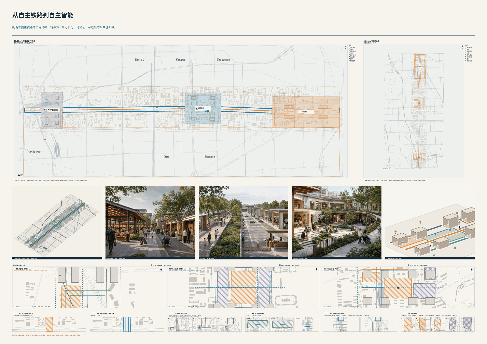
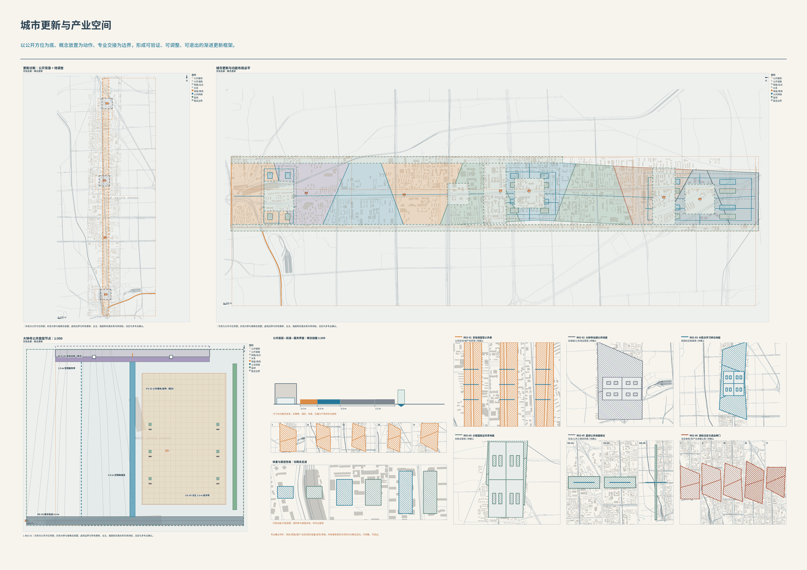
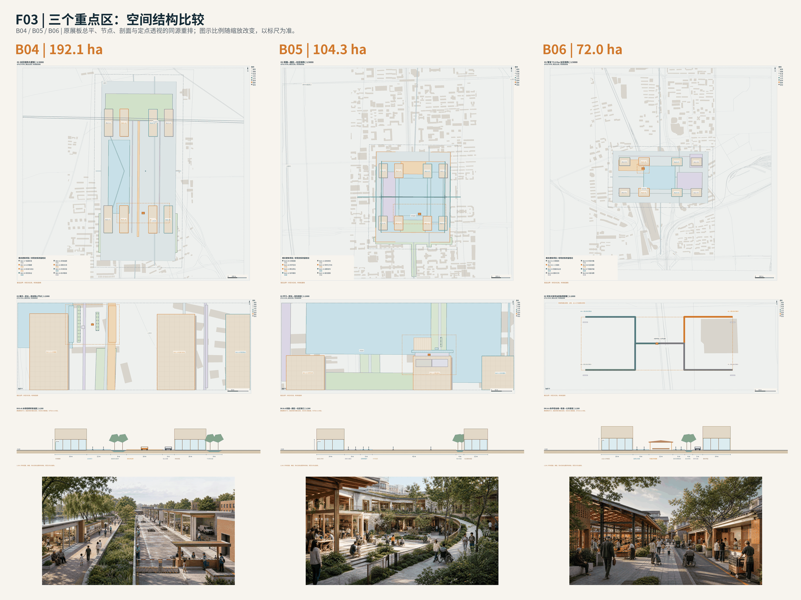
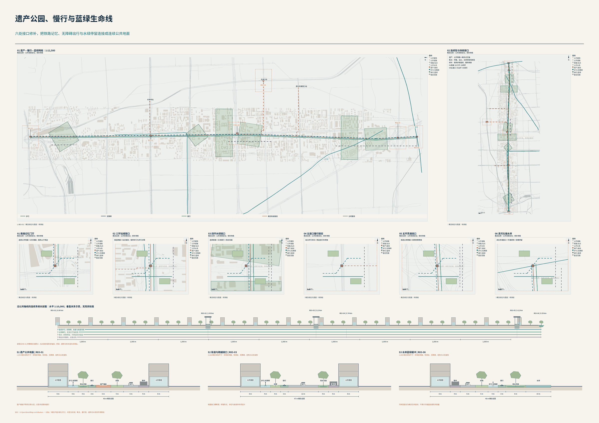
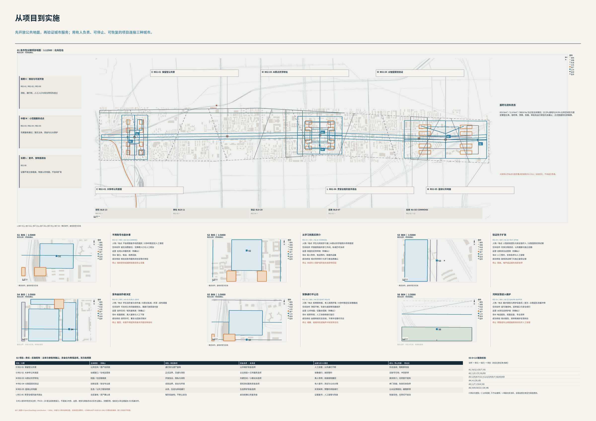

# 京张共生体——一座与普通人共同成长的AI城市

> 百年前，京张铁路让中国人凭自己的力量抵达远方；今天，京张AI创新带让每个普通人的想法抵达现实。

本稿采用官方固定13章，并完成八项能力与0+13的v1.0机器总装：96条服务链、48个稳定绑定、96个工作包、192个运行指标槽位和192条红线已进入同一证据结构；五张双语核心图只把同一结构转译为人类可读的解释层，已形成可投稿的竞赛表达，但不等于部署或法定成果。当前不可确认的仍包括正式红线、法定控规、权属、现状建筑、工程线位、精确重点区条件、投资和审批结论。总体/重点区粗略边界保持`provisional_constraint`；提交的生成设计图层按官方格式标记为`design_proposal`，含义仍是低置信度概念建议，不是现状或获批项目。两者均为`official_boundary=false`，不得用于官方红线、精确法定面积或控制结论。交付完整性和正式工具链状态以`manifest.json`与`self_check.json`为唯一可回读权威。[source:FORMAL-GUIDE] [source:PROVISIONAL-BOUNDARIES] [source:OFFICIAL-SPATIAL-CONTRACT-V09] （证据链续）[source:CHECKPOINT-V10-ASSEMBLY]

## 设计依据与资料清单

本方案以海淀区百年京张AI创新带官方公告、官方GitHub仓库、面向智能体任务书、formal提交指南和锁定站点包为首要依据。[source:OFFICIAL-ANNOUNCEMENT] [source:AGENT-TASKBOOK] [source:FORMAL-GUIDE]

空间母盘v0.9曾复核到`main`提交`1684719d9868b0b4c2b45e3e96c939eeff9e733c`；v1.0随后把当前官方合同冻结在`ad05ae25a80b4097b04e9d9d68281b0d8906e1b8`。与先前观察相比，设计简报、允许设计空间和Agent任务书等操作性合同blob未变化；这一事实只锁定格式和工具合同，不增加任何官方边界或专业数据。[source:SITE-PACKAGE] [source:OFFICIAL-SPATIAL-CONTRACT-V09]

来源按用途分级：官方公告与仓库任务支撑任务判断；官方临时边界只支撑生成、讨论和入口自检；北京及海淀公开政策只支撑现实背景；居民生活经验支撑需求假设，不支撑法定空间结论。第七能力另以现行著作权、个人信息、生成合成标识、北京数据知识产权试行制度和最高人民法院公开材料界定设计边界，但不据此宣布任何个人对象已经确权。[source:COPYRIGHT-LAW] [source:PIPL] [source:AI-CONTENT-LABELING-2025] （证据链续）[source:BEIJING-DATA-IP-2026]

第八能力把下列依据仅用作设计接口，并逐项保留性质和限制。所用的现行法律、行政法规、北京市规范性文件、现行部门规章、生成合成内容监管规范、政府转载法律文本和已批规划不属同一法律层级；引用其中任何一项都不自动产生本项目许可或政府背书，仍须逐项核验适用性。生态环境法典是现行法律，生效日为2026-08-15，用于生态准入、环评、节能和气候接口；被法典废止的旧环境法律不得继续作为现行主依据，且不推定本项目环评类别、节能结论、碳配额、生态达标或批准；修订后的网络安全法用于等保、日志、事件和AI风险接口，但固定页面是修改决定，不是合并后的现行法全文，不能据此确定等保级别、关键信息基础设施、日志期限或监管结论；突发事件应对法政府转载文本用于预防、预案、监测预警、信息发布、处置救援和恢复重建接口，但转载不替代逐项法务核验，Agent不取得发布或指挥权；重大行政决策程序行政法规用于公众参与、专家论证、风险评估、合法性审查和集体讨论接口，但目录、程序和期限逐事项确认；北京市公共数据规范性文件用于市级统筹、运营主体选择、原始公共数据安全域、产品服务审查和个人信息合法处理接口，但项目或区级团队不得自行宣称获得授权，去标识化不自动等于匿名化。[source:ECOLOGICAL-ENVIRONMENT-CODE-2026] [source:CYBERSECURITY-LAW-2026] [source:EMERGENCY-RESPONSE-LAW-2024] （证据链续）[source:MAJOR-ADMIN-DECISION-2019] [source:BEIJING-PUBLIC-DATA-2026]

人脸识别现行部门规章只在确有必要的具体活动中设置必要性、显著告知、非人脸替代、影响评估和适用备案闸门，公共安全不授权常态画像、强制刷脸或跨场景复用；生成合成内容官方监管文本用于公开传播AI生成合成内容的显式、隐式和用户声明标识接口，具体内容、主体和传播活动是否适用须逐项判断，且标识、备案和技术标准不构成政府认可、安全认证或项目许可；拟人化互动现行部门规章在公共AI形成持续情感互动时设置AI身份提示、便捷退出、风险干预及未成年人/老年人保护和适用评估备案接口，普通知识问答和工作助手是否适用仍按产品形态、对象和功能逐项判断；无障碍环境建设法转载文本用于设施、信息、服务、终端和必要人工服务接口，不证明某一终端或场所通过验收，也不允许单一App替代连续服务；北京市规划和自然资源委员会发布的已批韧性城市空间专项规划只支撑三环八廊、39组团、生活圈、生命线和数字孪生设计方向，不替代立项、控规、环评、节能、安全或工程审批，也不证明京张轴属于官方八廊。[source:FACE-RECOGNITION-2025] [source:AI-CONTENT-LABELING-2025] [source:AI-ANTHROPOMORPHIC-2026] （证据链续）[source:ACCESSIBILITY-LAW-2023] [source:BEIJING-RESILIENCE-PLAN-2024]

`CHECKPOINT-V08`是参与者形成的第八能力完整概念规格证据，用于12链、6卡、24项运行定义、12包和24条红线的可追溯设计，不是部署、法定审查、审批或实施就绪证据。[source:CHECKPOINT-V08]

完整机器索引进入`sources.json`，数据缺口和替换路径进入`assumptions.json`。

当前最关键的专业资料限制是资格预审或正式任务书附件中的精确三层边界、三处重点区域、控规、道路轨道水系文保、市政、建筑现状与权属。方案不会自行补画这些锁定要素；空且有解释的图层优于伪造的“完整图”。

## 三层范围工作框架

官方任务形成三级递进：约43.6平方公里统筹研究范围回答产业与未来城市；约11.4平方公里总体设计范围回答城市更新和控规深度城市设计；约368.4公顷重点区域回答三处详细设计。三层不是三套互不相干的方案，而是“战略判断—总体网络—重点实施”的同一证据链。[source:OFFICIAL-ANNOUNCEMENT] [standard:PROJECT-OFFICIAL-ANNOUNCEMENT]

当前仓库提供`PROV-RESEARCH-001`、`PROV-SITE-001`、`PROV-KEY-SCOPE-001`及三处`PROV-KEY-*`粗略要素。空间母盘v0.9的`site_boundary.geojson`只采用总体设计粗略要素，模型面积为11,412,825.385553982平方米；`key_areas.geojson`只采用三处粗略重点区，研究和重点总范围留在来源快照中供框架说明。所有边界均保持`official_boundary=false`，该面积只表示当前模型内复算值。[data:geometry/site_boundary.geojson#PROV-SITE-001] [metric:site_area_sqm] [depth:three_level_scope_framework]

正式多边形到位后，必须统一替换边界，并重新生成用地、建筑、道路、蓝绿、公共空间、约束和分期图层，随后在EPSG:4548中复算面积及全部比例。三处重点区仍为`PROV-KEY-001`至003，其中大钟寺位置风险继续保留；替换前不报告“精确占比”和“达标面积”。[data:geometry/key_areas.geojson#PROV-KEY-001] [source:OFFICIAL-SPATIAL-CONTRACT-V09]

第八能力在三层范围中只增加候选接口：统筹研究层连接城市级风险、生态、生命线、权责证据和数据控制；总体设计层连接片区、街镇与社区；重点区层连接建筑、设施边缘端和人工服务点。正式D3/D4资料、具责主体和适用程序到位前，不绘制官方走廊、39组团、控制线、设施点、疏散路径或脆弱人群几何，也不把接口当作批准边界。[source:CHECKPOINT-V08]

## 统筹研究范围产业与未来城市研究

总命题是“京张共生体”：城市主角是人，Agent是服务者、连接者和能力放大器。主题权重保持60%普通人借Agent把想法变成现实、30%詹天佑自主自强与工程验证精神、10%生活温度与尊严。精神不靠一张照片，而通过自主、勘测、攻坚、验证、连接和长期维护进入每个系统。[source:AGENT-TASKBOOK] [source:CHECKPOINT-V05]

城市的主角是人，Agent让人的存在感更重。第八能力不是独立应用，而是普通居民共治网、法治与算法责任网、公共安全与城市韧性网、生态维护网组成的城市级控制层；它约束前七枝如何表达、决定、执行、救济和恢复。北京市韧性规划在此只提供首都安全韧性方向，不证明京张轴是官方八廊、项目已立项或审批已经完成。[source:BEIJING-RESILIENCE-PLAN-2024]

总体组织为“三区两翼、六脉贯通”。三区承担自主创新加速、AI原点社区和智能产业集聚；中关村科技服务翼提供专业、法律、标准、开源和转化能力；小月河场景赋能翼承接低干扰、可逆和可复核的公共体验。六脉分别连接创新、生活、学习、健康、文化和生态，但不会机械画成六条未经证实的实体线。

未来城市形态由三层系统共同形成：以京张遗址公园为历史—公共空间骨架，以清河和小月河为蓝绿及韧性接口，以轨道站点、慢行、社区和产业节点构成可达网络；以一门双Agent连接八大居民能力；以0+13内部矩阵把服务需求翻译为交通、用地、空间、生态、教育、医疗、产业、文化、数据、治理、社区、隐性秩序和风险设计。

第六能力枝把产业定义为“人的能力循环＋城市产业能力循环”，不是企业名单。个人从表达愿望、形成本人可控的能力证据、学习实践、就业/组队/创业走到真实交付、报酬、署名或体面退出；城市用匿名聚合需求完善机会、企业服务、算力、数据、模型、工具、评测、安全、场景、专业和市场目录。城市可以按公开规则调度公共容量，但不得以全城效率为由读取无关个人或企业秘密。[source:CHECKPOINT-V06]

十二条产业服务链覆盖机会与能力、学习到工作、公平招聘、社区生计、一门创业、企业全生命周期、科研/开源转化、AI全栈共用、场景测试、融资采购与市场、创新社区和韧性退出。北京市人工智能、智能体、企业服务和营商政策只为这种系统结构提供现实背景，不等于京张已获具体项目、资金或指标。[source:BEIJING-AGENT-MEASURES-2026] [source:BEIJING-ENTERPRISE-SERVICES-2025]

第七能力枝在产业行动链之外建立“个人创意与贡献权益系统”。“真人资产”只是面向普通人的内部设计概念，不是新增法定资产。系统分三层：私域资产舱默认不公开、不训练；授权流通账逐项说明对象、版本、主体、目的、动作、期限、署名、回报和退出；公共贡献账只记录居民主动投入公共建设的项目级贡献、采纳状态和回馈，不生成个人总贡献分。人的想法因此可以先被保护，再在本人愿意时进入协作、公共建设和产业循环。[source:CHECKPOINT-V07]

## 总体设计范围城市更新与控规深度城市设计

总体空间判断暂定为“一骨、两水、三区、两翼、六类缝合口”：京张遗址公园是文化与公共空间骨架；清河和小月河是蓝绿气候接口；三区形成差异化重点；两翼提供专业和场景支持；铁路、环路、河流、站点、校园/园区边界及社区/公共设施入口是六类待核问题。六类是问题类型，不是六个已确定工程点。[source:OFFICIAL-ANNOUNCEMENT] [source:CHECKPOINT-V05] [standard:MOHURD-URBAN-DESIGN-MEASURES]

城市更新坚持完整方案而非少量试点。分期只表达依赖：先建立来源、规则、责任、安全和非AI入口；再连通现有服务与真实状态；再依据正式现状和控规形成空间项目；最后通过现场、不同人群、不同天气和故障情景持续复核。任何需要道路、桥隧、建筑、管线或产权变化的建议都保持为专业深化方向。

权益基础设施也不等于一座集中数据中心。个人/家庭保存私域对象，社区和图书馆提供人工与无障碍入口，校园园区提供协作复现和专业服务，三区两翼连接展示、许可、采购与受控验证。C只维护必要目录、授权路由和公共贡献状态，不读取全体居民的私人草稿与工作流。

空间母盘v0.9已经把“一骨、两水、三区、两翼、六类缝合口”落为同源概念系统：10个概念用地单元、12个概念设计单元、24个概念建筑基底、12条概念连接线、8块绿地、19个公共空间要素和10个依赖分期单元；`constraints`继续为空。每个要素均挂接能力、0+13、官方章节、AR、场景、专业闸、非AI替代与失败退出。[depth:overall_spatial_structure] [data:geometry/land_use.geojson#LU-01] [data:geometry/roads.geojson#RD-01]

上述全部是`confidence=low`的参赛者概念设计模型；提交导出按官方枚举使用`geometry_role=design_proposal`，不改变其非官方、非现状的性质。[data:geometry/green_space.geojson#GS-01] [data:geometry/public_space.geojson#PS-01] 历史v0.9两次Overpass请求失败曾采用`source_mode=provisional_only`。[source:SPATIAL-CONTEXT-V09]

2026-08-31 professional-v2已另行登记3,619个公开OSM背景要素（含1,894个建筑轮廓），只作方位与肌理参考，未把它们改为官方测绘或将参与者概念几何改为现状；任何official数据到位仍触发替换和复算。[source:OSM-OVERPASS-PROFESSIONAL-V2] [source:OSM-OVERPASS-PROFESSIONAL-V2-BUILDINGS]

当前可视化交付为中英文各7张A0板、各26页A3文册、十张同源核心PNG及四个离线HTML。B01总体、B02更新、B03遗产交通蓝绿、B04—B06三处详细设计、B07实施场景依次展开；A3附页给出全球案例、用户画像、场景与地标、产业验证及年度运营。0+13作为底层内容矩阵进入项目、空间与证据，而不替代城市设计图件。A0提交版在150ppi原始尺寸上压缩以满足40MiB总包限额，无损母版保存在母包。

第八能力采用“法定职权与证据底座＋六闸＋四态”。底座只最小保存事件、适用职权或合同依据、具责人工、允许自动化、专业复核与回避、数据范围/留存/访问、决定理由、执行、投诉救济和恢复证据，不形成居民数据湖。G1职权闸、G2数据闸、G3模型闸、G4决定闸、G5执行闸、G6应急恢复闸分别在权限、最小数据、置信与适用、决定责任、执行条件、临时权限回收处停止越界；日常态、预警态、应急态、恢复态均保留人工和法定责任。全域基础设施感知不等于全域采集居民。[source:BEIJING-RESILIENCE-PLAN-2024] [source:CHECKPOINT-V08]

两套五级词汇明确分开：治理责任尺度是个人/家庭—楼栋/院落/设施—社区/街镇—片区/创新带—城市/区域；能力服务载体是个人/家庭私域与入口—社区公共节点或设施边缘端—社区/校园/园区服务节点—三区两翼—北京、京津冀及外部专业网络。固定空间仍只是接口，须待D3/D4资料、责任主体和程序齐备后落图。

## 重点区域详细设计

众智园AI自主创新加速区重点研究对外交通、清河界面、青年与人才安居、园区—社区共享、AI全栈研发验证和产业服务。v0.9在粗略重点区内设置4个概念设计单元和8个概念建筑基底，以验证共享首层、公众/测试分离、清河韧性接口和对外连接；它们不是地籍、现状或获批项目。B04进一步给出总平、公共首层、剖面和街景对照，提交的概念建筑图层保留对应原型，例如BLD-17。[data:geometry/key_areas.geojson#PROV-KEY-001] [data:geometry/buildings.geojson#BLD-17] [depth:three_key_area_detailed_design]

北京AI原点社区重点研究校园、园区、社区和轨道站点的步行骑行缝合，承接开源发布、成果转化、终身学习、可成长居住和普通人共创。4个概念设计单元、8个概念建筑基底、学习共创公共厅和共享花园表达校园—社区—园区连续性；professional-v2使用五道口、清华东路西口的注册公开点位作方位锚点，5/10/15分钟图为概念路网上的步行预算，不是获批TOD范围或已核站口。B05和概念建筑原型BLD-09显示其空间组织；出入口和地块动作仍须正式数据复核。[data:geometry/key_areas.geojson#PROV-KEY-002] [data:geometry/buildings.geojson#BLD-09] [source:OSM-OVERPASS-PROFESSIONAL-V2]

大钟寺AI产业聚集区重点研究站城一体化、存量更新、生活烟火气、智能消费、国际交往和公共空间时段共享。4个概念设计单元、8个概念建筑基底和站城公共厅测试共享首层、时段复合与步行缝合。[data:geometry/key_areas.geojson#PROV-KEY-003]

professional-v2实测暂定区与公开大钟寺站锚点相距约2,193米，B06明确分开绘制暂定区详细设计与实际站点四象限概念接口，不平移暂定区、不伪造已批准连廊、桥隧、站口或产权调整。[source:PROVISIONAL-BOUNDARIES] [source:OSM-OVERPASS-PROFESSIONAL-V2]

产业分工不做三个重复园区：众智园条件性承接全栈适配、评测、安全和工程化；AI原点社区承接开源开发者、学习到工作、低成本创业与成果转化；大钟寺承接企业全周期、智能原生商务/消费和市场连接；中关村科技服务翼提供法律、知识产权、财税、标准、安全、资本和国际B侧服务；小月河场景赋能翼提供低干扰、可逆、可退出的受控验证。所有位置仍待正式边界、现状和专业清权。[source:CHECKPOINT-V06] [source:HAIDIAN-AI-STREET-2025]

第七能力为上述分工增加权益接口：众智园侧重工作流来源、秘密分舱与跨栈复现；AI原点社区侧重一句话创意、开源协作、学习作品和社区共创；大钟寺侧重许可、委托、采购、展示和市场连接；中关村翼提供知识产权、合同、数据、财税、争议等B侧；小月河翼只承接经同意、低干扰、可恢复的公共提案和场景验证。它们不是五个重复“创意园”。[source:CHECKPOINT-V07]

第八能力为三区两翼增加差异化而非定址结论：众智园关注研发测试安全、算法审计和退出恢复；AI原点社区关注包容参与、校园社区连续和未成年人保护；大钟寺关注高客流、站城生命线、商业系统连续和公共空间风险；中关村翼提供法律、消防、医疗、网络、算法、生态及独立复核B侧；小月河翼关注水生态、低扰动验证、阈值停止和退役恢复。以上均为安全、生态、连续和恢复接口，不构成地块、容量、项目或官方边界。[source:CHECKPOINT-V08]

三个重点区最终都必须形成“定位、空间结构、建筑更新、交通慢行、公共空间、AI场景、实施依赖和风险”的可读小方案，并与同一套GeoJSON、指标和图件一致。

## AI 创新生态、人才画像与 AI+ 场景

一门双Agent的运行结构是“A在前、C在后、B在侧”。个人Agent整理意愿、材料和授权；城市Agent调用公开目录、连接权威系统、发现跨主体公共问题并进行聚合调度；规划、医疗、教育、法律、交通、安全、生态等专业人员在侧面复核；法定主体保留审批、执法、救援和裁判职责。

七环固定为表达、翻译、校验、匹配、协同、交付、学习；五级空间载体固定为个人/家庭、楼栋/院落、社区、片区、创新带与城市。所有核心事项同时提供Agent、网页、电话、窗口、社区、无障碍和人工入口。居民拒绝AI、定位或数据共享不影响基本服务。

### v1.0八项能力实际交付快照

机器总装不是八个标题：`capabilities.json`现含8项能力、96条服务链、48个稳定绑定、96个工作包、192个运行指标槽位和192条红线；48个绑定汇聚到12张去重后的`SC-FINAL-01..12`正式卡，历史30张候选卡只保留设计来源意义，不是30个部署场景。`zero_plus_thirteen.json`把总纲0和单元1—13共14个单元接到同一能力、场景、空间和证据网络。[source:CHECKPOINT-V10-ASSEMBLY] [capability:1] [capability:2] [capability:3] [capability:4] [capability:5] [capability:6] [capability:7] [capability:8]

指标库共有212项定义：22项`known`只包含18项设计/结构计数和4项low-confidence provisional模型复算值，190项仍为`unknown`；其中八项能力的192个运行指标槽位引用188个唯一运行指标ID，另有`floor_area_ratio`和历史`scenario_card_count`两个非能力运行缺口。没有任何运行指标是已部署绩效，也没有候选卡、设计完整度或模型面积能替代真实运营证据。[metric:site_area_sqm] [metric:green_ratio] [metric:public_space_ratio] （证据链续）[metric:building_footprint_area_sqm]

#### 能力1｜身份与公共服务

它解决“居民说得出愿望，却在事项名、身份核验和多部门之间反复重来”的问题。代表旅程由`IDN-01`识别愿望和最小证明，`IDN-02`让Agent、电话、窗口、社区和纸面沿同一案件号接续，`IDN-12`保留独立投诉、导出与撤回；它进入[scenario:SC-FINAL-01]及[unit:0][unit:9][unit:10][unit:11][unit:12][unit:13]的社区受理、数据、治理、救济与风险接口。[capability:1]

A只整理本人原话、材料和逐项授权，C只查带版本的公共目录并路由状态，B核验身份、代理、语言和无障碍，L或具责主体保留资格、登记、不利决定和法定救济。12条链、6个绑定是已知设计计数，24个运行指标仍为`unknown`；目录冲突或不利结果即停止自动建议，转人工完成失败说明、纠错、申诉和退出，拒绝AI不降低基本服务。

#### 能力2｜健康与照护

它解决“健康与照护需求无法安全表达、照护者授权不清、危险信号被普通建议淹没”的问题。代表旅程以`HLT-01`保存居民原话并在危险信号时停止建议，`HLT-06`区分老年居民本人、照护者和专业评估权限，`HLT-12`处理健康记录纠正与撤回；它连接[scenario:SC-FINAL-02]和[scenario:SC-FINAL-08]，落在[unit:0][unit:6][unit:9][unit:11][unit:13]的家庭—社区—专业医疗与离线连续接口。[capability:2]

A只整理本人表达和照护授权，C只连接公开服务目录，B由持证临床、康复、心理或照护专业人员承担，L保留公共预警、急救指挥和救援优先级；A/C不诊断、不作最终分诊、不处方。12条链、6个绑定是已知设计计数，24个运行指标仍为`unknown`；电话、社区卫生、窗口、纸面、现场急救并行，失败或授权冲突时转真人复核，保留纠错、申诉和完整退出。

#### 能力3｜教育与能力成长

它解决“学习目标、作品和真实机会彼此断裂，未成年人和作品权利又容易被平台替代”的问题。`EDU-01`保留学习者原话，`EDU-07`把作品送入可逆、可复现的真实挑战，`EDU-12`保证记录、作品和Agent工作流可携带退出，并由`EDU-09`把本人可控作品集连接到经真人复核的真实机会；主要进入[scenario:SC-FINAL-03]和[unit:0][unit:5][unit:7][unit:9][unit:11][unit:13]。[capability:3]

A管理本人目标、作品、来源和许可，C只匹配公开课程/机会目录，B由教师、劳动、知识产权、安全和无障碍专业人员复核，L或具责教育主体保留录取、评价、处分和资格决定。12条链、6个绑定是已知设计计数，24个运行指标仍为`unknown`；学校窗口、导师、图书馆、纸面和离线学习并行，失败时保留理由、纠错、申诉和退出。`EDU-SC-06 -> SC-FINAL-08`只表示教育对断网断电时学习/服务连续和离线出口的次级接口；该正式卡的主要能力仍是2、5、8，不改写其应急主语。[scenario:SC-FINAL-08]

#### 能力4｜居住与社区

它解决“安居、搬迁、维修、无障碍和社区更新被拆成无人负责的碎片”的问题。`HOU-01`给出有来源而非虚构房源的路径，`HOU-05`把报修送到物业、市政或专业主体并追踪复发，`HOU-12`让受影响居民比较更新方案；完成不是工单自动关闭，而是住户或实际使用者接受现场修复/复测。接口进入[scenario:SC-FINAL-04]、[scenario:SC-FINAL-11]及[unit:0][unit:2][unit:3][unit:6][unit:10][unit:11][unit:13]。[capability:4]

A只整理住户选择和证据，C只路由并显示真实状态，B由产权、结构、消防、无障碍、物业和法律专业人员核验，L保留资格、所有权、执法和应急决定。12条链、6个绑定是已知设计计数，24个运行指标仍为`unknown`；物业前台、社区站、电话、纸面和现场会并行，失败或争议时停止自动结案，允许纠错、独立申诉、撤回资料和退出。

#### 能力5｜出行与公共空间

它解决“路线看似可达、真实站口和最后800米却断裂”的问题。`MOB-01`组织全程主/保底方案，`MOB-02`要求核验真实站口、接驳和最后800米，`MOB-12`把事故、拥挤、维护和复发带入同一责任链；它连接[scenario:SC-FINAL-05]、[scenario:SC-FINAL-08]及[unit:0][unit:1][unit:3][unit:4][unit:11][unit:13]的道路、公共空间、蓝绿和连续性接口。[capability:5]

A只保存当次出行意愿，C只组合可核公共状态和路由断点，B由交通、无障碍、工程和现场运营专业人员核验，L保留管制、执法、施工、事故责任和救援决定。12条链、6个绑定是已知设计计数，24个运行指标仍为`unknown`；电话、站点服务台、纸面路线、现场引导和手动控制并行，失败时安全停下、纠错、申诉、返程或退出。结构化`authority_contract`与`fact_status_contract`继续把站口、线位、容量、安全和部署锁为未知，直至四类证据闸门齐备。

#### 能力6｜就业、创业与产业

它解决“作品找不到真实机会、小店反复办事、产业测试把Demo当结果”的问题。`IND-01`以本人可控能力作品连接带来源的机会，`IND-06`提供企业全生命周期同案服务，`IND-09`把数字全栈、具身/机器人、公共/中小企业高影响任务分成三种不可混同的测试；它进入[scenario:SC-FINAL-06]、[scenario:SC-FINAL-10]及[unit:0][unit:2][unit:3][unit:7][unit:9][unit:13]的三区两翼、产业、数据和风险接口。[capability:6]

A只整理本人/企业选择的材料，C只维护公开目录、公平队列和状态，B由劳动、合同、知识产权、财税、数据安全和行业工程专业人员复核，L或其他具责主体保留招聘解雇、许可、投资、采购、测试授权和争议决定。12条链、6个绑定是已知设计计数，24个运行指标仍为`unknown`；热线、企业窗口、纸面计划、专业会谈、现场核验和物理急停并行，失败和负面测试必须保留，允许纠错、申诉、体面退出和重新开始。

#### 能力7｜创意、想法与真人资产

它解决“普通人的想法在尚未选择公开、许可或训练前就失去控制”的问题。`CRE-01`并排保存原话与整理稿并默认私域，`CRE-06`把复制、修改、训练、发布、商业使用拆成逐项许可，`CRE-12`分别处理更正、撤回、可控副本删除、合法留存和争议；它连接[scenario:SC-FINAL-07]、[scenario:SC-FINAL-11]及[unit:0][unit:8][unit:9][unit:10][unit:11][unit:13]。[capability:7]

A是本人一侧的版本和授权管家，C只核验请求方并路由许可/公共回应，B由知识产权、合同、隐私、劳动和财税专业人员复核，L保留裁判和法定救济。“真人资产”不是自动确权。12条链、6个绑定是已知设计计数，24个运行指标仍为`unknown`；本地文件、纸面封存、人工合同和线下见证并行，失败或越权使用即暂停，提供纠错、申诉、撤名、导出和完整退出。

#### 能力8｜共治、法治、安全与生态

它解决“跨部门协同加快后，权力、应急和生态责任反而无人承担”的问题。`GOV-01`把问题送到真实责任主体，`GOV-06`登记和停用高风险Agent/算法，`GOV-12`执行生态基线—阈值—停止—修复—退役复验；它连接[scenario:SC-FINAL-01]、[scenario:SC-FINAL-08]、[scenario:SC-FINAL-12]及[unit:0][unit:4][unit:9][unit:10][unit:13]。[capability:8]

A帮助本人表达和救济，C只维护责任目录、路由、状态与审计，B承担规划、消防、医疗、网络、安全、水务和生态现场核验，L始终保留审批、执法、预警、指挥、疏散、救援优先级、裁判和复运责任，L不是第四个Agent。12条链、6个绑定是已知设计计数，24个运行指标仍为`unknown`；电话、窗口、纸面责任簿、广播、备用无线、人工巡查和现场处置并行，失败时安全停止、人工接管、纠错、申诉、恢复对账和退出。

### 名称与标志文字规格

**LOGO-CONCEPT-01｜京张轨道双弧、普通人节点与共生连接环。** 中文名固定为“京张共生体”，英文名固定为“Jingzhang Symbiotic City”。标志以两条不封闭的轨道弧表达百年京张与面向未来的连续工程，以一个不被弧线包围或评分的普通人节点表达“人是城市主角”，以可断开、可重新连接的环表达居民、城市、专业和法定主体之间可授权、可退出的共生关系。标志不得使用政府徽记、官方征集Logo、封闭监控眼、全知大脑或把居民包裹在数据网中的构图；最终色彩、比例、字体和版权在视觉阶段另行确定。

### 六个全球案例及其可转译边界

**CASE-01｜巴塞罗那Decidim与22@参与式更新。** 真实问题是产业更新和公共空间改变不能只由开发与技术主体内部决定。Decidim把线上提案、讨论、支持、线下会议与进度追踪放在同一可复用的开源参与平台。京张可转译为C只维护公开议题、责任与状态，纸面/社区会议与数字入口共用事项号；不能照搬当地规划、产权和政治程序，也不能把在线人数当作代表性。进入AI原点社区、大钟寺更新协商和`SC-FINAL-11`。[source:CASE-BARCELONA-DECIDIM]

**CASE-02｜赫尔辛基Smart Kalasatama敏捷试验区。** 真实问题是智慧城市容易从宏大系统出发，却不能证明是否改善日常生活。该项目由城市、企业、居民和研究者在真实城区共同开展小规模试验，并用“每天多一小时”把技术价值拉回居民时间。京张可转译为低干扰、可逆、有停止条件的场景闸门和居民时间/任务完成指标；不能把试验成功直接扩大成永久部署，也不能用参观热度替代真实效果。进入小月河场景赋能翼、日常公共空间和`SC-FINAL-09`、`SC-FINAL-12`。[source:CASE-HELSINKI-KALASATAMA]

**CASE-03｜新加坡榜鹅数码园区。** 真实问题是产业、大学、社区和城区运营常由彼此隔离的系统建设。榜鹅以产业园与大学邻接、开放数字平台和数字孪生支持跨系统运营与安全测试。京张可转译为接口化城市底座、隔离测试环境、真实运行前的模拟和产学协同；不能照搬集中采集、无边界实时数据或生物识别入口，任何数据调用仍须最小必要、逐项授权和具责主体。进入众智园全栈验证、AI原点学习到工作和`SC-FINAL-06`、`SC-FINAL-10`。[source:CASE-SINGAPORE-PDD]

**CASE-04｜首尔数字媒体城。** 真实问题是数字内容和信息产业集聚不能只靠楼宇，还需要明确的基础设施、企业准入、公共支持和持续运营责任。首尔以地方条例界定园区、核心产业和支持职责。京张可转译为“空间载体+责任目录+运营规则”同时设计，以及大钟寺的数字内容、智能消费和企业服务组合；不能照搬其产业目录、土地开发、招商补贴或政府承诺。进入大钟寺AI产业聚集区、企业全周期服务和`SC-FINAL-06`。[source:CASE-SEOUL-DMC]

**CASE-05｜巴黎萨克雷开放创新生态。** 真实问题是高校、实验室、大企业、创业者与城区生活若各自成岛，资源密度不会自动转成创新。巴黎萨克雷通过城市校园、创新场所网络、科研产业连接、公共交通和自然农业保护共同组织生态。京张可转译为中关村B侧专业网络、众智园工程验证与多类创新场所共享目录，同时把水、生态和生活质量作为硬约束；不能照搬大尺度新区、国际机场区位、投资规模或绿地开发条件。进入众智园、中关村科技服务翼和跨区专业侧援。[source:CASE-PARIS-SACLAY]

**CASE-06｜多伦多Quayside数字治理教训。** 真实问题是技术伙伴提出城市级数据和空间方案时，公共权力、隐私、数据治理、项目范围与民主问责可能失配。Waterfront Toronto设置独立数字策略顾问组，项目退出后仍把政府应处于治理中心、数字创新须接受民主问责作为遗产。京张可转译为传感、模型和平台进入公共空间前的职权/数据/模型闸门与独立复核；不能照搬“城市数据”概念、让技术供应商代替政府，或把退出原因简化成单一隐私争议。进入全带能力8、`SC-FINAL-10`和`SC-FINAL-11`。[source:CASE-TORONTO-QUAYSIDE]

### 六个可测试人物画像

**PERSONA-01｜数字能力较弱的老年居民。** 目标是不用学习复杂AI也能办成公共服务、投诉和照护任务；障碍是术语、验证码、跨部门转接和听视能力变化；非AI路径为电话、窗口、社区、纸面及依法代理；只处理本人逐项提供的材料，不建立永久能力分；成功是一次建案、状态可懂、真人可接管；最坏失败是被算法拒绝且找不到具责人员；对应`SC-FINAL-01`、`SC-FINAL-02`、`SC-FINAL-08`。

**PERSONA-02｜残障使用者与照护者。** 目标是独立或在自选帮助下连续完成出行、服务和公共参与；障碍是断裂盲道/坡道、信息格式单一和系统默认替代本人；非AI路径为无障碍电话、现场服务、纸面/大字/手语或依法代理；辅助需求按任务最小保存且可撤回；成功是等价结果而非只“提供入口”；最坏失败是系统显示可达而现场不可达；对应`SC-FINAL-05`、`SC-FINAL-09`、`SC-FINAL-10`。

**PERSONA-03｜青年学生或研究者。** 目标是把学习、研究和创意接到真实验证、合作与机会；障碍是资源分散、作品来源不清和未成年人/校园边界；非AI路径为导师、学校窗口、图书馆和线下实验；作品默认私域并区分本人、第三方与AI贡献；成功是可解释匹配、可携带成果和失败反馈；最坏失败是被永久标签或作品被越权训练；对应`SC-FINAL-03`、`SC-FINAL-07`。

**PERSONA-04｜服务劳动者或小店经营者。** 目标是用一句话找到真实办理、采购、用工和经营帮助；障碍是多平台重复填报、机会真假和工作时间不足；非AI路径为企业窗口、商会/社区服务和具责顾问；商业秘密与劳动数据分舱且不形成企业/人才总分；成功是首次路由准确、材料少重复和能退出；最坏失败是Agent代替招聘、融资、许可或采购决定；对应`SC-FINAL-04`、`SC-FINAL-06`、`SC-FINAL-11`。

**PERSONA-05｜开发者或创业团队成员。** 目标是在自主可替换技术栈上完成测试、复现、合规和市场连接；障碍是算力/工具锁定、测试场责任不清和合规成本；非AI路径为专业评审会、纸面测试计划和人工验收；代码、模型、数据和商业秘密按合同分舱；成功是跨栈复现、闸门齐全和负面结果可留；最坏失败是Demo越级进入真人/实体环境；对应`SC-FINAL-06`、`SC-FINAL-07`、`SC-FINAL-10`。

**PERSONA-06｜承担跨部门协同的社区工作者。** 目标是把居民问题送到真正责任主体并能解释等待、冲突和结案；障碍是目录变化、跨部门交接、线下记录和应急信息不一致；非AI路径为值班电话、纸面责任簿、现场会议和人工指挥；只使用职责所需最小信息并保留来源/版本；成功是交接闭环、少数意见保留和离线恢复可对账；最坏失败是责任被错误归因；C不得审批，也不得承担应急指挥；对应`SC-FINAL-01`、`SC-FINAL-08`、`SC-FINAL-11`、`SC-FINAL-12`。

### 十二张去重后的正式场景卡

以下十二张卡替代“30张候选卡等于30项完成”的口径；它们是后续空间、指标和图件的验收接口，不是已部署事件。

**SC-FINAL-01｜纸面投诉路由与救济。** 人物`PERSONA-01/06`；空间为社区—街镇；触发是纸面投诉错投。A在本人确认后转录，C查公开责任目录并保留原件，B做无障碍/专业核验，L受理、决定和救济；七环从表达走到交付/学习；纸面、电话、窗口与Agent共号；只保存投诉必要信息；指标为首次路由、到期回应和救济闭环；错投不得自动结案，可人工纠偏、申诉和撤回非必要副本；后续进入服务节点、责任图和`metrics-evidence`。

**SC-FINAL-02｜健康与照护导航、人工升级。** 人物`PERSONA-01/02`；空间为家庭—社区—医疗网络；触发是居民描述健康/照护需求。A只整理本人表达不诊断，C连接公开服务目录，医疗B复核，紧急救援与法定决定由L；电话、社区医生、窗口和线下急救与Agent并行；健康数据逐项授权、最短保存；指标为转介完成、人工接管和非AI等价；模型不确定或危险信号立即停止建议并转人工；后续进入公共服务节点和应急接口。

**SC-FINAL-03｜学习到真实机会且保护未成年人。** 人物`PERSONA-03`；空间为校园—社区—园区；触发是学习者提交能力/作品和目标。A管理本人作品与授权，C匹配公开课程/机会，教育/劳动/IP B复核，录取、处分和法定许可由L；学校窗口、导师和线下活动并行；未成年人信息与作品默认私域；指标为解释完整、转化和可携带；禁止永久能力分，匹配失败保留理由、纠错与退出；后续进入AI原点学习节点和场景卡图。

**SC-FINAL-04｜住房与社区维修共治。** 人物`PERSONA-01/04/06`；空间为楼栋—小区；触发是漏水、噪声、无障碍或公共设施问题。A整理证据与住户选择，C路由物业/街镇/专业主体，建筑/消防/法律B核验，L保留行政决定；电话、值班室、纸面与现场会并行；不建立住户信用分；指标为到场核验、状态准确和恢复闭环；结构/消防风险立即转专业，争议可申诉；后续进入建筑、约束和分期图层接口。

**SC-FINAL-05｜连续无障碍站城旅程。** 人物`PERSONA-02`；空间为站口—道路—公共空间—目的地；触发是指定时段的真实出行。A保存本人偏好，C组合权威交通/设施状态，交通与无障碍B现场核验，管制和救援由L；电话、人工问询、纸面路线与Agent并行；位置只在行程必要时使用；指标为全程完成、断点和接管；现场与数据冲突时以安全人工核验为准并报告断点；后续进入roads/public_space和`mobility-bluegreen`。

**SC-FINAL-06｜想法到第一次经验证付费任务。** 人物`PERSONA-04/05`；空间为个人—园区—三区两翼；触发是一句话需求或能力。A管理本人材料/报价授权，C匹配公开机会与B侧服务，合同/劳动/财税/IP/安全B复核，采购、许可、融资和争议由L/具责主体；企业窗口、专业会谈和线下路演并行；商业秘密分舱；指标为首次路由、首次付费任务和退出恢复；禁止虚假机会与Agent最终决定；后续进入产业节点、项目清单和`land-use-structure`。

**SC-FINAL-07｜私域创意保存与细粒度许可。** 人物`PERSONA-03/05`；空间为个人私域—可信会谈—公共展示；触发是保存、合作或授权创意。A保留原话、版本和逐项许可，C只验证请求方与路由，IP/合同/个人信息B复核；裁判与法定救济由L；纸面封存、线下见证和人工合同并行；区分本人/第三方/AI贡献；指标为来源、许可字段、使用回执和撤回通知；存证不等于确权，未经授权不得训练/公开；后续进入展示节点、版权说明和证据链图。

**SC-FINAL-08｜极端降雨、断网断电与生命线连续。** 人物覆盖全部画像；空间为城市—片区—社区—设施端；触发是权威预警和多系统失效。A展示本人需要与离线指引，C仅传播授权信息/同步状态，消防水务医疗通信等B核验；预警、指挥、疏散和救援优先级由L；广播、电话、社区、纸面、备用无线和人工传令并行；应急最小数据限时失效；指标为多通道可达、关键服务连续、人工接管和恢复对账；冲突指令升级L且纸面记录不被恢复系统覆盖；后续进入constraints/phasing和韧性图。

**SC-FINAL-09｜盲道问题从提案到空间纠偏。** 人物`PERSONA-02/06`；空间为道路—站点—公共空间；触发是现场盲道/坡道断点。A按本人选择提交照片、口述或纸面，C送达真实权属/责任主体并公开状态，交通/无障碍/工程B现场核验，建设和执法决定由L；不提供定位仍可报具体地标；指标为核验、理由、修复和复测；自动图像识别只作线索，误报可纠正且不保存人脸；后续进入roads/public_space与key-areas图。

**SC-FINAL-10｜公共空间机器人险情急停与复盘。** 人物`PERSONA-02/04/05`；空间为受控测试场—公共界面；触发是机器人近失事故。窄保护联锁只在六条件满足时急停，A帮助受影响人表达，C封存事件状态/路由，安全/工程/医疗/法律B核验；封控、救援、责任和复运由L；现场急停、电话和人工处置优先；只保留事件必要证据；指标为停止、接管、通报和复验；不得以无伤亡掩盖险情，未完成复核不复运；后续进入测试节点、constraints和风险图。

**SC-FINAL-11｜有分歧共享空间与少数意见保存。** 人物`PERSONA-01/04/06`；空间为社区—重点区公共空间；触发是改造方案引发分歧。A帮助本人理解并提交意见，C合并议题但不抹平少数意见，规划/交通/无障碍/运营B评估，正式程序和决定由L；线下会议、纸面、公示栏、电话和Agent并行；公开意见前逐项确认署名/匿名；指标为参与可达、少数意见回应、理由完整和承诺跟踪；多数票不能绕过权利/安全，决定可复核申诉；后续进入public_space、key_areas和A0议题板。

**SC-FINAL-12｜河道生态异常核验与长期反馈。** 人物`PERSONA-06`及周边居民；空间为清河/小月河—社区—专业网络；触发是异味、死鱼、漂浮物或生态变化报告。A按本人选择保存观察，C聚类线索/路由，生态水务检测B现场采样，执法、预警和工程决定由L；电话、巡查、纸面和现场报告并行；照片位置最小化且去除无关人像；指标为专业核验、阈值行动、养护反馈和长期复验；模型不得冒充监测，误报不惩罚居民，未达修复证据不得结案；后续进入green_space/constraints和生态图。

当前人物至少覆盖：不会使用复杂AI的普通居民；青年学生和初入职场者；老人、儿童、残障人士与照护者；开发者、科研人员和创业团队；企业员工、服务劳动者和专业人员；社区工作者及城市运营者；国内外访客。人物画像只为设计服务，不构成永久个人标签。

### 三张产业测试验证卡：从可复现任务到受控交付

v0.4—v0.6的18张候选卡保留来源意义。以下三张把第六能力已确定的产业测试对象展开为可执行的验证子卡，分别深化`SC-FINAL-06`和`SC-FINAL-10`，不改写十二张去重正式卡的口径，更不计为新增部署或已完成实验。三卡共用“离线/仿真—隔离或封闭—受控真人/实体—有限运行”四级闸门；进入下一级前必须有场地使用权、具责运营者、适用专业/法定条件、合法输入、人工接管和撤场恢复方案。以下空间落点、目标和职责均为概念建议，真实基线、阈值确认、结果与运营绩效仍待测。[source:CHECKPOINT-V06] [source:HAIDIAN-SUPER-TESTFIELD-2026]

**IND-TEST-01｜自主全栈Agent工具链复现与迁移。**

- **空间与人物：** 众智园B04概念受控验证后场；清权后的结果才进入公共展廊。面向`PERSONA-03/05`研究者、开发者和创业团队，连接`SC-FINAL-06`。
- **测试对象与输入：** 可替换的模型、工具接口、权限与交付链；输入为版本锁定的代码/配置、具有使用权或合成的样例、封存任务集、人工基线及故障用例，不接入未经授权的生产系统。
- **验收目标：** 同一版本与输入可重放，切换技术接口仍有可解释的结果和迁移记录；权限拒绝、工具故障与不确定输出均能转人工。逐项记录任务完成、复现一致性、越权请求、人工接管和退出恢复，验收阈值须在试验前由专业评审锁定，当前不填达成绩效。
- **负责人角色：** 候选园区测试运营者负责场地与台账，研发团队负责版本和证据，数据/网安/AI安全及行业专业人员独立复核；采购、许可与争议仍由具责主体或L决定。
- **失败停机与人工替代：** 输入权利不明、无法复现、越权调用或失去回滚能力即停止该轮，隔离凭据并保存必要日志；转为离线人工操作、纸面测试单和专业验收，不以演示成功代替准入。[source:CHECKPOINT-V06]

**IND-TEST-02｜具身智能/机器人封闭空间任务验证。**

- **空间与人物：** 众智园B04概念测试后场及其公众/测试分界，深化`SC-FINAL-10`；`PERSONA-02/04/05`的可达、安全与工作需求作为验收条件，公众通道不是默认试验场。
- **测试对象与输入：** 在经核验封闭场地内的定点运输、避障、交接和返回任务；输入为实测后确认的试验地图、边界与障碍布置、授权或合成场景、任务清单、急停/接管记录表，不把暂定总平直接作为机器人控制地图。
- **验收目标：** 在批准的试验边界内完成任务并保留轨迹和交接证据；出现人员、障碍、通信失效或定位不确定时，按事先验证的安全策略停止或交由现场负责人接管。记录边界偏离、近失事件、停止/接管与复验结果，不宣称已获得公共道路或人群环境运行许可。
- **负责人角色：** 候选试验场运营者与现场安全负责人控制准入和停机，机器人团队提供技术证据，工程、无障碍、消防/医疗等适用专业人员复核；封控、救援与复运中的法定事项由L保留。
- **失败停机与人工替代：** 边界被突破、出现险情、急停链失效或现场无人负责即停止实体试验，人员隔离后按预案处置；以人工搬运、人工引导或仿真完成等价任务，未复核不复运，负面结果不得删去。[source:CHECKPOINT-V06] [source:HAIDIAN-SUPER-TESTFIELD-2026]

**IND-TEST-03｜公共服务与中小企业Agent任务交付。**

- **空间与人物：** 大钟寺B06概念公共首层人工柜台、AI原点B05转化服务前台；面向`PERSONA-01/04/06`居民、小店经营者和社区工作者，深化`SC-FINAL-06`并衔接`SC-FINAL-01`。
- **测试对象与输入：** 一句话需求到材料整理、权威目录匹配、人工核验和交付回执的完整任务；输入为带版本的公开事项/企业服务目录、用户自选最少材料、匿名或合成评估案件及同题人工办理基线。
- **验收目标：** 同一事项号在线上、电话、柜台和纸面之间接续；材料、路由和回执可由具责人员核对，拒绝AI者获得等价服务。记录首次路由准确性、重复材料、办理耗时、人工升级和退出恢复；不将任务交付等同审批、融资、采购中标或经营收益。
- **负责人角色：** 候选社区/企业服务运营者守住柜台和台账，服务团队负责目录更新，劳动、合同、财税、IP和无障碍专业人员按事项复核；资格、不利决定、许可与救济保留给L或具责主体。
- **失败停机与人工替代：** 目录冲突、错误拒绝、材料泄露或当事人撤回授权即停止自动处理并通知负责人；保留原件，以电话、柜台、纸面或专业会谈完成纠偏、申诉和交付，不建立永久个人/企业评分。[source:CHECKPOINT-V06]

就业和产业中的A个人Agent只整理本人选择的机会、能力、作品和授权；C城市Agent维护公共能力图、机会图和场景账并做匿名聚合调度；B侧负责劳动、法律、财税、知识产权、数据网安、AI安全、行业工程、规划消防、融资和国际专业判断。禁止永久人才分/企业分，禁止Agent作最终招聘、投资、采购、审批或争议裁判。

在第七能力中，A是本人一侧的资产管家：保存原话、区分事实/第三方/AI、管理版本与逐项授权；C只维护公共项目目录、请求方核验、授权路由、采纳状态和回馈；B处理知识产权、合同、个人信息、数据安全、劳动采购、未成年人、继承和争议。界面同时显示内容、可见、授权、使用、价值、专业和公共回应七类状态，严禁把“已存证”写成“已确权”、把“已提交”写成“已采纳”。[source:CHECKPOINT-V07]

第七枝新增六张候选场景卡：一句话私域保存、盲道提案闭环、人和Agent共同创作海报、自愿贡献声音数据、个人Agent工作流跨平台迁移、居民方案从展示进入委托收益并可撤名。它们分别测试私密默认、公共回应、共同贡献、敏感数据、技术可携带和价值回流；不增加或替代v0.6已经锁定的三类产业测试数量。

第八能力的责任模型保留“一门双Agent”：A个人Agent帮助本人表达、理解、逐项授权、追踪、纠错、撤回、投诉和退出，但不代替本人公开、签约、承认事实或作高风险决定；C城市Agent只维护公共目录/责任图谱、必要聚合、路由、状态同步、风险提示、推演和审计，不读取全体私域或建立全景画像；B专业侧援承担规划、交通、生态、水务、消防、医疗、法律、数据、网络、算法、安全和工程核验，模型不得替代专业判断、签署、现场检查或法定检测；L保留审批、行政决定、执法、公共预警、应急指挥、依法封控或疏散、救援优先级、裁判和法定救济，不得向A、C、B或模型供应商转移法定责任。L是法定责任角色，不是第四个Agent。C城市Agent不得最终审批、执法、封控、疏散、决定救援优先级或裁判。高风险决定保留给有权主体或具责专业人员。[source:CHECKPOINT-V08]

自动化上限分为R0信息辅助、R1可逆低风险流程、R2专业高影响流程、R3法定或紧急高风险决定：R0可在标示AI身份和来源后自动；R1须规则公开、可撤回、可查和可人工接管；R2仅建议并由B具责复核；R3只由L或适格专业主体决定。高风险物理动作只有六条件同时满足才可作窄范围保护联锁：事前明确法律/工程/运营授权；对象、阈值、持续时间和影响范围固定；完成安全论证、故障分析、实体测试和专业签署；唯一目的为降低即时危险；可立即人工接管且不得扩大为封控、疏散或救援排序；全程留痕、限时失效、事后复核并可恢复。

非AI等价出口从设计第一天保留：Agent、网页、电话、窗口、社区服务、纸面、无障碍终端、依法代理和具责人工共享同一事项号及救济，不因拒绝AI、定位、人脸或额外数据降低基本服务。个人信息合法基础和自动化决定权利继续以PIPL逐活动判断；公开传播AI生成合成内容的标识仍按内容、主体和传播活动逐项判断；拟人化互动闸在逐项判断适用后，当公共AI形成持续情感互动时设置AI身份提示、便捷退出、风险干预及未成年人/老年人保护，普通知识问答和工作助手是否适用仍按产品形态、对象和功能逐项判断；重大决策、公共数据、人脸、生成标识、拟人化互动、网络安全和无障碍规范只设适用闸门，不构成上线许可或政府背书。固定网安页面只支持接口判断，不能当作合并全文证明。[source:PIPL] [source:CYBERSECURITY-LAW-2026] [source:MAJOR-ADMIN-DECISION-2019] （证据链续）[source:BEIJING-PUBLIC-DATA-2026] [source:FACE-RECOGNITION-2025] [source:AI-CONTENT-LABELING-2025] （证据链续）[source:AI-ANTHROPOMORPHIC-2026] [source:ACCESSIBILITY-LAW-2023]

12条服务链名称索引（完整八字段以检查点为准，不在13章重复粘贴）：GOV-01 公共问题表达、受理与责任路由链；GOV-02 公众参与、协商与少数意见保护链；GOV-03 公共决定、理由公开、承诺与执行跟踪链；GOV-04 职权、依据、程序、签署、回避与复核链；GOV-05 跨主体城市调度、交接与指令冲突处理链；GOV-06 Agent与算法登记、风险分级、影响评估、审计与停用链；GOV-07 投诉举报、独立复核、申诉及法定救济衔接链；GOV-08 日常公共安全风险发现、分级核验与处置链；GOV-09 预警、应急指挥、救援协同与多入口通知链；GOV-10 Agent、网络、电力失效、人工接管、业务连续与灾后复原链；GOV-11 生态基线、公众观察、专业监测、养护与反馈链；GOV-12 生态阈值、影响控制、修复补偿、气候适应与退役恢复链。[source:CHECKPOINT-V08]

6张候选场景名称索引：SC-GOV-01 老人纸面投诉被错投后的责任纠偏与理由回传；SC-GOV-02 算法错误拒绝基本服务后的人工复核与救济；SC-GOV-03 公共空间机器人险情的急停、取证、通报和复盘；SC-GOV-04 极端降雨叠加断网断电时的生命线连续与人工指挥；SC-GOV-05 居民报告河道生态异常后的专业核验、养护和长期反馈；SC-GOV-06 有分歧公共空间项目的少数意见保存与正式程序衔接。它们是验收设计，不证明事件、演练、救济或修复已经发生。

## 用地、建筑规模与拆改留方案

用地判断将服务“产业—生活—公共服务—蓝绿—交通”复合，而不是把43.6平方公里变成单一AI园区。v0.9的10个概念用地单元无缝覆盖provisional总体范围，按遗产公共、蓝绿韧性、工程创新、学习生活、企业市场和复合社区六类设计功能组织；这是概念功能分区，不是现状或法定用地代码。[data:geometry/land_use.geojson#LU-01] [depth:land_use_layout] [standard:MNR-LAND-USE-CLASSIFICATION-GUIDE]

产业空间不是先画巨型园区，而是形成个人/家庭、楼栋/社区、校园园区街区、三区两翼、创新带及北京/全球网络五级载体。共享工位、实验/制作、企业服务、算力适配、测试、专业服务和展示节点均为条件性功能需求；未核权属、消防、能源市政、交通物流、居民影响和退出恢复前不确定地块与建筑。

创意与权益空间同样以分布式服务为主：家庭和个人端负责私域保存；社区/图书馆提供口述、纸面、无障碍和人工帮助；校园园区提供共创、复现及专业服务；公共展陈、荣誉墙、受控数据空间和可信会谈点只是待核功能。不存在未经法定和专业依据的“数字资产用地”或全城集中创意库。

建筑策略遵循保留优先、渐进更新、低扰动和可逆验证。24个概念建筑基底总面积为401,582.4124437269平方米，只表达共享首层、渗透、公众/测试分离和可逆验证的平面原型；由于没有足够的建筑现状、权属、质量、文保、消防、日照和市政条件，建筑高度、层数、容积率、总建筑面积和拆改留数量仍全部为`unknown`。[data:geometry/buildings.geojson#BLD-01] [metric:building_footprint_area_sqm] [depth:height_massing_character]

正式空间要素到位后，每个地块或建筑判断必须同时具备来源、现状、控制条件、设计理由、面积复算、风险、专业复核和分期；Agent生成的概念体量不得冒充法定指标或审批结论。

第八能力把安全、消防、生态、生命线、受控测试、停止、撤场、修复和恢复写成未来准入门：必须先有法定职权、规划建筑交通、应急消防救援医疗、水务生态气候、数据网安隐私、算法伦理无障碍、运营连续性、独立复核救济等专业门，再核场地权属/控制、运营者、风险级、停止条件和退役责任。它们不证明测试场、安全审查、消防条件、设施、退出或恢复方案已经完成；条件不齐不得实体运行或落图。[source:CHECKPOINT-V08]

## 交通、轨道、市政与公共服务设施

交通设计从“人能否真实抵达”出发，而不是从车流速度出发。第五能力枝已经形成12条完整链：全程行程、站城接驳、步行缝合、骑行停车、全龄无障碍、刚性旅程、路侧协同、自动移动、公共空间日常、京张体验、蓝绿韧性和共同改进。[source:CHECKPOINT-V05]

轨道分析必须使用真实站口、公交接驳、步行骑行、停车、开放时间和电梯状态，不画站点中心圆；结构性断点先进行现场和专业核验，不先画桥隧。自动驾驶和机器人采用仿真、受控现场、限定开放、持续运营四级安全闸门，每级都有人工接管、停用和复验。

市政与公共服务设施必须与住房、医疗、教育、产业和应急联动。v0.9的12条概念连接线只表达慢行、缝合、无障碍、专业侧援及公众/测试分离关系，不是正式道路、铁路、桥隧或站口线位；正式道路、轨道、水系、市政及设施清单仍未取得。[data:geometry/roads.geojson#RD-01] [depth:traffic_rail_slow_parking] [source:SPATIAL-CONTEXT-V09]

AI全栈设施采用可替换网络而非单平台依赖：任务先声明训练/推理、时延、成本、保密、软硬件兼容、数据权限、部署和可靠性，再选择算力、芯片适配、数据、模型、Agent工具、评测、安全和云/边/端部署。具体数据中心、机房、能源和新型基础设施必须由市政、工程、安全与法定条件另行证明。[source:BEIJING-AI-HIGHLAND-2026] [source:CHECKPOINT-V06]

公共空间和公共服务中的创意采集坚持“先服务、后自愿贡献”：路人、窗口使用者、学生、患者、老人和儿童都不是默认数据提供者；拒绝录音、定位、训练或公开仍可通过电话、窗口、纸面和人工完成核心任务。涉及个人数据、声音肖像或AI训练时，项目先说明合法基础和必要性，完成适用的影响评估、安全分舱、权利请求与泄露响应。公共安全目的不自动产生常态画像、强制刷脸或跨场景复用人脸信息的权力；确需人脸的具体活动须保留非人脸替代，并进入适用的显著告知、影响评估和备案闸门。[source:PIPL] [source:FACE-RECOGNITION-2025] [source:CHECKPOINT-V07]

第八能力增加生命线和失效接口：水、电、气、热、通信、交通、医疗、物资以城市—片区—社区—设施端连接；公共预警只能由有权L发布，C仅传播授权信息和同步状态。通知须并行使用广播、电话、窗口、社区、纸面、大字/字幕/无障碍警报、备用无线或人工传令；断网断电时依靠备用电源、离线地图、人工接管和纸面责任簿，恢复后对账而不覆盖离线记录。真实指挥链、疏散容量、生命线拓扑、备份目标和演练结果仍未知。[source:EMERGENCY-RESPONSE-LAW-2024] [source:BEIJING-RESILIENCE-PLAN-2024] [source:ACCESSIBILITY-LAW-2023] （证据链续）[source:CHECKPOINT-V08]

## 蓝绿空间、公共空间与城市风貌

京张遗址公园不是展览走廊，而是同时服务通勤、休息、运动、文化、创新交流、技术验证和应急的日常公共骨架。清河与小月河承担生态、雨洪、微气候、慢行和公共体验接口；任何固定建设都服从水务、防洪、生态和文保条件。[source:OFFICIAL-ANNOUNCEMENT]

公共空间最低底盘包括连续通行、无障碍替代、不消费也可休息、遮荫照明和卫生设施、消防救援、非数字导视、人工求助及活动后的恢复。商业、展陈和机器人测试只能叠加在底盘之上，不能挤占它。

v0.9设置8块provisional绿地，包含两处蓝绿接口、三处重点区共享花园和三处骨架绿楔，合并去重后的模型绿地率为22.500000000000023%；该值不是法定绿地率、生态本底或达标证明。[data:geometry/green_space.geojson#GS-01] [metric:green_ratio] [depth:blue_green_public_space]

19个公共空间要素由4个面积型公共空间、12个正式场景接口点和3个地标点组成；只有4个面积型要素进入面积复算，模型公共空间率为14.00000000000002%。点要素不虚增面积，任何开放、权属、容量与活动承诺仍待专业及法定确认。[data:geometry/public_space.geojson#PS-01] [metric:public_space_ratio]

居民可以通过现场、电话、纸面或Agent提出蓝绿与公共空间问题；C只负责送达真实责任主体并公开状态，规划、交通、生态、水务、文保和工程B侧负责核验。每项提案保留采纳、部分采纳、不采纳、等待及理由；曾公开展示不等于允许免费建设、商品化或训练。京张开源廊和荣誉体系采用自愿实名/化名/不署名、限期展示、轮换维护、纠错和撤名机制。[source:CHECKPOINT-V07]

### 三个朝圣地标概念

**LANDMARK-01｜京张开源原点。** 作为自主工程、开源发布与普通人思想起点的公共节点，提供小型发布、版本存档、纸面/无障碍表达和贡献者自选署名；不是巨型纪念物或官方授牌。运营依靠轮换策展、社区/校园共管和版权清单；拒绝数字记录仍可参与。选址须待历史价值、公共可达、权属、消防和人流专业核验。

**LANDMARK-02｜共生验证站。** 作为居民、开发者、专业人员和法定主体共同观察“可测试、可停止、可回退”的透明界面，展示正负结果、人工接管、数据范围和退出状态；不做常态人脸采集或未授权真人实验。运营按风险级开放，失败先于宣传，场地须有安全隔离、无障碍、急停、医疗和撤场条件；选址待正式空间与专业审查。

**LANDMARK-03｜百年工程记忆廊。** 以京张工程史、普通人日常与当代创新的连续叙事连接遗址公园、社区和创新节点，采用声音、文字、模型和可撤回的居民贡献，不用历史照片和口号替代空间设计。运营包含版权/肖像清权、轮换维护、离线讲解和无障碍导览；任何固定设施须服从文保、铁路、水务、生态和公共空间程序。

隐性八卦和风水只转译为八方可达、快慢动静平衡、山水风廊、明暗开合、节点层级和错落尺度。城市风貌由真实历史、北京地域、当代工程理性和生活温度共同形成，不能用吉凶和玄学方位决定道路、建筑和资源。

生态维护按“现场基线—公众自愿观察—专业监测/采样—阈值判断—避免与停止—养护—修复/补偿—退役恢复—长期复验”运行。居民照片、遥感、传感或模型只提供线索，不替代现场生态监测、法定检测、正式控制线和工程验收；无跨季本底、公式、来源、维护责任和专业复核，不宣称生态达标、修复完成、节能达标或碳中和。现行主依据是2026年生态环境法典，韧性规划仅提供蓝绿与气候适应方向，二者均不形成项目批准。[source:ECOLOGICAL-ENVIRONMENT-CODE-2026] [source:BEIJING-RESILIENCE-PLAN-2024] [source:CHECKPOINT-V08]

## 更新项目清单、实施政策与分期计划

项目清单采用“能力工作包×空间项目”双层结构。八类居民能力均已形成完整概念规格和工作包，八枝总映射与0+13机器总装已由`capabilities.json@1.0`和`zero_plus_thirteen.json@1.0`闭合；图件只表达概念空间关系，真实空间项目、运营主体和专业/法定审查仍待完成。Agent恢复索引中能力1—3的技术债只作为历史迁移记录保留，其相邻`capability_technical_debt_closure`已经指向`capabilities.json@1.0`，不得再当作当前未完成项。第七枝十二包覆盖私域保存、来源版本、能力作品、保密组队、共同创作、许可、个人数据、Agent可携带、公共共创、展示记忆、委托回流和完整退出，并非十二个独立App。[source:CHECKPOINT-V07] [source:CHECKPOINT-V10-ASSEMBLY]

实施依赖依次为：人本权利底座、对象与状态底座、专业/受控能力、全链场景运行、空间与长期维护。十二包从第一层同时保留，不能先做一个创意积分App；同一社区服务点、校园空间或公共展廊可以服务多枝，但必须分别满足其权利和安全闸门。

实施分为规则安全底座、数据现状连通、完整服务协同、空间实施准备、长期验证与退出五层；v0.9以每层2个、合计10个provisional空间单元表达依赖。任何单元缺职权、证据、专业闸或恢复路径都不得启动；这不是施工时序、财政计划、审批日期或招商承诺。[data:geometry/phasing.geojson#PH-01] [depth:phasing_implementation]

### 年度活动体系与固定节奏（概念运营年）

以下按未来一个完整运营年的Q1—Q4组织，并不表示2026年已经举办、已确定日期或政府活动承诺。活动以场景开放、开发者社区、居民参与、公共体验、国际传播、招引转化和维护审计形成循环；任何一项都先保留不参加权、非数字入口、居民日常、无障碍、消防、版权和活动后恢复。主办、运营者、场地权利、资金与采购尚待确认，条件不齐则延期、缩小范围或改为非现场交流。[source:CHECKPOINT-V06]

| 季度 | 主题与概念场所 | 开放产品与转化凭据 | 候选责任角色与准入门 |
| --- | --- | --- | --- |
| Q1 | 开源复现与真实问题征集季；AI原点共学界面、众智园验证后场 | 可匿名/纸面提交的需求册、清权任务集、版本锁定的复现计划；需求不自动转成项目 | 校园/园区运营候选团队、社区工作者与IP/数据专业人员；先核输入权利、场地与非AI参与 |
| Q2 | 安全验证与城市试验季；众智园受控测试后场 | 三张产业验证卡的分级试验、正负结果记录和人工接管演练；仅通过前级门槛的对象进入下一阶段 | 候选试验运营者、现场安全负责人、行业与适用法定主体；未获准不进入公共人群环境 |
| Q3 | 公共创新与京张文化季；遗址记忆段、大钟寺公共首层 | 清权开源发布、居民自愿贡献展、线下讲解和可分段的公共体验路线；不收集默认人脸/声音数据 | 公共空间/文化运营候选团队、社区与无障碍人员；先核文保、通行、消防和撤展恢复 |
| Q4 | 国际交流、成果转化与年度复盘季；AI原点前台、众智园公共展廊与专业网络 | 双语清权案例包、独立复验结果、自愿专业对接、依法签约后的回访及年度公开复盘；不许诺采购、投资或招商数量 | 候选社区/园区运营者、开发者社群及法律/IP/国际交流专业人员；未复验或未清权的结果不作招引宣传 |

**建议固定节奏。** 每周一次开发者答疑/复现门诊、一次居民非数字意见接待，由候选园区/社区运营团队联同专业人员轮值；每月一次候选场景开放/关闭评审、一次无障碍与设施维护检查、一次仅在已确认安全及权利边界内的公众体验日。纸面、电话与现场接待共用问题编号，拒绝数字参与不失去服务；无人负责、急停/恢复条件不足或影响日常通行时取消现场活动，改为说明会或个别人工服务。

**公共体验与国际传播。** 候选分段路线为“大钟寺人工首层—京张工程记忆段—AI原点共学庭院—众智园公共展廊/清河界面”，按B03的站口、通行权、连续无障碍和天气条件核验后分段开放，不把概念连线写成现状可达承诺。国际传播使用同一经清权的中英版本、可解释试验方法和正负结果；居民贡献可实名、化名或不署名并保留撤回路径。[source:CHECKPOINT-V06] [source:CHECKPOINT-V07]

**运营转化闭环。** 需求建档（允许匿名与纸面）→权利/场地/职责核验→版本化试验计划→独立复验与负面结果→清权公开与自愿专业对接→由具责主体进行合同/许可审查→交付回访、维护和年度复盘。未通过验证不得转为招商成功或规模化运行宣传；复现、非AI等价、投诉回应、接管和恢复是持续指标，真实运行值仍待采集。重大缺口触发暂停、人工接管、撤场和修复后复验，不以活动人数代替公共价值。

### 统一长期运营闭环

**OPERATIONS-LOOP-01｜服务—开放—共创—参与—活动—交流—转化—维护—审计—暂停/退出。** 日常服务由具责运营主体和非AI入口守底；场景开放先过数据、空间、安全和专业闸；开发者共创保留跨栈复现与负面结果；居民参与保留纸面、线下、匿名/不署名和实质回应；年度活动不得挤压日常通行与基本服务；国际交流只传播已清权、可解释的版本；招引转化不承诺政府采购、融资或许可；设施维护有责任、预算来源和复测证据后才启动；独立审计覆盖权限、数据、算法、无障碍、安全、生态、版权和效果；任一重大缺口触发暂停、人工接管、撤场、修复和长期复验。当前没有正式主办、资金或采购授权，所有安排均为可供专业与法定主体深化的运营设计。

第八能力的12个工作包是同一控制系统，不是12个App，也不确定项目、运营者、预算、投资或施工日程：

| ID | 工作包与交付边界 | 前置条件与不得启动边界 |
|---|---|---|
| WP-G01 | 责任目录与多入口受理：目录、同案号、人工转派、超时升级 | 权责目录、主体、时限、人工/纸面/无障碍流程齐备；找不到具责主体不得自动结案 |
| WP-G02 | 包容参与与协商记录：影响群体、可达参与、少数意见与回应 | 影响范围、发起L、适用程序和线下支持齐备；不能识别受影响群体不得用多数聚合定论 |
| WP-G03 | 决定理由、状态和承诺账：依据、签署、承诺、变更、执行证据 | 有权决定、公开边界、具责签署和权威状态源齐备；无权威状态不得标完成 |
| WP-G04 | 职权程序、签署与回避：职权图谱、程序门、冲突披露、独立复核 | 现行法规、权责清单、法务/专业B及回避制度齐备；依据时效不明不得自动决定 |
| WP-G05 | 跨主体调度和指令冲突：共同事件、确认、升级、复盘 | 主协办、共同词典、备用通信和裁定人齐备；无接收确认或裁定人不得执行高风险指令 |
| WP-G06 | Agent/算法登记、评估、审计与停用：模型/数据卡、风险级、负面测试、复验、回滚 | 运营主体、合法数据、评估、测试、回滚和人工替代齐备；未定级、未测试或无回滚不得上线高风险用途 |
| WP-G07 | 投诉、独立复核和救济：独立入口、理由导出、纠正赔补、法定渠道 | 独立性、时限、证据导出和执行接口齐备；原执行侧不能独立复核时不得称救济完整 |
| WP-G08 | 日常安全风险与事件处置：异常、现场核验、急停、未遂、整改复验 | 风险级、现场运营者、急停、记录和专业复验齐备；无现场责任人或停止条件不得实体运行 |
| WP-G09 | 预警、应急指挥和救援协同：授权预警、多渠道、指挥交接、解除恢复 | 预案、有权发布/指挥主体、现场避险条件、多通道和演练齐备；未确认法定指挥链不得由Agent发布或指挥 |
| WP-G10 | 人工接管、业务连续和灾后复原：备用通信/电源、离线、恢复目标、对账、演练 | 关键服务、恢复目标、备份/黑启动、纸面流程和责任人齐备；无接管或恢复验证不得宣称连续性 |
| WP-G11 | 生态基线、监测、公众观察和养护：本底、报告、核验、维护、长期反馈 | 跨季本底、涉水/文保/生态边界、方法和维护责任齐备；无现场本底不得把模型推断转成生态结论 |
| WP-G12 | 生态阈值、减缓、修复和退役恢复：准入、阈值、停止、修复补偿、退役复验 | 控制线、适用环评/节能/水务/文保判断、专业阈值、退役责任和长期复验齐备；条件不齐不得建设测试或称修复完成 |

固定依赖顺序是：人本法治和非AI底座→权责、事件、数据与模型底座→B/L专业及法定接口→六场景异常/恢复演练→正式空间落图和长期维护。[source:CHECKPOINT-V08]

## 指标体系、面积复算与合规矩阵

指标分为四组：空间与复算指标、普通人服务结果、Agent运行与权利、产业与长期运营。当前212项定义中，22项known均为设计/结构计数或provisional模型复算，190项unknown均未冒充运行结果；192个能力运行槽位对应188个唯一运行指标ID。所有指标必须有单位、公式、输入文件、状态、置信度、假设和复算触发。空间母盘v0.9把`site_area_sqm=11412825.385553982`和`building_footprint_area_sqm=401582.4124437269`升级为`known/low`，只表示GeoJSON在EPSG:4548中的当前模型值。[metric:site_area_sqm] [metric:building_footprint_area_sqm] [depth:metrics_recalculation]

同源复算得到`green_ratio=0.22500000000000023`和`public_space_ratio=0.1400000000000002`；正式边界或设计变化会触发全量重算。容积率、高度、拆改留、真实旅程完成率、连续无障碍率、服务闭环率、运营成效和投资仍使用`status="unknown"`，不用模拟值填满表格。[metric:green_ratio] [metric:public_space_ratio] [source:OFFICIAL-SPATIAL-CONTRACT-V09]

第六枝已固定24项产业指标口径，其中三类测试场景和十二条服务链的设计数量可计数；真实机会率、机会到交付率、自动招聘人工复核率、学习到工作率、重复材料减少率、成果可复现率、跨栈迁移率、测试闸门完整率、人工接管率、首个付费订单时间及退出恢复率仍保持`unknown`，直到权威目录、运营样本、独立测试和现场证据到位。[source:CHECKPOINT-V06]

第七枝另固定24项权益指标：私密默认、原话确认、来源完整、AI参与披露、授权字段、逐项选择、请求方核验、使用回执、未授权使用、署名、生成标识、第三方清权、协作者确认、无偿劳动误用、收益/回馈、公共提案回应及理由、个人信息权利请求、删除/留存说明、撤回通知、导出、工作流迁移、非AI等价和争议退出。除“12链、6卡”设计计数外，全部运行值保持`unknown`，不得用模拟数据宣称居民已经获益。[source:CHECKPOINT-V07]

第八能力只有两个已知设计计数：`governance_service_chain_count=12`、`governance_scenario_card_count=6`。24项运行指标均保持status=unknown、value=null、confidence=unknown；它们没有目标值、真实基线或达成绩效，全局去重后的场景卡运行数量仍为unknown，不能用30张候选卡叙事替代运行值。[source:CHECKPOINT-V08]

| 运行定义ID | 含义 | 运行定义ID | 含义 |
|---|---|---|---|
| M-GOV-01 | 首次责任路由正确率 | M-GOV-02 | 到期实质回应完整率 |
| M-GOV-03 | 受影响群体参与可达率 | M-GOV-04 | 少数意见保存回应率 |
| M-GOV-05 | 决定依据理由完整率 | M-GOV-06 | 承诺执行状态准确率 |
| M-GOV-07 | 职权程序签署完整率 | M-GOV-08 | 冲突披露回避覆盖率 |
| M-GOV-09 | 跨主体交接闭环率 | M-GOV-10 | 冲突指令及时升级率 |
| M-GOV-11 | 高风险算法影响评估覆盖率 | M-GOV-12 | 重大模型变更复验/停用覆盖率 |
| M-GOV-13 | 投诉独立复核覆盖率 | M-GOV-14 | 救济执行闭环率 |
| M-GOV-15 | 风险事件核验及时率 | M-GOV-16 | 停止条件与人工接管可用率 |
| M-GOV-17 | 多渠道预警可达等价率 | M-GOV-18 | 应急指挥救援交接率 |
| M-GOV-19 | 关键服务连续率 | M-GOV-20 | 恢复复盘闭环率 |
| M-GOV-21 | 生态基线证据覆盖率 | M-GOV-22 | 公众生态报告核验反馈率 |
| M-GOV-23 | 生态阈值行动率 | M-GOV-24 | 修复退役长期复验闭环率 |

`compliance_matrix.json`覆盖公告1.3—1.5和`agent.1`—`agent.6`；`standard_matrix.json`登记专业标准；`design_depth_matrix.json`登记城市设计深度；`self_check.json`如实列出当前阻断项。基础容器内部一致不等于官方脚本通过。

## 风险、版权与合规说明

主要风险包括：临时边界错位；控规、权属、建筑、道路、市政和文保资料缺失；AI建议被误认成审批结论；持续定位和画像；自动招聘和永久人才/企业评分；个人想法、企业秘密或开源成果被越权使用；单一技术栈锁定；产业测试跳级；自动驾驶、机器人和公共活动安全；中英文、图件和指标不等义；脚本更新造成契约漂移。

“真人资产”不作为法定权利结论。想法被记录、哈希或平台存证不等于确权；个人同意处理数据不等于转让人格权益或允许所有用途；展示、开源和公共贡献不等于放弃许可证、署名、劳动报酬和安全责任；撤回也不能被虚假承诺为瞬间抹除所有已合法传播、备份和模型影响。具体结论由现行法律、合同、专业服务和有权主体判断。[source:COPYRIGHT-LAW] [source:PIPL] [source:AI-CONTENT-LABELING-2025] （证据链续）[source:CHECKPOINT-V07]

控制方式是：锁定来源SHA和访问日期；所有临时要素显著标记；高风险决定由专业或法定主体完成；数据最小必要、按次授权、可撤回和审计；执行与申诉分离；生成媒体仅作解释层；最终图件、PDF、HTML和JSON由同一数据版本派生。

第八能力的24条硬红线保持逐项可追溯：

| ID | 不可跨越的边界 |
|---|---|
| RL-GOV-01 | A、C、B不得写成新增法定机关。 |
| RL-GOV-02 | C不得最终审批、执法、处罚、封控、疏散、救援排序或裁判。 |
| RL-GOV-03 | 算法输出不得直接改变权利义务或基本服务资格。 |
| RL-GOV-04 | 数字协商不得替代适用听证、公示、参与、环评或重大决策程序。 |
| RL-GOV-05 | 共治不得成为无责任主体的多数投票。 |
| RL-GOV-06 | 执行、监督、申诉、裁判不得由同一自动链最终完成。 |
| RL-GOV-07 | 利益冲突、供应商关系和依法回避不得隐藏。 |
| RL-GOV-08 | 不虚构法律、标准、授权、批准、许可、责任主体或运行成效。 |
| RL-GOV-09 | AI、App或网页不得成为唯一入口。 |
| RL-GOV-10 | 不参与、不实名或不共享额外数据不得损害基本服务和法定救济。 |
| RL-GOV-11 | 不建立跨七能力个人风险、贡献、文明、信用分或社会排名。 |
| RL-GOV-12 | 多数聚合不得抹去残障者、儿童、老人等少数受影响经验。 |
| RL-GOV-13 | 安全或生态目的不自动取得路人监测、识别或训练数据权利。 |
| RL-GOV-14 | 黑箱模型不得作不利决定而不给理由、人工复核和救济。 |
| RL-GOV-15 | 实体测试不得缺风险级、场地清权、运营者、专业门、停止和恢复条件。 |
| RL-GOV-16 | 不因展示、效率或期限跳过安全闸门。 |
| RL-GOV-17 | 应急处置不得只有AI指挥或依赖单一网络、平台、机房。 |
| RL-GOV-18 | 紧急例外必须限目的、范围和时间，留痕复核并回收。 |
| RL-GOV-19 | 不隐瞒事故、险情、未遂、投诉、偏差或负面测试美化指标。 |
| RL-GOV-20 | 不承诺零事故、绝对安全、100%连续或模型永不出错。 |
| RL-GOV-21 | 孪生、遥感和预测不得替代现场生态监测、法定检测或工程验收。 |
| RL-GOV-22 | 无基线、公式、来源和专业复核不得宣称生态/修复/节能达标或碳中和。 |
| RL-GOV-23 | 蓝绿、水务、防洪、文保、铁路和生命线空间未走适用程序不得布置固定设施或测试。 |
| RL-GOV-24 | 减缓补偿不替代优先避免；试验退役须撤场、恢复并复验。 |

法律义务、设计接口与审批状态必须分开；生成合成内容标识、备案或标准不得写作政府认可、安全认证或项目许可。[source:ECOLOGICAL-ENVIRONMENT-CODE-2026] [source:CYBERSECURITY-LAW-2026] [source:EMERGENCY-RESPONSE-LAW-2024] （证据链续）[source:MAJOR-ADMIN-DECISION-2019] [source:BEIJING-PUBLIC-DATA-2026] [source:FACE-RECOGNITION-2025] （证据链续）[source:AI-CONTENT-LABELING-2025] [source:AI-ANTHROPOMORPHIC-2026]  找不到职权/依据时保存、解释并转人工法务；数据权限不明则不读不传并保留非AI路线；模型低置信转规则、专业或现场核验；冲突指令停止、升级、留痕；Agent/网络/电力失效则安全降级、人工接管、离线运行并恢复对账；应急结束回收临时权限；生态超限先停止和避免再减缓、修复或补偿；不利结果暂停可避免的持续影响并提供理由、独立复核和法定救济。

本段补充证据索引：
- [source:ACCESSIBILITY-LAW-2023]

反向约束继续作用于能力1—7：公共服务不强制统一身份且保留独立救济；健康不由Agent最终诊断、分诊或定救援优先级；教育保护未成年人且不由AI最终录取评价处分；居住协商不替代程序且保留消防恢复；出行测试须风险级、接管、停止和撤场；就业招聘、融资、采购、许可和测试不由Agent最终决定；创意权益与城市合法性监督/救济分离。v0.8通过只证明完整概念规格，不证明部署、法定合规审查或实施就绪。[source:CHECKPOINT-V08]

本稿不把图件、A3/A0、HTML或工具链的存在性写成空间与法定事实。`document_state=design_in_progress`表示官方和专业资料仍待深化；交付物是否齐全、是否通过正式工具链及能否进入评审，始终以当次`manifest.json`和`self_check.json`为唯一可回读权威，不由正文自行宣布。

## 参考资料

- **1.** 北京市规划和自然资源委员会海淀分局：《百年京张AI创新带城市设计国际方案征集公告》，2026-05-09。
- **2.** `open-city-ai/haidian`官方GitHub仓库及面向智能体任务书，访问日期2026-08-20。
- **3.** `open-city-ai/haidian/docs/formal-submission-guide.md`，Git blob `834203a0…`。
- **4.** `brief/site-package/geometry/provisional_boundaries.geojson`，Git blob `b050e081…`，仅限临时用途。
- **5.** 《京张共生体》v0.1—v0.8能力检查点、v0.9空间检查点、formal-foundation-v0.1、0+13总完成台账及v1.0机器总装检查点，2026-08-12至2026-08-21。
- **6.** 北京市：《北京人工智能创新高地建设行动计划》相关官方公开信息，2026-01。
- **7.** 北京市：《北京市关于加快智能体引领发展的若干措施》政策解读，2026-07-23。
- **8.** 北京市市场监管部门企业全生命周期服务事项清单相关公开信息，2025-06-10。
- **9.** 海淀区人工智能创新街区和全域场景测试相关官方公开信息，2025—2026。
- **10.** 《中华人民共和国著作权法》现行文本。
- **11.** 《中华人民共和国个人信息保护法》现行文本。
- **12.** 国家互联网信息办公室等：《人工智能生成合成内容标识办法》，2025。
- **13.** 北京市知识产权局等：《北京市数据知识产权登记管理办法（试行）》延期施行通知，2026。
- **14.** 最高人民法院数据权益指导性案例与人工智能知识产权公开研究，2025—2026。

第八能力人类可读来源清单如下；机器权威仍为`sources.json`：

- **15.** `CHECKPOINT-V08`：参与者完整概念规格；不证明部署、审批、法定审查或实施就绪。[source:CHECKPOINT-V08]
- **16.** `ECOLOGICAL-ENVIRONMENT-CODE-2026`：现行法律，生效日为2026-08-15；用于生态分区准入、规划/项目环评、公众参与、固定资产项目节能审查、气候适应和适用碳责任接口；被法典废止的旧环境法律不得继续作为现行主依据，且不推定本项目环评、节能、碳配额、达标或批准。[source:ECOLOGICAL-ENVIRONMENT-CODE-2026]
- **17.** `CYBERSECURITY-LAW-2026`：现行法律修改决定；用于等保、日志、事件处置及AI伦理、风险监测评估和安全监管接口；固定页面是修改决定，不是合并后的现行法全文，不证明等保、关基、日志期限或监管结论。[source:CYBERSECURITY-LAW-2026]
- **18.** `EMERGENCY-RESPONSE-LAW-2024`：政府转载法律文本；用于预防、预案、监测预警、信息发布、处置救援和恢复重建接口；转载不替代逐项法务核验，Agent不取得法定应急指挥或信息发布权。（证据链续）[source:EMERGENCY-RESPONSE-LAW-2024]
- **19.** `MAJOR-ADMIN-DECISION-2019`：现行行政法规；用于公众参与、专家论证、风险评估、合法性审查和集体讨论接口；须逐事项确认目录、程序和期限。[source:MAJOR-ADMIN-DECISION-2019]
- **20.** `BEIJING-PUBLIC-DATA-2026`：北京市现行规范性文件；用于市级统筹、运营主体选择、原始公共数据安全域、产品服务审查和个人信息合法处理接口；不授予项目/区级团队公共数据运营资格，去标识化不等于匿名化。[source:BEIJING-PUBLIC-DATA-2026]
- **21.** `FACE-RECOGNITION-2025`：现行部门规章；为确需人脸的特定活动设置必要性、显著告知、非人脸替代、影响评估和适用备案闸门；公共安全不许可常态画像、强制刷脸或跨场景复用。（证据链续）[source:FACE-RECOGNITION-2025]
- **22.** `AI-CONTENT-LABELING-2025`：生成合成内容官方监管文本；用于公开传播时的显式、隐式和用户声明标识接口；具体内容、主体和传播活动是否适用须逐项判断，标识、备案或标准不是认可、认证或项目许可。[source:AI-CONTENT-LABELING-2025]
- **23.** `AI-ANTHROPOMORPHIC-2026`：现行部门规章；在公共AI形成持续情感互动时设置AI身份提示、便捷退出、风险干预及未成年人/老年人保护和适用评估备案接口；普通知识问答和工作助手是否适用按产品形态、对象和功能逐项判断。
- **24.** `ACCESSIBILITY-LAW-2023`：现行法律转载文本；用于设施、信息、服务、自助终端无障碍及必要人工服务接口；不证明终端/场所验收，单一App不能替代连续无障碍服务。
- **25.** `BEIJING-RESILIENCE-PLAN-2024`：北京市规划和自然资源委员会发布的已批规划；用于三环八廊多支点、39组团、韧性生活圈、生命线冗余、数字孪生和三层级3天物资设计方向；不替代项目立项、控规、环评、节能、安全或工程审批，也不证明京张轴属于官方八廊。

本段补充证据索引：
- [source:AI-ANTHROPOMORPHIC-2026] [source:ACCESSIBILITY-LAW-2023] [source:BEIJING-RESILIENCE-PLAN-2024]

上述官方来源依次引用为：[source:ECOLOGICAL-ENVIRONMENT-CODE-2026] [source:CYBERSECURITY-LAW-2026] [source:EMERGENCY-RESPONSE-LAW-2024] （证据链续）[source:MAJOR-ADMIN-DECISION-2019] [source:BEIJING-PUBLIC-DATA-2026] [source:FACE-RECOGNITION-2025] （证据链续）[source:AI-CONTENT-LABELING-2025] [source:AI-ANTHROPOMORPHIC-2026]

本段补充证据索引：
- [source:ACCESSIBILITY-LAW-2023] [source:BEIJING-RESILIENCE-PLAN-2024]

完整机器来源、用途和限制以`sources.json`为准。
