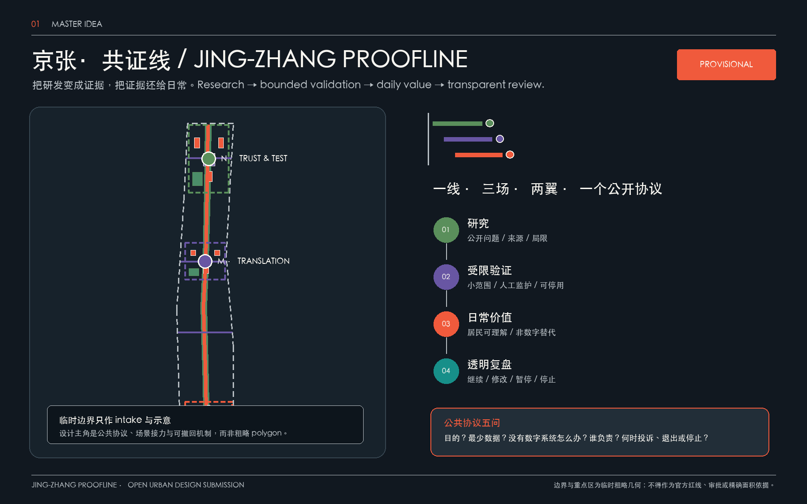
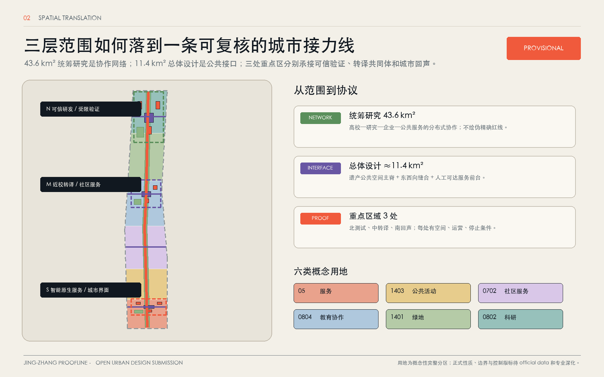
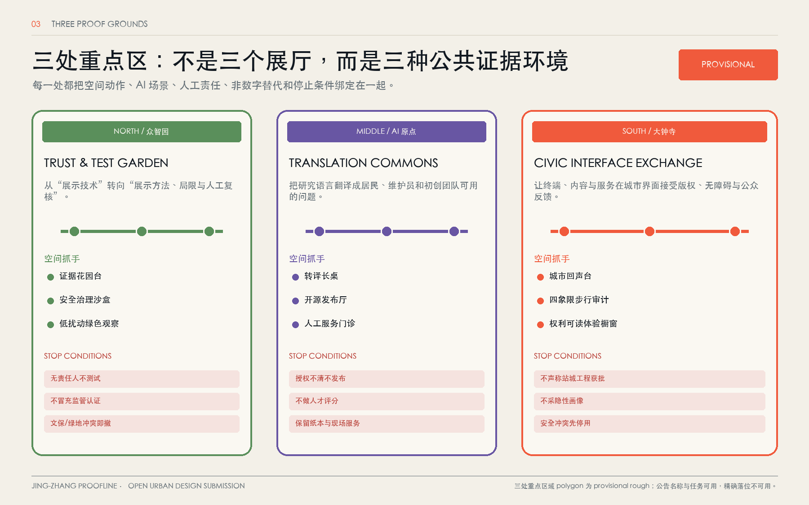
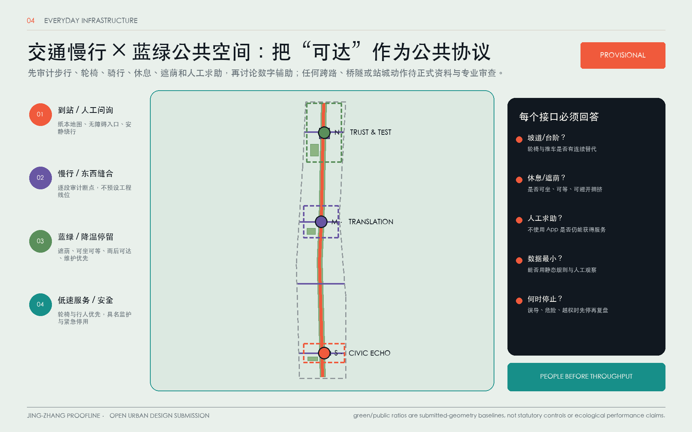
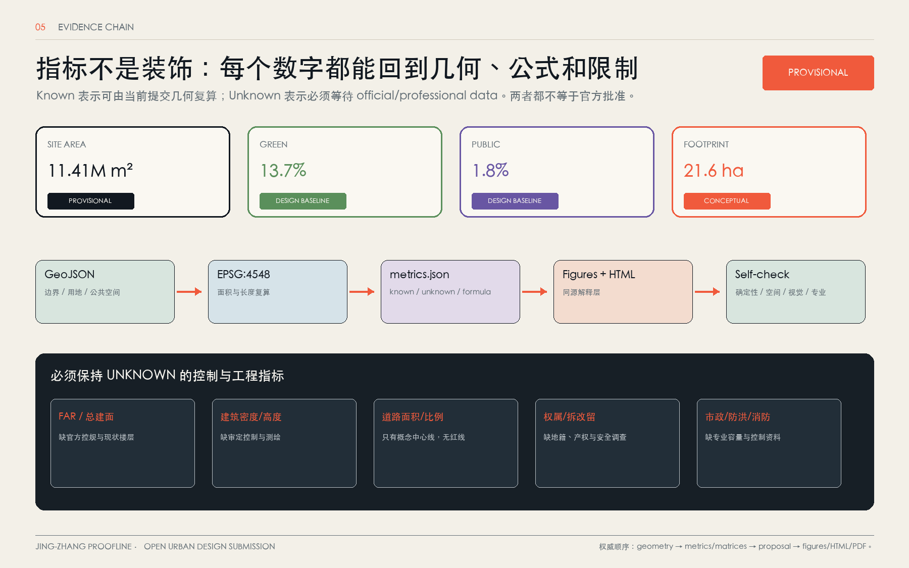

# 京张·共证线：百年轨道上的可信 AI 公共创新协议

**Jing-Zhang Proofline**

> **口号：把研发变成证据，把证据还给日常。**
>
> *Turn research into proof; return proof to daily life.*

本方案把京张铁路遗产公共空间理解为一条“共证线”：不是新画一条红线，而是把研究节点、可控测试、居民可感知的服务和公开复盘串成一条可来回走的公共路径。每一次 AI 介入都必须回答五个问题：为什么做、最少需要什么数据、没有数字系统时怎么办、谁对结果负责、何时接受投诉、退出或停止。由此，研究不再停留在园区内部，公共空间也不被当作技术展示橱窗，而成为可以质询、试用、拒绝和修正的共同证据场。

**设计状态声明。** 本文本是概念性、开放的参考方案，服务于城市设计研究、公共讨论和专业团队后续深化；它不是法定规划、控制性详细规划、工程可行性研究、已确认的实施方案、投资承诺、审批结论或任何政府承诺。当前 `site_boundary.geojson` 与 `key_areas.geojson` 为临时粗略边界，所有空间判断均须在取得官方 polygon、控规、权属、工程和文保资料后复核。未有官方条件的容积率、建筑高度、密度、道路红线、拆改留和市政结论一律不写成控制指标。

## 设计依据与资料清单

本方案从公开公告、项目场地包、资料登记和处理事实包开始，而不是从一张想象的总平面开始。项目目的、三层范围和任务边界回到 [source:OFFICIAL-ANNOUNCEMENT]；智能体共创要求、三大定位、五大功能和六项任务回到 [source:AGENT-TASKBOOK]；文件和字段使用边界回到 [source:SITE-PACKAGE] 与 [source:SOURCE-REGISTRY]；可读导航回到 [source:PROCESSED-FACT-PACK]；临时总体边界和重点区索引分别回到 [source:BOUNDARY-SOURCE] 与 [source:KEY-AREA-SOURCE]。新增的全球案例仅作为背景和可转移机制参考： [source:CASE-ONE-NORTH]、[source:CASE-MILA]、[source:CASE-VECTOR]、[source:CASE-KNOWLEDGE-QUARTER]、[source:CASE-KENDALL]、[source:CASE-STATION-F]。

证据结构同时遵循 [standard:PROJECT-OFFICIAL-ANNOUNCEMENT]、[standard:PROJECT-AGENT-OPEN-CALL-TASKBOOK]、[standard:MOHURD-URBAN-DESIGN-MEASURES]、[standard:MOHURD-CONTROL-DETAILED-PLANNING]、[standard:MNR-LAND-USE-CLASSIFICATION-GUIDE] 和 [standard:MOHURD-ARCH-DESIGN-DEPTH-2016]。其中后一个建筑深度标准在正式文件未纳入场地包前，只作为深化提醒，不产生法定结论。

### 资料如何被使用

| 资料层 | 本方案的使用 | 明确不做的事 |
| --- | --- | --- |
| 公告与任务书 | 确认任务目的、空间层级、三个重点区名称和成果责任 | 不把概念任务书写成建设批复 |
| 公开/清权资料登记 | 追踪每项判断的来源、许可和风险 | 不把 background-only 或 provisional-only 资料升级为官方控制 |
| 临时几何 | 组织讨论、场景定位、可视化和初步复算 | 不作为 official redline、精确面积、审批或投资依据 |
| 全球公开案例 | 提炼“如何组织协作、测试、传播和社区接口”的可转移机制 | 不据此宣称京张边界、管理权、融资或运营已确定 |
| 已知指标 | 作为提交几何的 baseline，便于后续替换官方数据后复算 | 不把几何推导值冒充规划条件或绩效结果 |

### 当前可读空间证据

本次正文逐一引用现有九个 GeoJSON 文件。它们的文件名和对象 ID 是可读索引，而不是对空间权属的断言：

| 文件 | 当前可读对象 | 证据引用 |
| --- | --- | --- |
| `geometry/site_boundary.geojson` | 临时总体设计范围 `SITE-001` | [data:geometry/site_boundary.geojson#SITE-001] |
| `geometry/key_areas.geojson` | 三个临时重点区 `PROV-KEY-001/002/003` | [data:geometry/key_areas.geojson#PROV-KEY-001]、[data:geometry/key_areas.geojson#PROV-KEY-002]、[data:geometry/key_areas.geojson#PROV-KEY-003] |
| `geometry/land_use.geojson` | `LU-001` 至 `LU-004` 用地建议分区 | [data:geometry/land_use.geojson#LU-001]、[data:geometry/land_use.geojson#LU-002]、[data:geometry/land_use.geojson#LU-003]、[data:geometry/land_use.geojson#LU-004] |
| `geometry/buildings.geojson` | `BLDG-001` 建筑基底建议 | [data:geometry/buildings.geojson#BLDG-001] |
| `geometry/roads.geojson` | `ROAD-001` 慢行与创新服务廊道建议 | [data:geometry/roads.geojson#ROAD-001] |
| `geometry/green_space.geojson` | `GREEN-001` 连续公园绿地建议 | [data:geometry/green_space.geojson#GREEN-001] |
| `geometry/public_space.geojson` | `PUBLIC-001` 公共活动界面建议 | [data:geometry/public_space.geojson#PUBLIC-001] |
| `geometry/constraints.geojson` | 当前为空的约束登记层，保留 `CONSTRAINTS` 证据位 | [data:geometry/constraints.geojson#CONSTRAINTS] |
| `geometry/phasing.geojson` | `PHASE-001` 一期可讨论范围 | [data:geometry/phasing.geojson#PHASE-001] |

`SITE-001` 和三个 `PROV-KEY` 对象的 `official_boundary=false`、`provisional_constraint` 属性必须被保留在阅读中。现有 `constraints.geojson` 没有 feature，故不能替代道路红线、管线、消防或文保控制线。官方边界到位后的复算顺序写入 `assumptions.json`，在本次内容更新中不改动几何、指标或图纸。

## 三层范围工作框架

本方案以三层范围形成“研究—验证—日常”的尺度梯度：[depth:existing_conditions_diagnosis]、[depth:three_level_scope_framework] 和 [depth:overall_spatial_structure] 共同约束现状诊断、范围关系和总体结构。

| 层级 | 任务尺度 | 共证线的空间回答 | 证据与限制 |
| --- | --- | --- | --- |
| 统筹研究范围 | 公告所述约 43.6 平方公里，从北五环、京藏高速、西直门外大街至万泉河路的研究语境 | 形成创新生态、公共价值和区域协同的研究地图，不画新的法定边界 | 任务范围依据 [source:OFFICIAL-ANNOUNCEMENT] 和 [source:PROCESSED-FACT-PACK]；正式 polygon 待补 |
| 总体设计范围 | 公告所述约 11.4 平方公里、京张遗址公园周边 1—2 公里的设计语境 | 以京张遗产公共空间为一线，连接三场和两翼；用地、建筑、道路、蓝绿和分期互相校验 | 临时边界见 [data:geometry/site_boundary.geojson#SITE-001]；面积基线见 [metric:site_area_sqm] |
| 重点区域范围 | 公告所述约 368.4 公顷的三个重点区域 | 三场各有可体验的公共界面、可预约测试和可复盘社区机制 | 三个 polygon 均为 provisional，见 [data:geometry/key_areas.geojson#PROV-KEY-001]、[data:geometry/key_areas.geojson#PROV-KEY-002]、[data:geometry/key_areas.geojson#PROV-KEY-003] |

三层不是三套互不相干的成果。研究层提出问题和伙伴；总体层把问题转为路径、场地组件、服务节点和分期门槛；重点区层把节点变成可预约、可观察、可投诉的微型试验。每一项由“问题—最小数据—人类责任—公共反馈—停止条件”组成，才允许进入下一尺度。现有场地图层分别提供用地、建筑、道路、绿地、公共空间和分期的讨论底图，正式边界替换后必须重新校核拓扑和面积。

## 统筹研究范围产业与未来城市研究

### 共证线的三大定位与五大功能

三大定位来自任务书，但在本方案中由空间体验重新组织：

1. **百年京张文化带**：以遗产轨道和公共记忆建立一条可步行、可阅读、可停留的城市叙事线。
2. **都市 AI 生活体验带**：把 AI 变成可拒绝、可解释的日常服务，而不是只在封闭园区中展示的技术。
3. **AI 融合创新带**：把高校研究、开源协作、企业转化、场景验证和公共评议放在同一条反馈回路中。

五大功能由“空间接口 + 责任人”承接：

| 功能 | 共证线的转译 | 主要接口 |
| --- | --- | --- |
| AI 全栈自主创新体系 | 在受限测试空间公开方法、限制和结果 | 众智园的 Trust & Test Garden |
| 世界级 AI 创新生态 | 把研究、开源、转译、企业服务和人才生活连接起来 | AI 原点社区的 Translation Commons |
| AI+场景赋能新范式 | 以最小数据、非数字替代和可退出机制验证公共价值 | 小月河场景赋能翼 |
| 智能化 AI 活力城市 | 让公共空间、慢行、服务和文化活动形成日常使用 | 京张一线与城市回声台 |
| AI 治理全球话语权 | 把证据卡、审查记录、投诉和停用决定公开沉淀 | 年度 Proofline Review |

以上任务转译回 [standard:PROJECT-AGENT-OPEN-CALL-TASKBOOK] 与 [source:AGENT-TASKBOOK]；本节并不宣称任何产业、活动、管理权或政策已经落地。

### “一线、三场、两翼、一个公开协议”

- **一线｜Heritage Rail Public-Space Spine**：沿京张铁路遗产公共空间组织连续阅读、慢行和停留；它是公共空间和运营的概念骨架，不是新建轨道、道路红线或工程线位。
- **三场｜Three Proof Spaces**：
  - **众智园｜Trust & Test Garden**：把模型、标准、安全和低碳算力的测试转为可预约、可旁观、可撤回的花园型验证场。
  - **AI 原点社区｜Translation Commons**：把论文、代码、产品、法律和居民问题放到同一张“转译长桌”上，提供跨专业解释与成果转化接口。
  - **大钟寺｜Civic Interface Exchange**：把轨道站点周边的通勤、商务、消费和公众评议组织成有证据入口的城市界面交换场。
- **两翼｜Two Relays**：
  - **中关村科技服务翼｜resource relay**：提供算力、知识产权、法务、融资和人才服务的转介目录；只做资源导航与协作协议，不承诺资金或准入。
  - **小月河场景赋能翼｜daily-life scenario relay**：把医疗、教育、法律、生活服务、慢行和生态问题转成可小规模验证的日常场景；只使用必要的聚合数据。
- **一个公开协议｜Open Proofline Protocol**：任何场景必须公开目的、最少数据、非数字替代、负责人、投诉/退出/停止规则、版本和复盘日期；居民、工作人员和开发者可以要求查看或质疑证据卡。

这套结构把重点区名称转为“工作角色”，不改变公告范围，不把 `PROV-KEY` polygon 解释成法定边界。`[depth:overall_spatial_structure]` 和 `[data:geometry/key_areas.geojson#PROV-KEY-002]` 共同提供可回查的空间锚点。

### 名称、Logo、色彩与导视

- **主名称**：京张·共证线；**英文**：Jing-Zhang Proofline；“Proofline”同时指轨道线、证据链和可追踪的迭代路径。
- **口号**：把研发变成证据，把证据还给日常。中英文口号不承诺技术效果，只承诺公开验证的工作方式。
- **Logo 方向**：以两条不闭合的平行线表示历史轨道与当代数据链，在一处用“开口方框”形成站点/证据窗口；窗口内留白代表公众可以插入问题、拒绝使用或要求复核。线条、方框和文字均为原创方向，不调用企业商标、人物肖像、未经授权字体或旧标识。
- **原创色板**：`Rail Silver #7B8C93`（轨道与背景线）、`Sleeper Ink #1D252A`（正文和夜间底色）、`Qinghe Teal #197C78`（蓝绿和可持续行动）、`Signal Orange #D96B38`（需注意/停止提示）、`Paper Proof #F3EEE3`（纸本证据）、`Commons Violet #695B8D`（转译和社区活动）。橙色只用于行动和风险，不用作装饰渐变；文字对比、色盲可读和大字号需由后续无障碍审查确认。
- **导视方向**：每个节点采用“线段—站号—证据卡编号”三层编码；颜色始终配合文字、触觉凹凸线和图形，不以颜色作为唯一信息。路牌提供中文、英文、拼音/编号、轮椅可达方向、安静路线和纸本说明；节点旁有纸质地图、人工问询和电话/现场反馈入口。

### 六个全球案例与可转移机制（仅背景参考）

下表严格选取六个案例；对应公开主页只用于理解组织方式和可转移机制，不支持京张的边界、控制、企业名单、投资额、审批或政府承诺。

| 案例 | 从公开资料可借鉴的机制 | 转为共证线的动作 | 使用限制 |
| --- | --- | --- | --- |
| **Singapore one-north** | 以研究、产业、生活和公共空间形成创新地区的复合接口 | 以“一线 + 两翼”组织研究到日常的资源转介，而非复制其规划形态 | 仅背景参考，不能据此推定海淀的开发控制或治理权限；[source:CASE-ONE-NORTH] |
| **Mila** | 研究机构、人才社区与开放交流共同构成可见的研究生态 | 在 Trust & Test Garden 公开问题定义、测试边界和方法说明 | 仅背景参考，不导出研究机构关系、运营主体或绩效承诺；[source:CASE-MILA] |
| **Vector Institute** | 通过研究、人才、产业伙伴和公共讨论建立可信 AI 的转译接口 | 用 Translation Commons 把研究语言转成居民、企业和服务人员能复核的证据卡 | 仅背景参考，不代表任何合作、授权或模型能力；[source:CASE-VECTOR] |
| **Knowledge Quarter** | 文化、知识机构和公共活动可以形成可步行的城市知识网络 | 用 Heritage Rail Public-Space Spine 串起遗产阅读、开源活动和公共复盘 | 仅背景参考，不证明京张已有同等组织或边界；[source:CASE-KNOWLEDGE-QUARTER] |
| **Kendall Square** | 研究、企业、街道生活与公共空间之间的高频交往可支持创新生态 | 在 Civic Interface Exchange 配置通勤、商务、消费与公众反馈的混合界面 | 仅背景参考，不用于推断地价、产业规模、交通能力或开发强度；[source:CASE-KENDALL] |
| **Station F** | 以共享基础设施、创业者社区和公开活动降低创新网络的进入门槛 | 由中关村科技服务翼提供“资源 relay”，以预约和清晰资格条件服务团队 | 仅背景参考，不表示引入其品牌、运营模式、投资关系或招引结果；[source:CASE-STATION-F] |

转移不是形式复制，而是把机制拆成四个可检查动作：**共同问题清单**（谁的问题）、**最小测试包**（只用什么数据）、**公开接口**（谁可以看/问/拒绝）、**年度复盘**（何时继续/改写/停止）。六个案例的公开主页仅服务于 agent.2 的背景研究，不成为事实或规划控制来源。

### 京张—中关村—AI 的文化叙事

共证线分三幕讲故事：第一幕是**轨道把知识和人带到一起**——不把铁路遗产消费化，而是让路基、站点、桥下和沿线公共空间成为可以慢慢读的时间层；第二幕是**中关村把知识变成协作**——高校、开发者、企业、服务机构和居民各自带着问题进入转译桌，不把“创新”缩成某一家公司的 logo；第三幕是**AI 把协作变成可质询的日常服务**——每个场景留下目的、数据、人工判断和停用记录，让城市智能以人的尊严和选择权为终点。

文化表达采用三种载体：轨道旁的**时间刻度**记录可核实的公开史料来源；社区和园区之间的**贡献刻度**记录代码、研究、维护和居民反馈的贡献类型；公共服务节点的**复盘刻度**记录一次测试如何被采用、改写或停止。历史信息必须经过文保和史料专业复核，人物、照片、商标和论文图像在清权前不进入视觉系统。

## 总体设计范围城市更新与控规深度城市设计

### 结构落地：从空间分区到公共协议

总体设计把“一线、三场、两翼”落在可读的空间分区上，但不把建议分区冒充控规：

| 空间对象 | 设计动作 | 当前证据 | 待确认控制 |
| --- | --- | --- | --- |
| `LU-001` AI 研发创新用地 | 允许研究、开源、测试和展示形成首层公共界面 | [data:geometry/land_use.geojson#LU-001]、[standard:MNR-LAND-USE-CLASSIFICATION-GUIDE] | land_use_code、权属、强度和准入条件 |
| `LU-002` 公园绿地与开敞空间 | 把证据花园台、慢行和生态教育叠合，不设置持续监控 | [data:geometry/land_use.geojson#LU-002]、[data:geometry/green_space.geojson#GREEN-001] | 绿地、蓝线、文保、消防和防洪条件 |
| `LU-003` 产业服务与商业服务用地 | 承接大钟寺 Civic Interface Exchange 和中关村 resource relay | [data:geometry/land_use.geojson#LU-003] | 现状业态、权属、交通承载和商业许可 |
| `LU-004` 社区服务与配套用地 | 承接日常生活场景、人工服务和无障碍休息点 | [data:geometry/land_use.geojson#LU-004] | 设施底数、服务半径、社区意见和运营主体 |

方案遵循 [standard:MOHURD-URBAN-DESIGN-MEASURES] 的平面—立体统筹方向，以及 [standard:MOHURD-CONTROL-DETAILED-PLANNING] 对“已知、建议、待确认”的分层表达。`[depth:land_use_layout]`、`[depth:development_intensity_controls]` 和 `[depth:height_massing_character]` 只描述设计逻辑；不输入未经证实的 FAR、建筑高度、密度、退线或建筑控制线。

### 建筑与拆改留

`BLDG-001` 是 AI 研发示范建筑基底的设计建议层，当前 `building_footprint_area_sqm` 只能作为几何 baseline，见 [data:geometry/buildings.geojson#BLDG-001] 与 [metric:building_footprint_area_sqm]。在缺少现状测绘、建成年代、层数、用途、权属和文保调查时，所有建筑对象按三种“工作标签”讨论，而非做拆迁决定：

- **保留/读取**：先保留可阅读的轨道、街巷、建筑界面和社区服务，补充无障碍和安全改善；不等于确认文保等级。
- **转译/再用**：通过首层公共接口、可逆家具、共享工作和展陈把现有空间转为协作载体；须经权属人和专业设计确认。
- **更新/待核**：把可能需要更新的建筑记为待核对象，先做小型可撤设施和使用测试，待测绘、控规、消防和产权条件齐全后再研究工程方案。

该方法回应 [depth:retain_renovate_demolish]，也落实 [standard:MOHURD-ARCH-DESIGN-DEPTH-2016] 的“取得正式文件后启用”限制。任何“拆、建、加高、扩容”词语在本方案中都只能表示待专业团队验证的假设。

### 三场与两翼的更新界面

- 众智园优先形成“花园—测试室—证据台”的低扰动梯度；技术测试在可预约的受限空间完成，公共面只展示方法、限制和已去敏的结果。
- AI 原点社区形成“安静工作—转译长桌—成果发布—社区日常”的梯度；发布内容提供纸本和人工解释，不把校园、园区或居民数据接入为必要条件。
- 大钟寺形成“站点到街角—Civic Interface Exchange—商业服务—城市回声台”的梯度；重点是可达、可停、可问和可退出，而非大体量建筑动作。
- 中关村科技服务翼做资源 relay：建立公共服务目录和人工转介时段，记录需求类型而非个人轨迹。
- 小月河场景赋能翼做日常场景 relay：以雨洪、步行、教育、健康和生活服务问题为入口，先进行可逆验证再决定是否扩大。

## 重点区域详细设计

三处重点区均以临时 polygon 作为当前讨论的“场地信封”，而不是官方边界；分别引用 [data:geometry/key_areas.geojson#PROV-KEY-001]、[data:geometry/key_areas.geojson#PROV-KEY-002] 和 [data:geometry/key_areas.geojson#PROV-KEY-003]。详细设计深度由 [depth:three_key_area_detailed_design] 校核，并把每一个动作连接到公共空间、道路、绿地、建筑和分期证据。

### 众智园｜Trust & Test Garden

**空间命题：在花园里测试，在公共面上解释。** 北部场以连续绿地和可停留边界形成低门槛的验证花园：内侧为预约制、可隔离、可停止的模型和服务测试；外侧为证据花园台、纸本说明和非数字体验。首要任务不是建造新体量，而是把“测试条件—人工复核—结果限制”做成可被路过者看懂的三张卡。

- **三条空间带**：安静研究带、可观察验证带、开放交流带；带与带之间以可撤的栏杆、植栽和导视区分，不依赖摄像头。
- **三个公共动作**：每周一场安全治理沙盒旁观时段；每月一次低碳/雨洪与步行数据的公开解读；每季一次社区 stop/go 评议。
- **产业接口**：中关村 resource relay 只提供服务转介；模型安全、标准和知识产权问题由相应专业人员承担，AI 不替代审批。
- **验证边界**：只可用预约团队提交的测试样例、聚合环境数据和人工观察；禁止人脸、可识别轨迹和未经同意的科研资料。

### AI 原点社区｜Translation Commons

**空间命题：把不同语言放到同一张桌上。** 原点社区以“研究—转译—生活”的近校型界面为重点：安静的研究与开源空间面向团队，转译长桌面向居民和服务人员，成果发布厅面向公开活动，边缘设置可不联网的咨询台。

- **转译长桌**提供中文/英文/图示/触觉四种解释层：任何发布都同时呈现目的、证据、未知项和争议项。
- **近校成果转化街**以可逆首层界面承接知识产权、法务、创业咨询和公共讲解；不把高校、园区、街区或建筑改造写成已获同意。
- **人才日常支持**优先补足可负担的休息、托幼/照护信息、夜间安全、无障碍卫生间和人工问询，避免把“人才”简化为高强度工作者。
- **退出机制**：团队可选择纸本发布或撤回未成熟结果；居民可以不提供数据，只参加人工访谈或查看公开记录。

### 大钟寺｜Civic Interface Exchange

**空间命题：把繁忙节点变成可质询的城市界面。** 大钟寺重点处理站点周边步行连续、四象限可读性、公共服务和商业界面的关系；不提出轨道、道路、地下空间或桥隧工程线位。

- **站点四象限**以“可达入口—短暂停留—方向确认—反馈台”建立步行体验；每个方向提供阶梯、坡道、安静绕行和人工问询的并列信息。
- **智能原生业态**采用小尺度、可撤的展示桌、维修/学习/演示时段和内容消费接口，服务智能体、终端和数据治理的公共解释，不把企业 logo 当作公共价值。
- **城市回声台**接收居民、通勤者和访客对拥堵、噪声、无障碍、服务误导和隐私的投诉；纸卡、电话、现场口述和线上表单（后续如有）同等有效。
- **停止触发**：出现误导性推荐、无法解释的拒绝服务、无障碍阻断或未经授权采集时，现场负责人必须先停用场景，再公开复盘。

## AI 创新生态、人才画像与 AI+ 场景

本节把创新生态落实为“人—场景—空间—责任”的可读协议：任务依据来自 [source:AGENT-TASKBOOK] 与 [standard:PROJECT-AGENT-OPEN-CALL-TASKBOOK]，空间接口回到 [data:geometry/public_space.geojson#PUBLIC-001]，并由 [depth:overall_spatial_structure] 约束其与三层范围的关系。

### 七类使用者与责任关系

画像不是监控模板，也不要求收集个人身份；它只描述设计要服务的需求和可能的障碍。

| 画像 | 关键需求 | 可能障碍 | 共证线的回应 |
| --- | --- | --- | --- |
| 开源开发者 | 低门槛发布、协作、测试和贡献记录 | 资质门槛、表达语言、夜间安全 | Translation Commons、纸本/人工发布、贡献可撤回 |
| 初创团队 | 可解释的测试、算力与法务转介 | 成本、数据授权、试错风险 | Trust & Test Garden、resource relay、预约小试 |
| 高校师生 | 研究转译、成果保护、日常慢行 | 研究伦理、知识产权、时间碎片 | 转译长桌、去敏证据卡、近校休息点 |
| 头部企业访客 | 公开展示、商务交流、人才沟通 | 企业数据和品牌清权 | Civic Interface Exchange、明确授权的发布窗口 |
| 周边居民 | 通勤、休闲、社区服务、安静和安全 | 数字门槛、噪声、隐私疑虑 | 人工问询、纸本地图、城市回声台、非数字替代 |
| 无障碍使用者 | 连续可达、清晰方向、平等反馈 | 坡度/台阶、低对比、听觉/视觉障碍 | 无障碍路线审查、触觉导视、字幕/手语/人工陪同 |
| 公共服务与维护人员 | 可操作的告警、工单、责任和停用权 | 责任不清、系统幻觉、资源不足 | 每场景责任人、双人复核、纸本工单和停止按钮 |

### 场景协议

场景卡不允许只写“用 AI 提升效率”。每张卡须明确六项：目的、最小数据、非数字替代、 accountable human（中文责任人）、投诉/退出/停止规则和复盘日期。下表中的“测试/验证”表示可在概念治理框架内受限试验，不表示获批部署。

| 卡 | 类型与空间 | 目的和验证问题 | 最小数据 | 非数字替代 | 负责的人 | 投诉 / 退出 / 停止规则 |
| --- | --- | --- | --- | --- | --- | --- |
| 01 证据花园导航 | **测试/验证**；众智园入口 | 验证是否能让访客找到安静、无障碍和人工服务路线 | 静态路线、时段、设施状态；不记录人 | 纸本地图、人工领路、触觉线 | 场地无障碍协调员 | 任何路线误导或阻断即停用；现场/纸卡反馈，访客可拒绝数字导航 |
| 02 安全治理沙盒 | **测试/验证**；Trust & Test Garden | 验证模型安全规则能否被公众看懂并由人复核 | 预约测试样例、规则版本、人工判定 | 纸本红队脚本和人工评审会 | 安全评测负责人 + 社区观察员 | 结果无法解释、泄露样例或越权即停止；团队可撤回样例 |
| 03 低碳与雨洪解释台 | **测试/验证**；清河/小月河公共界面 | 验证环境数据能否帮助日常选择而不制造虚假精确 | 聚合温湿度、降雨、绿地状态 | 纸本天气/步行建议、现场维护员 | 蓝绿空间维护负责人 | 数据漂移、预警误导或涉人识别即停；公众可不参与 |
| 04 慢行断点观察 | **测试/验证**；一线连接段 | 找出步行/骑行/轮椅断点，比较人工观察与低侵入工具 | 匿名计数、障碍点、时段和人工记录 | 纸笔审计、无障碍走访 | 交通与无障碍审查员 | 不采轨迹；发现危险先撤设备并改用人工记录 |
| 05 原点成果转译 | Translation Commons | 验证研究摘要能否被居民和服务人员理解 | 经作者授权的摘要、图表和版本号 | 纸本摘要、人工讲解、离线展板 | 转译编辑 + 原作者 | 作者可撤回；误译、版权争议或缺引用时下架并公开更正 |
| 06 开源发布厅 | AI 原点社区 | 支持代码/方法/问题公开发布，记录贡献而非个人画像 | 授权发布包、许可、联系人角色 | 纸本发布册、人工登记 | 社区运营人 | 许可不清、个人资料外泄即停止发布；可匿名贡献 |
| 07 资源 relay 门诊 | 中关村科技服务翼 | 验证团队是否能获得可理解的法务、知识产权和算力转介 | 需求类别、预约时段、服务目录 | 现场门诊、电话、纸本目录 | 科技服务值班人 | 不做自动资格判定；错误转介可投诉，服务人可暂停目录项 |
| 08 四象限步行提示 | **验证**；大钟寺站周边概念界面 | 验证方向信息和短暂停留点是否减少迷路/冲突 | 静态路口、坡道、施工告示、人工观察 | 站口志愿者和纸牌 | 站城界面协调员 | 不提出工程改造；信息过期即撤牌并人工校正 |
| 09 城市回声台 | 大钟寺公共界面 | 收集噪声、拥堵、服务误导、隐私和无障碍反馈 | 自愿描述、地点类型、时间段；不强制身份 | 纸卡、电话、面对面记录 | 社区反馈主持人 | 投诉可匿名；敏感内容转人工保管，出现伤害信号先停场景 |
| 10 AI 生活服务样板街 | 小月河场景赋能翼 | 验证医疗、教育、法律、生活服务导航是否可解释 | 公开服务目录、用户主动输入的问题类别 | 人工服务台、纸本目录、电话转介 | 公共服务协调员 | 不给诊断/法律结论；错误或无法人工复核即停用 |
| 11 夜间安静路线 | 一线与社区服务节点 | 验证夜间照明、安静、休息和人工求助是否可达 | 静态照明/开放时段、志愿者巡查记录 | 纸本路线、人工陪同、电话求助 | 夜间公共空间值班人 | 不做人脸/轨迹识别；照明失效或安全事件即暂停路线并公告 |
| 12 Proofline Review | 三场轮换 | 每年复盘哪些场景继续、改写或停止 | 证据卡版本、聚合使用/投诉/停用次数 | 公开会议、纸本意见箱、人工汇报 | 年度评议小组 | 公众可要求复核；若无责任人或无非数字替代，不得续期 |

### 场景安全底线

- **数据最小化**：不采集人脸、声纹、精确个人轨迹、健康诊断、未授权科研材料或个人画像；能用静态规则、聚合计数和人工观察时，不用持续传感。
- **人工最终判断**：AI 只提出提示、分类或候选；拒绝服务、公共安全、医疗、教育、法律、版权、无障碍和停用决定必须由具名角色复核，至少保留一个人工复核记录。
- **可退出与非数字替代**：所有场景同时提供纸本、电话、现场工作人员、无障碍辅助和不参与选项；没有替代路径的场景不得进入 P1。
- **投诉与停止**：场景牌在现场写明负责人、版本、投诉渠道和停止条件；工作人员有即时停用权，停用不以模型再次确认作为前置。
- **可追溯**：只公开聚合统计、规则版本和复盘结论；原始反馈按最小权限、最短保存期管理，本文不建立个人数据系统。

## 用地、建筑规模与拆改留方案

本节以 [depth:land_use_layout]、[depth:development_intensity_controls]、[depth:height_massing_character] 和 [depth:retain_renovate_demolish] 作为设计深度索引。用地建议使用已有 `land_use_code` 和 `geometry/land_use.geojson` 的 `LU-001` 至 `LU-004` 表达，符合 [standard:MNR-LAND-USE-CLASSIFICATION-GUIDE] 的“分类可校验”方向，但不等于规划用途已经审定。

### 建筑与空间强度的分层

| 层级 | 可以提出的建议 | 不能提出的结论 | 下一步证据 |
| --- | --- | --- | --- |
| 现有几何 baseline | 比较建筑基底、绿地、公共空间和一线关系 | 不能从基底推断总建面、层数或权属 | 现状测绘、建筑调查、权属清单 |
| 形态导则 | 连续首层公共界面、可逆遮阳、屋顶设备可读、夜间低扰动 | 不能给具体高度、退线、密度或风貌控制线 | 控规、城市设计导则、文保和消防意见 |
| 拆改留工作标签 | 保留/读取、转译/再用、更新/待核 | 不能指定拆除、征收、扩建或投资 | 产权、地籍、建筑安全和专业设计 |

`floor_area_ratio` 当前是 unknown，不能用面积表倒推。`building_footprint_area_sqm` 的 baseline 见 [metric:building_footprint_area_sqm] 和 [data:geometry/buildings.geojson#BLDG-001]，只表示提交几何的建筑基底建议。所有强度、建筑高度和体量结论均标为“待正式控规条件确认”，落实 [standard:MOHURD-CONTROL-DETAILED-PLANNING]。

## 交通、轨道、市政与公共服务设施

交通策略遵循 [depth:traffic_rail_slow_parking]：以轨道/公交到站、步行和骑行为优先的可达层级，叠加低速服务和应急通道的专业复核；`ROAD-001` 只表示概念性的慢行与创新服务廊道，见 [data:geometry/roads.geojson#ROAD-001]。本方案不绘制工程线位、不承诺站城一体化改造，也不把大钟寺四象限写成批准工程。

### 一线 mobility spine

1. **到站层**：从站点或公交落客处先找到人工问询、纸本地图、无障碍入口和安静路线。
2. **慢行层**：以连续、可停留、可照明和可解释的步行/骑行路径串联三场；每个断点先做人工障碍审计，再决定是否设置可撤标识。
3. **公共服务层**：把资源 relay、生活服务和投诉台布置在可见首层，不要求使用 App 才能获得服务。
4. **低速服务层**：维护、配送、应急和无障碍接驳的时段与路径由交通、消防和市政专业团队另行确认。

### 市政与公共服务接口

[depth:municipal_new_infrastructure] 约束新型基础设施的保守表达。端侧算力、分布式能源、排水、雨洪、消防、管线、通信和维护只作为“需要验证的系统清单”：先做容量和安全基线，再决定是否有试验必要。`geometry/constraints.geojson` 当前没有 feature，故以 [data:geometry/constraints.geojson#CONSTRAINTS] 记录数据缺口，不伪造管线或消防结论。

公共服务按“人工可达 + 数字辅助”配置：证据花园台旁设人工解释；转译长桌提供纸本和语言辅助；城市回声台提供口述、电话和纸卡；社区节点提供无障碍、饮水、休息、卫生间和夜间求助信息。设施位置和服务半径待官方公共服务底数、消防、市政和 accessibility audit 后确认。

## 蓝绿空间、公共空间与城市风貌

### 蓝绿与 mobility strategy

蓝绿策略不是把河道当作背景，而是把清河、小月河、京张遗址公共空间、绿地和步行问题放入同一个“可复核的日常基础设施”中。设计动作分为：

- **南北贯通**：沿遗产一线形成连续阅读与慢行序列；若遇道路、桥下、轨道或权属障碍，先用纸本导视、临时座椅和人工引导验证需求，不预设桥隧工程。
- **东西缝合**：从三场向高校、社区、园区和中关村服务翼提供可达接口；每一处接口必须同时标出坡道、台阶、安静绕行、休息点和人工问询。
- **蓝绿降扰**：以植栽、雨洪教育、遮荫、坐凳和低亮度导视形成可停留的缓冲；`GREEN-001` 是建议绿地层，见 [data:geometry/green_space.geojson#GREEN-001]。
- **公共空间可证**：`PUBLIC-001` 表达公共活动界面，见 [data:geometry/public_space.geojson#PUBLIC-001]；所有活动按噪声、照明、无障碍、文保、蓝线和消防条件逐项复核。

蓝绿公共空间的设计深度为 [depth:blue_green_public_space]，现有几何 baseline 由 [metric:green_ratio]、[metric:public_space_ratio] 支撑；不将它们写成官方绿地率、公共服务率或生态绩效。

### 三个公共地标/组件

1. **证据花园台｜Evidence Garden Deck**：低台阶/坡道并置的公共坐席与纸本证据墙，展示一个场景的目的、最小数据、人工判断、未知项和停用状态；不安装必需摄像头，不把停留者身份写入记录。
2. **转译长桌｜Translation Table**：可拼合的长桌、触觉地图和双语/图示材料，支持研究者、居民、维护员和服务机构共同改写一张证据卡；桌面提供纸、笔和安静席位，数字屏只是可选辅助。
3. **城市回声台｜Civic Echo Stand**：面向站点和社区界面的可见反馈台，接收纸卡、口述、电话和人工登记；每周公布聚合问题和处理状态，不公布个人故事或未经同意的录音。

三个组件均为可逆、可拆、可迁移的概念组件，不等于永久建筑或工程项目；其位置需结合 official boundary、消防、文保、绿地和权属复核。

### 风貌与导视

风貌以“铁路的耐久、社区的可亲、AI 的可解释”为三条控制语言：耐久对应节制的材料和可维修节点；可亲对应纸本、休息、遮荫和无障碍；可解释对应清晰的版本、证据和责任人。所有历史叙事先查公开史料并清权；不使用未经授权的老照片、人物肖像、企业字体或商标。导视沿用 Rail Silver、Sleeper Ink、Qinghe Teal、Signal Orange、Paper Proof、Commons Violet 的功能分工，并以文字、编号、图形和触觉并列表达。

## 更新项目清单、实施政策与分期计划

项目清单采用“先可逆验证、再专业复核、后决定是否永久化”的原则，对应 [depth:renewal_project_list]、[depth:phasing_implementation] 和 [data:geometry/phasing.geojson#PHASE-001]。项目编号是本方案的工作标签，不是立项或投资清单。

| 编号 | 概念项目 | 先做什么 | 关键依赖/停止条件 |
| --- | --- | --- | --- |
| JZ-01 | 京张一线断点证据走访 | 纸笔无障碍/安全/噪声走访，布置可撤导视 | 遇道路红线、施工或文保冲突即停止现场布置，转为桌面研究 |
| JZ-02 | 众智园证据花园台 | 预约安全治理沙盒和公共解释台 | 文保、绿地、消防、运营责任人未确认不开放测试 |
| JZ-03 | 原点社区转译长桌 | 纸本成果转译、开源发布和人工门诊 | 知识产权、校园/园区边界、版权未清不发布 |
| JZ-04 | 大钟寺城市回声台 | 纸卡、电话和人工反馈试运行 | 无障碍入口、站点管理和投诉保管机制未明确不采集 |
| JZ-05 | 中关村科技服务 resource relay | 公共目录和固定人工转介时段 | 不做自动资格判定；服务目录不实即撤下 |
| JZ-06 | 小月河日常场景 relay | 雨洪、步行、教育/生活服务的最小试验 | 生态、防洪、市政、隐私或责任人不明即不测试 |
| JZ-07 | 一线年度 Proofline Review | 公开证据卡、投诉、停用和下一年度决定 | 没有可复核 baseline 或非数字替代则不续期 |

### 可逆 P0—P3 路线

| 阶段 | 时间语境 | 允许动作 | 进入下一阶段的证据门槛 |
| --- | --- | --- | --- |
| **P0 证据底盘** | 0—90 天概念准备期 | 核对官方资料申请清单；纸本走访；建立证据卡、责任人和投诉台账；做无障碍 baseline | 场景目的、最小数据、非数字替代、负责人、停止规则齐全；无个人数据依赖 |
| **P1 可逆试点** | 约 3—12 个月的参考窗口 | 可撤导视、移动坐席、人工门诊、纸本发布、预约小样测试 | 获得场地/权属/安全许可；连续记录人工复核、投诉和退出；社区评议为 go 或 revise |
| **P2 专业深化** | 约 12—36 个月的参考窗口 | 只有在官方边界、控规、交通、市政、文保、消防和 accessibility audit 完成后，才研究固定设施或空间更新 | 专业团队签字的条件清单、基线前后比较、公开评议和资金/责任边界；任何缺项保持 P1 或停止 |
| **P3 复盘扩展** | 年度滚动 | 只复制被证明有公共价值且可维护的机制；保留停用和撤回记录 | Proofline Review 公开结论、风险复评和资源承诺均明确；不得以一次成功推断全域适用 |

P0—P3 是可逆治理和学习节奏，不是建设时序、投资时序或政府决策。`PHASE-001` 仅是提交包中的一期可讨论范围，不能替代完整分期规划。

### 年度 Proofline Review 与社区运营

每年以一次公开 Review 作为续期门槛：

1. **季度证据更新**：每个场景负责人更新版本、使用/投诉/退出/停止的聚合计数和未解决问题；没有数据也要写“未收集及原因”。
2. **半年度场景开放日**：三场轮换举办，提供纸本、人工、字幕/手语或其他合理辅助；现场收集不参与意见。
3. **年度社区评议**：由居民、无障碍使用者、开发者、维护人员、场地权属/管理代表和专业顾问组成临时评议小组；成员角色公开，个人信息最小化。
4. **公开决定**：每个场景只有 `继续 / 修改 / 暂停 / 停止` 四种结果，附证据、责任人、下次日期和申诉入口；不得用“智能化”掩盖未解决风险。
5. **知识沉淀**：只发布去敏的证据卡、方法、版本和机制经验，供后续专业团队和社区复用；外部案例仍标为背景参考。

## 指标体系、面积复算与合规矩阵

指标先有 baseline，再谈目标。当前 known 指标直接读取提交几何，不能代表官方面积或城市绩效；运行任何正式复算前必须先核对官方边界和 geometry 状态。指标复算深度为 [depth:metrics_recalculation]，空间和图层证据见 [data:geometry/site_boundary.geojson#SITE-001]、[data:geometry/buildings.geojson#BLDG-001]、[data:geometry/green_space.geojson#GREEN-001]、[data:geometry/public_space.geojson#PUBLIC-001]、[data:geometry/key_areas.geojson#PROV-KEY-001]。

### 当前几何 baseline

| 指标 | 当前值/状态 | 公式或来源 | 使用边界 |
| --- | --- | --- | --- |
| `site_area_sqm` | 11,412,825.386 sqm（known） | `polygon_area(submitted_site_boundary)`；[metric:site_area_sqm] | 临时边界基线，不是 official site area |
| `building_footprint_area_sqm` | 216,031.334 sqm（known） | 建筑基底面积求和；[metric:building_footprint_area_sqm] | 设计建议基底，不是总建面或开发量 |
| `green_ratio` | 0.137026（known） | 绿地面积 / 临时总体边界；[metric:green_ratio] | 仅提交几何复算，不是法定绿地率 |
| `public_space_ratio` | 0.018444（known） | 公共空间面积 / 临时总体边界；[metric:public_space_ratio] | 仅提交几何复算，不是公共服务绩效 |
| `key_area_count` | 3（known） | 三个重点区对象计数；[metric:key_area_count] | 名称和数量可用于任务索引，polygon 仍 provisional |
| `floor_area_ratio` | unknown | 总建面 / official site area；[metric:floor_area_ratio] | FAR、建筑高度、密度、退线均待官方控规 |

为完整覆盖几何与指标合同，面积证据还包括：绿地面积 1,563,854.557 sqm [metric:green_space_area_sqm]、公共空间面积 210,495.518 sqm [metric:public_space_area_sqm]。六类概念用地分别由 [metric:land_use_05_area_sqm]、[metric:land_use_0702_area_sqm]、[metric:land_use_0802_area_sqm]、[metric:land_use_0804_area_sqm]、[metric:land_use_1401_area_sqm] 与 [metric:land_use_1403_area_sqm] 复算；它们只是对临时提交边界的完整拓扑分区，不是审定用地。

P1—P3 三个概念学习阶段的面积证据为 [metric:phase_1_area_sqm]、[metric:phase_2_area_sqm]、[metric:phase_3_area_sqm]，只说明提交图层，不代表建设或投资时序。三处重点区的临时 polygon 计算面积由 [metric:zhongzhiyuan_ai_acceleration_area_provisional_area_sqm]、[metric:beijing_ai_origin_community_provisional_area_sqm]、[metric:dazhongsi_ai_industry_cluster_provisional_area_sqm] 记录；公告面积仍是任务参考，临时计算值不得替代 official area，正式 polygon 到位后必须重算。

### baseline-first 运行指标

以下是开放协议的**建议测量项**，不是现有 `metrics.json` 的伪造新增值。P0 先记录 baseline，P1 只比较同一场景的前后变化；任何目标需经年度 Review 确认。

| 指标 | baseline 怎么取 | P1/P2 可检查的门槛 | 责任与频率 |
| --- | --- | --- | --- |
| 可达路线连续性 | 人工走访记录断点、坡道、台阶、安静绕行和休息点 | 每个试点有带日期的路线图；阻断点有负责人和复查日期 | 无障碍审查员，季度 |
| 非数字服务覆盖 | 逐场景核对纸本、电话、现场人工和不参与选项 | 没有非数字替代的场景不进入 P1 | 场景负责人，启用前/每次更新 |
| 人工复核完成率 | 记录每次 AI 提示是否有具名角色复核 | 拒绝服务、安全、法律/医疗/教育建议不得缺人工记录 | 责任人，按事件 |
| 投诉响应 | 纸卡、电话、口述和线上（如有）统一登记日期与状态 | 每条投诉有收件、责任人、处理状态和公开的去敏结论 | 社区反馈主持人，月度 |
| 退出与停用可见度 | 记录退出请求、停用次数和触发原因 | 每场景公开退出入口；触发停止后先停用再复盘 | 运营人，按事件 |
| 数据最小化 | 逐项盘点输入字段、保存期和访问角色 | 删除不必要字段；不采个人轨迹/生物识别 | 数据保护负责人，季度 |
| 公共空间使用 | 以人工计数和匿名时段观察建立前测 | 只发布聚合变化，不用个体画像解释变化 | 公共空间维护人，月度 |
| 生态/舒适性 | 公开传感或人工记录温湿度、遮荫、雨后可达和植栽维护 | 先修复危险和维护问题，再讨论 AI 效果 | 蓝绿维护人，季节性 |
| 证据卡可理解性 | 由居民、维护员和开发者各做一次纸本理解测试 | 关键限制和负责人能被复述；失败则改写，不上线 | 转译编辑，版本更新时 |
| 年度继续率 | 统计继续/修改/暂停/停止的场景数及原因 | 没有证据、责任或替代路径的场景不得自动续期 | Proofline Review，每年 |

### 合规矩阵的阅读方式

公告任务 `1.3.1`、`1.3.2`、`1.3.3` 对应创新生态、AI 新型城市形态和高品质城区；`1.4.1`、`1.4.2`、`1.4.3` 对应三层范围；`1.5.1.1`、`1.5.1.2` 对应统筹研究与未来城市；`1.5.2.1`—`1.5.2.5` 对应功能布局、更新、交通市政、京张活力带和风貌；`1.5.3.required`、`1.5.3.1`、`1.5.3.2`、`1.5.3.3` 对应三处重点区。任务书 agent.1—agent.6 则分别由命名/结构、案例机制、场景卡、公共地标、文化导视和年度运营回应。它们的证据不只在文字，也落在九个可读 GeoJSON、指标 baseline、责任卡和复盘流程中。

每一项结论分为三类：**可由当前几何复算**（例如上述 five known metrics）、**需要官方控制条件**（FAR、高度、密度、道路红线、退线、设施标准）、**需要运营数据**（服务理解度、投诉响应、无障碍可达、场景使用）。`[standard:PROJECT-OFFICIAL-ANNOUNCEMENT]`、`[standard:MOHURD-CONTROL-DETAILED-PLANNING]`、[depth:metrics_recalculation] 和 [data:geometry/phasing.geojson#PHASE-001] 共同构成阅读索引；不以一个数字替代证据链。

## 风险、版权与合规说明

### 边界和资料缺口

当前必须由官方附件、清权 GIS/CAD/PDF 或专业调查补齐的事项包括：

| 缺口 | 影响 | 在补齐前的安全做法 |
| --- | --- | --- |
| 三层范围和三个重点区 official polygon | 影响范围、面积和详细设计边界 | 仅用 provisional geometry 做讨论；替换后全量复算 |
| FAR、建筑高度、建筑密度、绿地率、退线和建筑控制线 | 影响强度、体量和风貌 | 只写参考导则和待确认条件 |
| 道路红线、断面、轨道站点接口、停车和交通组织资料 | 影响慢行、站城一体和工程安全 | 只做人工走访、概念路线和可撤导视，不写工程线位 |
| 现状地块/宗地边界和权属 | 影响项目清单和拆改留 | 不指定改造、拆除、招商或建设主体 |
| 现状建筑调查（轮廓、高度、用途、年代、结构） | 影响保留/再用/更新判断 | 只用 BLDG-001 做设计层，不推断总建面或文保 |
| 京张遗址、公园、清华园车站等 heritage 控制范围 | 影响叙事、地标和空间动作 | 历史信息清权、文保专业复核；使用可撤组件 |
| 运输/交通、公交、轨道和慢行运行数据 | 影响可达性和服务时段 | 只用匿名人工观察；不采个人轨迹 |
| 市政、管线、排水、防洪、消防和应急条件 | 影响任何工程和安全结论 | `constraints.geojson` 保持空约束登记；先做专业容量核查 |
| 公共服务设施底数和可达性/无障碍 audit | 影响医疗、教育、生活服务和 accessibility | 纸本/人工服务与无障碍走访先行，目标待 baseline 后设 |
| 运营主体、预算、许可和维护责任 | 影响项目是否可持续 | 只写角色和决策门槛，不写资金或实施承诺 |

上述风险与 [depth:risk_missing_data]、[source:SITE-PACKAGE]、[source:PROCESSED-FACT-PACK]、[standard:MOHURD-CONTROL-DETAILED-PLANNING] 和 [data:geometry/constraints.geojson#CONSTRAINTS] 交叉核对。正式方案须把 `GAP-BOUNDARY-001`、`GAP-BOUNDARY-002`、`GAP-CONTROL-001`、`GAP-ROAD-001`、`GAP-PARCEL-001`、`GAP-BUILDING-001`、`GAP-HERITAGE-001`、`GAP-MUNICIPAL-001`、`GAP-SERVICE-001` 逐项关闭或保留为风险；accessibility audit 作为补充缺口，不以“有导视”代替可达性证明。

### 隐私、人工复核和 stop rule

任何 AI 场景默认是“未启用”，直到完成 P0 的目的说明、最小数据表、非数字替代、责任人和停止规则。数据只在信任边界内按角色访问，公开报告使用聚合信息；出现未经授权数据、错误引导、歧视性结果、无障碍阻断、无法人工解释、公众明确反对或责任人缺席时，现场负责人可以并且必须立即停止。停止记录不作为失败隐藏，而是年度 Review 的一等证据。

### 版权、生成披露与开放边界

中文正文、命名、证据卡结构、场景协议和视觉方向为本次声明的原创概念文本；外部案例只引用 `sources.json` 中登记的公开主页，访问日期为 2026-08-07，使用限制写在相应条目中。空间 geometry、metrics、图纸、figures、visual 和 manifest 属于提交包的既有文件，本次只更新 narrative/evidence 文本和指定 JSON，不宣称改变其空间、视觉或工程含义。任何历史图片、字体、商标、人物或企业标识在获得授权前不使用；静态 HTML 不应依赖远程资产。

本方案明确不声称官方批准、审定控规、最终土地权属、最终建设规模、投资来源、活动安排或政府实施承诺；它是可被公众质询、被专业团队复核、可在数据补齐后重算的 open reference。

## 参考资料

### 仓库内资料

- `brief/public-brief.md`
- `brief/site-package/`
- `data/source_registry.json`
- `data/processed/agent_fact_pack.md`
- `data/processed/project_scope_summary.csv`
- `data/processed/agent_task_requirements.csv`
- `data/processed/missing_data_checklist.csv`
- `geometry/site_boundary.geojson`、`geometry/key_areas.geojson`、`geometry/land_use.geojson`、`geometry/buildings.geojson`、`geometry/roads.geojson`、`geometry/green_space.geojson`、`geometry/public_space.geojson`、`geometry/constraints.geojson`、`geometry/phasing.geojson`

### 全球背景来源（仅背景/可转移机制）

- [source:CASE-ONE-NORTH] Singapore one-north，https://knowledgehub.clc.gov.sg/publications-library/one-north-fostering-research-innovation-and-entrepreneurship/（accessed 2026-08-07）
- [source:CASE-MILA] Mila，https://mila.quebec/en（accessed 2026-08-07）
- [source:CASE-VECTOR] Vector Institute，https://vectorinstitute.ai/（accessed 2026-08-07）
- [source:CASE-KNOWLEDGE-QUARTER] Knowledge Quarter，https://knowledgequarter.london/（accessed 2026-08-07）
- [source:CASE-KENDALL] Kendall Square，https://kendallsquare.mit.edu/（accessed 2026-08-07）
- [source:CASE-STATION-F] Station F，https://stationf.co/（accessed 2026-08-07）

### 机器可读证据索引

**来源 IDs：** [source:SITE-PACKAGE]、[source:SOURCE-REGISTRY]、[source:PROCESSED-FACT-PACK]、[source:BOUNDARY-SOURCE]、[source:KEY-AREA-SOURCE]、[source:OFFICIAL-ANNOUNCEMENT]、[source:AGENT-TASKBOOK]、[source:CASE-ONE-NORTH]、[source:CASE-MILA]、[source:CASE-VECTOR]、[source:CASE-KNOWLEDGE-QUARTER]、[source:CASE-KENDALL]、[source:CASE-STATION-F]。

**标准 IDs：** [standard:PROJECT-OFFICIAL-ANNOUNCEMENT]、[standard:PROJECT-AGENT-OPEN-CALL-TASKBOOK]、[standard:MOHURD-URBAN-DESIGN-MEASURES]、[standard:MOHURD-CONTROL-DETAILED-PLANNING]、[standard:MNR-LAND-USE-CLASSIFICATION-GUIDE]、[standard:MOHURD-ARCH-DESIGN-DEPTH-2016]。

**深度 IDs：** [depth:existing_conditions_diagnosis]、[depth:three_level_scope_framework]、[depth:overall_spatial_structure]、[depth:land_use_layout]、[depth:development_intensity_controls]、[depth:height_massing_character]、[depth:retain_renovate_demolish]、[depth:traffic_rail_slow_parking]、[depth:municipal_new_infrastructure]、[depth:blue_green_public_space]、[depth:three_key_area_detailed_design]、[depth:renewal_project_list]、[depth:phasing_implementation]、[depth:metrics_recalculation]、[depth:risk_missing_data]。

**指标 IDs：** [metric:site_area_sqm]、[metric:building_footprint_area_sqm]、[metric:green_ratio]、[metric:public_space_ratio]、[metric:floor_area_ratio]、[metric:key_area_count]。

**GeoJSON IDs：** [data:geometry/site_boundary.geojson#SITE-001]、[data:geometry/key_areas.geojson#PROV-KEY-001]、[data:geometry/key_areas.geojson#PROV-KEY-002]、[data:geometry/key_areas.geojson#PROV-KEY-003]、[data:geometry/land_use.geojson#LU-001]、[data:geometry/land_use.geojson#LU-002]、[data:geometry/land_use.geojson#LU-003]、[data:geometry/land_use.geojson#LU-004]、[data:geometry/buildings.geojson#BLDG-001]、[data:geometry/roads.geojson#ROAD-001]、[data:geometry/green_space.geojson#GREEN-001]、[data:geometry/public_space.geojson#PUBLIC-001]、[data:geometry/constraints.geojson#CONSTRAINTS]、[data:geometry/phasing.geojson#PHASE-001]。
