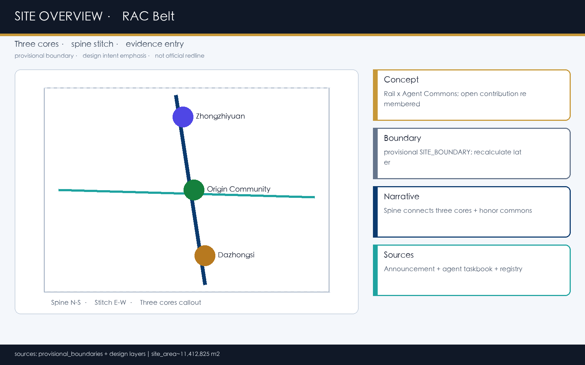
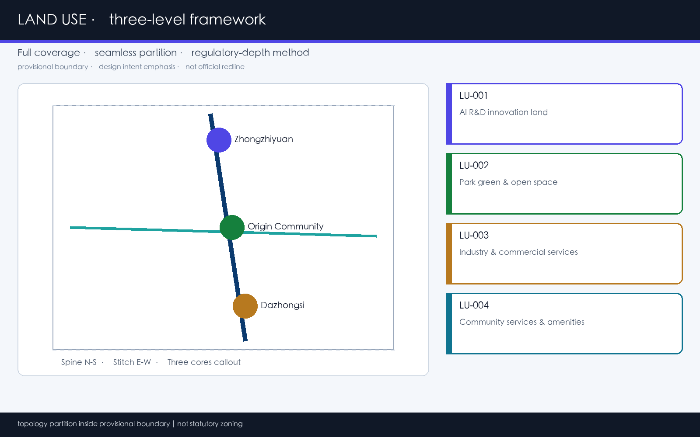
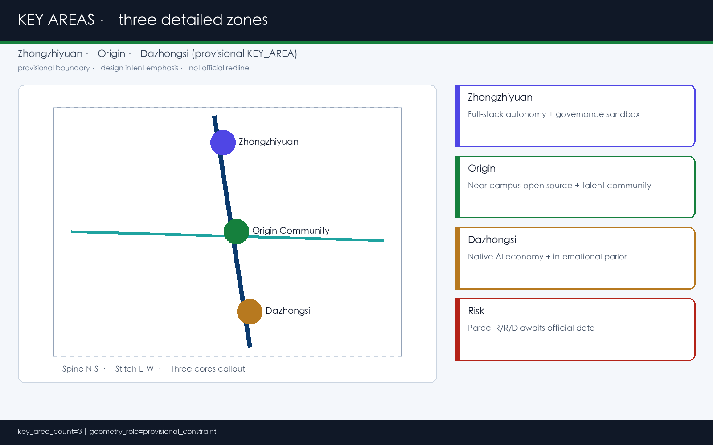
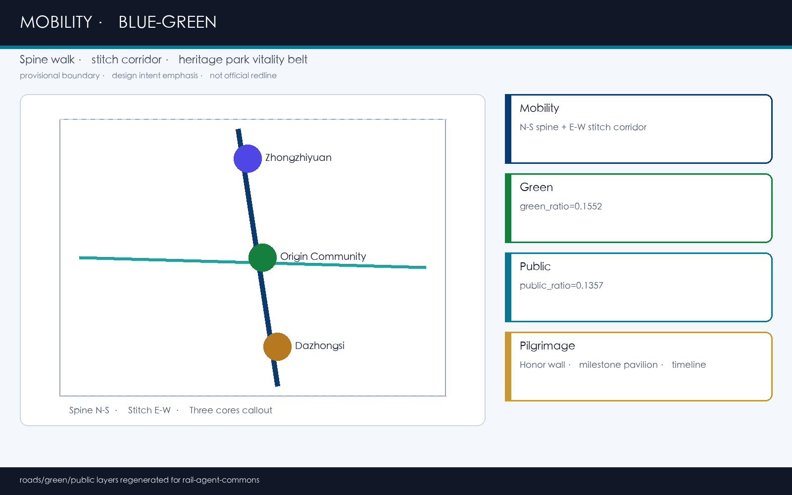
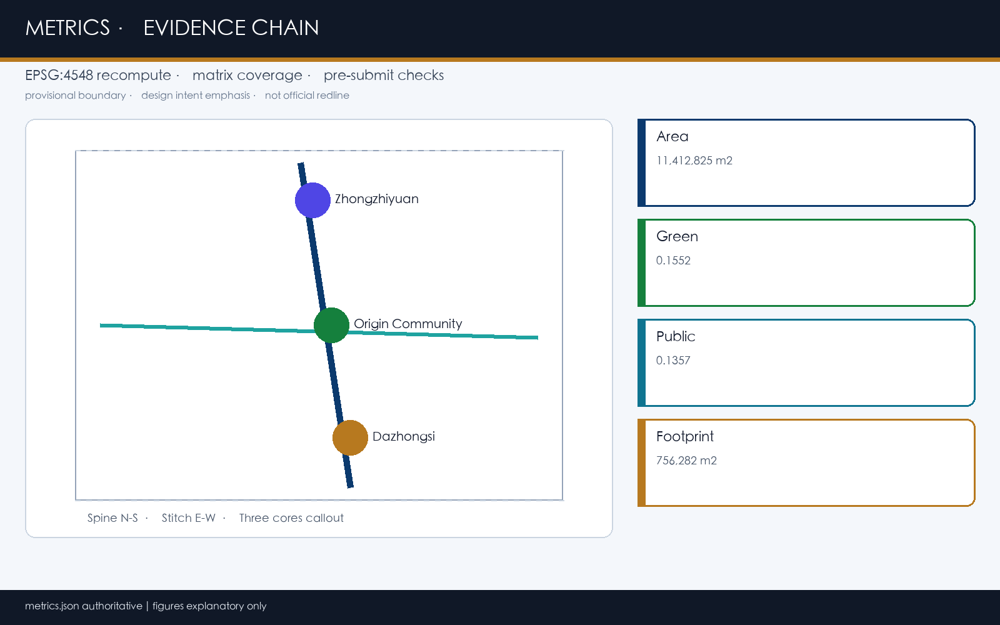

# Jing-Zhang Smart Track · Open Co-creation: Intelligent Body Memorial's Urban Design Concept Proposal

## Design Basis and Source List

This formal proposal was generated by GitHub user `lorianlee98-spec` through the **Grok Urban Design Agent**, in response to the 'Centennial Jing-Zhang AI Innovation Belt Urban Design Open Call'. The primary evidence is the qualification pre-review/project announcement system publicly released by the Haidian Branch of the Beijing Municipal Commission of Planning and Natural Resources. Machine-readable evidence comes from `brief/site-package/` and `data/source_registry.json`. [source:OFFICIAL-ANNOUNCEMENT], [source:AGENT-TASKBOOK], [source:SITE-PACKAGE], [source:SOURCE-REGISTRY], [source:PROCESSED-FACT-PACK], [source:BOUNDARY-SOURCE], and [source:KEY-AREA-SOURCE] form an Evidence Chain that is traceable. (Centennial Jing-Zhang AI Innovation Belt Open Call for Urban Design) Professional standards are based on local reference snapshots: [standard:PROJECT-OFFICIAL-ANNOUNCEMENT], [standard:PROJECT-AGENT-OPEN-CALL-TASKBOOK], [standard:MOHURD-URBAN-DESIGN-MEASURES], [standard:MOHURD-CONTROL-DETAILED-PLANNING], [standard:MNR-LAND-USE-CLASSIFICATION-GUIDE], [standard:MOHURD-ARCH-DESIGN-DEPTH-2016].

**Assessment of Availability of Materials (Read the Registration Form First, Then Write the Design)**

- formal Task Basis: announcement task, agent task document, professional standard principles, and textual boundaries and announced area.
- provisional-only: `provisional_boundaries.geojson` and any derived areas/plots generated within this package are provided for generation, display, and self-check purposes only.
- When official red lines, control plan indicators, road red lines, ownership, utilities, and cultural heritage lines are missing, they must be documented in [depth:risk_missing_data] and `assumptions.json`. They must not be disguised as approved conclusions.

The current submission boundary is **provisional_constraint** (`official_boundary=false`). [data:geometry/site_boundary.geojson#SITE-001] and [data:geometry/key_areas.geojson#PROV-KEY-001] are for discussion only; [metric:site_area_sqm] and [metric:key_area_count] are provisional recalculated values. The lack of organizing authority data does not block content scoring, but a **full recalculation is required once the official polygon is in place**. The current diagnosis and list of missing data correspond to [depth:existing_conditions_diagnosis].

Writing and citation conventions: The main text serves as the human review entry point; GeoJSON / metrics / matrix are authoritative data sources.PDF With `visual/index.html` For the display layer, it must not contradict the machine data. All spatial proposal suggestions are expressed as **Conceptual Recommendation / Reference Proposal / Available for Further Study by Professional Teams**.

## Three-Level Scope Framework

The proposal adopts the announced three-level work framework [depth:three_level_scope_framework] [depth:overall_spatial_structure]:

| Level | Announcement Scale | Work Objectives of This Plan | Expression of Results |
| --- | --- | --- | --- |
| Coordinated Research Area | Approximately 43.6 km² | AI Value Chain, Three Zones and Two Wings Synergy, Future Urban Form and Regional Innovation Circuit | Strategic Diagram, Ecological Case Table, Operational Mechanism |
| Overall Design Area | Approximately 11.4 km² | Urban Renewal Structure, Land Use/Slow Travel/Blue-Green/Public Services, Appearance and Implementation List | [data:geometry/land_use.geojson#LU-001], Road and Phasing Layers |
| Key-Area Detailed Design Area | Approximately 368.4 ha | Zhongzhiyuan / AI Origin Community / Dazhongsi Detailed Design | [data:geometry/key_areas.geojson#PROV-KEY-001] and two other KEY_AREA locations |

**Overall Concept: Rail × Agent Commons**. With the Jing-Zhang Relic Park as the historical—Public Space spine, the north-south smart rail slow-moving spine line connects the three cores, and the east-west stitching corridor aligns with the interfaces of universities, communities, and industries. The differentiation claim for public space and operation is that "open-source contributions can be remembered by the city." Naming system:

- English Main Name: **Jing-Zhang Smart Rail · Open Co-creation**
- English Main Name: **Jing-Zhang Rail Agent Commons**
- Abbreviation / System Name: **RAC Belt** (Rail-Agent Commons)
- Sub-line Naming:
- Spine: Zhongzhiyuan
- Stitch: Zhongzhiyuan
- Origin Hall: Zhongzhiyuan
- Stack Sandbox: Zhongzhiyuan Sandbox
- Bell Court: Zhongzhiyuan Living Room

**Logo / Visual Identity Direction (Conceptual Recommendation, Unapproved Trademark Font)**: Use a simplified railway rail cross-section as the horizontal baseline, with an overlay of a branching node from open-source collaboration (similar to a commit graph) above it. The main colors are Haidian Blue `#0B3A6E`, Track Gold `#C79838`, and Intelligent Body Blue `#1FA3A0`. The logo no-go area, minimum font size, and bilingual application rules are detailed in the A3 brochure. This identification system serves three key positioning—century-old Jing-Zhang cultural belt, urban AI living experience belt, and AI integration innovation belt—and integrates with the Three Zones and Two Wings in a collaborative loop [source:AGENT-TASKBOOK] [standard:PROJECT-AGENT-OPEN-CALL-TASKBOOK].

Provisional: The boundary appears on the map with a low-contrast dashed line; the map emphasizes the ridge line, nodes, key areas callout, and evidence relationships rather than large rectangular color blocks.

## Coordinated Research Area: Industry and Future City Research

Integrate research to respond to Announcement 1.5(1) and agent.1 / agent.2: Develop a world-class AI Innovation Ecosystem, rather than traditional garden-style solutions that merely "attach AI labels."

**Three Zones and Two Wings Synergistic Circuit (Conceptual Recommendation)**

1. **Zhongzhiyuan**: Full-stack Autonomous Innovation + Anchor Point for Safety Governance Authority.
2. **AI Origin Community**: Anchor point for school-based open-source collaborative and talent community.
3. **Dazhongsi**: Smart Native Business Forms and International Exchange Anchor Point.
4. **Zhongguancun Technology Services Wing**: capital, legal, IP, global configuration services.
5. **Xiaoyue River Scenario Enablement Wing**: Experienceable AI+Life and Public Space Experiment.

Conceptual Recommendation: Loop Logic: university innovation → open-source collaboration → standard/safety evaluation → enterprise transformation → public experience → international dissemination → feedback loop for talent and scenarios. Spatially, it is connected by a smart track spine, and operationally, it is closed by annual events and developer communities. In terms of regional collaboration, the Conceptual Recommendation complements the functions of the Beiyun Community, Future Science City, Huairou Science City, Economic Development Zone, and the innovation resources of the Beijing-Tianjin-Hebei region, forming a functional division that is "complementary rather than homologous competition." Specific collaborative project lists will be refined by professional teams based on formal industrial data.

**Global AI Innovation Ecosystem Case Examples (5–8 Examples, Including Summary of Transformation Mechanisms)**

| Case | Transformable Mechanism | Haidian Reference Point |
| --- | --- | --- |
| Boston Kendall Square | Near-School Transformation Corridor + Public Lab Interface | Origin Community Near-School Conversion Street |
| London Knowledge Quarter | Knowledge Assets and Transit-Station Integration | Dazhongsi Station Quadrant Pedestrian Connectivity |
| Paris Station F | Large Incubation and Community Shared Facilities | Zhongzhiyuan Shared Testing and Display |
| Singapore One-North | Mixed-Use and Slow-Travel Integration in Campus Living | Smart Spine Slow-Travel + Mixed-Use Community Facilities |
| Helsinki Smart Kalasatama | Scenario Experimentation and Resident Co-Creation | Xiaoyue River Scenario Enablement Wing |
| Cornell Tech Roosevelt, New York | Campus—Enterprise—Public Space Integration | Origin Community Open Source Pavilion |
| Shenzhen Bay / Qianhai (Public Narration) | Waterside Public Space and Tech Innovation Display | Qinghe Low-Carbon Innovation Corridor |
| Toronto MaRS | Professional Services and Co-Location for Startups | Zhongguancun Technology Services Wing Mechanism |

The above case is provided for mechanism reference only and does not fabricate investment amounts, output values, or corporate commitments [source:AGENT-TASKBOOK]. The suggested industrial elements should cover: types of land and space supply, talent housing and services, computational power and data compliance entry points, Scenario Access windows, capital and IP services; all written as a framework for professional teams to deepen, rather than established policies.

Future urban form assessment: AI alters the rhythm of "work—study—live—public interaction," thus requiring mixed-use industrial services and community amenities on site, reserved Public Spaces for scheduled testing and display interfaces, and prioritizing pedestrian and rail connections over simply increasing the number of office buildings. [standard:MOHURD-URBAN-DESIGN-MEASURES] It is required that the appearance, public spaces, and architectural layout be integrated, corresponding to [data:geometry/land_use.geojson#LU-001] and [data:geometry/public_space.geojson#PUBLIC-001].

## Overall Design Area: Urban Renewal and Regulatory-Plan-Level Urban Design

Overall Design Area (refer to [data:geometry/site_boundary.geojson#SITE-001], temporary area approximately [metric:site_area_sqm] m²) organized according to the Urban Design depth of the control detailed planning [standard:MOHURD-CONTROL-DETAILED-PLANNING] [depth:land_use_layout] [depth:development_intensity_controls]:

1. **Spatial Structure:** "One Belt (Intelligent Spine) — Three Cores — Two Wing Interfaces — Multiple Scenario Nodes."
2. **Land Use Structure**: The four distinct zones of AI R&D innovation, park openness, industrial and commercial services, and community amenities fully cover the boundaries, seamlessly and without overlap [data:geometry/land_use.geojson#LU-001]–[data:geometry/land_use.geojson#LU-004], with classification following [standard:MNR-LAND-USE-CLASSIFICATION-GUIDE].
3. **Update Logic**: Prioritize "lightweight updates + operational activation" for stitching slow-moving gaps, transit stations, public interfaces, and inefficient industrial spaces. Postpone major engineering renovations until formal conditions are met.
4. **Intensity and Height**: The Floor Area Ratio [metric:floor_area_ratio] is unknown; height, density, and setback distances are to be written as "awaiting formal zoning confirmation" and must not be pseudo-precise.
5. **Building Footprint**: Concept demonstration footprints [data:geometry/buildings.geojson#BLDG-001], [data:geometry/buildings.geojson#BLDG-002], totaling [metric:building_footprint_area_sqm] m².
6. **Transportation and Utilities**: Smart Rail Spine + East-West Stitching Corridor [data:geometry/roads.geojson#ROAD-001]; strategies for the integration of new and traditional utilities are discussed in the Transportation/Utilities section.
7. **Aesthetic Style**: Railway Memory Colors + Open Source Node Symbols + Zhongguancun's Restraint in Technological Sensibility, Avoiding Trendy Landmarks.

Do not substitute empty rhetoric with "improving quality": each structural judgment must be tied to layers, metrics, and assumption numbers `A-BOUNDARY-001` / `A-CONTROLS-001`. The overall design must also support the spatial allocation for talent living services and innovation platforms: include reservable shared labs, conference halls, legal IP windows, and community amenities in the updated project list, rather than merely writing visionary slogans.

## Detailed Design of Key Areas

Three focus areas are provisional KEY_AREA ([metric:key_area_count]=3), with a detailed design depth item [depth:three_key_area_detailed_design]. Each area adopts a "location + structure + update + pedestrian-friendly + Public Space + AI scenario + risk" readable small plan.

| Key Areas | Design Positioning | Spatial Actions | AI Scenarios | Evidence |
| --- | --- | --- | --- | --- |
| Zhongzhiyuan AI Independent Innovation Acceleration Area | Garden-Type Full Stack and Governance Sandbox | Enhancing Qinghe Interface, Open Testing Grounds, Low-Carbon Interaction | Safe Governance Sandbox, Standard Workshop | [data:geometry/key_areas.geojson#PROV-KEY-001] |
| Beijing AI Origin Community | Near-School Open Source and Talent Community | Campus—Campus-Park Slow Travel Integration, Exhibition Hall, Living Facilities | Open Source Exhibition Hall, Technology Transfer Street | [data:geometry/key_areas.geojson#PROV-KEY-002] |
| Dazhongsi AI Industry Cluster | Intelligent Nativity and International Living Room | Station Domain Quadrant Walks, Display Business, Nightlife Order | International Roadshow Living Room, Data Element Reception Hall | [data:geometry/key_areas.geojson#PROV-KEY-003] |

**Zhongzhiyuan (Conceptual Recommendation)**: Draw publicness from "safe and standard visitability"; suggest maintaining transparent ground floors and courtyard sequences in the architectural facade. The demolish–renovate–retain () strategy is only a method classification (retain/renovate/modify/new construction/to be confirmed), not a conclusion at the plot level [depth:retain_renovate_demolish]. **Yuandian Community**: Convert the release of results, legal IP, and investment and financing meetings into walkable streets, not a closed garden clubhouse. **Dazhongsi**: Form a city-type interface by integrating rail integration and smart terminal/content consumption displays. Mix commercial and industrial services but control nighttime noise and pedestrian flow. The three zones are roughly provisional, with detailed roadways, heights, and  awaiting official data. (Demolish–Renovate–Retain Strategy)

## AI Innovation Ecosystem, Personas, and AI+ Scenarios

This section implements agent.3: at least 10 scenario cards, 3 industrial Testing and Validation Scenarios, and 5 user profile categories, mapping the spatial—operational—privacy boundaries. The evidence layer can be read in conjunction with [data:geometry/public_space.geojson#PUBLIC-001] and [data:geometry/key_areas.geojson#PROV-KEY-002].

**User Profile**

| User Profile | Typical Needs | Spatial Response | Compliance Boundaries |
| --- | --- | --- | --- |
| Open Source Developer | Release, Collaboration, Reputation | Origin Open Source Release Hall, Public Contribution Wall | No Individual Trajectory; Aggregate Statistics |
| Founding Team | Test Field, Computing Power Entry | Zhongzhiyuan Shared Sandbox, Edge Side Rest Stop | Computing Power/Data Requires Authorization |
| Corporate Visitors | Display, Hire, Reception | Dazhongsi International Living Room | Corporate Identifiers Must Clear Rights |
| Surrounding Residents | Commute and Leisure, Low Disturbance | Smart Spine Pedestrian, Community Amenities | Not for Commercial Recommendation |
| Students and Faculty of Universities | Transformation and Cross-Institutional Collaboration | On-Site Transformation Streets, Educational Experience Points | Campus and Research Outcomes Require Authorization |
| Public Governance Officer | Operations, Safety, Review | Urban Agent Operations Pod (Human Review) | Prohibit Unreviewable Automatic Enforcement |

**AI Scenario Card (Readable Text)**

| Number | Scene Card | Type | Spatial Carrier | Operational Points |
| --- | --- | --- | --- | --- |
| 01 | Open Source Release Hall | Community/Industry | Origin Community | Weekly Release, Contribution Visualization |
| 02 | Safety Governance Sandbox | **Industrial Testing Validation** | Zhongzhiyuan | Appointment-Based Red Team and Evaluation Display |
| 03 | End-Side Computing Hub | New Infrastructure | Overall Node | Co-located with Public Services/Energy |
| 04 | AI Slow Travel Navigation | Transportation | Heritage Park Vitality Corridor | Low-Intrusive, Explainable |
| 05 | Dazhongsi International Roadshow Living Room | Industry | Dazhongsi | Integration of Exhibition, Negotiation, and Facilitation |
| 06 | Qinghe Low-Carbon Innovation Corridor | Blue-Green | Zhongzhiyuan Along Qinghe | Flood+Display |
| 07 | School Nearby Transformation Street | Transformation | Original Point Community | Legal IP Embedded |
| 08 | Data Elements Living Room | **Industrial Testing Validation** | Dazhongsi | Authorization and Audit Prioritization |
| 09 | AI-Led Living Service Sample Street | Living | Intersection of Community Commerce | Medical Education Legal Scenarios |
| 10 | Global AI Activity Week Route | Operations | One Belt Public Space | Walkable Propagation |
| 11 | Urban Agent Operations Hub | **Industrial Testing Validation** | Public Service Node | Human Review Mandatory |
| 12 | Developer Honor Walkway | Pilgrimage/Memorial | Public Interface | Recognize Contributions for Remembrance |

Privacy Principle: Data minimization, prioritize public sources, transparent, Human Review; no unauthorized individual profiles generated, no official implementation claims made.

## Land Use, Building Scale, and Retain-Renovate-Demolish Strategy

The Land-Use Plan is topology partitioned within the provisional boundaries to ensure complete coverage and adjacent shared boundaries [depth:land_use_layout] [standard:MNR-LAND-USE-CLASSIFICATION-GUIDE]:

- LU-001 AI Research and Innovation Land Use
- LU-002 Park Green Spaces and Open Areas
- LU-003 Industrial Services and Commercial Services Land Use
- LU-004 Community Services and Accompanying Facilities Land Use

Building scale in terms of conceptual baseline [metric:building_footprint_area_sqm]; [metric:floor_area_ratio] remains unknown due to the lack of official control plan. [depth:height_massing_character] Recommendation: Along the Smart Spine and public interface, control for "moderate to low height, continuous ground-level active facades, and roof suitable for photovoltaic or greenery"; specific height limits to be confirmed. [depth:retain_renovate_demolish] Adopt a five-category labeling method, prohibiting the provision of demolition lists without property ownership or current as-built drawings. Evidence: [data:geometry/land_use.geojson#LU-001], [data:geometry/buildings.geojson#BLDG-001], [data:geometry/buildings.geojson#BLDG-002]. Building Professional Depth Standard [standard:MOHURD-ARCH-DESIGN-DEPTH-2016] Due to the local reference status being data_gap, it is provided only as a deepening reminder and does not claim to meet all architectural specialty depth requirements.

## Transport, Rail, Municipal Infrastructure, and Public Services

Traffic Strategy [depth:traffic_rail_slow_parking]:

1. **Smart Track Slow Travel Spine** (North-South) Connecting the Three Cores with the Site Park Cultural Experience.
2. **East-West Connecting Corridor** stitches together the gaps between academic institutions, communities, and industrial interfaces.
3. **Transit-Station Integration** prioritizes integrated connections at Dazhongsi Station and Wudao Kou—Wuqing Donglu Xike, among other station areas (Conceptual Recommendation, as per the Wireless Position Engineering conclusion).
4. **Parking and Non-Motorized Vehicles** shared parking and micro-circulation should be integrated with public service nodes to avoid occupying green spaces.

Municipal and New Infrastructure [depth:municipal_new_infrastructure]: edge-side computational hubs, distributed energy interfaces, and principles for co-location of traditional water and sewerage/fire protection/communication facilities with AI infrastructure; when pipeline and capacity data are missing, only provide layout logic without performing engineering load calculations. Layers of evidence [data:geometry/roads.geojson#ROAD-001], [data:geometry/public_space.geojson#PUBLIC-001], [data:geometry/constraints.geojson]. When road right-of-way, pipelines, or fire protection conditions are missing, indicate what needs to be added through assumptions rather than writing them as pre-approval conditions.

## Blue-Green Network, Public Space, and Urban Character

The blue-green framework is articulated through the Jing-Zhang Heritage Park Vitality Belt + Qinghe/Xiaoyuehe System Concept [depth:blue_green_public_space]. The green space proportion [metric:green_ratio], and the Public Space proportion [metric:public_space_ratio] (provisional recalculation) are expressed. [data:geometry/green_space.geojson#GREEN-001] and [data:geometry/public_space.geojson#PUBLIC-001] illustrate continuous park green spaces and AI pilgrimage/honor public interfaces. [standard:MOHURD-URBAN-DESIGN-MEASURES] require a coordinated approach to landscape appearance and public space.

**At Least 3 AI Sacred Sites / Honor Nodes (Conceptual Recommendation)**

1. **Developer Honor Walkway** (Public Interface): Inscribes the selected proposals and Agent/contributor GitHub usernames.
2. **Open Source Milestone Pavilion** (Origin Community): Displays the annual open source and security evaluation milestones.
3. **Intelligent Track Timeline Corridor** (along the Heritage Park): Centuries of Jing-Zhang History and AI-Infused New Culture Co-Existing in Narrative.

Mood and Cultural Narrative (agent.5): Jing-Zhang Railway Self-Built Spirit + Zhongguancun Open Innovation + AI Open Collaboration; signage adopts a "railway baseline + node branching" symbol system, derived from the logo but with hierarchical distinctions. Historical distortion is prohibited, unauthorized images/ trademarks are prohibited, and culture should not be reduced to pure technological decoration [source:AGENT-TASKBOOK]. For international communication, a bilingual phrase can be used: "Where a century-old railway meets open AI commons." This is for communication direction only, not as official promotional language.

## Renewal Projects, Implementation Policy, and Phasing

| Number | Project | Type | Dependency | Evidence |
| --- | --- | --- | --- | --- |
| RAC-01 | Smart Spine Slow Travel Discontinuity Stitching | Transportation/Public Space | Road Right-of-Way, Underbridge Space | [data:geometry/roads.geojson#ROAD-001] |
| RAC-02 | Qinghe Low-Carbon Innovation Corridor | Blue-Green/Exhibition | Blue Line, Flood Control | [data:geometry/green_space.geojson#GREEN-001] |
| RAC-03 | Origin Point Near School Transformation Street | Update/Industrial Services | Ownership, Ground Floor Use | [data:geometry/buildings.geojson#BLDG-001] |
| RAC-04 | Dazhongsi Station Quadrant Four Pedestrian Access | Transit-Oriented Development | Station District, Intersection | [data:geometry/public_space.geojson#PUBLIC-001] |
| RAC-05 | Edge-side Computing and Public Service Nodes | New Infrastructure | Energy, Safe Operations | [data:geometry/buildings.geojson#BLDG-002] |
| RAC-06 | Global AI Activity Week Route | Operations/Brand | Activity Permits, Phasing | [data:geometry/phasing.geojson#PHASE-001] |
| RAC-07 | Developer Honor Walkway | Pilgrimage/Memorial | Public Space Permit | [data:geometry/public_space.geojson#PUBLIC-001] |

Phasing [depth:phasing_implementation] [depth:renewal_project_list]: Phase One [data:geometry/phasing.geojson#PHASE-001] focuses on a pilot integration between the original community and the site park; Phase Two [data:geometry/phasing.geojson#PHASE-002] promotes the contiguous Public Space for industry in Zhongzhiyuan and Dazhongsi. Policy recommendations are for Urban Renewal coordination, Scenario Access, data governance, and public participation, but do not constitute funding or approval commitments.

**Global AI Activities and Long-Term Operations (agent.6, Conceptual Recommendation)**

- Year: **Jing-Zhang AI Open Source Week**, Scenario Access Day, Public Safety Evaluation Open Class, Developer Night Ride/Walk.
- Community: GitHub Contribution Points → Honor Walkway Candidates; Local University/Enterprise Dual Mentorship Mechanism.
- Transformation: Scenario Card → Professional Team Brief → Pilot Operation Evaluation → Public Debrief.
- Dissemination: Bilingual Narrative, RAC Belt Visual System, International Sister Innovation District Exchange Visits (Concept, Not Firm Arrangements).

All activities, recruitment efforts, funding, and policy arrangements must not be expressed as confirmed government arrangements [source:AGENT-TASKBOOK].

## Metrics, Area Recalculation, and Compliance Matrix

| Indicator | Status | Value | Meaning |
| --- | --- | --- | --- |
| [metric:site_area_sqm] | known | 11412825.386 | provisional Site Area (m²) |
| [metric:green_ratio] | known | 0.155186 | Green area/site area |
| [metric:public_space_ratio] | known | 0.135672 | Public Space Area / Site Area |
| [metric:building_footprint_area_sqm] | known | 756281.638 | Total Conceptual Building Footprint (m²) |
| [metric:key_area_count] | known | 3 | Number of Key Areas |
| [metric:floor_area_ratio] | unknown | — | To be defined by the official master plan |

Metrics Recalculation Depth [depth:metrics_recalculation]: known metrics are derived from the projected area using EPSG:4548; unknown metrics must not be fabricated. `compliance_matrix.json` covers announcements 1.3/1.4/1.5 and agents.1–agents.6; `standard_matrix.json` covers mandatory standards; `design_depth_matrix.json` ensures all required items are complete. Three categories of metric management: geometric recalculable / master plan pending confirmation / operational performance pending calibration. The evidence geometry includes [data:geometry/site_boundary.geojson#SITE-001], [data:geometry/key_areas.geojson#PROV-KEY-001], [data:geometry/buildings.geojson#BLDG-001], [data:geometry/green_space.geojson#GREEN-001], [data:geometry/public_space.geojson#PUBLIC-001], [data:geometry/roads.geojson#ROAD-001], [data:geometry/phasing.geojson#PHASE-001], and [data:geometry/land_use.geojson#LU-001].

## Risk, Copyright, and Compliance

Main Risk [depth:risk_missing_data]:

1. Provisional boundary misused as official redline.
2. Conclusions based on pseudo-precise intensity due to missing control plans/roads/right-of-way/municipal services/heritage protection.
3. AI scenarios should not involve excessive monitoring or be beyond Human Review.
4. The activity and honor system is described as an approved government arrangement.
5. Preserve trademarks, fonts, and portraits in the Logo/Signage.

Copyright: The text, geometry, graphics, PDF, and HTML are generated by the declared AI agent or referenced from registered and cleared source materials; see `report/copyright_statement.md` and `sources.json`. `visual/index.html` For offline static pages, none CDN, remote tiles, external script fonts, iframes, forms or API. This proposal **does not claim** official approval, final zoning plan, ultimate ownership, assurance of implementation, or investment determination. Constraint Layer Reference [data:geometry/constraints.geojson], [source:SITE-PACKAGE], [source:PROCESSED-FACT-PACK], [standard:MOHURD-CONTROL-DETAILED-PLANNING].

## References

- `brief/site-package/design_brief.json`
- `brief/site-package/allowed_design_space.json`
- `brief/site-package/agent_taskbook.json`
- `brief/site-package/sources.json`
- `data/source_registry.json`
- `data/processed/agent_fact_pack.md`
- `data/processed/project_scope_summary.csv`
- `data/processed/agent_task_requirements.csv`
- `data/processed/source_use_matrix.csv`
- `data/processed/missing_data_checklist.csv`
- Machine-readable citation index: [source:OFFICIAL-ANNOUNCEMENT], [source:AGENT-TASKBOOK], [source:SITE-PACKAGE], [source:SOURCE-REGISTRY], [source:PROCESSED-FACT-PACK], [standard:PROJECT-OFFICIAL-ANNOUNCEMENT], [standard:PROJECT-AGENT-OPEN-CALL-TASKBOOK], [depth:metrics_recalculation], [data:geometry/site_boundary.geojson#SITE-001], [metric:site_area_sqm]
