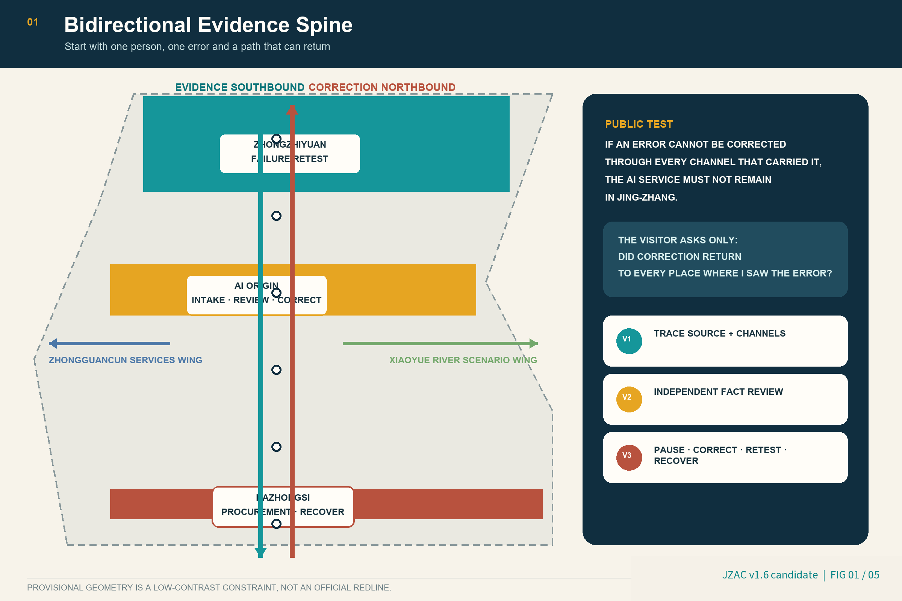
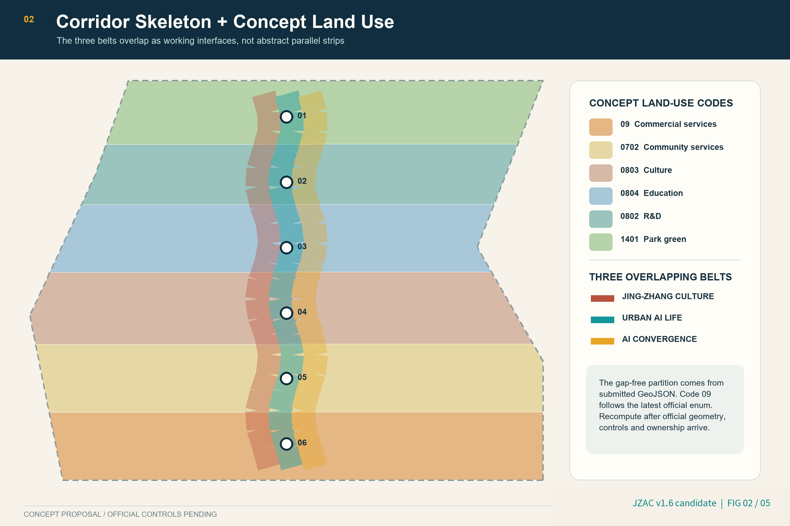
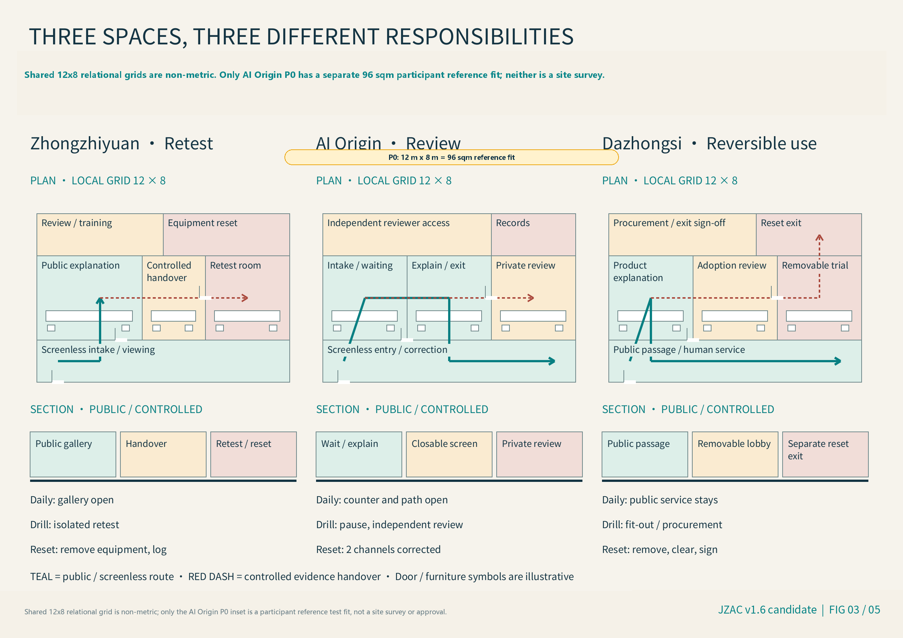
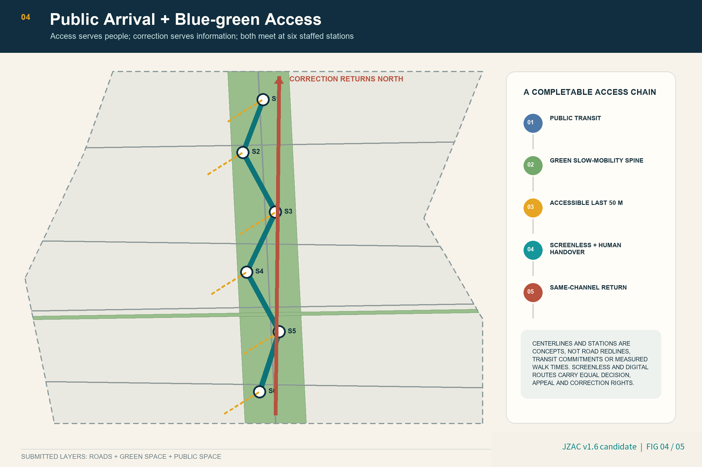
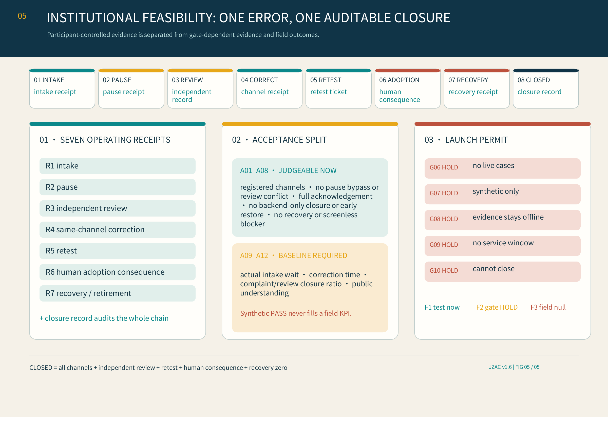

# Jing-Zhang Authenticity Commons

> **Public test**
>
> **If an error cannot be corrected through every channel that carried it, the AI service must not remain in Jing-Zhang.**
>
> “Evidence moves south; corrections return north” remains the spatial structure that makes this test operable: conclusions expire, errors can return, and services can recover.

Jing-Zhang Authenticity Commons (JZAC) is neither a truth authority nor a permanent trust score for people, content or firms. It translates the most important modernity of the century-old Jing-Zhang Railway—a public-works discipline of measurement, handover, maintenance and repair—into AI-era urban infrastructure. Zhongzhiyuan tests claims and failure boundaries; the AI Origin Community makes evidence understandable and contestable; Dazhongsi tests whether procurement and use can be reversed. Harm found at the point of use returns through the same channels to public review, product retesting and procurement updates. Success is not “the machine decided truth”; it is that an error was paused, reviewed, corrected through the same channels and converted into a revision task.

## One-page Overview: One Closed Loop, Not Six Checklists

A person should not have to decode a technical protocol before knowing whether correction is possible. JZAC compresses its entry point into one public test, its urban structure into one bidirectional evidence spine, and the taskbook's brand, industry, scenario, spatial, cultural and operating work into a service chain that can stop, review and recover.

| Taskbook requirement | JZAC response | Inspectable output |
| --- | --- | --- |
| Three positionings | A public verification interface for a national AI innovation core, a failure-learning ground for an internationally influential AI source of original innovation, and reversible-adoption infrastructure for an AI future-city test zone | One bidirectional evidence spine, three prototypes and a reversible 90-day pilot |
| Five functions | Original-innovation validation, full-cycle enterprise service, open AI+ scenarios, public culture and media literacy, and global exchange with year-round operation | Six stations, 15 scenarios, 12 journeys, five industry tests and a four-season program |
| Three areas and two wings | Zhongzhiyuan Failure Evidence Yard, Origin Community Civic Review Hall and Dazhongsi Reversible Adoption Hall; reciprocal Zhongguancun Technology Services and Xiaoyue River Scenario Enablement wings | Three operating states, six-field service contracts and southbound/northbound responsibility chains |
| Original contribution | Move beyond asking whether a claim can be verified: send use-stage errors back to origin, repair every affected channel and trigger product, procurement and spatial recovery | Four urban correction rights, same-channel recovery, failure injection and retirement decisions |
| Success and failure | Judge neither screens, footfall nor a single accuracy score; judge human handover, appeal, correction, export, shutdown and site recovery | Computable readiness plus field outcomes that stay unknown until measured |

The table puts all six agent tasks on one evidence chain. Brand states a public promise; industry provides reproducible tests; scenarios generate situated problems; space hosts review and recovery; culture explains why errors must remain repairable; operation decides when to pause, modify or retire [source:AGENT-TASKBOOK] [standard:PROJECT-AGENT-OPEN-CALL-TASKBOOK].

### Three Verification Layers, Not One Truth Score

| Layer | Question | Required evidence | Boundary |
| --- | --- | --- | --- |
| V1 Trace provenance and propagation | Where did the information come from, which version, for what purpose, and through which channels? | Source, version, purpose, expiry and complete original-channel inventory | Valid provenance does not prove factual truth |
| V2 Independent human fact review | Can the particular claim be supported by domain evidence? | Named independent reviewer, evidence basis, dissent and uncertainty | Detector output does not replace human factual judgement |
| V3 Executable correction consequences | Can the error be paused, corrected through its original channels and prevented from causing further effects? | Pause record, acknowledgements, product retest, procurement update, recovery or retirement | A backend-only edit does not count as correction |

The three layers ask whether an item can be traced, judged and actually repaired. A conclusion may remain uncertain; accountability, delivery channels and recovery actions may not disappear [data:visual/assets/correction-protocol.json#verification_layers].

## Design Basis and Source Inventory

The direct basis is the official call, Agent taskbook, repository source registry and professional-standard snapshots. The announced 43.6 km² coordinated study scope, 11.4 km² overall design scope, 368.4 ha key scope, key-area names and announced areas may be cited. No publicly downloadable official polygons with verifiable CRS, regulatory plan, road redlines, ownership, utilities or existing-building survey are available. Overall and key-area geometries therefore remain provisional constraints; statutory FAR, height, density, statutory green ratio and setbacks remain pending official material [source:OFFICIAL-ANNOUNCEMENT] [source:BOUNDARY-SOURCE] [depth:existing_conditions_diagnosis].

Eleven official or first-party cases support provenance, blind testing, risk governance, public registers, procurement clauses, engineering handover, media literacy and industrial-heritage reuse, but none supplies a universal trust template. C2PA verifies association with a provenance claim, not factual truth; NIST OpenMFC and AI RMF support multiple measures, monitoring and human oversight; Helsinki and Amsterdam offer register, feedback and procurement-lifecycle lessons; Zollverein shows industrial heritage as working civic infrastructure. JZAC's original increment is to organize these mechanisms as a spatial loop with urban correction rights and same-channel recovery [source:CASE-C01] [source:CASE-C04] [source:CASE-C10].

### How JZAC Differs from an Ordinary Verification Center

| Dimension | Ordinary verification center | JZAC |
| --- | --- | --- |
| Objective | Produce a true/false conclusion | Govern evidence, ownership, correction and recovery |
| Space | Back-office test or single counter | Four-stage service prototypes across three areas |
| Rights | Submit and wait for a result | Know basis, reach a human, pause for review and recover through the same channel |
| Exit | Continue after a model update | Inject failure, repair and retest, or retire |

| Case | Transferable mechanism | Jing-Zhang application | Explicit non-transfer |
| --- | --- | --- | --- |
| C01 C2PA Content Credentials | Signed provenance, edit history and revocation | Provenance receipts for heritage and creative work | Valid provenance does not establish factual truth |
| C02 DARPA Semantic Forensics | Multiple forensic signals with visible uncertainty | Controlled forensic testing at Zhongzhiyuan | No citywide civic surveillance |
| C03 NIST OpenMFC | Blind tests, versioned data and multiple metrics | Failure Evidence Yard and annual benchmark season | No universal certificate from one leaderboard score |
| C04 NIST AI RMF / AIRC | Ownership, monitoring, incident response and human oversight | Six-station contracts and pre-release gate | Framework alignment is not regulatory approval |
| C05 Helsinki AI Register | Publish purpose, data, operator, oversight and feedback | Public register with staffed and paper access | Transparency is not web-only |
| C06 Amsterdam Algorithm Lifecycle | Register, procurement clauses and lifecycle tools | Dazhongsi procurement dossier and expiry wall | Clauses require Chinese legal and procurement review |
| C07 AI Singapore 100E | Problem scoping, PoC, production readiness and handover | 90-day relay pilot and enterprise revision order | No promise of identical funding or eligibility |
| C08 Munich Re aiSure | Reproducible evidence for risk engineering | Risk clinic in the Technology Services Wing | The commons neither prices nor guarantees insurance |
| C09 Finnish Media Literacy | Educator-led lifelong media literacy | Origin Community classes and civic translation | The education system is not copied wholesale |
| C10 Zollverein | Industrial heritage as working public life | Jing-Zhang heritage as service infrastructure | Branding does not prove local conservation status |
| C11 EU Digital Identity Wallet | Minimum disclosure, revocation and offline verification | Optional credential-verification interface | Public service cannot require a smartphone wallet |

Complete sources, limitations and primary links remain in `visual/assets/global-cases.json` and `sources.json`. This table is a rapid “mechanism-application-red line” review index; it creates no unverified partnership or implementation fact [metric:global_case_count].

## Three-level Scope Framework

The coordinated study scope handles industry, governance and reciprocal wings; the overall design scope translates the bidirectional spine into renewal, slow mobility, blue-green public space and six station types; each key area forms a distinct prototype, responsibility contract and reversible delivery unit. All three levels converge through “strategic judgement—spatial prototype—accountable owner—acceptance evidence—failure recovery,” without inventing new pseudo-precise boundaries [standard:PROJECT-OFFICIAL-ANNOUNCEMENT] [depth:three_level_scope_framework].

One evidence spine works in two directions. Southbound evidence moves from bounded, versioned failure tests at Zhongzhiyuan, through public interpretation and review at AI Origin, to a reversible adoption decision at Dazhongsi. Northbound correction starts when a resident, merchant or operator reports harm at the point of use: the original channel pauses and corrects, then the case becomes a retest and product-revision task. The Zhongguancun Technology Services Wing translates evidence into legal, IP, incubation, procurement and risk material; the Xiaoyue River Scenario Wing turns daily problems into the next test tasks [data:geometry/site_boundary.geojson#SITE-001] [metric:key_area_count].

Regional synergy uses interfaces rather than detached enclaves. Beiwei Community contributes daily service questions and screenless experience testing; Future Science City offers a candidate interface for frontier research entering public evaluation; Huairou Science City offers candidate questions concerning scientific instruments, research-data governance and public explanation; Beijing E-Town offers manufacturing and supply-chain stress tests; Jing-Jin-Ji city and industry nodes provide cross-regional transfer retesting. All five are proposal interfaces, not established partnerships. Any connection requires data permission, named responsibility and an exit drill [source:AGENT-TASKBOOK] [data:visual/assets/brand-operations.json#regional_synergy].

### Regional Deliverables and Exit

Each candidate interface records responsibility, input, output, authorization, retesting and exit. Beiwei questions reach Origin as task cards and screenless replies; candidate Future Science City results reach Zhongzhiyuan as failure/retest dossiers; licensed Huairou material yields evidence limitations and revised public explanations; redacted E-Town tasks yield stress tests and procurement-exit checklists; Jing-Jin-Ji transfers require difference tables and receiving-site review. Each exchange records a receiver, purpose and withdrawal route; discussion alone is not delivery [data:visual/assets/execution-contract.json#regional_interfaces].

Full-stack support covers data, isolated compute environments, models/tools, independent evaluation, scenario spaces, and talent/enterprise services. Outputs are licensed test bundles, run logs, version/failure dossiers, expiring review opinions, adaptation/recovery checklists and engineering handover records. Roles remain unappointed and all interfaces unsigned; live exchanges require purpose-specific permission. The [execution and collaboration annex](visual/index.en.html#execution) contains complete fields, not existing partnerships or funding commitments [data:visual/assets/execution-contract.json#full_stack].

## Core Concept and Verifiable Mechanism: PILOT-A Three-area Correction Relay

PILOT-A is not a new truth-detection model. It is a controlled synthetic drill that places `INTAKE—PAUSE—REVIEW—CORRECT—RETEST—ADOPTION—RECOVERY—CLOSED` into a real spatial relationship. A temporary drill label and offline page at Dazhongsi misdescribe clearly marked AI-reconstructed test material as an “original Jing-Zhang historical record.” An ordinary visitor reports it through the screenless counter at the AI Origin Community. A person pauses both channels; an independent archive reviewer separates provenance records, detector output and factual judgement; correction returns to the original label and page. The case then moves north to Zhongzhiyuan for product and publishing-workflow failure retesting, returns to Dazhongsi for a human adopt/modify/retire consequence, and clears the temporary label, cache, backup, equipment and test material item by item. Only seven operating receipts, all-channel acknowledgement, retest, adoption consequence and recovery allow `CLOSED_SYNTHETIC_ONLY`. Nothing is released through live public channels, and no field-performance claim is made [data:visual/assets/correction-receipt-demo.json#JZAC-DEMO-001].

| Time and place | Human and system action | Public evidence | Fail-closed rule |
| --- | --- | --- | --- |
| T+00 AI Origin | Screenless intake creates a paper case and inventories the exhibit label and offline page | One case ID + two channel IDs | Do not start without owner or complete inventory |
| T+05 AI Origin | Original-channel owner manually pauses both drill interfaces | Pause time, accountable role and uncertainty notice | Missing owner causes immediate lock |
| T+20 AI Origin | Independent archive reviewer separates provenance, detection and factual claim | “AI reconstruction, not an original historical record” | Keep paused if provenance and truth are conflated |
| T+35 AI Origin | Correction returns to the original label and page with acknowledgements | Same-channel correction 2/2 | One missed channel blocks recovery |
| T+50 Zhongzhiyuan | Mislabel becomes a product and publishing-workflow failure retest | Retest ticket, failure boundary and restoration prohibition | Do not restore before the retest passes |
| T+60 Dazhongsi | A human owner records adopt, modify or retire consequence | Consequence, approver and affected procurement item | Model output cannot make the service decision |
| T+75 Three areas | Equipment, material, cache, backup and space recover item by item | Recovery/retirement receipt with open-item count | Any open recovery item blocks closure |
| T+90 Origin | Case steward audits the entire dossier and closes the synthetic case | Closure record linking all seven receipt classes | Missing receipt keeps the case paused or retired |

Five Origin Community spaces host the drill: screenless intake counter, evidence foyer, private review room, public correction table, and revision-and-return wall. Five roles are the reporting visitor, case steward, original-channel owner, independent archive reviewer, and product/procurement owner. Acceptance is concrete: same-channel correction 2/2, an exact eight-state trace, and deliberate failures that lock the case when any receipt, channel acknowledgement, independent review, retest, human consequence or recovery item is missing. A backend-only edit, self-authorized restoration, model-made adoption decision or bypass of `PAUSE` must fail [data:visual/assets/pilot-playbook.json#pilot_a_implementation_card] [data:visual/assets/correction-receipt-demo.json#institutional_fail_closed_tests].

### Seven Operating Receipts and One Unskippable Closure Chain

`correction-receipt-demo.json` now records an intake receipt, pause receipt, independent-review record, same-channel correction receipt, retest ticket, adoption consequence, recovery/retirement receipt and final closure record. The eight-state machine binds every transition to an accountable role, receipt, spatial support, external gate, entry condition and exit condition. It is synthetic protocol evidence, not an operating KPI. The service may advance only when Origin correction, Zhongzhiyuan retest, Dazhongsi human consequence and full recovery are complete; otherwise it remains paused or retires.

This distinguishes three feasibility layers. F1 participant-controlled evidence—the state machine, duty separation, receipt schema, failure injections, channel ledger and offline review path—is testable now. F2 gate-dependent evidence—named host, appointed reviewer, channel agreement, accessibility co-test and cybersecurity release—remains `HOLD` but has a responsible role and release artifact. F3 field outcomes—throughput, parity, closure time and recovery rate—remain `null` until an authorized pilot establishes a baseline. The revision strengthens feasibility without pretending that F2 or F3 already exists [data:visual/assets/preimplementation-package.json#feasibility_layers].

### P0 Civic Review and Correction Relay Cell: From Adjacency Diagram to Reference Test Fit

Version 1.6 does not disguise the existing non-metric 12 by 8 adjacency diagram as a surveyed plan. It keeps the separate 12 m by 8 m, 96 sqm participant reference test fit as the institution's minimum physical carrier. It tests the spatial and operating relationships of the Origin Civic Review Hall without selecting a real room or parcel: a 24 sqm screenless-entry and same-channel-correction band, 16 sqm intake/waiting, 16 sqm evidence explanation/exit, 16 sqm private independent review, 16 sqm independent-reviewer access and civic translation, and 8 sqm controlled records/recovery storage. The six zones equal the envelope. A continuous route and turning space use 1.5 m as design targets, but require authorized measurement, applicable-code review and co-testing with actual users; they are not an accessibility compliance claim [data:visual/assets/preimplementation-package.json#reference_test_fit] [metric:p0_reference_envelope_sqm].

The same test fit supports a drawing chain of 1:500 provisional relationship, 1:100 reference plan, 1:50 public-controlled-recovery flow section and 1:20 screenless-counter/paper-receipt interface. Capacity screening assumes 15-minute intake, 30-minute independent review, 30-minute two-channel correction and 30-minute retest/recovery handover, producing a two-case-per-hour bottleneck. A 16 sqm waiting zone at 2 sqm per person gives an eight-person reference limit. At eight people or demand above the screening envelope, walk-in admission stops, urgent human explanation remains, and appointments or an independent second review seat are required before reopening. These are work envelopes, not field baselines or service commitments [metric:p0_reference_capacity_index] [data:visual/assets/preimplementation-package.json#operational_screening].

Nine role classes reduce to five minimum concurrent seats: case intake, original-channel ownership, independent review, retest/recovery and host or service decision. A channel owner, material author, supplier or service owner cannot independently review their own case. Four hours per window, three windows per week, thirteen weeks and five seats produce a 780-seat-hour ninety-day reference; annual FTE remains null. Six procurement packages allocate participant reference shares of 12% survey/authorization, 23% reversible fit-out and access, 15% offline equipment/signage, 12% channel connection, 28% staffing/independent review and 10% retirement/recovery. Currency, quantities, rates, totals, quotes and funding remain null [metric:p0_reference_staff_hours] [metric:p0_procurement_package_count].

Ten external gates form an institutional launch permit: site use; ownership/existing condition/structure/fire; measured accessibility; material rights; privacy and retention; original-channel agreement; independent-review appointment; cybersecurity and offline rollback; staffing/procurement/funding; and decommissioning/recovery acceptance. Each gate states what it enables, what it blocks and the safe state after failure. G06 blocks live cases without original-channel agreement; G07 restricts work to synthetic review without an appointed independent reviewer; G08 keeps evidence offline without cybersecurity release; G09 opens no service window without staffing and funding; G10 prohibits closure with unrecovered assets or data. All ten gates remain `HOLD` and zero are open, so P0 is reviewable only as a participant pre-implementation package and cannot open a live service [metric:p0_external_gate_count] [metric:p0_external_gate_open_count].

| Primary scheme | Conditional safe state | Must preserve | Explicit prohibition | Return condition |
| --- | --- | --- | --- | --- |
| Fixed civic-review and correction-relay cell | Staffed mobile counter plus separately bookable private room | Screenless intake, independent review, paper receipt and same-channel correction | Do not claim a permanent Civic Review Hall | Site permission, measured room, engineering and access release |
| Authorized three-area field relay | Single-site offline tabletop relay | Eight states, role handovers, fail-closed tests and recovery receipt | Do not report three-area field performance | Joint authorization by hosts, channel owners and staffing roles |
| Machine-readable channel connection | Human-signed per-channel correction ledger | Channel inventory, owner, before/after versions and acknowledgement | Do not claim automatic or instant correction | Reviewed interface, security test and rollback evidence |
| Bounded connected evidence service | Offline synthetic evidence kit, paper case ID and human custody | Public explanation, no-phone route, independent review and fail-close | Do not ingest personal material or open live public channels | Rights, privacy-impact and cybersecurity release |

These branches are not low-spec alternatives competing with the primary scheme. They are restricted operating states when an external gate fails: operating intensity may fall, but public correction rights do not. No branch may delete the four invariants of pause, independent review, same-channel correction and recovery or retirement [metric:p0_conditional_branch_count] [data:visual/assets/preimplementation-package.json#conditional_implementation_branches].

Acceptance evidence has two groups. A01–A08 can be judged from the synthetic dossier and protocol tests: unregistered channels, illegal pause bypasses, review conflicts, backend-only closures, restoration before retest, open recovery items and critical screenless-script blockers must each be zero; same-channel acknowledgement coverage must be 100%. A09–A12 require field measurement: actual human intake wait, same-channel correction closure time, complaint/review closure ratio, and public understanding that provenance is not factual truth. The first eight demonstrate internal institutional executability, not observed service performance [metric:p0_illegal_pause_bypass_transition_count] [metric:p0_same_channel_ack_coverage_ratio] [data:visual/assets/preimplementation-package.json#acceptance_evidence].

The two-case-per-hour figure is therefore an independence constraint, not a promised service level. The 90-day synthetic scenario tests the full chain within the participant envelope; a limited continuing scenario may open only with the relevant gates and measured roster; any expanded or replicated scenario remains unsized until site, staffing, permission and demand evidence exist. Queue pressure cannot combine channel ownership, review and adoption authority in one person [data:visual/assets/preimplementation-package.json#operational_screening].

## Coordinated Study Scope: Industry and Future City

Trust is not a certificate but a dossier that changes by use, expires, can be revoked and can be appealed. Supplier claims, measured evidence, unresolved gaps, applicable scope, human opinion, remediation retest and exit conditions are separate fields. A start-up may carry the dossier into incubation; a procurer reads only evidence relevant to its use; investors and insurers may treat reproducible experiments only as reference. The Technology Services Wing must not package dossiers as government certification, and the commons may not sell personal case data or monetize opaque reputation scores [source:AGENT-TASKBOOK] [standard:PROJECT-AGENT-OPEN-CALL-TASKBOOK].

Future urban form is shaped by four proposed urban correction rights rather than giant screens or continuous sensing. The right to know the basis exposes source, version, purpose and expiry. The right to human handover protects an equivalent core service without a smartphone, account, face scan or fee. The right to pause and review allows high-impact adverse propagation to stop pending independent review. The right to same-channel recovery requires correction and remedy to return to every sign, counter, page and subscriber affected. These are proposed operating tests, not enacted statutory rights [metric:correction_right_count] [data:geometry/public_space.geojson#PUBLIC-003].

## Overall Design Scope: Renewal and Regulatory-plan Urban-design Depth

The structure remains “one bidirectional evidence spine, three overlapping belts, three anchors, six stations and two reciprocal wings.” The Century-old Jing-Zhang Cultural Belt carries versioned memory and distinguishes original archives, repair, digital reconstruction and AI interpretation. The Urban AI Life Belt carries screenless service, human review and same-channel recovery. The AI Convergence Belt carries failure testing, expiring evidence and reversible adoption. The belts are working interfaces that overlap at all six stations, not parallel zoning stripes [data:geometry/land_use.geojson#LU-001] [depth:land_use_function_structure].

`land_use.geojson` remains a gap-free, non-overlapping conceptual partition inside the provisional boundary. The twelve units in `buildings.geojson` remain retain/adapt carriers rather than demolition or new-build commitments, while `roads.geojson` contains slow-mobility and transit-connection centrelines only. Every station now carries a six-field service contract: accountable role, human handover, correction-return channels, pause trigger, shutdown trigger and recovery action. File completeness is computable, but real staffing, channel connectivity and service time require a pilot [data:geometry/buildings.geojson#BLDG-001] [metric:station_contract_complete_count] [depth:retain_renovate_demolish].

## Detailed Design for the Three Key Areas

**Zhongzhiyuan—Failure Evidence Yard.** This area must reveal how AI fails, not merely demonstrate that it works. Its section combines a public observation gallery, controlled test yard, subgroup-difference room, isolation and shutdown bay, and repair/retest zone; public routes remain separate from licensed test material. The daily state offers method display and intake, the test state controls material and observation boundaries, and the recovery state isolates an erroneous result, publishes limits and completes repair and retest. What moves south is not a certification badge but a dossier with failure cases, applicable limits, an owner and an expiry [data:geometry/key_areas.geojson#PROV-KEY-001] [data:geometry/public_space.geojson#PUBLIC-005].

**Beijing AI Origin Community—Civic Review Hall.** A screenless intake desk, evidence vestibule, private review room, joint translation table and correction-return wall form a walkable ground floor. Technical evidence is translated into public language that ordinary people can understand and challenge. A mislabelled person or small firm can pause propagation, inspect relevant evidence and request independent review. An approved correction must return to every recorded physical and digital channel, not merely update a back-end record. Version 1.6 binds this adjacency to the minimum physical carrier of the eight-state institutional closure chain, without selecting a real room or entering its reference area into parcel indicators [data:geometry/key_areas.geojson#PROV-KEY-002] [metric:same_channel_contract_coverage_ratio] [metric:p0_reference_envelope_sqm].

**Dazhongsi—Reversible Adoption Hall.** A trusted procurement desk, lifecycle-cost table, exit-test position, evidence-expiry wall and screenless recovery counter form the southern prototype. Before adopting AI, SMEs compare supplier claims, measured evidence, data migration, shutdown, human substitution and recovery cost. Renewal pauses when evidence expires or data and service cannot be safely exported or stopped. What returns north is not a complaint summary but a correction task with procurement consequences and retest requirements [data:geometry/key_areas.geojson#PROV-KEY-003] [data:geometry/public_space.geojson#PUBLIC-002].

All three prototypes shift between daily, test and recovery states. Structures are lightweight and demountable; test equipment is isolated from daily service. Until official geometry, building survey, fire, structure and operating resources are confirmed, each area remains a conceptual reference for professional deepening.

## AI Ecosystem, Talent Profiles and AI+ Scenarios

The proposal retains 15 scenarios, 12 complete persona journeys and five industry-validation scenarios across health, education, business, heritage, mobility, creator rights and public information. Each scenario must bind not only user, space, data boundary, output and prohibition, but also a human reviewer, original propagation channels, pause/shutdown conditions and recovery action. The scenario contracts are in `visual/assets/scenarios.json`; the correction protocol is in `visual/assets/correction-protocol.json` [metric:scenario_count] [metric:persona_journey_count] [metric:industry_validation_scenario_count].

Three representative chains lock AI applications to this place. If a Jing-Zhang digital reconstruction is labelled as an original record, Zhongzhiyuan retests the publishing process, AI Origin conducts civic review, and corridor signs and the offline page are corrected through the same channels. If an uncertain detector delays care for a community health message, clinical routing comes first, affected channels receive clarification, and the error becomes a triage-protocol revision. If an SME AI product at Dazhongsi has expired evidence or cannot export data, renewal pauses, migration is rehearsed, and results return to the supplier and test endpoint. “Unresolved” remains valid; provenance, detection and human judgement stay separate.

Personas include a retired resident without a smartphone, a wheelchair user with low vision, clinician, teacher, parent, merchant, founder, creator, journalist, evaluation researcher, international procurer and public-counter worker. Every journey proceeds from arrival and intake through review to result and failure recovery. The screenless route is not fallback welfare; it carries the same decision, appeal and correction rights as the digital route.

| Scenario group | Representative scenarios | Main spaces | Recovery on failure |
| --- | --- | --- | --- |
| Industry validation S01-S05 | Provenance intake, deepfake benchmark, release gate, SME procurement and AI insurance reproduction | Zhongzhiyuan + Technology Services Wing + Dazhongsi | Revoke expired receipts, publish limits, retest, pause procurement or move attribution to qualified humans |
| Public service S06-S11 | Health clarification, education credentials, merchant documents, community rumours, older-adult anti-scam and accessible explanation | Origin Community + Xiaoyue River Wing + six stations | Prioritise emergency service, correct original channels, issue paper receipts, hand over to people and conduct accessible review |
| Creative and urban S12-S15 | Creator history, public notices, victim reputation recovery and Jing-Zhang heritage archives | Cultural Belt + Correction Station + corridor exhibits | Revoke wrong associations, replace signs and offline pages, preserve versions and return a retest task |

All 15 scenarios share one grammar: who accepts, where review occurs, what evidence applies, who may pause, where the error returns and how recovery is confirmed. Scenario count therefore becomes a contract inspectable by procurement, operation and space, not a menu [data:visual/assets/scenarios.json#S01] [data:visual/assets/scenarios.json#S15].

## Land Use, Building Scale and Retain/Renovate/Demolish Logic

Renewal follows “retain first, reversibility first, program before structure.” Category A retains and safely repairs railway heritage and buildings of potential value. Category B opens ground floors and adds accessible, demountable interiors for the six stations. Category C can discuss supplementary mass only after survey, ownership, structure, heritage and lifecycle-carbon review. No unit is currently marked for mandatory demolition [standard:MNR-LAND-USE-CLASSIFICATION-GUIDE] [depth:height_massing_character].

Statutory development intensity remains pending official material. Conceptual footprints, design green space, public space and centreline lengths compare only internal structure; they cannot substitute for statutory green ratio, building density or engineering quantity. When official polygons and building inventory arrive, all nine GeoJSON files, five figures, PDFs and spatial metrics must be recomputed together.

## Transport, Rail, Municipal and Public Service Facilities

The access hierarchy is “public transport—green slow spine—last 50 metres step-free—human handover—same-channel return.” The south strengthens rail and four-quadrant pedestrian links, the middle joins campus, park and community ground floors, and the north addresses ring-road and Qinghe interfaces. Submitted centrelines stay inside the provisional boundary but do not represent road redlines, sections or measured walking time [data:geometry/roads.geojson#ROAD-001] [metric:slow_mobility_length_m] [depth:traffic_rail_slow_parking].

Every station needs a visible street entrance, continuous step-free route, at least two human communication modes, private interview position, paper receipt, waiting and companion seats. Evaluation workshops require isolated networks, licensed-data separation, sample retention and repair/retest space. Public intake can issue a case number offline. Energy, compute, drainage, fire, network redundancy and heat remain engineering dependencies; `constraints.geojson` does not invent utilities [data:geometry/constraints.geojson#CONSTRAINTS] [depth:municipal_new_infrastructure].

## Blue-green Public Space and Urban Character

The heritage green spine is first an everyday public living room and only then an AI display. Linear green space supports shade, rainwater, slow mobility and staying; lateral links connect the Xiaoyue River Scenario Wing; six public-space polygons represent staffed interfaces. Design green and public-space ratios derive from submitted geometry for internal evaluation only. Formal ecology, flood and step-free continuity require field and official data [data:geometry/green_space.geojson#GREEN-001] [metric:green_ratio] [metric:public_space_ratio].

Character avoids train-shaped technology decoration and instead uses railway engineering discipline. Deep blue represents accountability and archives, teal public service, amber expiry and switching, brick red correction and recovery. New elements are light, demountable and separated from heritage fabric. Method walls say clearly: valid provenance is not factual truth; detectors make errors; uncertainty may remain; conclusions may be appealed. There are no face boxes, giant screens or surveillance-style cyber imagery.

## Brand, Pilgrimage Landmarks and Jing-Zhang Cultural Narrative

The name remains Jing-Zhang Authenticity Commons, abbreviated JZAC. Its proposed mark combines an abstract J/Z railway switchback with two opposing arrows: teal for evidence southbound, brick red for correction northbound, and an amber node for expiry and switching. It is proposal identity and uses no institutional or third-party mark. The Chinese line “证据南行，纠错北返” and English line “Evidence moves south. Corrections return north.” retain equivalent meaning on wayfinding, paper receipts, method walls and offline pages [data:visual/assets/brand-operations.json#identity].

Four conceptual pilgrimage landmarks make an abstract institution visitable. “Commit 0 Plaza” at Zhongzhiyuan displays each test question, version and owner. The “Agent Contribution Log Wall” at the Origin Community records human and agent contributions, disputes and revisions side by side. The “Failure Boundary Beacon” on the spine illuminates only limitations, expiry and shutdown. The “Same-channel Repair Wall” at Dazhongsi tracks whether a correction reached the original counter, exhibit label, web page and subscribers. These are conceptual nodes; location, structure, fire safety, lighting and heritage impact await formal design [metric:pilgrimage_landmark_count].

The cultural narrative does not reduce the century-old railway to nostalgia. It extends the “engineering log” into an “open-source log”: earlier builders left measurement, handover and repair records; today's models, datasets, interfaces and operators should record versions, contribution, failure and recovery. The honour system rewards the clearest failure boundary, most effective same-channel correction, most complete handover and most accessible screenless service, not exaggerated universality. A shared component library includes version plates, expiry lamps, human-handover flags, reversible plinths, blind-test curtains and repair-receipt racks that six stations can reuse and remove at retirement.

## Global Programs and Long-term Operation

A four-season annual cycle connects developers, residents, firms and international visitors. Spring “Open Benchmark Season” publishes licensed data notes, failure samples and multi-metric challenges. Summer “Urban Correction Week” invites residents and frontline workers to submit same-channel recovery cases. Autumn “Jing-Zhang Open-source Heritage Festival” links railway culture and AI creators through contribution logs, archive translation and screenless tours. Winter “Annual Rights Audit and International Exchange” publishes paused, modified and retired projects and reviews transfer boundaries with evaluation, procurement and public-service teams in China and abroad [metric:annual_program_cycle_count].

Long-term operation is not continuous exhibition but a cycle of problem call, authorised test, public explanation, reversible adoption, harm return and retest or retirement. Developers receive bounded tasks and handover requirements. Firms move from open day to problem diagnosis, PoC, procurement dossier and risk clinic. The public moves from heritage visit to screenless experience, media literacy and correction intake. International teams move from the bilingual case library to bounded replication and a joint report. Every program requires an owner, data permission, accessibility, safety and exit check. Core screenless public service stays free, and event footfall never substitutes for correction outcomes [data:visual/assets/brand-operations.json#annual_programs] [depth:operation_strategy].

## Renewal Projects, Policies and Phasing

The 0–18 month phase starts with S–M resource projects in existing service spaces: JZAC-01 screenless service protocol, JZAC-02 licensed multimodal benchmark, JZAC-04 same-channel correction and JZAC-06 media-literacy course. The first 90 days have four stages: days 1–15 establish ownership, authority and channel baselines; days 16–45 run heritage, health and procurement relay chains; days 46–70 inject missing source, missing owner, human-channel outage, correction-return failure and deletion-proof failure; days 71–90 independently adopt, modify or retire. The pilot stops immediately without an owner, lawful or synthetic material, or a correction-return channel [metric:pilot_duration_days] [data:geometry/phasing.geojson#PHASE-001].

| PILOT-A stage | Accountable role | Deliverable | Indicator | Stop condition |
| --- | --- | --- | --- | --- |
| Days 1–15 | Site owner / pilot lead | Authorized material, channel inventory and baseline | Owner and lawful material confirmed | Stop if either is absent |
| Days 16–45 | Test and review team | Failure dossier and review receipt | Human review of adverse conclusions | Stop if review is unavailable |
| Days 46–70 | Channel owner | Failure-injection and return log | Correction returns to original channel | Pause if return fails |
| Days 71–90 | Independent review role | Adopt, modify or retire decision | Recovery evidence complete | Do not continue without recovery evidence |

During months 18–36, only after official geometry, ownership, building, fire, structure, access and cost evidence, JZAC-03 adapts the three prototypes and six stations, JZAC-05 builds procurement dossiers and JZAC-07 builds creator/heritage records. During months 36–60, JZAC-08 corridor governance and annual rights audit proceed only with independent impact evidence, stable public funding and competent statutory procedure. Every phase has entry conditions, accountable roles, acceptance evidence, stop triggers and asset/data recovery [data:geometry/phasing.geojson#PHASE-002] [depth:phasing_implementation].

No monetary range is fabricated. Projects use S (existing counter, staff training and paper/telephone workflow), M (reversible fit-out, isolation equipment and access improvement) and L (multi-organization evaluation facility) resource bands, with staffing, fit-out, equipment, data, accessibility, audit and recovery cost components. Monetary ranges require quantities, ownership conditions and authoritative local cost references. Core public screenless service remains free; selling case data and monetizing opaque scoring are prohibited [source:CASE-C07] [depth:renewal_project_list].

### Execution Annex and Field-start Conditions

Status: this remains a conceptual proposal using a provisional boundary. Site engineering conditions and operating KPIs await authorized field measurement. A complete execution annex is not field approval.

The RACI overview is reordered around `INTAKE—PAUSE—REVIEW—CORRECT—RETEST—ADOPTION—RECOVERY—CLOSED`. Each state has one accountable role plus responsible, consulted and informed roles, a required receipt and a prohibited shortcut. Publishers, suppliers, material authors and channel owners cannot independently review their own case; an independent reviewer cannot restore publication alone; model output cannot make an adopt/modify/retire decision. Each original channel records old/new versions, pause/correction times, acknowledger and evidence. An omission, backend-only edit or missing acknowledgement keeps the service paused. See the [fillable execution annex](visual/index.en.html#execution) [data:visual/assets/execution-contract.json#raci].

Before field operation, confirm the host, staffing hours, data rules, accessibility co-test and signatures. These are unsigned drafts, not operating services. Co-testing covers no-phone intake, low-vision status reading, wheelchair arrival/departure and assisted explanation of provenance versus truth. Participation is voluntary and stoppable; record barriers, revisions and retests. Metric definitions specify start/end events, denominators and treatment of failures and pending cases; baselines, field targets and observed results await authorization [data:visual/assets/execution-contract.json#measurement].

The P0 pre-implementation annex adds an eight-state machine, seven operating receipt classes, one closure record, a reference test fit, capacity and roster screening, six procurement packages, five maintenance levels, ten external gates and four conditional safe states. Every session reconciles case IDs, channels and paper receipts; each week tests the no-phone route, channel reachability, expiry, printer and offline terminal; day 45 reviews conflicts and barriers, day 70 completes failure injection, and day 90 closes equipment, materials, caches, backups and space. Closure requires all-channel front-end correction, independent review, retest, a human adoption consequence and recovery; maintenance records do not substitute for a real site, professional sign-off or operating performance [data:visual/assets/preimplementation-package.json#institutional_state_machine] [data:visual/assets/preimplementation-package.json#maintenance_and_recovery].

## Metrics, Recalculation and Compliance

Metrics separate package readiness from operational outcomes. Computable readiness includes three key areas, six stations, 15 scenarios, 12 journeys, five industry tests, four correction rights, and completion of owner, human route, correction channel, pause, shutdown and recovery fields. All six stations currently carry the structured contract, proving inspectability rather than an existing service [metric:verification_station_count] [metric:station_contract_complete_count] [metric:human_handover_contract_coverage_ratio].

Version 1.6 adds computable institutional readiness: exact eight-state order, seven operating receipts, complete front-end channel acknowledgement, and zero backend-only closure, pause bypass, review conflict, restoration before retest, open recovery item or blocked screenless path. A01–A08 are verifiable by the synthetic drill and structured tests; A09–A12—actual human intake wait, same-channel correction closure time, complaint/review closure ratio and public understanding—await field baselines, with structured values left null. The 96 sqm carrier, two-case-per-hour bottleneck screen, 780 seat-hours, six procurement packages and ten external gates with zero open continue to define the physical carrier and launch boundary, not field performance [metric:p0_illegal_pause_bypass_transition_count] [metric:p0_same_channel_ack_coverage_ratio] [metric:p0_external_gate_open_count]. The complete acceptance mapping is in the pre-implementation package [data:visual/assets/preimplementation-package.json#acceptance_evidence].

Operational baselines remain pending: human handover time, same-channel correction time, screenless parity completion, appeal reversal, understanding that provenance is not truth, and data/asset recovery. Future reporting must publish differences by communication mode, unresolved cases and stopped projects, rather than select only successes [metric:human_handover_time_min] [metric:same_channel_correction_time_h] [metric:screenless_parity_completion_ratio].

## Risk, Rights, Copyright and Compliance

The highest risk is false authority: packaging a drifting detector as a final verdict may deny service, damage reputation and exclude people. JZAC has no universal truth score, automated blacklist, content-removal power or claim of government certification. Provenance, forensic detection, external evidence and human judgement remain separate. High-impact adverse conclusions require two-person review; every result has purpose, expiry, revocation and appeal; there is no cross-service profiling, face database or automatic denial of health, education, civic or business service [depth:risk_missing_data] [source:C2PA-HARMS].

The compliance boundary is explicit and parallel: public material stays within licensed use, privacy uses minimization and scenario isolation, copyright retains source/permission/revocation records, approval remains uncertain, and every high-impact adverse conclusion requires human review.

The main report, HTML, A3, A0 and five text-bearing figures have English counterparts. The offline visual loads no CDN, remote map, font, form, iframe, tracker or network request. The AI-generated cover is disclosed. The five figures derive from the package GeoJSON, metrics and structured protocols; the PDFs use the same figures and have been rendered page by page for visual inspection. Short video is deferred and does not reduce the completeness of the static professional package. Every spatial move is conceptual material for professional deepening, not approved planning, final ownership, committed investment or guaranteed delivery.

Version 1.6 candidate is still not a volume expansion, nor does it miscast an institutional proposal as construction detailing. It preserves the v1.4.2 public test, three-area relay, three verification layers, cases, scenarios, people and overall spatial structure, and advances Origin P0 from a recomputable spatial package to an auditable institutional execution chain. Reference dimensions, capacity, staffing and cost shares are participant assumptions; all ten external gates remain closed, but every gate now states what it enables, what it blocks and which safe state follows failure. A fallback may reduce operating intensity but never public pause, independent review, same-channel correction or recovery/retirement rights. PR #4236 is disclosed only as a public peer method reference for separating computable envelopes from external gates; JZAC does not copy its concept, identity, A/B/H mechanism, dimensions, cost values or spatial types [source:PEER-SHARED-FLOOR-4236].

### Data and Authorization Evidence Boundaries

The annex separates public correction receipts, restricted case materials and minimal audit events. Public receipts exclude originals and direct identifiers; restricted material uses need-to-know access, with no default publication of linkable hashes. Deletion within 30 days after closure and completed appeals, and 90-day necessity reviews for public/audit records, are proposed intervals requiring professional review, not statutory deadlines. Deletion covers originals, derivatives, caches, exports and backups; pending backups cannot be called complete deletion. Preservation exceptions require basis, approver, review date and access limits [data:visual/assets/execution-contract.json#data_protocol].

This revision can verify offline fonts, exact eight-state order, seven-receipt completeness, separation of duties, same-channel front-end correction, controlled fail-closed tests and P0 arithmetic consistency. Live permission, operator agreements, field co-tests and engineering costs are conditional follow-ups with explicit triggers and owners. They restrict real-world startup and are not presented as obtained evidence. Official geometry still triggers package-wide recalculation; this revision changes neither the nine spatial layers nor unknown statutory metrics [data:visual/assets/execution-contract.json#conditional_followups] [data:visual/assets/preimplementation-package.json#external_gates].

## References

See `sources.json` for sources, rights and limitations; `visual/assets/global-cases.json` for transfer limits; and `scenarios.json`, `persona-journeys.json`, `correction-protocol.json`, `pilot-playbook.json` and `preimplementation-package.json` for scenarios, people, correction rights, the ninety-day protocol and P0 evidence. Key sources include the official call, Agent taskbook, C2PA, NIST AI RMF/OpenMFC, Helsinki AI Register, Amsterdam lifecycle tools, AI Singapore 100E, Finnish media literacy and UNESCO Zollverein [source:SITE-PACKAGE] [source:CASE-C04] [source:CASE-C07].
