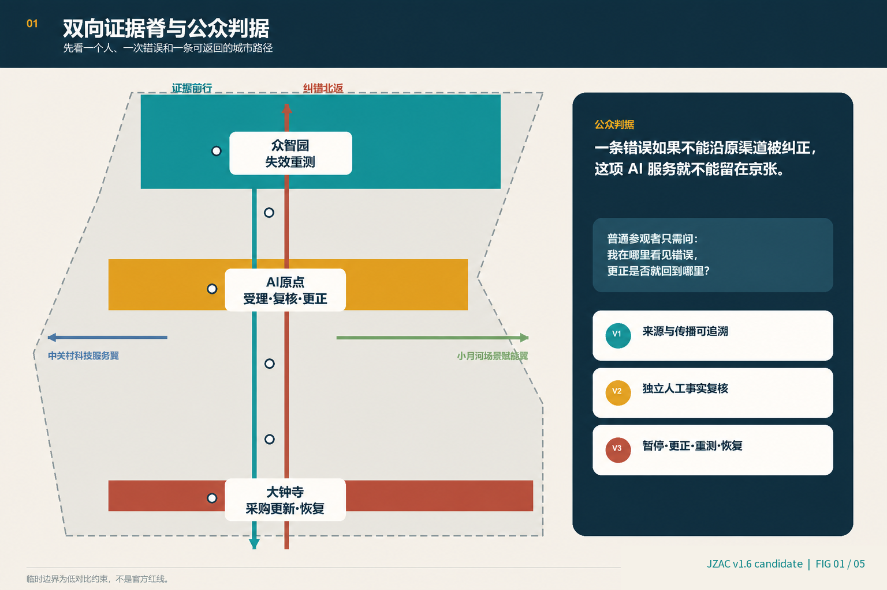
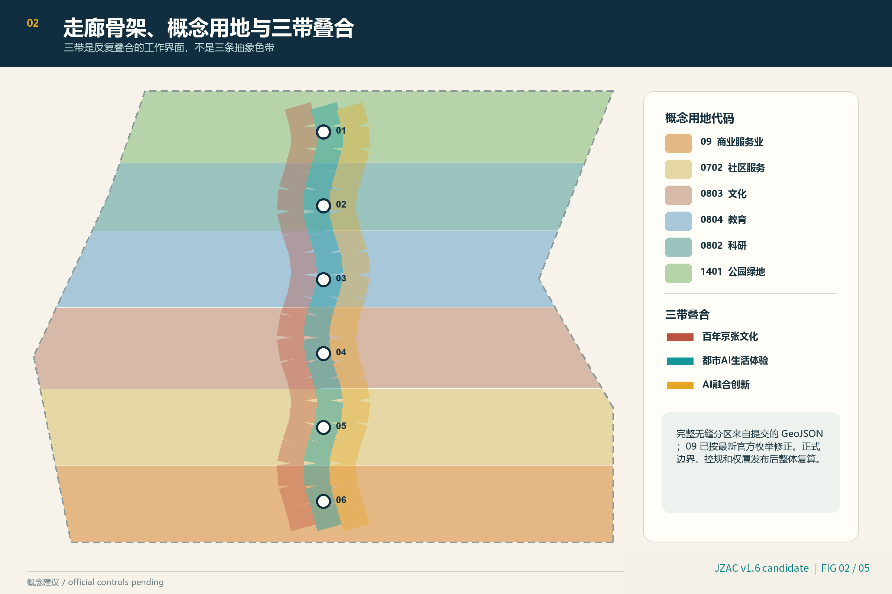
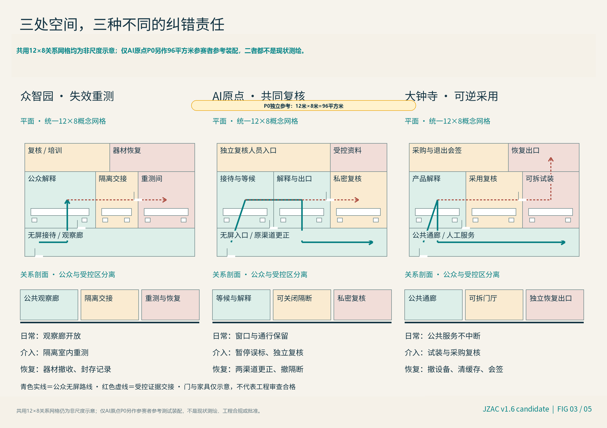
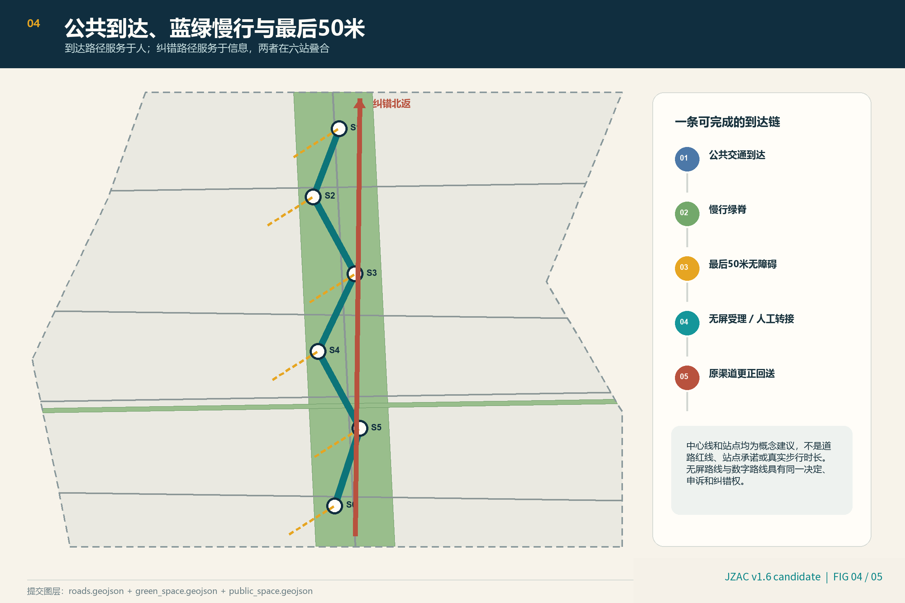
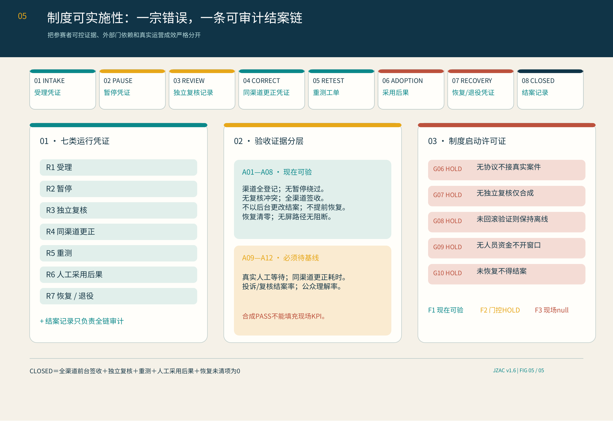

# 京张验真公地

> **公众判据**
>
> **一条错误如果不能沿原渠道被纠正，这项 AI 服务就不能留在京张。**
>
> “证据南行、纠错北返”是承载这句判据的空间结构：结论有期限，错误能回送，服务可恢复。

京张验真公地（JZAC）不是“判真中心”，也不追求给人、内容或企业打一个永久可信分。它把百年京张最重要的现代性——可测量、可交接、可维护、出错后可检修的公共工程制度——转译成AI时代的城市基础设施：众智园测试主张及失败边界，AI原点社区让证据可理解、可争议，大钟寺在采购和使用前验证能否退出；使用端发现的伤害再沿原路径回到共同复核、产品重测和采购更新。成功不是“机器判断了真假”，而是错误被暂停、复核、同渠道更正，并触发下一轮修订。

## 一页总览：任务书不是清单，而是一套闭环

一个人不应先读懂技术协议，才知道自己能否获得纠错。JZAC把判断入口压缩为一句话，把城市结构压缩为一条双向证据脊，再把任务书的品牌、产业、场景、空间、文化和运营放到同一条可停止、可复核、可恢复的公共服务链中。

| 任务书要求 | JZAC 回答 | 可检查成果 |
| --- | --- | --- |
| 三大定位 | 国家人工智能创新核心引领区的公共验真接口、具有国际影响力的AI原始创新策源地的失败学习场、AI未来城市创新试验区的可逆采用基础设施 | 一条双向证据脊、三处原型、90天可退役试点 |
| 五大功能 | 原始创新验证、企业全周期服务、AI+场景开放、公共文化与媒介素养、全球交流与年度运营 | 6站、15场景、12旅程、5项产业测试、4季年度计划 |
| 三片区两翼 | 众智园失效证据场、原点社区共同复核厅、大钟寺可逆采用门厅；中关村科技服务翼与小月河场景赋能翼双向供给 | 三态空间、六字段服务合同、南行/北返责任链 |
| 原创增量 | 不再只问“能否验证”，而是把使用端错误送回源头，让更正覆盖原渠道并触发产品、采购和空间恢复 | 四项城市纠错权、同渠道恢复、失败注入与退役判定 |
| 成败标准 | 不以大屏、流量或单一准确率评判；以能否转人工、能否申诉、能否纠错、能否导出与停用、能否恢复场地评判 | 可计算准备度 + 待试点实测成效，禁止用方案值冒充运营值 |

这张表把品牌、产业、场景、空间、文化和运营六项任务放在同一条证据链上：品牌表达公共承诺，产业提供可复现实验，场景产生真实问题，空间承载复核与恢复，文化解释为什么错误必须可检修，运营则决定何时暂停、修改或退役 [source:AGENT-TASKBOOK] [standard:PROJECT-AGENT-OPEN-CALL-TASKBOOK]。

### 三层验证，而不是一个“真伪分数”

| 层级 | 核查问题 | 必须留下的证据 | 明确边界 |
| --- | --- | --- | --- |
| V1 来源与传播可追溯 | 信息从哪里来、哪个版本、用于什么、发到哪里 | 来源、版本、用途、到期与全部原渠道清单 | 来源有效不等于事实真实 |
| V2 独立人工事实复核 | 具体主张是否能被领域证据支持 | 独立复核角色、证据依据、异议与不确定性 | 检测器输出不替代人的事实判断 |
| V3 纠错后果可执行 | 错误能否被暂停、原路更正并减少后续影响 | 暂停记录、逐渠道签收、产品重测、采购更新、恢复或退役 | 只改后台不算完成纠错 |

这三层分别回答“能不能追到”“能不能判断”“能不能真正改掉”。系统允许结论保持不确定，但不允许责任、传播渠道和恢复动作消失 [data:visual/assets/correction-protocol.json#verification_layers]。

## 设计依据与资料清单

方案以征集公告、智能体任务书、仓库来源登记和专业标准快照为直接依据。公告给出的43.6平方公里统筹研究范围、11.4平方公里总体设计范围、368.4公顷重点范围及三处重点片区名称和公告面积可以引用；仓库尚无可公开核验坐标系的官方精确polygon、控规、道路红线、权属、市政和现状建筑测绘。因此，提交的总体及重点片区边界均继续标记为临时约束，法定容积率、建筑高度、建筑密度、法定绿地率和退线保持“待正式资料补齐” [source:OFFICIAL-ANNOUNCEMENT] [source:BOUNDARY-SOURCE] [depth:existing_conditions_diagnosis]。

11组官方或第一方案例支持来源声明、盲测、风险治理、公开登记、采购条款、工程交接、媒介素养和工业遗产再利用，但没有一组案例足以成为“万能可信模板”。C2PA只能证明内容与来源声明的关联，不能证明事实为真；NIST OpenMFC与AI RMF支持多指标测试、持续监测和人工监督；赫尔辛基及阿姆斯特丹提供登记、反馈和采购生命周期线索；Zollverein说明工业遗产可以继续作为工作的公共基础设施。JZAC的原创增量是把这些机制组织成一条具备城市纠错权和同渠道恢复的空间回路 [source:CASE-C01] [source:CASE-C04] [source:CASE-C10]。

### JZAC与普通判真中心的差异

| 维度 | 普通判真中心 | JZAC |
| --- | --- | --- |
| 目标 | 给出真伪结论 | 管理证据、责任、纠错与恢复 |
| 空间 | 后台检测或单一窗口 | 三片区四段式空间服务原型 |
| 权利 | 提交后等待结果 | 知源、转人工、复核暂停、同渠道恢复 |
| 退出 | 模型升级后继续运行 | 故障注入后修复重测或退役 |

| 案例 | 可迁移机制 | 京张落位 | 明确不照搬 |
| --- | --- | --- | --- |
| C01 C2PA Content Credentials | 签名来源、编辑履历、撤销状态 | 遗产与创作档案的来源收据 | 来源有效不等于事实真实 |
| C02 DARPA Semantic Forensics | 多信号检测并公开不确定性 | 众智园受控取证测试 | 不转化为城市全域监控 |
| C03 NIST OpenMFC | 盲测、版本化数据、多指标复测 | 失效证据场与年度基准季 | 不用单一榜单分数发万能证书 |
| C04 NIST AI RMF / AIRC | 明确责任、监测、事件响应和人工监督 | 六站服务合同与上线闸门 | 对齐框架不等于监管批准 |
| C05 Helsinki AI Register | 公开用途、数据、运营方、监督和反馈 | 原点社区公共登记与纸面入口 | 不把透明度限制在网页用户 |
| C06 Amsterdam Algorithm Lifecycle | 登记、采购条款和全生命周期工具 | 大钟寺采购档案和到期墙 | 条款须经中国法律与采购审查 |
| C07 AI Singapore 100E | 问题界定、PoC、生产准备和交接 | 90天接力试点与企业修订单 | 不承诺相同资金和准入条件 |
| C08 Munich Re aiSure | 可复现实验证据对接风险工程 | 科技服务翼风险会诊 | 公地不定价、不保证承保 |
| C09 Finnish Media Literacy | 教师引导的终身媒介素养 | 原点社区课程与公众校译桌 | 不假设教育制度可以原样复制 |
| C10 Zollverein | 工业遗产继续承载工作和公共生活 | 京张遗产作为服务基础设施 | 品牌叙事不等于已证实保护身份 |
| C11 EU Digital Identity Wallet | 最小披露、撤销、离线/近场验证 | 可选择的凭证核验接口 | 公共服务不强制手机钱包 |

案例的完整来源、限制与原始链接在 `visual/assets/global-cases.json` 和 `sources.json` 中；表格只承担“机制—落位—禁区”的快速评审索引，不新增未经核验的合作或实施事实 [metric:global_case_count]。

## 三层范围工作框架

统筹研究范围负责产业链、治理链和两翼协同；总体设计范围负责把双向证据脊落到城市更新、慢行、蓝绿公共空间与六类服务站；三处重点范围各形成一套不同的空间原型、责任合同和可逆实施单元。三层共同遵循“战略判断—空间原型—责任主体—验收证据—失败恢复”的收敛逻辑，而不制造新的伪精确边界 [standard:PROJECT-OFFICIAL-ANNOUNCEMENT] [depth:three_level_scope_framework]。

一条双向证据脊承担两个方向。北向南是“证据南行”：众智园形成有版本、有用途、有失败边界的测试档案，原点社区进行公共解释和复核，大钟寺决定是否可逆采用。南向北是“纠错北返”：居民、商户或运营方在使用端提出伤害与错误，原渠道先暂停和更正，再把案件转成众智园的重测任务与企业修订要求。中关村科技服务翼将证据转化为法务、知识产权、孵化、采购和风险材料；小月河场景赋能翼把日常问题转化为下一轮测试任务 [data:geometry/site_boundary.geojson#SITE-001] [metric:key_area_count]。

区域协同采用“接口而非飞地”的方式：北纬社区提供日常服务问题与无屏体验验证，未来科学城提供前沿研究成果进入公开测试的候选接口，怀柔科学城提供科学仪器、科研数据治理与公众解释的候选课题，经开区提供制造和供应链场景的候选压力测试，京津冀城市与产业节点提供跨域迁移复测。五类关系均为方案建议，不代表已经建立合作；任何接入都必须经过数据授权、责任确认和退出演练 [source:AGENT-TASKBOOK] [data:visual/assets/brand-operations.json#regional_synergy]。

### 区域协同的交付与退出

五类候选接口逐一记录“责任角色—输入—输出—授权—复测—退出”。北纬社区的问题进入原点形成任务卡和无屏答复；未来科学城的候选成果进入众智园形成失败与重测档案；怀柔科学城的许可材料形成证据边界及公众解释修订；经开区的脱敏产业任务形成压力测试和采购退出清单；京津冀节点以迁移差异表完成属地复核。每次交换都要记录接收角色、用途和撤回路径，不能把交流当成交付 [data:visual/assets/execution-contract.json#regional_interfaces]。

全栈支撑覆盖数据、隔离算力环境、模型工具、独立评测、场景空间、人才与企业服务，分别交付许可测试包、运行日志、版本与失败档案、有期限复核意见、适配恢复清单和工程交接记录。角色尚未任命，五类关系均未签约，真实交换须先取得逐用途授权。完整字段见[执行与协同附件](visual/index.html#execution)，不构成现成合作或资金承诺 [data:visual/assets/execution-contract.json#full_stack]。

## 核心概念与可验证机制：PILOT-A 三区接力纠错演练

PILOT-A不是新的判真模型，而是一场把“受理—暂停—复核—更正—重测—采用后果—恢复—结案”放进真实空间关系的受控合成演练。大钟寺的一块临时演练展签和离线网页把一幅明确标注为AI重建的测试材料误写成“原始京张史料”；普通参观者在AI原点社区的无屏受理台报告问题。两条演练渠道随即由人工暂停，独立档案复核角色将来源记录、检测输出和事实判断分开；更正返回原展签与原离线网页。案件随后北返众智园成为产品与发布流程的失效重测，再回到大钟寺形成采用/修改/退役后果，最后逐项清理临时展签、缓存、备份、设备和测试材料。只有七类运行凭证、全渠道签收、重测、采用后果与恢复全部齐备，合成案件才可标记为`CLOSED_SYNTHETIC_ONLY`；它不发布到真实公共渠道，也不声称真实现场绩效 [data:visual/assets/correction-receipt-demo.json#JZAC-DEMO-001]。

| 时刻与空间 | 人与系统的动作 | 公众可见证据 | 失败即停止 |
| --- | --- | --- | --- |
| T+00 原点社区 | 无屏受理，登记纸面案件号并清点实体展签、离线网页两条渠道 | 1个案件号 + 2个渠道ID | 责任人或渠道不全，不得开始 |
| T+05 原点社区 | 渠道责任人手动暂停两处演练界面 | 暂停时间、责任角色、不确定性提示 | 无责任角色，立即闭锁 |
| T+20 原点社区 | 独立档案复核角色分开核查来源、检测和事实主张 | 结论明确“AI重建，不是原始史料” | 来源与事实混写，维持暂停 |
| T+35 原点社区 | 更正回到原展签与原离线网页并逐项签收 | 同渠道更正 2/2 | 任一渠道遗漏，禁止恢复 |
| T+50 众智园 | 误标转成发布流程的失效重测任务 | 重测任务号、触发条件、修复版本与结果 | 无重测任务，不得进入采用决策 |
| T+60 大钟寺 | 人工记录采用、限制、暂停续约或退役后果 | 采用后果单 | 模型不得自动决定继续采用 |
| T+60 大钟寺 | 逐项关闭设备、材料、数据、缓存、备份和空间 | 恢复与退役回执 | 无恢复记录，演练判为退役 |
| T+60 全链 | 核对七类凭证、全渠道签收、重测、采用后果与恢复 | 结案记录 | 任一条件缺失，不得`CLOSED` |

原点社区用五个空间承载这场演练：无屏受理台、证据前厅、私密复核室、共同校译桌、修订回送墙；五个最小并发席位承担案件受理、原渠道责任、独立复核、重测/恢复和服务决策。验收不是抽象分数，而是同渠道更正达到2/2、协议故障注入全部保持暂停或退役、三区接力和七类凭证完整。若删除任一凭证、绕过暂停、只改后台、未完成重测就恢复、由模型决定采用，或遗留恢复事项，系统均不得进入`CLOSED` [data:visual/assets/pilot-playbook.json#pilot_a_implementation_card] [data:visual/assets/correction-receipt-demo.json#institutional_fail_closed_tests]。

### 七类运行凭证与一条不可跳转的结案链

`correction-receipt-demo.json`把同一合成案件组织成受理回执、暂停回执、独立复核记录、原渠道更正回执、产品重测单、采用后果单、恢复/退役回执七类凭证，另以结案记录核对全部必要条件。状态机固定为`INTAKE → PAUSE → REVIEW → CORRECT → RETEST → ADOPTION → RECOVERY → CLOSED`；每个状态都声明进入条件、最终负责角色、必需凭证、禁止跳转、退出条件、空间支撑和受控Gate。它是协议样例，不是运营KPI；新证据到来时应从`PAUSE`重新开启，而不是静默改写历史 [data:visual/assets/preimplementation-package.json#institutional_state_machine]。

JZAC据此把可实施性拆成三层：F1制度可执行，证明谁有权暂停、复核、更正和结案；F2运营可持续，证明独立复核瓶颈、必要角色和过载闭锁；F3空间可承载，证明无屏入口、私密复核、独立入口、受控存放和恢复区为何不能互相替代。96平方米P0只服务于第三层，不是项目本体。

### P0共同复核与纠错接力单元：从邻接图到参考测试装配

v1.6继续不把现有12×8非米制邻接图伪装成测绘平面，而把12米×8米、96平方米参赛者参考测试装配明确为制度的最小物理载体。它只测试原点社区共同复核厅的空间和运营关系，尚未选择具体房间或地块：24平方米无屏入口与同渠道更正带、16平方米受理等候、16平方米证据解释与离开、16平方米私密独立复核、16平方米独立人员入口与共同校译、8平方米受控记录和恢复存放，六区相加等于参考包络。每个空间对应不可替代的制度约束；连续通行和回转均以1.5米作为设计目标，但必须经授权测量、适用规范复核和真实使用者共测，不能据此声称无障碍合规 [data:visual/assets/preimplementation-package.json#reference_test_fit] [metric:p0_reference_envelope_sqm]。

同一参考装配形成1:500临时关系、1:100参考平面、1:50公众—受控—恢复流线和1:20无屏受理台/纸面回执接口的图纸链。服务筛查采用15分钟受理、30分钟独立复核、30分钟两渠道更正、30分钟重测与恢复交接四个参赛者假设，瓶颈为每小时2个案件；16平方米等候区按每人2平方米形成8人参考上限。达到8人或需求超过筛查能力时停止新增现场受理，保留紧急人工解释，再通过预约或增加独立复核席恢复。该数值是工作包络，不是运营基线或服务承诺 [metric:p0_reference_capacity_index] [data:visual/assets/preimplementation-package.json#operational_screening]。

九类责任角色被压缩为五个最低同时席位：案件受理、原渠道责任、独立复核、重测/恢复、场地或服务决策。权力不能互相替代：案件受理人不得自行结案，原渠道责任人、材料作者、供应商和服务责任人不得复核自己，重测负责人不得自行恢复服务，模型不得自动决定采用或退役。按每次4小时、每周3次、13周、5席计算，90天参考人员量为780席位小时，年度FTE仍为空。六个采购工作包只分配12%调查授权、23%可逆适配与无障碍、15%离线设备与标识、12%渠道接入、28%人员与独立复核、10%退役恢复的参考份额；币种、工程量、单价、总额、报价与资金均为空 [metric:p0_reference_staff_hours] [metric:p0_procurement_package_count]。

十道外部门被改写为制度启动许可证：每道门都明确“打开后允许什么、未打开时禁止什么、当前安全状态是什么、需要何种证据才能释放”。例如G06未开时禁止真实案件与真实渠道结案，G07未开时只能做合成角色演练，G08未开时不得接真实接口，G09未开时不得承诺固定窗口或年度FTE，G10未开时不得部署无法恢复的临时设备。当前10道门全部为`HOLD`、开放数为0，所以P0只能作为参赛者制度可执行性证据包被评审，不能开放真实服务 [metric:p0_external_gate_count] [metric:p0_external_gate_open_count]。

| 主方案 | 条件化安全状态 | 必须保留 | 明确禁止 | 回到主方案的条件 |
| --- | --- | --- | --- | --- |
| 固定共同复核与纠错接力单元 | 人工移动受理台＋另行预约的私密房间 | 无屏受理、独立复核、纸面回执、同渠道更正 | 不宣称建成永久共同复核厅 | 场地许可、实测房间、工程和无障碍放行 |
| 获授权的三区现场接力 | 单站离线桌面接力 | 八状态、角色交接、闭锁测试、恢复凭证 | 不报告三区现场绩效 | 三区场地主体、渠道责任和人员共同授权 |
| 机器可读渠道接入 | 人工逐渠道签收台账 | 渠道清单、责任人、前后版本、签收 | 不宣称自动或即时纠错 | 接口复核、安全测试和回滚证据 |
| 限域联网证据服务 | 离线合成证据包、纸面案件号和人工保管 | 公众解释、无屏路线、独立复核、失败闭锁 | 不接入个人材料或真实公共渠道 | 版权、隐私影响和网络安全放行 |

这些分支不是与主方案并列的低配设计，而是外部门失败时的受限运行态；降低的是运行强度，不是公众纠错权。任何分支都不得删除“暂停—独立复核—同渠道更正—恢复/退役”四项不变量 [metric:p0_conditional_branch_count] [data:visual/assets/preimplementation-package.json#conditional_implementation_branches]。

制度验收分为两组。A01—A08当前可由合成档案和协议测试判定：未登记渠道、非法绕过暂停、复核冲突、只改后台却结案、未重测即恢复、未关闭恢复项和无屏脚本关键阻断均为0，同渠道签收覆盖率为100%。A09—A12必须保持待实测：真实人工等待、真实更正闭环耗时、投诉/复核结案率，以及公众能否理解“来源真实不等于内容真实”。前八项证明制度内部可执行，不得被包装成真实服务绩效 [metric:p0_illegal_pause_bypass_transition_count] [metric:p0_same_channel_ack_coverage_ratio] [data:visual/assets/preimplementation-package.json#acceptance_evidence]。

2案件/小时表达的是独立复核能力边界，而不是客服KPI。达到8人或需求超过筛查包络时，停止新增walk-in但保留人工解释与暂停入口；不得通过缩短独立复核扩容。90天合成试点可计算为5席、780席位小时；有限长期窗口只有在第90天复核、具名角色和渠道协议到位后才能重复；扩展运营的案件量、席位和年度FTE均保持空值，必须根据真实需求为复核、更正、重测和恢复配置完整并行链 [data:visual/assets/preimplementation-package.json#operational_screening]。

## 统筹研究范围产业与未来城市研究

“可信”在本方案中不是证书，而是一份随用途变化、到期失效、允许撤销和申诉的证据档案。企业声明、实测结果、未解决问题、适用范围、人工意见、整改复测和退出条件分栏记录；初创企业可把档案带入孵化，采购者只读取与用途相关的证据，投资与保险角色只能把可复现实验作为参考。科技服务翼不得把证据档案包装成政府认证，公地不得出售个人案件数据或经营黑箱信誉分 [source:AGENT-TASKBOOK] [standard:PROJECT-AGENT-OPEN-CALL-TASKBOOK]。

未来城市形态不依赖巨型屏幕和连续感知，而由四项“城市纠错权”塑造：知源权要求显示来源、版本、用途和到期；转人工权保证不用手机、账号、刷脸或付费也能获得等价核心服务；复核暂停权允许高影响不利传播在独立复核前暂停；同渠道恢复权要求更正与补救回到原展签、原窗口、原网页及所有订阅方。这四项是方案提出的运营权利测试，不是已立法权利 [metric:correction_right_count] [data:geometry/public_space.geojson#PUBLIC-003]。

## 总体设计范围城市更新与控规深度城市设计

总体空间保持“一条双向证据脊、三带叠合、三核六站、两翼互馈”。百年京张文化带承载版本化记忆，明确区分原始档案、修复、数字重建和AI解释；都市AI生活体验带承载无屏服务、人工复核与同渠道恢复；AI融合创新带承载失效测试、有期证据和可逆采用。三带不是平行用地色块，而是在六站反复叠合的三类工作界面 [data:geometry/land_use.geojson#LU-001] [depth:land_use_function_structure]。

`land_use.geojson`在临时总体边界内维持无缝、无重叠的概念用途分区；`buildings.geojson`中的12个单元仍只表达保留或适配载体，不承诺征拆与新建；`roads.geojson`只表达慢行、骑行和轨道接驳中心线。所有站点新增同一份六字段服务合同：责任主体、人工转接、回送渠道、暂停触发、停用触发、恢复动作。合同字段完整率可以由提交文件计算，但真实人员到岗、渠道联通与服务时效必须通过试点验证 [data:geometry/buildings.geojson#BLDG-001] [metric:station_contract_complete_count] [depth:retain_renovate_demolish]。

## 重点区域详细设计

**众智园——失效证据场。** 这里不只证明AI“能工作”，而要公开它如何失效。空间剖面由公众观察廊、受控测试场、群体差异测试室、隔离停用区和修复重测区构成；公众流线与许可测试材料分开。日常态提供方法展示和预约受理，测试态限制材料与观察边界，恢复态隔离错误结果、公布局限并完成修复重测。它向南输出的不是一枚认证章，而是一份带失败样本、适用边界、责任人与到期日的档案 [data:geometry/key_areas.geojson#PROV-KEY-001] [data:geometry/public_space.geojson#PUBLIC-005]。

**北京AI原点社区——共同复核厅。** 无屏受理台、证据前厅、私密复核室、共同校译桌和修订回送墙组织成可步行首层。技术证据在这里被翻译成普通人能理解、能质疑的公共语言；被误标的个人和小企业可以暂停标签传播、调阅相关依据并提出独立复核。复核通过后，更正必须返回每个被记录的实体和数字渠道，而不是只修改后台数据库。v1.6把这套邻接关系进一步锁定为八状态制度闭环的最小物理载体，但没有选择真实房间或把参考面积写入地块指标 [data:geometry/key_areas.geojson#PROV-KEY-002] [metric:same_channel_contract_coverage_ratio] [metric:p0_reference_envelope_sqm]。

**大钟寺——可逆采用门厅。** 可信采购台、全周期成本桌、退出测试位、证据到期墙和无屏恢复窗构成南端空间原型。中小企业在采用AI前比较供应商声明、实测证据、数据迁移、停用、人工替代和恢复成本；证据过期、无法导出数据或无法停止服务时暂停续约。大钟寺向北返回的不是投诉摘要，而是一项带采购后果和重测要求的纠错任务 [data:geometry/key_areas.geojson#PROV-KEY-003] [data:geometry/public_space.geojson#PUBLIC-002]。

三处原型都在日常态、测试态、恢复态之间切换。构筑物轻量可拆，测试设备与日常服务隔离；官方边界、建筑普查、消防结构与运营资源未确认前，所有片区方案均为专业团队深化的概念建议。

## AI 创新生态、人才画像与 AI+ 场景

方案保留15个场景、12类人物旅程和5个产业验证场景，覆盖AI+医疗、教育、商业、遗产、交通、创作者权利和公共突发信息。每个场景不仅记录用户、空间、数据边界、输出和禁止事项，还必须绑定人工复核角色、原始传播渠道、暂停/停用条件和恢复动作。完整场景合同见 `visual/assets/scenarios.json`，城市纠错协议见 `visual/assets/correction-protocol.json` [metric:scenario_count] [metric:persona_journey_count] [metric:industry_validation_scenario_count]。

三条代表性链路把AI应用与场地相关性锁定。其一，京张遗产数字重建若被误标为原始史料，众智园重测发布流程，原点社区共同复核，沿线展签和离线网页同渠道更正；其二，社区医疗消息若因不确定检测而延误就医，先转临床服务，再更正传播渠道并把错误转成分诊协议修订；其三，大钟寺小企业采购的AI若证据过期或数据无法导出，暂停续约、完成迁移演练并将结果回送供应商和评测端。系统允许“无法确定”，来源、检测和人工判断始终分开。

12类旅程包括无智能手机退休居民、轮椅及低视力访客、社区医生、教师、家长、小商户、AI创业者、创作者、记者、评测研究员、国际采购者和公共窗口人员。每条旅程都从到达、受理、复核走到结果和失败恢复；无屏路线不是备用福利，而是与数字路线具有同一决定、申诉和更正权利。

| 场景组 | 代表场景 | 主要空间 | 失败时的恢复动作 |
| --- | --- | --- | --- |
| 产业验证 S01-S05 | 来源登记、深伪基准、上线闸门、中小企业采购、AI保险复现 | 众智园 + 科技服务翼 + 大钟寺 | 撤销过期收据、发布局限、重测、暂停采购或转人工责任判断 |
| 公共服务 S06-S11 | 医疗澄清、教育凭证、商户材料、社区谣言、老年反诈、无障碍说明 | 原点社区 + 小月河翼 + 六站 | 紧急服务优先、原渠道更正、纸面回执、人工接管与无障碍复核 |
| 创作与城市 S12-S15 | 创作者履历、公共告示、受害者信誉恢复、京张遗产档案 | 文化带 + 纠错恢复站 + 沿线展签 | 撤销错误关联、同步替换展签/网页、保留版本记录并回送重测 |

15个场景的共同句法是“谁受理—在哪复核—依据是什么—谁能暂停—错误回到哪里—如何恢复”；这样场景数量不再是菜单，而是可被采购、运营和空间同时检查的合同 [data:visual/assets/scenarios.json#S01] [data:visual/assets/scenarios.json#S15]。

## 用地、建筑规模与拆改留方案

更新方法坚持“先留后改、可逆优先、用途先行、结构再判”。A类为原貌保留及安全修缮的铁路遗产与潜在价值建筑，B类通过首层开放、无障碍和可拆室内适配承载六站，C类只有在测绘、权属、结构、遗产和全生命周期碳评价后才能讨论补充体量。现阶段没有任何单元标记为必须拆除 [standard:MNR-LAND-USE-CLASSIFICATION-GUIDE] [depth:height_massing_character]。

法定开发强度继续保持待正式资料补齐。可复算的概念建筑基底、设计绿地、公共空间和中心线长度只用于比较方案内部结构，不能替代规划绿地率、建筑密度或工程规模。官方polygon和建筑普查到位后，九个GeoJSON、五幅图、PDF及所有空间指标必须整体重算。

## 交通、轨道、市政与公共服务设施

可达路径采用“公共交通到达—慢行绿脊—最后50米无障碍—人工转接—同渠道回送”。南部强化轨道接驳和四象限步行，中部连接校区、园区与社区首层，北部处理跨环路与清河公共界面。提交中心线均被裁剪在临时边界内，不代表道路红线、断面和真实步行时长 [data:geometry/roads.geojson#ROAD-001] [metric:slow_mobility_length_m] [depth:traffic_rail_slow_parking]。

六站必须同时提供临街可见入口、无障碍连续路径、至少两种人工交流方式、隐私会谈位、纸面收据、等待及陪同座席。评测工坊需独立网络、许可数据隔离、样本留存和修复重测空间；公共受理可在断网时生成案件号。能源、算力、排水、消防、网络冗余与设备散热均待工程资料确认，`constraints.geojson`不绘制虚构管线 [data:geometry/constraints.geojson#CONSTRAINTS] [depth:municipal_new_infrastructure]。

## 蓝绿空间、公共空间与城市风貌

京张遗产绿脊首先是居民每天可使用的公共客厅，其次才是AI展示界面。线性绿地承担遮荫、雨洪、慢行和停留，横向绿廊连接小月河场景翼，六个公共空间多边形表达有人值守的服务界面。设计绿地率和公共空间率来自提交图层，只用于内部结构评价；正式生态、洪涝和无障碍连续性仍需现场与官方数据复核 [data:geometry/green_space.geojson#GREEN-001] [metric:green_ratio] [metric:public_space_ratio]。

风貌不复制“火车造型”，而以铁路工程纪律形成识别：深蓝代表责任与档案，青绿代表公共服务，琥珀代表到期和切换，砖红代表纠错及恢复。新增构件轻量、可拆、与遗产留缝；方法墙明确写出“来源有效不等于事实真实”“检测有误差”“不确定可以保留”“结论可以申诉”。不设置人脸框、巨型屏幕或监控式赛博意象。

## 品牌、朝圣地标与京张文化叙事

品牌名保持“京张验真公地 / Jing-Zhang Authenticity Commons”，缩写JZAC。标志采用抽象的J/Z铁路折线与一对相反方向箭头：青绿箭头表示证据南行，砖红箭头表示纠错北返，琥珀节点表示到期与切换；它是提案视觉识别，不使用任何机构或第三方商标。中文口号“证据南行，纠错北返”，英文口号“Evidence moves south. Corrections return north.”在导视、纸面收据、方法墙和离线网页保持同一含义 [data:visual/assets/brand-operations.json#identity]。

四处概念性朝圣地标把抽象制度变成可到达、可讲述的公共空间：众智园“Commit 0 起始广场”展示每轮测试的问题、版本和责任人；原点社区“智能体贡献日志墙”并列记录人类与智能体的贡献、争议和修订；双向证据脊的“失效边界信标”只在局限、到期和停用时点亮；大钟寺“同渠道修复墙”追踪一条更正是否返回原窗口、原展签、原网页和订阅方。四者是概念节点，位置、结构、消防、照明和遗产影响均待正式深化 [metric:pilgrimage_landmark_count]。

文化叙事不把百年京张压缩成怀旧符号，而从“工程日志”延伸到“开源日志”：建设者留下测量、交接和检修记录；今天的模型、数据、界面和运营者也必须留下版本、贡献、失败与恢复记录。荣誉体系奖励“最清楚的失败边界、最有效的同渠道纠错、最完整的交接、最可访问的无屏服务”，不奖励夸大的全能叙事。构件库包括版本牌、到期灯、人工转接旗、可逆地台、盲测帘和修复回执架，便于六站共用并在退役时拆除。

## 全球活动与长期运营

年度运营以四季循环连接开发者、居民、企业和国际访客：春季“开放基准季”发布经许可的数据说明、失败样本和多指标挑战；夏季“城市纠错周”邀请居民和一线人员提交同渠道恢复案例；秋季“京张开源遗产节”以贡献日志、档案校译和无屏导览连接铁路文化与AI创作者；冬季“年度权利审计与国际交换”公开被暂停、修改和退役的项目，并与境内外评测、采购和公共服务团队复盘迁移边界 [metric:annual_program_cycle_count]。

长期运营不是连续办展，而是“问题征集—授权测试—公共解释—可逆采用—伤害回送—重测/退役”的循环。开发者社区获得有边界的测试任务和工程交接要求；企业从开放日进入问题诊断、PoC、采购档案和风险会诊；公众从文化参访进入无屏体验、媒介素养和纠错受理；国际团队从双语案例库进入限域复现与共同报告。每次活动均需责任人、数据许可、可访问性、安全和退出检查，核心公共无屏服务保持免费，活动流量不得替代纠错成效 [data:visual/assets/brand-operations.json#annual_programs] [depth:operation_strategy]。

## 更新项目清单、实施政策与分期计划

近期0—18个月从现有服务空间启动S—M档轻量项目：JZAC-01无屏服务协议、JZAC-02清权多模态基准、JZAC-04同渠道纠错、JZAC-06媒介素养课程。首个90天分四阶段：1—15天建立责任、授权和渠道基线；16—45天运行遗产、医疗、采购三条接力链；46—70天主动注入来源缺失、责任缺位、人工通道故障、回送失败和删除证明失败；71—90天独立决定采用、修改或退役。无责任人、无合法或合成测试材料、无回送渠道时立即停试 [metric:pilot_duration_days] [data:geometry/phasing.geojson#PHASE-001]。

| PILOT-A阶段 | 责任主体 | 阶段成果 | 指标 | 停止条件 |
| --- | --- | --- | --- | --- |
| 1—15天 | 场地主体/试点负责人 | 授权材料、渠道清单、基线 | 责任与合法材料齐备 | 任一缺失即停 |
| 16—45天 | 测试与复核团队 | 失败档案、复核回执 | 不利结论人工复核 | 无法复核即停 |
| 46—70天 | 渠道责任人 | 故障注入、回送记录 | 更正返回原渠道 | 不能回送即暂停 |
| 71—90天 | 独立复核角色 | 采用/修改/退役决定 | 恢复证据完备 | 无恢复证据不继续 |

中期18—36个月在官方边界、权属、建筑、消防、结构、无障碍和成本证据到位后实施JZAC-03三片区六站适配、JZAC-05采购档案及JZAC-07创作者/遗产档案；远期36—60个月只有在独立影响评估、稳定公共资金和法定程序成立后，才推进JZAC-08走廊治理和年度权利审计。每期都有进入条件、责任人、验收证据、停止触发和资产/数据恢复方式 [data:geometry/phasing.geojson#PHASE-002] [depth:phasing_implementation]。

当前不虚构金额。项目按S（现有柜台+培训+纸面/电话流程）、M（可逆空间适配+隔离设备+无障碍改造）、L（多机构评测设施）记录资源档位，并拆分人员、适配、设备、数据、无障碍、审计和恢复成本。取得工程数量、权属条件和权威本地成本依据后，才能形成货币区间。核心公众无屏服务保持免费；禁止出售案件数据和用黑箱评分创收 [source:CASE-C07] [depth:renewal_project_list]。

### 可执行附件与现场启动条件

状态提示：本版仍为概念建议，空间数据采用临时边界；场地工程条件和运营KPI均待授权实测。执行附件完整不等于取得现场批准。

现有RACI概览按`INTAKE—PAUSE—REVIEW—CORRECT—RETEST—ADOPTION—RECOVERY—CLOSED`八个状态重排；每个状态只有一个最终负责角色，另列执行、咨询、知会、所需凭证和禁止跳转。原发布者、供应商、材料制作人与渠道责任人不能独立复核自己的案件；独立复核者不能自行恢复发布；模型输出不能替代采用、修改或退役决定。两个原渠道分别填写旧新版本、暂停与更正时间、签收人和证据引用；遗漏、后台-only修改或未签收都保持暂停。参见[可填写执行附件](visual/index.html#execution) [data:visual/assets/execution-contract.json#raci]。

现场前需确认场地主体、人员时段、数据规则、无障碍共测和签字机制。当前均为待审草案，签字为空，不假装已经开办服务。共测覆盖无手机受理、低视力读状态、轮椅到达与离开、辅助沟通理解“来源有效不等于事实真实”；自愿参与可退出，记录障碍、修改及复测。指标说明起止事件、分母、失败与未结案的处理方式；基线、现场目标和实测结果均待授权确认 [data:visual/assets/execution-contract.json#measurement]。

P0预实施附件在此基础上增加八状态机、七类运行凭证、一条结案记录、参考测试装配、容量与排班筛查、六个采购包、五级维护、十道外部门和四个条件化安全状态。每次演练核对案件号、渠道和纸面收据；每周测试无屏路线、渠道可达、到期、打印与离线终端；第45天复核冲突和障碍，第70天完成故障注入，第90天关闭设备、材料、缓存、备份和空间。只有全渠道前台更正、独立复核、重测、人工采用后果与恢复齐备才允许结案；维护记录不替代真实场地、专业签署或运营绩效 [data:visual/assets/preimplementation-package.json#institutional_state_machine] [data:visual/assets/preimplementation-package.json#maintenance_and_recovery]。

## 指标体系、面积复算与合规矩阵

指标分为“提交包准备度”和“真实运营成效”。前者可以复算：三片区、六站、15场景、12旅程、5个产业验证场景、4项纠错权，以及六站责任、人工路径、回送渠道、暂停/停用/恢复字段是否完整。六站目前均具备结构化合同字段，但这只能证明方案可检查，不能证明现实服务已经存在 [metric:verification_station_count] [metric:station_contract_complete_count] [metric:human_handover_contract_coverage_ratio]。

v1.6新增的可计算制度准备度包括八状态顺序、七类运行凭证、全渠道前台签收、禁止后台-only结案、禁止跳过暂停、禁止复核利益冲突、禁止重测前恢复，以及无屏路径不被阻断。A01—A08可由合成演练与结构化测试验证；A09—A12——真实人工等待、同渠道更正闭环耗时、投诉/复核结案率和公众理解率——必须保持待现场基线，结构化数值保留为空。96平方米参考包络、2案件/小时瓶颈筛查、780席位小时、6个采购包、10道外部门且0道开放继续作为物理承载与启动边界，而不是现场绩效 [metric:p0_illegal_pause_bypass_transition_count] [metric:p0_same_channel_ack_coverage_ratio] [metric:p0_external_gate_open_count]。完整验收映射见预实施包 [data:visual/assets/preimplementation-package.json#acceptance_evidence]。

后者必须由授权试点建立基线，当前全部保持待实测：人工接管时间、同渠道更正时间、无屏等价完成率、申诉改判率、用户能否理解“来源不等于真相”、数据与资产恢复完成率。未来发布结果时需同时公开不同沟通方式的差异、未解决案件和停止项目，不能只选择成功案例 [metric:human_handover_time_min] [metric:same_channel_correction_time_h] [metric:screenless_parity_completion_ratio]。

## 风险、版权与合规说明

最高风险是假权威：把漂移的检测器包装成最终判断，会造成服务拒绝、声誉损害和数字排斥。JZAC不设真相总分、不建自动黑名单、不拥有删帖权、不声称政府认证；来源声明、取证检测、外部证据和人工判断保持分离。高影响不利结论需两人复核，所有结果都有用途、到期、撤销和申诉，不跨场景画像，不建人脸库，不自动拒绝医疗、教育、公共或商业服务 [depth:risk_missing_data] [source:C2PA-HARMS]。

合规边界并列锁定：公开资料只在许可用途内使用，隐私实行最小收集与分场景隔离，版权保留来源、授权与撤销记录，审批结果保持不确定，一切高影响不利结论必须人工复核。

主稿、HTML、A3、A0和五幅含文字图均提供英文对应版本；离线网页不加载CDN、远程地图、字体、表单、iframe、跟踪或网络请求。封面为AI生成概念图并已披露；五幅图依据本包GeoJSON、指标和结构化协议派生，PDF使用同一图件排版并已经逐页渲染检查。短视频本轮暂缓，不影响静态专业方案包的完整性。所有空间建议均为专业团队深化材料，不声称官方批准、法定控规、最终权属、确定投资或保证实施。

v1.6候选版仍不是加量版，也不把制度型方案误改成施工深化：它完整保留v1.4.2以来的一句公众判据、三区接力、三层验证、案例、场景、人物和总体空间，只把原点P0从“可复算空间包”推进为“可审计的制度执行链”。参考尺寸、容量、人员和成本份额均为参赛者假设；十道外部门继续关闭，但每道门都明确“开启什么、阻断什么、失败后停在哪个安全状态”。任何回退都只能降低运行强度，不能削弱公众暂停、独立复核、同渠道更正和恢复/退役权利。PR #4236仅作为“可计算范围与外部门分开表达”的公开同业方法参照，JZAC不照搬其概念、标识、A/B/H机制、尺寸、成本或空间类型 [source:PEER-SHARED-FLOOR-4236]。

### 数据与授权的证据边界

执行附件区分公开纠错回执、受限案件材料和最小审计事件。公开回执不包含案件原件和直接标识；受限材料仅按需授权访问，不默认公开可关联哈希。结案并处理完申诉后30天内删除材料、每90天复核公开及审计记录的必要性，均为待专业审查的建议周期，不是法定期限。删除覆盖原件、派生副本、缓存、导出及备份；备份未清不能声称全部删除，保全例外须记录依据、批准人、复核日与访问限制 [data:visual/assets/execution-contract.json#data_protocol]。

本轮可验证离线字体、八状态顺序、七类凭证完整性、职责分离、同渠道前台更正、受控故障闭锁和P0算术一致性。真实授权、运营签约、现场共测及工程成本是触发后完成的后续事项，分别列明责任角色和触发条件；它们限制现实启动，不被包装成已取得的证据。新官方几何发布后仍须包级联动复算；本版不改变九个空间图层或法定未知指标 [data:visual/assets/execution-contract.json#conditional_followups] [data:visual/assets/preimplementation-package.json#external_gates]。

## 参考资料

完整来源、权利与使用限制见 `sources.json`；全球案例的迁移边界见 `visual/assets/global-cases.json`；场景、人物、城市纠错权、90天试点和P0预实施证据分别见 `visual/assets/scenarios.json`、`persona-journeys.json`、`correction-protocol.json`、`pilot-playbook.json`与`preimplementation-package.json`。关键依据包括征集公告、智能体任务书、C2PA、NIST AI RMF/OpenMFC、赫尔辛基AI登记、阿姆斯特丹算法生命周期工具、AI Singapore 100E、芬兰媒介素养和UNESCO Zollverein [source:SITE-PACKAGE] [source:CASE-C04] [source:CASE-C07]。
