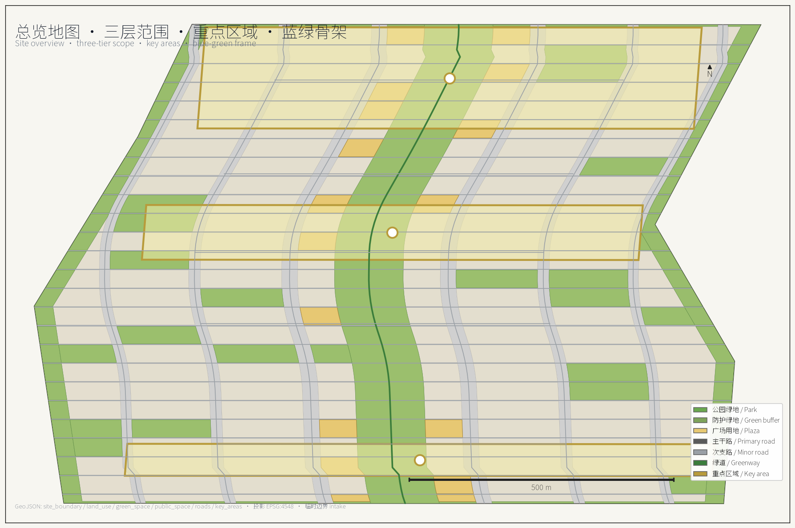
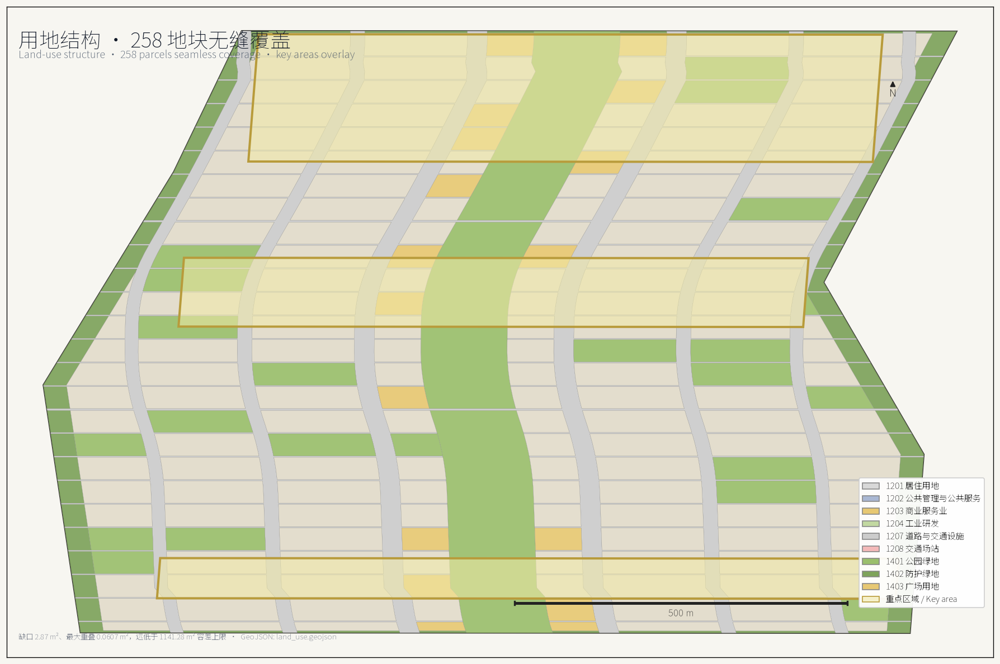
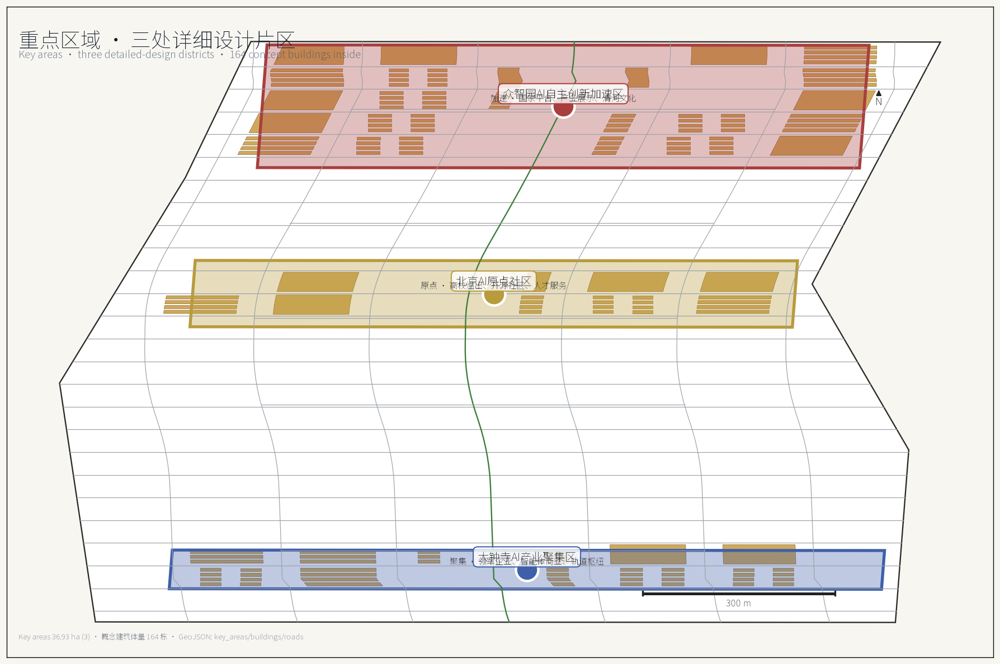
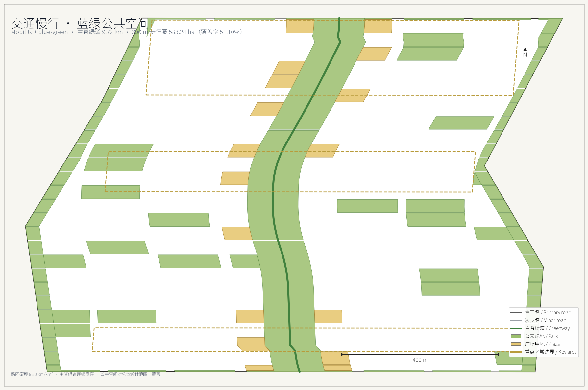
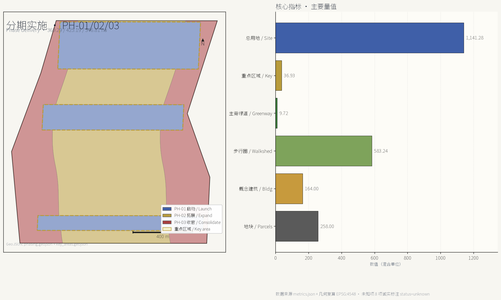

# Jing-Zhang Neural Spine: A One-Spine Three-Core Two-Wing Centennial Jing-Zhang AI Innovation Belt Urban-design Concept Proposal

A century ago the Jing-Zhang Railway used a herringbone switchback to carve the will for technological self-reliance into the gradient of the Yan Mountains. More than a hundred years later, that same alignment has become a green seam in the city that the neighbourhoods on both sides have turned their backs on. This proposal re-defines that seam as a "spine" — a continuous 9.72 km public-space main spine that is both a carrier of historical narrative and a corridor through which AI innovation factors flow, exchange and become visible to the public at the city scale.

Every spatial judgement in the proposal is expressed as structured data: nine GeoJSON layers, 258 land-use parcels, 164 concept building volumes, 100.77 km of road centreline, and three implementation phases — all recalculated and written to `metrics.json` under the CGCS2000 three-degree-zone projection (EPSG:4548). Wherever public sources cannot support a conclusion, no value is written; instead it is explicitly tagged `unknown` with a note on what is missing and from whom it should be obtained.

## Design Basis and Documentation Index

The first basis of this proposal is the *Pre-qualification Announcement for the International Solicitation of Urban-design Concepts for the Centennial Jing-Zhang AI Innovation Belt*, issued by the Haidian Branch of the Beijing Municipal Commission of Planning and Natural Resources. It defines three levels — the coordinated research scope, the overall design scope and the key-area scope — as well as the depth of regulatory-detailed-planning control and comprehensive implementation planning that the urban design must reach [source:OFFICIAL-ANNOUNCEMENT]. The second basis is the excerpt of the open-source taskbook for global AI agents, which adds the ten co-creation principles, the three strategic positionings, the five functions, the three-district two-wing framing, the six mandatory agent tasks (agent.1 to agent.6), and the unified boundary clause [source:AGENT-TASKBOOK]. The third basis is the enums, allowed design space, metric ranges and geometry files in the repository site package, which translate the textual requirements above into machine-checkable constraints [source:SITE-PACKAGE].

For professional standards, the proposal organises its plan and three-dimensional space, public space, and building height/massing/style/colour controls in line with the *Urban Design Management Measures* [standard:MOHURD-URBAN-DESIGN-MEASURES]; it organises the expression depth of land use, intensity, supporting facilities and roads in line with the *Regulations on the Compilation and Approval of Regulatory Detailed Planning of Cities and Towns* [standard:MOHURD-CONTROL-DETAILED-PLANNING]; land-use codes are taken strictly from the land-use classification subset shipped in the site package, with no self-invented codes [standard:MNR-LAND-USE-CLASSIFICATION-GUIDE]. The per-clause response method, evidence files and deviation notes for the standards are saved in `standard_matrix.json`; coverage of the 15 design-depth items is saved in `design_depth_matrix.json`; the 23 mandatory-task mappings of the announcement and taskbook are saved in `compliance_matrix.json`, and the body text does not repeat the machine index [depth:existing_conditions_diagnosis].

Source availability follows the tiering of the repository registry: the three usage tiers `formal`, `background_only` and `provisional_only` must not be upgraded into one another [source:SOURCE-REGISTRY]. `data/processed/agent_fact_pack.md` is used only as a reading-navigation layer; any factual judgement is re-checked against the original registry material [source:PROCESSED-FACT-PACK].

One precondition that must be stated explicitly: the organiser has not yet published the official red line. The overall design scope and the three key districts in this submission are taken verbatim from the provisional substitute boundary in the site-package `provisional_boundaries.geojson`, with no shape modification, and are tagged in the GeoJSON properties with `official_boundary=false` and `geometry_role=provisional_constraint` [data:geometry/site_boundary.geojson#PROV-SITE-001]. The recalculated overall design scope area is 11,412,825.39 m², within 0.12% of the announcement text's 11.4 km² [metric:site_area_sqm]. These geometries may be used only for scheme generation, self-checking, visualisation and design discussion; they cannot serve as the official red line, an approval basis, or a precise-area basis. Once the official polygon is published, land use, roads, green space, public space, buildings, phasing and all metrics must be recalculated in full rather than by swapping a single file.

The data gaps confirmed for the current phase total eight, including approved floor-area ratio and height controls, the official red line, the existing-building survey vector, demolition/retention ownership and structural data, sub-district population definitions, employment-statistics definitions, and the rail-station coordinate vector. They are recorded one by one in `metrics.json` with `status=unknown` plus a `reason`, and registered in `assumptions.json` as assumptions pending professional confirmation; at no point is an estimated value passed off as a known one.

## Three-tier Scope Working Framework

The three tiers are not three drawings at different scales — they are three different working methods. The coordinated research scope answers "how the ecosystem is organised"; the overall design scope answers "how the structure is drawn"; the key-area scope answers "how the parcels are made viable". The comparison between recalculated area and announcement text area is as follows; the deviations all come from the geometric approximation of the provisional substitute boundary, not from design changes [depth:three_level_scope_framework].

| Tier | Announcement text area | This proposal recalculated area | Deviation | Working method | Evidence |
| --- | --- | --- | --- | --- | --- |
| Coordinated research scope | 43.6 km² | 43,609,232.56 m² | +0.02% | Industry ecosystem, regional coordination, naming and narrative research | [metric:research_area_sqm] |
| Overall design scope | 11.4 km² | 11,412,825.39 m² | +0.11% | Land use, roads, blue-green, public space, phasing drawing | [metric:site_area_sqm] |
| Key-area scope | 368.4 ha | 3,692,893.01 m² | +0.24% | Building volume, scenarios, detailed public-space design | [metric:key_area_total_sqm] |
| Zhong Zhi Yuan AI Self-reliance Acceleration Area | 192.1 ha | 1,929,201.88 m² | +0.43% | Spatial carrier for the full-stack self-reliance system | [metric:key_area_zhongzhiyuan_ai_acceleration_area_sqm] |
| Beijing AI Origin Community | 104.3 ha | 1,043,236.91 m² | +0.02% | World-class innovation ecosystem and living services | [metric:key_area_beijing_ai_origin_community_sqm] |
| Da Zhong Si AI Industry Cluster | 72.0 ha | 720,454.22 m² | +0.06% | Intelligent-native new formats and consumer commerce | [metric:key_area_dazhongsi_ai_industry_cluster_sqm] |

The transmission between the three tiers is checkable. The "source–transform–experience–communicate" four-segment innovation chain derived from the coordinated research fixes the overall-scope land-use ratio of 13.20% R&D land and 7.49% commercial-service land; the spine continuity fixed by the overall design requires each of the three key districts to contribute a segment of public-space interface rather than closing itself into a gated campus; the building volumes and scenario density of the key districts in turn validate whether the spine's 300 m walkshed can serve enough population [data:geometry/key_areas.geojson#PROV-KEY-001].

The proposal does not accept the practice of "nice top-level concept, drawings at the bottom that do not match". Therefore every tier's conclusion is bound to a concrete layer: the scope tier binds to `site_boundary.geojson` and `constraints.geojson`; the structure tier binds to `land_use.geojson`, `roads.geojson`, `green_space.geojson`, `public_space.geojson`; the detail tier binds to `key_areas.geojson`, `buildings.geojson`, `phasing.geojson`. Any area, ratio, length or count that cannot be recalculated from these files is not written as a formal conclusion [depth:overall_spatial_structure].

## Coordinated Research Scope — Industry and Future-city Studies

Within the 43.61 km² coordinated research scope, Haidian already has the fundamentals of "dense universities and research institutes, agglomerated leading firms, accessible compute and data factors, and a complete incubation–transformation chain". The proposal organises these factors into a four-segment innovation chain: the **source segment** is carried by universities, research institutes and national laboratories undertaking basic research and talent origination; the **transformation segment** is carried by Zhong Zhi Yuan's full-stack self-reliance system, engineering chips, frameworks, models and tool chains; the **experience segment** is carried by the AI Origin Community and the heritage-park spine, opening scenarios and public verification; the **communication segment** is carried by Da Zhong Si's consumer-commerce interface and the global-events system, undertaking international communication and factor allocation. The four segments form a closed loop through the spine's continuous pedestrian system and the two-wing service network, rather than being strung together by an administrative hierarchy [source:AGENT-TASKBOOK].

Eight global benchmark cases are selected to validate the spatial consequences of different ecosystem organisations; all are publicly checkable cities or parks, with no citation of any non-public operating data [standard:PROJECT-AGENT-OPEN-CALL-TASKBOOK].

| Case | Ecosystem organisation | Lesson for this belt | Failure mode to avoid |
| --- | --- | --- | --- |
| Boston Kendall Square | University–hospital–enterprise share experimental facilities | Shared pilot facilities should sit on the street, forming a visible innovation interface | Land-price rises crowd out early-stage teams |
| London King's Cross | Railway-heritage renewal drives digital-industry clustering | The heritage spine can act as a shared interface between industry and public life | Heritage reduced to a commercial backdrop |
| Seoul Digital Media City | Government-led land supply plus media-industry chain binding | Single-industry chain binding needs diverse use blanks reserved | Industry-cycle swings cause vacancies |
| Singapore one-north | Specialised districts plus a unified operating body | A long-term operating body is needed to run open scenarios | Over-fragmented districts fracture daily vitality |
| Tokyo Otemachi–Marunouchi | Corporate-consortium-led district regeneration | A corporate consortium can maintain public space | Publicness yields to landowner interest |
| Barcelona 22@ | Mixed-use transformation plus digital infrastructure | Mixed-use ratio is the prerequisite of vitality | Transformation cycle outlasts the industry window |
| Shenzhen Nanshan Tech Park | Compact manufacturing–R&D–service compound | High-intensity mixing needs a high-density slow-traffic network | Commuting tidal flows crush road capacity |
| Zurich Technopark | Small-scale, high-frequency incubation services | Small-scale incubation space should hug rail stations | Insufficient scale fails to spill over into an ecosystem |

The core judgement from the case comparison is: the spatial bottleneck of an AI innovation ecosystem is not the total R&D floor area, but the "length of interface that can be accessed from outside". Therefore the proposal does not pursue single-point super-high intensity; instead it lays out the R&D land along the spine and the lateral stitching corridors, so that most of the 1,506,271.98 m² of R&D land obtains a direct interface onto green space or public space [data:geometry/land_use.geojson#LU-0001].

Within the three-district two-wing coordination loop, the proposal proposes: Zhong Zhi Yuan carries "the full-stack self-reliance innovation system" and "global discourse power on AI governance"; the AI Origin Community carries "world-class AI innovation ecosystem"; Da Zhong Si carries "intelligent-native new formats"; the Zhongguancun tech-service wing carries global factor allocation and capital empowerment; the Xiao Yue River scenario-empowerment wing carries scenario testing and living experience. The five are linked by the spine pedestrian system, greenways and low-speed shuttle lines into a one-way "raise question – engineering – scenario verification – capital and policy allocation – international communication" advance plus a feedback loop. Coordination with Future Science City, Huairou Science City, the Economic-Technological Development Area and the Beijing–Tianjin–Hebei region is suggested through three mechanisms — "mutual recognition of scenario lists, interoperable test data, and reciprocal talent services" — which are operational-mechanism suggestions and constitute no government decision [depth:existing_conditions_diagnosis].

On naming: the master name is "Jing-Zhang Neural Spine" (京张智脉); the belt-level full name follows the official "Centennial Jing-Zhang AI Innovation Belt". The three cores are named "Source Core" (源核, Zhong Zhi Yuan), "Origin" (原点, AI Origin Community) and "Resonance Field" (共振场, Da Zhong Si); the two wings are "Provision Wing" (配置翼, Zhongguancun tech-service wing) and "Scenario Wing" (场景翼, Xiao Yue River scenario-empowerment wing); spine nodes adopt the unified "Spine·XX" wording, such as "Spine·Open-source Parlor", "Spine·Compute Station" and "Spine·Verification Field". The logo direction takes the Jing-Zhang Railway herringbone switchback as the geometric prototype, overlaid with neural-synapse branching and data-flow tributaries, forming a base symbol that scales from wayfinding signage to ground paving and event visuals; the colour scheme takes railway steel grey, heritage brick red and algorithm cyan. The above are visual-identity direction suggestions only, containing no authorised fonts, pre-existing trademarks or third-party imagery [source:AGENT-TASKBOOK].

## Overall Design Scope — Urban Renewal and Regulatory-detailed-planning-depth Urban Design

The spatial concept for the 11.41 km² overall design scope is "One Spine, Three Cores, Two Wings, Four Horizontals, One Ring". The **One Spine** is a continuous park-greenway main spine generated along the Jing-Zhang heritage-park axis, about 130 m wide and 9.72 km long, expressed in the layer as an uninterrupted polygon not cut by any vehicular land [metric:spine_greenway_length_m]. The **Three Cores** are the three key districts. The **Two Wings** are the Zhongguancun tech-service wing on the south-west and the Xiao Yue River scenario-empowerment wing on the north-east. The **Four Horizontals** are east-west stitching corridors crossing the spine, used to re-connect the two sides of the belt that have long turned their backs on the railway. The **One Ring** is a slow-traffic composite loop strung from greenways, protective green belts and plazas.

Land use follows a "spine–neighbourhood–edge" trichotomy: within the spine range only park green is placed, with no commercial development land; within the neighbourhood range the mix ratio is set by distance to the spine and the district it sits in; the edge range places protective green along existing expressways and the railway, forming a noise and sightline transition. The whole scope is divided into 258 land-use parcels achieving seamless coverage of the overall design scope, with a recalculation gap of only 2.87 m² and pairwise parcel overlap of at most 0.0607 m², both far below the verification tolerance [metric:land_use_coverage_ratio].

| Land-use code | Land-use name | Area (m²) | Share | Layout logic |
| --- | --- | --- | --- | --- |
| 1401 | Park green | 2,256,836.26 | 19.77% | Continuous spine belt plus neighbourhood-level pocket parks |
| 0701 | Urban residential land | 2,034,725.80 | 17.83% | Middle-distance ring 300–800 m from the spine |
| 1207 | Urban–village road land | 1,880,918.90 | 16.48% | 6 verticals × 25 horizontals grid densification |
| 0802 | Scientific research land | 1,506,271.98 | 13.20% | Interface in direct contact with the spine, inside the three cores |
| 05 | Commercial-service land | 854,717.59 | 7.49% | Lateral stitching corridors and around stations |
| 1402 | Protective green | 626,962.26 | 5.49% | 35 m transition belt along expressways and railway |
| 0702 | Urban community service facility land | 420,107.87 | 3.68% | Within 500 m of every residential cluster |
| 1403 | Plaza land | 396,646.10 | 3.48% | Spine nodes and stitching-corridor intersections |
| 0804 | Education land | 385,334.48 | 3.38% | Between residential and research clusters |
| 08 | Public administration and public service land | 267,888.13 | 2.35% | Comprehensive service bodies inside the three cores |
| 16 | Blank land | 235,824.07 | 2.07% | Elastic space reserved for unknown control conditions |
| 0805 | Sports land | 223,680.81 | 1.96% | Compounded along greenways |
| 0806 | Medical and health land | 216,993.94 | 1.90% | Independent parcels reachable from main roads |
| 0803 | Cultural land | 105,917.12 | 0.93% | Heritage nodes and landmark locations |

The 2.07% blank-land share is a deliberate design decision, not leftover handling. Because the official floor-area ratio, height and setback control conditions are not yet public, the proposal reserves 235,824.07 m² outside the three cores without pre-assigning development attributes, to absorb indicator adjustments once official conditions are published and avoid overturning the overall structure from a single-point condition change [depth:land_use_layout].

Development intensity is expressed through a three-tier zoning, without giving floor-area-ratio numeric conclusions: **Tier 1 (the three-core range within 200 m of both sides of the spine)** suggests high-intensity mixing, with high building setback-line ratio and public ground floors; **Tier 2 (outside the three cores and in the lateral corridors)** suggests medium intensity, dominated by courtyard and slab combinations; **Tier 3 (outer residential and supporting areas)** suggests low intensity, ensuring daylight and openness. The intensity zones express only relative relationships and formal intent; the specific floor-area ratio, height limit and setback must follow official planning conditions. In `metrics.json` this proposal explicitly tags `floor_area_ratio` and `official_max_building_height_m` as unknown [depth:development_intensity_controls].

## Key-district Detailed Design

The three key districts together total 369.29 ha — the only tier where building-volume deepening is carried out. They host 164 concept building volumes with a footprint area of 633,695.39 m², a building coverage of 17.16% within the key-area scope, a concept building scale of about 5,271,400 m², and a key-area gross floor-area ratio of about 1.43 [metric:key_area_building_coverage_ratio]. Building height is set by distance to the spine: the spine-adjacent interface is controlled at 18–24 m to preserve the heritage scale; inward it rises stepwise to a maximum of 60 m, with an average height of 34.08 m [metric:proposed_max_building_height_m].

**Source Core · Zhong Zhi Yuan AI Self-reliance Acceleration Area (192.92 ha)** is positioned as the engineering carrier of the full-stack self-reliance system. Its spatial actions are three: first, lay out the pilot and verification facilities continuously along the east side of the spine, forming a 1.8 km "visible laboratory interface" where the public can directly see equipment and work scenes while walking; second, set three "Spine·Verification Fields" providing outdoor test segments for chips, frameworks and embodied intelligence; third, place an AI-governance forum and international-exchange facilities at the northern end of the district, carrying the governance-discourse-power function. This district hosts 44 R&D building volumes — the highest R&D density among the three cores [data:geometry/buildings.geojson#BLD-0001].

**Origin · Beijing AI Origin Community (104.32 ha)** is positioned as the daily-living carrier of a world-class innovation ecosystem. Its spatial action compresses "R&D – living – service – exhibition" into a 15-minute walk: along the spine it places the open-source parlor, developer canteen, shared workstations and talent-apartment ground-floor retail; outward in turn come community service facilities, education and sports land. This district has the highest share of residential and community service among the three cores, with 69 residential volumes and 10 community-service volumes, aimed at letting early-stage teams stay long-term even without large capital [depth:three_key_area_detailed_design].

**Resonance Field · Da Zhong Si AI Industry Cluster (72.05 ha)** is positioned as the consumer and business interface of intelligent-native new formats. Its spatial action exploits the dense existing commercial stock, turning large-volume commerce into a two-layer "front-field experience, back-field service" structure: the street- and plaza-facing side becomes the front field for intelligent-native retail, robot services and content production; the interior becomes the back field for compute access, content review and operations support. This district arranges 19 mixed-use volumes and 5 cultural volumes, and carries one of the four AI landmarks [depth:retain_renovate_demolish].

The three cores jointly observe two hard design rules: first, no key-district building outline may enter the spine park-greenway range, with the tolerance for buildings exceeding the land-use range controlled within 13 m² in layer verification; second, each key district must contribute at least two continuous public-interface segments of no less than 400 m accessing the spine, avoiding the formation of gated campuses.

## AI Innovation Ecosystem, Talent Portrait and AI+ Scenarios

The proposal puts forward 10 AI scenario cards, all satisfying three prerequisites: using public or cleared-rights data, retaining a human-review step, and being able to start small under existing spatial conditions. The mapping between scenario cards and space and operating bodies is fully saved in the agent.3 entry of `compliance_matrix.json` [standard:PROJECT-AGENT-OPEN-CALL-TASKBOOK].

| No. | Scenario card | Space | Data boundary | Human-review step |
| --- | --- | --- | --- | --- |
| SC-01 | Main-spine slow-traffic break identification and remediation queue | Whole spine greenway | Public road network and public reports | Remediation list confirmed by municipal department |
| SC-02 | Low-speed shuttle scheduling at rail stations | Between three cores and stations | Public timetables and anonymous ridership | Route changes reviewed by transport department |
| SC-03 | Real-time accessibility announcement for barrier-free paths | City-wide pedestrian system | Public facility ledger | Obstacle judgement verified on site by humans |
| SC-04 | Enterprise-service copilot (policy and compliance Q&A) | Three-core service complexes | Public policy text | Manual spot-check before replies |
| SC-05 | Open-source project and scenario-demand matchmaking | Spine·Open-source Parlor | Voluntarily submitted by developers | Match results confirmed by humans |
| SC-06 | Immersive heritage-narrative guide | Spine cultural nodes | Public historical material and authorised imagery | Historical statements reviewed by experts |
| SC-07 | Public-space crowd-comfort dispatch | Plazas and nodes | Anonymous counts, no faces | Intervention measures decided by humans |
| SC-08 | Community energy-consumption and equipment inspection | Origin Community | Building's own data | Work orders dispatched manually |
| SC-09 | Event-day traffic and security simulation | City-wide | Public historical-event records | Plan reviewed by organiser |
| SC-10 | Public feedback loop for urban-governance agents | City-wide online plus three cores offline | Voluntary public feedback | All suggestions graded manually |

The three industry test-verification scenarios are: **embodied-intelligence outdoor test segment** (placed in two verification fields in the Source Core, for low-speed mobility and human–machine coexistence testing), **intelligent-native retail verification pod** (placed in the front field of the Resonance Field, for new-format business-model verification), and **joint calibration field for urban-sensing equipment** (placed in the Xiao Yue River scenario wing, for multi-vendor equipment-consistency testing). Their common constraint: the test range must be physically enclosed or clearly marked; the public's right of passage during testing must not be revoked; test data must not contain personally identifiable information.

Five user-persona types are used to validate spatial supply: **early-stage entrepreneurs** (care about low-cost workstations, affordable housing and high-frequency encounters), **senior R&D staff** (care about commute time, children's education and a quiet work environment), **open-source developers and students** (care about free, open third spaces and equipment availability), **original residents** (care about living costs, wet markets and community medical care not being pushed out), **international visitors and industry inspectors** (care about one continuous path that lets them understand the belt within half a day). The fourth persona type is deliberately retained by the proposal: renewal should not come at the cost of displacing the original population, so the urban community-service-facility land share is held at 3.68%, and every residential cluster must have at least one such facility within 500 m [depth:blue_green_public_space].

Privacy and human-review boundaries are written as hard clauses: no scenario may deploy face recognition, conduct individual trajectory tracking, or use non-public government data or enterprises' non-public operating data; all outputs affecting public-resource allocation must pass human review before execution; all scenarios must provide a publicly queryable explanation page and an opt-out mechanism.

## Land Use, Building Scale and Demolition/Retention Scheme

The core judgement of the land-use scheme is "green is not an accessory — it is structure". Within the overall design scope, green and open space together total 2,883,798.51 m², a green ratio of 25.27%, of which park green is 19.77% and protective green is 5.49%; plaza land is 396,646.10 m², 3.48% [metric:green_ratio]. This ratio comes from the geometric requirement of the continuous spine belt: to keep the 9.72 km spine uncut by motor vehicles at any point, a stable width of about 130 m must be guaranteed, whose area consequence is incompressible [metric:public_space_ratio].

On building scale, the proposal clearly distinguishes three tiers of certainty. **Drawn**: the 164 concept volumes within the three cores, footprint 633,695.39 m² [metric:building_footprint_area_sqm]. **Estimated**: the concept building scale of about 5,271,400 m² converted at a uniform 4.0 m floor height, and the key-area gross floor-area ratio of about 1.43 — both tagged low confidence in the metric table, explicitly as the proposal's concept scale rather than an approved construction scale [metric:proposed_key_area_floor_area_ratio]. **Not drawn**: the building scale of the remaining areas of the overall design scope — the proposal gives only land use and intensity zones, and does not fabricate building outlines, because without official floor-area-ratio control, drawing them would create false precision.

| Building type | Count | Layout principle |
| --- | --- | --- |
| R&D (ai_r_and_d) | 44 | Continuous interface along the east side of the spine, public ground floor |
| Residential | 69 | 300–800 m from the spine, enclosed courtyards dominate |
| Mixed use | 19 | Stitching-corridor and plaza intersections, vertical mixing |
| Education | 17 | Residential-cluster core, 500 m walk |
| Community service | 10 | One per cluster, adjacent to pocket park |
| Cultural | 5 | Heritage nodes and landmark locations |

The demolition/retention scheme gives no conclusions at specific-parcel level, only judgement rules executable by a professional team, because the existing-building ownership, structural-safety and construction-era data are not in the public site package [depth:retain_renovate_demolish]. The rules are four: first, structures, station buildings and rail facilities directly related to the Jing-Zhang Railway heritage are all "retained" and brought into cultural nodes; second, existing buildings that are structurally sound and have public-interface renovation potential along the spine are prioritised for "renovation", contributing interface through ground-floor opening and façade renewal; third, low-efficiency buildings inside the spine range that block continuity and have no heritage value are recommended for "relocation", toward the mixed-use parcels of adjacent neighbourhoods; fourth, demolition is recommended only where there is a clear safety hazard and no renovation feasibility. The corresponding `demolition_area_sqm` and `existing_building_area_sqm` are kept unknown in the metric table, to be calculated by the professional team once the existing-building survey data is completed.

## Transport, Rail, Municipal and Public-service Facilities

The road system follows a "lock the existing, densify the branch roads" strategy. The existing expressway and arterial alignments are flagged non-editable in the layer, and the proposal proposes no alignment adjustment; the new parts concentrate at the secondary-arterial and branch level, forming a 6-vertical 25-horizontal grid. The road centreline totals 100,774.92 m, of which branch roads 65,961.73 m, secondary arterials 21,792.55 m, greenways 9,720.65 m, and low-speed shuttle lines 3,300.00 m; road-network density is 8.83 km per km², within the high-density urban-interval suggested by the *Standard for Urban Comprehensive Transport System Planning* [metric:road_network_density_km_per_sqkm]. Road land takes 16.48% of the overall design scope, within the conventional regulatory-detailed-planning interval [metric:road_land_ratio].

East-west stitching is the transport core action of this proposal. Of the 25 lateral roads, two are set as at-grade main cross roads that divide the spine into three segments; the rest are handled as slow-traffic-priority connections, giving the two sides of the belt a crossing opportunity at an average 380 m spacing. The spine greenway's 300 m walkshed covers 5,832,367.10 m², 51.10% of the overall design scope, meaning over half the land can access this continuous public space within a 5-minute walk [metric:spine_walkshed_300m_coverage_ratio]. This is a straight-line-buffer metric with no road-network impedance correction, so the real value will be lower; the proposal has noted this assumption in the metric table.

On rail, the proposal proposes no alignment, station location or engineering conclusion, because the site package provides no rail-station coordinate vector — any alignment suggestion would cross the taskbook's boundary clause [source:AGENT-TASKBOOK]. What the proposal gives is interface requirements: each of the three cores should guarantee at least one continuous barrier-free slow-traffic path and one low-speed shuttle line to the nearest rail station; `rail_station_count` is tagged unknown in the metric table. Municipal and new infrastructure likewise give strategy but no calculation: it suggests distributed compute-access points and edge nodes inside the three cores, integrated urban-sensing and lighting poles along the spine, and reserved land for charging/swap and delivery facilities at stitching-corridor intersections. Underground space, energy load and pipeline capacity belong to professional engineering calculation, and this proposal gives no conclusion [depth:municipal_new_infrastructure].

Public-service facilities follow a three-tier "cluster–district–belt" configuration: cluster-level is community service facilities, pocket parks and childcare, 500 m reachable; district-level is education, sports and medical, 1,000 m reachable; belt-level is culture, exhibition and governance-forum facilities, laid out along spine nodes. Education land 385,334.48 m², sports land 223,680.81 m², medical land 216,993.94 m², together 7.24%, whose configuration standard needs re-checking against per-thousand-person indicators once official population data is published [depth:traffic_rail_slow_parking].

## Blue-green Space, Public Space and Urban Landscape

The blue-green system is composed of "one spine, four horizontals, one ring, multiple points". The **one spine** is the continuous park-green main spine, the skeleton of the whole belt; the **four horizontals** are the green segments within the lateral stitching corridors, letting the spine's ecological benefit permeate into the side neighbourhoods; the **one ring** is strung from greenways, protective green and plazas, covering the outer ring of the whole scope; the **multiple points** are pocket parks and neighbourhood green spaces embedded in the 258 land-use parcels. Park green 2,256,836.26 m² and protective green 626,962.26 m² together form the 25.27% green ratio; public space (plaza land) 396,646.10 m² occupies land independently, not counting the walk space inside road red lines, keeping the statistical caliber conservative [metric:green_space_area_sqm].

The design principle for AI public space is "technology invisible, service perceptible". Intelligent facilities along the spine are uniformly housed in integrated lighting-and-wayfinding poles, with no standalone equipment boxes; all interaction interfaces provide barrier-free and non-digital alternatives, ensuring residents without smartphones can also use them; all collection devices are physically marked and their purpose publicised. The proposal puts forward **4 AI pilgrimage landmarks** as concept suggestions: **"Herringbone Tower"** (人字塔) sits at the northern end of the Source Core, taking the Jing-Zhang switchback geometry as its prototype, as a marker for the governance forum and international exchange; **"Origin Square"** (原点广场) sits at the central spine node of the AI Origin Community, with an open-source contributors' honour wall at its core, forming a sustainably updated public-memory installation; **"Resonance Hall"** (共振厅) sits in the Da Zhong Si district, organising an indoor–outdoor integrated performance and launch space through the analogy of bell sound and algorithmic rhythm; **"Jing-Zhang Origin Station"** (京张起点站) sits at the southern end of the main spine, at the starting point of the Jing-Zhang Railway heritage, using an abstract re-presentation of the station-house outline and the railway's starting rail to organise a walkable entrance plaza, serving as the public's first stop into the spine narrative. All four landmarks involve no renovation of existing rights-held buildings, and all sit within the cultural land or plaza land newly added by the proposal [depth:blue_green_public_space].

Urban-landscape control adopts a height organisation of "low by the spine, high inward, contained at the edge": the first row of buildings on both sides of the spine is controlled at 18–24 m, keeping the skyline seen from the heritage space dominated by tree canopy; inward into the neighbourhood it rises stepwise to a maximum of 60 m; along the expressway and railway side it is contained with protective green and a low-rise interface. The colour scheme takes railway steel grey as the base, heritage brick red as nodal emphasis, and algorithm cyan as the identifying colour for wayfinding and night scenes. The above heights and colours are design suggestions only; with official height limits, airport clearance and heritage sightline-control conditions missing, they must be checked against formal planning conditions [depth:height_massing_character].

## Renewal Project List, Implementation Policy and Phasing Plan

The renewal projects are organised in the order "public first, interface second, parcel last", twelve in total, all concept suggestions that constitute no investment, approval or implementation commitment.

| No. | Project | Type | Phase |
| --- | --- | --- | --- |
| P-01 | Main-spine continuous greenway penetration and break remediation | Public space | Near-term |
| P-02 | Slow-traffic transformation of four east-west stitching corridors | Transport | Near-term |
| P-03 | Source-Core pilot and verification facility street-front interface | Industry | Near-term |
| P-04 | Spine·Open-source Parlor and developer third space | Service | Near-term |
| P-05 | Origin Community talent apartment and ground-floor retail renewal | Residential | Mid-term |
| P-06 | Resonance-Field front-back two-layer structure renewal | Commercial | Mid-term |
| P-07 | Four AI landmark constructions | Culture | Mid-term |
| P-08 | Cluster-level community service facility completion | Supporting | Mid-term |
| P-09 | Main-spine sensing and lighting integrated poles | New infrastructure | Mid-term |
| P-10 | Outer residential-area greenway ring completion | Public space | Far-term |
| P-11 | Blank land activated per official conditions | Elastic | Far-term |
| P-12 | Permanent venue for the global events system | Operations | Far-term |

The phasing scheme is expressed in the layer as three non-overlapping scopes: **Near-term (2026–2030)** covers the three cores, 3,692,893.01 m², 32.36%, aiming to connect the spine and let each core form a visible public interface; **Mid-term (2031–2035)** covers the 360 m band on both sides of the spine, 4,251,876.31 m², 37.25%, aiming to complete stitching and supporting facilities; **Far-term (2036 and after)** covers the remaining 3,468,056.55 m², 30.39%, aiming for outer ring completion and blank-land activation [metric:phase_ph_01_area_sqm]. The phasing scopes are the proposal's suggested working sequence, not a construction-sequence commitment [depth:phasing_implementation].

The implementation policy suggests three mechanisms, all concept suggestions at the operational level: first, "interface for indicators" — for renewal projects that voluntarily open a ground-floor public interface and connect to the spine, study corresponding incentives within the allowable range of official conditions; second, a "scenario-open list" — the operating body periodically publishes city test scenarios that can be applied for, with clear application, review and exit procedures; third, a "contributor-memory mechanism" — the contributions of open-source contributors, participating enterprises and community residents are sedimented into a sustainably updated public record, corresponding online and offline with the honour wall of Origin Square. The global-events system is suggested to be organised at a three-tier rhythm of "one belt-level main event per year, one scenario release per quarter, one developer gathering per month", prioritising spine nodes and plaza land for event venues to avoid new dedicated buildings [depth:renewal_project_list].

## Metrics System, Area Recalculation and Compliance Matrix

The metrics system totals 37 items, of which 29 are known and 8 are unknown, all written to `metrics.json`, with the recalculation method declared: GeoJSON is exchanged in EPSG:4326, area and length are calculated in the EPSG:4548 projection using shapely, and aggregate quantities are always unioned before area is taken, avoiding double-counting of overlapping regions. This method is exactly consistent with the repository validation script `spatial_review.py`, so the organiser's independent recalculation can match item by item [depth:metrics_recalculation].

The topology self-check results are as follows: the land-use layer's coverage gap against the overall design scope is 2.87 m², with a verification tolerance of 1,141.28 m²; the maximum pairwise overlap between land-use parcels is 0.0607 m², with a verification tolerance of 1.00 m²; the total amount by which green, public-space and building exceed the land-use range is controlled within 13 m². The recalculation-area deviations of the three key districts from the site-package declared area are +0.43%, +0.02% and +0.06% respectively, all within the 3% tolerance [metric:key_area_total_sqm].

The 8 unknown metrics and their gap sources are: `floor_area_ratio` (missing approved FAR control), `official_site_area_sqm` (missing official red line), `official_max_building_height_m` (missing height, clearance and sightline control), `existing_building_area_sqm` (missing existing-building survey vector), `demolition_area_sqm` (missing ownership and structural data), `resident_population` (missing sub-district population definition), `job_population_ratio` (missing employment-statistics definition), `rail_station_count` (missing rail-station coordinate vector). The proposal would rather leave a blank than fill an estimate, because in urban-design deliverables an un-sourced number is more dangerous than an honest blank [depth:metrics_recalculation].

The compliance matrix covers the 17 mandatory tasks of the announcement and the 6 agent tasks of the taskbook, 23 items in total, each giving the response section, evidence file, completion status and residual risk; the standard matrix covers 5 mandatory standards, each giving the response method and deviation note; the design-depth matrix covers 15 mandatory depth items, each giving a depth grade and supporting layer. The three matrices, together with this document, the GeoJSON layers and the metric table, form a drill-down evidence chain: a human can read from the body text to the conclusion, and a machine can read from the matrix to the file [standard:PROJECT-OFFICIAL-ANNOUNCEMENT].

## Risk, Copyright and Compliance Statement

The proposal assesses risk across eight dimensions and gives mitigation directions; the full scoring is saved in structured files. **Policy uncertainty** is the highest risk: the official red line and control conditions are not yet published, so all the proposal's areas and ratios rest on the provisional substitute boundary; the mitigation is to reserve 2.07% blank land and express intensity as zones rather than numbers. **Spatial dispute** is next: the spine-continuity requirement may conflict with existing rights; the mitigation is that demolition/retention gives rules but no parcel conclusions. **Data privacy** risk is controlled by the hard clauses of scenario design: no face recognition, no individual trajectory tracking, no use of non-public data. **Implementation complexity** and **operation cost** are controlled by the strategy of "public first, phased advance, avoid new dedicated buildings". **Public acceptance** is controlled by retaining original-resident living-service provision and providing non-digital alternatives. **Technology maturity** is controlled by limiting immature technology to clearly enclosed test scenarios. **Fairness and inclusion** is controlled by three supplies: barrier-free paths, affordable housing and free third spaces [depth:risk_missing_data].

The boundary statement is as follows, consistent with the taskbook's unified boundary clause: all the proposal's deliverables are open-co-creation concept suggestions and reference schemes, available for professional teams to deepen and study; they do not replace formal planning compilation, nor constitute government-reviewed conclusions; the proposal gives no regulatory-planning judgements such as regulatory-detailed-plan adjustment, floor-area ratio, building height or building intensity; no specific-parcel demolition/retention conclusions; no engineering schemes for road alignment, rail alignment, bridges/tunnels or municipal pipelines; no professional calculations for underground-space feasibility, energy load or municipal capacity; no judgements on land ownership, investment estimation or approval [source:AGENT-TASKBOOK].

Copyright and generation disclosure: all text, diagrams, GeoJSON layers, metric tables and web pages in this submission package are generated entirely by an AI agent; the generation method, model information and toolchain are recorded in `agent.json`; the spatial data originate from the public and cleared-rights material of the repository site package, with no restricted material used; the diagrams and web pages cite no third-party copyrighted fonts, images, trademarks or portraits; the licence is community-display use only, see `report/copyright_statement.md` [standard:PROJECT-AGENT-OPEN-CALL-TASKBOOK]. If any source is later found to have a rights defect, it should be raised through a repository Issue and handled jointly by the maintainer and the contributor.

## References

The proposal's basis material is all registered in `sources.json`, divided by use boundary into three categories: official public material usable for formal submission, material for background reference only, and material usable only in provisional-boundary scenarios. The core bases include the *Pre-qualification Announcement for the International Solicitation of Urban-design Concepts for the Centennial Jing-Zhang AI Innovation Belt*, which provides the three-tier scopes, the three key districts, the design tasks and the deliverable-depth requirements [source:OFFICIAL-ANNOUNCEMENT]; the open-source taskbook excerpt for global AI agents, which provides the co-creation principles, the three strategic positionings, the five functions, the three-district two-wing framing and the six mandatory tasks agent.1 to agent.6 [source:AGENT-TASKBOOK]; and the repository site package, which provides land-use codes, road grades, building types, layer definitions, allowed design space, metric ranges and provisional-boundary geometry [source:SITE-PACKAGE].

The professional-standard bases include the Ministry of Housing and Urban-Rural Development's *Urban Design Management Measures* and *Regulations on the Compilation and Approval of Regulatory Detailed Planning of Cities and Towns*, as well as the Natural Resources Ministry's subset of the territorial-spatial survey, planning, and use-control land-sea classification guide. The per-clause response, evidence files and deviation notes for the standards are saved in `standard_matrix.json`; this section does not repeat them [standard:MNR-LAND-USE-CLASSIFICATION-GUIDE].

The spatial-data basis is the site-package `brief/site-package/geometry/provisional_boundaries.geojson`; the submission package's `geometry/site_boundary.geojson`, `geometry/key_areas.geojson` and `geometry/constraints.geojson` all take its geometry verbatim, doing only coordinate-digit regularisation and area recalculation, and retaining the `official_boundary=false` tag [data:geometry/constraints.geojson#PROV-RESEARCH-001]. The source-availability tiering follows the repository registry [source:SOURCE-REGISTRY]; the reading navigation follows the processed fact pack [source:PROCESSED-FACT-PACK]. Every metric's source file, calculation formula, confidence and assumption are recorded item by item in `metrics.json`, so a reader can trace any number back to a specific layer and algorithm.
