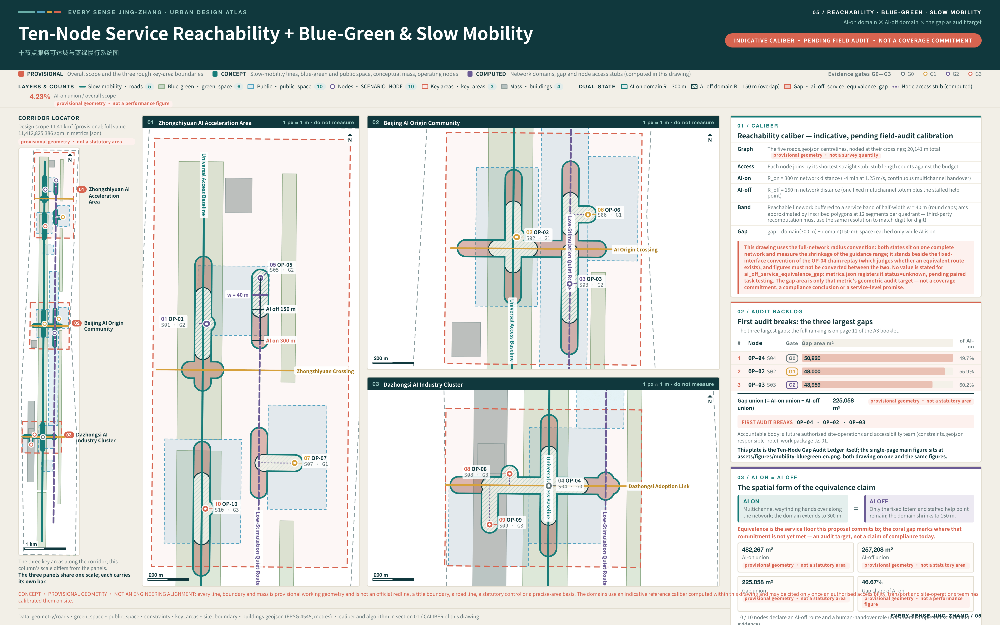
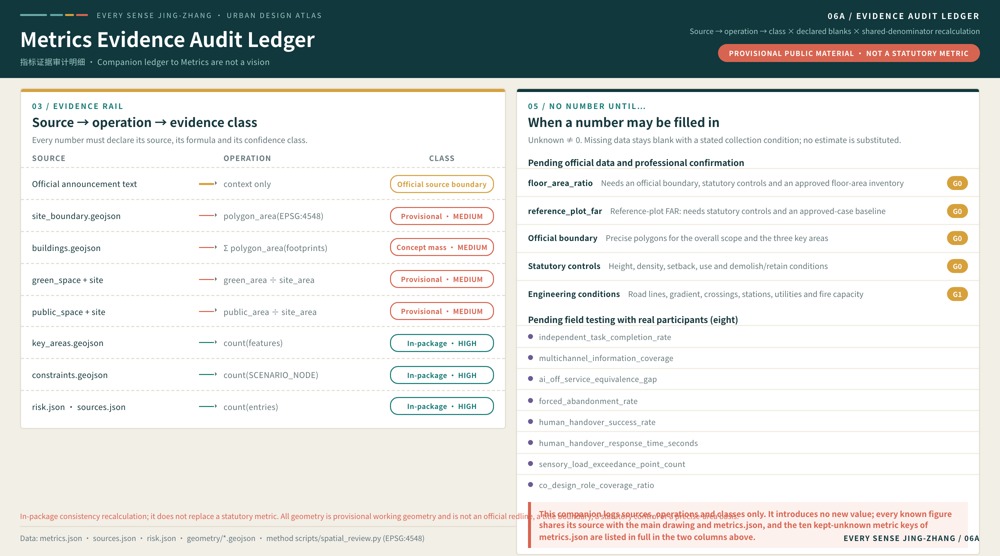

# EVERY SENSE JING-ZHANG: An AI City Every Kind of Body Can Use Independently

## Executive Summary and Deliverables Index

This proposal rests on a single testable claim: AI ON = AI OFF — a city's intelligence is measured not by how many devices it runs or how much it automates, but by whether anyone can understand, choose, complete, and exit the same public service independently. This chapter is the one-page entry point for review: the table below sets out the question a review has to answer, this proposal's answer, and the deliverable that can be opened and checked on the spot, every row pointing to a file in the package rather than to the prose around it. Every change between versions is registered item by item in `changelog.md` and is not restated here [source:PACKAGE-STRUCTURED-EVIDENCE-INDEX].

| Review question | This proposal's answer | Verifiable deliverable |
| --- | --- | --- |
| What is the core proposition | AI ON = AI OFF: urban intelligence is defined not by device count or automation rate but by whether anyone can independently understand, choose, complete, and exit the same service | The whole of "Design Basis and Source List", plus the chapter-16 interactive scene in `visual/index.html` where the AI switch can be operated by hand |
| How does space respond | One Universal Access Baseline, three Multisensory Labs, two support wings, and ten Independent Completion Points | "Three-Level Scope Framework" and the ten conceptual test-node features [data:geometry/constraints.geojson#OP-02] |
| Where does implementation start | Four evidence gates G0—G3 and a first-90-day Stage Zero evidence package; nothing enters open space before G3 | "Renewal Projects, Implementation Policy, and Phasing" and the item-by-item stop and recovery conditions in `risk.json` |
| How is public interest protected | Six personas and an inclusive-AI industry track, with service equivalence and the eight factor conditions as a baseline rather than an add-on | "AI Innovation Ecosystem, Personas, and AI+ Scenarios" and the item-by-item responses in `compliance_matrix.json` |
| What is the state of the evidence | All four self-checks pass; every boundary and area is declared as provisional geometry and never presented as an official redline or statutory area; field-performance status is registered package-wide as "not authorized · not field-run" | `self_check.json` and the provisional-status annotation on the site-boundary feature [data:geometry/site_boundary.geojson#SITE-001] |
| What are the limits of the conclusions | Every spatial, event, brand, and policy element is a conceptual recommendation, and no control value is preset for any parcel | The "visit each document, register faithfully, cite none" principle of the official regulatory-plan reference register |

Four multimodal deliverables are submitted alongside the text, so that listening, watching, and reading form three equivalent channels. Multimodality is not decoration here: the proposal requires an urban service to remain usable through any single sensory channel, and a proposal expressed through one channel only would refute its own argument [source:AGENT-TASKBOOK].

| Deliverable | Main file | Content | Equivalent channel and fallback |
| --- | --- | --- | --- |
| Proposal cover | `assets/media/cover.webp` | Original vector composition: the AI-ON and AI-OFF service lines run side by side as exact equivalents, ten nodes on each line stand for the ten Independent Completion Points, and three open nodes mark the three key areas | `assets/media/cover.md` supplies a full textual equivalent that can be used directly as alt text |
| Audio guide | `assets/media/audio-guide.m4a` | A 2-minute-34-second Chinese guide covering the core proposition, AI-on/AI-off service equivalence, the spatial framework, the roles of the Three Areas and Two Wings, the evaluative purpose of the ten nodes, and the scope statement; fully synthetic speech, with no human recording, music, or field audio | `assets/media/audio-guide.vtt` with twenty-six captions from the same source and the full transcript in `assets/media/audio-guide.md` |
| Multimodal short film | `assets/media/journey.mp4` | A 63-second film in seven shots, one of which is a frame-accurate capture of the chapter-16 interactive scene: two real interactions — playing the guidance flow and switching to AI OFF — leave node positions and the declared coverage readout unchanged (declaration-level, not field performance) | `assets/media/journey.vtt` external captions, the storyboard and transcript in `assets/media/journey.md`, and the still poster `assets/media/journey-poster.webp` |
| Interactive scene | Chapter 16 of `visual/index.html` | Canvas axonometric scene: switch AI on and off, play the guidance flow, and open a scenario card node by node, with mouse and keyboard treated as equivalent | The static fallback view `visual/assets/scene-fallback.png` and a `<noscript>` degradation path; the whole page runs offline |

The four deliverables meet the five guardrails of `multimodal_presentation.guardrails` in the Agent taskbook one by one. First, neither audio nor video autoplays; the user must start playback, and the controls are operable from the keyboard. Second, both audio and video carry captions and a full transcript from the same source, worded identically to the picture, so there is no hierarchy in which the audio is fuller and the text a summary. Third, the generation tools, production method, rights boundary, and personal-data boundary are recorded item by item in three accompanying notes; no third-party asset, portrait, or uncleared typeface is used. Fourth, every frame is original vector work or data-driven rendering, with no live-action footage and no generative imagery, and each carries the on-image label 概念建议 / CONCEPT so that it is never read as site evidence or a performance promise. Fifth, the interactive scene and the display page are bundled entirely locally, load no remote script, font, tile, or analytics code, and the required static figures, bilingual PDFs, and offline HTML are still submitted in full [source:SOURCE-REGISTRY].

Equivalence across listening, watching, and reading is therefore not merely a delivery format but the proposal proving its own principle: the same content can be substituted between audio, captions, transcript, and static figure, and the loss of any one channel leaves the information complete. That is exactly the requirement the text places on urban services.

Every countable quantity in this proposal is recalculated item by item in the structured files rather than asserted in prose: twelve scenario cards [metric:scenario_card_count], six personas [metric:persona_count], three cultural landmarks [metric:landmark_count], and ten Independent Completion Points [metric:op_node_count].

On the same basis, evidence discipline is carried by four gates [metric:gate_count], six work packages [metric:work_package_count], eight risk entries [metric:risk_item_count], and six international cases [metric:international_case_count]. The counts are not an achievement in themselves; they only show that every claim can be opened and checked one entry at a time.

## Design Basis and Source List

EVERY SENSE JING-ZHANG begins with a clear design judgement: the advancement of an AI city should not be defined by its device count or automation rate, but by whether people with different bodies, senses, and cognitive styles can independently understand, choose, complete, and exit the same urban service. The official announcement and the cleared Agent taskbook establish the three scope levels, Three Areas and Two Wings, three positioning statements, five functions, and six required tasks. This proposal therefore elevates universal design from a remedial layer to a shared industrial, spatial, and governance agenda [source:OFFICIAL-ANNOUNCEMENT] [standard:PROJECT-OFFICIAL-ANNOUNCEMENT] [standard:PROJECT-AGENT-OPEN-CALL-TASKBOOK]. China's Barrier-Free Environment Construction Law supports directions for equal participation, accessible information, facility provision, and maintenance, but it does not replace site audits, professional design, or project approval [source:ACCESSIBILITY-LAW-CN].

The site argument uses two evidence levels. The announcement, taskbook, and registered public materials support scope names, approximate areas, design tasks, and cultural context. Repository provisional geometry supports conceptual placement, topology checks, metric demonstrations, and later recalculation only [source:SITE-PACKAGE]. Exact official redlines, exact key-area polygons, parcel ownership, building surveys, road redlines, municipal capacity, heritage controls, and real-user task baselines are not currently available, and that gap list is itself the first tier of the existing-conditions diagnosis [depth:existing_conditions_diagnosis] [source:PROCESSED-MISSING-DATA-CHECKLIST]. Boundaries in the figures are therefore not official redlines; areas are not statutory or precise areas; and spatial actions are not regulatory, engineering, or approval conclusions. The organiser's data gaps do not block content review, but they limit precision, determine the sequence of further work, and set the order of the missing-data and risk registers [source:BOUNDARY-SOURCE] [depth:risk_missing_data].

The OSM / Overpass snapshot retrieved on 2026-08-10 provides public volunteered context only for background orientation and explanatory rendering of roads, rail, buildings, green/water features, and stations. Its completeness and positional accuracy vary. It is not used to derive, check, or replace the project or key-area boundaries, and it does not support regulatory controls, redlines, engineering alignments, heritage controls, ownership, precise-area, site-accessibility-compliance, or implementation claims [source:OSM-BACKGROUND-CONTEXT-20260810].

W3C's perceivable, operable, understandable, and robust principles are used to review digital and interactive interfaces. WHO material explains how environmental and service barriers can restrict participation. Neither source certifies this site nor supplies local population figures [source:W3C-ACCESSIBILITY-PRINCIPLES]. Six international cases compare innovation ecosystems, controlled testing, access to public assets, and long-term operation; their land systems, regulatory powers, capital conditions, or built forms are not copied. External evidence supports mechanisms only. Dimensions, targets, and accountable operators remain subject to field investigation, co-design, and professional review.


## Three-Level Scope Framework

The three scope levels answer three different questions. The approximately 43.6-square-kilometre coordinated research area asks how inclusive AI can become a new industry track for Haidian. The approximately 11.4-square-kilometre overall design area asks how universal design can become a continuous civic baseline. The three key areas, announced as approximately 368.4 hectares in total, ask how research validation, everyday co-design, and market adoption can form a closed loop. The areas come from the announcement, while exact boundaries remain pending; the proposal therefore organises relationships, node types, and operating rules rather than manufacturing parcel-level certainty from provisional polygons. So that one quantity never appears in several forms, this package fixes a single display rounding: everywhere a human reads a figure — running text, the large figures on plates, board readings, the first screen of the exhibition page — it is written as an overall design scope of 11.41 km², a provisional green ratio of 21.3%, a provisional public-space ratio of 18.2%, and a conceptual building footprint of approximately 373,402 sqm. The full recalculated values — 11,412,825.386 sqm, 21.3097%, 18.1788%, and 373,402.480 sqm — appear only in metrics.json, in the metric-ledger rows, and in the formulas and recalculation notes, where they are labelled as full recalculated values. The announced figure of approximately 11.4 square kilometres and the recalculated display value of 11.41 km² come from two different sources; the former is kept only where the announcement itself is being quoted, and the two are never substituted for one another [source:OFFICIAL-ANNOUNCEMENT] [source:PROCESSED-PROJECT-SCOPE-SUMMARY] [depth:three_level_scope_framework].

The spatial framework is **one Universal Access Baseline, three Multisensory Labs, two support wings, and ten Independent Completion Points**. The baseline follows the Jing-Zhang Railway Heritage Park as a continuous north-south public experience with a direct multimodal route and a lower-stimulation alternative. The three labs assign validation to Zhongzhiyuan, co-design to the Beijing AI Origin Community, and adoption to Dazhongsi. The Zhongguancun Technology Service Wing contributes technology, talent, capital, and professional services, while the Xiaoyuehe Scenario Empowerment Wing contributes open settings and real-world feedback. Ten completion points turn scenario cards into recognisable, inhabitable, testable, and exitable public interfaces [depth:overall_spatial_structure].

The proposal does not ask one line to carry every function. North-south continuity and east-west stitching work together: the park spine preserves basic information and a non-AI route, while three transverse interfaces connect universities, campuses, neighbourhoods, stations, and commercial foyers. The indicators for three-level coordination are not quantities of new construction. They ask whether the three key-area roles complement one another, whether information has two equivalent channels, whether a basic task remains possible with AI disabled, and whether a scenario can move from validation to adoption while retaining exit conditions. Precise road, gradient, station, and building relationships require official geometry, field audits, and professional transport studies.

| Scale | Design judgement | Spatial action | Meaning of indicators | Condition for further work |
| --- | --- | --- | --- | --- |
| Coordinated research area | Universal design can become an AI industry track | Organise research, testing, co-design, adoption, and international communication | Check whether ecosystem roles are complete; do not invent output or investment | Add industry interviews, institutional capacity, and regional evidence |
| Overall design area | The city needs a shared baseline beyond the AI switch | Create a continuous spine, quiet alternative, and three transverse interfaces | Check service continuity, information redundancy, and exit capacity | Add official redlines and walking and sensory audits |
| Key areas | Validation, co-design, and adoption need distinct roles | Assign one technical, one living, and one market lab | Check whether the scenario lifecycle closes | Add exact boundaries, ownership, buildings, and operators |

Above the three scope levels, one more table aligns the official inventory with this proposal's spatial actions, so that identifiers do not stand in for design reasoning. The taskbook sets three positioning statements — the Jing-Zhang Centennial Culture Belt, the Urban AI Living Experience Belt, and the AI Convergence Innovation Belt; five functions — a full-stack independent AI innovation system, a world-class AI innovation ecosystem, a new paradigm of AI+ scenario empowerment, an intelligent and vibrant AI city, and a global voice in AI governance; and Three Areas and Two Wings — the Zhongzhiyuan AI Acceleration Area, the Beijing AI Origin Community, the Dazhongsi AI Industry Cluster, the Zhongguancun Technology Service Wing, and the Xiaoyuehe Scenario Empowerment Wing [source:AGENT-TASKBOOK] [source:PROCESSED-AGENT-TASK-REQUIREMENTS].

| Unit of Three Areas and Two Wings | Role stated in the taskbook | Positioning assigned in this proposal | Functions assigned in this proposal | Spatial action in this proposal |
| --- | --- | --- | --- | --- |
| Zhongzhiyuan AI Acceleration Area | Full-stack independent AI innovation system and global voice in AI governance | AI Convergence Innovation Belt | Full-stack independent AI innovation system; global voice in AI governance | Universal Interface Lab: validation foyer, controlled test court, visible system state, human handover, and published validation status |
| Beijing AI Origin Community | World-class AI innovation ecosystem | Urban AI Living Experience Belt | World-class AI innovation ecosystem; new paradigm of AI+ scenario empowerment | Independent Living Co-design Lab: co-design room, lower-stimulation alternative, easy-read service foyer, and real feedback desk |
| Dazhongsi AI Industry Cluster | AI-native new business formats | Urban AI Living Experience Belt | Intelligent and vibrant AI city; new paradigm of AI+ scenario empowerment | Inclusive Adoption Market: multimodal commercial foyer, cash and staffed alternatives, public adoption receipts, maintenance and exit desk |
| Zhongguancun Technology Service Wing | Global allocation of factors, Zhongguancun IP, and capital enablement | AI Convergence Innovation Belt | World-class AI innovation ecosystem; global voice in AI governance | Access point for technology, talent, capital, and professional services; carries entry checks and professional review for the eight factor conditions |
| Xiaoyuehe Scenario Empowerment Wing | AI scenario empowerment and an intelligent, vibrant AI city | Urban AI Living Experience Belt | New paradigm of AI+ scenario empowerment; intelligent and vibrant AI city | Open settings and real feedback; hosts bounded public testing and public review for the ten Independent Completion Points |
| Jing-Zhang Heritage Park spine (cross-cutting element, not a unit of the Three Areas and Two Wings) | Innovation link described in the announcement and taskbook | Jing-Zhang Centennial Culture Belt | Intelligent and vibrant AI city; new paradigm of AI+ scenario empowerment | Universal Access Baseline: continuous north-south spine, lower-stimulation alternative, tactile heritage band, and three transverse interfaces |

The taskbook states a role for each unit of the Three Areas and Two Wings but does not assign positioning statements or functions unit by unit. The positioning, functions, and spatial actions in the table are this proposal's design judgements and conceptual recommendations; they do not represent an official division of responsibility or a confirmed arrangement. Regional industry context and factor conditions are drawn from public government department pages, and the scope and area wording of the prequalification announcement governs wherever the two differ [source:BJ-THREE-AREAS-TWO-WINGS-20260403].


## Coordinated Research Area: Industry and Future City Research

The industrial judgement combines assistive technology, multimodal models, easy-read public services, predictable embodied interaction, human handover, no-account access, and AI-off alternatives into an **inclusive AI** ecosystem. It does not reduce accessibility to a facilities checklist. The chain begins with algorithm and hardware research in universities and research organisations, moves through controlled validation at Zhongzhiyuan and voluntary co-design and independent task testing at the AI Origin Community, and tests procurement, maintenance, correction, and exit at Dazhongsi. The two wings connect professional services, capital, scenarios, and regional collaboration. Land, talent, compute, data, and scenarios remain conditions to verify rather than existing commitments [source:AGENT-TASKBOOK]. The national policy direction of running traditional service channels in parallel with smart services, covering high-frequency everyday scenarios such as travel, medical care, consumption, culture, and administrative affairs, is the background reference for this proposal's industrial judgement that an equivalent route must survive with AI disabled. That direction applies nationwide and its staged targets have expired, so it is not written as a duty still in force in 2026 or as evidence of local implementation [standard:ELDERLY-SMART-TECH-PLAN-2020-45] [source:ELDERLY-SMART-TECH-PLAN-CN].

Six cases provide complementary mechanisms. Cornell Tech connects real challenges, education, prototypes, and venture support. MIT Kendall Square illustrates the value of mixed uses, open space, and long-term community collaboration [source:CASE-MIT-KENDALL]. NTU CETRAN demonstrates staged simulation, closed testing, and bounded public trials. Barcelona Urban Lab matches public problems with controllable urban assets. Marineterrein uses evidence from temporary use to inform later planning. JTC LaunchPad brings adaptable space, prototyping, investment support, and display activities together [source:CASE-JTC-LAUNCHPAD]. The proposal borrows these mechanisms only; it does not claim that Haidian has the same land powers, permissions, investment conditions, or performance [source:CASE-CORNELL-TECH] [source:CASE-CETRAN] [metric:international_case_count].

The brand is **EVERY SENSE JING-ZHANG**, with the international line **One city. Many ways to sense it.** and the Chinese line “One city, many senses, moving together.” Its visual grammar abstracts railway gauge into original parallel sensory lines and open nodes: a common gauge lets different trains share a network, while universal design lets different bodies share a city. The identity, wayfinding, and event graphics use no corporate marks, portraits, or uncleared fonts. The metaphor does not substitute for research into Jing-Zhang history.

The brand system develops in four parts, carried graphically by `assets/logo.svg` and the brand system diagram, and all of it remains a conceptual recommendation. **The colour system** keeps the six-colour palette and fixes a meaning for each value: deep teal `#10383d` is the rail and night-travel ground used for dark surfaces and primary text; teal `#177c78` marks the Universal Access Baseline and the "available" state; coral `#d76450` is reserved for states that require a person — human handover, emergency stop, and calls for help; purple `#6b5b95` marks co-design and participant evidence; gold `#d6a13b` marks the cultural and heritage layer; and off-white `#f2efe7` is the ground and white space that controls glare and preserves contrast. Colour never carries information alone: any state distinguished by colour must also carry a shape, word, or tactile cue so that it remains legible with colour-vision differences and in low light. **The typographic strategy** pairs serif headings, sans-serif body text, and monospaced data across both languages: Chinese and Latin serifs carry headings and cultural narrative, Chinese and Latin sans-serifs carry body text, wayfinding, and interfaces, and a monospaced face carries metrics, identifiers, and code. Bilingual settings are controlled by baseline alignment and matched optical size; Chinese is never artificially condensed, Latin avoids long all-capital strings, and every typeface is cleared item by item, with uncleared fonts excluded from public output. **The extension rules** treat the parallel sensory lines as "several channels to the same destination" and the open node as "you may pause, ask for help, or leave": in wayfinding they appear as both relief and high-contrast print, in interfaces as layout grid and state bar rather than decorative motion, and in print as the basis for the text block and column structure. The lines may never be reworked into a corporate mark or a portrait. **The applications** cover station wayfinding, tactile paving, event graphics, and international communication material; event material must be removable and repairable, and communication material must also ship in easy-read and high-contrast versions. Exact dimensions, materials, type sizes, and contrast values follow field co-design and professional review.


Industrial value is not measured through invented company counts or investment figures. It is assessed by whether the ecosystem contains research, controlled testing, real co-design, independent task evaluation, adoption, maintenance, and exit; whether testing includes at least six user and maintainer roles; and whether each scenario retains a non-AI alternative. Regional industry data, institutional willingness, compute, and finance have not been verified. Later work requires public sources, interviews, and professional assessment, and all partnerships and events remain conceptual proposals.

### Regional Collaboration: What Can Be Exchanged, Not What Can Be Announced

An inclusive-AI ecosystem cannot be self-sufficient inside one innovation belt. This proposal defines regional collaboration as a two-way exchange of method and setting: the belt exports reusable accessibility and service-equivalence test methodology, independent task-test scripts, AI-on/AI-off paired-test protocols, and the public-space toolkit; external nodes return the real problems and validation settings of their own fields. The unit of exchange is a published method and an anonymised result, not pooled data, seconded staff, or a funding arrangement.

The five counterparts carry these possible roles: Zhongguancun AI Beiwei Community as an innovation community in northern Haidian for young AI founders and early-stage teams; Future Science City as a science city concentrating research organisations in fields such as energy and pharmaceuticals; Huairou Science City as a cluster of large scientific facilities and fundamental research; Beijing Economic-Technological Development Area as one of the districts reported in public sources to focus on embodied intelligence and intelligent manufacturing; and the Beijing-Tianjin-Hebei region as a cross-regional coordination scope. The table below breaks each relationship into five parts: what the counterpart puts in, what this proposal puts out, which authorisation gate it waits at, who is accountable, and by what rule the proposal withdraws if authorisation never comes. That last part is what separates this table from an ordinary list of partners. A list says only what happens if the relationship holds; this table also says what happens if it does not, which is why it can be checked without anyone having agreed to anything [source:AGENT-TASKBOOK].

| Collaboration counterpart | Input sought from the counterpart | Output from this proposal | Authorisation gate and verification condition | Accountable party (all to be confirmed) | Withdrawal rule where authorisation is not granted |
| --- | --- | --- | --- | --- | --- |
| Zhongguancun AI Beiwei Community | Real usability problems in early products; teams willing to join paired tests | Service-equivalence test methodology, independent task-test scripts, toolkit loans and training | G0 · written institutional willingness, participation ethics review, venue and safety conditions | A future authorised community operator with this proposal's co-design facilitators | The methodology is published one-way in an anonymised version; neither party may describe a collaboration in the other's name; no joint test involving participants proceeds, and any loaned toolkit items are recalled by a set date |
| Future Science City | Operating-barrier cases in high-threshold expert interfaces and controlled validation settings | Multisensory interaction evaluation methods for complex equipment and expert interfaces | G0 · written willingness of the responsible body, defined confidentiality and data boundaries, confirmed accountable party | A future authorised research body with this proposal's accessibility evaluators | The evaluation methods stay on this proposal's side and no case material is accepted before de-identification; anything already received is destroyed by the agreed date with a destruction receipt issued |
| Huairou Science City | Early translation topics from fundamental research and controlled experimental settings | Methods for long-duration sensory-load recording and human-handover audit trails | G0 · collaboration mechanism, agreed rights in results, safety and admission conditions | A future authorised research institution with this proposal's data-governance staff | No controlled experimental setting is entered and no translation topic is published unilaterally; the recording methods are released as open methodology carrying no institutional mark |
| Beijing Economic-Technological Development Area | Pre-production problems in robots and smart terminals, and manufacturing-side validation settings | Public-space test protocol for service-robot yielding and predictable interaction | G1 · site authorisation, safety approval, insurance, confirmed accountable party | A future authorised site operator with this proposal's technical-safety staff | The protocol stays in text and simulation and becomes no test on a real machine; nothing is installed in public space, and any removable element already installed comes down within the round |
| Beijing-Tianjin-Hebei region | Service gaps and validation settings across different city sizes and demographics | Reusable service-equivalence and accessibility test templates and a public review format | G0 · cross-regional data and permission, defined operating responsibility and cost boundaries | Future authorised host bodies in each locality with this proposal's methodology maintainers | The templates are published one-way under the recommended licence terms; neither party may describe cross-regional collaboration as established, and no cross-regional data transfer is undertaken |

The gate column reuses this proposal's four gates and adds no procedure of its own: four of the five relationships wait at G0, where evidence, permission and data boundaries are settled, and only the Beijing Economic-Technological Development Area waits at G1, because it involves testing on real machines and elements placed on site. Every accountable party is marked as still to be confirmed; this proposal appoints no one on anyone's behalf. Every action in the withdrawal column is one this proposal can carry out alone, requiring nothing of the counterpart and treating the counterpart's silence as consent to nothing [depth:phasing_implementation].

Every counterpart, role, and exchange in this table is a conceptual recommendation and a matter still to be verified. No collaboration, agreement, or letter of intent exists with any organisation, and nothing here indicates that any party has agreed to take part. The city-level "one core, multiple nodes" arrangement and the first batch of AI innovation districts are cited as background only; their scope, area, and policy wording must be re-checked against the issuing policy text before formal use [source:BJ-AI-INNOVATION-DISTRICTS-20260121]. A collaboration can exist only after the corresponding authorisation gate is passed and written authorisation is obtained.

### Eight Factor Conditions: What Qualifies for the Inclusive-AI Track

Factor provision answers what conditions must be met before an action may enter the inclusive-AI track, not how much can be granted. Each of the eight factors carries an entry condition, an item to verify, and an accountable discipline, and each connects to the four gates: land, space, and data settle their boundaries before the G0 evidence and permission gate; industry, talent, and scenarios produce participation and stop evidence during the G1 reversible-prototype and G2 closed paired-test gates; funding and compute conditions are checked together with maintenance responsibility at the G3 independent-review gate. Where a condition does not hold, the corresponding action pauses or degrades; nothing proceeds on the basis of delivering first and completing evidence later [source:HAIDIAN-INDUSTRIAL-SYSTEM-20260302].

| Factor | Entry condition for the inclusive-AI track | Item to verify | Accountable discipline |
| --- | --- | --- | --- |
| Land | Reversible actions only on parcels whose ownership and permitted use are already clear; provisional geometry never implies land supply | Official parcels, ownership, use control, and applicability of renewal policy | Planning, territorial spatial planning, legal |
| Space | Every test space simultaneously offers a continuous accessible route, a lower-stimulation alternative, and a staffed help position | Field accessibility audit, sound and light baseline, fire and evacuation conditions | Accessibility, architecture, site operations |
| Industry | Occupants commit in writing to service equivalence and an exit route; device count and automation rate are not thresholds | Genuine institutional willingness, delivery capacity, accountable body | Industry research, operations management |
| Funding | Funding terms include revocable consent, maintenance responsibility, and publication of failed observations | Source of funds, compliance conditions, budget definition, duration | Finance and legal |
| Talent | Co-design and test roles cover disabled participants, neurodivergent participants, maintainers, and operators | Recruitment ethics, cost of reasonable accommodation, labour relations, insurance | Ethics review, human resources, co-design facilitation |
| Compute | Edge and cloud resources support degraded operation with AI disabled; scale never substitutes for usability | Capacity, energy use, cyber security, failover conditions | Information infrastructure and security |
| Data | Identity, health, disability category, location, and behavioural data are not collected by default | Data tiering, retention period, cross-party sharing, audit mechanism | Data governance and privacy |
| Scenario | Opening a scenario binds a stop condition, recovery evidence, and a findable accountable operator | Permission, insurance, incident handling, appeal chain | Scenario operations and safety |

## Overall Design Area: Urban Renewal and Regulatory-Plan-Level Urban Design

The overall design judgement is that the Jing-Zhang Railway Heritage Park should be more than an AI display corridor: it should become a civic baseline usable by everyone. A continuous north-south spine links the three key areas, with a direct multimodal route and a lower-stimulation alternative. Three conceptual east-west interfaces at Zhongzhiyuan, the AI Origin Community, and Dazhongsi connect universities, campuses, neighbourhoods, rail stations, and commercial foyers to the spine. Provisional land-use, road, public-space, and building layers express relationships; they are not approved land, road, or development boundaries, and urban design here carries only the conceptual duty of implementing the plan, guiding later architectural design, and shaping character [data:geometry/land_use.geojson#LU-001] [standard:MOHURD-URBAN-DESIGN-MEASURES].

Renewal follows **audit first, reversible trial second, professional development third**. The continuous route identifies gaps in information, rest, and human help; dependence on a single phone or account; sudden changes in sensory load; and weak cross-corridor connections. The three interfaces use movable multisensory wayfinding, quiet stops, adjustable-height interfaces, human-handover lights, and no-account service desks. At building scale, the proposal suggests only ground-floor public interfaces, shared test rooms, and reversible adaptation. It makes no judgement about retaining, renovating, demolishing, or constructing any specific building.

Overall indicators explain design quality. Independent completion asks whether a participant can finish a task with reasonable accommodation [metric:independent_task_completion_rate]. Two-channel redundancy asks whether critical information survives the failure of one sensory channel [metric:multichannel_information_coverage]. The AI-on/AI-off service gap asks how much basic capability is lost when automation is disabled [metric:ai_off_service_equivalence_gap]. Forced abandonment reveals hidden exclusion in a process [metric:forced_abandonment_rate]. There are no site baselines or targets, so all outcomes remain to be measured. Exact gradients, crossings, redlines, station connections, development intensity, height, setbacks, fire access, and municipal capacity require official data and professional surveys [depth:development_intensity_controls].

## Detailed Design of Key Areas

The three key areas form a **validate—co-design—adopt** loop rather than three copies of the same campus. Zhongzhiyuan is the **Universal Interface Lab**, where garden-like exchange spaces and a public interface toward Qinghe can host assistive technology, multimodal models, service robots, and a simulation—closed—bounded-open testing sequence. The Beijing AI Origin Community is the **Independent Living Co-design Lab**, where universities, campuses, neighbourhoods, and voluntary participants define problems, build prototypes, conduct independent task tests, and decide whether to revise or exit. Dazhongsi is the **Inclusive Adoption Market**, where station surroundings, commercial foyers, and public spaces test whether accessible retail, business, culture, and talent services can be procured, maintained, and corrected [source:AGENT-TASKBOOK] [depth:three_key_area_detailed_design].

Spatial actions match these roles. Zhongzhiyuan receives a validation threshold, visible system state, and human handover so immature technology does not move directly into open space. The Origin Community receives a lower-stimulation route, co-design room, easy-read service foyer, and real feedback desk; participation must be voluntary, understandable, and revocable. Dazhongsi receives multimodal consumer interfaces, cash and staffed alternatives, public adoption receipts, and maintenance access. The park spine and the two support wings connect the three areas, translating technical questions into everyday tasks and returning living evidence to products and operations.

| Key area | Design role | Conceptual spatial action | Scenarios and operation | Gate for further work |
| --- | --- | --- | --- | --- |
| Zhongzhiyuan AI Acceleration Area | Universal Interface Lab | Validation foyer, controlled test court, state signals, human handover | Multimodal navigation, service robots, interface robustness | Verify Qinghe, flood, road, ownership, safety, and exact boundary conditions [data:geometry/key_areas.geojson#PROV-KEY-001] |
| Beijing AI Origin Community | Independent Living Co-design Lab | Quiet alternative, easy-read window, co-design room, task-test points | Co-design for services, learning, culture, mobility, and events | Establish real recruitment, ethics, privacy, and campus-community conditions [data:geometry/key_areas.geojson#PROV-KEY-002] |
| Dazhongsi AI Industry Cluster | Inclusive Adoption Market | Conceptual four-quadrant station interface, commercial foyer, maintenance and exit desk | Accessible retail, payment alternatives, international visitors, feedback | Verify station, junction, ownership, utilities, and commercial operation; and verify that an east-west route continuous with AI off exists at all, an item the OP-04 paired-pilot replay found and set as a precondition of the JZ-01 audit covering this area [data:geometry/key_areas.geojson#PROV-KEY-003] [data:geometry/constraints.geojson#OP-04] |

The three areas use announcement-level approximate areas for scope explanation only, and the key-area count corresponds one to one with the provisional polygons [metric:key_area_count] [source:KEY-AREA-SOURCE]. Provisional polygons cannot support parcel-level building scale, retain-renovate-demolish decisions, road redlines, or engineering feasibility. Their metrics ask whether validation gates are clear, co-design participation is diverse and accommodated, and adopted services have accountable operators and exit paths. Precise drawings and controls require official geometry, existing-condition surveys, heritage and utility information, and joint development by planning, architecture, transport, accessibility, and operations professionals.


## AI Innovation Ecosystem, Personas, and AI+ Scenarios

The six personas organise needs and tests; they are not diagnostic labels, commercial segments, or completed user research [metric:persona_count]. Each persona links to spatial actions, the proposal's service-equivalence objective, and a privacy boundary. Real co-design must be voluntary, reasonably accommodated, understandable, and revocable, and whether the co-design seats cover the required roles is measured by role coverage rather than by headcount [metric:co_design_role_coverage_ratio]. China's Barrier-Free Environment Construction Law supports equal participation and accessible information, but it does not replace professional conformity assessment for a product, building, or transport system, and it does not automatically turn this proposal's service-equivalence concept into a specific legal duty [source:ACCESSIBILITY-LAW-CN]. Its requirement for on-site guidance and human-operated service applies strictly to the medical, social-security, financial, and living-payment matters the article lists; the six personas and the compliance matrix are organised within that boundary, and every other human fallback in this proposal is marked as a conceptual design recommendation [standard:BARRIER-FREE-ENVIRONMENT-LAW].

| Persona | Typical task | Spatial and service response | Human and privacy boundary |
| --- | --- | --- | --- |
| People who receive visual information differently | Locate, navigate, read state, understand heritage | Tactile, spoken, high-contrast graphic, and easy-read information with correction points | No face recognition, continuous tracking, or single-phone dependence |
| People using different auditory or language channels | Ask for help, join events, receive warnings, communicate across languages | Optional sign, caption, text, speech, and visible state | Automatic translation stays correctable and retains human explanation |
| People with different mobility patterns | Move continuously with wheelchairs, strollers, temporary injury, or older gait | Conceptual stitches, rest points, adjustable-height interfaces | Gradients and engineering remain unverified; navigation does not replace physical access |
| People with different cognitive or sensory-processing styles | Complete steps, avoid overload, anticipate change, recover attention | Easy-read steps, quiet route, sensory-load notice, reversible procedures | Do not pathologise differences or use personas for recommendations or risk scoring |
| Visitors crossing language barriers or with low digital literacy | Ask directions, complete procedures, pay, and join events across language, script, and digital thresholds | Pictorial procedures, easy-read Chinese set alongside other languages, staffed counters, and a no-account route | Language ability and digital literacy are never a condition for basic service; nationality and identity data are not collected |
| Service providers and maintainers | Observe state, take over, repair, review, and end service | State lights, staffed desk, maintenance access, incident receipt | Responsibility remains findable; monitoring does not replace on-site judgement |

All twelve scenarios follow one lifecycle: define the need, co-design, simulate, closed-test, bounded public test, conduct an independent task test, review with humans, and adopt or exit [metric:scenario_card_count]. S01, S05, and S08 respectively establish three industry-validation directions: multimodal navigation, universal embodied-AI interaction, and inclusive consumer terminals; the later S11 and S12 add no spatial facility and reuse existing nodes, testing emergency notification and cross-language procedures — the two task types most easily missed in an automated environment. No test is described as approved operation, no non-public personal data is required, and immature technology is not presented as ready for full deployment [source:W3C-ACCESSIBILITY-PRINCIPLES].

| Scenario card | Spatial setting | Design action | Measure and condition for further work |
| --- | --- | --- | --- |
| S01 Multimodal accessible wayfinding | Entire walking spine and station connections | Provide at least two equivalent channels among tactile, sound, graphic, and easy-read text | Test independent arrival and correction; add field route and participant tests |
| S02 Low-stimulation route and quiet periods | Origin Community and heritage park | Announce light and sound changes; provide detours, pauses, and recovery | Test sensory load and abandonment; add sound and light baselines [metric:sensory_load_exceedance_point_count] |
| S03 Sign, caption, speech, and easy-read service | Public-service points | Let users choose and correct modes and reach human explanation | Test understanding and handover; add sign-language and real-language evaluation |
| S04 Continuous wheelchair and stroller movement | Transverse interfaces and station surroundings | Use task tests to find breaks; digital guidance never substitutes for physical repair | Test continuous passage; add gradients, kerbs, and redline surveys |
| S05 Predictable service-robot interaction | Controlled Zhongzhiyuan test segment | Show intention and speed state; provide emergency stop and human handover | Test prediction and handover; add safety and approval conditions |
| S06 Cognitively accessible procedures | Origin Community service foyer | Break processes into reversible steps; retain paper and staffed routes | Test independent completion and error recovery; add real procedures |
| S07 Tactile, auditory, and visual heritage interpretation | Jing-Zhang cultural points | Keep history traceable and content selectable, pausable, and reviewable | Test understanding and preference; add historical, heritage, and rights checks |
| S08 Accessible smart retail with payment alternatives | Dazhongsi | Keep cash, staffed, and no-account routes; make errors recoverable | Test purchase completion and exit; add merchant and payment conditions |
| S09 Sensory-load management for major events | Squares and event routes | Zone and schedule activity; announce change; provide quiet and exit spaces | Test load, crowding, and help; add event-safety planning |
| S10 Equivalent help and evacuation with AI disabled | Entire belt | Preserve navigation and help during outage, power loss, or refusal of consent | Test AI-on/AI-off gap; add fire, emergency, and operator coordination |
| S11 Multisensory emergency drill with an information receipt | Reuses OP-09 [data:geometry/constraints.geojson#OP-09] and OP-10 [data:geometry/constraints.geojson#OP-10]; adds no spatial facility | Announce the drill by sound, light, vibration, and text at once, and issue a paper receipt the participant can take away | Test whether the notice arrives and the receipt is obtainable; add emergency plan, fire approval, and drill authorisation |
| S12 Independent procedures for cross-language and cross-cultural visitors | Reuses OP-03 [data:geometry/constraints.geojson#OP-03] and OP-07 [data:geometry/constraints.geojson#OP-07]; adds no spatial facility | Pictorial procedures beside easy-read Chinese and other languages; machine translation stays correctable and reaches a person; no local account required | Test independent completion and correction; add native-speaker editing and sign-language and multilingual user assessment |

The three representative scenarios bind risk, responsibility, and recovery evidence before testing so that no scenario lacks a brake. S01 is led by accessibility and transport professionals and links R-03, R-06, and R-08; it stops when route continuity, an alternative channel, or participant accommodation is missing, and resumes only after field audit, participant review, and reversible correction. S05 is led by technology-safety and site-operations personnel and links R-02, R-04, and R-07; it stops when intent is not visible or emergency stop or human handover fails, and resumes only after closed-test records, fault bypass, and maintenance responsibility are complete. S08 is jointly reviewed by service operations, payment compliance, and participant representatives and links R-01, R-03, R-04, and R-08; it stops when cash, staffed, or no-account alternatives fail, or data use cannot be explained, and resumes only after G3 independently reviews the equivalent route, data disposal, and appeal chain. OP-01 arrival correction [data:geometry/constraints.geojson#OP-01], OP-05 human emergency stop [data:geometry/constraints.geojson#OP-05], and OP-08 no-account exit [data:geometry/constraints.geojson#OP-08] respectively carry these three scenarios; the remaining OP-02—OP-10 nodes bind to S02—S10 in the same order, while S11 and S12 reuse existing nodes without adding any, so the node total and locations stay unchanged [metric:op_node_count]. Every node declares an AI-off equivalent route and a human-handover role; both coverage figures are registered as document-completeness measures and do not mean the routes are built, staffed, or measured [metric:scenario_exit_path_coverage] [metric:scenario_human_review_coverage].

## Service Equivalence Baseline (SEB) v0.2

The preceding chapters scatter the criteria across scenario cards, node attributes, metric definitions, risk entries, and opening levels, so a reader assembling "what counts as having done it" has to move between five places. This chapter packages those criteria into one separable thing that any city can pick up and use: the **Service Equivalence Baseline (SEB) v0.2**. It is not an appendix to this proposal but the public product this proposal hopes to leave behind — whether Haidian becomes a source of inclusive AI depends in the end on whether other cities are willing to test themselves against criteria Haidian wrote [source:AGENT-TASKBOOK] [metric:op_node_count].

The baseline has four components. Each has a machine-readable counterpart inside this package, so a reuser invents nothing and only has to accept the same constraints.

| Baseline component | What it specifies | Machine-readable location in this package | Constraint that comes with reuse |
| --- | --- | --- | --- |
| Node schema | Every service node must declare five fields: `ai_off_path`, the equivalent route once AI is off; `human_handoff`, the human handover role; `gate_id`, the gate it currently sits at; `operating_mode`, how it runs; and `responsible_role`, the accountable discipline. A node missing any field may not be counted towards service coverage | The property table of the ten node features in `geometry/constraints.geojson` [data:geometry/constraints.geojson#OP-04] | The five fields are mandatory, not optional; `ai_off_path` may not be filled with a route such as "direct the user to the online service" that still depends on the same system, and from v0.2 the ground for that refusal is written into the baseline as a machine-readable `constraint_machine_rule` rather than left to each checker to interpret |
| Scoring definitions | Numerator and denominator definitions for each of the seven inclusion metrics: independent completion, two-channel information redundancy, AI-on/AI-off service equivalence gap, forced abandonment, human-handover success and response time, sensory-load exceedance points, and co-design role-group coverage | The `numerator_definition` and `denominator_definition` fields of the seven metrics in `metrics.json` [metric:ai_off_service_equivalence_gap] | **No failed sample may be dropped from a denominator**: withdrawals, technical faults, and non-completion reasons must be reported alongside completions, and removing any of them voids that measurement; from v0.2 an `applies_to` field bounds the scope, covering five participant-task metrics and excluding the two document-completeness coverage figures with their reasons |
| Level definitions | Five levels — L0 evidence and permission, L1 reversible prototype, L2 closed paired testing, L3 bounded opening, L4 adoption and continuous operation — each binding an entry condition, a stop condition, recovery evidence, and an accountable operator | The opening-mechanism table in "Renewal Projects, Implementation Policy, and Phasing" in this document [depth:phasing_implementation] | Levels apply to one scenario at one node, not to a work package or an administrative area; downgrading is allowed and carries no extra procedural threshold; from v0.2 each level declares its gate through a structured `gate_binding`, and the relation between L4 and G3 is stated by the baseline rather than inferred by a tool |
| Decision rules | The stop condition and recovery evidence of each of the eight risk entries R-01 to R-08, forming a complete rule set for when work must halt and what it takes to reopen | The eight `stop_condition` and `resume_condition` entries in `risk.json` [metric:risk_item_count] | A triggered stop condition stops the work; a corrective-action deadline is not a substitute for stopping, and resumption requires evidence rather than a promise |

**Productisation statement.** The baseline version is v0.2, recorded as `0.2.0` in the specification file. The machine-readable specification sits at `visual/assets/seb-spec.json`, matches this chapter's tables item by item, and carries three meta fields: `version`, `license`, and `provenance`, the last holding the origin and the receipt number of both the v0.1 and the v0.2 release. The recommended open licence is CC BY-SA 4.0: share-alike means that a city improving the criteria must publish the improvement on the same terms, which matches the return-of-improvement stance of the ODbL ecosystem this package's spatial data depends on. Version governance works as follows: any change must arrive together with a failed-sample register and a recalculation note for the affected metrics, and a revision that edits wording without submitting evidence is not merged; the version number rises only when the criteria themselves change, not for wording or translation fixes. **The hosting body, the publication channel, and the final choice of licence all await confirmation by an authorised body; this proposal publishes the baseline on behalf of no institution and claims no adoption by any party** [source:SOURCE-REGISTRY].

**v0.2: the governance loop turns for the first time.** The version governance above is not a clause written for other people to admire; it has already turned once inside this proposal. The tabletop pairing run in the next chapter hit three gaps while turning the criteria into executable code, all three were registered in a change receipt rather than worked around on the spot, and v0.2 then arrived with the evidence the rule demands: a failed-sample register and a recalculation note. One sentence for each closure. The ground for refusing an `ai_off_path` value rises from the checker's private word list into the baseline's `constraint_machine_rule`, which states that the list may grow as failed samples arrive and that any growth raises the version. The gate field of the level definitions changes from free text into a structured `gate_binding`, the relation between L4 and G3 goes into the text itself, and both the pattern extraction and the tool's inference are retired. The denominator-integrity rule gains `applies_to`, naming the five participant-task metrics it covers and the three enumeration metrics it does not, with the two document-completeness coverage figures excluded and the reason written down. Closing the first item also surfaced a gap v0.1 had never registered — the role lexicon behind human handover was the same kind of private list — and it was promoted alongside and entered in the receipt. This is a schema-layer change: no metric value is affected, and the full receipt is numbered CR-2026-08-12-002 [source:W3C-ACCESSIBILITY-PRINCIPLES]. What the paragraph demonstrates is not that the criteria are well written but that version governance is a mechanism that has turned rather than a promise that it will. Nothing about the baseline's standing changes: it remains a conceptual recommendation, and its hosting body, publication channel and licence still await confirmation by an authorised body [source:SOURCE-REGISTRY].

**Reuse scenarios.** The baseline can only be tested once it leaves this project. Early-stage teams at the Zhongguancun AI Beiwei Community can take the node schema and the paired-test protocol directly and run an "still usable with AI off" self-test on an early product, without waiting for any platform or authorisation. Specialist equipment interfaces in energy and pharmaceuticals at Future Science City can take just two of the scoring definitions — two-channel redundancy and human-handover response time — and move the default assumption that specialist equipment is only for specialists into measurable territory. A government service hall in any city can take only levels L0 to L2 and complete one round of paired testing without altering any space, obtaining that hall's own service-equivalence gap reading. This is the physical form of the regional-collaboration sentence about exporting reusable test methodology: not a letter of intent, but one file and one table [source:BJ-AI-INNOVATION-DISTRICTS-20260121].

**Why the mechanism matters.** Turning criteria into a baseline changes the nature of three things. Governance voice does not come from declaring oneself a standard-setter but from others testing themselves against your standard, so this proposal lands the function of "global voice in AI governance" on a citable set of criteria rather than on a conference or a declaration. International communication shifts accordingly from slogan to citation: a service-equivalence gap reading that an outsider can recalculate travels across languages more easily than any adjective. The cost structure of long-term operation changes too — iterating the baseline needs no permission, budget, or venue, only someone who keeps registering failed samples, which lets the days outside Every Sense Week still produce a public asset that accumulates [source:W3C-ACCESSIBILITY-PRINCIPLES]. The baseline itself is no compliance conclusion, certification, or professional conformity assessment; it only writes "what counts as having done it" in a form anyone can check line by line.

## OP-01 Tabletop Pairing Pilot Dossier (Methodology Demonstration)

**Statement of what this is. Field status: not authorized · not field-run.** This chapter has no real participant, no field measurement and no operating record. What it holds is a tabletop pairing run: the Service Equivalence Baseline of the previous chapter is applied to text fixtures to see whether the criteria can be executed item by item and where they break. The chapter therefore produces no performance metric value, the seven inclusion metrics stay awaiting real measurement in the metrics file, and not one of them may be filled in on the strength of anything written here [metric:independent_task_completion_rate] [metric:ai_off_service_equivalence_gap]. What the chapter can demonstrate is that the mechanism is executable: the criteria are specific enough for a machine to rule on and for a third party to re-check. It cannot demonstrate that the results are already good enough, which requires ethically run testing with real people and belongs after authorisation [depth:phasing_implementation]. Keeping the two apart is this proposal applying denominator discipline to itself: it cannot demand that others keep their failed samples while calling one of its own runs a pilot.

**Subject and tools.** The run takes one complete gate sequence of scenario S01, multisensory accessible wayfinding, at OP-01, the multimodal arrival correction node [data:geometry/constraints.geojson#OP-01]. Three tools ship with the package, all offline and dependency-free: `visual/assets/seb-tabletop-run.js` is the checker that reads the baseline and the fixtures and rules on each in turn; `visual/assets/seb-tabletop-fixtures.json` holds twelve fixtures, five positive and seven negative, each carrying its own expected verdict and a bilingual note; `visual/assets/seb-change-receipt-sample.json` holds the change-receipt format together with two receipts. Running `node seb-tabletop-run.js` inside `visual/assets` reproduces every conclusion in this chapter, and an exit code of zero means all twelve verdicts matched their expectations; before ruling on anything the checker verifies that the baseline version matches the version the fixtures declare, and refuses to run at all with exit code two where it does not [source:PACKAGE-STRUCTURED-EVIDENCE-INDEX]. The fixtures carry no count and no ratio, and a denominator is expressed only as which categories were declared, so the tool cannot and does not generate a reading [metric:op_node_count].

The run proceeds in three steps: G0, G1, G2. No entry condition was written for this chapter; each is taken verbatim from rows L0, L1 and L2 of the opening-mechanism table and from attributes the node already carries. Before the first step, the tool compares the five required fields of the L2 fixture against the OP-01 attributes in the geometry file, word for word, and continues only if they agree, so that the run cannot drift onto a shadow node differing from the submitted data [depth:phasing_implementation] [data:geometry/constraints.geojson#OP-01].

| Step of the run | Where the entry conditions come from | What the tabletop run did | Fixture verdict | What this step does not produce |
| --- | --- | --- | --- | --- |
| G0 evidence and permission (level L0) | The four entries in row L0 of the opening-mechanism table: entry, stop, recovery, accountability | Fixture TT-P1 was assembled from the five required OP-01 fields and the four L0 binding conditions, then checked for field completeness and level-gate agreement | accept | No measurement, and nobody is recruited |
| G1 reversible prototype (level L1) | The four entries in row L1, with the node gate following to G1 | Fixture TT-P2 rewrites the operating mode as an install-and-remove drill for removable components, with a maintenance card and a fault-detour plan attached | accept | No measurement, and no real component is installed |
| G2 closed paired testing (level L2) | The four entries in row L2, with the paired protocol and reasonable accommodation agreed in advance | Fixture TT-P3 applies for paired testing and declares all four denominator categories: completed, withdrawn, technical fault, other non-completion | accept | No completion rate, no equivalence gap, no reading of any kind |

The comparison came back with all five required fields matching word for word, which establishes that the node used in the run and the node in the submitted geometry are the same one [data:geometry/constraints.geojson#OP-01]. The step is necessary because the easiest way for a tabletop run to deceive itself is to draw a tidier node on paper than the one that exists, and then prove on paper that the mechanism works.

**What the run found.** Three findings, all encountered while turning the criteria into executable code, all registered and all now closed in baseline v0.2.

The first matters most: the `ai_off_path` constraint appears in the baseline only as a natural-language example and cannot be executed by a machine. Negative fixture TT-N2 fills the field in as directing the user to the online service to finish the same task inside the mini-program; nothing is missing, the syntax is valid, and a quick human read passes it easily, yet once AI is off the user is still required to go online, so equivalence does not hold. The response was to complete the constraint into executable form rather than to relax it: the checker first implemented the refusal through an explicit same-system term list and stated in the code comment that the list was the tool's interpretation and not baseline text, while a v0.2 item was registered proposing a machine-readable ground for refusal inside the node schema. That item is now honoured in v0.2 — the list has risen into the baseline's `constraint_machine_rule`, the checker reads the baseline text and keeps no private list of its own, and closing the item also exposed the role lexicon behind human handover as the same kind of problem, promoted alongside it. The accompanying request to relax the constraint was refused throughout, for reasons set out in the change receipt at the end of this chapter [metric:scenario_exit_path_coverage].

The second: the gate field inside the level definitions is free text, so the tool must extract the gate number by pattern before it can compare against node attributes, and the mapping of L4 onto G3 is the tool's inference rather than anything the baseline states. The third: the denominator-integrity rule does not bound its own scope, so the tool infers from the denominator wording, from whether it names valid samples or paired-test samples, that the rule applies only to participant-task metrics, which is again the tool's reading rather than the baseline's instruction. Both were written into the failed-sample register of the change receipt as tool-level problems, and both are now answered in v0.2 by the baseline itself: the gate field is a structured `gate_binding` and the pattern is gone, while the denominator-integrity rule carries an `applies_to` list naming what it covers and what it does not. Closing the third changed a real ruling: the new negative fixture TT-N7 drops technical-fault samples from a human-handover response-time record, a way of reporting only the runs where the equipment behaved that the v0.1 wording inference missed entirely and that the v0.2 list refuses on the spot [metric:risk_item_count] [depth:phasing_implementation].

**Extract from the run output.** What follows is an extract of the actual output, with elisions marked by an ellipsis; readers can reproduce the complete output themselves [source:PACKAGE-STRUCTURED-EVIDENCE-INDEX].

```text
$ node seb-tabletop-run.js
SEB 桌面配对推演 / SEB tabletop pairing run
基准 / Baseline : service-equivalence-baseline v0.2.0 (draft_concept_recommendation)
样例 / Fixtures : seb-tabletop-fixtures v0.2.0 · 12 条 / items
性质 / Nature   : 方法学演示，无真实参与者，不产生任何绩效指标数值
                  methodology demonstration, no real participant, no performance metric value

[R] 判据来源 / Rule provenance
    ai_off_path   : forbidden_dependency · 14 项词表来自基准条文 / 14 terms from baseline text
    human_handoff : required_role_token · 13 项词表来自基准条文 / 13 terms from baseline text
    等级闸门 / Level gates : 结构化 gate_binding，L4 = G3 after 由基准明文规定 / stated by the baseline, not inferred
    分母完整性 / Denominator integrity : 适用 5 项、排除 3 项，另排除 2 项文件完整性型指标 / 5 in scope, 3 out, 2 file-completeness metrics excluded
    本工具不持有任何私有词表、私有正则或私有适用范围推导
[S] 基准自洽 / Baseline self-consistency
    适用与排除清单的并集 = 评分口径 8 项指标 / the two lists cover all 8 metric ids
    文件完整性型指标不在评分口径内，按基准明文排除 / the file-completeness metrics lie outside the definitions and are excluded by baseline text
[0] 节点数据对齐 / Node-data alignment
    TT-P3 ← geometry/constraints.geojson#OP-01 : 5 个必填字段逐字一致 / 5 required fields match verbatim
…
[5] TT-P5  文件完整性型指标的声明，分母完整性规则按基准明文不适用 / A file-completeness metric is declared, and baseline text puts it outside the denominator-integrity rule
    判定 / verdict : ACCEPT   期望 / expected : ACCEPT   一致 / match
…
[7] TT-N2  ai_off_path 填写为引导至线上办理 / ai_off_path is filled in as directing the user to the online service
    判定 / verdict : REJECT   期望 / expected : REJECT   一致 / match
    理由 / reason  : NODE_CONSTRAINT_VIOLATION:ai_off_path
                     AI 关闭后的路径仍依赖同一系统，等价性不成立 / the AI-off route still depends on the same system, so equivalence does not hold
…
[9] TT-N4  停止条件触发却以限期整改续跑 / A triggered stop condition is continued under a corrective-action deadline
    判定 / verdict : REJECT   期望 / expected : REJECT   一致 / match
    理由 / reason  : STOP_NOT_ENFORCED
                     停止条件触发却以限期整改续跑 / a triggered stop condition was continued under a corrective-action deadline
[10] TT-N5  人工接管只写机构名称，且 L2 缺恢复证据字段 / Human takeover names only an organisation, and the L2 recovery-evidence field is empty
    判定 / verdict : REJECT   期望 / expected : REJECT   一致 / match
    理由 / reason  : NODE_CONSTRAINT_VIOLATION:human_handoff
                     人工接管只写了机构，没有可被找到的角色 / human takeover names an organisation, not a findable role
    理由 / reason  : LEVEL_BINDING_MISSING:recovery_evidence
                     等级绑定字段不齐，四项缺一即不得升级 / a level binding field is missing; all four are required before any upgrade
…
[12] TT-N7  人工接管响应耗时的记录删除技术故障样本 / Technical-fault samples are dropped from the human-handover response-time record
    判定 / verdict : REJECT   期望 / expected : REJECT   一致 / match
    理由 / reason  : DENOMINATOR_SAMPLE_DROPPED:technical_fault
                     分母删除了失败样本，该次测量作废 / a failed sample was dropped from the denominator, voiding that measurement
汇总 / Summary
    通过 / accepted : 5
    拒绝 / rejected : 7
    与期望一致 / matching expectation : 12 / 12
    本次运行不写入 metrics.json，七项包容性指标保持 unknown
```

**Pilot dossier template: final accountability and the duty roster.** The four tables below are blank structures an implementation team can fill in directly; whoever fills them in need not redesign the process, only turn each pending item into a record with a name against it. The final A role is **the future authorised initiating or operating body, currently to be confirmed**, and until that body is confirmed no table here may be treated as an arrangement in force. Roster sizes follow the wording of the 90-day stage-zero resource framework and add no new quantity claim [depth:phasing_implementation] [metric:gate_count].

| Roster structure | Applicable gate and wording | Roles on duty | Roster size | What happens when a post is unfilled |
| --- | --- | --- | --- | --- |
| No duty roster | G0 evidence and permission, with no field testing | Not applicable | Zero shifts | Not applicable |
| Single shift | G1 reversible prototype, following the framework's one shift per trial day | Accessibility steward, site operations, maintenance on call | One shift per trial day | Components stay closed to use and the day reverts to a closed-site install-and-remove drill |
| Double shift | G2 closed paired testing, following the framework's two shifts per test day | Test facilitator, technical safety, accessibility steward, participant-representative liaison | Two shifts per test day | Testing is cancelled for the day, and a single shift is no substitute |
| Arranged as needed | G3 independent review, as the review session requires | Independent professionals who took no part in production, participant representatives, operations | As the review session requires | The session is rescheduled if the independent professionals are absent, and producers do not review their own work |

**Permissions and agreements.** All six permissions and agreements stay pending until the authorising body confirms them. Where one is missing the corresponding gate does not open, which is not a procedural suggestion but one of this proposal's stop conditions [source:AGENT-TASKBOOK].

| Permission or agreement | What it covers | Current status | Consequence if missing | Accountable discipline |
| --- | --- | --- | --- | --- |
| Ethics review | Recruitment method, task scripts, withdrawable consent, exit and appeal routes | Pending | No step beyond G0 may begin | Ethics review and co-design facilitation |
| Informed consent | Data purpose, anonymisation method, withdrawal method, reasonable-accommodation terms | Pending | No participant activity may take place | Data governance and test facilitation |
| Site use | Public ownership or written authorisation covering both the trial period and removal | Pending | The node may not enter L1 | Site operations and legal |
| Insurance and liability | Participant accident cover, third-party liability for components, equipment and electrical safety | Pending | No component may be installed | Legal and safety |
| Data handling | Collection scope, retention period, destruction method, third-party access boundary | Pending | No measurement record may begin | Data governance |
| Images and material | Filming consent, rights in the material, publication scope and withdrawal | Pending | No site material may be published | Legal and operations |

**Maintenance SLA and the escalation path.** Response times run to four levels. Levels one and two are suggested values, to be set by the authorising body against real shifts and labour conditions; level three is not a suggested value, because stopping when a stop condition triggers is the rule itself [metric:risk_item_count].

| Level | Trigger | Suggested response time | Escalation action | Nature of the time limit |
| --- | --- | --- | --- | --- |
| One, on-site staff | A single prompt fails, signage is obstructed, an interface stops responding | Suggested: on the spot within five minutes | The steward on duty handles it directly and enters it in the problem log | Suggested value, to be set by the authorising body |
| Two, steward coordination | Human handover does not complete within the agreed limit, or an alternative route is interrupted | Suggested: taken over within fifteen minutes | The duty coordinator reallocates shifts and notifies maintenance, suspending the node if necessary | Suggested value, to be set by the authorising body |
| Three, suspend and downgrade | A stop condition triggers: the equivalent route fails, a component blocks passage, or participation conditions do not hold | Immediate | The node stops on the spot and is downgraded node by node, and a corrective-action deadline is no substitute for stopping | Rule, not negotiable |
| Four, G3 review | The same stop condition triggers repeatedly, or an objection reaches no ruling within the round | Suggested: placed on the next review agenda | Professionals who took no part in production, with participant representatives, review it and issue a public receipt | The ruling can only be revise, bounded pilot, or stop |

**Evidence owners at each gate.** The evidence owner and the reviewer at any gate must be different people, and at G3 the reviewer must additionally have taken no part in production; a gate with a blank name counts as unclosed, and the default outcome in the last column applies [depth:phasing_implementation] [metric:gate_count].

| Gate | Evidence required | Evidence owner | Reviewer | Default outcome while unclosed |
| --- | --- | --- | --- | --- |
| G0 evidence and permission | Scope and service-list verification record, ethics and consent agreements, repeatable task scripts | Evidence owner and data governance (to be filled in) | Legal and co-design facilitation (to be filled in) | No entry to G1 |
| G1 reversible prototype | Install-and-remove test record, maintenance card, fault-detour plan | Product design and maintenance (to be filled in) | Site operations and safety (to be filled in) | Components stay closed to use |
| G2 closed paired testing | Paired-test protocol, problem log, anonymised test evidence, denominator-integrity register | Test facilitator and technical safety (to be filled in) | Participant representatives and accessibility professionals (to be filled in) | No entry to G3 |
| G3 independent review | Item-by-item check of the stop and recovery evidence for all eight risk entries, non-participant impact register, public receipt | Independent professionals who took no part in production (to be filled in) | Participant representatives and data governance (to be filled in) | The review conclusion for that round does not stand |

**The change-receipt mechanism.** A receipt turns opinion, change and refusal into a fixed, portable and checkable format, and its fields are set out in `visual/assets/seb-change-receipt-sample.json`: number, date, review round, node, the raiser's role group, the opinion as raised, the facts established in review, the ruling, which files actually changed, the reason for refusal, the failed-sample register, the recomputation note for affected metrics, the method a third party can use to re-check, and where the receipt is posted. Two fields are mandatory: the reason for refusal, which stops an objection being swallowed in silence, and the failed-sample register, which enforces the baseline's version governance, under which a revision that edits wording without submitting evidence is not merged [source:W3C-ACCESSIBILITY-PRINCIPLES].

That file now holds two receipts. The first takes this tabletop run as its own subject. The opinion was to relax the `ai_off_path` constraint in order to raise coverage; the facts established were that negative fixture TT-N2 is indeed rejected and that the baseline lacks a machine-readable ground for refusal; the ruling was partial adoption, completing the constraint into executable form and registering a v0.2 item, while **refusing** the relaxation itself, because equivalence fails by definition when the route after AI is off still depends on the same system, and loosening the criteria to raise coverage is raising the score by rewriting the test. The second is the receipt for the move from v0.1 to v0.2 itself: the points came from the tool-level failures the first receipt registered, the ruling was adoption in full, and the list of changed files, the failed-sample register and the recalculation note for the affected metrics are all written out, the recalculation concluding that no metric value is affected. Both registers state that the run had no participant sample and why. A published receipt is never rewritten, so the first one's later outcome is appended in a field pointing to the second, and a reader sees both the ruling as it was made and whether it was honoured. **The receipt mechanism has now genuinely turned once, and it is still not the outcome of any real review round**: once real co-design begins, a batch of receipts is published at the close of every G3 independent review, posted at the node concerned and entered into the public debrief record, and until the authorising body confirms, this proposal promises no publication date for any round [metric:co_design_role_coverage_ratio] [source:CASE-MARINETERREIN].

## OP-04 End-to-End Evidence Chain (Open-Data Replay)

**How this chapter divides from the last.** The previous chapter showed that criteria can be executed by a machine, item by item, with a schema as its subject. This one applies the same criteria to the design itself, with the spatial handling of one node as its subject. Together they answer two different questions: the previous chapter asks whether the rules are specific enough, this one asks whether the rules, once applied to a design, actually change the conclusion. A governance mechanism that only ever reviews itself is a house style. It begins to bind only when it sends back something the proposal's own authors wrote [source:PACKAGE-STRUCTURED-EVIDENCE-INDEX].

**Statement of nature. Field status: not authorized · not field-run.** This chapter still has no real participant, no site measurement and no record of any real run. What it holds is a desk replay over open data: every figure is recomputed from geometry files already submitted in this package, drawing on no outside data and reaching no network. It therefore produces no performance value either, and the seven inclusion metrics stay pending measurement in the metrics file [metric:ai_off_service_equivalence_gap] [metric:independent_task_completion_rate]. The three new readings introduced here are spatial quantities of the submitted geometry itself. They share no denominator with those seven and stand in for none of them [metric:ai_off_network_component_count].

**Why OP-04.** The node was not picked. It follows from three conditions checkable directly against the submitted data, and the replay verifies all three before it computes anything. The first alone identifies it: **OP-04 is the only one of the ten independent-completion points whose `gate_id` is still G0**, the only point that has not yet passed even the evidence-and-permission gate — and it is on the earliest point of all that a full replay is worth running, because only there does it mean anything to ask whether the criteria can force a conclusion when the evidence is thinnest [data:geometry/constraints.geojson#OP-04] [metric:op_node_count]. Second, it is the only node carrying scenario card S04, wheelchair and pram continuity assistance, the task closest in form to a trip that can be computed. Third, it sits inside the provisional Dazhongsi AI Industry Cluster under work package JZ-01, the universal-access baseline audit, and since the JZ-01 audit covering that stretch is a precondition of JZ-04, a conclusion here travels furthest. None of the three leans on any ranking from outside this package.

**Six stages and the accompanying tools.** Three tools are submitted with the package, all offline files with zero dependencies that reach no network and read only files inside this package. `visual/assets/seb-op04-chain-data.json` is the chain archive, recording definitions, criteria, archived figures and every open item; `visual/assets/seb-op04-chain-run.js` is the replay; `visual/assets/seb-change-receipt-op04.json` carries this round's change receipt. Running `node seb-op04-chain-run.js` in the `visual/assets` directory reproduces every conclusion in this chapter, and exit code zero means each recomputed figure matched its archived value and every node ruling and gate comparison passed. Before beginning, the replay actually executes the previous chapter's tabletop checker and archives its exit code, refusing to continue on anything but zero; where the baseline version is below v0.2.0 it exits with code two and issues no verdict at all.

| Stage | What this round did | Output | What this stage does not produce |
| --- | --- | --- | --- |
| 1 Open-data baseline | Rebuilt an EPSG:4548 planar baseline from the package's five slow-mobility centrelines and three nodes in the same key area | Five line lengths, the declared AI-off network length, the component count | No outside data is introduced and no engineering precision is claimed |
| 2 AI analysis | Cut the AI-on and AI-off edge sets by the declaration tokens each feature carries in its own design_role, then solved the shortest network trip for two tasks | Four states, eight trip figures | No person is measured, and no completion rate or equivalence gap is produced |
| 3 Spatial alternatives | Derived two spatial moves directly from where the break sits | Two sets of works quantities and their comparison | No siting conclusion and no fixed alignment |
| 4 AI-off counterfactual | Recomputed the same tasks with AI off and compared how the two alternatives fare | Reachability verdicts, trip ratios, approach ratios | No threshold is set, and acceptability is not judged on the user's behalf |
| 5 Dual review | Ruled on four node declarations by baseline text; reviewed against three human criteria | Verdicts and review conclusions | The human review is the proposal author's desk reasoning only |
| 6 Change receipt | Landed the conclusion back into the geometry file as appended fields, with receipt CR-2026-08-12-003 recording the run | One real design revision | Nothing already published is rewritten |

**Stages one and two: where the criteria come from.** The baseline uses only the package's five existing slow-mobility centrelines and the three nodes inside the Dazhongsi area, computed after projection to EPSG:4548. The projection is implemented in the replay with Node built-in maths alone, and its largest deviation from pyproj over the package's ten nodes is 1.41e-4 m, sub-millimetre [source:PACKAGE-SPATIAL-RECALCULATION-METHOD]. What matters in the analysis is not the algorithm but where the criterion comes from: **which line stays usable once AI is off is not judged by the tool but read from the declaration token in that line's own `design_role` field**. The universal-access baseline reads AI-off equivalent route and the low-stimulation quiet alternative reads no AI dependency, so both count; none of the three cross links makes such a declaration, so none counts [data:geometry/roads.geojson#ROAD-001] [data:geometry/roads.geojson#ROAD-005]. This follows the principle established in baseline v0.2, that criteria live in the data or in the text and no implementation holds a private word list. The replay accordingly holds no private threshold either, and no private view of how walkable a given line is.

**The first result of stage two is a figure nobody had computed before.** The AI-off network cut by that rule totals 17,322.014 m, but it is not one network: it falls into **two components that never meet** [metric:ai_off_declared_network_length_m] [metric:ai_off_network_component_count]. The universal-access baseline and the low-stimulation quiet alternative are two parallel north-south lines, the three cross links are their only connections, and none of the three declares equivalence once AI is off. In spatial terms: inside the Dazhongsi area, once automation is switched off, a person can walk a long way north or south and cannot get across to the east or the west.

**The second result of stage two is that both tasks are unreachable.** The two tasks are everyday forms of scenario S04: travelling from OP-04 to OP-08, the account-free purchase and maintenance exit point in the same area, and to OP-09, the event sensory-load exit point. With AI on the trips run to 605.811 m and 743.454 m. With AI off **neither is reachable** — not a longer way round, but no continuous route independent of AI anywhere in the submitted geometry that joins them [data:geometry/roads.geojson#ROAD-004]. Alongside sit the approach distances: once AI is off the access stub of OP-08 grows from 88.816 m to 170.923 m and that of OP-09 from 55.527 m to 341.854 m, the latter a factor of 6.157.

**Stage three: the two alternatives were derived, not invented.** The break has a definite location — between the universal-access baseline and the low-stimulation quiet alternative there is no east-west link declared equivalent once AI is off. Adding no third class of element, only two moves remain: upgrade one existing cross link, or extend one existing quiet line across. Between them they exhaust what the five submitted centrelines allow, though not what the real site would allow.

| Alternative | Spatial action | Works quantity | Dependency classes introduced | Trip with AI off (T1 / T2) | Trip ratio against AI on |
| --- | --- | --- | --- | --- | --- |
| A Direct route | Upgrade the Dazhongsi four-quadrant link, from its crossing with the universal-access baseline east far enough to cover both access points, into fixed multichannel wayfinding, continuous step-free ground and a staffed help position | 615.334 m, upgrading an existing centreline, adding no geometry | Rail operator, utilities, road authority | 605.811 m / 743.454 m | 1.000 / 1.000 |
| B Quiet route | Add a ground link running west from the present south end of the low-stimulation quiet alternative into the universal-access baseline; the link sits south of the cross link and crosses no station area | 273.491 m, a new conceptual link, 44.4% of A | Land tenure, ground-continuity audit | 829.931 m / 856.520 m | 1.370 / 1.152 |

The difference between them is a real trade, not a ranking. Alternative A gives an exactly equivalent trip at 2.25 times the works of B, and its usability is written into the data itself: the `design_role` of that cross link reads pending official road, metro and utility data, and this proposal has no standing to promise on behalf of those three parties. Alternative B is smaller and introduces no new class of dependency, at the price of 224.120 m added to T1 and an approach to OP-09 stretched to 6.157 times its AI-on figure.

**Stages four and five: every ruling rests on text already in the package, and this round set no threshold and added no criterion.** The three grounds come from the baseline's node schema, this proposal's own pilot-site selection criteria, and the baseline's level definitions, and are set out below. The second deserves a note: that selection table had until now only ever been a table. This round is the first time it was actually executed, and the first time it returned a negative.

| Ruling | Source of the clause | What the clause says | Result at this node |
| --- | --- | --- | --- |
| D1 | Baseline · node schema · `ai_off_path` | The field may not name a route that still depends on the same system | The field is compliant, and two implementations sharing no code return the same verdict; yet the spatial computation shows the continuous passage it relies on does not exist. **A compliant field and an existing route are two different things, and this is the first time the second was checked** |
| D2 | This proposal · pilot-site selection criteria · physical access | The hard condition is that a continuous accessible route exists today; until the evidence arrives, the site is "completed by the JZ-01 audit, and no unaudited node may enter L1" | The hard condition fails, so OP-04 stays under audit by that table's own rule and may not enter L1 |
| D3 | Baseline · level definitions · `gate_binding` | L0 binds to G0; when a level is claimed the node's `gate_id` must equal the gate that level binds to | This node's `gate_id` is G0, so only L0 may be claimed; both alternatives require official evidence G0 has not yet obtained, so neither may be written this round as an established route [depth:phasing_implementation] |

Machine review ruled on four node declarations: two positives, being compliant claims for the two alternatives at the node's current gate, and two negatives — claiming closed paired testing without the audit in between, and offering a QR code showing the detour in place of an equivalent route. The second negative is worth a sentence of its own. It is the easiest and most common thing to do at a break: the field is full, the syntax is legal, and a quick human read waves it through. But once AI is off the user is still sent online, the detour information and the break itself remain inside one system, equivalence does not hold, and the baseline refuses it on the spot [metric:scenario_exit_path_coverage]. The node ruling in this chapter does not reuse the previous chapter's checker code; it is a second, independent implementation of the same baseline. Two implementations sharing no code reaching the same verdict under one specification is itself a test of whether the baseline can be picked up and used by any city.

**Human review ran against the three criteria below and failed on all three; all three are registered as the proposal author's desk reasoning and represent no participant, professional body or user representative.** First, the access stub is treated as a straight line assumed to be walkable, an assumption audited by nobody and the largest source of uncertainty here — and under alternative B the 341.854 m stub to OP-09 rests on it entirely. Second, OP-09 is the event sensory-load exit point and its function requires it to be close at hand; whether an approach stretched to 6.157 times is acceptable is the user's judgement, and **this proposal sets no threshold and does not answer for them, passing the question to joint on-site testing as it stands**. Third, the usability of alternative A turns on evidence and authorisation from the rail operator, the utility bodies and the road authority, and a proposal may not write an authorisation it has not obtained as an established route — the same discipline as the receipt rule that a refusal may not lean on an authorisation which does not yet exist [source:W3C-ACCESSIBILITY-PRINCIPLES].

**What this round settles.** One thing only: the AI-off equivalent route at OP-04 lacks its spatial premise, and the east-west continuity must be audited first within JZ-01. Neither alternative is adopted as an established route and neither is rejected; the conditions under which each would hold or fail are registered as open items. **The analysis did not choose for the design. What it did was send a claim that already sat in the data, that had passed every field check and that looked entirely compliant, back to the state of being unproven.** That is the test of whether an evidence chain is doing any work — not how many new options it generates, but whether it can strike down a conclusion the authors themselves wrote.

**Stage six: where the revision landed.** The change receipt is numbered CR-2026-08-12-003 and sits in `visual/assets/seb-change-receipt-op04.json`, in the same format as the first two receipts and under the same schema. Its verdict is **not adopted**, and what it refuses is the opinion that this node needs no further verification and may count towards service coverage. The revision itself lands on the OP-04 feature in `geometry/constraints.geojson` as three appended fields: `ai_off_continuity_status` reads `premise_unproven_pending_site_audit`, `ai_off_continuity_note_zh` states the missing spatial premise and how it is to be verified, and `ai_off_continuity_receipt_id` points at the receipt [data:geometry/constraints.geojson#OP-04].

**Not a word of the original `ai_off_path` was changed.** This is not caution but the immutability rule of the receipt mechanism being carried out: a published record stands and later outcomes are appended. The discipline applied to receipts before; this is the first time it applies to a node property. A reader therefore sees both the equivalence claim as it was written and the fact that a spatial computation later sent it back. Had the field simply been rewritten, this chain would have vanished and what remained would be a data file that had always looked correct. The companion prose revision sits in the key-area chapter of this proposal, where the Dazhongsi row now carries the east-west AI-off continuity check among the preconditions of the JZ-01 audit covering that area.

**Excerpt from the run.** The following is an extract of an actual run, with omissions marked by an ellipsis; readers can reproduce the full output themselves [source:PACKAGE-STRUCTURED-EVIDENCE-INDEX].

```text
$ node seb-op04-chain-run.js
OP-04 配对试点全过程证据链复演 / OP-04 paired-pilot evidence-chain replay
基准 / Baseline : service-equivalence-baseline v0.2.0 (draft_concept_recommendation)
档案 / Archive  : seb-op04-evidence-chain v0.1.0
性质 / Nature   : desk replay over open data, no real participant, no inclusion performance value

[P] 前置校验器 / Prerequisite checker
    命令 / command  : node seb-tabletop-run.js
    退出码 / exit code : 0（入档期望 / archived expectation: 0）
    摘录 / excerpt  : 与期望一致 / matching expectation : 12 / 12
[R] 判据来源 / Rule provenance
    AI 关闭态边集合 / AI-off edge set : 2 tokens read from the submitted data itself
    本工具不持有任何私有词表、私有阈值或私有可通行性判断
[1] 环节一 开放数据基线 / Stage 1 open-data baseline
    一致 / match : the AI-off network falls into 2 components
…
[4] 环节四 AI 关闭反事实 / Stage 4 AI-off counterfactual
    BASE_ON T1 OP-04→OP-08            total 605.811 m (stub 88.816 m, attached to ROAD-004)
    BASE_OFF T1 OP-04→OP-08           unreachable (no continuous AI-independent route)
    BASE_OFF T2 OP-04→OP-09           unreachable (no continuous AI-independent route)
    ALT_B_OFF T1 OP-04→OP-08          total 829.931 m (stub 170.923 m, attached to ROAD-005)
    T1 trip ratio : ALT-A 1.000 · ALT-B 1.370 (+224.120 m)
    OP-09 approach ratio off over on : 6.157
[5] 环节五 机器复核 / Stage 5 machine review
    CL-N2  Negative: a QR code showing the detour offered in place of an equivalent route
      判定 / verdict : REJECT   期望 / expected : REJECT   一致 / match
      理由 / reason  : NODE_CONSTRAINT_VIOLATION:ai_off_path
[6] 环节六 变更回执落位 / Stage 6 receipt landed in the package
    OP-04.ai_off_continuity_status = premise_unproven_pending_site_audit
    the original ai_off_path is unchanged
汇总 / Summary
    claims matching expectation : 4 / 4
    disagreeing figures : 0
    this run writes nothing to metrics.json; the seven inclusion metrics stay unknown
```

**The replay can be used to overturn this chapter.** The receipt's verification field says exactly how: rewrite the `design_role` of that cross link to carry a declaration token, and the same script should turn to reporting both tasks as reachable — which is precisely the step this chapter says requires real evidence and real authorisation before it holds. Conversely, tamper with any archived figure, or strip the three appended fields from OP-04, and the script reports each disagreement and exits with code one; drop the baseline version and it refuses to rule at all with code two. Evidence that cannot be used to falsify itself is not evidence.

**Three open items and one method-level question, all registered rather than quietly handled.** First, the same fault was found alongside: once AI is off, OP-08 and OP-09 can also attach only to the low-stimulation quiet alternative, at 1.924 and 6.157 times their AI-on approach. This round handles OP-04 only, by scope, and registers the other two for the next. Second, the assumption that an access stub is walkable in a straight line has been audited by nobody, and until a site audit exists no approach figure may be read as an actual walking distance. Third, both alternatives must be re-drawn once official road, rail, utility and tenure evidence arrives, including whether a third option exists that this run did not reach. The method-level question: whether the node schema should gain a field of the kind "the spatial premise of the equivalent route must be verified" is left open this round, because ruling on such a field needs geometric computation rather than string matching and would raise the cost of implementing the baseline from reading a file to running a graph algorithm. Whether that is worth it awaits more failed samples, so the item is registered for deliberation under version governance, the baseline is not altered this round, and SEB stays at v0.2.0 [depth:traffic_rail_slow_parking].

## Land Use, Building Scale, and Retain-Renovate-Demolish Strategy

The land-use judgement places functional relationships before statutory classification. The provisional layer conceptually organises universal-interface research and validation, a universally accessible park and quiet open space, inclusive AI services and adoption, and independent-living co-design with community services. This arrangement tests whether industry and public life support each other. It is not an approved regulatory plan and cannot establish ownership, development capacity, or land-supply method. Formal classification requires official parcels, existing-condition surveys, and territorial planning conditions [standard:MNR-LAND-USE-CLASSIFICATION-GUIDE] [depth:land_use_layout] [data:geometry/land_use.geojson#LU-002].

The building approach is **verify retention first, favour lightweight reversible adaptation, and defer permanent construction**. The submitted layer now carries four conceptual building objects: `BLDG-001` is a spine-adjacent existing-stock conceptual footprint that sits outside the three key areas and only preserves a traceable building-footprint and metric chain [data:geometry/buildings.geojson#BLDG-001]; `BLDG-002`–`BLDG-004` are concept massing envelopes for the three experimental courts — the Universal Interface Lab controlled test court in Zhongzhiyuan, the Independent Living Co-design Lab in the Origin Community, and the Inclusive Adoption Market at Dazhongsi — and express spatial magnitude and location relationships only [data:geometry/buildings.geojson#BLDG-002]. None of the four is a claim about an existing or approved building, an ownership conclusion, or a confirmed height, floor area, or development right, and no numeric recommendation is made for height, massing, or character control before an official control document is obtained [depth:height_massing_character]. Proposed actions include ground-floor public interfaces, shared test rooms, quiet rooms, no-account service desks, adjustable-height work surfaces, and removable wayfinding. Structural, fire, ownership, heritage, operational, and real accessibility conditions must be checked before any intervention. Without a building survey, no specific retain, renovate, demolish, or new-build decision is responsible.

Building-footprint area describes only the conceptual objects in the submitted layer; it is not total floor area or development capacity [metric:building_footprint_area_sqm]. Floor area ratio, height, density, setbacks, functional shares, structural condition, and investment remain pending [metric:floor_area_ratio]. The next stage should survey use, ownership, age, structure, and barriers building by building; compare operational change, reversible interior adaptation, public-interface improvement, and permanent works; and then allow professional teams to prepare a retain-renovate-demolish reference scheme under the applicable architectural design-depth provisions [depth:retain_renovate_demolish] [standard:MOHURD-ARCH-DESIGN-DEPTH-2016].

### Official Regulatory-Plan Reference Register

An honest premise for regulatory-plan depth is to separate official references that have been verified from control values this proposal may claim as its own. No statutory control applicable to this proposal's own scope has been obtained, so official documents along the belt are handled by visiting each one, registering it faithfully, and citing none of it. The table below registers the official documents confirmed by direct visit through public channels on 11 August 2026, together with the control information they actually disclose. The register exists to leave a search trail and a sequence for further work: **this proposal cites none of these values as a basis for its own development intensity and presets no floor area ratio, building height, density, or green-space ratio for any parcel**, and known control conditions, design recommendations, and items still to be confirmed are stated in separate tiers [source:HD-JINGZHANG-CONTROL-PLAN-ADOPTION-20250208] [standard:MOHURD-CONTROL-DETAILED-PLANNING].

| Official reference value or readable information | Source | Cited by this proposal | Reason for not citing |
| --- | --- | --- | --- |
| *Beijing Haidian District Regulatory Detailed Plan (block level) for HD00-1601 and adjacent blocks along the Jing-Zhang Railway Heritage Park (key area of the AI innovation district) (2022–2035)*; draft published online from 2024-12-19 to 2025-01-19 | Adoption notice on the draft consultation, Haidian Branch of the Beijing Municipal Commission of Planning and Natural Resources (2025-02-08) | No | The notice resolves only comments on grade-separation form and road naming and publishes no intensity zoning, so no citable control value exists |
| Building heights of 60 m (parcel HD00-1603-01) and 36 m appearing in a publicly exhibited comprehensive implementation scheme | Adoption notice on the Lanjing Lijia scheme consultation, Haidian Branch (2025-06-06; on-site consultation 2025-04-11 to 2025-05-11, 120 comments received) | No | These are scheme heights for another renewal parcel inside the Dazhongsi pilot area, not a control value for any parcel in this proposal's scope; this proposal recommends no building height |
| Land use: HD00-1603-01 commercial and financial; HD00-1603-02 social welfare for older people; HD00-1603-03 retained as existing, including a 700 sqm community health centre and public activity centre | As above | No | It records a use conclusion already settled for an adjacent parcel; the land-use layer here expresses functional relationships and makes no statutory classification |
| Total project site area of approximately 3.95 hectares, bounded by planned Block Road No. 3 to the north, the western boundary of the Metro Line 13 land to the east, North Third Ring Road West to the south, and Fangheng Plaza to the west | Urban-renewal case page of the Beijing Municipal Commission of Planning and Natural Resources (2026-06-12) | No | The site area of a single renewal project cannot be extrapolated to the land area or development capacity of any area in this proposal |
| Floor area ratio, building density, and green-space ratio: no value appears in any of the four verified public texts | The three consultation and case documents above, plus a full-text search of the *Haidian District Urban Renewal Guideline (2025 edition)* | No (no value obtained through public channels) | The guideline sets only qualitative control of building height, massing, and interface; `floor_area_ratio` and related metrics therefore stay unknown until official control documents allow professional recalculation |

The register turns "unknown" from "never checked" into "checked, and genuinely absent from public channels" [metric:reference_plot_far]. The four documents confirm the plan's title, block numbers, planning horizon, and consultation dates, and they also confirm that the heights and site area recorded in public texts along the belt refer only to a single adjacent renewal project [metric:reference_adjacent_scheme_building_height_max_m] [metric:reference_adjacent_scheme_building_height_min_m] [metric:reference_adjacent_scheme_site_area_sqm]. Registering official values published for an adjacent, already-exhibited parcel is a factual reference and infers no control value for any parcel in this proposal; floor area ratio, height, density, green-space ratio, and setbacks stay pending, the trigger is receipt of the applicable official control document and its calculation boundary, and the accountable disciplines are regulatory-plan implementation and building-survey professionals [source:HD-LANJINGLIJIA-SCHEME-ADOPTION-20250606] [source:HD-LANJINGLIJIA-RENEWAL-CASE-20260612] [source:HD-URBAN-RENEWAL-GUIDELINE-2025].

### Territorial Planning Innovation Directions

The register shows that this proposal cannot cite control values, but being unable to cite them is not the same as having nothing to say about planning. The three items below are conceptual recommendations at the level of planning mechanism, and they address one question: if an inclusive-AI track is to exist, what is still missing from the current implementation toolkit. None of the three touches the statutory control value of any parcel, and none changes the land-use classification system itself [depth:land_use_layout].

| Mechanism proposition | Gap in the implementation toolkit as observed here | Conceptual mechanism path | Alignment with gates and risks | Limits of effect |
| --- | --- | --- | --- | --- |
| What an inclusive-AI track asks of mixed-use coding | One space may carry research validation, public service, and everyday life within a single day, while classification usually expresses only one principal use and attaches compatible content to share clauses, which cannot easily carry a use condition such as "the service must remain usable once AI is switched off" | Explore, at implementation level, a three-part statement of principal use plus compatible use plus a service-equivalence condition, writing the non-AI equivalent route, the staffed help position, and the exit route as conditions for the compatible use to hold, rather than as a facility quota | G0 verifies use and ownership; R-05 policy uncertainty is the lead risk | The classification system and statutory control values do not change; the feasibility of such conditions must be assessed by territorial-planning and legal professionals [standard:MNR-LAND-USE-CLASSIFICATION-GUIDE] |
| A temporary permission route for scenario land | A reversible prototype passing G1 and G2 needs to stay in real public space for weeks to months, which suits neither permanent construction approval nor treatment as a one-off event | Establish a time-limited, revocable temporary-use permission carrying an evidence-delivery duty: the permission term matches the trial period, and renewal or exit at term end turns on the public review and the failed-sample register rather than on investment volume or built area | In force during G1 and G2, with the G3 conclusion deciding renewal or cancellation; R-05 and R-06 are the lead risks | Temporary use creates no vested right, does not change land-use character, and is no basis for later permanent construction [source:CASE-MARINETERREIN] |
| Exemption and filing for reversible adaptation in existing stock | Removable components, ground-floor interface adjustments, and reversible interior adaptation often follow the same procedural track as permanent works, so approval costs more than the adaptation itself and the result is that nothing is changed | Bring adaptations that simultaneously satisfy four conditions — removable, no change to primary structure, no reduction of clear passage width, no occupation of evacuation routes — into a simplified filing whose documents are exactly the G1 installation-removal test record and maintenance card, with the G3 independent-review conclusion deciding whether the filing continues or is cancelled | G1 submits the filing documents and G3 decides continuation; R-02 and R-06 are the lead risks | If any of the four conditions fails the case returns to the standard approval route, and the scope of simplified filing must be determined by the competent authority |

The three share one logic: evidence for inclusive AI can only grow in real public space, yet permission to use real public space today runs in essentially two settings — permanent construction and temporary event — with nothing in between for revocable, experimental use whose term is earned with evidence. Marineterrein shows that records of temporary use can feed back into later planning, but its land system and permitting powers differ from those here, so it serves as mechanism inspiration and not as a transferable institutional template. Everything in this subsection is a conceptual planning-mechanism recommendation; it is not a proposal to amend a regulatory plan and asserts no use, intensity, or term for any parcel [source:HD-URBAN-RENEWAL-GUIDELINE-2025].

## Transport, Rail, Municipal Infrastructure, and Public Services

The transport judgement makes **independent completion** the central measure of walking and interchange quality. The Universal Access Baseline follows the park as a continuous north-south route. Its direct multimodal line provides tactile, auditory, visual, and easy-read information, while a lower-stimulation line offers a choice with less sound and light interference. Three east-west interfaces conceptually connect Zhongzhiyuan, the AI Origin Community, Dazhongsi, and surrounding urban functions. Centre-lines in the figures express relationships; they are not road redlines, gradients, crossing works, or construction alignments [data:geometry/roads.geojson#ROAD-001] [data:geometry/roads.geojson#ROAD-002].

Transport actions include continuous correction points, predictable junction information, rest and recovery, bicycle-parking information, staffed station help, and fixed wayfinding when AI is disabled. Indicators examine independent arrival, detour and abandonment, two-channel state coverage, access to human help, and continuity of the quiet alternative, where the effectiveness of human help is judged jointly by handover success and response time [metric:human_handover_success_rate] [metric:human_handover_response_time_seconds]. Crossings at the North Fifth Ring Road, rail stations, major junctions, actual gradients, kerbs, passenger flows, and parking have not been professionally verified. Official sections, station material, field survey, and transport-safety review are prerequisites.

Human-scale prototypes translate those principles into a testable spatial sequence rather than decorative rendering. A typical section places a quiet bay, a low-stimulation path, a tactile correction band, a direct multimodal path, and staffed help alongside one another. A service node keeps multisensory signage, an adjustable-height interface, human handover, and a quiet bay within one field of view. Each component must support wheelchair turning, seated and standing operation, no-phone use, maintenance access, and a fault bypass. Exact width, gradient, material, sound, and light parameters follow field co-design and professional review. AI-on and AI-off trials use the same participant, the same task, and equivalent reasonable accommodation, recording understand, choose, complete, and exit step by step; a showcase demonstration is not evidence of real usability [depth:traffic_rail_slow_parking].

Municipal and public services follow an equivalence design concept: multimodal terminals include human explanation; AI navigation includes fixed signs and a no-account route; smart retail keeps cash or staffed alternatives; and event systems keep quiet-zone and evacuation information available during network outage. Edge compute, communications, power, drainage, energy, and service robots are possible support systems rather than committed facilities. The equivalence design concept for municipal and public services takes "traditional channels running in parallel with smart services" as a background reference and turns it into four concrete actions — fixed wayfinding, paper and staffed routes, cash alternatives, and no-account service desks — rather than presenting the policy wording itself as a locally achieved result [standard:ELDERLY-SMART-TECH-PLAN-2020-45]. Capacity, cyber security, fire safety, procurement, maintenance, and accountable operators require professional assessment [depth:municipal_new_infrastructure].

The figure below is not a rendering but a readable spatial statement. It uses only the twenty-one features already registered in this package's geometry layers — five road centre-lines, six green-space polygons, and ten public-space polygons — overlays the ten Independent Completion Points, and then draws, in two colour fields, the reach of the same set of services with AI on and with AI off. The low-stimulation quiet alternative route carries most of the connectivity in the AI-off state and is therefore marked separately [data:geometry/roads.geojson#ROAD-005]. **The difference between the two reach domains is the spatial form of the `ai_off_service_equivalence_gap` metric**: wherever that difference falls is exactly where equivalent service disappears the moment automation is switched off, and exactly where the first field audits and paired tests should go [metric:ai_off_service_equivalence_gap]. One misreading has to be closed off here: equivalence is the service floor this proposal commits to, while the gap is the audit target where that commitment has not yet been met — it is not a claim that the standard is already met today. "AI ON = AI OFF" states a target equivalence of service outcomes; the gap area and its share, quoted alongside it, state how much of the spatial audit is still open. The two must never be read together as evidence that coverage is already equivalent. The reach domains are drawn at conceptual radii and represent no measured walking time, gradient, crossing condition, or real service coverage; the whole figure must be redrawn once official geometry and the field audit are in place.


The main drawing is sized for full-page reading and keeps only the three largest gaps as the first audit breaks; the complete ten-node ranking, the caliber detail and the accountable body are logged in the companion Ten-Node Gap Audit Ledger. Both drawings read the same values.



## Multisensory Narrative of Jing-Zhang Culture, Zhongguancun Culture, and New AI Culture

The cultural judgement is that Jing-Zhang is not an old railway serving as a backdrop for AI, and Zhongguancun is not a slogan to be mounted on a wall. Both become a new AI culture only when they are translated into public behaviour that every kind of body can read and complete alone. Cultural work therefore starts with a traceable resource inventory, then decides the carriers, and only then reaches symbols and wayfinding [source:AGENT-TASKBOOK]. This chapter is a conceptual recommendation. It is not a heritage conservation plan and it does not settle historical fact.

The Jing-Zhang Railway heritage resources are organised in four layers, each with its own provenance and rights requirement. Material whose publisher, date, licence, intended use, or spatial accuracy cannot be confirmed is recorded as pending, excluded from public output, and never used to infer a conservation area, control line, or engineering method [source:SOURCE-REGISTRY].

| Resource layer | Content | Possible carrier | Provenance and rights requirement |
| --- | --- | --- | --- |
| Linear heritage fabric | Spatial sequence of alignment relationships, stations, bridges, culverts, and crossings | Tactile heritage band on the spine, paving segments, fixed interpretive plaques | Official heritage and survey material governs; with no control lines available, no conservation area or grade is annotated |
| Events and knowledge | Engineering judgement and technical knowledge in independent surveying, alignment, and construction | Pausable and skippable three-channel interpretation, easy-read text, physical models | Every item cites its historical source; paper figures, archives, and footage are used only after clearance |
| People and oral record | Associated figures, builders, and the memories of residents and commuters along the line | Sound archive, sign-language and captioned versions, optional short narratives | Portrait, name, and voice require item-level revocable consent; no statement may be invented |
| Contemporary use | Everyday use, events, and co-design records after the park renewal | Public record wall at Every Sense Origin, paired digital and physical versions | Participant information anonymised; content published only after participant review |

The translation from Zhongguancun innovation culture to a new AI culture proceeds in three steps, so that innovation history is not compressed into decoration. First, the entrepreneurial history of "daring to be first" becomes a validation culture of daring to publish failed observations: public reviews, issue logs, and unresolved barriers are displayed alongside results. Second, "technological leadership" becomes the adoption standard of independent use by every kind of body: advancement is judged by independent completion, two-channel redundancy, and the AI-on/AI-off service-equivalence gap, not by compute or automation rate. Third, "campus narrative" becomes public-space narrative: cultural content appears by default on interfaces anyone can reach, rather than only inside spaces that require booking, registration, or authorisation. Together the three steps point to one judgement — a new AI culture is not an algorithm written into a slogan; it is explainability, handover, and exit made perceptible as public behaviour.

The spatial cultural system has three levels that share the structure of the spatial framework. **The spine storyline** runs the tactile heritage band continuously along the Jing-Zhang Heritage Park, and every segment can be paused, skipped, or repeated. **The three landmarks** carry three cultural roles: Common Gauge Gate at Zhongzhiyuan presents validation culture, Every Sense Origin at the AI Origin Community presents co-design culture, and Hundred-Sense Forum at Dazhongsi presents adoption and correction culture. **Node-level micro-narratives** give each of the ten Independent Completion Points a short interpretation that is off by default and opened by the visitor. All cultural expression follows the AI-on equals AI-off rule: cast lettering, braille, tactile relief, and fixed graphics stay readable during outage, power loss, or refusal of consent, so history does not disappear when a system is switched off [depth:blue_green_public_space].

Multisensory wayfinding and the symbol system start from the parallel sensory lines and open nodes abstracted from a common gauge. They share that grammar with the brand but occupy a different level: the cultural mark says "traceable historical content is here", while the belt identity says "this place belongs to one set of public commitments". Neither replaces the other and the two are never merged. Every wayfinding and cultural unit offers at least two equivalent channels combined from touch, sound, graphics, and easy-read text, and each component must support wheelchair turning, seated and standing operation, no-phone use, maintenance access, and a fault bypass.

| Level of expression | Main carrier | Sensory channels | Equivalent expression with AI disabled | Rights and conditions for further work |
| --- | --- | --- | --- | --- |
| Spine storyline | Tactile heritage band, paving segments, fixed plaques | Touch, graphics, easy-read text | Entirely physical; depends on neither power nor network | Material, slip resistance, maintenance, and heritage conditions pending |
| Landmark cultural interface | Public record faces of Common Gauge Gate, Every Sense Origin, Hundred-Sense Forum | Touch, graphics, text, optional speech | Cast lettering and replaceable panels retain the latest published record | Records reviewed by participants and anonymised before publication |
| Node micro-narrative | Optional interpretation at the ten Independent Completion Points | Speech, captions, sign-language video, easy-read text | Falls back to fixed panels and human explanation | Sign-language and multilingual versions assessed by the relevant users |
| Communication and event material | Bilingual graphics and removable event visuals | Graphics, text, optional audio description | Easy-read and high-contrast versions available for download | Typefaces, images, and recordings cleared item by item |

Urban character aims at quiet, legible, tactile, and understandable, with no glare, technology texture, or anthropomorphic robot imagery standing in for culture. International communication leads with **One city. Many ways to sense it.**, alongside the Chinese line “One city, many senses, moving together”, and is layered by audience: international professional audiences receive published test methodology, protocols, and failed observations; international public audiences receive paired AI-on and AI-off comparisons that show what service equivalence means; domestic audiences and residents along the line receive easy-read Chinese, sign language, and captions; and the developer community receives the open problem library and scenario test protocols. Every outward statement retains human editing and correction, machine translation is never issued as a final version, and further languages are not released before native-speaker editing and assessment by the relevant users exist. The events, collaborations, communication plans, and landmark names in this chapter are conceptual recommendations and are not approved, authorised, or confirmed arrangements.

## Blue-Green Network, Public Space, and Urban Character

The blue-green judgement asks the Jing-Zhang Railway Heritage Park to carry ecology, walking, culture, and the service-equivalence design concept at the same time, rather than becoming a technology showcase. The structure consists of a continuous north-south spine, a lower-stimulation alternative, three transverse interfaces, rest points, co-design spaces, and human-handover nodes. Connections with Qinghe, Xiaoyuehe, and the surrounding park system remain conceptual; no river or engineering intervention is proposed before blue-line, flood, ecology, and heritage conditions are verified [depth:blue_green_public_space] [data:geometry/green_space.geojson#GREEN-001].

The public-space toolkit is reusable rather than a fixed engineering package. Multisensory wayfinding posts provide redundancy across touch, sound, graphics, and easy-read text. Quiet stops allow attention to recover. Adjustable-height interfaces support different postures and heights. A tactile heritage band links traceable historical content. Human-handover lights make system state public. No-account service desks ensure that people who refuse consent can still seek basic help. Components are assessed through independent use, understanding, error recovery, and maintainability; dimensions and materials require testing with real participants and relevant professionals.

Three pilgrimage and honour nodes carry the cultural and operational story. **Common Gauge Gate** at Zhongzhiyuan publishes the validation state of universal interfaces. **Every Sense Origin** at the Origin Community records co-designers, questions, revisions, and unresolved barriers. **Hundred-Sense Forum** at Dazhongsi publishes adoption, maintenance, incident, and exit feedback. Urban character is quiet, legible, tactile, and understandable; glare and technological graphics do not substitute for culture. The three landmarks are carried by conceptual interfaces in the public-space layer; none is a sited, approved, or rights-cleared structure [metric:landmark_count] [data:geometry/public_space.geojson#PUBLIC-001]. Jing-Zhang history, Zhongguancun innovation history, typefaces, images, sounds, and personal material all require provenance and rights review [source:AGENT-TASKBOOK].

## Renewal Projects, Implementation Policy, and Phasing

Six renewal projects turn the framework into transferable work packages, but all remain conceptual recommendations [depth:renewal_project_list] [metric:work_package_count] [data:geometry/phasing.geojson#PHASE-001]. Near-term work prioritises universal-design audits, real co-design, and movable-component tests without altering statutory boundaries. The middle phase starts only after official geometry, roads, heritage, ownership, municipal, and operating conditions are clear, and then develops the three labs and continuous public interfaces. The long phase may establish an ecosystem for inclusive-AI testing, procurement, maintenance, and exit. Phasing represents evidence maturity, not a construction timetable, funding plan, or government commitment [depth:phasing_implementation].

| No. | Conceptual project | Main spatial action | Meaning of outcome | Prerequisite |
| --- | --- | --- | --- | --- |
| JZ-01 | Jing-Zhang Universal Access Baseline | Audit breaks; test multisensory wayfinding, rest, and staffed help | Test north-south continuity and basic use with AI disabled | Road, heritage, field accessibility, and operation review |
| JZ-02 | Zhongzhiyuan Universal Interface Lab | Controlled test court, validation foyer, state signals | Test the threshold for multimodal and embodied interfaces entering public space | Exact boundary, Qinghe, flood, safety, and ownership review |
| JZ-03 | Origin Community Independent Living Co-design Lab | Co-design room, quiet route, easy-read service foyer | Test how real needs change products and space | Voluntary recruitment, ethics, privacy, campus, and building conditions |
| JZ-04 | Dazhongsi Inclusive Adoption Market | Multimodal commercial foyer, payment alternatives, maintenance and exit desk | Test whether products are procurable, maintainable, and correctable | Station, junction, merchant, payment, and ownership conditions |
| JZ-05 | Every Sense Public-Space Toolkit | Six movable, repairable, and replaceable component types | Test low-cost trials and reuse across areas | Material, safety, maintenance, and real-user tests |
| JZ-06 | Every Sense Week Public Route | Link challenge, residency, task tests, and case exchange | Test brand, developer community, and scenario conversion | Event permission, safety, rights, and accountable organiser |

| Work package | Responsible roles | Main risks | Stop condition | Recovery evidence |
| --- | --- | --- | --- | --- |
| JZ-01 | Accessibility, transport, and site-operations professionals | R-03, R-06, R-08 | Route conflict, alternative channel, or reasonable accommodation is missing | Field audit, participant review, and reversible-correction record |
| JZ-02 | Urban design, technology-safety, and site-management personnel | R-02, R-05, R-06, R-07 | Exact scope, safety boundary, or human handover is unresolved | Authorised scope, closed test, fault bypass, and maintenance card |
| JZ-03 | Co-design facilitators, data governance, and participant representatives | R-01, R-03, R-08 | Recruitment is unbalanced, consent cannot be withdrawn, or accommodation is missing | Ethics protocol, participation structure, and exit-disposal record |
| JZ-04 | Service operations, payment compliance, and maintainers | R-01, R-03, R-04, R-07 | Equivalent payment, staffed service, or appeal chain fails | Paired-task record, shift response chain, and fault exercise |
| JZ-05 | Product design, safety, and maintenance personnel | R-02, R-04, R-06 | Component cannot be removed or repaired, or blocks movement | Installation-removal test, maintenance card, and site review |
| JZ-06 | Event safety, rights, data governance, and an authorised organiser | R-01, R-02, R-03, R-05 | Permission, accountability, asset rights, or exit mechanism is unclear | Written authorisation, risk plan, asset register, and public receipt |

### Work-Package Dependencies and the Critical Path

The six work packages are not a list that can be run in any order. **The JZ-01 universal-access baseline audit is a shared prerequisite for JZ-02, JZ-03, and JZ-04**: all three labs attach to the same spine, and until the breaks in the continuous route and the missing rest and staffed-help positions have been audited, the arrival step of any lab cannot be verified and testing will record a route problem as a product problem. The JZ-05 toolkit runs in parallel with JZ-01 rather than after it, because the audit is itself the first round of real use for those components. JZ-06 is the only converging package; its prerequisite is that at least one of JZ-02 to JZ-05 has passed G2, without which the event has no controlled-test evidence to show and falls back to promotion [depth:renewal_project_list].

| Work package | Prerequisite | Can run in parallel with | On the critical path | Corresponding phase |
| --- | --- | --- | --- | --- |
| JZ-01 Jing-Zhang Universal Access Baseline | None; may start once G0 is complete | JZ-05 | Yes, the only shared prerequisite in the package | Near term [data:geometry/phasing.geojson#PHASE-001] |
| JZ-02 Zhongzhiyuan Universal Interface Lab | JZ-01 audit conclusions covering the Zhongzhiyuan section | JZ-03, JZ-04 | Yes | Middle term [data:geometry/phasing.geojson#PHASE-002] |
| JZ-03 Origin Community Independent Living Co-design Lab | JZ-01 audit conclusions covering the Origin Community section, and G0 ethics and recruitment protocols in force | JZ-02, JZ-04 | Yes | Middle term |
| JZ-04 Dazhongsi Inclusive Adoption Market | JZ-01 audit conclusions covering the Dazhongsi section, and confirmed payment and merchant conditions | JZ-02, JZ-03 | No; it may slip on merchant conditions without blocking the others | Middle term |
| JZ-05 Every Sense Public-Space Toolkit | None; starts alongside JZ-01 | All of JZ-01 to JZ-04 | No, but a delay here slows all four at once | Near to middle term |
| JZ-06 Every Sense Week Public Route | At least one of JZ-02 to JZ-05 has passed G2 | Not applicable | Yes, as the converging node | Long term [data:geometry/phasing.geojson#PHASE-003] |

The critical path is therefore JZ-01 → (JZ-02 and JZ-03 in parallel) → JZ-06, with JZ-04 and JZ-05 as supporting branches. That path explains why the 90-day Stage Zero puts most of its resources into auditing and components rather than into building labs: while the shared prerequisite is unresolved, every hour spent on a lab may be reworked once the route conclusions change [depth:phasing_implementation]. Phasing still corresponds to evidence maturity, not to a construction timetable or a funding plan.

The operating brand **Every Sense Week** is a reference scheme combining an inclusive-AI challenge, developer residencies, a resident co-design season, independent task tests, global case exchange, and public review. Scenarios move through proposal, co-design, simulation, closed testing, bounded testing, human review, adoption, monitoring, and exit. Policy directions include an open problem library, reasonable accommodation, revocable consent, service-equivalence clauses as a design proposal, maintenance responsibility, and public receipts. Events, recruitment, procurement, subsidy, or partnership are not presented as confirmed arrangements [source:CASE-BARCELONA-URBAN-LAB]. Developers, teams, and companies convert along one chain: claim a topic from the open problem library, build a prototype through a challenge or residency, enter controlled testing at Zhongzhiyuan, earn bounded-open status by passing an independent task test, complete an adoption receipt and maintenance registration at Dazhongsi, and let a public review decide whether to continue, revise, or exit. Every step advances on reviewable evidence rather than a letter of intent; conversion outcomes, retained organisations, and scale all await verification once an operator is confirmed, and this proposal promises no recruitment, settlement, or investment result.

Every Sense Week is the annual peak, but evidence for inclusive AI cannot accumulate from one event a year, so the operating rhythm is organised in four layers: seasonal, monthly, weekly, and continuous. All four hang their activities on the ten existing Independent Completion Points and add no facilities, and together they answer one question: is evidence produced continuously, are problems genuinely corrected, and is the AI-off equivalent route tested every day? The table is a conceptual recommendation; activity types, participants, and frequencies may run only after an authorised operator confirms them [source:CASE-BARCELONA-URBAN-LAB].

| Rhythm layer | Activity type | Spatial node carrying it | Participants | Meaning of outcome | Prerequisite |
| --- | --- | --- | --- | --- | --- |
| Seasonal | Resident co-design season, public review meeting, update of the unresolved-barrier list | OP-03, OP-06, OP-09 | Residents along the line, voluntary participant advisory group, co-design facilitators, operator | Whether real needs changed products and space, and whether unresolved barriers stay published | Ethics and revocable-consent protocol, reasonable-accommodation budget, venue and safety conditions |
| Monthly | Developer residency, claims from the open problem library, controlled-test scheduling | OP-02, OP-05, OP-07 | Developers and early-stage teams, technology-safety personnel, maintainers, site managers | Whether a prototype can enter controlled testing and leave an issue log and maintenance card | Controlled-test authorisation, confirmed accountable body, asset and data boundaries |
| Weekly | Independent task tests, AI-on/AI-off paired tests, sensory-load patrols | OP-01, OP-04, OP-10 | Voluntary participants, accessibility and transport professionals, site operators | Whether independent completion, error recovery, and the service-equivalence gap are fully recorded | Repeatable task scripts, participant recruitment with accommodation, exit and appeal routes |
| Continuous | Patrol of non-AI equivalent routes, staffed help positions, maintenance and incident receipts | All of OP-01 to OP-10 | Staffed and maintenance personnel, operator, the informed public | Whether a basic task still completes with AI disabled and whether responsibility stays findable | Shift and response chain, maintenance cards, fault-bypass plan, public receipt format |

The four layers set no activity-count target and promise no event scale; their only output is reviewable evidence and public receipts. Where a layer lacks a prerequisite, the corresponding activity degrades or pauses rather than proceeding on the basis of starting first and completing the paperwork later [depth:phasing_implementation].

The first 90 days establish only a **Stage Zero evidence package**; they do not promise construction or public operation. Days 0–30 enter **G0 evidence and permission gate**: verify official scope, inventory routes and services, establish ethics, consent, and data-disposal protocols, and convert all twelve scenarios into repeatable task scripts. Work pauses when any responsibility or evidence boundary under R-01, R-02, R-05, or R-06 is unclear. Days 31–60 enter **G1 reversible-prototype gate** and **G2 closed paired-test gate**: build removable components, run controlled AI-on/AI-off pairs, and deliver an issue log, maintenance cards, and anonymised test evidence. Progression is blocked until the alternative-route, operating, and participation conditions under R-03, R-04, R-07, and R-08 are complete; an internal demonstration cannot substitute for participant evidence. Days 61–90 enter **G3 independent-review gate**: professionals and participant representatives who did not build the prototype review the stop condition and recovery record of all eight risk entries R-01—R-08 [metric:risk_item_count]; the decision is limited to revise, bounded pilot, or stop. All four gates are required, and nothing enters open space before G3 [depth:phasing_implementation] [metric:gate_count].

### Resource Framework for the 90-Day Stage Zero

The gates say what to do; a resource framework answers roughly how many people, how many rounds, and how many pieces it takes. The table below gives order-of-magnitude ranges of execution scale for the four gates so that a receiving team can judge feasibility and scheduling. It is not an investment estimate and places no resource requirement on any body. The ranges come from this proposal's own breakdown assumptions and have not been checked by an operator, a professional institution, or a finance professional [depth:phasing_implementation].

| Gate | Kinds of professional role | Person-day range | Participant recruitment range | Paired-test rounds | Movable components and staffed shifts | Basis |
| --- | --- | --- | --- | --- | --- | --- |
| G0 Evidence and permission (days 0–30) | 6–8 kinds: planning, legal, data governance, accessibility, ethics review, co-design facilitation, site operations, source registration | 40–70 person-days | 8–15 people, for joint reading of protocols and readability checks of task scripts, with no field testing | 0 rounds | 0 components; no staffed shift | Assumed execution scale, not an investment estimate, pending confirmation by an authorised body |
| G1 Reversible prototype (first part of days 31–60) | 5–7 kinds: product design, structure and safety, maintenance, accessibility, site operations, co-design facilitation | 50–90 person-days | 10–20 people, for on-site checks of installation, removal, and movement conflicts | 0 rounds | 6–12 components, one or two of each of the six toolkit types; 1 staffed shift per trial day | Assumed execution scale, not an investment estimate, pending confirmation by an authorised body |
| G2 Closed paired testing (second part of days 31–60) | 6–9 kinds: test facilitation, technology safety, accessibility, transport, data governance, maintenance, sign-language and easy-read support, participant representatives | 70–120 person-days | 20–36 people, covering the six personas and the protocol role groups, each completing one AI-on and one AI-off round | 2 rounds per scenario, with representative scenarios S01, S05, and S08 first and the remainder batched as conditions allow | G1 components reused with none added; 2 staffed shifts per test day | Assumed execution scale, not an investment estimate, pending confirmation by an authorised body |
| G3 Independent review (days 61–90) | 4–6 kinds: independent professionals who did not build the prototype, participant representatives, data governance, operations, legal | 30–60 person-days | 6–12 people, including participant representatives, objection raisers, and a sample of those notified under the non-participant impact check | No new testing; existing records are reviewed | Components held as they are or removed per the conclusion; staffing arranged as the review session requires | Assumed execution scale, not an investment estimate, pending confirmation by an authorised body |

The four rows total roughly 190–340 person-days and 44–83 participant attendances, which gives Stage Zero its order of magnitude. That magnitude says two things. First, passing the four gates needs no construction investment; it needs professional time and participant time. Second, participant time must be costed and paired with a reasonable-accommodation budget, or reasonable accommodation becomes the first line struck from it [metric:co_design_role_coverage_ratio]. Every range should be recalculated once real scheduling, labour, and insurance conditions are known, and the difference from this table should be registered publicly rather than overwritten [metric:risk_item_count].

Rules for opening a scenario were previously spread across factor provision, the scenario lifecycle, and the operating rhythm, which reads as three separate standards. The table below consolidates them into one opening mechanism aligned with gates G0—G3: every level of opening binds an entry condition, a stop condition, recovery evidence, and an accountable operator at the same time, and no level may be raised while any of the four is missing [depth:phasing_implementation].

| Opening level | Entry condition | Stop condition | Recovery evidence | Accountable operator |
| --- | --- | --- | --- | --- |
| L0 Evidence and permission (before G0) | Official scope, routes, and service inventory verified; ethics, consent, and data-disposal protocols complete; all twelve scenarios rewritten as repeatable task scripts | The accountable body or an evidence boundary is unclear, or a source cannot confirm publisher, date, licence, and intended use | Completed source registration, written authorisation, signed protocols, and data-disposal records | Evidence owners and data-governance personnel |
| L1 Reversible prototype (G1) | Components can be installed and removed, do not block the continuous route, and carry a maintenance card and fault-bypass plan | A component cannot be withdrawn or repaired, or blocks wheelchair and stroller movement | Installation-removal test record, site review conclusion, confirmed maintenance responsibility | Product design, safety, and maintenance personnel |
| L2 Closed paired testing (G2) | A controlled environment runs AI-on and AI-off pairs with the same participant and task, with reasonable accommodation and exit agreed in advance | Any alternative route, human handover, or participation condition is unresolved, or an internal demonstration substitutes for participant evidence | Issue log, anonymised test evidence, fault bypass, and maintenance card | Test facilitators, technology-safety personnel, and participant representatives |
| L3 Bounded opening (after G3) | Independent review confirms every stop condition and recovery record, and the site offers both a staffed help position and a non-AI equivalent route | Independent completion, two-channel information, or the equivalent route fails, or data use cannot be explained to users | Field audit, participant review, reversible-correction record, and public receipt | Site operators and the authorised sponsor |
| L4 Adoption and continuous operation | Adoption receipt, maintenance registration, and appeal chain are available, and the exit route is visible and executable for users | Maintenance response exceeds its time limit, the appeal chain breaks, or an exit request cannot be executed | Shift response-chain records, fault-exercise results, and public review conclusions | Operator and maintainers, with the public informed through anonymised results |

The levels are not a construction sequence but an evidence sequence: a scenario may stay at L2 indefinitely and may fall back from L3 to L1. Every level, condition, and division of responsibility is a conceptual recommendation, and actual execution requires a separately prepared arrangement confirmed by an authorised body [source:AGENT-TASKBOOK].

The unit these levels apply to is one scenario at one node — not a work package and not the whole belt. Different nodes inside the same work package may sit at different levels at the same time: JZ-01 may have reached L3 at OP-01 while still resting at L1 at OP-09. A work package reports the lowest level among all its nodes, so that one successful node cannot represent the maturity of the whole package; the three periods in the phasing layer express evidence maturity only and preset no upgrade date for any node [data:geometry/phasing.geojson#PHASE-002]. Upgrades are applied for node by node and stops are executed node by node, so a single downgrade does not force the package to roll back.

### Selection Criteria for the First Pilot Nodes

The ten Independent Completion Points are conceptual placements and must be rechecked once official geometry arrives. So that the recheck can run mechanically rather than reopen the debate, the selection criteria are stated in advance: hard conditions must all hold, or-conditions need only one to hold, and together they form a filter rather than a score. The criteria preset no specific parcel and constitute no siting conclusion [depth:renewal_project_list].

| Criterion group | Hard conditions (all must hold) | Or-conditions (any one suffices) | Data needed to decide | Status before that data arrives |
| --- | --- | --- | --- | --- |
| Ownership and permission | Public ownership, or written permission to use whose term covers both the trial period and the removal period | Not applicable | Official parcels, ownership registration, list of managing bodies | All ten nodes marked pending verification and barred from L1 |
| Statutory control lines | Outside heritage control lines, watercourse blue lines, and fire-evacuation routes | Not applicable | Heritage control lines, blue lines, fire-evacuation drawings | Marked pending verification; no upgrade may be requested while any condition is unconfirmed |
| Physical access | A continuous accessible route exists, or one can be achieved with a removable ramp without reducing clear passage width | Not applicable | Field accessibility audit, gradient and kerb survey | Completed by the JZ-01 audit; an unaudited node may not enter L1 |
| Service to lean on | Not applicable | Within walking distance of a rail station; an existing staffed position (community service point, building management, or convenience store); existing public toilets and rest facilities; existing night lighting | Station material, register of staffed positions, municipal facility ledger | A node meeting none of these is downgraded to an audit-only point and carries no testing |
| Reach to people | Not applicable | On a daily route used by residents along the belt; within walking distance of a school, hospital, elderly-care, or childcare facility; an established commuting flow | Walking-catchment analysis, facility distribution, published flow data | Marked pending verification and never used as a reason to exclude other nodes |

The point of the criteria is to turn "where do we start" from a preference into a reviewable filter: once official geometry and the field audit are in place, any third party working from the same table reaches the same candidate list, and a difference can only come from the data, not from a position [data:geometry/constraints.geojson#OP-07].

Accountability uses RACI. A future authorised project sponsor or operator is **A (accountable, currently to be confirmed)**. Urban design, accessibility, data-governance, and operations professionals are **R (responsible)**. A voluntary participant advisory group, site manager, and maintainers are **C (consulted)**. The public and maintainers are **I (informed)** through anonymised results and change receipts. No authority, merchant, community, university, or company is named as a committed actor without written authorisation. Every gate records an evidence owner, reviewer, stop condition, and next authorisation so that broad participation does not obscure responsibility.

### The Public Interest of the Renewal Process Itself

Public interest in renewal is carried not only by the built result but by the process itself. If the residents and small merchants of a street first learn what will be installed at their door on the day the scaffolding goes up, then however good the outcome, the process has already lost its public character. Each of the three stages — reversible trial, bounded opening, and adoption — therefore binds its own set of notification and participation safeguards, and those safeguards are not limited to the direct users of a scenario [depth:phasing_implementation].

At the L1 reversible-trial stage, before any component is installed, the removable extent, trial period, accountable person, and removal method must be announced on site and online at the same time, in three equivalent forms: easy-read Chinese, diagrams, and speech. At the L3 bounded-opening stage, a readable summary of the current task script, the role-group composition of participants, and the known unresolved barriers must be published. At the L4 adoption stage, the adoption receipt, the accountable maintainer, and the exit route must be published. None of the three announcements may require scanning a code, registering, or downloading an app [metric:scenario_exit_path_coverage].

**The right to veto a node belongs to those it directly affects, not to the authors of this proposal or to its operator.** The conceptual recommendation is this: for a removable component installed in the range immediately adjacent to their daily entrance, residents along the belt and local micro and small merchants hold a veto; exercising it requires no stated reason and no proof of belonging to any persona; once a veto is registered, the component at that node is removed or relocated within the same round. The extent of that adjacent range is not preset by this proposal but drawn and registered together with the adjacent users of that node during G0. The veto applies to reversible components and bounded-open testing only; it does not extend to statutory approval matters and confers no power of disposal over existing public facilities [data:geometry/constraints.geojson#OP-03].

Objections do not go into a suggestion box; they go into a gate. Any objection from a resident, a merchant, or a participant is registered and placed directly on the agenda of the next G3 independent review, where professionals who did not build the prototype and participant representatives return an accepted, partly accepted, or not accepted conclusion with reasons for each item and issue a public receipt that can be taken away; the receipt is also posted at that node and enters the public review record. An objection with no G3 conclusion counts as that node failing review for that round [metric:co_design_role_coverage_ratio].

| Affected group | Main concern during renewal | Safeguards across the three stages | To be verified | Accountable disciplines |
| --- | --- | --- | --- | --- |
| Caregivers and adults travelling with children | Whether trial components take up stroller clearance, whether temporary hoarding cuts off the nearest toilet and rest point, and whether works noise falls in midday rest and school-pickup hours | L1 notices state changes in stroller clearance and the alternative route; L3 task scripts include a paired test completing the same task with a stroller; L4 maintenance registration names who restores care facilities | Existing stroller-clearance breaks, toilet and baby-care locations, nearby school and childcare hours | Accessibility, site operations, and community services [data:geometry/constraints.geojson#OP-06] |
| Residents along the belt | Whether their doorstep becomes a permanent test bed, whether night lighting and voice prompts affect living conditions, and whether taking part will be read as consent to the whole scheme | L1 grants the node veto; L3 includes a control check that passage remains normal for those who do not take part; L4 keeps anonymised notification rather than compulsory participation | Sound and light baselines, agreed night-time hours, ownership and management of the residential interface | Acoustic environment, site operations, and community governance [data:geometry/roads.geojson#ROAD-003] |
| Early-career talent | At the personal scale a high-quality district means affordability, commuting time, youth housing supply, and public-service provision, not the image of a campus | L1 offers low-cost trial use of movable components with issue logging; L3 uses real commuting-hour tasks in paired tests; L4 publishes how housing and provision issues were handled through the public review | Affordable rental supply, home-to-work travel-time distribution, applicability of youth housing policy, capacity of public-service facilities | Housing and industry research, transport research, and public-service provision [source:HAIDIAN-INDUSTRIAL-SYSTEM-20260302] |

The three groups above add no persona row and do not change the six-persona definition; they enter the coverage denominator as role groups of the co-design protocol [metric:persona_count]. A companion clause covers non-participants: every G3 review must register the groups that a change may affect but who did not take part in that round, together with how they are informed, and an empty register requires a stated reason. Without that register the review conclusion for that round does not stand. The clause exists to stop a participation structure from degrading into accountability only towards those willing to attend [source:CASE-MARINETERREIN].

**Ethics and consent protocol pack (templates, not executed).** The register this clause requires, together with the templates and procedures for the six protocols on recruitment, reasonable accommodation, informed consent, withdrawal, appeal, and data disposal, is set out in `visual/assets/ethics-protocol.json`. The six protocols invent no new rule; every requirement points back to a clause already in this text. **As submitted, none of the six has been through any ethics committee, and there is no participant, no test session, and no record of any kind.** The templates produce no metric value, and the seven inclusion metrics remain unmeasured. No on-site performance claim stands before the six are in place and reviewed [metric:co_design_role_coverage_ratio].

| Protocol | Coverage | Gate | Consequence if missing or breached | Current state |
| --- | --- | --- | --- | --- |
| Recruitment | Scope set by role groups rather than headcount, notice in three equivalent forms, no disability certificate required, disposal of unselected applicants' details | G0 | Recruitment may not begin | Template, not executed |
| Reasonable accommodation | Six option classes — information, physical, sensory, timing, companion, compensation; both test rounds must offer equal accommodation | G0 onward | That session stops | Template, not executed |
| Informed consent | Purpose, data use, minimisation, anonymisation, retention, tiered access, withdrawal, appeal, and the consequence of not taking part | G0 | No participant activity may be run | Template, not executed |
| Withdrawal | Withdrawable at any time, no reason required, compensation unaffected; withdrawn samples are not dropped from the denominator | Throughout | That measurement is void | Template, not executed |
| Appeal | The existing four-level escalation path and mandatory receipt fields; objections join the next G3 agenda | Throughout, concluded at G3 | That node fails the round's review | Template, not executed |
| Data disposal | Collection scope, storage and tiered access, retention, destruction method and log, third-party contact boundary | G0 | Measurement records may not begin | Template, not executed |

Both registers are submitted as empty structures: the failure-sample register separates completion, withdrawal, technical failure, and other non-completion reasons; the register of affected non-participants separates the change made, how people are affected, how they are informed, and the stated reason when the register is empty. **Zero rows in either does not mean "no failure this round" or "nobody affected this round" — it means no test session and no G3 review round has yet taken place** [metric:independent_task_completion_rate].

## Metrics, Area Recalculation, and Compliance Matrix

Metrics fall into three classes. The first comprises provisional-geometry calculations such as scope area, green-space ratio, public-space ratio, building footprint, and key-area count; these show only internal consistency within the concept package. Because the boundary is not official, they are not precise areas, statutory controls, or performance commitments. Green-space ratio and public-space ratio share the same denominator and their envelopes deliberately overlap by 452,986.656 sqm where the spine greenway also carries public interfaces; the two ratios therefore must not be added together or merged into a single open-space share [metric:green_ratio] [metric:public_space_ratio]. The second class awaits official planning and professional material: floor area ratio, height, density, setbacks, road redlines, facility standards, and municipal capacity remain unknown. The third class covers inclusive outcomes that must come from ethical field tests; their current status is registered uniformly as "not authorized · not field-run", and they cannot be replaced by model inference or a showcase demonstration. The recalculation method, projection, and rounding convention of all three classes are registered item by item, and any revision of the geometry triggers a full recalculation [metric:site_area_sqm] [source:PACKAGE-SPATIAL-RECALCULATION-METHOD] [depth:metrics_recalculation].

| Metric | Design meaning | Calculation approach | Current status |
| --- | --- | --- | --- |
| Unaccompanied independent task completion | Whether service supports autonomous use | Independently completed tasks with accommodation / valid tasks | `independent_task_completion_rate`; pending real participants and protocol |
| Two-channel information redundancy | Whether critical information survives one sensory-channel failure | Audited points with two equivalent channels / all audited points | `multichannel_information_coverage`; pending site and interface inventory |
| AI-on/AI-off service-equivalence gap | Loss of basic capability when automation is disabled | AI-on completion minus AI-off completion | `ai_off_service_equivalence_gap`; pending paired tests |
| Forced-abandonment rate | Whether the process creates hidden exclusion | Tasks stopped because of a barrier / valid attempts | `forced_abandonment_rate`; pending exit-reason records |
| Human-handover success and time | Whether responsibility is genuinely reachable | Successful handovers / valid handover triggers; seconds from trigger to human acknowledgement | `human_handover_success_rate`, `human_handover_response_time_seconds`; pending operator and exercises |
| Sensory-load exceedance points | Sudden stimulation or places without recovery | Count of exceedance or no-recovery points confirmed by participatory audit | `sensory_load_exceedance_point_count`; pending sound, light, and co-design baseline |
| Co-design participation structure | Whether participant, operation, maintenance, and professional roles are represented | Required role groups represented / role groups required by protocol; no personal ability score | `co_design_role_coverage_ratio`; pending ethics and privacy plan |

The protocol precedes target values. Every task fixes its start, end, success criterion, reasonable accommodation, human-handover condition, and exit. The same participant completes AI-on and AI-off rounds in a balanced order, with understanding, choice, completion, error recovery, help, and exit recorded separately. Denominators report valid tasks, withdrawals, technical failures, and reasons for non-completion; failed observations cannot be deleted to improve a result. Identity, health, disability category, location, and behavioural data are not collected by default. If strictly necessary, they require separate explicit consent, a retention limit, and human review. No fabricated threshold is set now: G2 checks evidence completeness, while G3 lets participant representatives and independent professionals decide revise, bounded pilot, or stop [metric:independent_task_completion_rate].

The compliance matrix confirms that the three positioning statements, five functions, Three Areas and Two Wings, and agent.1—agent.6 each have narrative, spatial, scenario, metric, and operating responses; machine identifiers do not replace design reasoning. Known metrics retain source, formula, date, and confidence. Unknown metrics state the gap, responsible discipline, and condition for completion. Real testing needs reasonable accommodation, informed consent, privacy protection, human review, and exit rights, with disabled and neurodivergent participants, relevant professionals, and operators jointly reviewing protocols [source:WHO-DISABILITY-HEALTH]. Matrix entries concerning equal participation and accessible information follow the direction of the Barrier-Free Environment Construction Law; human and equivalent routes outside the matters the law lists are marked as this proposal's design recommendations and are never presented as conformity findings [standard:BARRIER-FREE-ENVIRONMENT-LAW].


The main drawing gives the distribution of evidence classes and the rules for blanks; the row-by-row source → operation → class ledger and the twelve declared blanks sit in the companion Metrics Evidence Audit Ledger, which introduces no new value.



## Risk, Copyright, and Compliance

**Public-information boundary.** The proposal uses only material that has been publicly released, provided by the organiser and rights-reviewed, or entered in the source registry. It must not use material outside the approved public-release scope without rights review, controlled mapping material, internal institutional documents, proprietary enterprise data, personal files, or figures of unknown origin. Provisional geometry, case publicity, and inference cannot be presented as official fact. Material whose publisher, date, licence, intended use, or spatial accuracy cannot be verified is recorded as pending and excluded from definitive claims, and each source may be cited only after its permitted use and limitations have been checked item by item [source:SOURCE-REGISTRY] [source:PROCESSED-SOURCE-USE-MATRIX].

**Privacy protection and human review.** Co-design and task testing follow voluntary participation, informed consent, purpose limitation, data minimisation, tiered access, withdrawal, and time-bounded disposal. Face recognition, continuous location, health status, disability category, or behavioural traces cannot be a condition for basic service. Multimodal translation, robots, identity checks, event evacuation, and automated recommendations retain visible state, human handover, appeal, correction, and exit. Accountable people review high-impact judgements; AI does not replace planning approval, professional review, public decisions, or the voices of real participants [source:ACCESSIBILITY-LAW-CN]. If a service that supplies generated content to the public within mainland China later appears, its content and complaint handling must be assessed separately against the scope of the Interim Measures for the Management of Generative AI Services; this proposal neither provides nor claims to provide such a service, does not assert that any filing or security assessment has been completed, and infers no statutory response deadline from those measures [standard:GENERATIVE-AI-INTERIM-MEASURES] [source:GENERATIVE-AI-INTERIM-MEASURES-CN].

**Copyright and authorisation.** Proposal text, diagrams, and offline displays are generated for this work. Provisional geometry and project material are used within their registered purposes, while external cases are paraphrased for mechanism comparison without copying webpage images, layouts, long passages, corporate marks, or uncleared fonts. Future use of sound, images, portraits, archives, paper figures, brands, or enterprise content requires item-level rights review and any necessary permission, with credit, source, generation method, modification history, and reuse limitations recorded. An asset with unclear provenance or authorisation does not enter the public output [source:SOURCE-REGISTRY]. Every delivered asset is entered on the same terms in the per-asset rights ledger inside `report/copyright_statement.md` — file path, author or generation method, tooling, font names with source and licence, map-data licence and coordinate reference, code provenance and dependency licences, attribution, and reuse limits. It covers all 75 file entries registered in `manifest.json`, each row names the existing package file its entries were compiled from so it can be checked word for word, and any field the package does not record is written as unrecorded rather than filled with a plausible value. The ledger's category-level conclusions can be verified directly in this table:

| Asset category | Authorship / generation | Key tooling | Licence and attribution | Reuse limits |
| --- | --- | --- | --- | --- |
| Text and structured files (17) | Authored for this proposal | Hand-written text and scripted JSON | Submitted with the package; no third-party text | Concept proposal, not statutory text |
| Figures and logo (17) | Original vector / scripted cartography | Python, SVG, rsvg-convert/Cairo | No third-party imagery; OSM background attributed under ODbL | Basemap is background_only, not a planning basis |
| Drawing PDFs (4) | Typeset and rendered for this proposal | Chromium rendering + pypdf assembly | Only Source Han Sans subsets in three weights embedded (SIL OFL 1.1); full-book font audit shows zero non-OFL entries | As figures |
| Geometry (9) | Provisional working geometry drawn for this proposal | EPSG:4548 recalculation (shapely/pyproj) | Not official red lines; sources in SOURCE-REGISTRY | Not a basis for title, engineering or approval |
| Display page and code (17) | Self-built, zero third-party dependencies | Hand-written HTML/CSS/JS, no external libraries | SEB spec proposed CC BY-SA 4.0 (not finalised) | Runs offline, no external requests |
| Media (11) | Produced for this proposal; narration is synthetic speech | MiniMax speech-2.8-hd, Playwright/Chromium capture, x264/AAC | No human recordings, no music, no third-party material; tools and voice registered | Concept statement, not a site record |

Items for which the package records a tool name but no version (the Python/SVG toolchain among them) are marked as unrecorded in the ledger.

**Output quality and accessibility self-check.** Before submission the deliverables went through three checks: proofing of type size and contrast at the real output size, sampled bilingual comparison of structure and counts, and an HTML accessibility walkthrough of the offline display page covering the keyboard path, alternative text, the no-script fallback, and colour never being the only encoding. Measured outcomes: the five core figures show 0% illegible text at the reviewing channel's receiving resolution (768-pixel short edge) with minimum type of 12.1–12.3 px; the 24 bilingual A3 pages hold a 9.07 pt minimum in the text layer; contrast recomputed from the package palette reaches 12.69 body and 7.13 warning rows (WCAG 2.1 AA); the bilingual sampling shows 479/479 non-empty lines structurally aligned, 221/221 table rows with equal column counts, and 185/185 evidence anchors held across four types; the accessibility walkthrough records a 32-stop keyboard path with no traps and full reversal, all ten node cards keyboard-operable with focus returned, 9/9 images carrying non-empty alternative text, the static fallback rendering with scripts disabled, and twelve colour-not-sole-encoding checks passing item by item. The method, tool, date, item-by-item result and limitations of each check, together with the eight findings of the walkthrough and where each is handled, are recorded in `visual/assets/qa-proofing-record.json` [data:visual/assets/qa-proofing-record.json]. **The record is the proposer's own self-check, not a third-party certification and not testing by assistive-technology users**; its three limitations — no screen-reader testing, no word-by-word review by a qualified translator, and no physical press proof — are each stated inside the record.

**Implementation risk and compliance responsibility.** Site and key-area geometry are rough provisional boundaries, not official redlines, ownership boundaries, statutory controls, or a basis for precise area. No conclusion is made on floor area ratio, height, retain-renovate-demolish, road alignment, bridges, tunnels, underground space, utilities, energy load, investment, development timing, or approval [source:BOUNDARY-SOURCE]. Every spatial, event, brand, policy, and partnership element is a conceptual recommendation, reference scheme, or topic for professional development; none is government approval, approved construction, funding support, investment recruitment, or a confirmed event. The proposal author is responsible for traceable claims and sources; later professional teams are responsible for planning, engineering, safety, and accessibility review; scenario operators are responsible for data, people, maintenance, and incident response; competent authorities and human reviewers retain final judgement. Work pauses, degrades, or exits when evidence and safeguards are insufficient.

## References

Project references include the official prequalification announcement, cleared Agent taskbook, site package, allowed design space, source registry, provisional-boundary basis, and professional-standard snapshots; the processed fact pack is used for cross-checking only and never as an independent source of fact [source:PROCESSED-FACT-PACK]. Universal-design references include China's Barrier-Free Environment Construction Law, W3C Accessibility Principles, and WHO Disability and health. They support directions for equal participation, barrier removal, and multimodal interfaces; they do not certify the site, turn the service-equivalence concept into a specific legal duty, or provide local population findings [source:ACCESSIBILITY-LAW-CN].

International cases are Cornell Tech Practice, MIT Kendall Square Initiative, NTU CETRAN, Barcelona Urban Lab, Marineterrein Amsterdam, and JTC LaunchPad. They compare links to real challenges, mixed innovation environments, staged testing, public-asset trials, temporary-use feedback, and long-term operation. They do not transfer regulatory, land, capital, approval, or performance conclusions [source:CASE-MARINETERREIN]. Complete links, retrieval dates, permitted uses, and limitations are recorded in `sources.json`, while spatial and professional data gaps are recorded in `assumptions.json`. This narrative explains design judgements and structured files preserve formulas and indices; neither turns a concept into an approved plan.
