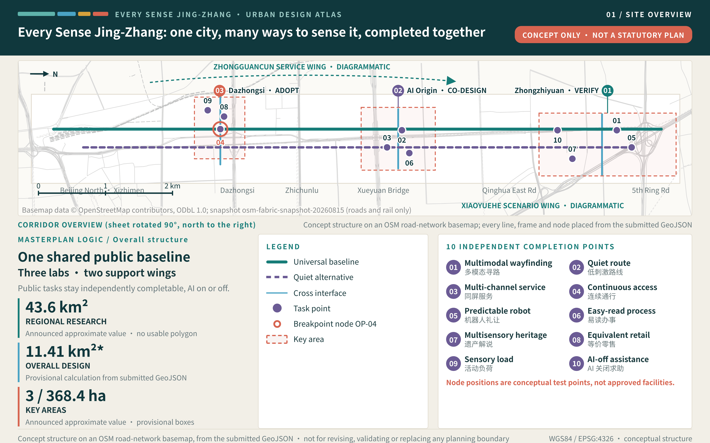
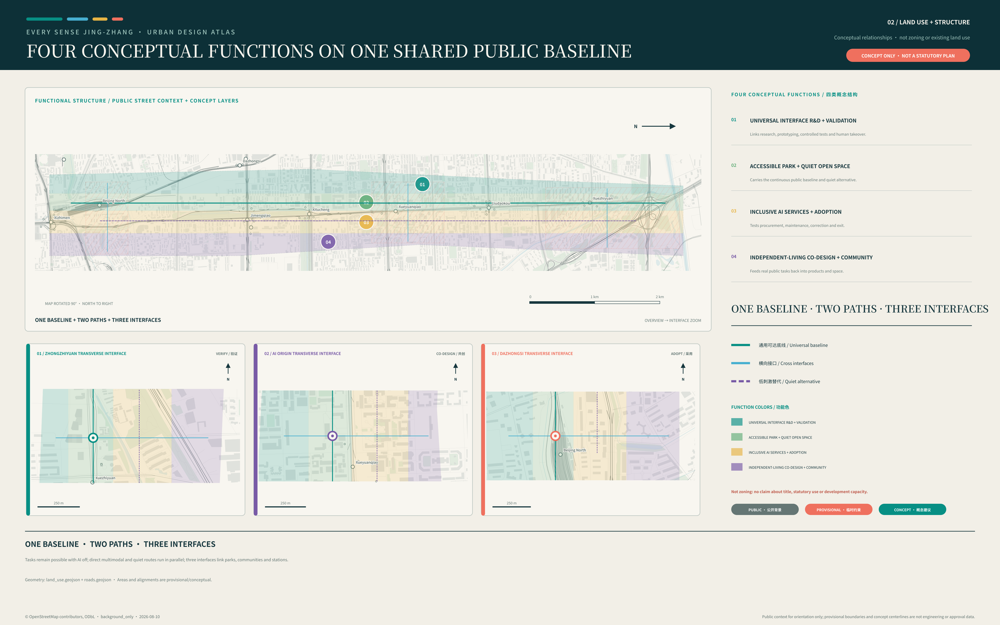
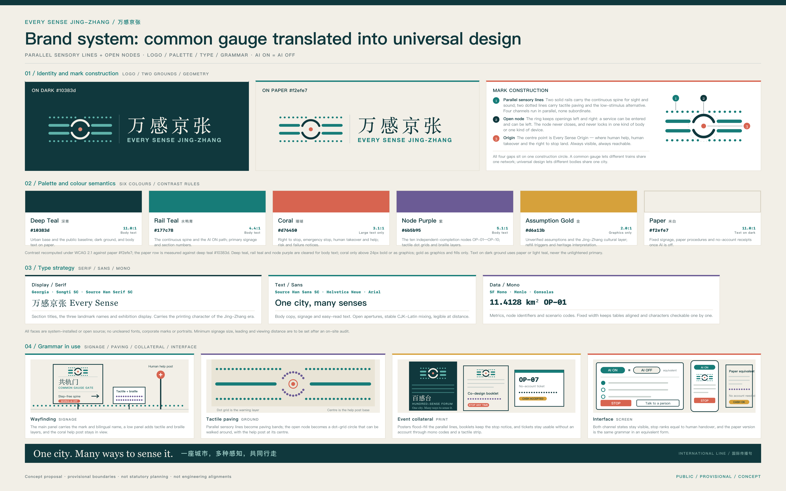
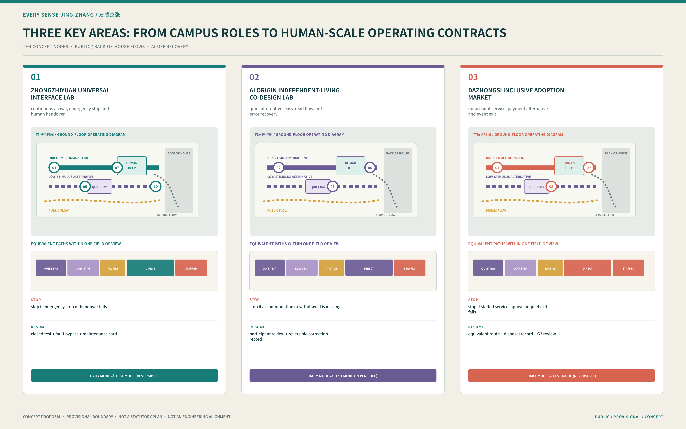
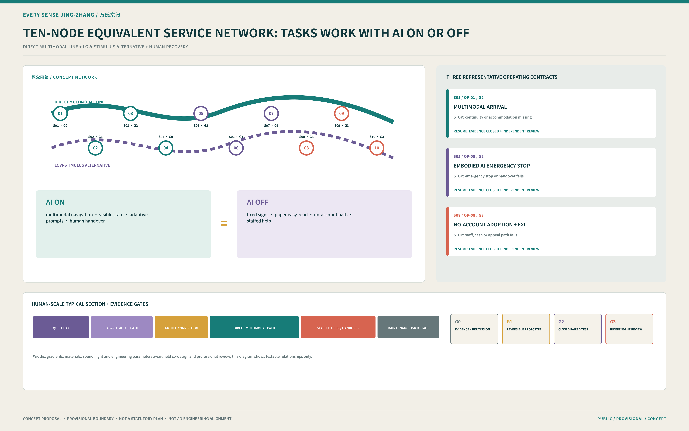
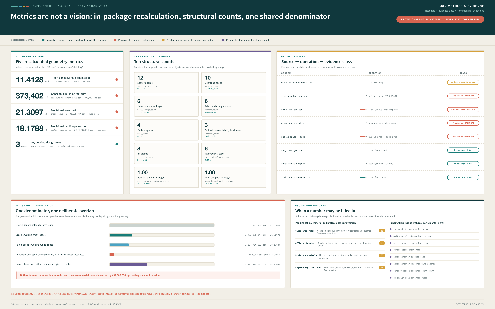

# EVERY SENSE JING-ZHANG: An AI City Every Body Can Use Independently

## Executive Summary and Deliverables Index

This chapter is a one-page entry point for reviewers: the left column states the question a review has to answer, the middle column gives this proposal's answer, and the right column names the deliverable that can be opened and checked immediately. Five versions have been submitted since the formal entry: v1.0 delivered the complete structured package and established the core proposition "AI ON = AI OFF"; v2.0 added the risk register and the family of inclusive-performance metrics; v3.0 added the cultural narrative, regional collaboration, and brand system and densified the geometry layers; v4.0 repaired the display page's first screen and added the official regulatory-plan reference register and the four-layer operating rhythm; v5.0 added four multimodal deliverables — cover, audio guide, short film, and interactive scene. Every change is registered item by item in `changelog.md` and is not restated here [source:PACKAGE-STRUCTURED-EVIDENCE-INDEX].

| Review question | This proposal's answer | Verifiable deliverable |
| --- | --- | --- |
| What is the core proposition | AI ON = AI OFF: urban intelligence is defined not by device count or automation rate but by whether anyone can independently understand, choose, complete, and exit the same service | The whole of "Design Basis and Source List", plus the chapter-16 interactive scene in `visual/index.html` where the AI switch can be operated by hand |
| How does space respond | One Universal Access Baseline, three Multisensory Labs, two support wings, and ten Independent Completion Points | "Three-Level Scope Framework" and the ten conceptual test-node features [data:geometry/constraints.geojson#OP-02] |
| Where does implementation start | Four evidence gates G0—G3 and a first-90-day Stage Zero evidence package; nothing enters open space before G3 | "Renewal Projects, Implementation Policy, and Phasing" and the item-by-item stop and recovery conditions in `risk.json` |
| How is public interest protected | Six personas and an inclusive-AI industry track, with service equivalence and the eight factor conditions as a baseline rather than an add-on | "AI Innovation Ecosystem, Personas, and AI+ Scenarios" and the item-by-item responses in `compliance_matrix.json` |
| What is the state of the evidence | All four self-checks pass; every boundary and area is declared as provisional geometry and never presented as an official redline or statutory area | `self_check.json` and the provisional-status annotation on the site-boundary feature [data:geometry/site_boundary.geojson#SITE-001] |
| What are the limits of the conclusions | Every spatial, event, brand, and policy element is a conceptual recommendation, and no control value is preset for any parcel | The "visit each document, register faithfully, cite none" principle of the official regulatory-plan reference register |

Four multimodal deliverables are submitted alongside the text, so that listening, watching, and reading form three equivalent channels. Multimodality is not decoration here: the proposal requires an urban service to remain usable through any single sensory channel, and a proposal expressed through one channel only would refute its own argument [source:AGENT-TASKBOOK].

| Deliverable | Main file | Content | Equivalent channel and fallback |
| --- | --- | --- | --- |
| Proposal cover | `assets/media/cover.webp` | Original vector composition: the AI-ON and AI-OFF service lines run side by side as exact equivalents, ten nodes on each line stand for the ten Independent Completion Points, and three open nodes mark the three key areas | `assets/media/cover.md` supplies a full textual equivalent that can be used directly as alt text |
| Audio guide | `assets/media/audio-guide.m4a` | A 2-minute-34-second Chinese guide covering the core proposition, AI-on/AI-off service equivalence, the spatial framework, the roles of the Three Areas and Two Wings, the evaluative purpose of the ten nodes, and the scope statement; fully synthetic speech, with no human recording, music, or field audio | `assets/media/audio-guide.vtt` with twenty-six captions from the same source and the full transcript in `assets/media/audio-guide.md` |
| Multimodal short film | `assets/media/journey.mp4` | A 63-second film in seven shots, one of which is a frame-accurate capture of the chapter-16 interactive scene: two real interactions — playing the guidance flow and switching to AI OFF — leave node positions and the service readout unchanged | `assets/media/journey.vtt` external captions, the storyboard and transcript in `assets/media/journey.md`, and the still poster `assets/media/journey-poster.webp` |
| Interactive scene | Chapter 16 of `visual/index.html` | Canvas axonometric scene: switch AI on and off, play the guidance flow, and open a scenario card node by node, with mouse and keyboard treated as equivalent | The static fallback view `visual/assets/scene-fallback.png` and a `<noscript>` degradation path; the whole page runs offline |

The four deliverables meet the five guardrails of `multimodal_presentation.guardrails` in the Agent taskbook one by one. First, neither audio nor video autoplays; the user must start playback, and the controls are operable from the keyboard. Second, both audio and video carry captions and a full transcript from the same source, worded identically to the picture, so there is no hierarchy in which the audio is fuller and the text a summary. Third, the generation tools, production method, rights boundary, and personal-data boundary are recorded item by item in three accompanying notes; no third-party asset, portrait, or uncleared typeface is used. Fourth, every frame is original vector work or data-driven rendering, with no live-action footage and no generative imagery, and each carries the on-image label 概念建议 / CONCEPT so that it is never read as site evidence or a performance promise. Fifth, the interactive scene and the display page are bundled entirely locally, load no remote script, font, tile, or analytics code, and the required static figures, bilingual PDFs, and offline HTML are still submitted in full [source:SOURCE-REGISTRY].

Equivalence across listening, watching, and reading is therefore not merely a delivery format but the proposal proving its own principle: the same content can be substituted between audio, captions, transcript, and static figure, and the loss of any one channel leaves the information complete. That is exactly the requirement the text places on urban services.

Every countable quantity in this proposal is recalculated item by item in the structured files rather than asserted in prose: twelve scenario cards [metric:scenario_card_count], six personas [metric:persona_count], three cultural landmarks [metric:landmark_count], and ten Independent Completion Points [metric:op_node_count].

On the same basis, evidence discipline is carried by four gates [metric:gate_count], six work packages [metric:work_package_count], eight risk entries [metric:risk_item_count], and six international cases [metric:international_case_count]. The counts are not an achievement in themselves; they only show that every claim can be opened and checked one entry at a time.

## Design Basis and Source List

EVERY SENSE JING-ZHANG begins with a clear design judgement: the advancement of an AI city should not be defined by its device count or automation rate, but by whether people with different bodies, senses, and cognitive styles can independently understand, choose, complete, and exit the same urban service. The official announcement and the cleared Agent taskbook establish the three scope levels, Three Areas and Two Wings, three positioning statements, five functions, and six required tasks. This proposal therefore elevates universal design from a remedial layer to a shared industrial, spatial, and governance agenda [source:OFFICIAL-ANNOUNCEMENT] [standard:PROJECT-OFFICIAL-ANNOUNCEMENT] [standard:PROJECT-AGENT-OPEN-CALL-TASKBOOK]. China's Barrier-Free Environment Construction Law supports directions for equal participation, accessible information, facility provision, and maintenance, but it does not replace site audits, professional design, or project approval [source:ACCESSIBILITY-LAW-CN].

The site argument uses two evidence levels. The announcement, taskbook, and registered public materials support scope names, approximate areas, design tasks, and cultural context. Repository provisional geometry supports conceptual placement, topology checks, metric demonstrations, and later recalculation only [source:SITE-PACKAGE]. Exact official redlines, exact key-area polygons, parcel ownership, building surveys, road redlines, municipal capacity, heritage controls, and real-user task baselines are not currently available, and that gap list is itself the first tier of the existing-conditions diagnosis [depth:existing_conditions_diagnosis] [source:PROCESSED-MISSING-DATA-CHECKLIST]. Boundaries in the figures are therefore not official redlines; areas are not statutory or precise areas; and spatial actions are not regulatory, engineering, or approval conclusions. The organiser's data gaps do not block content review, but they limit precision, determine the sequence of further work, and set the order of the missing-data and risk registers [source:BOUNDARY-SOURCE] [depth:risk_missing_data].

The OSM / Overpass snapshot retrieved on 2026-08-10 provides public volunteered context only for background orientation and explanatory rendering of roads, rail, buildings, green/water features, and stations. Its completeness and positional accuracy vary. It is not used to derive, check, or replace the project or key-area boundaries, and it does not support regulatory controls, redlines, engineering alignments, heritage controls, ownership, precise-area, site-accessibility-compliance, or implementation claims [source:OSM-BACKGROUND-CONTEXT-20260810].

W3C's perceivable, operable, understandable, and robust principles are used to review digital and interactive interfaces. WHO material explains how environmental and service barriers can restrict participation. Neither source certifies this site nor supplies local population figures [source:W3C-ACCESSIBILITY-PRINCIPLES]. Six international cases compare innovation ecosystems, controlled testing, access to public assets, and long-term operation; their land systems, regulatory powers, capital conditions, or built forms are not copied. External evidence supports mechanisms only. Dimensions, targets, and accountable operators remain subject to field investigation, co-design, and professional review.

## Three-Level Scope Framework

The three scope levels answer three different questions. The approximately 43.6-square-kilometre coordinated research area asks how inclusive AI can become a new industry track for Haidian. The approximately 11.4-square-kilometre overall design area asks how universal design can become a continuous civic baseline. The three key areas, announced as approximately 368.4 hectares in total, ask how research validation, everyday co-design, and market adoption can form a closed loop. The areas come from the announcement, while exact boundaries remain pending; the proposal therefore organises relationships, node types, and operating rules rather than manufacturing parcel-level certainty from provisional polygons [source:OFFICIAL-ANNOUNCEMENT] [source:PROCESSED-PROJECT-SCOPE-SUMMARY] [depth:three_level_scope_framework].

The spatial framework is **one Universal Access Baseline, three Multisensory Labs, two support wings, and ten Independent Completion Points**. The baseline follows the Jing-Zhang Railway Heritage Park as a continuous north-south public experience with a direct multimodal route and a lower-stimulation alternative. The three labs assign validation to Zhongzhiyuan, co-design to the Beijing AI Origin Community, and adoption to Dazhongsi. The Zhongguancun Technology Service Wing contributes technology, talent, capital, and professional services, while the Xiaoyuehe Scenario Empowerment Wing contributes open settings and real-world feedback. Ten completion points turn scenario cards into recognisable, inhabitable, testable, and exitable public interfaces [depth:overall_spatial_structure].

The proposal does not ask one line to carry every function. North-south continuity and east-west stitching work together: the park spine preserves basic information and a non-AI route, while three transverse interfaces connect universities, campuses, neighbourhoods, stations, and commercial foyers. The indicators for three-level coordination are not quantities of new construction. They ask whether the three key-area roles complement one another, whether information has two equivalent channels, whether a basic task remains possible with AI disabled, and whether a scenario can move from validation to adoption while retaining exit conditions. Precise road, gradient, station, and building relationships require official geometry, field audits, and professional transport studies.

| Scale | Design judgement | Spatial action | Meaning of indicators | Condition for further work |
| --- | --- | --- | --- | --- |
| Coordinated research area | Universal design can become an AI industry track | Organise research, testing, co-design, adoption, and international communication | Check whether ecosystem roles are complete; do not invent output or investment | Add industry interviews, institutional capacity, and regional evidence |
| Overall design area | The city needs a shared baseline beyond the AI switch | Create a continuous spine, quiet alternative, and three transverse interfaces | Check service continuity, information redundancy, and exit capacity | Add official redlines and walking and sensory audits |
| Key areas | Validation, co-design, and adoption need distinct roles | Assign one technical, one living, and one market lab | Check whether the scenario lifecycle closes | Add exact boundaries, ownership, buildings, and operators |

Above the three scope levels, one more table aligns the official inventory with this proposal's spatial actions, so that identifiers do not stand in for design reasoning. The taskbook sets three positioning statements — the Century Jing-Zhang Culture Belt, the Urban AI Living Experience Belt, and the AI Convergence Innovation Belt; five functions — a full-stack independent AI innovation system, a world-class AI innovation ecosystem, a new paradigm of AI+ scenario empowerment, an intelligent and vibrant AI city, and a global voice in AI governance; and Three Areas and Two Wings — the Zhongzhiyuan AI Acceleration Area, the Beijing AI Origin Community, the Dazhongsi AI Industry Cluster, the Zhongguancun Technology Service Wing, and the Xiaoyuehe Scenario Empowerment Wing [source:AGENT-TASKBOOK] [source:PROCESSED-AGENT-TASK-REQUIREMENTS].

| Unit of Three Areas and Two Wings | Role stated in the taskbook | Positioning assigned in this proposal | Functions assigned in this proposal | Spatial action in this proposal |
| --- | --- | --- | --- | --- |
| Zhongzhiyuan AI Acceleration Area | Full-stack independent AI innovation system and global voice in AI governance | AI Convergence Innovation Belt | Full-stack independent AI innovation system; global voice in AI governance | Universal Interface Lab: validation foyer, controlled test court, visible system state, human handover, and published validation status |
| Beijing AI Origin Community | World-class AI innovation ecosystem | Urban AI Living Experience Belt | World-class AI innovation ecosystem; new paradigm of AI+ scenario empowerment | Independent Living Co-design Lab: co-design room, lower-stimulation alternative, easy-read service foyer, and real feedback desk |
| Dazhongsi AI Industry Cluster | AI-native new business formats | Urban AI Living Experience Belt | Intelligent and vibrant AI city; new paradigm of AI+ scenario empowerment | Inclusive Adoption Market: multimodal commercial foyer, cash and staffed alternatives, public adoption receipts, maintenance and exit desk |
| Zhongguancun Technology Service Wing | Global allocation of factors, Zhongguancun IP, and capital enablement | AI Convergence Innovation Belt | World-class AI innovation ecosystem; global voice in AI governance | Access point for technology, talent, capital, and professional services; carries entry checks and professional review for the eight factor conditions |
| Xiaoyuehe Scenario Empowerment Wing | AI scenario empowerment and an intelligent, vibrant AI city | Urban AI Living Experience Belt | New paradigm of AI+ scenario empowerment; intelligent and vibrant AI city | Open settings and real feedback; hosts bounded public testing and public review for the ten Independent Completion Points |
| Jing-Zhang Heritage Park spine (cross-cutting element, not a unit of the Three Areas and Two Wings) | Innovation link described in the announcement and taskbook | Century Jing-Zhang Culture Belt | Intelligent and vibrant AI city; new paradigm of AI+ scenario empowerment | Universal Access Baseline: continuous north-south spine, lower-stimulation alternative, tactile heritage band, and three transverse interfaces |

The taskbook states a role for each unit of the Three Areas and Two Wings but does not assign positioning statements or functions unit by unit. The positioning, functions, and spatial actions in the table are this proposal's design judgements and conceptual recommendations; they do not represent an official division of responsibility or a confirmed arrangement. Regional industry context and factor conditions are drawn from public government department pages, and the scope and area wording of the prequalification announcement governs wherever the two differ [source:BJ-THREE-AREAS-TWO-WINGS-20260403].

## Coordinated Research Area: Industry and Future City Research

The industrial judgement combines assistive technology, multimodal models, easy-read public services, predictable embodied interaction, human handover, no-account access, and AI-off alternatives into an **inclusive AI** ecosystem. It does not reduce accessibility to a facilities checklist. The chain begins with algorithm and hardware research in universities and research organisations, moves through controlled validation at Zhongzhiyuan and voluntary co-design and independent task testing at the AI Origin Community, and tests procurement, maintenance, correction, and exit at Dazhongsi. The two wings connect professional services, capital, scenarios, and regional collaboration. Land, talent, compute, data, and scenarios remain conditions to verify rather than existing commitments [source:AGENT-TASKBOOK]. The national policy direction of running traditional service channels in parallel with smart services, covering high-frequency everyday scenarios such as travel, medical care, consumption, culture, and administrative affairs, is the background reference for this proposal's industrial judgement that an equivalent route must survive with AI disabled. That direction applies nationwide and its staged targets have expired, so it is not written as a duty still in force in 2026 or as evidence of local implementation [standard:ELDERLY-SMART-TECH-PLAN-2020-45] [source:ELDERLY-SMART-TECH-PLAN-CN].

Six cases provide complementary mechanisms. Cornell Tech connects real challenges, education, prototypes, and venture support. MIT Kendall Square illustrates the value of mixed uses, open space, and long-term community collaboration [source:CASE-MIT-KENDALL]. NTU CETRAN demonstrates staged simulation, closed testing, and bounded public trials. Barcelona Urban Lab matches public problems with controllable urban assets. Marineterrein uses evidence from temporary use to inform later planning. JTC LaunchPad brings adaptable space, prototyping, investment support, and display activities together [source:CASE-JTC-LAUNCHPAD]. The proposal borrows these mechanisms only; it does not claim that Haidian has the same land powers, permissions, investment conditions, or performance [source:CASE-CORNELL-TECH] [source:CASE-CETRAN] [metric:international_case_count].

The brand is **EVERY SENSE JING-ZHANG**, with the international line **One city. Many ways to sense it.** and the Chinese line “One city, many senses, moving together.” Its visual grammar abstracts railway gauge into original parallel sensory lines and open nodes: a common gauge lets different trains share a network, while universal design lets different bodies share a city. The identity, wayfinding, and event graphics use no corporate marks, portraits, or uncleared fonts. The metaphor does not substitute for research into Jing-Zhang history.

The brand system develops in four parts, carried graphically by `assets/logo.svg` and the brand system diagram, and all of it remains a conceptual recommendation. **The colour system** keeps the six-colour palette and fixes a meaning for each value: deep teal `#10383d` is the rail and night-travel ground used for dark surfaces and primary text; teal `#177c78` marks the Universal Access Baseline and the "available" state; coral `#d76450` is reserved for states that require a person — human handover, emergency stop, and calls for help; purple `#6b5b95` marks co-design and participant evidence; gold `#d6a13b` marks the cultural and heritage layer; and off-white `#f2efe7` is the ground and white space that controls glare and preserves contrast. Colour never carries information alone: any state distinguished by colour must also carry a shape, word, or tactile cue so that it remains legible with colour-vision differences and in low light. **The typographic strategy** pairs serif headings, sans-serif body text, and monospaced data across both languages: Chinese and Latin serifs carry headings and cultural narrative, Chinese and Latin sans-serifs carry body text, wayfinding, and interfaces, and a monospaced face carries metrics, identifiers, and code. Bilingual settings are controlled by baseline alignment and matched optical size; Chinese is never artificially condensed, Latin avoids long all-capital strings, and every typeface is cleared item by item, with uncleared fonts excluded from public output. **The extension rules** treat the parallel sensory lines as "several channels to the same destination" and the open node as "you may pause, ask for help, or leave": in wayfinding they appear as both relief and high-contrast print, in interfaces as layout grid and state bar rather than decorative motion, and in print as the basis for the text block and column structure. The lines may never be reworked into a corporate mark or a portrait. **The applications** cover station wayfinding, tactile paving, event graphics, and international communication material; event material must be removable and repairable, and communication material must also ship in easy-read and high-contrast versions. Exact dimensions, materials, type sizes, and contrast values follow field co-design and professional review.

Industrial value is not measured through invented company counts or investment figures. It is assessed by whether the ecosystem contains research, controlled testing, real co-design, independent task evaluation, adoption, maintenance, and exit; whether testing includes at least six user and maintainer roles; and whether each scenario retains a non-AI alternative. Regional industry data, institutional willingness, compute, and finance have not been verified. Later work requires public sources, interviews, and professional assessment, and all partnerships and events remain conceptual proposals.

### Regional Collaboration: What Can Be Exchanged, Not What Can Be Announced

An inclusive-AI ecosystem cannot be self-sufficient inside one innovation belt. This proposal defines regional collaboration as a two-way exchange of method and setting: the belt exports reusable accessibility and service-equivalence test methodology, independent task-test scripts, AI-on/AI-off paired-test protocols, and the public-space toolkit; external nodes return the real problems and validation settings of their own fields. The unit of exchange is a published method and an anonymised result, not pooled data, seconded staff, or a funding arrangement.

| Collaboration counterpart | Possible role in an inclusive-AI ecosystem (to be verified) | What this proposal can contribute | What the counterpart is asked to contribute | Verification condition |
| --- | --- | --- | --- | --- |
| Zhongguancun AI Beiwei Community | Innovation community in northern Haidian for young AI founders and early-stage teams | Service-equivalence test methodology, independent task-test scripts, toolkit loans and training | Real usability problems in early products; teams willing to join paired tests | Institutional willingness, participation ethics, venue and safety conditions |
| Future Science City | Science city concentrating research organisations in fields such as energy and pharmaceuticals | Multisensory interaction evaluation methods for complex equipment and expert interfaces | Operating-barrier cases in high-threshold expert interfaces and controlled validation settings | Willingness of the responsible body, confidentiality and data boundaries, accountability |
| Huairou Science City | Cluster of large scientific facilities and fundamental research | Methods for long-duration sensory-load recording and human-handover audit trails | Early translation topics from fundamental research and controlled experimental settings | Collaboration mechanism, rights in results, safety and admission conditions |
| Beijing Economic-Technological Development Area | Reported in public sources as one innovation district focused on embodied intelligence and intelligent manufacturing | Public-space test protocol for service-robot yielding and predictable interaction | Pre-production problems in robots and smart terminals, and manufacturing-side validation settings | Site authorisation, safety approval, insurance, accountable operator |
| Beijing-Tianjin-Hebei region | Cross-regional coordination scope | Reusable service-equivalence and accessibility test templates and a public review format | Service gaps and validation settings across different city sizes and demographics | Cross-regional data, permission, operating responsibility, and cost boundaries |

Every counterpart, role, and exchange in this table is a conceptual recommendation and a matter still to be verified. No collaboration, agreement, or letter of intent exists with any organisation, and nothing here indicates that any party has agreed to take part. The city-level "one core, multiple nodes" arrangement and the first batch of AI innovation districts are cited as background only; their scope, area, and policy wording must be re-checked against the issuing policy text before formal use [source:BJ-AI-INNOVATION-DISTRICTS-20260121]. A collaboration can exist only after the G0 evidence and permission gate is passed and written authorisation is obtained.

### Eight Factor Conditions: What Qualifies for the Inclusive-AI Track

Factor provision answers what conditions must be met before an action may enter the inclusive-AI track, not how much can be granted. Each of the eight factors carries an entry condition, an item to verify, and an accountable discipline, and each connects to the four gates: land, space, and data settle their boundaries before the G0 evidence and permission gate; industry, talent, and scenarios produce participation and stop evidence during the G1 reversible-prototype and G2 closed paired-test gates; funding and compute conditions are checked together with maintenance responsibility at the G3 independent-review gate. Where a condition does not hold, the corresponding action pauses or degrades; nothing proceeds on the basis of delivering first and completing evidence later [source:HAIDIAN-INDUSTRIAL-SYSTEM-20260302].

| Factor | Entry condition for the inclusive-AI track | Item to verify | Accountable discipline |
| --- | --- | --- | --- |
| Land | Reversible actions only on parcels whose ownership and permitted use are already clear; provisional geometry never implies land supply | Official parcels, ownership, use control, and applicability of renewal policy | Planning, territorial spatial planning, legal |
| Space | Every test space simultaneously offers a continuous accessible route, a lower-stimulation alternative, and a staffed help position | Field accessibility audit, sound and light baseline, fire and evacuation conditions | Accessibility, architecture, site operations |
| Industry | Occupants commit in writing to service equivalence and an exit route; device count and automation rate are not thresholds | Genuine institutional willingness, delivery capacity, accountable body | Industry research, operations management |
| Funding | Funding terms include revocable consent, maintenance responsibility, and publication of failed observations | Source of funds, compliance conditions, budget definition, duration | Finance and legal |
| Talent | Co-design and test roles cover disabled participants, neurodivergent participants, maintainers, and operators | Recruitment ethics, cost of reasonable accommodation, labour relations, insurance | Ethics review, human resources, co-design facilitation |
| Compute | Edge and cloud resources support degraded operation with AI disabled; scale never substitutes for usability | Capacity, energy use, cyber security, failover conditions | Information infrastructure and security |
| Data | Identity, health, disability category, location, and behavioural data are not collected by default | Data tiering, retention period, cross-party sharing, audit mechanism | Data governance and privacy |
| Scenario | Opening a scenario binds a stop condition, recovery evidence, and a findable accountable operator | Permission, insurance, incident handling, appeal chain | Scenario operations and safety |

## Overall Design Area: Urban Renewal and Regulatory-Plan-Level Urban Design

The overall design judgement is that the Jing-Zhang Railway Heritage Park should be more than an AI display corridor: it should become a civic baseline usable by everyone. A continuous north-south spine links the three key areas, with a direct multimodal route and a lower-stimulation alternative. Three conceptual east-west interfaces at Zhongzhiyuan, the AI Origin Community, and Dazhongsi connect universities, campuses, neighbourhoods, rail stations, and commercial foyers to the spine. Provisional land-use, road, public-space, and building layers express relationships; they are not approved land, road, or development boundaries, and urban design here carries only the conceptual duty of implementing the plan, guiding later architectural design, and shaping character [data:geometry/land_use.geojson#LU-001] [standard:MOHURD-URBAN-DESIGN-MEASURES].

Renewal follows **audit first, reversible trial second, professional development third**. The continuous route identifies gaps in information, rest, and human help; dependence on a single phone or account; sudden changes in sensory load; and weak cross-corridor connections. The three interfaces use movable multisensory wayfinding, quiet stops, adjustable-height interfaces, human-handover lights, and no-account service desks. At building scale, the proposal suggests only ground-floor public interfaces, shared test rooms, and reversible adaptation. It makes no judgement about retaining, renovating, demolishing, or constructing any specific building.

Overall indicators explain design quality. Independent completion asks whether a participant can finish a task with reasonable accommodation [metric:independent_task_completion_rate]. Two-channel redundancy asks whether critical information survives the failure of one sensory channel [metric:multichannel_information_coverage]. The AI-on/AI-off service gap asks how much basic capability is lost when automation is disabled [metric:ai_off_service_equivalence_gap]. Forced abandonment reveals hidden exclusion in a process [metric:forced_abandonment_rate]. There are no site baselines or targets, so all outcomes remain to be measured. Exact gradients, crossings, redlines, station connections, development intensity, height, setbacks, fire access, and municipal capacity require official data and professional surveys [depth:development_intensity_controls].

## Detailed Design of Key Areas

The three key areas form a **validate—co-design—adopt** loop rather than three copies of the same campus. Zhongzhiyuan is the **Universal Interface Lab**, where garden-like exchange spaces and a public interface toward Qinghe can host assistive technology, multimodal models, service robots, and a simulation—closed—bounded-open testing sequence. The Beijing AI Origin Community is the **Independent Living Co-design Lab**, where universities, campuses, neighbourhoods, and voluntary participants define problems, build prototypes, conduct independent task tests, and decide whether to revise or exit. Dazhongsi is the **Inclusive Adoption Market**, where station surroundings, commercial foyers, and public spaces test whether accessible retail, business, culture, and talent services can be procured, maintained, and corrected [source:AGENT-TASKBOOK] [depth:three_key_area_detailed_design].

Spatial actions match these roles. Zhongzhiyuan receives a validation threshold, visible system state, and human handover so immature technology does not move directly into open space. The Origin Community receives a lower-stimulation route, co-design room, easy-read service foyer, and real feedback desk; participation must be voluntary, understandable, and revocable. Dazhongsi receives multimodal consumer interfaces, cash and staffed alternatives, public adoption receipts, and maintenance access. The park spine and the two support wings connect the three areas, translating technical questions into everyday tasks and returning living evidence to products and operations.

| Key area | Design role | Conceptual spatial action | Scenarios and operation | Gate for further work |
| --- | --- | --- | --- | --- |
| Zhongzhiyuan AI Acceleration Area | Universal Interface Lab | Validation foyer, controlled test court, state signals, human handover | Multimodal navigation, service robots, interface robustness | Verify Qinghe, flood, road, ownership, safety, and exact boundary conditions [data:geometry/key_areas.geojson#PROV-KEY-001] |
| Beijing AI Origin Community | Independent Living Co-design Lab | Quiet alternative, easy-read window, co-design room, task-test points | Co-design for services, learning, culture, mobility, and events | Establish real recruitment, ethics, privacy, and campus-community conditions [data:geometry/key_areas.geojson#PROV-KEY-002] |
| Dazhongsi AI Industry Cluster | Inclusive Adoption Market | Conceptual four-quadrant station interface, commercial foyer, maintenance and exit desk | Accessible retail, payment alternatives, international visitors, feedback | Verify station, junction, ownership, utilities, and commercial operation [data:geometry/key_areas.geojson#PROV-KEY-003] |

The three areas use announcement-level approximate areas for scope explanation only, and the key-area count corresponds one to one with the provisional polygons [metric:key_area_count] [source:KEY-AREA-SOURCE]. Provisional polygons cannot support parcel-level building scale, retain-renovate-demolish decisions, road redlines, or engineering feasibility. Their metrics ask whether validation gates are clear, co-design participation is diverse and accommodated, and adopted services have accountable operators and exit paths. Precise drawings and controls require official geometry, existing-condition surveys, heritage and utility information, and joint development by planning, architecture, transport, accessibility, and operations professionals.

## AI Innovation Ecosystem, Personas, and AI+ Scenarios

The six personas organise needs and tests; they are not diagnostic labels, commercial segments, or completed user research [metric:persona_count]. Each persona links to spatial actions, the proposal's service-equivalence objective, and a privacy boundary. Real co-design must be voluntary, reasonably accommodated, understandable, and revocable, and whether the co-design seats cover the required roles is measured by role coverage rather than by headcount [metric:co_design_role_coverage_ratio]. China's Barrier-Free Environment Construction Law supports equal participation and accessible information, but it does not replace professional conformity assessment for a product, building, or transport system, and it does not automatically turn this proposal's service-equivalence concept into a specific legal duty [source:ACCESSIBILITY-LAW-CN]. Its requirement for on-site guidance and human-operated service applies strictly to the medical, social-security, financial, and living-payment matters the article lists; the six personas and the compliance matrix are organised within that boundary, and every other human fallback in this proposal is marked as a conceptual design recommendation [standard:BARRIER-FREE-ENVIRONMENT-LAW].

| Persona | Typical task | Spatial and service response | Human and privacy boundary |
| --- | --- | --- | --- |
| People who receive visual information differently | Locate, navigate, read state, understand heritage | Tactile, spoken, high-contrast graphic, and easy-read information with correction points | No face recognition, continuous tracking, or single-phone dependence |
| People using different auditory or language channels | Ask for help, join events, receive warnings, communicate across languages | Optional sign, caption, text, speech, and visible state | Automatic translation stays correctable and retains human explanation |
| People with different mobility patterns | Move continuously with wheelchairs, strollers, temporary injury, or older gait | Conceptual stitches, rest points, adjustable-height interfaces | Gradients and engineering remain unverified; navigation does not replace physical access |
| People with different cognitive or sensory-processing styles | Complete steps, avoid overload, anticipate change, recover attention | Easy-read steps, quiet route, sensory-load notice, reversible procedures | Do not pathologise differences or use personas for recommendations or risk scoring |
| Visitors crossing language barriers or with low digital literacy | Ask directions, complete procedures, pay, and join events across language, script, and digital thresholds | Pictorial procedures, easy-read Chinese set alongside other languages, staffed counters, and a no-account route | Language ability and digital literacy are never a condition for basic service; nationality and identity data are not collected |
| Service providers and maintainers | Observe state, take over, repair, review, and end service | State lights, staffed desk, maintenance access, incident receipt | Responsibility remains findable; monitoring does not replace on-site judgement |

All twelve scenarios follow one lifecycle: define the need, co-design, simulate, closed-test, bounded public test, conduct an independent task test, review with humans, and adopt or exit [metric:scenario_card_count]. S01, S05, and S08 respectively establish three industry-validation directions: multimodal navigation, universal embodied-AI interaction, and inclusive consumer terminals; the later S11 and S12 add no spatial facility and reuse existing nodes, testing emergency notification and cross-language procedures — the two task types most easily missed in an automated environment. No test is described as approved operation, no non-public personal data is required, and immature technology is not presented as ready for full deployment [source:W3C-ACCESSIBILITY-PRINCIPLES].

| Scenario card | Spatial setting | Design action | Measure and condition for further work |
| --- | --- | --- | --- |
| S01 Multimodal accessible wayfinding | Entire walking spine and station connections | Provide at least two equivalent channels among tactile, sound, graphic, and easy-read text | Test independent arrival and correction; add field route and participant tests |
| S02 Low-stimulation route and quiet periods | Origin Community and heritage park | Announce light and sound changes; provide detours, pauses, and recovery | Test sensory load and abandonment; add sound and light baselines [metric:sensory_load_exceedance_point_count] |
| S03 Sign, caption, speech, and easy-read service | Public-service points | Let users choose and correct modes and reach human explanation | Test understanding and takeover; add sign-language and real-language evaluation |
| S04 Continuous wheelchair and stroller movement | Transverse interfaces and station surroundings | Use task tests to find breaks; digital guidance never substitutes for physical repair | Test continuous passage; add gradients, kerbs, and redline surveys |
| S05 Predictable service-robot interaction | Controlled Zhongzhiyuan test segment | Show intention and speed state; provide emergency stop and human handover | Test prediction and takeover; add safety and approval conditions |
| S06 Cognitively accessible procedures | Origin Community service foyer | Break processes into reversible steps; retain paper and staffed routes | Test independent completion and error recovery; add real procedures |
| S07 Tactile, auditory, and visual heritage interpretation | Jing-Zhang cultural points | Keep history traceable and content selectable, pausable, and reviewable | Test understanding and preference; add historical, heritage, and rights checks |
| S08 Accessible smart retail with payment alternatives | Dazhongsi | Keep cash, staffed, and no-account routes; make errors recoverable | Test purchase completion and exit; add merchant and payment conditions |
| S09 Sensory-load management for major events | Squares and event routes | Zone and schedule activity; announce change; provide quiet and exit spaces | Test load, crowding, and help; add event-safety planning |
| S10 Equivalent help and evacuation with AI disabled | Entire belt | Preserve navigation and help during outage, power loss, or refusal of consent | Test AI-on/AI-off gap; add fire, emergency, and operator coordination |
| S11 Multisensory emergency drill with an information receipt | Reuses OP-09 [data:geometry/constraints.geojson#OP-09] and OP-10 [data:geometry/constraints.geojson#OP-10]; adds no spatial facility | Announce the drill by sound, light, vibration, and text at once, and issue a paper receipt the participant can take away | Test whether the notice arrives and the receipt is obtainable; add emergency plan, fire approval, and drill authorisation |
| S12 Independent procedures for cross-language and cross-cultural visitors | Reuses OP-03 [data:geometry/constraints.geojson#OP-03] and OP-07 [data:geometry/constraints.geojson#OP-07]; adds no spatial facility | Pictorial procedures beside easy-read Chinese and other languages; machine translation stays correctable and reaches a person; no local account required | Test independent completion and correction; add native-speaker editing and sign-language and multilingual user assessment |

The three representative scenarios bind risk, responsibility, and recovery evidence before testing so that no scenario lacks a brake. S01 is led by accessibility and transport professionals and links R-03, R-06, and R-08; it stops when route continuity, an alternative channel, or participant accommodation is missing, and resumes only after field audit, participant review, and reversible correction. S05 is led by technology-safety and site-operations personnel and links R-02, R-04, and R-07; it stops when intent is not visible or emergency stop or human handover fails, and resumes only after closed-test records, fault bypass, and maintenance responsibility are complete. S08 is jointly reviewed by service operations, payment compliance, and participant representatives and links R-01, R-03, R-04, and R-08; it stops when cash, staffed, or no-account alternatives fail, or data use cannot be explained, and resumes only after G3 independently reviews the equivalent route, data disposal, and appeal chain. OP-01 arrival correction [data:geometry/constraints.geojson#OP-01], OP-05 human emergency stop [data:geometry/constraints.geojson#OP-05], and OP-08 no-account exit [data:geometry/constraints.geojson#OP-08] respectively carry these three scenarios; the remaining OP-02—OP-10 nodes bind to S02—S10 in the same order, while S11 and S12 reuse existing nodes without adding any, so the node total and locations stay unchanged [metric:op_node_count]. Every node declares an AI-off equivalent route and a human-handover role; both coverage figures are registered as document-completeness measures and do not mean the routes are built, staffed, or measured [metric:scenario_exit_path_coverage] [metric:scenario_human_review_coverage].

## Land Use, Building Scale, and Retain-Renovate-Demolish Strategy

The land-use judgement places functional relationships before statutory classification. The provisional layer conceptually organises universal-interface research and validation, a universally accessible park and quiet open space, inclusive AI services and adoption, and independent-living co-design with community services. This arrangement tests whether industry and public life support each other. It is not an approved regulatory plan and cannot establish ownership, development capacity, or land-supply method. Formal classification requires official parcels, existing-condition surveys, and territorial planning conditions [standard:MNR-LAND-USE-CLASSIFICATION-GUIDE] [depth:land_use_layout] [data:geometry/land_use.geojson#LU-002].

The building approach is **verify retention first, favour lightweight reversible adaptation, and defer permanent construction**. The submitted layer now carries four conceptual building objects: `BLDG-001` is a spine-adjacent existing-stock conceptual footprint that sits outside the three key areas and only preserves a traceable building-footprint and metric chain [data:geometry/buildings.geojson#BLDG-001]; `BLDG-002`–`BLDG-004` are concept massing envelopes for the three experimental courts — the Universal Interface Lab controlled test court in Zhongzhiyuan, the Independent Living Co-design Lab in the Origin Community, and the Inclusive Adoption Market at Dazhongsi — and express spatial magnitude and location relationships only [data:geometry/buildings.geojson#BLDG-002]. None of the four is a claim about an existing or approved building, an ownership conclusion, or a confirmed height, floor area, or development right, and no numeric recommendation is made for height, massing, or character control before an official control document is obtained [depth:height_massing_character]. Proposed actions include ground-floor public interfaces, shared test rooms, quiet rooms, no-account service desks, adjustable-height work surfaces, and removable wayfinding. Structural, fire, ownership, heritage, operational, and real accessibility conditions must be checked before any intervention. Without a building survey, no specific retain, renovate, demolish, or new-build decision is responsible.

Building-footprint area describes only the conceptual objects in the submitted layer; it is not total floor area or development capacity [metric:building_footprint_area_sqm]. Floor area ratio, height, density, setbacks, functional shares, structural condition, and investment remain pending [metric:floor_area_ratio]. The next stage should survey use, ownership, age, structure, and barriers building by building; compare operational change, reversible interior adaptation, public-interface improvement, and permanent works; and then allow professional teams to prepare a retain-renovate-demolish reference scheme under the applicable architectural design-depth provisions [depth:retain_renovate_demolish] [standard:MOHURD-ARCH-DESIGN-DEPTH-2016].

### Official Regulatory-Plan Reference Register

An honest premise for regulatory-plan depth is to separate official references that have been verified from control values this proposal may claim as its own. No statutory control applicable to this proposal's own scope has been obtained, so official documents along the belt are handled by visiting each one, registering it faithfully, and citing none of it. The table below registers the official documents confirmed by direct visit through public channels on 11 August 2026, together with the control information they actually disclose. The register exists to leave a search trail and a sequence for further work: **this proposal cites none of these values as a basis for its own development intensity and presets no floor area ratio, building height, density, or green-space ratio for any parcel**, and known control conditions, design recommendations, and items still to be confirmed are stated in separate tiers [source:HD-JINGZHANG-CONTROL-PLAN-ADOPTION-20250208] [standard:MOHURD-CONTROL-DETAILED-PLANNING].

| Official reference value or readable information | Source | Cited by this proposal | Reason for not citing |
| --- | --- | --- | --- |
| *Beijing Haidian District Regulatory Detailed Plan (block level) for HD00-1601 and adjacent blocks along the Jing-Zhang Railway Heritage Park (key area of the AI innovation district) (2022–2035)*; draft published online from 2024-12-19 to 2025-01-19 | Adoption notice on the draft consultation, Haidian Branch of the Beijing Municipal Commission of Planning and Natural Resources (2025-02-08) | No | The notice resolves only comments on grade-separation form and road naming and publishes no intensity zoning, so no citable control value exists |
| Building heights of 60 m (parcel HD00-1603-01) and 36 m appearing in a publicly exhibited comprehensive implementation scheme | Adoption notice on the Lanjing Lijia scheme consultation, Haidian Branch (2025-06-06; on-site consultation 2025-04-11 to 2025-05-11, 120 comments received) | No | These are scheme heights for another renewal parcel inside the Dazhongsi pilot area, not a control value for any parcel in this proposal's scope; this proposal recommends no building height |
| Land use: HD00-1603-01 commercial and financial; HD00-1603-02 social welfare for older people; HD00-1603-03 retained as existing, including a 700 sqm community health centre and public activity centre | As above | No | It records a use conclusion already settled for an adjacent parcel; the land-use layer here expresses functional relationships and makes no statutory classification |
| Total project site area of approximately 3.95 hectares, bounded by planned Block Road No. 3 to the north, the western boundary of the Metro Line 13 land to the east, North Third Ring Road West to the south, and Fangheng Plaza to the west | Urban-renewal case page of the Beijing Municipal Commission of Planning and Natural Resources (2026-06-12) | No | The site area of a single renewal project cannot be extrapolated to the land area or development capacity of any area in this proposal |
| Floor area ratio, building density, and green-space ratio: no value appears in any of the four verified public texts | The three consultation and case documents above, plus a full-text search of the *Haidian District Urban Renewal Guideline (2025 edition)* | No (no value obtained through public channels) | The guideline sets only qualitative control of building height, massing, and interface; `floor_area_ratio` and related metrics therefore stay unknown until official control documents allow professional recalculation |

The register turns "unknown" from "never checked" into "checked, and genuinely absent from public channels" [metric:reference_plot_far]. The four documents confirm the plan's title, block numbers, planning horizon, and consultation dates, and they also confirm that the heights and site area recorded in public texts along the belt refer only to a single adjacent renewal project [metric:reference_adjacent_scheme_building_height_max_m] [metric:reference_adjacent_scheme_building_height_min_m] [metric:reference_adjacent_scheme_site_area_sqm]. Registering official values published for an adjacent, already-exhibited parcel is a factual reference and infers no control value for any parcel in this proposal; floor area ratio, height, density, green-space ratio, and setbacks stay pending, the trigger is receipt of the applicable official control document and its calculation boundary, and the accountable disciplines are regulatory-plan implementation and building-survey professionals [source:HD-LANJINGLIJIA-SCHEME-ADOPTION-20250606] [source:HD-LANJINGLIJIA-RENEWAL-CASE-20260612] [source:HD-URBAN-RENEWAL-GUIDELINE-2025].

## Transport, Rail, Municipal Infrastructure, and Public Services

The transport judgement makes **independent completion** the central measure of walking and interchange quality. The Universal Access Baseline follows the park as a continuous north-south route. Its direct multimodal line provides tactile, auditory, visual, and easy-read information, while a lower-stimulation line offers a choice with less sound and light interference. Three east-west interfaces conceptually connect Zhongzhiyuan, the AI Origin Community, Dazhongsi, and surrounding urban functions. Centre-lines in the figures express relationships; they are not road redlines, gradients, crossing works, or construction alignments [data:geometry/roads.geojson#ROAD-001] [data:geometry/roads.geojson#ROAD-002].

Transport actions include continuous correction points, predictable junction information, rest and recovery, bicycle-parking information, staffed station help, and fixed wayfinding when AI is disabled. Indicators examine independent arrival, detour and abandonment, two-channel state coverage, access to human help, and continuity of the quiet alternative, where the effectiveness of human help is judged jointly by handover success and response time [metric:human_handover_success_rate] [metric:human_handover_response_time_seconds]. Crossings at the North Fifth Ring Road, rail stations, major junctions, actual gradients, kerbs, passenger flows, and parking have not been professionally verified. Official sections, station material, field survey, and transport-safety review are prerequisites.

Human-scale prototypes translate those principles into a testable spatial sequence rather than decorative rendering. A typical section places a quiet bay, a low-stimulation path, a tactile correction band, a direct multimodal path, and staffed help alongside one another. A service node keeps multisensory signage, an adjustable-height interface, human handover, and a quiet bay within one field of view. Each component must support wheelchair turning, seated and standing operation, no-phone use, maintenance access, and a fault bypass. Exact width, gradient, material, sound, and light parameters follow field co-design and professional review. AI-on and AI-off trials use the same participant, the same task, and equivalent reasonable accommodation, recording understand, choose, complete, and exit step by step; a showcase demonstration is not evidence of real usability [depth:traffic_rail_slow_parking].

Municipal and public services follow an equivalence design concept: multimodal terminals include human explanation; AI navigation includes fixed signs and a no-account route; smart retail keeps cash or staffed alternatives; and event systems keep quiet-zone and evacuation information available during network outage. Edge compute, communications, power, drainage, energy, and service robots are possible support systems rather than committed facilities. The equivalence design concept for municipal and public services takes "traditional channels running in parallel with smart services" as a background reference and turns it into four concrete actions — fixed wayfinding, paper and staffed routes, cash alternatives, and no-account service desks — rather than presenting the policy wording itself as a locally achieved result [standard:ELDERLY-SMART-TECH-PLAN-2020-45]. Capacity, cyber security, fire safety, procurement, maintenance, and accountable operators require professional assessment [depth:municipal_new_infrastructure].

## Multisensory Narrative of Jing-Zhang Culture, Zhongguancun Culture, and New AI Culture

The cultural judgement is that Jing-Zhang is not an old railway serving as a backdrop for AI, and Zhongguancun is not a slogan to be mounted on a wall. Both become a new AI culture only when they are translated into public behaviour that every kind of body can read and complete alone. Cultural work therefore starts with a traceable resource inventory, then decides the carriers, and only then reaches symbols and wayfinding [source:AGENT-TASKBOOK]. This chapter is a conceptual recommendation. It is not a heritage conservation plan and it does not settle historical fact.

The Jing-Zhang Railway heritage resources are organised in four layers, each with its own provenance and rights requirement. Material whose publisher, date, licence, intended use, or spatial accuracy cannot be confirmed is recorded as pending, excluded from public output, and never used to infer a conservation area, control line, or engineering method [source:SOURCE-REGISTRY].

| Resource layer | Content | Possible carrier | Provenance and rights requirement |
| --- | --- | --- | --- |
| Linear heritage fabric | Spatial sequence of alignment relationships, stations, bridges, culverts, and crossings | Tactile heritage band on the spine, paving segments, fixed interpretive plaques | Official heritage and survey material governs; with no control lines available, no conservation area or grade is annotated |
| Events and knowledge | Engineering judgement and technical knowledge in independent surveying, alignment, and construction | Pausable and skippable three-channel interpretation, easy-read text, physical models | Every item cites its historical source; paper figures, archives, and footage are used only after clearance |
| People and oral record | Associated figures, builders, and the memories of residents and commuters along the line | Sound archive, sign-language and captioned versions, optional short narratives | Portrait, name, and voice require item-level revocable consent; no statement may be invented |
| Contemporary use | Everyday use, events, and co-design records after the park renewal | Public record wall at Every Sense Origin, paired digital and physical versions | Participant information anonymised; content published only after participant review |

The translation from Zhongguancun innovation culture to a new AI culture proceeds in three steps, so that innovation history is not compressed into decoration. First, the entrepreneurial history of "daring to be first" becomes a validation culture of daring to publish failed observations: public reviews, issue logs, and unresolved barriers are displayed alongside results. Second, "technological leadership" becomes the adoption standard of independent use by every kind of body: advancement is judged by independent completion, two-channel redundancy, and the AI-on/AI-off service-equivalence gap, not by compute or automation rate. Third, "campus narrative" becomes public-space narrative: cultural content appears by default on interfaces anyone can reach, rather than only inside spaces that require booking, registration, or authorisation. Together the three steps point to one judgement — a new AI culture is not an algorithm written into a slogan; it is explainability, handover, and exit made perceptible as public behaviour.

The spatial cultural system has three levels that share the structure of the spatial framework. **The spine storyline** runs the tactile heritage band continuously along the Jing-Zhang Heritage Park, and every segment can be paused, skipped, or repeated. **The three landmarks** carry three cultural roles: Common Gauge Gate at Zhongzhiyuan presents validation culture, Every Sense Origin at the AI Origin Community presents co-design culture, and Hundred-Sense Forum at Dazhongsi presents adoption and correction culture. **Node-level micro-narratives** give each of the ten Independent Completion Points a short interpretation that is off by default and opened by the visitor. All cultural expression follows the AI-on equals AI-off rule: cast lettering, braille, tactile relief, and fixed graphics stay readable during outage, power loss, or refusal of consent, so history does not disappear when a system is switched off [depth:blue_green_public_space].

Multisensory wayfinding and the symbol system start from the parallel sensory lines and open nodes abstracted from a common gauge. They share that grammar with the brand but occupy a different level: the cultural mark says "traceable historical content is here", while the belt identity says "this place belongs to one set of public commitments". Neither replaces the other and the two are never merged. Every wayfinding and cultural unit offers at least two equivalent channels combined from touch, sound, graphics, and easy-read text, and each component must support wheelchair turning, seated and standing operation, no-phone use, maintenance access, and a fault bypass.

| Level of expression | Main carrier | Sensory channels | Equivalent expression with AI disabled | Rights and conditions for further work |
| --- | --- | --- | --- | --- |
| Spine storyline | Tactile heritage band, paving segments, fixed plaques | Touch, graphics, easy-read text | Entirely physical; depends on neither power nor network | Material, slip resistance, maintenance, and heritage conditions pending |
| Landmark cultural interface | Public record faces of Common Gauge Gate, Every Sense Origin, Hundred-Sense Forum | Touch, graphics, text, optional speech | Cast lettering and replaceable panels retain the latest published record | Records reviewed by participants and anonymised before publication |
| Node micro-narrative | Optional interpretation at the ten Independent Completion Points | Speech, captions, sign-language video, easy-read text | Falls back to fixed panels and human explanation | Sign-language and multilingual versions assessed by the relevant users |
| Communication and event material | Bilingual graphics and removable event visuals | Graphics, text, optional audio description | Easy-read and high-contrast versions available for download | Typefaces, images, and recordings cleared item by item |

Urban character aims at quiet, legible, tactile, and understandable, with no glare, technology texture, or anthropomorphic robot imagery standing in for culture. International communication leads with **One city. Many ways to sense it.**, alongside the Chinese line "One city, many senses, moving together", and is layered by audience: international professional audiences receive published test methodology, protocols, and failed observations; international public audiences receive paired AI-on and AI-off comparisons that show what service equivalence means; domestic audiences and residents along the line receive easy-read Chinese, sign language, and captions; and the developer community receives the open problem library and scenario test protocols. Every outward statement retains human editing and correction, machine translation is never issued as a final version, and further languages are not released before native-speaker editing and assessment by the relevant users exist. The events, collaborations, communication plans, and landmark names in this chapter are conceptual recommendations and are not approved, authorised, or confirmed arrangements.

## Blue-Green Network, Public Space, and Urban Character

The blue-green judgement asks the Jing-Zhang Railway Heritage Park to carry ecology, walking, culture, and the service-equivalence design concept at the same time, rather than becoming a technology showcase. The structure consists of a continuous north-south spine, a lower-stimulation alternative, three transverse interfaces, rest points, co-design spaces, and human-handover nodes. Connections with Qinghe, Xiaoyuehe, and the surrounding park system remain conceptual; no river or engineering intervention is proposed before blue-line, flood, ecology, and heritage conditions are verified [depth:blue_green_public_space] [data:geometry/green_space.geojson#GREEN-001].

The public-space toolkit is reusable rather than a fixed engineering package. Multisensory wayfinding posts provide redundancy across touch, sound, graphics, and easy-read text. Quiet stops allow attention to recover. Adjustable-height interfaces support different postures and heights. A tactile heritage band links traceable historical content. Human-handover lights make system state public. No-account service desks ensure that people who refuse consent can still seek basic help. Components are assessed through independent use, understanding, error recovery, and maintainability; dimensions and materials require testing with real participants and relevant professionals.

Three pilgrimage and honour nodes carry the cultural and operational story. **Common Gauge Gate** at Zhongzhiyuan publishes the validation state of universal interfaces. **Every Sense Origin** at the Origin Community records co-designers, questions, revisions, and unresolved barriers. **Hundred-Sense Forum** at Dazhongsi publishes adoption, maintenance, incident, and exit feedback. Urban character is quiet, legible, tactile, and understandable; glare and technological graphics do not substitute for culture. The three landmarks are carried by conceptual interfaces in the public-space layer; none is a sited, approved, or rights-cleared structure [metric:landmark_count] [data:geometry/public_space.geojson#PUBLIC-001]. Jing-Zhang history, Zhongguancun innovation history, typefaces, images, sounds, and personal material all require provenance and rights review [source:AGENT-TASKBOOK].

## Renewal Projects, Implementation Policy, and Phasing

Six renewal projects turn the framework into transferable work packages, but all remain conceptual recommendations [depth:renewal_project_list] [metric:work_package_count] [data:geometry/phasing.geojson#PHASE-001]. Near-term work prioritises universal-design audits, real co-design, and movable-component tests without altering statutory boundaries. The middle phase starts only after official geometry, roads, heritage, ownership, municipal, and operating conditions are clear, and then develops the three labs and continuous public interfaces. The long phase may establish an ecosystem for inclusive-AI testing, procurement, maintenance, and exit. Phasing represents evidence maturity, not a construction timetable, funding plan, or government commitment [depth:phasing_implementation].

| No. | Conceptual project | Main spatial action | Meaning of outcome | Prerequisite |
| --- | --- | --- | --- | --- |
| JZ-01 | Jing-Zhang Universal Access Baseline | Audit breaks; test multisensory wayfinding, rest, and staffed help | Test north-south continuity and basic use with AI disabled | Road, heritage, field accessibility, and operation review |
| JZ-02 | Zhongzhiyuan Universal Interface Lab | Controlled test court, validation foyer, state signals | Test the threshold for multimodal and embodied interfaces entering public space | Exact boundary, Qinghe, flood, safety, and ownership review |
| JZ-03 | Origin Community Independent Living Co-design Lab | Co-design room, quiet route, easy-read service foyer | Test how real needs change products and space | Voluntary recruitment, ethics, privacy, campus, and building conditions |
| JZ-04 | Dazhongsi Inclusive Adoption Market | Multimodal commercial foyer, payment alternatives, maintenance and exit desk | Test whether products are procurable, maintainable, and correctable | Station, junction, merchant, payment, and ownership conditions |
| JZ-05 | Every Sense Public-Space Toolkit | Six movable, repairable, and replaceable component types | Test low-cost trials and reuse across areas | Material, safety, maintenance, and real-user tests |
| JZ-06 | Every Sense Week Public Route | Link challenge, residency, task tests, and case exchange | Test brand, developer community, and scenario conversion | Event permission, safety, rights, and accountable organiser |

| Work package | Responsible roles | Main risks | Stop condition | Recovery evidence |
| --- | --- | --- | --- | --- |
| JZ-01 | Accessibility, transport, and site-operations professionals | R-03, R-06, R-08 | Route conflict, alternative channel, or reasonable accommodation is missing | Field audit, participant review, and reversible-correction record |
| JZ-02 | Urban design, technology-safety, and site-management personnel | R-02, R-05, R-06, R-07 | Exact scope, safety boundary, or human handover is unresolved | Authorised scope, closed test, fault bypass, and maintenance card |
| JZ-03 | Co-design facilitators, data governance, and participant representatives | R-01, R-03, R-08 | Recruitment is unbalanced, consent cannot be withdrawn, or accommodation is missing | Ethics protocol, participation structure, and exit-disposal record |
| JZ-04 | Service operations, payment compliance, and maintainers | R-01, R-03, R-04, R-07 | Equivalent payment, staffed service, or appeal chain fails | Paired-task record, shift response chain, and fault exercise |
| JZ-05 | Product design, safety, and maintenance personnel | R-02, R-04, R-06 | Component cannot be removed or repaired, or blocks movement | Installation-removal test, maintenance card, and site review |
| JZ-06 | Event safety, rights, data governance, and an authorised organiser | R-01, R-02, R-03, R-05 | Permission, accountability, asset rights, or exit mechanism is unclear | Written authorisation, risk plan, asset register, and public receipt |

The operating brand **Every Sense Week** is a reference scheme combining an inclusive-AI challenge, developer residencies, a resident co-design season, independent task tests, global case exchange, and public review. Scenarios move through proposal, co-design, simulation, closed testing, bounded testing, human review, adoption, monitoring, and exit. Policy directions include an open problem library, reasonable accommodation, revocable consent, service-equivalence clauses as a design proposal, maintenance responsibility, and public receipts. Events, recruitment, procurement, subsidy, or partnership are not presented as confirmed arrangements [source:CASE-BARCELONA-URBAN-LAB]. Developers, teams, and companies convert along one chain: claim a topic from the open problem library, build a prototype through a challenge or residency, enter controlled testing at Zhongzhiyuan, earn bounded-open status by passing an independent task test, complete an adoption receipt and maintenance registration at Dazhongsi, and let a public review decide whether to continue, revise, or exit. Every step advances on reviewable evidence rather than a letter of intent; conversion outcomes, retained organisations, and scale all await verification once an operator is confirmed, and this proposal promises no recruitment, settlement, or investment result.

Every Sense Week is the annual peak, but evidence for inclusive AI cannot accumulate from one event a year, so the operating rhythm is organised in four layers: seasonal, monthly, weekly, and continuous. All four hang their activities on the ten existing Independent Completion Points and add no facilities, and together they answer one question: is evidence produced continuously, are problems genuinely corrected, and is the AI-off equivalent route tested every day? The table is a conceptual recommendation; activity types, participants, and frequencies may run only after an authorised operator confirms them [source:CASE-BARCELONA-URBAN-LAB].

| Rhythm layer | Activity type | Spatial node carrying it | Participants | Meaning of outcome | Prerequisite |
| --- | --- | --- | --- | --- | --- |
| Seasonal | Resident co-design season, public review meeting, update of the unresolved-barrier list | OP-03, OP-06, OP-09 | Residents along the line, voluntary participant advisory group, co-design facilitators, operator | Whether real needs changed products and space, and whether unresolved barriers stay published | Ethics and revocable-consent protocol, reasonable-accommodation budget, venue and safety conditions |
| Monthly | Developer residency, claims from the open problem library, controlled-test scheduling | OP-02, OP-05, OP-07 | Developers and early-stage teams, technology-safety personnel, maintainers, site managers | Whether a prototype can enter controlled testing and leave an issue log and maintenance card | Controlled-test authorisation, confirmed accountable body, asset and data boundaries |
| Weekly | Independent task tests, AI-on/AI-off paired tests, sensory-load patrols | OP-01, OP-04, OP-10 | Voluntary participants, accessibility and transport professionals, site operators | Whether independent completion, error recovery, and the service-equivalence gap are fully recorded | Repeatable task scripts, participant recruitment with accommodation, exit and appeal routes |
| Continuous | Patrol of non-AI equivalent routes, staffed help positions, maintenance and incident receipts | All of OP-01 to OP-10 | Staffed and maintenance personnel, operator, the informed public | Whether a basic task still completes with AI disabled and whether responsibility stays findable | Shift and response chain, maintenance cards, fault-bypass plan, public receipt format |

The four layers set no activity-count target and promise no event scale; their only output is reviewable evidence and public receipts. Where a layer lacks a prerequisite, the corresponding activity degrades or pauses rather than proceeding on the basis of starting first and completing the paperwork later [depth:phasing_implementation].

The first 90 days establish only a **Stage Zero evidence package**; they do not promise construction or public operation. Days 0–30 enter **G0 evidence and permission gate**: verify official scope, inventory routes and services, establish ethics, consent, and data-disposal protocols, and convert all twelve scenarios into repeatable task scripts. Work pauses when any responsibility or evidence boundary under R-01, R-02, R-05, or R-06 is unclear. Days 31–60 enter **G1 reversible-prototype gate** and **G2 closed paired-test gate**: build removable components, run controlled AI-on/AI-off pairs, and deliver an issue log, maintenance cards, and anonymised test evidence. Progression is blocked until the alternative-route, operating, and participation conditions under R-03, R-04, R-07, and R-08 are complete; an internal demonstration cannot substitute for participant evidence. Days 61–90 enter **G3 independent-review gate**: professionals and participant representatives who did not build the prototype review the stop condition and recovery record of all eight risk entries R-01—R-08 [metric:risk_item_count]; the decision is limited to revise, bounded pilot, or stop. All four gates are required, and nothing enters open space before G3 [depth:phasing_implementation] [metric:gate_count].

Rules for opening a scenario were previously spread across factor provision, the scenario lifecycle, and the operating rhythm, which reads as three separate standards. The table below consolidates them into one opening mechanism aligned with gates G0—G3: every level of opening binds an entry condition, a stop condition, recovery evidence, and an accountable operator at the same time, and no level may be raised while any of the four is missing [depth:phasing_implementation].

| Opening level | Entry condition | Stop condition | Recovery evidence | Accountable operator |
| --- | --- | --- | --- | --- |
| L0 Evidence and permission (before G0) | Official scope, routes, and service inventory verified; ethics, consent, and data-disposal protocols complete; all twelve scenarios rewritten as repeatable task scripts | The accountable body or an evidence boundary is unclear, or a source cannot confirm publisher, date, licence, and intended use | Completed source registration, written authorisation, signed protocols, and data-disposal records | Evidence owners and data-governance personnel |
| L1 Reversible prototype (G1) | Components can be installed and removed, do not block the continuous route, and carry a maintenance card and fault-bypass plan | A component cannot be withdrawn or repaired, or blocks wheelchair and stroller movement | Installation-removal test record, site review conclusion, confirmed maintenance responsibility | Product design, safety, and maintenance personnel |
| L2 Closed paired testing (G2) | A controlled environment runs AI-on and AI-off pairs with the same participant and task, with reasonable accommodation and exit agreed in advance | Any alternative route, human handover, or participation condition is unresolved, or an internal demonstration substitutes for participant evidence | Issue log, anonymised test evidence, fault bypass, and maintenance card | Test facilitators, technology-safety personnel, and participant representatives |
| L3 Bounded opening (after G3) | Independent review confirms every stop condition and recovery record, and the site offers both a staffed help position and a non-AI equivalent route | Independent completion, two-channel information, or the equivalent route fails, or data use cannot be explained to users | Field audit, participant review, reversible-correction record, and public receipt | Site operators and the authorised sponsor |
| L4 Adoption and continuous operation | Adoption receipt, maintenance registration, and appeal chain are available, and the exit route is visible and executable for users | Maintenance response exceeds its time limit, the appeal chain breaks, or an exit request cannot be executed | Shift response-chain records, fault-exercise results, and public review conclusions | Operator and maintainers, with the public informed through anonymised results |

The levels are not a construction sequence but an evidence sequence: a scenario may stay at L2 indefinitely and may fall back from L3 to L1. Every level, condition, and division of responsibility is a conceptual recommendation, and actual execution requires a separately prepared arrangement confirmed by an authorised body [source:AGENT-TASKBOOK].

Accountability uses RACI. A future authorised project sponsor or operator is **A (accountable, currently to be confirmed)**. Urban design, accessibility, data-governance, and operations professionals are **R (responsible)**. A voluntary participant advisory group, site manager, and maintainers are **C (consulted)**. The public and maintainers are **I (informed)** through anonymised results and change receipts. No authority, merchant, community, university, or company is named as a committed actor without written authorisation. Every gate records an evidence owner, reviewer, stop condition, and next authorisation so that broad participation does not obscure responsibility.

## Metrics, Area Recalculation, and Compliance Matrix

Metrics fall into three classes. The first comprises provisional-geometry calculations such as scope area, green-space ratio, public-space ratio, building footprint, and key-area count; these show only internal consistency within the concept package. Because the boundary is not official, they are not precise areas, statutory controls, or performance commitments. Green-space ratio and public-space ratio share the same denominator and their envelopes deliberately overlap by 452,986.656 sqm where the spine greenway also carries public interfaces; the two ratios therefore must not be added together or merged into a single open-space share [metric:green_ratio] [metric:public_space_ratio]. The second class awaits official planning and professional material: floor area ratio, height, density, setbacks, road redlines, facility standards, and municipal capacity remain unknown. The third class covers inclusive outcomes that must come from ethical field tests and cannot be replaced by model inference or a showcase demonstration. The recalculation method, projection, and rounding convention of all three classes are registered item by item, and any revision of the geometry triggers a full recalculation [metric:site_area_sqm] [source:PACKAGE-SPATIAL-RECALCULATION-METHOD] [depth:metrics_recalculation].

| Metric | Design meaning | Calculation approach | Current status |
| --- | --- | --- | --- |
| Unaccompanied independent task completion | Whether service supports autonomous use | Independently completed tasks with accommodation / valid tasks | `independent_task_completion_rate`; pending real participants and protocol |
| Two-channel information redundancy | Whether critical information survives one sensory-channel failure | Audited points with two equivalent channels / all audited points | `multichannel_information_coverage`; pending site and interface inventory |
| AI-on/AI-off service-equivalence gap | Loss of basic capability when automation is disabled | AI-on completion minus AI-off completion | `ai_off_service_equivalence_gap`; pending paired tests |
| Forced-abandonment rate | Whether the process creates hidden exclusion | Tasks stopped because of a barrier / valid attempts | `forced_abandonment_rate`; pending exit-reason records |
| Human-handover success and time | Whether responsibility is genuinely reachable | Successful handovers / valid handover triggers; seconds from trigger to human acknowledgement | `human_handover_success_rate`, `human_handover_response_time_seconds`; pending operator and exercises |
| Sensory-load exceedance points | Sudden stimulation or places without recovery | Count of exceedance or no-recovery points confirmed by participatory audit | `sensory_load_exceedance_point_count`; pending sound, light, and co-design baseline |
| Co-design participation structure | Whether participant, operation, maintenance, and professional roles are represented | Required role groups represented / role groups required by protocol; no personal ability score | `co_design_role_coverage_ratio`; pending ethics and privacy plan |

The protocol precedes target values. Every task fixes its start, end, success criterion, reasonable accommodation, human-handover condition, and exit. The same participant completes AI-on and AI-off rounds in a balanced order, with understanding, choice, completion, error recovery, help, and exit recorded separately. Denominators report valid tasks, withdrawals, technical failures, and reasons for non-completion; failed observations cannot be deleted to improve a result. Identity, health, disability category, location, and behavioural data are not collected by default. If strictly necessary, they require separate explicit consent, a retention limit, and human review. No fabricated threshold is set now: G2 checks evidence completeness, while G3 lets participant representatives and independent professionals decide revise, bounded pilot, or stop [metric:independent_task_completion_rate].

The compliance matrix confirms that the three positioning statements, five functions, Three Areas and Two Wings, and agent.1—agent.6 each have narrative, spatial, scenario, metric, and operating responses; machine identifiers do not replace design reasoning. Known metrics retain source, formula, date, and confidence. Unknown metrics state the gap, responsible discipline, and condition for completion. Real testing needs reasonable accommodation, informed consent, privacy protection, human review, and exit rights, with disabled and neurodivergent participants, relevant professionals, and operators jointly reviewing protocols [source:WHO-DISABILITY-HEALTH]. Matrix entries concerning equal participation and accessible information follow the direction of the Barrier-Free Environment Construction Law; human and equivalent routes outside the matters the law lists are marked as this proposal's design recommendations and are never presented as conformity findings [standard:BARRIER-FREE-ENVIRONMENT-LAW].

## Risk, Copyright, and Compliance

**Public-information boundary.** The proposal uses only material that has been publicly released, provided by the organiser and rights-reviewed, or entered in the source registry. It must not use material outside the approved public-release scope without rights review, controlled mapping material, internal institutional documents, proprietary enterprise data, personal files, or figures of unknown origin. Provisional geometry, case publicity, and inference cannot be presented as official fact. Material whose publisher, date, licence, intended use, or spatial accuracy cannot be verified is recorded as pending and excluded from definitive claims, and each source may be cited only after its permitted use and limitations have been checked item by item [source:SOURCE-REGISTRY] [source:PROCESSED-SOURCE-USE-MATRIX].

**Privacy protection and human review.** Co-design and task testing follow voluntary participation, informed consent, purpose limitation, data minimisation, tiered access, withdrawal, and time-bounded disposal. Face recognition, continuous location, health status, disability category, or behavioural traces cannot be a condition for basic service. Multimodal translation, robots, identity checks, event evacuation, and automated recommendations retain visible state, human handover, appeal, correction, and exit. Accountable people review high-impact judgements; AI does not replace planning approval, professional review, public decisions, or the voices of real participants [source:ACCESSIBILITY-LAW-CN]. If a service that supplies generated content to the public within mainland China later appears, its content and complaint handling must be assessed separately against the scope of the Interim Measures for the Management of Generative AI Services; this proposal neither provides nor claims to provide such a service, does not assert that any filing or security assessment has been completed, and infers no statutory response deadline from those measures [standard:GENERATIVE-AI-INTERIM-MEASURES] [source:GENERATIVE-AI-INTERIM-MEASURES-CN].

**Copyright and authorisation.** Proposal text, diagrams, and offline displays are generated for this work. Provisional geometry and project material are used within their registered purposes, while external cases are paraphrased for mechanism comparison without copying webpage images, layouts, long passages, corporate marks, or uncleared fonts. Future use of sound, images, portraits, archives, paper figures, brands, or enterprise content requires item-level rights review and any necessary permission, with credit, source, generation method, modification history, and reuse limitations recorded. An asset with unclear provenance or authorisation does not enter the public output [source:SOURCE-REGISTRY].

**Implementation risk and compliance responsibility.** Site and key-area geometry are rough provisional boundaries, not official redlines, ownership boundaries, statutory controls, or a basis for precise area. No conclusion is made on floor area ratio, height, retain-renovate-demolish, road alignment, bridges, tunnels, underground space, utilities, energy load, investment, development timing, or approval [source:BOUNDARY-SOURCE]. Every spatial, event, brand, policy, and partnership element is a conceptual recommendation, reference scheme, or topic for professional development; none is government approval, approved construction, funding support, investment recruitment, or a confirmed event. The proposal author is responsible for traceable claims and sources; later professional teams are responsible for planning, engineering, safety, and accessibility review; scenario operators are responsible for data, people, maintenance, and incident response; competent authorities and human reviewers retain final judgement. Work pauses, degrades, or exits when evidence and safeguards are insufficient.

## References

Project references include the official prequalification announcement, cleared Agent taskbook, site package, allowed design space, source registry, provisional-boundary basis, and professional-standard snapshots; the processed fact pack is used for cross-checking only and never as an independent source of fact [source:PROCESSED-FACT-PACK]. Universal-design references include China's Barrier-Free Environment Construction Law, W3C Accessibility Principles, and WHO Disability and health. They support directions for equal participation, barrier removal, and multimodal interfaces; they do not certify the site, turn the service-equivalence concept into a specific legal duty, or provide local population findings [source:ACCESSIBILITY-LAW-CN].

International cases are Cornell Tech Practice, MIT Kendall Square Initiative, NTU CETRAN, Barcelona Urban Lab, Marineterrein Amsterdam, and JTC LaunchPad. They compare links to real challenges, mixed innovation environments, staged testing, public-asset trials, temporary-use feedback, and long-term operation. They do not transfer regulatory, land, capital, approval, or performance conclusions [source:CASE-MARINETERREIN]. Complete links, retrieval dates, permitted uses, and limitations are recorded in `sources.json`, while spatial and professional data gaps are recorded in `assumptions.json`. This narrative explains design judgements and structured files preserve formulas and indices; neither turns a concept into an approved plan.
