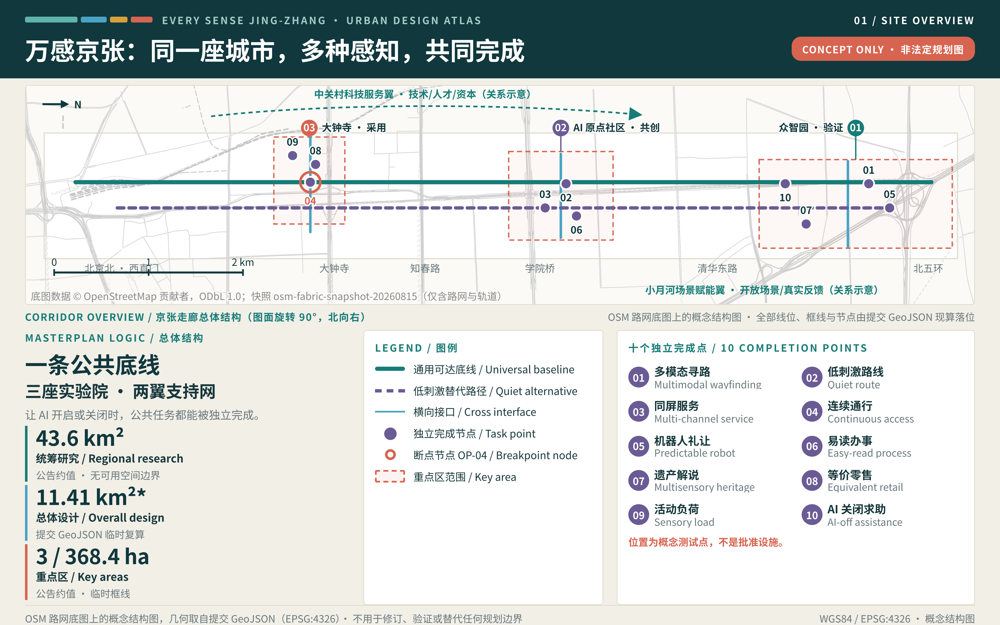
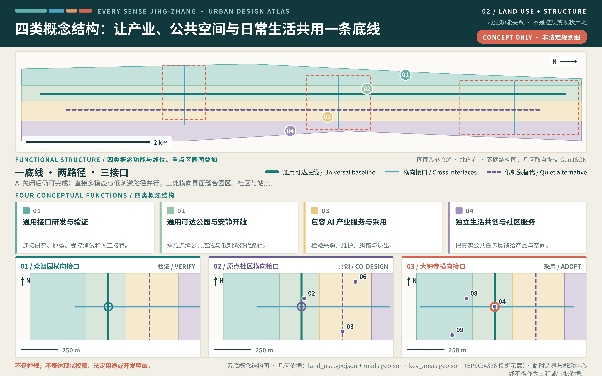
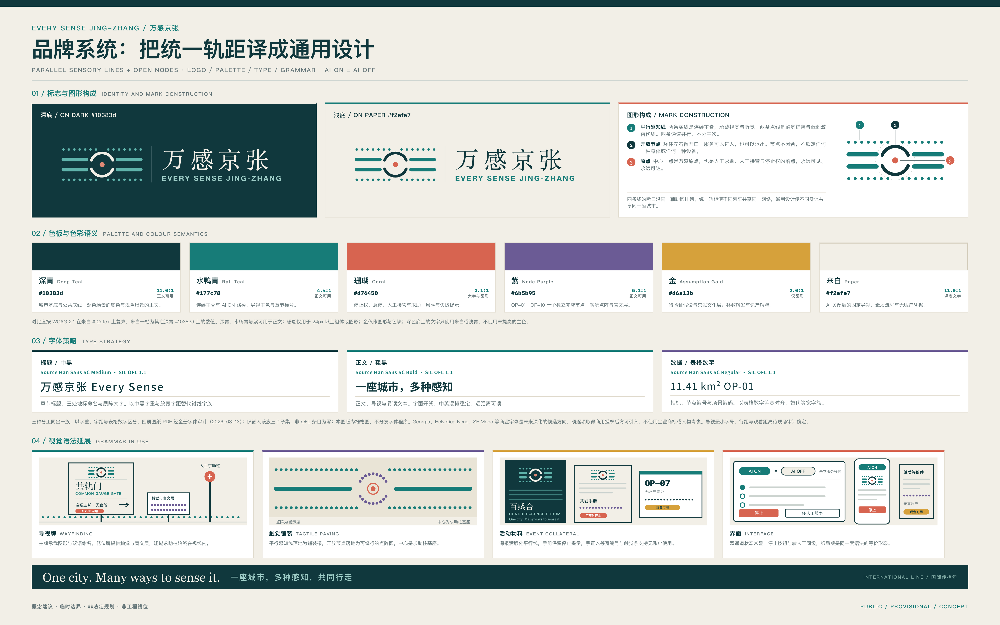
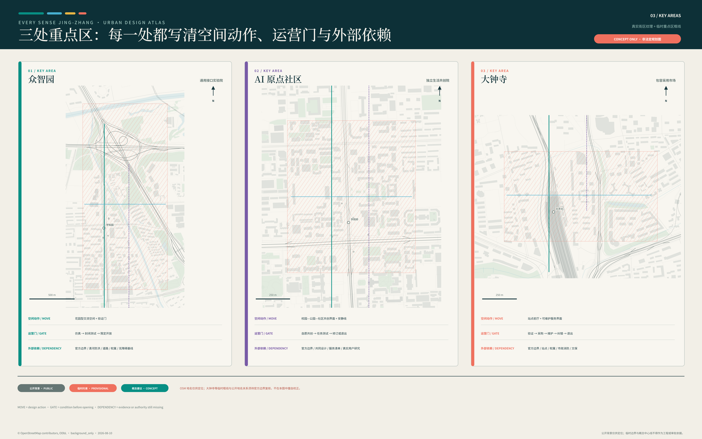
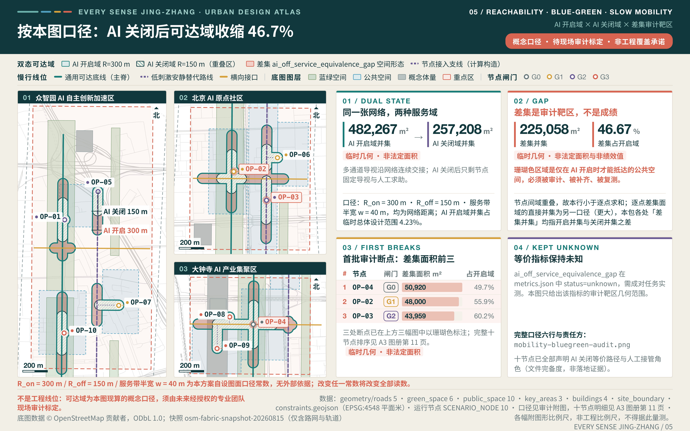
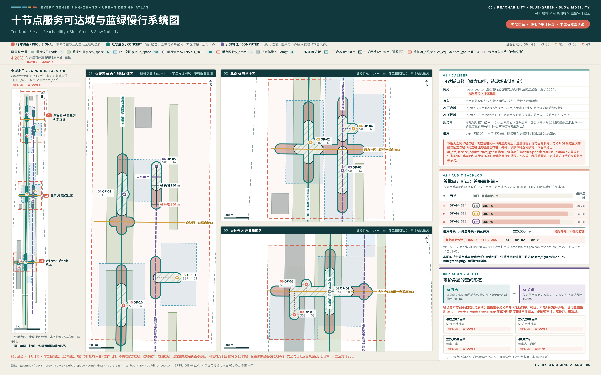
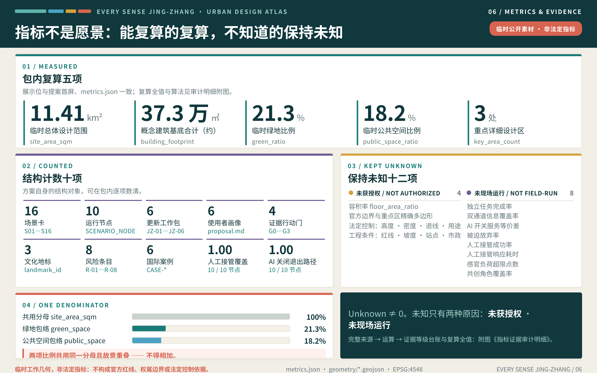
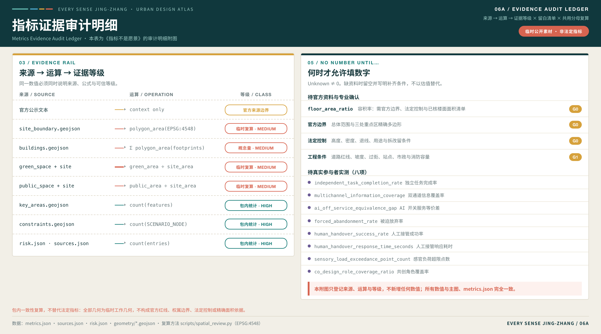

# 万感京张：每一种身体都能独立使用的 AI 城市 / EVERY SENSE JING-ZHANG

## 一页执行摘要与交付索引

本方案提出一条可以被逐项核验的城市命题：AI ON = AI OFF——城市的智能不由设备数量或自动化率定义，而由任何人能否独立理解、选择、完成并退出同一项公共服务来检验。本章是评审的一页入口：下表左列是评审需要回答的问题，中列是本方案的回答，右列是可以立即打开核验的成果位置，每一行都指向包内可直接打开的文件，而不是正文自述。各版本改动逐条登记于 `changelog.md`，本章不重述 [source:PACKAGE-STRUCTURED-EVIDENCE-INDEX]。

| 评审问题 | 本方案的回答 | 可核验成果 |
| --- | --- | --- |
| 核心命题是什么 | AI ON = AI OFF：城市的智能不由设备数量或自动化率定义，而由任何人能否独立理解、选择、完成并退出同一项服务来检验 | 「设计依据与资料清单」全章，以及 `visual/index.html` 第 16 章可亲手切换 AI 开关的交互场景 |
| 空间上如何回应 | 一条通用可达底线、三座多感官实验院、两翼支持网络、十个独立完成节点 | 「三层范围工作框架」与十个概念测试节点要素 [data:geometry/constraints.geojson#OP-02] |
| 实施从哪里开始 | G0—G3 四道证据闸门与首个 90 天零阶段证据包，未通过 G3 不进入开放空间 | 「更新项目清单、实施政策与分期计划」与 `risk.json` 中逐条的停止与恢复条件 |
| 公共利益如何保障 | 六类用户画像与包容 AI 产业赛道，服务等价与八类要素准入条件是底线而非附加 | 「AI 创新生态、人才画像与 AI+ 场景」与 `compliance_matrix.json` 的逐项响应 |
| 证据处于什么状态 | 四门自检全部通过；全部边界与面积按临时几何声明，不冒充官方红线或法定面积；现场绩效状态全包统一登记为「未获授权 · 未现场运行」 | `self_check.json` 与临时场地边界要素的性质标注 [data:geometry/site_boundary.geojson#SITE-001] |
| 结论的效力边界 | 全部空间、活动、品牌与政策均为概念建议，不为任何地块预设控制值 | 「控规官方参照台账」的“逐份访问、如实登记、不作援引”原则 |

本方案同时提交四件多模态交付物，构成听、看、读三条通道彼此等价的交付方式。多模态在此不是装饰：方案要求城市服务在任一感官通道单独可用，如果方案自身的表达只有一条通道，主张即被自己否定 [source:AGENT-TASKBOOK]。

| 交付物 | 主文件 | 内容 | 等价通道与降级路径 |
| --- | --- | --- | --- |
| 方案封面 | `assets/media/cover.webp` | 原创矢量构图：AI 开启与 AI 关闭两条完全等价的服务线并列，线上十个节点对应十个独立完成节点，三个开放节点标示三处重点区域 | `assets/media/cover.md` 提供可直接用作替代文本的完整文字等价描述 |
| 音频导览 | `assets/media/audio-guide.m4a` | 2 分 34 秒中文导览，覆盖核心命题、AI 开关服务等价、空间骨架、三区两翼分工、十节点的评价意义与边界声明；旁白为系统语音合成，无真人录音、无音乐、无实地录音 | `assets/media/audio-guide.vtt` 二十六条同源字幕与 `assets/media/audio-guide.md` 全文文字稿 |
| 多模态短片 | `assets/media/journey.mp4` | 63 秒七镜头，其中一段为第 16 章交互场景的逐帧实录：连续演示“播放引导流光”与“切换 AI 关闭”两次真实操作，切换前后节点位置与已声明覆盖读数不变（声明层口径，非现场绩效） | `assets/media/journey.vtt` 外挂字幕、`assets/media/journey.md` 分镜与文字稿、`assets/media/journey-poster.webp` 静止海报 |
| 交互场景 | `visual/index.html` 第 16 章 | Canvas 轴测场景：可切换 AI 开关、播放引导流光、逐节点展开场景卡，鼠标与键盘两种操作等价 | `visual/assets/scene-fallback.png` 静态后备视图与 `<noscript>` 降级路径，全站离线运行 |

四件交付物逐条对齐智能体任务书 `multimodal_presentation.guardrails` 的五条守则。其一，音频与视频均不自动播放，须由使用者主动触发，播放控件可键盘操作。其二，音频与视频均提供同源字幕与全文文字稿，用词与画面完全一致，不存在“音频版更完整、文字版为摘要”的层级差。其三，生成工具、制作方法、权利边界与个人数据边界逐项记录于三份说明文件，未使用第三方素材、人物肖像或未清权字体。其四，全部画面为原创矢量与数据驱动渲染，无实拍、无生成式影像，并在画面内标注“概念建议 / CONCEPT”，不作为现场证据或效果承诺。其五，交互场景与展示页完全本地打包，不加载任何远程脚本、字体、瓦片或统计代码，且静态图纸、双语 PDF 与离线 HTML 仍按要求完整提交 [source:SOURCE-REGISTRY]。

因此“听、看、读三通道等价”不只是交付形式，而是方案原则的自证：同一段内容在音频、字幕、文字稿与静态图之间可以互相替代，任何一条通道失效都不影响信息完整，这正是正文对城市服务提出的同一条要求。

本方案的可核数量全部由结构化文件逐项复算，不以正文自述为准：十二张场景卡 [metric:scenario_card_count]、六类用户画像 [metric:persona_count]、三处文化地标 [metric:landmark_count] 与十个独立完成节点 [metric:op_node_count]。

同一口径下，证据纪律由四道闸门 [metric:gate_count]、六个工作包 [metric:work_package_count]、八项风险条目 [metric:risk_item_count] 与六个国际案例 [metric:international_case_count] 承载。数量本身不构成成绩，它只说明每一项主张都能被逐条点开、逐条核对。

## 设计依据与资料清单

万感京张从一个明确判断出发：AI 城市的先进程度，不应由设备数量或自动化率定义，而应由不同身体、感官与认知方式的人，能否独立理解、选择、完成并退出同一项城市服务来检验。项目公告与智能体任务书确定了三层范围、三区两翼、三大定位、五大功能及六项任务；本方案据此把通用设计从末端补救提升为产业、空间与治理的共同主线 [source:OFFICIAL-ANNOUNCEMENT] [standard:PROJECT-OFFICIAL-ANNOUNCEMENT] [standard:PROJECT-AGENT-OPEN-CALL-TASKBOOK]。中国无障碍环境建设法为平等参与、信息交流、设施建设和维护提供法源方向，但不能替代场地审计、专业设计或项目审批 [source:ACCESSIBILITY-LAW-CN]。

场地判断采用两类证据。公告、任务书和公开登记资料支持范围名称、近似面积、设计任务与文化背景；仓库临时几何仅支持概念落位、图层拓扑、指标演示和后续复算 [source:SITE-PACKAGE]。当前尚无可用于本方案的官方精确红线、重点区精确多边形、地块权属、现状建筑普查、道路红线、市政容量、文保控制线与真实用户任务基线，这份缺口清单本身即是现状诊断的第一层结论 [depth:existing_conditions_diagnosis] [source:PROCESSED-MISSING-DATA-CHECKLIST]。因此，图中边界不是官方红线，面积不是法定或精确面积，空间动作不构成控规、工程或审批结论。组织方数据缺口不阻断内容评分，但会限定结论的精度与深化顺序，并决定后续补数与风险登记的先后 [source:BOUNDARY-SOURCE] [depth:risk_missing_data]。

2026-08-10 获取的 OSM / Overpass 快照仅为道路、轨道、建筑、绿水与站点的背景识别和解释图生成提供公开众包线索；其完整性与位置精度不稳定，不用于推定、校核或替换项目及重点区边界，也不支撑控规、红线、工程线位、文保、权属、精确面积、现场无障碍合规或实施承诺 [source:OSM-BACKGROUND-CONTEXT-20260810]。

W3C 的可感知、可操作、可理解与稳健原则用于检视数字和交互界面；WHO 的相关资料用于说明环境和服务障碍会影响参与。两者均不用于宣称场地已经达标或推导本地人群数量 [source:W3C-ACCESSIBILITY-PRINCIPLES]。六个国际案例只比较创新生态、受控测试、公共资产开放与长期运营机制，不复制其土地制度、监管权限、资本条件或建筑形态。所有外部材料只作机制证据，具体尺寸、目标值和实施主体仍待现场调查、共同设计与专业审查。



## 三层范围工作框架

三层范围对应三种设计判断。约 43.6 平方公里统筹研究范围回答“包容 AI 如何成为海淀的新产业赛道”；约 11.4 平方公里总体设计范围回答“通用设计如何成为连续城市底线”；约 368.4 公顷三处重点区域回答“研发、生活共创与市场采用如何形成闭环”。面积来自公告文本，精确边界仍待官方资料；因此本方案以关系、节点类型和运行规则组织空间，不用临时多边形制造地块级确定性。为避免同一数值出现多种写法，本包统一展示精度：一切人读位置（正文行文、图上大数字、展板读数、展示页首屏卡）一律写作总体设计范围 11.41 km²、临时绿地比例 21.3%、临时公共空间比例 18.2%、概念建筑基底约 373,402 ㎡；复算全值 11,412,825.386 ㎡、21.3097%、18.1788%、373,402.480 ㎡ 只出现在 metrics.json、指标台账表格行与公式复算说明三处，并在该处标注“复算全值”。公告口径的“约 11.4 平方公里”与复算显示值 11.41 km² 是两个不同来源的数字，前者仅在引用公告文本时保留，不得互相替换 [source:OFFICIAL-ANNOUNCEMENT] [source:PROCESSED-PROJECT-SCOPE-SUMMARY] [depth:three_level_scope_framework]。

总体骨架为“**一条通用可达底线、三座多感官实验院、两翼支持网络、十个独立完成点**”。一条底线沿京张遗址公园组织南北连续公共体验，并提供直接多模态路径与低刺激替代路径；三座实验院对应众智园的验证、AI 原点社区的共同设计和大钟寺的采用；中关村科技服务翼提供技术、人才、资本与专业服务，小月河场景赋能翼提供开放场景与真实反馈；十个完成点把场景卡变成可识别、可停留、可测试、可退出的公共界面 [depth:overall_spatial_structure]。

空间动作不追求“一条线包办全部功能”，而采用南北连续与东西缝合并行的结构：公园主脊保证任何人都能获得基本信息和非 AI 路径，三处横向界面把高校、园区、社区、站点与商业前厅接入主脊。衡量三层协同的指标不是新增建设量，而是重点区角色是否互补、服务是否具有双通道信息、AI 关闭后是否仍可完成、场景能否从验证进入采用并保留退出条件。道路、坡度、站点和建筑的精确关系待官方边界、现场审计与专业交通研究后深化。

| 层级 | 设计判断 | 空间动作 | 指标含义 | 深化条件 |
| --- | --- | --- | --- | --- |
| 统筹研究范围 | 通用设计可成为 AI 产业赛道 | 组织研发、测试、共创、采用和国际传播网络 | 观察生态角色是否完整，不虚构产值与招商量 | 补产业访谈、机构能力与区域协同证据 |
| 总体设计范围 | 城市需要 AI 开关之外的共同底线 | 建立连续主脊、安静替代线和三处横向接口 | 观察服务连续、信息冗余与退出能力 | 补官方红线、现状步行与感官环境审计 |
| 重点区域范围 | 验证、共创、采用必须各司其职 | 三座实验院分别承担技术、生活和市场角色 | 观察场景生命周期是否闭环 | 补精确边界、权属、建筑与运营主体 |

三层范围之上，还需要一张把官方名录与本方案空间动作直接对齐的对照表，避免用编号覆盖代替设计论证。任务书确定的三大定位为百年京张文化带、都市 AI 生活体验带与 AI 融合创新带；五大功能为 AI 全栈自主创新体系、世界级 AI 创新生态、AI+ 场景赋能新范式、智能化 AI 活力城市与 AI 治理全球话语权；三区两翼为众智园 AI 自主创新加速区、北京 AI 原点社区、大钟寺 AI 产业集聚区、中关村科技服务翼与小月河场景赋能翼 [source:AGENT-TASKBOOK] [source:PROCESSED-AGENT-TASK-REQUIREMENTS]。

| 三区两翼布局单元 | 任务书标注角色 | 本方案对应定位 | 本方案对应功能 | 本方案空间动作 |
| --- | --- | --- | --- | --- |
| 众智园 AI 自主创新加速区 | AI 全栈自主创新体系与 AI 治理全球话语权 | AI 融合创新带 | AI 全栈自主创新体系、AI 治理全球话语权 | 通用接口实验院：验证前厅、受控测试庭、状态可视界面与人工接管点，公开通用接口的验证状态 |
| 北京 AI 原点社区 | 世界级 AI 创新生态 | 都市 AI 生活体验带 | 世界级 AI 创新生态、AI+ 场景赋能新范式 | 独立生活共创院：共同设计室、低刺激替代线、易读服务前厅与真实反馈台 |
| 大钟寺 AI 产业集聚区 | 智能原生新业态 | 都市 AI 生活体验带 | 智能化 AI 活力城市、AI+ 场景赋能新范式 | 包容采用市场：多通道商业前厅、现金与人工替代、公开采用回执与维护退出台 |
| 中关村科技服务翼 | 要素全球化配置、中关村 IP 与资本赋能 | AI 融合创新带 | 世界级 AI 创新生态、AI 治理全球话语权 | 技术、人才、资本与专业服务接入点，承担八类要素保障的准入核验与专业复核 |
| 小月河场景赋能翼 | AI 场景赋能与智能化 AI 活力城市 | 都市 AI 生活体验带 | AI+ 场景赋能新范式、智能化 AI 活力城市 | 开放场景与真实反馈通道，承接十个独立完成点的限定开放测试与公开复盘 |
| 京张遗址公园主脊（贯穿性要素，非三区两翼单元） | 公告与任务书表述的创新链路 | 百年京张文化带 | 智能化 AI 活力城市、AI+ 场景赋能新范式 | 通用可达底线：南北连续主脊、低刺激替代线、触觉文化带与三处横向接口 |

任务书只标注了三区两翼各自的角色，未逐一指定定位与功能的归属；表中“本方案对应定位”“本方案对应功能”和空间动作均为本方案的设计判断与概念建议，不代表官方分工或既定安排。区域产业表述与要素条件的背景说明来自公开政府部门页面，仍须以资格预审公告的范围与面积表述为准 [source:BJ-THREE-AREAS-TWO-WINGS-20260403]。



## 统筹研究范围产业与未来城市研究

产业判断是把辅助技术、跨模态模型、易读公共服务、可预测具身交互、人工接管、无账户服务和 AI 关闭后的等价路径，组织为“包容 AI”生态，而不是把无障碍压缩为设施清单。生态链从高校与研发机构的算法和硬件研究出发，经众智园受控验证、AI 原点社区自愿共创和独立任务测试，在大钟寺检验采购、维护、纠错与退出，再由两翼连接专业服务、资本、场景与区域协同。土地、人才、算力、数据和场景均作为待验证的支持条件，不写成既有承诺 [source:AGENT-TASKBOOK]。传统服务方式与智能化服务并行、并覆盖出行、就医、消费、文娱与办事等高频场景的政策方向，是本方案“AI 关闭后仍有等价路径”这一产业判断的背景参照；该方向面向全国、阶段性目标已到期，不写成 2026 年仍在执行的法定义务或本地落实事实 [standard:ELDERLY-SMART-TECH-PLAN-2020-45] [source:ELDERLY-SMART-TECH-PLAN-CN]。

六个案例提供互补机制：Cornell Tech 连接真实课题、教学、原型和创业支持；MIT Kendall Square 说明混合功能、开放空间与长期社区协作的价值 [source:CASE-MIT-KENDALL]；NTU CETRAN 展示仿真、封闭测试与限定开放的分级路径；Barcelona Urban Lab 将公共问题与可控城市资产匹配；Marineterrein 用临时使用证据反哺后续规划；JTC LaunchPad 将可变空间、原型、投资支持与展示活动共置 [source:CASE-JTC-LAUNCHPAD]。方案只借鉴这些机制，不声称海淀拥有相同土地权力、监管许可、投资条件或项目绩效 [source:CASE-CORNELL-TECH] [source:CASE-CETRAN] [metric:international_case_count]。

品牌采用 **EVERY SENSE JING-ZHANG**，国际传播句为 **One city. Many ways to sense it.**，中文表达为“**一座城市，多种感知，共同行走**”。视觉语法从铁路“统一轨距”提炼为原创的平行感知线与开放节点：统一轨距使不同列车共享网络，通用设计使不同身体共享城市。标志、导视与活动视觉不借用企业商标、人物肖像或未清权字体；文化比喻也不替代京张历史研究。

品牌系统按四项展开，图形承载以 `assets/logo.svg` 与品牌系统图为准，均为概念建议。**配色体系**沿用六色板并规定语义：深青 `#10383d` 为铁轨与夜行底色，用于深色底与主文字；水鸭青 `#177c78` 表示通用可达底线与“可用”状态；珊瑚 `#d76450` 只用于人工接管、急停与求助等需要人介入的状态；紫 `#6b5b95` 标记共同设计与参与者证据；金 `#d6a13b` 标记文化与遗产层；米白 `#f2efe7` 为基底与留白，控制眩光并保证对比。颜色不得单独承载信息，任何以颜色区分的状态必须同时具备形状、文字或触觉冗余，在色觉差异与低照度条件下仍可识别。**字体策略**采用衬线标题、无衬线正文与等宽数据的双语分工：中西文衬线体承担标题与文化叙事，中西文无衬线体承担正文、导视与界面，等宽体承担指标、编号与代码；双语并置以基线对齐和等高比例控制，中文不作人为压缩，西文不使用全大写长句，所有字体逐项核验授权，未清权字体不进入公开成果。**延展规则**以平行感知线表示“同一目的地的多种通道”，以开放节点表示“可停留、可求助、可退出”：导视上以浮雕与高对比印刷双载，界面上作为布局网格与状态条而非装饰性动效，印刷物上作为版心与分栏依据；线条不得改造为企业商标形态或人物肖像。**应用场景**覆盖站点导视、触觉铺装、活动视觉与国际传播物料四类，其中活动物料须可撤除、可维修，传播物料须同时提供易读与高对比版本。具体尺寸、材质、字号与对比度参数待现场共创和专业审查后确定。



产业成效不以虚构企业数或投资额衡量，而看生态是否具备研发、受控测试、真实共创、独立任务评估、采用、维护和退出七个环节；看测试对象是否包含至少六类使用和维护角色；看每项场景是否保留非 AI 等价路径。区域产业数据、真实机构意愿、算力和资金条件尚未完成核验，后续需以公开资料、访谈和专业团队评估补齐，任何合作与活动均为概念建议。

### 区域协同：可交换什么，而不是可宣布什么

包容 AI 生态不可能在一条创新带内自给自足。本方案把区域协同定义为“方法学与场景的双向交换”：本方案向外输出可复用的无障碍与服务等价测试方法学、独立任务测试脚本、AI 开启与关闭成对测试规程和公共空间组件库；外部节点向内输出各自领域的真实问题与验证场景。交换以公开方法和匿名化结果为单位，不以数据归集、人员调配或资金安排为前提。

五类对象的可能角色分别是：中关村 AI 北纬社区为海淀北部面向青年 AI 创业者与初创团队的创新社区，未来科学城为能源、医药等领域研发主体集中的科学城，怀柔科学城为大科学装置与基础研究集聚区，北京经开区为公开报道中聚焦具身智能与智能制造方向的创新街区之一，京津冀为跨区域协同范围。下表把每一类的协同关系拆成五项：对方输入什么、本方案输出什么、卡在哪一道授权门、责任方是谁、以及未获授权时按什么规则退出。最后一项是本表与一般合作名单的根本区别——名单只写关系成立时会发生什么，本表同时写关系不成立时会发生什么，因此它不需要任何一方先点头就能被核对 [source:AGENT-TASKBOOK]。

| 协同对象 | 期望对方输入 | 本方案输出 | 授权门与核验条件 | 责任方（均待确认） | 未获授权时的退出规则 |
| --- | --- | --- | --- | --- | --- |
| 中关村 AI 北纬社区 | 早期产品的真实可用性问题；愿意参与成对测试的初创团队 | 服务等价测试方法学、独立任务测试脚本、组件库借用与培训 | G0 · 机构书面意愿、参与伦理审查、场地与安全条件 | 未来经授权的社区运营方与本方案共创主持人员 | 方法学以匿名化公开版本单向发布，任何一方不得以对方名义表述合作；不开展任何涉及参与者的联合测试，已借出组件限期收回 |
| 未来科学城 | 高门槛专业界面的操作障碍案例与受控验证场景 | 面向复杂设备与专业界面的多感官交互评测方法 | G0 · 主体书面意愿、保密与数据边界界定、责任主体确认 | 未来经授权的研发主体与本方案无障碍评测人员 | 评测方法保留在本方案侧，不接收任何未经脱敏的案例材料；已接收材料按约定期限销毁并出具销毁回执 |
| 怀柔科学城 | 基础研究成果的早期转化题目与受控实验场景 | 长时序感官负荷记录与人工接管留痕方法 | G0 · 合作机制、成果权属约定、安全与准入条件 | 未来经授权的科研机构与本方案数据治理人员 | 不进入任何受控实验场景，转化题目不得单方公开；记录方法以不含机构标识的公开方法学形式发布 |
| 北京经开区 | 机器人与智能终端的量产前问题与制造侧验证场景 | 具身智能礼让与可预测交互的公共空间测试规程 | G1 · 场地授权、安全审批、保险与责任主体确认 | 未来经授权的场地运营方与本方案技术安全人员 | 测试规程停留在文本与仿真，不落地为任何实机测试；不在公共空间安装任何构件，已安装的可撤除构件当轮撤除 |
| 京津冀 | 不同城市规模与人口结构下的服务缺口与验证场景 | 可复用的服务等价与无障碍测试模板、公开复盘格式 | G0 · 跨区域数据与许可、运营责任与费用边界界定 | 未来经授权的各地承接主体与本方案方法学维护人员 | 模板按建议许可条件单向公开，任何一方不得表述为已建立跨区域协作；不承接任何跨区域数据传输 |

授权门一栏的编号沿用本方案的四道闸门，不新增流程：涉及资料、许可与数据边界的四类协同卡在 G0，唯有北京经开区一类因涉及实机测试与场地构件而卡在 G1。责任方一栏全部标注为待确认，本方案不代任何一方指定负责人；退出规则一栏的动作全部是本方案单方即可执行的动作，不需要对方配合，也不以对方的沉默作为默许 [depth:phasing_implementation]。

上表的协同对象、角色与交换内容全部是概念建议与待验证事项，本方案未与任何机构达成合作、协议或意向，也不代表任何一方已同意参与；城市级“一核多点”布局与首批人工智能创新街区信息仅作背景说明，其范围、面积与政策表述须在正式使用前回到发文机关的政策原文复核 [source:BJ-AI-INNOVATION-DISTRICTS-20260121]。协同关系只有在通过对应授权门、并取得书面授权后才可能成立。

### 八类要素保障：包容 AI 赛道的准入条件

要素保障回答的问题不是“能给多少”，而是“达到什么条件才允许进入包容 AI 赛道”。八类要素逐项给出准入条件、待核验事项与责任专业，并与 G0—G3 四道闸门衔接：土地、空间、数据三类在 G0 资料与许可闸门前完成边界确认；产业、人才、场景三类在 G1 可逆原型与 G2 封闭成对测试期间形成参与与停止证据；资金与算力条件在 G3 独立复核时与维护责任一并核对。任何一项条件不成立，对应赛道动作暂停或降级，不以“先落地再补齐”推进 [source:HAIDIAN-INDUSTRIAL-SYSTEM-20260302]。

| 要素 | 包容 AI 赛道的准入条件 | 待核验事项 | 责任专业 |
| --- | --- | --- | --- |
| 土地 | 只在权属与用途条件已明确的地块提出可逆动作，不以临时几何推定供地 | 官方地块、权属、用途管制与更新政策适用性 | 规划、国土空间与法务 |
| 空间 | 任何测试空间同时具备连续可达路径、低刺激替代与人工求助位 | 现场无障碍审计、声光基线、消防与疏散条件 | 无障碍、建筑与场地运营 |
| 产业 | 入驻主体书面承诺服务等价与退出路径，不以设备数量或自动化率作为门槛 | 机构真实意愿、履约能力与责任主体 | 产业研究与运营管理 |
| 资金 | 资助条款包含可撤回同意、维护责任与失败样本公开义务 | 资金来源、合规条件、预算口径与持续期 | 财务与法务 |
| 人才 | 共同设计与测试岗位覆盖残障者、神经多样参与者、维护者与运营者 | 招募伦理、合理便利成本、劳务关系与保险 | 伦理审查、人力与共创主持 |
| 算力 | 端侧与云端资源支持 AI 关闭后的降级运行，不以算力规模替代可用性 | 容量、能耗、网络安全与故障切换条件 | 信息基础设施与安全 |
| 数据 | 默认不采集身份、健康、障碍类别、位置与行为数据 | 数据分级、保留期、跨主体共享与审计机制 | 数据治理与隐私 |
| 场景 | 场景开放同时绑定停止条件、恢复证据与可找到的责任主体 | 许可、保险、事故处置与申诉链 | 场景运营与安全 |

## 总体设计范围城市更新与控规深度城市设计

总体设计的核心判断是：京张遗址公园不只是展示 AI 的走廊，而应成为所有人都能使用的城市公共底线。方案以连续南北主脊连接三处重点区，同时设置直接多模态路线与低刺激替代路线；在众智园、AI 原点社区和大钟寺形成三处概念性东西接口，将高校、园区、社区、轨道站点和商业前厅接入公共脊。临时用地、道路、公共空间和建筑图层用于表达关系，不构成批准的用地、道路或建设边界；城市设计在此只承担落实规划、指导后续建筑设计与塑造风貌的概念性职责 [data:geometry/land_use.geojson#LU-001] [standard:MOHURD-URBAN-DESIGN-MEASURES]。

更新动作采用“先审计、再可逆试验、后专业深化”。连续路径优先识别信息断点、缺少休息与人工求助的位置、单一手机或账户依赖、感官负荷突然变化和跨街联系不足；三处接口布置可移动的多通道导视、安静停靠、可调高度交互台、人工接管灯和无账户服务台。建筑层面只提出首层公共界面、共享测试空间与可逆适配方向，不判断具体建筑保留、改造、拆除或新建。

总体层指标解释设计质量：独立完成率反映一名参与者能否在合理便利下完成任务 [metric:independent_task_completion_rate]；双通道信息冗余率反映关键信息是否避免单一感官失效 [metric:multichannel_information_coverage]；AI 开关服务等价差反映自动化关闭后基本服务损失 [metric:ai_off_service_equivalence_gap]；被迫放弃率反映流程是否制造隐性排斥 [metric:forced_abandonment_rate]。现阶段没有现场基线和目标值，所有结果均标记待测。精确坡度、过街、红线、站点接驳、建筑强度、高度、退线、消防和市政容量，须在官方数据和专业勘察到位后确定 [depth:development_intensity_controls]。

## 重点区域详细设计

三处重点区域组成“验证—共创—采用”回路，而不是复制三座同质园区。众智园定位为 **通用接口实验院**：以花园型交流空间和清河方向公共界面承载辅助技术、跨模态模型、服务机器人及仿真—封闭—限定开放测试。AI 原点社区定位为 **独立生活共创院**：高校、园区、社区与自愿参与者共同定义问题、制作原型、进行独立任务测试并决定修改或退出。大钟寺定位为 **包容采用市场**：在站点周边、商业前厅和公共空间检验无障碍零售、商务、文娱与人才服务是否可采购、可维护、可纠错 [source:AGENT-TASKBOOK] [depth:three_key_area_detailed_design]。

空间动作与角色严格匹配。众智园设置验证门槛、状态可视界面和人工接管点，避免未成熟技术直接进入开放空间；原点社区设置低刺激路径、共同设计室、易读服务前厅和真实反馈台，任何参与都须自愿、可理解并可退出；大钟寺设置多通道消费界面、现金与人工替代、公开采用回执和维护入口。三处通过公园主脊和两翼支持相连，形成技术问题向生活任务转译、生活证据向产品和运营反馈的循环。

| 重点片区 | 设计角色 | 概念性空间动作 | 场景与运营 | 深化门槛 |
| --- | --- | --- | --- | --- |
| 众智园 AI 自主创新加速区 | 通用接口实验院 | 验证前厅、受控测试庭、状态信号、人工接管点 | 跨模态导航、服务机器人、接口稳健性测试 | 清河、防洪、道路、权属、安全与精确边界复核 [data:geometry/key_areas.geojson#PROV-KEY-001] |
| 北京 AI 原点社区 | 独立生活共创院 | 安静替代线、易读窗口、共创室、任务测试点 | 办事、学习、文化、出行与活动共创 | 真实参与者招募、伦理与隐私流程、校地关系复核 [data:geometry/key_areas.geojson#PROV-KEY-002] |
| 大钟寺 AI 产业聚集区 | 包容采用市场 | 站点四象限概念接口、商业前厅、维护与退出台 | 无障碍零售、支付替代、国际访客与反馈 | 站点、路口、权属、市政和商业运营条件复核；另加东西向 AI 关闭态连续通道的存在性核验，该项由 OP-04 配对试点复演查出并列为 JZ-01 审计覆盖本片区的前置 [data:geometry/key_areas.geojson#PROV-KEY-003] [data:geometry/constraints.geojson#OP-04] |

三处片区面积只采用公告近似值进行范围说明，重点区数量与其临时多边形一一对应 [metric:key_area_count] [source:KEY-AREA-SOURCE]；临时多边形不支持地块级建筑规模、拆改留、道路红线或工程可行性判断。成效指标分别关注验证通过条件是否清楚、共创参与是否具有代表性和合理便利、采用场景是否有责任主体与退出路径。精确图纸和指标必须等待官方边界、现状调查、文保与市政条件，并由规划、建筑、交通、无障碍和运营专业团队共同深化。



## AI 创新生态、人才画像与 AI+ 场景

六类画像用于组织需求与测试，不是诊断标签、商业分群或已经完成的用户研究 [metric:persona_count]。每类画像都对应空间动作、设计提出的服务等价目标和隐私边界；真实共同设计须由参与者自愿加入，获得合理便利，理解数据用途并随时退出，共同设计席位是否覆盖必需角色由角色覆盖率衡量而非由人数衡量 [metric:co_design_role_coverage_ratio]。中国无障碍环境建设法支持平等参与与无障碍信息交流的方向，但不能替代具体产品、建筑或交通的专业符合性评价，也不把本方案的“等价服务”概念自动转化为具体法定义务 [source:ACCESSIBILITY-LAW-CN]。该法关于现场指导与人工办理的要求，严格限于其条文列举的医疗、社会保障、金融、生活缴费等公共服务事项；六类画像与合规矩阵按此边界组织，方案其余的人工兜底均标记为概念设计建议 [standard:BARRIER-FREE-ENVIRONMENT-LAW]。

| 用户画像 | 典型任务 | 空间与服务响应 | 人工与隐私边界 |
| --- | --- | --- | --- |
| 视觉信息获取方式不同的人 | 定位、识路、读状态、理解文化内容 | 触觉、语音、高对比图形与易读文字；连续校正点 | 不依赖人脸、持续定位或单一手机账户 |
| 听觉与语言沟通方式不同的人 | 咨询、参加活动、接收警示、跨语交流 | 手语、字幕、文字、语音和可视状态同步可选 | 自动翻译可纠错，并保留人工解释 |
| 行动方式不同的人 | 轮椅、婴儿车、临时受伤或老年步态连续通行 | 概念性缝合口、休息点、可调高度界面 | 坡度、红线和工程做法待测，不以导航替代物理可达 |
| 认知与感官处理方式不同的人 | 分步办事、避开刺激、预知变化、恢复注意力 | 易读指令、安静路线、感官负荷提示、可撤回步骤 | 不病理化差异，不用画像做推荐或风险评分 |
| 跨语言与低数字素养的到访者 | 问路、办事、消费与参加活动时跨越语言、文字与数字门槛 | 图示化流程、易读中文与外文并置、人工窗口与无账户路径 | 不以语言能力或数字素养作为获得基本服务的前提，不采集国籍与身份信息 |
| 服务提供与维护者 | 观察状态、接管、维修、复盘和终止服务 | 状态灯、人工台、维修入口、事故回执 | 责任可找到，维护者不以监控替代现场判断 |

十二个场景共同采用“需求提出—共同设计—仿真—封闭测试—限定开放—独立任务测试—人工复核—采用或退出”的生命周期 [metric:scenario_card_count]。S01、S05、S08 分别形成跨模态导航、具身智能通用交互和包容型消费终端三类产业测试验证方向；后补的 S11、S12 不新增空间设施，只复用既有节点，检验应急告知与跨语言办事这两类最容易在自动化环境中被漏掉的任务。任何测试都不写成已获批准运营，不使用非公开个人数据，也不把未成熟技术包装为全面部署 [source:W3C-ACCESSIBILITY-PRINCIPLES]。

| 场景卡 | 空间载体 | 设计动作 | 衡量与深化条件 |
| --- | --- | --- | --- |
| S01 多模态无障碍寻路 | 全线慢行与站点接驳 | 触觉、声音、图形、易读文字至少双通道 | 测独立到达与纠错；补现场路径和参与者测试 |
| S02 低刺激安静路线与安静时段 | 原点社区与遗址公园 | 预告光声变化，提供绕行、停留和恢复点 | 测感官负荷与放弃；补声光环境基线 [metric:sensory_load_exceedance_point_count] |
| S03 手语、字幕、语音、易读文本同屏服务 | 公共服务节点 | 多种输出可选择、可纠错、可转人工 | 测理解和接管；补真实语言及手语用户评估 |
| S04 轮椅与婴儿车连续通行辅助 | 横向接口与站点周边 | 用任务测试找断点，数字导航不替代物理修复 | 测连续通过；补坡度、路缘和红线测绘 |
| S05 服务机器人礼让与可预测交互 | 众智园受控测试段 | 显示意图、速度状态、急停与人工接管 | 测预测正确与接管；补安全和审批条件 |
| S06 认知友好办事导航 | 原点社区服务前厅 | 流程分步、允许返回，保留纸质和人工路径 | 测独立完成与错误恢复；补真实流程 |
| S07 触觉、声音、视觉三通道遗产解说 | 京张文化节点 | 历史可追溯，内容可选、可停、可反馈 | 测理解与偏好；补史料、文保和版权核验 |
| S08 无障碍智能零售与支付替代路径 | 大钟寺 | 现金、人工、无账户继续可用，错误可恢复 | 测购买完成和退出；补商户及支付合规条件 |
| S09 大型活动感官负荷调节 | 广场与活动路线 | 分区分时、主动告知、安静空间和退出路线 | 测负荷、拥挤和求助；补活动安全方案 |
| S10 AI 关闭后的等价求助与疏散 | 全线 | 断网、断电或拒绝授权时仍可识路求助 | 测服务等价差；补消防、应急和运营联动 |
| S11 多感官应急演练与信息回执 | 复用 OP-09 [data:geometry/constraints.geojson#OP-09] 与 OP-10 [data:geometry/constraints.geojson#OP-10]，不新增空间设施 | 演练同时发出声音、灯光、震动与文字告知，结束后给出可带走的纸质回执 | 测告知到达与回执可得；补应急预案、消防审批与演练授权 |
| S12 跨语言与跨文化到访者独立办事 | 复用 OP-03 [data:geometry/constraints.geojson#OP-03] 与 OP-07 [data:geometry/constraints.geojson#OP-07]，不新增空间设施 | 图示化流程与易读中外文并置，机器翻译可纠错、可转人工，不要求本地账户 | 测独立办结与纠错；补母语校订、手语与多语使用者评估 |

三张代表场景在进入测试前即绑定风险、责任和恢复证据，避免“有场景、无刹车”。S01 由无障碍与交通专业人员负责，关联 R-03、R-06、R-08；若连续路径、替代通道或参与便利缺失即停止，只有完成现场审计、参与者复核和可逆修正后才恢复。S05 由技术安全与场地运营人员负责，关联 R-02、R-04、R-07；若意图不可见、急停或人工接管失效即停止，只有封闭测试记录、故障绕行和维护责任闭合后才恢复。S08 由服务运营、支付合规和参与者代表共同复核，关联 R-01、R-03、R-04、R-08；若现金、人工或无账户替代路径不可用，或数据用途无法解释即停止，只有等价路径、数据处置和申诉链经 G3 独立复核后才恢复。三者分别由 OP-01 到达校正点 [data:geometry/constraints.geojson#OP-01]、OP-05 人工急停点 [data:geometry/constraints.geojson#OP-05] 与 OP-08 无账户退出点 [data:geometry/constraints.geojson#OP-08] 承接；其余 OP-02—OP-10 与 S02—S10 同序绑定，S11、S12 复用既有节点而不新增，节点总数与位置保持不变 [metric:op_node_count]。全部节点均已声明 AI 关闭后的等价路径与人工接管角色，两项覆盖率按文件完整性口径登记，不代表已经建成、配员或经过实测 [metric:scenario_exit_path_coverage] [metric:scenario_human_review_coverage]。

## 服务等价基准 SEB v0.2

前面各章把判据分散在场景卡、节点属性、指标口径、风险条目与开放层级里，读者要拼出“怎样才算做到了”，需要在五处之间来回翻。本章把这些判据封装成一件独立的、可被任何城市取走就用的东西：**服务等价基准（Service Equivalence Baseline，SEB）v0.2**。它不是本方案的附录，而是本方案希望留下的公共产品——海淀能否成为包容 AI 的策源地，最终取决于别的城市是否愿意用海淀写下的判据来检验自己 [source:AGENT-TASKBOOK] [metric:op_node_count]。

基准由四个组件构成。每个组件在本包内都有对应的机器可读位置，复用者不需要重新发明，只需要接受同一套约束。

| 基准组件 | 规范内容 | 本包内的机器可读位置 | 复用时必须一并接受的约束 |
| --- | --- | --- | --- |
| 节点 schema | 每个服务点位必须声明五个字段：`ai_off_path` 为 AI 关闭后的等价路径，`human_handoff` 为人工接管角色，`gate_id` 为当前所处闸门，`operating_mode` 为运行方式，`responsible_role` 为责任专业；缺任一字段的点位不得计入服务覆盖 | `geometry/constraints.geojson` 中十个点位要素的属性表 [data:geometry/constraints.geojson#OP-04] | 五个字段为必填而非可选；`ai_off_path` 不得填写“引导至线上办理”一类仍依赖同一系统的路径，拒绝依据自 v0.2 起以机器可读的 `constraint_machine_rule` 写入基准，不再由校验实现自行解释 |
| 评分口径 | 七项包容性指标各自的分子与分母定义，覆盖独立完成率、双通道信息冗余率、AI 开关服务等价差、被迫放弃率、人工接管成功率与耗时、感官负荷超限点、共同设计角色组覆盖率 | `metrics.json` 中七项指标的 `numerator_definition` 与 `denominator_definition` 字段 [metric:ai_off_service_equivalence_gap] | **分母不得删除失败样本**：撤回、技术故障与非完成原因必须与完成数一并报告，删除任何一类即视为该次测量作废；适用范围自 v0.2 起由 `applies_to` 明文界定，适用五项参与者任务型指标，两项文件完整性型覆盖率连同理由一并排除 |
| 等级定义 | L0 资料与许可、L1 可逆原型、L2 封闭成对测试、L3 限定开放、L4 采用与常态运行共五级，每级绑定准入条件、停止条件、恢复证据与责任主体 | 本文「更新项目清单、实施政策与分期计划」中的开放机制表 [depth:phasing_implementation] | 等级以“场景 × 点位”为单位，不以工作包或行政区为单位；允许降级，且降级不附加额外程序门槛；每级所处闸门自 v0.2 起以结构化的 `gate_binding` 声明，L4 与 G3 的关系由基准明文规定而非由工具推断 |
| 判定规则 | R-01 至 R-08 八项风险条目各自的停止条件与恢复证据，构成“什么时候必须停、拿什么才能重开”的完整规则集 | `risk.json` 中八条 `stop_condition` 与 `resume_condition` [metric:risk_item_count] | 停止条件触发即停止，不以“限期整改”替代停止；恢复须提交证据而不是承诺 |

**产品化声明。** 基准版本为 v0.2（规范文件中 `version` 为 `0.2.0`），机器可读规范位于 `visual/assets/seb-spec.json`，内容与本章表格逐项一致，并含 `version`、`license`、`provenance` 三个元字段，其中 `provenance` 记有 v0.1 与 v0.2 两次发布的来源与对应回执编号。开源许可建议采用 CC BY-SA 4.0：相同方式共享意味着任何城市改进了判据，也必须以同样条件把改进公开，这与本包空间数据所依托的 ODbL 生态在“改进回流”一点上取向一致。版本治理方式为：任何一次变更必须同时提交失败样本登记与受影响指标的复算说明，只改条文不交证据的修订不予合并；版本号仅在判据本身变化时递增，措辞与译文修订不递增。**基准的托管主体、发布渠道与许可的最终确定均待授权主体确认；本方案不代表任何机构发布该基准，也不声称其已被任何一方采用** [source:SOURCE-REGISTRY]。

**v0.2：治理回路的第一次转动。** 上面这套版本治理不是写给别人看的条款，它已经在本方案内部转过一圈。下一章的桌面配对推演在把判据写成可执行代码时撞到三处缺口，三处都被登记进变更回执而不是就地绕过，v0.2 随后按“变更须附失败样本登记与复算说明”的要求带着证据交付。三处闭合各一句：`ai_off_path` 的拒绝依据由校验工具的私有词表升格为基准的 `constraint_machine_rule`，并写明词表可随失败样本扩充、扩充即版本递增；等级定义的闸门字段由自由文本改为结构化的 `gate_binding`，L4 与 G3 的关系写进条文，正则抽取与工具推断一并取消；分母完整性规则增加 `applies_to`，适用的五项参与者任务型指标与排除的三项枚举型指标逐项列明，两项文件完整性型覆盖率连同排除理由一并写下。闭合第一条时还查出一条 v0.1 未曾登记的同类问题——人工接管的角色词表同样是工具私有词表——已一并升格并在回执中登记。本次为 schema 层变更，零指标数值受影响，完整回执编号为 CR-2026-08-12-002 [source:W3C-ACCESSIBILITY-PRINCIPLES]。这一段能证明的不是判据写得好，而是版本治理是一个已经转动过的机制而不是一句承诺；基准的性质不因此改变，它仍是概念建议，托管主体、发布渠道与许可仍待授权主体确认 [source:SOURCE-REGISTRY]。

**复用场景。** 基准的价值只有在离开本项目之后才能被检验。中关村 AI 北纬社区的初创团队可以直接取用节点 schema 与成对测试规程，为早期产品做一次“AI 关闭后仍可用”的自测，不需要等待任何平台或授权；未来科学城的能源与医药专业设备界面可以只取评分口径中的双通道冗余率与人工接管耗时两项，把“专业设备只给专业人员用”这一默认前提放到可测量的位置上；任何一座城市的政务大厅可以只取 L0 至 L2 三级，在不改造任何空间的前提下先完成一轮成对测试，得到本厅的服务等价差读数。这是区域协同章“输出可复用的测试方法学”一句的实物形态：不是一份意向，而是一个文件加一张表 [source:BJ-AI-INNOVATION-DISTRICTS-20260121]。

**机制意义。** 把判据做成基准，改变了三件事的性质。治理话语权不来自宣布自己是标准制定者，而来自别人在用你的标准检验自己，因此本方案把“AI 治理全球话语权”这项功能落在一份可被引用的判据上，而不是落在会议或宣言上。国际传播的对象随之从口号变成引用：一个能被外部复算的服务等价差读数，比任何形容词都更容易跨越语言。长期运营的成本结构同样改变——基准的版本迭代不需要许可、预算或场地，只需要有人持续登记失败样本，这使得万感周之外的日常也能产生可累积的公共资产 [source:W3C-ACCESSIBILITY-PRINCIPLES]。基准本身不构成合规结论、认证资格或专业符合性评价，它只是把“怎样才算做到了”写成任何人都能逐项核对的形式。

## OP-01 桌面配对试点档案（方法学演示）

**演示性质声明。现场状态：未获授权 · 未现场运行。** 本章没有真实参与者，没有现场测量，也没有任何一次运行记录。这里做的是一次桌面配对推演：把上一章的服务等价基准施加在文本样例上，看判据能不能被逐条执行、会在哪里失效。因此本章不产生任何绩效指标数值，七项包容性指标在指标文件中保持待实测状态，任何一项都不得依据本章填写 [metric:independent_task_completion_rate] [metric:ai_off_service_equivalence_gap]。本章能够证明的是“制度可执行”——判据写得足够具体，机器可以判、第三方可以复核；它不能证明“结果已达标”，后者需要伦理化的真实测试，属于取得授权之后的事 [depth:phasing_implementation]。把这两件事分开陈述，是本方案对自身适用分母纪律：不能一边要求别人不得删除失败样本，一边把一次推演说成一次试点。

**推演对象与工具。** 推演以场景 S01 多模态无障碍寻路在 OP-01 多模态到达校正点上的一次完整闸门过程为对象 [data:geometry/constraints.geojson#OP-01]。三件工具随包提交，均为零依赖的离线文件：`visual/assets/seb-tabletop-run.js` 是校验器，读取基准与样例并逐条判定；`visual/assets/seb-tabletop-fixtures.json` 是十二条样例，正例五条、反例七条，每条自带预期判定与双语说明；`visual/assets/seb-change-receipt-sample.json` 是变更回执的格式与两条回执。在 `visual/assets` 目录下执行 `node seb-tabletop-run.js` 可复现本章全部结论，退出码为零表示十二条样例的判定与预期完全一致；校验器在判定之前先校验基准版本与样例声明是否匹配，不匹配即以退出码二拒绝运行而不作任何判定 [source:PACKAGE-STRUCTURED-EVIDENCE-INDEX]。样例不含任何计数或比例，分母只以“哪些类别被声明”的方式表达，因此工具无法、也不会生成读数 [metric:op_node_count]。

推演按 G0、G1、G2 三步进行。每一步的准入条件都不是为本章新写的，而是逐字取自开放机制表中 L0、L1、L2 三行与节点的既有属性；工具在第一步之前先把 L2 样例的五个必填字段与几何文件中 OP-01 的属性逐字比对，比对通过才继续，以免推演落在一个与提交数据不一致的影子节点上 [depth:phasing_implementation] [data:geometry/constraints.geojson#OP-01]。

| 推演步骤 | 准入条件的来源 | 桌面推演做了什么 | 样例判定 | 本步不产生什么 |
| --- | --- | --- | --- | --- |
| G0 资料与许可（等级 L0） | 开放机制表 L0 行的准入、停止、恢复与责任四项 | 以 OP-01 的五个必填字段与 L0 四项绑定条件组成样例 TT-P1，检查字段完整性与等级闸门一致性 | 通过 | 不产生测量，不招募任何人 |
| G1 可逆原型（等级 L1） | 开放机制表 L1 行的四项，节点闸门随之为 G1 | 样例 TT-P2 把运行方式改写为可撤除构件的安装撤除演练，并附维护卡与故障绕行方案 | 通过 | 不产生测量，不安装任何真实构件 |
| G2 封闭成对测试（等级 L2） | 开放机制表 L2 行的四项，成对协议与合理便利事先约定 | 样例 TT-P3 申报成对测试，分母同时声明完成、撤回、技术故障与其他非完成原因四类 | 通过 | 不产生完成率、等价差或任何读数 |

比对结果是五个必填字段逐字一致，说明推演使用的节点与提交的几何数据是同一个 [data:geometry/constraints.geojson#OP-01]。这一步之所以必要，是因为桌面推演最容易出现的自欺方式，就是在纸上重新写一个比现实更整齐的节点，然后在它上面证明制度可行。

**推演中发现的问题。** 三条，都是在把判据写成可执行代码的过程中真实撞到的；三条均已登记，并已在基准 v0.2 中闭合。

第一条最重要：`ai_off_path` 的约束在基准里只写成自然语言例句，无法被机器执行。反例 TT-N2 把该字段填成“引导至线上办理，在小程序内完成同一事项”——字段不缺、语法合法、人工快速审阅极易放过，但 AI 关闭之后使用者仍被要求上线，等价性并不成立。处置是把约束补齐为可执行形式，而不是放宽它：校验器先以显式的同一系统词表实现拒绝规则，并在代码注释中声明该词表是工具的解释而非基准条文；同时登记 v0.2 待办，建议在节点 schema 中增加机器可读的拒绝依据字段。该待办已在 v0.2 兑现——词表升格为基准的 `constraint_machine_rule`，校验器改为读取基准条文，代码中不再保留任何私有词表；闭合过程中还查出人工接管的角色词表属同一类问题，一并升格。与之配套的放宽字段约束的意见始终未被采纳，理由写在本章末的变更回执里 [metric:scenario_exit_path_coverage]。

第二条：等级定义中的闸门字段是自由文本，工具须以正则抽取闸门编号才能与节点属性比对，其中 L4 对应 G3 属工具推断，基准并未定义。第三条：分母完整性规则未界定适用范围，工具按分母文字中是否出现有效样本或成对测试样本，推导它只适用于参与者任务型指标，这同样是工具的解释而非基准的规定。两条都已作为工具级问题写入变更回执的失败样本登记，并已在 v0.2 由基准本身回答：闸门字段改为结构化 `gate_binding`，正则随之删除；分母完整性规则增加 `applies_to`，适用与排除的指标逐项列明。第三条的闭合还改变了一个真实结论——新增反例 TT-N7 把人工接管响应耗时的记录删去技术故障样本，这类只报设备正常时耗时的写法在 v0.1 的文字推导下会被整个漏判，在 v0.2 的明文清单下当场被拒 [metric:risk_item_count] [depth:phasing_implementation]。

**运行输出摘录。** 以下为实际运行结果的节选，省略处以省略号标出；完整输出可由读者自行复现 [source:PACKAGE-STRUCTURED-EVIDENCE-INDEX]。

```text
$ node seb-tabletop-run.js
SEB 桌面配对推演 / SEB tabletop pairing run
基准 / Baseline : service-equivalence-baseline v0.2.0 (draft_concept_recommendation)
样例 / Fixtures : seb-tabletop-fixtures v0.2.0 · 12 条 / items
性质 / Nature   : 方法学演示，无真实参与者，不产生任何绩效指标数值
                  methodology demonstration, no real participant, no performance metric value

[R] 判据来源 / Rule provenance
    ai_off_path   : forbidden_dependency · 14 项词表来自基准条文 / 14 terms from baseline text
    human_handoff : required_role_token · 13 项词表来自基准条文 / 13 terms from baseline text
    等级闸门 / Level gates : 结构化 gate_binding，L4 = G3 after 由基准明文规定 / stated by the baseline, not inferred
    分母完整性 / Denominator integrity : 适用 5 项、排除 3 项，另排除 2 项文件完整性型指标 / 5 in scope, 3 out, 2 file-completeness metrics excluded
    本工具不持有任何私有词表、私有正则或私有适用范围推导
[S] 基准自洽 / Baseline self-consistency
    适用与排除清单的并集 = 评分口径 8 项指标 / the two lists cover all 8 metric ids
    文件完整性型指标不在评分口径内，按基准明文排除 / the file-completeness metrics lie outside the definitions and are excluded by baseline text
[0] 节点数据对齐 / Node-data alignment
    TT-P3 ← geometry/constraints.geojson#OP-01 : 5 个必填字段逐字一致 / 5 required fields match verbatim
…
[5] TT-P5  文件完整性型指标的声明，分母完整性规则按基准明文不适用 / A file-completeness metric is declared, and baseline text puts it outside the denominator-integrity rule
    判定 / verdict : ACCEPT   期望 / expected : ACCEPT   一致 / match
…
[7] TT-N2  ai_off_path 填写为引导至线上办理 / ai_off_path is filled in as directing the user to the online service
    判定 / verdict : REJECT   期望 / expected : REJECT   一致 / match
    理由 / reason  : NODE_CONSTRAINT_VIOLATION:ai_off_path
                     AI 关闭后的路径仍依赖同一系统，等价性不成立 / the AI-off route still depends on the same system, so equivalence does not hold
…
[9] TT-N4  停止条件触发却以限期整改续跑 / A triggered stop condition is continued under a corrective-action deadline
    判定 / verdict : REJECT   期望 / expected : REJECT   一致 / match
    理由 / reason  : STOP_NOT_ENFORCED
                     停止条件触发却以限期整改续跑 / a triggered stop condition was continued under a corrective-action deadline
[10] TT-N5  人工接管只写机构名称，且 L2 缺恢复证据字段 / Human takeover names only an organisation, and the L2 recovery-evidence field is empty
    判定 / verdict : REJECT   期望 / expected : REJECT   一致 / match
    理由 / reason  : NODE_CONSTRAINT_VIOLATION:human_handoff
                     人工接管只写了机构，没有可被找到的角色 / human takeover names an organisation, not a findable role
    理由 / reason  : LEVEL_BINDING_MISSING:recovery_evidence
                     等级绑定字段不齐，四项缺一即不得升级 / a level binding field is missing; all four are required before any upgrade
…
[12] TT-N7  人工接管响应耗时的记录删除技术故障样本 / Technical-fault samples are dropped from the human-handover response-time record
    判定 / verdict : REJECT   期望 / expected : REJECT   一致 / match
    理由 / reason  : DENOMINATOR_SAMPLE_DROPPED:technical_fault
                     分母删除了失败样本，该次测量作废 / a failed sample was dropped from the denominator, voiding that measurement
汇总 / Summary
    通过 / accepted : 5
    拒绝 / rejected : 7
    与期望一致 / matching expectation : 12 / 12
    本次运行不写入 metrics.json，七项包容性指标保持 unknown
```

**试点档案模板：最终责任与值守排班。** 下面四张表是可以直接交给实施团队填写的空白结构，填写者不需要重新设计流程，只需要把待办逐项变成有名有姓的记录。最终 A 角色为**未来经授权的项目发起或运营主体（当前待确认）**；在该主体确认之前，任何一张表都不得被当作已生效的安排。值守规模沿用 90 天零阶段资源框架的口径，不新增数量主张 [depth:phasing_implementation] [metric:gate_count]。

| 班次结构 | 适用闸门与口径 | 在岗角色 | 值守规模 | 缺岗时的处置 |
| --- | --- | --- | --- | --- |
| 不设值守 | G0 资料与许可，不进行现场测试 | 不适用 | 零班次 | 不适用 |
| 单班 | G1 可逆原型，沿用资源框架的一班次每试验日 | 无障碍值守、场地运营、维护待命 | 一班次每试验日 | 构件不得开放使用，当日改为闭场安装撤除演练 |
| 双班 | G2 封闭成对测试，沿用资源框架的两班次每测试日 | 测试主持、技术安全、无障碍值守、参与者代表联络 | 两班次每测试日 | 当日测试取消，不以单班替代 |
| 临时安排 | G3 独立复核，按复核现场需要 | 未参与制作的独立专业人员、参与者代表、运营 | 按复核现场需要 | 独立人员未到场即改期，不由制作方自行复核 |

**许可与协议清单。** 六项许可与协议在授权主体确认前一律为待办；任何一项缺失，对应闸门不得放行，这不是流程建议，而是本方案的停止条件之一 [source:AGENT-TASKBOOK]。

| 许可或协议 | 覆盖内容 | 当前状态 | 缺失时的后果 | 责任专业 |
| --- | --- | --- | --- | --- |
| 伦理审查 | 招募方式、任务脚本、可撤回同意、退出与申诉路径 | 待办 | 不得进入 G0 之后的任何一步 | 伦理审查与共创主持 |
| 知情同意 | 数据用途、匿名化方式、撤回方式、合理便利约定 | 待办 | 不得开展任何参与者活动 | 数据治理与测试主持 |
| 场地使用 | 公共产权或书面授权，授权期须覆盖试验期与撤除期 | 待办 | 该点位不得进入 L1 | 场地运营与法务 |
| 保险与责任 | 参与者意外、构件第三方责任、设备与用电安全 | 待办 | 不得安装任何构件 | 法务与安全 |
| 数据处置 | 采集范围、存储期限、销毁方式、第三方接触边界 | 待办 | 测量记录不得开始 | 数据治理 |
| 影像与素材 | 拍摄同意、素材权利、公开范围与撤回方式 | 待办 | 不得对外发布任何现场材料 | 法务与运营 |

**维护 SLA 与故障升级路径。** 响应时限分四级，一级与二级为建议值，待授权主体结合真实班次与劳务条件核定；三级不是建议值，停止条件触发即停止是规则本身 [metric:risk_item_count]。

| 级别 | 触发情形 | 建议响应时限 | 升级动作 | 时限性质 |
| --- | --- | --- | --- | --- |
| 一级 现场人工 | 单点提示失效、导视被遮挡、界面无响应 | 建议五分钟内到位 | 现场值守直接处置并登记问题日志 | 建议值，待授权主体核定 |
| 二级 值守协调 | 人工接管未在约定时限内完成，或替代路径临时中断 | 建议十五分钟内接手 | 值守协调人调配班次并通知维护，必要时暂停该点位 | 建议值，待授权主体核定 |
| 三级 暂停降级 | 停止条件触发：等价路径失效、构件阻断通行或参与条件不成立 | 即时 | 该点位当场停止并按点位降级，不以限期整改替代停止 | 规则，不可协商 |
| 四级 G3 复核 | 同一停止条件重复触发，或异议未在本轮得到结论 | 建议排入最近一次复核 | 由未参与制作的专业人员与参与者代表复核并出具公开回执 | 结论只能是修正、限定试点或停止 |

**各闸门证据负责人。** 每道闸门的证据所有者与复核人必须是不同的人，G3 的复核人还必须未参与制作；负责人栏留空的闸门视为未闭合，默认结论按最后一列执行 [depth:phasing_implementation] [metric:gate_count]。

| 闸门 | 必交证据 | 证据所有者 | 复核人 | 未闭合时的默认结论 |
| --- | --- | --- | --- | --- |
| G0 资料与许可 | 范围与服务清单核对记录、伦理与同意协议、可复测任务脚本 | 资料所有者与数据治理人员（待填） | 法务与共创主持（待填） | 不进入 G1 |
| G1 可逆原型 | 安装撤除测试记录、维护卡、故障绕行方案 | 产品设计与维护人员（待填） | 场地运营与安全（待填） | 构件不得开放使用 |
| G2 封闭成对测试 | 成对测试协议、问题日志、匿名化测试证据、分母完整性登记 | 测试主持人与技术安全人员（待填） | 参与者代表与无障碍专业（待填） | 不进入 G3 |
| G3 独立复核 | 八项风险条目的停止与恢复证据逐项核对、非参与者影响审查登记、公开回执 | 未参与制作的独立专业人员（待填） | 参与者代表与数据治理（待填） | 本轮复核结论不成立 |

**变更回执机制。** 回执把意见、修改与未采纳理由写成可带走、可核对的固定格式，字段见 `visual/assets/seb-change-receipt-sample.json`：编号、日期、复核轮次、点位、提出者角色组、原始意见、复核查到的事实、采纳结论、实际修改了哪些文件、未采纳的理由、失败样本登记、受影响指标的复算说明、第三方复核方法与张贴位置。其中未采纳理由与失败样本登记两项为必填——前者防止异议被静默吞掉，后者执行基准的版本治理要求：只改条文不交证据的修订不予合并 [source:W3C-ACCESSIBILITY-PRINCIPLES]。

该文件内现有两条回执。第一条以本次桌面推演自身为对象：意见是放宽 `ai_off_path` 约束以提高覆盖，查到的事实是反例 TT-N2 确实被拒绝且基准缺少机器可读的拒绝依据，结论为部分采纳——补齐可执行形式并登记 v0.2 待办，但**不采纳**放宽字段本身，理由是 AI 关闭后仍依赖同一系统时等价性在定义上不成立，以提高覆盖率为由放宽判据，等于用改判据的方式提高分数。第二条是 v0.1 升至 v0.2 这次变更本身的回执：意见来自第一条登记的工具级失败，结论为全部采纳，修改文件清单、失败样本登记与受影响指标的复算说明逐项写出，复算结论是零指标数值受影响。两条的失败样本登记栏都写明本次无参与者样本及其原因；已发布的回执不改写，第一条的后续结论以追加字段指向第二条，读者既能看到当时的判断，也能看到它后来是否被兑现。**回执机制已经真的转过一次，但它仍不是任何一轮真实复核的结论**：真实共创启动后，每轮 G3 独立复核结束时发布一批回执，张贴于对应点位并进入公开复盘记录；在授权主体确认之前，本方案不承诺任何一轮回执的发布时间 [metric:co_design_role_coverage_ratio] [source:CASE-MARINETERREIN]。

## OP-04 配对试点全过程证据链（开放数据复演）

**这一章与上一章的分工。** 上一章证明的是判据可以被机器逐条执行，对象是 schema；本章把同一套判据第一次施加在设计本身上，对象是一个点位的空间处置。两章合起来回答的问题不同：上一章回答“制度写得够不够具体”，本章回答“制度作用在设计上会不会真的改变结论”。如果一套治理机制永远只审自己，它就只是一份体例；只有当它把方案作者自己写下的东西退回去，它才开始有约束力 [source:PACKAGE-STRUCTURED-EVIDENCE-INDEX]。

**性质声明。现场状态：未获授权 · 未现场运行。** 本章仍然没有真实参与者、没有现场测量、没有任何一次真实运行记录。这里做的是一次开放数据桌面复演：全部数值由本包已提交的几何文件重算得出，不引入任何外部数据、不访问网络。因此本章同样不产生任何绩效指标数值，七项包容性指标在指标文件中保持待实测状态 [metric:ai_off_service_equivalence_gap] [metric:independent_task_completion_rate]。本章新增的三项读数全部是提交几何本身的空间量，与那七项不共用分母，也不构成对其中任何一项的替代 [metric:ai_off_network_component_count]。

**为什么是 OP-04。** 选点不是挑出来的，而由三条可在提交数据上直接核对的条件确定，复演器在开始计算之前先把三条逐一核对一遍。第一条即已唯一确定本节点：**OP-04 是十个独立完成点中唯一 `gate_id` 仍为 G0 的节点**，即唯一一个连资料与许可这道门都还没过的点位——在最早期的点位上做全过程复演，才谈得上检验判据能不能在证据最少的时候逼出结论 [data:geometry/constraints.geojson#OP-04] [metric:op_node_count]。第二条：它是十个点位中唯一承接场景卡 S04 轮椅与婴儿车连续通行辅助的节点，任务形态最接近一次可核算的通行。第三条：它位于大钟寺 AI 产业聚集区临时范围内，工作包归属 JZ-01 通用可达底线审计，而 JZ-01 审计结论覆盖大钟寺段又是 JZ-04 的前置，结论影响面最广。三条都不依赖本包之外的任何排序结果。

**六个环节与随包工具。** 三件工具随包提交，均为零依赖的离线文件，不访问网络，只读取本包内文件：`visual/assets/seb-op04-chain-data.json` 是链路数据档案，记录口径、判据、入档读数与全部待办；`visual/assets/seb-op04-chain-run.js` 是复演器；`visual/assets/seb-change-receipt-op04.json` 是本次的变更回执。在 `visual/assets` 目录下执行 `node seb-op04-chain-run.js` 可复现本章全部结论，退出码为零表示重算读数与入档值逐项一致、且节点判定与闸门比对全部通过。复演器在开始之前先真实执行上一章的桌面校验器并把退出码入档，退出码非零即拒绝继续；基准版本低于 v0.2.0 时以退出码二拒绝运行而不作任何判定。

| 环节 | 本次做了什么 | 产出 | 本环节不产生什么 |
| --- | --- | --- | --- |
| 一 开放数据基线 | 从本包五条慢行中心线与三个同区点位重建 EPSG:4548 平面基线 | 五条线路长度、AI 关闭态声明网络长度、连通分量数 | 不引入任何外部数据，不主张工程精度 |
| 二 AI 分析 | 按各要素自身 design_role 的声明词切出 AI 开启与关闭两套边集合，求两项任务的最短网络行程 | 四个状态、八条行程读数 | 不测量人，不产生完成率或等价差 |
| 三 空间备选 | 由断点位置直接推出两个空间处置方案 | 两套工程量与量化对比 | 不作选址结论，不预设定线 |
| 四 AI 关闭反事实 | 同一任务在 AI 关闭状态下重算，比较两个备选的裁决结果 | 可达性判定、行程比、接入距离比 | 不设阈值，不代使用者判断可接受性 |
| 五 双重复核 | 机器按基准条文判定四条节点声明；人工按三条准则复核 | 判定结果与复核结论 | 人工复核仅为方案方桌面推演 |
| 六 变更回执 | 结论以追加字段落回几何文件，回执 CR-2026-08-12-003 记录全过程 | 一处真实设计修订 | 不改写任何已发布记录 |

**环节一与环节二：判据从哪里来。** 基线只用本包既有的五条慢行中心线与大钟寺片区内的三个点位，投影至 EPSG:4548 后计算；投影由复演器以纯 Node 内置数学实现，与 pyproj 在本包十个节点上的最大偏差为 1.41e-4 米，属亚毫米级 [source:PACKAGE-SPATIAL-RECALCULATION-METHOD]。分析的关键不在算法而在判据的来源：**哪条线路在 AI 关闭后仍然可用，不由工具判断，而读自该线路自身 `design_role` 字段里的声明词**。通用可达底线写着 AI-off equivalent route，低刺激安静替代路线写着 no AI dependency，两条据此计入；三条横向接口都没有作出这类声明，据此不计入 [data:geometry/roads.geojson#ROAD-001] [data:geometry/roads.geojson#ROAD-005]。这沿用基准 v0.2 确立的原则——判据写在数据或条文里，实现不持有私有词表；复演器因此也不持有任何私有阈值或私有的“这条路好不好走”的判断。

**环节二的第一个结果，是一个此前没有人算过的数字。** 按上述规则切出的 AI 关闭态网络总长 17,322.014 米，但它不是一张网，而是**两个互不相连的分量** [metric:ai_off_declared_network_length_m] [metric:ai_off_network_component_count]。通用可达底线与低刺激安静替代路线是两条平行的南北线，三条横向接口是它们之间仅有的连接，而三条都未声明 AI 关闭后的等价性。这句话的空间含义是：在大钟寺片区，一旦自动化关闭，一个人可以沿南北方向走很远，却无法向东或向西跨过去。

**环节二的第二个结果，是两项任务都不可达。** 两项任务取自 S04 场景的日常形态：由 OP-04 前往同一片区内的 OP-08 无账户消费与维护退出点，以及前往 OP-09 活动感官负荷退出点。AI 开启状态下两段行程分别为 605.811 米与 743.454 米；AI 关闭状态下两段**均不可达**——不是绕远，是提交几何中不存在一条不依赖 AI 的连续路径把它们连起来 [data:geometry/roads.geojson#ROAD-004]。与之并列的是接入距离：AI 关闭后 OP-08 的接入段由 88.816 米增至 170.923 米，OP-09 由 55.527 米增至 341.854 米，后者是 6.157 倍。

**环节三：两个备选不是想出来的，是推出来的。** 断点的位置已经确定——通用可达底线与低刺激安静替代路线之间缺一条声明为 AI 关闭等价的东西向连接。在不新增第三类要素的前提下，处置方式只有两种：把既有的一条横向接口升级，或者把既有的一条纵向安静线延伸过去。两者穷尽了现有五条中心线约束下的可能，但不是真实场地条件下的穷尽。

| 备选 | 空间动作 | 工程量 | 引入的依赖类别 | AI 关闭后行程（T1／T2） | 相对 AI 开启的行程比 |
| --- | --- | --- | --- | --- | --- |
| A 直接路径改线 | 把大钟寺四象限包容采用接口自与通用可达底线的交点向东、至覆盖两个点位接入点的一段，升级为固定多通道导视、连续无障碍地面与有人求助位 | 615.334 米，改造既有中心线，不新增几何 | 轨道运营、市政、道路三类主体 | 605.811 米／743.454 米 | 1.000／1.000 |
| B 安静替代路径增补 | 自低刺激安静替代路线的现状南端向西增补一段地面连接，接入通用可达底线；该段位于横向接口以南，不穿越站点范围 | 273.491 米，新增概念连接，为 A 的 44.4% | 用地权属、地面连续性两类 | 829.931 米／856.520 米 | 1.370／1.152 |

两个备选的差异是真实的取舍，不是优劣：备选 A 行程完全等价而工程量为备选 B 的 2.25 倍，且其可用性明写在数据里——该横向接口的 `design_role` 是“待官方道路、轨道与市政资料”，本方案无权代这三类主体承诺；备选 B 工程量小且不引入新的依赖类别，代价是 T1 行程增加 224.120 米、并把 OP-09 的接入距离拉长至 AI 开启状态的 6.157 倍。

**环节四与环节五：裁决全部依据既有条文，本次未新增任何判据、未设任何阈值。** 三条裁决依据分别来自基准的节点 schema、本文的首批试点点位选取准则和基准的等级定义，逐条列在下表。其中第二条尤其值得说明：那张选取准则表此前只是一张表，本次是它第一次被真正执行，也是它第一次给出否定结论。

| 裁决 | 条文出处 | 条文原意 | 施加于本节点的结果 |
| --- | --- | --- | --- |
| D1 | 基准 · 节点 schema · `ai_off_path` | 该字段不得填写仍依赖同一系统的路径 | 字段合规，两个互不共享代码的实现给出同一判定；但空间核算显示其依托的连续通道并不存在。**字段合规与空间成立是两件事，本次是后者第一次被检出** |
| D2 | 本文 · 首批试点点位选取准则 · 物理可达 | 硬条件为“现状具备连续可达路径”；数据到位前“由 JZ-01 审计补齐，未经审计的点位不得进入 L1” | 硬条件不成立，OP-04 按该表既有规定保持在审计状态，不得进入 L1 |
| D3 | 基准 · 等级定义 · `gate_binding` | L0 绑定 G0；申报某一等级时节点 `gate_id` 必须等于该等级绑定的闸门 | 本节点 `gate_id` 为 G0，只能申报 L0；两个备选各自都需要 G0 尚未取得的官方资料，因此都不得在本轮被写为已成立的路径 [depth:phasing_implementation] |

机器复核对四条节点声明作出判定：两条正例为两个备选在当前闸门下的合规申报，两条反例分别是“越过审计直接申报封闭成对测试”与“在断点处以扫码查看绕行方案替代等价路径”。后一条反例值得单独说一句——它是断点处最省事、最常见的做法，字段填得满、语法合法、人工快速审阅极易放过，但 AI 关闭之后使用者仍被要求上线，绕行信息与断点本身留在同一个系统里，等价性不成立，基准据此当场拒绝 [metric:scenario_exit_path_coverage]。本章的节点判定不复用上一章校验器的代码，而是同一份基准的第二次独立实现；两个不共享代码的实现在同一份规范下得到同一判定，本身就是基准可被任何城市取走就用的一次检验。

**人工复核以下述三条准则进行，结论均为不通过；三条均登记为方案方桌面推演，不代表参与者、专业机构或使用者代表的意见。** 其一，接入段按直线处理且假定可通行，这一假定未经任何审计，是本次核算最大的不确定性来源，而备选 B 下 OP-09 的 341.854 米接入段完全建立在它之上。其二，OP-09 是活动感官负荷退出点，其功能定义要求就近可达，备选 B 把接入距离拉长至 6.157 倍是否可接受，属于使用者的判断——**本方案不设阈值、不代答，把该问题原样交给现场共测**。其三，备选 A 的可用性取决于轨道运营、市政与道路三类主体的资料与授权，方案不得把未取得的授权写成已成立的路径，这与回执机制中“未采纳理由不得引用尚未存在的授权”属同一条纪律 [source:W3C-ACCESSIBILITY-PRINCIPLES]。

**本轮的结论。** 唯一确定的一条是：OP-04 的 AI 关闭等价路径缺少空间前提，须在 JZ-01 审计中优先核验东西向连续通道。两个备选均不被采纳为已成立的路径，也均不被否决，各自的成立条件与失效条件一并登记为待办。**分析没有替设计做选择，它做的是把一条原本写在数据里、通过了全部字段校验、看上去完全合规的断言，退回到未证成立的状态。** 这正是评价一条证据链是否真的起作用的标准——不看它产出了多少新方案，而看它能不能否掉一条自己人写下的结论。

**环节六：修订落在哪里。** 变更回执编号 CR-2026-08-12-003，位于 `visual/assets/seb-change-receipt-op04.json`，格式与前两条回执一致，字段口径沿用同一份 schema。回执的采纳结论为**不采纳**：不采纳的对象是“该节点无须进一步核验、可计入服务覆盖”这一意见。实际修订落在 `geometry/constraints.geojson` 的 OP-04 要素上，追加三个字段——`ai_off_continuity_status` 记为 `premise_unproven_pending_site_audit`，`ai_off_continuity_note_zh` 写明缺少空间前提及其核验路径，`ai_off_continuity_receipt_id` 指向本条回执 [data:geometry/constraints.geojson#OP-04]。

**原 `ai_off_path` 一字未改。** 这不是保守，而是执行回执机制的不可改写规则：已发布的记录保持原样，后续结论以追加呈现；同一条纪律此前适用于回执，本次第一次适用于节点属性。读者因此既能看到当时写下的等价路径声明，也能看到它后来被空间核算退回——如果直接改写字段，这条链路本身就消失了，剩下的只是一个看起来一直很正确的数据文件。与之配套的正文修订是本文重点区域详细设计章大钟寺行的深化门槛栏，增列了东西向 AI 关闭态连续通道的存在性核验，作为 JZ-01 审计结论覆盖该片区的前置内容之一。

**运行输出摘录。** 以下为实际运行结果的节选，省略处以省略号标出；完整输出可由读者自行复现 [source:PACKAGE-STRUCTURED-EVIDENCE-INDEX]。

```text
$ node seb-op04-chain-run.js
OP-04 配对试点全过程证据链复演 / OP-04 paired-pilot evidence-chain replay
基准 / Baseline : service-equivalence-baseline v0.2.0 (draft_concept_recommendation)
档案 / Archive  : seb-op04-evidence-chain v0.1.0
性质 / Nature   : 开放数据桌面复演，无真实参与者、无现场测量，不产生任何包容性绩效指标数值

[P] 前置校验器 / Prerequisite checker
    命令 / command  : node seb-tabletop-run.js
    退出码 / exit code : 0（入档期望 / archived expectation: 0）
    摘录 / excerpt  : 与期望一致 / matching expectation : 12 / 12
[R] 判据来源 / Rule provenance
    AI 关闭态边集合 / AI-off edge set : 2 项声明词读自 geometry/roads.geojson · properties.design_role
    本工具不持有任何私有词表、私有阈值或私有可通行性判断
[1] 环节一 开放数据基线 / Stage 1 open-data baseline
    一致 / match : AI 关闭态连通分量数 2 / the AI-off network falls into 2 components
…
[4] 环节四 AI 关闭反事实 / Stage 4 AI-off counterfactual
    BASE_ON T1 OP-04→OP-08            全程 / total 605.811 m（接入 88.816 m，挂接 ROAD-004）
    BASE_OFF T1 OP-04→OP-08           不可达 / unreachable（AI 关闭态无连续路径）
    BASE_OFF T2 OP-04→OP-09           不可达 / unreachable（AI 关闭态无连续路径）
    ALT_B_OFF T1 OP-04→OP-08          全程 / total 829.931 m（接入 170.923 m，挂接 ROAD-005）
    T1 行程比 / trip ratio : ALT-A 1.000 · ALT-B 1.370（+224.120 m）
    OP-09 接入距离比 关闭/开启 / approach ratio off over on : 6.157
[5] 环节五 机器复核 / Stage 5 machine review
    CL-N2  反例：断点处以扫码查看绕行方案替代等价路径
      判定 / verdict : REJECT   期望 / expected : REJECT   一致 / match
      理由 / reason  : NODE_CONSTRAINT_VIOLATION:ai_off_path
[6] 环节六 变更回执落位 / Stage 6 receipt landed in the package
    OP-04.ai_off_continuity_status = premise_unproven_pending_site_audit
    原 ai_off_path 一字未改 / the original ai_off_path is unchanged
汇总 / Summary
    声明判定与期望一致 / claims matching expectation : 4 / 4
    读数不符项 / disagreeing figures : 0
    本次运行不写入 metrics.json，七项包容性指标保持 unknown
```

**复演器可以被用来推翻本章。** 回执的第三方复核栏写明了具体做法：把那条横向接口的 `design_role` 改写为含声明词的文本，同一脚本应转为报告两项任务可达——这正是本章所说的、需要真实资料与授权才能成立的那一步。反过来，篡改任一入档读数、或抽走 OP-04 的三个追加字段，脚本都会以退出码一逐项报出不符；基准降版则以退出码二拒绝判定。一份不能被用来证伪自己的证据，不是证据。

**三条待办与一条方法级存疑，全部登记而不静默处置。** 其一，同类问题已在本次核算中一并查出——OP-08 与 OP-09 在 AI 关闭状态下同样只能接入低刺激安静替代路线，接入距离分别为 AI 开启状态的 1.924 倍与 6.157 倍；本轮按范围只处置 OP-04，两者登记为下一轮同类待办。其二，接入段的直线可通行假定未经审计，现场审计到位前任何一个接入距离读数都不得被解释为实际步行距离。其三，两个备选的最终定线须待官方道路、轨道、市政与权属资料到位后重做，包括是否存在本次未穷尽的第三种处置方式。方法级存疑一条：是否应当在节点 schema 中增设“等价路径的空间前提须经核验”一类字段，本轮不下结论——该字段的判定需要几何计算而不只是字符串匹配，会把基准的实现门槛从读文件抬高到跑图算法，是否值得须待更多失败样本再定，因此按版本治理登记为待议，本轮不改动基准，SEB 保持 v0.2.0 [depth:traffic_rail_slow_parking]。

## 用地、建筑规模与拆改留方案

用地判断采用“功能关系先于法定分类结论”。临时图层把总体范围概念性组织为通用接口研发与验证、通用可达公园与安静开放空间、包容 AI 服务与采用、独立生活共创与社区服务四类功能，以检验产业和公共生活是否相互支撑。该图层不是批准控规，也不能推导地块权属、开发容量或土地供应方式；正式分类必须依据官方地块、现状调查和国土空间用途条件 [standard:MNR-LAND-USE-CLASSIFICATION-GUIDE] [depth:land_use_layout] [data:geometry/land_use.geojson#LU-002]。

建筑策略采用“保留优先核验、轻量可逆适配优先、永久建设后置”。提交图层现有四个概念建筑对象：`BLDG-001` 是主脊沿线存量概念建筑基底，位于三处重点区之外，只用于维持建筑基底与指标链路 [data:geometry/buildings.geojson#BLDG-001]；`BLDG-002`—`BLDG-004` 是三座实验院的概念体量包络，分别对应众智园通用接口实验院受控测试庭、原点社区独立生活共创院和大钟寺包容采用市场，只表达空间量级与位置关系 [data:geometry/buildings.geojson#BLDG-002]。四个对象都不代表真实建筑、权属结论或批准建筑，也不携带已核定的高度、建筑面积或开发权；高度、体量与风貌控制在取得官方控制文件前一律不作数值建议 [depth:height_massing_character]。建议的空间动作包括首层公共界面、共享测试室、安静室、无账户服务台、可调高度工作台和可撤除导视构件；这些动作均须先核验结构、消防、产权、文保、运营和真实无障碍条件。没有现状建筑普查，不作任何具体保留、改造、拆除或新建判断。

建筑基底面积只说明提交图层中概念对象的占地，不等于总建筑规模或可建设量 [metric:building_footprint_area_sqm]。容积率、建筑高度、密度、退线、功能比例、结构状况和投资全部标为待补 [metric:floor_area_ratio]。下一阶段应逐栋调查使用、权属、年代、结构和障碍点，比较运营调整、可逆室内适配、公共界面改造与永久工程的必要性，再由专业团队按适用的建筑专业深度规定形成拆改留参考方案 [depth:retain_renovate_demolish] [standard:MOHURD-ARCH-DESIGN-DEPTH-2016]。

### 控规官方参照台账

控规深度的诚实前提，是把“已核验的官方参照”与“可援引的自身控制值”分开。本方案至今没有取得任何适用于自身范围的法定控制值，因此对沿线官方文件采取“逐份访问、如实登记、不作援引”的处理方式。下表登记 2026 年 8 月 11 日经公开渠道逐份访问确认的官方文件及其可读到的控制信息；登记的目的只是留下检索痕迹与深化线索，**本方案不援引其中任何数值作为自身强度依据，也不为任何地块预设容积率、建筑高度、建筑密度或绿地率**；已知控制条件、设计建议与待确认事项在此逐层分开陈述 [source:HD-JINGZHANG-CONTROL-PLAN-ADOPTION-20250208] [standard:MOHURD-CONTROL-DETAILED-PLANNING]。

| 官方参照值或可读信息 | 来源 | 本方案是否援引 | 不援引原因 |
| --- | --- | --- | --- |
| 《北京海淀区京张铁路遗址公园沿线（人工智能创新街区重点地区）HD00-1601 等街区控制性详细规划（街区层面）（2022 年—2035 年）》；草案网上公示期 2024-12-19 至 2025-01-19 | 北京市规划和自然资源委员会海淀分局公示采信通告（2025-02-08） | 否 | 该通告只处理立交形式与道路命名类意见，未公开强度分区，因此不存在可援引的控制值 |
| 经公示的规划综合实施方案中出现的建筑高度 60 米（HD00-1603-01 地块）与 36 米 | 海淀分局蓝景丽家方案公示采信通告（2025-06-06；现场公示 2025-04-11 至 2025-05-11，收到反馈意见 120 条） | 否 | 属大钟寺先导区内另一更新项目地块的方案高度，不是本方案范围地块的控制值；本方案不提出任何建筑高度建议 |
| 用地性质：HD00-1603-01 商业金融用地、HD00-1603-02 老年人社会福利用地、HD00-1603-03 现状保留地块（含 700 平方米社区卫生服务中心与党群活动中心） | 同上 | 否 | 只说明相邻地块已经明确的用途结论；本方案用地图层表达功能关系，不作法定分类 |
| 项目总用地面积约 3.95 公顷，四至为北至规划街坊三路、东至地铁 13 号线用地西边界、南至北三环西路、西至方恒广场 | 北京市规划和自然资源委员会城市更新案例页（2026-06-12） | 否 | 单一更新项目的用地规模不可外推为本方案任一片区的用地规模或开发容量 |
| 容积率、建筑密度、绿地率：四份已核验的公开文本均未出现数值 | 上述三份公示与案例文件，以及《海淀区城市更新导则（2025 年版）》全文检索 | 否（公开渠道未取得数值） | 更新导则对建筑高度、体量与界面只提出定性管控；据此 `floor_area_ratio` 等指标继续保持未知，待官方控制文件到位后由专业人员复算 |

台账的作用，是把“未知”从“未曾查证”变成“已查证且公开渠道确无” [metric:reference_plot_far]。四份文件确认了控规名称、街区编号、规划期限与公示时间，也确认了沿线公开文本中记录的高度与用地面积仅指向邻近的单一更新项目 [metric:reference_adjacent_scheme_building_height_max_m] [metric:reference_adjacent_scheme_building_height_min_m] [metric:reference_adjacent_scheme_site_area_sqm]。登记邻近已公示地块的官方数值属事实参照，不构成对本方案地块控制值的推断；容积率、高度、密度、绿地率与退线继续标记为待补，触发条件是取得适用的官方控制文件及其计算边界，责任专业为控规实施与建筑测绘人员 [source:HD-LANJINGLIJIA-SCHEME-ADOPTION-20250606] [source:HD-LANJINGLIJIA-RENEWAL-CASE-20260612] [source:HD-URBAN-RENEWAL-GUIDELINE-2025]。

### 国土空间规划创新思路

台账说明本方案不能援引控制值，但不能援引不等于对规划无话可说。以下三条是规划机制层面的概念建议，指向同一个问题：包容 AI 赛道若要成立，现行实施工具还缺什么。三条主张全部不涉及任何地块的法定控制值，也不改变现行用途分类体系本身 [depth:land_use_layout]。

| 机制主张 | 本方案观察到的实施工具缺口 | 概念建议的机制路径 | 与闸门和风险的对齐 | 效力边界 |
| --- | --- | --- | --- | --- |
| 包容 AI 赛道对用途混合编码的要求 | 同一处空间在一天之内可能同时承担研发验证、公共服务与日常生活，而现行分类通常只表达一个主用途，兼容内容依附于比例条款，难以承载“服务必须在 AI 关闭后仍然可用”这类使用条件 | 在实施层面探索“主用途 + 兼容用途 + 服务等价附加条件”的三段式表述，把非 AI 等价路径、人工求助位与退出方式写成兼容用途的成立条件，而不是设施配建数量 | G0 核验用途与权属，R-05 政策不确定性为主责风险 | 用途分类体系与法定控制值不因此改变，附加条件的可行性须由国土空间与法务专业评估 [standard:MNR-LAND-USE-CLASSIFICATION-GUIDE] |
| 场景用地的临时性许可路径 | 通过 G1、G2 的可逆原型需要在真实公共空间停留数周至数月，既不适用永久建设审批，也不宜按一次性活动处理 | 建议设立有期限、可撤销、附证据交付义务的临时使用许可：许可期与试验期一致，期满以公开复盘与失败样本登记作为续期或退出依据，而不是以投资额或建成量 | G1、G2 期间生效，G3 结论决定续期或注销，R-05 与 R-06 为主责风险 | 临时使用不产生既得权利，不改变用地性质，不作为后续永久建设的依据 [source:CASE-MARINETERREIN] |
| 存量更新可逆改造的豁免与备案 | 可撤除构件、首层界面调整与室内可逆适配在流程上常与永久工程同轨，审批成本高于改造本身，结果是宁可不改 | 建议把“可撤除、不改变主体结构、不减少通行净宽、不占用疏散路径”四项同时成立的改造纳入简化备案，备案材料直接采用 G1 的安装撤除测试记录与维护卡，G3 独立复核结论作为备案延续或注销依据 | G1 提交备案材料，G3 决定存续，R-02 与 R-06 为主责风险 | 四项条件任一不成立即回到常规审批路径，简化备案的适用范围须由主管部门认定 |

三条主张的共同逻辑是：包容 AI 的证据只能从真实公共空间里长出来，而真实公共空间的使用许可目前基本只有“永久建设”与“临时活动”两档，中间缺一档“可撤销的、以证据换期限的试验性使用”。Marineterrein 的经验说明临时使用记录可以反哺后续规划，但其土地制度与许可权限与本地不同，因此只作机制启发，不作可移植的制度模板。本节全部内容为规划机制概念建议，不是控规调整建议，也不构成对任何地块的用途、强度或期限主张 [source:HD-URBAN-RENEWAL-GUIDELINE-2025]。

## 交通、轨道、市政与公共服务设施

交通判断是把“独立完成”作为慢行与接驳质量的核心。通用可达底线沿公园组织南北连续路径，直接多模态线提供触觉、听觉、视觉和易读信息，低刺激替代线提供较少声光干扰的选择；三处东西接口概念性连接众智园、AI 原点社区、大钟寺及其周边城市功能。图中的中心线表达关系，不是道路红线、坡度、过街工程或施工线位 [data:geometry/roads.geojson#ROAD-001] [data:geometry/roads.geojson#ROAD-002]。

交通空间动作包括连续校正点、可预知的路口信息、休息与恢复点、非机动车停放提示、站点人工求助和 AI 关闭后的固定导视。指标关注独立到达率、绕行与被迫放弃、关键状态双通道覆盖、人工求助可达和安静替代线连续性，其中人工求助的有效性由接管成功率与响应耗时两项共同判断 [metric:human_handover_success_rate] [metric:human_handover_response_time_seconds]。北五环跨越、轨道站点、主要路口、实际坡度、路缘、客流和停车条件均未完成专业核验，须以官方断面、站点资料、现场测绘和交通安全审查深化。

人尺度原型把上述原则落实为可测试的空间序列，而不是渲染图中的装饰。典型段由安静停靠湾、低刺激路径、触觉校正带、直接多模态路径和有人值守求助点并列组成；服务节点把多通道标识、可调高度界面、人工接管和安静停靠组织在同一视线范围内。每种构件都必须支持轮椅回转、坐姿与站姿操作、无手机使用、维护触达和故障绕行，具体宽度、坡度、材料及声光参数在现场共创和专业审查后确定。AI 开启与关闭采用同一参与者、同一任务和同等合理便利，逐步记录“理解—选择—完成—退出”，不把样板演示当作真实可用性结论 [depth:traffic_rail_slow_parking]。

市政与公共服务遵循等价原则：多模态终端配人工解释，AI 寻路配固定标识和无账户路径，智能零售保留现金或人工替代，活动系统在断网时仍提供安静区与疏散信息。端侧算力、通信、电力、排水、能源和服务机器人只作为可能的支撑系统，不作为已确定设施。市政公共服务的等价原则把“传统服务方式与智能化服务并行”作为背景参照，落到固定导视、纸质与人工路径、现金替代和无账户服务台四类具体动作上，而不是把政策表述本身写成本地已实现的结果 [standard:ELDERLY-SMART-TECH-PLAN-2020-45]。容量、网络安全、消防、采购、维护和责任主体待专业评估 [depth:municipal_new_infrastructure]。

下图不是效果表现，而是一次可核对的空间读取。图面只使用本包既有几何图层中的二十一个要素——五条道路中心线、六处绿地面与十处公共空间面——叠加十个独立完成点，再以两套色域画出同一组服务在 AI 开启与 AI 关闭两种状态下的可达范围。低刺激安静替代路线在 AI 关闭状态下承担主要连通职责，因此单独标注 [data:geometry/roads.geojson#ROAD-005]。**两个可达域的差集，就是 `ai_off_service_equivalence_gap` 这项指标的空间形态**：差集覆盖的位置，正是自动化一旦关闭就会失去等价服务的位置，也是首批现场审计与成对测试应当优先前往的位置 [metric:ai_off_service_equivalence_gap]。此处必须防止一种误读：等价是本方案承诺的服务底线；差集是承诺尚未兑现之处的审计靶区，不是现状达标声明。“AI ON = AI OFF”表述的是服务结果的目标等价，与之并列的差集面积与占比表述的是当前空间审计仍未闭合的部分，二者不得合读为覆盖已经等价。可达域按概念半径绘制，不代表实测步行时间、坡度、过街条件或真实服务覆盖，官方几何与现场审计到位后须整体重绘。



主图为评委整页阅读而设，只保留差集面积前三位的首批审计断点；十节点完整排序、可达域口径明细与责任方登记在同源附图《十节点差集审计明细》，两图数值同源、无差异。



## 京张文化、中关村文化与 AI 新文化的多感官叙事

文化判断是：京张不是给 AI 做背景板的旧铁路，中关村也不是可以贴在墙上的口号，二者只有转译为“每一种身体都能自己读懂、自己走完”的公共行为，才可能构成 AI 新文化。因此文化工作不是先做视觉再补内容，而是先建立可溯源的资源清单，再决定表达载体，最后才落到符号与导视 [source:AGENT-TASKBOOK]。本章为概念建议，不是文物保护规划，也不构成史实结论。

京张铁路历史文化资源按四层组织，逐层规定溯源与清权要求。任何一层材料若无法确认发布者、时间、许可、用途与空间精度，只列为待核事项，不进入公开成果，也不据此推断文物保护范围、控制线或工程做法 [source:SOURCE-REGISTRY]。

| 资源层 | 内容范围 | 可能的表达载体 | 溯源与清权要求 |
| --- | --- | --- | --- |
| 线性遗产本体层 | 线位关系、站点、桥涵、道口等遗存的空间序列 | 主脊触觉文化带、地面铺装分段、固定说明牌 | 以官方文保与测绘资料为准；现阶段无控制线，不标注保护范围与等级 |
| 事件与知识层 | 自主勘测选线与建设过程中的工程判断与技术知识 | 可停可跳过的三通道解说、易读文本、实体模型 | 逐条注明史料出处；论文图像、档案与影像须取得授权后使用 |
| 人物与口述层 | 相关人物、建设者与沿线居民、通勤者的记忆 | 声音档案、手语与字幕版本、可选播放的短叙事 | 肖像、姓名、声音须逐项取得同意并可撤回；不得虚构人物言论 |
| 当代使用层 | 公园改造后的日常使用、活动与共同设计记录 | 万感原点的公开记录墙、可更新的电子与实体双版本 | 参与者信息匿名化；记录内容经参与者复核后才公开 |

中关村创新文化到 AI 新文化的转译分三步，避免把创新史压缩成装饰性标语。第一步把“敢为天下先”的创业史转译为“敢于公开失败样本”的验证文化：公开复盘、问题日志与未解决障碍与成果同等展示。第二步把“技术领先”转译为“每一种身体都能独立使用”的采用标准：先进与否由独立完成率、双通道冗余与 AI 开关服务等价差判断，而不是由算力或自动化率判断。第三步把“园区叙事”转译为“公共空间叙事”：文化内容默认出现在任何人都能进入的公共界面上，而不是只在需要预约、注册或授权的空间内部。三步共同指向一个判断——AI 新文化不是把算法写进标语，而是把可解释、可接管、可退出变成可被感知的公共行为。

空间文化系统按三级组织，并与既有空间骨架同构。**主脊叙事线**沿京张遗址公园连续布置触觉文化带，任何一段都可停下、可跳过、可重复；**三处地标**分别承担三种文化角色，众智园“共轨门”呈现验证文化，AI 原点社区“万感原点”呈现共创文化，大钟寺“百感台”呈现采用与纠错文化；**节点级微叙事**为十个独立完成点各配一段简短、默认关闭、可自行开启的解说。文化表达一律遵守 AI ON = AI OFF 原则：断网、断电或用户拒绝授权时，铸刻文字、盲文、触觉浮雕与固定图形仍可读，历史内容不会因系统关闭而消失 [depth:blue_green_public_space]。

多感官导视与符号系统从统一轨距提炼的平行感知线与开放节点出发，与品牌语法同源但分属不同层级：文化标识系统标记“这里有可追溯的历史内容”，一带整体标志系统标记“这里属于同一套公共承诺”，两者共用线条语法，不得互相替代或混用。每个导视与文化单元至少提供两条等价通道，在触觉、声音、图形与易读文字之间组合；构件必须支持轮椅回转、坐姿与站姿操作、无手机使用、维护触达与故障绕行。

| 表达层级 | 主要载体 | 感官通道组合 | AI 关闭后的等价表达 | 权利与深化条件 |
| --- | --- | --- | --- | --- |
| 主脊叙事线 | 触觉文化带、地面分段、固定说明牌 | 触觉、图形、易读文字 | 全部为实体，不依赖供电与网络 | 材料、防滑、维护与文保条件待核 |
| 地标文化界面 | 共轨门、万感原点、百感台的公开记录面 | 触觉、图形、文字，可选语音 | 实体铸刻与可更换牌面保留最新一次公开记录 | 记录内容须经参与者复核并匿名化 |
| 节点微叙事 | 十个独立完成点的可选解说 | 语音、字幕、手语视频、易读文本 | 退回固定牌面与人工解释 | 手语与多语版本须由相应使用者评估 |
| 传播与活动物料 | 双语图文、可撤除活动视觉 | 图形、文字，可选音频描述 | 提供可下载的易读版与高对比版 | 字体、图像与影音逐项清权后使用 |

城市气质以安静、清晰、可触、可读为目标，不用炫光、技术贴图和拟人化机器人形象替代文化。国际传播以 **One city. Many ways to sense it.** 为主句，中文表达为“一座城市，多种感知，共同行走”，并按受众分层：面向国际专业受众公开测试方法学、协议与失败样本；面向国际公众以 AI 开启与关闭的成对对照说明什么叫服务等价；面向国内公众与沿线居民提供易读中文、手语与字幕版本；面向开发者社区开放问题库与场景测试规程。所有对外表述保留人工校订与纠错，不以机器翻译结果作为正式版本；多语言扩展在具备母语校订与相应使用者评估之前不发布。本章涉及的活动、合作、传播计划与地标名称均为概念建议，不构成审定、批准或既定安排。

## 蓝绿空间、公共空间与城市风貌

蓝绿空间判断是让京张遗址公园同时承担生态、慢行、文化和服务等价，而不是成为技术展台。空间结构以南北连续主脊、低刺激替代线、三处横向接口、休息点、共同设计空间和人工接管节点组成；清河、小月河及公园周边关系只作为概念性联系，河道蓝线、防洪、生态与文保条件未核验前不提出工程处理 [depth:blue_green_public_space] [data:geometry/green_space.geojson#GREEN-001]。

公共空间组件形成可复用而非固定工程的工具箱：多通道导视柱在触觉、声音、图形和易读文字间提供冗余；安静停靠点允许恢复注意力；可调高度交互台服务不同身高与姿态；触觉文化带连接可追溯史料；人工接管灯公开系统状态；无账户服务台保证拒绝授权者仍可获得基本帮助。组件成效以独立使用、理解、错误恢复和维护可达衡量，具体尺寸与材料须由真实参与者和专业团队共同测试。

三处朝圣与荣誉节点承载文化和运营：众智园“**共轨门 / Common Gauge Gate**”公开通用接口的验证状态；原点社区“**万感原点 / Every Sense Origin**”记录共同设计者、问题、修订和未解决障碍；大钟寺“**百感台 / Hundred-Sense Forum**”公开采用、维护、事故和退出反馈。城市风貌以安静、清晰、可触、可读为气质，不用炫光和技术贴图替代文化。三处地标以公共空间图层中的概念界面承载，不是已选址、已批准或已清权的建成构筑物 [metric:landmark_count] [data:geometry/public_space.geojson#PUBLIC-001]。京张历史、中关村创新史、字体、图像、声音与人物材料均须逐项溯源和清权 [source:AGENT-TASKBOOK]。

## 更新项目清单、实施政策与分期计划

六个更新项目把总体骨架转成可交接的工作包，但均是概念建议 [depth:renewal_project_list] [metric:work_package_count] [data:geometry/phasing.geojson#PHASE-001]。近期优先进行通用设计审计、真实共同设计和可移动组件验证，不触碰法定边界；中期在官方边界、道路、文保、权属、市政和运营条件明确后深化三座实验院与连续公共界面；长期才可能形成包容 AI 的测试、采购、维护和退出机制。分期表达的是证据成熟顺序，不是建设时序、资金安排或政府承诺 [depth:phasing_implementation]。

| 编号 | 概念项目 | 主要空间动作 | 成效含义 | 前置条件 |
| --- | --- | --- | --- | --- |
| JZ-01 | 京张遗址公园通用可达底线 | 审计断点，试设多通道导视、休息和人工求助 | 验证南北连续与 AI 关闭后的基本可用 | 道路、文保、现场无障碍和运营复核 |
| JZ-02 | 众智园通用接口实验院 | 受控测试庭、验证前厅、状态信号 | 验证跨模态与具身接口进入公共空间的门槛 | 精确边界、清河、防洪、安全和权属复核 |
| JZ-03 | 原点社区独立生活共创院 | 共创室、安静线、易读服务前厅 | 验证真实需求如何改变产品与空间 | 自愿招募、伦理、隐私、校地和建筑条件 |
| JZ-04 | 大钟寺包容采用市场 | 多通道商业前厅、支付替代、维护退出台 | 验证产品可采购、可维护、可纠错 | 站点、路口、商户、支付与权属条件 |
| JZ-05 | 万感公共空间组件库 | 六类可移动、可维修、可替换组件 | 验证低成本试验和跨片区复用 | 材料、安全、维护与真实用户测试 |
| JZ-06 | 万感周公共路线 | 串联挑战赛、驻留、任务测试和案例交流 | 验证品牌、开发者社区与场景转化 | 活动许可、安全、版权和责任主体确认 |

| 工作包 | 执行责任 | 主要风险 | 停止条件 | 恢复证据 |
| --- | --- | --- | --- | --- |
| JZ-01 | 无障碍、交通与场地运营专业人员 | R-03、R-06、R-08 | 路线冲突、替代通道或合理便利缺失 | 现场审计、参与者复核、可逆修正记录 |
| JZ-02 | 城市设计、技术安全与场地管理人员 | R-02、R-05、R-06、R-07 | 精确范围、安全边界或人工接管未闭合 | 授权范围、封闭测试、故障绕行与维护卡 |
| JZ-03 | 共同设计主持人、数据治理与参与者代表 | R-01、R-03、R-08 | 招募失衡、同意不可撤回或便利不足 | 伦理协议、参与结构与退出处置记录 |
| JZ-04 | 服务运营、支付合规与维护人员 | R-01、R-03、R-04、R-07 | 等价支付、人工服务或申诉链失效 | 成对任务记录、班次响应链与故障演练 |
| JZ-05 | 产品设计、安全与维护人员 | R-02、R-04、R-06 | 构件不可撤回、不可维修或阻断通行 | 安装撤除测试、维护卡与场地复核 |
| JZ-06 | 活动安全、版权、数据治理与授权主办方 | R-01、R-02、R-03、R-05 | 许可、责任、素材权利或退出机制不清 | 书面授权、风险预案、素材台账和公开回执 |

### 工作包依赖与关键路径

六个工作包不是可以任意排序的清单。**JZ-01 通用可达底线审计是 JZ-02、JZ-03、JZ-04 的共同前置**：三座实验院都接在同一条主脊上，如果连续路径的断点、休息位与人工求助缺位尚未被审计出来，任何一座实验院的“到达”环节都无法验证，测试会把路径问题误记为产品问题。JZ-05 组件库与 JZ-01 并行而不是串行，因为审计过程本身就是组件的第一轮真实试用。JZ-06 是唯一的汇聚工作包，其前置是 JZ-02 至 JZ-05 中至少一项通过 G2，否则活动没有可展示的受控测试证据，只能退回为宣传 [depth:renewal_project_list]。

| 工作包 | 前置 | 可并行 | 是否在关键路径上 | 对应分期 |
| --- | --- | --- | --- | --- |
| JZ-01 京张遗址公园通用可达底线 | 无，G0 完成即可启动 | JZ-05 | 是，全包唯一的共同前置 | 近期 [data:geometry/phasing.geojson#PHASE-001] |
| JZ-02 众智园通用接口实验院 | JZ-01 审计结论覆盖众智园段 | JZ-03、JZ-04 | 是 | 中期 [data:geometry/phasing.geojson#PHASE-002] |
| JZ-03 原点社区独立生活共创院 | JZ-01 审计结论覆盖原点社区段，且 G0 伦理与招募协议生效 | JZ-02、JZ-04 | 是 | 中期 |
| JZ-04 大钟寺包容采用市场 | JZ-01 审计结论覆盖大钟寺段，且支付与商户条件确认 | JZ-02、JZ-03 | 否，可因商户条件延后而不阻断其余工作包 | 中期 |
| JZ-05 万感公共空间组件库 | 无，与 JZ-01 同步启动 | JZ-01 至 JZ-04 全部 | 否，但其延误会同时拖慢四项 | 近期至中期 |
| JZ-06 万感周公共路线 | JZ-02 至 JZ-05 中至少一项通过 G2 | 不适用 | 是，作为汇聚节点 | 远期 [data:geometry/phasing.geojson#PHASE-003] |

关键路径因此是 JZ-01 →（JZ-02 与 JZ-03 并行）→ JZ-06，JZ-04 与 JZ-05 为支撑分支。这条路径解释了 90 天零阶段为什么把大部分资源放在审计与组件而不是建院：共同前置未闭合时，投入实验院的每一份工作都可能因路径结论变化而返工 [depth:phasing_implementation]。分期对应的仍是证据成熟顺序，不是建设时序或资金安排。

运营品牌 **Every Sense Week / 万感周** 是参考方案，包括包容 AI 挑战赛、开发者驻留、居民共同设计季、独立任务测试、全球案例交流和公开复盘。场景依次经过提出、共创、仿真、封闭测试、限定测试、人工评审、采用、监测与退出。政策方向包括开放问题库、合理便利、可撤回同意、服务等价条款、维护责任和公开回执；不把活动、招商、采购、补贴或合作写成既定安排 [source:CASE-BARCELONA-URBAN-LAB]。开发者、团队与企业的转化路径按同一条链路组织：从开放问题库认领题目，经挑战赛或驻留形成原型，进入众智园受控测试，通过独立任务测试后取得限定开放资格，在大钟寺完成采用回执与维护登记，再由公开复盘决定继续、修正或退出；每一环都以可复核的证据而非意向书推进，转化结果、留存主体与规模均待运营主体确定后核验，本方案不承诺任何招引、落地或投资结果。

万感周是年度峰值，但包容 AI 的证据无法靠一年一次的活动积累，因此运营节律按季、月、周与常态四层组织。四层都把活动挂在既有的十个独立完成点上，不新增设施，共同回答同一个问题：证据是否持续产生、问题是否被真实修改、AI 关闭后的等价路径是否每天都被检验。下表为概念建议，活动类型、参与主体与频次均待取得授权的运营主体确认后方可执行 [source:CASE-BARCELONA-URBAN-LAB]。

| 节律层 | 活动类型 | 承接空间节点 | 参与主体 | 成效含义 | 前置条件 |
| --- | --- | --- | --- | --- | --- |
| 季 | 居民共同设计季、公开复盘会、未解决障碍清单更新 | OP-03、OP-06、OP-09 | 沿线居民、自愿参与者顾问组、共同设计主持人、运营主体 | 观察真实需求是否改变了产品与空间，未解决障碍是否被公开保留 | 伦理与可撤回同意协议、合理便利预算、场地与安全条件 |
| 月 | 开发者驻留、开放问题库认领、受控测试排期 | OP-02、OP-05、OP-07 | 开发者与初创团队、技术安全人员、维护者、场地管理者 | 观察原型能否进入受控测试并留下问题日志与维护卡 | 受控测试授权、责任主体确认、素材与数据边界 |
| 周 | 独立任务测试、AI 开启与关闭成对测试、感官负荷巡查 | OP-01、OP-04、OP-10 | 自愿参与者、无障碍与交通专业人员、场地运营者 | 观察独立完成、错误恢复与服务等价差是否被完整记录 | 可复测任务脚本、参与者招募与合理便利、退出与申诉路径 |
| 常态 | 非 AI 等价路径巡检、人工求助值守、维护与事故回执 | OP-01 至 OP-10 全部节点 | 值守与维护人员、运营主体、获知会的公众 | 观察 AI 关闭后基本服务是否仍可完成、责任是否随时可找到 | 班次与响应链、维护卡、故障绕行方案与公开回执格式 |

四层节律不设置活动数量指标，也不承诺活动规模，唯一产出是可复核的证据与公开回执。任何一层缺少前置条件，对应活动降级或暂停，不以“先办起来再补材料”推进 [depth:phasing_implementation]。

首个 90 天只建立“零阶段证据包”，不承诺开工或开放运营。第 0—30 天进入 **G0 资料与许可闸门**：核对官方范围、现场路线与服务清单，形成伦理、同意和数据处置协议，并把十二个场景改写成可复测任务脚本；R-01、R-02、R-05、R-06 任一责任或资料边界不清即暂停。第 31—60 天进入 **G1 可逆原型闸门** 与 **G2 封闭成对测试闸门**：制作可移除组件，在受控环境完成 AI 开启/关闭成对测试，交付问题日志、维护卡和匿名化测试证据；R-03、R-04、R-07、R-08 的替代路径、运维和参与条件未闭合时不得升级，不得以内部演示替代参与者证据。第 61—90 天进入 **G3 独立复核闸门**：由未参与制作的专业人员与参与者代表复核，逐项检查 R-01—R-08 全部八项风险条目的停止条件和恢复证据 [metric:risk_item_count]，结论只能是修正、限定试点或停止；四道闸门缺一不可，未通过 G3 不进入开放空间 [depth:phasing_implementation] [metric:gate_count]。

### 90 天零阶段资源框架

闸门规定了做什么，资源框架回答“这件事大概需要多少人、多少轮、多少件”。下表按四道闸门给出执行规模的量级区间，用途是让接手团队判断可行性与排期，既不是投资测算，也不构成对任何主体的资源要求。区间取值来自本方案对工作内容的拆解假设，未经运营主体、专业机构或财务人员核定 [depth:phasing_implementation]。

| 闸门 | 专业角色种类 | 人日量级区间 | 参与者招募人次区间 | 成对测试轮次 | 可移动组件与值守班次 | 口径 |
| --- | --- | --- | --- | --- | --- | --- |
| G0 资料与许可（第 0—30 天） | 6—8 类：规划、法务、数据治理、无障碍、伦理审查、共创主持、场地运营、来源登记 | 40—70 人日 | 8—15 人次，用于协议共读与任务脚本可读性检查，不进行现场测试 | 0 轮 | 0 件；不设值守班次 | 执行规模假设，非投资测算，待授权主体核定 |
| G1 可逆原型（第 31—60 天前段） | 5—7 类：产品设计、结构与安全、维护、无障碍、场地运营、共创主持 | 50—90 人日 | 10—20 人次，用于安装撤除与通行冲突的在场检查 | 0 轮 | 6—12 件，覆盖组件库六类各一至二件；值守 1 班次 / 试验日 | 执行规模假设，非投资测算，待授权主体核定 |
| G2 封闭成对测试（第 31—60 天后段） | 6—9 类：测试主持、技术安全、无障碍、交通、数据治理、维护、手语与易读支持、参与者代表 | 70—120 人日 | 20—36 人次，覆盖六类画像与协议角色组，每人完成 AI 开启与关闭两轮 | 每场景 2 轮，代表场景 S01、S05、S08 优先，其余场景视条件分批 | 沿用 G1 组件不新增；值守 2 班次 / 测试日 | 执行规模假设，非投资测算，待授权主体核定 |
| G3 独立复核（第 61—90 天） | 4—6 类：未参与制作的独立专业人员、参与者代表、数据治理、运营、法务 | 30—60 人日 | 6—12 人次，含参与者代表、异议提出者与非参与者影响审查的知会对象抽样 | 不新增测试，只复核既有记录 | 组件维持现状或按结论撤除；值守按复核现场需要临时安排 | 执行规模假设，非投资测算，待授权主体核定 |

四行合计约 190—340 人日、44—83 人次参与，构成零阶段的量级认识。这个量级说明两件事。其一，通过四道闸门不需要工程投资，需要的是专业时间与参与者时间。其二，参与者时间必须被计入成本并配套合理便利预算，否则合理便利会成为第一个被删掉的科目 [metric:co_design_role_coverage_ratio]。任何一项区间在取得真实排期、劳务与保险条件后都应重算，重算结果与本表的差异应公开登记而不是覆盖 [metric:risk_item_count]。

场景开放的规则此前分散在要素保障、场景生命周期与运营节律三处，容易被读成三套彼此独立的标准。下表把它们收敛为一张与 G0—G3 闸门对齐的开放机制表：每一层开放同时绑定准入条件、停止条件、恢复证据与责任主体，四项缺一即不得升级 [depth:phasing_implementation]。

| 开放层级 | 准入条件 | 停止条件 | 恢复证据 | 责任主体 |
| --- | --- | --- | --- | --- |
| L0 资料与许可（G0 之前） | 官方范围、路线与服务清单核对完成，伦理、同意与数据处置协议齐备，十二个场景已改写为可复测任务脚本 | 责任主体或资料边界不清，或来源无法确认发布者、时间、许可与用途 | 来源登记补齐、书面授权、协议签署与数据处置记录 | 资料所有者与数据治理人员 |
| L1 可逆原型（G1） | 构件可安装可撤除、不阻断连续路径，并附维护卡与故障绕行方案 | 构件不可撤回、不可维修，或阻断轮椅与婴儿车通行 | 安装撤除测试记录、场地复核结论、维护责任确认 | 产品设计、安全与维护人员 |
| L2 封闭成对测试（G2） | 受控环境内完成同一参与者、同一任务的 AI 开启与关闭成对协议，合理便利与退出方式事先约定 | 替代路径、人工接管或参与条件任一未闭合，或以内部演示替代参与者证据 | 问题日志、匿名化测试证据、故障绕行与维护卡 | 测试主持人、技术安全人员与参与者代表 |
| L3 限定开放（G3 通过后） | 独立复核逐项确认停止条件与恢复证据，现场同时具备人工求助位与非 AI 等价路径 | 独立完成、双通道信息或等价路径任一失效，或数据用途无法向使用者解释 | 现场审计、参与者复核、可逆修正记录与公开回执 | 场地运营者与经授权的发起主体 |
| L4 采用与常态运行 | 采用回执、维护登记与申诉链可用，退出方式对使用者可见且可执行 | 维护响应超时、申诉链断裂，或退出请求无法执行 | 班次响应链记录、故障演练结果与公开复盘结论 | 运营主体与维护者，公众通过匿名化结果知会 |

表中层级不是建设时序，而是证据层级：同一场景可以长期停留在 L2，也可以从 L3 退回 L1。所有层级、条件与责任分工均为概念建议，实际执行须由取得授权的主体确认后另行制定 [source:AGENT-TASKBOOK]。

表中层级的适用单元是“场景 × 点位”，既不是工作包，也不是整条带。同一工作包内的不同点位可以同时处于不同层级：JZ-01 在 OP-01 已进入 L3 时，在 OP-09 仍可能停留在 L1。工作包的对外层级取其全部点位中的最低者，避免用一个成功点位代表整包成熟度；分期图层的三期只表示证据成熟顺序，不为任何点位预设升级时间 [data:geometry/phasing.geojson#PHASE-002]。升级以点位为单位申请，停止也以点位为单位执行，单点降级不触发整包回退。

### 首批试点点位选取准则

十个独立完成点是概念落位，官方几何到位后必须重新校核。为使校核可以机械执行而不是重新讨论一遍，本方案预先给出选取准则：硬条件必须全部满足，或组合条件满足其一即可，两者共同构成筛选式而非评分式的判据。准则不预设任何具体地块，也不构成选址结论 [depth:renewal_project_list]。

| 准则类别 | 硬条件（须全部满足） | 或组合条件（满足其一即可） | 判定所需数据 | 数据到位前的状态 |
| --- | --- | --- | --- | --- |
| 权属与许可 | 公共产权，或已取得书面使用授权且授权期覆盖试验期与撤除期 | 不适用 | 官方地块、权属登记、管理主体清单 | 十个点位全部标记为待核验，不得进入 L1 |
| 法定控制线 | 不落在文物保护控制线、河道蓝线与消防疏散路径内 | 不适用 | 文保控制线、河道蓝线、消防疏散图 | 标记为待核验；任一条件无法确认即不得申请升级 |
| 物理可达 | 现状具备连续可达路径，或可用可撤除坡道在不减少通行净宽的前提下达成 | 不适用 | 现场无障碍审计、坡度与路缘测绘 | 由 JZ-01 审计补齐，未经审计的点位不得进入 L1 |
| 服务可依托 | 不适用 | 轨道站步行可达；既有值守岗位（社区服务站、物业或便利店）；既有公共卫生间与休息设施；既有夜间照明 | 站点资料、值守岗位登记、市政设施台账 | 一项都不成立的点位降级为纯审计点，不承载测试 |
| 人群到达 | 不适用 | 沿线居民日常出入路径经过；学校、医院、养老或托育设施步行范围内；已有稳定通勤人流 | 步行范围分析、设施分布、公开客流资料 | 标记为待核验，不作为排除其他点位的理由 |

准则的意义是把“选哪里”从主观偏好变成可复核的筛选过程：官方几何与现场审计一旦到位，任何第三方按同一张表都能得到同一份候选清单，差异只可能来自数据，不来自立场 [data:geometry/constraints.geojson#OP-07]。

责任采用 RACI 结构：未来经授权的项目发起或运营主体为 **A（最终负责，当前待确认）**；城市设计、无障碍、数据治理和运营专业团队为 **R（执行）**；自愿参与者顾问组、场地管理者和维护人员为 **C（协商）**；公众与维护者通过匿名化结果和变更回执获得 **I（知会）**。政府部门、商户、社区、高校或企业在取得书面授权前均不被写成承诺主体。每道闸门都应记录证据所有者、复核人、停止条件和下一步授权，避免“人人参与、无人负责”。

### 更新过程本身的公共利益

更新的公共利益不只由建成结果承担，也由过程本身承担。如果一条街的居民与小微商户是在脚手架搭起来那天才知道自己门前要装什么，那么无论成果多好，过程已经先失掉了公共性。因此可逆试验、限定开放与采用三个阶段各自绑定一套知情与参与保障，且保障对象不限于场景的直接使用者 [depth:phasing_implementation]。

L1 可逆试验阶段，构件安装前须在现场与线上同时公告可撤除范围、试验期限、责任人与撤除方式，公告采用易读中文、图示与语音三种等价形式。L3 限定开放阶段，须公开当期任务脚本的可读摘要、参与者构成的角色组分布与已知未解决障碍。L4 采用阶段，须公开采用回执、维护责任人与退出方式。三阶段的公告都不以扫码、注册或下载应用为前提 [metric:scenario_exit_path_coverage]。

**点位否决权归属于直接受影响者，而不是归属于方案作者或运营方。** 概念建议是：对于安装在其日常出入口直接相邻范围内的可撤除构件，沿线居民与在地小微商户拥有否决权；行使否决不需要说明理由，也不需要证明自己属于任何一类画像；否决一经登记，该点位的构件在本轮内移除或迁移。相邻范围的具体界定不由本方案预设，而在 G0 阶段与该点位的相邻使用者共同划定并登记。否决权只适用于可逆构件与限定开放测试，不延伸到法定审批事项，也不构成对既有公共设施的处置权 [data:geometry/constraints.geojson#OP-03]。

异议不进入意见箱，而进入闸门。任何一条来自居民、商户或参与者的异议，登记后直接排入最近一次 G3 独立复核的议程，由未参与制作的专业人员与参与者代表逐条给出采纳、部分采纳或不采纳的结论与理由，并生成可带走的公开回执；回执同时张贴于该点位并进入公开复盘记录。未在 G3 给出结论的异议，视同该点位本轮未通过复核 [metric:co_design_role_coverage_ratio]。

| 受影响人群 | 更新过程中的主要关切 | 三阶段参与保障 | 待核验事项 | 责任专业 |
| --- | --- | --- | --- | --- |
| 照护者与带儿童出行者 | 试验构件是否占用推车通行宽度，临时围挡是否切断最近的卫生间与休息点，作业噪声是否落在午休与放学时段 | L1 公告注明推车通行净宽变化与替代路线；L3 任务脚本纳入带推车完成同一任务的成对测试；L4 维护登记写明照护设施的恢复责任 | 现状推车通行断点、卫生间与母婴设施位置、周边学校与托育时段 | 无障碍、场地运营与社区服务 [data:geometry/constraints.geojson#OP-06] |
| 沿线日常居民 | 门前是否变成长期测试场，夜间灯光与语音提示是否影响居住，参与是否会被当作对整体方案的同意 | L1 享有点位否决权；L3 参与不参加也能正常通行的对照检查；L4 保留匿名化知会而非强制参与 | 声光基线、夜间时段约定、居住相邻界面的权属与管理主体 | 声环境、场地运营与社区治理 [data:geometry/roads.geojson#ROAD-003] |
| 青年人才 | 高品质城区在个人尺度上是可负担性、通勤时间、青年住房供给与公共服务配套，而不是园区形象 | L1 参与可移动组件的低成本试用与问题登记；L3 以通勤时段的真实任务参与成对测试；L4 通过公开复盘获知住房与配套议题的处理结论 | 可负担租赁供给、职住通勤时间分布、青年住房政策适用性、公共服务设施承载 | 住房与产业研究、交通研究与公共服务配置 [source:HAIDIAN-INDUSTRIAL-SYSTEM-20260302] |

上表三类人群不新增用户画像，也不改变六类画像的口径，而是作为共同设计协议的角色组进入覆盖率分母 [metric:persona_count]。与之配套的是一条“非参与者影响审查”条款：每一轮 G3 复核必须登记本轮改动可能影响但未参与的人群及其知会方式，登记为空须给出理由；缺少这项登记，本轮复核结论不成立。该条款用于防止参与结构退化为只对愿意参加的人负责 [source:CASE-MARINETERREIN]。

**伦理与同意协议包（模板 · 未执行）。** 上述条款所需的登记表结构，连同招募、合理便利、知情同意、撤回、申诉与数据处置六份协议的模板与流程，一并整理于 `visual/assets/ethics-protocol.json`。六份协议不新造规则，每一项要求都指向本文既有条款。**截至本次提交，六份协议均未经任何伦理委员会复核，没有任何参与者、任何一次测试与任何一条记录**，模板不产生任何指标数值，七项包容性指标保持待实测。任何现场绩效主张都在六份协议落实并通过伦理复核之后才谈得上成立 [metric:co_design_role_coverage_ratio]。

| 协议 | 覆盖内容 | 适用闸门 | 缺失或违反时的后果 | 当前状态 |
| --- | --- | --- | --- | --- |
| 招募 | 角色组而非人数定范围、三种等价形式的公告、不得索取障碍证明、未选中者信息销毁 | G0 | 不得开始招募 | 模板，未执行 |
| 合理便利 | 信息、物理、感官、时间、陪同、补偿六类可选项；两轮测试便利须对等 | G0 起全程 | 停止该场测试 | 模板，未执行 |
| 知情同意 | 目的、数据用途、最少必要、匿名化、保留期、分级访问、撤回、申诉、不参与的后果 | G0 | 不得开展任何参与者活动 | 模板，未执行 |
| 撤回 | 随时可撤、不需理由、不影响补偿；撤回样本不从分母中删除 | 全程 | 该次测量作废 | 模板，未执行 |
| 申诉 | 沿用四级升级路径与回执必填字段；异议排入最近一次 G3 议程 | 全程，结论出在 G3 | 该点位本轮未通过复核 | 模板，未执行 |
| 数据处置 | 采集范围、存储与分级访问、保留期、销毁方式与登记、第三方接触边界 | G0 | 测量记录不得开始 | 模板，未执行 |

两张登记表同样以空表结构提交：失败样本登记表按完成、撤回、技术故障与其他非完成原因四类分列；受影响但未参与群体登记表按本轮改动、影响方式、知会方式与登记为空时的理由分列。**两表零行记录，不是「本轮无失败」或「本轮无人受影响」，而是本轮尚未发生任何一次测试与任何一轮 G3 复核** [metric:independent_task_completion_rate]。

## 指标体系、面积复算与合规矩阵

指标分为三类。第一类是临时几何可复算的范围面积、绿地比例、公共空间比例、建筑基底和重点区数量，仅说明概念包内部是否一致；由于边界非官方，这些值不是精确面积、法定指标或评分承诺。绿地比例与公共空间比例共用同一分母，且两类范围在主脊绿廊同时承担公共界面的位置存在 452,986.656 平方米的有意重叠，因此两者不得相加，也不能合并解释为一个开放空间总比例 [metric:green_ratio] [metric:public_space_ratio]。第二类是等待官方控规和专业资料的容积率、高度、建筑密度、退线、道路红线、设施标准与市政容量，全部保持未知。第三类是必须通过伦理化现场测试获得的包容性绩效，当前状态统一登记为「未获授权 · 未现场运行」，不以模型推测或样板演示替代真实证据。三类指标的复算方法、投影与取整口径逐项登记，任何一次几何修订都触发全量重算 [metric:site_area_sqm] [source:PACKAGE-SPATIAL-RECALCULATION-METHOD] [depth:metrics_recalculation]。

| 指标 | 设计含义 | 计算思路 | 当前状态 |
| --- | --- | --- | --- |
| 无陪同独立任务完成率 | 服务是否真正支持自主使用 | 在合理便利下独立完成数 / 有效任务数 | `independent_task_completion_rate`，待真实参与者与测试协议 |
| 双通道信息冗余率 | 关键信息是否避免单一感官失效 | 具备两种等价通道的审计点 / 全部审计点 | `multichannel_information_coverage`，待现场和界面清单 |
| AI 开关服务等价差 | 自动化关闭后基本能力损失 | AI 开启完成率减去关闭完成率 | `ai_off_service_equivalence_gap`，待成对测试 |
| 被迫放弃率 | 流程是否产生隐性排斥 | 因障碍中止任务数 / 有效尝试数 | `forced_abandonment_rate`，待退出原因记录 |
| 人工接管成功率与耗时 | 责任入口是否真实有效 | 成功接管数 / 有效接管触发数；触发至人工确认的秒数 | `human_handover_success_rate`、`human_handover_response_time_seconds`，待运营主体和演练 |
| 感官负荷超限点 | 路线是否存在突然刺激与无法恢复位置 | 参与式审计确认的超限或无恢复点数量 | `sensory_load_exceedance_point_count`，待声光基线和共同设计 |
| 共同设计参与结构 | 决策是否覆盖参与者、运营、维护与专业角色 | 已覆盖必需角色组数 / 协议规定角色组数，不统计个人能力分 | `co_design_role_coverage_ratio`，待伦理与隐私方案 |

测试协议先于目标值。每项任务必须固定起点、终点、成功判据、合理便利、人工接管条件和退出方式；同一参与者按平衡顺序完成 AI 开启与关闭两轮，分别记录理解、选择、完成、错误恢复、求助和退出。分母须同时报告有效任务、撤回、技术故障与非完成原因，不能删除“失败样本”抬高结果。涉及身份、健康、障碍类别、位置或行为的数据默认不采集；确有必要时另行取得明确同意、限定保留期并由人工复核。当前不设置虚假的数值达标线，G2 只判断证据是否完整，G3 再由参与者代表和独立专业人员决定修正、限定试点或停止 [metric:independent_task_completion_rate]。

合规矩阵的意义是确认三大定位、五大功能、三区两翼与 agent.1—agent.6 均有文字、空间、场景、指标和运营响应，而不是用编号替代设计论证。所有已知指标保留来源、公式、时间和置信度；所有未知指标说明缺口、责任专业和补齐条件。真实测试应提供合理便利、知情同意、隐私保护、人工复核与退出权，并由残障者、神经多样参与者、相关专业人员和运营者共同审定 [source:WHO-DISABILITY-HEALTH]。矩阵中与平等参与、无障碍信息交流相关的条目按无障碍环境建设法的方向组织，法条列举事项之外的人工与等价路径均标注为本方案的设计建议，不作为符合性结论 [standard:BARRIER-FREE-ENVIRONMENT-LAW]。



主图只给出证据等级的分布与留白规则；「来源 → 运算 → 证据等级」逐行台账与十二项留白清单放在同源附图《指标证据审计明细》，附图不新增任何数值。



## 风险、版权与合规说明

**公开资料边界。** 本方案只使用已公开发布、由组织方提供并完成权利核验，或已进入来源登记的材料。不得使用任何不在核定公开范围内且未经权利核验的材料、受控地图资料、机构内部文件、企业专有数据、个人档案或来源不明的图件，也不得把临时几何、案例宣传或推断写成官方事实。资料若无法确认发布者、时间、许可、用途或空间精度，只能列为待核事项，不进入确定性主张；每一条来源的允许用途与限制逐项对照后才可引用 [source:SOURCE-REGISTRY] [source:PROCESSED-SOURCE-USE-MATRIX]。

**隐私保护与人工复核。** 共同设计和任务测试遵循自愿参加、知情同意、目的限定、最少必要、分级访问、可撤回和到期处置原则；不以人脸、持续定位、健康状况、障碍类别或行为轨迹作为获得基本服务的前提。任何跨模态翻译、机器人、身份核验、活动疏散或自动推荐结果，都须保留可见状态、人工接管、申诉、纠错和退出路径。高影响判断由具备相应责任的人员复核，AI 不替代规划审批、专业审查、公共决策或真实参与者表达 [source:ACCESSIBILITY-LAW-CN]。若后续出现向境内公众提供生成内容的服务，则其内容与投诉处理须按生成式人工智能服务管理暂行办法的适用范围另行判断；本方案不提供也不主张提供此类服务，不据该办法声称已完成任何备案或安全评估，也不从中推导法定响应期限 [standard:GENERATIVE-AI-INTERIM-MEASURES] [source:GENERATIVE-AI-INTERIM-MEASURES-CN]。

**版权与授权。** 文字、图示和离线展示为本方案生成；临时几何与项目材料按登记用途使用，外部案例只作释义和机制比较，不复制网页图像、版式、长段文字、企业标识或未授权字体。未来使用声音、图片、人物肖像、历史档案、论文图像、品牌或企业内容时，须逐项核验权利、取得必要许可，并记录署名、来源、生成方式、修改过程和复用限制。来源或授权不清的资产不进入公开成果 [source:SOURCE-REGISTRY]。全部交付资产的逐条权利登记——文件路径、作者与生成方式、工具、字体名称与来源及许可、地图数据许可与坐标系、代码来源与依赖许可、署名方式与复用限制——按上述口径逐条汇编于 `report/copyright_statement.md` 的「逐资产权利台账」，覆盖 `manifest.json` 登记的全部 75 个文件条目，每一行标明其信息取自本包哪一个既有登记文件，可逐字复核；包内未登记的字段照实写为未登记，不以常见值补齐。台账的类别级结论如下，可在本表直接核验：

| 资产类别 | 作者/生成方式 | 关键工具 | 许可与署名 | 复用限制 |
| --- | --- | --- | --- | --- |
| 正文与结构化文件（17） | 本方案生成 | 文本与 JSON 手工/脚本生成 | 随包提交，无第三方文字 | 概念建议，非法定文本 |
| 图版与标志（17） | 本方案自制矢量/脚本制图 | Python、SVG、rsvg-convert/Cairo | 无第三方图像；OSM 背景按 ODbL 署名 | 底图 background_only，不得作规划依据 |
| 图纸 PDF（4） | 本方案排版渲染 | Chromium 渲染 + pypdf 装配 | 仅嵌入思源黑体三字重子集（SIL OFL 1.1），全册字体审计零非 OFL 条目 | 同图版 |
| 几何数据（9） | 临时工作几何，本方案绘制 | EPSG:4548 复算（shapely/pyproj） | 非官方红线；来源见 SOURCE-REGISTRY | 不得作权属/工程/审批依据 |
| 展示页与代码（17） | 本方案自研，零第三方依赖 | 手写 HTML/CSS/JS，零外部库 | SEB 规范拟议 CC BY-SA 4.0（未定稿） | 离线运行，无外部请求 |
| 媒体（11） | 本方案制作；旁白为合成语音 | MiniMax speech-2.8-hd、Playwright/Chromium 录制、x264/AAC | 无真人录音、无音乐、无第三方素材；工具与音色已登记 | 概念陈述，非实景记录 |

包内仅登记工具名而未登记版本号的项（Python/SVG 工具链等），台账照实标注"包内未登记"。

**输出质量与可及性自查。** 交付物在提交前做过三类自查：按实际输出尺寸量测字号与对比度的校样、双语结构与计数的等价抽检、离线展示页的 HTML 无障碍走查（键盘路径、替代文本、无脚本降级与颜色非唯一编码）。三类检查的实测结论：五张核心图在评审接收分辨率（短边 768 像素）下不可读文本占比均为 0%、最小字号 12.1–12.3 像素；A3 双语二十四页页面文本层最小 9.07 pt；对比度按包内色板复算，正文 12.69、警示行 7.13（WCAG 2.1 AA）；双语等价抽检为非空行 488/488 逐行结构一致、表格 229/229 行逐行列数全等、四类证据锚点 185/185 持平（2026-08-14 按当前版本复测）；无障碍走查为键盘路径 32 步无陷阱且反向可逆、交互场景十节点卡全部可用键盘开合且焦点归还、图像替代文本 9/9 非空、禁用脚本后静态后备图实测呈现、颜色非唯一编码十二项逐项通过。方法、工具、日期、逐项结果与局限，连同走查发现的八项问题及其处理去向，登记于 `visual/assets/qa-proofing-record.json` [data:visual/assets/qa-proofing-record.json]。**该记录是方案方自查，不是第三方认证，也不是辅助技术使用者的实测**；未经屏幕阅读器实测、未经具备资质的译者逐词审校、未做实物印品检查这三项局限已在记录内逐条写明。

**实施风险与合规责任。** 场地和重点区几何是临时粗略边界，不是官方红线、权属边界、法定控制或精确面积依据；容积率、高度、拆改留、道路线形、桥隧、地下空间、市政管线、能源负荷、投资、开发时序和审批均不作结论 [source:BOUNDARY-SOURCE]。所有空间、活动、品牌、政策与合作均为概念建议、参考方案或供专业团队深化研究，不构成政府审定、批准建设、资金支持、招商承诺或既定活动。方案作者负责主张与来源可追溯，后续专业团队负责规划、工程、安全和无障碍复核，场景运营者负责数据、人员、维护与事故处置，主管部门和人类评审保留最终判断；条件不足时应暂停、降级或退出。

## 参考资料

项目依据包括官方资格预审公告、经清权的智能体任务书、场地资料包、允许设计空间、来源登记、临时边界依据与专业标准快照，其中经处理的事实包只用于交叉核对，不作为独立事实来源 [source:PROCESSED-FACT-PACK]。通用设计依据包括《中华人民共和国无障碍环境建设法》、W3C Accessibility Principles 和 WHO Disability and health；它们支持平等参与、障碍移除与多模态界面原则，不用于宣称场地合规、把服务等价概念解释为具体法定义务，或生成本地人口结论 [source:ACCESSIBILITY-LAW-CN]。

国际案例包括 Cornell Tech Practice、MIT Kendall Square Initiative、NTU CETRAN、Barcelona Urban Lab、Marineterrein Amsterdam 与 JTC LaunchPad。案例只用于比较真实课题连接、混合创新环境、分级测试、公共资产试验、临时使用反馈和长期运营机制，不转移监管、土地、资本、审批或绩效结论 [source:CASE-MARINETERREIN]。完整链接、获取日期、允许用途和限制记录于 `sources.json`；空间与专业资料缺口记录于 `assumptions.json`。本正文解释设计判断，结构化文件保存公式与索引，两者都不能把概念建议变成批准方案。
