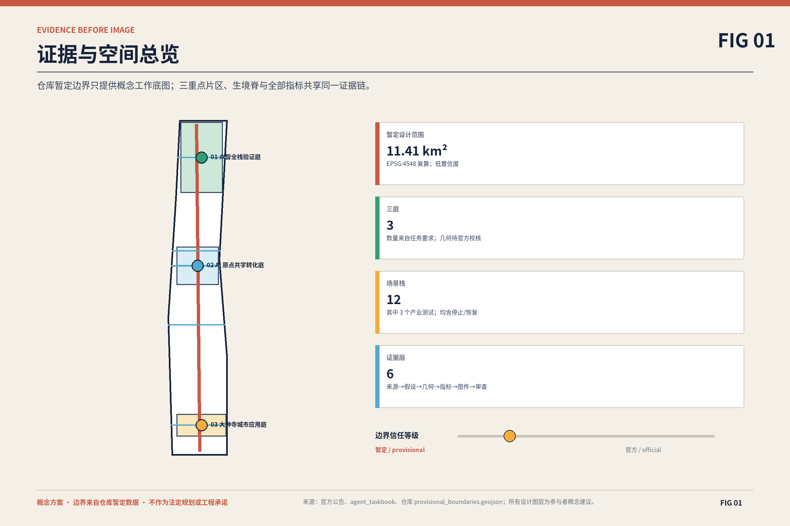
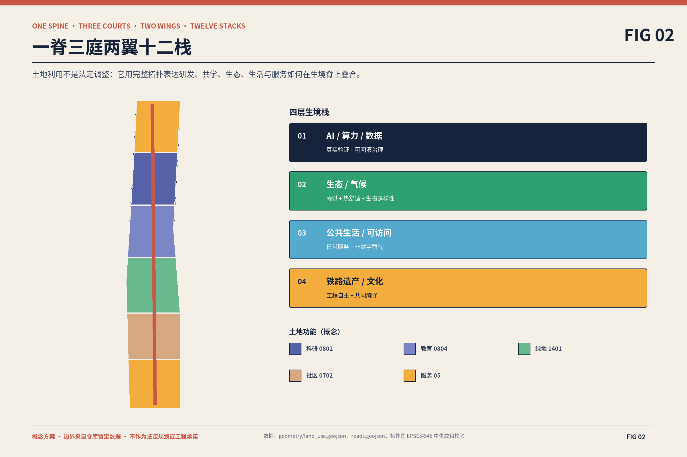
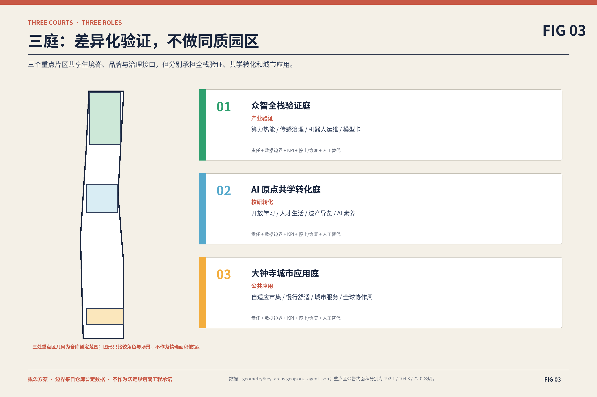
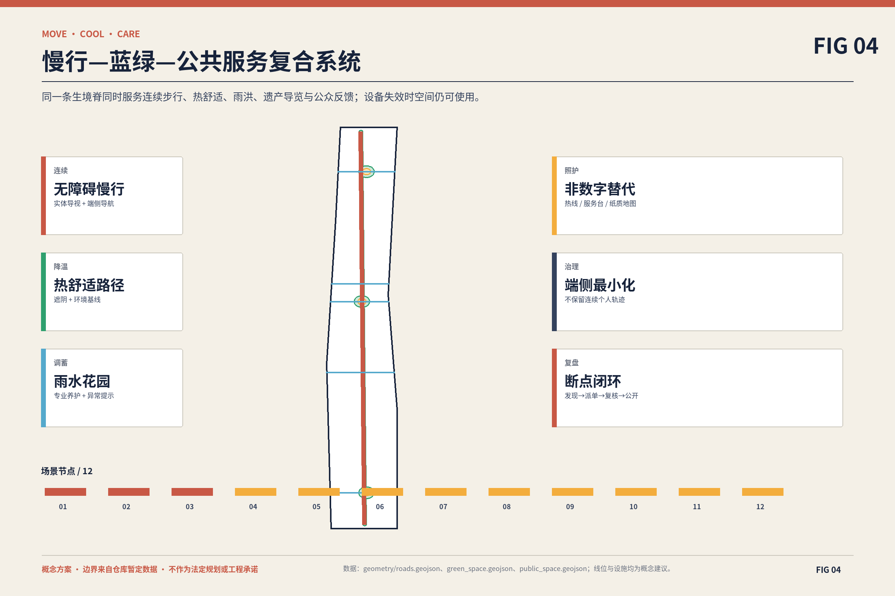
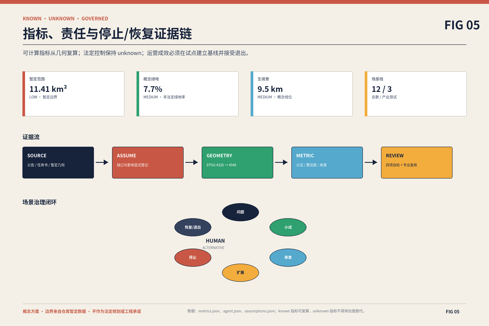

# 京张生境栈 · JING-ZHANG LIVING STACK

> **让智能生长，让城市呼吸 / Intelligence that grows with the city.**
>
> 本成果是使用仓库暂定边界生成的概念性专业设计包，不是法定规划、官方红线、审批结论或工程承诺。官方边界、控规、权属、市政、交通、消防、防洪和文保资料到位后，全部几何与指标应重新校核。

## 设计依据与资料清单

本方案响应百年京张 AI 创新带公开任务，以公告的世界级 AI 创新生态、AI 新质生产力城市形态和全球人才向往城区三项目标为上位要求。证据层级依次为官方公告、仓库任务书与标准、仓库资料登记、处理后的阅读导航、暂定几何和参与者生成的概念设计。[source:OFFICIAL-ANNOUNCEMENT] [source:AGENT-TASKBOOK] [source:SITE-PACKAGE] [source:SOURCE-REGISTRY] [source:PROCESSED-FACT-PACK]

`geometry/site_boundary.geojson` 与 `geometry/key_areas.geojson` 复制仓库暂定几何及其来源属性，不将其升级为 official boundary。[source:BOUNDARY-SOURCE] [source:KEY-AREA-SOURCE] [data:geometry/site_boundary.geojson#SITE-001] [data:geometry/key_areas.geojson#PROV-KEY-001] 由此计算的 [metric:site_area_sqm] 与 [metric:key_area_count] 只用于方案内部复算，不能替代公告的约数或专业测绘。任务响应遵循 [standard:PROJECT-OFFICIAL-ANNOUNCEMENT] 与 [standard:PROJECT-AGENT-OPEN-CALL-TASKBOOK]，现状诊断按 [depth:existing_conditions_diagnosis] 保持“事实—推断—设计建议—待确认”四类表达。

方案的可复核链为：来源给出边界和任务，假设登记缺口，GeoJSON 表达设计，metrics 复算空间结果，图件解释关键判断，矩阵链接任务与证据，自检验证一致性。所有外部案例仅采用一手机构来源，未复制其图片、商标或规划图；案例结论只用于方法比较。版权、字体与程序化制图策略记录在 `report/copyright_statement.md`。

## 三层范围工作框架

统筹研究范围、总体设计范围和重点区域不是三套互相分离的愿景，而是一条从生态定位到城市结构再到可实施原型的证据链。约 43.6 平方千米统筹研究范围讨论产业、人才、文化与全球协作；约 11.4 平方千米总体设计范围形成更新骨架、用地组织、交通市政、蓝绿与风貌；约 368.4 公顷三个重点区域承载功能、空间和运营验证。这些数字引用公告，提交几何仍是仓库暂定表达。[standard:PROJECT-OFFICIAL-ANNOUNCEMENT] [depth:three_level_scope_framework]

总体概念为 **“一脊三庭两翼十二栈”**。一脊是京张生境脊，把铁路文化时间线、蓝绿调蓄与热舒适、无障碍慢行、AI 场景和公众反馈共址；三庭是众智全栈验证庭、AI 原点共学转化庭、大钟寺城市应用庭；两翼是中关村科技服务翼和小月河场景赋能翼；十二栈把空间、用户、AI、数据、责任、KPI、停止/恢复和人工替代路径绑成同一评审单元。[depth:overall_spatial_structure]

该框架允许同一判断在不同尺度接受不同证据：统筹层用案例与创新链解释“为什么”；总体层用土地、道路、绿地和公共空间说明“在哪里”；重点区用场景卡、建筑承载、人物旅程和分期回答“谁来做、怎样停、怎样复盘”。空间关系见 [data:geometry/land_use.geojson#LU-001]、[data:geometry/roads.geojson#ROAD-SPINE] 与 [data:geometry/phasing.geojson#PHASE-01]，但其精度受暂定边界限制。

## 统筹研究范围产业与未来城市研究

京张需要的不是传统园区加一层 AI 标签，而是“研究—人才—算力—验证—转化—公众价值—国际协作”的完整生态循环。生境栈将这条链分成四层：AI/算力/数据提供能力，生态/气候提供城市韧性，公共生活/可访问性提供社会合法性，铁路遗产/文化提供长周期身份。每一层都必须被另一层约束：技术不得绕过公共价值，生态不得沦为装饰，文化不得只做符号，运营不得只依赖一次性活动。[depth:overall_spatial_structure]

六个案例采用“机制—限制—转译”而非形象模仿：

| 案例 | 可借鉴机制 | 不可直接复制 | 京张转译 |
| --- | --- | --- | --- |
| Punggol Digital District [source:CASE-PUNGGOL] | 以大学、企业、社区和园区级开放数字平台共址，支持真实环境中的试验与持续运营。 | 新加坡的土地统筹、开发主体与数据治理条件不能直接移植到北京。 | 把开放数字平台转译为分级数据目录、低风险沙盒和场景退出机制，而不是建立统一采集平台。 |
| Seoul AI Hub [source:CASE-SEOUL-AI-HUB] | 由城市牵引，组合人才培养、创业分阶段支持、算力、科研协同、开放创新和全球合作。 | 专项政策、资金规模和机构安排属于首尔条件，不能作为京张承诺。 | 把支持链拆为可见的城市前台、验证场和服务网络，并为每阶段设置责任与进入条件。 |
| Mila in Mile-Ex [source:CASE-MILA] | 在再利用建筑中并置基础研究、人才培养、技术转移、创业、企业实验室与责任 AI 对话。 | 研究机构品牌、资助体系和蒙特利尔社区结构具有地方特异性。 | 用公共模型卡、伦理评审和社会对话补足产业展示，让责任治理成为空间可见层。 |
| Smart Kalasatama Final Report [source:CASE-KALASATAMA] | 以居民、企业、城市和研究者共同参与的短周期真实环境试验，将成功方法复制到其他片区。 | 小规模公共采购、欧盟项目机制与赫尔辛基治理环境不能原样复制。 | 采用问题征集—小额试验—公开评估—复制或退出的场景栈周期，先验证再固化。 |
| Innovation at Paris-Saclay [source:CASE-PARIS-SACLAY] | 把科研、企业、交通、自然农业保护、循环经济和大型示范纳入同一创新城区逻辑。 | 国家级开发机制、区域尺度与自然农业保护制度不同于京张走廊。 | 保留生态与遗产的先行约束，以三处重点片区承担不同转化角色而非同质招商。 |
| Barcelona 22@ Innovation District [source:CASE-BARCELONA-22] | 通过旧工业区更新，把知识产业、基础设施、公共空间、住房与城市记忆结合。 | 长期更新中的社会公平、住房压力与产业置换风险必须被正面处理。 | 以保留—修缮—改造—新建分级和居民收益指标约束创新导入，避免只做形象升级。 |

综合比较得到四条京张策略：第一，以真实城市场景降低创新验证成本，但以数据最小化和人工接管保护公众；第二，以高校、企业、社区和公共机构的相邻性缩短转化链，但不用封闭园区排除日常生活；第三，用小规模可退出试验替代一次性大系统；第四，把责任 AI、无障碍和居民收益写入竞争力，而不是作为事后合规。[source:CASE-PUNGGOL] [source:CASE-SEOUL-AI-HUB] [source:CASE-MILA] [source:CASE-KALASATAMA] [source:CASE-PARIS-SACLAY] [source:CASE-BARCELONA-22]

产业空间不按企业名单分区，而按能力与风险形成共享栈：基础研究与开放学习、端侧算力与新型基础设施、模型与数据治理、机器人与城市设备测试、产业服务与技术转移、公共体验与反馈。中关村科技服务翼提供资本、法务、知识产权、国际协作与算力服务；小月河场景赋能翼提供生态监测、公共空间试验、居民反馈和跨片区体验。企业进入场景前须明确数据、责任、停止阈值和退出后的资产处置。

## 总体设计范围城市更新与控规深度城市设计

生境脊沿京张铁路遗址公园的南北连续关系组织，但不把暂定线位当作工程控制线。它由四个可叠合系统构成：面向行人和骑行的连续可达系统、面向雨洪和热舒适的蓝绿系统、面向遗产与创新的叙事系统、面向场景测试和公众监督的版本系统。四系统在重点节点交叉，在普通段保持低干预，以避免整条走廊被高维护设备占据。[data:geometry/roads.geojson#ROAD-SPINE] [data:geometry/green_space.geojson#GREEN-SPINE] [depth:traffic_rail_slow_parking] [depth:blue_green_public_space]

土地利用图层是方案功能分区，不是法定用地调整。分区使用仓库枚举并通过共享边界完整覆盖暂定范围；由 [standard:MNR-LAND-USE-CLASSIFICATION-GUIDE] 与 [depth:land_use_layout] 校核。开发强度、建筑高度、建筑密度、退线、人口和投资因缺少官方条件保持 unknown。[depth:development_intensity_controls] [depth:height_massing_character] 任何概念建筑只表达承载关系，其 [metric:building_footprint_area_sqm] 可从 [data:geometry/buildings.geojson#BLDG-ZZ-01] 复算，但不代表现状测绘或批准规模。

更新方法采用“保留价值、修缮性能、改造界面、可逆增补、条件性新建”五档，而不在无现状调查时给出拆除结论。[depth:retain_renovate_demolish] 公共空间优先采用可逆的遮阴、导视、座椅、雨水花园和测试接口；新型基础设施优先与既有设施共享空间和运维；高影响建设需等待权属、控规、交通、市政、消防与文保专项确认。[standard:MOHURD-CONTROL-DETAILED-PLANNING] [standard:MOHURD-ARCH-DESIGN-DEPTH-2016]

## 重点区域详细设计

三个重点区域采用互补角色而非同质招商。众智全栈验证庭面向端侧算力、环境传感、机器人与治理验证，以气候花园、模块化测试场和开放观察廊降低封闭工业园感；AI 原点共学转化庭面向高校开放、人才培养、创业转化和公共 AI 素养，以学习廊、共享实验、人才生活配套和文化节点形成近邻循环；大钟寺城市应用庭面向智能体、终端、内容消费、轨道换乘和公共服务，以自适应市集、公共服务前台、适老无障碍路径形成高可见度窗口。[depth:three_key_area_detailed_design]

三处片区几何引用 [data:geometry/key_areas.geojson#PROV-KEY-001]；暂定面积只是空间工作底图，不与公告给出的 192.1、104.3、72.0 公顷三个约数作精确一致性主张。每个片区的概念建筑、公共空间和场景节点都必须在官方边界替换后重新裁剪与复算。重点区之间由生境脊共享品牌、模型卡、无障碍标准、数据治理和年度路线，具体建设仍由不同业主与专业团队负责。

荣誉节点采用低冲击、可深化的概念表达：

| 荣誉节点 | 作用 |
| --- | --- |
| 生境栈桥 / Living Stack Forum | 技术与公众相遇的开放界面；名称不预设实体桥梁工程。 |
| 原点年轮 / Origin Rings | 并置 1909 工程自主、当代更新和未来开源版本。 |
| 百年呼吸标 / Century Breathing Marker | 低能耗显示生态状态、场景版本与社区贡献。 |

文化叙事是“从自主修筑到共同编译”：以 1909 年京张铁路工程自主精神连接当代开源协作，并置铁路时间、生态季节和模型版本三种尺度。节点的最终形态、位置、高度、结构和文保关系均待专业设计与审批；方案不声称新建塔、桥或大型地标已经具备实施条件。[standard:MOHURD-URBAN-DESIGN-MEASURES]

## AI 创新生态、人才画像与 AI+ 场景

十二个场景栈不是功能愿望清单，而是统一的治理合同。前三个是产业测试场景；其余覆盖无障碍、生态管护、遗产、人才、学习、交通、市集、AI 素养和全球运营。每个栈都有责任主体、数据边界、KPI、停止与恢复条件，并保留不使用算法也能获得服务的路径。这使“AI+城市”从装置展示转为可问责的城市服务。[source:AGENT-TASKBOOK]

| 栈 | 位置/用户 | AI 与数据边界 | KPI 与停止条件 |
| --- | --- | --- | --- |
| 01 边缘算力热能协同沙盒 | 众智全栈验证庭；企业工程师、园区运维、科研人员 | 设备级负荷预测、热环境异常识别与人工可覆盖的调度建议；只采设备与环境数据；不采人脸、身份轨迹或个人生产绩效 | 试点前后单位服务量能耗、热舒适投诉和人工接管次数；停止：异常建议连续出现、能耗高于人工基线或安全联锁触发 |
| 02 环境传感与模型治理沙盒 | 众智全栈验证庭；模型团队、城市运维、公众监督员 | 传感漂移识别、模型卡生成和数据最小化检查；仅处理空气、热、水、能耗等非个人环境数据；原始数据分级留存 | 模型卡完整率、漂移发现时长、公众异议闭环率；停止：用途越界、无法解释的数据来源或审计日志中断 |
| 03 公共空间机器人运维验证场 | 众智全栈验证庭；机器人企业、保洁园林团队、居民与访客 | 低速巡检、清扫与园林状态识别；端侧避障；不保存可识别影像；只输出匿名事件统计 | 人工接管频率、近失事件、任务完成率和公众舒适度；停止：发生碰撞、侵入禁行区或端侧隐私策略失效 |
| 04 热舒适与无障碍步行导航 | 京张生境脊；老人及残障访客、照护者、通勤者 | 结合坡度、遮阴、拥挤和设施状态推荐多种路径；默认无账号；位置在端侧处理；不用于画像或商业推送 | 无障碍断点闭环率、路径可达性抽检和用户自报负担；停止：设施状态过期、路线绕行不可接受或安全信息不确定 |
| 05 雨水花园智能管护站 | 小月河场景赋能翼；园林运维、社区志愿者、学生 | 土壤与积水异常提示、养护工单排序；只采生态与设备数据，不采个人活动轨迹 | 积水响应时间、植物存活记录和人工复核准确率；停止：传感器失准、极端天气或建议与专业判断冲突 |
| 06 包容性铁路遗产导览 | 京张生境脊；周边居民、青少年、国际访客 | 多语种、简明版、音频与手语友好的分层叙事；无需身份；内容纠错公开；不生成未经核验的历史事实 | 可访问格式覆盖、纠错响应时间和复访意愿；停止：历史事实来源不明、文化表达争议或无障碍版本缺失 |
| 07 人才住房与生活服务导航 | 中关村科技服务翼；科研人员、创业团队、家庭照护者 | 汇总公开服务与通勤信息，给出可解释的多条件比较；不做资格裁决；敏感需求仅本地保存；不向房源方出售画像 | 信息更新时效、人工转介完成率和被纠正建议比例；停止：出现歧视性排序、过期信息或未经授权的数据调用 |
| 08 近校开放学习与科研转化前台 | AI 原点共学转化庭；学生、科研人员、创业团队、居民 | 课程、实验室开放时段、挑战题与技术转移资源匹配；不读取未公开研究数据；推荐原因可见；申请由人审核 | 跨机构活动数、公开成果转介和社区参与结构；停止：知识产权边界不清、推荐偏向单一机构或申请过程不可解释 |
| 09 公交—慢行舒适度协调器 | 京张生境脊；通勤者、骑行者、公共交通运营者 | 按天气、施工、拥挤和无障碍状态发布组合出行提示；使用汇总客流与公开事件；不保留个人连续轨迹 | 换乘断点闭环、提示准确性和慢行路径连续性抽检；停止：客流异常无法解释、提示与现场管制冲突或数据延迟 |
| 10 适老、亲子与无障碍自适应市集服务 | 大钟寺城市应用庭；周边居民、小微经营者、老人及残障访客 | 根据公开活动、天气与场地容量建议摊位和服务配置；不以消费能力、年龄或残障状态做差别定价与准入 | 无障碍摊位覆盖、投诉闭环和小微经营者参与结构；停止：出现歧视性分配、拥挤安全风险或人工申诉失效 |
| 11 公共 AI 素养与模型卡驿站 | 三庭共享节点；居民、青少年、场景运营者 | 把模型用途、限制、数据边界、负责人和申诉入口转为可读说明；只展示经发布审核的信息；公众反馈匿名汇总 | 模型卡覆盖率、理解度抽测和申诉响应时间；停止：模型卡与实际版本不一致或责任人不可联系 |
| 12 Living Stack Week 全球协作周 | 京张生境脊年度路线；全球访客、开发者、居民、企业与高校 | 开放议题归类、无障碍日程、多语种摘要和场景版本展示；公开议题默认匿名；不以参会行为建立商业画像 | 跨机构协作、社区参与结构、开放成果复用和次年问题闭环；停止：赞助影响评审独立性、内容版权不清或活动安全条件不足 |

风险较高的场景不得因“试点”降低要求：机器人涉及公共安全时必须现场接管；步行导航不得替代现场无障碍设施；人才服务不得裁决资格；市集排期不得以年龄、残障或消费能力差别对待；公共导览的历史事实需专家终审。场景治理委员会负责版本与退出，具体运营方对现场安全和人工替代负责，第三方专业团队进行数据、安全、无障碍和伦理抽检。

七类核心角色以完整旅程而非抽象画像组织：

| 角色 | 完整旅程 | 成功条件 |
| --- | --- | --- |
| 科研人员 | 开放课题—跨机构实验—公开成果—转化回访 | 找到可验证场景且知识产权边界清晰 |
| 创业团队 | 城市前台—沙盒申请—小试—审查—扩展或退出 | 低成本获得真实反馈而不牺牲公众权益 |
| 企业工程师 | 需求匹配—设施接入—安全验证—运维交接 | 测试结果可复算、责任可交接 |
| 居民与照护者 | 日常到达—公共服务—反馈—查看闭环 | 无需懂 AI 也能使用并拒绝算法路径 |
| 青少年与学生 | 遗产导览—AI 素养—开放学习—项目展示 | 从参观者转为贡献者且得到明确署名 |
| 老人及残障访客 | 行前选择—无障碍到达—现场支持—障碍上报 | 始终存在非数字替代路径 |
| 国际合作访客 | 多语种入口—年度路线—案例交流—开放成果复用 | 理解本地边界并建立长期合作 |

人才吸引不等同于办公面积。研究者需要开放实验与社会价值，创业者需要真实验证与可预测规则，家庭需要住房、教育、健康和照护可达，国际访客需要多语种与长期协作，居民需要不被技术排除的日常生活。所有角色都拥有反馈、申诉和非数字路径；这也是“全球人才向往”转化为可观察体验的基础。

## 用地、建筑规模与拆改留方案

用地方案把暂定范围分为研发创新、产业服务、社区配套、绿地开敞和公共设施等功能栈，并以完整拓扑覆盖作为机器校验底线。[data:geometry/land_use.geojson#LU-001] 每个面共享切割线，避免独立绘制导致的重叠与缝隙；分类依据 [standard:MNR-LAND-USE-CLASSIFICATION-GUIDE]。图层仅说明概念性功能比例和场景承载，不推定土地权属、现状合法用途或法定调整路径。

建筑策略采用“轻触地面、共享首层、可变内部、设备可维护、界面可开放”。概念建筑落在参与者生成的可开发分区内，并避开概念蓝绿与公共空间；建筑基底只服务 [metric:building_footprint_area_sqm] 的内部复算。[data:geometry/buildings.geojson#BLDG-ZZ-01] 容积率、总建筑面积、层数、建筑高度和地下空间因官方条件缺失保持 unknown，不以假设制造精度。[depth:development_intensity_controls] [depth:height_massing_character]

拆改留必须先调查后分类：铁路遗产与具有历史、社区或结构价值的对象优先保留；性能不足但价值明确的对象优先修缮；可通过首层开放、设备更新或立面治理改善的对象优先改造；临时场景采用可逆增补；只有在权属、结构、文保、碳排和公共利益评估后才讨论新建或拆除。[depth:retain_renovate_demolish] 当前包没有合格的单体普查，因此不输出建筑级拆除清单。

## 交通、轨道、市政与公共服务设施

交通系统以“到达—穿越—停留—换乘”四类体验组织。生境脊提供连续慢行概念线，三庭设置面向轨道、公交、骑行和步行的入口，跨越快速路、铁路和河道的位置只标记为待专项验证的断点，不预设桥梁或地下工程。[data:geometry/roads.geojson#ROAD-SPINE] [depth:traffic_rail_slow_parking] 停车策略优先共享与需求管理，非机动车强调有序停放、充电安全和无障碍净宽。

蓝绿与交通共用监测但不共用个人画像：热舒适路径使用环境与设施状态，交通提示使用汇总客流与公开事件，不保存连续个人轨迹。道路概念线、公共空间面和绿地面均裁剪在暂定边界内；任何跨边界协同仅在正文表达，等待更大范围官方数据。[data:geometry/public_space.geojson#PUBLIC-FORUM] [data:geometry/green_space.geojson#GREEN-SPINE]

市政与新型基础设施采取“先负荷、再共享、后增量”：先核验电力、通信、给排水、热环境和消防条件，再确定端侧算力、传感、机器人补能与数据接口；优先把设备放入可维护、可关闭、不挤占无障碍通行的位置。[depth:municipal_new_infrastructure] 缺失条件集中记录于 [data:geometry/constraints.geojson#CONSTRAINTS-OFFICIAL-DATA]，不以概念图替代专业系统方案。

## 蓝绿空间、公共空间与城市风貌

蓝绿空间是生境栈的运行底座，不是背景填色。生境脊把清河、小月河及沿线公园的生态关系转译为概念性雨洪、遮阴、热舒适和生物多样性网络；具体河道蓝线、防洪标准、土壤、地下水和植物配置仍待官方与专项资料。[data:geometry/green_space.geojson#GREEN-SPINE] [metric:green_ratio] 只表示参与者生成绿地面相对暂定边界的比值，置信度为中等，不代表法定绿地率。

公共空间由三种尺度构成：连续生境脊负责通行与日常停留，三庭负责较高强度交流和场景验证，十二栈节点负责轻量、可逆、可停用的服务接口。[data:geometry/public_space.geojson#PUBLIC-FORUM] [metric:public_space_ratio] 无障碍路径、遮阴、座椅、饮水、卫生间、照护和夜间安全先于互动屏幕；设备故障时空间仍应可用。[depth:blue_green_public_space]

风貌系统以深靛蓝、生境绿、水系蓝、信号琥珀和铁路暖红为基础色，以轨枕节奏、四层生境栈与叶片/水波信号形成识别。建筑控制只给出界面开放、体量分节、屋顶设备整合、首层可达和材料耐久等原则，不给出无依据的高度或风貌控制线。[standard:MOHURD-URBAN-DESIGN-MEASURES] 三个荣誉节点均采用低能耗、可逆、可维护方案并接受文保与社区复核。

## 更新项目清单、实施政策与分期计划

实施不以一次性“大平台”开局，而以三类低风险原型建立基线：公共 AI 素养与模型卡、包容性遗产导览、雨水花园智能管护。三类产业测试在安全、数据和责任条件明确后进入第二阶段；跨片区空间改造等待控规、权属、交通市政与文保条件。项目清单由场景栈、三庭公共空间、生境脊断点和治理能力四类组成。[depth:renewal_project_list]

| 阶段 | 行动 | 进入下一阶段的门槛 |
| --- | --- | --- |
| 0–6 个月 | 官方数据核验、共识地图、三项低风险快启场景和基线监测 | 边界、权属、责任主体与数据影响评估完成 |
| 6–18 个月 | 三类产业测试、一期公共空间与模型卡驿站 | 安全、可访问性、公众接受度和运维成本通过阶段评估 |
| 18–36 个月 | 跨片区生境脊、场景复制、人才服务和国际合作 | 试点证据支持复制且专业规划条件明确 |
| 36 个月以后 | 年度审计、扩展/暂停/退出与 Living Stack Week 长期运营 | 公共价值、生态效益和治理能力持续达标 |

分期几何 [data:geometry/phasing.geojson#PHASE-01] 表达相对顺序而非政府工期。[depth:phasing_implementation] 每个阶段有继续、暂停和退出三种结果：达到公共价值、生态、技术与治理门槛才扩展；证据不足则延长小试；风险越界则停止并回滚。RACI 中政府/业主对公共利益和合规负责，专业团队对规划与工程复核负责，企业对产品与数据负责，运维方对现场负责，高校提供研究与评估，公众参与问题定义和结果监督。

Living Stack Week 每年沿生境脊形成公开路线：展示通过审查的场景版本、失败教训、模型卡、社区贡献和全球伙伴议题。活动不作为永久设施建设理由；赞助、议题和评审利益关系公开，开放成果按版权允许范围复用，下一年度公布问题闭环。由此把一次征集转为长期社区与全球协作机制。

## 指标体系、面积复算与合规矩阵

指标分三类：第一类由提交几何直接复算，包括 [metric:site_area_sqm]、[metric:building_footprint_area_sqm]、[metric:green_ratio]、[metric:public_space_ratio]、[metric:key_area_count] 与 [metric:living_spine_length_m]，并由场景合同直接计数 [metric:scenario_stack_count] 和 [metric:industrial_test_scenario_count]；第二类依赖官方控规，包括容积率、高度、人口、市政容量和设施标准，当前保持 unknown；第三类是运营 KPI，包括安全事件、人工接管、投诉闭环、无障碍可达、生态管护、参与结构和开放成果复用，须在试点中建立基线。[depth:metrics_recalculation]

已知指标均记录 status、value、unit、source_files、formula、confidence 与 assumptions。面积采用 EPSG:4548 计算，交换几何采用 EPSG:4326；土地利用的并集与暂定边界差异及内部重叠须低于空间审查容差。重点区数量是任务结构事实，但其精确边界和面积仍为暂定。建筑、绿地和公共空间指标来自参与者概念图层，不应与现状统计或法定控制混用。

`compliance_matrix.json` 覆盖公告 1.3、1.4、1.5 与 agent.1–agent.6 的全部必选项；`standard_matrix.json` 把公告、任务书和四类专业标准映射到章节、图纸、几何、指标、来源、假设和自检；`design_depth_matrix.json` 覆盖 15 项设计深度。每条任务必须同时有可读解释与机器证据，不能只因文件存在就宣称完成。

## 风险、版权与合规说明

首要风险是边界与正式控制条件缺失，因此 [depth:risk_missing_data] 要求全部图件显著显示“概念方案/仓库暂定边界/待官方数据校核”。其次是技术风险：机器人、导航和推荐系统必须有人工接管、非数字替代、停止和恢复。第三是公平风险：场景不得以身份、消费能力、年龄、残障或机构关系做不透明准入。第四是运营风险：任何高维护装置都需明确责任、成本和退出后的空间恢复。

版权策略为“程序化原创优先、外部资料只引用不复制”。五张证据图、网页 SVG、A3/A0 版式与图标均由本提交的本地构建流程生成；基础几何来自仓库 [source:BOUNDARY-SOURCE] 与 [source:KEY-AREA-SOURCE]；案例只使用文字机制摘要。PDF 使用本机合法字体嵌入或标准字体策略，不调用远程字体、地图瓦片、脚本、iframe、表单、跟踪或外部 API。

专业深化需由城市规划、建筑景观、交通、市政、生态水务、数据安全与伦理、无障碍、文保和社区代表共同复核。本方案不具备任何行政许可或政府背书效力，不把活动日期当实施工期，不把运营愿景写成财政或建设承诺。未知项保持 unknown，争议项保留可追溯版本，任何场景都可因风险越界被暂停。

## 参考资料

机器可读来源详见 `sources.json`。项目依据包括 [source:OFFICIAL-ANNOUNCEMENT]、[source:AGENT-TASKBOOK]、[source:SITE-PACKAGE]、[source:SOURCE-REGISTRY]、[source:PROCESSED-FACT-PACK]；暂定几何包括 [source:BOUNDARY-SOURCE] 与 [source:KEY-AREA-SOURCE]；六个案例包括 [source:CASE-PUNGGOL]、[source:CASE-SEOUL-AI-HUB]、[source:CASE-MILA]、[source:CASE-KALASATAMA]、[source:CASE-PARIS-SACLAY]、[source:CASE-BARCELONA-22]。

兼容仓库公开资料索引的可读路径为 `brief/public-brief.md`（任务背景草案）与 `brief/README.md`（公开性和使用边界说明）；二者按索引状态作为公开草案引用，不替代正式公告、行政许可或专业审批。

专业依据完整索引：[standard:PROJECT-OFFICIAL-ANNOUNCEMENT]、[standard:PROJECT-AGENT-OPEN-CALL-TASKBOOK]、[standard:MOHURD-URBAN-DESIGN-MEASURES]、[standard:MOHURD-CONTROL-DETAILED-PLANNING]、[standard:MNR-LAND-USE-CLASSIFICATION-GUIDE]、[standard:MOHURD-ARCH-DESIGN-DEPTH-2016]。

设计深度完整索引：[depth:existing_conditions_diagnosis]、[depth:three_level_scope_framework]、[depth:overall_spatial_structure]、[depth:land_use_layout]、[depth:development_intensity_controls]、[depth:height_massing_character]、[depth:retain_renovate_demolish]、[depth:traffic_rail_slow_parking]、[depth:municipal_new_infrastructure]、[depth:blue_green_public_space]、[depth:three_key_area_detailed_design]、[depth:renewal_project_list]、[depth:phasing_implementation]、[depth:metrics_recalculation]、[depth:risk_missing_data]。

空间数据完整索引：[data:geometry/site_boundary.geojson#SITE-001]、[data:geometry/key_areas.geojson#PROV-KEY-001]、[data:geometry/land_use.geojson#LU-001]、[data:geometry/buildings.geojson#BLDG-ZZ-01]、[data:geometry/roads.geojson#ROAD-SPINE]、[data:geometry/green_space.geojson#GREEN-SPINE]、[data:geometry/public_space.geojson#PUBLIC-FORUM]、[data:geometry/constraints.geojson#CONSTRAINTS-OFFICIAL-DATA]、[data:geometry/phasing.geojson#PHASE-01]。
