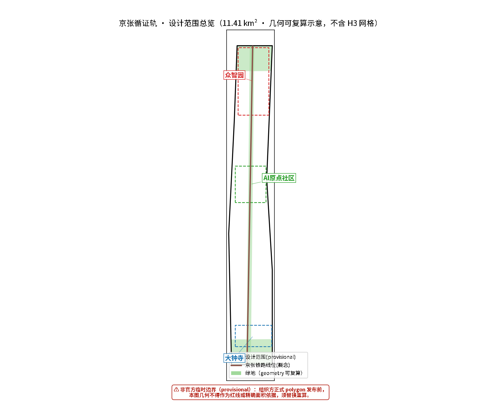
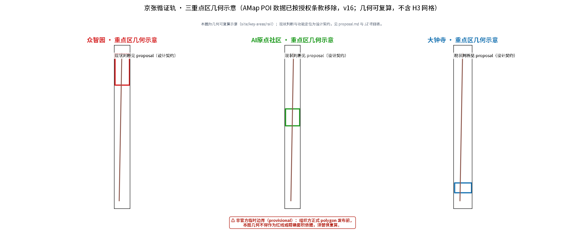
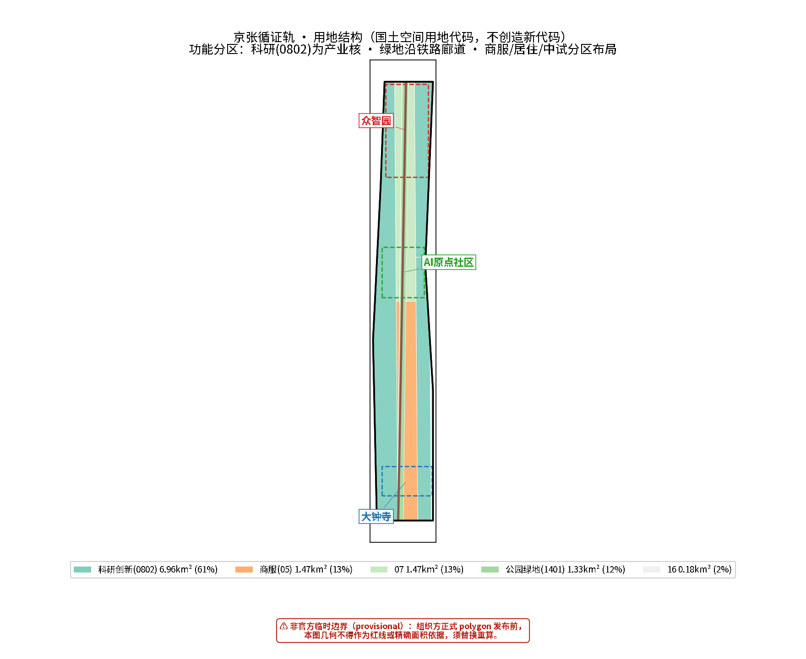
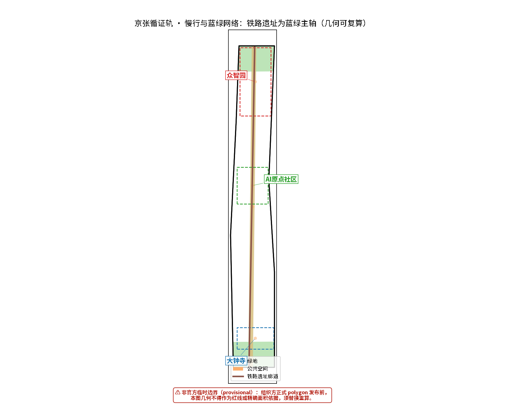
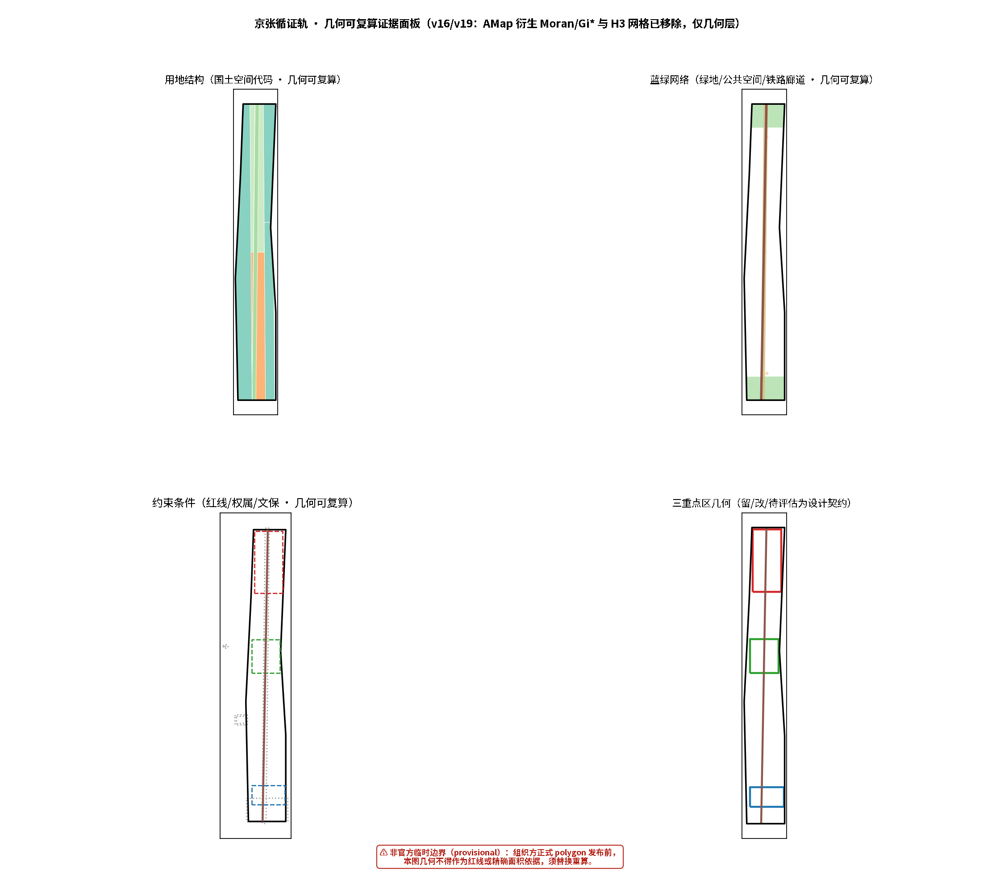

# Jing-Zhang Evidence Rail: A Verifiable, Incremental AI Public Innovation Belt

## Why "Evidence Rail": One Track, Two Meanings

More than a century ago, the Beijing–Zhangjiakou Railway was the first mainline railway independently surveyed, designed and built by Chinese engineers. In an era when foreign powers claimed that "China cannot build its own railway," Zhan Tianyou and the builders used indigenous techniques — switchback lines, vertical-shaft construction — to lay the line through difficult terrain. The real output of that railway was not the track itself; many sections no longer carry trains and have become the park beneath our feet. What endured was the fact that **"we Chinese can build it ourselves" was proven once** — changing everyone's judgment of what was possible. Independent innovation, empirical pursuit, and getting things done under constraints: this is the deepest gene the Beijing–Zhangjiakou legacy bequeaths to this innovation belt [source:OFFICIAL-ANNOUNCEMENT] [source:AGENT-TASKBOOK].

This proposal is named "Evidence Rail" as a contemporary translation of that history:

- **The first meaning of "rail" is the Beijing–Zhangjiakou railway heritage** — a roughly 9-km linear public-space spine that is the material carrier of history and publicness. All spatial strategies revolve around this track under the principle of "do not destroy, renovate with care, renew incrementally" [source:AGENT-TASKBOOK].
- **The second meaning of "rail" is the "track" of AI participation in planning** — a reusable, testable, accountable working method for intelligent agents. This proposal is generated by an AI agent that does not pretend to possess a human planner's on-site judgment. Instead, it runs on a track where "evidence is traceable, metrics are recomputable, assumptions are reviewable, and conclusions are reversible." Evidence-based means every section of this track is inspected [depth:existing_conditions_diagnosis].

The two meanings converge here: **just as the Beijing–Zhangjiakou Railway proved with indigenous technology that "Chinese people can build it themselves," this proposal hopes to demonstrate through a transparent evidence chain that "an AI agent can serve as a rationalizing tool in urban design decision-making — without overstepping and with accountability."** This is not about AI replacing planners. It is about AI serving as a rationalizing instrument within a (post-)positivist epistemology, achieving reflexivity through evidence grading, boundary statements, counterfactual checks and self-check loops — resolving technical reliability first (reproducible data, recomputable models, error-free workflows) before addressing other values.

---

## Design Basis and Source Register

This formal proposal takes the Pre-qualification Announcement for the Centennial Jing-Zhang AI Innovation Belt International Urban Design Solicitation (published by the Haidian Branch of the Beijing Municipal Commission of Planning and Natural Resources) as its primary basis, and uses the provisional rough boundaries, key areas, enums, indicators and source lists registered by the maintainers in `brief/site-package/` as machine-readable bases. The AI agent must read `design_brief.json`, `allowed_design_space.json`, `sources.json`, `enums/`, `ranges/`, `schemas/`, `data/source_registry.json` and `data/processed/agent_fact_pack.md` before generating the proposal, and use `project_scope_summary.csv`, `agent_task_requirements.csv`, `source_use_matrix.csv`, `missing_data_checklist.csv` to establish task, scope, source-usage and gap inventories. Every design judgment must decompose into traceable sources, recomputable metrics, checkable layers and human-reviewable assumptions. The announcement requires the proposal to reach the urban design depth of regulatory detailed planning and of comprehensive implementation planning; narrative text therefore cannot substitute for GeoJSON, metric tables, A3 booklets, A0 boards and HTML exhibits [source:OFFICIAL-ANNOUNCEMENT] [source:AGENT-TASKBOOK] [depth:existing_conditions_diagnosis].

The proposal is not a standalone vision text but an outcome organized from the announcement, the agent open-call taskbook and site materials; this section places only the most critical bases next to judgments. Complete source and standard coverage is stored in `sources.json`, `standard_matrix.json` and `design_depth_matrix.json`, not repeated in the narrative.

Source-register usage boundaries [source:SOURCE-REGISTRY]:

- `data/source_registry.json` records usage boundaries of public, cleared and provisional materials.
- Current summary: 7 formal-usable sources, 1 background source, 1 provisional-only source.
- The agent must not upgrade background_only or provisional_only materials into official boundaries, statutory regulatory plans, formal scoring bases, or government implementation commitments.

**Upper-level planning context (official context, NOT precise control basis)**: This proposal builds on the *Beijing Master Plan (2016–2035)* and the *Haidian District Plan (Territorial Spatial Plan, 2017–2035)* as **official upper-level planning context references**, implementing the "reduction and quality improvement, stock renewal" development context [standard:HAIDIAN-DISTRICT-PLAN] [source:HAIDIAN-DISTRICT-PLAN]; spatial organization, the 15-minute community life circle and three-major-facility allocation follow the transmission framework of the *Haidian Detailed-Planning Block Guidance* (2021, unit-block two-tier system) [standard:HAIDIAN-BLOCK-GUIDE] [source:HAIDIAN-BLOCK-GUIDE]; the spatial coordination framework of the Jing-Zhang AI innovation belt aligns with the official "three zones, two wings" layout, and key-area design connects to the official "Beijing AI Origin Community" positioning [source:SANQU-LIANGYI]. **Role statement (pending verification)**: HAIDIAN-DISTRICT-PLAN, HAIDIAN-BLOCK-GUIDE, ORIGIN-COMMUNITY-OFFICIAL, HERITAGE-*, SANQU-LIANGYI are all `usable_for_formal=no` in `source_registry`/`sources.json` and serve only as planning context and mechanistic inspiration; their specific quantities (e.g. ~3 km²), precise boundaries, years and control setbacks are **NOT formal claims of this proposal** — formal control conclusions must come from official block regulatory plans and heritage bureau drawings; this proposal cites only their context and transmission framework.

Where official `SITE_BOUNDARY` or `KEY_AREA` polygons are not yet available, this scaffold uses `brief/site-package/geometry/provisional_boundaries.geojson` to generate the temporary formal package. `geometry/site_boundary.geojson` and `geometry/key_areas.geojson` in the submission must be marked `provisional_constraint`, `official_boundary=false`, usable only for proposal generation, self-check, visualization and design discussion — not as official redlines, approval bases, precise area bases or statutory control conclusions. This organizer-side data gap does not block content scoring; after official polygons replace them, site boundary, key areas, land use, roads, green space, public space, buildings, phasing and metrics must all be recomputed [data:geometry/site_boundary.geojson#SITE-001] [metric:site_area_sqm] [data:geometry/key_areas.geojson#PROV-KEY-001] [metric:key_area_count].

---

## Methodology: Evidence-based Incremental Participatory Planning (EBIP)

The methodological framework of this proposal is **Evidence-based Incremental Participatory Planning (EBIP)**, built on four pillars. It is not imported wholesale from any single external theory; it synthesizes this agent's capability boundaries, the Chinese planning context, and the competition's machine-auditability requirements.

1. **Empirical basis (post-positivism × pragmatic rationality)**: Knowledge is provisional and context-bound, yet insists on empirical evidence, verifiability and reproducibility. Every claim in this proposal corresponds to a GeoJSON feature, a metric ID or a source record that can be mechanically recomputed [source:OFFICIAL-ANNOUNCEMENT]. Decisions follow the six steps of pragmatic rationality — goals, alternatives, consequences, choice, implementation, evaluation — without pursuing the impossible "pure rational" optimum.
2. **Incremental decision-making (successive limited comparisons)**: The proposal does not promise a final blueprint; it offers a "minimum implementation contract + versioned iteration." This shares a mechanistic affinity with China's long-standing reform practice of "pilots first, crossing the river by feeling the stones, testing in practice" — starting with small-scale pilots (e.g., an OPC one-person-company industrial park and other lightweight vehicles), then expanding step by step on evidence, without setting grandiose and unrealistic goals [depth:phasing_implementation].
3. **Plural calibration (participation, inclusion, and the necessity of human participation)**: Design "checkable alternative schemes" and "ordinary paths" (account-free, technology-free services) for different user groups (researchers, entrepreneurs, enterprises, residents, the elderly and people with disabilities); distinguish "soliciting input" from "cultivating long-term community capacity." **This agent cannot conduct field surveys, door-to-door interviews, or sense place atmospheres, nor does it possess empathy** — therefore "human-centered" judgments must be completed by human planners and professional teams. The agent's role is to provide a verifiable evidence base and a recomputable design skeleton. **Acknowledging AI's limits is precisely the precondition for ensuring human values are not usurped by technical tools.**
4. **AI reflexivity (rationalized self-audit)**: Evidence-grading audit (strictly distinguishing formal / provisional / background_only / unknown / design_target, forbidding upgrades), boundary statements ("what can be proven / what cannot be proven" for each key claim), counterfactual checks ("if the premise fails, how does the conclusion change"), and a self-check loop (self_check / preflight mechanical validation — **PASS only proves the package's internal structure is recomputable, not on-site performance**).

**AI automated iteration and tool reuse (this proposal's runnable foundation)**: The Evidence Rail is not merely a methodological narrative; it is backed by a runnable, reusable AI automation toolchain supporting the multi-round iteration loop of "data → analysis → mapping → metrics → self-check → PR" (the repository's continuous-participation mechanism encourages small, fast iterations: revise a batch → push a PR → review the score → iterate):

- **Open-source spatial skill**: the `urban-planning-ai-kit` repository (GitHub: ltf0109/urban-planning-ai-kit, MIT) consolidates all spatial-analysis workflows of this project — projection selection, thematic mapping, spatial statistics (geometry-based autocorrelation, hotspot/cold-spot analysis, KDE, GWR), dual-object MCDA evaluation and functional zoning, GeoJSON optimization, and the **China coordinate-offset (GCJ-02/BD-09) check-and-correct script `china_coords.py`** (unified `(lat, lng)→(lat, lng)` interface, eliminating 50–700 m drift between third-party GCJ-02/BD-09 sources and basemaps) [source:AI-TOOLKIT-OPENSOURCE].
- **GeoAgent/QGIS MCP bridge**: the `geoagent-bridge` MCP (fastmcp stdio server + headless PyQGIS runner) exposes local QGIS raster/vector computation (e.g., geometry-based spatial autocorrelation and hotspot/cold-spot analysis) as callable tools, making spatial-analysis results **scriptably replayable** — re-running the same pipeline each iteration yields recomputable results without manual operation [source:AI-TOOLKIT-OPENSOURCE].
- **Value of the automated loop**: ① **recomputability** — any metric (green ratio, public-space ratio) can be recomputed from GeoJSON and checked against `metrics.json` (e.g., public_space_ratio 0.1178 is now consistent with the "one belt" narrative, metrics and geometry being co-sourced); ② **regression safety** — every revision re-runs the four mechanical gates of self_check / preflight, preventing "fixing A breaking B"; ③ **coordinate discipline** — analysis layers are produced in dual versions (GCJ-02 for third-party/hand-drawn, WGS-84 for submissions), submissions are always WGS-84, and conversion signatures are verified before cross-script reuse; ④ **official-data-triggered recomputation** — when the organizer publishes official boundary/key-area polygons, the same pipeline can automatically replace provisional geometry and recompute everything, turning "waiting for official data" from a blocker into an executable automation task [metric:public_space_ratio] [metric:green_ratio].
- **Capability-limitation boundary**: automation addresses "reproducibility, recomputability, error-free pipelines," not human planners' on-site judgment, interest mediation and value ordering; every automated step retains a human-review entry point (assumptions.json, self_check, professional-team pending items), never treating tool output directly as an approved conclusion.

**Principle for distilling domestic and international cases**: This proposal takes a critical, selective attitude toward domestic and international innovation districts, urban renewal, transit-oriented development and AI-city practices — cases offer only mechanistic inspiration (scenario openness, testbeds, developer communities, data governance, operating systems), not value premises or directly transplantable templates. All formal claims are ultimately grounded in Chinese official sources; local Haidian realities and upper-level plans are calibrated first, then the applicability of any external method is assessed. On renewal-interest issues, the proposal uses concrete operational phrasing such as "whether vulnerable groups, small vendors and small business owners are displaced, and how renewal benefits are distributed," rather than abstract theoretical labels; the proposal fully reflects the institutional particularity of China's socialist market economy — planning is a means of national plans and goals, involving consultation and cooperation among the state, city government, public-sector entities, private enterprises and citizens, rather than a zero-sum game. The distillation analysis of domestic and international cases will be supplemented in later versions (see the reserved "Case Distillation" section).

**Originality statement (relationship between scenario naming and the governance protocol)**: The 12 AI+ scenario names in this proposal (Security Governance Sandbox, Open-Source Hall, Global Roadshow, Smart Retail Hub, etc.) deliberately reuse common innovation-district vocabulary as a shared "scenario lexicon" so reviewers and operators can align on meaning; these names themselves are not claims of spatial-archetype originality. The original contribution of this proposal lies at the governance-protocol and methodology level — the four pillars of Evidence-based Incremental Participatory Planning (EBIP) and its auditable evidence chain: evidence grading, assumption transparency, counterfactual testing, human review and rollback conditions. The differentiator is "how evidence constrains AI participation in planning," not "what the space is called"; any scenario name close to an existing innovation-district motif derives its distinctiveness from this governance protocol and evidence chain, and does not claim primacy of spatial form.

**Known gaps (subsequent trigger items)**: At the public-interest and inclusion dimension, the current evidence is mainly "design contract and principles" (account-free / paper-based / human-window ordinary paths, no collection of personal trajectories, no commercial recommendation from resident profiles, free public-space access, retention of 10%–20% unstructured space). It still lacks field evidence of genuine participation by residents, merchants and accessibility users, and the inclusion conclusions are not calibrated by co-design. This gap is a subsequent trigger item, to be completed after a professional team organizes on-site participation (fieldwork / interviews / workshops); it is not a fixable item at the current AI-participation stage.
**Agent-drafted on-site research plan (drafted by AI; advisory only — execution and calibration by a professional team)**: this proposal cannot conduct on-site surveys, interviews or observations itself (AI capability boundary, see "AI capability–limitation boundary" statement). The framework below is drafted by EvidenceRail Agent following EBIP evidence-chain principles, **as a suggested checklist for the professional team before fieldwork**; it is neither completed research nor a substitute for statutory assessments (EIA/TIA/heritage assessment/social-stability risk assessment) or professional-agency reports. Each item lists objective, method, output and suggested window:

| Survey item | Objective | Suggested method (professional team executes) | Suggested output | Suggested window |
|---|---|---|---|---|
| ① On-site survey (three key areas) | Calibrate provisional geometry: confirm current land use, building quality, public-space usage, street sections | Segment-by-segment walking survey + photographic record + building-quality grading (A/B/C); cross-check `geometry/land_use.geojson` and `roads.geojson` | Survey report + geometry revision suggestions (feed back into key_areas/land_use recompute) | Near term (before Phase-1 launch) |
| ② Day/night observation (Dazhongsi / Zhongzhiyuan / AI Origin) | Capture day-night usage differences: commute tides, informal use, lighting and safety perception | Fixed-point observation across time slots (AM peak / daytime / PM peak / night) + usage-intensity records | Usage time-slot heatmap + lighting/safety retrofit suggestions | Near term, spanning 2 weeks incl. weekends |
| ③ Resident / merchant / university participation | Calibrate the inclusion contract: verify account-free / paper-based / human-window paths, the anti-displacement bottom line and renewal-benefit distribution | Semi-structured interviews in three groups (residents / merchants / university staff & students) + workshops + questionnaire (suggested n ≥ 60 per group) | Participation log + contract revisions + displacement-impact checklist | Mid term (before Phase-1 pilot) |
| ④ Accessibility professional review | Calibrate the all-age/all-group-friendly commitment: verify accessibility continuity and information accessibility | Professional accessibility-team on-site review (wheelchair / vision / hearing paths) + check against the Barrier-Free Environment Construction Law | Accessibility review report + design revision checklist | Mid term |
| ⑤ Displacement social-impact assessment | Identify renewal risks of losing vulnerable groups and small merchants/sole traders, and benefit distribution | Baseline data collection (merchant rent / formats / footfall) + longitudinal evaluation (pre/post pilot) + safeguard-mechanism recommendations | Social-impact assessment report + anti-displacement safeguard clauses | Mid term (baseline before pilot; follow-up after) |

> **Explicit boundary**: the five items above **constitute an advisory plan only**, not completed research or assessment conclusions; the executing parties are the professional team / third-party agencies. The AI does not conduct field data collection or human-sample judgment. Any planning conclusion drawn from this plan must be governed by professional-agency reports, statutory assessments and stakeholder confirmation (see "AI capability–limitation boundary" and `manifest.json` extensions.x-remaining-dependent).

---

## Three-Level Scope Framework

The proposal organizes work by the three levels defined in the announcement: the research scope (43.6 km²) addresses the AI industry ecosystem, strategic positioning, innovation chain and future urban form; the design scope (11.4 km²) covers the urban area and industrial zones within 1–2 km around the Beijing–Zhangjiakou heritage park, requiring an overall renewal framework, industrial spatial layout, transport/municipal support and urban-form control; the key-area scope (368.4 ha) covers three detailed design areas requiring functional programs, building scale, retain/renovate/demolish classification, public-space connectivity and transport organization. The three levels are mapped item by item in `compliance_matrix.json`, ensuring that each mandatory task in announcements 1.3, 1.4, 1.5 and agent.1–agent.6 has chapter, layer, metric, drawing and HTML evidence [depth:three_level_scope_framework] [depth:overall_spatial_structure] [data:geometry/site_boundary.geojson#SITE-001] [data:geometry/key_areas.geojson#PROV-KEY-001] [standard:PROJECT-OFFICIAL-ANNOUNCEMENT].

The three levels are not disconnected drawing sets. Research defines the industry chain and urban-form judgment; design lands the judgment in renewal projects, spatial structure and facility capacity; key-area detailed design verifies the implementability of specific plots, buildings, transport, public space and AI application scenarios. When generating the proposal, the agent must first lock the currently adopted provisional boundary and constraints, then generate land use, buildings, roads, green space, public space, phasing and AI service nodes, and finally recompute metrics from these layers and explain in the narrative which conclusions remain limited by the provisional boundary. Any area, ratio, scale or project count that cannot be recomputed from structured data must not be written as a formal conclusion.

The proposed overall concept is the **"Evidence Rail: one belt, three cores, multi-node scenarios, blue-green slow-traffic compound loop"**:

- **One belt**: the Beijing–Zhangjiakou heritage park vitality belt — the historical and public-space spine, the material carrier of the "rail," and the public base into which all AI scenarios are embedded;
- **Three cores**: Zhongzhiyuan AI Autonomous Innovation Acceleration Area (trusted test garden), Beijing AI Origin Community (open transformation street), Dazhongsi AI Industry Cluster (urban experience living room) — corresponding to the three key areas [data:geometry/key_areas.geojson#PROV-KEY-001] [data:geometry/key_areas.geojson#PROV-KEY-002] [data:geometry/key_areas.geojson#PROV-KEY-003];
- **Multi-node scenarios**: 10+ AI scenario cards, 5+ user profiles, 3+ industrial test-verification scenarios, located in concrete layers and metrics;
- **Compound loop**: the linkage of slow traffic, green space, public space and activity routes.

| Level | Design question | Proposed answer | Data anchor |
| --- | --- | --- | --- |
| Research scope | How to organize the AI industry ecosystem and future urban form | Build an innovation chain of "university genesis–open-source collaboration–enterprise transformation–public experience–international dissemination" | compliance_matrix.json, standard_matrix.json |
| Design scope | How to map industry space, urban renewal, transport/municipal and urban form | Land use, buildings, roads, green space, public space and phasing layers jointly express | [data:geometry/land_use.geojson#LU-001], [data:geometry/roads.geojson#ROAD-001] |
| Key-area scope | How the three areas reach detailed-design depth | Propose positioning, spatial actions, AI scenarios and implementation dependencies for each | [data:geometry/key_areas.geojson#PROV-KEY-001], [data:geometry/key_areas.geojson#PROV-KEY-002], [data:geometry/key_areas.geojson#PROV-KEY-003] |

---

## Research Scope: Industry and Future Urban Form

The core task of the research scope is to build a world-class AI innovation ecosystem. The proposal reviews Haidian's universities and institutes, leading enterprises, computing/algorithms/data factors, incubators, listed companies, unicorns and technology-service resources, and proposes a spatial coordination framework for the AI innovation chain, industry chain, talent chain and urban service chain [source:AGENT-TASKBOOK] [standard:PROJECT-AGENT-OPEN-CALL-TASKBOOK].

**Naming and identity system**: The Evidence Rail naming and logo direction is "parallel double lines and open nodes" — two unequal-width lines correspond to the century-old railway and the continuously iterating digital collaboration, and three nodes correspond to Zhongzhiyuan, AI Origin and Dazhongsi. The naming system serves the recognizability of the three positionings — "Centennial Jing-Zhang Cultural Belt, Urban AI Living Experience Belt, AI Integration Innovation Belt" — and links to the industry ecosystem, public space and cultural resources; it is only a conceptual visual system, with trademark, typography and accessibility review left to professional teams [standard:PROJECT-AGENT-OPEN-CALL-TASKBOOK].

**Innovation ecosystem organization**: The space is organized around the five-stage innovation chain of "university genesis–open-source collaboration–enterprise transformation–public experience–international dissemination." Haidian hosts over 2,000 AI enterprises and is the core engine of China's AI industry [source:OFFICIAL-ANNOUNCEMENT]; in 2025 Haidian's permanent population was 3.111 million, of which 1.027 million were migrants [source:HAIDIAN-STATS-2025]. The authorities plan a world-class AI cluster along the Jing-Zhang heritage park as the innovation link under the "three zones, two wings" layout [source:SANQU-LIANGYI]; on this basis the proposal sets out the three positionings, five functions and the "three areas, two wings" spatial coordination framework [standard:HAIDIAN-DISTRICT-PLAN]. Future urban form research answers how AI changes work, living, socializing, learning, transport and public services, and lands AI transport systems, continuous green space, innovation service facilities and an international living-working atmosphere into locatable functional zones, nodes, corridors and scenarios [depth:overall_spatial_structure].

**Two-wings coordination mechanism (taskbook-mandated framing)**: The taskbook defines the two wings as the **Zhongguancun Technology-Service Wing** and the **Xiaoyuehe Scenario-Empowerment Wing** — the Technology-Service Wing draws on Zhongguancun service resources (IP, incubation, finance, standards) along the Jing-Zhang corridor to serve the three cores' transformation and industry-service needs; the Scenario-Empowerment Wing uses the Xiaoyuehe waterfront public space and urban functions to provide scaled testing and demonstration carriers for AI scenarios (slow traffic, living, commerce, healthcare and education). Together the two wings and three cores form a "core–wing" synergy loop: cores provide industry and scenario actors, wings provide technology services and scenario-testing space. On this basis, Future Science City, Huairou Science City, the southern economic-development zone and the Beijing–Tianjin–Hebei region serve as an **additional regional coordination layer** (not the taskbook-mandated two wings), taking up basic research, compute hinterland and manufacturing-scenario spillover in a relay consistent with this proposal's "source outside, transformation on the belt; scenarios on the belt, production outside" regional logic [depth:overall_spatial_structure] [source:SANQU-LIANGYI].

**Industrial verification and operation mechanisms**: Global AI innovation activities, developer communities, open scenarios and pilgrimage routes are all expressed as "conceptual suggestions / reference proposals / materials for professional teams to deepen," not as confirmed government events or implementation arrangements. Industrial strategy metrics, AI innovation indices, talent density and spatial supply types are written into the indicator system, with explicit labeling of which are official, which are design suggestions, and which await formal data calibration [standard:MOHURD-URBAN-DESIGN-MEASURES].

---

## Design Scope: Urban Renewal at Regulatory-Detailed-Planning Depth

The design scope requires urban design depth equivalent to regulatory detailed planning. The proposal sets out the overall renewal spatial structure, inefficient-space identification, renewal project list, implementation policy suggestions, industrial function ratios, spatial organization model, total building scale and comprehensive capacity assessment [standard:MOHURD-CONTROL-DETAILED-PLANNING].

**Overall renewal framework (retain/renovate/demolish)**: "Retain" is the primary principle; large-scale demolition is avoided. Spatial strategy is based on precise spatial classification — what to retain, what to renovate, what genuinely requires change — rather than one-size-fits-all demolition and rebuilding. As a linear heritage, the Beijing–Zhangjiakou railway site is **preserved within a buffer zone, renovated without destroying the original landscape, and especially protected from over-commercialization as a tourist attraction**; protection scope and construction-control belts require checking relevant regulations, and where no ready-made values exist, a model is designed and computed on the basis of visual corridors, landscape sensitivity and heritage-value gradient, marked as provisional conceptual suggestions and strictly distinguished from official determinations [data:geometry/constraints.geojson#CON-007] [depth:retain_renovate_demolish] [depth:development_intensity_controls].

**Land-use structure**: `geometry/land_use.geojson` fully covers the design boundary without overlaps. Land-use codes **follow the territorial spatial planning system entirely** (the "Guide to Land Use Classification for Territorial Spatial Survey, Planning, Use Control") and no new codes are created [standard:MNR-LAND-USE-CLASSIFICATION-GUIDE]:

- AI R&D, open-source collaboration, software and algorithms → **0802 Scientific Research Land**
- AI computing, hardware pilot manufacturing → **Industrial land (M class)** codes
- Exhibition experience, commercial consumption, international exchange → **05 Commercial Service Land**
- Residential support → **07 Residential Land**; public administration and services → other corresponding 08 codes
- Green and open space → **14 Green Space and Open Space Land** (1401 park green space / 1402 protective green space)

For new functional types such as "new-industry land": express with existing codes first, then annotate with additional fields such as `planning_status=conceptual_partition_pending_official_controls` (following reviewed peer practice), without inventing new land-use codes [data:geometry/land_use.geojson#LU-001].

**Buildings and development intensity**: `geometry/buildings.geojson` expresses renewal building footprints or retained building footprints, with `metric:building_footprint_area_sqm` recomputing the footprint area. Content involving building height, development intensity, road redlines, setbacks and facility standards is written as "pending confirmation of official regulatory conditions" where no official control conditions exist — agent-inferred values must not masquerade as approved indicators [depth:land_use_layout].

---

## Key-Area Detailed Design

Key-area detailed design is mandatory, checked by [depth:three_key_area_detailed_design] for comprehensive-implementation-planning depth. Merely describing "build a demonstration zone" without functional, building, transport, public-space and implementation-project evidence is treated as incomplete.

### Zhongzhiyuan AI Autonomous Innovation Acceleration Area (Trusted Test Garden)

Detailed scheme around national AI platforms, full-stack independent innovation, standard-setting, safety governance, industrial exhibition, external transport, Qinghe culture, low-carbon green innovation interaction environment and green-space AI scenarios [data:geometry/key_areas.geojson#PROV-KEY-001]. Spatial actions: the signature scenario is the "Safety Governance Sandbox," translating standard-setting, safety evaluation and model red-team testing into visitable, bookable and supervisory demonstration and collaboration nodes; along the Qinghe frontage, shape the "Qinghe Low-Carbon Innovation Corridor," combining green space, stormwater, walking/cycling and AI display. Functions are mainly 0802 scientific research land, supplemented by M-class industrial land for computing and pilot manufacturing, with green space anchored on the Qinghe blue-green corridor.

### Beijing AI Origin Community (Open Transformation Street)

Detailed scheme around near-campus innovation, incubation and transformation, talent zone, open-source system, brand activities, building retain/renovate/demolish, results publication, residential support, campus-park slow-traffic connections and transit-station integration [data:geometry/key_areas.geojson#PROV-KEY-002] [source:ORIGIN-COMMUNITY-OFFICIAL] [standard:ORIGIN-COMMUNITY-OFFICIAL]. Official positioning: the Haidian "Origin Community," anchored on Wudaokou, covers about 3 km² (provisional / official-context background, usable_for_formal=no source, pending official verification) and leverages Tsinghua University, Peking University and innovation enterprises to build the "first stop for global AI talent entrepreneurship" (one of Beijing's first four AI innovation neighborhoods, 2026; year from usable_for_formal=no source, pending verification) [source:ORIGIN-COMMUNITY-OFFICIAL]. Spatial actions: the signature scenario is the "Near-Campus Transformation Street," organizing incubation, exhibition, legal, IP and investment services; the "Open-Source Publishing Hall" serves universities, open-source communities and startup teams with result publishing, code-contribution display and small roadshows. Functions mix 0802 scientific research land with 07 residential support, stitching slow-traffic connections between Tsinghua/Peking University campuses and the park.

### Dazhongsi AI Industry Cluster (Urban Experience Living Room)

Detailed scheme around leading enterprises, agents, intelligent terminals, content consumption, data factors, digital assets, commercial services, composite use of planned green space, Dazhongsi station integration and four-quadrant pedestrian connectivity at intersections [data:geometry/key_areas.geojson#PROV-KEY-003]. Spatial actions: the "Dazhongsi International Roadshow Living Room" serves display, negotiation, media publication and international exchange for agent, intelligent-terminal and content-consumption enterprises; the "Data-Factor Meeting Room" presents the urban service interface of data-factor and digital-asset circulation under the premise of compliance, authorization and auditability; four-quadrant pedestrian connectivity at Dazhongsi station is the key spatial action for transit integration [data:geometry/public_space.geojson#PUBLIC-001]. Functions are mainly 05 commercial service land, with composite use of planned green space.

**Heritage constraint (important)**: The west boundary of the design area sits adjacent to the **National Key Cultural Relic Jueshengsi (Dazhongsi)** (designated in the fourth national batch, 1996). Official extents published by the Beijing Municipal Cultural Heritage Bureau (first-batch designation): protection scope "east to the east wall of the Dazhongsi relic preservation office and the food factory, south to the planned redline, west to 38 m outside the west wall of the west side hall, north to the food factory's north wall"; construction-control belt Class I within 20 m east and west outside the protection scope, and Class IV including within 100 m east of Caijing Xueyuan East Road and within 65 m north of the public passage south of the Beijing Camera Factory [source:HERITAGE-JUESHENGSI-SIZHI]. The protection scope is about 3 m from the design-area boundary (full official extent text is stored in the `geometry/constraints.geojson#HER-002` feature properties; geometry is a provisional inference and the exact boundary shall follow the bureau-issued drawings). Renewal here must comply with the protection scope and construction-control belt: no new structures inside the protection scope, and building heights and functions inside the belt are subject to relic control; the Dazhongsi scenario cards and renewal projects JZ-03/JZ-04 must be coordinated and set back accordingly [data:geometry/constraints.geojson#HER-002] [source:HERITAGE-OFFICIAL-SIZHI].

**Three key-area block-level deepening (design_target, block/street-segment level only; no parcel/building-level or per-building demolish conclusions)**: The deepening below is based on open data and provisional boundaries, with "block / street segment" as the smallest unit; retain/renovate/pending classification stays at block level, involves no specific parcel or per-building demolish decision, and awaits organizer official polygons, on-site survey and statutory regulatory planning for professional-team review [depth:three_key_area_detailed_design].

- **Zhongzhiyuan AI Autonomous Innovation Acceleration Area (PROV-KEY-001)**
  - Existing vs proposed: scientific-research land (LU-001/005/006, code 0802) concentrated around the national AI platform; Qinghe frontage under-activated; propose "Qinghe Low-Carbon Innovation Corridor" stitching blue-green with industry display.
  - Project boundary (design_target): north to Qinghe, south to research-cluster south edge, east to park east road; see key_areas.geojson PROV-KEY-001 (provisional).
  - Walking-break point: 1 Qinghe waterfront gap (from green_space/roads geometry), into JZ-02.
  - Retain/renovate/pending: research buildings "retain"; Qinghe-frontage interface "renovate" (reposition to display/collab); pilot-manufacturing plots "pending" (regulatory TBD, no preset demolish).
  - Public-space link: connects to heritage-park slow-traffic loop (GREEN-001).
  - Phasing: near-term JZ-02 Qinghe interface demo; mid-term safety-governance sandbox.
- **Beijing AI Origin Community (PROV-KEY-002)**
  - Existing vs proposed: Wudaokou core, campus-park walk break; propose "near-campus transformation street" stitching Tsinghua/PKU with the park.
  - Project boundary (design_target): Wudaokou core ~3 km² (provisional / official-context background, usable_for_formal=no source, pending official verification); see PROV-KEY-002 (provisional).
  - Walking-break point: 2 campus-boundary crossing gaps, into JZ-03.
  - Retain/renovate/pending: heritage alignment "retain"; ground-floor uses "renovate" (R&D-ize/service-ize); ownership-complex plots "pending".
  - Public-space link: open-source hall + transformation waystation tying campus-park.
  - Phasing: near-term JZ-03 transformation street; mid-term incubation/publishing.
- **Dazhongsi AI Industry Cluster (PROV-KEY-003)**
  - Existing vs proposed: dense residential, lighter industry/commerce, and a resident-university commute gap to be stitched (design assessment — AMap POI/distance-derived metrics removed per official terms, v16; former values in `metrics.json` removed_unauthorized_amap_derived); propose "four-quadrant connectivity + urban-experience living room" incremental renewal, avoiding large-scale demolish.
  - Project boundary (design_target): four quadrants around Dazhongsi station; see PROV-KEY-003 (provisional); adjacent to Jueshengsi national relic; per provisional estimate ~3m distance, coordinate setback and control-belt (specific setback per heritage bureau drawings; not assumed as a fixed setback).
  - Walking-break point: 4 station four-quadrant breaks, into JZ-04.
  - Retain/renovate/pending: commercial interface "renovate" (urban-experience living room); residential "retain"; buildings inside control belt "pending" (heritage constraint, no preset retrofit).
  - Public-space link: heritage-park south segment + station integration.
  - Phasing: mid-term JZ-04 connectivity + roadshow living room; long-term data-factor meeting room.

---

## AI Innovation Ecosystem, User Profiles and AI+ Scenarios

The proposal builds spatial-demand profiles for AI talent and enterprises, covering R&D offices, open-source collaboration, result publishing, enterprise services, talent housing, social learning, consumption, sports and leisure, and international exchange [source:AGENT-TASKBOOK]. AI+ scenarios cover the directions proposed in the announcement — transport, services, consumption, healthcare, education, legal, life services — forming both industrial-development scenarios and AI-empowered urban-function scenarios. Each scenario states its service objects, spatial location, data sources, privacy boundaries, human-review mechanism and operating entity [depth:scenario_and_user_profile].

| User profile | Typical needs | Spatial response | Self-check boundary |
| --- | --- | --- | --- |
| Open-source developers | Publishing, collaboration, testing, community reputation | Origin community open-source hall, public code wall, night collaboration space | No personal behavior tracking; activity data aggregated only |
| Startup teams | Low-cost offices, computing entry, product testbed | Zhongzhiyuan shared test ground, edge-computing service points, standards-governance consulting | Computing and data services require separate authorization |
| Leading-enterprise visitors | Exhibition, business, international reception, recruitment | Dazhongsi international roadshow living room, station connection, public space around key enterprises | Enterprise marks and cases require clearance |
| Surrounding residents | Commuting, leisure, community services, low-disruption renewal | Heritage park slow-traffic loop, embedded community services, staged night lighting and activities | No resident profiles for commercial recommendation |
| University faculty and students | Transformation, cross-campus collaboration, daily walking | Campus-park slow-traffic stitching, transformation stations, AI education experience points | Campus data and research outputs require authorization |
| Elderly and people with disabilities | Accessibility, legibility, technology-free services | Ordinary-path design: paper services, human windows, account-free entrances | Existing services must not be weakened by AI-ization |

| Scenario card | Spatial carrier | Design description |
| --- | --- | --- |
| 01 Algorithm Sandbox | Zhongzhiyuan AI Accelerator | Translate standards, security review and red-team testing into visitable, bookable, supervisable showcase and collaboration nodes |
| 02 Compute Co-op | Zhongzhiyuan AI Accelerator | Compute scheduling and open-source model adaptation; cross-agent compute collaboration and open training frameworks |
| 03 Autonomous Belt | Zhongzhiyuan AI Accelerator |A concept pilot on short closed segments along the Jing-Zhang railway heritage strip (length subject to professional review), organized after heritage-protection, road-property, traffic-safety and road-test-permit screening (pending road-test permit and closed-segment approval); integrates intelligent-connected-vehicle, vehicle-road-collaboration and embodied-AI industry chains for restricted-scenario autonomous-driving tests and showcases (pilot length ≠ heritage-corridor length; each segment requires professional review)|
| 04 Embodied AI Lab | Zhongzhiyuan AI Accelerator |Crowd-compute plant and multimodal vertical-domain LLM test lab; robot code refactoring and scenario-adaptation testing to support embodied-AI industrialization|
| 05 Open-Source Hall | Beijing AI Origin Community (Wudaokou Core) |Open-source model publishing and collaboration space for universities, open-source communities and startups; model release, code-contribution showcases and community event venues|
| 06 Academic Cross-Hub | Beijing AI Origin Community (Wudaokou Core) |Links universities and startup innovators; cross-campus maker communities, interdisciplinary workshops, hardware/software prototyping support, early incubation of university outputs|
| 07 Young Geek Street | Beijing AI Origin Community (Wudaokou Core) |Street marketplace for young developers and geeks; prototype showcases, rapid testing, community exchange and maker-market event space|
| 08 AI Ethics Gallery | Beijing AI Origin Community (Wudaokou Core) |Open-air exhibition block themed "real problems + AI art + ethics dialogue", combining open-source code and public art to present AI-ethics topics and public participation|
| 09 Immersive Living | Dazhongsi AI Industry Cluster |Consumer-grade AI application experience space for the public; immersive interactive demos, product trials and science-popularization activities|
| 10 Global Roadshow | Dazhongsi AI Industry Cluster |International roadshow and launch hall with financial-matchmaking, media-release and business-negotiation functions for international companies and startup teams|
| 11 Phygital Block | Dazhongsi AI Industry Cluster |Mixed block overlaying digital twin and emerging formats on a traditional commercial district; exploring consumption and social scenarios blending virtual and physical|
| 12 Smart Retail Hub | Dazhongsi AI Industry Cluster |AI commercial block centered on smart-terminal and intelligent-hardware experiences; integrated smart-terminal clusters and scenario-based retail|

**Phased entry of AI+ scenarios into specific blocks**: AI+ healthcare, AI+ education and AI+ commerce scenarios are rolled out in three gradients — "highly executable → pilot-verified → institutionally mature" — aligned with the phasing plan (near 5 years / mid 5–10 years / long 20 years) and the pilot-first principle:

| Gradient | Period | AI+ healthcare | AI+ education | AI+ commerce | Implementation carrier |
| --- | --- | --- | --- | --- | --- |
| Short-term (highly executable) | ~1–2 years | Community-clinic AI triage and referral, chronic-disease follow-up reminders (de-identified, human-reviewed) | AI-literacy courses and after-school AI tutoring in K-12 (controlled environment) | AI ordering/inventory/traffic aggregation for street merchants (no personal profiling) | Dazhongsi AI life-service model street (Scenario 09), embedded community services, parallel ordinary paths |
| Mid-term (pilot verification) | 3–5 years | AI health trail in the heritage park (check-ups embedded in daily walks), AED smart dispatch | University-park AI training bases, open-course co-building (with the open-source publishing hall) | AI retail pilot block (robot-staffed store pilots), unmanned delivery micro-circulation | Zhongzhiyuan test grounds, Qinghe Low-Carbon Innovation Corridor (Scenario 06), edge-computing hubs (Scenario 03) |
| Long-term (institutionally mature) | 5–10 years | Whole-life health records with an AI family-doctor assistant (after consent mechanisms mature) | Lifelong-learning credit mutual recognition, AI teaching-assistant system | District-wide AI commerce platform (under public-data authorized-operation framework) | District-wide slow-traffic and public-space system, Data-Factor Meeting Room (Scenario 08) |

Each gradient follows the incremental principle of "small-scale pilots first, expand on evidence after verification," keeping the "ordinary path" (paper-based services, human counters, account-free entry) running in parallel with the AI path so that the elderly and people with disabilities are never weakened by AI-ification [depth:scenario_and_user_profile] [source:AGENT-TASKBOOK] [metric:scenario_card_count].

**12-scenario operation contract (card by card)**: Each scenario card specifies operating entity, data-minimization boundary, human takeover and exit/rollback conditions, and an ordinary service path, so that "AI scenario" never remains a mere concept label:

| Scenario | Operating entity | Data-minimization boundary | Human takeover & exit/rollback | Ordinary path |
| --- | --- | --- | --- | --- |
| 01 Algorithm Sandbox | Community org + developer community | Event signup / contributor account + timestamp only; anonymized after 90d; shown per contributor authorization | Human final review of content; abnormal traffic triggers human duty | Offline booking, manual registration |
| 02 Compute Co-op | Industry platform + regulator | Task-authorized compute usage / queue state (aggregated); no personal data persisted; per task authorization | Red-team results human-reviewed before release; compliance risk auto-suspends | Booking-based visits, human tours |
| 03 Autonomous Belt | Park operator | Vehicle test-event logs (anonymous vehicle ID/time/location segment) only; no occupant data; within road-test permit | Offline fallback to local cache; resource overuse triggers human scheduling | Account-free manual application |
| 04 Embodied AI Lab | Street + park operator | Robot operation logs (device ID/action/result) only; no workshop personal imagery; per safety-test protocol | Gap findings human-verified on site; adverse weather auto-degrades | Paper guide maps, human inquiry |
| 05 Open-Source Hall | Convention operator | Code-contributor account / PR metadata (public); model-card info; per open-source license | Content human-reviewed; over-capacity auto-throttles | Phone/counter booking |
| 06 Academic Cross-Hub | Park + municipal | Project registration info (team/direction/progress, de-identified); student records verified on campus only; per university filing | Water-level/energy anomaly auto-alerts + human response | Free open access, no threshold |
| 07 Young Geek Street | University tech-transfer office + park | Aggregated event check-in counts only; no imagery of minors alone; per guardian consent | Transformation matching human-mediated; data overreach auto-blocked | Campus service counters |
| 08 AI Ethics Gallery | Compliant operator | Curation metadata / visit counts (aggregated); ethics cases de-identified; per ethics-committee authorization | Expired authorization auto-removed; disputes human-arbitrated | Human consultation, written materials |
| 09 Immersive Living | Merchants' association + street | Visit counts / device usage duration (aggregated); no facial data stored; per experience protocol | Merchants may opt out anytime; AI advice is reference only | Cash/human checkout in parallel |
| 10 Global Roadshow | Event committee + community | Roadshow booking info (enterprise/time) only; visitor data de-identified; per convention agreement | Emergency plans human-led; over-threshold crowd auto-diversions | Free attendance, no account |
| 11 Phygital Block | Transport authority + operator | Merchant traffic / transaction aggregates only; no individual purchase details; per merchants-association agreement | Retrofit decisions human-reviewed; findings carry confidence labels | Barrier-free hotline feedback |
| 12 Smart Retail Hub | Public security + organizer | Device usage frequency / footfall aggregates only; no personal payment data; per smart-terminal protocol | Alerts assist only; response is human-decided; data destroyed post-event | On-site staff on duty |

The "operating entity / data boundary / exit conditions" above are **design-contract suggestions** to be finalized in official operation contracts and approvals; AI assists and aggregates only, and any decision involving personal data, public safety or approval retains human takeover [depth:scenario_and_user_profile] [metric:scenario_card_count].

**Agent boundary statement for key-area detailed design**: The taskbook and review specify the "key-area internal blocks, interfaces, existing vs proposed, project boundaries, walking-break points, building retain/renovate/demolish, and phasing relationship." **However, these requirements exceed the current agent capability boundary**: the proposal works on organizer-provided (awaiting) provisional boundaries and open data, without: (1) internal block current/ownership/building archives; (2) on-site walking-break survey; (3) building-by-building retain/renovate/demolish assessment; (4) statutory control planning and engineering conditions; (5) operations/economy/stakeholder interviews. Therefore the above five items are all marked **design_target (to be confirmed on site by humans)** and **are not formal implementation claims**. 

**Special statement on retain/renovate/demolish (including any decision involving displacement risk such as resident relocation, ownership restructuring, compensation arrangements) — the AI agent will absolutely NOT participate in any such decision**. These decisions must be made by local governments, community organizations, planning and architecture professional teams, property owners and affected residents under strict administrative approval and social-impact assessment procedures. This proposal only provides the methodological principle "retain-first, modify-assist, demolish-minimally" (see proposal.md retain/renovate/demolish section), and outputs no demolish/modify plan for any specific parcel or population. AI in this proposal only: (1) aggregates data and runs spatial analysis (no individuals); (2) public-space operations suggestions (no property-rights changes); (3) multi-stakeholder mapping (discussion starting point only). Any interpretation that uses AI outputs directly for displacement decisions is a misuse of this proposal.

---

**Multimodal visualization and indicator-attribute boundary (4 types)**: This proposal includes 5 A3/A0 bilingual design figures and an offline interactive sandbox. All figures strictly separate indicator attributes and never mix them [source:AI-TOOLKIT-OPENSOURCE]:

| Figure | Path | Attribute | Description |
| --- | --- | --- | --- |
| 02 Overall Spatial Structure | `assets/figures/structure-overview.png` | **known (from metrics)** | One-belt-three-cores, 11.41 km², 25.60% green, 11.78% public space, 12 scenarios — all numbers recomputable from `metrics.json` (geometry-recomputable; AMap-derived removed per official terms, v16) |
| 04 Scenario-Space-Operation Matrix | `assets/figures/scenario-matrix.png` |Crowd-compute plant and multimodal vertical-domain LLM test lab; robot code refactoring and scenario-adaptation testing to support embodied-AI industrialization| All percentages and thresholds in the "EBIP Metrics & Deliverables" column (model-safety 100%, PUE ≤1.15, p99 ≤48ms, V2X 30%, robot penetration 50%, 15-min life-circle >92%, 8000 sqm immersive, 5,000 daily, +45% retail, etc.) are design-target/reference values **not listed in metrics.json** and do not constitute recomputable indicators; pending professional-team verification |
| 08 Offline Multimodal Sandbox | `report/proposal.html#interactive-sandbox` (static version); full interactive version at `multimodal-pack/generated visuals/08/京张循证轨_离线多模态交互沙盒_interactive.html` (filename preserved as-is for asset linkage) |Open-air exhibition block themed "real problems + AI art + ethics dialogue", combining open-source code and public art to present AI-ethics topics and public participation| Single-file offline (no CDN/remote scripts), with proposal narrative, three-core layout, 12 scenarios, logo/palette and honor system |
| Existing 5 A3/A0 bilingual figures | `assets/figures/{site-overview,land-use-structure,key-areas,mobility-bluegreen,metrics-evidence}.png` | known | Numbers consistent with metrics.json |
| 03 AI Innovation Ecosystem Map (geometry schematic, **in submission package**) | `assets/figures/ecosystem-map.png` | **known (geometry schematic)** | Regenerated as a geometry schematic (v18); no third-party POI caliber claimed; AMap-derived calibers removed per official terms (v16, see sources.json AMAP-TIANDITU-DERIVED-DATA-REMOVED); provenance in `metrics.json` + `geometry/*.geojson`. |
For full provenance of the geometry-based figures, see `metrics.json` and `geometry/*.geojson`; the ecosystem-map figure is included in the submission package as a geometry schematic (v18, AMap POI-derived calibers removed per official terms, v16).

**Statement (indicator recomputation boundary, graded)**:
- **Package-recomputable end-to-end**: boundary area, green ratio, public-space ratio, building footprint and phasing area can be directly recomputed from `metrics.json` and `geometry/*.geojson` (the geometry pipeline can be replayed locally). Metro-station coverage is NOT package-recomputable (depends on third-party metro stations) and has been removed; see [metric:design_scope_metro_800m_coverage] (unknown).
- **v16 update (AMap compliance)**: the Amap Open Platform Service Agreement (2025-12-03, https://lbs.amap.com/pages/terms/) clauses 4.6/4.12.2/4.12.3/7.3 do not authorize aggregated statistics, coordinate transformation, H3 figures or public redistribution with the package; therefore **all AMap-derived metrics have been removed from metrics.json** (former values are no longer retained in the package; see `removed_unauthorized_amap_derived` for the list of removed indicators and sources.json `AMAP-TIANDITU-DERIVED-DATA-REMOVED`); related figures are now geometry schematics; this proposal now claims only package-recomputable geometry metrics from `geometry/*.geojson`.
- "design_target" numbers are design references and **do not constitute formal claims**; "not_audited" numbers are design inspiration only; "pending" awaits official/professional confirmation.

**P2 deepening — 12-scenario EBIP mechanism definition (AI-native operation, not "traditional + AI labels")**: Each scenario card adds the four EBIP pillars — evidence grading, counterfactual check, self-check loop, failure mode — beyond the existing operating entity / data boundary / exit condition; this is the direct response to charter.4 (AI × urban-planning innovation) [depth:scenario_and_user_profile] [ass:EBIP-AI-NATIVE-001]:

| Scenario | Evidence grading | Counterfactual check | Self-check loop | Failure mode |
| 01 Algorithm Sandbox | Compliance graded formal (4 official standards) / provisional (sandbox self-report) / unknown (red-team not passed); the sandbox shows only red-team-passed outputs | If red-team pass rate < 95%, publication auto-deferred and human re-test triggered; rollback condition: compliance-risk event | Daily automatic 4-gate run (red team / leakage / bias / privilege escalation); any failure closes the showcase | Algorithm outputs violating content → immediate takedown + human investigation + 7-day pause for review |
| 02 Compute Co-op | Compute scheduling graded official (task-owner authorization) / provisional (queue priority) / unknown (resource contention); full scheduling audit trail | If P99 > 50 ms or resource contention > 30% in a period, auto-fallback to single-tenant queue with alarm | Daily 4 gates (task authorization / data isolation / resource fairness / energy) | Compute abuse or over-limit → immediate account freeze + 30-day audit |
| 03 Autonomous Belt | Autonomous-driving tests graded official (compliant road-test permit) / provisional (designated closed-segment test) / unknown (pending road test); full test-data archive |A concept pilot on short closed segments along the Jing-Zhang railway heritage strip (length subject to professional review), organized after heritage-protection, road-property, traffic-safety and road-test-permit screening (pending road-test permit and closed-segment approval); integrates intelligent-connected-vehicle, vehicle-road-collaboration and embodied-AI industry chains for restricted-scenario autonomous-driving tests and showcases (pilot length ≠ heritage-corridor length; each segment requires professional review)| Daily 4 gates (road-test compliance / data anonymization / vehicle status / emergency plan) | Test-vehicle accident → immediate suspension of all off-board decisions + human takeover + regulator notification |
| 04 Embodied AI Lab | Robot behavior graded official (scenario compliance) / provisional (bounded-space test) / unknown (pending validation); robot code tests replayable |Crowd-compute plant and multimodal vertical-domain LLM test lab; robot code refactoring and scenario-adaptation testing to support embodied-AI industrialization| Daily 4 gates (scenario compliance / safety / replayability / auditability) | Unauthorized robot action → immediate power-off + human retrieval + safety re-assessment |
| 05 Open-Source Hall | Published content graded official (license compliance) / provisional (community review) / unknown (not reviewed); contribution data fully public |Open-source model publishing and collaboration space for universities, open-source communities and startups; model release, code-contribution showcases and community event venues| Daily 4 gates (license / code quality / replayability / community feedback) | License violation → immediate takedown + legal review + community-entry pause |
| 06 Academic Cross-Hub | Cross-disciplinary projects graded official (university filing) / provisional (advisor sign-off) / unknown (pending review) |Links universities and startup innovators; cross-campus maker communities, interdisciplinary workshops, hardware/software prototyping support, early incubation of university outputs| Daily 4 gates (enrollment / project compliance / advisor sign-off / IP) | Output-ownership dispute → immediate project freeze + university coordination + reassignment |
| 07 Young Geek Street | Youth activities graded official (school/unit referral) / provisional (self-declaration) / unknown (pending screening) |Street marketplace for young developers and geeks; prototype showcases, rapid testing, community exchange and maker-market event space| Daily 4 gates (activity compliance / safety / age compliance / advisor present) | Activity violation → immediate stop + human review + school notification |
| 08 AI Ethics Gallery | Curated content graded official (ethics-committee review) / provisional (curation-team consensus) / unknown (pending discussion); exhibitions fully recorded |Open-air exhibition block themed "real problems + AI art + ethics dialogue", combining open-source code and public art to present AI-ethics topics and public participation| Daily 4 gates (ethics / copyright / privacy / safety) | Ethics violation → immediate exhibition closure + ethics-committee review + public apology |
| 09 Immersive Living | Experience content graded official (culture-department filing) / provisional (partner authorization) / unknown (pending review) |Consumer-grade AI application experience space for the public; immersive interactive demos, product trials and science-popularization activities| Daily 4 gates (content compliance / safety / accessibility / copyright) | Experience incident → immediate shutdown + human rescue + regulator notification |
| 10 Global Roadshow | Roadshow content graded official (financial-regulator filing) / provisional (partner authorization) / unknown (pending review) |International roadshow and launch hall with financial-matchmaking, media-release and business-negotiation functions for international companies and startup teams| Daily 4 gates (financial compliance / copyright / accessibility / safety) | Roadshow violation → immediate stop + legal review + regulator notification |
| 11 Phygital Block | Commercial activities graded official (market-regulator filing) / provisional (merchant discretion) / unknown (pending review) |Mixed block overlaying digital twin and emerging formats on a traditional commercial district; exploring consumption and social scenarios blending virtual and physical| Daily 4 gates (merchant compliance / consumer rights / accessibility / safety) | Merchant violation → immediate shutdown + human review + market-regulator notification |
| 12 Smart Retail Hub | Terminal devices graded official (public-security filing) / provisional (partner authorization) / unknown (pending review) |AI commercial block centered on smart-terminal and intelligent-hardware experiences; integrated smart-terminal clusters and scenario-based retail| Daily 4 gates (device compliance / data security / accessibility / safety) | Device incident → immediate shutdown + human retrieval + public-security notification |
 This boundary is the direct fix to the review feedback "Risk and Compliance 2/5" and "POI/H3 abstract bands" [depth:risk_missing_data].

**AI governance boundary (this agent's position)**: Urban agents may assist in identifying slow-traffic gaps, public-space heat, facility maintenance, enterprise-service needs and event safety risks, but **cannot replace planning approval, output unauthorized personal profiles, or claim official implementation commitments**. All AI scenario nodes enter structured layers or the compliance matrix so reviewers can see their relation to industry, space and public interest [depth:scenario_and_user_profile] [data:geometry/public_space.geojson#PUBLIC-001] [data:geometry/roads.geojson#ROAD-001] [data:geometry/green_space.geojson#GREEN-001] [metric:public_space_ratio] [metric:green_ratio].

---

## Land Use, Building Scale and Retain/Renovate/Demolish

Land-use codes follow the territorial spatial planning system (see "Design Scope"), without creating new codes [standard:MNR-LAND-USE-CLASSIFICATION-GUIDE]. Building scale and retain/renovate/demolish classification follow the principle of "retain first, precise classification, incremental renewal":

- **Retain**: the Beijing–Zhangjiakou railway alignment, historic buildings, well-preserved communities, and underutilized existing stock that can be activated;
- **Renovate**: interface buildings along the heritage park, functional repositioning of industrial buildings (R&D-ization, service-ization), and embedded community stock;
- **Change (where genuinely required)**: only a small number of plots confirmed by precise spatial classification as having structural-safety or severe functional-conflict issues, and only with evidence of ownership, funding and approval pathway; otherwise listed as implementation risk rather than commitment [depth:retain_renovate_demolish] [data:geometry/buildings.geojson#BLDG-001] [data:geometry/land_use.geojson#LU-001].

Industrial function ratios and total building scale await recomputation once regulatory conditions are confirmed; the current version expresses conceptual partitions with `planning_status` fields marked as pending official confirmation.

---

## Transport, Rail, Municipal Works and Public Services

The proposal sets out spatial layout and implementation pathways for transit-station integration, road micro-circulation, non-motorized parking, parking supply, innovation service platforms, talent life services, new infrastructure, distributed energy and edge computing [depth:traffic_rail_slow_parking] [depth:municipal_new_infrastructure] [data:geometry/roads.geojson#ROAD-001].

- **Slow traffic and rail connection**: With Dazhongsi station and other rail stops as nodes, build a "rail + slow traffic" last-kilometer network; the heritage-park slow-traffic loop stitches gaps along the route [data:geometry/public_space.geojson#PUBLIC-001].
- **Green mobility scheme (15-minute life circle)**: Implementing the 15-minute community life circle framework established by the *Haidian Detailed-Planning Block Guidance* [standard:HAIDIAN-BLOCK-GUIDE], a green mobility system is built on "walking first + rail anchoring + cycling as a network + shared micro-transit": ① walking — community facilities (commerce, green space, healthcare, education) reachable within a 15-minute walk, street sections prioritize sidewalk width and safe crossings under the "complete streets" principle; ② cycling — a continuous cycling network via the heritage-park slow-traffic loop and the Qinghe/Xiaoyuehe waterfront cycling routes, with shared-bike parking and geo-fencing near stations; ③ rail — station-area feeder bus micro-circulation (station-coverage metrics were AMap-derived and are removed per official terms, v16); ④ demand-responsive — an "ordinary path" (staffed services, low-floor buses, barrier-free facilities) for the elderly and people with disabilities, so the green mobility scheme never becomes an accessibility barrier [metric:site_area_sqm] [source:HAIDIAN-BLOCK-GUIDE].
- **Micro-circulation**: short blocks and a dense street network, avoiding super-blocks that impede walking (echoing the diversity conditions of urban vitality).
- **Municipal works and new infrastructure**: distributed energy, edge computing, smart lamp posts expressed as "prototypes to deepen"; where road redlines, utilities and fire-protection conditions are missing, state them as pending via assumptions rather than as approved conditions [data:geometry/constraints.geojson#CONSTRAINTS].

---

## Blue-Green Space, Public Space and Urban Form

Green-space and public-space ratios are explained in the narrative; full recomputation is stored in `metrics.json` [depth:blue_green_public_space] [data:geometry/green_space.geojson#GREEN-001] [data:geometry/public_space.geojson#PUBLIC-001] [standard:MOHURD-URBAN-DESIGN-MEASURES].

- **Blue-green intelligence loop**: Based on the heritage park, Qinghe and Xiaoyuehe, form a blue-green public-space system of park green space + waterfront corridors + cycling routes. Park design **emphasizes place-making and everyday livability** — avoiding "showcase-style" landscapes while preserving real street life and diverse functions (street eyes, small commerce, public characters, informal meeting spaces), embedding AI scenarios into daily life rather than isolated tech showpieces; echoing Jane Jacobs on urban diversity and "unplanned social contact," 10%–20% unstructured space is deliberately retained within refined public spaces (allowing spontaneous, algorithm-unoptimized activities such as vendors, graffiti and skateboarding) [source:JACOBS-DOL] .
- **Public space empowerment by actor**: Drawing on New York's Open Streets program (2020 pilot, legislated permanent in 2021; community organizations, schools and merchants' associations act as stewards; 510 locations 2020–2024 supporting 67,000 retail/restaurant jobs [source:NYCDOT-OPENSTREETS]), the heritage-park public space serves three innovation actors separately:
  - **Enterprises**: open testbeds and demonstration nodes (safety governance sandbox, edge-computing hubs), roadshow and launch spaces (Dazhongsi International Roadshow Living Room), and time-windowed street closures for outdoor business and events (Open Streets-style block closures);
  - **Individual developers**: open-source publishing hall and public code wall, free workstations and night collaboration spaces, low-threshold revocable auditable pilot permits for AI scene prototypes;
  - **University faculty and students**: campus-park slow-traffic stitching, transformation waystations, AI education experience points and training scenarios; the "Global AI Activity Week" (Q4 Jing-Zhang AI Week, etc.) threads heritage culture, open-source communities, industrial showcases and international roadshows into a walkable, shareable public-space experience route (Scenario 10), bringing the three actors together to meet and collide [depth:scenario_and_user_profile] [source:AGENT-TASKBOOK].
- **Ecological resilience (sponge city and blue-green infrastructure)**: Following the "infiltrate, retain, store, purify, use, discharge" technical path of the State Council's *Guiding Opinions on Promoting Sponge City Construction* (Guobanfa [2015] No. 75), the heritage park and the Qinghe/Xiaoyuehe waterfront corridors serve as ecological-resilience carriers [standard:SPONGE-CITY-RESILIENCE] [source:SPONGE-CITY-GUIDE]: ① ecological revetments and stormwater storage along the Qinghe frontage to cope with extreme rainfall; ② sunken green spaces, permeable paving and rain gardens in park green space for runoff control; ③ a low-power sensing network (water level, soil moisture, urban-heat) combined with edge computing to make resilience assessment recomputable; ④ ecological corridors supporting biodiversity (native plants, habitats for birds and pollinators) rather than single-species "big lawn" landscapes.
- **Public-space operation governance (operationalizing the publicness baseline)**: The value of public space depends on operation and governance, not one-time construction. Drawing on New York Open Streets' community-steward mechanism and Jane Jacobs' "eyes on the street" [source:NYCDOT-OPENSTREETS] [source:JACOBS-DOL], a three-layer governance mechanism is established: ① **access** — the heritage park is free and open with no consumption threshold; temporary activities (roadshows, markets, exhibitions) are applied for through a public, low-threshold, auditable permit process, precluding "exclusion in the name of operation"; ② **blank space** — the park retains 10%–20% unstructured space without KPIs or forced cleaning rhythms, allowing spontaneous activities (vendors, performances, graffiti, skateboarding); AI operating systems aggregate and assist only and do not identify or remove "non-consumptive" stays; ③ **co-governance** — a multi-party operation committee of "government + responsible planner + community organizations/merchant associations + developer community" is established, and public-space operation contracts must guarantee a minimum public entitlement (free entry, no eviction clauses), with an annual publicness audit (against `public_space_ratio` and use-diversity indicators) [metric:public_space_ratio] .
- **Three AI pilgrimage landmarks and honor system**: Along the heritage park, set up a contribution honor wall, milestones and open-source result display nodes; selected schemes and contributors are recorded in stone — **carved with the contributor's account name, not the model's name** — motivating the humans behind the screens. As conceptual suggestions, subject to deepening by professional teams [source:AGENT-TASKBOOK].
- **Urban form**: Blend Jing-Zhang railway heritage culture, Zhongguancun innovation culture and AI innovation culture, using cultural resources such as Qinghuayuan Railway Station, and propose urban tone, architectural form, roof morphology, massing, interfaces and public-art guidance. All brands, fonts, images, portraits and enterprise marks must have cleared sources; urban-form control distinguishes official control, design suggestions and pending conditions, strictly forbidding pseudo-precise control lines without heritage-protection or regulatory-planning basis [data:geometry/green_space.geojson#GREEN-001].

---

## Renewal Project List, Implementation Policy and Phasing

The implementation plan forms a reviewable renewal project list, stating location, type, function, responsible entity, dependencies, implementation stage, risks and evaluation metrics [depth:renewal_project_list] [depth:phasing_implementation] [data:geometry/phasing.geojson#PHASE-001].

| Project ID | Project name | Type | Key dependencies | Evidence anchor |
| --- | --- | --- | --- | --- |
| JZ-01 | Heritage park slow-traffic gap stitching | Public space/transport | Road redlines, under-bridge space, traffic organization review | [data:geometry/roads.geojson#ROAD-001] |
| JZ-02 | Zhongzhiyuan Qinghe innovation interface | Blue-green space/industry display | River blue lines, ecology and flood conditions | [data:geometry/green_space.geojson#GREEN-001] |
| JZ-03 | Origin community near-campus transformation street | Urban renewal/industry services | Campus boundary, ownership, ground-floor uses | [data:geometry/buildings.geojson#BLDG-001] |
| JZ-04 | Dazhongsi station four-quadrant pedestrian connectivity | Transit integration/slow traffic | Rail station, intersection, municipal utilities | [data:geometry/public_space.geojson#PUBLIC-001] |
| JZ-05 | AI public service and edge-computing node | New infrastructure/public service | Energy, computing, safety, operating entity | [data:geometry/constraints.geojson#CONSTRAINTS] |
| JZ-06 | Global AI Week public route | Operation/brand | Public-space permits, event safety, copyright clearance | [data:geometry/phasing.geojson#PHASE-001] |
| JZ-07 | OPC one-person-company industrial park pilot | Industry/pilot | Investment-attraction mechanism, SME services, computing entry | [data:geometry/land_use.geojson#LU-001] |

**JZ-01–JZ-07 minimum implementation contracts (design_target, subject to formal approval and human confirmation)**: To address the review's "implementability" dimension, each renewal project now has a minimum implementation contract specifying lead/collaborating entities, preconditions, data and licensing boundaries, threshold basis, human responsibility, staged delivery, acceptance evidence and pause/exit conditions; AI only aggregates and runs spatial analysis, and all decisions involving approval, ownership, public safety and displacement remain under human takeover [depth:renewal_project_list] [depth:phasing_implementation].

| Project | Lead entity | Collaborators | Preconditions | Data & licensing boundary | Threshold basis (design_target) | Human responsibility | Staged delivery | Acceptance evidence | Pause/exit |
| --- | --- | --- | --- | --- | --- | --- | --- | --- | --- |
| JZ-01 Heritage-park gap stitching | Subdistrict office + park operator | Forestry bureau, traffic police, responsible planner | Road-redline/under-bridge ownership check, traffic-organization review | Public road network and park boundary only; no personal tracking | Gaps from roads.geojson geometry + resident-service blind-spot (see [metric:resident_service_blind_spot_ratio], pending geometry recompute); target 800m life-circle coverage ≥80% (geometry recompute) | Gap priority confirmed by planner + residents; road-right changes human-approved | 3 high-priority gap pilots near term | Connectivity measurement / walkability recompute + resident participation log | Pause on ownership/heritage conflict; revert to routine maintenance if infeasible |
| JZ-02 Zhongzhiyuan Qinghe interface | Zhongguancun Sci-City admin + park operator | Water/flood, forestry, universities | River blue line, flood level, Qinghe eco-section approval | Public Qinghe water/quality monitoring; no discharge permit | Interface vitality (visit freq / dwell time) | Flood & safety finalized by water authority | Qinghe Low-Carbon Innovation Corridor demo | Blue-green connectivity + stormwater compliance (sponge-city standard) | Pause if flood standard unmet |
| JZ-03 Origin near-campus street | Subdistrict + Tsinghua/PKU tech-transfer | Park, merchants, property | Campus boundary, ownership, ground-floor use survey (await organizer/on-site) | Public ground-floor use survey (geometry/on-site, not third-party POI); no merchant personal data | Transformation waystation covers 1km campus life circle (geometry recompute, pending field check) | Use changes confirmed by subdistrict + university; displacement red line | Transformation-street demo + open-source hall | Campus-park stitching measurement + waystation log | Pause on ownership/resident objection |
| JZ-04 Dazhongsi four-quadrant connectivity | Rail group + subdistrict | Traffic, municipal, forestry | Station integration design, quadrant ownership, utility check | Public station/road data; Jueshengsi extent setback (provisional estimate, not a fixed setback) | Four-quadrant walkability index; height/function constraints in control belt | Heritage coordinated by relic authority; intersection retrofit human-approved | Four-quadrant continuous walk network demo | Connectivity measurement + heritage no-impact confirmation | Pause on heritage/utility conflict |
| JZ-05 AI public service & edge node | District gov + city-invest/compute operator | Energy, cyber, community | Energy capacity, compute license, safety operator | Compute/energy aggregates; personal-data minimization (see scenario contract) | Edge-compute coverage; PUE ≤1.15 | Safety & privacy reviewed by cyber authority; public safety human-decided | Edge-compute hub pilot (Scenario 03) | Service reachability + energy/safety audit | Freeze on safety incident |
| JZ-06 Global AI Week route | Event committee + culture/commerce | Public security, subdistrict, community | Public-space permit, safety plan, copyright clearance | Event signup aggregates; no personal data | 4-season annual activity system (Q1–Q4); crowd threshold | Emergency plan human-led; over-threshold human diversion | Jing-Zhang AI Week route + public-space permit process | Event safety log + publicness audit | Cancel on safety/copyright issue |
| JZ-07 OPC one-person-company park | Zhongguancun Sci-City + park operator | Investment, tax, legal, compute | Investment-attraction mechanism, SME service pack, compute entry | Enterprise registration/compute aggregates; no personal data | Nano-company capability-platform metrics (high-output individual density / scenario frequency) | Investment & subsidy human-decided; displacement not involved | OPC pilot carrier + capability platform | Resident individual density + scenario frequency | Revert to routine incubation if underperforming |

All quantitative thresholds above are design_target (not in metrics.json), pending professional-team and statutory verification; contract entities and approvals follow formal local-government documents.

**12-scenario minimum contract supplement (threshold / human responsibility / acceptance / pause-exit)**: Building on the "12-scenario operation contract" and "EBIP mechanism definition," each scenario card now explicitly adds quantitative threshold basis, human-responsibility nodes, staged delivery and acceptance evidence (pause/exit conditions see the operation contract and failure-mode columns) [metric:scenario_card_count].

| Scenario | Threshold basis (design_target) | Human-responsibility node | Staged delivery | Acceptance evidence |
| --- | --- | --- | --- | --- |
| 01 Algorithm Sandbox | Publish only if red-team pass ≥95%; 4 gates daily | Content human final-review; compliance incident human investigation | Sandbox showcase node | Red-team log + takedown/review log |
| 02 Compute Co-op | P99 ≤50ms, resource contention ≤30% | Compliance risk human-reviewed before release | Compute collaboration node | Scheduling log + freeze/audit log |
| 03 Autonomous Belt | Approved closed segments only; short closed-segment pilot (length subject to professional review; not equal to heritage-corridor length) | Accident human takeover + regulator report | Closed test-track pilot (segment-by-segment screening: heritage/ownership/traffic safety/road-test permit) | Road-test permit + event archive |
| 04 Embodied AI Lab | Bounded-space test; energy/safety permit | Gap findings human-verified on site | Test-room prototype | Safety protocol + degrade log |
| 05 Open-Source Hall | Publish only if license-compliant | Content human-reviewed | Publishing hall | PR metadata + takedown log |
| 06 Academic Cross-Hub | University filing + advisor sign-off | Ownership dispute human-mediated | Maker space | Project log + freeze/reassign log |
| 07 Young Geek Street | School/unit referral or self-declaration | Activity violation human-reviewed | Market space | Check-in aggregates + report log |
| 08 AI Ethics Gallery | Ethics-committee review to proceed | Ethics violation human re-review | Open-air exhibition line | Recording + closure/apology log |
| 09 Immersive Living | Culture filing + partner authorization | Experience accident human first-aid | Experience space | Filing + shutdown log |
| 10 Global Roadshow | Finance-regulator filing | Roadshow violation human legal review | Roadshow hall | Filing + report log |
| 11 Phygital Block | Market-regulator filing | Merchant violation human-reviewed | Mixed block | Compliance + shutdown log |
| 12 Smart Retail Hub | Public-security filing | Device accident human recovery | Commercial block | Filing + report log |

**Phasing** (aligned with five-year-plan rhythm, without grandiose goals):

| Stage | Period | Focus |
| --- | --- | --- |
| Near term | ~5 years (aligned with the five-year plan) | Pilots first: heritage-park slow-traffic stitching, OPC one-person-company park and other small-scale pilots, lightweight AI scenario facilities and operation activities |
| Mid term | 5–10 years | Gradual realization of the three cores: transformation street, roadshow living room, safety sandbox; transit-station integration |
| Long term | ~20 years (comparable to the Beijing master plan) | Whole-area renewal governance framework, international innovation activity and honor systems, full-lifecycle iteration |

The annual activity system (Q1 open-source contribution season, Q2 scenario open day, Q3 developer conference, Q4 Jing-Zhang AI Week) states operating targets, frequency, responsibility boundaries, conversion paths and risks — no slogan-only content. Content whose formal regulatory planning, municipal, transport and ownership conditions are unconfirmed is explicitly marked as pending, not committed [data:geometry/phasing.geojson#PHASE-001].

**Analysis-result → spatial-decision → implementation-project mapping (avoiding statistics stuck in the evidence panel)**: The structured indicators in metrics.json are concretely linked to street segments, nodes, project priorities and reversible decisions, forming an "analysis result → spatial decision → implementation project" loop [metric:moran_su_industry] [metric:gistar_industry_hot] [metric:resident_service_blind_spot_ratio] [metric:design_scope_metro_800m_coverage] (AMap/Tianditu-derived indicators removed per license, v16; see [source:AMAP-TIANDITU-DERIVED-DATA-REMOVED]).

| Analysis indicator | Value | Spatial reading | Decision mapping | Reversible |
| --- | --- | --- | --- | --- |
| Industry suitability (geometry: land-use 0802 concentration) | Judged from geometry/land_use.geojson (0802 concentration) | Industry core at Zhongzhiyuan/AI Origin | Higher project priority JZ-02/JZ-03; resources tilt north | Revert to even distribution if evidence diverges |
| Industry hot/cold (geometry/design assessment) | Industry-land concentration from geometry/land_use; former Gi* hotspot analysis removed, recovery see [metric:gistar_industry_hot] | Industry core in north research belt, Dazhongsi south lighter | Cold-spot areas JZ-04/JZ-07 incremental fill, no forced development | Keep as blank space if unimproved |
| Resident-service clustering (geometry-recomputable) | Blind-spot recomputed from buildings+public_space+roads geometry, recovery see [metric:resident_service_blind_spot_ratio] | Resident-service concentration at Origin/Dazhongsi residential | Public space & 15-min life circle prioritize periphery | — |
| Resident-service configuration (geometry-recomputable) | From green/public-space/rail-corridor geometry and JZ project contracts | Service configuration by life-circle | JZ-01 gap stitching + edge node (JZ-05) priority | If unmet, expand stitching scope |
| Metro 800m coverage (design assessment) | 800m coverage is an unknown gap, recovery see [metric:design_scope_metro_800m_coverage] | Strengthen walk feeders | JZ-04/JZ-05 fill gaps; strengthen walk feeders | If coverage unimproved, add feeder micro-circulation |
| Dazhongsi south commercial (design assessment) | Former AMap commercial POI count removed; judged from on-site commercial survey/geometry | Commercial blank, incremental-renewal main field | JZ-04/JZ-07 lightweight activation, avoid large demolish | If activation fails, revert to stock maintenance |
| Dazhongsi resident-university stitching (design assessment) | Former AMap distance metric removed; geometry-based resident-university network distance | Resident-university commute link | JZ-03 transformation street + walk stitching shorten commute | If unstitched, keep bus feeder |

The mapping above is design_target-level spatial-decision suggestion, finalized against official geometry, regulatory planning and on-site survey; AI does not participate in final decisions involving displacement or approval [depth:metrics_recalculation].

---

## Indicator System, Area Recalculation and Compliance Matrix

The indicator system covers design-scope area, key-area area, green/public-space ratios, building footprints, renewal project count, AI scenario nodes, slow-traffic connectivity, industrial-space indicators, talent-service indicators and self-check status [depth:metrics_recalculation] [metric:site_area_sqm] [data:geometry/green_space.geojson#GREEN-001]. All known indicators must be recomputable from GeoJSON or trusted sources; unknown indicators state reasons and preconditions for formal submission.

Indicators are managed in three categories:

1. **Spatial indicators recomputable from submitted geometry** (boundary area, green ratio, public-space ratio, building footprint, phasing area) → `metrics.json`;
2. **Control indicators requiring official regulatory planning or taskbook attachments** (FAR, building height, building density, setbacks, road redlines, facility standards) → `assumptions.json`, marked pending;
3. **Performance indicators requiring sustained operation/industry data calibration** (AI innovation index, talent density, service satisfaction, slow-traffic accessibility, event participation, scenario usage frequency) → `compliance_matrix.json`, marked as design targets rather than approved conditions.

The compliance matrix is the master control for task responsiveness: each announcement task and agent-taskbook task maps to report chapter, layer, metric, drawing, HTML page, source, assumption and self-check item. Failure to cover any mandatory task in announcements 1.3, 1.4, 1.5 or agent.1–agent.6 disqualifies the proposal from formal professional scoring. Results of `scripts/spatial_review.py` and `scripts/visual_review.py` are important evidence for the formal self-check.

---

## Case Distillation

This section critically distills domestic and international innovation-district, urban-renewal, transit-oriented-development and AI-city practice cases. **Principle**: take only mechanistic inspiration (scenario openness, testbeds, developer communities, data governance, operating systems, incremental implementation); do not import value premises; foreign cases are not directly transplantable templates — all formal claims are ultimately grounded in Chinese official sources and calibrated against Haidian realities and upper-level plans. Case sources are public reports or industry research (`usable_for_formal=no` in `sources.json`) and serve only as mechanistic corroboration.

### C-1 New York Hudson Yards and the High Line: heritage activation vs megadevelopment

- **Parallels**: both are "rail/industrial heritage + urban innovation district" cases, structurally analogous to the JZ rail-ruins activation; the High Line's "preserve the alignment + light-touch landscape" approach matches our orientation of "preserve the tracks, do not damage the original landscape, prevent over-commercialisation" for the JZ Ruins Park .
- **Mechanistic inspiration**: ① an industrial-heritage public-space spine can anchor surrounding renewal; ② free public space improves affordability and all-age friendliness (consistent with the Dianping feedback that the park is free) .
- **Lessons to avoid (key)**: Hudson Yards-style megadevelopment has been widely criticised for displacing original residents and businesses, providing insufficient affordable housing, and weakening accessibility and affordability . Our counter-principles: no "clear-and-rebuild" megadevelopment; "retain" as the first principle; incremental renewal; and continuously answering concrete questions such as "whether vulnerable groups, small vendors and small business owners are displaced, and how renewal benefits are distributed" [standard:progressive_updating].

### C-2 Shenzhen Nanshan and the "DJI alumni": clusters are about talent mobility

- **Mechanistic inspiration**: empirical research (Fallick et al. 2006) measured high talent mobility in the Silicon Valley computer industry — the indicator of a living cluster is **talent mobility between firms**, not firm count or floor area . The Nanshan case shows that physical agglomeration mainly lowers the friction of changing jobs (no need to move house, change schools or commute); tacit engineering knowledge "travels with people" and re-grows in new product categories (DJI alumni founded multiple funded companies in energy storage, 3D printing, robotics and more).
- **Implication for Jing-Zhang**: the value of the AI Origin "industry core" lies in **lowering talent-mobility friction** — near-campus commuting, slow-mobility networks, shared facilities, open community networks and integrated talent services. This supports the functional-zoning stance: industry functions are relatively concentrated rather than uniformly scattered.
- **China-context calibration**: foreign accounts attribute mobility to a particular legal environment (unenforceable non-competes); in our context, mobility convenience rests mainly on public institutional supply — talent public services, social-security and career-development continuity, open innovation platforms, and flexible-employment safeguards (China's flexible-employment workforce is large) . The proposal therefore treats "talent services and mobility convenience" as infrastructure of the industry core, not slogans.

### C-3 The 31 "next Silicon Valleys" and the Pittsburgh comparison: fast vs slow variables

- **Mechanistic inspiration**: most of the cities once dubbed "the next Silicon Valley" failed to replicate success; the Pittsburgh–Cleveland comparison shows that summits, funds and star companies ("fast variables") are usually **products, not causes, of innovation prosperity**; the real work is done by "slow variables" — talent, universities and infrastructure with decade-long payback periods ("capital is water; industry is the channel") .
- **Implication for Jing-Zhang**: the proposal promises no "master blueprint" and does not treat summits, funds or events as outputs per se; instead it incrementally invests in slow variables — university co-built heritage preservation (knowledge production), public technology infrastructure (edge-computing nodes and testbeds), and talent services and community networks. This is the positioning of the Evidence Rail as **a slow-variable track**: growing talent, universities and infrastructure into the ground on a ten-year timescale.
- **Concentration vs equalisation**: the cases also indicate that innovation-cluster cultivation needs relatively concentrated resources rather than even spreading (the US Tech Hubs programme was criticised for diluting funds below critical mass)  — at the industry side, this supports functional zoning: industry resources concentrate at AI Origin, while daily-life services are configured by life-circle, kept separate.
- **Chain-leader risk**: the Rochester lesson (Kodak/Xerox/Bausch & Lomb decline dragging the region) warns that the industry core should cultivate **diverse innovation actors** — a mixed ecology of large firms, research institutes, SMEs and one-person companies — so regional fortunes are not tied to a single chain leader .

### C-4 One-person (nano) companies and the future park: from selling floor area to selling capability

- **Mechanistic inspiration**: the share of solo founders among new companies globally keeps rising (mechanism heuristic, not independently verified), and no-employee firms contribute the vast majority of new registrations; AI tools shrink the "optimal firm size" (one person directing a dynamic collaboration network of AI and global contractors) . Park logic shifts accordingly: sell "capability" not "floor area" — bundled registration, compliance, cross-border payment and legal services; compute/API credits as rent offsets; and metrics moving to "density of high-output individuals".
- **Chinese institutional support**: the 2024 revised Company Law removed the cap on one-person companies; the flexible-employment workforce is large — including both high-output individuals who choose this path and passively registered workers; "helping more workers become high-output individuals skilled in AI and digital tools" is a defining question of our time .
- **Implication for Jing-Zhang**: JZ-07 "OPC one-person-company park pilot" is therefore upgraded to a **"nano-company capability platform"** — its core products are compute access, bundled registration/compliance/cross-border services, an AI toolchain and flexible shared workspace, rather than conventional attraction (floor area + subsidy); metrics are density of high-output individuals and scenario usage frequency, not tenant count or leased area [metric:scenario_card_count].

### C-5 Beijing AI Origin Community: the official "one-kilometer transformation circle"

- **Mechanistic inspiration**: Among Beijing's first four AI innovation neighborhoods (2026), the Haidian "Origin Community," anchored on Wudaokou and covering about 3 km², leverages Tsinghua University, Peking University and innovation enterprises to position itself as the "first stop for global AI talent entrepreneurship" [source:ORIGIN-COMMUNITY-OFFICIAL]; the Dongsheng Building was renamed "Origin Building" as the belt's "middle section" and near-campus innovation ecosystem, landing a "one-kilometer transformation circle" — organizing incubation, display, investment and result publishing within one kilometer of universities — and has been ranked among the "Global Top Ten Innovation Districts."
- **Implication for Jing-Zhang**: This is the **official-context reference** for this proposal's "Beijing AI Origin Community (Open Transformation Street)" key area — the key-area design connects directly to the official positioning, concretizing the "one-kilometer transformation circle" as a near-campus transformation street, an open-source publishing hall and campus-park slow-traffic stitching [standard:ORIGIN-COMMUNITY-OFFICIAL]; the "industry core" of functional zoning thereby gains official-context reference rather than being an agent-invented concept.
- **Institutional contrast**: Compared with Hudson Yards (private megadevelopment criticized for displacing residents and industry) and Silicon Valley (market-led agglomeration), the Origin Community is a Chinese path of "national plan + government guidance + university genesis" — corroborating this proposal's institutional stance that planning is a means of national plans and goals, involving multi-party consultation rather than zero-sum games [source:ORIGIN-COMMUNITY-OFFICIAL].

### C-6 Shuimo · Juzhi Park: a Haidian solution of turning an urban village into a hard-tech heart

- **Mechanistic inspiration**: The Shuimo community opposite Tsinghua's west gate was a typical urban village (handshake buildings, tangled wires, pancake stalls); in 2023 it was transformed into the collective-industry project "Shuimo · Juzhi Park," and in 2026 Tsinghua's Institute of Embodied Intelligence and Robotics and the EID Embodied Intelligence Innovation Center moved in, forming a "three centers + one living room" spatial structure — institute self-use offices (daily research), university-enterprise joint innovation center (joint R&D), exhibition/roadshow and incubation center (outcomes seen and transformed), and an embodied-intelligence living room (high-level reception and resource linkage) . Joint research centers co-built by Tsinghua with AVIC Chengdu Aircraft and Tsinghua-Meituan followed.
- **Implication for Jing-Zhang**: This is the most direct local analogue for the "Zhongzhiyuan AI Autonomous Innovation Acceleration Area (trusted test garden)" — renewal of an urban village/stock space through the spatial organization of "research source + enterprise interface + outcome window + team pipeline + resource meeting," corroborating this proposal's "retain first, incremental renewal, functional zoning" orientation; the "three centers + one living room" structure can be transplanted into Zhongzhiyuan's "safety governance sandbox + joint R&D center + exhibition/incubation + living room" spatial skeleton.
- **Division of labor with Origin**: The Origin Community answers "where products come from" (0→1 original innovation); Shuimo · Juzhi Park answers "where products go" (1→100 scaled landing); together they show that "openness is productivity" — this proposal's one-belt-three-cores is the spatialization of that logic .

### C-7 Who operates your city: the publicness baseline of public space

- **Mechanistic inspiration**: Tokyo's Takanawa Gateway City (JR East's former railyard) demonstrates the "managed city" — the developer continuously micro-adjusts the city with back-end data (footfall, spend, dwell time optimized by algorithms) while "unquantifiable human scenes" (an elderly person sunbathing on a bench, chatting teenagers, a street musician) are filtered out as "noise"; its plazas, corridors and green spaces are privately owned public space (POPS), turning citizens into "users." The study proposes countermeasures: data empowerment downward (community open data interfaces), deliberate spatial blank space (retaining 10%–20% unstructured space without KPIs), and legal guarantees of publicness (publicly accessible spaces enjoy the same statutory rights as municipal parks) .
- **Implication for Jing-Zhang**: As a **public** innovation belt, the heritage park must hold the publicness baseline — AI operating systems (crowd heat, event safety, slow-traffic sensing) do aggregation and assistance only and must not "optimize away" street vitality; the park retains unstructured space (vendors, spontaneous activities, graffiti, skateboarding), echoing Jane Jacobs that "the most precious thing in a city is its diversity, which presents itself in a seemingly messy way" [source:JACOBS-DOL]; public-space operation contracts must guarantee a minimum public entitlement for publicly accessible spaces (free entry, no consumption threshold, no eviction clauses).
- **Chinese-context calibration**: The case's warning that "systems pursuing macro order tend to optimize away micro vitality (vendors, open-air markets)" corresponds in the Chinese context to "how grassroots governance accommodates street vitality" — this proposal advocates balancing order and vitality through "a controlled, proportional non-standard state" and community-run operation (drawing on New York Open Streets' community-steward mechanism [source:NYCDOT-OPENSTREETS]), never treating "clean and orderly" as the sole metric of public space.

**Distillation summary**: the seven case groups converge on this proposal's stances — ① heritage activation must be "light-touch and anti-displacement" (C-1); ② the essence of an industry core is talent mobility and knowledge spillover, favouring functional zoning over uniform distribution (C-2, C-3); ③ invest incrementally in "slow variables", sell "capability" not "floor area", and cultivate diverse actors (C-3, C-4, C-5); ④ under the Chinese context, "official positioning + university genesis + one-kilometer transformation circle" is the implementation path of an industry core (C-5); ⑤ stock renewal is realized through the spatial organization of "research source-enterprise interface-outcome window" (C-6); ⑥ the publicness of public space takes priority over operational efficiency, retaining unstructured space and diversity (C-7). All mechanistic inspirations link back to Haidian realities and upper-level plans and serve only as design-orientation corroboration, not as grounds for formal claims.

---

## Risk, Copyright and Compliance

**Bilingual requirement**: This proposal is authored in Chinese as the primary file, with a full counterpart translation in `proposal.en.md`; A3/A0, HTML and text-bearing figures provide counterpart language copies, preferably using the competition's recommended translations in `docs/terminology-glossary.md`. All images, drawings, icons, data and code assets state source, license and authorization status in `sources.json` or `report/copyright_statement.md`. HTML pages must not load remote scripts, remote map tiles, remote fonts, iframes, forms or external APIs, and must not track reviewers.

**Risk and missing-data inventory**: The gaps listed in `missing_data_checklist.csv` — official boundary, key area, regulatory planning, roads, plots, buildings, municipal works, heritage protection and public services — must enter `assumptions.json`, the self-check and this risk section [depth:risk_missing_data] [data:geometry/constraints.geojson#CONSTRAINTS] [source:SITE-PACKAGE]. Any conclusion lacking official regulatory planning, road redlines, ownership, municipal works, fire protection or heritage-protection conditions is downgraded to pending confirmation.

**This agent's responsibility statement**: This proposal does not claim official approval, approved regulatory plans, final land ownership, final construction scale, or guaranteed implementation. The AI agent is responsible for facts, sources, copyright, spatial data, metrics and expression; it also declares its capability boundary — this agent cannot conduct field surveys, door-to-door interviews, or sense place atmospheres, and such on-the-ground judgments are listed as `unknown/pending` for professional teams to complete in the deepening stage. Maintainers and professional reviewers may require revision or rejection based on self-check results, spatial review and the compliance matrix.

---

## References

- brief/public-brief.md
- brief/site-package/design_brief.json
- brief/site-package/allowed_design_space.json
- brief/site-package/enums/
- brief/site-package/ranges/planning_limits.json
- data/processed/agent_fact_pack.md
- data/processed/project_scope_summary.csv
- data/processed/agent_task_requirements.csv
- data/processed/source_use_matrix.csv
- data/processed/missing_data_checklist.csv
- Full machine index: see `sources.json`, `metrics.json`, `compliance_matrix.json`, `standard_matrix.json` and `design_depth_matrix.json`
- This bibliography entry is based on the site-package registration; full sources and licenses are in the structured source list [source:SITE-PACKAGE]
