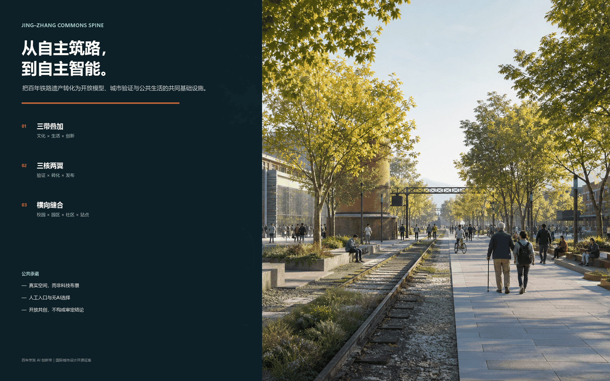
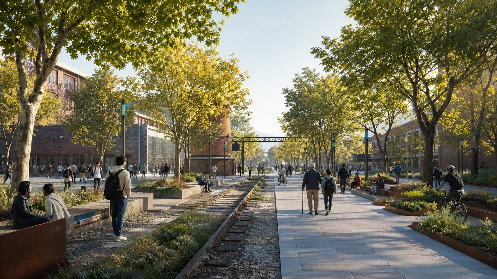
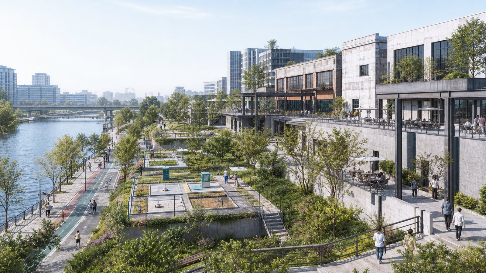
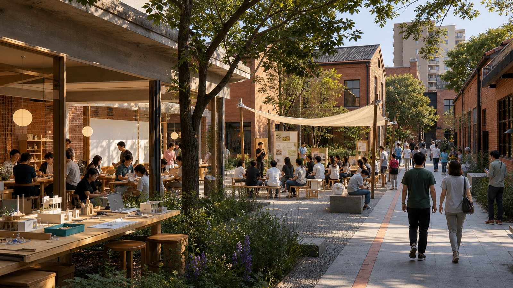
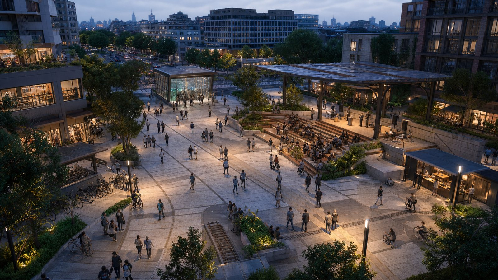
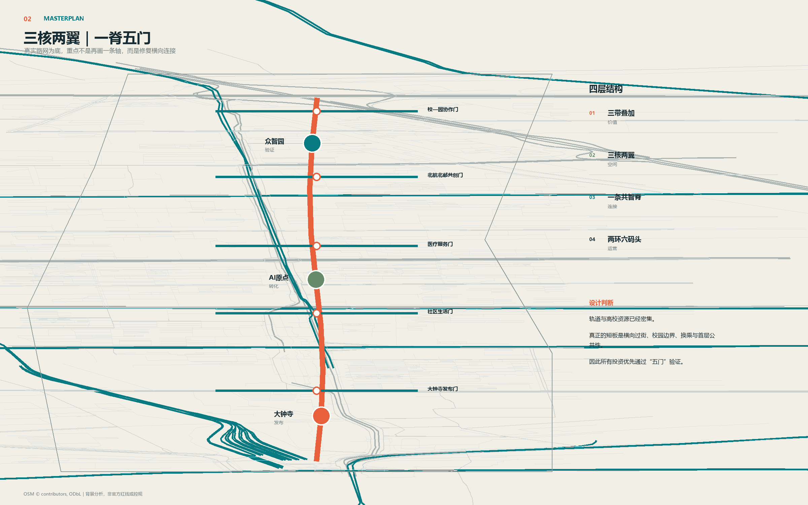
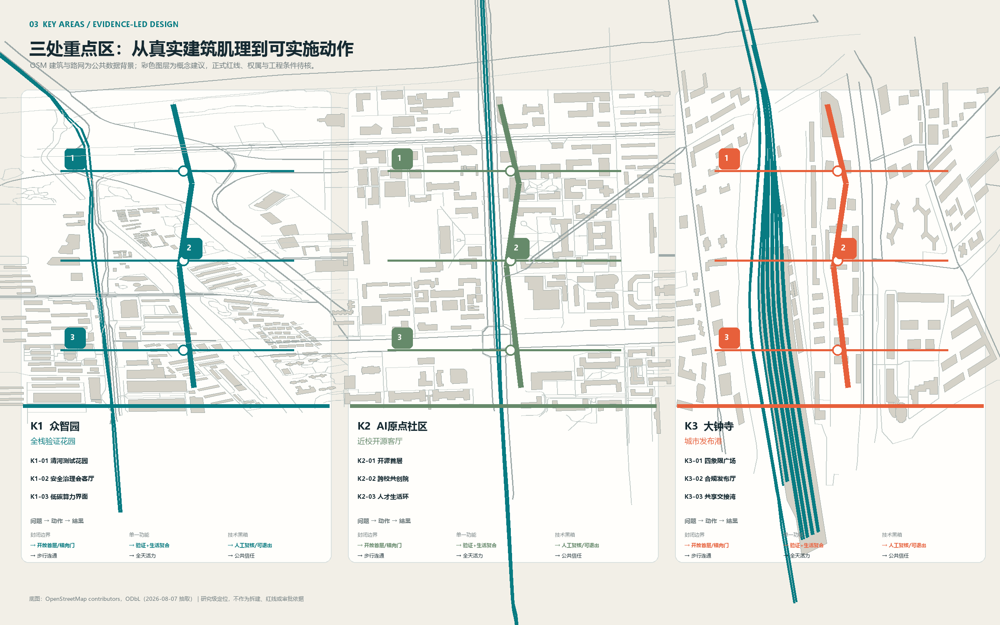
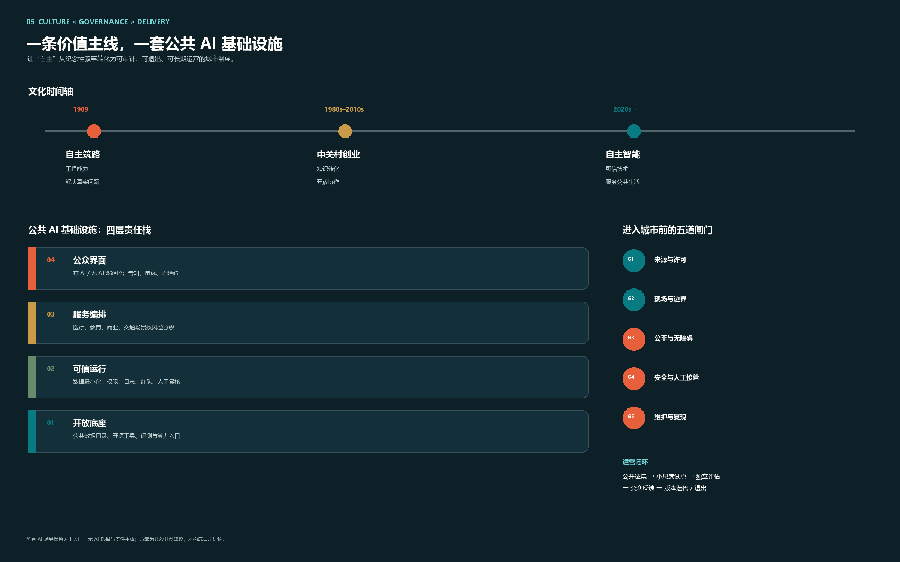
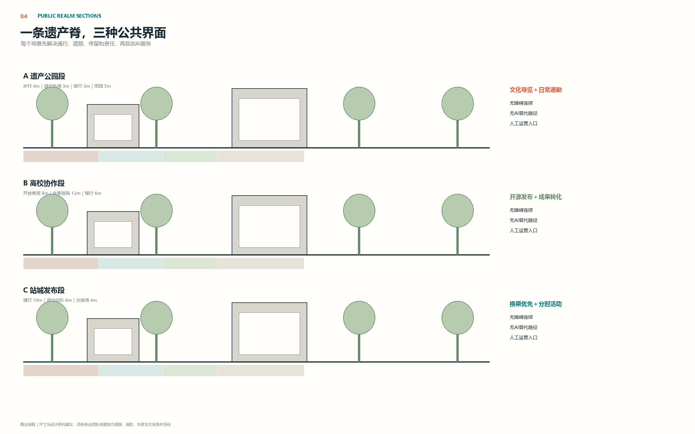

# 京张共智脊｜Jing-Zhang Commons Spine

## 设计依据与资料清单

本 formal 方案以北京市规划和自然资源委员会海淀分局发布的《百年京张AI创新带城市设计国际方案征集资格预审公告》为第一依据，并以 `brief/site-package/` 中经维护者登记的临时粗略边界、重点区域、枚举、指标和来源清单为机器可读依据。AI agent 在生成方案前必须读取 `design_brief.json`、`allowed_design_space.json`、`sources.json`、`enums/`、`ranges/`、`schemas/`、`data/source_registry.json` 和 `data/processed/agent_fact_pack.md`，并用 `project_scope_summary.csv`、`agent_task_requirements.csv`、`source_use_matrix.csv`、`missing_data_checklist.csv` 建立任务、范围、资料用途和缺口清单。所有设计判断都要拆分为可追溯来源、可复算指标、可校验图层和可人工复核假设。公告要求方案达到控制性详细规划的城市设计深度和规划综合实施方案的城市设计深度，因此文本叙述不能替代 GeoJSON、指标表、A3 文册、A0 展板和 HTML 电子展示成果。

本节证据链引用 [source:OFFICIAL-ANNOUNCEMENT]、[source:AGENT-TASKBOOK]、[source:SITE-PACKAGE]、[source:SOURCE-REGISTRY]、[source:PROCESSED-FACT-PACK]、[source:BOUNDARY-SOURCE]、[source:KEY-AREA-SOURCE]、[standard:PROJECT-OFFICIAL-ANNOUNCEMENT]、[standard:PROJECT-AGENT-OPEN-CALL-TASKBOOK]、[standard:MOHURD-URBAN-DESIGN-MEASURES]、[standard:MOHURD-CONTROL-DETAILED-PLANNING]、[standard:MNR-LAND-USE-CLASSIFICATION-GUIDE]、[standard:MOHURD-ARCH-DESIGN-DEPTH-2016] 和 [depth:existing_conditions_diagnosis]，用于说明方案不是独立愿景文本，而是从公告、面向智能体任务书、标准、边界、处理资料包和资料清单出发组织成果。

资料登记表的使用边界如下：

- data/source_registry.json 登记公开、清权与临时资料的用途边界。
- 当前登记摘要：formal 可用资料 5 条，背景资料 0 条，provisional-only 资料 1 条。
- agent 不得把 background_only 或 provisional_only 资料升级为 official boundary、法定控规、正式评分依据或政府实施承诺。

`data/processed/agent_fact_pack.md` 是本方案的阅读导航层，不是新的权威来源。[source:PROCESSED-FACT-PACK] 只帮助 agent 把三层范围、三处重点区、公告任务、agent.1-agent.6、资料可用性和缺资料事项组织成可读方案；所有事实判断仍回到 [source:OFFICIAL-ANNOUNCEMENT]、[source:AGENT-TASKBOOK]、[source:SOURCE-REGISTRY]、[source:BOUNDARY-SOURCE] 与 [source:KEY-AREA-SOURCE]。

本脚手架在官方 `SITE_BOUNDARY` 或三处 `KEY_AREA` 尚未取得时，使用 `brief/site-package/geometry/provisional_boundaries.geojson` 生成临时 formal 包。提交包中的 `geometry/site_boundary.geojson` 与 `geometry/key_areas.geojson` 均必须标注为 `provisional_constraint`、`official_boundary=false`，只能用于方案生成、自检、可视化和设计讨论，不能作为 official redline、审批依据、精确面积依据或法定控制结论。该组织方数据缺口本身不阻断内容评分；替换 official polygons 后，site boundary、key areas、land use、roads、green space、public space、buildings、phasing 和 metrics 均需重算。

本次脚手架生成的可评分状态为：**临时边界，保留精度警示并待正式数据发布后复算；不阻断内容评分**。因此，正文中的空间结构、场景、项目和指标均按“可讨论、可复核、可替换官方边界后重算”的原则写入；当官方边界和重点区 polygon 更新后，agent 必须重新运行脚手架、自检和图纸/HTML生成，不能只替换单个文件。

边界和重点区域的可读解释对应 [data:geometry/site_boundary.geojson#SITE-001]、[data:geometry/key_areas.geojson#PROV-KEY-001] 和 [metric:site_area_sqm]、[metric:key_area_count]。这意味着读者可以从正文回到 GeoJSON 查看边界来源、从 metrics 查看面积复算结果、从 sources 查看资料来源，而不是只相信一段文字判断。

## 优化设计总纲：从自主筑路到自主智能

京张铁路由詹天佑主持设计，是中国人自主设计建造的第一条干线铁路。方案不把这段历史仅作为景观符号，而把“用自主技术解决真实问题”的工程精神转译为AI时代的城市价值：从自主筑路，到自主研发基础模型、工具链、评测体系与场景治理。创新带因此不是企业园区的线性拼接，而是一条公众可以进入、开发者可以贡献、产业可以验证、城市可以监督的开放创新基础设施。[source:OFFICIAL-ANNOUNCEMENT] [source:AGENT-TASKBOOK] [standard:PROJECT-AGENT-OPEN-CALL-TASKBOOK]

### 上位结构：三带叠加、三核两翼

43.6平方公里统筹研究范围采用官方任务所述的“三带叠加”作为价值框架：**百年京张文化带**保存铁路遗产、工程记忆与中关村创新史；**都市AI生活体验带**让医疗、教育、商业、交通和公共服务场景进入日常；**AI融合创新带**贯通基础研究、开源协作、中试验证、企业孵化、资本及专业服务。三者不是三条平行道路，而是在同一片城市空间中叠合，以不同图层和运营机制互相校正。[depth:three_level_scope_framework] [depth:overall_spatial_structure]

空间上以“三核两翼”为上位组织：众智园核心承担全栈自主创新和产业验证，北京AI原点社区核心承担高校策源与近校转化，大钟寺核心承担城市发布、商业服务和国际交往；两翼连接沿线高校院所与成熟产业/生活片区，具体边界和名称须以组织方正式附件为准。方案自创的“一条共智脊、两环六码头”是三核两翼之下的设计工具，不替代官方任务结构。

### 场地序列：清华园—北航北邮—大钟寺

文化与场景导览形成由北向南的连续章节：清华园火车站片区作为“自主筑路原点”，重点呈现铁路工程史与自主创新精神；北航、北邮等高校区作为“知识与开源协作段”，配置跨校慢行联系、开源发布、成果转化和AI教育体验；大钟寺作为“城市发布港”，连接轨道、商业、智能体/终端展示与国际活动。该序列是概念性文化路线，不以文字或示意图推导官方红线。[data:geometry/roads.geojson#JZCS-SPINE-01]

### 设计层：一条共智脊、两环六码头

**共智脊**沿铁路遗址公园方向串联三类城市公地：开放模型公地提供共享工具链、评测协议与贡献荣誉；城市验证公地把模型安全、端侧智能、机器人和无障碍服务测试嵌入可监管空间；公共生活公地让居民在日常步行中理解、选择或退出AI服务。蓝绿韧性环和15分钟人才生活环约束产业扩张；遗产、原点、开源、验证、生活、国际六码头作为可预约、可展示、可复盘的运营接口。

### 品牌与视觉规范

中文名“京张共智脊”，英文名 **Jing-Zhang Commons Spine (JZCS)**。标志以两条交汇轨线构成：青色轨线代表开放技术链，黄绿色轨线代表公共生活链，交汇处的橙色节点代表可验证贡献。四色系统为遗产褐、开源青、生态绿、验证橙；导视采用中英双语、无障碍高对比和可触读原则。所有核心图使用自绘几何与许可字体，不使用企业Logo、人物肖像或未经许可的官方沿线示意图。

### 完整创新生态链

| 环节 | 城市载体 | 服务机制 | 可核验结果 |
| --- | --- | --- | --- |
| 基础研究 | 高校院所与联合实验空间 | 跨校课题、共享仪器、人才交流 | 公开课题与复现实验目录 |
| 开源协作 | 原点社区开源发布厅 | 代码维护、数据说明、模型评测 | 版本、许可证、复现记录 |
| 中试验证 | 众智园受控测试场 | 安全沙盒、端侧设备、城市共测 | 测试协议与风险复盘 |
| 企业孵化 | 共享办公和专业服务街 | 产品、法务、知识产权、算力入口 | 服务时效和团队成长 |
| 资本服务 | 大钟寺路演与尽调会客厅 | 长期资本、技术尽调、合规辅导 | 尽调清单与投后公共价值指标 |
| 全球发布 | 国际码头与公共活动路线 | 双语发布、开发者大会、城市体验 | 国际参与和开源贡献转化 |

该链路是空间与运营参考方案，不构成招商、投资或政府资金承诺。

### 六个全球案例及海淀转译

Station F提示集中创业服务，Kendall Square提示高校知识溢出，22@Barcelona提示渐进更新，Toronto Waterfront的争议提示数字治理问责，Seoul DDP提示地标与全年活动结合，High Line提示线性遗产空间的城市连接价值。海淀不复制其规模和产权机制，只转译为“服务集中、校园缝合、低扰动更新、隐私问责、日常运营、遗产连续性”六项机制。

### 十张场景卡

1. **模型安全沙盒（产业验证）**：众智园限定数据、限定人员、分级披露，红队结果经人工复核。
2. **端侧机器人街段（产业验证）**：限定时段、速度与物理范围，保留远程接管和事故日志。
3. **无障碍导航评测环（产业验证）**：由残障及老年用户参与共测，只记录匿名任务完成率。
4. **开源发布厅**：原点社区公开许可证、复现结果与维护贡献，不以融资额决定荣誉。
5. **AI教育共学站**：高校区提供课程导航和实验解释，未成年人使用须有人类教育者在场。
6. **AI医疗转介站**：只做健康信息解释和正规机构导航，不诊断、不替代医生。
7. **AI慢行导航**：依据聚合客流与设施状态提示路线，同时提供无AI路线与人工问询。
8. **AI商业共创橱窗**：大钟寺展示可解释推荐与可撤回授权，禁止人脸识别式强制营销。
9. **数据合规会客厅**：用模拟数据解释授权、脱敏、撤回、审计和申诉全过程。
10. **全球AI活动周路线**：串联遗产、开源、验证和发布四段，执行预约分流、降噪和活动复盘。

服务对象至少覆盖开源开发者、初创团队、企业访客、周边居民、高校师生，并补充国际研究者、儿童家庭、老年人与无障碍用户。每个场景深化时必须明确最小数据、人工复核、退出机制、运营责任和投诉通道。[data:geometry/public_space.geojson#PUBLIC-001] [metric:public_space_ratio]

### 公共空间、文化导览与AI地标

导览采用“三幕六站”：第一幕“自主筑路”设置工程记忆站与清华园原点站；第二幕“中关村创业”设置高校协作站与开源发布站；第三幕“自主智能”设置城市验证站与全球发布站。沿线配置开发者散步道、开源成果展示廊和三个方向性地标：**开源原点碑**记录可复现成果，**百年算法信号塔**以铁路信号语言讲述技术协同史，**全球贡献者站台**表彰开源维护、公共数据、无障碍和安全治理贡献。全部节点均须在文保、结构、消防、交通和版权条件补齐后由专业团队深化。

### 全球活动体系与长期运营闭环

年度节奏为“春季开源维护月—夏季城市验证季—秋季全球AI周—冬季公共价值审计”。每季执行六步闭环：公开征题、发布规则、受控试验、公众反馈、独立复核、归档复现。六码头分别承担活动入口，公开议题库与场景登记册承担数字入口；活动结束后将问题、事故、退出率、复现率和公众意见写入下一年度规则。具体主办方、资金、招商和日程均为待协商事项，不构成政府承诺。

### 开放共创边界

本提案作为GitHub公开展示的开放共创建议，所有空间方案、地标、场景、项目和运营机制均为概念建议或可供专业团队深化的参考方案，不构成审定规划、审批判断、投资承诺或工程实施结论。工程落地需由规划、建筑、交通、市政、文保、数据治理等专业人员依据官方资料人工深化。

### 空间体验图（概念表达）

以下场景图用于说明公共空间尺度、活动共存与材料气质，不作为官方边界、建筑方案、工程可行性或实施承诺。[source:AI-GENERATED-CONCEPT-RENDERINGS-V1]

## 三层范围工作框架

方案按照公告确定的三个层次组织工作：统筹研究范围关注 43.6 平方公里的AI产业生态、战略定位、创新链和未来城市形态；总体设计范围关注 11.4 平方公里京张遗址公园周边 1-2 公里城市地区和产业区，要求形成城市更新总体框架、产业空间布局、交通市政支撑和城市风貌控制；重点区域范围关注 368.4 公顷三处详细设计地区，要求明确功能业态、建筑规模、拆改留分类、公共空间连通和交通组织。三层范围在 `compliance_matrix.json` 中逐条映射，保证公告 1.3、1.4、1.5 与 agent.1-agent.6 的必选任务都有章节、图层、指标、图纸和 HTML 证据。

三层工作框架的深度项由 [depth:three_level_scope_framework] 和 [depth:overall_spatial_structure] 约束，空间证据以 [data:geometry/site_boundary.geojson#SITE-001] 与 [data:geometry/key_areas.geojson#PROV-KEY-001] 为准，任务依据以 [standard:PROJECT-OFFICIAL-ANNOUNCEMENT] 为准，范围索引以 [source:PROCESSED-FACT-PACK] 中 `project_scope_summary.csv` 的三层范围表为导航。

三层工作不是互相割裂的图纸集合。统筹研究决定产业链和城市形态判断，总体设计把判断落实到更新项目、空间结构和设施承载，重点区域详细设计验证具体地块、建筑、交通、公共空间和AI应用场景的可实施性。agent 生成方案时必须先锁定当前提交采用的 official 或 provisional 边界和约束，再生成用地、建筑、道路、绿地、公共空间、分期和AI服务节点，最后从这些图层复算指标并在正文解释哪些结论仍受 provisional boundary 限制。任何无法从结构化数据复算的面积、比例、规模或项目数量，不得写入正式结论。

本方案建议的总体概念为“京张共智脊”：以京张遗址公园为历史与公共空间主轴，以众智园、北京AI原点社区、大钟寺三处重点片区为创新锚点，以高校、企业、社区和轨道站点为日常网络，形成“一带三核、多点场景、蓝绿慢行复合环”的空间组织。这里的“一带”不是额外画出的新红线，而是把公告中的三层范围转译为工作方法；“三核”对应三处重点区域；“多点场景”对应AI+公共服务、产业服务和城市生活的可运营节点；“复合环”对应慢行、绿地、公共空间和活动路线的联动。

| 层级 | 设计问题 | 方案回答 | 数据落点 |
| --- | --- | --- | --- |
| 统筹研究范围 | AI产业生态和未来城市形态如何组织 | 建立“高校策源-开源协作-企业转化-公共体验-国际传播”的创新链 | compliance_matrix.json、standard_matrix.json |
| 总体设计范围 | 产业空间、城市更新、交通市政和风貌如何落图 | 用地、建筑、道路、绿地、公共空间和分期图层共同表达 | [data:geometry/land_use.geojson#LU-001]、[data:geometry/roads.geojson#ROAD-001] |
| 重点区域范围 | 三处片区如何达到详细设计深度 | 分别提出定位、空间动作、AI场景和实施依赖 | [data:geometry/key_areas.geojson#PROV-KEY-001]、[data:geometry/key_areas.geojson#PROV-KEY-002]、[data:geometry/key_areas.geojson#PROV-KEY-003] |

## 统筹研究范围产业与未来城市研究

统筹研究范围的核心任务是构建世界级 AI 创新生态体系。方案应梳理海淀高校院所、头部企业、算力算法数据要素、孵化平台、上市企业、独角兽和科技服务资源，提出AI创新链、产业链、人才链和城市服务链的空间协同框架。命名方案和 logo 设计应服务于“百年京张文化带、都市AI生活体验带、AI融合创新带”的整体辨识度，不能只停留在口号，应说明与产业生态、公共空间和文化资源的关联。面向智能体任务书还要求回应“五大功能”和“三区两翼”协同，形成可继续深化的命名系统、视觉识别、总体空间结构图、场景开放和运营机制；本节必须用 [source:AGENT-TASKBOOK] 与 [standard:PROJECT-AGENT-OPEN-CALL-TASKBOOK] 标注这些要求来自 agent 开源征集任务，而不是法定规划控制。

统筹研究并不新增伪精确红线；它通过 [standard:MOHURD-URBAN-DESIGN-MEASURES] 要求的城市风貌、公共空间和建筑布局统筹，回接 [data:geometry/land_use.geojson#LU-001]、[data:geometry/public_space.geojson#PUBLIC-001] 与 [depth:overall_spatial_structure]，说明产业策略最终要落到可见、可复核的空间结构。

未来城市形态研究应回答人工智能如何改变工作、生活、社交、学习、交通和公共服务。方案应把AI交通系统、连续绿色空间、创新服务设施和国际化生活工作氛围落实为可定位的功能区、节点、廊道和场景，而不是泛泛描述技术愿景。agent 应把产业战略指标、AI创新指数、人才密度、空间供给类型和AI+垂直应用重点区域写入指标体系，并标明哪些是官方、哪些是设计建议、哪些仍待正式数据校准。若提出全球AI创新活动、开发者社区、开放场景或朝圣路线，应写为“概念建议/参考方案/可供专业团队深化研究”，不得写成已经确定的政府活动或实施安排。

## 总体设计范围城市更新与控规深度城市设计

总体设计范围要求达到控制性详细规划的城市设计深度。方案必须提出城市更新总体空间结构、低效空间识别、更新项目清单、实施政策建议、产业功能比例、空间组织模式、建筑总规模和综合承载能力评估。`geometry/land_use.geojson` 应完整覆盖设计边界且无重叠，`geometry/buildings.geojson` 应表达更新建筑基底或保留建筑基底，`geometry/roads.geojson` 应表达微循环、慢行和轨道接驳关系，`metrics.json` 应复算核心面积、比例和图层数量。

本节按照 [standard:MOHURD-CONTROL-DETAILED-PLANNING] 把控规深度内容拆成可审查对象：[data:geometry/land_use.geojson#LU-001] 表达用地结构，[data:geometry/buildings.geojson#BLDG-001] 表达建筑基底，[data:geometry/roads.geojson#ROAD-001] 表达交通组织，[metric:building_footprint_area_sqm] 用于复核建筑基底面积，[depth:land_use_layout] 与 [depth:development_intensity_controls] 约束成果深度。

总体设计还必须支撑交通、轨道、市政和配套设施。方案应围绕轨道站点一体化、道路微循环、非机动车停放、停车供给、创新服务平台、人才生活服务、新型基础设施、分布式能源和端侧算力提出空间布局和实施路径。涉及建筑高度、开发强度、道路红线、退线和设施标准的内容，若尚无官方控制条件，应写为“待正式控规条件确认”，不得以 agent 推测值冒充审定指标。

## 评审速读：三张图读懂方案

1. **为什么是这里**：真实路网与建筑肌理显示，沿线短板不是缺少创新机构，而是校区、园区、社区与站点之间横向联系不足。
2. **怎么改**：以“一条共智脊、五个横向门”连接三核两翼；K1 验证、K2 转化、K3 发布，九个编号动作与场景图一一对应。
3. **如何避免 AI 景观化**：公共 AI 采用四层责任栈和五道证据闸门，保留人工入口、无 AI 路径、申诉与退出机制。

文化叙事遵循“1909 自主筑路—中关村创业—自主智能”：共同内核不是怀旧或炫技，而是以自主能力解决真实公共问题。

## 重点区域详细设计

重点区域详细设计是必选项。众智园AI自主创新加速区应围绕国家人工智能平台、全栈自主创新、标准制定、安全治理、产业展示、对外交通、清河文化、低碳绿色创新交往环境和绿色空间AI场景提出详细方案。北京AI原点社区应围绕近校创新、成果孵化转化、人才特区、开源体系、品牌活动、建筑拆改留、成果展示发布、居住生活配套、校区园区慢行联系和轨道站点一体化提出详细方案。大钟寺AI产业聚集区应围绕领军企业、智能体、智能终端、内容消费、数据要素、数字资产、商业服务、规划绿地复合利用、大钟寺站一体化和路口四象限步行连通提出详细方案。

三处重点区域详细设计必须引用 [data:geometry/key_areas.geojson#PROV-KEY-001]、[data:geometry/key_areas.geojson#PROV-KEY-002]、[data:geometry/key_areas.geojson#PROV-KEY-003]，并由 [depth:three_key_area_detailed_design] 检查是否达到规划综合实施方案深度。若只描述“打造示范区”而没有功能、建筑、交通、公共空间和实施项目证据，应被视为未完成。

三处重点区域必须在 `geometry/key_areas.geojson` 中出现。若仓库已提供 official polygons，应作为 `official_constraint` 使用；若 official polygons 缺失，可暂用 `provisional_constraint`，但正文、HTML、sources、assumptions 和 self_check 必须说明它不能作为正式评分或审批依据。`compliance_matrix.json` 应分别覆盖公告 1.5.3.1、1.5.3.2、1.5.3.3。设计表达应包含功能业态、建筑规模、建筑形态、拆改留分类、公共空间系统、交通组织、慢行连通和实施项目。HTML 页面应能切换查看三处重点区域，A3 文册和 A0 展板应至少包含重点片区总图、局部详图和指标说明。

| 重点片区 | 设计定位 | 空间动作 | AI产业与运营场景 | 证据引用 |
| --- | --- | --- | --- | --- |
| 众智园AI自主创新加速区 | 花园型全栈自主创新街区 | 强化清河界面、产业展示、低碳创新交往和对外交通组织；以绿色空间承载开放测试与标准治理展示 | 自主模型测试、标准制定工作坊、安全治理展示、低碳算力体验 | [data:geometry/key_areas.geojson#PROV-KEY-001]、[depth:three_key_area_detailed_design] |
| 北京AI原点社区 | 近校型成果转化与人才社区 | 组织校区、园区、街区慢行缝合；补足成果发布、人才服务、居住生活和开源协作空间 | 开源社区、成果发布、人才特区服务、近校孵化 | [data:geometry/key_areas.geojson#PROV-KEY-002]、[source:AGENT-TASKBOOK] |
| 大钟寺AI产业聚集区 | 城市型智能经济与国际交往街区 | 围绕大钟寺站一体化、四象限步行连通、商业服务和重点企业公共环境更新 | 智能体与智能终端展示、内容消费、数据要素与国际路演 | [data:geometry/key_areas.geojson#PROV-KEY-003]、[metric:key_area_count] |

## AI 创新生态、人才画像与 AI+ 场景

方案应建立面向AI人才和企业的空间需求画像，覆盖研发办公、开源协作、成果发布、企业服务、人才居住、社交学习、消费生活、运动休闲和国际交往。AI+场景应围绕公告提出的交通、服务、消费、医疗、教育、法律、生活服务等方向，形成产业发展场景和AI赋能城市功能场景。每个场景应说明服务对象、空间位置、数据来源、隐私边界、人工复核机制和运营主体。

AI 场景必须落到空间和治理边界：公共空间场景引用 [data:geometry/public_space.geojson#PUBLIC-001]，慢行与交通场景引用 [data:geometry/roads.geojson#ROAD-001]，开放空间场景引用 [data:geometry/green_space.geojson#GREEN-001] 和 [metric:public_space_ratio]、[metric:green_ratio]。这些引用让评审者知道场景不是口号，而是位于具体图层和指标中的设计对象。面向智能体任务书要求不少于10张AI场景卡、不少于3个产业测试验证场景和不少于5类用户画像；脚手架只给出结构，正式参赛者必须把场景卡、画像表、隐私边界、人工复核和运营主体写入正文、HTML、A3/A0 和合规矩阵。

| 用户画像 | 典型需求 | 空间响应 | 自检边界 |
| --- | --- | --- | --- |
| 开源开发者 | 发布、协作、测试、社区声誉 | 原点社区开源发布厅、公共代码墙、夜间协作空间 | 不采集个人行为轨迹；活动数据只做聚合统计 |
| 初创团队 | 低成本办公、算力入口、产品试验场 | 众智园共享测试场、端侧算力服务点、标准治理咨询 | 算力和数据服务需另行授权 |
| 头部企业访客 | 展示、商务、国际接待、人才招聘 | 大钟寺国际路演客厅、轨道站点接驳、重点企业周边公共空间 | 企业标识和案例须清权 |
| 周边居民 | 通勤、休闲、社区服务、低扰动更新 | 京张遗址公园慢行环、社区服务嵌入、夜间照明和活动分级 | 不将居民画像用于商业推荐 |
| 高校师生 | 成果转化、跨校协作、日常慢行 | 校区-园区慢行缝合、成果转化驿站、AI教育体验点 | 校园数据和科研成果需授权 |

| 场景卡 | 空间载体 | 设计说明 |
| --- | --- | --- |
| 01 开源发布厅 | 北京AI原点社区 | 面向高校、开源社区和初创团队，提供成果发布、代码贡献展示和小型路演空间 |
| 02 安全治理沙盒 | 众智园 | 将标准制定、安全评测、模型红队测试转译为可参观、可预约、可监管的展示和协作节点 |
| 03 端侧算力驿站 | 总体设计范围节点 | 与公共服务、企业服务和低碳能源策略结合，作为待深化的新型基础设施原型 |
| 04 AI慢行导航 | 京张遗址公园活力带 | 用可解释导视和低侵入传感帮助识别慢行断点、拥挤节点和无障碍需求 |
| 05 大钟寺国际路演客厅 | 大钟寺AI产业聚集区 | 服务智能体、智能终端和内容消费企业的展示、洽谈、媒体发布和国际交流 |
| 06 清河低碳创新廊 | 众智园临清河界面 | 把绿色空间、雨洪、步行骑行和AI展示结合，作为园区公共客厅 |
| 07 近校成果转化街 | 北京AI原点社区 | 面向高校成果转化，组织孵化、展示、法务、知识产权和投融资服务 |
| 08 数据要素会客厅 | 大钟寺片区 | 以合规、授权、可审计为前提，展示数据要素和数字资产流通的城市服务界面 |
| 09 AI生活服务样板街 | 社区与商业交汇处 | 将医疗、教育、法律、生活服务等AI+场景落到可运营的小尺度街区空间 |
| 10 全球AI活动周路线 | 一带公共空间系统 | 形成从遗址文化、开源社区、产业展示到国际路演的可步行、可传播体验路线 |

agent 生成的AI治理建议必须遵守数据最小化、公开来源、可解释和人工复核原则。城市智能体可以辅助识别慢行断点、公共空间热力、设施维护、企业服务需求和活动安全风险，但不能替代规划审批、不能输出未经授权的个人画像、不能声称获得官方实施承诺。所有AI场景节点应进入结构化图层或合规矩阵，便于评审者看到它们与产业、空间和公共利益之间的关系。

## 用地、建筑规模与拆改留方案

用地方案应依据国土空间调查、规划、用途管制分类等公开标准表达，形成完整、闭合、无缝的用地分区。建筑方案应区分保留、改造、更新、新建或待确认对象，明确建筑基底、功能、规模、风貌、屋顶、体量和高度控制的建议层级。若缺少现状建筑、权属、控规和工程条件，方案只能提出方法和待校准清单，不能编造拆改留结论。

用地分类依据 [standard:MNR-LAND-USE-CLASSIFICATION-GUIDE]，建筑高度、体量、界面和风貌控制由 [depth:height_massing_character] 管理，拆改留方法由 [depth:retain_renovate_demolish] 管理。用地和建筑的主要证据是 [data:geometry/land_use.geojson#LU-001]、[data:geometry/buildings.geojson#BLDG-001] 和 [metric:building_footprint_area_sqm]。

建筑规模和强度指标必须与 `metrics.json` 和图层一致。若总建筑规模、容积率、建筑高度、建筑密度、绿地率、退线和建筑控制线缺少官方条件，应在指标体系中列为 unknown 或 pending_control，不得用固定数值制造精确感。A3 文册应给出更新项目清单和指标复核表，A0 展板应把关键空间结构和重点片区表达清楚，HTML 页面应提供指标和图层联动查看。

## 交通、轨道、市政与公共服务设施

交通方案应回应公告对轨道站点一体化、道路微循环、慢行断点、对外交通、停车、非机动车停放和绿色交通系统的要求。重点应覆盖北五环、京张遗址公园跨环路节点、五道口、清华东路西口、大钟寺站及重点企业周边交通联系。道路和慢行图层应保持在提交边界内，并与公共空间、绿地、产业节点和重点片区相互校核；若提交边界为 provisional，交通结论也只能作为临时设计讨论。

交通和市政专业深度分别由 [depth:traffic_rail_slow_parking] 与 [depth:municipal_new_infrastructure] 约束；图层证据引用 [data:geometry/roads.geojson#ROAD-001]、[data:geometry/public_space.geojson#PUBLIC-001] 和 [data:geometry/constraints.geojson#CONSTRAINTS]。当道路红线、管线、消防和市政条件缺失时，应通过 assumptions 说明待补，而不是把策略写成审定条件。

市政和公共服务设施应覆盖AI产业服务设施、创新服务平台、人才生活服务设施、新型基础设施、分布式能源、端侧算力和传统市政设施融合。方案应说明设施标准、空间布局、服务半径、运营模式和分期实施逻辑。缺少管线、能源、排水、防洪、消防等工程资料时，应列为正式深化前置条件。

## 蓝绿空间、公共空间与城市风貌

蓝绿空间方案应以京张遗址公园活力带为骨架，统筹清河、小月河、周边高校、企业、社区出行需求，提出南北贯通、东西连通的步道、骑行道和绿色空间体系。方案应识别慢行断点、上跨环路节点、公园南端和北端景观节点，提出停车、体育、创新交往、科技测试、应用展示和公共服务复合利用策略。

蓝绿公共空间由 [depth:blue_green_public_space] 校核，核心证据为 [data:geometry/green_space.geojson#GREEN-001]、[data:geometry/public_space.geojson#PUBLIC-001]、[metric:green_ratio] 和 [metric:public_space_ratio]。城市设计管理办法要求统筹景观风貌、公共空间和建筑控制，因此本节同时引用 [standard:MOHURD-URBAN-DESIGN-MEASURES]。

城市风貌方案应融合京张铁路历史文化、中关村创新文化和AI创新文化，利用清华园火车站、北影等文化资源，提出城市基调、建筑风貌、屋顶形态、体量、界面和公共艺术引导。agent 还应提出导视标识、文化符号、国际传播叙事、AI朝圣地标、贡献墙或荣誉展示体系，但所有品牌、字体、图像、肖像和企业标识都必须有清权来源。风貌控制应分清官方管控、设计建议和待确认条件，严禁在没有文保或控规依据时给出伪精确控制线。

## 更新项目清单、实施政策与分期计划

实施方案应形成可审查的更新项目清单，说明项目位置、类型、功能、责任主体、依赖条件、实施阶段、风险和评估指标。政策建议应覆盖城市更新统筹实施、空间供给、运营机制、产业服务、公共参与、数据治理和产权协同。`geometry/phasing.geojson` 应表达分期范围，`compliance_matrix.json` 应把每个任务与分期和图纸挂接。

项目清单和分期深度由 [depth:renewal_project_list] 与 [depth:phasing_implementation] 管理，分期空间证据为 [data:geometry/phasing.geojson#PHASE-001]。如果没有权属、资金、实施主体和审批路径，方案必须把它写成实施风险，而不是承诺落地。

| 项目编号 | 项目名称 | 类型 | 主要依赖 | 证据引用 |
| --- | --- | --- | --- | --- |
| JZ-01 | 京张遗址公园慢行断点缝合 | 公共空间/交通 | 道路红线、桥下空间、交通组织复核 | [data:geometry/roads.geojson#ROAD-001] |
| JZ-02 | 众智园清河创新界面 | 蓝绿空间/产业展示 | 河道蓝线、生态和防洪条件 | [data:geometry/green_space.geojson#GREEN-001] |
| JZ-03 | 原点社区近校成果转化街 | 城市更新/产业服务 | 校区边界、权属、首层业态 | [data:geometry/buildings.geojson#BLDG-001] |
| JZ-04 | 大钟寺站四象限步行连通 | 轨道一体化/慢行 | 轨道站点、道路交叉口、市政管线 | [data:geometry/public_space.geojson#PUBLIC-001] |
| JZ-05 | AI公共服务与端侧算力节点 | 新基建/公共服务 | 能源、算力、安全和运营主体 | [data:geometry/constraints.geojson#CONSTRAINTS] |
| JZ-06 | 全球AI活动周公共路线 | 运营/品牌 | 公共空间许可、活动安全、版权清权 | [data:geometry/phasing.geojson#PHASE-001] |

分期应与 100 天征集设计周期形成区分：征集周期是提交成果的时间要求，实施分期是城市更新和项目建设的推进路径。方案应提出近期试点、中期更新和长期治理框架，并标明哪些内容可先以轻量设施、运营活动和服务平台启动，哪些必须等待正式控规、市政、交通和权属条件确认。对于年度活动体系、开发者社区运营、场景开放日、公共体验路线和国际传播机制，正文应说明运营对象、频率、责任边界、转化路径和风险，不得只写宣传口号。

## 指标体系、面积复算与合规矩阵

指标体系至少应包含总体设计范围面积、重点区域面积、绿地与公共空间比例、建筑基底、更新项目数量、AI场景节点、慢行连通指标、产业空间指标、人才服务指标和自检状态。所有 known 指标必须能从 GeoJSON 或可信来源复算；unknown 指标必须给出原因和正式提交前置条件。`scripts/spatial_review.py` 和 `scripts/visual_review.py` 的结果是 formal 自检的重要证据。

指标复算深度由 [depth:metrics_recalculation] 管理。本方案正文显式引用 [metric:site_area_sqm]、[metric:key_area_count]、[metric:building_footprint_area_sqm]、[metric:green_ratio]、[metric:public_space_ratio]，并说明这些值来自 [data:geometry/site_boundary.geojson#SITE-001]、[data:geometry/key_areas.geojson#PROV-KEY-001]、[data:geometry/buildings.geojson#BLDG-001]、[data:geometry/green_space.geojson#GREEN-001] 和 [data:geometry/public_space.geojson#PUBLIC-001]。

合规矩阵是任务响应性的主控文件。每条公告任务和 agent_taskbook 任务必须对应到报告章节、图层、指标、图纸、HTML 页面、来源、假设和自检项。未能覆盖公告 1.3、1.4、1.5 或 agent.1-agent.6 的任一必选任务，方案不得进入 formal professional scoring。

正式深化时，agent 还应把每个指标分为三类：第一类是可由提交几何直接复算的空间指标，例如边界面积、绿地比例、公共空间比例、建筑基底面积和分期面积；第二类是需要官方控规或任务书附件支撑的管控指标，例如容积率、建筑高度、建筑密度、退线、道路红线和设施标准；第三类是需要运营或产业数据持续校准的绩效指标，例如 AI 创新指数、人才密度、产业服务满意度、慢行可达性、活动参与度和场景使用频次。三类指标应分别进入 `metrics.json`、`assumptions.json` 和 `compliance_matrix.json`，避免把运营愿景误写成审定规划条件。

## 真实空间底图诊断与设计转译

本轮使用OpenStreetMap公开路网、轨道、步行、教育、医疗和公园要素建立背景分析图，检索范围与仓库临时范围一致，获取日期为2026年8月7日。数据遵循ODbL，仅用于现状理解、网络诊断和设计图表达，不作为官方红线、道路红线、控规、产权或工程依据。[source:OSM-OVERPASS-CONTEXT-20260807]

### 五项空间判断

1. **南北资源密、横向联系弱**：沿线高校、轨道与公共服务资源密集，但共智脊的价值不在重复建设南北轴，而在缝合校园、园区、社区与站点之间的东西向断点。
2. **“靠近地铁”不等于“好走”**：站点一体化应以真实步行时间、过街等待、无障碍连续性和夜间体验评价，而不是直线距离。
3. **校园边界是创新界面**：北航、北邮等高校周边应优先寻找可开放首层、共享会议、成果发布和跨校协作入口；校内数据和校门调整必须经学校授权。
4. **公共空间要同时服务日常与验证**：公园、绿道和广场承担通勤、休闲、文化导览与受控AI测试，但任何测试都不得挤压无障碍通行和普通市民的无AI选择。
5. **末端配送需要空间而非驱赶**：在商业、高校和社区交界处设置分时共享交接湾、骑手休息与补给点；选址依据必须来自匿名聚合订单、停留和冲突数据，而不是个人轨迹。

### 五个横向缝合门

方案将沿线横向联系组织为五类概念节点：校—园协作门、北航北邮共创门、医疗服务门、社区生活门和大钟寺发布门。每个节点的深化必须同时提交“步行网络、无障碍、首层业态、配送组织、夜间照明、数据边界、人工运营”七项证据。节点目前只表达设计方法，不代表已确定具体地块或工程线位。[data:geometry/roads.geojson#JZCS-SPINE-01] [depth:traffic_rail_slow_parking]

### 三处重点区放大策略

- **众智园全栈验证花园**：以可封闭、可预约、可复盘的小尺度测试场替代整片“智慧园区”；清河界面优先承担低碳步行与公众解释，安全测试与日常开放分时分区。
- **AI原点社区近校开源客厅**：把开源发布、知识产权、法务、算力入口、人才服务和生活配套组织在真实步行链上；以可开放首层和小院更新优先，拆改留结论等待建筑、权属和消防调查。
- **大钟寺城市发布港**：围绕轨道换乘和四象限步行联系形成国际路演、AI商业共创橱窗、数据合规会客厅及共享交接湾；站城一体方案等待官方站点、道路、市政和工程资料。

### 三阶段项目包

| 阶段 | 项目组合 | 进入下一阶段的证据闸门 |
| --- | --- | --- |
| 100天轻量试点 | 步行与无障碍审计、开源展廊、文化导览、场景登记册、骑手共创访谈 | 公开来源、许可、现场核验、公众反馈 |
| 1—3年节点更新 | 横向缝合门、共享交接湾、受控验证场、开放首层、蓝绿微更新 | 官方边界、权属、交通、市政、文保和安全复核 |
| 3—8年系统深化 | 站城一体、连续蓝绿网络、存量片区更新、国际活动长期运营 | 控规与审批、资金责任、工程设计、持续运营评估 |

### 评价指标

深化阶段不以“装了多少传感器”评分，而以真实步行时间、无障碍完整率、过街等待、公共空间停留、AI人工转接率、无AI路线可用率、开源复现率、试点转正式服务比例、骑手设施使用率及投诉闭环时间评价。所有人群数据采用知情同意或匿名聚合；热力图不得直接决定拆改留或公共资源配置。

## 数据证据底座与空间推断边界

### 区域创新与公共服务基线

海淀区2025年末常住人口311.1万人、地区生产总值13691.4亿元；信息传输、软件和信息技术服务业投资增长1.5倍。这说明创新带不能只提供研发办公，还必须把通勤、住房、教育、健康、休闲和社区服务纳入产业空间评价。[source:HAIDIAN-STAT-BULLETIN-2025]

创新供给方面，海淀区2025年拥有92家全国重点实验室，备案上线大模型123款；全年专利授权65142件，其中发明专利50132件，有效发明专利349404件；登记技术合同5.79万项、成交总额4053.1亿元。数据支持“研究—开源—验证—转化—资本—发布”的完整链路，但它们是全区总量，不能直接分摊到京张沿线或某个重点区。[source:HAIDIAN-STAT-BULLETIN-2025]

教育服务方面，全区共有普通中学90所、小学93所、幼儿园213所，在校生分别为14.4万人、20.7万人和6.3万人。官方概况同时记录37所高校、92家全国重点实验室、96家国家级科研机构和144个公园。这些区级数据证明教育、科研和开放空间具有形成协作网络的基础，但本方案只把北航、北邮等沿线高校作为任务材料明确指向的概念节点；具体校门、服务半径和步行量需用正式POI、路网及调查校准。[source:BEIJING-HAIDIAN-OVERVIEW-2026] [source:HAIDIAN-STAT-BULLETIN-2025]

### 行业数据的统计口径

国家统计局的软件和信息技术服务业调查制度对不同类型企业设置主营业务收入和业务占比门槛。因此，后续建立沿线企业图谱时，必须区分统计制度覆盖企业、初创企业、科研团队、非独立法人实验室和开源社区；不能把工商注册数量、园区入驻数量和统计调查企业数量混为一个“AI企业数”。[source:NBS-SOFTWARE-SURVEY-2025]

### 配送、网约车与新就业群体

北京市2025年快递业务量27.45亿件，其中同城6.22亿件；全行业营业场所5914处、快递服务汽车34229辆。该市级聚合统计证明末端配送空间是高密度城区必须处理的基础设施问题，但不能推导海淀或京张沿线的订单量、骑手路径和站点位置。[source:BEIJING-POSTAL-BULLETIN-2025]

因此提出三个方向性原型：在高校和社区边界设置不侵占慢行空间的“共享交接湾”；在大钟寺商业区设置分时货运与骑手休息补给点；在众智园设置无人配送的封闭测试区。实际选址须取得匿名聚合的15分钟网格订单、路段停留、冲突点和设施使用数据，并完成劳动权益、道路安全、隐私与运营评估。不得提交个人订单、设备标识、精确家庭地址或可回溯个体的轨迹。

### 可用数据分级

| 等级 | 数据示例 | 本方案用途 | 禁止越界 |
| --- | --- | --- | --- |
| A：官方统计 | 海淀统计公报、国家统计制度 | 区域基线、指标口径、需求方向 | 不下推到地块或个人 |
| B：官方开放数据文件 | 学校、公园、步道、通学公交 | 核验设施分布和服务缺口 | 未下载核验前不当作空间事实 |
| C：清权聚合运营数据 | 15分钟网格订单、聚合OD、设施使用 | 热点识别、时段管理、试点评估 | 不保留个人轨迹和家庭地址 |
| D：公众参与数据 | 步行审计、无障碍共测、问卷 | 发现体验问题、验证方案 | 需知情同意、最小采集和退出机制 |
| E：开放地图 | 道路与POI背景 | 导航和初步可达性分析 | 不得替代官方边界、红线或控规 |

北京市公共数据开放平台已列出海淀健走步道、通学公交、公园等数据资源。正式深化应逐项下载并核验字段、更新时间、坐标、许可证和完整性后再进入GeoJSON；当前仅登记为数据发现目录，不把目录页面等同于数据文件。[source:BEIJING-OPEN-DATA-CATALOG]

### 下一轮数据采集与可检验指标

1. **慢行连续性**：路口过街等待、无障碍坡道完整率、骑行断点、夜间照度；由专业踏勘和公开路网共同核验。
2. **高校协作可达性**：校门至开源节点的真实步行时间，而非直线距离；校门与校园数据需授权。
3. **配送冲突**：15分钟网格的停留、违停和人车冲突，仅保存匿名聚合结果。
4. **场景公平性**：不同年龄、残障状态和职业用户的任务完成率、人工转接率与退出率。
5. **创新转化**：开源复现率、测试转正式服务比例、专业服务响应时间，而非只统计活动人数。

所有第三方数据在纳入正式空间结论前须完成来源、许可、时间、空间粒度、代表性、偏差和隐私影响检查。热力图只能作为调查线索，不能以颜色强弱直接决定拆改留、道路红线或公共资源配置。[depth:existing_conditions_diagnosis] [depth:risk_missing_data]

## 风险、版权与合规说明

方案文件可使用中文或英文；英文为主语言时，必须在同一 `proposal.md` 中附完整中文正式译文，并设置双语元数据。所有图片、图纸、图标、数据和代码资产必须在 `sources.json` 或 `report/copyright_statement.md` 中说明来源、许可和授权状态。HTML 页面不得加载远程脚本、远程地图瓦片、远程字体、iframe、表单或外部 API，不得跟踪评审者行为。

风险和缺资料清单由 [depth:risk_missing_data] 管理，并与 [data:geometry/constraints.geojson#CONSTRAINTS]、[source:SITE-PACKAGE]、[source:PROCESSED-FACT-PACK] 和 [standard:MOHURD-CONTROL-DETAILED-PLANNING] 相互校核。`missing_data_checklist.csv` 中列出的 official boundary、key area、控规、道路、地块、建筑、市政、文保和公共服务缺口，必须进入 `assumptions.json`、自检和正文风险章节。任何缺少官方控规、道路红线、权属、市政、消防或文保条件的结论，都必须降级为待确认事项。

本方案不声称官方批准、审定控规、最终土地权属、最终建设规模或保证实施。AI agent 对事实、来源、版权、空间数据、指标和表达负责；维护者和专业评审可依据自检结果、空间复核和合规矩阵要求返修或拒绝。

## 参考资料

- brief/public-brief.md
- brief/site-package/design_brief.json
- brief/site-package/allowed_design_space.json
- brief/site-package/enums/
- brief/site-package/ranges/planning_limits.json
- data/processed/agent_fact_pack.md
- data/processed/project_scope_summary.csv
- data/processed/agent_task_requirements.csv
- data/processed/source_use_matrix.csv
- data/processed/missing_data_checklist.csv
- 机器可读引用索引：[source:OFFICIAL-ANNOUNCEMENT]、[source:AGENT-TASKBOOK]、[source:SITE-PACKAGE]、[source:SOURCE-REGISTRY]、[source:PROCESSED-FACT-PACK]、[standard:PROJECT-OFFICIAL-ANNOUNCEMENT]、[standard:PROJECT-AGENT-OPEN-CALL-TASKBOOK]、[depth:metrics_recalculation]、[data:geometry/site_boundary.geojson#SITE-001]、[metric:site_area_sqm]
