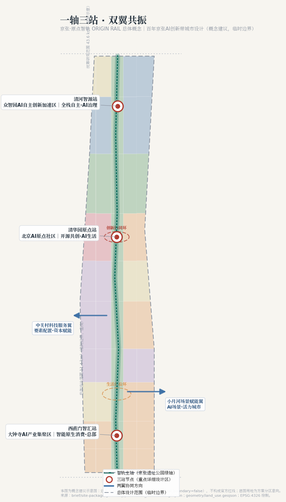
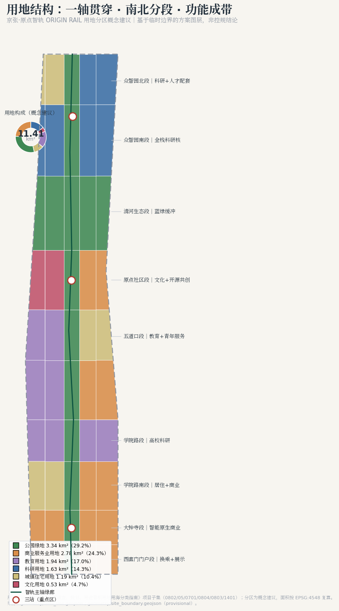
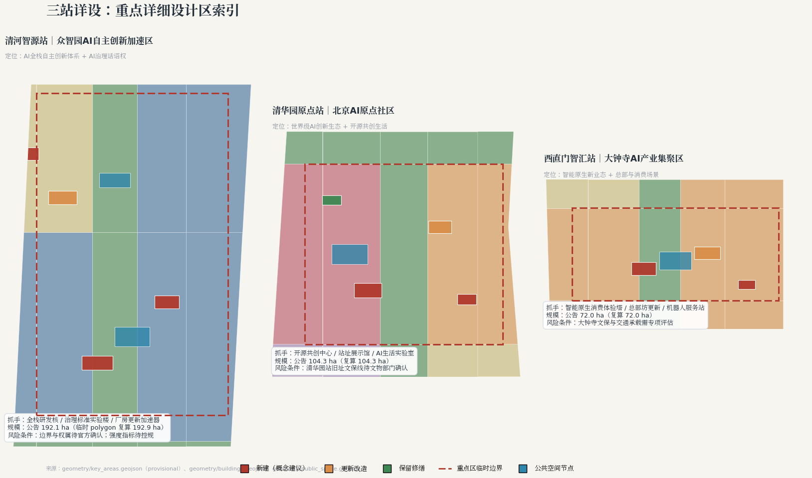
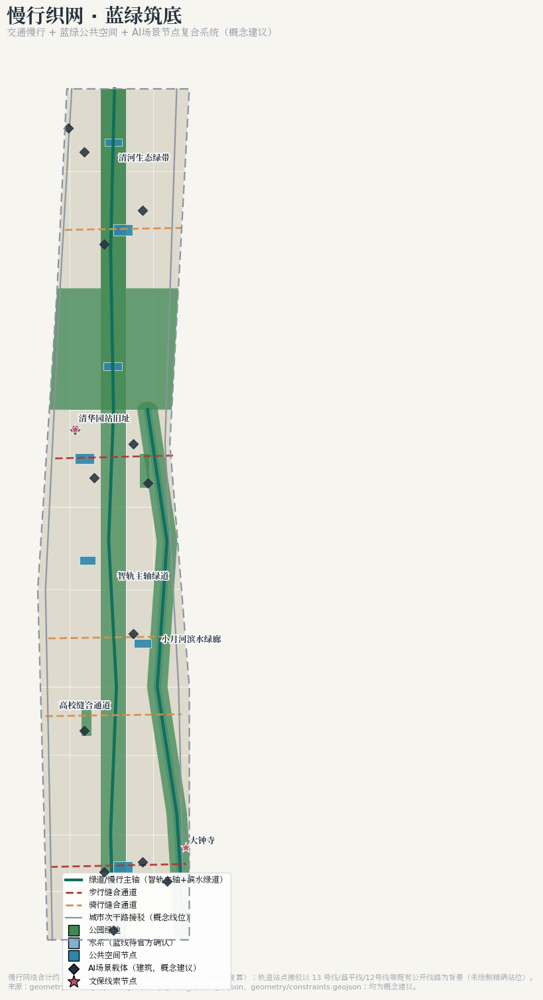
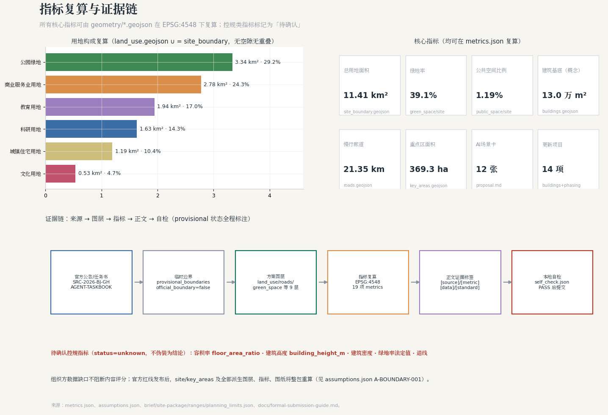

# 京张·原点智轨 ORIGIN RAIL —— 百年京张AI创新带城市设计方案

> **边界声明**：本方案全部空间落地、活动运营、品牌传播与政策机制内容均为**概念建议、参考方案、可供专业团队深化研究**的开放共创成果，不替代正式规划，不构成政府审定结论。当前总体设计范围与三处重点区域均基于 `brief/site-package/geometry/provisional_boundaries.geojson` 临时粗略边界生成（`official_boundary=false`、`geometry_role=provisional_constraint`），不得作为官方红线、审批依据或精确面积依据；官方精确边界发布后，全部图层、指标、图纸将整包重算（见 [source:BOUNDARY-SOURCE]、[source:KEY-AREA-SOURCE] 与 `assumptions.json` A-BOUNDARY-001）。

## 设计依据与资料清单

本方案严格区分三类资料并全程回引来源编号：

1. **正式可用依据（formal-ready）**。北京市规划和自然资源委员会海淀分局《百年京张AI创新带城市设计国际方案征集资格预审公告》（[source:OFFICIAL-ANNOUNCEMENT]，对应 [standard:PROJECT-OFFICIAL-ANNOUNCEMENT]）确定了三层范围、三处重点区域名称与约面积、设计任务与成果深度语境；面向智能体的任务书摘录（[source:AGENT-TASKBOOK]，对应 [standard:PROJECT-AGENT-OPEN-CALL-TASKBOOK]）确定了十条共创原则、三大定位、五大功能、三区两翼、六项智能体任务与统一边界条款。
2. **专业标准本地依据**。城市设计管理办法 [standard:MOHURD-URBAN-DESIGN-MEASURES]、控制性详细规划编制审批办法 [standard:MOHURD-CONTROL-DETAILED-PLANNING]、用地用海分类指南 [standard:MNR-LAND-USE-CLASSIFICATION-GUIDE]、建筑工程设计文件编制深度规定 [standard:MOHURD-ARCH-DESIGN-DEPTH-2016]，均读取自仓库本地标准快照（`brief/site-package/standards/references/`），而非仅凭外部链接。
3. **临时与背景资料**。临时粗略边界 [source:BOUNDARY-SOURCE]、[source:KEY-AREA-SOURCE] 只用于生成、可视化与入口自检；`data/source_registry.json` 中 `usable_for_formal` 为 `background_only` / `provisional_only` 的资料未用于任何空间控制结论 [source:SOURCE-REGISTRY]。任务清单、范围结构与缺口清单先经 `data/processed/agent_fact_pack.md` 导航层建立，再回到原始来源回引 [source:PROCESSED-FACT-PACK]。

结构化文件对应关系：`sources.json` 登记全部来源与用途边界；`assumptions.json` 登记全部假设与待确认条件；`compliance_matrix.json` 把公告 1.3/1.4/1.5 与 agent.1—agent.6 逐条映射到章节、图层、指标、图纸与自检项；`standard_matrix.json` 与 `design_depth_matrix.json` 分别记录标准响应与成果深度证据链 [source:SITE-PACKAGE]。

## 三层范围工作框架

三层范围是「战略—设计—详设」的逐级传导框架 [depth:three_level_scope_framework]，面积均以公告值为准、以临时边界复算值做校核（[metric:site_area_sqm]、[metric:key_area_total_area_sqm]，EPSG:4548 复算）。现状约束与资料缺口的诊断证据（[depth:existing_conditions_diagnosis]）来自 `geometry/constraints.geojson` 的遗址线位、文保线索与水系图层；三处重点区计数见 [metric:key_area_count]：

| 层级 | 公告面积 | 临时要素 | 复算面积 | 工作目标与深度 |
| --- | ---: | --- | ---: | --- |
| 统筹研究范围 | 43.6 km² | PROV-RESEARCH-001 | 43.61 km² | 产业与未来城市战略研究，不落法定结论 |
| 总体设计范围 | 11.4 km² | SITE-001（[data:geometry/site_boundary.geojson#SITE-001]） | 11.41 km² | 控规深度城市设计（概念建议） |
| 重点区域范围 | 368.4 ha | KEY-001/002/003（[data:geometry/key_areas.geojson#KEY-001]） | 369.29 ha | 三处重点区规划综合实施方案深度（概念建议） |

**临时边界披露**：当前没有任何一层取得官方精确 polygon。临时边界的来源、推定方法与限制见 `brief/site-package/geometry/provisional_boundaries_basis.md`；本方案所有用地、建筑、交通、蓝绿内容都在临时边界内生成（[data:geometry/land_use.geojson#LU-001] 等 9 个图层），只承担设计讨论功能。官方红线发布后需要重算的内容包括：用地分区与全部比例指标、建筑基底、慢行廊道长度、绿地与公共空间比例、三处重点区详设、A3/A0 图纸与 `visual/index.html`——这一整包重算流程已写入 `assumptions.json` 与 `changelog.md`。

## 统筹研究范围产业与未来城市研究

### 总体概念与命名体系（回应 agent.1）

**主名称：京张·原点智轨 / ORIGIN RAIL**。一百年前，京张铁路是中国人自主设计建造的第一条干线铁路——它是中国工程精神的「原点」；一百年后，海淀要在这条线上建设世界级 AI 创新带——AI 时代的「原点」。「智轨」一语双关：既是铁轨物理线位的遗址化留存，也是数据、算力与智能体在城市中运行的「新轨道」。英文名 ORIGIN RAIL 保留铁路意象与原点双重含义，便于国际传播 [source:AGENT-TASKBOOK]。

命名体系以「铁路运营」为骨架，形成可被市民、开发者与游客共同理解的四级系统：

- **一轴**：智轨主轴——京张遗址公园线性绿轴，是全带的「正线」[data:geometry/green_space.geojson#GS-001]；
- **三站**：清河智源站（众智园 AI 自主创新加速区）、清华园原点站（北京 AI 原点社区）、西直门智汇站（大钟寺 AI 产业集聚区），沿用京张铁路「车站」原型，一站承担一类核心功能 [data:geometry/key_areas.geojson#KEY-001]；
- **两翼**：中关村科技服务翼（要素全球化配置、中关村 IP 与资本赋能）、小月河场景赋能翼（AI 场景赋能与智能化活力城市）[source:AGENT-TASKBOOK]；
- **双环**：创新协同环（研发—孵化—资本—转化回路）与生活体验环（可感知的 AI 日常生活回路）。

**Logo 与视觉识别方向**：以「0→1」为原型——「0」是原点、是轮对，「1」是轨道、是起点；图形由两条平行轨线收束为一个节点并向北延伸为渐变的节点链，寓意从百年铁轨生长出的智能网络。标准色取「铁轨青」（深青灰，heritage）与「算力绿」（蓝绿，future），辅助色「道砟暖灰」。字体建议使用开源可商用字体（如思源黑体/思源宋体），不使用任何未经授权的字体、商标与人物肖像。该方向为视觉概念建议，供专业设计团队深化。

**三大定位与五大功能的空间对位** [source:AGENT-TASKBOOK]：百年京张文化带落在智轨主轴与三站站场；都市 AI 生活体验带落在生活体验环与小月河翼；AI 融合创新带落在创新协同环与中关村翼。五大功能中，AI 全栈自主创新体系以清河智源站为核心，世界级 AI 创新生态以清华园原点站为核心，AI+场景赋能新范式与智能化 AI 活力城市以小月河翼和生活体验环为承载，AI 治理全球话语权以众智园的治理实验功能与全域开放验证机制为载体。

### 全球 AI 创新生态案例与可转化机制（回应 agent.2）{#ecosystem-cases}

选取 7 个公开可查的全球创新生态案例 [metric:ecosystem_case_count]，只提炼可转化的**空间与运营机制**，不编造企业名单、投资额与产值（边界条款 [source:AGENT-TASKBOOK]）：

| 案例 | 可验证事实 | 可转化机制 |
| --- | --- | --- |
| 硅谷（斯坦福研究园，1951） | 大学土地长期持有、只租不售，形成产学共生 | 高校周边产业空间以长期租约稳定创新预期，写入原点社区运营建议 |
| 波士顿肯德尔广场 | MIT 与生物医药产业步行尺度混合，公共 realm 由大学与开发商共建 | 「实验室下楼即广场」的混合街区原型，用于三站站场设计 |
| 伦敦国王十字知识区 | 铁路枢纽更新+文化机构（UAL）锚定+开放公共空间 | 铁路遗产+知识机构+公共空间三联锚定，直接对应清华园原点站策略 |
| 慕尼黑工业园区（Garching） | 研究—孵化—生产全链空间沿轨道交通组织 | 全栈产业链沿一条轨道走廊布置的空间原型，对应智轨主轴 |
| 深圳南山区粤海街道 | 高密度混合+城中村低成本空间涵养初创 | 保留低成本更新空间，防止创新带「绅士化挤出」，用于拆改留策略 |
| 杭州城西科创大走廊 | 走廊式创新带串联多节点、以生态廊道筑底 | 线性创新带的蓝绿筑底与分段功能组织 |
| 匹兹堡机器人走廊 | 依托大学研究优势形成专业赛道，老工业建筑改造为研发空间 | 既有建筑改造为测试验证空间的更新模式，用于众智园厂房更新 |

可转化机制汇总为八要素建议：土地（长期租约与低成本空间）、空间（走廊+站场混合）、产业（全栈链沿轴布置）、资金（中关村翼资本对接平台）、人才（人才公寓+国际社区服务）、算力（分布式端侧算力节点，概念建议）、数据（公共数据开放与隐私边界，见场景卡）、场景（全域开放验证机制）。以上均为概念建议，不构成招商、政策或资金承诺 [standard:PROJECT-AGENT-OPEN-CALL-TASKBOOK]。

## 总体设计范围城市更新与控规深度城市设计

总体设计范围 11.41 km²（临时边界复算 [metric:site_area_sqm]）的城市设计按控规深度组织，但所有强度类指标均标记为待确认控规条件，不伪装为审定结论 [standard:MOHURD-CONTROL-DETAILED-PLANNING]。

**空间结构**（[depth:overall_spatial_structure]）：「一轴三站两翼双环」落实到用地分区——智轨主轴（[data:geometry/green_space.geojson#GS-001]，京张遗址公园绿轴）纵贯南北；沿轴自南向北形成八个功能段：西直门门户段、大钟寺段、学院路南段、学院路高校段、五道口段、原点社区段、清河生态段、众智园段（见用地结构图）。用地构成为（概念建议，[data:geometry/land_use.geojson#LU-001] 起共 50 个分区单元，无缝无叠覆盖临时边界）：公园绿地 3.34 km²（29.2%）、商业服务业 2.78 km²（24.3%）、教育 1.94 km²（17.0%）、科研 1.63 km²（14.3%）、居住 1.19 km²（10.4%）、文化 0.53 km²（4.7%）。

**城市更新总体框架**：更新对象分三类——既有建筑保留修缮（如清华园站旧址展示馆，[data:geometry/buildings.geojson#B-006]）、既有建筑更新改造（如众智园厂房加速器 [data:geometry/buildings.geojson#B-003]、大钟寺总部坊 [data:geometry/buildings.geojson#B-010]）、空地与低效空间新建（如三站核心建筑）。拆改留分类逐栋标注于 `geometry/buildings.geojson` 的 `renewal_class` 字段，但**具体到地块的拆改留结论待权属与现状测绘资料确认**（`assumptions.json` A-CONTROLS-001）。

**创新指标体系（概念建议）**：在常规城市设计指标之外，建议增加 AI 创新带特色指标——每平方公里 AI 场景节点数、开放验证场景数量、开发者社区活跃度、公共空间 AI 体验可达性、慢行廊道密度等，作为后续专业团队深化研究的指标框架 [depth:metrics_recalculation]。

**建筑规模与强度**：建筑基底合计约 13.02 万 m²（[metric:building_footprint_area_sqm]，仅为 14 处概念建议建筑的基底，非全域统计）；容积率、建筑高度、建筑密度、法定绿地率与退线**全部标记为 unknown**（`metrics.json` floor_area_ratio、building_height_m），待批准控规条件与官方红线公开后重算 [source:SITE-PACKAGE]。

## 重点区域详细设计

三处重点区域自北向南组织为「三站」，每站形成「定位+空间结构+建筑更新+交通慢行+公共空间+AI场景+实施风险」的完整小方案 [depth:three_key_area_detailed_design]。三处 polygon 均为临时粗略范围（[source:KEY-AREA-SOURCE]），以下结论为方向性设计。

### 清河智源站｜众智园 AI 自主创新加速区（[data:geometry/key_areas.geojson#KEY-001]，公告 192.1 ha）

- **定位**：AI 全栈自主创新体系核心 + AI 治理全球话语权承载区 [source:AGENT-TASKBOOK]。
- **空间结构**：一核（全栈研发核）一廊（智轨主轴北段）一配套（清河人才配套）。研发核由 B-001 研发核（新建概念建议）与 B-002 AI 治理与标准实验楼构成 [data:geometry/buildings.geojson#B-001]。
- **建筑更新**：B-003 为既有厂房更新为加速器（renovation），延续匹兹堡/深圳案例的低成本更新模式；B-004 清河人才公寓为新建概念建议。
- **交通慢行**：R-007 众智园东西缝合骑行通道接入智轨主轴；北端衔接清河生态绿带 [data:geometry/roads.geojson#R-007]。
- **公共空间**：PS-002 智源广场（约 1.1 万 m² 概念建议）作为技术发布与开发者集会场所 [data:geometry/public_space.geojson#PS-002]。
- **AI 场景**：治理沙盒演示、全栈技术开放日、端侧算力节点试点（概念建议，见场景卡 S-09/S-10）。
- **实施风险**：边界与权属待确认；建设强度、市政容量需专项评估；不得越过控规程序。

### 清华园原点站｜北京 AI 原点社区（[data:geometry/key_areas.geojson#KEY-002]，公告 104.3 ha）

- **定位**：世界级 AI 创新生态 + 开源共创生活社区，是全带的「文化—创新」双原点。
- **空间结构**：一馆（清华园站旧址展示馆，B-006，保留修缮 [data:geometry/buildings.geojson#B-006]）一坊（B-005 开源共创中心）一广场（PS-001 原点广场）一实验室（B-007 AI 生活实验室）。
- **建筑更新**：以 B-006 修缮为文化锚点（retained），其余为中小尺度新建与改造；B-008 开发者驿站提供短期驻留服务。
- **交通慢行**：R-006 步行缝合通道连接五道口与社区；智轨主轴设站 [data:geometry/roads.geojson#R-006]。
- **公共空间**：原点广场（约 1.2 万 m² 概念建议）+ PS-005 开源成果展示廊广场，构成「发布—展示—讨论」的公共序列。
- **AI 场景**：开源共创工作坊、AI 生活实验室、文化遗产智能导览（场景卡 S-01/S-06/S-11）。
- **实施风险**：清华园车站旧址文保范围以文物部门公布为准（[data:geometry/constraints.geojson#C-001]），任何建设活动不得越过文保程序。

### 西直门智汇站｜大钟寺 AI 产业集聚区（[data:geometry/key_areas.geojson#KEY-003]，公告 72.0 ha）

- **定位**：智能原生新业态 + AI 消费与商务场景，承担创新带的「变现与展示」功能。
- **空间结构**：一塔（B-009 智能原生消费体验塔，新建概念建议）一坊（B-010 总部坊更新）一站（B-011 机器人测试服务站）一广场（PS-003 智汇广场）。
- **建筑更新**：以存量更新为主，控制新建规模；大钟寺文保节点（[data:geometry/constraints.geojson#C-005]）周边建设需高度与风貌专项论证（概念建议，待专业复核）。
- **交通慢行**：R-003 步行缝合通道 + 西直门门户换乘接驳站（B-012，概念建议）强化与西直门交通枢纽联系。
- **公共空间**：智汇广场 + PS-006 荣誉墙广场形成南部门户序列。
- **AI 场景**：智能原生消费、机器人配送测试、AI 商业服务（场景卡 S-03/S-05/S-08）。
- **实施风险**：商业体量与既有商圈关系、交通承载力需专项评估；不得表述为已批准商业开发。

## AI 创新生态、人才画像与 AI+ 场景

### 用户画像（6 类，回应 agent.3）{#personas}

[metric:persona_count] 类画像覆盖人才、企业、居民与治理四方 [source:AGENT-TASKBOOK]：

| 画像 | 典型一天的空间需求 | 对应空间与场景 |
| --- | --- | --- |
| P1 AI 研究员（高校/院所） | 实验室—报告厅—咖啡馆非正式交流 | 众智园研发核、学院路高校段、智源广场 |
| P2 独立开发者/创业者 | 低成本工位—开源社区活动—深夜食堂 | 开源共创中心、开发者驿站、五道口青年市集 |
| P3 企业技术负责人 | 商务接待—场景考察—资本对接 | 大钟寺总部坊、中关村翼服务平台 |
| P4 在地居民（老社区） | 通勤—买菜—遛弯—社区服务 | 生活体验环、口袋公园、社区 AI 服务 |
| P5 青少年/学生 | 通学—科普—运动—安全通学路 | 高校开放实验室、遗址公园研学、慢行通道 |
| P6 国际访客/游客 | 地标打卡—文化理解—公共交通 | 朝圣地标、导览系统、西直门门户 |

### AI 场景卡（12 张，含 3 张产业测试验证场景，回应 agent.3）{#scenario-cards}

[metric:scenario_card_count] 张场景卡全部遵循统一边界：不使用非公开数据与个人隐私、所有自动化决策保留人工复核、测试场景不表述为已批准运营 [standard:PROJECT-AGENT-OPEN-CALL-TASKBOOK]。「空间—数据—复核—运营」四列即场景-空间-运营映射。

| 编号 | 场景卡 | 空间落位 | 数据与隐私边界 | 人工复核 | 运营主体（概念建议） |
| --- | --- | --- | --- | --- | --- |
| S-01 | 京张文化 AI 导览（对应标准场景 ai-cultural-guide） | 智轨主轴全线、清华园站旧址 | 公开史料+定位服务，不采集人脸 | 讲解内容由文史团队审核 | 遗址公园运营方 |
| S-02 | 慢行友好度感知与优化（ai-traffic-walkability） | 21.35 km 慢行廊道 | 匿名化流量计数，不留存个人轨迹 | 交通团队月度复核 | 慢行系统运营团队 |
| S-03 | 低速机器人配送测试（robot-delivery-low-speed）★ | 大钟寺段指定测试路权区 | 测试区公示、避让行人、不入户 | 安全员随车+远程接管 | 测试联盟（企业+园区） |
| S-04 | 企业服务 Copilot（enterprise-service-copilot） | 中关村翼服务平台 | 企业自愿授权数据，最小可用 | 政策匹配结果人工确认 | 园区服务运营方 |
| S-05 | 智能原生消费体验 | B-009 体验塔 | 消费数据不出店、明示采集 | 店员现场兜底 | 商业运营方 |
| S-06 | AI 生活实验室（居民共创） | B-007 原点社区 | 居民报名制、数据可撤回 | 社区委员会+伦理审查 | 社区+高校联合 |
| S-07 | 健康服务导航（ai-health-service-navigation） | 社区服务中心 | 不诊断、不存病历，仅导航 | 医务人员审核建议 | 社区卫生服务机构 |
| S-08 | 公共安全运营复核（public-safety-operations-review） | 三站广场与廊道 | 事件级数据、去标识化 | 公安/城管双重复核 | 属地治理团队 |
| S-09 | AI 治理沙盒演示 ★ | B-002 治理实验楼 | 合成数据演示，不接真实政务 | 评审委员会逐项放行 | 治理研究联盟 |
| S-10 | 自动驾驶接驳测试 ★ | 众智园内指定环路 | 测试牌照前提、公开测试报告 | 安全员+远程双保险 | 测试联盟 |
| S-11 | 开源共创工作坊 | B-005 共创中心 | 代码与成果开源协议明示 | 社区 maintainer 评审 | 开发者社区 |
| S-12 | 生态观测与蓝绿运维 | 清河绿带、小月河 | 环境传感数据全公开 | 生态团队季度评估 | 公园运维方 |

★ 为 AI 产业测试验证场景（[metric:industry_test_scenario_count] 个），均要求：测试范围公示、第三方安全评估、测试数据摘要公开、可随时中止回退。

## 用地、建筑规模与拆改留方案

用地布局以 MNR 用地用海分类指南项目子集编码 [standard:MNR-LAND-USE-CLASSIFICATION-GUIDE]，全部 50 个分区单元见 [data:geometry/land_use.geojson#LU-001]（[depth:land_use_layout]）。产业功能集中于科研（0802，14.3%）与商业服务业（05，24.3%），沿智轨主轴形成「研发在北、生活在腰、消费在南」的产业空间梯度；居住（0701，10.4%）主要服务人才就近居住；文化（0803，4.7%）锚定清华园站旧址与展示廊。

14 处概念建议建筑按 `renewal_class` 分类（[metric:building_footprint_area_sqm]）：保留修缮 1 处（B-006）、更新改造 5 处（B-003/B-007/B-010/B-013/B-014）、新建 8 处。**拆改留、建筑高度、开发强度均为概念建议**；具体到地块的结论待权属、现状测绘与控规条件确认 [depth:retain_renovate_demolish] [depth:development_intensity_controls]。空间供给策略强调「低成本空间留存」：更新中保留一定比例的可负担研发与居住空间，防止创新挤出（深圳粤海案例的机制转化）。

## 交通、轨道、市政与公共服务设施

**慢行系统**是交通章节的核心（[depth:traffic_rail_slow_parking]）：智轨主轴绿道（[data:geometry/roads.geojson#R-001]，约 9.6 km）+ 小月河滨水绿道（R-002）+ 5 条东西缝合通道（R-003—R-007，步行/骑行）+ 两侧次干路接驳（R-008/R-009，概念线位，不代表道路红线），慢行廊道合计约 [metric:slow_mobility_corridor_km] km。「东西缝合」回应遗址公园割裂城市的核心问题：5 条缝合通道按 800—1500 m 间距布置，衔接高校、社区与商圈。

**轨道接驳**：方案不给出任何轨道线位与站位结论；仅建议依托既有公开轨道交通（西直门、五道口、清河等既有站点片区）优化接驳慢行与换乘空间（B-012 为概念建议）。**停车与非机动车**：以轨道站+三站广场为锚布置非机动车停放节点（概念建议）；机动车停车供给策略待交通专项。

**市政与新基建（概念建议）** [depth:municipal_new_infrastructure]：分布式能源节点与端侧算力节点建议结合三站建筑布置；传统市政（给水、排水、电力、通信）容量与管线综合**不做工程测算**，列为待专业复核事项；无人配送、环境监测等新基建以测试场景方式渐进落地（见场景卡 S-03/S-12）。

**公共服务**：教育（高校开放实验室）、医疗（社区健康导航 S-07）、文化（展示馆与展示廊）、体育（遗址公园运动段）构成 15 分钟生活圈建议框架，具体设施布点待公共服务专项。

## 蓝绿空间、公共空间与城市风貌

**蓝绿系统**（[depth:blue_green_public_space]）：智轨主轴绿轴（GS-001）+ 清河生态绿带（GS-002）+ 小月河滨水绿廊（GS-003）+ 2 处口袋公园（GS-004/GS-005），绿地合计约 4.46 km²（[metric:green_space_area_sqm]），绿地率约 [metric:green_ratio]（复算口径为概念建议绿地/临时边界面积，法定绿地率待控规）。公共空间节点 8 处（PS-001—PS-008，[data:geometry/public_space.geojson#PS-001]），合计约 1.36 万 m²（[metric:public_space_area_sqm]，[metric:public_space_ratio]），按「站—场—廊」三级组织。蓝线（小月河、清河）以官方公布为准（[data:geometry/constraints.geojson#C-003]）。

**城市风貌**：基调为「铁轨青+暖灰+算力绿」；沿轴建筑界面建议控制连续性与通透率，屋顶形态以坡顶与露台花园呼应铁路工业意象（风貌控制为概念建议，[standard:MOHURD-URBAN-DESIGN-MEASURES]，[depth:height_massing_character]）；文保节点周边（清华园站旧址、大钟寺）风貌从严，待专项论证。

### AI 朝圣地标与荣誉展示体系（回应 agent.4）{#landmarks}

[metric:landmark_count] 处朝圣地标均为概念建议，组件全部清权、不过度娱乐化 [source:AGENT-TASKBOOK]；文保线索节点计数见 [metric:heritage_node_count]：

1. **原点碑·0 公里标**（原点广场）：以京张铁路里程碑为原型的「AI 原点」标识，记录从 1909 到 AI 元年的技术谱系；
2. **智能体贡献荣誉墙**（PS-006 西直门门户）：镌刻参与本开源征集并入选的 Agent 与贡献者名称，可持续更新——正是本项目 Milestone 体系的空间化；
3. **开源成果展示廊**（PS-005 原点社区北）：以「站台雨棚」为原型的展廊，轮展开源项目与 AI 公共成果；
4. **开发者散步道**（智轨主轴五道口—原点社区段）：地面嵌入开源大事记铜钉，形成可行走的技术史。

**公共空间组件库（概念建议）**：轨道枕木坐凳、信号灯导视柱、站名牌式标识、可编程灯光轨线、模块化展台，统一纳入「智轨」视觉系统。

### 百年京张·中关村·AI 新文化融合叙事（回应 agent.5）

文化叙事主线：**「从第一条自主铁路到第一条 AI 创新带」**。京张铁路的文化内核是「自主」——詹天佑在列强技术封锁下自主勘测设计；中关村的内核是「创业」——从电子一条街到国家自主创新示范区；AI 新文化的内核是「共创」——开源、开放、人机协同。三者在「原点」叙事下统一：自主是原点的精神底色，创业是原点的制度延续，共创是原点的当代形态 [source:AGENT-TASKBOOK]。

空间文化系统按「三层载体」组织：遗址层（清华园站旧址、铁轨线位、大钟寺）、叙事层（原点碑、展示廊、散步道铜钉）、参与层（开源工作坊、年度活动）。导视与符号系统与一带 Logo 区分：文化导视采用「铁轨青+宋体」 heritage 子系统，一带品牌采用「算力绿+黑体」未来子系统，两套系统不混用（任务书边界要求）。国际传播核心文案建议："ORIGIN RAIL — where China's first self-built railway meets its AI century."

## 更新项目清单、实施政策与分期计划

更新项目共 [metric:renewal_project_count] 项（[depth:renewal_project_list]），与 `geometry/buildings.geojson`、`geometry/phasing.geojson` 一一对应：三站核心建筑 11 项 + 门户接驳站 1 项 + 青年创新驿站 1 项 + 高校联合实验中心 1 项。实施政策建议（均为概念建议，非政策承诺）：低成本空间保留机制、开源成果公共空间展示机制、测试场景沙盒准入机制、公众参与式规划机制。

**分期**（概念建议，不构成开发时序承诺）[depth:phasing_implementation]：一期（2026—2028）三站启动区 369.3 ha（[data:geometry/phasing.geojson#PH-001]）；二期（2029—2031）轴线贯通与南段织补 572.6 ha（PH-002）；三期（2032—2035）北段完善与全域协同 199.4 ha（PH-003）。公众参与建议贯穿全程：方案公示—社区工作坊—测试场景市民观察员。

### 全球 AI 创新活动体系与长期运营（回应 agent.6）{#operations}

[metric:annual_event_count] 个年度活动系列构成「朝圣地」运营闭环（均为设想，非已确定安排）[source:AGENT-TASKBOOK]：

| 活动 | 时间节奏 | 空间 | 转化路径 |
| --- | --- | --- | --- |
| 原点大会 ORIGIN CONF（旗舰开发者大会） | 每年秋季 | 智源广场+共创中心 | 项目→孵化器→落地 |
| 智轨黑客松季 | 春秋两季 | 开源共创中心 | 团队→社区→企业对接 |
| AI 城市开放日 | 每月 | 全域场景卡点位 | 公众体验→反馈→迭代 |
| 京张铁路文化周 | 每年 9 月（京张铁路通车纪念） | 遗址公园全线 | 文化认同→国际传播 |
| 治理沙盒评审会 | 每季度 | 治理实验楼 | 研究成果→政策建议参考 |
| 荣誉墙年度镌刻仪式 | 每年年末 | 荣誉墙广场 | 贡献者网络→全球社区 |

运营机制：开发者社区以「智轨社区」开源治理（公开 roadmap、开放提案、贡献者荣誉积分）；场景开放运营以「测试联盟」组织，准入—公示—评估—退出全流程公开；国际传播以 ORIGIN RAIL 品牌统一输出，招引转化为「活动—社区—空间—资本」四级漏斗（中关村翼承接）。所有活动效果不作夸大承诺，均以可公开验证的指标（参与人数、开源提交、测试报告）为准。

## 指标体系、面积复算与合规矩阵

核心指标逐项可复算（[depth:metrics_recalculation]，EPSG:4548）：

| 指标 | 值 | 公式与来源 | 设计含义 |
| --- | ---: | --- | --- |
| 总用地面积 [metric:site_area_sqm] | 11,412,825 m² | polygon_area(site_boundary) | 与公告 11.4 km² 偏差 +0.11%，临时边界 |
| 绿地率 [metric:green_ratio] | 39.1% | green_space/site | 遗址公园+双河绿廊支撑人才生活与碳汇 |
| 公共空间比例 [metric:public_space_ratio] | 1.19% | public_space/site | 8 处「站—场—廊」节点支撑创新交往 |
| 建筑基底 [metric:building_footprint_area_sqm] | 130,199 m² | Σ footprint | 仅 14 处概念建筑，强度指标待控规 |
| 重点区面积 [metric:key_area_total_area_sqm] | 3,692,893 m² | Σ key_areas | 与公告 368.4 ha 偏差 +0.24% |
| 慢行廊道 [metric:slow_mobility_corridor_km] | 21.35 km | Σ greenway+ped+cycle | 东西缝合与南北贯通 |
| 场景卡 [metric:scenario_card_count] / 画像 [metric:persona_count] / 地标 [metric:landmark_count] | 12/6/4 | 正文计数 | 任务书 agent.3/agent.4 硬性要求 |

待确认指标（`status=unknown`，不伪装为结论）：容积率、建筑高度、建筑密度、法定绿地率、退线（`metrics.json` floor_area_ratio、building_height_m）。合规覆盖：公告 1.3/1.4/1.5 共 17 条与 agent.1—agent.6 共 6 条全部由章节+图层+指标+图纸+自检项支撑，逐条见 `compliance_matrix.json`；标准响应见 `standard_matrix.json`；深度证据见 `design_depth_matrix.json`。

## 风险、版权与合规说明

（[depth:risk_missing_data]）**资料合法性**：全部空间数据来自仓库公开资料或自行生成的概念建议，未使用任何非公开规划图件、内部控制指标与个人隐私数据 [source:SOURCE-REGISTRY]。**版权**：全部图件由本方案 GeoJSON/metrics 派生（matplotlib 生成），不使用外部地图截图、未清权图片、商标与人物肖像；Logo 仅为方向性概念描述，未使用任何受保护标识；许可为 COMMUNITY-DISPLAY-ONLY，详见 `report/copyright_statement.md`。**隐私**：12 张场景卡均设数据最小化、去标识化与人工复核边界。**官方背书**：本方案不代表任何政府机构立场，所有空间、活动、政策内容均为概念建议。**待补资料**：官方精确红线与重点区 polygon、控规条件、权属与现状测绘、文保范围、蓝线、市政容量——补齐后整包重算（`assumptions.json`）。**风险矩阵**：详见 `risk.json`（数据隐私、实施复杂度、公众接受度、运维成本、政策不确定性、空间争议、技术成熟度、公平包容八维自评）。

## 参考资料

本方案全部机器可读证据均回溯至以下来源与结构化文件 [source:SITE-PACKAGE] [source:SOURCE-REGISTRY] [source:OFFICIAL-ANNOUNCEMENT]：

- `brief/public-brief.md`（公开任务书草案：发展愿景、重点方向、方案边界与评审维度；项目维护者公开草案）
- `brief/README.md`（公开任务书资料边界说明：可公开、不可公开与需复核资料的使用边界）

此外，本方案使用的项目仓库公开文件还包括：`brief/site-package/design_brief.json`、`allowed_design_space.json`、`agent_taskbook.json`、`sources.json`、`ranges/planning_limits.json`（项目结构化任务包，仓库公开）；`brief/site-package/geometry/provisional_boundaries.geojson` 及 `provisional_boundaries_basis.md`（临时边界及其推定依据，仓库公开）；`brief/site-package/standards/standards.json` 与 `standards/references/`（资格预审公告、城市设计管理办法、控规编制审批办法、用地用海分类指南、设计文件编制深度规定、智能体任务书摘录的本地标准快照，仓库公开）；`data/source_registry.json`、`data/processed/agent_fact_pack.md`（公开资料登记表与处理资料导航层，仓库公开）；`docs/formal-submission-guide.md`、`docs/visual-style-recommendations.md`、`docs/terminology-glossary.md`（投稿与视觉规范文档，仓库公开）。
