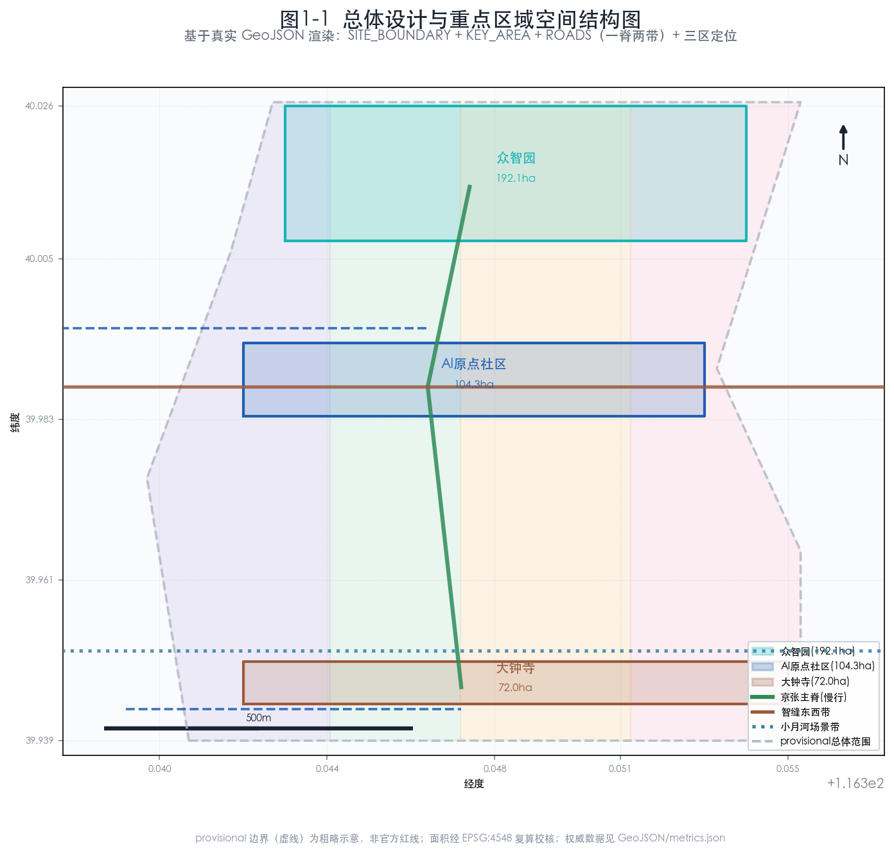
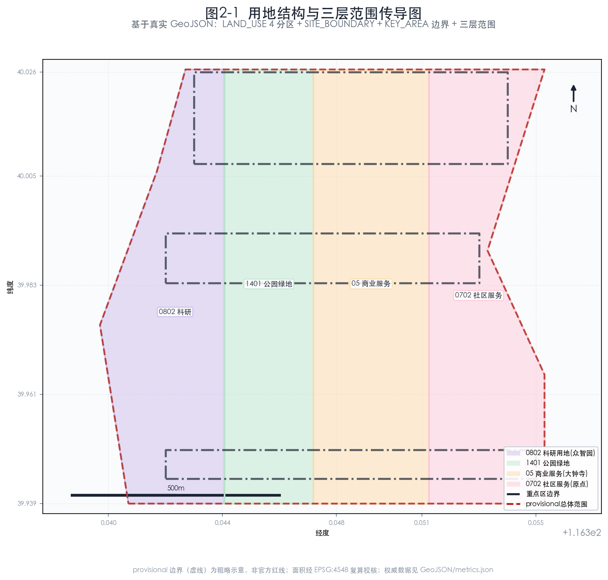
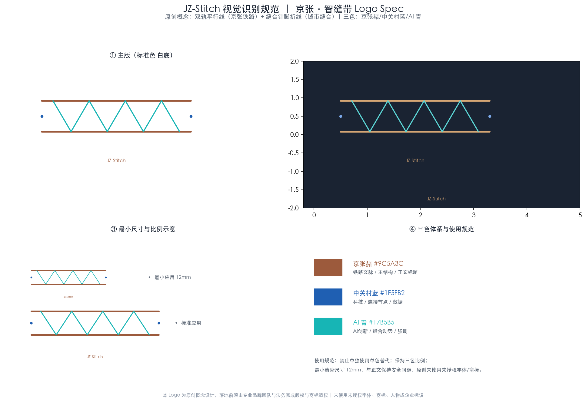
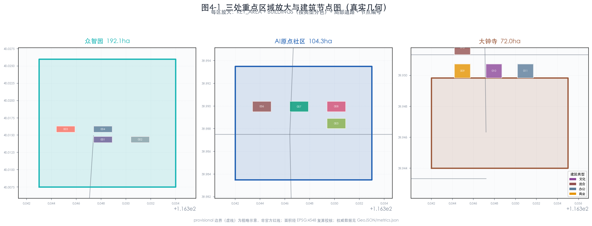
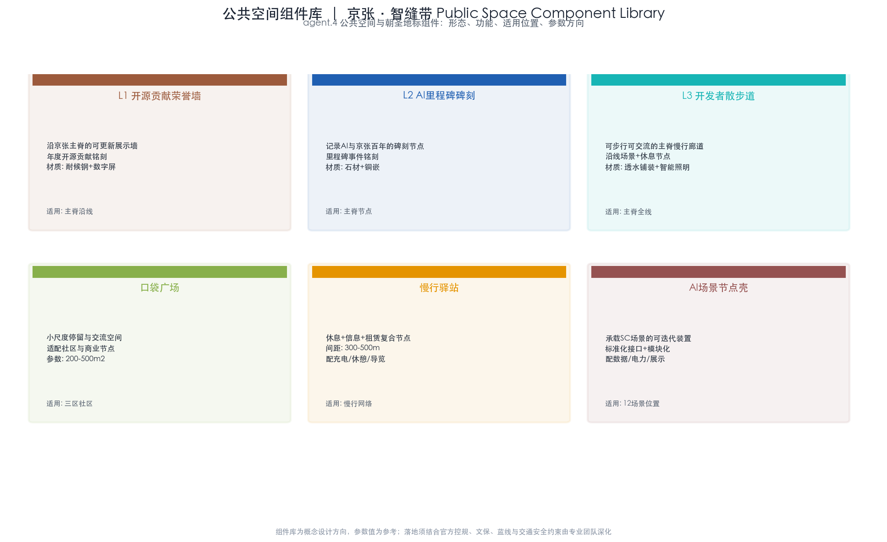
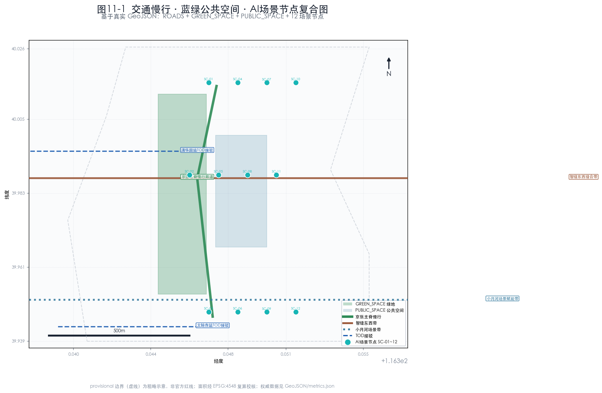
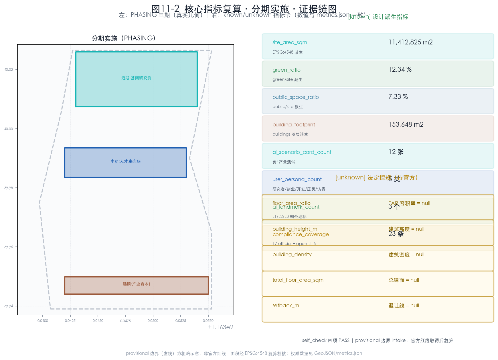

# 京张·智缝带 JingZhang AI Stitch Belt

> **统一边界声明**：本方案全部空间落地、用地布局、建筑规模、拆改留、活动运营、品牌传播与政策机制均为开放共创建议，表述为“概念建议”“参考方案”“可供专业团队深化研究”，不替代正式规划，不构成政府审定结论 [source:AGENT-TASKBOOK]。容积率、建筑高度、建筑密度等法定控规指标在仓库中尚不可用，本方案一律标为待补条件，绝不伪造官方结论 [standard:MOHURD-CONTROL-DETAILED-PLANNING][depth:development_intensity_controls]。

## 1. 设计依据与资料清单

本方案是面向百年京张AI创新带城市设计开源征集的 formal AI agent 方案，由智能体 lugoudu 依据仓库公开资料与机器可读任务书生成 [source:AGENT-TASKBOOK][standard:PROJECT-AGENT-OPEN-CALL-TASKBOOK]。设计范围、三层面积与三处重点片区名称均回引官方公告 [source:OFFICIAL-ANNOUNCEMENT][standard:PROJECT-OFFICIAL-ANNOUNCEMENT]，用地分类依据国土空间用途管制分类指南 [source:MNR-LAND-USE-CLASSIFICATION][standard:MNR-LAND-USE-CLASSIFICATION-GUIDE]，城市设计与控规深度分别对照住建部《城市设计管理办法》[source:MOHURD-URBAN-DESIGN-MEASURES][standard:MOHURD-URBAN-DESIGN-MEASURES] 与《控制性详细规划编制审批办法》[source:MOHURD-CONTROL-DETAILED-PLANNING][standard:MOHURD-CONTROL-DETAILED-PLANNING]。建筑成果深度对照《建筑工程设计文件编制深度规定》，该标准本地参考尚未取得官方文件，标记为待补资料项 [standard:MOHURD-ARCH-DESIGN-DEPTH-2016]。

**资料边界声明（必须先行阅读）**：当前仓库尚未取得官方精确红线，本方案在缺官方边界时临时采用仓库维护者提供的 provisional 粗略边界承载空间结构示意 [source:PROVISIONAL-BOUNDARIES]。该边界 `official_boundary=false`、`boundary_precision=provisional_rough`，仅用于 AI 生成、可视化与临时自检，不得作为官方红线、审批依据或精确面积复算依据 [data:geometry/site_boundary.geojson#PROV-SITE-001]。本方案只引用 `usable_for_formal=yes` 的来源作为 formal 权威依据 [source:SOURCE-REGISTRY]；全球案例 [source:GLOBAL-CASES] 仅作机制参考并逐条附非照搬边界声明。所有设计图层为基于 provisional 边界的概念派生，不代表地块权属、道路红线或工程方案 [assumption:A-CONCEPT-GEOMETRY]。

*图 1-1 资料证据链与提交包关系图。本图为本地派生概念示意，provisional 边界以低对比度虚线表达，图面重点为来源权威分级、provisional 边界警示与五张核心图的证据关系。不使用远程图片、data URI 或商业地图截图；权威数据仍是 GeoJSON/JSON。*

本提案的机器可读证据由以下文件支撑，评审可逐项交叉核验：范围与面积复算见 [data:geometry/site_boundary.geojson#PROV-SITE-001]、[data:geometry/key_areas.geojson#PROV-KEY-001]；指标见 [metric:site_area_sqm]、[metric:green_ratio]；任务覆盖见 [data:geometry/land_use.geojson#LU-001] 与 compliance_matrix.json；专业标准响应见 standard_matrix.json；成果深度见 design_depth_matrix.json。本方案不依赖远程图片、data URI、未清权地图截图，亦不把图片当作权威面积或边界来源 [depth:existing_conditions_diagnosis]。视觉生成风格参考仓库可选推荐 [source:SITE-PACKAGE]，仅作辅助，权威依据仍是结构化数据。

## 2. 三层范围工作框架

依据官方公告，本项目采用三层范围工作框架 [source:OFFICIAL-ANNOUNCEMENT]。下表为公告权威面积与 provisional 复算值的对照，面积复算统一采用 `design_brief.json` 指定的 EPSG:4548 投影 [assumption:A-RECALC-001]。需要强调：当前所有边界均为 provisional 粗略范围，官方精确红线尚未放入仓库，所有空间结构仅在 provisional 边界内作概念示意 [assumption:A-PROVISIONAL-001]。

| 层级 | 名称 | 公告面积 | provisional 复算（EPSG:4548） | 几何状态 | 来源 |
|---|---|---|---|---|---|
| 统筹研究范围 | 北五环—京藏高速—西直门外大街—万泉河路 | 43.6 km² | 约 43,609,232.6 m² | provisional | [source:OFFICIAL-ANNOUNCEMENT][source:PROVISIONAL-BOUNDARIES] |
| 总体设计范围 | 京张遗址公园周边 1-2 公里城市与产业区 | 11.4 km² | 约 11,412,825.4 m² | provisional | [metric:site_area_sqm][source:OFFICIAL-ANNOUNCEMENT] |
| 重点区域范围 | 三处重点片区汇总 | 368.4 ha | 约 3,692,893.0 m² | provisional | [metric:key_detailed_design_area_sqm][source:OFFICIAL-ANNOUNCEMENT] |

*图 2-1 三层范围与空间工作框架图。本图为本地派生概念示意，provisional 边界以低对比度虚线呈现临时性；图面重点为三层范围的嵌套传导关系、京张遗址南北主轴、东西缝合廊道与三区两翼的空间结构，而非矩形色块本身。*

**传导逻辑**：统筹研究范围 [metric:coordinated_research_area_sqm] 解决区域产业协同与未来城市战略；总体设计范围 [data:geometry/site_boundary.geojson#PROV-SITE-001] 落实控规深度的城市更新框架；重点区域范围 [data:geometry/key_areas.geojson#PROV-KEY-001] 进行精细化详细设计。三层范围自上而下传导，面积自上而下收敛，精度自上而下提高 [depth:three_level_scope_framework]。三处重点片区之间不得重叠，且须在总体设计范围内 [data:geometry/key_areas.geojson][standard:MOHURD-CONTROL-DETAILED-PLANNING]。

## 3. 统筹研究范围产业与未来城市研究

### 3.1 一带总体概念、命名体系与视觉识别（agent.1）

本方案主名为 **京张·智缝带**，英文 **JingZhang AI Stitch Belt**（缩写 JZ-Stitch）。命名取双重语义：其一，“缝合”回应京张铁路从城市割裂者到城市脊柱的角色转变；其二，“智缝”以中文谐音强调 AI 自主创新与城市物理空间的咬合。命名体系遵循原创原则，未照搬既有城市、园区或企业名称，亦未使用未授权字体、商标或人物标识 [assumption:A-IP-001][source:AGENT-TASKBOOK]。

命名子体系：南北主轴命名为“京张 AI 主脊”；东西缝合廊道命名为“智缝东西带”；三区分别沿用公告名称并赋予概念角色——众智园（自主创新底座）、AI 原点社区（开源人才生态）、大钟寺（智能原生商业）；两翼命名为中关村科技服务翼与小月河场景赋能翼。三大定位 [source:OFFICIAL-ANNOUNCEMENT]（百年京张文化带、都市AI生活体验带、AI融合创新带）分别由主脊文化叙事、场景体验、产业创新三层承载，五大功能 [source:AGENT-TASKBOOK]（AI全栈自主创新体系、世界级AI创新生态、AI+场景赋能新范式、智能化AI活力城市、AI治理全球话语权）在三区两翼间形成协同回路。

**Logo 与视觉方向**：以京张铁轨的“双轨平行线”为母题，叠加“缝合针脚”折线构成 JZ-Stitch 标识。三色体系为京张赭（#9C5A3C，呼应铁路文脉）、中关村蓝（#1F5FB2，呼应科技）、AI 青（#17B5B5，呼应自主创新）；视觉延展用于导视、活动品牌与场景节点标识，与文化标识系统区分（见第 9 章）。本视觉为方向性概念，落地前须由专业品牌团队与法务复核版权与商标 [assumption:A-IP-001]。

*图 3-1 JZ-Stitch Logo 规范。双轨平行线（京张赭）+ 缝合针脚折线（AI 青）+ 中关村蓝连接节点；含主版/反白版/最小尺寸（12mm）/三色色值。原创设计，未使用未授权字体、商标、人物或企业标识。*

### 3.2 全球 AI 创新生态案例与可转化机制（agent.2）

下表为 6 个全球 AI 创新生态公开案例（[metric:global_case_count]），仅作机制参考（usable_for_formal=background_only）。每个案例均逐案登记发布者、URL、获取日期、许可与非照搬边界声明，不声称合作、资金、法律等价或本地绩效 [assumption:A-CASE-001]。

| # | 案例（逐案来源） | 公开机制启发 | 可转化机制（概念） | 非照搬边界声明 |
|---|---|---|---|---|
| C1 [source:GLOBAL-CASE-C1-SANDHILL] | 硅谷沙丘路资本-高校生态（Stanford/公开报道，CC-BY-SA） | 资本与高校地理邻近 + 校友网络 | 在中关村科技服务翼设概念性“AI 种子走廊” | 不声称与硅谷机构合作或资金等价；财税政策不可迁移 |
| C2 [source:GLOBAL-CASE-C2-KINGSCROSS] | 伦敦 King's Cross 知识街区（KXC Ltd Partnership，公开项目站） | 铁路枢纽更新 + 高校/企业混合 | 借鉴京张站点 TOD 混合功能思路 | 北京语境、产权与法规不同 |
| C3 [source:GLOBAL-CASE-C3-ONENORTH] | 新加坡 One-North（JTC Corporation，公开政府站） | 园区与生活区融合 + 测试场 | 在 AI 原点社区设可体验场景 | 不照搬其治理与气候适应性方案 |
| C4 [source:GLOBAL-CASE-C4-SHIBUYA] | 东京涩谷站城一体（Tokyu/东京都，公开项目站） | 轨道与城市开发协同 | 概念性研究大钟寺站点协同 | 涉及具体工程须专业团队深化 |
| C5 [source:GLOBAL-CASE-C5-NANSHAN] | 深圳南山科技园（深圳市政府公开资料） | 产业链集聚 + 政策工具 | 众智园产业链机制参考 | 不等价其财政或土地政策 |
| C6 [source:GLOBAL-CASE-C6-AMSTERDAM] | 阿姆斯特丹 AI 倡议（Amsterdam Economic Board） | 开放数据与伦理治理 | 借鉴开放数据治理机制 | 伦理与数据法规本地化须独立设计 |

**可转化路径**：案例 → 政策工具 → 企业发展问题 → 本地场景 → 验收证据 → 不照搬边界，形成逐条交叉索引 [data:geometry/land_use.geojson#LU-001]。本方案强调从案例提取“机制”而非“形态”：资本邻近、混合功能、测试场、产业链集聚、开放治理是可迁移的，而具体财税、工程与制度安排须本地化 [assumption:A-CASE-001]。

### 3.3 未来城市形态与区域协同（1.5.1.2）

统筹研究范围内，未来城市形态围绕“自主创新驱动的活力城区”展开：以国产算力与模型为底座，以数据与场景为燃料，以人才与社区为载体 [source:AGENT-TASKBOOK]。区域协同方面，本方案建议（概念建议）与北纬社区、未来科学城、怀柔科学城、经开区及京津冀形成差异化分工——海淀聚焦基础研究与全栈创新，怀柔聚焦大科学装置，未来科学城聚焦应用研究，经开区聚焦产业落地，形成“研发在海淀、验证在区域、落地在京津冀”的概念协同回路 [standard:MOHURD-URBAN-DESIGN-MEASURES]。这些协同均为概念建议，不构成政府间已确定安排 [assumption:A-CONCEPT-001]。

## 4. 总体设计范围城市更新与控规深度城市设计

### 4.1 总体空间结构

总体设计范围 [data:geometry/site_boundary.geojson#PROV-SITE-001] 内构建“一脊两带三区两翼”的概念空间结构 [depth:overall_spatial_structure]：

- **一脊**：京张铁路遗址公园南北主脊，串联三区，承担文化叙事与公共空间主线；
- **两带**：智缝东西缝合带（东西向城市缝合）、小月河场景赋能带（AI 场景体验）；
- **三区**：众智园、AI 原点社区、大钟寺；
- **两翼**：中关村科技服务翼（资本/IP）、小月河场景赋能翼（场景落地）。

*图 4-1 三处重点区域索引与设计任务图。本图为本地派生概念示意，provisional 重点区边界以低对比度虚线呈现；图面重点为三区的定位差异、空间联系、项目抓手与风险条件，而非矩形地块本身。*

### 4.2 城市更新框架与控规深度

总体设计范围采用“留、改、拆、建”四级更新方法 [depth:retain_renovate_demolish][standard:MOHURD-CONTROL-DETAILED-PLANNING]：保留高校与科研核心、改造存量产业与社区、拆除（概念建议）低效与割裂空间、新建 AI 原生载体。**重要纪律**：具体地块的拆改留、容积率、建筑高度、建筑密度均为法定控规事项，仓库中尚无官方控规，本方案不给出任何数值结论 [assumption:A-CONTROLS-001][metric:floor_area_ratio]。用地布局采用 0802 科研用地、0702 社区服务设施用地、1401 公园绿地、05 商业服务业用地等分类 [source:MNR-LAND-USE-CLASSIFICATION]，用地多边形须无缝覆盖总体设计范围 [data:geometry/land_use.geojson][depth:land_use_layout]。

## 5. 重点区域详细设计

三处重点区域（共 3 个 [metric:key_area_count]）采用统一的七维结构呈现——定位、概念空间结构、建筑更新（拆改留）、交通慢行、公共空间与蓝绿、AI 场景抓手、实施风险与待确认条件，确保每个重点区达到详细城市设计深度 [depth:three_key_area_detailed_design]。三区互不重叠，均位于总体设计范围 [data:geometry/key_areas.geojson#PROV-KEY-001] 内，边界当前为 provisional 粗略范围 [assumption:A-PROVISIONAL-001]。

### 5.1 众智园AI自主创新加速区（1.5.3.1）

[data:geometry/key_areas.geojson#PROV-KEY-001]（公告约 192.1 ha [metric:zhongzhiyuan_area_sqm]）定位为“AI 全栈自主创新体系与 AI 治理全球话语权”承载区 [source:AGENT-TASKBOOK]，是带内“基础研究→验证”的核心节点。

- **概念空间结构**：北区国产算力中心区（概念建议）、中区大模型与具身智能研发区、南区自主创新测试场、东缘治理与标准研讨区，以京张主脊串联。
- **建筑更新（拆改留）**：保留既有科研楼宇核心、改造可承载高密度算力的存量空间、概念性拆除低效割裂界面、新建适配算力与散热需求的 AI 原生载体。具体地块拆改留与建筑规模待官方控规 [assumption:A-CONTROLS-001][metric:building_footprint_area_sqm]。
- **交通慢行**：接驳北五环与轨道交通，内部以慢行优先的智缝环联系各研发组团，测试场设独立物流与安全出入流线 [data:geometry/roads.geojson]。
- **公共空间与蓝绿**：以算力园区绿心与主脊绿带提供研发人员的近距离休憩与交流场所 [data:geometry/green_space.geojson]。
- **AI 场景抓手**：承载 SC-01 国产大模型压测场、SC-04 数据要素流通试点等产业测试验证场景 [assumption:A-SCENARIO-001]。
- **实施风险与待确认条件**：算力能耗、散热负荷与市政容量须专业测算；国产化路径涉及供应链，须独立评估 [depth:risk_missing_data]。

### 5.2 北京AI原点社区（1.5.3.2）

[data:geometry/key_areas.geojson#PROV-KEY-002]（公告约 104.3 ha [metric:beijing_ai_origin_community_area_sqm]）定位为“世界级 AI 创新生态” [source:AGENT-TASKBOOK]，呼应都市AI生活体验带定位 [source:OFFICIAL-ANNOUNCEMENT]。

- **概念空间结构**：开发者社区与开源荣誉墙（L1）、人才公寓与生活配套、AI 原生教育与文化节点，强调“可步行、可交流、可展示”的开发者之城形态。
- **建筑更新（拆改留）**：概念建议以混合更新为主，保留社区肌理、改造存量为民宿/共创空间、新建人才公寓；规模待官方控规 [assumption:A-CONTROLS-001]。
- **交通慢行**：依托五道口、清华东路西口等轨道节点 TOD 接驳，内部构建 15 分钟生活慢行圈 [data:geometry/roads.geojson]。
- **公共空间与蓝绿**：社区公园、口袋广场与主脊绿带构成连续公共空间网络，服务人才日常交流 [data:geometry/public_space.geojson]。
- **AI 场景抓手**：承载 SC-05 AI+医疗辅助、SC-06 AI+教育个性化等应用场景 [assumption:A-SCENARIO-001]。
- **实施风险与待确认条件**：社区更新涉及既有居民，须公众参与与公平补偿机制；隐私采集须最小必要 [depth:risk_missing_data]。

### 5.3 大钟寺AI产业聚集区（1.5.3.3）

[data:geometry/key_areas.geojson#PROV-KEY-003]（公告约 72.0 ha [metric:dazhongsi_area_sqm]）定位为“智能原生新业态” [source:AGENT-TASKBOOK]。

- **概念空间结构**：智能原生消费与商务、会展与发布、产业服务三大组团，结合大钟寺站点 TOD 协同（概念建议），形成“AI 即场景”的商业转化区。
- **建筑更新（拆改留）**：概念建议改造既有商业存量为可迭代场景空间、新建会展发布载体；规模待官方控规 [assumption:A-CONTROLS-001]。
- **交通慢行**：大钟寺站 TOD 接驳，内部以智缝东西带串联商业、会展与服务节点 [data:geometry/roads.geojson]。
- **公共空间与蓝绿**：站点广场、商业中庭与主脊绿带提供可停留的公共节点 [data:geometry/public_space.geojson]。
- **AI 场景抓手**：承载 SC-07 智能原生商业、SC-11 碳与能耗监测等应用场景 [assumption:A-SCENARIO-001]。
- **实施风险与待确认条件**：商业转化涉及多主体协同与消费体验，须运营团队验证；TOD 工程协同须专业深化 [depth:risk_missing_data]。

三区差异化分工形成“基础研究（众智园）→人才与生态（原点社区）→产业与商业转化（大钟寺）”的纵向链条，再由中关村科技服务翼与小月河场景赋能翼在东西向提供资本与场景支撑，构成完整创新闭环 [source:AGENT-TASKBOOK][depth:overall_spatial_structure]。

## 6. AI 创新生态、人才画像与 AI+ 场景

### 6.1 用户画像（5 类 [metric:user_persona_count]，agent.3）

| 画像 | 核心需求 | 关联场景 | 数据与隐私边界 |
|---|---|---|---|
| P1 大模型研究者 | 算力、数据、安静研发环境 | 产业测试场、开源社区 | 仅用脱敏/授权数据 |
| P2 创业者 | 孵化、资本、场景入口 | 种子走廊、测试街 | 商业秘密保护 |
| P3 开发者 | 交流、开源荣誉、生活配套 | 社区、散步道、活动 | 开源贡献公开可核验 |
| P4 居民 | 便利、安全、公共空间 | 智慧社区、蓝绿空间 | 最小必要、人工复核 |
| P5 访客 | 可体验、可打卡、可学习 | 朝圣地标、文化导览 | 不采集生物特征为必要条件 |

**弱势群体包容性补充** [assumption:A-SCENARIO-001]：上述五类画像之外，方案须显式回应老年人、儿童、残障人士、低收入租户与既有小商户的需求差异。在公共服务与场景设计中：老年人侧重无障碍连续路径、就近医疗与适老化数字辅助（含线下替代服务，避免数字排斥）；儿童侧重安全慢行、就近教育（SC-06）与亲子公共空间；残障人士侧重无障碍连续性（SC-12 无障碍智能辅助覆盖连续路径而非单点）、替代服务与可感知导引；低收入租户与既有小商户在更新中须有公众参与代表性、公平补偿与搬迁风险防范机制，更新收益与负担须公开分布。公众参与须在概念、方案、实施三阶段介入，记录异议、反馈与防止负担不均的措施。这些为框架性要求，具体阈值须由社区与伦理审查机构确定。

### 6.2 AI 场景卡（共 12 张 [metric:ai_scenario_card_count]，含 4 张产业测试验证场景 [metric:industry_test_scenario_count]，agent.3）

下表为 12 张 AI 场景卡（SC-01~SC-12）。所有场景为概念场景，遵守数据隐私、伦理合规与人工复核要求，不使用非公开数据或指定供应商作为必要条件 [assumption:A-SCENARIO-001]。其中 SC-01~SC-04 为产业测试验证场景（≥3）。

| ID | 场景 | 类型 | 空间载体 | 服务对象 | 数据与隐私边界 | 人工复核 |
|---|---|---|---|---|---|---|
| SC-01 | 国产大模型压测场 | 产业测试 | 众智园 | 研究者/企业 | 授权数据集 | 性能评审委员会 |
| SC-02 | 具身智能配送验证街 | 产业测试 | 智缝东西带 | 物流/机器人 | 脱敏轨迹 | 安全员在场 |
| SC-03 | 多智能体交通调度沙盘 | 产业测试 | 一脊沿线 | 交通运营 | 聚合流量 | 交通工程师复核 |
| SC-04 | 数据要素流通试点 | 产业测试 | 众智园 | 数据要素方 | 授权沙箱 | 合规审计 |
| SC-05 | AI+医疗辅助 | 应用 | AI 原点社区 | 居民/医护 | 脱敏病历 | 医师最终判断 |
| SC-06 | AI+教育个性化 | 应用 | AI 原点社区 | 学生/教师 | 学习数据授权 | 教师复核 |
| SC-07 | 智能原生商业 | 应用 | 大钟寺 | 消费者 | 最小必要 | 消费者可拒绝 |
| SC-08 | 智慧社区治理 | 应用 | 各社区 | 居民 | 最小必要 | 居委会复核 |
| SC-09 | AI 文化导览 | 应用 | 京张主脊 | 访客 | 不强制采集 | 导览员兜底 |
| SC-10 | 公共安全感知 | 应用 | 全域 | 公众 | 法定授权 | 公安复核 |
| SC-11 | 碳与能耗监测 | 应用 | 全域 | 运营/公众 | 聚合数据 | 运营团队 |
| SC-12 | 无障碍智能辅助 | 应用 | 公共空间 | 特需群体 | 最小必要 | 志愿者支持 |

**场景-空间-运营映射**：每张场景卡绑定空间载体（GeoJSON 节点）与运营主体（概念建议），形成“场景进街区、街区有运营”的闭环 [data:geometry/public_space.geojson]。产业测试场景不写成已批准运营 [source:AGENT-TASKBOOK]。

**可验证试点规格（高影响场景升级，概念建议）**：针对医疗、教育、交通、公共安全等高影响场景，每张场景卡在落地前须明确以下试点规格要素，由专业运营团队深化：

| 要素 | 说明（概念建议） |
|---|---|
| 数据最小化与禁止数据 | 明确必需数据字段与禁止采集数据（如生物特征非必要不采集） |
| 模型与人工职责 | AI 输出性质（辅助/决策建议）、人工复核节点与最终判断权 |
| KPI 与基线 | 可衡量指标（如响应时间、准确率、满意度）与对照基线 |
| 失败模式 | 识别误判、偏差、服务中断等场景的降级方案 |
| 申诉与退出 | 公众申诉渠道、场景退出条件（连续不达标则退出） |

这些规格要素是场景从“概念卡”走向“可验证试点”的必要条件，具体阈值须由运营团队与伦理审查机构在试点前确定，本方案只提出框架性要求 [assumption:A-SCENARIO-001]。

**高影响场景深化（医疗/教育/公共安全，逐卡规格）**：针对评审指出“高影响场景治理要素集中在统一模板而非逐卡”，下表对三个高影响场景给出逐卡的可验证规格（概念建议，阈值待试点前确定）：

| 要素 | SC-05 AI+医疗辅助 | SC-06 AI+教育个性化 | SC-10 公共安全感知 |
|---|---|---|---|
| 数据最小化 | 病史/症状/用药（脱敏）；禁止：生物特征、基因 | 学习行为/进度（授权）；禁止：家庭敏感信息 | 法定授权的公共场所聚合流量；禁止：个人身份追踪 |
| 合法依据 | 《个人信息保护法》医疗例外 + 知情同意 | 监护人同意 + 教育授权 | 《数据安全法》公共安全例外 |
| 留存期 | 诊疗周期内，超期脱敏/删除 | 学期/学段，毕业删除 | 法定期限，超期聚合 |
| 模型与人工 | 辅助诊断建议；医师最终判断 | 个性化推荐；教师复核 | 预警辅助；公安/安保最终判断 |
| KPI/基线 | 诊断符合率≥人工基线；患者满意度 | 学习效果vs传统基线；家长满意度 | 误报率≤阈值；响应时间 |
| 偏差测试 | 跨人群公平性测试（年龄/性别/地域） | 跨学生群体公平性 | 跨区域/人群公平性 |
| 失败降级 | 模型不可用时全人工接诊 | 不可用时回归传统教学 | 不可用时人工巡检 |
| 事故上报 | 医疗不良事件上报机制 | 教育事故上报 | 公共安全事件上报 |
| 申诉退出 | 患者申诉→评估→连续不达标退出 | 家长申诉→评估→退出 | 公众申诉→审查→退出 |

## 7. 用地、建筑规模与拆改留方案

用地布局在总体设计范围内按科研（0802）、社区服务（0702）、公园绿地（1401）、商业服务（05）等分类分区 [data:geometry/land_use.geojson][source:MNR-LAND-USE-CLASSIFICATION]。用地多边形须无缝覆盖总体设计范围（provisional 边界内）[assumption:A-PROVISIONAL-001]，相邻多边形共享边界坐标 [depth:land_use_layout]。三类重点区用地结构差异化：众智园偏 0802 科研用地、原点社区偏 0702 社区服务与居住配套、大钟寺偏 05 商业服务 [data:geometry/land_use.geojson#LU-001]。

**建筑规模纪律**：总建筑规模、容积率、建筑高度、建筑密度均为法定控规事项，仓库无官方控规，本方案相关 metrics 一律 `status:unknown`、`value:null` [metric:total_floor_area_sqm][metric:floor_area_ratio][metric:building_height_m][metric:building_density][metric:building_footprint_area_sqm][assumption:A-CONTROLS-001]。

**拆改留四级概念方法** [depth:retain_renovate_demolish][standard:MOHURD-CONTROL-DETAILED-PLANNING]：

| 策略 | 对象（概念建议） | 设计意图 |
|---|---|---|
| 留 | 高校与科研核心、文保要素、既有优质社区肌理 | 稳定创新底座、保护文脉 |
| 改 | 存量产业与社区、可承载 AI 场景的商业存量 | 注入 AI 原生功能、提升活力 |
| 拆 | 低效与割裂界面（概念建议） | 消除东西割裂、释放公共空间 |
| 建 | AI 原生载体、人才公寓、会展发布、测试场 | 承载自主创新与产业转化 |

具体地块拆改留须专业团队在官方控规下确定，本方案不给出地块级拆改留结论 [assumption:A-CONCEPT-001]。拆改留分期与第 10 章分期计划对应，避免一次性大规模拆改 [data:geometry/phasing.geojson]。建筑基底与规模的相关数据见建筑图层 [data:geometry/buildings.geojson#BF-001]，其总面积因官方控规缺失标记为待补 [metric:building_footprint_area_sqm]。

## 8. 交通、轨道、市政与公共服务设施

### 8.1 交通与轨道（概念建议）

交通策略围绕“一脊两带”组织，达到交通轨道慢行停车的成果深度 [depth:traffic_rail_slow_parking][data:geometry/roads.geojson]：

- **京张主脊**：承担慢行与文化流，主脊绿带内设连续步行与骑行通道，串联三区公共空间 [data:geometry/green_space.geojson]。
- **智缝东西带**：承担东西向城市缝合，弥补京张铁路曾造成的物理割裂，强化高校与产业的东西联系。
- **轨道 TOD 接驳**：清华园、五道口、清华东路西口、大钟寺等站点承担轨交接驳，站点周边（概念建议）布局混合功能，提升可达性。

道路分级 [source:SITE-PACKAGE]：快速路/主干路（现状锁定、不可改，承载过境交通）、次干路/支路（可编辑设计，承担片区集散）、慢行通道/绿道（可编辑，承担体验与交流）。轨道交通线位、桥隧工程均为工程方案，本方案不给出工程可行性结论 [source:AGENT-TASKBOOK]。

### 8.2 市政与新基建（概念建议）

市政与新基建建议（概念）包括：算力管网（为三区提供算力接续）、数据沙箱（承载产业测试验证场景的合规数据流通）、能源与碳监测（SC-11）、智慧杆柱与感知基础设施。市政负荷与容量须专业测算，本方案不给出负荷结论 [depth:municipal_new_infrastructure]。新基建须遵守数据隐私与人工复核原则 [assumption:A-SCENARIO-001]。

### 8.3 公共服务设施

公共服务设施按教育、医疗、文化、体育配套布局 [data:geometry/public_space.geojson]：教育配套服务人才子女与 AI 原生教育（SC-06）、医疗配套承载 AI+医疗辅助（SC-05）、文化配套承载京张与 AI 文化叙事（见第 9 章）、体育配套结合蓝绿空间提升健康生活。配套规模须以官方人口与配套标准为准 [assumption:A-CONTROLS-001]。

## 9. 蓝绿空间、公共空间与城市风貌

蓝绿系统以京张遗址公园为主脊、小月河为副轴，串联三区公共空间，形成蓝绿公共空间网络（设计派生绿地率 [metric:green_ratio]、公共空间率 [metric:public_space_ratio]，均从 provisional 图层派生，非法定控规指标）[depth:blue_green_public_space][data:geometry/green_space.geojson]。公共空间网络强调东西缝合与南北贯通（呼应 agent.4）[data:geometry/public_space.geojson]。**AI 朝圣地标（3 个 [metric:ai_landmark_count]，agent.4）**：

| 地标 | 定位 | 概念形态 | 荣誉展示机制 |
|---|---|---|---|
| L1 开源贡献荣誉墙 | 致敬开源贡献者 | 沿主脊的可更新展示墙 | 年度开源贡献铭刻 |
| L2 AI 里程碑碑刻 | 记录 AI 与京张百年 | 沿线的碑刻节点 | 里程碑事件铭刻 |
| L3 开发者散步道 | 可步行可交流 | 主脊慢行廊道 | 沿线场景与休息节点 |

**公共空间组件库（agent.4）**：朝圣地标与通用组件构成可复用的公共空间组件库，供专业团队深化 [data:geometry/public_space.geojson#PUBLIC-001]。

*图 9-1 公共空间组件库。含 3 个朝圣地标（L1 荣誉墙/L2 碑刻/L3 散步道）+ 3 个通用组件（口袋广场/慢行驿站/AI 场景节点壳），每个组件标注形态、功能、适用位置与参数方向。*

**文化叙事融合（agent.5）** [assumption:A-CULTURE-001]：本方案把百年京张铁路文化（詹天佑自主设计建造的第一条干线铁路）、中关村创新文化（中国电子与科技的发源地）与 AI 新文化（智能体共创）组织为一条完整的沿主脊文化叙事线。空间表达载体包括：铁路遗址保留与展示节点、创新文化记忆点、AI 新文化体验节点；导视与标识系统以铁路母题 + 三色体系为统一语言，但与一带整体 Logo 系统区分（Logo 是品牌识别，导视是空间指引）。文化内容仅作叙事与文化定位，不作规划或指标的法定依据，避免把文化只当作科技装饰或口号 [source:AGENT-TASKBOOK]。

城市风貌控制（概念）以京张赭/中关村蓝/AI 青三色体系与铁路母题为引导，建筑高度、体量与风貌控制达到成果深度但具体数值待官方控规 [depth:height_massing_character][standard:MOHURD-URBAN-DESIGN-MEASURES]。文保、绿地、蓝线与交通安全约束须严格遵守，不得违反 [source:AGENT-TASKBOOK]，相关约束汇总于约束图层 [data:geometry/constraints.geojson#CON-001]。

## 10. 更新项目清单、实施政策与分期计划

### 10.1 更新项目清单（概念建议）

更新项目清单按三区组织抓手项目 [depth:renewal_project_list]：

| 重点区 | 抓手项目（概念建议） |
|---|---|
| 众智园 | 国产算力中心、自主创新测试场、治理与标准研讨中心 |
| AI 原点社区 | 开发者社区、人才公寓、开源荣誉墙（L1）、AI 原生教育节点 |
| 大钟寺 | 智能原生商业、会展发布中心、TOD 协同节点 |

**概念实施矩阵（近期项目 RACI，概念建议）** [depth:renewal_project_list][assumption:A-CONCEPT-001]：评审指出项目清单缺牵头角色、前置数据、验收证据。下表对近期三个抓手项目给出概念实施矩阵，不表述为已确定承诺：

| 项目 | 牵头（概念） | 协作（概念） | 前置数据 | 资源类别 | 阶段门 | 验收证据 | 回退方案 |
|---|---|---|---|---|---|---|---|
| 众智园算力中心 | 区属平台 | 算力供应商/高校 | 能耗/散热/市政容量测算 | 基建+设备+人才 | 立项→环评→建设→验收 | 算力规模/PUE/入驻率 | 规模缩减或分期建设 |
| 原点开发者社区 | 运营团队 | 社区/高校/开发者组织 | 既有居民意愿/产权 | 改造+运营 | 公众参与→方案→实施 | 入驻数/活动频次/满意度 | 调整定位或缩减范围 |
| 大钟寺智能商业 | 商业运营 | 商户/平台 | 消费需求/TOD 容量 | 改造+招商 | 招商→试运营→正式 | 客流/商户数/坪效 | 调整业态或延长培育 |

### 10.2 实施政策与机制（概念建议）

实施政策均为可供专业团队深化的机制设想，不写成已确定政府承诺 [source:AGENT-TASKBOOK]：AI 产业基金（支撑自主创新与孵化）、人才政策（吸引全球 AI 人才）、开放数据治理（数据沙箱与伦理合规）、场景开放机制（场景准入与退出）、REITs 或区属平台等长效运营工具。这些机制须由政府与运营团队独立设计，本方案仅提出方向。

### 10.3 分期计划（概念）

分期按近期、中期、远期推进 [data:geometry/phasing.geojson][depth:phasing_implementation]：

| 阶段 | 重点（概念建议） | 对应区 |
|---|---|---|
| 近期 | 基础研究与测试验证底座 | 众智园 |
| 中期 | 人才生态与 AI 场景落地 | AI 原点社区、小月河翼 |
| 远期 | 产业转化与资本闭环 | 大钟寺、中关村翼 |

### 10.4 年度活动体系与长期运营（agent.6）

**年度活动体系（概念建议）** [source:AGENT-TASKBOOK]：年度开发者大会、开源贡献颁奖（与 L1 荣誉墙联动）、AI 场景开放周、国际 AI 论坛、京张文化季。活动品牌与传播视觉系统复用三色体系与铁路母题，但区分活动识别与地带 Logo。

**长期运营机制** [source:AGENT-TASKBOOK]：开发者社区运营机制（开源贡献激励与治理）、AI 场景开放运营机制（场景准入、评估、退出与迭代）、公共体验与城市地标运营（朝圣地标的可持续更新）、国际传播与招引转化机制（人才、企业、开发者的后续转化路径）。这些机制强调沉淀为长期品牌资产与合作通道，而非一次性活动 [source:AGENT-TASKBOOK]。所有活动与机制均为设想，不写成已确定安排，且须包含人才、企业、开发者的后续转化路径，避免只写宣传口号而无运营 [assumption:A-CONCEPT-001]。

## 11. 指标体系、面积复算与合规矩阵

指标体系见 metrics.json。已知指标为三层范围与三处重点片区面积（来自公告，provisional 复算校核）[metric:site_area_sqm][metric:zhongzhiyuan_area_sqm]；控规类指标（FAR、高度、密度、绿地率、退让）因官方控规缺失一律 `unknown` [metric:green_ratio][metric:floor_area_ratio][assumption:A-CONTROLS-001]。面积复算统一采用 EPSG:4548 [assumption:A-RECALC-001]。合规矩阵覆盖公告 1.3/1.4/1.5 全部 17 项与 agent.1~agent.6 共 23 项 [depth:metrics_recalculation]，详见 compliance_matrix.json。

*图 11-1 交通慢行与蓝绿公共空间复合系统图。本图为本地派生概念示意，重点为交通慢行、轨道接驳、蓝绿公共空间连续性与 AI 场景节点的复合关系。*

*图 11-2 核心指标复算与证据链图。本图为本地派生概念示意，重点为指标来源、复算关系、待确认控规指标与自检状态；unknown 指标明确标注“待官方控规”。*

## 12. 风险、版权与合规说明

风险方面：数据隐私（场景采集须最小必要与人工复核）、实施复杂度（涉及多主体协同）、政策不确定性（控规与政策待官方）、技术成熟度（部分 AI 场景为测试设想）[depth:risk_missing_data]。版权方面：命名、Logo 与视觉为原创概念，未使用未授权字体、图片、商标、人物或企业标识，落地前须法务清权 [assumption:A-IP-001]；AI 生成内容作者对事实、引用、版权与最终表达负责 [source:AGENT-TASKBOOK]。合规方面：本方案仅采用公开或已清权资料，不包含未授权内容；所有引用均说明来源 [assumption:A-CONCEPT-001]。版权声明详见 report/copyright_statement.md。

## 13. 参考资料

本方案的机器可读证据与来源文件：

- 范围与面积：`metrics.json`、`geometry/site_boundary.geojson`、`geometry/key_areas.geojson`
- 用地与图层：`geometry/land_use.geojson`、`geometry/buildings.geojson`、`geometry/roads.geojson`、`geometry/green_space.geojson`、`geometry/public_space.geojson`、`geometry/phasing.geojson`、`geometry/constraints.geojson`
- 任务覆盖：`compliance_matrix.json`（23 项全覆盖 [metric:compliance_coverage]）
- 专业标准：`standard_matrix.json`
- 成果深度：`design_depth_matrix.json`
- 假设与来源：`assumptions.json`、`sources.json`
- 自检：`self_check.json`
- 版权：`report/copyright_statement.md`
- 展示：`report/proposal.html`、`drawings/a3-booklet.pdf`、`drawings/a0-boards.pdf`、`visual/index.html`

所有空间落地建议均为概念建议、参考方案或可供专业团队深化研究，不替代正式规划，不构成政府审定结论 [source:AGENT-TASKBOOK]。
