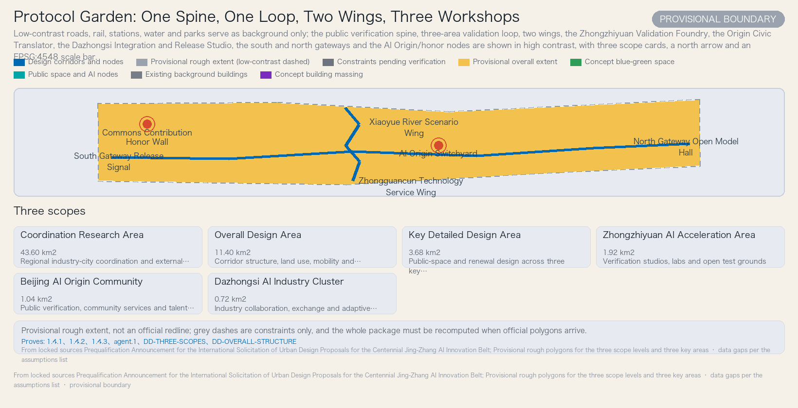
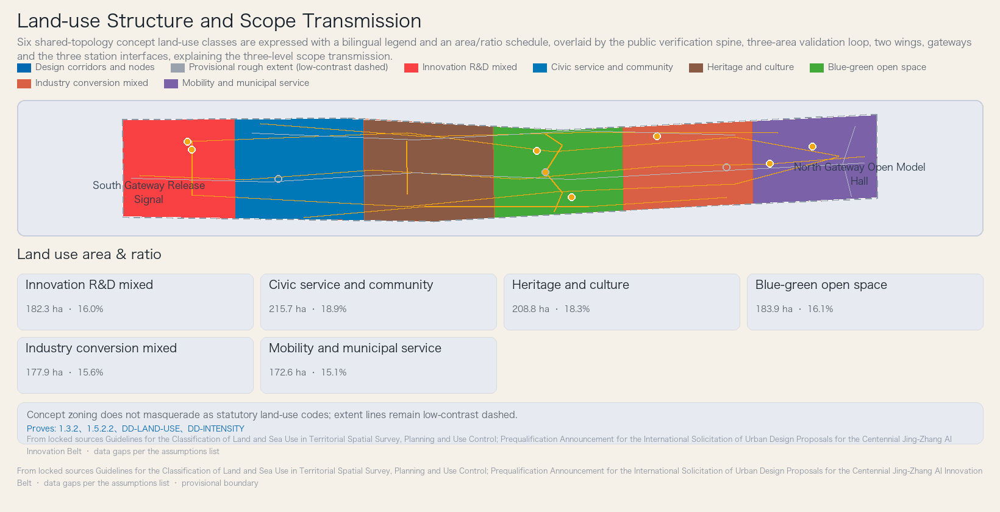
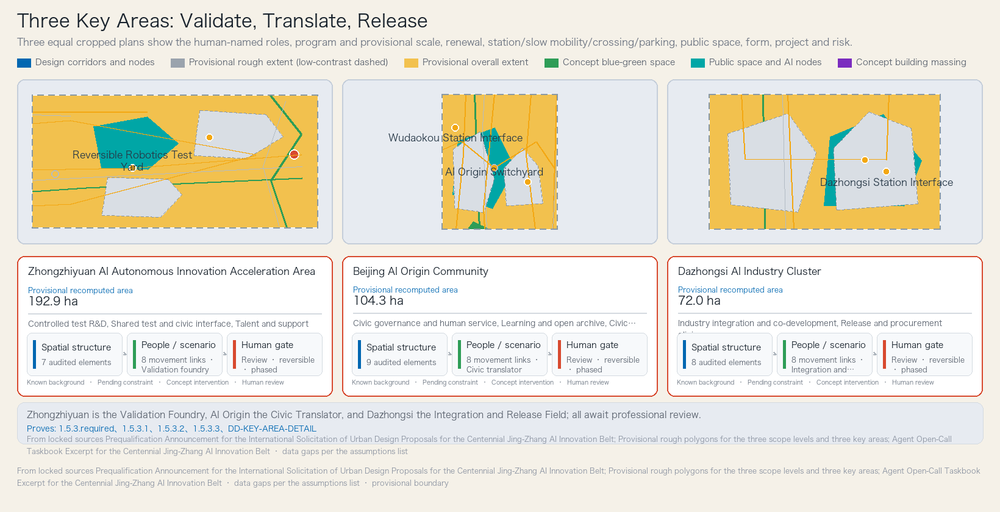
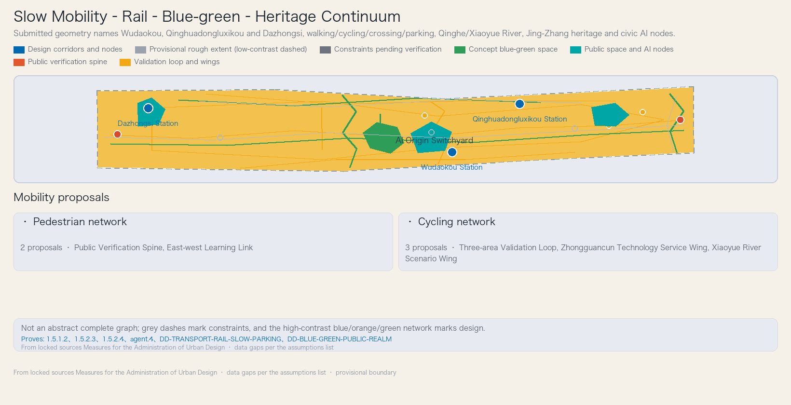
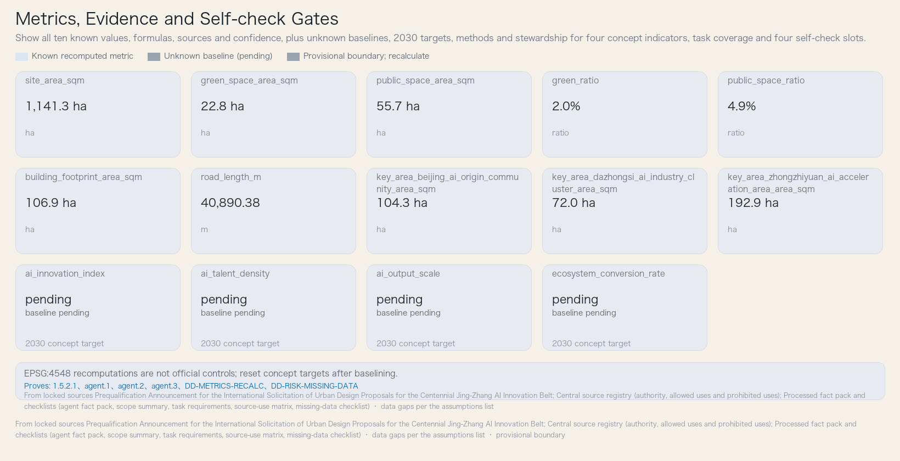

# Protocol Garden: Jing-Zhang Verifiable AI Co-creation Belt

> This proposal is a conceptual recommendation and reference scheme for professional teams to deepen; it is not a statutory plan, an approval conclusion, a government action, or an investment commitment. The three scope levels and the three key areas currently have only rough provisional boundaries; once official polygons are obtained, the entire package must be recomputed. The boundary status is provisional_constraint, per `brief/site-package/geometry/provisional_boundaries_basis.md` [source:brief/site-package/].

## Design Basis and Source List

The judgments in this proposal rest on four categories of materials. The first category is official competition documents: the prequalification announcement determines the three scope levels, the three key areas, the design tasks, the language, the design depth, and the deliverable context [source:DATA-SRC-OFFICIAL-ANNOUNCEMENT-20260509]; the agent-oriented taskbook excerpt defines the three positions, five functions, three zones and two wings, and six agent tasks [source:DATA-SRC-AGENT-TASKBOOK-20260518]. The second category is the provisional geometry provided by repository maintainers, used only for generation, display, and temporary self-check, and not as official redlines or a precise-area basis [source:DATA-SRC-PROVISIONAL-BOUNDARIES-20260605]. The third category is national and industry standards, policies, and regulatory snapshots: the Measures for the Administration of Urban Design, the Measures for the Preparation and Approval of Regulatory Detailed Plans, the Guidelines for the Classification of Land and Sea Use, the Interim Measures for the Management of Generative Artificial Intelligence Services, the Law on the Construction of a Barrier-Free Environment, and the elderly smart-technology policy, cited for the uses permitted by the source registry [source:data/source_registry.json]. The fourth category is five global AI ecosystem cases and OpenStreetMap background data, cited only as background mechanisms and not constituting local statutory evidence [source:DATA-SRC-OSM-BACKGROUND-CONTEXT].

Complete sources, metrics, standards, design depth, and task coverage are stored in machine indexes such as `sources.json`, `metrics.json`, `compliance_matrix.json`, `standard_matrix.json`, and `design_depth_matrix.json`; the body does not transcribe them item by item. The body uses verifiable citations (the five marker types: source, standard, depth, data, metric) after key judgments, and sentences remain naturally readable after the citation markers are removed. Every required chapter cites at least one piece of evidence directly relevant to its judgment; no more than three consecutive citations occur in one place.

Data gaps must be honestly stated in this chapter: regulatory-plan conditions, road redlines, parcel ownership, existing buildings, heritage controls, municipal capacity, and public-service baselines are all missing [source:data/processed/]; therefore this proposal draws no definitive conclusions on floor area ratio, building height, demolition/construction scale, or investment, and all such content is uniformly recorded as pending formal control conditions [assumption:A-CONTROL-001]. Every subsequent chapter proceeds on four matters — design judgment, basis, layer/metric, and data gap — rather than staying at the level of vision slogans.

## Three-Level Scope Framework

The three scope levels are implemented level by level per the announcement. The Coordinated Research Area is approximately 43.6 square kilometers, the strategic level for industry strategy and future-city research; the Overall Design Area is approximately 11.4 square kilometers, the working level for urban renewal and regulatory-plan-depth urban design; the Key-Area Detailed Design Area is approximately 368.4 hectares, composed of the Zhongzhiyuan AI Independent Innovation Acceleration Area (approximately 192.1 ha), the Beijing AI Origin Community (approximately 104.3 ha), and the Dazhongsi AI Industry Cluster (approximately 72.0 ha), the detailed-design level [source:DATA-SRC-OFFICIAL-ANNOUNCEMENT-20260509]. The Overall Design Area is recomputed from the provisional boundary in EPSG:4548 as 11,412,825.386 square meters, presented separately from the announced ~11.4 km² [metric:site_area_sqm]; the recomputed provisional areas of the three key areas are 1,929,201.877, 1,043,236.909, and 720,454.219 square meters, likewise presented separately from the announced areas [metric:key_area_zhongzhiyuan_ai_acceleration_area_area_sqm].

It must be emphasized that the three scope levels and the three key areas currently have only rough provisional polygons: `PROV-SITE-001` is the placeholder boundary of the Overall Design Area [data:geometry/site_boundary.geojson#PROV-SITE-001], and the three key-area rectangles `PROV-KEY-001`, `PROV-KEY-002`, and `PROV-KEY-003` are placeholder extents constrained only by the announced areas, expressing no parcel or ownership boundaries [data:geometry/key_areas.geojson#PROV-KEY-001] [assumption:A-GEO-003]. These polylines and rectangles are not road redlines, parcel lines, or official key areas, and must not be used for approvals or precise area recalculation [assumption:A-BOUNDARY-001]. After official polygons are obtained, the publisher, hash, date, coordinate system, and transformation method must be registered, and all GeoJSON layers, areas, ratios, drawings, HTML, metrics, and phasing must be recomputed as a whole — not by replacing a single boundary file.

How the three scope levels are implemented level by level: the coordination level establishes the strategic relation of "public verification spine + three-area validation loop + two-wing interfaces"; the overall level places this structure onto the six land-use categories, a conceptual road network, blue-green corridors, and a renewal project list; the key-area level gives each of the three areas a mini-scheme of "positioning + spatial structure + building renewal + transport and slow traffic + public space + AI scenarios + implementation risk." The three levels share the same topological derivation relation, covering without gaps or overlaps [assumption:A-GEO-002].

## Coordinated Research Area: Industry and Future City Research

This chapter responds to announcement item 1.5(1) and to the agent taskbook's "overall belt concept and function coordination scheme design" and "full-stack indigenous AI innovation system and world-class AI innovation ecosystem design"; it first explains the naming and identity system, then develops positioning, functions, cases, and industry–space mapping.

**Naming and identity system.** The Chinese name "协议花园" understands "协议" (protocol) as public rules, interfaces, and review, and "花园" (garden) as incremental growth, shared stewardship, and allowance of difference; the English Protocol Garden preserves both governance and spatial ambiguity. The logo is an original concept direction: a railway double line bends into an open brace, three nodes represent the three areas, and the negative space forms a "person" and an open interface; it copies no third-party logo and implies no official endorsement. Recommended palette: heritage rust red, civic garden green, verification blue, and paper white; the typography direction is an open-source, legible sans-serif system suitable for Chinese, English, and numerals with high-contrast wayfinding. International adaptation uses translatable names, graphic-first presentation, short bilingual labels, and coding that does not rely on color. This identity system is a concept direction, not an approved brand [standard:PROJECT-AGENT-OPEN-CALL-TASKBOOK].

**Three positions.** The Century-old Jing-Zhang Cultural Belt uses the Jing-Zhang heritage line as a shared armature of public memory and future-technology accountability, not as thematic decoration; the Urban AI Life Experience Belt embeds optional, explainable, accessible AI scenarios that retain human service into everyday routes; the AI Convergence Innovation Belt closes the loop among research, testing, governance feedback, commercialization, and global exchange through three-area validation. The three-zone/two-wing coordination circuit is carried by the public verification spine [data:geometry/roads.geojson#RD-VERIFICATION-SPINE], the three-area validation loop [data:geometry/roads.geojson#RD-THREE-AREA-LOOP], and the two-wing interfaces [data:geometry/roads.geojson#RD-WEST-WING] [data:geometry/roads.geojson#RD-EAST-WING].

**Five functions.** The Full-stack Indigenous AI Innovation System connects model, robotics, digital-twin, and energy validation through the three-area validation loop and reversible testbeds; the World-class AI Innovation Ecosystem organizes research, talent, start-ups, enterprises, and public-sector collaboration through the talent learning commons and the three-area validation loop; the New Paradigm for AI+ Scenario Enablement turns each AI+ scenario into a public contract with an operator, a data boundary, human review, and entry and exit conditions; the Intelligent and Vibrant AI City provides day-and-night shared cultural, learning, and service experiences through civic ground and heritage protocol, digital and non-digital in parallel; the Global Voice in AI Governance publishes scenario rules, incident summaries, appeals, and annual reassessments through the trust operations protocol and exchanges verifiable methods through bilingual events. The statutory textual source of the above positions and functions is the agent taskbook [source:DATA-SRC-AGENT-TASKBOOK-20260518].

**Five global cases and mechanism translation.** The Seoul Yangjae Global AI Hub Revitalization Plan organizes an industry-academia-research ecosystem with a special development promotion zone, tax and floor-area-ratio incentives, and dual anchors of an R&D campus and a support center [source:CASE-SEOUL-AI-HUB]; the Mila Mile-Ex Campus in Montreal superimposes academic research, technology transfer, corporate laboratories, and student entrepreneurship in recycled old buildings, an institutional urban anchor [source:CASE-MILA-MILE-EX]; the Vector Institute in Toronto connects research, talent, enterprise, and public-sector adoption as an independent not-for-profit research anchor [source:CASE-VECTOR-TORONTO]; the STATION F F/ai Program in Paris convenes AI companies, laboratories, compute partners, and venture capital in a single program alliance, selectively supporting early-stage teams [source:CASE-STATION-F-AI]; the Hub71+ AI specialist AI ecosystem in Abu Dhabi supports AI start-up scaling with compute, cloud credits, model APIs, talent, market access, and regulatory guidance [source:CASE-HUB71-AI]. This proposal translates these mechanisms into local public-value rules: incentives, anchors, shared resources, and accelerator programs are valid only when bound to visible testing, human review, and citizen access; campus forms are not copied wholesale.

**Industry–space mapping.** Foundation models and evaluation enter auditable evaluation bays; embodied AI enters low-speed test yards; urban intelligence enters digital-twin rooms and roadside sandboxes; AI-enabled civic services enter community service desks; venture and industry conversion enters shared labs, release halls, and procurement clinics. The flow is "research — controlled testing — public explanation — human review — procurement/diffusion — annual reassessment."

**Regional innovation coordination (conceptual level).** The belt interacts with regional innovation nodes through conceptual coordination relations: with the North Latitude Community on mutual learning in talent commons and scenario openness; with Future Science City and Huairou Science City on a "research — pilot — urban validation" division-of-labor reference; with the Beijing Economic-Technological Development Area (Beijing Yizhuang / E-Town) on complementarity in industry conversion and low-speed robotics testing; and at the Jing-Jin-Ji scale on open standards and bilingual events for exchanging verifiable methods. These are all conceptual coordination relations, not any official commitment, funding arrangement, or statistical conclusion, and all await confirmation of formal coordination mechanisms [assumption:A-GOV-001].

## Overall Design Area: Urban Renewal and Regulatory-Plan-Level Urban Design

The Overall Design Area is structured as "one spine, one loop, two wings, three workshops" [depth:DD-OVERALL-STRUCTURE]. The public verification spine organizes continuous guided tours, open archives, and civic deliberation nodes along the Jing-Zhang heritage alignment [data:geometry/roads.geojson#RD-VERIFICATION-SPINE]; the three-area validation loop connects the Zhongzhiyuan AI Independent Innovation Acceleration Area, the Beijing AI Origin Community, and the Dazhongsi AI Industry Cluster into a mutual-validation circuit [data:geometry/roads.geojson#RD-THREE-AREA-LOOP]; the Zhongguancun Technology Services Wing and the Xiaoyue River Scenario Enablement Wing connect westward and eastward to research and community open space [data:geometry/roads.geojson#RD-WEST-WING] [data:geometry/roads.geojson#RD-EAST-WING]. The three workshops correspond to the core public interfaces of the three key areas: the Zhongzhiyuan Validation Foundry, the Origin Civic Translator, and the Dazhongsi Integration and Release Studio.

The current-condition diagnosis is distilled into three observations: the Jing-Zhang heritage alignment can support a continuous civic verification spine, but heritage control extents are missing [data:geometry/constraints.geojson#CON-JINGZHANG-HERITAGE]; the north-south slow-traffic connections have crossing breaks requiring field verification [data:geometry/constraints.geojson#CON-BREAK-SOUTH] [data:geometry/constraints.geojson#CON-BREAK-RING]; the three key areas can respectively host validation, public translation, and industry release [data:geometry/key_areas.geojson#PROV-KEY-001] [depth:DD-DIAGNOSIS]. All three observations depend on ownership and control conditions pending verification [assumption:A-LAND-001] [assumption:A-CONTROL-001].

The overall urban-renewal framework is organized by six land-use categories: innovation R&D mixed, civic service and community, heritage and culture vitality, blue-green open space, industry conversion mixed, and mobility and municipal service [depth:DD-LAND-USE]. Renewal objects are written not as demolition/construction survey conclusions but as conceptual action categories: new-build massing concepts and public-space renovation concepts, all pending confirmation by regulatory plans, ownership, and existing-building surveys [assumption:A-GEO-006]. Building scale, floor area ratio, height, and density are uniformly recorded as pending formal control conditions [assumption:A-CONTROL-001], not disguised as approved indicators. The regulatory detailed plan is the basis of planning permission; this project lacks regulatory-plan conditions, so all intensity judgments remain conceptual recommendations [standard:MOHURD-CONTROL-DETAILED-PLANNING].

## Detailed Design of Key Areas

Each of the three key areas forms a readable mini-scheme; all key-area polygons are provisional, and conclusions are directional design only [depth:DD-KEY-AREA-DETAIL].

**Zhongzhiyuan AI Independent Innovation Acceleration Area (Validation Foundry).** The conceptual positioning is controlled validation, hosting controlled tests of model evaluation, low-speed robotics, digital twins, and energy microgrids, then expanding stepwise through gates [data:geometry/key_areas.geojson#PROV-KEY-001]. The spatial structure encloses a shared test yard with validation-courtyard buildings [data:geometry/buildings.geojson#BLD-ZZY-LAB-A] [data:geometry/buildings.geojson#BLD-ZZY-LAB-B] [data:geometry/public_space.geojson#PS-ZZY-TEST-YARD], with an industry program mix of approximately 55% controlled-test R&D, 25% shared testing and public interface, and 20% talent and support (conceptual targets, pending regulatory plans). **Fifth Ring Road and external transport, safety governance** are the most sensitive external conditions for this area: test spillover, freight, and emergency evacuation must be studied together with the external transport organization along the Fifth Ring Road; any real-road testing presupposes safety and traffic-management review and is currently treated as a conceptual recommendation. The renewal intent is only new-build massing concepts and public-space renovation concepts, with no conclusion on demolishing or altering existing buildings [assumption:A-GEO-006]. The related project is the Zhongzhiyuan Reversible Validation Foundry.

**Beijing AI Origin Community (Civic Translator).** The conceptual positioning is public translation and governance feedback, with a governance clinic, learning classrooms, elder and accessibility desks, an open archive, and human appeal windows [data:geometry/key_areas.geojson#PROV-KEY-002]. The spatial structure is organized by the civic ground [data:geometry/public_space.geojson#PS-ORIGIN-CIVIC-GROUND], the switchyard square [data:geometry/public_space.geojson#PS-ORIGIN-SWITCHYARD], and civic-terrace and heritage-light-pavilion buildings. **Wudaokou and Qinghuadongluxikou West integration and slow traffic** are the core transport topics of this area: the integrated interchange of the two station interfaces [data:geometry/roads.geojson#ST-WUDAOKOU] [data:geometry/roads.geojson#ST-QINGHUADONGLU] must combine continuous slow-traffic networks, physical signage, and human service; the section-width ranges are conceptual recommendations [assumption:A-ROAD-001]. The related project is the AI Origin Civic Learning Ground.

**Dazhongsi AI Industry Cluster (Integration and Release Field).** The conceptual positioning is industry integration and market display, hosting joint enterprise development, procurement matching, compliance coaching, result exhibitions, and international exchange [data:geometry/key_areas.geojson#PROV-KEY-003]. The spatial structure is organized by the release hall [data:geometry/buildings.geojson#BLD-DZS-HALL], the industry joint workshop [data:geometry/buildings.geojson#BLD-DZS-WORKS], and the demo field [data:geometry/public_space.geojson#PS-DZS-DEMO]. **Dazhongsi station four-quadrant pedestrian connectivity and non-motorized vehicle parking** are the transport-organizing focus: aiming at four-quadrant pedestrian connectivity of the transit station, the non-motorized parking point [data:geometry/roads.geojson#PARK-NM-DZS] is placed within a walk-first interchange radius to avoid crowding public ground floors and the demo circulation, all pending transport review. The related project is the Dazhongsi Auditable Release Forum.

The three key areas share one rule: outputs are cross-checked in at least two areas, scenarios are first controlled and then expanded, and any placement involving public space, roads, heritage, or building renovation awaits professional verification [assumption:A-LAND-001].

## AI Innovation Ecosystem, Personas, and AI+ Scenarios

The innovation ecosystem in this proposal is not a closed campus but a chain through the three-area validation loop: research, controlled testing, public explanation, human review, procurement or public-service pilots, annual reassessment, and expansion or exit; the Zhongguancun Technology Services Wing connects research and professional services, while the Xiaoyue River Scenario Enablement Wing connects communities and open space [depth:DD-OVERALL-STRUCTURE].

**Personas and user profiles (six).** Frontier researchers need reproducible experiments, cross-institution peer networks, and clear data responsibility; start-up builders need shared test resources, compliance coaching, real user feedback, and a limited procurement entry; local elders need everyday services that are not digitally exclusive, explainable, and human-accountable; transitioning industry workers need affordable reskilling, real-equipment training, and verifiable career paths; civic stewards need audits, appeals, safety gates, and comparable operating data; heritage visitors need bilingual, accessible, low-surveillance cultural experiences with a correction pathway. The six profiles are not population forecasts but operating perspectives, ensuring that each group has a clear scenario path and a right to human assistance.

**Twelve AI scenario cards (four of which are industry test and validation scenarios).** Every scenario has a proposed operator, a privacy boundary, and a human-review boundary; operating entities are not yet confirmed and uniformly depend on [assumption:A-OPS-001]. The four industry test scenarios are: the Public Model Evaluation Foundry (controlled evaluation bays, accepting only authorized, de-identified data, with independent experts and affected users reviewing before release or procurement); the Reversible Low-speed Robotics Yard (contained yard and time-limited path, no continuous facial recognition, on-site safety officers can stop immediately); the Urban Digital Twin Calibration Room (digital-twin room, licensed or aggregated data only, planning conclusions signed off by qualified professionals); and the AI Energy Microgrid Validation Station (equipment test room, equipment telemetry separated from personal accounts, live loads switched only after engineers and fire/power-supply professionals confirm). The remaining eight cover daily life, culture, mobility, governance, and procurement: the Elder AI-and-Human Service Desk, All-age Accessible Wayfinding, the Jing-Zhang Open Memory Station, the AI Learning and Transition Workshop, the Curb Mobility Coordination Sandbox, the Scenario Consent and Appeal Clinic, the Auditable Procurement Demo Hall, and the Global AI City Protocol Week. Each scenario card maps to a spatial location, target users, operating data, privacy boundary, human review, operating entity, visualization layer, and risk — not merely checked off in JSON [standard:GENERATIVE-AI-INTERIM-MEASURES].

### Agent Taskbook Field-by-Field Implementation

This section gives searchable implementation fields for the six tasks of the agent taskbook, one by one; all values come from the approved concept, and no numbers are added.

**Global cases (five).** Case "Seoul Yangjae Global AI Hub Revitalization Plan": a city government uses a special development promotion zone, tax and floor-area-ratio incentives, and dual anchors of an AI R&D campus and a support center to cluster graduate schools, research institutes, and enterprises [source:CASE-SEOUL-AI-HUB]. Case "Mila Mile-Ex Campus, Montreal": a university-consortium AI research institute concentrates academic research, student projects, technology transfer, corporate laboratories, start-ups, and the commercialization chain in recycled old buildings [source:CASE-MILA-MILE-EX]. Case "Vector Institute, Toronto": an independent not-for-profit research institute centers on research and talent, advancing responsible AI adoption through enterprise, start-up, and public-sector programs [source:CASE-VECTOR-TORONTO]. Case "STATION F F/ai Program, Paris": a start-up campus convenes AI companies, laboratories, semiconductor and cloud partners, and venture capital in a single program alliance, selecting early-stage AI teams by referral and providing tools, experts, and global networks [source:CASE-STATION-F-AI]. Case "Hub71+ AI Specialist AI Ecosystem, Abu Dhabi": a specialist AI ecosystem uses anchor partners to provide compute, cloud credits, model APIs, and research support, connecting talent, R&D, market entry, and regulatory guidance [source:CASE-HUB71-AI].

**Identity system (three items).** Name logic: "Protocol" represents public rules, interfaces, and review; "Garden" represents incremental growth, shared stewardship, and allowance of difference; the name is a concept direction, not an approved brand. Logo direction: the original direction is a railway double line bent into an open brace, three nodes representing the three areas, with the negative space forming a "person" and an open interface; it copies no third-party logo. Symbol meaning: the double line connects railway time with algorithmic process, the open brace signals contestability and iteration, and the three nodes represent mutual validation among research, public review, and industry conversion.

**Ecosystem map (one item).** Ecosystem map: the three-area validation loop links research, controlled testing, public explanation, human review, procurement or public-service pilots, annual reassessment, and expansion or exit; the Zhongguancun Technology Services Wing connects research and professional services, while the Xiaoyue River Scenario Enablement Wing connects communities and open space.

**Scenarios (twelve, listing title, privacy boundary, and human-review boundary one by one).** Scenario "Public Model Evaluation Foundry": privacy boundary — accepts only authorized, de-identified data; prohibits collecting unrelated public information, and isolates test data from production data. Human-review boundary — independent domain experts, data-governance staff, and affected-user representatives review before release or procurement. Scenario "Reversible Low-speed Robotics Yard": privacy boundary — no continuous facial recognition; raw imagery retained briefly and accessed only for event purposes. Human-review boundary — on-site safety officers can stop immediately; safety, accessibility, and local management staff must review before any expansion. Scenario "Urban Digital Twin Calibration Room": privacy boundary — uses only licensed, aggregated, or synthetic data; does not display identifiable personal trajectories. Human-review boundary — planning, transport, and public-service professionals sign off on interpretations and disclose model limitations. Scenario "AI Energy Microgrid Validation Station": privacy boundary — equipment telemetry is separated from personal accounts; only aggregated energy use is published. Human-review boundary — engineers and applicable fire and power-supply professionals confirm before switching live loads. Scenario "Elder AI-and-Human Service Desk": privacy boundary — no biometric profiles by default; case information is not reused across services. Human-review boundary — human counters always available; medical, financial, and welfare advice must escalate to human confirmation. Scenario "All-age Accessible Wayfinding": privacy boundary — location data is processed on-device or anonymized; no cross-scenario mobility profiling. Human-review boundary — accessibility advisers and user groups review routes; physical signage must not be replaced by digital services. Scenario "Jing-Zhang Open Memory Station": privacy boundary — oral histories are authorized item by item and revocable; sensitive locations and personal materials are displayed by tier. Human-review boundary — curators and contributors jointly confirm context, attribution, corrections, and sensitive content. Scenario "AI Learning and Transition Workshop": privacy boundary — learning records may not be used for unrelated employment screening; participants may delete non-essential account data. Human-review boundary — teachers review generated content; participants can always choose non-AI course paths. Scenario "Curb Mobility Coordination Sandbox": privacy boundary — no cross-scenario tracking of device identifiers; video analysis is edge-first and retains only event clips. Human-review boundary — traffic-management and on-site safety staff approve before real-road testing, which can be paused at any time. Scenario "Scenario Consent and Appeal Clinic": privacy boundary — case data does not enter training sets unless explicit consent is separately obtained; all access is logged. Human-review boundary — every appeal is handled by a person empowered to correct the decision; chatbots do not make final decisions. Scenario "Auditable Procurement Demo Hall": privacy boundary — demo data is isolated from real business data; audience information is not used as product training material. Human-review boundary — procurement, domain, and public-interest representatives jointly review; demonstrations do not replace acceptance testing. Scenario "Global AI City Protocol Week": privacy boundary — participant data is minimized with opt-out; sponsors do not receive scenario case data. Human-review boundary — an editorial and ethics panel reviews the agenda, sponsor disclosure, and outcome statements to avoid presenting proposals as approved projects.

**Personas (six, listing name and profile one by one).** Persona "Frontier Researcher": a researcher needing reproducible experiments, cross-institution peer networks, and clear data responsibility. Persona "Start-up Builder": an entrepreneur needing shared test resources, compliance coaching, real user feedback, and a limited procurement entry. Persona "Local Elder": a daily-service user needing to be free from digital exclusion, with explainable and human-accountable services. Persona "Transitioning Industry Worker": a worker needing affordable skill conversion, real-equipment training, and verifiable career paths. Persona "Civic Steward": a public-accountability staff member needing audits, appeals, safety gates, and comparable operating data. Persona "Heritage Visitor": a cultural visitor needing bilingual, accessible, low-surveillance experiences with a correction pathway.

**Landmarks and honor nodes (four).** Landmark "AI Origin Switchyard": reversible ground line markings show the branching paths of the project from research and testing to public review, without presuming permanent construction. Landmark "Open Model Verification Hall": publicly presents model cards, failure cases, reproduction processes, and correction records, so visitors can see how AI is verified. Landmark "Commons Contribution Honor Wall": displays research, maintenance, data governance, accessibility testing, and community collaboration contributions with contributor consent, not ranked solely by funding. Component "Century Signal Garden": connects railway signal memory with current scenario status through reversible lighting and plant seasonal phases; brightness and ecological impacts await professional assessment.

## Land Use, Building Scale, and Retain-Renovate-Demolish Strategy

The six land-use categories are derived precisely from `PROV-SITE-001` by shared horizontal cuts, covering without gaps or overlaps; the zone boundaries are conceptual design lines, not parcel or ownership boundaries [assumption:A-GEO-002]. The six categories and their shares (recomputed in EPSG:4548): innovation R&D mixed 1,823,446.87 square meters (15.98%), civic service and community 2,157,380.09 square meters (18.90%), heritage and culture vitality 2,088,136.72 square meters (18.30%), blue-green open space 1,838,637.32 square meters (16.11%), industry conversion mixed 1,779,279.44 square meters (15.59%), and mobility and municipal service 1,725,959.44 square meters (15.12%) [metric:site_area_sqm] [data:geometry/land_use.geojson#LU-01]. The classification follows the unified national land/sea-use classification logic and does not invent categories to masquerade as statutory land-use codes [standard:MNR-LAND-USE-CLASSIFICATION-GUIDE].

The building footprint area is a conceptual massing recomputation of 1,068,617.426 square meters; there is no existing-building survey [metric:building_footprint_area_sqm] [assumption:A-GEO-006]. Building form in the three key areas is carried by three typologies: the validation courtyard type (height range 12–30 m), the civic terrace type (9–24 m), and the heritage light pavilion type (4–12 m), all conceptual recommendation ranges, not statutory control values [depth:DD-HEIGHT-MASSING-FACADE]. Floor area ratio, building height, building coverage ratio, green ratio, setbacks, and building control lines are uniformly recorded as pending formal control conditions; the conceptual massing is only a low-confidence design quantity [assumption:A-CONTROL-001].

The retain-renovate-demolish strategy writes no survey conclusions: building actions are only new-build massing concepts and public-space renovation concepts; the specific objects of retain/renovate/demolish must be determined separately once the official current-condition survey, ownership, and heritage materials arrive [depth:DD-RETAIN-RENOVATE-DEMOLISH]. All areas, ratios, and scales can be recomputed from `geometry/*.geojson`, `metrics.json`, or trusted sources; where regulatory plans, existing buildings, ownership, or engineering conditions are missing, they are written as items to be confirmed.

## Transport, Rail, Municipal Infrastructure, and Public Services

The road microcirculation and walking-cycling network is framed by the public verification spine [data:geometry/roads.geojson#RD-VERIFICATION-SPINE], the three-area validation loop [data:geometry/roads.geojson#RD-THREE-AREA-LOOP], and the east-west cross link [data:geometry/roads.geojson#RD-EAST-WEST-CROSS]; the conceptual road network length sums projected geometric feature lengths to 40,890.38 meters, which is not the existing road length [metric:road_length_m] [assumption:A-GEO-007]. There are three slow-network breaks to be verified on site and treated point by point: the south slow-network break [data:geometry/constraints.geojson#CON-BREAK-SOUTH], the ring crossing break [data:geometry/constraints.geojson#CON-BREAK-RING], and the north slow-network break [data:geometry/constraints.geojson#CON-BREAK-NORTH].

Transit-station integration covers three station interfaces: Wudaokou Station [data:geometry/roads.geojson#ST-WUDAOKOU], Qinghuadongluxikou Station [data:geometry/roads.geojson#ST-QINGHUADONGLU], and Dazhongsi Station [data:geometry/roads.geojson#ST-DAZHONGSI]; station context is cross-checked only against OSM data and does not constitute formal boundaries [source:DATA-SRC-OSM-BACKGROUND-CONTEXT]. The three non-motorized parking nodes are Zhongzhiyuan [data:geometry/roads.geojson#PARK-NM-ZZY], Origin [data:geometry/roads.geojson#PARK-NM-ORIGIN], and Dazhongsi , arranged within walk-first interchange radii. Road redlines and sections are missing; section-width ranges are conceptual recommendations pending transport review [assumption:A-ROAD-001] [depth:DD-TRANSPORT-RAIL-SLOW-PARKING].

Municipal and new infrastructure is organized in four systems: the stormwater and sponge system follows the east-west rain-garden link and the Qinghe and Xiaoyue River buffers, with capacity pending blue-line/flood assessments [data:geometry/green_space.geojson#GR-EAST-WEST]; the isolatable energy microgrid interface relies on the Zhongzhiyuan labs, pending power-supply and fire review; the data-minimizing new infrastructure relies on the three public interfaces, pending operator and security review [assumption:A-DATA-001]; the all-age civic service network relies on the Origin civic ground, pending the public-service baseline and accessibility review [assumption:A-MUNICIPAL-001].

## Blue-Green Network, Public Space, and Urban Character

The blue-green skeleton interweaves the north-south heritage ecology link [data:geometry/green_space.geojson#GR-NORTH-SOUTH] and the east-west rain-garden link [data:geometry/green_space.geojson#GR-EAST-WEST], together with the Qinghe [data:geometry/green_space.geojson#GR-QINGHE-CONTEXT] and Xiaoyue River [data:geometry/green_space.geojson#GR-XIAOYUEHE-CONTEXT] waterfront context and the Jing-Zhang Heritage Park vitality belt. The green area is a conceptual-form figure of 227,640.005 square meters, not existing or approved green land [metric:green_space_area_sqm] [assumption:A-GEO-004]; the green ratio is a conceptual-form ratio of 0.0199, not the existing green ratio [metric:green_ratio].

**Honest statement of public-space area.** The submitted Public-space area is 556,506.779 square meters and public-space ratio is 0.0488; both are recomputed from the union of submitted public-space polygon features in EPSG:4548 as provisional conceptual-geometry values, while the qualitative public-life argument also uses the point, line, and polygon network; they must be recomputed when official geometry arrives. the qualitative argument for public life rests on the drawn point/line network — the switchyard square [data:geometry/public_space.geojson#PS-ORIGIN-SWITCHYARD], the south release signal , the north open model hall , the commons contribution honor wall [data:geometry/public_space.geojson#PS-HONOR-WALL], the Zhongzhiyuan shared test yard [data:geometry/public_space.geojson#PS-ZZY-TEST-YARD], the Origin civic ground [data:geometry/public_space.geojson#PS-ORIGIN-CIVIC-GROUND], and the Dazhongsi demo field [data:geometry/public_space.geojson#PS-DZS-DEMO]. [assumption:A-GEO-005].

**Pilgrimage landmarks and honor nodes.** No fewer than three AI pilgrimage landmarks or honor display nodes: the AI Origin Switchyard uses reversible ground markings to show branching from research to public review; the Open Model Verification Hall publicly presents model cards, failure cases, and correction records, forming a pilgrimage node of "seeing how verification happens"; the Commons Contribution Honor Wall displays research, maintenance, data governance, accessibility testing, and community collaboration contributions only with contributor consent, not ranked solely by funding. They connect to the Jing-Zhang Heritage Park, Zhongguancun innovation culture, the developer community, and the public-space system; landmarks, signage, logos, typefaces, images, people, and enterprise identities must be rights-cleared and must not be over-entertained or presented as approved construction.

**Urban character.** Character control is implemented by three typologies and two sections: the validation courtyard type uses offset wings to enclose a stoppable test yard, the civic terrace type steps back toward civic ground with a permeable ground floor, and the heritage light pavilion type is small, dispersed volumes that avoid pending heritage controls [depth:DD-HEIGHT-MASSING-FACADE] [standard:MOHURD-URBAN-DESIGN-MEASURES]. The cultural narrative runs from railway calibration to algorithmic verification: rail turned distance, time, and coordination into modern infrastructure, and the AI era must place data, models, and public responsibility back into verifiable relations. Signage adopts "milestone + protocol card": showing use, operator, data boundary, human help, operating hours, and exit path; physical text, tactile, audio, and high-contrast graphics run in parallel, with QR codes only as an additional entry. The spatial storyline is depart — test — question — review — release — depart again; visitors can choose human explanation or exit digital interaction at any node.

### Public-Space Component Library

This section is the reusable component library for agent task agent.4 of the agent taskbook, not a landmark list. Each component gives its bilingual name, component type, applicable spatial conditions, placement rule, accessibility/safety constraints, operations and maintenance requirements, and governance/data boundary, with inline geometry, source, and assumption references.

**Component 1: 协议卡导视柱 / Protocol-Card Signpost** (component type: signage and information interface). Applicable to heritage trails, public ground floors, street corners, and community foyers — any location where public scenario status needs to be shown. Placement rule: place at the nodes of the public verification spine and the three-area validation loop, station interchanges, and scenario entrances, with physical text, tactile cues, audio, and high-contrast graphics in parallel; QR codes only as an additional entry. Accessibility/safety: high contrast, tactile-readable, not color-dependent, and always retaining a human-help entry. Operations & maintenance: update use, operator, data boundary, operating hours, and exit path quarterly. Governance/data boundary: displays only public information confirmed by the operator and collects no personal data. References: [data:geometry/roads.geojson#RD-VERIFICATION-SPINE] [data:geometry/public_space.geojson#PS-ORIGIN-CIVIC-GROUND] [source:brief/site-package/] [assumption:A-LAND-001] [assumption:A-CONTROL-001].

**Component 2: 可撤回试验庭 / Reversible Test Yard** (component type: controlled test courtyard). Applicable to Zhongzhiyuan and any courtyard requiring low-speed, time-limited, zoned, staffed testing. Placement rule: offset wings enclose a stoppable test yard, first contained and then expanding through gates; any expansion is decided by safety, privacy, accessibility, and public-feedback gates. Accessibility/safety: on-site safety officers can stop immediately; raw imagery retained briefly with no continuous facial recognition. Operations & maintenance: scenario registration, incident disclosure, and annual reassessment. Governance/data boundary: equipment telemetry separated from personal accounts; test data isolated from production data. References: [data:geometry/public_space.geojson#PS-ZZY-TEST-YARD] [data:geometry/buildings.geojson#BLD-ZZY-LAB-A] [source:brief/site-package/] [assumption:A-OPS-001] [assumption:A-LAND-001].

**Component 3: 公民公共地面 / Civic Ground** (component type: continuous public ground-floor interface). Applicable to key-area public ground floors, street corners, and community foyers, forming a continuous civic service network that does not force the use of smart devices. Placement rule: along the Origin civic ground and the south/north gate interfaces, organize the governance clinic, learning classrooms, elder and accessibility desks, open archive, and human appeal windows. Accessibility/safety: human counters always available; medical, financial, and welfare advice must escalate to human confirmation. Operations & maintenance: retain non-digital channels and include them in annual reassessment. Governance/data boundary: no biometric profiles by default; case information not reused across services. References: [data:geometry/public_space.geojson#PS-ORIGIN-CIVIC-GROUND] [data:geometry/buildings.geojson#BLD-ORIGIN-CIVIC] [source:brief/site-package/] [assumption:A-LAND-001] [assumption:A-CONTROL-001].

**Component 4: 贡献荣誉墙 / Contribution Honor Wall** (component type: honor display node). Applicable to release halls, forums, and public exchange spaces. Placement rule: display research, maintenance, data governance, accessibility testing, and community collaboration contributions only with contributor consent, not ranked solely by funding. Accessibility/safety: multilingual, readable, revocable. Operations & maintenance: contribution authorization registry and annual review. Governance/data boundary: authorized content displayed by tier; sensitive content confirmed by contributors. References: [data:geometry/public_space.geojson#PS-HONOR-WALL] [data:geometry/buildings.geojson#BLD-DZS-HALL] [source:brief/site-package/] [assumption:A-LAND-001] [assumption:A-CONTROL-001].

**Component 5: 发布演示场 / Demo Forum** (component type: auditable release and procurement space). Applicable to Dazhongsi and any result-exhibition and procurement-matching context. Placement rule: combine demonstration, review, and procurement clinic spaces with the release hall and industry joint workshop; demo data isolated from real business data. Accessibility/safety: procurement, domain, and public-interest representatives jointly review; demonstrations do not replace acceptance testing. Operations & maintenance: evidence disclosure template and annual reassessment. Governance/data boundary: audience information is not used as product training material. References: [data:geometry/public_space.geojson#PS-DZS-DEMO] [data:geometry/buildings.geojson#BLD-DZS-WORKS] [source:brief/site-package/] [assumption:A-LAND-001] [assumption:A-CONTROL-001].

**Component 6: 百年信号花园 / Century Signal Garden** (component type: heritage and ecology landscape node). Applicable to the Jing-Zhang heritage corridor and scenario-status display points. Placement rule: link railway signal memory to current scenario status through reversible lighting and seasonal planting, avoiding pending heritage controls. Accessibility/safety: night brightness and ecological impacts await professional assessment; must not disturb surrounding residences. Operations & maintenance: seasonal planting maintenance and energy monitoring. Governance/data boundary: collects no personal data; light status expresses only public scenario status. References: [data:geometry/green_space.geojson#GR-SIGNAL-GARDEN] [data:geometry/constraints.geojson#CON-JINGZHANG-HERITAGE] [source:brief/site-package/] [assumption:A-HERITAGE-001] [assumption:A-LAND-001].

## Renewal Projects, Implementation Policy, and Phasing

The renewal project list has six items, all conceptual projects with entities and funding to be confirmed [depth:DD-RENEWAL-PROJECT-LIST]: boundary and control calibration, the Jing-Zhang civic verification spine, the Zhongzhiyuan Reversible Validation Foundry, the AI Origin Civic Learning Ground, the Dazhongsi Auditable Release Forum, and blue-green slow-network break repairs. Phasing is in three phases: Phase 0 Calibration and Co-governance (0–12 months after launch) [data:geometry/phasing.geojson#PHASE-0], Phase 1 Three-Area Validation (years 1–3) [data:geometry/phasing.geojson#PHASE-1], and Phase 2 Networking and Long-term Governance (years 3–5 and beyond) [data:geometry/phasing.geojson#PHASE-2].

Each phase is developed with the following implementation-policy fields; unknown facts use assumption references and are labeled "proposed/pending confirmation."

**Phase 0 (Calibration and Co-governance).** Responsible actors are proposed to be jointly led by the public coordinator confirmed after the solicitation, local entities, scenario operators, heritage/accessibility/data-governance experts, and community representatives (proposed/pending confirmation, [assumption:A-GOV-001]). Implementing entities are proposed scenario operators (pending confirmation, [assumption:A-OPS-001]). Policy tools include scenario registration and risk tiering, data-protection impact assessment, time-limited sandboxes with public protocol cards, and pause, correction, and exit clauses. The land pathway uses only indoor or reversible temporary spaces with written permission; no demolition/relocation or ownership inference is made (proposed/pending confirmation, [assumption:A-LAND-001]). On ownership, written consent is obtained item by item for site ownership. Funding proposes a combination of public start-up funding and in-kind partner support; sources and amounts to be confirmed [assumption:A-FUND-001]. Approvals depend on official boundary and coordinate-system confirmation, written site-owner consent, and scenario-applicable heritage, fire, equipment-safety, data-compliance, and accessibility review. Priorities: high public interest, reversible, low data risk, staffed, measurable. Decision gates: 100% verification of the official or authorized three-scope-level and three-key-area polygons, or an explicit decision to remain provisional and enter no permanent-construction decisions; and 100% of the four industry tests having an operator, privacy boundary, human review, and stop plan before entering cross-area testing.

**Phase 1 (Three-Area Validation).** Responsible actors are proposed to collaborate among the three-area scenario consortium, public-service providers, research institutions, enterprises, communities, and an independent review panel (pending confirmation, [assumption:A-GOV-001]). Implementing entities are the proposed three-area scenario consortium (pending confirmation, [assumption:A-OPS-001]). Policy tools include risk-tiered permits, milestone grants, limited innovation procurement, public-service levels, and open-result licenses. Land prioritizes leasing, shared use, and temporary permits; any building renewal first verifies ownership, structure, heritage, and fire (pending confirmation, [assumption:A-LAND-001]). On ownership, renewal objects are verified segment by segment. Funding proposes public–social blended funding disbursed against safety, public-value, and public-outcome milestones; sponsorship must not buy data or approval convenience [assumption:A-FUND-001]. Approvals depend on planning/building/fire/heritage review, real-road testing permits, and network and data-security review. Priorities: cross-area reuse, serving disadvantaged groups, auditable, transparent operating costs, recoverable failure. Decision gates: 100% of operating scenarios completing annual reassessment; zero unresolved major safety incidents; at least 75% of pilots publishing public outcome summaries before expansion; those that do not meet the bar are corrected or exited.

**Phase 2 (Networking and Long-term Governance).** Responsible actors are proposed to be a governance structure comprising a long-term civic trust/alliance, professional operators, auditors, and community seats (pending confirmation, [assumption:A-GOV-001] [assumption:A-OPS-001]). Implementing entities are proposed professional operators (pending confirmation). Policy tools include performance-based service contracts, annual reassessment and sunset clauses, open standards and a maintenance fund, and public-interest and conflict-of-interest rules. Land forms long-term lease, renewal, or public-space maintenance agreements only after statutory plans and ownership are clear (pending confirmation, [assumption:A-LAND-001]). On ownership, contracts are signed after statutory plans and ownership are clear. Funding proposes a combination of service contracts, membership fees, event income, and a public-interest maintenance fund [assumption:A-FUND-001]. Approvals depend on long-term operating and event permits, statutory planning/building/public-space approvals, and data publication or cross-border review as applicable. Priorities: public value, validated demand, lifecycle cost, governance maturity, and exitability. Decision gates: the ecosystem conversion rate reaches the target revised from the launch baseline; 100% of routine scenarios retain human appeals and sunset reassessment; and renewal or expansion only when the annual independent audit has no unresolved high-risk findings.

**Global AI innovation activity system and long-term operations design.** The annual event system is proposed as: Spring Open Problem Season, summer Controlled Test Season, autumn Global AI City Protocol Week, and winter Public Reassessment and Exit Season; host pending confirmation (A-OPS-001). Brand IP is a reusable public toolkit, not a mascot license: Public conceptual toolkit: protocol cards, verification seals, failure archive, contribution honors, bilingual templates, and open-use rules; not an approved logo license or third-party mark. Developer community operations: Proposed/pending confirmation (A-OPS-001): permanent office hours, reproducibility sessions, maintainer rotations, issue registry, bilingual releases, and an annual contributor assembly. Scenario open operations: Open call → risk tier → time-limited sandbox → incident disclosure → public and expert review → expand, revise, or exit; every scenario retains operator, privacy, human-review, and sunset terms. Conversion pathway: Issue registration → co-design → controlled test → independent review → limited procurement or public-service pilot → annual reassessment → expansion, correction, maintenance, or exit. All activities, investment attraction, funding, policy, and operational arrangements are conceptual recommendations or deepening directions, not stated as confirmed government arrangements [assumption:A-GOV-001].

## Metrics, Area Recalculation, and Compliance Matrix

This chapter explains the design meaning, formulas, sources, and recalculation results of the core indicators, and the coverage of the three compliance matrices. Area-type indicators are recomputed from the same geometry in EPSG:4548: the Overall Design Area is 11,412,825.386 square meters [metric:site_area_sqm]; the green area is 227,640.005 square meters with a green ratio of 0.0199 [metric:green_ratio]; the building footprint is 1,068,617.426 square meters [metric:building_footprint_area_sqm]; the conceptual road network length is 40,890.38 meters [metric:road_length_m]; the three key-area areas are 1,929,201.877, 1,043,236.909, and 720,454.219 square meters [metric:key_area_zhongzhiyuan_ai_acceleration_area_area_sqm]. Public-space area is 556,506.779 square meters and public-space ratio is 0.0488; both are recomputed from the union of submitted public-space polygon features in EPSG:4548 as provisional conceptual-geometry values, while the qualitative public-life argument also uses the point, line, and polygon network; they must be recomputed when official geometry arrives. [metric:public_space_area_sqm] [metric:public_space_ratio].

**Four conceptual indicators (baseline, target, and basis).** All baselines are "pending formal data," not known performance; the reason is that the locked inputs have no recomputable joint ledgers of belt organization, talent, output, and conversion. Targets are 2030 conceptual-scenario values based only on [assumption:A-METRIC-001] and must be rewritten after baseline review at launch [depth:DD-METRICS-RECALC].

- **ai_innovation_index（AI创新指数 / AI Innovation Index）**: unit index; formula 100 × mean(reproducible_experiment_score, cross_area_validation_score, public_governance_record_score, adoption_output_score), with the four components normalized to 0–1 and equally weighted. Baseline status: pending formal data, because the locked inputs have no recomputable joint ledger of belt experiments, cross-area validation, governance records, and adoption outputs. Proposed target: 70/100, horizon: 2030 conceptual scenario, reset after baselining; measurement frequency: quarterly measurement with annual independent review; data owner: proposed belt indicator steward, pending confirmation (A-DATA-001). Target basis: mechanism-level precedents — the Seoul hub's industry-academia-research aggregation function, Mila's talent-development function, and Vector's research-to-application acceleration role — not any numerical statistics of these precedents.

- **ai_talent_density（AI人才参与密度 / AI Talent Participation Density）**: unit ratio; formula annual active AI research, engineering, governance, and creative participants ÷ annual active work-and-learning participants in the belt. Baseline status: pending formal data, because the locked inputs lack a unified belt talent definition, an activity-deduplicated roster, and an employment/learning denominator. Proposed target: 0.25, horizon: 2030 conceptual scenario, reset after baselining; measurement frequency: semiannual measurement with annual audit; data owner: proposed belt indicator steward, pending confirmation (A-DATA-001). Target basis: mechanism-level precedents (the collaborative functions of the talent learning commons and the three-area validation loop), without using precedent numbers.

- **ai_output_scale（可验证AI成果规模 / Verifiable AI Output Scale）**: unit count; formula count of distinct outputs per year passing reproducibility, risk review, and cross-area validation gates. Baseline status: pending formal data, because the locked inputs lack an annual AI output list registered against unified gates. Proposed target: 50 per year, horizon: 2030 annual conceptual scenario, reset after baselining; measurement frequency: quarterly registration with annual deduplication; data owner: proposed belt indicator steward, pending confirmation (A-DATA-001). Target basis: mechanism-level precedents (the roles of the auditable evaluation bays and the three-area validation loop), without using precedent numbers.

- **ecosystem_conversion_rate（生态转化率 / Ecosystem Conversion Rate）**: unit ratio; formula qualified scenarios entering limited procurement, public-service pilot, or sustained open-source maintenance ÷ scenarios completing controlled tests in the same annual cohort. Baseline status: pending formal data, because the locked inputs lack a linked ledger of same-cohort controlled tests and procurement, service pilots, or sustained maintenance. Proposed target: 0.30, horizon: 2030 annual-cohort conceptual scenario, reset after baselining; measurement frequency: annual cohort measurement; data owner: proposed belt indicator steward, pending confirmation (A-DATA-001). Conversion does not mean unconditional expansion.

Area recalculation and compliance matrices: `compliance_matrix.json` covers announcement items 1.3/1.4/1.5 and agent tasks agent.1–agent.6 item by item; `standard_matrix.json` covers the response status of nine standards/policies; `design_depth_matrix.json` covers fourteen design-depth items; the body does not copy the matrices here, only the coverage conclusion [depth:DD-METRICS-RECALC]. Indicators are not left only in `metrics.json`; the body explains the design meaning of each core indicator: the green ratio supports talent quality of life, the public-space point/line network supports innovation exchange, and the building footprint responds to industrial space supply.

## Risk, Copyright, and Compliance

**Boundary precision risk.** The three scope levels and the three key areas have only rough provisional polygons; the polylines and rectangles are not road redlines, parcel lines, or official key areas, and the bbox must not be used as a boundary [assumption:A-BOUNDARY-001] [source:DATA-SRC-PROVISIONAL-BOUNDARIES-20260605]. After official geometry arrives, the publisher, hash, date, coordinate system, and transformation method must be registered, and all GeoJSON layers, areas, ratios, drawings, HTML, metrics, and phasing must be recomputed as a whole — not by replacing a single basemap.

**Data gap risk.** Regulatory-plan indicators, road redlines, parcel ownership, existing buildings, heritage controls, municipal safety, and public-service baselines are missing, so no definitive conclusions on floor area ratio, height, demolition/construction, or investment are made [assumption:A-CONTROL-001]. Operating organizations, budgets, land authorization, and data-responsibility entities are all proposed/pending confirmation, controlled by assumptions A-OPS-001, A-GOV-001, A-FUND-001, A-LAND-001, and A-DATA-001. The four indicator baselines are unknown; A-METRIC-001 permits targets only for scenario comparison, not as commitments.

**Copyright and licensing.** This proposal is an open co-creation concept recommendation for the agent-facing open-source solicitation channel, with the reuse label COMMUNITY-DISPLAY-ONLY. Official announcements, policies, and legal text snapshots are cited as official public information, without presuming reuse licenses for page layouts, images, or third-party editorial content; no unauthorized fonts, images, trademarks, people, enterprise identities, portraits, or copyrighted materials are used. The global cases and OSM background (© OpenStreetMap contributors, ODbL 1.0) are cited only as background and do not constitute formal evidence [source:DATA-SRC-OSM-BACKGROUND-CONTEXT]. AI generation responsibility, methods, sources, and limitations are disclosed in the sources and assumptions [source:data/source_registry.json].

**Compliance boundary.** AI scenarios cite the boundaries of Articles 2/14/15/17 of the Interim Measures for the Management of Generative Artificial Intelligence Services, without generalizing or presuming filing/safety-assessment conclusions [standard:GENERATIVE-AI-INTERIM-MEASURES]; accessibility requirements cite the boundary of the service items enumerated in Article 39 of the Law on the Construction of a Barrier-Free Environment [standard:BARRIER-FREE-ENVIRONMENT-LAW]; the elderly smart-technology policy is referenced only as background, not written as local implementation facts or statutory controls [standard:ELDERLY-SMART-TECH-PLAN-2020-45]. All spatial ideas are conceptual recommendations, not statutory plans, approval conclusions, government actions, or investment commitments; any deepening stage proceeds only after formal data are completed and reviewed by professional teams.

## References

1. Beijing Municipal Commission of Planning and Natural Resources, Haidian Branch, "Prequalification Announcement for the International Solicitation of Urban Design Proposals for the Centennial Jing-Zhang AI Innovation Belt" (official public announcement snapshot), 2026-05-09.
2. Agent Open-Call Taskbook Excerpt for the "Centennial Jing-Zhang AI Innovation Belt Urban Design Open Call" (user-provided rights-cleared document).
3. Repository maintainers, "Provisional rough polygons for the three scope levels and three key areas" (for generation, display, and temporary self-check only), 2026-08-07.
4. Ministry of Housing and Urban-Rural Development of the People's Republic of China, "Measures for the Administration of Urban Design".
5. Ministry of Housing and Urban-Rural Development of the People's Republic of China, "Measures for the Preparation and Approval of Regulatory Detailed Plans for Cities and Towns".
6. Ministry of Natural Resources, "Guidelines for the Classification of Land and Sea Use in Territorial Spatial Survey, Planning and Use Control", 2023-11.
7. Cyberspace Administration of China and six other departments, "Interim Measures for the Management of Generative Artificial Intelligence Services".
8. Standing Committee of the National People's Congress, "Law of the People's Republic of China on the Construction of a Barrier-Free Environment".
9. General Office of the State Council, "Implementation Plan on Effectively Addressing the Difficulties Faced by the Elderly in Using Smart Technologies" (Guobanfa [2020] No. 45).
10. Public materials of the Seoul Metropolitan Government, Mila, the Vector Institute, Station F, and Hub71 (cited as background mechanisms only).
11. OpenStreetMap contributors (ODbL 1.0), background basemap and station cross-check.
12. This proposal's machine indexes: `sources.json`, `metrics.json`, `compliance_matrix.json`, `standard_matrix.json`, `design_depth_matrix.json` (the complete machine indexes are authoritative in these files; the ID list is not duplicated here).

This bibliography and its use boundary are checked against the official announcement source index [source:DATA-SRC-OFFICIAL-ANNOUNCEMENT-20260509].

