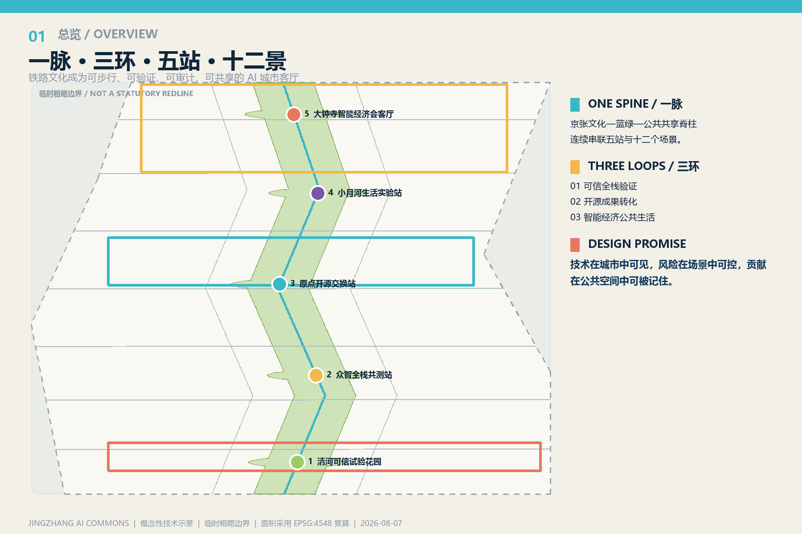
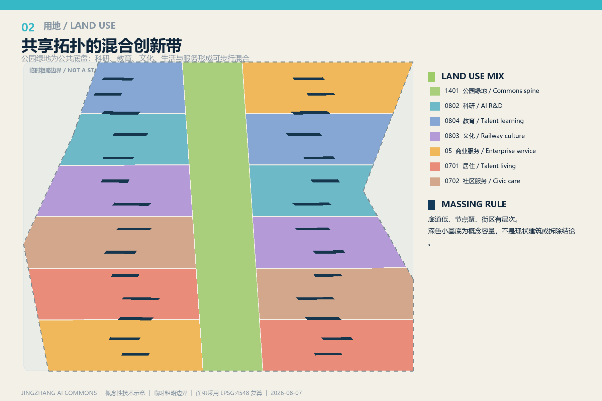
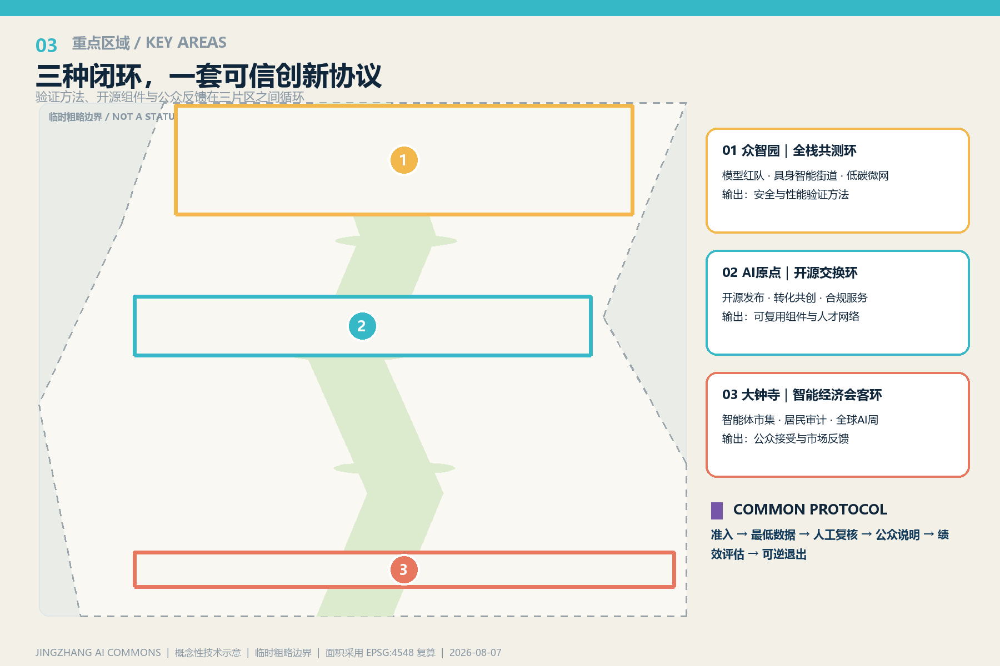
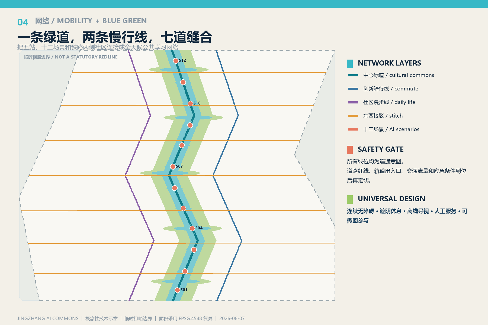
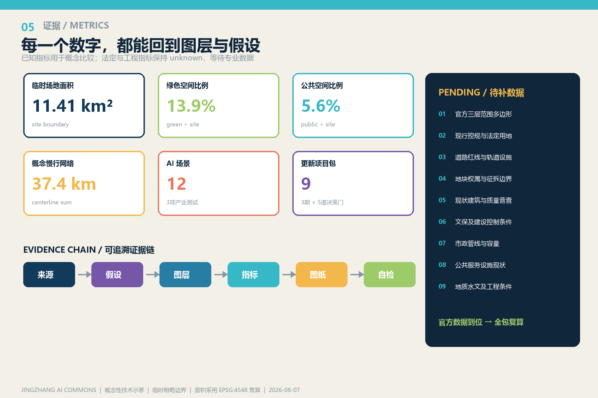

# 京张智脉：开放共生的AI城市客厅

英文名为 JINGZHANG AI COMMONS。品牌口号为“一脉 · 三环 · 五站 · 十二景 / ONE SPINE · THREE LOOPS · FIVE STATIONS · TWELVE SCENARIOS”。本方案把百年京张从工业交通遗存转译为面向未来的公共学习基础设施：AI 不被藏在封闭园区，而在可步行、可验证、可审计、可共享的城市客厅中被居民、研究者、企业和访客共同理解。

## 设计依据与资料清单

方案以官方征集公告、面向智能体任务书、城市设计管理、控制性详细规划编制和国土空间用地分类为依据，并以仓库中的站点包、来源登记表和处理后的事实包建立证据链。[source:OFFICIAL-ANNOUNCEMENT] [source:AGENT-TASKBOOK] [source:SITE-PACKAGE] [source:SOURCE-REGISTRY] [source:PROCESSED-FACT-PACK] 对应 [standard:PROJECT-OFFICIAL-ANNOUNCEMENT]、[standard:PROJECT-AGENT-OPEN-CALL-TASKBOOK]、[standard:MOHURD-URBAN-DESIGN-MEASURES]、[standard:MOHURD-CONTROL-DETAILED-PLANNING] 与 [standard:MNR-LAND-USE-CLASSIFICATION-GUIDE]。建筑专业深度规定只登记为待取得官方文件的参照项，不把来源未核定的镜像升级为权威依据。[standard:MOHURD-ARCH-DESIGN-DEPTH-2016]

资料审计显示，官方三层多边形、现行控规、道路红线、地块权属、现状建筑、文保控制、市政容量、公共服务和工程条件尚未随公开包提供。因此本方案沿用仓库临时粗略边界，并在属性中标明 official_boundary=false、geometry_role=provisional_constraint；它只支撑概念比较、内容评审和自动自检，不作为法定红线或工程计算依据。[source:BOUNDARY-SOURCE] [source:KEY-AREA-SOURCE] [data:geometry/site_boundary.geojson#SITE-001] [data:geometry/constraints.geojson#CONSTRAINTS-001] [depth:existing_conditions_diagnosis]

资料使用遵循“来源—假设—图层—指标—图纸—复核”的闭环：公开事实与设计判断分列；所有面积统一投影至 EPSG:4548 计算；GeoJSON 保持 EPSG:4326；每个设计对象写明来源类型、可信度和几何角色。假设 A-BOUNDARY-001 至 A-IMPLEMENTATION-001 均明确影响和后续动作，确保获得官方数据后不是局部替换图片，而是重新裁切用地、道路、绿地、公共空间、建筑、分期并刷新全部指标。

## 三层范围工作框架

统筹研究范围按公告约 43.6 平方公里理解，回答“京张创新带如何在全球 AI 网络中形成独特生态”；总体设计范围按约 11.4 平方公里理解，回答“产业、社区、交通、蓝绿和文化如何在同一城市结构中协同”；重点区域总计约 368.4 公顷，分别对众智园 192.1 公顷、北京 AI 原点社区 104.3 公顷和大钟寺 72 公顷提出更细的空间—运营原型。公告面积用于任务尺度说明，提交几何面积则来自临时粗略多边形，两者不混写。[source:OFFICIAL-ANNOUNCEMENT] [depth:three_level_scope_framework] [metric:site_area_sqm] [metric:key_area_count]

三层之间采用“研究议题下沉、场景绩效上返”的双向机制：上层确定可信 AI、开源转化、智能经济、人才社区和铁路文化五类议题；中层用一条连续公共脊柱和三类闭环组织空间；重点区把议题拆成可验证的项目、事件和治理协议。每个重点区的试点数据经匿名化、人工审核和公众反馈后，回到总体层调整网络优先级，再回到研究层评估产业生态和全球合作。这样既避免宏观愿景失去落点，也避免单点示范无法形成创新带。

图中低对比度虚线是临时粗略边界，彩色实线与节点才是设计叙事。边界更新触发四项动作：一是重新裁切全部设计图层；二是以 EPSG:4548 复算面积和比例；三是复核三处重点区是否越界或重叠；四是重新生成五张图、A3 文册、A0 展板和离线网页。此流程写入自检与合规矩阵，使组织方数据缺口不阻断内容讨论，同时也不掩盖精度限制。

## 统筹研究范围产业与未来城市研究

六个公开案例提供的是可迁移机制而非形式抄录：新加坡 one-north 提示把研发、产业、居住和公共生活放进可测试的混合环境；剑桥 Kendall Square 提示创新就业增长必须与交通、住房和公共空间同步；多伦多 MaRS 提示科研、企业、资本与公共部门需要可日常相遇的共址平台。[source:CASE-ONE-NORTH] [source:CASE-KENDALL-SQUARE] [source:CASE-MARS-TORONTO]

巴黎 STATION F 的 Share/Create/Chill 空间梯度说明创业社区既需要高密工作，也需要共享服务和非正式交往；柏林 Adlershof 的长期园区管理说明科学、企业、媒体和人才服务必须由稳定运营主体串联；赫尔辛基 Maria 01 说明存量更新可以通过成员社区、持续事件和荣誉展示形成全球网络。[source:CASE-STATION-F] [source:CASE-ADLERSHOF] [source:CASE-MARIA-01] 六案共同支持“空间是协议的容器”：真正可迁移的不是地标造型，而是测试准入、共享设备、开源发布、人才服务、公共审计和长期活动日历。

据此，研究范围提出三条产业闭环。北部“可信全栈验证环”连接模型安全、具身智能、边缘算力和场景合规；中部“开源成果转化环”连接高校、社区、开发者、知识产权与企业服务；南部“智能经济公共生活环”连接智能体商业、社区照护、文化消费和国际交流。三环共享一套城市级接口：场景申请、风险分级、数据最小化、人工复核、公众说明、效果评估和退出机制。其目标不是追逐单一企业，而是降低跨机构协作成本，形成可复用的可信创新基础设施。

未来城市判断以六类人作为约束：研究者需要可测试与可发表，创业者需要低成本设备和转化服务，企业工程师需要合规验证，居民需要日常便利与申诉渠道，公共运营者需要可审计日志，国际访客需要清晰的多语导览。空间品质因此被定义为“15 分钟可达的公共学习网络、全天候但可治理的创新街区、铁路记忆可读的城市路径”，而不是孤立的科技园形象。

## 总体设计范围城市更新与控规深度城市设计

总体结构为“一脉、三环、五站、十二景”。一脉是沿京张文化与绿地系统组织的连续公共共享脊柱；三环分别承载可信验证、开源转化和智能经济公共生活；五站自北向南为清河可信 AI 试验花园、众智全栈共测站、原点开源交换站、小月河城市生活实验站、大钟寺智能经济会客厅；十二景把技术服务、公共体验和城市记忆嵌入可步行路径。[depth:overall_spatial_structure] [data:geometry/land_use.geojson#LU-001]

用地采用共享拓扑分区：1401 公园绿地形成连续骨架，两侧以 0802 科研、0804 教育、0803 文化、05 商业服务、0701 住宅和 0702 社区服务形成混合带。分类只采用仓库登记的国家指南子集，不用自造代码替代法定分类；分区是功能结构建议，待控规和权属到位后再决定边界与强度。[standard:MNR-LAND-USE-CLASSIFICATION-GUIDE] [depth:land_use_layout]

建筑表达为概念性容量基底，强调“小街区、可穿行底层、可转换上部、共享设备层和灰空间”。图层不声称是现状建筑，也不把任何建筑标成必拆；拆改留采用“先普查、再价值分级、后逐栋决策”，铁路文化相关对象优先进入保留与适应性利用候选清单。[depth:development_intensity_controls] [depth:height_massing_character] [depth:retain_renovate_demolish] [data:geometry/buildings.geojson#BLDG-001]

开发强度、总建筑面积、建筑高度、停车和拆除面积均保持 unknown，因为这些指标需要官方边界、现状测绘、文保条件和控规依据。可量化的建筑基底面积只用于比较空间原型，不推导容积率。总体设计把每条控制建议都标为“概念性专业深化建议”，在条件未齐之前不形成规划许可、建设时序或投资判断。

## 重点区域详细设计

众智园 192.1 公顷定位为“全栈共测环”：以共测站为核心布置模型红队花园、具身智能共享街道和边缘算力—低碳微网沙盒三类产业验证场景。空间上形成设备可进出、公众可旁观、风险可隔离的三层界面；运营上实行测试申请、伦理与安全预审、限定时段、人工接管、数据脱敏和结果公开摘要。临时多边形只用于框架落位，正式边界到位后应复核安全距离、道路条件和基础设施容量。[data:geometry/key_areas.geojson#PROV-KEY-001]

北京 AI 原点社区 104.3 公顷定位为“开源交换环”：原点开源交换站串联开源发布厅、成果转化共创街、知识产权与合规服务台、AI 教育工作室和“开源开关”荣誉节点。首层面向公众，二层面向开发者和团队，设备层集中共享算力与实验资源；居民可以在发布前体验并提出问题，开发者必须说明数据来源、模型限制和人工负责边界。场所成功指标优先采用参与多样性、问题闭环率和复用项目数，而不是单纯追求活动人次。[data:geometry/key_areas.geojson#PROV-KEY-002]

大钟寺 72 公顷定位为“智能经济会客环”：把智能体商业、社区照护、文化消费和全球交流放在同一日常街区测试。大钟寺会客厅连接智能体原生市集、社区服务审计室、百年京张数字叙事路径与全球 AI 周步行终点；所有高风险服务保留显著人工服务入口、投诉渠道和可撤回授权。建筑更新优先利用可识别的存量空间，新增体量只表达围合公共空间的可能性。[data:geometry/key_areas.geojson#PROV-KEY-003]

三片区不是三座封闭园区，而是通过智脉绿道、东西接驳缝合线和统一治理协议组成一套分布式实验室。共测环输出安全与性能方法，交换环输出开源组件与转化服务，会客环输出公众接受度与市场反馈；三类结果在季度评议会上互相校验。[depth:three_key_area_detailed_design]

## AI 创新生态、人才画像与 AI+ 场景

六类核心人物画像分别是：高校研究者与学生，关注开放设备、发表伦理和低成本通勤；初创创始人，关注快速验证、客户连接和知识产权；企业工程师，关注合规接口、可靠性和保密边界；周边居民，尤其老人、儿童与照护者，关注安全、无障碍、价格和人工替代入口；公共规划与运营人员，关注日志、责任和绩效；国际访客，关注多语导览、短期协作与文化理解。[metric:persona_count]

十二张场景卡采用同一模板“节点—服务—最低数据—人工复核—运营者—退出条件”：1 模型安全与红队花园（产业测试）；2 具身智能共享街道（产业测试）；3 边缘算力—低碳微网沙盒（产业测试）；4 开源发布厅；5 成果转化共创街；6 AI 知识产权与合规助手；7 无障碍移动协作器；8 居民服务审计室；9 AI 教育工作室；10 大钟寺智能体原生市集；11 百年京张数字叙事路径；12 全球 AI 周步行路线。[metric:scenario_count] [metric:test_scenario_count]

前三项测试场景实行更严格的准入：限定区域和时段、物理急停、专业人员在场、测试数据最小化、敏感结果不公开、事故通报与独立复盘。居民服务、无障碍移动和公共安全相关场景不得把模型输出作为自动处罚或资源拒绝依据，必须保留人工复核和申诉。每张卡都以公共价值、技术性能、隐私公平、运维成本和退出可逆性五维评分，连续两个评估周期不达标则暂停。

四个 AI 朝圣与荣誉节点为“AI 原点零公里”“开源开关”“模型星图贡献墙”“智能体论坛环”。标识系统以双轨线、神经节点和开放括号组合成原创图形：双轨线代表京张历史与未来并行，节点代表协作网络，开放括号代表未完成且可贡献的城市。节点展示贡献时只记录经本人或机构同意的公开成果，不把排名、流量或商业赞助等同于公共荣誉。[metric:landmark_count]

长期运营采用“年度全球 AI 周＋季度开源夜＋月度居民审计日＋常态共测预约”的节律。建议由公共部门、高校、企业、社区和专业机构组成多方理事会，发布年度场景清单、风险报告和资源使用摘要；运营合同设置开放时段、弱势群体可达性、开源回馈和退出条款，避免空间被单一主体长期占用。

## 用地、建筑规模与拆改留方案

用地结构以连续公园绿地为公共底盘，以科研、教育、文化、商业服务、住宅和社区服务形成可步行混合。共享拓扑算法先从临时场地多边形中扣出绿色公共脊柱，再对余下面积分区，因此地类之间无面积重叠，合并后完整覆盖临时边界；这是一项可验证的几何关系，而非对法定地类的替代。[data:geometry/land_use.geojson#LU-001] [metric:green_space_area_sqm]

建筑基底采用两侧离散、小尺度、可穿行的容量原型，避免把连续首层做成封闭园区墙。北部倾向实验室、孵化器和研发，中部倾向教育、文化与混合使用，南部倾向社区服务、人才居住和商业；功能可以随场景绩效调整。由于缺少现状建筑，图层字段 retain_renovate_demolish 统一设为 undetermined_pending_survey，明确没有逐栋拆除判断。[metric:building_footprint_area_sqm]

拆改留工作流分五步：建立现状建筑与权属底图；完成结构安全、使用效率、文化价值和碳排评估；把对象分为保留、修缮、改造、加建候选和退出候选；开展利益相关方协商与专业审查；再将结论写入更新项目和分期。铁路相关、社区记忆强、结构可适配的建筑优先进入保留改造候选；确需退出的对象也必须说明公共利益、替代安置、碳成本与方案比较。

高度体量采用“廊道低、节点聚、街区有层次”的概念控制：脊柱两侧留出日照、风和视线开口，公共站点以低层共享基座形成可进入界面，向外侧逐步容纳弹性研发和生活空间。具体米数、容积率、建筑密度和退线保持未知，待文保、日照、交通和控规条件齐备后，通过三维模型和多方案比选深化。

## 交通、轨道、市政与公共服务设施

交通策略以步行和骑行连续性为先，提出一条中心绿道、两条平行慢行线和七条东西向接驳缝合线。中心绿道承担五站与十二场景串联，西侧骑行线服务跨区通勤，东侧漫步线连接社区生活，横向线把铁路两侧、轨道接驳和周边街区编织起来。[data:geometry/roads.geojson#ROAD-G-01] [metric:road_length_m] [depth:traffic_rail_slow_parking]

现阶段不绘制虚构的现状主干路、轨道出入口或道路红线。获得官方交通资料后，需把概念线与现状路网叠合，完成步行等时圈、过街需求、公交接驳、骑行冲突、货运与应急、停车供需及交通影响评估；不满足安全或容量条件的连接应移动或取消。测试街道采用可逆设施、限定时段和物理隔离，始终保证普通交通和无障碍通行。

市政与新型基础设施形成“先容量、后场景”的准入门：模型和机器人测试需核算电力、通信、消防、给排水和废热；边缘算力节点优先与可再生能源、储能和余热利用联动；传感器只采集实现服务所需的最低数据，并规定保存期限、访问权限和删除机制。[data:geometry/constraints.geojson#CONSTRAINTS-001] [depth:municipal_new_infrastructure]

公共服务采用共享前台与人工兜底：五站均设置可见的人工服务台、无障碍卫生间、安静空间、儿童与老人休息点、多语导览和应急集合信息；AI 助手只做咨询和辅助，不替代法定审批、医疗判断或公共安全责任。设施规模和服务半径需在获得人口、设施现状和客流数据后校核。

## 蓝绿空间、公共空间与城市风貌

蓝绿结构把京张线性记忆转成一条可日常使用的“城市学习河流”：连续绿道提供遮阴、雨洪调蓄和生境连接，五个绿核提供停留、活动与展示，十二个小节点提供可插拔场景。绿色面积和公共空间面积均由同一临时边界裁切后复算，比例只适合方案内部比较。[data:geometry/green_space.geojson#GREEN-001] [data:geometry/public_space.geojson#PUBLIC-001] [metric:green_ratio] [metric:public_space_ratio] [depth:blue_green_public_space]

公共空间遵循四个界面原则：沿脊柱保持连续开放视线；建筑首层设置多入口与可穿行灰空间；测试区以可读边界说明风险和参与方式；社区侧提供低刺激、低门槛和全天候停留点。无障碍不是附加设施，而是路径坡度、铺装触感、信息对比、声音提示、休息间距和人工协助的整套系统。夜间照明避免炫光和过度媒体化，重要信息可在断网时继续读取。

城市风貌不采用通用“科技蓝玻璃”形象，而以铁路材料记忆、北京院落尺度和开放源代码的可见结构结合：轨枕节奏转译为铺装与构架，铆接与钢轨细部转译为可拆装节点，砖与暖灰建立日常基底，青蓝和青绿只用于公共导航。新旧关系强调可辨识而不仿古；数字界面服从实体空间，屏幕不遮挡历史线索和公共方向。

雨洪、树木、水系和土壤资料到位后，绿色骨架需要进一步做汇水分区、海绵设施规模、生境评估和全龄树荫校核。若现状水系或保护树木与概念节点冲突，应优先移动节点而不是改变生态对象。所有临时活动采用可恢复地面和可拆装设施，减少反复建设。

## 更新项目清单、实施政策与分期计划

九个概念性项目包依次为：P1 智脉连续绿道与无障碍底盘；P2 清河可信 AI 试验花园；P3 众智全栈共测站；P4 原点开源交换站；P5 小月河城市生活实验站；P6 大钟寺智能经济会客厅；P7 四个朝圣与荣誉节点；P8 城市级数据最小化与公众审计协议；P9 全球 AI 周和社区运营网络。项目包同时包含空间、运营、合规和绩效，不把建设工程与活动运营割裂。[metric:renewal_project_count] [depth:renewal_project_list]

一期 0—2 年建议以可逆、轻量、低数据风险的公共活动和导览为主：完成数据补齐、公众沟通、安全核查后，可试行开源夜、数字叙事和临时绿道；二期 3—5 年在权属、建筑普查、交通市政和法定条件明确后，推进适应性利用、共享服务与公共空间连接；三期 6 年以后才讨论全栈验证网络、长期基础设施和区域级协同。[data:geometry/phasing.geojson#PHASE-001] [depth:phasing_implementation]

每一期设置五道决策门：数据门确认边界与现状，公共门确认影响和申诉，专业门完成规划、建筑、交通、市政、文保与安全审查，合规门确认数据与算法责任，运营门确认主体、预算、维护和退出。任何一门未通过，只能继续研究或缩减试点。分期边界是便于表达的南中北概念分区，不是施工标段、立项范围或工期承诺。

政策建议包括共享设备预约与安全分级、开源成果回馈、公共数据最小化、社区优先时段、测试失败公开摘要、无障碍绩效采购和年度第三方评估。场地授权宜采用限定期限和可撤回机制；单一企业不得获得永久排他展示，公共资金支持的组件应说明可复用范围。运营绩效低于门槛时优先调整服务，再决定是否更换空间用途。

## 指标体系、面积复算与合规矩阵

本包已知指标均可从提交文件复算：临时场地面积 [metric:site_area_sqm]，概念建筑基底面积 [metric:building_footprint_area_sqm]，绿色面积 [metric:green_space_area_sqm] 与公共空间面积 [metric:public_space_area_sqm]，绿色比例 [metric:green_ratio] 与公共空间比例 [metric:public_space_ratio]，概念路网长度 [metric:road_length_m]，重点区数量 [metric:key_area_count]，场景 [metric:scenario_count]、产业测试场景 [metric:test_scenario_count]、人物画像 [metric:persona_count]、荣誉节点 [metric:landmark_count] 和更新项目 [metric:renewal_project_count]。比例均以 EPSG:4548 中的几何并集面积除以临时场地面积，避免重复计数。[depth:metrics_recalculation]

容积率、总建筑面积、最大高度、拆除面积、停车供给和市政容量保持 unknown；这不是遗漏，而是对资料边界的明确回应。数字展示必须同时显示状态、公式、来源图层、可信度和假设。官方边界到位后，用地完整覆盖与无重叠、重点区越界、绿色与公共空间并集、建筑基底并集和道路长度均需重新运行自动检查。

九个空间文件均可由正文回链：[data:geometry/site_boundary.geojson#SITE-001]、[data:geometry/key_areas.geojson#PROV-KEY-001]、[data:geometry/land_use.geojson#LU-001]、[data:geometry/buildings.geojson#BLDG-001]、[data:geometry/roads.geojson#ROAD-G-01]、[data:geometry/green_space.geojson#GREEN-001]、[data:geometry/public_space.geojson#PUBLIC-001]、[data:geometry/constraints.geojson#CONSTRAINTS-001]、[data:geometry/phasing.geojson#PHASE-001]。compliance_matrix.json 覆盖 17 项公告任务和 6 项智能体任务；standard_matrix.json 与 design_depth_matrix.json 将标准和 15 项专业深度逐条映射到正文、图纸、图层、指标、来源、假设与自检。

## 风险、版权与合规说明

最大风险不是某个造型是否准确，而是临时边界、资料缺口和 AI 场景被误读为法定或可直接实施结论。为此，边界与重点区用低对比度虚线；法定强度、拆除、停车和市政容量不填假数；所有空间与政策动作使用“概念性建议、待专业深化、需审批确认”的语气；官方多边形到位后触发全包复算。[depth:risk_missing_data]

AI 场景按数据隐私、技术成熟、实施复杂、公众接受、运维成本、空间争议和公平包容进行风险分级。涉及机器人、公共安全、居民服务和无障碍的场景必须保留人工接管、显著告知、申诉、日志审计和退出；不采集与服务无关的数据，不用不透明模型自动决定处罚、准入或基本公共服务。测试失败是学习材料，但只公开脱敏摘要。

本包的图形、版式、文字整合和代码由 OpenAI Codex 在本次任务中生成；空间依据仅使用仓库公开临时几何，案例研究只提炼已登记公开网页的机制，没有复制外部照片、地图底图或品牌标志。PDF 使用本机系统字体嵌入显示，字体文件不随包分发。详细声明见 report/copyright_statement.md，许可为 COMMUNITY-DISPLAY-ONLY，提交者仍负责 GitHub 身份、专业复核和最终公开行为。

自检包含确定性结构、空间拓扑、视觉安全、专业证据和 PDF 页面检查。当前可进入内容评审的前提是明确承认临时边界；若评审需要法定或工程精度，应暂停相关判断并索取官方资料。A-BOUNDARY-001 至 A-IMPLEMENTATION-001 是后续深化任务清单，不因自检通过而消失。

## 参考资料

项目与规范来源包括项目站点包 [source:SITE-PACKAGE]、来源登记 [source:SOURCE-REGISTRY]、事实导航包 [source:PROCESSED-FACT-PACK]、临时总体边界 [source:BOUNDARY-SOURCE]、临时重点区 [source:KEY-AREA-SOURCE]、官方公告 [source:OFFICIAL-ANNOUNCEMENT]、智能体任务书 [source:AGENT-TASKBOOK]、城市设计管理材料 [source:URBAN-DESIGN-MEASURES]、控制性详细规划编制材料 [source:CONTROL-DETAILED-PLANNING] 和国土空间用地分类指南 [source:LAND-USE-GUIDE]。每条来源的路径、网址、用途和访问日期记录于 sources.json。

全球案例来源为新加坡 one-north [source:CASE-ONE-NORTH]、剑桥 Kendall Square [source:CASE-KENDALL-SQUARE]、多伦多 MaRS [source:CASE-MARS-TORONTO]、巴黎 STATION F [source:CASE-STATION-F]、柏林 Adlershof [source:CASE-ADLERSHOF] 与赫尔辛基 Maria 01 [source:CASE-MARIA-01]。案例仅用于比较运营与空间机制，不把网页宣传语、图片或不稳定的规模数字转写为本项目事实。

专业深度索引为 [depth:existing_conditions_diagnosis]、[depth:three_level_scope_framework]、[depth:overall_spatial_structure]、[depth:land_use_layout]、[depth:development_intensity_controls]、[depth:height_massing_character]、[depth:retain_renovate_demolish]、[depth:traffic_rail_slow_parking]、[depth:municipal_new_infrastructure]、[depth:blue_green_public_space]、[depth:three_key_area_detailed_design]、[depth:renewal_project_list]、[depth:phasing_implementation]、[depth:metrics_recalculation] 与 [depth:risk_missing_data]。这些索引把可读正文与机器矩阵相连，便于评审逐项核查。
