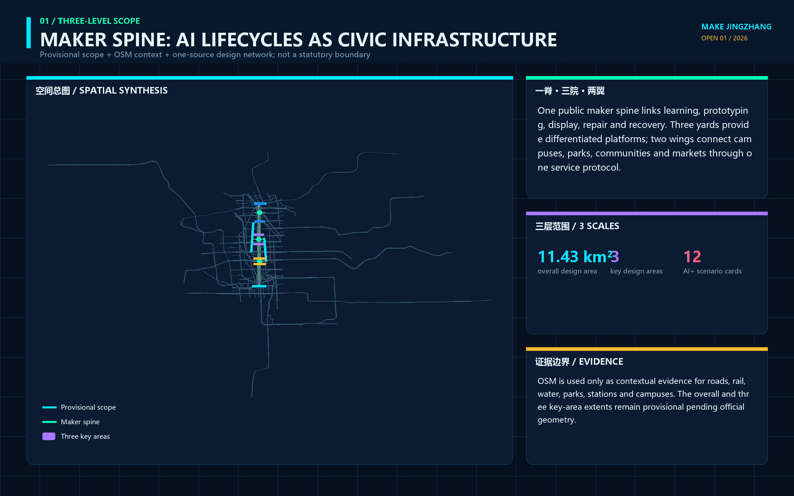
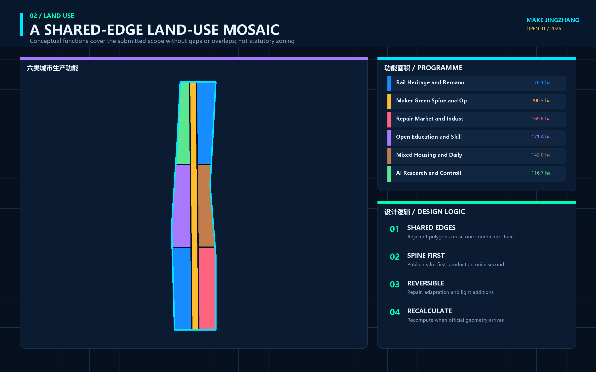
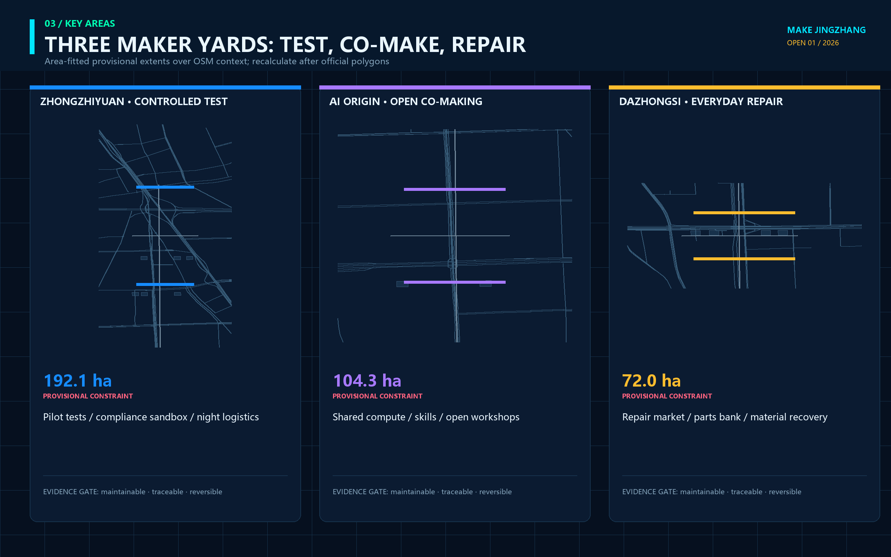
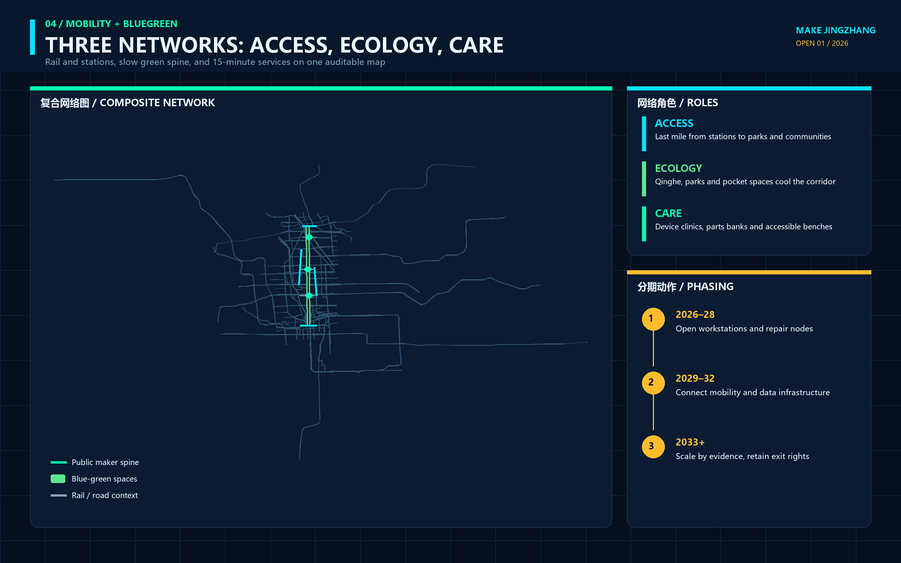
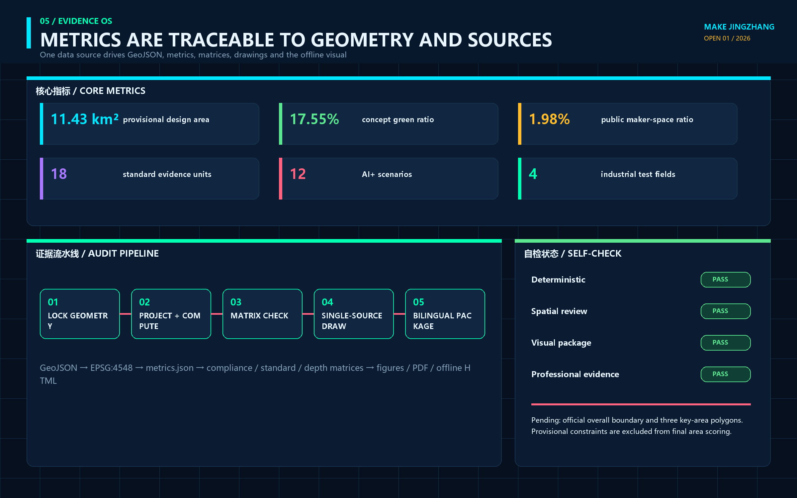

# MAKE JINGZHANG

## Turning the Full Life of Urban AI Devices into a Visible Innovation Chain

MAKE JINGZHANG does not propose a closed factory beside the heritage park, nor does it wrap a conventional business park in futuristic imagery. It translates the engineering culture of designing, surveying, making, and building the historic Jing-Zhang Railway into a civic making ethic for the AI era. Every robot, intelligent terminal, or new public device entering the city should disclose who proposed it, where it was tested, who maintains it, how a person takes over during failure, and what happens to its materials and data at retirement. The spatial framework is one public maker spine, three maker yards, two service wings, and twelve public workstations. An eight-field Urban Device Passport connects making, testing, use, repair, retirement, and knowledge return. Every spatial move is a conceptual suggestion on provisional geometry; none replaces statutory planning or government approval.

## Design Basis and Source List

The proposal begins with the official three-level scope: a 43.6-square-kilometre coordinated research area, an approximately 11.4-square-kilometre overall design area, and three key areas totalling about 368.4 hectares. It also answers the three positionings, five functions, and agent.1 through agent.6 in the Agent taskbook.[source:OFFICIAL-ANNOUNCEMENT] [source:AGENT-TASKBOOK] The design starts from tasks, public evidence, spatial constraints, professional standards, and an explicit missing-data list rather than from an imagined masterplan. Complete provenance is in `sources.json`, while task coverage is in `compliance_matrix.json`.

No exact official redline with a verifiable coordinate system is available in the repository. The `SITE_BOUNDARY` and three `KEY_AREA` polygons are rough provisional geometries maintained from the announcement's textual extent, north-to-south order, and approximate area figures. They are suitable only for generation, visualization, topology checks, and discussion.[source:BOUNDARY-SOURCE] [data:geometry/site_boundary.geojson#SITE-001] When official polygons arrive, the complete chain—land use, buildings, roads, green space, public space, phasing, metrics, figures, HTML, and PDFs—must be rebuilt. The temporary shape must never be promoted into an approval basis.

Land-use terminology follows the registered project subset of the national classification guide. Public space, urban character, and building interfaces respond to the Urban Design Management Measures. Regulatory planning, road redlines, development intensity, and permitting are kept in three columns: known public fact, conceptual proposal, or pending official data.[standard:MNR-LAND-USE-CLASSIFICATION-GUIDE] [standard:MOHURD-CONTROL-DETAILED-PLANNING] Existing buildings, ownership, utilities, fire safety, heritage controls, blue-green controls, and the current device inventory still require fieldwork and professional review.

All figures, offline pages, and PDFs are generated from package GeoJSON, metrics, and text. They contain no commercial map screenshots, uncleared photographs, or redistributed external font files. Existing context comes from a fixed OpenStreetMap/Overpass extract dated 2026-08-11 covering roads, rail, waterways, parks, stations, and campuses. The query, bbox, retrieval date, raw-response hash, and ODbL attribution are preserved in `visual/assets/osm-context.json`; aggregated roads, rail, and waterways are mirrored in `geometry/constraints.geojson`.[source:OSM-CONTEXT-20260811] OSM places the proposal back into the real urban network but does not establish an official boundary, road redline, blue line, parcel, or buildability conclusion. Pale dashed outlines remain provisional constraints, while highlighted content expresses design relationships rather than engineered alignments.[depth:existing_conditions_diagnosis]

The map cross-check showed that the former Dazhongsi placeholder sat around 39.946°N, clearly displaced from the publicly mapped Dazhongsi station and inconsistent with the later July 2026 official renewal notice's north-to-North-4th-Ring and south-to-Zhuanhe location description. The approximately 72 ha area-fitted placeholder and its southern concept nodes were therefore moved north to the station vicinity. This removes an obvious location error without treating the later renewal-area text bounds as the competition's official key-area polygon.[source:DAZHONGSI-UPDATE-SCOPE-20260713] The package still requires full recomputation when official geometry arrives.

## Three-Level Scope Framework

At the coordinated research level, the proposal studies how AI devices travel from knowledge to city life by connecting research institutions, design and fabrication services, standards and intellectual property, scenario access, maintenance networks, and international exchange. At the overall design level, it studies how that chain enters an existing district: the Jing-Zhang Railway Heritage Park becomes a public maker spine linking research, education, living, commerce, green space, and cultural interfaces. At the key-area level, it defines three different jobs: controlled prototyping at Zhongzhiyuan, open making at the AI Origin Community, and everyday use and repair at Dazhongsi.[depth:three_level_scope_framework]

| Level | Core question | Design response | Boundary authority |
| --- | --- | --- | --- |
| Coordinated research area | How do ideas, prototypes, standards, capital, talent, and applications form a loop? | Ask—test-make—co-make—use—repair—retire—return knowledge | Announcement area and textual extent only |
| Overall design area | How can productive space coexist with everyday urban life? | One maker spine, three maker yards, two service wings, twelve workstations | Provisional site polygon for relationship testing |
| Key areas | How does each district reach a different design depth? | Controlled validation in the north, open translation in the centre, everyday adoption in the south | Three provisional key-area polygons |

The three levels are an evidence-transfer system rather than a stack of drawings at different scales. Mechanisms proposed at the research level must find a spatial carrier at the overall-design level. Each carrier must become a professional handoff package in a key area. Evidence on maintenance, failure, public acceptance, and exit then returns to the research level. Provisional geometry makes this chain locatable and recomputable; it does not establish statutory buildability.[data:geometry/key_areas.geojson#PROV-KEY-001] [depth:overall_spatial_structure]

## Coordinated Research Area: Industry and Future City Research

The proposal extends “full-stack autonomy” from models and computing into the complete life cycle of urban devices. A research team should hand over interfaces, risks, maintenance, spare parts, human takeover, data deletion, and retirement guidance—not only a demonstration prototype. A district operator should provide controlled testing, public feedback, repair, and failure-archiving space—not only a showroom. A city procuring a device should also receive reusable knowledge and a reversible physical carrier. This is a conceptual industry–space–governance mechanism, not a confirmed investment, procurement, or tenant plan.[source:AGENT-TASKBOOK] [depth:municipal_new_infrastructure]

The Chinese name is 京张造物场 and the English name is **MAKE JINGZHANG**. The original mark combines two parallel rails with an open square connector. The rails refer to railway engineering and the north-south civic spine. The connector represents disassembly, repair, and continued connection. Its open corner keeps public questioning and human takeover visible. Engineering blue, inspection orange, open-source cyan, and material grey form the palette. The identity uses no company trademark or existing railway emblem.[depth:height_massing_character]

Six cases contribute mechanisms, not copied forms. Singapore one-north demonstrates the adjacency of research, enterprise, startups, daily life, and living-lab activity. Fab City offers a distributed model of local production and global knowledge exchange. Aalto Design Factory shows how co-creation, CNC, electronics, models, and 3D printing can share an interdisciplinary learning platform.[source:CASE-ONE-NORTH] [source:CASE-FAB-CITY] Aalto Factory of the Future offers a controlled environment for human–robot–production collaboration. Barcelona 22@ provides a reference—and a caution—for combining productive renewal, industrial heritage, housing, services, and green space. Jurong Innovation District connects research, training, technology services, advanced manufacturing, and urban testing.[source:CASE-AALTO-DESIGN-FACTORY] [source:CASE-JURONG]

| Case | Transferable mechanism | Jing-Zhang adaptation | Explicit non-transfer |
| --- | --- | --- | --- |
| one-north | Clustering next to a living lab | Prototyping-to-adoption chain across three yards | No copied tenant list or scale |
| Fab City | Local production and global knowledge | Open components and Device Passport network | No self-sufficiency claim |
| Aalto Design Factory | Learning, prototyping, and collaboration together | Open Maker Academy at AI Origin | No copied equipment or curriculum |
| Aalto Factory of the Future | Modular human–robot testing | Controlled test benches at Zhongzhiyuan | No direct production-line deployment claim |
| Barcelona 22@ | Productive renewal in a mixed city | Keep living, services, and green space continuous | No imported statutory controls |
| Jurong Innovation District | R&D, training, making, and application nearby | Three Areas and Two Wings service chain | No heavy-manufacturing land-use copy |

The Zhongguancun Technology Service Wing provides interfaces for standards, IP, finance, international cooperation, and enterprise services. The Xiaoyuehe Scenario Empowerment Wing contributes public-space maintenance, low-speed devices, blue-green systems, and everyday service questions. The wings are not new redlines; they connect professional support and real-use feedback to the three maker yards. Links to Future Science City, Huairou Science City, Beijing E-Town, and the Beijing–Tianjin–Hebei region are open interfaces for challenges, tests, and knowledge return—not confirmed institutional commitments.[source:CASE-BARCELONA-22] [source:CASE-AALTO-FACTORY-FUTURE]

## Overall Design Area: Urban Renewal and Regulatory-Plan-Level Urban Design

The overall structure is one spine, three yards, two wings, and twelve workstations. The spine uses the heritage-park corridor as a public interface for walking, cycling, explanation, and repair. Zhongzhiyuan is the Test Yard, the AI Origin Community is the Open Make Commons, and Dazhongsi is the Use & Repair Market. The two wings connect professional services and real scenarios. Twelve workstations are removable, bookable, and stoppable public AI nodes. The structure uses the provisional boundary only for geometric testing and establishes no new road redline or control line.[data:geometry/roads.geojson#ROAD-001] [depth:land_use_layout]

Seven shared-edge land-use relationships cover the temporary site without overlaps. A central park strip carries the civic maker spine. Northern research and commercial-service zones support prototyping. Central education, research, housing, and community services support co-making and talent life. Southern cultural and commercial zones support public use, repair, and international exchange. Codes are conceptual capacity zones rather than a survey of existing or statutory use.[data:geometry/land_use.geojson#LU-001] [standard:MNR-LAND-USE-CLASSIFICATION-GUIDE]

Concept building footprints show relationships among R&D testing, open workshops, community services, cultural display, and commercial services. Each candidate remains pending surveys of existing use, ownership, structure, fire safety, sunlight, heritage, energy, and occupancy. Nothing supports a parcel-level decision to retain, renovate, demolish, or build. Total floor area, floor area ratio, density, and height remain pending official controls. Open ground floors, detachable service bands, visible repair interfaces, and a massing gradient that keeps the heritage park visually dominant are directions for later professional design.[data:geometry/buildings.geojson#BLDG-001] [depth:development_intensity_controls]

Renewal follows a reversible-first sequence. Ground floors, covered edges, courtyards, station forecourts, and park interfaces host time-limited prototypes before any permanent intervention. Permanent engineering study begins only when safety, maintenance, public impact, cost, and exit evidence is complete. Bridges, tunnels, underground logistics, energy, utilities, and structural works require official source material and specialist assessment.[standard:MOHURD-URBAN-DESIGN-MEASURES] [depth:retain_renovate_demolish]

## Detailed Design of Key Areas

The three key areas use repository provisional polygons, so the following work is detailed as functional relationships and professional handoff packages, not parcel controls. All three use the Urban Device Passport but perform different roles. Zhongzhiyuan retains technical risk inside a controlled boundary. AI Origin translates professional language into co-makable knowledge. Dazhongsi tests everyday value and generates maintenance and exit feedback.[data:geometry/key_areas.geojson#PROV-KEY-002] [depth:three_key_area_detailed_design]

**Zhongzhiyuan Test Yard.** Its relationship section is an inspection forecourt, modular test courtyard, human-takeover lane, failure archive, and green buffer. It hosts open-hardware interoperability, low-speed service robots, offline and privacy modes for public terminals, and urban-maintenance devices. Each test needs a physical boundary, named operator, emergency stop, failure log, and retirement plan. Missing Qinghe River, Fifth Ring Road, road, and utility information prevents bridge, underground-space, access, or pipeline conclusions.[data:geometry/key_areas.geojson#PROV-KEY-001]

**AI Origin Open Make Commons.** Its sequence is a university knowledge interface, open workshop, public problem desk, accessibility prototyping room, release court, and talent-living edge. Researchers, students, residents, maintainers, and startups work on the same Device Passport. Drawings, code, material, and licence information are separated; uncleared content cannot enter public release. Actual campus, district, station, and walking connections remain pending official and field evidence.[data:geometry/public_space.geojson#PUBLIC-002]

**Dazhongsi Use & Repair Market.** Its sequence is a station civic room, intelligent-terminal trial street, repair café, Device Passport wall, cultural display court, and staffed service window. Innovation is judged by whether basic service remains available, failure can be repaired, devices can exit safely, and materials and data have destinations—not by sales volume. The station quadrants, passenger flows, road redlines, temple heritage, and commercial ownership all require professional verification.[data:geometry/key_areas.geojson#PROV-KEY-003]

## AI Innovation Ecosystem, Personas, and AI+ Scenarios

The making ecosystem has eight interfaces: space provides reversible carriers; industry contributes real questions; talent forms interdisciplinary teams; capital funds limited prototypes rather than permanent occupation; compute and models disclose versions and limits; data is minimized by purpose; making and repair record materials and spares; and scenarios close with users and operators. The Zhongguancun wing contributes IP, standards, legal, and finance support. The Xiaoyuehe wing contributes maintenance, ecology, sport, and community-service questions. Each interface retains accountable people and exit conditions.[source:AGENT-TASKBOOK] [metric:global_case_study_count]

| Persona | Main task | Spatial response | Protected right |
| --- | --- | --- | --- |
| AI and robotics researcher | Integrate model and hardware | Controlled benches at Zhongzhiyuan | Reproducible failure archive |
| Hardware startup | Prototype, review, trial, and repair | Three-yard chain and service wing | Trial does not bypass approval |
| Maker and repair technician | Assemble, diagnose, stock, retire | Repair café and tool library | Maintenance labour is credited |
| Resident and older adult | Receive reliable basic service | Staffed window and no-account route | Non-AI service is not worse |
| Child and family | Understand how devices work | Maker Academy and low-risk bench | No behavioural or ability profile |
| Frontline service worker | Take over failure and report problems | Responsibility cabinet and paper ticket | Authority to pause unsafe devices |
| International developer and visitor | Exchange, reproduce, communicate | Multilingual release court and Make Week | Visible licence, provenance, and limits |

The twelve cards put scenario, space, and operation in one view. Asterisks mark industry test and validation scenarios. Every card is currently a conceptual, permission-pending, baseline-pending, reversible proposal.[metric:scenario_card_count] [metric:industry_test_scenario_count]

| ID | Scenario and place | Minimum data / human gate | Public value / exit |
| --- | --- | --- | --- |
| S01* | Open-hardware interoperability bench / Zhongzhiyuan | Device protocols and synthetic tests; engineer sign-off | Reduce lock-in; incompatible work returns to lab |
| S02* | Low-speed service-robot test / Zhongzhiyuan | Route and collision tests; staffed emergency stop | Assist delivery and maintenance; stop when safety is unclear |
| S03* | Offline/privacy test for public AI terminals / Zhongzhiyuan | Synthetic tasks; data and security review | Preserve no-account service; exit if offline mode fails |
| S04* | Blue-green maintenance device / Xiaoyuehe wing | Non-personal environmental data; landscape and water review | Assist inspection; never replace professional judgement |
| S05 | Open device co-making residency / AI Origin | Cleared drawings and versions; mentor on duty | Produce open knowledge; no release with unclear licence |
| S06 | Accessible interface studio / AI Origin | Role-based task tests; accessibility review | Multi-channel interaction; non-digital route always open |
| S07 | Children's making-literacy bench / AI Origin | No identified learning record; adult supervision | Explain technical limits; no capability profile |
| S08 | Urban Device Passport kiosk / all yards | Device state and accountability fields; maintainer sign-off | Make responsibility visible; expire and remove stale entries |
| S09 | Repair café / Dazhongsi | Work orders and part data; technician confirmation | Extend service life; retire safely when unrepairable |
| S10 | Intelligent-terminal trial street / Dazhongsi | Aggregated feedback; staffed service in parallel | Test everyday value; reject mandatory registration |
| S11 | Jing-Zhang engineering culture workshop / civic spine | Verified sources and original graphics; human curation | Link railway and maker cultures; withdraw disputed content |
| S12 | Global MAKE JINGZHANG Week / whole line | Public programme and cleared work; human organizer | Open challenges and handoff; no event without authorization |

The eight Device Passport fields are public purpose; place and users; version, materials, and licence; data and model; test evidence; accountability and human takeover; maintenance and spares; and retirement and knowledge return.[metric:device_passport_field_count] These are design handoff fields rather than a government technical standard. Safety, data, accessibility, procurement, operations, and relevant industry specialists must approve any real application.

## Land Use, Building Scale, and Retain-Renovate-Demolish Strategy

Concept land use fully covers the provisional site. Research 0802, education 0804, residential 0701, commercial service 05, cultural 0803, and park green 1401 are coordinated around the maker spine.[metric:land_use_area_total_sqm] [metric:land_use_0802_sqm] EPSG:4548 areas verify package closure rather than statutory quantities. Commercial, residential, educational, and cultural zones remain capacity diagrams pending official parcels and controls.[metric:land_use_05_sqm] [metric:land_use_0701_sqm]

The building layer contains conceptual footprints showing the relative grain of testing, open making, community service, culture, and commerce. Their total footprint and count are recomputable.[metric:building_footprint_area_sqm] [metric:building_count] Parcel-level action follows an evidence sequence: retain existing fabric first, run light-touch temporary uses, and consider construction only after evidence. No building is identified for confirmed retention, renovation, demolition, or new construction.[data:geometry/buildings.geojson#BLDG-001]

Urban character makes the process of making visible while keeping devices reversible. Ground floors use workshop interfaces without becoming showrooms; service bands are separately metered and detachable; engineering blue, natural material colours, and inspection orange support the identity; heritage and green space remain visually dominant. Height, FAR, density, setbacks, fire safety, and sunlight remain pending official data.[metric:floor_area_ratio] [depth:height_massing_character]

## Transport, Rail, Municipal Infrastructure, and Public Services

A north-south greenway and three conceptual east-west connectors link the three provisional key areas and their public spaces. Total line length and greenway length only validate package relationships.[metric:road_length_m] [metric:greenway_length_m] Lines are not road redlines, sections, bridges, tunnels, or rail entrances. Dazhongsi, Wudaokou, Qinghuadongluxikou, and other connections must be redrawn from official exits, passenger flows, levels, and safety data.[data:geometry/roads.geojson#ROAD-002] [depth:traffic_rail_slow_parking]

Logistics is limited to hand-cart, bicycle, low-speed, and booked prototype or repair movements. The proposal does not introduce heavy production or underground freight into an existing urban district. Robots remain inside controlled boundaries until public right-of-way, speed, yielding, insurance, and responsibility are approved. Parking, loading, fire access, and accessible continuity require specialist surveys, and AI routing never replaces human traffic judgement.[source:BOUNDARY-SOURCE]

Municipal and digital infrastructure follows four directions: separately metered, useful when offline, available for human takeover, and removable without damaging basic service. There is no public baseline for power, network, water, waste, fire, or energy load, so the proposal supplies interface and validation lists only. Health, education, culture, and enterprise-service scenarios provide navigation rather than replacing doctors, teachers, lawyers, or public counters.[standard:MOHURD-URBAN-DESIGN-MEASURES]

## Blue-Green Network, Public Space, and Urban Character

The central park strip is a civic maker spine, not an outdoor sales aisle. Walking, cycling, rest, ecology, and heritage reading come first. AI devices enter only when public purpose, low disturbance, maintenance, and exit are clear. Green and public-space quantities are recomputed from package geometry and express internal design relationships rather than official control ratios.[metric:green_space_area_sqm] [metric:green_ratio] Three maker courts host controlled testing, open making, and everyday repair with movable furniture, detachable cabinets, staffed operation, and visible stop controls.[metric:public_space_area_sqm] [metric:public_space_ratio]

The component library includes a Device Passport plate, lockable tool cabinet, paper work-order box, movable prototyping bench, human-takeover lamp, shared parts grid, and retired-material display. No screen or account is required to understand a component. A stopped component can be removed and the site restored. Landscape professionals must redesign dimensions and materials when official green/blue lines, trees, stormwater, heritage, and accessibility conditions are available.

Four AI pilgrimage and honour nodes make contribution memorable. **Bench Zero** credits people who formulate public questions. The **Many Makers Passport Wall** records making, testing, and repair. The **Open Tool Beacon** displays reusable tools and licences. The **Lifecycle Gallery** shows the journey from prototype to safe retirement.[metric:landmark_count] They record public contribution rather than advertising. Trademark, heritage, structure, safety, and accessibility review is required before construction.[depth:blue_green_public_space]

The cultural narrative is not a decorative conversation between steam locomotives and robots. It is three engineering handovers. The Jing-Zhang Railway shows how autonomous engineering changes spatial connection. Zhongguancun shows how knowledge and enterprise change innovation. AI culture must show that public devices can be understood, maintained, challenged, and corrected. Wayfinding uses six equivalent Chinese and English verbs—ask, test-make, co-make, use, repair, retire—and avoids cyber-neon, dominant screens, or pseudo-historic forms.

## Renewal Projects, Implementation Policy, and Phasing

Nine renewal projects are professional handoff packages: JZ-M01 maker-spine and discontinuity survey; M02 Zhongzhiyuan controlled test benches; M03 AI Origin open workshop; M04 Dazhongsi repair café; M05 Device Passport kiosks at all yards; M06 low-speed device testing protocol; M07 accessible interface studio; M08 Jing-Zhang engineering culture workshop; and M09 annual MAKE JINGZHANG Week.[depth:renewal_project_list] None has a confirmed owner, budget, or approval. Each begins by identifying a lawful accountable party, baseline, professional gates, and public feedback route.

Phasing is evidence-gated rather than date-promised. **SEE** acquires official boundaries, field conditions, ownership, device inventories, service questions, and risk baselines. **MAKE** runs limited prototypes in controlled spaces and records failure, maintenance, and human takeover. **KEEP OR RETIRE** lets professionals and affected users adopt, modify, pause, or remove a pilot and return the knowledge.[metric:phase_1_area_sqm] [metric:phase_2_area_sqm] Phasing geometry shows only spatial groups and is not a government construction schedule.[metric:phase_3_area_sqm] [depth:phasing_implementation]

Long-term operation has four rhythms: a monthly repair day, quarterly public challenges, an annual global Make Week, and a three-year device-and-space review. The developer community maintains open schemas and toolkits. Operators maintain staffed windows and accountability records. Professionals retain safety and sector decisions. The public can pose problems, refuse participation, and trigger review. Events, investment attraction, and international partnerships remain permission-dependent concepts.

Three policy directions support later study: public procurement can request a Device Passport and exit plan; limited pilots should budget maintenance and retirement; and open source does not remove responsibility, because licences, data, patents, trademarks, and human safety need separate review. These are not enacted policies or fiscal commitments.

## Metrics, Area Recalculation, and Compliance Matrix

Metrics are grouped into recomputable spatial indicators, countable task outputs, and regulatory controls kept pending because official data is missing. The provisional site calculates to about 11.4128 million square metres in EPSG:4548, a property of the submitted polygon rather than an official redline area. The total and count of provisional key areas support package intake only.[metric:site_area_sqm] [metric:key_area_total_sqm] The key-area count is three, consistent with the taskbook.[metric:key_area_count]

The compliance matrix covers 23 mandatory requirements across announcement sections 1.3, 1.4, and 1.5 and agent.1 through agent.6. The standard matrix covers five mandatory standards. The design-depth matrix covers all fifteen required depth items. “Complete” means that this package contains the corresponding conceptual-design evidence; it does not mean planning approval, engineering feasibility, or implementation commitment.[standard:PROJECT-OFFICIAL-ANNOUNCEMENT] [standard:PROJECT-AGENT-OPEN-CALL-TASKBOOK]

Education and cultural land-use areas are recomputable to test functional capacity without manufacturing statutory ratios.[metric:land_use_0804_sqm] [metric:land_use_0803_sqm] Scenario, persona, landmark, and case counts are 12, 7, 4, and 6. They demonstrate that the Agent tasks are readable across narrative and display layers, but quantity does not substitute for design quality.[metric:persona_count] [metric:landmark_count]

Every known metric records status, value, unit, source files, formula, confidence, and assumptions. Every pending metric records a reason and recalculation trigger. Any geometry edit requires recalculating metrics, redrawing figures, rebuilding PDFs and HTML, refreshing manifest hashes, and rerunning the complete self-check.[depth:metrics_recalculation]

## Risk, Copyright, and Compliance

The main risks are not a shortage of advanced devices. They are misreading provisional geometry, bypassing approval through a pilot, leaving maintenance unfunded, replacing basic services with automation, confusing open source with unrestricted rights, over-collecting child or public data, and leaving material or data debt at retirement. Controls keep provisional boundaries visually quiet, every pilot permission-pending, every device tied to human takeover, maintenance, and retirement, every basic service accessible without an account, and licences, patents, trademarks, data, and content separately reviewed.[source:GENERATIVE-AI-MEASURES] [source:BARRIER-FREE-LAW]

| Risk | Current status | Evidence needed for the next gate |
| --- | --- | --- |
| Missing official redline and key areas | Provisional constraint | Official/cleared polygons, version, CRS, and permission |
| Missing planning, roads, utilities, fire, heritage | Pending official data | Specialist base drawings and review |
| Unknown buildings and ownership | No parcel-level action | Survey, ownership, structure, use, and occupancy |
| Unverified device safety and data compliance | No real operation | Controlled test, data inventory, human takeover, accountable party |
| Unknown maintenance and retirement funding | No long-term promise | Lifecycle budget, spares, maintenance, retirement contract |
| Unknown acceptance and equity effects | No expansion | Multi-role task test, complaint, refusal, and non-AI path |

Package text, original diagrams, charts, offline HTML, and PDFs were generated by an OpenAI Codex agent from public/cleared sources and local computation. No peer proposal text, figure, or asset was copied. International cases contribute only official-page mechanisms; no case image is downloaded or redistributed. Chinese system fonts are subset-embedded during local PDF generation and are not redistributed as standalone repository assets. Details are in `report/copyright_statement.md`.

All outputs are open co-creation suggestions. They do not replace statutory planning and do not constitute a government decision. Human and professional teams retain final judgement. When official data, maintainer rules, or community feedback changes, the proposal, assumptions, evidence, and changelog must be revised and the checks rerun.[depth:risk_missing_data]

## References

Project facts, tasks, provisional geometry, standards, and source-use boundaries rely on repository snapshots: the official announcement, Agent taskbook, `data/source_registry.json`, processed fact pack, provisional-boundary basis, Urban Design Management Measures, regulatory-plan procedure, and land-use classification guide.[source:SOURCE-REGISTRY] [source:PROCESSED-FACT-PACK] Generative-AI and accessibility sources are used only to frame public-service and human-service boundaries, not as case-specific legal advice.

International cases use official or operator pages retrieved on 2026-08-10: JTC one-north, Fab City Foundation, Aalto University Design Factory, Aalto Factory of the Future, Barcelona City Council 22@, and JTC Jurong Innovation District. They support mechanism comparison only and do not establish a Jing-Zhang boundary, control, company participation, investment, or implementation conclusion. Publisher, URL, retrieval date, use, prohibited use, and licence note are recorded in `sources.json`.[source:CASE-BARCELONA-22] [source:CASE-AALTO-FACTORY-FUTURE]

Authority runs from `geometry/*.geojson` to `metrics.json`, the three matrices, manifest/sources/assumptions/self_check, and finally this explanatory narrative. Figures, HTML, and PDFs help human reading. If a displayed value conflicts with structured data, the authoritative data must be repaired and the display regenerated rather than manually editing a graphic.[data:geometry/phasing.geojson#PHASE-001] [source:BOUNDARY-SOURCE]
