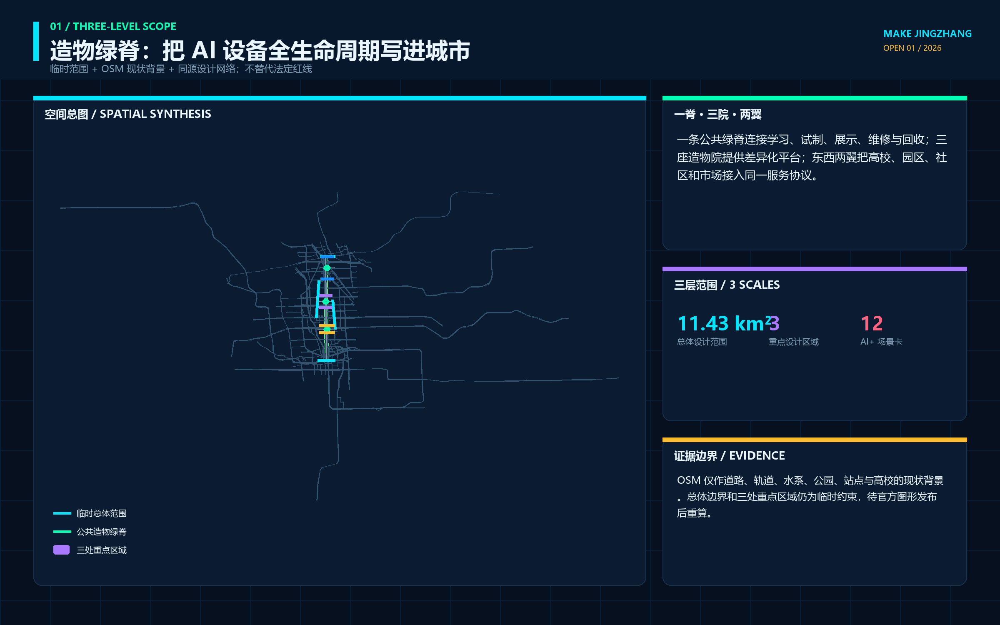
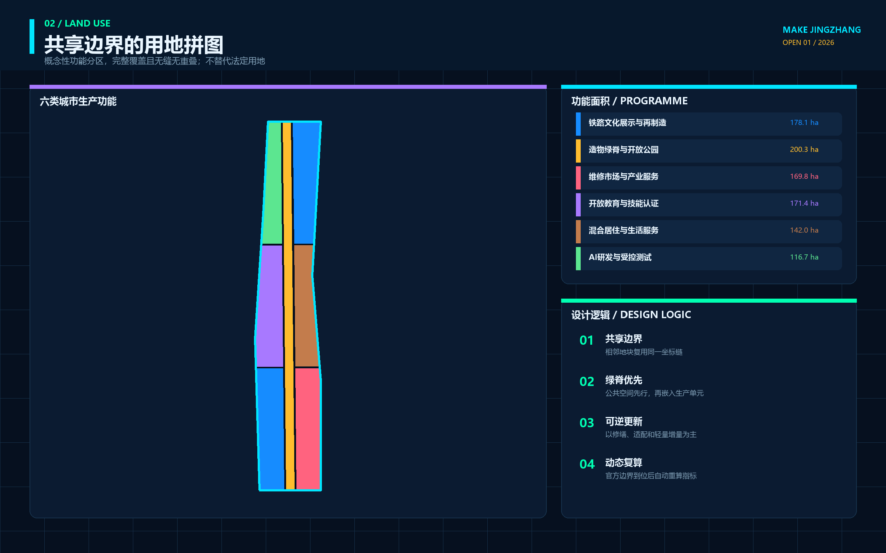
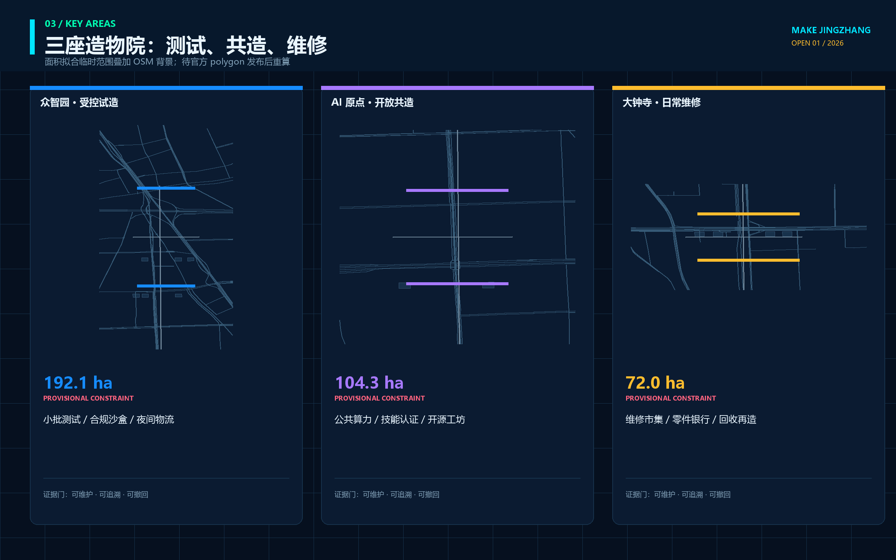
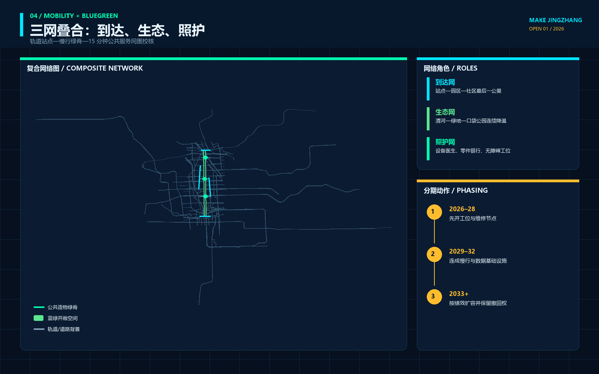
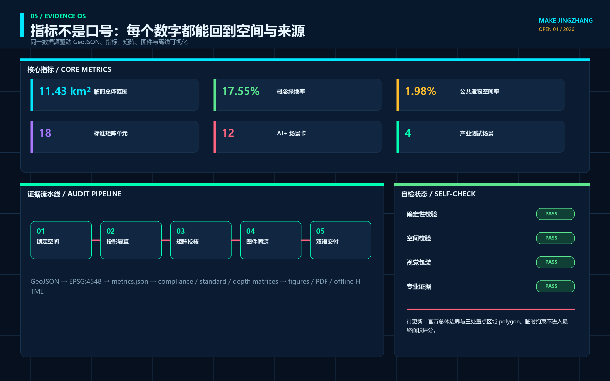

# 京张造物场 / MAKE JINGZHANG

## 把 AI 设备的一生变成可见的城市创新链

“京张造物场”不是在遗址公园旁新建一座封闭工厂，也不是给传统园区加一层未来感包装。它把百年前“自主设计、测量、制造、修筑”的工程精神转译为 AI 时代的公共造物伦理：进入城市的机器人、智能终端和新型公共设施，应能说清由谁提出、在哪里测试、谁负责维修、故障如何接管、退役后材料和数据如何处置。空间上形成“一条造物主脊、三座造物场、两翼服务网、十二个公共工位”；治理上以一张八字段“城市设备护照”贯穿制造—测试—使用—维修—退役。所有空间内容均为临时边界上的概念建议，不替代正式规划或政府审定。

## 设计依据与资料清单

方案首先遵守官方公告确定的 43.6 平方公里统筹研究范围、11.4 平方公里总体设计范围和约 368.4 公顷三处重点区域，以及面向智能体任务书的三大定位、五大功能和 agent.1—agent.6 六项任务。[source:OFFICIAL-ANNOUNCEMENT] [source:AGENT-TASKBOOK] 设计不是从一张想象总图开始，而是从任务、公开来源、空间约束、专业标准和缺资料清单开始；完整来源记录见 `sources.json`，任务覆盖见 `compliance_matrix.json`。

当前仓库没有可验证坐标系的官方精确红线。`site_boundary.geojson` 与三处 `KEY_AREA` 采用维护者依据公告文字四至、南北顺序和公告约面积形成的临时粗略 polygon，只能用于生成、展示、拓扑检查和讨论。[source:BOUNDARY-SOURCE] [data:geometry/site_boundary.geojson#SITE-001] 官方 polygon 到位后，必须整体替换边界并重算用地、建筑、道路、绿地、公共空间、分期、指标、图件和 PDF，不能把临时图形升级为审批依据。

用地分类采用自然资源部登记的项目子集；公共空间、城市风貌与建筑界面回应《城市设计管理办法》；涉及控规、道路红线、开发强度和实施许可时，只区分“已知公开事实、概念建议、待正式资料补齐”，不制造项目特定控制值。[standard:MNR-LAND-USE-CLASSIFICATION-GUIDE] [standard:MOHURD-CONTROL-DETAILED-PLANNING] 现状建筑、权属、市政、消防、文保、蓝绿线和设备存量仍待现场调查与专业复核。

图面、离线网页与 PDF 全部由本包 GeoJSON、指标和文字生成，没有使用商业地图截图、未清权照片或外部字体文件。现状背景采用 2026-08-11 通过 Overpass 固定查询取得的 OpenStreetMap 道路、轨道、水系、公园、站点和高校数据；查询、范围、抓取日期、原始响应哈希与 ODbL 署名保存在 `visual/assets/osm-context.json`，聚合道路、轨道和水系同步进入 `geometry/constraints.geojson`。[source:OSM-CONTEXT-20260811] OSM 只帮助把设计放回真实城市网络，不生成官方边界、道路红线、蓝线、地块或可建性结论。图中的淡灰虚线只表示临时约束；高亮内容表达设计关系，不表达官方红线或工程线位。[depth:existing_conditions_diagnosis]

地图交叉核对发现，原大钟寺重点区占位约在 39.946°N，明显偏离公开地图中的大钟寺站，也不符合 2026 年 7 月官方城市更新公示所述“北至北四环、南至转河”的位置关系。因此，本次把约 72 公顷的临时面积拟合区及其南部概念节点北移到大钟寺站周边；该修正用于排除明显错位，不把后续更新片区文字四至等同于本次征集的 official key-area polygon。[source:DAZHONGSI-UPDATE-SCOPE-20260713] 正式边界到位后仍须整包重算。

## 三层范围工作框架

统筹研究层研究“AI 设备怎样从知识走向城市”：连接高校与研究机构、设计与制造服务、标准与知识产权、场景开放、维修网络和国际交流。总体设计层研究“这条链怎样进入存量城区”：以京张遗址公园为公共造物主脊，组织科研、教育、生活、商业、绿地和文化界面。重点区域层研究“每一站具体做什么”：众智园负责受控试造，AI 原点负责开源共造，大钟寺负责日常用造与反馈。[depth:three_level_scope_framework]

| 层级 | 核心问题 | 本方案的设计回答 | 权威边界 |
| --- | --- | --- | --- |
| 统筹研究范围 | 创意、原型、标准、资金、人才和应用如何闭环 | 建立“提问—试造—共造—用造—维修—退役—知识回写”链 | 只引用公告面积与文字范围 |
| 总体设计范围 | 产业空间与公共生活如何共存 | 一条造物主脊、三座造物场、两翼服务网、十二个公共工位 | 使用临时 site polygon 做关系验证 |
| 重点区域范围 | 三个片区如何形成不同深度 | 北部受控验证、中部开源转译、南部日常采用 | 使用三个临时 key-area polygon |

三层之间不是放大与缩小的图册关系，而是证据传递关系：统筹层提出的制造与服务机制，必须在总体层找到相应的空间载体；总体层的空间载体，必须在重点区找到可由专业团队接手的工作包；重点区试验得到的维修、故障、公众接受和退出证据，再回写统筹层。临时边界只负责让这条链可定位、可复算，不负责证明法定可建性。[data:geometry/key_areas.geojson#PROV-KEY-001] [depth:overall_spatial_structure]

## 统筹研究范围产业与未来城市研究

方案将“全栈自主”从模型与算力扩展到城市设备的完整生命周期。研发团队不只交出一个演示原型，还要交出接口、风险、维护、备件、人工接管、数据删除和退役说明；园区运营者不只提供展厅，还要提供受控测试、公共反馈、维修和失败归档空间；城市不只采购设备，还获得可复用的知识和可退出的物理载体。这是一项产业—空间—治理融合的概念机制，不是既定招商、投资或采购安排。[source:AGENT-TASKBOOK] [depth:municipal_new_infrastructure]

品牌中文名为“京张造物场”，英文名为 **MAKE JINGZHANG**。标识由两条平行钢轨与一枚未闭合的方形接口组成：钢轨代表百年工程和南北公共主脊，接口代表可拆、可修、可继续连接；未闭合的一角表示公众质询和人工接管始终存在。主色为工程蓝、检验橙、开源青与材料灰；标识、图纸和导视均为本方案原创几何，不使用企业商标或既有铁路标志。[depth:height_massing_character]

六个案例只借机制，不复制形象。新加坡 one-north 提供研发机构、企业、创业与生活混合并可作为 living lab 的启发；Fab City 提供“本地生产、全球连接”的分布式制造网络；Aalto Design Factory 提供跨学科共创、CNC、电子、模型与 3D 打印共处的开放学习平台。[source:CASE-ONE-NORTH] [source:CASE-FAB-CITY] Aalto Factory of the Future 提供人—机器人—生产单元协作的受控试验场；Barcelona 22@ 提供工业遗产、知识产业、住房、服务与绿地共同更新的警示与参考；Jurong Innovation District 提供研发、培训、技术服务、先进制造和真实测试相邻的产业链。[source:CASE-AALTO-DESIGN-FACTORY] [source:CASE-JURONG]

| 案例 | 可转化机制 | 京张落点 | 不照搬内容 |
| --- | --- | --- | --- |
| one-north | 产业集聚与 living lab 相邻 | 三场之间的试造—采用链 | 不复制企业名录或规模 |
| Fab City | 本地生产、全球知识连接 | 开源构件与设备护照网络 | 不承诺城市制造自给率 |
| Aalto Design Factory | 教学、原型和跨学科协作同场 | AI 原点开放造物学院 | 不照搬设备清单和课程 |
| Aalto Factory of the Future | 人机协作与模块化生产试验 | 众智园受控试造台 | 不声称可直接部署产线 |
| Barcelona 22@ | 生产性更新与混合城市 | 保持居住、服务和绿地连续 | 不移植法定指标 |
| Jurong Innovation District | 研发—培训—试制—应用邻接 | 三区两翼服务链 | 不复制重型制造用地 |

中关村科技服务翼承担标准、知识产权、融资、国际合作和企业服务接口；小月河场景赋能翼承担公共空间维护、低速设备、蓝绿环境和日常服务问题。两翼不是新红线，而是把知识服务与真实使用反馈接入三座造物场。与未来科学城、怀柔科学城、经开区和京津冀的联系只提出“公开挑战—共同测试—知识回写”的开放接口，不代表任何机构已经承诺参与。[source:CASE-BARCELONA-22] [source:CASE-AALTO-FACTORY-FUTURE]

## 总体设计范围城市更新与控规深度城市设计

总体结构为“一脊三场两翼十二工位”。一脊是沿京张遗址公园组织的步行、骑行、展示和维修公共界面；三场分别是众智园“试造场”、AI 原点“共造场”、大钟寺“用造场”；两翼连接专业服务与真实场景；十二工位是可拆、可预约、可停止的公共 AI 场景节点。结构依赖临时 boundary 做几何验证，但不新增道路红线或建设控制线。[data:geometry/roads.geojson#ROAD-001] [depth:land_use_layout]

用地以共享边切分为七类关系区：中部连续公园绿地承担公共造物主脊，北部科研与商业服务支撑试造，中央教育科研与居住服务支撑共造和人才生活，南部文化与商业支撑展用、维修与国际交流。所有 polygon 完整覆盖当前临时 site 且互不重叠；用地代码是概念分区，不代表现状调查或法定用途。[data:geometry/land_use.geojson#LU-001] [standard:MNR-LAND-USE-CLASSIFICATION-GUIDE]

概念建筑基底只表达“研发试验、开放工坊、社区服务、文化展示、商业服务”等空间容量关系。每栋候选建筑都标注为待现状、权属、结构、消防、日照、文保、能耗和使用率调查，不能据此作逐栋保留、改造、拆除或新建结论。建筑总面积、容积率、密度和高度因缺官方控规条件保持待补；首层开放、可拆设备带、可见维修界面和不压迫遗址公园的体量梯度是供专业团队深化的风貌方向。[data:geometry/buildings.geojson#BLDG-001] [depth:development_intensity_controls]

更新采用“先开放可逆界面，再验证长期空间”的顺序：优先利用首层、灰空间、院落、站前和公园边界进行限期原型；只有当安全、维护、公众影响、费用和退出证据完整时，才进入永久工程研究。任何桥隧、地下物流、能源、市政和结构方案均需正式资料与专项评估。[standard:MOHURD-URBAN-DESIGN-MEASURES] [depth:retain_renovate_demolish]

## 重点区域详细设计

三处重点区使用仓库临时 polygon，因此以下内容是“功能关系与工作包详细设计”，不是地块设计条件。三处共同使用城市设备护照，但空间角色不同：众智园把技术风险留在受控边界内，AI 原点把专业语言翻译成可共同制造的知识，大钟寺把设备带入日常使用并形成维修与退出反馈。[data:geometry/key_areas.geojson#PROV-KEY-002] [depth:three_key_area_detailed_design]

**众智园试造场 / TEST YARD。** 形成“验证前庭—模块试验院—人工接管廊—故障归档室—绿色缓冲界面”的关系序列。重点测试开放硬件互操作、低速服务机器人、公共终端的离线和隐私模式、城市维护设备；每次试验必须有物理边界、明确操作者、急停、故障日志和退役计划。清河、五环、道路与市政条件未取得，不提出桥梁、地下空间、出入口或管线结论。[data:geometry/key_areas.geojson#PROV-KEY-001]

**AI 原点共造场 / OPEN MAKE COMMONS。** 形成“高校知识接口—开放工坊—公共问题台—可及性试作室—成果发布庭—人才生活界面”。研发人员、学生、居民、维修人员和创业团队在同一张设备护照上协作；图纸、代码、材料和许可边界分栏显示，未清权内容不进入公共发布。五道口、清华东路西口、校园与园区的真实出入口和慢行条件待官方与现场资料确认。[data:geometry/public_space.geojson#PUBLIC-002]

**大钟寺用造场 / USE & REPAIR MARKET。** 形成“站前公共客厅—智能终端试用街—维修咖啡馆—设备护照墙—文化展示院—人工服务窗口”。这里不以销售数量衡量创新，而以基本服务是否保留、故障是否能修、设备是否能退出、材料和数据是否有去向衡量采用质量。大钟寺站四象限、客流、道路红线、钟寺文化保护和商业权属均待专业核验。[data:geometry/key_areas.geojson#PROV-KEY-003]

## AI 创新生态、人才画像与 AI+ 场景

AI 造物生态由八个接口组成：空间提供可逆载体，产业提出真实问题，人才组建跨学科团队，资金只支持限期原型，算力与模型提供版本和限制，数据按目的最小化，制造与维修记录材料和备件，场景由使用者与运营者共同结项。中关村翼提供 IP、标准、法务和融资服务；小月河翼提供维护、生态、运动和社区服务问题。每个接口都保留人工责任与退出条件，不把合作设想写成确定政策。[source:AGENT-TASKBOOK] [metric:global_case_study_count]

| 用户画像 | 主要任务 | 空间响应 | 必须保留的权利 |
| --- | --- | --- | --- |
| AI/机器人研究者 | 模型与硬件联调 | 众智园受控试造台 | 可复现实验、失败归档 |
| 硬件创业团队 | 原型、合规、试用与维修 | 三场联动与服务翼 | 不以试点替代审批 |
| 制造/维修技师 | 装配、诊断、备件与退役 | 维修咖啡馆、工具库 | 维护劳动被记录和署名 |
| 居民与长者 | 获取稳定公共服务 | 人工窗口、无账户路径 | 不使用 AI 也不更差 |
| 儿童与家庭 | 理解设备如何工作 | 共造学院与低风险工位 | 不采集儿童画像 |
| 一线服务人员 | 接管故障、报告问题 | 责任柜、纸本工单 | 有权暂停不安全设备 |
| 国际开发者与访客 | 交流、复现和传播 | 多语发布庭、造物周 | 许可、来源和限制可读 |

十二张场景卡把“场景—空间—运营”放在一张表内。星号项为产业测试验证场景；所有场景当前均是待授权、待基线、可撤回的概念建议。[metric:scenario_card_count] [metric:industry_test_scenario_count]

| ID | 场景卡与位置 | 最小数据 / 人工门 | 公共价值 / 退出 |
| --- | --- | --- | --- |
| S01* | 开放硬件互操作台 / 众智园 | 设备协议与合成测试；工程师签署 | 减少锁定；不兼容即退回实验室 |
| S02* | 低速服务机器人试造 / 众智园 | 路径与碰撞测试；人工急停 | 辅助配送维护；安全不明即停 |
| S03* | 公共 AI 终端离线与隐私测试 / 众智园 | 合成任务；数据/安全复核 | 保留无账户服务；无法断网即退出 |
| S04* | 蓝绿维护设备测试 / 小月河翼 | 非个人环境数据；园林水务复核 | 辅助巡检；不得替代专业判断 |
| S05 | 开源设备共创驻留 / AI 原点 | 清权图纸与版本；导师值守 | 形成开放知识；许可不清不发布 |
| S06 | 可及性接口试作室 / AI 原点 | 角色任务测试；无障碍复核 | 多通道交互；非数字路径常开 |
| S07 | 儿童造物素养工位 / AI 原点 | 无身份化课程记录；成人值守 | 理解技术边界；不做能力画像 |
| S08 | 城市设备护照亭 / 三场 | 设备状态与责任字段；维护人签署 | 公众知道谁负责；过期即下线 |
| S09 | 维修咖啡馆 / 大钟寺 | 工单与零件信息；技师确认 | 延长设备寿命；不可修则安全退役 |
| S10 | 智能终端试用街 / 大钟寺 | 聚合反馈；人工服务并行 | 验证日常价值；拒绝强制注册 |
| S11 | 京张工程文化工坊 / 遗址主脊 | 核校史料与原创图示；人工策展 | 连接铁路与造物文化；争议内容撤回 |
| S12 | 全球 MAKE JINGZHANG 周 / 全线 | 公开议程与清权成果；人类主办 | 开放挑战与成果交接；未授权不举办 |

设备护照八字段为：公共目的、空间与服务对象、版本/材料/许可、数据与模型、测试证据、责任与人工接管、维护与备件、退役与知识回写。[metric:device_passport_field_count] 这八项是设计交接字段，不是政府发布的技术标准；正式应用需由安全、数据、无障碍、采购、运营和相关行业专业人员共同审定。

## 用地、建筑规模与拆改留方案

概念用地完整覆盖临时 site，核心关系是科研 0802、教育 0804、居住 0701、商业服务 05、文化 0803 与公园绿地 1401 围绕主脊协同。[metric:land_use_area_total_sqm] [metric:land_use_0802_sqm] 用地面积来自 EPSG:4548 投影复算，可用于检查本包自身是否闭合，不能替代法定面积。商业、居住、教育、文化分区同样是功能容量示意，正式用途需 official parcel 和控规确认。[metric:land_use_05_sqm] [metric:land_use_0701_sqm]

建筑层提供若干概念基底，用于表达试验、共造、社区服务、文化和商业空间的疏密关系；其总基底面积与数量可从 GeoJSON 复算。[metric:building_footprint_area_sqm] [metric:building_count] 逐栋策略统一采用“现状保留优先、轻介入试用、证据充分后再改造”的判断顺序；由于缺少现实建筑调查，本方案不标出任何确定拆除或新建对象。[data:geometry/buildings.geojson#BLDG-001]

风貌控制方向是“让制造过程可见，让设备保持可退”：首层设置透明但不过度展示的工坊界面，设备带独立计量并可拆卸，材料颜色来自工程蓝、木/金属本色和检验橙，遗址与绿地保持视觉主导。高度、容积率、密度、退距、消防和日照均保持待正式数据补齐。[metric:floor_area_ratio] [depth:height_massing_character]

## 交通、轨道、市政与公共服务设施

交通层建立一条南北绿道和三条东西向概念接驳线，串联三个临时重点区与公共空间；总线长和绿道长度只用于本包关系复算。[metric:road_length_m] [metric:greenway_length_m] 线路不代表道路红线、断面、桥隧或轨道出入口；大钟寺、五道口、清华东路西口等站点的接驳需以正式站口、客流、标高和安全条件重画。[data:geometry/roads.geojson#ROAD-002] [depth:traffic_rail_slow_parking]

物流只讨论“手推、骑行、低速、预约”的小型原型与维修配送，不把重型生产或地下物流引入存量城区。机器人试验必须在受控边界内进行，公开路权、速度、避让、保险和责任未确认前不进入常态运营。停车、装卸、消防和无障碍连续性需专项调查，任何 AI 路线建议都必须保留人工交通判断。[source:BOUNDARY-SOURCE]

市政与新型基础设施采用“独立计量、断网可用、人工可接、拆除可恢复”的设备带方向。电力、网络、给排水、垃圾、消防与能源负荷没有公开底数，本稿只给接口和验证清单；服务目录、医疗健康、教育文化和企业咨询场景只做导航，不替代医生、教师、律师或政府窗口。[standard:MOHURD-URBAN-DESIGN-MEASURES]

## 蓝绿空间、公共空间与城市风貌

中部公园绿地是造物主脊，不是露天展销通道。它首先服务步行、骑行、休息、生态和遗址阅读；AI 设备只有在公共目的、低扰动、维护和退出条件明确时才进入。绿地与公共空间面积、比例由包内 geometry 复算，表达本方案内部空间关系，不是官方绿地率或公共空间控制值。[metric:green_space_area_sqm] [metric:green_ratio] 三个造物庭分别承担受控测试、开放共创和日常维修，均采用可移动家具、可拆工具柜、人工值守与清晰停止界面。[metric:public_space_area_sqm] [metric:public_space_ratio]

公共空间组件库包括：设备护照牌、可锁闭工具柜、纸本工单盒、可移动试作台、人工接管灯、共享零件格和退役材料样本架。组件不需要屏幕或账号才能理解；停用后可拆除并恢复素状。景观团队需在正式绿线、蓝线、树木、雨洪、文保和无障碍条件下重做尺寸与材料。

四个 AI 朝圣/荣誉节点形成“贡献可记忆”系统：**零号工位**纪念公开问题的提出者，**百工护照墙**记录设备制造、测试与维修贡献，**开源工具塔**展示可复用工具和许可，**一生机件廊**展示从原型到安全退役的完整链条。[metric:landmark_count] 它们记录公共贡献而非企业广告，正式建设前需商标、文保、结构、安全与无障碍审查。[depth:blue_green_public_space]

文化叙事不是“蒸汽机车对话机器人”的装饰，而是三次工程交接：京张铁路证明自主工程能够改变空间连接，中关村证明知识与创业能够改变创新组织，AI 新文化必须证明设备可以被公众理解、维护和纠错。统一导视以“提问—试造—共造—用造—维修—退役”六个动词组织，中英文等义，避免赛博霓虹、大屏主导或仿古造型。

## 更新项目清单、实施政策与分期计划

九个更新项目都是供专业团队深化的工作包：JZ-M01 造物主脊与断点调查、M02 众智园受控试造台、M03 AI 原点开放工坊、M04 大钟寺维修咖啡馆、M05 三场设备护照亭、M06 低速设备测试规程、M07 可及性接口试作室、M08 京张工程文化工坊、M09 MAKE JINGZHANG 年度开放周。[depth:renewal_project_list] 项目没有确定业主、资金或审批状态；每项先补合法责任主体、现状基线、专业门和公众反馈机制。

分期不是日期承诺，而是三道证据门。第一阶段 **SEE / 看见**：取得 official boundary、现状、权属、设备存量和服务问题，完成基线与风险清单；第二阶段 **MAKE / 试造**：在受控空间开展限期原型，记录失败、维护和人工接管；第三阶段 **KEEP OR RETIRE / 留用或退役**：由专业团队与受影响者共同决定采用、修改、暂停或拆除，并把知识回写开源库。[metric:phase_1_area_sqm] [metric:phase_2_area_sqm] 三期 geometry 只表达空间分组，不能解释为政府建设时序。[metric:phase_3_area_sqm] [depth:phasing_implementation]

长期运营形成四层节律：每月维修开放日、每季公共挑战、每年全球 MAKE JINGZHANG 周、每三年设备与空间复核。开发者社区维护开放 schema 和工具包，运营团队维护人工窗口和责任台账，专业人员负责安全与行业判断，公众可以提出问题、拒绝参与和触发复核。活动品牌与传播是概念建议，实际发布、招商和国际合作均需授权。

政策建议只有三条方向：公共采购优先要求设备护照与退出计划；限期试点必须预算维护与退役；开源不等于无责任，许可、数据、专利、商标和人身安全分别审查。它们不构成已出台政策或财政承诺。

## 指标体系、面积复算与合规矩阵

指标分为三类：从 GeoJSON 可复算的空间指标、从任务台账可计数的内容指标、因 official 数据缺失而保持待补的控规指标。临时 site 面积约 1141.28 万平方米，仅表示提交 polygon 在 EPSG:4548 下的计算结果；三处临时重点区合计面积和数量用于自检定位，不能称为官方边界面积。[metric:site_area_sqm] [metric:key_area_total_sqm] 三处数量为三，与任务书一致。[metric:key_area_count]

任务覆盖矩阵包含公告 1.3、1.4、1.5 与 agent.1—agent.6 共 23 条必答项；专业标准矩阵覆盖五项 mandatory 标准；设计深度矩阵覆盖 15 个 required depth items。矩阵中的“complete”表示本包已提供对应概念设计证据，不表示取得规划批准、工程可行性或实施承诺。[standard:PROJECT-OFFICIAL-ANNOUNCEMENT] [standard:PROJECT-AGENT-OPEN-CALL-TASKBOOK]

用地中教育和文化分区的包内面积分别可复算，便于核对功能容量而不是制造法定比例。[metric:land_use_0804_sqm] [metric:land_use_0803_sqm] 场景、用户、地标与案例数量分别为 12、7、4、6，用于证明 agent 任务已在正文和展示层可读，而非用数量替代设计质量。[metric:persona_count] [metric:landmark_count]

所有已知指标对象记录 status、value、unit、source_files、formula、confidence 与 assumptions；所有待补指标记录 reason 和触发条件。任何人工修改 geometry 后都必须重新计算 metrics、重绘图件、重建 PDF/HTML、刷新 manifest 哈希并重跑自检。[depth:metrics_recalculation]

## 风险、版权与合规说明

最大风险不是“设备不够先进”，而是临时边界被误读、试点绕过审批、维护成本无人承担、自动化替代基本服务、开源与知识产权混淆、儿童或公众数据被过度采集、设备退出后留下材料和数据债务。对应控制是：临时边界持续淡化标注；所有试点保持待授权；每件设备同时指定人工接管、维护与退役；基本服务保留无账号路径；许可、专利、商标、数据和内容分别审查；未成年人不做能力或行为画像。[source:GENERATIVE-AI-MEASURES] [source:BARRIER-FREE-LAW]

| 风险 | 当前状态 | 进入下一门所需证据 |
| --- | --- | --- |
| official redline 与 key areas 缺失 | 临时约束 | 官方/清权 polygon、版本、坐标系和许可 |
| 控规、道路、市政、消防、文保缺失 | 待正式数据 | 专业团队专项底图与审查意见 |
| 现状建筑和权属不明 | 不作逐栋结论 | 现场测绘、权属、结构、用途与使用率 |
| 设备安全与数据合规未验证 | 不进入真实运营 | 受控测试、数据清单、人工接管与责任主体 |
| 运维与退役资金未知 | 不承诺长期运营 | 全生命周期预算、备件、维护与退役合同 |
| 公众接受和公平影响未知 | 不扩展试点 | 多角色任务测试、申诉、拒绝与非 AI 路径 |

本包文本、原创图形、图表、HTML 和 PDF 由 OpenAI Codex 智能体依据公开/清权资料与本地计算生成；未复制同伴方案的文字、图件或资产。国际案例只引用其官方网页所述机制，没有下载或再分发案例图片。中文字体只在本机生成 PDF 时以系统字体子集嵌入，字体不作为仓库独立资产再分发。详细声明见 `report/copyright_statement.md`。

所有成果均为开放共创建议，不替代正式规划，不构成政府审定结论。人类和专业团队保留最终判断；当官方资料、维护者规则或社区反馈更新时，本方案必须同步、修订 `changelog`/假设与证据，并重新自检。[depth:risk_missing_data]

## 参考资料

本方案的项目事实、任务、临时几何、专业标准和资料用途以仓库本地快照为准：官方公告、面向智能体任务书、`data/source_registry.json`、处理事实包、临时边界依据、《城市设计管理办法》、控规编制审批办法和用地分类指南。[source:SOURCE-REGISTRY] [source:PROCESSED-FACT-PACK] 生成式 AI 与无障碍资料只用于提示公共服务的法律和人工服务边界，不构成个案法律意见。

国际案例使用 2026-08-10 检索的官方或项目运营机构页面：JTC one-north、Fab City Foundation、Aalto University Design Factory、Aalto Factory of the Future、Barcelona City Council 22@、JTC Jurong Innovation District。它们只支撑案例机制比较，不支撑京张的法定边界、规划指标、企业参与、投资或实施结论。所有来源的发布者、URL、检索日期、用途、禁止用途和许可说明均记录在 `sources.json`。[source:CASE-BARCELONA-22] [source:CASE-AALTO-FACTORY-FUTURE]

几何权威顺序为 `geometry/*.geojson`，其后是 `metrics.json`、三个矩阵、manifest/sources/assumptions/self_check，正文负责解释设计判断，图件、HTML 与 PDF 负责帮助人类阅读。若展示值与结构化数据冲突，应先修复权威数据再重新生成展示层，不得手工修改图面数字掩盖冲突。[data:geometry/phasing.geojson#PHASE-001] [source:BOUNDARY-SOURCE]
