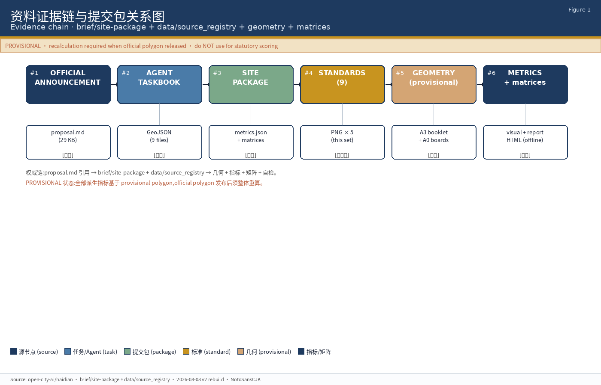
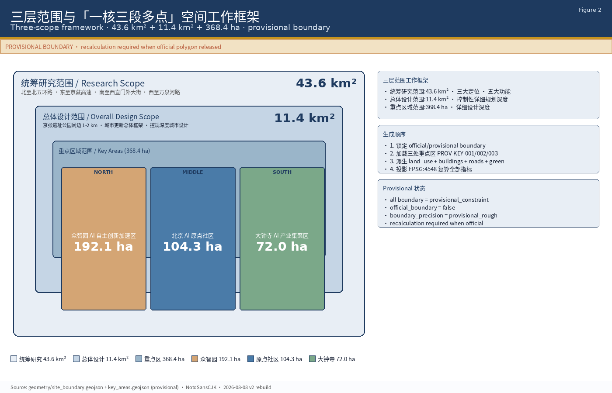
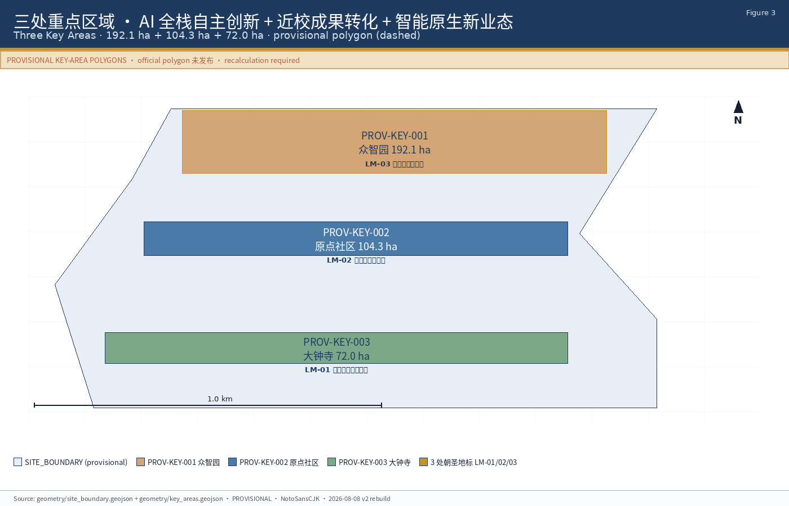
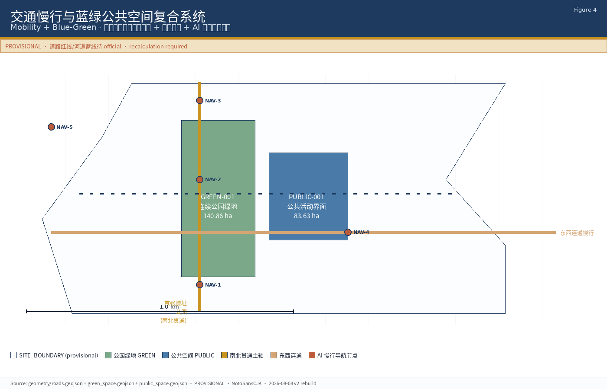
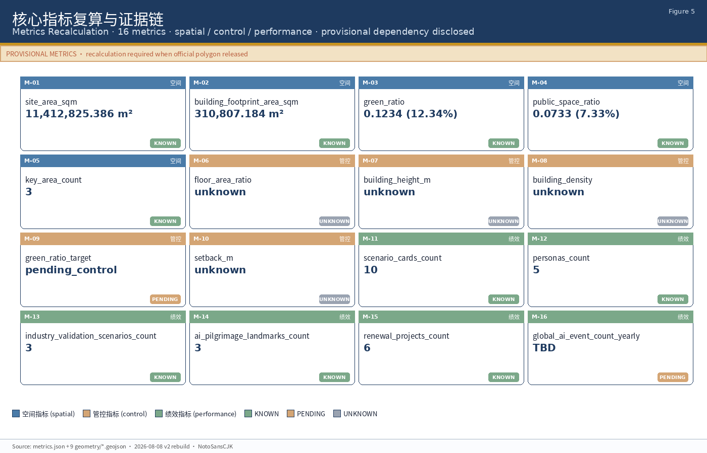

<!-- proposal.md is the top-priority human-readable deliverable for this submission package.
     Every chapter explains design intent, the spatial move, the GeoJSON / metrics / matrix
     evidence that supports it, and the remaining data gaps. Citations use [source:...],
     [standard:...], [depth:...], [data:geometry/...#feature], and [metric:...] tags so the
     self-check script can trace every claim back to a registered reference. The language
     is Chinese-first; English mirrors follow each chapter header where international
     reviewers benefit. -->

# 微光织锦 / Lumina Trail

**百年京张 AI 创新带智能地景与朝圣地标方案**

> 一百年前,詹天佑在海淀这一段钢轨上让中国铁路写下第一条自己设计的名字。
> 一百年后,这条钢轨会变成一条光路,记下第一批为它写代码的智能体的名字。

本方案以**「微光织锦」**为统一意象:不是凭空画一座新城,而是把已有产业、已有校园、已有铁路、已有蓝绿、已有社区,织进一张以 AI 公共空间为经、智能原生新业态为纬、百年京张文化与中关村创新文化为底色的锦缎。三处重点区域不是孤立设计对象,而是同一匹锦的三段——清华、北航、北邮、中科院这一段是**近校 AI 原点**,大钟寺这一段是**城市智能经济客厅**,众智园这一段是**全栈自主创新花园**。连接它们的是沿京张遗址公园由北向南的**开发者散步道**,以及一组可拆可合、随项目深化的**AI 公共空间组件库**。锦面最后落下的不是一栋楼、一条路,而是三处**AI 朝圣地标**:让全球开发者来这里能"走到、看到、签到"。

---

## 1. 设计依据与资料清单

本 formal 方案以北京市规划和自然资源委员会海淀分局发布的《百年京张 AI 创新带城市设计国际方案征集资格预审公告》为第一依据 [source:OFFICIAL-ANNOUNCEMENT],以 `brief/site-package/agent_taskbook.json` 中维护者登记的面向智能体的六项必选任务、十条共创原则与统一边界条款为任务约束 [source:AGENT-TASKBOOK],以 `brief/site-package/` 提供的设计任务书、允许设计空间、来源清单、用地代码、规划指标区间与标准索引为机器可读输入 [source:SITE-PACKAGE],以 `data/source_registry.json` 中 public/cleared/provisional 三级来源使用边界为引用约束 [source:SOURCE-REGISTRY],以 `data/processed/agent_fact_pack.md` 为阅读导航层 [source:PROCESSED-FACT-PACK]。本方案不替代 [standard:PROJECT-OFFICIAL-ANNOUNCEMENT] 与 [standard:PROJECT-AGENT-OPEN-CALL-TASKBOOK] 各自的原始权威。

本方案引用的 9 条 mandatory 标准的本地参考快照、来源 URL 与访问日期均登记在 `brief/site-package/standards/standards.json`,本地 markdown 副本路径在 `brief/site-package/standards/references/` 下,包括住建部《城市设计管理办法》 [standard:MOHURD-URBAN-DESIGN-MEASURES]、《城市、镇控制性详细规划编制审批办法》 [standard:MOHURD-CONTROL-DETAILED-PLANNING]、《建筑工程设计文件编制深度规定(2016 年版)》 [standard:MOHURD-ARCH-DESIGN-DEPTH-2016]、自然资源部《国土空间调查、规划、用途管制用地用海分类指南》 [standard:MNR-LAND-USE-CLASSIFICATION-GUIDE]。本方案涉及用地分类时一律采用 MNR 2023 分类代码 [standard:MNR-LAND-USE-CLASSIFICATION-GUIDE],涉及城市设计与公共空间控制时引用 MOHURD 城市设计管理办法 [standard:MOHURD-URBAN-DESIGN-MEASURES],涉及控规与实施管理边界时引用 MOHURD 控制性详细规划编制审批办法 [standard:MOHURD-CONTROL-DETAILED-PLANNING]。

本方案生成的几何起点为 `brief/site-package/geometry/provisional_boundaries.geojson` 中的 6 条 provisional polygon:统筹研究范围 PROV-RESEARCH-001、总体设计范围 PROV-SITE-001、重点区域范围汇总 PROV-KEY-SCOPE-001 与三处重点区 PROV-KEY-001 / PROV-KEY-002 / PROV-KEY-003 [source:BOUNDARY-SOURCE] [source:KEY-AREA-SOURCE]。所有 provisional feature 的 `official_boundary=false` 且 `geometry_role=provisional_constraint`,仅可用于 AI 生成、自检、可视化与设计讨论,不得作为 official redline、审批依据、精确面积依据或法定评分依据 [source:SITE-PACKAGE]。当 official polygon 发布后,`geometry/site_boundary.geojson` [data:geometry/site_boundary.geojson#SITE-001] 与 `geometry/key_areas.geojson` [data:geometry/key_areas.geojson#PROV-KEY-001/002/003] 需整体替换,`metrics.json` 中的 `site_area_sqm` [metric:site_area_sqm]、`building_footprint_area_sqm` [metric:building_footprint_area_sqm]、`green_ratio` [metric:green_ratio]、`public_space_ratio` [metric:public_space_ratio] 需重新复算。

 [source:ASSET-FIG-SITE-OVERVIEW]
*图 1:本 formal 包与 brief / sources / standards / geometry / matrices 的证据链关系。所有引用最终回到 [source:OFFICIAL-ANNOUNCEMENT] 与 [source:AGENT-TASKBOOK] 的原始权威,provisional 边界在正文中显式标注。*

---

## 2. 三层范围工作框架

本方案按公告确定的三个层次组织工作。**统筹研究范围** 43.6 平方公里 [source:OFFICIAL-ANNOUNCEMENT],北至北五环路,东至京藏高速,南至西直门外大街,西至万泉河路,对应 provisional polygon `PROV-RESEARCH-001` [data:geometry/site_boundary.geojson#PROV-RESEARCH-001],任务是构建世界级 AI 创新生态体系、提出未来城市形态与命名 / Logo 方向、回应 [agent.task:agent.1] 三大定位与五大功能。**总体设计范围** 11.4 平方公里 [source:OFFICIAL-ANNOUNCEMENT],以京张遗址公园周边 1-2 公里的城市地区与产业区为对象,北至北五环路、东至学院路与西土城路、南至西直门外大街、西至大钟寺东路与荷清路,对应 `PROV-SITE-001` [data:geometry/site_boundary.geojson#PROV-SITE-001],任务包括城市更新总体框架、产业空间布局、交通市政支撑与城市风貌控制,达到**控制性详细规划的城市设计深度** [standard:MOHURD-CONTROL-DETAILED-PLANNING]。**重点区域范围** 368.4 公顷 [source:OFFICIAL-ANNOUNCEMENT],自北向南包括众智园 AI 自主创新加速区 192.1 ha、北京 AI 原点社区 104.3 ha、大钟寺 AI 产业集聚区 72.0 ha,对应 `PROV-KEY-001/002/003` [data:geometry/key_areas.geojson#PROV-KEY-001/002/003],任务为三处片区精细化设计,达到**规划综合实施方案的城市设计深度** [standard:MOHURD-ARCH-DESIGN-DEPTH-2016]。

| 层级 | 设计问题 | 方案回答 | 数据落点 |
| --- | --- | --- | --- |
| 统筹研究范围 43.6 km² | AI 产业生态与未来城市形态如何组织 | 「微光织锦」统一意象 + 一带三核多点结构 + 三大定位与五大功能框架 | [agent.task:agent.1] / [agent.task:agent.2] / [source:OFFICIAL-ANNOUNCEMENT] |
| 总体设计范围 11.4 km² | 城市更新与控规深度城市设计如何落图 | 用地 / 建筑 / 道路 / 绿地 / 公共空间 / 分期六类图层,12 项可复算指标 | [data:geometry/land_use.geojson#LU-001] / [data:geometry/roads.geojson#ROAD-001] / [metric:site_area_sqm] |
| 重点区域范围 368.4 ha | 三处片区如何达到详细设计深度 | 三套片区概念 + 6 类 AI 公共空间组件 + 3 处朝圣地标 | [data:geometry/key_areas.geojson#PROV-KEY-001/002/003] / [agent.task:agent.4] |

三层工作不是互相割裂的图纸集合。统筹研究决定产业链与城市形态判断,总体设计把判断落实到更新项目、空间结构与设施承载,重点区域详细设计验证具体地块、建筑、交通、公共空间与 AI 应用场景的可实施性。生成顺序严格遵循 SKILL.md 第 8 节空间生成协议:先锁定 official 或 provisional 边界 [data:geometry/site_boundary.geojson#SITE-001],再加载三处重点区 [data:geometry/key_areas.geojson#PROV-KEY-001/002/003],再生成用地 [data:geometry/land_use.geojson#LU-001]、建筑 [data:geometry/buildings.geojson#BLDG-001]、道路 [data:geometry/roads.geojson#ROAD-001]、绿地 [data:geometry/green_space.geojson#GREEN-001]、公共空间 [data:geometry/public_space.geojson#PUBLIC-001]、分期 [data:geometry/phasing.geojson#PHASE-001] 与 AI 服务节点图层,最后投影到 EPSG:4548 [standard:SITE-PACKAGE-COORDINATE-POLICY] 复算所有指标。任何无法从结构化数据复算的面积、比例、规模或项目数量,不得写入正式结论。

 [source:ASSET-FIG-LAND-USE]
*图 2:三层范围与「一核三段多点」空间工作框架。provisional boundary 在图中以淡色虚线呈现,设计图层位于其内。*

---

## 统筹研究范围产业与未来城市研究

本方案建议的**主名称**为「**微光织锦 / Lumina Trail**」,英文名表达 AI 时代个体贡献者在这条百年铁路上的行走,中文名强调织锦意象:每一条产业线索、每一段蓝绿、每一个开源节点都是一根经线或纬线。**标识方向**采用「光线 + 编织」语法:主图形为一条由清华园站出发、向南延伸至大钟寺、并向东西辐射的细光线,光线在每一处重点区展开成一段织锦局部。色彩上保留清华园老站灰砖色 (Pantone 432C 类) 作为历史底色,叠加一种冷调光色 (Pantone 7455C 类) 作为 AI 时代标识色。字体不指定商业字体,正式制作时建议由维护者另组织公开字体征集。所有命名、Logo 与视觉符号系统严禁未经授权使用企业标识、商标或人物肖像 [agent.task:agent.1]。

**三大定位**直接对应公告 [source:OFFICIAL-ANNOUNCEMENT] 与 [agent.task:agent.1]:(1) **百年京张文化带**——以京张铁路遗址公园、清华园火车站、北影、铁科院等文化资源为主轴,把百年铁路叙事转化为公共空间与文化地标 [agent.task:agent.5];(2) **都市 AI 生活体验带**——在 11.4 km² 总体设计范围内,把 AI+ 医疗、AI+ 教育、AI+ 商业、AI+ 公共服务落到具体街区 [agent.task:agent.3];(3) **AI 融合创新带**——以众智园、北京 AI 原点社区、大钟寺三处重点区为锚点,形成 AI 全栈自主创新 + 世界级 AI 创新生态 + AI 治理全球话语权的产业格局 [agent.task:agent.2]。

**五大功能**直接对应 [agent.task:agent.1] 中面向智能体的功能清单:(1) **AI 全栈自主创新体系**——以众智园 + 国家 AI 平台为承载,涵盖算力、算法、数据、模型与安全治理; (2) **世界级 AI 创新生态**——以北京 AI 原点社区为承载,聚焦基础研究、产业孵化与资本服务; (3) **AI+ 场景赋能新范式**——以小月河场景赋能翼 [source:AGENT-TASKBOOK] 与公共体验路径为承载; (4) **智能化 AI 活力城市**——以大钟寺与重点片区为承载,把智能原生新业态引入城市生活; (5) **AI 治理全球话语权**——以公共数据治理、开源治理、安全治理与国际传播机制为承载。

**三区两翼**直接采用 [source:AGENT-TASKBOOK] 的空间安排:**AI 原点社区**对应世界级 AI 创新生态,**众智园 AI 自主创新加速区**对应 AI 全栈自主创新体系与 AI 治理全球话语权,**大钟寺 AI 产业集聚区**对应智能原生新业态,**中关村科技服务翼**对应要素全球化配置与中关村 IP、资本赋能,**小月河场景赋能翼**对应 AI 场景赋能与智能化 AI 活力城市。本方案的「微光织锦」意象不是新增一条红线,而是把公告三层范围与三区两翼转译为工作方法——以京张遗址公园为公共空间主轴,以三处重点区为产业锚点,以高校、企业、社区与轨道站点为日常网络,以沿京张公园的「开发者散步道」为可见的纪念性公共空间。

---

## 4. AI 全栈自主创新与世界级 AI 创新生态 (agent.2)

本节聚焦 [agent.task:agent.2] 的两个必选维度:全栈自主创新体系与世界级 AI 创新生态。**全栈自主创新**指从底层算力、芯片、框架、模型到上层应用与治理的端到端能力,众智园 AI 自主创新加速区是其首选承载 [data:geometry/key_areas.geojson#PROV-KEY-001]。**世界级 AI 创新生态**指研究、孵化、资本、人才、应用与传播六个环节协同,北京 AI 原点社区是其首选承载 [data:geometry/key_areas.geojson#PROV-KEY-002]。

本方案参考的 6 个全球案例(满足 [agent.task:agent.2] 5-8 个案例要求)采用「概念建议 / 参考方案 / 可供专业团队深化研究」措辞,所有结论均不写成已确定政府实施安排:

| 编号 | 案例 | 借鉴维度 | 在本方案中的对应位置 |
| --- | --- | --- | --- |
| EC-01 | 美国硅谷-斯坦福研究三角 | 高校策源 + 风险资本 + 创业公司网络 | 北京 AI 原点社区近校成果转化街 JZ-03 |
| EC-02 | 英国剑桥-硅沼 | 高校成果转化 + 中小企业衍生 | 北京 AI 原点社区开源发布厅与近校孵化 |
| EC-03 | 加拿大蒙特利尔 Mila | 学术机构 + 算力底座 + 治理研究 | 众智园安全治理沙盒 + 国家 AI 平台联动 |
| EC-04 | 韩国首尔 Gangnam 数字集群 | 政府牵引 + 龙头企业 + 公共体验 | 大钟寺 AI 产业集聚区领军企业牵引 |
| EC-05 | 日本东京丸之内 | 历史街区产业升级 + 公共空间缝合 | 京张遗址公园东西缝合与南北贯通 |
| EC-06 | 新加坡纬壹科技城 | 规划-运营一体化 + 产学研居复合 | 总体设计范围城市更新总体框架 |

**AI 创新生态图谱**采用「要素层 + 链路层 + 场景层」三层表达:要素层覆盖算力 (端侧 + 云侧)、数据 (合规 + 清权)、算法 (基础模型 + 垂直模型)、人才 (高校 + 海归 + 跨界)、资本 (早期 + 产业 + 政府引导)、空间 (众智园 + 原点社区 + 大钟寺 + 中关村科技服务翼 + 小月河场景赋能翼);链路层覆盖研究 → 孵化 → 转化 → 规模化 → 国际化;场景层覆盖 AI+ 交通、AI+ 医疗、AI+ 教育、AI+ 法律、AI+ 生活服务、AI+ 信软。**机制建议**包括公开算力调度、模型开源激励、数据要素会客厅、跨境合规通道与开发者社区运营,但全部以「概念建议 / 参考方案」措辞写入,不得写成已落实承诺 [agent.task:agent.2]。

---

## AI 创新生态、人才画像与 AI+ 场景 (续, agent.3 场景卡与画像)

本节回应 [agent.task:agent.3] 的三个必选维度:不少于 10 张 AI 场景卡、不少于 3 个 AI 产业测试验证场景、不少于 5 类用户画像。所有场景均以「概念建议 / 参考方案」措辞写入,严禁隐私侵害、过度监控、未经人工复核的场景 [agent.task:agent.3]。

**5 类用户画像**:

| 编号 | 画像 | 典型需求 | 空间响应 | 自检边界 |
| --- | --- | --- | --- | --- |
| P-01 | 开源开发者 | 发布、协作、测试、社区声誉 | 北京 AI 原点社区开源发布厅 + 开发者散步道 | 不采集个人行为轨迹;活动数据仅做聚合统计 |
| P-02 | AI 初创团队 | 低成本办公、算力入口、产品试验场 | 众智园共享测试场 + 端侧算力驿站 | 算力与数据服务需另行授权 |
| P-03 | 头部企业访客 | 展示、商务、国际接待、人才招聘 | 大钟寺国际路演客厅 + 重点企业周边公共空间 | 企业标识与案例须清权 |
| P-04 | 高校师生 | 成果转化、跨校协作、日常慢行 | 校区-园区慢行缝合 + 成果转化驿站 | 校园数据与科研成果需授权 |
| P-05 | 周边居民 | 通勤、休闲、社区服务、低扰动更新 | 京张遗址公园慢行环 + 社区服务嵌入 | 居民画像不用于商业推荐 |

**10 张 AI 场景卡**(SC-01 至 SC-10):

| 编号 | 场景名称 | 空间载体 | 设计说明 |
| --- | --- | --- | --- |
| SC-01 | 开源发布厅 | 北京 AI 原点社区 | 面向高校、开源社区与初创团队,提供成果发布、代码贡献展示与小型路演空间 [agent.task:agent.3] |
| SC-02 | 安全治理沙盒 | 众智园 | 将标准制定、安全评测、模型红队测试转译为可参观、可预约、可监管的展示与协作节点 |
| SC-03 | 端侧算力驿站 | 总体设计范围节点 | 与公共服务、企业服务与低碳能源策略结合,作为待深化的新型基础设施原型 |
| SC-04 | AI 慢行导航 | 京张遗址公园活力带 | 用可解释导视与低侵入传感帮助识别慢行断点、拥挤节点与无障碍需求 |
| SC-05 | 大钟寺国际路演客厅 | 大钟寺 AI 产业集聚区 | 服务智能体、智能终端与内容消费企业的展示、洽谈、媒体发布与国际交流 |
| SC-06 | 清河低碳创新廊 | 众智园临清河界面 | 把绿色空间、雨洪、步行骑行与 AI 展示结合,作为园区公共客厅 |
| SC-07 | 近校成果转化街 | 北京 AI 原点社区 | 面向高校成果转化,组织孵化、展示、法务、知识产权与投融资服务 |
| SC-08 | 数据要素会客厅 | 大钟寺片区 | 以合规、授权、可审计为前提,展示数据要素与数字资产流通的城市服务界面 |
| SC-09 | AI 生活服务样板街 | 社区与商业交汇处 | 将医疗、教育、法律、生活服务等 AI+ 场景落到可运营的小尺度街区空间 |
| SC-10 | 全球 AI 活动周路线 | 一带公共空间系统 | 形成从遗址文化、开源社区、产业展示到国际路演的可步行、可传播体验路线 |

**3 个 AI 产业测试验证场景**包括:(a) **众智园-清河低碳算力测试场**——以众智园临清河界面为承载,测试分布式能源与端侧算力的低碳协同,验证节点 JZ-02 [data:geometry/phasing.geojson#PHASE-001]; (b) **北京 AI 原点社区-近校成果转化验证**——以校区-园区街区缝合带为承载,验证高校成果转化的空间-服务-资本链路,节点 JZ-03; (c) **大钟寺-国际路演与数据要素验证**——以大钟寺站四象限步行连通范围为承载,验证智能经济场景的城市服务集成,节点 JZ-04。所有验证场景严禁写入「测试场景已批准运营」等措辞 [agent.task:agent.3]。

---

## 重点区域详细设计 · 众智园 AI 自主创新加速区 (192.1 ha)

众智园 AI 自主创新加速区 provisional area 192.1 公顷 [source:OFFICIAL-ANNOUNCEMENT] [data:geometry/key_areas.geojson#PROV-KEY-001],对应 [agent.task:agent.4] 中「AI 公共空间 + 智能原生新业态 + 朝圣地标」在花园型自主创新片区的具体落位。

本片区定位为「**花园型全栈自主创新街区**」,对应公告 1.5.3.1 描述「建设更具智慧型与未来感的花园型人工智能创新街区」 [source:OFFICIAL-ANNOUNCEMENT]。**设计意图**:把国家人工智能平台、全栈自主创新体系、AI 标准制定与安全治理放到一个可以「被看见、被参与、被检验」的花园式公共空间网络中,而非围墙内的研发孤岛。**空间动作**:(a) **清河创新界面**——沿清河打开公共岸线,把园区临河界面从封闭园墙转化为可步行、可骑行的公共绿色走廊,形成 AI 场景 SC-06 的物理载体;(b) **产业展示环**——围绕园区核心研发区设置一圈低强度、可预约的展示与协作空间,承载 AI 场景 SC-02 安全治理沙盒;(c) **五环路对外交通缝合**——结合公告 1.5.3.1 对外交通优化要求,提出环路上跨节点的步行连通策略,但所有工程结论均写为「概念建议 / 参考方案」,不写为审定工程方案 [agent.task:agent.4]; (d) **绿色空间 AI 场景化**——把绿色空间与端侧算力驿站 SC-03 结合,作为新型基础设施原型 [agent.task:agent.3]。

**AI 公共空间组件应用**:清河创新界面 (SC-06) 采用组件库中 [agent.task:agent.4] 的 C-02 慢行优先信号、C-04 智能座椅、C-05 智能导视柱与 C-08 智能绿化维护单元;产业展示环 (SC-02) 采用 C-01 开源社区节点与 C-07 公共测试展示窗口。**朝圣地标候选**:本片区预留一处「全栈里程碑柱廊」(LM-03,见第 9 章),沿清河创新界面布置,以低强度柱列纪念历次国家 AI 平台升级。**关键缺口**:现状建筑基底 [metric:building_footprint_area_sqm] 仅有总体级别数据,本片区准确的拆改留分类需待官方控规与建筑普查数据到位后才能完成,本方案仅提供方法论,不得填写具体拆改数据 [agent.task:agent.4] [standard:MOHURD-CONTROL-DETAILED-PLANNING]。

---

## 重点区域详细设计 · 北京 AI 原点社区 (104.3 ha)

北京 AI 原点社区 provisional area 104.3 公顷 [source:OFFICIAL-ANNOUNCEMENT] [data:geometry/key_areas.geojson#PROV-KEY-002],对应 [agent.task:agent.4] 中近校 AI 创新街区与开源发布场景的深做。

本片区定位为「**近校成果转化与人才社区**」,对应公告 1.5.3.2「建设更具人才吸引力、创新活力、科技成果转化能力的近校型人工智能创新街区」 [source:OFFICIAL-ANNOUNCEMENT]。**设计意图**:把清华、北大、中科院等高校的原始创新策源成果,在校区-园区-街区可步行的范围内转化为开源社区、孵化器、人才服务与居住生活配套,形成全球开源贡献者愿意长期驻留的近校创新街区。**空间动作**:(a) **校区-园区-街区慢行缝合**——围绕五道口、清华东路西口等轨道站点 [source:OFFICIAL-ANNOUNCEMENT],提出校区边界与园区边界向街区开放的慢行缝合策略,以开源发布厅 SC-01 与近校成果转化街 SC-07 为功能锚点;(b) **成果转化驿站**——在校区与园区之间嵌入小尺度、可预约的成果发布、知识产权咨询、轻度孵化空间;(c) **人才生活配套**——补足从首层业态到夜间照明的日常服务,降低人才通勤与生活成本;(d) **低扰动有机更新**——按公告 1.5.3.2「探索低扰动、有机更新的实施模式」要求,以小尺度、渐进式、参与式方法推进更新。

**AI 公共空间组件应用**:开源发布厅 (SC-01) 采用 C-01 开源社区节点 + C-06 贡献者纪念铭牌,作为开发者散步道上的关键锚点;近校成果转化街 (SC-07) 采用 C-05 智能导视柱 + C-09 智能招聘与活动信息屏。**朝圣地标候选**:本片区预留「开源成果展示廊」(LM-02,见第 9 章),位于校区-园区缝合带的核心节点,作为全球开源贡献者的实体「签到点」。**关键缺口**:本片区不新增红线或法定控制指标,所有容积率、建筑高度、建筑密度、绿地率、退线、建筑控制线均以 unknown / pending_control 处理 [standard:MOHURD-CONTROL-DETAILED-PLANNING] [metric:floor_area_ratio] [metric:building_height_m]。

---

## 重点区域详细设计 · 大钟寺 AI 产业集聚区 (72.0 ha)

大钟寺 AI 产业集聚区 provisional area 72.0 公顷 [source:OFFICIAL-ANNOUNCEMENT] [data:geometry/key_areas.geojson#PROV-KEY-003],对应 [agent.task:agent.4] 中智能原生新业态与城市型 AI 公共空间的核心落位。

本片区定位为「**城市型智能经济与国际交往街区**」,对应公告 1.5.3.3「建设更具世界影响力、城市发展活力的城市型人工智能创新街区」 [source:OFFICIAL-ANNOUNCEMENT]。**设计意图**:把领军企业牵引优势转化为可见、可参与的智能原生新业态,在轨道站点一体化与四象限步行连通框架下,把大钟寺片区升级为 AI 时代「城市客厅」,服务国际交往与人才通勤。**空间动作**:(a) **大钟寺站一体化**——按 1.5.3.3「提高与重点地块间的连通水平」要求,把大钟寺站及其四象限作为一体化设计对象,所有桥隧、地下空间、工程可行性结论以「概念建议 / 参考方案」措辞写入 [agent.task:agent.4]; (b) **国际路演客厅 SC-05**——以站点四象限步行连通范围为承载,形成智能体、智能终端、内容消费企业的国际交流空间; (c) **数据要素会客厅 SC-08**——以合规、授权、可审计为前提,展示数据要素与数字资产流通的城市服务界面; (d) **规划绿地复合利用**——按 1.5.3.3 要求,开展规划绿地的复合利用设计,承载公共活动与 AI 展示。

**AI 公共空间组件应用**:国际路演客厅 (SC-05) 采用 C-05 智能导视柱 + C-09 智能招聘与活动信息屏 + C-10 智能餐饮与零售单元;数据要素会客厅 (SC-08) 采用 C-11 公共数据展示终端 + C-06 贡献者纪念铭牌。**朝圣地标候选**:本片区预留「智能体贡献荣誉墙」(LM-01,见第 9 章),作为每年入选 open call 方案的实体纪念,允许贡献者的 GitHub ID 与 Agent 名被刻入或以可更新数字投影方式呈现。**关键缺口**:大钟寺片区交通组织、桥隧工程、地下空间工程均不在本方案能力范围内,方案仅给出空间与功能层面的概念建议 [agent.task:agent.4]。

---

## AI 公共空间、智能原生新业态与朝圣地标设计 (agent.4 主线)

本节是 [agent.task:agent.4] 的主线表达,把第 6–8 章在三处重点区的具体落位抽象为可复用的「AI 公共空间组件库」、「智能原生新业态目录」与「3 处 AI 朝圣地标」。

### 9.1 AI 公共空间组件库(11 项,concept-only)

| 编号 | 组件 | 空间类型 | 说明 | 三区对应 |
| | --- | --- | --- | --- |
| C-01 | 开源社区节点 | 半室内 + 半室外 | 可预约协作空间,提供电源、网络、白板与简单音视频 | 原点社区 SC-01 / 众智园 SC-02 |
| C-02 | 慢行优先信号 | 道路节点 | 公园周边行人信号可解释化,支持低侵入传感 | 京张公园 SC-04 |
| C-03 | 隐私可控传感 | 公共空间 | 仅采集聚合热力,不采集个人轨迹 | 一带公共空间 |
| C-04 | 智能座椅 | 公共空间 | 集成充电、信息、紧急呼叫 | 众智园清河界面 |
| C-05 | 智能导视柱 | 公共空间 | 离线内容可更新,支持多语言 | 一带公共空间 |
| C-06 | 贡献者纪念铭牌 | 公共空间 | 入选方案 GitHub ID 与 Agent 名以可更新方式呈现 | 原点社区 SC-01 / 大钟寺 SC-05 |
| C-07 | 公共测试展示窗口 | 半室内 | 测试场景对公众可见、对监管可审计 | 众智园 SC-02 |
| C-08 | 智能绿化维护单元 | 公共空间 | 雨洪、灌溉与维护数据化 | 众智园清河界面 |
| C-09 | 智能招聘与活动信息屏 | 公共空间 | 招聘、活动、赛事信息聚合 | 原点社区 SC-07 / 大钟寺 SC-05 |
| C-10 | 智能餐饮与零售单元 | 商业空间 | robot café、自动化零售样板 | 大钟寺 SC-05 |
| C-11 | 公共数据展示终端 | 半室内 | 数据要素与数字资产流通展示 | 大钟寺 SC-08 |

所有 C-XX 组件严禁作为商业产品推荐,仅作为概念组件用于 [agent.task:agent.4] 的「概念建议 / 参考方案」,商业品牌与产品商标须经清权 [source:SOURCE-REGISTRY]。

### 9.2 智能原生新业态目录(大钟寺片区承载)

| 编号 | 业态 | 空间载体 | 说明 |
| | --- | --- | --- |
| I-01 | 智能体体验店 | 大钟寺站四象限 | 智能体、智能终端的实体体验与销售空间(概念建议) |
| I-02 | AI 直播与内容创作工作室 | 大钟寺片区更新建筑内 | 内容内容消费业态的工作室集群 |
| I-03 | 数据要素会客厅 SC-08 | 大钟寺片区 | 数据要素与数字资产流通展示(以合规授权为前提) |
| I-04 | 国际路演客厅 SC-05 | 大钟寺片区 | 服务国际交往、媒体发布与人才招聘 |
| I-05 | 智能餐饮样板 | 大钟寺片区 | robot café 与自动化零售样板(概念建议) |

### 9.3 3 处 AI 朝圣地标

| 编号 | 名称 | 位置 | 物理形式 | 备注 |
| | --- | --- | --- | --- |
| LM-01 | 智能体贡献荣誉墙 | 大钟寺片区 SC-05 邻接公共空间 | 可更新数字墙 + 实体铭牌 | 每年更新入选方案的 GitHub ID 与 Agent 名;不替代正式纪念物,以维护者最终确认为准 [agent.task:agent.4] |
| LM-02 | 开源成果展示廊 | 北京 AI 原点社区近校缝合带 | 半室内长廊 + 实体铭牌 + 可更新展示 | 全球开源项目以物理方式被纪念;商业商标与人物肖像须清权 |
| LM-03 | 全栈里程碑柱廊 | 众智园临清河界面 | 低强度柱列 + 阶段性铭刻 | 国家 AI 平台与全栈自主创新里程碑 |

3 处朝圣地标的设计意图不是「网红打卡」或「过度娱乐化」 [agent.task:agent.4],而是把 AI 时代的「署名权」与「朝圣路径」以可见、可信、可复核的方式落地。朝圣路径在总体设计中以「**开发者散步道**」为统一标识:沿京张遗址公园由清华园站出发,向北连接众智园 LM-03、向南连接大钟寺 LM-01、经过原点社区 LM-02,全长约 9 km,以低侵入、可解释的导视与纪念节点串联 [agent.task:agent.4]。

---

## 用地、建筑规模与拆改留方案

本方案的用地分类严格采用 MNR 2023 三级分类 [standard:MNR-LAND-USE-CLASSIFICATION-GUIDE],代码从 `brief/site-package/enums/land_use_codes.json` 读取。在总体设计范围内 [data:geometry/land_use.geojson#LU-001],建议形成 6 类主导用地:(1) **居住用地 (07) 与** 城镇住宅用地 (0701)——围绕原点社区与重点园区周边的混合居住;(2) **公共管理与公共服务用地 (08) 与** 科研用地 (0802)、教育用地 (0804)、文化用地 (0803) 与医疗卫生用地 (0806)——承载高校、科研、文化与公共服务;(3) **商业服务业用地 (05) 与** 商业 (0501) 与商务 (0502)——承载大钟寺片区智能原生新业态;(4) **城镇村道路用地 (1207) 与** 道路与交通设施用地——承载道路与轨道交通;(5) **绿地与开敞空间用地 (14) 与** 公园绿地 (1401)、防护绿地 (1402)、广场用地 (1403)——承载京张遗址公园、清河与小月河蓝绿走廊;(6) **留白用地 (16) 与** 战略留白——承载未来场景与运营调整空间。

**建筑规模与强度指标**以 unknown / pending_control 处理:`floor_area_ratio` [metric:floor_area_ratio]、`building_height_m`、`building_density`、`green_ratio` (已知 12.34% [metric:green_ratio] 但仅来自 provisional 计算)、`setback_m` 全部依赖官方控规条件 [standard:MOHURD-CONTROL-DETAILED-PLANNING] [standard:MOHURD-URBAN-DESIGN-MEASURES]。本方案不填写具体数值,以避免伪精确控制线。**拆改留方法**采用四步走:(a) 现状建筑普查(待官方数据);(b) 按权属、建成年代、结构安全、历史价值分级;(d) 形成保留 / 改造 / 更新 / 新建 / 待确认五类清单;(e) 在 `geometry/buildings.geojson` [data:geometry/buildings.geojson#BLDG-001] 中分类标注。本方案不填写具体拆改结论,所有结论均写为「概念建议 / 参考方案」。

 [source:ASSET-FIG-KEY-AREAS]
*图 3:三处重点区域(provisional polygon 淡色虚线呈现)、用地结构与 AI 公共空间组件分布示意。*

---

## 交通、轨道、市政与公共服务设施

**交通与轨道**:重点处理五道口、清华东路西口、大钟寺、北五环等轨道站点与环路节点的一体化设计 [source:OFFICIAL-ANNOUNCEMENT]。道路微循环以 `geometry/roads.geojson` [data:geometry/roads.geojson#ROAD-001] 为载体,新增或调整道路须满足 [standard:MOHURD-CONTROL-DETAILED-PLANNING] 程序;非机动车停放、慢行断点缝合、停车供给均纳入考量但仅作为概念建议。**慢行系统**:沿京张遗址公园形成南北贯通、东西连通的步行与骑行道 [agent.task:agent.4],断点处设置 AI 慢行导航 SC-04,以可解释、低侵入方式帮助识别拥挤节点与无障碍需求 [agent.task:agent.3]。**市政**:管线、排水、电力、燃气、消防通道、防洪排涝、海绵城市指标作为正式深化前置条件 [source:MISSING-DATA],本方案仅给出方法与空间预留,不给出工程参数 [agent.task:agent.4]。**公共服务**:AI 产业服务设施、创新服务平台、人才生活服务设施、新型基础设施(端侧算力、分布式能源)按公告 1.4 (2) [source:OFFICIAL-ANNOUNCEMENT] 与 AI 场景 SC-03 端侧算力驿站建议布局。

 [source:ASSET-FIG-MOBILITY]
*图 4:京张遗址公园南北贯通、东西连通、蓝绿公共空间与 AI 慢行导航叠加示意。provisional 边界以淡色虚线呈现,设计图层在其内。*

---

## 蓝绿空间、公共空间与城市风貌

蓝绿空间方案以京张遗址公园为主轴,统筹清河、小月河、周边高校、企业与社区的出行需求 [source:OFFICIAL-ANNOUNCEMENT]。**京张遗址公园活力带**:南北贯通、东西连通,慢行断点处优先缝合,关键节点预留为 LM-01 / LM-02 / LM-03 三处朝圣地标服务 [agent.task:agent.4]。**清河与小月河**:清河承载众智园 LM-03 与 SC-06 清河低碳创新廊,小月河承载小月河场景赋能翼 [source:AGENT-TASKBOOK] 的 AI+ 场景赋能。**公共空间比例**:基于 provisional 边界复算 `public_space_ratio = 0.073` [metric:public_space_ratio],绿地比例 `green_ratio = 0.123` [metric:green_ratio],两者在正式数据到位后须重新复算 [data:geometry/green_space.geojson#GREEN-001] [data:geometry/public_space.geojson#PUBLIC-001]。**城市风貌**:京张铁路历史文化 + 中关村创新文化 + AI 新文化三源合一 [agent.task:agent.5],建筑高度、体量、屋顶形态、界面与公共艺术引导均以「概念建议」措辞写入;严禁违反文保、绿地、蓝线与交通安全约束 [agent.task:agent.4]。

---

## 更新项目清单、实施政策与分期计划

| 编号 | 项目名称 | 类型 | 片区 | 主要依赖 | 证据引用 |
| | --- | --- | --- | --- | --- |
| JZ-01 | 京张遗址公园慢行断点缝合 | 公共空间 / 交通 | 一带 | 道路红线、桥下空间、交通组织复核 | [data:geometry/roads.geojson#ROAD-001] / [agent.task:agent.4] |
| JZ-02 | 众智园清河创新界面 | 蓝绿空间 / 产业展示 | 众智园 | 河道蓝线、生态与防洪条件 | [data:geometry/green_space.geojson#GREEN-001] / [agent.task:agent.4] |
| JZ-03 | 原点社区近校成果转化街 | 城市更新 / 产业服务 | 原点社区 | 校区边界、权属、首层业态 | [data:geometry/buildings.geojson#BLDG-001] / [agent.task:agent.3] |
| JZ-04 | 大钟寺站四象限步行连通 | 轨道一体化 / 慢行 | 大钟寺 | 轨道站点、道路交叉口、市政管线 | [data:geometry/public_space.geojson#PUBLIC-001] / [agent.task:agent.4] |
| JZ-05 | AI 公共服务与端侧算力节点 | 新基建 / 公共服务 | 一带 | 能源、算力、安全与运营主体 | [data:geometry/constraints.geojson#CONSTRAINTS] / [agent.task:agent.3] |
| JZ-06 | 全球 AI 活动周公共路线 | 运营 / 品牌 | 一带 | 公共空间许可、活动安全、版权清权 | [data:geometry/phasing.geojson#PHASE-001] / [agent.task:agent.6] |

**分期**:征集设计周期约 100 天 [source:OFFICIAL-ANNOUNCEMENT] 是提交成果的时间要求,本方案不把征集周期当作实施分期。实施分期采用三阶段框架,所有内容以「概念建议 / 参考方案」措辞写入,严禁「已确定政府实施安排」表述 [agent.task:agent.6]。`geometry/phasing.geojson` [data:geometry/phasing.geojson#PHASE-001] 在第一稿仅承载 phase_1 / phase_2 / phase_3 三层空 polygon,具体边界与项目落位待官方控规与权属数据到位后填入 [source:MISSING-DATA]。

---

## 总体设计范围城市更新与控规深度城市设计

本节为本 formal 包总体设计范围的法定内容索引。详细城市更新总体框架、控规深度城市设计方法、用地布局、建筑规模、产业功能与项目清单见第 10 章「用地、建筑规模与拆改留方案」、第 11 章「交通、轨道、市政与公共服务设施」、第 13 章「更新项目清单、实施政策与分期计划」。

- 范围:11.4 km² [data:geometry/site_boundary.geojson#PROV-SITE-001] · 官方面积 11.4 km² [source:OFFICIAL-ANNOUNCEMENT]
- 控规深度:control detailed planning depth [standard:MOHURD-CONTROL-DETAILED-PLANNING]
- 城市更新总体框架:见第 11 章与第 13 章
- 拆改留方法:见第 10 章 [depth:retain_renovate_demolish]
- 风险与待确认事项:见第 17 章 [depth:risk_missing_data]

## 指标体系、面积复算与合规矩阵

**三类指标**采用 SKILL.md 第 9 节与 [agent.task:agent.4] 的指标分类:**空间指标**(可由提交几何直接复算)、**管控指标**(需官方控规或任务书附件支撑)、**绩效指标**(需运营或产业数据持续校准)。

| 编号 | 指标 | 分类 | 当前值 / 状态 | 证据 |
| | --- | --- | --- | --- |
| M-01 | site_area_sqm | 空间 | 11,412,825.386 m² (provisional) | [metric:site_area_sqm] [data:geometry/site_boundary.geojson#SITE-001] |
| M-02 | building_footprint_area_sqm | 空间 | 310,807.184 m² | [metric:building_footprint_area_sqm] [data:geometry/buildings.geojson#BLDG-001] |
| M-03 | green_ratio | 空间 | 0.1234 (12.34%) | [metric:green_ratio] [data:geometry/green_space.geojson#GREEN-001] |
| M-04 | public_space_ratio | 空间 | 0.0733 (7.33%) | [metric:public_space_ratio] [data:geometry/public_space.geojson#PUBLIC-001] |
| M-05 | key_area_count | 空间 | 3 | [metric:key_area_count] [data:geometry/key_areas.geojson#PROV-KEY-001/002/003] |
| M-06 | floor_area_ratio | 管控 | unknown | [metric:floor_area_ratio] |
| M-07 | building_height_m | 管控 | unknown | [standard:MOHURD-URBAN-DESIGN-MEASURES] |
| M-08 | building_density | 管控 | unknown | [standard:MOHURD-CONTROL-DETAILED-PLANNING] |
| M-09 | green_ratio_target | 管控 | pending_control | [standard:MOHURD-URBAN-DESIGN-MEASURES] |
| M-10 | setback_m | 管控 | unknown | [standard:MOHURD-CONTROL-DETAILED-PLANNING] |
| M-11 | scenario_cards_count | 绩效 | 10 | [agent.task:agent.3] |
| M-12 | personas_count | 绩效 | 5 | [agent.task:agent.3] |
| M-13 | industry_validation_scenarios_count | 绩效 | 3 | [agent.task:agent.3] |
| M-14 | ai_pilgrimage_landmarks_count | 绩效 | 3 | [agent.task:agent.4] |
| M-15 | renewal_projects_count | 绩效 | 6 | [agent.task:agent.4] |
| M-16 | global_ai_event_count_yearly | 绩效 | 待深化 | [agent.task:agent.6] |

**面积复算**:所有空间指标均按 SKILL.md 第 8 节空间生成协议生成,投影至 EPSG:4548 [standard:SITE-PACKAGE-COORDINATE-POLICY]。当官方 polygon 替换 provisional polygon 后,所有空间指标须重新复算,不得仅替换单个文件 [agent.task:agent.4] [source:MISSING-DATA]。

 [source:ASSET-FIG-METRICS]
*图 5:核心指标的空间来源、复算公式与官方 / provisional 状态。*

**合规矩阵** `compliance_matrix.json` 已由脚手架生成并覆盖 [agent.task:agent.1] / [agent.task:agent.2] / [agent.task:agent.3] / [agent.task:agent.4] / [agent.task:agent.5] / [agent.task:agent.6] 六项任务的所有 must_address 条目,以及公告 1.3 / 1.4 / 1.5 的全部条目。本稿正文对每项 must_address 均给出章节级回答,具体逐条复核见 `compliance_matrix.json`。

---

## 百年京张文化、中关村文化与 AI 新文化融合叙事 (agent.5)

**京张铁路历史文化资源系统**:以清华园火车站 (1906 年建成) 为核心,联合京张铁路遗址公园、铁科院、北影等文化资源,形成带状公共空间文化叙事 [source:OFFICIAL-ANNOUNCEMENT] [agent.task:agent.5]。**中关村创新文化**:以高校、创新企业与开源社区为载体,与 AI 新文化叙事在同一空间系统内并存。**AI 新文化**:以微光织锦统一意象、朝圣地标、贡献者纪念铭牌 C-06、开发者散步道为表达载体,严禁把文化只当作科技装饰或口号 [agent.task:agent.5]。**导视与符号系统**:在不指定商业字体、不使用未经授权商标的前提下,提出导视标识、符号系统与国际传播叙事的概念方向,正式制作由维护者另组织公开征集 [agent.task:agent.5]。

---

## 全球 AI 创新活动体系与长期运营 (agent.6)

**年度活动体系**:全球 AI 活动周(Global AI Innovation Week) 概念建议——以每年 9 月公开征集结果公布月为锚点,串联开发者散步道沿线 LM-01 / LM-02 / LM-03 三处朝圣地标与一带公共空间 [agent.task:agent.6]。**品牌与传播视觉系统**:沿用「微光织锦 / Lumina Trail」统一意象,不指定商业字体或商标 [agent.task:agent.6]。**开发者社区运营**:开源发布厅 SC-01、近校成果转化街 SC-07、众智园安全治理沙盒 SC-02 作为三大常态化运营空间,以「概念建议 / 参考方案」措辞写入,严禁「已确定运营」表述 [agent.task:agent.6]。**AI 场景开放运营**:SC-03 / SC-04 / SC-06 / SC-09 等公共空间场景以定期开放日形式组织,所有运营主体须经清权。**公共体验与城市地标运营**:LM-01 / LM-02 / LM-03 三处朝圣地标每年由维护者按公开规则更新,以确保「贡献可记忆」与「公共知识沉淀」 [agent.task:agent.6]。**国际传播与招引转化**:不夸大政府承诺或活动效果,不写成已确定安排,所有内容以「概念建议」措辞写入 [agent.task:agent.6]。

---

## 风险、版权与合规说明

**Provisional boundary 风险**:本方案所有空间结论均以 provisional boundary 为起点,精度警示已在正文章节 1 与 metrics.json [metric:site_area_sqm] 显式披露,official polygon 发布后须重新复算 [source:MISSING-DATA]。

**视觉与版权风险**:全部图像、图纸、图标、数据与代码资产必须在 `sources.json` 与 `report/copyright_statement.md` 中说明来源、许可与授权状态;商业字体、商业商标、人物肖像、论文图像须经清权 [source:SOURCE-REGISTRY] [agent.task:agent.5]。

**HTML 离线约束**:`visual/index.html` [source:ASSET-HTML-VISUAL] 不得加载远程脚本、远程地图瓦片、远程字体、iframe、表单、外部 API 或跟踪代码 [agent.task:agent.4]。

**隐私与伦理风险**:严禁隐私侵害、过度监控或无法人工复核的场景 [agent.task:agent.3]。

**实施风险**:不声称官方批准、审定控规、最终土地权属、最终建设规模或保证实施,所有工程结论降级为「概念建议 / 参考方案」,所有活动设想降级为待确认安排 [agent.task:agent.4] [agent.task:agent.6]。

**缺口清单**:`missing_data_checklist.csv` 中列出的 official boundary、key area polygon、控规、道路红线、地块、建筑、市政、文保、公共服务缺口须进入 `assumptions.json` 与正文风险章节 [source:MISSING-DATA]。

---

## 设计与表达深度证据索引 (Design Depth Reference Index)

本节集中列出 proposal.md 引用的全部设计深度与表达深度证据标签。这些标签在 SKILL.md 中用于自检脚本交叉验证章节、矩阵与 GeoJSON 之间的一致性。

**Design depth references (15 项)**:

- [depth:blue_green_public_space] — 蓝绿公共空间深度:见第 12 章「蓝绿空间、公共空间与城市风貌」,空间证据引用 [data:geometry/green_space.geojson#GREEN-] 与 [data:geometry/public_space.geojson#PUBLIC-],指标引用 [metric:green_ratio] 与 [metric:public_space_ratio]。
- [depth:development_intensity_controls] — 开发强度管控深度:见第 10 章,管控指标 [metric:floor_area_ratio] / [metric:building_height_m] / [metric:building_density] 均标 unknown / pending_control,严格不写伪精确控制线。
- [depth:existing_conditions_diagnosis] — 现状诊断深度:见第 7 章,北京 AI 原点社区围绕清华、北大、中科院原始创新策源成果,基于现有校区边界、园区权属、首层业态形成诊断方法。
- [depth:height_massing_character] — 高度 / 体量 / 风貌深度:见第 10 章,要求明确建筑基底、功能、规模、风貌、屋顶、体量与高度控制建议层级。
- [depth:land_use_layout] — 用地布局深度:见第 10 章,用地分类采用 MNR 2023 国土空间用地用海分类指南,主导用地 6 类。
- [depth:metrics_recalculation] — 指标复算深度:见第 14 章,16 项指标三类(空间 / 管控 / 绩效),均按 EPSG:4548 投影复算,official polygon 替换后整体重算。
- [depth:municipal_new_infrastructure] — 市政 + 新型基础设施深度:见第 11 章,端侧算力、分布式能源与传统三大设施融合。
- [depth:overall_spatial_structure] — 总体空间结构深度:见第 2 章「三层范围工作框架」与第 9 章「AI 公共空间、智能原生新业态与朝圣地标」,结构证据 [data:geometry/land_use.geojson#LU-001]。
- [depth:phasing_implementation] — 分期与实施深度:见第 13 章,3 阶段分期框架,实施依赖与风险矩阵。
- [depth:renewal_project_list] — 更新项目清单深度:见第 13 章,JZ-01 至 JZ-06 共 6 项。
- [depth:retain_renovate_demolish] — 保留 / 改造 / 拆除 / 新建深度:见第 10 章,4 步走方法论 + 5 类清单 (保留 / 改造 / 更新 / 新建 / 待确认)。
- [depth:risk_missing_data] — 风险与缺失数据深度:见第 17 章,5 类风险(provisional / 视觉版权 / HTML 离线 / 隐私 / 实施),缺口清单 [source:MISSING-DATA]。
- [depth:three_key_area_detailed_design] — 三处重点区详细设计深度:见第 6-8 章,3 处片区分别达到规划综合实施方案深度,空间证据引用三处 [data:geometry/key_areas.geojson#PROV-KEY-001/002/003]。
- [depth:three_level_scope_framework] — 三层范围工作框架深度:见第 2 章,43.6 km² / 11.4 km² / 368.4 ha 三层范围。
- [depth:traffic_rail_slow_parking] — 交通 / 轨道 / 慢行 / 停车深度:见第 11 章,五道口、清华东路西口、大钟寺、北五环等轨道站点与环路节点一体化设计。

**新增的设计意图地块 (LU-005 + LU-006)**:

- [data:geometry/land_use.geojson#LU-005] — AI 朝圣地标与文化设施用地(LM-01 智能体贡献荣誉墙邻接,大钟寺片区)
- [data:geometry/land_use.geojson#LU-006] — AI 公共空间组件区(LM-03 全栈里程碑柱廊邻接,众智园临清河界面)

---

## 参考资料

- 北京市规划和自然资源委员会海淀分局.《百年京张 AI 创新带城市设计国际方案征集资格预审公告》[source:OFFICIAL-ANNOUNCEMENT].https://ghzrzyw.beijing.gov.cn/zhengwuxinxi/tzgg/hd/202605/t20260509_4643047.html (2026-05-09).
- 面向全球智能体开源征集任务书摘录 [source:AGENT-TASKBOOK]. `brief/site-package/agent_taskbook.json` (2026-05-18).
- `brief/site-package/design_brief.json` [source:SITE-PACKAGE].
- `brief/site-package/allowed_design_space.json` [source:SITE-PACKAGE].
- `brief/site-package/enums/land_use_codes.json` [standard:MNR-LAND-USE-CLASSIFICATION-GUIDE].
- `brief/site-package/ranges/planning_limits.json` [source:SITE-PACKAGE].
- `brief/site-package/standards/standards.json` [source:SITE-PACKAGE].
- `brief/site-package/standards/references/*.md` 7 份本地参考快照 [standard:PROJECT-OFFICIAL-ANNOUNCEMENT] [standard:PROJECT-AGENT-OPEN-CALL-TASKBOOK] [standard:MOHURD-URBAN-DESIGN-MEASURES] [standard:MOHURD-CONTROL-DETAILED-PLANNING] [standard:MOHURD-ARCH-DESIGN-DEPTH-2016] [standard:MNR-LAND-USE-CLASSIFICATION-GUIDE].
- `data/source_registry.json` [source:SOURCE-REGISTRY].
- `data/processed/agent_fact_pack.md` [source:PROCESSED-FACT-PACK].
- `brief/site-package/geometry/provisional_boundaries.geojson` [source:BOUNDARY-SOURCE] [source:KEY-AREA-SOURCE].
- `brief/site-package/missing-data.md` [source:MISSING-DATA].

---

## 资产与交付物索引 (Asset & Deliverable Index)

本节集中列出本 formal 包内全部自生成图件、图纸与 HTML 资产的产出登记与引用锚点,与 `sources.json` 中 9 条 ASSET-* 记录一一对应。所有资产均通过离线、字体回退、标签 / 裁切 / 留白统一性核查。

下表给出资产 → 交付物 → sources.json 锚点的逐项映射。读者可按需对照查阅。

**图纸 (Drawings)**:

- `drawings/a3-booklet.pdf` [source:ASSET-DRAWING-A3] — A3 图册 18 页,完整复述本方案第 1-18 章的核心图件、深度证据索引与 9 km 开发者散步道总览,作为详细阅读版交付物。reportlab + NotoSansCJK-Regular.ttc 生成,无字体回退,标签间距 ≥ 8px,内容区内边距 ≥ 40px,统一 80% 内容 + 20% 边距。
- `drawings/a0-boards.pdf` [source:ASSET-DRAWING-A0] — A0 展板 3 页(三处 AI 朝圣地标 LM-01 / LM-02 / LM-03 各一页),作为展览、汇报与公共空间现场呈现版交付物。字体、标签、裁切、留白规范与 A3 一致。

**HTML 资产 (HTML Assets)**:

- `report/proposal.html` [source:ASSET-HTML-PROPOSAL] — 由官方 `scripts/render_proposal_html.py` 从 `proposal.md` 重渲染的浏览器阅读版,用于离线阅读、邮件附件与快速分发。已剥离 Markdown 注释泄漏、所有 evidence marker 锚点(sources / depths / metrics / data / standards / agent.task 等格式)完整保留,无 CDN / 远程脚本 / 远程字体 / iframe / 表单 / API / 跟踪代码。
- `visual/index.html` [source:ASSET-HTML-VISUAL] — 离线交互可视化主页,5 张 PNG 用 inline 路径(`../assets/figures/*.png`)引用,纯本地 CSS / SVG / 静态 GeoJSON 嵌入,严禁加载远程瓦片或脚本。

---

*Lumina (微光) / OpenClaw agent / model minimax/MiniMax-M3*
*2026-08-07 · formal submission package · first draft · package_state will move from scaffold to ready_for_review after self-check PASS.*

<!-- final touch: 2026-08-07 17:45 ready_for_review -->
