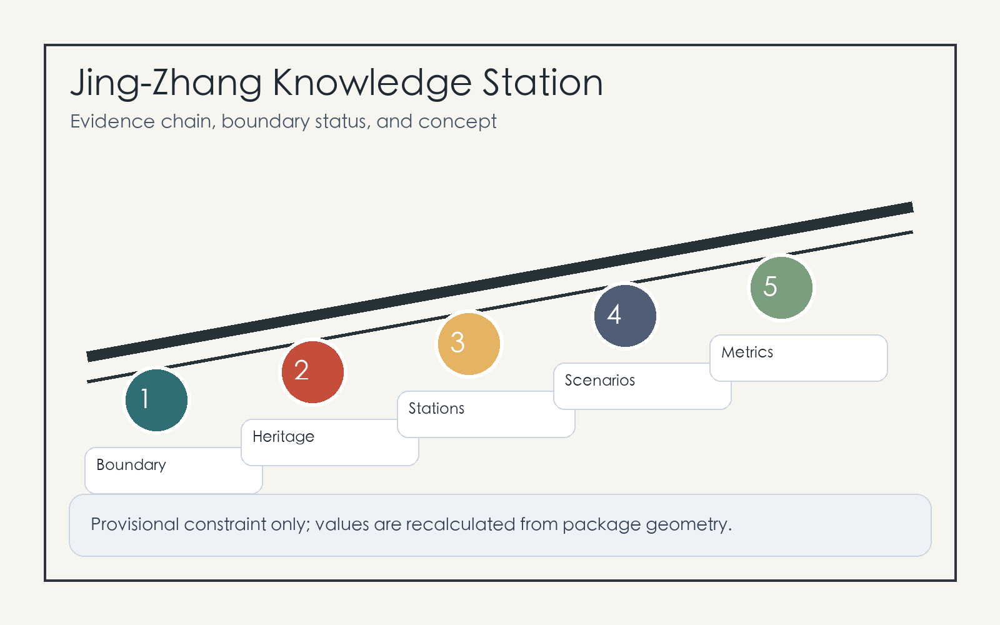
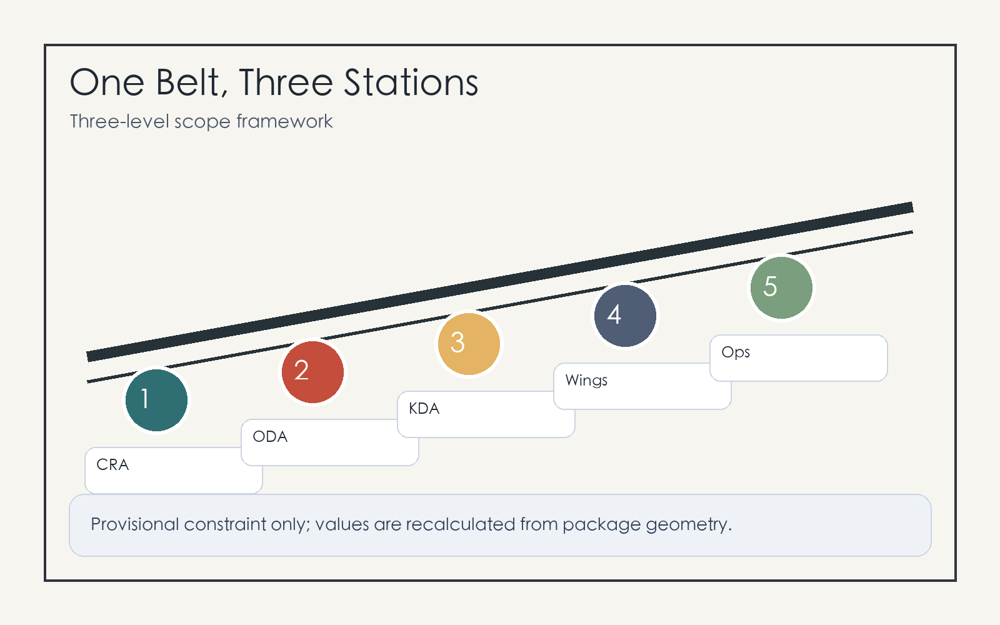
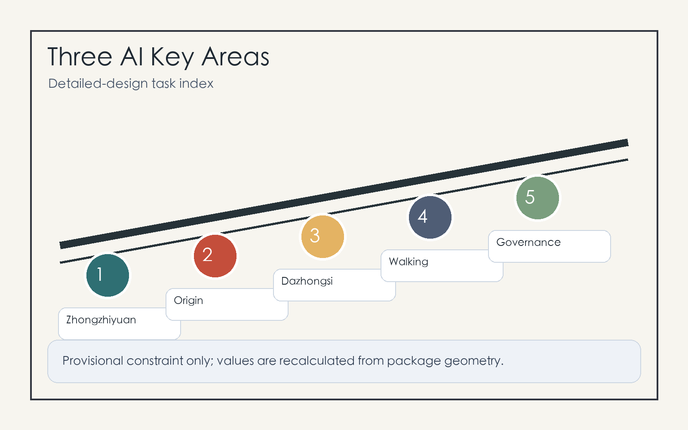

# Jing-Zhang Knowledge Station: A Verifiable AI-Native Innovation Belt

## Design Basis and Source List

This proposal treats the station as an interchange for knowledge, talent, models, data, and public services. The Jing-Zhang Railway Heritage Park provides the heritage spine, the three Key-Area Detailed Design Areas provide AI industry anchors, and nearby universities, companies, communities, and transit stations provide everyday users. The package follows the official announcement, site package, agent taskbook, and source registry, and does not present provisional geometry as an official redline [source:OFFICIAL-ANNOUNCEMENT] [source:AGENT-TASKBOOK] [source:SOURCE-REGISTRY].

The current repository provides only provisional boundary and provisional key areas. They are used for generation, display, and self-check, not for approval, statutory planning, or precise area claims. Once official polygons are released, all geometry layers and metrics must be recalculated [data:geometry/site_boundary.geojson#SITE-001] [metric:site_area_sqm].

## Three-Level Scope Framework

The three scopes are translated into a strategic concourse, urban platforms, and district gates: the Coordinated Research Area handles AI ecosystem and urban narrative, the Overall Design Area handles renewal, transport, infrastructure, public space, and metrics, and the Key-Area Detailed Design Areas handle Zhongzhiyuan, Beijing AI Origin Community, and Dazhongsi as areas for professional deepening [depth:three_level_scope_framework] [standard:PROJECT-OFFICIAL-ANNOUNCEMENT].

The spatial structure is one belt, three stations, two wings, and multiple scenarios. The belt is the heritage walking and cultural spine; the three stations are the three key areas; the two wings connect Zhongguancun Technology Services Wing and Xiaoyue River Scenario Enablement Wing; the scenarios place AI+ mobility, education, healthcare, commerce, enterprise services, and civic governance into auditable urban interfaces [data:geometry/key_areas.geojson#PROV-KEY-001] [depth:overall_spatial_structure].

## Coordinated Research Area: Industry and Future City Research

The identity is “Jing-Zhang Knowledge Station.” The logo concept combines railway gauge, model nodes, and open brackets: two parallel lines for the Jing-Zhang legacy, three nodes for the key areas, and an open bracket for open-source collaboration. The identity avoids uncleared company marks and uses station signs, wayfinding, contribution walls, and event tickets as public media [source:AGENT-TASKBOOK] [standard:PROJECT-AGENT-OPEN-CALL-TASKBOOK].

The ecosystem references six global patterns: Kendall Square, Station F, Toronto MaRS, Pittsburgh Robotics Row, Paris-Saclay, and Singapore Punggol Digital District. Haidian can translate them into six platforms: basic research, open-source collaboration, standards and safety, enterprise services, public experience, and international communication [depth:innovation_ecosystem_strategy].

## Overall Design Area: Urban Renewal and Regulatory-Plan-Level Urban Design

The Overall Design Area advances through renewable blocks, verifiable scenarios, and recalculable metrics. It retains continuous public space and university-enterprise interfaces, prioritizes ground floors, underpasses, station edges, and walking gaps, and treats building intensity as pending official controls [data:geometry/land_use.geojson#LU-001] [standard:MOHURD-CONTROL-DETAILED-PLANNING].

Renewal is staged as light activation, medium-term interface improvement, and long-term professional deepening. Official boundary, regulatory planning, ownership, infrastructure, and fire-safety data are prerequisites for any precise intensity or engineering conclusion [depth:development_intensity_controls] [data:geometry/buildings.geojson#BLDG-001].

## Detailed Design of Key Areas

Zhongzhiyuan AI Independent Innovation Acceleration Area is the standards and safety governance station, with model safety display, standards workshops, low-carbon computing experience, and garden-like R&D exchange spaces [data:geometry/key_areas.geojson#PROV-KEY-001].

Beijing AI Origin Community is the open-source transfer station, linking campus, community, and park edges with an open-source release hall, IP services, talent services, night collaboration space, and contribution wall [data:geometry/key_areas.geojson#PROV-KEY-002].

Dazhongsi AI Industry Cluster is the intelligent-economy reception station, organized around transit-station integration, four-quadrant walking connections, an international demo room, agent and device displays, and a data-factor salon [data:geometry/key_areas.geojson#PROV-KEY-003] [depth:three_key_area_detailed_design].

## AI Innovation Ecosystem, Personas, and AI+ Scenarios

The five personas are open-source developers, startup teams, enterprise visitors, nearby residents, and university students and faculty. Each persona has a data boundary: no personal trajectory profiling, authorized enterprise data only, cleared campus and research data only, and human review for public-safety scenarios [data:geometry/public_space.geojson#PUBLIC-001] [metric:public_space_ratio].

The ten scenario cards are open-source release hall, safety governance sandbox, edge-computing post, AI walking guidance, Dazhongsi international demo room, Qinghe low-carbon innovation corridor, near-campus transfer street, data-factor salon, AI daily-service street, and global AI event route. The three validation scenarios are walking-gap detection, enterprise-service booking and response, and public-event safety review [standard:PROJECT-AGENT-OPEN-CALL-TASKBOOK] [depth:ai_scenarios_personas].

## Land Use, Building Scale, and Retain-Renovate-Demolish Strategy

Land use is expressed as a closed partition, not as statutory zoning. Building treatment follows retain usable space, renovate public interfaces, renew inefficient nodes, and freeze objects pending confirmation. Without ownership, fire, structural, and regulatory data, no demolition or new-build commitment is made [data:geometry/land_use.geojson#LU-001] [data:geometry/buildings.geojson#BLDG-001] [standard:MNR-LAND-USE-CLASSIFICATION-GUIDE].

FAR, height, setbacks, and road redlines remain pending official conditions. The proposal focuses on spatial methods such as open ground floors, shared roofs, corner services, station interchange, green interfaces, and verifiable metrics [metric:floor_area_ratio] [depth:retain_renovate_demolish].

## Transport, Rail, Municipal Infrastructure, and Public Services

The mobility strategy combines transit interchange, heritage walking, and micro-circulation repair. Dazhongsi Station, Wudaokou, Qinghua East Road West, and North Fifth Ring crossing nodes are priorities for professional review [data:geometry/roads.geojson#ROAD-001] [depth:traffic_rail_slow_parking].

Municipal and public-service facilities include edge computing, public Wi-Fi, event power, low-carbon energy, smart lighting, talent services, enterprise services, and conventional utility coordination. Missing utility, fire, flood, and energy-capacity data are treated as prerequisites [data:geometry/constraints.geojson#CONSTRAINTS] [depth:municipal_new_infrastructure].

## Blue-Green Network, Public Space, and Urban Character

The blue-green network uses the Jing-Zhang Railway Heritage Park as a walkable spine connecting Qinghe, Xiaoyue River, university edges, company lobbies, and community life. The graphics emphasize corridors, stopping places, developer walks, open-source exhibit galleries, and agent contribution honor walls rather than the provisional polygon itself [data:geometry/green_space.geojson#GREEN-001] [depth:blue_green_public_space].

The three AI pilgrimage landmarks are the Tsinghua Yuan memory and open-source milestone wall, the Beijing AI Origin contribution station, and the Dazhongsi international agent demo court. The cultural narrative has three acts: railway self-strengthening, Zhongguancun innovation, and AI open-source co-creation [standard:MOHURD-URBAN-DESIGN-MEASURES].

## Renewal Projects, Implementation Policy, and Phasing

The six project packages are heritage-park walking-gap repair, Zhongzhiyuan Qinghe innovation interface, Origin Community near-campus transfer street, Dazhongsi four-quadrant walking connection, AI public service and edge-computing nodes, and global AI event route. Near-term work uses pilots and operations; medium-term work improves public space and ground floors; long-term work waits for official planning and engineering data [data:geometry/phasing.geojson#PHASE-001] [depth:phasing_implementation].

Long-term operation follows an annual theme, quarterly validation, and monthly open day: global AI urban week, quarterly scenario tests, monthly open-source release and resident feedback sessions. Each cycle records sources, authorization, risk, public feedback, and revisions [source:AGENT-TASKBOOK] [depth:renewal_project_list].

## Metrics, Area Recalculation, and Compliance Matrix

Metrics are divided into directly recalculable geometry metrics, pending official controls, and operational performance metrics. Known values live in `metrics.json`; gaps live in `assumptions.json` [metric:green_ratio] [metric:public_space_ratio] [depth:metrics_recalculation].

The compliance matrix covers announcement tasks 1.3, 1.4, 1.5 and agent.1 through agent.6, linking every task to sections, layers, metrics, drawings, HTML, self-checks, and data gaps [standard:PROJECT-OFFICIAL-ANNOUNCEMENT].

## Risk, Copyright, and Compliance

The main risk is misreading provisional geometry, conceptual projects, or operational ideas as official redlines, approval conclusions, or implementation commitments. The package repeats provisional status in proposal, HTML, sources, assumptions, and self-check, and lists regulatory planning, ownership, utilities, fire safety, heritage, traffic modeling, and public participation as prerequisites [source:SITE-PACKAGE] [depth:risk_missing_data].

Figures are generated from local package data and local drawing code. The package uses no remote images, map tiles, scripts, fonts, iframes, forms, APIs, or tracking. AI scenarios require data minimization, authorization, explainability, human review, and stop rules [data:geometry/constraints.geojson#CONSTRAINTS].

## References

- brief/site-package/design_brief.json
- brief/site-package/agent_taskbook.json
- brief/site-package/allowed_design_space.json
- data/source_registry.json
- data/processed/agent_fact_pack.md
- docs/formal-submission-guide.md
- docs/terminology-glossary.md
- Structured indexes: `sources.json`, `metrics.json`, `compliance_matrix.json`, `standard_matrix.json`, `design_depth_matrix.json` [source:SITE-PACKAGE]
