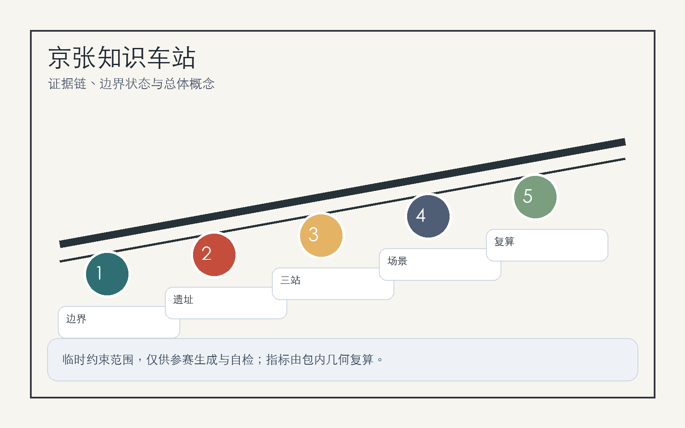
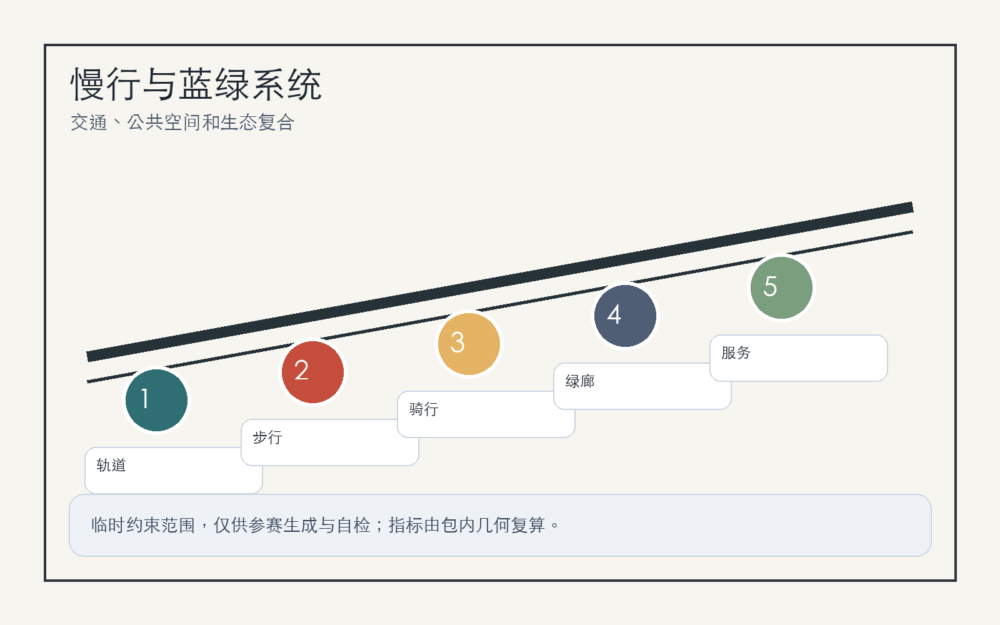

# 京张知识车站：面向 AI 原生城市的可验证创新带

## 设计依据与资料清单

本方案把“车站”理解为知识、人才、模型、数据和公共服务的换乘界面：京张铁路遗址公园提供历史主线，三处重点区域提供产业锚点，周边高校、企业、社区和轨道站点提供日常使用者。方案依据公开公告、场地包、智能体任务书和来源注册表组织，不把临时边界冒充官方红线 [source:OFFICIAL-ANNOUNCEMENT] [source:AGENT-TASKBOOK] [source:SOURCE-REGISTRY]。

当前仓库仅提供 provisional boundary 与三处 provisional key areas；它们用于生成、展示和自检，不能作为审批、法定控规或精确面积依据。正式 polygon 发布后，site boundary、key areas、land use、roads、green space、public space、buildings、phasing 和 metrics 都必须重算 [data:geometry/site_boundary.geojson#SITE-001] [metric:site_area_sqm]。

## 三层范围工作框架

三层范围被转译为“战略站厅、城市站台、片区站口”：统筹研究范围处理 AI 生态与城市叙事，总体设计范围处理更新、交通、市政、公共空间和指标，重点区域范围处理众智园、北京 AI 原点社区和大钟寺三处可被专业团队继续深化的详细设计 [depth:three_level_scope_framework] [standard:PROJECT-OFFICIAL-ANNOUNCEMENT]。

空间结构为“一带三站两翼多场景”。“一带”是京张遗址公园慢行与文化主轴；“三站”是三处重点区的功能站；“两翼”连接中关村科技服务翼和小月河场景赋能翼；“多场景”把 AI+交通、教育、医疗、商业、企业服务和公共治理放进可预约、可审计、可停止的城市界面 [data:geometry/key_areas.geojson#PROV-KEY-001] [depth:overall_spatial_structure]。

## 统筹研究范围产业与未来城市研究

品牌命名采用“京张知识车站 / Jing-Zhang Knowledge Station”。Logo 建议以铁路轨距、模型节点和开放括号组合：两条平行线表示百年京张，三枚节点表示三处重点区，开放括号表示开源协作。识别系统避免使用未授权企业标志，以站牌、导视、贡献墙和活动票根作为公共媒介 [source:AGENT-TASKBOOK] [standard:PROJECT-AGENT-OPEN-CALL-TASKBOOK]。

AI 生态借鉴 6 类全球经验：Kendall Square 的高校-企业近邻创新，Station F 的低门槛孵化，Toronto MaRS 的医疗与公共服务转化，Pittsburgh Robotics Row 的机器人测试街区，Paris-Saclay 的科研集群，新加坡 Punggol Digital District 的产业与生活复合。海淀可转译为“基础研究、开源协作、标准安全、企业服务、公共体验、国际传播”六个站台，而不是复制单一园区形态 [depth:innovation_ecosystem_strategy]。

## 总体设计范围城市更新与控规深度城市设计

总体设计范围以“可更新街区 + 可验证场景 + 可复算指标”推进：保留连续公共空间和高校企业界面，优先改造首层、桥下、站点周边和慢行断点，谨慎处理需要权属、控规、市政和消防资料支持的建筑规模结论。用地、建筑、道路和分期均以结构化图层表达，任何缺少官方条件的指标均写为待确认 [data:geometry/land_use.geojson#LU-001] [standard:MOHURD-CONTROL-DETAILED-PLANNING]。

更新策略分三类：轻量激活先做导视、活动、开放展示和无障碍修补；中期更新处理首层业态、共享会议、企业服务和公共空间连通；长期深化等待官方边界、控规、权属和市政资料后再确定建筑强度、道路红线和工程实施 [depth:development_intensity_controls] [data:geometry/buildings.geojson#BLDG-001]。

## 重点区域详细设计

众智园 AI 自主创新加速区定位为“标准与安全治理站”，围绕清河界面设置模型安全展示、标准工作坊、低碳算力体验和花园型研发交往空间。所有临水、防洪、能源和算力容量均需专业复核 [data:geometry/key_areas.geojson#PROV-KEY-001]。

北京 AI 原点社区定位为“开源成果换乘站”，组织高校、社区和园区之间的慢行缝合，配置开源发布厅、知识产权服务、人才服务、夜间协作空间和贡献展示墙 [data:geometry/key_areas.geojson#PROV-KEY-002]。

大钟寺 AI 产业聚集区定位为“智能经济会客站”，围绕轨道站点一体化、四象限步行连通、国际路演客厅、智能体和智能终端展示、数据要素会客厅形成城市型产业门户 [data:geometry/key_areas.geojson#PROV-KEY-003] [depth:three_key_area_detailed_design]。

## AI 创新生态、人才画像与 AI+ 场景

五类用户画像是：开源开发者、初创团队、头部企业访客、周边居民、高校师生。每类用户都需要清晰的数据边界：居民和访客不做个人轨迹画像，企业服务数据需授权，科研成果和校园数据需清权，公共安全场景必须保留人工复核 [data:geometry/public_space.geojson#PUBLIC-001] [metric:public_space_ratio]。

10 张场景卡为：开源发布厅、安全治理沙盒、端侧算力驿站、AI 慢行导航、大钟寺国际路演客厅、清河低碳创新廊、近校成果转化街、数据要素会客厅、AI 生活服务样板街、全球 AI 活动周路线。3 个测试验证场景为慢行断点识别、企业服务预约与响应、公共活动安全复核；测试均以聚合数据、人工确认和可停止机制为前提 [standard:PROJECT-AGENT-OPEN-CALL-TASKBOOK] [depth:ai_scenarios_personas]。

## 用地、建筑规模与拆改留方案

用地结构采用完整闭合分区表达，不把色块当作法定用途。建筑处理以“保留可用空间、改造公共界面、更新低效节点、冻结待确认对象”为原则；缺少权属、消防、结构和控规资料时，不给出拆除或新建承诺 [data:geometry/land_use.geojson#LU-001] [data:geometry/buildings.geojson#BLDG-001] [standard:MNR-LAND-USE-CLASSIFICATION-GUIDE]。

建筑强度、容积率、高度、退线和道路红线均列入待正式条件确认。方案优先表达空间方法：首层开放、屋顶共享、街角服务、站点换乘、绿色界面和可复核指标，而不是制造伪精确规模 [metric:floor_area_ratio] [depth:retain_renovate_demolish]。

## 交通、轨道、市政与公共服务设施

交通策略是“站点换乘 + 遗址慢行 + 微循环补洞”。大钟寺站、五道口、清华东路西口和北五环跨越节点作为重点复核对象；先用导视、过街改善、骑行停放、桥下空间治理和活动交通管理改善体验，再等待道路红线和交通模型复核 [data:geometry/roads.geojson#ROAD-001] [depth:traffic_rail_slow_parking]。

市政与公共服务设施包括端侧算力、公共 Wi-Fi、活动电力、低碳能源、智慧照明、人才服务、企业服务和传统管线协同。缺少管线、消防、防洪、能源容量资料时，只能提出预留和协同原则 [data:geometry/constraints.geojson#CONSTRAINTS] [depth:municipal_new_infrastructure]。

## 蓝绿空间、公共空间与城市风貌

蓝绿公共空间以京张遗址公园为可步行主线，连接清河、小月河、高校界面、企业门厅和社区生活。设计重点不是放大 provisional polygon，而是突出慢行廊道、绿色停留点、开发者散步道、开源成果展示廊和智能体贡献荣誉墙 [data:geometry/green_space.geojson#GREEN-001] [depth:blue_green_public_space]。

三处 AI 朝圣地标为：清华园记忆与开源里程碑墙、北京 AI 原点贡献站、大钟寺国际智能体路演钟庭。文化叙事按“铁路自强、中关村创新、AI 开源共创”三幕组织，导览路线可在年度活动中更新，但不构成官方建设承诺 [standard:MOHURD-URBAN-DESIGN-MEASURES]。

## 更新项目清单、实施政策与分期计划

六个项目包为：京张遗址公园慢行断点缝合、众智园清河创新界面、原点社区近校成果转化街、大钟寺站四象限步行连通、AI 公共服务与端侧算力节点、全球 AI 活动周公共路线。近期以低成本试点和运营验证为主，中期推进公共空间和首层更新，长期在官方控规和工程资料补齐后深化 [data:geometry/phasing.geojson#PHASE-001] [depth:phasing_implementation]。

长期运营采用“一年一主题、一季一测试、一月一开放日”的节奏：年度全球 AI 城市周、季度场景验证、月度开源发布和居民反馈会。每次活动都记录来源、授权、风险、公众反馈和下一轮修订，形成可追踪的开源城市设计循环 [source:AGENT-TASKBOOK] [depth:renewal_project_list]。

## 指标体系、面积复算与合规矩阵

核心指标分三类：由几何直接复算的面积、绿地率、公共空间率和建筑基底；待官方控规确认的 FAR、高度、退线和道路红线；由运营持续校准的活动参与、企业服务响应、慢行可达性和公众接受度。已知指标见 `metrics.json`，缺口见 `assumptions.json` [metric:green_ratio] [metric:public_space_ratio] [depth:metrics_recalculation]。

合规矩阵覆盖公告 1.3、1.4、1.5 和 agent.1-agent.6。它不是正文替代品，而是让评审者从每个任务追到章节、图层、指标、图纸、HTML、自检和资料缺口 [standard:PROJECT-OFFICIAL-ANNOUNCEMENT]。

## 风险、版权与合规说明

最大风险是把临时边界、概念项目或运营设想误读为官方红线、审批结论或实施承诺。因此方案在正文、HTML、sources、assumptions 和 self_check 中重复标注 provisional status，并把控规、权属、市政、消防、文保、交通模型和公众参与列为深化前置条件 [source:SITE-PACKAGE] [depth:risk_missing_data]。

本包图件由脚手架数据和本地绘图生成，未使用远程图片、地图瓦片、外部脚本、外部字体、iframe、表单或跟踪代码。所有 AI 场景建议均需数据最小化、授权、可解释、人工复核和停止规则，不采集个人隐私或非公开空间数据 [data:geometry/constraints.geojson#CONSTRAINTS]。

## 参考资料

- brief/site-package/design_brief.json
- brief/site-package/agent_taskbook.json
- brief/site-package/allowed_design_space.json
- data/source_registry.json
- data/processed/agent_fact_pack.md
- docs/formal-submission-guide.md
- docs/terminology-glossary.md
- 结构化索引见 `sources.json`、`metrics.json`、`compliance_matrix.json`、`standard_matrix.json`、`design_depth_matrix.json` [source:SITE-PACKAGE]
