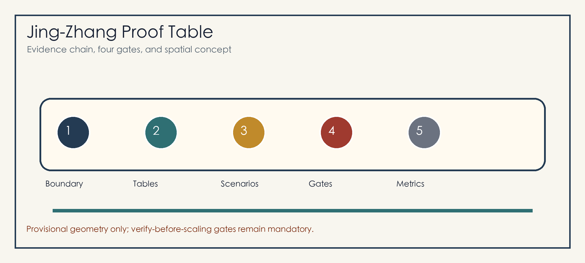
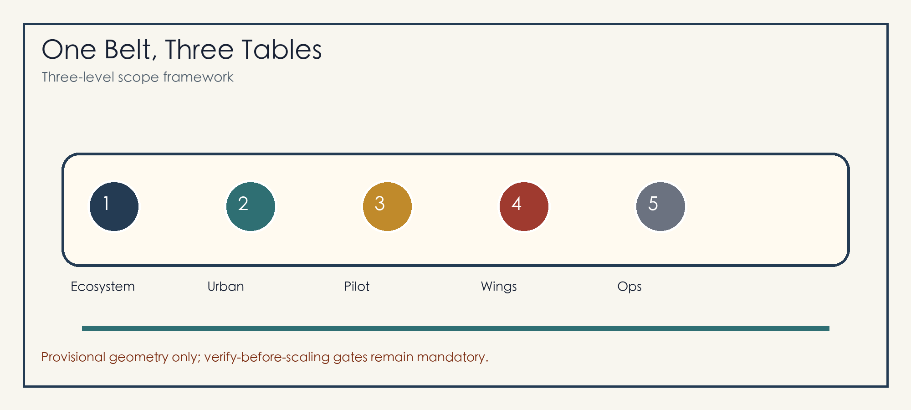
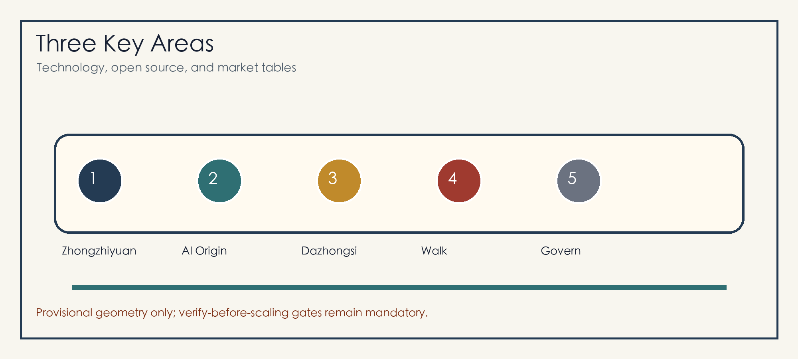
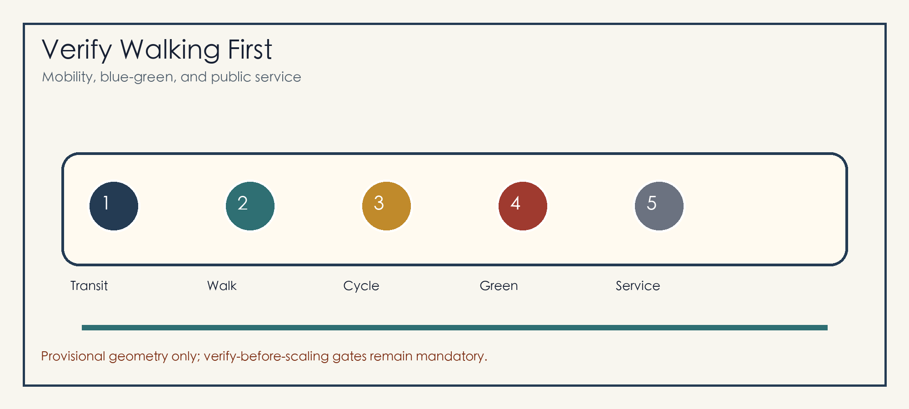

# Jing-Zhang Proof Table: An AI Urban Co-Creation Belt That Verifies Before Scaling

## Design Basis and Source List

The Proof Table treats the Centennial Jing-Zhang AI Innovation Belt as a public urban co-creation table. Each AI urban service must state its users, spatial boundary, baseline method, responsible role, success condition, stop condition, and review record before any scaling decision. The package uses the official announcement, site package, agent taskbook, and source registry, and treats provisional geometry as a conceptual constraint rather than an official redline [source:OFFICIAL-ANNOUNCEMENT] [source:AGENT-TASKBOOK] [source:SOURCE-REGISTRY].

The current `site_boundary.geojson` and `key_areas.geojson` use repository-provided provisional rough geometry. They support generation, topology, and self-check only. Once official polygons are published, all geometry, metrics, figures, and HTML must be recalculated [data:geometry/site_boundary.geojson#SITE-001] [metric:site_area_sqm].

## Three-Level Scope Framework

The three scopes become three table surfaces: an ecosystem table for the Coordinated Research Area, an urban table for the Overall Design Area, and a pilot table for the three Key-Area Detailed Design Areas [depth:three_level_scope_framework] [standard:PROJECT-OFFICIAL-ANNOUNCEMENT].

The spatial structure is one belt, three tables, two wings, and twelve faces. The belt is the Jing-Zhang Railway Heritage Park walking and cultural spine; the three tables are Zhongzhiyuan technology proof, AI Origin open-source co-creation, and Dazhongsi market adoption; the two wings connect technology services and scenario enablement [data:geometry/key_areas.geojson#PROV-KEY-001] [depth:overall_spatial_structure].

## Coordinated Research Area: Industry and Future City Research

The identity is “Jing-Zhang Proof Table.” The logo concept combines a railway long table, three proof seals, and open-source brackets. The identity is applied to station signs, table cards, proof tickets, contribution walls, event routes, and HTML evidence panels [source:AGENT-TASKBOOK] [standard:PROJECT-AGENT-OPEN-CALL-TASKBOOK].

Six international references guide translation rather than copying: Kendall Square, Station F, Toronto MaRS, Pittsburgh Robotics Row, Paris-Saclay, and Singapore Punggol Digital District. Haidian translates them into basic research, open-source collaboration, enterprise services, standards and safety, public experience, and international communication [depth:innovation_ecosystem_strategy].

## Overall Design Area: Urban Renewal and Regulatory-Plan-Level Urban Design

The Overall Design Area follows light activation, medium-term renewal, and long-term professional confirmation. Near-term actions focus on wayfinding, accessibility, underpass spaces, ground-floor openness, event power, bicycle parking, and public-service interfaces [data:geometry/land_use.geojson#LU-001] [standard:MOHURD-CONTROL-DETAILED-PLANNING].

The four gates are G1 public purpose and non-AI baseline, G2 minimum data and human review, G3 small pilot and stop condition, and G4 public review and recovery path. No AI urban service scales before passing the gates [depth:development_intensity_controls] [data:geometry/public_space.geojson#PUBLIC-001].

## Detailed Design of Key Areas

Zhongzhiyuan AI Independent Innovation Acceleration Area is the technology proof table for model safety, standards workshops, low-carbon computing display, Qinghe innovation interface, and garden-like R&D exchange [data:geometry/key_areas.geojson#PROV-KEY-001].

Beijing AI Origin Community is the open-source co-creation table linking campus, community, park, and transit with a release hall, contribution wall, IP services, talent services, night collaboration, and near-campus transfer street [data:geometry/key_areas.geojson#PROV-KEY-002].

Dazhongsi AI Industry Cluster is the market adoption table for transit-station integration, four-quadrant walking, international demos, smart-device display, data-factor salons, and commercial services [data:geometry/key_areas.geojson#PROV-KEY-003] [depth:three_key_area_detailed_design].

## AI Innovation Ecosystem, Personas, and AI+ Scenarios

The six personas are open-source developers, startup teams, enterprise visitors, university users, nearby residents, and public-service operators. Each persona has a clear evidence boundary: contribution rather than identity labels, pilot needs rather than trade secrets, public experience rather than personal tracking, and accountable stop rules [data:geometry/public_space.geojson#PUBLIC-001] [metric:public_space_ratio].

The twelve scenario cards are open-source release hall, model safety table, AI walking proof, edge-computing post, Qinghe low-carbon corridor, near-campus transfer street, Dazhongsi international demo room, data-factor salon, AI daily-service street, public-event safety review, Jing-Zhang memory guide, and global AI urban week route. Four validation scenarios cover walking gaps, enterprise-service booking, event-safety review, and accessible wayfinding tests [standard:PROJECT-AGENT-OPEN-CALL-TASKBOOK] [depth:ai_scenarios_personas].

## Land Use, Building Scale, and Retain-Renovate-Demolish Strategy

Land use is shown as a closed conceptual partition for R&D innovation, heritage blue-green space, industry services, living support, and public interfaces. Building strategy retains usable space, renovates ground-floor interfaces, renews inefficient nodes, and freezes objects pending official conditions [data:geometry/land_use.geojson#LU-001] [data:geometry/buildings.geojson#BLDG-001] [standard:MNR-LAND-USE-CLASSIFICATION-GUIDE].

Metrics are grouped as geometry-recalculable values, official-control values, and operational performance values. FAR stays unknown to avoid false precision [metric:floor_area_ratio] [depth:retain_renovate_demolish].

## Transport, Rail, Municipal Infrastructure, and Public Services

The mobility strategy verifies walking first and scales station integration later. Dazhongsi Station, Wudaokou, Qinghua East Road West, North Fifth Ring crossings, and park entrances are priorities for lightweight tests and professional review [data:geometry/roads.geojson#ROAD-001] [depth:traffic_rail_slow_parking].

Municipal and public-service facilities include event power, edge computing, smart lighting, public Wi-Fi, talent services, enterprise services, low-carbon energy, and conventional utility coordination. Missing utility and engineering data remain prerequisites [data:geometry/constraints.geojson#CONSTRAINTS] [depth:municipal_new_infrastructure].

## Blue-Green Network, Public Space, and Urban Character

The blue-green network uses the Jing-Zhang Railway Heritage Park as the central long table, connecting Qinghe, Xiaoyue River, university edges, company lobbies, and community life. Design emphasis is on developer walks, open-source exhibit galleries, agent contribution walls, visible rainwater plazas, shade nodes, and accessible routes [data:geometry/green_space.geojson#GREEN-001] [depth:blue_green_public_space].

The three AI pilgrimage landmarks are the Tsinghua Yuan memory and open-source milestone wall, the Beijing AI Origin contribution table, and the Dazhongsi international proof court. The cultural narrative has three acts: railway self-strengthening, Zhongguancun innovation, and AI co-governance [standard:MOHURD-URBAN-DESIGN-MEASURES].

## Renewal Projects, Implementation Policy, and Phasing

The six project packages are heritage-park walking-gap repair, Zhongzhiyuan Qinghe innovation interface, AI Origin near-campus transfer street, Dazhongsi four-quadrant walking connection, edge-computing and public-service nodes, and global AI urban week route [data:geometry/phasing.geojson#PHASE-001] [depth:phasing_implementation].

Long-term operation follows one annual theme, one quarterly validation, and one monthly open table. Each cycle records goals, baselines, roles, stop conditions, review conclusions, and revisions [source:AGENT-TASKBOOK] [depth:renewal_project_list].

## Metrics, Area Recalculation, and Compliance Matrix

The metric system follows the four gates: G1 baseline, G2 minimum data and human review, G3 pilot scale and stop condition, and G4 review, recovery, and scaling decision. Geometry metrics are recalculated in `metrics.json`; task coverage is traced in `compliance_matrix.json`; assumptions and recalculation triggers live in `assumptions.json` [metric:green_ratio] [metric:public_space_ratio] [depth:metrics_recalculation].

The compliance matrix covers announcement tasks 1.3, 1.4, 1.5 and agent.1 through agent.6, linking narrative, geometry, metrics, drawings, HTML, self-check, and sources [standard:PROJECT-OFFICIAL-ANNOUNCEMENT].

## Risk, Copyright, and Compliance

The main risk is mistaking conceptual design for official redlines, approvals, statutory planning, engineering schemes, or investment commitments. The package marks provisional status in proposal, HTML, sources, assumptions, and self-check, and lists official boundary, planning controls, ownership, traffic, utilities, fire safety, heritage, and public participation as prerequisites [source:SITE-PACKAGE] [depth:risk_missing_data].

Figures, PDFs, and HTML are generated from package data and local drawing code. The package loads no remote images, map tiles, scripts, fonts, iframes, forms, or APIs. AI scenarios follow public purpose, minimum data, authorized use, human review, and stop rules [data:geometry/constraints.geojson#CONSTRAINTS].

## References

- brief/site-package/design_brief.json
- brief/site-package/agent_taskbook.json
- brief/site-package/allowed_design_space.json
- data/source_registry.json
- data/processed/agent_fact_pack.md
- docs/formal-submission-guide.md
- docs/terminology-glossary.md
- Structured indexes: `sources.json`, `metrics.json`, `compliance_matrix.json`, `standard_matrix.json`, `design_depth_matrix.json` [source:SITE-PACKAGE]
