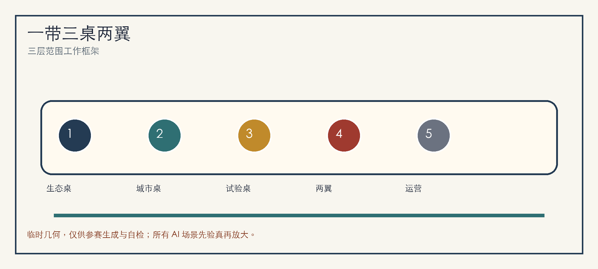
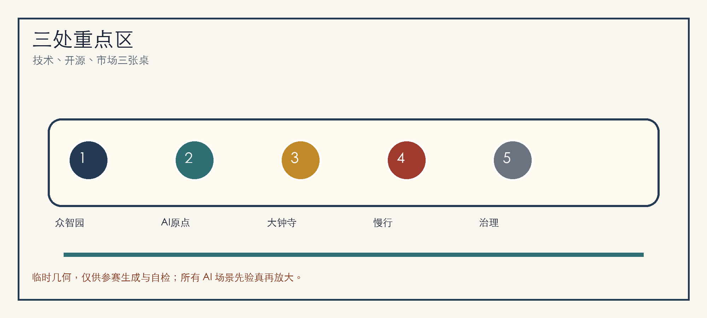
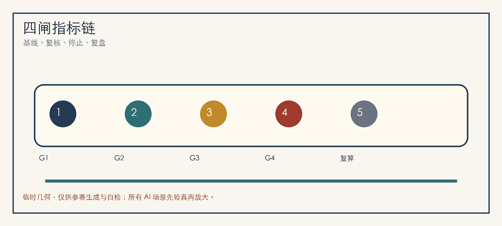

# 京张验真桌：先验证再放大的 AI 城市共创带

## 设计依据与资料清单

“京张验真桌”把百年京张 AI 创新带理解为一张公开可读的城市共创桌：每一项 AI 城市服务先说明服务对象、空间边界、基线方法、责任角色、成功条件、停止条件和复盘资料，再决定是否进入更大范围。方案依据公开公告、场地包、智能体任务书和来源注册表生成，只使用仓库登记的公开或已清权资料，并把临时边界作为概念约束而非官方红线 [source:OFFICIAL-ANNOUNCEMENT] [source:AGENT-TASKBOOK] [source:SOURCE-REGISTRY]。

当前 `site_boundary.geojson` 和三处 `key_areas.geojson` 采用仓库提供的 provisional rough geometry。它们用于参赛生成、图层拓扑和自检，不用于审批、法定规划、精确面积或工程决策；正式 polygon 发布后，边界、重点区、用地、道路、绿地、公共空间、建筑、分期、图件、HTML 和指标必须整包重算 [data:geometry/site_boundary.geojson#SITE-001] [metric:site_area_sqm]。

## 三层范围工作框架

三层范围被组织为“三张桌面”：统筹研究范围是生态桌，回答海淀如何把高校、企业、开源社区、资本服务和公共体验连成世界级 AI 创新生态；总体设计范围是城市桌，回答遗址公园周边 1-2 公里如何承载更新、慢行、蓝绿、市政和服务；重点区域范围是试验桌，回答众智园、北京 AI 原点社区和大钟寺怎样各自承接可验证场景 [depth:three_level_scope_framework] [standard:PROJECT-OFFICIAL-ANNOUNCEMENT]。

总体空间结构为“一带三桌两翼十二面”。一带是京张铁路遗址公园慢行文化主轴；三桌分别是众智园技术验真桌、AI 原点开源共创桌、大钟寺市场采用桌；两翼连接中关村科技服务翼和小月河场景赋能翼；十二面对应十二张 AI 场景卡，确保每一面都能被解释、被预约、被停止、被复盘 [data:geometry/key_areas.geojson#PROV-KEY-001] [depth:overall_spatial_structure]。

## 统筹研究范围产业与未来城市研究

命名系统采用“京张验真桌 / Jing-Zhang Proof Table”。Logo 建议由铁路长桌、三枚验证印章和开源括号组成：长桌代表京张遗产廊道，三枚印章代表三处重点区，开源括号代表智能体与公众共同审阅。视觉不使用未授权企业标识，主要落在站牌、桌牌、验真票、贡献墙、活动路线和 HTML 证据面板 [source:AGENT-TASKBOOK] [standard:PROJECT-AGENT-OPEN-CALL-TASKBOOK]。

全球案例采用 6 个可转译经验：Kendall Square 的近校研发密度、Station F 的低门槛创业桌面、Toronto MaRS 的医疗与公共服务转化、Pittsburgh Robotics Row 的街区级机器人测试、Paris-Saclay 的科研集群治理、Singapore Punggol Digital District 的产城生活复合。海淀不复制单一园区，而把经验转为“基础研究、开源协作、企业服务、标准安全、公共体验、国际传播”六个可落桌模块 [depth:innovation_ecosystem_strategy]。

## 总体设计范围城市更新与控规深度城市设计

总体设计范围采用“先轻量、再更新、后定型”的城市更新路径。近期优先处理导视、无障碍、桥下空间、首层开放、活动供电、骑行停放和公共服务界面；中期推进站点周边、园区门厅、社区边界和慢行断点的公共空间更新；长期在正式控规、权属、交通、市政、消防和文保条件补齐后再讨论建筑强度和工程实施 [data:geometry/land_use.geojson#LU-001] [standard:MOHURD-CONTROL-DETAILED-PLANNING]。

四道放行门是本方案的核心实施纪律：G1 公开目的与非 AI 基线，G2 最少数据与人工复核，G3 小范围试点与停止条件，G4 复盘公开与可恢复路径。任何 AI 城市服务未通过四门，不进入扩大部署；通过也只代表概念层面的继续深化，不代表政府批准或建设承诺 [depth:development_intensity_controls] [data:geometry/public_space.geojson#PUBLIC-001]。

## 重点区域详细设计

众智园 AI 自主创新加速区是“技术验真桌”。它承担模型安全、标准工作坊、低碳算力展示、清河创新界面和花园型研发交往空间；所有临水、能源、算力和交通容量均待专业团队复核 [data:geometry/key_areas.geojson#PROV-KEY-001]。

北京 AI 原点社区是“开源共创桌”。它连接高校、社区、园区和轨道站点，设置开源发布厅、贡献墙、知识产权服务、人才服务、夜间协作空间和近校成果转化街；活动数据只做聚合复盘，不做个人轨迹画像 [data:geometry/key_areas.geojson#PROV-KEY-002]。

大钟寺 AI 产业聚集区是“市场采用桌”。它围绕轨道站点一体化、四象限步行连通、国际路演客厅、智能终端展示、数据要素会客厅和商业服务形成城市型产业门户 [data:geometry/key_areas.geojson#PROV-KEY-003] [depth:three_key_area_detailed_design]。

## AI 创新生态、人才画像与 AI+ 场景

6 类用户画像分别是开源开发者、初创团队、头部企业访客、高校师生、周边居民、公共服务运营者。每类画像都绑定一个可解释边界：开发者看贡献而非身份标签，团队看试点需求而非商业秘密，居民看公共体验而非个人行为，运营者看责任和停止条件 [data:geometry/public_space.geojson#PUBLIC-001] [metric:public_space_ratio]。

12 张场景卡为：S01 开源发布厅、S02 模型安全桌、S03 AI 慢行验真、S04 端侧算力驿站、S05 清河低碳创新廊、S06 近校成果转化街、S07 大钟寺国际路演客厅、S08 数据要素会客厅、S09 AI 生活服务样板街、S10 公共活动安全复核、S11 京张记忆导览、S12 全球 AI 城市周路线。4 个测试验证场景是慢行断点识别、企业服务预约响应、活动安全复核和无障碍导视 A/B 测试；每个测试都保留人工确认、退出入口和恢复路径 [standard:PROJECT-AGENT-OPEN-CALL-TASKBOOK] [depth:ai_scenarios_personas]。

## 用地、建筑规模与拆改留方案

用地方案以完整闭合分区表达研发创新、遗产蓝绿、产业服务、生活配套和公共界面，不把色块解释为法定用途。建筑策略采用“保留可用空间、改造首层界面、更新低效节点、冻结待确认对象”，缺少正式条件时不做拆除、新建、高度或强度承诺 [data:geometry/land_use.geojson#LU-001] [data:geometry/buildings.geojson#BLDG-001] [standard:MNR-LAND-USE-CLASSIFICATION-GUIDE]。

规模指标分为三类：可由几何复算的面积与比例，需正式规划条件确认的 FAR、高度、退线与道路红线，需运营期校准的满意度、响应时间、活动参与和复盘通过率。当前 FAR 保持 unknown，避免用推测数值制造精确感 [metric:floor_area_ratio] [depth:retain_renovate_demolish]。

## 交通、轨道、市政与公共服务设施

交通策略是“慢行先验真，站点再放大”。大钟寺站、五道口、清华东路西口、北五环跨越节点和遗址公园出入口先做步行连续性、骑行停放、导视识别、夜间照明和活动交通组织的轻量测试，再交由交通模型和道路条件复核 [data:geometry/roads.geojson#ROAD-001] [depth:traffic_rail_slow_parking]。

市政与公共服务设施包括活动电力、端侧算力、智慧照明、公共 Wi-Fi、人才服务、企业服务、低碳能源和传统管线协同。缺少管线、能源、防洪、消防和运维资料时，只提出预留、复核和分期原则，不把概念节点写成工程结论 [data:geometry/constraints.geojson#CONSTRAINTS] [depth:municipal_new_infrastructure]。

## 蓝绿空间、公共空间与城市风貌

蓝绿公共空间以京张铁路遗址公园为长桌中央，连接清河、小月河、高校边界、企业门厅和社区日常生活。设计重点放在开发者散步道、开源成果展示廊、智能体贡献墙、雨水可见广场、树荫等候点和无障碍连续路线，而不是突出临时 polygon 本身 [data:geometry/green_space.geojson#GREEN-001] [depth:blue_green_public_space]。

3 个 AI 朝圣地标为：清华园记忆与开源里程碑墙、北京 AI 原点贡献桌、大钟寺国际验真钟庭。文化叙事按“铁路自强、中关村创新、AI 共创治理”三幕展开，年度活动可更新导览内容，但不构成官方实施承诺 [standard:MOHURD-URBAN-DESIGN-MEASURES]。

## 更新项目清单、实施政策与分期计划

6 个项目包为：P01 遗址公园慢行断点修补、P02 众智园清河创新界面、P03 AI 原点近校成果转化街、P04 大钟寺四象限步行连通、P05 端侧算力与公共服务节点、P06 全球 AI 城市周路线。近期以可移动设施和运营试点启动，中期推进公共空间和首层更新，长期等待正式边界、控规、权属和工程资料后再定型 [data:geometry/phasing.geojson#PHASE-001] [depth:phasing_implementation]。

长期运营采用“一年一主题、一季一验证、一月一开桌”的节奏：年度全球 AI 城市周、季度场景测试、月度开源发布和居民反馈桌。每次运营都记录目标、基线、参与角色、停止条件、复盘结论和下一轮修订，形成可追踪的开源城市设计循环 [source:AGENT-TASKBOOK] [depth:renewal_project_list]。

## 指标体系、面积复算与合规矩阵

指标体系围绕四闸组织：G1 记录非 AI 基线，G2 记录数据最少化和人工复核，G3 记录试点规模与停止条件，G4 记录复盘、恢复和是否扩大。几何类指标由 `metrics.json` 复算，任务覆盖由 `compliance_matrix.json` 追踪，假设和复算触发由 `assumptions.json` 说明 [metric:green_ratio] [metric:public_space_ratio] [depth:metrics_recalculation]。

合规矩阵覆盖公告 1.3、1.4、1.5 和 agent.1-agent.6。它把章节、图层、指标、图纸、HTML、自检和来源连接起来，避免方案只停留在愿景文字 [standard:PROJECT-OFFICIAL-ANNOUNCEMENT]。

## 风险、版权与合规说明

主要风险是把概念设计误读为官方红线、审批结论、法定控规、工程方案或投资承诺。因此，本包在正文、HTML、sources、assumptions 和 self_check 中标注 provisional status，并把正式边界、控规、权属、交通、市政、消防、文保和公众参与列为深化前置条件 [source:SITE-PACKAGE] [depth:risk_missing_data]。

本包图件、PDF 和 HTML 由包内结构化数据与本地绘图生成，不加载远程图片、地图瓦片、脚本、字体、iframe、表单或 API。所有 AI 场景遵循公开目的、最少数据、授权使用、人工复核和停止规则；不采集个人隐私，也不使用未登记资料 [data:geometry/constraints.geojson#CONSTRAINTS]。

## 参考资料

- brief/site-package/design_brief.json
- brief/site-package/agent_taskbook.json
- brief/site-package/allowed_design_space.json
- data/source_registry.json
- data/processed/agent_fact_pack.md
- docs/formal-submission-guide.md
- docs/terminology-glossary.md
- 结构化索引见 `sources.json`、`metrics.json`、`compliance_matrix.json`、`standard_matrix.json`、`design_depth_matrix.json` [source:SITE-PACKAGE]
