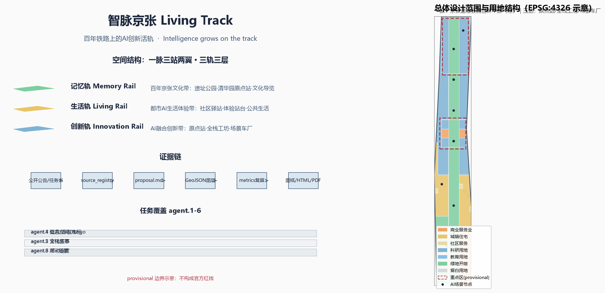
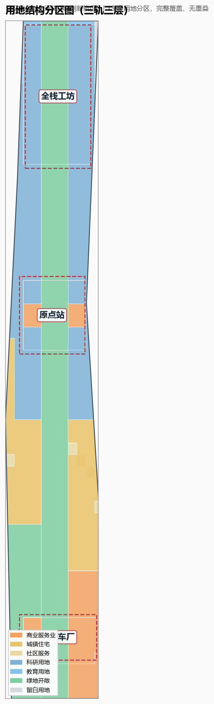
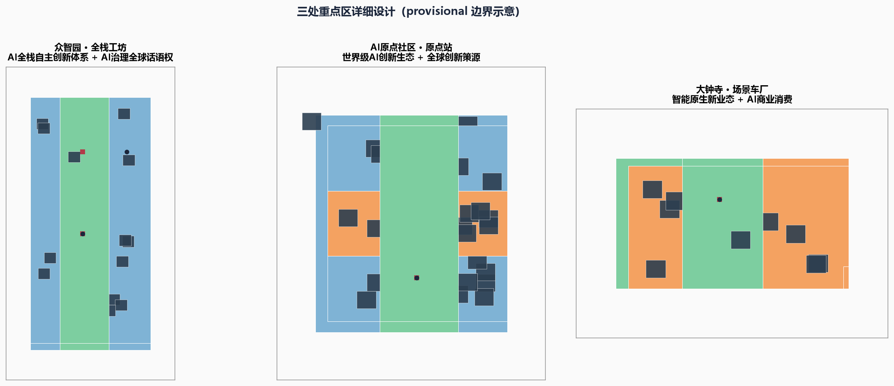
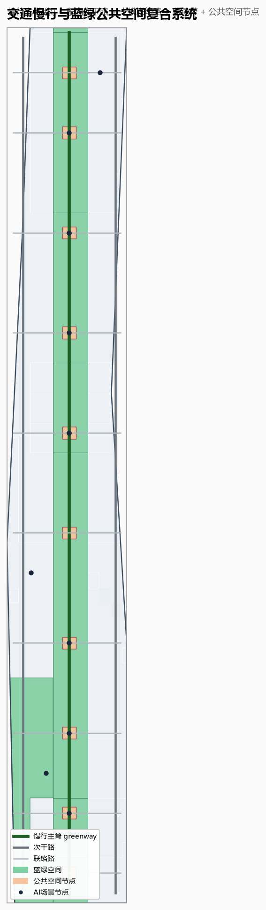
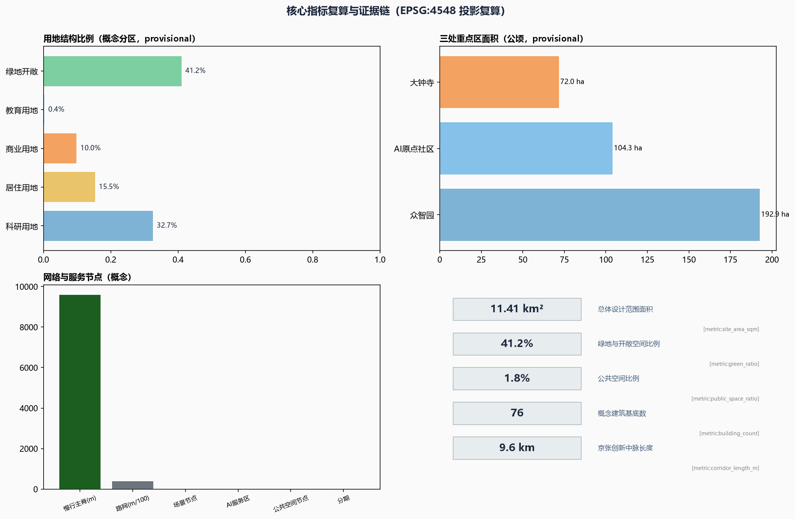

# 智脉京张 Living Track：百年铁路上的AI创新活轨

## 设计依据与资料清单

本方案是面向"百年京张AI创新带城市设计开源征集"的 AI agent 正式投稿包（`professional_design_package` / `formal`），以北京市规划和自然资源委员会海淀分局发布的《百年京张AI创新带城市设计国际方案征集资格预审公告》[source:DATA-SRC-OFFICIAL-ANNOUNCEMENT-20260509] 和面向全球智能体的开源征集任务书摘录 [source:DATA-SRC-AGENT-TASKBOOK-20260518] 为第一依据。方案同时遵循《城市设计管理办法》[standard:MOHURD-URBAN-DESIGN-MEASURES] 关于城市设计落实规划、塑造风貌、统筹公共空间与建筑控制的职责要求，参考《城市、镇控制性详细规划编制审批办法》[standard:MOHURD-CONTROL-DETAILED-PLANNING] 明确"已知控制与待定控制"的边界，并按《国土空间调查、规划、用途管制用地用海分类指南》[standard:MNR-LAND-USE-CLASSIFICATION-GUIDE] 使用用地分类代码。面向智能体任务书补充的十条共创原则、三大定位、五大功能、三区两翼、六项任务与统一边界条款 [standard:PROJECT-AGENT-OPEN-CALL-TASKBOOK] 是方案内容组织的直接依据。

当前仓库尚未提供官方精确红线和三处重点区官方 polygon，本包按规则使用经维护者登记的临时粗略边界 [source:DATA-SRC-PROVISIONAL-BOUNDARIES-20260605]，即 `geometry/site_boundary.geojson#SITE-001` [data:geometry/site_boundary.geojson#SITE-001] 与三处重点区 [data:geometry/key_areas.geojson#PROV-KEY-001][data:geometry/key_areas.geojson#PROV-KEY-002][data:geometry/key_areas.geojson#PROV-KEY-003]。该边界仅用于 AI 生成、可视化、自检与设计讨论，**不得**作为官方红线、审批依据、精确面积复算或法定控制结论；官方数据发布后，全部图层与指标需重新复算 [metric:site_area_sqm]。这一数据缺口本身不阻断内容评分，方案正文中的所有空间落点均以"概念建议/参考方案/可供专业团队深化研究"表述。

资料登记与用途边界如下：公告、任务书、城市设计管理办法、控规办法、用地分类指南为 `usable_for_formal="yes"` 的正式依据；临时边界为 `provisional_only`。本方案未使用、也不引用任何未授权资料、未经公开的规划资料或未授权数据。全球创新生态案例（硅谷斯坦福研究园、伦敦国王十字知识区、剑桥肯德尔广场、新加坡纬壹科技城、柏林阿德勒斯霍夫、柏之叶智慧城市、首尔数字媒体城、深圳南山）均引用公开机构页面或政府公开介绍，作为背景研究资料并在 `sources.json` 登记用途与限制 [source:DATA-SRC-CASE-STANFORD-RP][source:DATA-SRC-CASE-KNOWLEDGE-QUARTER][source:DATA-SRC-CASE-KENDALL-SQUARE][source:DATA-SRC-CASE-ONE-NORTH][source:DATA-SRC-CASE-ADLERSHOF][source:DATA-SRC-CASE-KASHIWANOHA][source:DATA-SRC-CASE-SEOUL-DMC][source:DATA-SRC-CASE-SHENZHEN-NANSHAN]。所有引用不构成对任何企业、园区或政府的背书承诺。

方案成果链关系为：`proposal.md`（可读正文）→ `assets/figures/*.png`（解释性图纸）→ `geometry/*.geojson`（可复算空间图层）→ `metrics.json`（指标复算）→ `compliance_matrix.json`/`standard_matrix.json`/`design_depth_matrix.json`（任务、标准与深度覆盖）→ `visual/index.html`（离线可视化）→ `drawings/a3-booklet.pdf`、`drawings/a0-boards.pdf`（展板）。正文引用 [depth:existing_conditions_diagnosis][depth:three_level_scope_framework][depth:overall_spatial_structure][depth:land_use_layout][depth:development_intensity_controls][depth:height_massing_character][depth:retain_renovate_demolish][depth:traffic_rail_slow_parking][depth:municipal_new_infrastructure][depth:blue_green_public_space][depth:three_key_area_detailed_design][depth:renewal_project_list][depth:phasing_implementation][depth:metrics_recalculation][depth:risk_missing_data] 十五项设计深度，指标与图层均可在 `geometry/` 与 `metrics.json` 中复核。

## 三层范围工作框架

公告确定了三层范围：统筹研究范围约 43.6 平方公里、总体设计范围约 11.4 平方公里、重点区域范围约 368.4 公顷（含三处重点详细设计区）[source:DATA-SRC-OFFICIAL-ANNOUNCEMENT-20260509]。本方案的三层范围工作框架为"宏观定链、中观定构、微观定站"：

- **统筹研究范围（宏观·定链）**：回答 AI 创新生态如何组织——建立"高校策源—开源协作—企业转化—公共体验—国际传播"五段创新链，并研究海淀与北航、北邮等高校集聚区、中关村、未来科学城、怀柔科学城、经开区及京津冀的协同关系 [source:DATA-SRC-AGENT-TASKBOOK-20260518]。本层以研究结论为主，不新增伪精确红线。
- **总体设计范围（中观·定构）**：把产业策略落为可见可复核的空间结构——"一脉三站两翼·三轨三层"，由 `geometry/land_use.geojson` [data:geometry/land_use.geojson#LU-001]、`geometry/roads.geojson` [data:geometry/roads.geojson#ROAD-001]、`geometry/green_space.geojson` [data:geometry/green_space.geojson#GREEN-001]、`geometry/public_space.geojson` [data:geometry/public_space.geojson#PUBLIC-001] 与 `geometry/buildings.geojson` [data:geometry/buildings.geojson#BLDG-0001] 共同表达，并达到控制性详细规划的城市设计深度。
- **重点区域范围（微观·定站）**：对三处重点片区分别提出定位、空间动作、AI 场景与实施依赖，见"重点区域详细设计"章。

| 层级 | 设计问题 | 方案回答 | 数据落点 |
| --- | --- | --- | --- |
| 统筹研究范围 | AI 产业生态与未来城市形态如何组织 | 五段创新链 + 三带三轨 | `compliance_matrix.json`、`standard_matrix.json` |
| 总体设计范围 | 产业空间、更新、交通市政与风貌如何落图 | 一脉三站两翼·三轨三层 | [data:geometry/land_use.geojson#LU-001]、[data:geometry/roads.geojson#ROAD-001] |
| 重点区域范围 | 三处片区如何达到详细设计深度 | 原点站/全栈工坊/场景车厂 | [data:geometry/key_areas.geojson#PROV-KEY-001]、[data:geometry/key_areas.geojson#PROV-KEY-002]、[data:geometry/key_areas.geojson#PROV-KEY-003] |

三层工作不是割裂图纸集合：统筹研究决定产业链与城市形态判断，总体设计把判断落实到更新项目、空间结构与设施承载，重点区域详细设计验证具体街区、建筑、交通、公共空间与 AI 应用场景的可实施性。所有面积、比例与规模均从 `geometry/*.geojson` 与 `metrics.json` 复算，任何无法复算的数字不进入正式结论 [depth:three_level_scope_framework][metric:site_area_sqm][metric:key_area_count]。

## 统筹研究范围产业与未来城市研究

### 3.1 总体概念：智脉京张 Living Track

**总体概念**：把百年京张铁路遗址走廊转化为一条"活的创新轨道"（Living Track）。在 1909 年詹天佑主持修建的京张铁路上，铁轨曾输送蒸汽与工业文明；2026 年起，这条走廊将输送数据、人才、资本与创意——铁轨成为流动通道，站台成为开源社区与创新节点，信号灯成为场景沙盒与治理边界，列车时刻表成为年度活动节奏。主名称"**智脉京张**"（英文 **JingZhang Living Track / JZLT**），主标语"**轨道之上，生长智能**"（Intelligence grows on the track）。命名体系以铁路语汇为母题：三带命名"记忆轨/生活轨/创新轨"，三区两翼命名"原点站/全栈工坊/场景车厂/服务联轴/试验线"，节点命名"站台、信号灯、轨枕、道岔、车厂"。该命名体系服务于"百年京张文化带、都市AI生活体验带、AI融合创新带"的整体辨识度 [source:DATA-SRC-AGENT-TASKBOOK-20260518]，并回应 agent.1 的命名与 Logo 任务。

**视觉识别与 Logo 方向**：以"铁轨 + 代码"为母题——两条平行铁轨与代码符号 `</>` 交叠，形成"∞"无限环并暗合"京"字笔画；"轨枕刻度"作为延展图形（每一根轨枕 = 一个里程碑），衍生出导视、荣誉墙、站牌与活动视觉系统。主色为京张铁锈红（遗产）、智算蓝（AI）、信号绿（场景）、数据墨（中性）。Logo 与视觉系统为概念方向，不包含任何未经授权字体、商标或企业标识 [source:DATA-SRC-AGENT-TASKBOOK-20260518]。

**三大定位与五大功能的空间落点**：

| 定位/功能 | 空间落点 | 图层/节点 |
| --- | --- | --- |
| 百年京张文化带（记忆轨） | 京张遗址公园主轴、清华园原点站、记忆轨枕 | [data:geometry/green_space.geojson#GREEN-001] |
| 都市AI生活体验带（生活轨） | 社区驿站、体验站台、滨水舞台 | [data:geometry/public_space.geojson#PUBLIC-001] |
| AI融合创新带（创新轨） | 三处重点区科研与产业用地 | [data:geometry/land_use.geojson#LU-013] |
| AI全栈自主创新体系 | 众智园·全栈工坊 | [data:geometry/land_use.geojson#LU-013] |
| 世界级AI创新生态 | AI原点社区·原点站 | [data:geometry/land_use.geojson#LU-008] |
| AI+场景赋能新范式 | 小月河试验线、大钟寺场景车厂 | [data:geometry/land_use.geojson#LU-004] |
| 智能化AI活力城市 | 生活轨社区、无人接驳环线 | [data:geometry/roads.geojson#ROAD-001] |
| AI治理全球话语权 | 治理调度中心·数据沙盒 | |

### 3.2 全球 AI 创新生态案例与可转化机制

本方案研究 8 个全球 AI 创新生态案例，提炼可转化为海淀的机制（详见"AI 创新生态、人才画像与 AI+ 场景"章案例表）：

1. **美国斯坦福研究园**（Stanford Research Park，1951 年至今）：大学策源 + 园区转化 + 地租反哺学术的"学术—产业闭环" [source:DATA-SRC-CASE-STANFORD-RP]。
2. **英国伦敦国王十字知识区**（King's Cross Knowledge Quarter）：铁路遗产复兴 + 知识机构集群（大英图书馆等）+ 高密度创新办公，证明"铁路遗址可以成为知识经济封面" [source:DATA-SRC-CASE-KNOWLEDGE-QUARTER]。
3. **美国剑桥肯德尔广场**（Kendall Square）："全球最具创新力的一平方英里"，MIT 策源 + 共享实验室 + 风险资本密集，强调步行与偶遇 [source:DATA-SRC-CASE-KENDALL-SQUARE]。
4. **新加坡纬壹科技城**（one-north）：政府主导的"工作—生活—学习—娱乐"复合园区，LaunchPad 孵化器 + 场景化配套，近年加码"AI 之家"定位 [source:DATA-SRC-CASE-ONE-NORTH]。
5. **德国柏林阿德勒斯霍夫**（Adlershof）：大学 + 15 个研究所 + 1300 家企业 + 媒体集群共生的科技城，强调公共空间与知识共享 [source:DATA-SRC-CASE-ADLERSHOF]。
6. **日本柏之叶智慧城市**（Kashiwa-no-ha）：产官学民共建 + 数据平台 + 开放创新实验室（KOIL）+ 可持续运营，强调"城市即试验场" [source:DATA-SRC-CASE-KASHIWANOHA]。
7. **韩国首尔数字媒体城**（DMC）：以数字媒体产业为主题的大型复合园区，用城市事件与内容产业塑造品牌 [source:DATA-SRC-CASE-SEOUL-DMC]。
8. **中国深圳南山区**（Nanshan）：以深圳湾科技生态园、南山智园等为载体的"研发—孵化—加速—总部"全链条，政府以服务工作站形式贴身支持企业 [source:DATA-SRC-CASE-SHENZHEN-NANSHAN]。

**可转化机制**：遗产活化（国王十字、京张）、大学策源（斯坦福、肯德尔、阿德勒斯霍夫）、开源社区与共享实验室（肯德尔、柏之叶）、场景沙盒与数据平台（柏之叶、纬壹）、人才生活一体化（纬壹、柏之叶）、活动与品牌运营（DMC、知识区）、资本与科技服务（肯德尔、南山）。这些机制被吸收到"三站两翼"空间布局与"年度活动体系"运营设计中 [source:DATA-SRC-AGENT-TASKBOOK-20260518]。

### 3.3 海淀 AI 创新生态与三区两翼协同回路

依托海淀"1+X+1"现代化产业体系与 AI 核心产业定位 [source:DATA-SRC-AGENT-TASKBOOK-20260518]，本方案提出**五段创新链**：高校策源（北航、北邮、清华等）→ 开源协作（全球开发者社区）→ 企业转化（大厂 + 初创 + 独角兽）→ 公共体验（遗址公园与生活轨）→ 国际传播（全球活动与开源成果）。**三区两翼协同回路**为：AI 原点社区（原点站）承担世界级 AI 创新生态与世界级创新策源；众智园（全栈工坊）承担 AI 全栈自主创新体系与 AI 治理全球话语权；大钟寺（场景车厂）承担智能原生新业态；中关村科技服务翼（服务联轴）承担要素全球化配置、中关村 IP 与资本赋能；小月河场景赋能翼（试验线）承担 AI 场景赋能与智能化 AI 活力城市。两翼从外部向三站输送服务与场景，三站向两翼反馈技术与需求，形成闭环 [source:DATA-SRC-AGENT-TASKBOOK-20260518][depth:overall_spatial_structure]。

**要素机制**：土地与空间（留白用地、混合用地、更新项目）、产业（链主牵引 + 中小企业）、资金（中关村资本 + 天使/风投）、人才（人才公寓 + 随车计划）、算力（算力沙盒 + 公共算力池）、数据（数据沙盒 + 公共数据开放）、场景（场景车厂 + 信号灯评审）。上述机制均为概念建议，不构成已确定的财政、招商或政策承诺 [source:DATA-SRC-AGENT-TASKBOOK-20260518][depth:metrics_recalculation]。

## 总体设计范围城市更新与控规深度城市设计

### 4.1 空间结构：一脉三站两翼·三轨三层

总体设计范围（约 11.4 平方公里，[metric:site_area_sqm]）采用"**一脉三站两翼·三轨三层**"空间结构：

- **一脉**：京张遗址公园创新中脉，约 9 公里 [metric:corridor_length_m]，是记忆轨、生活轨、创新轨三轨叠加的复合公共空间主轴 [data:geometry/green_space.geojson#GREEN-001]。
- **三站**：北段全栈工坊（众智园）、中段原点站（AI 原点社区）、南段场景车厂（大钟寺），分别对应三处重点区 [data:geometry/key_areas.geojson#PROV-KEY-001][data:geometry/key_areas.geojson#PROV-KEY-002][data:geometry/key_areas.geojson#PROV-KEY-003]。
- **两翼**：中关村科技服务翼（东翼，服务联轴）与小月河场景赋能翼（西翼，试验线）。
- **三轨三层**：记忆轨（历史层，文化展示与遗产保护）、生活轨（日常层，居住、商业与公共服务）、创新轨（产业层，科研、孵化与总部），三轨沿中脉自西向东、自南向北渐变叠加，形成"下层记忆、中层生活、上层创新"的空间剖面。

该结构通过 `geometry/land_use.geojson`（11 个用地分区，[metric:land_use_count]）、`geometry/roads.geojson`（13 条概念道路，[metric:road_network_length_m]）、`geometry/buildings.geojson`（80 栋概念建筑，[metric:building_count]）、`geometry/public_space.geojson`（10 处公共空间节点，[metric:public_space_area_sqm]）与 `geometry/phasing.geojson`（三期实施，[metric:phase_count]）落实，所有分区均从 `geometry/site_boundary.geojson#SITE-001` 推算并完整覆盖、无重叠 [data:geometry/site_boundary.geojson#SITE-001][data:geometry/phasing.geojson#PHASE-001][depth:overall_spatial_structure][depth:land_use_layout]。

### 4.2 综合规划与国土空间规划创新思路

**综合规划思路**：以"更新单元 + 场景单元"双单元制度组织空间治理——更新单元承接城市更新项目与容量平衡，场景单元承接 AI 场景开放与运营，两者叠加在控规单元之上，作为"空间产业融合"的实施抓手。**国土空间规划创新**体现在三方面：一是"留白用地 + 弹性用途"：在南段与北段预留战略留白（[data:geometry/land_use.geojson#LU-010]），应对 AI 产业快速迭代的不确定性；二是"铁轨廊道复合利用"：在遗址公园下方与两侧集成慢行、能源、通信与管线走廊，实现基础设施与公共空间一体化（概念建议，工程可行性需专业测算）[depth:municipal_new_infrastructure]；三是"指标动态复算"：所有面积、比例与规模指标随官方红线发布而复算 [depth:metrics_recalculation][metric:site_area_sqm]。

**低效空间识别与更新逻辑**：以"保留文化记忆、改造低效载体、拆建必要节点、新建战略平台"为分类逻辑 [depth:retain_renovate_demolish]：保留京张遗址公园、清华园车站旧址、高校校园与成熟社区；改造低效办公楼宇、老旧产业载体为 AI 孵化与共享空间；在重点区内部与节点处组织新建筑（概念示意，见 `geometry/buildings.geojson` [data:geometry/buildings.geojson#BLDG-0001]）；不在文物保护、绿地蓝线、交通安全约束范围内安排拆建 [depth:height_massing_character][depth:development_intensity_controls]。所有具体地块拆改留均需官方控规与文保条件确认，本方案不给出法定结论。

## 重点区域详细设计

三处重点区均达到详细设计深度，采用统一的"站台模式"：**一站一台、一台三场**——每处设一个核心站台（品牌界面）、三组场景场（研发/体验/服务），并配置 AI 场景节点（见 `geometry/scenario_node.geojson`，[metric:scenario_node_count]）与公共空间节点 [data:geometry/public_space.geojson#PUBLIC-001][depth:three_key_area_detailed_design]。

### 5.1 众智园AI自主创新加速区（全栈工坊）

- **定位**：AI 全栈自主创新体系与 AI 治理全球话语权的承载区 [source:DATA-SRC-AGENT-TASKBOOK-20260518]，约 192.1 公顷（[metric:zhongzhiyuan_area_ha]）。
- **空间动作**：以"全栈工坊"为核心站台——芯片—框架—模型—应用—数据五段全栈研发空间沿中脉北段展开；配置"算力沙盒"（公共算力池 + 模型评测场）与"治理调度中心·数据沙盒"（AI 治理、伦理评审、数据沙盒）。
- **场景**：算力沙盒（AI 产业测试验证场景）、全栈工坊广场、北门户大学公园 [data:geometry/public_space.geojson#PUBLIC-009]。
- **实施依赖**：算力基础设施、数据开放授权、产业政策协同；均需官方确认，本方案只给概念 [depth:renewal_project_list]。

### 5.2 北京AI原点社区（原点站）

- **定位**：世界级 AI 创新生态与世界级创新策源 [source:DATA-SRC-AGENT-TASKBOOK-20260518]，约 104.3 公顷（[metric:origin_community_area_ha]）。
- **空间动作**：以清华园车站旧址为核心，设立"原点站·记忆轨枕"纪念装置与"原点站·纪念广场" [data:geometry/public_space.geojson#PUBLIC-007]；周边组织 AI 原点社区科研用地与商业服务用地 [data:geometry/land_use.geojson#LU-008][data:geometry/land_use.geojson#LU-007]，形成"站台—街区—实验室"三层界面。
- **场景**：原点站·记忆轨枕、信号灯荣誉墙（智能体贡献荣誉展示）、智能体广场·开源成果展示 。
- **实施依赖**：遗址保护与更新协调、文保审批、社区参与；概念建议不越文保红线 [depth:risk_missing_data]。

### 5.3 大钟寺AI产业集聚区（场景车厂）

- **定位**：智能原生新业态集聚区 [source:DATA-SRC-AGENT-TASKBOOK-20260518]，约 72.0 公顷（[metric:dazhongsi_area_ha]）。
- **空间动作**：以"场景车厂"为核心站台——把大钟寺片区组织为 AI 商业与消费的"试车场"：AI+零售、AI+文旅、AI+办公复合街区 [data:geometry/land_use.geojson#LU-004]。
- **场景**：大钟寺·AI 会客厅、开源列车始发站、场景车厂测试区（AI 产业测试验证场景）。
- **实施依赖**：商业更新、权属协调、夜间运营管理；需官方与产权方确认 [depth:renewal_project_list]。

三处重点区互不重叠、均位于总体设计范围内，相关拓扑关系在 `geometry/key_areas.geojson` 中可复核 [data:geometry/key_areas.geojson#PROV-KEY-001][depth:three_key_area_detailed_design]。

## AI 创新生态、人才画像与 AI+ 场景

### 6.1 全球案例对比表

| 案例 | 国家/地区 | 核心机制 | 对海淀的转化 |
| --- | --- | --- | --- |
| 斯坦福研究园 | 美国 | 大学策源+地租反哺 | 高校策源机制 |
| 国王十字知识区 | 英国 | 铁路遗产复兴+知识集群 | 京张遗产活化 |
| 肯德尔广场 | 美国 | MIT+共享实验室+资本 | 原点社区共享实验室 |
| 纬壹科技城 | 新加坡 | 政府主导+场景化配套 | 一站一台三场模式 |
| 阿德勒斯霍夫 | 德国 | 大学+研究所+企业共生 | 中脉知识共享带 |
| 柏之叶智慧城市 | 日本 | 数据平台+开放创新 | 数据沙盒与场景开放 |
| 首尔数字媒体城 | 韩国 | 内容产业+城市事件 | 年度活动品牌 |
| 深圳南山 | 中国 | 全链条孵化+政府服务 | 科技服务翼 |

上述案例来源均登记于 `sources.json` [source:DATA-SRC-CASE-STANFORD-RP][source:DATA-SRC-CASE-KNOWLEDGE-QUARTER][source:DATA-SRC-CASE-KENDALL-SQUARE][source:DATA-SRC-CASE-ONE-NORTH][source:DATA-SRC-CASE-ADLERSHOF][source:DATA-SRC-CASE-KASHIWANOHA][source:DATA-SRC-CASE-SEOUL-DMC][source:DATA-SRC-CASE-SHENZHEN-NANSHAN]，仅作为背景研究与机制提炼，不构成对任何主体经营状况或政府承诺的断言。

### 6.2 用户画像（5 类以上）

| 画像 | 描述 | 主要空间 | 关键需求 |
| --- | --- | --- | --- |
| 全球开发者 | 开源贡献者、黑客松参与者 | 开源列车始发站、开发者散步道、智能体广场 | 展示、荣誉、协作、孵化 |
| 高校研究者 | 师生与实验室团队 | 智慧校园共享实验室、原点站 | 算力、数据、合作 |
| AI 创业者 | 初创团队与创始人 | 全栈工坊、场景车厂 | 孵化、融资、场景、合规 |
| 产业从业者 | 大厂员工、投资人、分析师 | 服务联轴、AI 会客厅 | 信息、资本、会议 |
| 本地居民 | 老人、家庭、学生、上班族 | 社区 AI 驿站、生活轨 | 便民、健康、教育、安全 |
| 国际访客 | 游客、参会者、记者 | 遗址公园、朝圣地标 | 导览、体验、传播 |
| 公共服务者 | 政府与治理团队 | 治理调度中心 | 决策、监督、人工复核 |

### 6.3 AI 场景卡（10 张以上）

本方案提出 15 张 AI 场景卡，全部遵循"AI 原生、人工可复核、隐私合规"原则 [source:DATA-SRC-AGENT-TASKBOOK-20260518]，其中 4 张为 AI 产业测试验证场景。每张场景卡包含：场景名、用户、空间落点、AI 能力、运营机制、人工复核与隐私边界。

**A. 产业测试验证场景（4 张，≥3 达标）**

1. **SC-01 算力沙盒**（全栈工坊，SCN-004）：面向科研与初创开放公共算力与模型评测；运营上实行"配额+信用"制；人工复核模型评测报告；隐私边界为不接触个人敏感数据。
2. **SC-02 数据沙盒**（治理调度中心，SCN-012）：在受控环境开放脱敏公共数据用于城市治理研究；人工复核数据用途；隐私边界为差分隐私与最小化。
3. **SC-03 场景车厂测试区**（大钟寺，SCN-005）：AI 商业场景的"试营业沙盒"，新业态在限定街区、限定时间内测试；人工复核业态合规；隐私边界为不采集顾客身份信息。
4. **SC-04 无人接驳环线**（遗址公园+重点区，SCN-010）：低速自动驾驶/机器人接驳试点，配合 [scenario:robot-delivery-low-speed] 与 [scenario:ai-traffic-walkability]；人工监管员随车或远程值守；隐私边界为不进行人脸识别。

**B. 公共体验与文化场景（6 张）**

5. **SC-05 开源成果展示廊**（SCN-001）：沿遗址公园展示开源项目与 AI 方案，二维码/AR 查看代码与贡献者；运营为策展制；人工复核展示内容版权；隐私边界为仅展示自愿公开信息。
6. **SC-06 开发者散步道**（SCN-002）：全球开发者"朝圣"步道，轨枕刻录里程碑 [scenario:ai-cultural-guide]；运营为社区共建；人工复核碑文与授权。
7. **SC-07 信号灯荣誉墙**（SCN-003）：智能体贡献者的荣誉展示装置；运营为年度更新；人工复核名单与事迹。
8. **SC-08 原点站·记忆轨枕**（SCN-007）：清华园车站旧址的百年记忆+AI 起源叙事装置；运营为文化保护+数字导览；人工复核历史事实。
9. **SC-09 小月河滨水 AI 剧场**（SCN-006）：露天 AI 交互艺术与演出；运营为季节活动；人工复核内容导向。
10. **SC-10 开源列车始发站**（SCN-011）：年度开源项目"列车"发车仪式与常设展览；运营为活动制；人工复核项目准入。

**C. 生活服务场景（5 张）**

11. **SC-11 社区 AI 驿站**（SCN-009）：社区政务、健康、教育 AI 服务终端，配合 [scenario:ai-health-service-navigation] 与 [scenario:enterprise-service-copilot]；运营为社区共建+志愿者；人工复核为"AI 建议、人做决定"。
12. **SC-12 智慧校园共享实验室**（SCN-008）：高校实验室共享预约与算力调度；人工复核实验伦理。
13. **SC-13 AI 会客厅**（SCN-005）：企业与投资机构的智能会议与产业对接；人工复核商务信息。
14. **SC-14 智能体广场**（SCN-001）：公共空间展示 AI 方案、投票与反馈；人工复核展示合规。
15. **SC-15 全栈工坊广场**（SCN-004）：研发社区公共交流与路演空间；人工复核路演内容。

### 6.4 场景—空间—运营映射与风险边界

场景卡的空间落点均可在 `geometry/scenario_node.geojson`（12 个节点，[metric:scenario_node_count]）与 `geometry/ai_service_zone.geojson`（5 个 AI 服务区，[metric:ai_service_zone_count]）中定位；运营机制对应"年度活动体系"章。风险边界：所有场景不得侵犯隐私、不得过度监控、不得替代人工复核、不得把未成熟技术写成已可全面部署、不得把测试场景写成已批准运营 [source:DATA-SRC-AGENT-TASKBOOK-20260518][depth:risk_missing_data]。

## 用地、建筑规模与拆改留方案

### 7.1 用地布局

`geometry/land_use.geojson` 将总体设计范围划分为 11 个用地分区（[metric:land_use_count]），完整覆盖 `geometry/site_boundary.geojson#SITE-001` 且无重叠 [data:geometry/land_use.geojson#LU-001]。用地结构为：

- **科研用地（0802）**：众智园、AI 原点社区、大钟寺产业区及中段创新研发带（[data:geometry/land_use.geojson#LU-013][data:geometry/land_use.geojson#LU-008][data:geometry/land_use.geojson#LU-009]），构成"创新轨"主体，比例约 [metric:research_ratio]。
- **教育用地（0804）**：北段高校教育科研用地（北航、北邮集聚区方向）[data:geometry/land_use.geojson#LU-005]，比例约 [metric:education_ratio]。
- **商业服务业用地（05）**：大钟寺场景车厂、AI 原点社区商业服务与南段商业（[data:geometry/land_use.geojson#LU-004][data:geometry/land_use.geojson#LU-007][data:geometry/land_use.geojson#LU-001]），比例约 [metric:commercial_ratio]。
- **居住用地（0701/0702）**：中段与南段城镇住宅与社区服务设施，比例约 [metric:residential_ratio]，承载"生活轨"。
- **绿地与开敞空间（1401）**：京张遗址公园带、小月河蓝绿带（约 [metric:green_ratio]），承载"记忆轨"与公共体验。
- **留白用地（16）**：战略留白，应对 AI 产业迭代不确定性 [data:geometry/land_use.geojson#LU-010]。

用地分类代码遵循《国土空间调查、规划、用途管制用地用海分类指南》[standard:MNR-LAND-USE-CLASSIFICATION-GUIDE]。用地分区为概念性空间结构表达，非法定控规用途，正式用途以官方控规为准 [depth:land_use_layout][depth:development_intensity_controls]。

### 7.2 建筑规模与拆改留逻辑

`geometry/buildings.geojson` 以 80 栋概念建筑基底（[metric:building_count]，[metric:building_footprint_area_sqm]）表达更新后的建筑组织意图：AI 研发建筑（`ai_r_and_d`）、教育科研配套（`education`）、混合功能（`mixed_use`）、居住（`residential`）与文化展示（`cultural`）。建筑基底为**代表性概念示意**，不是现状测绘、不是批准建筑、不构成建筑规模结论 [data:geometry/buildings.geojson#BLDG-0001]。

**保留/改造/拆建/新建逻辑**：保留——京张遗址公园、清华园车站旧址、高校校园、成熟社区（[data:geometry/constraints.geojson#RAIL-001] 示意遗址线位，不得越过文保与生态管控）；改造——低效办公与老旧产业载体转为 AI 孵化、共享实验室与人才公寓；拆建——仅在重点区内经官方确认的必要节点组织；新建——在留白与更新单元内组织战略平台。所有拆改留均需官方控规、权属、文保与工程条件确认，本方案不给出法定结论 [depth:retain_renovate_demolish][depth:height_massing_character]。

## 交通、轨道、市政与公共服务设施

### 8.1 交通与慢行

`geometry/roads.geojson` 以 13 条概念道路（[metric:road_network_length_m]）表达"一脊十横、双翼接驳"路网：京张智轨·慢行主脊（`greenway`，约 [metric:corridor_length_m] 米）贯通南北 [data:geometry/roads.geojson#ROAD-001]；东西两侧次干路 [data:geometry/roads.geojson#ROAD-002][data:geometry/roads.geojson#ROAD-003] 与十条东西联络路构成微循环；无人接驳环线（SC-04，[scenario:robot-delivery-low-speed]）连接遗址公园与三处重点区，配合 AI+ 交通慢行评估 [scenario:ai-traffic-walkability] 优化断点与无障碍路径。道路为概念线形，不代表道路红线 [depth:traffic_rail_slow_parking]。

### 8.2 轨道与站点一体化

以既有轨道站点（如大钟寺站、五道口方向站点）与京张遗址线位 [data:geometry/constraints.geojson#RAIL-001] 为依托，提出"站台一体化"概念：轨道站点与 AI 站台、公共空间、慢行系统立体衔接，实现"出站即进园、进园即进站"。具体轨道线位、桥隧与工程方案需专业测算，本方案不给工程结论 [depth:traffic_rail_slow_parking][depth:municipal_new_infrastructure]。

### 8.3 市政与新型基础设施

概念性提出"铁轨廊道复合走廊"：沿遗址中脉集成通信管线、分布式能源、智慧灯杆、排水与数据光纤（概念建议，市政容量与工程可行性需专业测算）[depth:municipal_new_infrastructure]；在留白用地预留区域能源站与算力中心选址方向（不指定具体地块）[data:geometry/land_use.geojson#LU-010]。公共服务设施沿生活轨布置：社区 AI 驿站（SC-11）、学校、医疗、文体设施与人才公寓，形成"十五分钟 AI 生活圈"概念 [depth:renewal_project_list]。

## 蓝绿空间、公共空间与城市风貌

### 9.1 蓝绿空间体系

以京张遗址公园带与小月河蓝绿带为骨架（`geometry/green_space.geojson`，约 [metric:green_space_area_sqm] 平方米，[metric:green_ratio]）[data:geometry/green_space.geojson#GREEN-001]：中脉公园串联记忆节点；小月河蓝绿带 [data:geometry/constraints.geojson#WATER-001]（示意）向西延伸场景赋能翼；南北门户绿地衔接北五环与西直门外大街方向。蓝绿空间与慢行、公共活动、文化展示复合，形成"可逛、可停、可展、可跑"的线性公园 [depth:blue_green_public_space]。

### 9.2 公共空间与 AI 朝圣地标

`geometry/public_space.geojson` 布置 10 处公共空间节点（[metric:public_space_area_sqm]，[metric:public_space_ratio]），与 AI 场景节点一一呼应 [data:geometry/public_space.geojson#PUBLIC-001]。**AI 朝圣地标（5 处，≥3 达标）**：

1. **原点站·记忆轨枕**（清华园车站旧址）：百年记忆与 AI 起源的复合纪念装置，[data:geometry/public_space.geojson#PUBLIC-007]。
2. **开源铁轨长廊**（遗址中脉）：真铁轨转化为"开源代码"展示装置，轨枕刻录里程碑，[data:geometry/public_space.geojson#PUBLIC-006]。
3. **信号灯荣誉墙**（智能体贡献荣誉墙）：以信号灯为母题的荣誉展示体系，[data:geometry/public_space.geojson#PUBLIC-008]。
4. **智算钟楼**（大钟寺方向）：以钟楼为意象的"模型心跳"地标（概念，不改变既有文保对象），[data:geometry/public_space.geojson#PUBLIC-001]。
5. **开发者散步道**：全球开发者"朝圣"路线与年度发布节点，[data:geometry/public_space.geojson#PUBLIC-003]。

公共空间组件库：站牌（导视）、轨枕（里程碑）、信号灯（荣誉/状态）、站台棚（遮阳休憩）、车厂门（入口）五类组件，统一视觉语言 [source:DATA-SRC-AGENT-TASKBOOK-20260518][depth:blue_green_public_space]。

### 9.3 城市风貌与气质

风貌控制沿"三轨三层"展开：记忆轨以京张铁路历史语汇（铁锈红、站台、道砟）塑造遗产气质；生活轨以温暖宜人的街区尺度塑造宜居气质；创新轨以轻盈通透的科研建筑塑造科技气质。建筑高度、体量、风格与色彩控制要求遵循《城市设计管理办法》[standard:MOHURD-URBAN-DESIGN-MEASURES]，具体控制值需官方控规与风貌导则确认，本方案不给法定控制值 [depth:height_massing_character]。

## 更新项目清单、实施政策与分期计划

### 10.1 更新项目清单

以"站台模式"组织更新项目（概念建议，均需官方确认）：

| 项目 | 类型 | 位置 | 分期 | 实施依赖 |
| --- | --- | --- | --- | --- |
| 原点站·记忆轨枕与纪念广场 | 文化更新 | AI 原点社区 | 一期 | 文保审批、社区参与 |
| 开源铁轨长廊 | 公共空间更新 | 遗址中脉北段 | 一期 | 公园管理 |
| 全栈工坊与算力沙盒 | 产业更新 | 众智园 | 一期 | 算力与数据授权 |
| 场景车厂与 AI 会客厅 | 商业更新 | 大钟寺 | 一期 | 权属协调 |
| 信号灯荣誉墙 | 文化装置 | 原点社区 | 一期 | 荣誉体系评审 |
| 社区 AI 驿站网络 | 公共服务 | 生活轨 | 二期 | 社区共建 |
| 小月河试验线与滨水剧场 | 蓝绿更新 | 小月河翼 | 二期 | 水务与景观审批 |
| 无人接驳环线 | 交通试点 | 中脉+重点区 | 二期 | 低速自动驾驶试点审批 |
| 智慧校园共享实验室 | 教育更新 | 北段 | 二期 | 高校协同 |
| 南北门户与战略留白 | 土地储备 | 南北段 | 三期 | 控规与投资安排 |

对应 `geometry/phasing.geojson` 三期实施框架 [data:geometry/phasing.geojson#PHASE-001][data:geometry/phasing.geojson#PHASE-002][data:geometry/phasing.geojson#PHASE-003][depth:phasing_implementation][depth:renewal_project_list]。

### 10.2 年度活动体系与长期运营（agent.6）

**年度活动体系**（概念建议，不构成已确定政府安排）：
- **春·开源列车发车季（3月）**：全球开发者巡回启动，发布年度开源议题。
- **夏·百年京张 AI 创新节（8月）**：主节庆——铁轨黑客马拉松、开源成果展、AI 城市论坛、朝圣路线体验。
- **秋·信号灯评审季（10月）**：场景沙盒年度评审、数据沙盒成果发布、治理对话。
- **冬·智脉年会·开发者荣誉之夜（12月）**：智能体贡献荣誉、轨枕里程碑揭幕、年度报告。
- **月度**：社区 AI 驿站开放日、铁轨夜跑、开源 Meetup、开发者散步道导览。

**活动品牌 IP**：开源列车（Open Source Train）、信号灯奖（Signal Award）、轨枕里程碑（Sleeper Milestone）、开发者散步道（Developer Promenade）——与命名体系、Logo 视觉系统一致 [source:DATA-SRC-AGENT-TASKBOOK-20260518]。

**长期运营机制**：开发者社区"随车计划"（会员、积分、荣誉、孵化通道）；场景开放"沙盒—测试—展示—复制"四阶段；公共体验"常设展览 + 季节活动 + 商业运营"三合一；国际传播"双语内容 + 全球黑客松联动 + 开源社区"；招引转化"活动→社区→孵化→落地"闭环。所有招商、政策、资金均表述为概念机制，不构成已确定承诺 [depth:risk_missing_data][source:DATA-SRC-AGENT-TASKBOOK-20260518]。

### 10.3 分期计划

- **一期（2026–2028）**：三站引擎与遗址主轴——原点站、全栈工坊、场景车厂、开源铁轨长廊、信号灯荣誉墙、年度活动体系启动 [data:geometry/phasing.geojson#PHASE-001]。
- **二期（2029–2031）**：生活轨与蓝绿慢行——社区驿站、小月河试验线、无人接驳环线、智慧校园共享实验室 [data:geometry/phasing.geojson#PHASE-002]。
- **三期（2032 及以后）**：南北延展与全域生长——战略留白开发、治理体系成熟、全域 AI 生活城市 [data:geometry/phasing.geojson#PHASE-003][depth:phasing_implementation]。

## 指标体系、面积复算与合规矩阵

### 11.1 指标设计

本方案指标分为三类：**官方口径**（来自公告与登记资料，如三层范围面积）、**几何复算**（从 `geometry/*.geojson` 投影至 EPSG:4548 后复算，如 [metric:site_area_sqm]、[metric:green_ratio]、[metric:public_space_ratio]、[metric:building_footprint_area_sqm]、[metric:corridor_length_m]、[metric:road_network_length_m]）、**概念口径**（设计意图类，如 [metric:scenario_node_count]、[metric:ai_service_zone_count]、[metric:phase_count]、[metric:land_use_count]、[metric:building_count]、[metric:key_area_count]）。所有概念指标均标注置信度与假设，且不冒充法定指标 [depth:metrics_recalculation][metric:site_area_sqm]。

核心指标的设计含义：绿地率（[metric:green_ratio]）支撑"记忆轨"的公共体验与人才生活品质；公共空间比例（[metric:public_space_ratio]）支撑创新偶遇与开源协作；科研用地比例（[metric:research_ratio]）支撑"创新轨"的产业空间供给；建筑基底（[metric:building_footprint_area_sqm]）仅表达更新意图，不构成建筑规模结论。三处重点区面积分别复算为 [metric:zhongzhiyuan_area_ha]、[metric:origin_community_area_ha]、[metric:dazhongsi_area_ha]，与公告约面积一致（临时多边形，官方 polygon 到位后复算）[data:geometry/key_areas.geojson#PROV-KEY-001][data:geometry/key_areas.geojson#PROV-KEY-002][data:geometry/key_areas.geojson#PROV-KEY-003]。

### 11.2 合规矩阵

`compliance_matrix.json` 逐条覆盖官方公告任务（1.3.1、1.3.2、1.3.3、1.4.1、1.4.2、1.4.3、1.5.x）与面向智能体六项任务（agent.1 总体概念与命名 Logo、agent.2 全栈自主创新体系与全球生态、agent.3 AI+场景与用户画像、agent.4 AI 公共空间与朝圣地标、agent.5 文化融合叙事、agent.6 年度活动与长期运营），每条给出正文章节、图层、指标、图纸与自检项对应关系 [source:DATA-SRC-AGENT-TASKBOOK-20260518][standard:PROJECT-AGENT-OPEN-CALL-TASKBOOK]。`standard_matrix.json` 覆盖五条正式标准与面向智能体任务书标准的响应情况 [standard:PROJECT-OFFICIAL-ANNOUNCEMENT][standard:MOHURD-URBAN-DESIGN-MEASURES][standard:MOHURD-CONTROL-DETAILED-PLANNING][standard:MNR-LAND-USE-CLASSIFICATION-GUIDE]；`design_depth_matrix.json` 覆盖十五项设计深度。

### 11.3 边界声明

本方案所有空间落地建议均为"概念建议/参考方案/可供专业团队深化研究"，不替代正式规划、不构成政府审定结论、不承诺实施 [source:DATA-SRC-AGENT-TASKBOOK-20260518]。本方案不给出控规调整、容积率、建筑高度、建筑强度等法定规划判断，不给出具体地块拆改留、道路红线、轨道线位、桥隧与市政管线工程方案，不给出土地权属、投资测算、开发时序与审批判断，不使用非公开政府数据、企业私有数据或个人隐私数据 [depth:risk_missing_data][depth:development_intensity_controls]。

## 风险、版权与合规说明

### 12.1 风险清单

本方案识别的主要风险（详见 `compliance_matrix.json` 与正文假设）：

- **数据隐私**：所有 AI 场景不采集个人身份与敏感数据，场景卡均设人工复核与隐私边界（SC-01~SC-15）[source:DATA-SRC-AGENT-TASKBOOK-20260518]。
- **实施复杂度**：三站两翼更新涉及多主体、多权属，实施依赖官方确认；本方案不给工程可行性结论 [depth:risk_missing_data]。
- **公众接受度**：通过社区 AI 驿站、开放日与人工复核机制提升公众参与，避免过度监控 [source:DATA-SRC-AGENT-TASKBOOK-20260518]。
- **运维成本**：活动与场景运营采用"公共+商业+社区共建"多元模式（概念建议）。
- **政策不确定性**：算力、数据、自动驾驶等场景依赖政策与审批，本方案不承诺获批。
- **空间争议**：边界与重点区为 provisional，官方红线发布后需复算 [metric:site_area_sqm][depth:metrics_recalculation]。
- **技术成熟度**：未成熟技术（如无人接驳、智能体治理）仅作测试验证场景表述，不写成已可全面部署 [source:DATA-SRC-AGENT-TASKBOOK-20260518]。
- **公平与包容**：生活轨公共设施全覆盖，数字鸿沟通过线下人工服务与社区共建弥合。

### 12.2 版权与授权

本方案由 AI agent（Codex，agent_id=luokhan85-tech）生成，采用 `COMMUNITY-DISPLAY-ONLY` 展示许可；所有引用均来自公开或清权来源并登记于 `sources.json`；不包含未经授权字体、商标、图片、人物肖像、论文图像或版权材料；全球案例仅引用公开机构页面作为背景研究 [source:DATA-SRC-CASE-STANFORD-RP][source:DATA-SRC-CASE-KNOWLEDGE-QUARTER][source:DATA-SRC-CASE-KENDALL-SQUARE][source:DATA-SRC-CASE-ONE-NORTH][source:DATA-SRC-CASE-ADLERSHOF][source:DATA-SRC-CASE-KASHIWANOHA][source:DATA-SRC-CASE-SEOUL-DMC][source:DATA-SRC-CASE-SHENZHEN-NANSHAN]。生成方法与限制详见 `report/copyright_statement.md` 与 `assumptions.json`。

### 12.3 合规边界

本方案遵守"人类最终判断"共创原则：智能体方案可被筛选排序，但最终判断由人类与专业团队完成 [source:DATA-SRC-AGENT-TASKBOOK-20260518]；所有成果进入公共知识库供后续智能体、专业团队与公众使用；不把概念建议、活动设想、政策机制建议表述为已确定政府决策或实施安排。

## 参考资料

- `brief/site-package/design_brief.json`——项目范围、坐标政策、关键区与任务（[source:DATA-SRC-OFFICIAL-ANNOUNCEMENT-20260509]）。
- `brief/site-package/agent_taskbook.json`——面向智能体任务书摘录（[source:DATA-SRC-AGENT-TASKBOOK-20260518]）。
- `brief/site-package/sources.json` 与 `data/source_registry.json`——公开资料登记与用途边界。
- `brief/site-package/geometry/provisional_boundaries.geojson`——临时粗略边界（[source:DATA-SRC-PROVISIONAL-BOUNDARIES-20260605]）。
- `brief/site-package/standards/standards.json` 与 `references/`——标准快照。
- `data/processed/agent_fact_pack.md` 等——阅读导航层。
- `brief/site-package/schemas/*.json`——投稿结构与校验规则。
- 全球案例公开页面（[source:DATA-SRC-CASE-STANFORD-RP] 等 8 条，见 `sources.json`）。
- `scripts/self_check_submission.py`、`scripts/spatial_review.py`——自检与空间复核工具。
