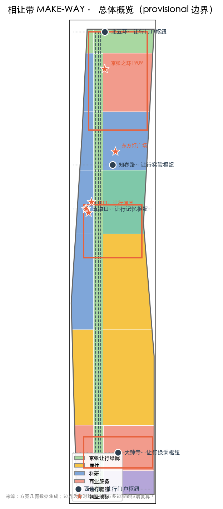
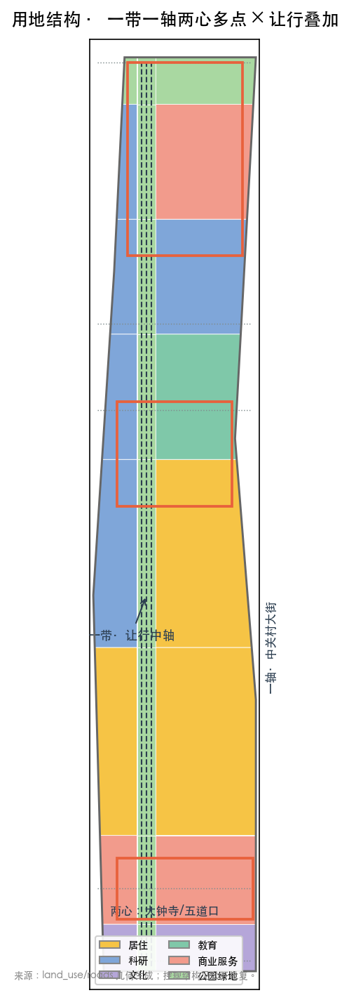
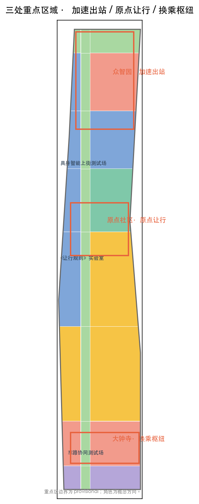
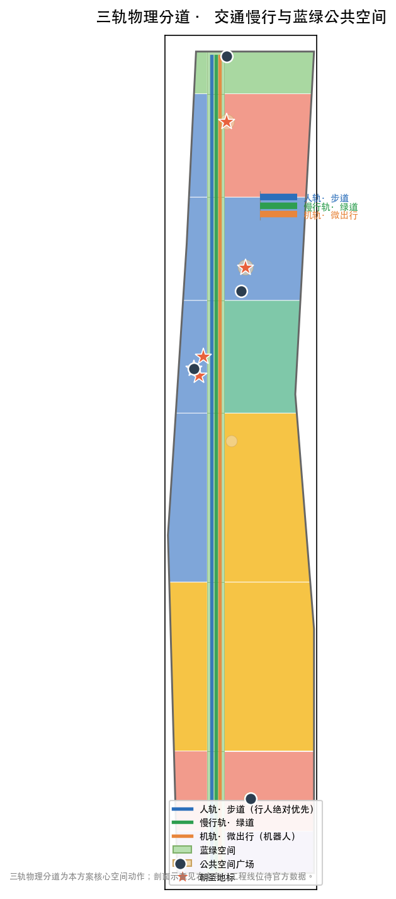
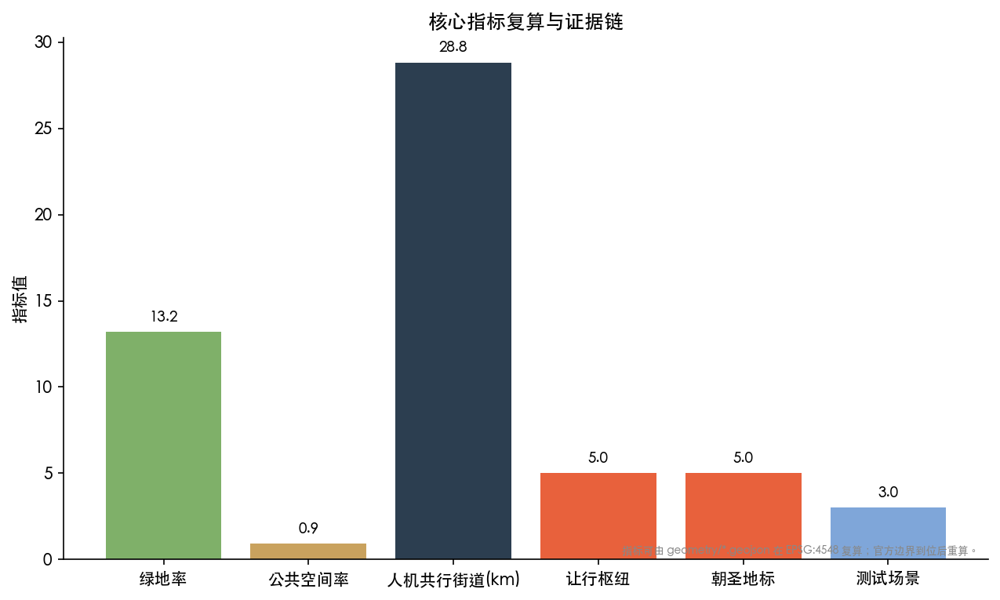

# 相让带 MAKE-WAY：从人字形铁路到人机共行城市

## 设计依据与资料清单

本方案以《百年京张AI创新带城市设计国际方案征集资格预审公告》为第一依据，以面向智能体的开源征集任务书为第二依据，并将 `brief/site-package/` 中登记的临时粗略边界、重点区域、枚举、指标与来源清单作为机器可读依据 [source:SRC-OFFICIAL-ANNOUNCEMENT] [source:SRC-AGENT-TASKBOOK]。2026 年 8 月 11 日批复的《海淀区京张铁路遗址公园沿线街区控规》明确了"一带一轴、两心多点"的官方空间结构与绿色公共空间引领更新的路径，本方案在其上叠加设计层，不替代法定控规 [source:SRC-KONGGUI-APPROVED]。

本方案的所有空间结论基于 `provisional_boundaries.geojson` 提供的临时粗略边界（PROV-SITE-001 / PROV-KEY-001/002/003），标注为 `provisional_constraint`：它们仅用于概念生成与可视化，不得作为官方红线或精确面积依据；官方多边形到位后需全量复算 [source:SRC-PROVISIONAL-BOUNDARIES] [depth:three_scope_framework]。完整来源、指标、标准与任务覆盖分别保存在 `sources.json`、`metrics.json`、`standard_matrix.json`、`design_depth_matrix.json` 与 `compliance_matrix.json`，正文不重复机器索引。

设计判断遵循四项原则：只用真实公开或清权数据；重要论断以可验证正面或负面例证支撑；所有空间落地为概念建议而非法定结论；不把 AI 标签贴在传统方案上，而是设计 AI 原生的人机共处空间。

## 三层范围工作框架

**统筹研究范围（43.6 km²）**：研究世界级 AI 创新生态、三区两翼耦合网络、AI 产业与未来城市形态、AI+交通与连续绿色空间体系，成果表达为产业战略与网络关系，不逐地块落位 [source:SRC-OFFICIAL-ANNOUNCEMENT] [standard:PROJECT-OFFICIAL-ANNOUNCEMENT]。

**总体设计范围（11.4 km²）**：以控规"一带一轴、两心多点"为骨架 [source:SRC-KONGGUI-APPROVED]，叠加"三轨共行中轴 + 五大让行枢纽 + 人机共行三轨街道"，达到控规深度城市设计；面积以提交边界实测 `site_area_sqm ≈ 1141.3 公顷` [metric:site_area_sqm]，官方边界到位后重算 [standard:MOHURD-CONTROL-DETAILED-PLANNING]。

**重点区域范围（368.4 公顷，provisional）**：对众智园AI自主创新加速区、北京AI原点社区、大钟寺AI产业集聚区做规划综合实施方案深度的详细设计 [data:geometry/key_areas.geojson#PROV-KEY-001]。三处重点区边界为临时约束，其中"加速出站、原点让行、换乘枢纽"的角色定位为概念方向，可供专业团队深化。

三层范围逐级落实的机制是：产业战略（研究层）→ 空间结构与更新框架（设计层）→ 节点精细化（重点区层）；每层对应的图层、指标与深度项见 `compliance_matrix.json` 与 `design_depth_matrix.json`。

## 统筹研究范围产业与未来城市研究

### 命名与身份系统（Agent 任务一）

主名称**「相让带」**（英文 **MAKE-WAY BELT**），取自京张铁路"人字形折返"的百年智慧——詹天佑在青龙桥让火车**掉头**以攀上 33‰ 陡坡，中国人向"坡"让路，完成了自己第一条干线铁路 [source:SRC-HIST-REN-SWITCHBACK]。AI 创新带的当代智慧是**三轨共行**：在人轨、慢行轨、机轨三条物理分道上，人与机器各有其位、彼此让行——从工程之"让"（让火车登高）到空间之"让"（让路权分层），是同一精神在 AI 时代的延续。**让行是三轨的运行规则，不是一句口号** [standard:PROJECT-AGENT-OPEN-CALL-TASKBOOK]。

命名选择经过了既有提交的概念空间检验：606 个 peer proposals 中"人字"族（185）、"双轨"族（145）、"折返"族（96）高度饱和，且"转人工/可撤回"等治理母题已成共识（153/239 命中）；而"三轨"（8）与"人机共行"（7）几乎空白——因此以**三轨物理分道**的空间设计为主卖点，让行降为三轨的运行规则，既差异化又保留文化根脉 [source:SRC-PEER-PROPOSALS]。

**Logo 方向**：三条平行轨迹（人轨、慢行轨、机轨）由一根横向的"让行横杠"相连——三条线各安其位，横杠代表让行规则把三者编织成一张网。中文符号取"让"的揖让形态，英文符号取道路让行手势；统一母题用于枢纽标识、三轨地面划线、机器人车身与活动视觉 [source:SRC-AGENT-TASKBOOK]。

### 三定位、五功能与三区两翼

**三大定位**：百年京张文化带、都市AI生活体验带、AI融合创新带——分别由"让行文化、人机共行街道、让行规则治理"承载 [source:SRC-AGENT-TASKBOOK]。

**五大功能**沿空间落实：AI全栈自主创新体系→众智园；世界级AI创新生态→原点社区；AI+场景赋能新范式→大钟寺与小月河场景赋能翼；智能化AI活力城市→三轨共行街道体系；AI治理全球话语权→分级自主、人工兜底的《让行规则》[source:SRC-AGENT-TASKBOOK] [standard:PROJECT-AGENT-OPEN-CALL-TASKBOOK]。

**三区两翼协同回路**：三区（原点/众智园/大钟寺）形成"规则—加速—应用"的创新回路，两翼（中关村科技服务翼、小月河场景赋能翼）提供资本与场景支撑。本方案以"让行"为轴心，使三区两翼围绕同一条人机共行主线组织，避免三区各自为政 [source:SRC-AGENT-TASKBOOK]。

### 全球 AI 创新生态与治理机制案例（10 个）

1. **大钟寺1733**：闲置 43 万 m² 商业体更新为字节办公+文商旅，"文脉为根基、数字为支撑、烟火为内核"，"古寺+AI商业"场景 [source:SRC-DAZHONGSI-1733]。
2. **北京卫星制造厂科技园**：东方红一号诞生地经"修旧如旧"更新为智能制造示范区，引入具身智能研究院，"工业骨架—新功能外皮"样本 [source:SRC-SATFACTORY-PARK]。
3. **鼎好DH3**：电子卖场"黄金三角"之一转型为 AI 地标，98% 入驻率、AI 实验室与机器人企业集聚 [source:SRC-DINGHAO-DH3]。
4. **五道口AI产业园**：11 栋楼宇、14 万 m²、118 家 AI 企业、营收超 50 亿元，海淀 AI 创新街区先导区 [source:SRC-WUDAOKOU-AIPARK]。
5. **众智园**：AI 全栈五层体系，预计 2026 年 7 月具备开园条件，FlagOS 多芯片算子库支撑自主生态 [source:SRC-ZHONGZHIYUAN]。
6. **具身智能街区趋势**：成都交子大道机器人街区、上海杨浦大学路科创街区、深圳"机警战队"——"场景落地元年"的人机共处实践，是本方案人机共行街道的正面对照 [source:SRC-EMBODIED-AI-STREET]。
7. **新加坡榜鹅数码园区实体AI试验平台**（2026-05）：全球首个在混合用途公共区域大规模测试多厂商机器人的平台（配送/巡逻/清洁，8 家企业），在"活跃通勤法令"豁免下于公共走廊测试——正是本方案"具身智能实景测试场"的全球正例 [source:SRC-CASE-PUNGGOL]。
8. **新加坡分级自主框架**：监督强度与智能体行为潜在影响成正比，关键节点人工审批、故障时下线，"组织与人类最终负责"——为本方案"让行规则"的分级自主、人工兜底提供治理背书 [source:SRC-CASE-SG-AUTONOMY]。
9. **欧盟 AI Act 的 agentic 治理缺口**：责任归属、监督悖论、跨辖区运行未充分应对，机器人安全元件合规延至 2028——是"AI 治理全球话语权"功能的国际背景 [source:SRC-CASE-EU-AIACT]。
10. **Monash 六城机器人治理研究**（2025）：即使领先机器人城市也缺乏保护公共利益的政策，呼吁预期性、公民参与的政策制定——支撑本方案反监控、反排挤红线 [source:SRC-CASE-MONASH-ROBOT]。

这些案例提炼出可空间化、可运营、可场景化的经验：把"实景测试"作为公共体验（榜鹅/遗址公园）、把"分级自主"作为治理机制（新加坡框架）、把"物理分道"作为安全前提（三轨设计），呼应城市机器人治理的"物理 API"提议 [source:SRC-CASE-PHYSICAL-API]。

## 总体设计范围城市更新与控规深度城市设计

### 空间结构：一带一轴两心多点 × 三轨共行叠加

在控规骨架之上 [source:SRC-KONGGUI-APPROVED]：

- **一带** = 京张遗址公园 = **三轨共行中轴**：在既有的"三道一绿"慢行系统上，叠加**机器人微出行道**，形成"人轨步道 / 慢行绿道 / 机轨微出行"三条**物理分道**并行的共行体系——这是本方案最核心的空间动作，让行规则在此落地而非停留在口号 [source:SRC-PARK-PHASE2] [data:geometry/roads.geojson#RD-SP001] [standard:MOHURD-URBAN-DESIGN-MEASURES]。
- **一轴** = 中关村大街创新发展轴：保持官方定位，作为东西让行连接的主干。
- **两心** = 大钟寺中心、五道口中心：演化为**让行换乘枢纽**与**让行记忆枢纽**。
- **多点** = 知春路、四道口等：演化为**让行实验枢纽**与社区节点。

**五大让行枢纽**（西直门门户 / 大钟寺换乘 / 知春路实验 / 五道口记忆 / 北五环门户）既是交通换乘点，也是让行规则的物理课堂与展示场 [data:geometry/public_space.geojson#HB-001]。

### 更新框架与拆改留逻辑

采用**针灸式织补**而非大拆大建：以 9 公里已贯通绿廊为"任脉"基线 [source:SRC-PARK-PHASE2]，沿鱼骨状慢行通道与节点做精细化织补，保留工业遗产原貌（卫星厂"修旧如旧"为范本 [source:SRC-SATFACTORY-PARK]）。拆改留按"拆解—重组—新生"沿轨道推进，但**具体地块级拆改留必须等待官方权属与现状建筑数据**，本方案仅给概念分区 [source:SRC-PROVISIONAL-BOUNDARIES] [depth:renewal_logic] [standard:MOHURD-ARCH-DESIGN-DEPTH-2016]。

### 待确认控规条件

官方控规的容积率、建筑高度、建筑密度、绿地率与退线条件未含在清权资料中，相应指标记为 `status=unknown`；本方案从几何复算的概念体量（如 `floor_area_ratio ≈ 0.50`）仅为设计量，不构成审定控制值 [metric:floor_area_ratio] [depth:risk_missing_data]。

## 重点区域详细设计

### 众智园AI自主创新加速区（192.1 ha，provisional）——「加速出站」

定位：AI 全栈自主创新与出海加速。空间上以"出站加速"为隐喻：与地铁无缝对接的落客平台即"站台"，入园即入站、加速即出站。功能布局研发层/基础层/科研层/应用层/生态层五层环绕 FlagOS 多芯片算子库展开 [source:SRC-ZHONGZHIYUAN]。**建筑更新**以新供给为主、存量改造为辅；**交通慢行**设机器人微出行道与配送接驳；**公共空间**设"加速出站广场"与 AI 体育训练测试场；**AI 场景**：AI 出海服务窗口、多芯片算力展示、具身智能上街测试 [data:geometry/key_areas.geojson#PROV-KEY-001]。

### 北京AI原点社区（104.3 ha，provisional）——「原点让行」

定位：规则从这里诞生。设**《让行规则》实验室**与"原点让行广场"：把"谁让谁、怎么超车、故障如何接管"写成可公开讨论、可迭代的规则草案。空间上保留社区烟火气，作为"智能化AI活力城市"的日常实验场 [data:geometry/key_areas.geojson#PROV-KEY-002]。**AI 场景**：社区智能养老、AI 体育、无人物流共行测试；**更新**以保留+织补为主，防止绅士化排挤，设置可负担住房与本地就业条款 [source:SRC-FAIL-22AT]。

### 大钟寺AI产业集聚区（72 ha，provisional）——「换乘枢纽」

定位：智能原生新业态的换乘与交汇。依托 12/13 号线换乘站与"大钟寺1733"文商旅样本 [source:SRC-DAZHONGSI-1733]，形成"交通×商业×古寺文化"三站交汇：车路协同测试场、古寺AI导览、无人零售、智能导购在此集成 [data:geometry/key_areas.geojson#PROV-KEY-003]。

三处重点区均按"定位 + 空间结构 + 建筑更新 + 交通慢行 + 公共空间 + AI 场景 + 实施风险"组织完整小方案；因边界为 provisional，所有结论表述为方向性概念建议，官方多边形到位后修正几何与面积。

## AI 创新生态、人才画像与 AI+ 场景

### 用户画像（≥5 类）

1. **通勤程序员**：中关村/众智园工作，早高峰通勤，"20 分钟通勤休闲圈"与机器人配送共行。
2. **高校师生**：清华、北语、北航等 50+ 院所师生，跨校科创与青年社区（706 青年空间精神）。
3. **社区老人**：45 万居民中的高知老龄化群体，智能养老、无障碍与代际融合刚需 [standard:ELDERLY-SMART-TECH-PLAN-2020-45]。
4. **机器人服务商**：具身智能/配送/巡检企业，需要实景测试场地与共行规则。
5. **沿街商户**：1733、卫星厂、五道口商圈的商户，数字经营与客流运营。
6. **游客与开发者**：来京张/八大学院/AI 地标的访客与全球开发者。

### AI 场景卡（≥10 张）

| # | 场景 | 服务对象 | 空间落位 | 数据/隐私 | 人工复核 |
|---|---|---|---|---|---|
| 1 | 机器人配送让行 | 通勤者/商户 | 三轨街道 | 路径脱敏 | 配送平台+街道巡查 |
| 2 | 无人接驳微出行 | 通勤程序员 | 让行中轴 | 站点数据 | 运营商+交管 |
| 3 | AI 体育训练测试 | 师生/居民 | 众智园段 | 体征脱敏 | 教练+运营方 |
| 4 | 智能养老驿站 | 社区老人 | 原点社区 | 健康数据脱敏 | 社区+医疗 |
| 5 | 古寺 AI 导览 | 游客 | 大钟寺 | 无 | 博物馆复核 |
| 6 | 无人零售/智能导购 | 商户/游客 | 1733/卫星厂 | 消费脱敏 | 商户自查 |
| 7 | 人机对弈/互动演绎 | 青年/开发者 | 五道口广场 | 无 | 运营方 |
| 8 | AI 健康导航 | 居民 | 沿街驿站 | 健康数据脱敏 | 医疗机构 |
| 9 | 机器人巡检 | 社区/园区 | 沿带节点 | 视频匿名化 | 物业+治理平台 |
| 10 | AI 出海服务窗口 | 企业 | 众智园 | 企业数据隔离 | 园区运营 |
| 11 | **具身智能上街测试**（测试验证） | 机器人企业 | 卫星厂段测试场 | 测试日志 | 测试委员会 |
| 12 | **AI 体育训练测试**（测试验证） | 运动科技企业 | 众智园段 | 运动数据 | 专业教练 |
| 13 | **车路协同测试**（测试验证） | 自动驾驶企业 | 大钟寺段 | 轨迹数据 | 交管+第三方 |

每张场景卡在 `scenarios/*.json` 有结构化记录；此处呈现可读摘要，全部场景受《让行规则》与数据治理约束 [source:SRC-AGENT-TASKBOOK] [source:SRC-GENERATIVE-AI-MEASURES] [standard:GENERATIVE-AI-INTERIM-MEASURES]。

## 用地、建筑规模与拆改留方案

用地分区从提交边界拓扑安全地分割，覆盖全边界、无重叠 [data:geometry/land_use.geojson]：居住用地（0701，约 373 万 m²）、科研用地（0802，约 229 万 m²）、商业服务（05，约 200 万 m²）、教育（0804，约 89 万 m²）、文化（0803，约 55 万 m²）、公园绿地（1401，约 195 万 m²）[metric:land_use_1401_area_sqm]。绿地率约 13.2%、公共空间率约 0.9%（另有已贯通绿廊计入绿地）[metric:green_ratio] [metric:public_space_ratio]。用地分类遵循国土空间用地用海分类指南 [standard:MNR-LAND-USE-CLASSIFICATION-GUIDE]。

建筑规模为概念估算：概念建筑底图约 142 万 m²（`building_footprint_area_sqm`），按平均 4 层估算总规模约 568 万 m²、容积率约 0.50——均为低置信度设计量，**不等于法定控制值**，待官方控规与现状建筑数据补齐后复算 [metric:building_footprint_area_sqm] [metric:floor_area_ratio]。

拆改留以"保留为主、改造为辅、少量新建"为原则，具体地块级分类待权属与现状数据 [source:SRC-PROVISIONAL-BOUNDARIES] [depth:risk_missing_data]。

## 交通、轨道、市政与公共服务设施

**三轨共行街道体系**是本方案交通核心：沿中轴设"人轨/慢行轨/机轨"三条物理分道 [data:geometry/roads.geojson#RD-SP001] [metric:make_way_street_m]，配套**《让行规则》**：分时（机器人配送时段）、分道（机轨独立）、优先权（行人绝对优先）、故障接管（机器人靠边停）；三轨总长约 28.8 km [metric:make_way_street_m]。分道设计以无障碍与行人绝对优先为前提 [standard:BARRIER-FREE-ENVIRONMENT-LAW]。

**轨道站点一体化**：依托 10/12/13/15 号线与西直门、大钟寺、知春路、五道口等换乘点，设让行枢纽广场与自行车/机器人停放 [source:SRC-PARK-PHASE2]。**市政与新型基础设施**：结合分布式能源、端侧算力与既有市政体系提出体系建议，不给出工程线位结论 [depth:risk_missing_data]。**公共服务**：围绕"一刻钟社区服务圈"配生活服务与创新服务平台，设施容量待官方底数 [source:SRC-KONGGUI-APPROVED]。

## 蓝绿空间、公共空间与城市风貌

**蓝绿基底**：9 公里京张让行绿廊 [source:SRC-PARK-PHASE2] 串联清河滨水绿廊与东升八家郊野公园，沿线设让行口袋公园与林下剧场。**公共空间**：五大让行枢纽广场 + 原点让行广场 + 东方红广场（既有更新）[data:geometry/public_space.geojson#PUB-LM001]。

**AI 朝圣地标（≥3，全部有真实锚点）**：
1. **清华园站**（1910 年始建，站房已修复）——百年记忆原点 [source:SRC-HIST-WUDAOKOU]
2. **东方红广场**（卫星制造厂，"两弹一星"与东方红一号）——科技自主原点 [source:SRC-SATFACTORY-PARK]
3. **京张之环1909**（北段主题广场）——铁路原点 [source:SRC-PARK-PHASE2]
4. **五道口道口**——"让行最初的课堂"，五道口人让了 100 年火车 [source:SRC-HIST-WUDAOKOU]
5. **706 青年空间**——青年社区运营原点

**城市风貌**：以"让行"为母题统一导视、地刻与 Logo 系统；风貌控制以保留工业遗产原貌（红砖、龙门吊、老铁轨）为基调，新建体块以温科技质感（艺术、自然材质、人性尺度）软化科技气质。地标、导视与人物企业标识全部清权，概念地标不表述为已批准建设。

## 更新项目清单、实施政策与分期计划

**分期**（对应 `geometry/phasing.geojson`）：
- **一期（规则+示范）**：原点社区《让行规则》实验室、知春路—五道口示范三轨街道 [data:geometry/phasing.geojson#PH-P1]
- **二期（枢纽+成网）**：五大让行枢纽、场景卡落地、三轨街道成网 [data:geometry/phasing.geojson#PH-P2]
- **三期（全域+运营）**：全域共行体系、全球"让行节"与规则社区运营 [data:geometry/phasing.geojson#PH-P3]

**更新项目清单**：按"针灸式织补"列概念项目（枢纽广场、测试街道、口袋公园、驿站），依赖官方权属与现状数据深化；实施主体与政策建议表述为概念方向。**全球运营**：提出年度"让行节"、开发者社区运营、《让行规则》开源社区与公共体验路线，所有活动与运营安排均为概念建议，不表述为已确定政府安排 [source:SRC-AGENT-TASKBOOK]。

## 指标体系、面积复算与合规矩阵

核心指标及其设计含义：
- **绿地率 13.2%**：支撑人才日常交往与生态修复，绿廊贯通是人才安居的基础 [metric:green_ratio]
- **公共空间率 0.9%**：枢纽广场承载"碰撞密度"与让行规则展示 [metric:public_space_ratio]
- **人机共行街道 28.8 km**：AI 原生空间的骨架，三轨并行的通行能力设计 [metric:make_way_street_m]
- **让行枢纽 5 处 / 朝圣地标 5 处 / 测试场景 3 处**：空间网络、文化叙事与产业测试的节点 [metric:make_way_hub_count] [metric:robotic_test_scenario_count]
- **人机冲突事故率目标 0**：红线指标，需运营监控基线验证 [metric:human_machine_collision_rate]

面积复算遵循：所有面积/比例可由 `geometry/*.geojson` 在 EPSG:4548 下复算；官方边界缺失的指标标注待补。合规覆盖见 `compliance_matrix.json`（公告任务 + Agent 任务全覆盖）、`standard_matrix.json`（全部强制标准）、`design_depth_matrix.json`（formal 深度项完整）。

## 风险、版权与合规说明

- **资料合法性**：全部使用真实公开或清权来源，非公开资料已排除；来源见 `sources.json`。
- **概念建议属性**：所有空间落地为概念、参考或供专业团队深化的材料，不替代法定规划，不构成政府审定、实施或投资承诺 [source:SRC-AGENT-TASKBOOK]。
- **反失败红线**：反冷科技（Songdo）、反监控（Sidewalk 数据恐慌）[source:SRC-FAIL-SIDEWALK]、反排挤（22@ 绅士化）[source:SRC-FAIL-22AT]、反从零造城（NEOM 规模失控）[source:SRC-FAIL-NEOM]、反政绩摆设（贵州县智慧城市闲置）[source:SRC-FAIL-GUIZHOU]——这些失败例证被转化为设计红线，确保方案以用为本、渐进可逆、包容可负担。
- **版权与 AI 生成责任**：生成媒体与方法见 `report/copyright_statement.md`；AI 生成内容已披露，不冒充现场、居民意见或官方边界。
- **待补资料**：官方多边形、控规条件、权属、现状建筑、市政条件——按 `assumptions.json` 的 gap 清单待补，到位后复算。

### 利益相关方与包容机制（public interest inclusion）

| 利益相关方 | 关注 | 方案回应 |
|---|---|---|
| 沿线居民（45 万） | 被更新排挤、噪声与安全 | 保留+织补为主；可负担住房与本地就业条款；三轨行人绝对优先 |
| 沿街商户 | 客流与数字经营 | 无人零售/智能导购反哺客流；数字工具降低经营门槛 |
| 社区老人 | 智能技术门槛 | 智能养老驿站 + 非 App 入口 + 人工席位 [standard:ELDERLY-SMART-TECH-PLAN-2020-45] |
| 机器人服务商 | 实景测试场地与规则 | 三处测试场 + 分级自主的让行规则 [source:SRC-CASE-SG-AUTONOMY] |
| 开发者/研究者 | 可测试、可复现 | 具身智能上街测试场 + 公开测试日志 |
| 政府与专业机构 | 合规与法定程序 | 概念建议属性，不替代法定规划 [source:SRC-AGENT-TASKBOOK] |
| 残障人士 | 无障碍 | 三轨分道 + 无障碍优先 [standard:BARRIER-FREE-ENVIRONMENT-LAW] |

### 未缓解风险登记（risk compliance）

| 风险 | 现状 | 未缓解原因 | 缓解路径（待补） |
|---|---|---|---|
| 人机冲突责任归属 | 未定 | 缺乏官方交通规则与判例 | 待官方人机共行法规；参照欧盟 agentic 治理缺口与新加坡"组织与人类最终负责"原则 [source:SRC-CASE-EU-AIACT] |
| 数据治理与隐私 | 概念层 | 缺官方数据共享细则 | 以生成式 AI 办法为底线，待官方数据治理细则 [standard:GENERATIVE-AI-INTERIM-MEASURES] |
| 具身智能安全 | 未实测 | 缺官方测试标准 | 分级自主 + 测试场先导 + 故障接管 [source:SRC-CASE-SG-AUTONOMY] |
| 排挤与绅士化 | 概念承诺 | 缺权属与利益分配机制 | 可负担住房条款，待官方更新政策与社区利益协议 [source:SRC-FAIL-22AT] |
| 官方边界/控规缺失 | 待补 | 组织方数据缺口 | 官方多边形到位后全量复算 [source:SRC-PROVISIONAL-BOUNDARIES] |

## 参考资料

1. 百年京张AI创新带城市设计国际方案征集资格预审公告（北京市规划和自然资源委员会海淀分局，2026-05-09）。
2. 面向全球智能体开展"百年京张AI创新带城市设计开源征集"任务书摘录（清权用户资料，2026-05-18）。
3. 京张铁路遗址公园沿线街区控规批复（北京市政府，2026-08-12）。
4. 京张铁路遗址公园二期全线贯通报道（海淀文明网/央广网，2026-08-06/07）。
5. 《城市设计管理办法》《城市、镇控制性详细规划编制审批办法》等专业标准（住建部/自然资源部）。
6. 大钟寺1733、鼎好DH3、北京卫星制造厂科技园更新案例报道（北京青年报/中新网/海淀网）。
7. 具身智能街区实践与智能体城市学术文献（央视网/解放日报/ScienceDirect）。
8. 京张铁路"人字形折返"与五道口文化记忆史料（新京报/百度百科/北京日报）。
9. 国际失败案例研究（Sidewalk Toronto、NEOM、巴塞罗那22@）与国内"政绩摆设"式智慧城市教训，全部转化为本方案设计红线 [source:SRC-FAIL-SIDEWALK] [source:SRC-FAIL-NEOM] [source:SRC-FAIL-22AT]；贵州县智慧城市闲置的教训见 sources.json [source:SRC-FAIL-GUIZHOU]。
10. 八大学院与学院路历史文化报道（北京日报）[source:SRC-COLLEGE-ROAD]。
