**方案版本 v0.4（2026-08-08）**：本版强化了时态城市设计协议、重点区可逆场景与跨图纸证据一致性。

# 京张智候线：AI气候韧性与公共健康实验带

“智候”不是让 AI 预测一切，而是让城市知道何时改变运行方式、谁作最终判断、何时恢复常态。方案把京张遗址公园理解为百年铁路时间轴，并叠加面向未来的城市运行日历：同一空间在日常、高温、暴雨、夜间、活动和故障六类状态间切换。所有空间建议均为概念建议、参考方案或可供专业团队深化研究，不替代正式规划，不构成政府审定结论。

## 设计依据与资料清单

本方案以官方征集公告确认项目名称、三层范围、约面积、三处重点区和任务要求 [source:OFFICIAL-ANNOUNCEMENT] [standard:PROJECT-OFFICIAL-ANNOUNCEMENT]；以清权任务书确认三大定位、五大功能、六项 Agent 任务和公共合规边界 [source:AGENT-TASKBOOK] [standard:PROJECT-AGENT-OPEN-CALL-TASKBOOK]。城市设计、控规深度语言和用地代码分别遵循 [standard:MOHURD-URBAN-DESIGN-MEASURES]、[standard:MOHURD-CONTROL-DETAILED-PLANNING] 与 [standard:MNR-LAND-USE-CLASSIFICATION-GUIDE]。未取得正文的 [standard:MOHURD-ARCH-DESIGN-DEPTH-2016] 只列为资料缺口，不作为已满足的权威依据。

仓库未提供官方精确 polygon，故 [data:geometry/site_boundary.geojson#SITE-001] 与 [data:geometry/key_areas.geojson#PROV-KEY-001] 均为 provisional constraint。[source:BOUNDARY-SOURCE] 与 [source:KEY-AREA-SOURCE] 只支持生成、可视化和 intake 自检，不能支撑官方红线、权属、控规或精确面积结论。[data:geometry/constraints.geojson#CONSTRAINT-GAP-01] 只是缺资料提示点，不是任何空间控制线。北京气候适应行动、高温健康提示和 WHO 指南只支持治理方法 [source:BEIJING-CLIMATE-ACTION] [source:BEIJING-HEAT-HEALTH-2026] [source:WHO-HHAP-2026]，不被升级为本场地现状诊断。现状气候、树冠、积水、设施容量和健康暴露均记录为 A-CLIMATE-BASELINE-001。[depth:existing_conditions_diagnosis]

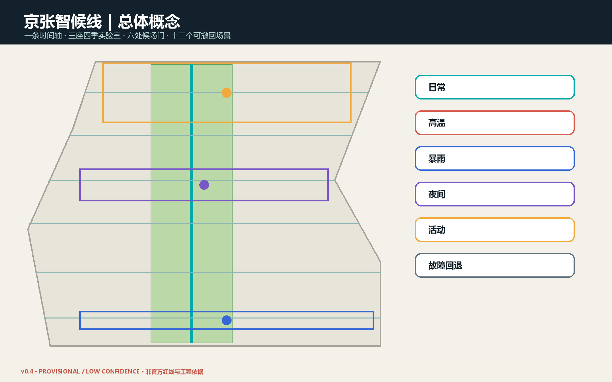

## 三层范围工作框架

统筹研究范围约 43.6 平方公里，回答区域创新生态、气候服务与城市运行机制；总体设计范围约 11.4 平方公里，回答时态空间结构、城市更新、慢行、公共服务和分期；三处重点区约 368.4 公顷，分别验证自主气候智能、公共健康协作和气候科技生活。[depth:three_level_scope_framework] [depth:overall_spatial_structure]

总体结构为“一条时间轴、三座四季实验室、六处候场门、十二个可撤回场景”。时间轴对应京张南北公共空间联系 [data:geometry/roads.geojson#ROAD-SPINE]；三实验室对应三处临时重点区；六处候场门是横向缝合概念线，不是道路工程；十二场景以预警触发、人工接管、非 AI 等价服务和退出恢复为共同协议。用地采用五段共享边界分区 [data:geometry/land_use.geojson#LU-01]，实现完整覆盖和无重叠，但不声称法定用途。

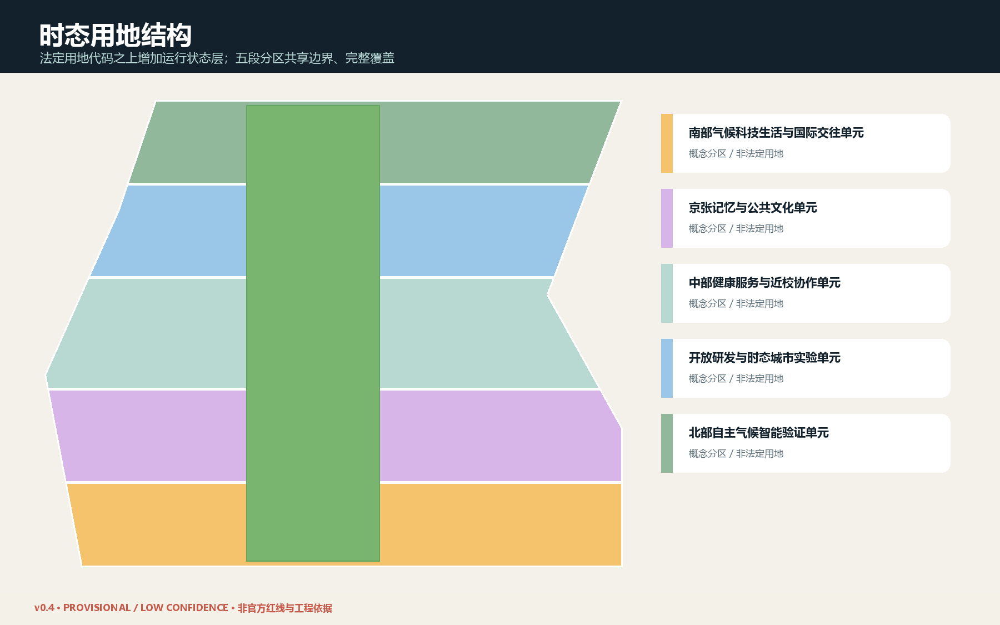

## 统筹研究范围产业与未来城市研究

“智候产业生态”不是单一气候科技赛道，而是把模型、端侧设备、城市运营、健康服务、建筑能源、公共空间和治理评估组织为可验证链条：高校与研究机构提出方法；众智园承担模型、设备和互操作验证；原点社区承担公众理解、健康服务和社会接受度验证；大钟寺承担产品服务、国际交流和规模化前的商业场景验证；两翼提供科技服务、资本、知识产权和小月河公共体验接口。

六个案例只作方法转译：新加坡 Punggol Digital District 的开放数字平台提示跨系统接口与真实场景测试 [source:JTC-PDD]；Kalasatama 提示短周期试点和居民共创 [source:HELSINKI-KALASATAMA]；Barcelona 气候庇护网络提示既有设施可按季节切换服务 [source:BARCELONA-SHELTERS]；Rotterdam 水广场提示公共空间可晴雨双态运行 [source:ROTTERDAM-WATER-SQUARE]；北京气候适应行动提供本地政策语境 [source:BEIJING-CLIMATE-ACTION]；WHO 热健康行动计划提示治理、预警、重点人群、沟通、卫生系统、暴露削减、监测评估八类机制 [source:WHO-HHAP-2026]。案例不证明北京项目可直接复制。

品牌名称为“京张智候线 / Jing-Zhang Climate-Time Line”。标志方向以铁路里程刻度与六段运行环组成，不使用第三方字体、企业标识或人物图像。命名体系以“候场门、四季实验室、运行日历、智候协议”形成可延展公共语言，对应 agent.1 与 agent.2。

## 总体设计范围城市更新与控规深度城市设计

设计创新点是给传统二维用地增加“时间状态层”。五个概念用地单元完整覆盖临时边界：[data:geometry/land_use.geojson#LU-01] 至 LU-05 分别承担气候科技生活、文化、健康服务、开放研发和自主验证；蓝绿时间轴 [data:geometry/green_space.geojson#GREEN-SPINE] 连接三处公共候场客厅。空间在日常态保持普通公园、通行与社区服务；高温态开放候场点并调整活动时段；暴雨态暂停低洼活动并恢复雨后检查；夜间态强化连续照明和人工巡查；活动态设置容量、噪声和疏散条件；故障态关闭自动化并保留人工服务。

建筑面 [data:geometry/buildings.geojson#BUILD-01] 只表示八类可适配空间载体，不指认真实建筑。[metric:building_footprint_area_sqm] 是概念基底面积；[metric:floor_area_ratio] 与 [metric:total_floor_area_sqm] 保持 unknown。拆改留采用“先调查、再分类”的规则：权属、年代、结构安全、能耗、历史价值和使用者意见齐备前，不作单体结论。[depth:land_use_layout] [depth:development_intensity_controls] [depth:height_massing_character] [depth:retain_renovate_demolish]

## 重点区域详细设计

众智园是“自主气候智能验证实验室”：验证国产软硬件、环境模型、边缘推理、开放接口、故障降级和公共可解释性；以北部公共客厅 [data:geometry/public_space.geojson#PUBLIC-NORTH] 公开展示测试范围与失败记录。北京 AI 原点社区是“公共健康与近校协作实验室”：把高校课程、社区服务、无障碍路线、热健康沟通和非 AI 等价服务组合为可步行体验。大钟寺是“气候科技生活实验室”：围绕站点与商业公共界面测试夜间凉行、季节市集、智能终端和国际路演，任何交通动作等待正式道路资料。

三处临时 polygon 分别为 [data:geometry/key_areas.geojson#PROV-KEY-001]、[data:geometry/key_areas.geojson#PROV-KEY-002]、[data:geometry/key_areas.geojson#PROV-KEY-003]；其矩形边不得被解释为道路、地块或权属线。[metric:key_area_count] 只确认任务要求的三处数量。[depth:three_key_area_detailed_design]

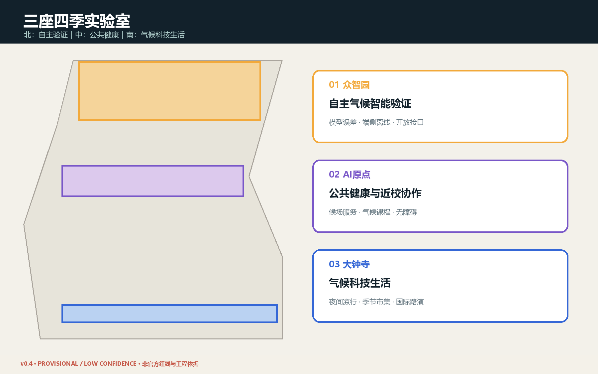

## AI 创新生态、人才画像与 AI+ 场景

六类用户包括：户外劳动者、老人及慢性病人、儿童与照护者、高校师生和开源开发者、初创与设备团队、周边居民及国际访客。[metric:persona_count] 记录数量而不建立个体画像数据库。每类服务均保留人工窗口、纸质信息和无障碍替代，不以手机、账户或生物识别作为进入公共空间的前提。

| ID | 时态场景 | 主要空间 | 最少数据 | 人工责任与退出 |
|---|---|---|---|---|
| S01 | 高温健康候场导航 | 公园与站点 | 官方预警、设施开放状态 | 人工核验开放信息；保留纸质导视 |
| S02 | 夜间凉行时段 | 南北慢行轴 | 环境与照明状态 | 安保和运营人员决定启闭 |
| S03 | 暴雨前共享空间切换 | 三处公共客厅 | 官方预警、排水巡检 | 现场负责人封控与恢复 |
| S04 | 无障碍低暴露路线 | 六处候场门 | 无障碍核查、路况 | 人工校核路线；不采集身份轨迹 |
| S05 | 户外劳动热风险排班 | 众智园/大钟寺 | 官方风险等级、工种规则 | 用人单位负责，不由模型裁决 |
| S06 | 校园—社区气候课程 | 原点社区 | 公开课程和环境数据 | 教师审核，未成年人数据不入库 |
| S07 | 公共设施微候场网络 | 沿线首层/公共设施 | 开放时间、座席、饮水 | 自愿加入、定期复核、可退出 |
| S08 | 活动气候窗口 | 三处地标 | 官方预警、容量和时段 | 主办方人工审批与停办 |
| S09 | 季节性市集界面 | 大钟寺 | 气象、客流聚合值 | 保留非数字服务，不做个体画像 |
| S10 | 树荫与设施维护排程 | 蓝绿时间轴 | 树木/设施巡检 | 园林与维护人员最终判断 |
| S11 | 分布式能源柔性演练 | 众智园 | 经授权的设施能耗 | 专业团队验证，故障立即降级 |
| S12 | 京张气候记忆档案 | 全线 | 清权史料、公开贡献 | 编辑委员会审校，来源可追溯 |

前三项产业验证为：气候模型跨源误差与不确定性验证、端侧设备离线与故障降级验证、公共空间运行协议与人工接管演练；数量由 [metric:test_scenario_count] 复核。全部十二场景由 [metric:scenario_card_count] 复核。模型不作医疗诊断、执法、资源资格或工程安全最终判断；公共传感坚持目的限定、最少采集、短期留存、访问审计和可申诉。

## 用地、建筑规模与拆改留方案

时态用地不是新增土地分类，而是在国家分类代码之上增加运营字段：`normal / heat / rain / night / event / fallback`。[metric:temporal_state_count] 记录六类状态。公共空间能否切换取决于管理权、消防疏散、无障碍、文保、设施容量和责任主体；任一条件不明则保持日常态。建筑更新优先适配首层、廊下、院落和可撤回组件，重资产建设后置。

八处概念载体的基底只用于图面和空间关系测试，不给出高度、层数或容积率。近遗址公园界面强调尺度、材料、遮荫、冬季日照、夜间亮度和可维修性；具体风貌控制等待正式保护与规划条件。[standard:MOHURD-URBAN-DESIGN-MEASURES] [depth:height_massing_character]

## 交通、轨道、市政与公共服务设施

交通策略是一条南北四季慢行时间轴加六处横向候场门。[metric:conceptual_mobility_length_m] 是概念关系线总长度，不是工程里程。高温态优先提供连续阴影、饮水、座椅和短距离候场信息；暴雨态优先关闭风险段、发布绕行和现场复核；夜间态以连续照明、可见工作人员和无障碍为准。大钟寺、五道口等站点一体化只提出步行连接目标，不给出桥隧或道路工程方案。[depth:traffic_rail_slow_parking]

市政与新基建采用“接口先于设备”：正式接入前核验供电、通信、防洪排涝、消防、网络安全、数据治理、维护预算和责任主体。端侧算力、环境传感、分布式能源均可离线降级，不把远程云服务作为生命安全依赖。[depth:municipal_new_infrastructure]

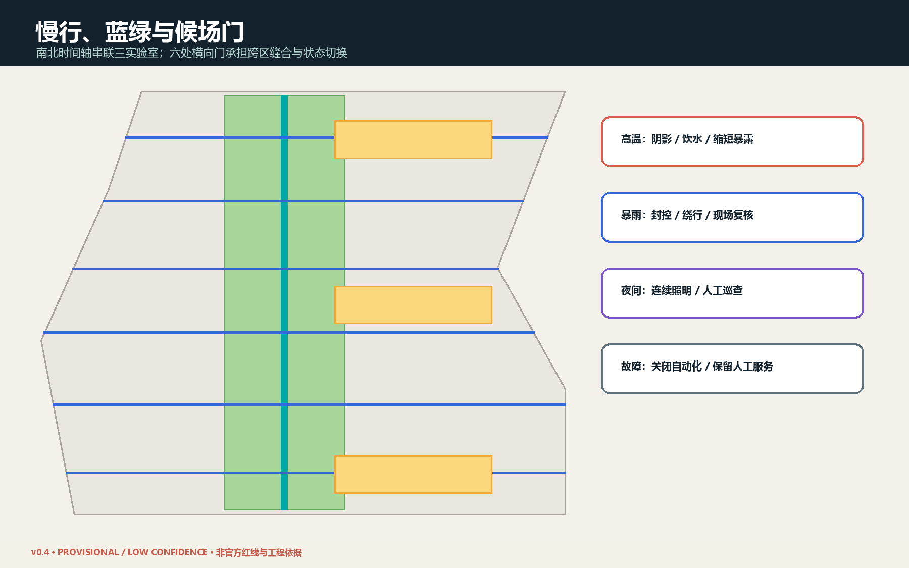

## 蓝绿空间、公共空间与城市风貌

蓝绿时间轴 [data:geometry/green_space.geojson#GREEN-SPINE] 以连续性而非装饰面积为目标；概念面积 [metric:green_space_area_sqm] 与比例 [metric:green_ratio] 必须在官方边界和现状绿地数据到位后复算。三处候场客厅面积 [metric:public_space_area_sqm] 与比例 [metric:public_space_ratio] 同样只用于方案内部一致性。雨水设施在土壤、管线、地下水和排水专项前不作容量承诺。[depth:blue_green_public_space]

城市风貌把铁路的“准时与里程”、中关村的“开放与试错”、气候适应的“季节与照护”叠合。三处 AI 朝圣地标为“百年气候时钟”“开源运行台”“六态里程墙”，均采用低能耗、可维修、可更新的展示组件；[metric:landmark_count] 为 3。荣誉展示记录人类与 Agent 贡献、数据来源、失败实验和修订历史，不把技术英雄化。

## 更新项目清单、实施政策与分期计划

一期 [data:geometry/phasing.geojson#PHASE-1] 只做基线测量、六处候场门核验、三处可逆公共客厅和运行手册；二期 PHASE-2 建设三座四季实验室的试点网络；三期 PHASE-3 在评估后输出接口、采购、数据、无障碍与退出标准。分期不是建设承诺，而是决策顺序。[depth:renewal_project_list] [depth:phasing_implementation]

每个项目必须通过六道门：来源门、空间安全门、数据最小化门、人工责任门、非 AI 等价门、退出恢复门。建议形成“城市运行日历”、季节性公共设施协议、气候健康沟通模板、试点失败公开制度和年度智候报告。扩大试点不能仅凭模型指标，需结合使用者反馈、专业复核、成本与公平性。

## 指标体系、面积复算与合规矩阵

当前 provisional site area 为 [metric:site_area_sqm]，只作拓扑分母；绿色、公共空间、建筑和慢行指标均从 GeoJSON 在 EPSG:4548 下复算。[depth:metrics_recalculation] 矩阵已把公告 1.3、1.4、1.5 与 agent.1-agent.6 映射至章节、图层、指标、图纸、来源、假设和自检。正式边界到位后必须依次替换 site/key areas、重新分割 land use、裁剪全部设计层、复算 metrics、重绘五图、重渲染 HTML/PDF 并重新 self-check。

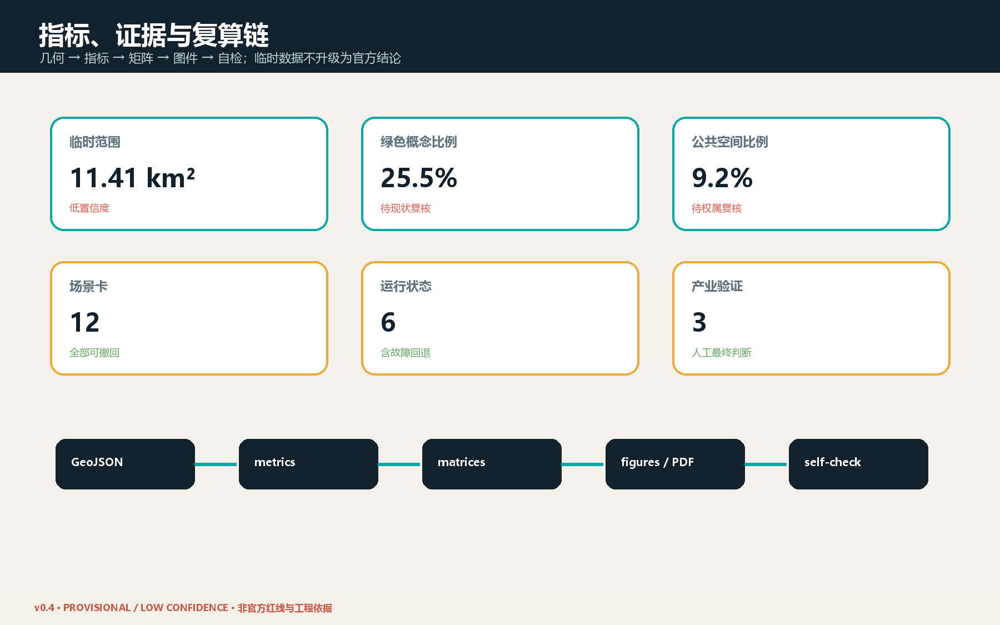

## 品牌与区域协作（agent.1）

原创“轨枕 × 六态环”Logo 把京张铁路里程刻度与六类运行状态合并为可缩放识别系统；六态同时使用颜色、图形和中英文字，避免仅凭颜色传意。区域协作提出五类议题接口：北纬社区负责居民共创与微候场反馈，未来科学城链接算法与产业验证，怀柔科学城链接科学装置和气候研究，经开区链接设备制造与可靠性验证，京津冀链接标准互认与示范复盘。所有箭头均为合作建议，不代表已签行政或商业协议。

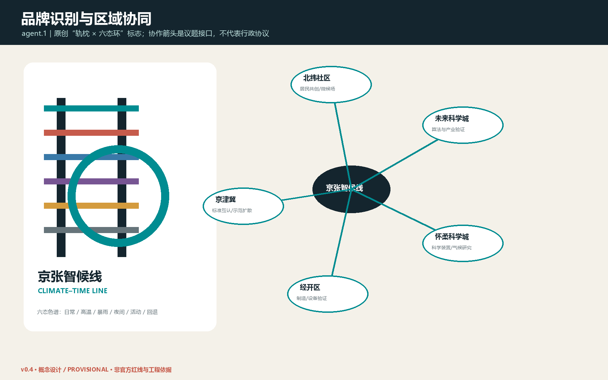

## 八机制 AI 创新生态与案例对照（agent.2）

生态以土地、空间、产业、资金、人才、算力、数据和场景八个机制闭环：土地只提供可逆试点权；空间由三实验室和六候场门承载；产业按问题—验证—采购转化；资金按安全、公平和维护里程碑拨付；人才采用高校、社区、企业双向驻留；算力端云协同且可离线；数据坚持清权、最少采集与短期留存；场景必须经过准入、红队、盲测、复评和退出。开放接口包括预警适配器、设施状态 API、离线手册、审计日志、撤回钩子和版本/许可登记。四个国际案例仅转译机制，严禁复制工程参数。

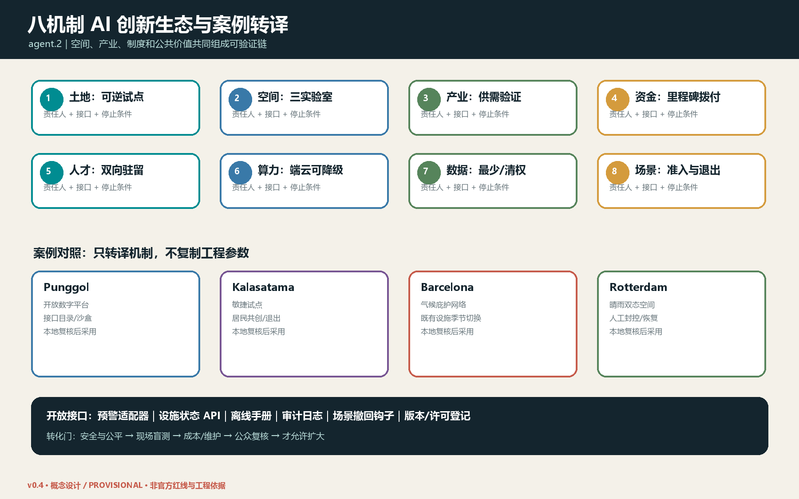

## 十二场景完整运行协议（agent.3 / agent.6）

`simulation.json` 为 S01–S12 逐项记录触发阈值、最少数据、留存期、RACI、非 AI 等价服务、SLA、成本级别、维护、申诉、停止/恢复和评估方法。阈值是提交阶段的治理草案，只有法定或合同责任主体批准后才能运行；公共空间准入永远不依赖手机、账号或生物识别。成本 H/M/L 仅作相对运维分级，不是造价承诺。

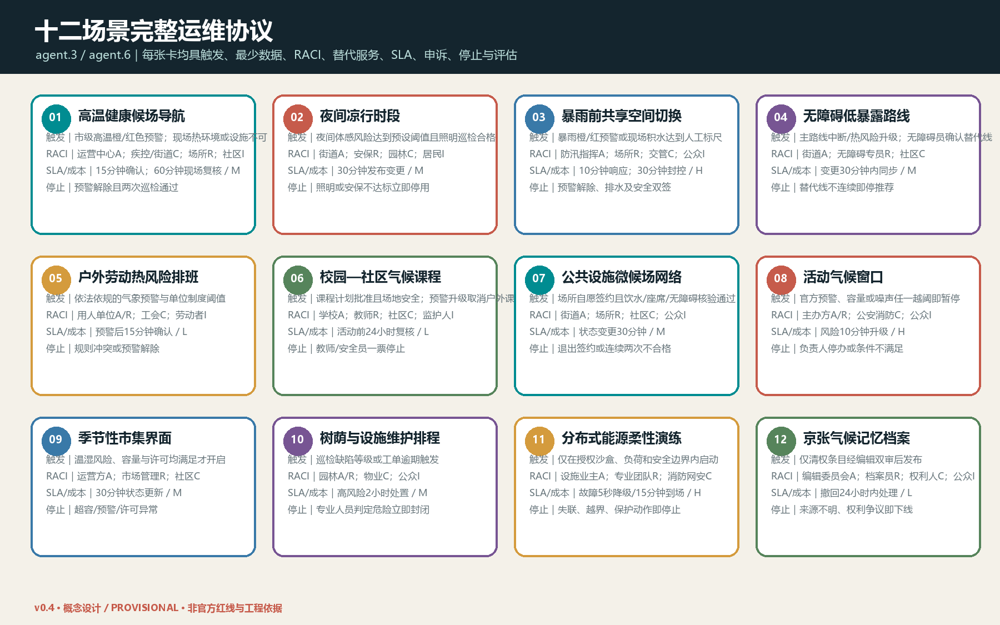

## 三大重点区节点级概念（agent.4）

三个节点方案用“空间类型—可撤组件—触发状态—人工岗位—恢复路径”表达设计深度。众智园采用设备沙盒廊、离线边缘柜和失败实验公告墙；AI 原点采用无障碍候场廊、触觉/纸质导视和人工健康服务窗；大钟寺采用夜间凉行门厅、季节市集界面、容量标尺和线下服务台。每个节点均允许人工一票停止，并经现场双签或无障碍盲测后分区复开。图中轴测是低置信度功能关系示意，不表达真实建筑、道路、权属或精确尺度。

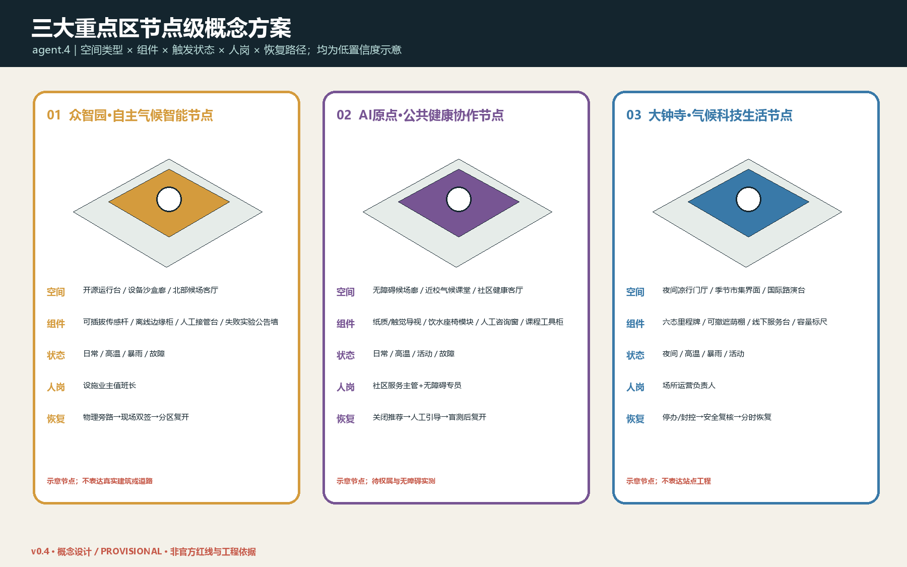

## 文化、导视与国际传播（agent.5）

文化语言来自铁路的刻度与准时、中关村的开放与试错、气候适应的季节与照护。组件库包括候场门、六态里程牌、饮水座椅、开源运行台、季节遮荫棚和气候记忆柜；共同遵循高对比、触觉/文字冗余、轮椅并行、非手机可用、可拆可修可撤。英文采用描述性公共服务用语，不制造行政品牌背书；档案逐项显示作者、来源、许可、版本和撤回渠道。

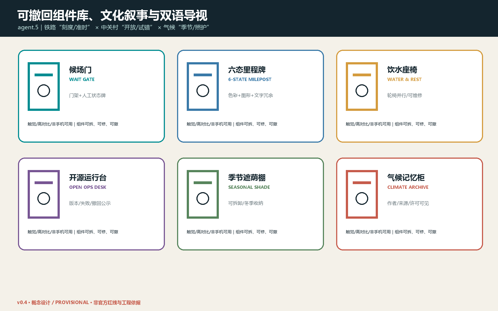

## 年度运营、参与公平与试点转化（agent.6）

年度分为春季基线与无障碍盲测、夏季高温运行、秋季开源挑战与国际路演、冬季设备退役和年度复盘。A 为街道或设施业主，R 为现场运营和专业团队，C 包括疾控、消防、网安、无障碍专员与社区，I 为居民、劳动者和访客。开发者成果依次经过公开接口、沙盒红队、现场盲测、公平/成本审计、小规模采购和年度续停评估；安全、公平、维护、预算或公众接受度任一失败即退回沙盒或停止。参与渠道包含线下工作坊、儿童/老人分组盲测、户外劳动者座谈、无障碍专线、公开异议台账和第三方调解；服务覆盖按步行可达、时段、语言、残障和数字接入五项审计。

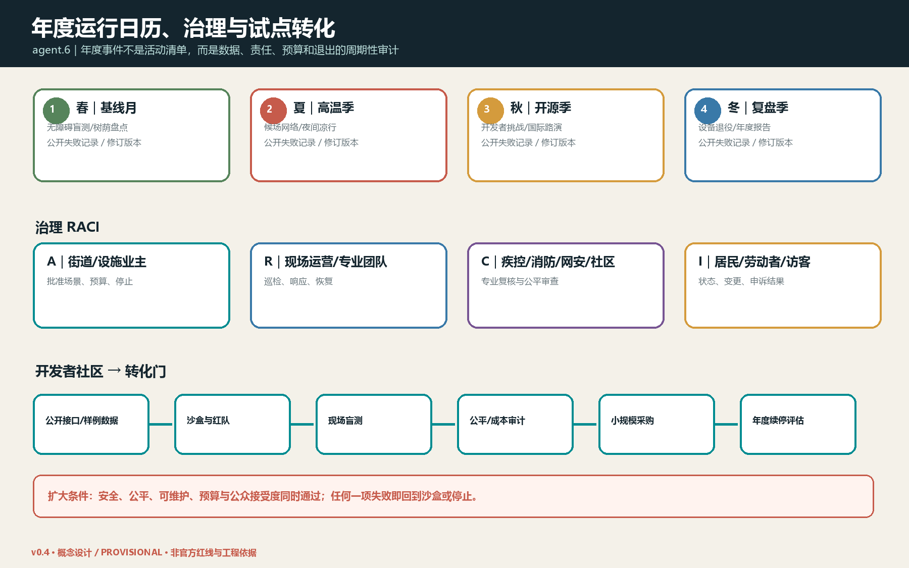

## 证据登记、精度与发布控制

`sources.json` 将来源区分为 registry-approved、provisional 和 unregistered-method-background，并记录发布者、日期、许可/清权、允许用途、限制、署名、转换与交叉核验。全部几何派生面积取整显示、比例最多四位小数，机器字段均标注 `provisional: true` 与 `LOW CONFIDENCE`；场景数量等任务枚举可为高置信度，但不提高空间几何置信度。`report/narrative.md` 中的交付物索引 提供 agent.1–agent.6 的逐项核验入口。

## 风险、版权与合规说明

首要风险是临时边界被误读；全部图面以虚线和水印标注“provisional / 非官方 / 待复算”。其他风险包括气候基线缺失、预警误差、数字排斥、自动化误判、数据滥用、设备弃置、维护资金、夜间扰民、遗产与生态影响。每项风险采用“降低自动化、人工接管、关闭场景、恢复原状、公开复盘”的可回退路径。[depth:risk_missing_data]

完整逐资产作者、许可、字体、软件、来源转换与撤回记录见 `report/copyright_statement.md`。文本、结构化数据和本地生成图由 Codex 在公开或清权资料基础上生成；不使用商业地图截图、未经授权字体、人物肖像、企业标识或其他投稿图件。外部案例仅作方法研究并保留来源。本方案采用 COMMUNITY-DISPLAY-ONLY，与主办方和仓库条款共同适用。

## 参考资料

项目依据见 [source:OFFICIAL-ANNOUNCEMENT]、[source:AGENT-TASKBOOK]、[source:SOURCE-REGISTRY] 与 [source:SITE-PACKAGE]。气候与健康方法见 [source:BEIJING-CLIMATE-ACTION]、[source:BEIJING-HEAT-HEALTH-2026]、[source:WHO-HHAP-2026]。国际案例见 [source:JTC-PDD]、[source:HELSINKI-KALASATAMA]、[source:BARCELONA-SHELTERS]、[source:ROTTERDAM-WATER-SQUARE]。所有来源的允许用途和限制记录在 `sources.json`；处理事实包 [source:PROCESSED-FACT-PACK] 仅作导航。
