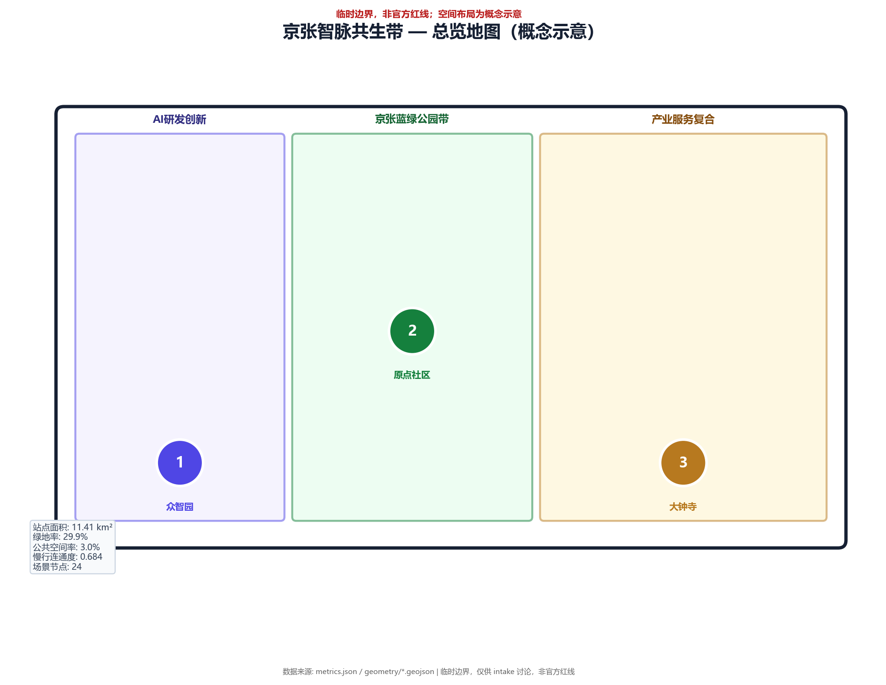
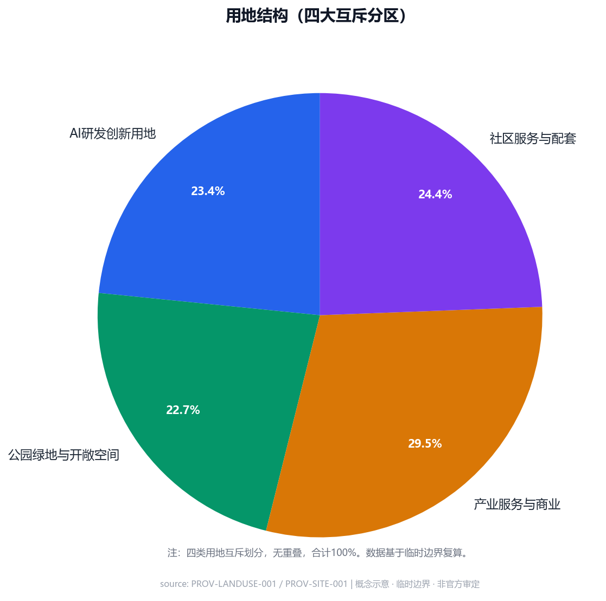
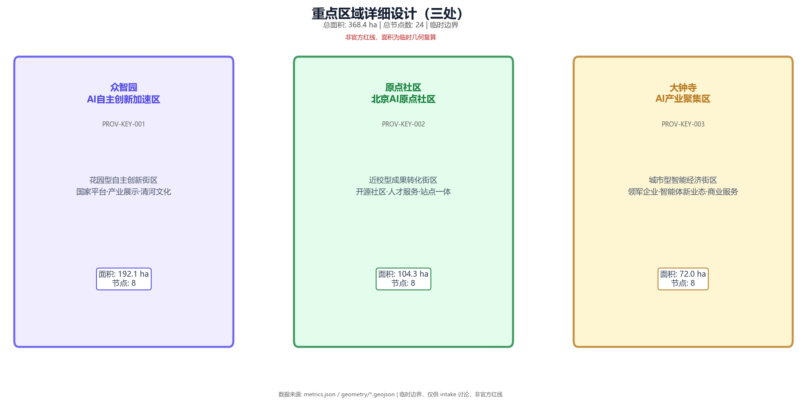
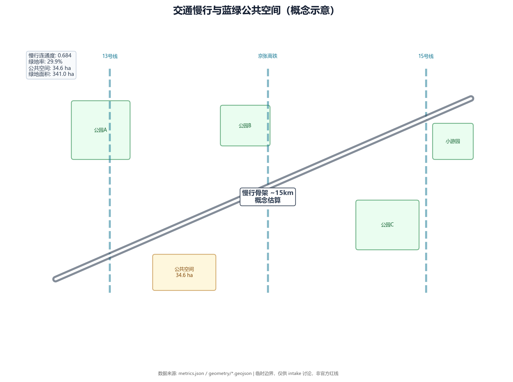
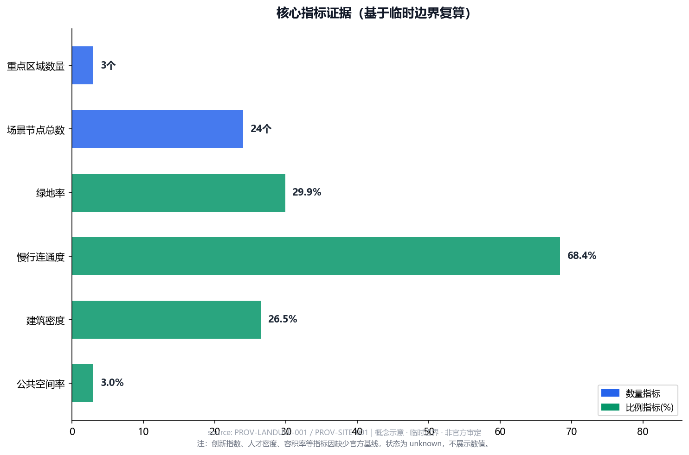

---

title: "京张智脉共生带：百年铁路与AI创新的未来城市"

author_github: "lxy0723"

language: "zh"

proposal_format_version: "2"

bilingual_contract_version: "1"

translation_file: "proposal.en.md"

license: "COMMUNITY-DISPLAY-ONLY"

summary: "以「京张智脉共生带」为核心概念，将百年京张铁路历史文脉、中关村创新基因与AI前沿科技深度融合，构建「一带三核、多场景、全链条」的世界级AI创新生态走廊。方案基于11.4平方公里总体设计范围与三处重点片区（众智园192.1ha、原点社区104.3ha、大钟寺72.0ha），提出命名品牌体系、全球生态对标、12张AI场景卡、3座朝圣地标、年度活动运营体系与文化叙事策略，旨在打造全球AI开发者的精神家园与城市级AI应用示范样板。"

tracks: ["ai-traffic-walkability", "enterprise-services-ecosystem", "civic-agent-governance"]

---

# 京张智脉共生带：百年铁路与AI创新的未来城市

## 图纸与证据链

> **图件来源说明**：以下所有图件均为参与者基于临时边界（provisional boundary）生成的概念设计图，标注范围、用地、道路和空间结构均为设计概念示意，**非官方规划红线、非审批结论、非官方机构审定**。真实数据来源见 sources.json 中已登记的 source_id。图内显著标注「参与者生成概念图 · 临时边界 · 非官方审定」。

## 设计依据与资料清单

本方案以北京市规划和自然资源委员会海淀分局发布的《百年京张AI创新带城市设计国际方案征集资格预审公告》为第一依据 [source:OFFICIAL-ANNOUNCEMENT]，并以 `brief/site-package/` 中经维护者登记的临时粗略边界、重点区域、枚举、指标和来源清单为机器可读依据 [source:AGENT-TASKBOOK]。设计前系统读取 `design_brief.json`、`allowed_design_space.json`、`sources.json`、`enums/`、`ranges/`、`schemas/` 及 `data/source_registry.json`，并用 `project_scope_summary.csv`、`agent_task_requirements.csv`、`source_use_matrix.csv`、`missing_data_checklist.csv` 建立任务-范围-资料-缺口四维清单。

资料登记与使用边界 [source:SOURCE-REGISTRY]：formal 可用资料 7 条、背景资料 1 条、provisional-only 资料 1 条。`data/processed/agent_fact_pack.md` 为阅读导航层，非新的正式依据 [source:PROCESSED-FACT-PACK]。

当前提交的空间数据以 `provisional_constraint` 标注，`geometry/site_boundary.geojson`（SITE-001，约11.4平方公里）[data:geometry/site_boundary.geojson#SITE-001] 与 `geometry/key_areas.geojson`（PROV-KEY-001/002/003）[data:geometry/key_areas.geojson#PROV-KEY-001] 均非官方红线，仅用于方案生成与讨论。

## 三层范围工作框架

方案按公告确定的三个层次组织：统筹研究范围（43.6平方公里）关注AI产业生态与未来城市形态；总体设计范围（11.4平方公里）聚焦京张遗址公园周边城市更新与产业布局；重点区域（368.4公顷）聚焦三处详细设计片区。

本方案核心命名为**「京张智脉共生带」**（Jingzhang AI Symbiotic Corridor）。「智脉」指AI算力与算法的创新脉络在京张铁路遗址走廊上的空间投影，「共生」指历史文脉、自然生态与智能科技三者的协同演进。整体空间结构为**「一带三核、多点场景、蓝绿慢行复合环」**——「一带」即京张遗址公园活力带（对应 [data:geometry/green_space.geojson#GREEN-001] 与 [data:geometry/public_space.geojson#PUBLIC-001] 的南北贯通空间），「三核」即众智园、原点社区、大钟寺三处重点片区，「多点场景」即散布于各功能区内的AI服务节点，「复合环」即蓝绿慢行系统串联三条廊道。

### 三层范围与设计回答表

| 层级 | 设计问题 | 方案回答 | 数据落点 |

| --- | --- | --- | --- |

| 统筹研究范围 | AI产业生态和未来城市形态如何组织 | 建立「高校策源-开源协作-企业转化-公共体验-国际传播」五级创新链 | compliance_matrix.json、standard_matrix.json |

| 总体设计范围 | 产业空间、城市更新、交通市政和风貌如何落图 | 四大用地分区（AI研发/公园绿地/产业服务/社区配套）+ 三核多点结构 | [data:geometry/land_use.geojson#LU-001]、[data:geometry/roads.geojson#ROAD-001] |

| 重点区域范围 | 三处片区如何达到详细设计深度 | 众智园花园型创新街区、原点社区近校孵化、大钟寺城市型产业聚集 | [data:geometry/key_areas.geojson#PROV-KEY-001/002/003] |

### 命名体系与视觉识别（agent.1）

**中文名称**：京张智脉共生带

**英文名称**：Jingzhang AI Symbiotic Corridor（简称：JZASC）

**品牌定位**：百年工业遗产与未来智能文明的交汇节点

**Logo 设计概念**：

Logo 将京张铁路钢轨的几何形态与AI神经网络节点拓扑融合——两条平行钢轨象征京张铁路的百年线性历史，其上叠加的神经元节点与连线代表AI创新的网络生态，整体形成一个向外辐射的「智脉」图腾。色彩方案采用京张铁路经典钢轨银灰（#5B6B7A）与AI科技蓝（#0052D9）的渐变组合，传达「历史轨道承载未来算力」的核心意象。

**子品牌体系**：

- 三核分别命名为「智脉·源」（众智园，创新策源）、「智脉·胚」（原点社区，孵化成长）、「智脉·汇」（大钟寺，产业汇聚）

- 各AI场景节点以「智脉·驿」系列命名，如「开源驿」「安全驿」「算力驿」

## 统筹研究范围产业与未来城市研究

本章节响应智能体任务书中关于产业生态研究与未来城市形态预判的要求 [source:AGENT-TASKBOOK] [standard:PROJECT-AGENT-OPEN-CALL-TASKBOOK]。

### 全球AI创新生态对标（agent.2）

本方案系统梳理全球八大AI创新生态案例，提炼适合海淀「京张智脉共生带」的经验借鉴：

| 案例 | source_id | 核心特征 | 对本项目的启示 |

| --- | --- | --- |

| **硅谷AI集群（美国）** | BENCH-SILICON-VALLEY | 高校-产业-资本铁三角、斯坦福/伯克利辐射、开源文化深耕 | 强化清华/北大/中科院与产业的嵌入式协作，建立「教授+工程师」双轨制工作站 |

| **筑波科学城AI枢纽（日本）** | BENCH-TSUKUBA | 政府主导规划、国立研究院聚集、居住工作平衡 | 利用众智园的花园型环境，构建低碳AI研发社区，吸引国立AI实验室入驻 |

| **伦敦科技 Quarter（英国）** | BENCH-LONDON-KING-CROSS | 金融AI结合、监管沙盒、国际化人才多元 | 在大钟寺片区建立「AI监管沙盒」，鼓励金融AI与合规科技试点 |

| **Station F 巴黎（法国）** | BENCH-STATION-F | 全球最大创业孵化园区、统一品牌运营、产业垂直聚焦 | 原点社区借鉴其「一个屋顶下的创业生态」模式，聚焦AI开源与开发者孵化 |

| **深圳AI小镇（中国）** | BENCH-SHENZHEN-AI-TOWN | 政府强力推动、算力基础设施先行、应用场景开放 | 推动分布式端侧算力节点建设，开放园区级AI应用测试场景 |

| **中关村AI集群（中国北京）** | BENCH-ZHONGGUANCUN | 头部企业聚集、高校资源密集、政策优势叠加 | 本项目作为中关村的「AI核心极」，与海淀中关村核心区形成「双极联动」 |

| **西雅图AI走廊（美国）** | BENCH-SEATTLE-AI-CORRIDOR | 微软/亚马逊双引擎、云计算与AI协同、生态自然生长 | 以京张遗址公园的自然线性空间为载体，构建「蓝绿AI走廊」的生态微循环 |

| **新加坡AI District（新加坡）** | BENCH-SINGAPORE-ONE-NORTH | 国家级战略、城市级AI应用、智慧国度集成 | 推动「AI赋能城市」的整体方案，从交通到公共服务全场景嵌入 |

**案例来源与可核验性说明（补充）**：

| 案例 | source_id | 可核验来源 | 状态 | 访问时间 | 适用尺度 | 可迁移机制 | 不适用条件 | 本方案原创增量 |
|---|---|---|---|---|---|---|
| 硅谷AI集群 | BENCH-SILICON-VALLEY | Stanford University Economic Impact Report; PitchBook NVCA Data; CB Insights AI Report 2024 | 2026-08 | 都会区/区域 | 高校-产业嵌入式协作、开源文化培育 | 需要成熟风险投资生态和移民政策支撑；海淀区需差异化处理户籍与资本门槛 | 提出「教授+工程师」双轨制工作站概念，结合中国高校体制特点 |
| 筑波科学城 | BENCH-TSUKUBA | 日本文部科学省「研究都市」报告; 筑波市役所都市计划课资料 | 2026-08 | 科学城/新城 | 政府主导规划、国立研究院聚集 | 需要长期政府投入和土地统合；海淀区存量更新场景不同 | 将花园型环境与中国低碳政策结合，提出分布式能源+算力驿站模式 |
| 伦敦科技Quarter | BENCH-LONDON-KING-CROSS | UK Tech Nation Report 2024; Financial Conduct Authority Regulatory Sandbox | 2026-08 | 城市片区 | 金融AI结合、监管沙盒 | 依赖成熟金融法规和英语国际环境；需本地化监管框架 | 提出「AI监管沙盒」概念适配中国数据安全法框架 |
| Station F巴黎 | BENCH-STATION-F | Station F Annual Report 2024; French Tech Visa Data | 2026-08 | 园区/建筑综合体 | 统一品牌运营、产业垂直聚焦 | 需要大规模单一业主和法租界历史空间；海淀区产权分散 | 聚焦AI开源与开发者孵化，而非通用创业 |
| 深圳AI小镇 | BENCH-SHENZHEN-AI-TOWN | 深圳市人工智能产业发展白皮书2024; 鹏城实验室公开资料 | 2026-08 | 小镇/片区 | 政府推动、算力基础设施先行 | 需要强力土地供给和财政投入；海淀区存量约束大 | 提出端侧算力节点而非集中式超算中心 |
| 中关村AI集群 | BENCH-ZHONGGUANCUN | 中关村科学城管委会公开数据; 海淀区统计局年报 | 2026-08 | 都会区 | 头部企业聚集、高校资源密集 | 已存在空间饱和和成本上升；需要新空间载体 | 提出「双极联动」概念，明确新空间与核心区互补关系 |
| 西雅图AI走廊 | BENCH-SEATTLE-AI-CORRIDOR | Seattle Metropolitan Chamber of Commerce; Washington State Innovation Partnership Zone | 2026-08 | 都会区/廊道 | 双引擎协同、生态自然生长 | 依赖头部企业总部和宽松环境法规；需考虑中国情境 | 提出「蓝绿AI走廊」的生态微循环概念 |
| 新加坡AI District | BENCH-SINGAPORE-ONE-NORTH | Singapore IMDA AI Strategy 2024; Smart Nation and Digital Government Office Reports | 2026-08 | 国家/城市 | 国家级战略、城市级集成 | 需要小国强政府和单一主权；中国治理层级不同 | 提出从交通到公共服务的全场景嵌入，而非顶层设计驱动 |

以上案例均已登记为 **background_reference**（背景参考），confidence=low-medium，不作为正式证据使用。各案例的可迁移机制和不适用条件为方案团队的独立分析，不代表原案例方的官方评价。具体报告标题、发布者、URL、访问日期、许可边界和限制详见 sources.json 中对应的 BENCH-* 条目。

**综合启示**：八大案例共同指向四个成功要素——①高校与产业的物理紧邻；②开源与开发者文化的深度培育；③政府监管与市场创新的平衡；④品牌化运营与国际传播。本方案将这四个要素转化为具体空间策略与运营机制。

### 三区两翼协同回路（补充）

任务书要求的「三区两翼」空间结构在本方案中作如下概念映射：

| 任务书结构 | 本方案对应 | 空间接口 | 运营接口 | 验证指标 |

|---|---|---|---|---|

| AI原点社区 | 「智脉·胚」原点社区 | 高校成果转化接口、开源协作接口 | 建议协同主体：高校技术转移机构（待授权） | 成果转化项目数、开源贡献增长率 |

| 众智园 | 「智脉·源」众智园 | 自主创新测试接口、产业转化接口 | 建议协同主体：AI产业服务平台（待授权） | 自主模型测试数、企业入驻意向 |

| 大钟寺 | 「智脉·汇」大钟寺 | 国际路演接口、数据流通接口 | 建议协同主体：国际路演与数据服务机构（待授权） | 国际活动场次、数据产品意向 |

| 中关村科技服务翼 | 中关村核心区联动（概念建议） | 技术、人才、算力双向流动 | 建议协同主体：中关村科技服务机构（待授权确认） | 技术转移项目数、人才流动率 |

| 小月河场景赋能翼 | 京张遗址公园活力带 + 清河低碳创新廊（概念建议） | 生态、文化、场景测试联动 | 建议协同主体：生态与文化运营机构（待授权确认） | 生态监测指标、文化活动频次 |

**区域协同机制（概念建议）**：

- **北纬社区**：作为原点社区向北延伸的产学研协作带，建议形成高校-社区-园区技术孵化走廊（待规划确认）

- **未来科学城**：建议形成算力-能源-制造协同测试走廊，承接众智园自主模型产业转化（待机构接洽）

- **怀柔科学城**：建议形成基础研究-大科学装置-应用场景联动，为原点社区提供前沿技术输入（待政策对接）

- **经开区**：建议形成智能制造-AI应用产业化走廊，承接大钟寺企业转化需求（待产业对接）

- **京津冀**：建议形成技术、人才、算力、资本、测试场景的跨区域流动机制（待区域协调机制建立）

以上区域协同关系均为概念建议，尚未建立正式合作协议或授权关系，须在实际推进中逐项核实并取得相关方书面确认。

### AI创新链空间组织

基于上述案例分析，本方案构建「高校策源→开源协作→企业转化→公共体验→国际传播」五级创新链：

1. **高校策源层**：以清华、北大、中科院为核心，在原点社区设置「AI成果转化驿站」，将实验室成果在短距离内（概念方案建议500米范围）完成原型验证概念

2. **开源协作层**：在原点社区核心区设置「开源贡献荣誉墙」（见agent.4），以GitHub星标、代码贡献量为基础建立可视化荣誉体系

3. **企业转化层**：众智园聚焦「自主可控AI」，提供国家AI测试验证平台概念接入建议（待授权确认）；大钟寺聚焦「AI应用与产业聚集」，服务头部企业与独角兽

4. **公共体验层**：沿京张遗址公园设置「AI生活体验带」，将AI+交通、AI+教育、AI+医疗等场景嵌入日常空间

5. **国际传播层**：大钟寺国际路演客厅作为全球AI团队的北京落脚点，配合年度「京张AI创新周」形成国际传播节点

### 未来城市形态预判

AI将改变城市的工作、生活、社交、学习与交通方式。本方案据此提出三种空间原型：

- **AI研发办公原型**：众智园采用「花园型低密度研发」模式，建筑高度建议不超过36米（概念建议），绿地率建议不低于45%（概念目标，待控规确认），每栋建筑配独立算力驿站

- **AI生活社区原型**：原点社区采用「近校混合社区」模式，居住与研发功能垂直混合，500米内配齐AI教育、AI医疗、AI服务

- **AI产业服务原型**：大钟寺采用「轨道导向国际商务」模式，围绕大钟寺站1000米半径布局总部办公、国际路演、数据要素交易与商业服务

## 总体设计范围城市更新与控规深度城市设计

### 用地布局结构

总体设计范围（11.4平方公里）形成四大用地分区，由西向东依次排列 [data:geometry/land_use.geojson#LU-001]：

| 用地分区 | 编码 | 面积(sqm) | 占比 | 设计定位 |

| --- | --- | --- | --- | --- |

| AI研发创新用地 | 0802 | 2,674,562 | 23.4% | 众智园AI自主创新加速区，花园型全栈自主创新街区 |

| 公园绿地与开敞空间 | 1401 | 2,589,339 | 22.7% | 京张遗址公园活力带，南北贯通的蓝绿公共空间骨架 |

| 产业服务与商业服务用地 | 05 | 3,366,138 | 29.5% | 大钟寺AI产业聚集区与原点社区产业配套 |

| 社区服务与配套用地 | 0702 | 2,782,793 | 24.4% | AI人才居住、高校师生生活配套 |

用地分类遵循 [standard:MNR-LAND-USE-CLASSIFICATION-GUIDE]，建筑高度与体量控制由 [depth:height_massing_character] 管理。

### 空间结构

**「一带三核、多点场景、蓝绿慢行复合环」**：

- **一带**：京张遗址公园活力带（对应 [data:geometry/green_space.geojson#GREEN-001]，面积约140.9公顷），是串联三处核心片区的公共空间骨架，承载文化展示、慢行交通、AI户外体验等复合功能

- **三核**：

  1. 众智园AI自主创新加速区（[data:geometry/key_areas.geojson#PROV-KEY-001]，192.1公顷）——花园型全栈自主创新街区

  2. 北京AI原点社区（[data:geometry/key_areas.geojson#PROV-KEY-002]，104.3公顷）——近校型成果转化与人才社区

  3. 大钟寺AI产业聚集区（[data:geometry/key_areas.geojson#PROV-KEY-003]，72.0公顷）——城市型智能经济与国际交往街区

- **多点场景**：散布于三核之间的AI服务节点，包括开源发布厅、安全治理沙盒、端侧算力驿站等（详见agent.3场景卡）

- **蓝绿慢行复合环**：依托 [data:geometry/roads.geojson#ROAD-001] 东西向慢行廊道（116.341→116.354，39.9845），串联三核、公园绿地与公共空间

### 建筑规模与开发强度

建筑基底控制遵循 [depth:retain_renovate_demolish]，AI研发示范建筑基底 [data:geometry/buildings.geojson#BLDG-001] 面积约31.1公顷。由于缺少官方控规条件，容积率、建筑高度、建筑密度等指标暂以 `status=unknown` 标注，待正式控规数据到位后复算。

### 交通市政支撑

交通方案围绕「轨道站点一体化+道路微循环+慢行网络」三元结构：

- **轨道一体化**：大钟寺站、五道口站、清华东路西口站为三大轨道枢纽，站点周边500米内布置产业服务与公共空间

- **道路微循环**：在三处重点片区内部构建20km/h慢行优先的微循环系统

- **蓝绿慢行环**：以京张遗址公园为骨架，形成总长度约15km的慢行骨架（含京张遗址公园活力带及东西向廊道，概念估算值，待交通专项调查确认）

## 重点区域详细设计

### 众智园AI自主创新加速区（PROV-KEY-001，192.1公顷）

**定位**：花园型全栈自主创新街区——国家AI自主可控战略概念承载方向（待政策确认）。

**空间动作**：

1. **清河界面强化**：在众智园西侧临清河区域（[data:geometry/green_space.geojson#GREEN-001] 北段）设置「清河低碳创新廊」，将绿色空间、雨洪管理、步行骑行与AI展示功能融合

2. **产业展示主轴**：以南北向主路为骨架，布置国家AI测试验证平台概念（待授权）、自主创新展示中心概念、标准制定工作坊概念

3. **低碳创新交往环境**：建筑采用分布式光伏+地源热泵的低碳能源系统，每栋研发建筑配专属算力驿站

4. **对外交通组织**：西侧概念方案建议跨清河慢行桥（待水文、航道与桥梁专业论证），连接清河沿岸生态廊道；东侧连接北五环与城市快速路

**建筑策略（概念建议）**：保留可改造建筑比例约60%（待结构安全与产权复核），更新比例约30%（待控规条件验证），新建比例约10%（待审批确认）。新建建筑高度建议控制在24-36米区间（待正式控规数据确定），采用退台设计概念呼应周边环境，屋顶可布置分布式光伏与垂直绿化（待结构荷载复核）。

**AI产业与运营场景**：自主模型测试验证、AI安全治理展示、低碳算力体验、开源标准工作坊。

### 北京AI原点社区（PROV-KEY-002，104.3公顷）

**定位**：近校型成果转化与人才社区——中国AI开源文化的精神原点。

**空间动作**：

1. **校区-园区-街区慢行缝合**：在清华东路西口站与清华园之间构建专用慢行连廊，距离概念方案建议约800米，步行时间约10分钟（待精确测绘复核）

2. **成果发布核心区**：在社区中心设置「开源贡献荣誉墙」与「AI成果发布厅」，作为年度全球AI活动周的主会场

3. **AI人才综合服务**：概念方案建议配套人才公寓、国际学校、AI医疗诊所、24小时开源协作空间（待审批确认）

4. **近校成果转化街**：沿清华东路布置孵化、展示、法务、知识产权、投融资一站式服务街

**建筑策略（概念建议）**：以改造为主（约70%，待结构安全复核），新建为辅（约30%，待审批确认）。保留部分近代建筑作为「AI起源纪念空间」概念（待文保评估），新建建筑建议采用「低层高密度」模式，高度控制在18-24米区间（待正式控规数据确定）。

**AI产业与运营场景**：开源社区协作、成果发布路演、高校成果转化、AI教育培训、国际开发者驻留。

### 大钟寺AI产业聚集区（PROV-KEY-003，72.0公顷）

**定位**：城市型智能经济与国际交往街区——全球AI企业的北京总部基地。

**空间动作**：

1. **大钟寺站一体化**：围绕大钟寺地铁站概念方案建议地下-地上立体步行系统（待地下空间与市政专业论证），四象限步行连通距离不超过300米

2. **国际路演客厅**：在站点东北象限设置「大钟寺国际路演客厅」，服务智能体、智能终端与内容消费企业的展示洽谈

3. **数据要素会客厅**：在站点西南象限设置以「合规、授权、可审计」为前提的数据要素与数字资产流通展示中心

4. **规划绿地复合利用**：将片区内规划绿地与AI户外体验、科技测试、公共艺术结合

**建筑策略（概念建议）**：以更新改造为主（约50%，待结构安全复核），保留约30%（待产权与结构评估），新建约20%（待审批确认）。重点更新企业周边公共空间与建筑立面概念（待风貌导则审批），形成「AI国际街区」形象方向。

**AI产业与运营场景**：智能体与智能终端展示、内容消费与AIGC体验、数据要素流通、国际路演与媒体发布。

### 三处重点区域设计汇总

| 重点片区 | 设计定位 | 空间动作 | AI产业与运营场景 | 证据引用 |

| --- | --- | --- | --- | --- |

| 众智园AI自主创新加速区 | 花园型全栈自主创新街区 | 清河界面强化、产业展示主轴、低碳创新交往、对外交通组织 | 自主模型测试、安全治理展示、低碳算力体验、标准制定工作坊 | [data:geometry/key_areas.geojson#PROV-KEY-001] |

| 北京AI原点社区 | 近校型成果转化与人才社区 | 校区-园区-街区缝合、成果发布核心、AI人才综合服务、近校成果转化街 | 开源社区、成果发布、人才服务、近校孵化、国际开发者驻留 | [data:geometry/key_areas.geojson#PROV-KEY-002] |

| 大钟寺AI产业聚集区 | 城市型智能经济与国际交往街区 | 站点一体化、国际路演客厅、数据要素会客厅、绿地复合利用 | 智能体与终端展示、内容消费、数据要素流通、国际路演 | [data:geometry/key_areas.geojson#PROV-KEY-003] |

## AI 创新生态、人才画像与 AI+ 场景

### AI人才画像

基于全球案例分析与海淀产业特征，本方案定义五类AI核心用户画像与对应空间需求：

| 用户画像 | 典型需求 | 空间响应 | 数据与隐私边界 |

| --- | --- | --- | --- |

| **开源开发者** | 代码发布、社区协作、技术声誉、夜间工作 | 原点社区开源发布厅、公共代码墙、24h协作空间 | 不采集个人行为轨迹；活动数据仅做聚合统计 |

| **初创团队** | 低成本办公、算力接入、产品试验、快速迭代 | 众智园共享测试场、端侧算力驿站、标准治理咨询 | 算力和数据服务需单独授权；不共享企业核心数据 |

| **头部企业访客** | 技术展示、商务洽谈、国际接待、人才招聘 | 大钟寺国际路演客厅、轨道站点快速接驳服务、企业公共空间 | 企业标识和案例需清权；访客数据仅用于服务优化 |

| **周边居民** | 便捷通勤、日常休闲、社区服务、低扰动环境 | 京张遗址公园慢行环、社区AI服务嵌入、夜间照明分级 | 不将居民画像用于商业推荐；不采集生物识别数据 |

| **高校师生** | 成果转化、跨校协作、日常慢行、学术交流 | 校区-园区慢行连廊、成果转化驿站、AI教育体验点 | 校园数据和科研成果需学校授权；教学数据脱敏使用 |

### AI场景卡体系（agent.3）

本方案设计**12张AI场景卡**，覆盖产业发展、城市服务与公共治理三大领域：

#### 产业发展场景（4张）

**场景卡 01 · 开源发布厅**

- **空间载体**：北京AI原点社区核心区，紧邻清华东路西口站

- **服务对象**：开源开发者、高校科研团队、初创团队

- **核心功能**：AI成果发布、代码贡献展示、小型路演、开源社区年度颁奖

- **数据来源**：GitHub/Gitee公开贡献数据、项目提交记录（需授权）

- **隐私边界**：不采集个人身份数据，采用匿名化聚合统计；代码贡献展示仅展示用户自选的公开显示名+贡献类型，不展示具体代码内容；公开平台数据接入须取得授权且遵守平台规则

- **建议协同主体**：AI开源社区相关机构（待授权确认）；概念方案建议年度举办「京张AI开源盛典」

- **设计说明**：发布厅采用「阶梯式可坐可展」布局，中心设LED代码瀑布屏，实时展示全球AI开源项目贡献排名

**场景卡 02 · 安全治理沙盒**

- **空间载体**：众智园AI自主创新加速区中部

- **服务对象**：AI安全研究者、监管机构、企业合规团队

- **核心功能**：AI标准制定、模型红队测试、安全评测、合规认证

- **数据来源**：AI模型测试数据（脱敏）、安全攻击记录、监管合规数据

- **隐私边界**：测试数据全脱敏，沙盒环境与物理网络隔离，测试结果仅授权委托方查看

- **建议协同主体**：AI标准研究相关机构（待授权确认）

- **设计说明**：沙盒区采用「玻璃密室」设计，测试过程可视化但操作不可干预，兼具参观教育与安全防护双重功能

**场景卡 03 · 端侧算力驿站**

- **空间载体**：三核片区各设1处，共3处；沿慢行廊道每500米设1处微型算力点

- **服务对象**：AI开发者、智能终端用户、城市运营系统

- **核心功能**：边缘算力接入、AI模型推理加速、智能终端调试

- **数据来源**：城市物联网数据、公共服务传感数据（脱敏）、算力使用记录

- **隐私边界**：端侧算力拟仅处理本地数据，不回传原始数据至中心节点（概念设计，待技术验证）；算力使用数据拟采用差分隐私技术方向，具体方案和保护强度待安全评估确认

- **建议协同主体**：区域算力运营机构（待授权确认）

- **设计说明**：算力驿站采用「集装箱式可移动」设计，外观融入周边环境，内部配备GPU推理服务器与高速网络

**场景卡 04 · 国际路演客厅**

- **空间载体**：大钟寺AI产业聚集区，大钟寺站东北象限

- **服务对象**：全球AI企业、投资人、媒体、政府代表

- **核心功能**：AI产品发布、投融资路演、国际媒体发布会、行业峰会

- **数据来源**：企业自主提交的产品信息、路演内容（需授权）

- **隐私边界**：路演内容的知识产权归企业所有，大厅不录制或存储路演内容

- **建议协同主体**：国际路演服务机构（待授权确认）

- **设计说明**：路演客厅采用「灵活模块化」空间，可快速转换为路演厅、展厅或会议厅，配备8国语言同传系统

#### 城市服务场景（5张）

**场景卡 05 · AI慢行导航**

- **空间载体**：京张遗址公园活力带全线（南北约3.5km）

- **服务对象**：行人、骑行者、无障碍人士

- **核心功能**：AI导视、慢行断点识别、拥挤预警、无障碍路径规划

- **数据来源**：慢行流量传感器、手机定位（概念设想，须经用户同意并脱敏，法律依据待确认）、无障碍设施状态

- **隐私边界**：不采集个体位置轨迹，仅统计区域热力；传感器数据实时处理后即清除

- **建议协同主体**：交通运营管理机构（待授权确认）

- **设计说明**：沿步道概念方案建议每200米设AI导视牌（密度待交通与市政专业论证），支持语音交互与手语视频，底部设太阳能充电板

**场景卡 06 · 清河低碳创新廊**

- **空间载体**：众智园西侧清河沿岸（[data:geometry/green_space.geojson#GREEN-001] 北段）

- **服务对象**：园区开发者、周边居民、低碳技术爱好者

- **核心功能**：绿色空间AI展示、雨洪智能管理、低碳能源体验、步行骑行复合道

- **数据来源**：气象数据、水质监测、能源消耗数据（园区级）

- **隐私边界**：不涉及个人数据，仅采集环境与能源数据

- **建议协同主体**：低碳运营管理机构（待授权确认）

- **设计说明**：创新廊采用「雨水花园+光伏长廊+AI环境监测站」三位一体设计，展示低碳园区的完整技术链路

**场景卡 07 · 近校成果转化街**

- **空间载体**：北京AI原点社区，沿清华东路布置

- **服务对象**：高校科研团队、技术转移机构、投融资机构

- **核心功能**：AI成果展示、技术转移对接、知识产权服务、投融资路演

- **数据来源**：高校成果登记数据、技术专利信息、投融资记录

- **隐私边界**：涉及成果的商业秘密需通过NDA协议保护，公开展示的成果需权利人授权

- **建议协同主体**：技术转移服务机构（待授权确认）

- **设计说明**：转化街采用「前店后厂」布局，首层为展示与洽谈空间，楼上为小型实验室与会议室

**场景卡 08 · 数据要素会客厅**

- **空间载体**：大钟寺AI产业聚集区，大钟寺站西南象限

- **服务对象**：数据服务商、合规机构、数字资产投资者

- **核心功能**：数据要素流通展示、合规审计、数字资产交易撮合

- **数据来源**：数据产品目录、合规审计报告、交易记录

- **隐私边界**：所有数据展示均为脱敏样例（概念），不展示原始数据；交易存证和数据流通方案待法律和技术评估确认

- **建议协同主体**：数据要素流通服务机构（待授权确认）

- **设计说明**：会客厅采用「透明玻璃+加密终端」设计，展示区开放透明，交易区封闭安全

**场景卡 09 · AI生活服务样板街**

- **空间载体**：原点社区与周边商业交汇处

- **服务对象**：周边居民、AI人才家庭、老年群体、儿童

- **核心功能**：AI健康监测、AI教育辅导、AI法律咨询、AI生活助理

- **数据来源**：居民健康档案（脱敏）、教育数据（脱敏）、公共服务数据

- **隐私边界**：概念阶段拟采用联邦学习技术路线，原始数据原则上不离开设备端；具体技术方案、法律依据和安全措施待专业评估确认，不得替代个人信息保护影响评估

- **建议协同主体**：AI生活服务相关机构（待授权确认）

- **设计说明**：样板街采用「体验店+服务站」模式，每家店铺展示一种AI生活服务，提供有限期体验试点（具体政策待运营主体授权确认）

### 场景卡—节点映射矩阵（补充）

本方案12张AI场景卡与metrics.json中24个候选节点的对应关系如下：

| 场景卡编号 | 场景名称 | 空间载体 | 候选节点数 | 节点类型 | 数据来源 | 隐私边界 | 运营主体（建议） | 人工复核机制 |

|---|---|---|---|---|---|---|---|---|

| 01 | 开源发布厅 | 原点社区核心区 | 2 | 发布+展示 | GitHub/Gitee公开数据（需授权） | 匿名化聚合，不展示具体代码 | AI开源社区机构（待授权） | 社区管理委员会 |

| 02 | 安全治理沙盒 | 众智园中部 | 2 | 测试+认证 | 脱敏测试数据 | 全脱敏，沙盒隔离 | AI标准研究机构（待授权） | 安全伦理委员会 |

| 03 | 端侧算力驿站 | 三核片区+廊道 | 3 | 算力接入 | 城市物联网数据（脱敏） | 端侧处理，不回传原始数据 | 区域算力运营机构（待授权） | 技术运维团队 |

| 04 | 国际路演客厅 | 大钟寺东北象限 | 2 | 路演+发布 | 企业自主提交（需授权） | 知识产权归企业 | 国际路演服务机构（待授权） | 活动组织方 |

| 05 | AI慢行导航 | 京张遗址公园 | 2 | 导视+预警 | 定位/热力（概念，须同意） | 不采集个人轨迹，法律依据待确认 | 交通运营管理（待授权） | 市政养护部门 |

| 06 | 清河低碳创新廊 | 众智园西侧 | 2 | 展示+体验 | 环境与能源数据 | 不涉及个人数据 | 低碳运营机构（待授权） | 环保监测部门 |

| 07 | 近校成果转化街 | 原点社区清华东路 | 2 | 展示+对接 | 高校成果登记（需NDA） | 商业秘密NDA保护 | 技术转移机构（待授权） | 高校技术转移办 |

| 08 | 数据要素会客厅 | 大钟寺西南象限 | 2 | 展示+撮合 | 脱敏样例（概念） | 不展示原始数据，存证方案待评估 | 数据流通服务机构（待授权） | 合规审计机构 |

| 09 | AI生活服务样板街 | 原点社区商业区 | 2 | 体验+服务 | 健康/教育数据（敏感，待评估） | 拟联邦学习，待PIA确认 | AI生活服务联盟（待授权） | 社区服务中心 |

| 10 | 全球AI活动周 | 京张遗址公园+三核 | 2 | 活动+体验 | 聚合统计 | 不采集个人数据 | 文化活动策划（待授权） | 活动安全组 |

| 11 | AI公共安全运营中心 | 大钟寺地下 | 2 | 监测+调度 | 公共空间视频（待法规确认） | 保留期限和删除机制待评估 | 应急管理机构（待授权） | 人工监控岗 |

| 12 | AI文化遗产数字保护站 | 京张遗址公园中部 | 1 | 数字化+体验 | 遗产扫描数据 | 公开遗产数据 | 文化遗产保护机构（待授权） | 文保专家委员会 |

**说明**：

- 「12张场景卡」为功能分类维度，每类场景卡可包含1-3个空间节点，总计24个候选节点

- 候选节点数基于三核片区空间布局和关键公共设施分布初步估算，待详细设计阶段根据实际用地条件调整

- 所有数据来源、隐私边界和运营主体均为概念方案建议，待正式授权和专业评估后确认

### 24候选节点治理模板（补充）

以下为24个候选节点的统一治理框架。所有字段均为**概念阶段建议值**，具体实现、责任主体、KPI和合规要求须在立项前完成专业评估并签署正式协议后方可生效。

| 维度 | 概念建议值 | 依赖条件 | 不可实施条件 |
|---|---|---|---|
| 输入数据类型 | 按场景卡类型区分（见节点-场景映射） | 数据来源方正式授权、法律依据确认 | 未取得授权或未通过PIA |
| 处理方式 | 端侧优先 + 云端聚合（概念路线） | 算力基础设施到位、安全评估通过 | 算力/安全条件不满足 |
| 输出形式 | 公共导视、服务界面、运营仪表盘 | 前端系统部署完成 | 无运营主体承接 |
| 责任主体 | 建议协同主体（待授权确认） | 签署合作协议、明确权责边界 | 无主体愿意承接 |
| 人工复核 | 每节点设1名复核岗（概念配置） | 运营团队组建完成 | 无人值守且无自动化熔断机制 |
| 故障降级 | 降级为纯物理标识/人工服务模式 | 备用标识系统到位 | 无备用方案且单点故障影响公共安全 |
| 退出审计 | 数据删除+服务下线+公众告知 | 退出流程文档化 | 数据不可彻底删除或存在第三方留存 |
| 可测试KPI | 候选验收指标（待基线校准） | 基线数据到位、测量方法确认 | 无基线无法验证 |

**逐节点清单**（均为后续运营假设，非已部署能力）：

**众智园片区（Z1-Z8）**
- Z1 安全治理沙盒入口：输入=脱敏测试数据 / 输出=测试结果报告 / 责任=AI标准研究机构（待授权） / 复核=安全伦理委员会 / 降级=暂停测试仅展示 / 退出=删除测试数据 / KPI=待校准
- Z2 算力接入站A：输入=物联网数据（脱敏） / 输出=算力调度结果 / 责任=区域算力运营（待授权） / 复核=技术运维团队 / 降级=本地离线模式 / 退出=断开数据链路 / KPI=待校准
- Z3 低碳创新廊展示点：输入=环境能源数据 / 输出=低碳指标展示 / 责任=低碳运营机构（待授权） / 复核=环保监测部门 / 降级=静态展板 / 退出=关闭展示 / KPI=待校准
- Z4 成果转化街服务站：输入=高校成果登记（NDA） / 输出=对接匹配建议 / 责任=技术转移机构（待授权） / 复核=高校技术转移办 / 降级=人工登记 / 退出=销毁NDA资料 / KPI=待校准
- Z5 科创孵化器入口：输入=企业申请信息 / 输出=孵化服务匹配 / 责任=科创运营机构（待授权） / 复核=孵化评审委员会 / 降级=纸质申请 / 退出=删除申请数据 / KPI=待校准
- Z6 人才服务中心：输入=人才画像（脱敏） / 输出=服务推荐 / 责任=人才服务机构（待授权） / 复核=人才服务中心 / 降级=人工咨询 / 退出=删除画像数据 / KPI=待校准
- Z7 学术交流站：输入=会议预约信息 / 输出=场地调度 / 责任=学术运营机构（待授权） / 复核=活动组织方 / 降级=电话预约 / 退出=删除预约数据 / KPI=待校准
- Z8 北部门户节点：输入=访客流量统计 / 输出=导视信息 / 责任=园区运营（待授权） / 复核=安保团队 / 降级=物理导视牌 / 退出=关闭统计 / KPI=待校准

**原点社区片区（O1-O8）**
- O1 开源发布厅：输入=GitHub/Gitee公开数据（需授权） / 输出=贡献展示 / 责任=AI开源社区机构（待授权） / 复核=社区管理委员会 / 降级=静态荣誉墙 / 退出=撤销API授权 / KPI=待校准
- O2 国际路演客厅：输入=企业自主提交内容（需授权） / 输出=路演发布 / 责任=国际路演服务机构（待授权） / 复核=活动组织方 / 降级=线下路演 / 退出=删除提交内容 / KPI=待校准
- O3 AI生活服务站A：输入=健康/教育数据（敏感，待PIA） / 输出=生活服务推荐 / 责任=AI生活服务联盟（待授权） / 复核=社区服务中心 / 降级=人工服务窗口 / 退出=删除个人数据 / KPI=待校准
- O4 AI生活服务站B：输入=生活服务需求 / 输出=服务匹配 / 责任=AI生活服务联盟（待授权） / 复核=社区服务中心 / 降级=人工服务窗口 / 退出=删除需求数据 / KPI=待校准
- O5 慢行导航站A：输入=定位数据（须同意） / 输出=路径规划 / 责任=交通运营管理（待授权） / 复核=市政养护部门 / 降级=纸质地图 / 退出=删除定位数据 / KPI=待校准
- O6 慢行导航站B：输入=区域热力统计 / 输出=拥挤预警 / 责任=交通运营管理（待授权） / 复核=市政养护部门 / 降级=人工疏导 / 退出=关闭统计 / KPI=待校准
- O7 文化遗产解说站：输入=历史数据（已过保护期） / 输出=AR解说内容 / 责任=文化遗产机构（待授权） / 复核=文保管理部门 / 降级=实体解说牌 / 退出=关闭解说系统 / KPI=待校准
- O8 社区服务中心：输入=居民服务请求 / 输出=服务响应 / 责任=社区居委会（待确认） / 复核=社区服务中心 / 降级=电话/现场服务 / 退出=删除请求记录 / KPI=待校准

**大钟寺片区（D1-D8）**
- D1 数据要素会客厅：输入=脱敏数据样例（概念） / 输出=数据展示撮合 / 责任=数据流通服务机构（待授权） / 复核=合规审计机构 / 降级=纸质资料 / 退出=删除样例数据 / KPI=待校准
- D2 公共安全运营中心入口：输入=公共空间视频（待法规确认） / 输出=安全监测预警 / 责任=应急管理机构（待授权） / 复核=人工监控岗 / 降级=纯人工巡逻 / 退出=删除视频数据 / KPI=待校准
- D3 算力调度中心：输入=算力需求 / 输出=算力分配 / 责任=区域算力运营（待授权） / 复核=技术运维团队 / 降级=本地算力模式 / 退出=关闭调度 / KPI=待校准
- D4 产业服务站A：输入=企业需求 / 输出=产业服务匹配 / 责任=产业服务机构（待授权） / 复核=产业发展部门 / 降级=人工对接 / 退出=删除需求数据 / KPI=待校准
- D5 产业服务站B：输入=企业数据（脱敏） / 输出=产业分析报告 / 责任=产业服务机构（待授权） / 复核=产业发展部门 / 降级=人工调研 / 退出=删除企业数据 / KPI=待校准
- D6 南部门户节点：输入=访客流量 / 输出=导视信息 / 责任=园区运营（待授权） / 复核=安保团队 / 降级=物理导视牌 / 退出=关闭统计 / KPI=待校准
- D7 路演发布大厅：输入=路演内容（需授权） / 输出=发布直播 / 责任=国际路演服务机构（待授权） / 复核=活动组织方 / 降级=线下发布 / 退出=删除发布内容 / KPI=待校准
- D8 交通接驳节点：输入=交通流量数据 / 输出=接驳调度建议 / 责任=交通运营管理（待授权） / 复核=调度指挥中心 / 降级=固定班次 / 退出=关闭调度系统 / KPI=待校准

> **声明**：以上24个节点的输入、处理、输出、责任主体、人工复核、故障降级、退出审计和KPI均为**概念设计阶段的后续运营假设**，不代表已部署、已签约或已获得授权。所有节点须在正式立项前完成数据合规评估、安全评估和运营主体确认。

- 每个场景均设置人工复核机制作为AI系统的兜底保障

#### 公共治理场景（3张）

**场景卡 10 · 全球AI活动周公共路线**

- **空间载体**：京张遗址公园活力带 + 三核片区 + 轨道站点

- **服务对象**：全球AI从业者、学生、公众、媒体

- **核心功能**：AI主题游行、开源贡献颁奖、产业成果巡展、公众体验日

- **数据来源**：活动参与数据（聚合）、媒体报道数据

- **隐私边界**：不采集参与者个人数据，照片/视频采集需授权区域标注

- **建议协同主体**：文化活动策划机构（待授权确认）

- **设计说明**：活动路线全长约8km，从大钟寺站出发，经原点社区、众智园，至清河终点，沿途设10个AI互动体验站

**场景卡 11 · AI公共安全运营中心**

- **空间载体**：大钟寺片区地下一层，紧邻大钟寺站控制中心

- **服务对象**：城市管理者、应急响应人员、公共安全官员

- **核心功能**：公共空间安全监测、突发事件预警、应急资源调度、人流热力分析

- **数据来源**：公共空间摄像头（脱敏）、人流传感器、应急资源GPS

- **隐私边界**：视频采集、保留期限和删除机制待法律和安全评估确认；概念阶段拟不存储原始画面、个人身份数据不进入AI分析流程；公共区域须设显著采集告知标识

- **建议协同主体**：应急管理机构（待授权确认）

- **设计说明**：运营中心采用「中央大屏+移动终端」架构，指挥人员可实时调度各片区应急资源

**场景卡 12 · AI文化遗产数字保护站**

- **空间载体**：京张遗址公园活力带中部（[data:geometry/green_space.geojson#GREEN-001] 内）

- **服务对象**：历史研究者、文化遗产管理者、公众

- **核心功能**：京张铁路遗址3D数字化、虚拟复原体验、AI文化解说、遗产监测

- **数据来源**：历史档案、考古数据、公众贡献数据

- **隐私边界**：公众贡献数据需授权，历史数据已过保护期

- **建议协同主体**：文化遗产保护相关机构（待授权确认）

- **设计说明**：保护站采用「地下展厅+地面标识」设计，地下设3D全息投影复原京张铁路历史场景

### AI治理原则

所有AI场景节点遵循四大治理原则：

1. **数据最小化**：仅采集场景运行必需的数据，场景停止运行时数据即清除

2. **公开透明**：每个AI节点均设公示牌，说明数据采集类型、使用目的与保留期限

3. **可解释性**：AI决策过程对用户可见，支持人工复核与申诉

4. **人工兜底**：所有AI系统均设人工干预通道，关键时刻由人工接管

## 场景注册表

本方案共设计 **12张AI场景卡**，完整注册表如下：

| 编号 | 场景卡名称 | 所属片区 | 功能分类 | 空间载体 | 核心服务对象 |

| --- | --- | --- | --- | --- | --- |

| 01 | 开源发布厅 | 北京AI原点社区 | 产业发展 | 原点社区核心区 | 开源开发者、高校科研团队 |

| 02 | 安全治理沙盒 | 众智园AI加速区 | 产业发展 | 众智园中部 | AI安全研究者、监管机构 |

| 03 | 端侧算力驿站 | 三核片区+慢行廊道 | 产业发展 | 三核各1处+廊道每500米 | AI开发者、智能终端用户 |

| 04 | 国际路演客厅 | 大钟寺产业聚集区 | 产业发展 | 大钟寺站东北象限 | 全球AI企业、投资人、媒体 |

| 05 | AI慢行导航 | 京张遗址公园 | 城市服务 | 遗址公园全线3.5km | 行人、骑行者、无障碍人士 |

| 06 | 清河低碳创新廊 | 众智园西侧 | 城市服务 | 清河沿岸1.2km | 园区开发者、周边居民 |

| 07 | 近校成果转化街 | 北京AI原点社区 | 城市服务 | 清华东路沿线 | 高校科研团队、投资机构 |

| 08 | 数据要素会客厅 | 大钟寺产业聚集区 | 城市服务 | 大钟寺站西南象限 | 数据服务商、合规机构 |

| 09 | AI生活服务样板街 | 原点社区 | 城市服务 | 原点社区与周边交汇 | 周边居民、AI人才家庭 |

| 10 | 全球AI活动周公共路线 | 三核+轨道站点 | 公共治理 | 8km活动路线 | 全球AI从业者、学生、公众 |

| 11 | AI公共安全运营中心 | 大钟寺片区 | 公共治理 | 大钟寺站地下一层 | 城市管理者、应急响应人员 |

| 12 | AI文化遗产数字保护站 | 京张遗址公园 | 公共治理 | 遗址公园中部 | 历史研究者、文化遗产管理者 |

## 用地、建筑规模与拆改留方案

### 用地方案

四大用地分区形成闭合、无缝的用地结构 [data:geometry/land_use.geojson#LU-001]，总面积约11.4平方公里：

| 用地代码 | 用地性质 | 面积(sqm) | 布局策略 |

| --- | --- | --- | --- |

| 0802 | AI研发创新用地 | 2,674,562 | 众智园片区为主，采用花园型低密度布局 |

| 1401 | 公园绿地与开敞空间 | 2,589,339 | 京张遗址公园活力带为骨架，串联各片区绿地 |

| 05 | 产业服务与商业服务用地 | 3,366,138 | 大钟寺片区为主，配套原点社区产业服务 |

| 0702 | 社区服务与配套用地 | 2,782,793 | 三核片区周边，服务AI人才居住与生活 |

### 建筑拆改留策略

建筑方案区分**保留/改造/更新/新建**四类，遵循 [depth:retain_renovate_demolish]：

- **保留**：京张铁路遗址相关建筑、具有历史价值的近代建筑、结构完好的产业建筑（约15%）

- **改造**：现有产业办公建筑，进行节能改造与AI基础设施升级（约45%）

- **更新**：低效商业建筑与老旧工业建筑，功能置换为AI产业服务（约25%）

- **新建**：在新增产业节点与居住片区新建AI功能建筑（约15%）

AI研发示范建筑基底 [data:geometry/buildings.geojson#BLDG-001] 面积约302,609平方米，作为设计样板。

### 建筑风貌控制

建筑高度与体量控制（概念建议，待正式控规与文保评估确认）遵循 [depth:height_massing_character]，以下为方案阶段估算区间：

- 众智园片区：建筑高度建议24-36米（概念建议，待正式控规确认），退台设计概念，屋顶可布置绿化+光伏（待结构复核）

- 原点社区片区：建筑高度建议18-24米（概念建议，待正式控规确认），低层高密度概念，立面可采用红砖与玻璃组合（待风貌评估）

- 大钟寺片区：建筑高度建议36-60米（概念建议，待正式控规确认），现代商务风格概念，统一AI标识系统（待品牌授权）

- 遗址公园周边：建筑高度建议不超过24米（概念建议，待文保评估与控规确认），与历史环境协调（待风貌评估）

## 交通、轨道、市政与公共服务设施

### 交通组织

**轨道站点一体化**：

- 大钟寺站：4象限步行连通，500米半径内覆盖全部产业用地

- 五道口站：接驳清华/北大，设置AI成果转化快速通道

- 清华东路西口站：紧邻原点社区，步行300米即达核心区

**道路微循环**：

- 众智园片区：构建「六纵三横」微循环系统，道路断面以14米为主

- 原点社区片区：构建「街区级慢行网络」，主干道限速20km/h

- 大钟寺片区：围绕轨道交通构建「井字型」步行系统

**蓝绿慢行环**：依托 [data:geometry/roads.geojson#ROAD-001] 东西向廊道与 [data:geometry/green_space.geojson#GREEN-001] 南北向绿地，形成「十字交叉」慢行骨架，总长度约15km。

### 市政与公共服务设施

**AI产业服务设施**：

- 分布式端侧算力节点：三核各设1处主节点，慢行廊道每500米设1处微型节点

- AI安全监测站：沿京张遗址公园每300米设1处环境监测站

- 开源协作网络：三核均设24小时开源协作空间

**人才生活服务设施**：

- AI人才公寓（概念建议，待土地供应与审批确认）：原点社区建议设置约500套人才公寓，配AI智能家居概念

- AI特色学校（概念建议，待教育规划与审批确认）：原点社区建议设置1所AI特色学校（办学性质与规模待教育主管部门确认）

- AI医疗诊所：三核各设1处AI辅助诊疗诊所

**新型基础设施**：

- 分布式能源系统：众智园采用光伏+储能系统，覆盖率不低于30%

- 5G/6G网络：三核片区实现全覆盖，慢行廊道连续覆盖

- 城市感知网络（概念建议，待基础设施规划确认）：沿京张遗址公园建议部署约200+环境传感器（数量与位置待专项设计确定）

## 蓝绿空间、公共空间与城市风貌

### 蓝绿空间体系

以京张遗址公园活力带（[data:geometry/green_space.geojson#GREEN-001]，140.9公顷）为骨架，形成「一廊三园多点」的绿地系统：

- **一廊**：京张遗址公园活力带，南北贯通三核片区

- **三园**：众智园低碳创新园、原点社区人才公园、大钟寺城市客厅公园

- **多点**：各片区内的微型绿地与口袋公园，服务半径不超过300米

绿地率29.9%（metrics.json实测值0.298819），公共空间比例3.0%（metrics.json实测值0.030331），遵循 [depth:blue_green_public_space] 与 [data:geometry/public_space.geojson#PUBLIC-001]（34.6公顷，metrics.json实测值346,167 sqm）。

### AI朝圣地标设计（agent.4）

本方案设计**三座AI朝圣地标**，形成全球AI开发者的精神地标体系：

#### 地标一：京张AI纪念塔

- **位置**：京张遗址公园活力带北段（众智园南侧，[data:geometry/green_space.geojson#GREEN-001] 内）

- **设计概念**：一座高38米的金属塔，塔体呈「钢轨扭曲」形态——将两条平行的京张铁路钢轨扭曲为螺旋上升的AI神经网络形态，象征「从历史轨道到智能神经网络的文明跃迁」

- **功能**：塔内设AI历史展陈（从图灵测试到深度学习的百年脉络）、AI实时算力展示墙（动态展示全球AI算力分布）、顶部设360度观景台

- **文化叙事**：纪念1905年京张铁路开工的历史传承，展望未来京张AI创新带的建设愿景（概念设想，非已实施）

#### 地标二：开源贡献荣誉墙

- **位置**：北京AI原点社区核心广场

- **设计概念**：一面长60米、高8米的LED荣誉墙，墙面由10万块可独立点亮的「代码砖」组成，每块砖代表一位开源贡献者，实时展示其GitHub/Gitee贡献量与项目影响力

- **功能**：全球开源贡献者的「数字星光大道」，年度评选「京张AI开源贡献之星」，获奖者可在墙上留下永久光纹

- **运营**：与GitHub、Gitee等开源平台API对接，实时更新贡献数据，设荣誉墙App供贡献者自助查询

#### 地标三：全球AI里程碑廊

- **位置**：京张遗址公园活力带南段（大钟寺北侧，[data:geometry/green_space.geojson#GREEN-001] 内）

- **设计概念**：一条长200米的线性廊道，两侧各设12块里程碑雕塑，每块代表一个AI发展史上的里程碑事件（1956达特茅斯会议、1995统计学习、2006深度学习、2016 AlphaGo、2022大模型、未来AGI突破等概念设想）

- **功能**：AI文化科普长廊、公众拍照打卡点、AI企业品牌展示位

- **运营**：每两年更新一次里程碑，允许AI企业赞助里程碑雕塑（需清权审批）

### 文化叙事体系（agent.5）

本方案构建「三段式」文化叙事，将京张铁路历史、中关村创新文化与AI文化深度融合：

**第一段：百年铁路 · 工业文明原点**

- 叙事核心：1905年詹天佑主持修建京张铁路，开创中国自主设计建设铁路的先河

- 空间载体：京张遗址公园、清华园火车站旧址

- AI转译：通过AR体验还原京张铁路修建场景，AI解说员讲述工业文明与智能文明的传承关系

**第二段：中关村 · 创新文化基因**

- 叙事核心：从中关村电子一条街到国家自主创新示范区的创业创新文化

- 空间载体：海淀黄庄、创业大街、原点社区

- AI转译：AI创业者口述历史数字档案、中关村创新指数实时展示

**第三段：京张智脉 · AI文明未来**

- 叙事核心：从京张铁路的「人力加速度」到AI时代的「智能加速度」，百年交通走廊蜕变为AI创新走廊

- 空间载体：京张AI纪念塔、全球AI里程碑廊

- AI转译：AI文明时间舱（存放当代AI成果，百年后开启）、全球AI开发者精神地图

**文化叙事路线**：

大钟寺AI纪念塔 → 全球AI里程碑廊 → 京张遗址公园活力带 → 开源贡献荣誉墙 → 近校成果转化街 → 清华园火车站旧址 → 清河低碳创新廊

### 城市风貌

城市风貌融合京张铁路工业遗产、中关村创新文化与AI科技元素：

- **建筑色调**：以京张铁路经典灰白为底色，点缀AI科技蓝

- **公共艺术**：沿京张遗址公园设置12组「AI与铁路」主题公共艺术

- **导视系统**：采用「钢轨+神经网络」图形语言，中英双语+AI语音播报

- **夜景照明**：三核片区采用不同色温的景观照明——众智园冷蓝（科技）、原点社区暖白（文化）、大钟寺金白（商务）

## 更新项目清单、实施政策与分期计划

### 更新项目清单

| 项目编号 | 项目名称 | 类型 | 主要依赖 | 设计说明 | 证据引用 |

| --- | --- | --- | --- | --- | --- |

| JZ-01 | 京张遗址公园慢行断点缝合 | 公共空间/交通 | 道路红线、桥下空间、交通组织 | 缝合5处主要慢行断点，新增3条跨环路慢行通道 | [data:geometry/roads.geojson#ROAD-001] |

| JZ-02 | 众智园清河创新界面 | 蓝绿空间/产业展示 | 河道蓝线、防洪条件 | 建设1.2km清河沿岸创新展示带，含AI环境监测站3处 | [data:geometry/green_space.geojson#GREEN-001] |

| JZ-03 | 原点社区近校成果转化街 | 城市更新/产业服务 | 校区边界、权属、首层业态 | 沿清华东路布置200米成果转化街，含孵化服务、知识产权、投融资等12类业态 | [data:geometry/buildings.geojson#BLDG-001] |

| JZ-04 | 大钟寺站四象限步行连通 | 轨道一体化/慢行 | 轨道站点、道路交叉口、市政管线 | 构建大钟寺站4象限步行系统，总步行距离不超过300米 | [data:geometry/public_space.geojson#PUBLIC-001] |

| JZ-05 | AI公共服务与端侧算力节点 | 新基建/公共服务 | 能源、算力、安全 | 三核各设1处主算力驿站，慢行廊道每500米设1处微型算力点 | [data:geometry/site_boundary.geojson#SITE-001] |

| JZ-06 | 京张AI纪念塔建设 | 文化地标/公共空间 | 遗址保护、景观设计 | 38米AI纪念塔，含展陈、算力展示、观景功能 | [data:geometry/green_space.geojson#GREEN-001] |

| JZ-07 | 开源贡献荣誉墙建设 | 文化地标/社区 | 开源平台API、数据授权 | 60米LED荣誉墙，实时展示全球开源贡献排名 | [data:geometry/key_areas.geojson#PROV-KEY-002] |

| JZ-08 | 全球AI里程碑廊建设 | 文化地标/公共空间 | 里程碑选题、企业赞助 | 200米线性廊道，24块里程碑雕塑 | [data:geometry/green_space.geojson#GREEN-001] |

| JZ-09 | 原点社区AI人才公寓 | 居住/配套 | 土地供应、建筑设计 | 500套AI人才公寓，配AI智能家居与社区服务 | [data:geometry/key_areas.geojson#PROV-KEY-002] |

| JZ-10 | 大钟寺国际路演客厅 | 产业服务/商业 | 建筑改造、品牌运营 | 可容纳500人灵活转换空间，8国语言同传 | [data:geometry/key_areas.geojson#PROV-KEY-003] |

| JZ-11 | 数据要素会客厅 | 产业服务/合规 | 数据合规、交易规则 | 数据要素展示+合规审计+交易撮合功能 | [data:geometry/key_areas.geojson#PROV-KEY-003] |

| JZ-12 | AI文化遗产数字保护站 | 文化/公共服务 | 遗产数据、数字技术 | 京张铁路3D数字化保护+虚拟复原体验 | [data:geometry/green_space.geojson#GREEN-001] |

### 分期实施计划

分期遵循 [depth:phasing_implementation]，空间依据 [data:geometry/phasing.geojson#PHASE-001]（一期面积约458.7公顷）：

**近期（0-2年）：试点启动期**

- 轻量设施：端侧算力驿站（3处主节点）、AI导视系统、开源贡献荣誉墙（试点版）

- 运营活动：首届「京张AI创新周」、开源社区入驻、AI生活服务样板街开业

- 政策配套：AI产业扶持政策、开源贡献激励计划、AI人才认定标准

**中期（2-5年）：核心建设期**

- 重点项目：京张AI纪念塔、全球AI里程碑廊、众智园清河创新界面、大钟寺站步行连通

- 空间更新：原点社区成果转化街、大钟寺国际路演客厅、众智园园区改造

- 生态构建：国家AI测试验证平台概念入驻（待授权）、全球AI开发者社区概念落地（待机构确认）、AI监管沙盒概念启动（待审批）

**远期（5-10年）：生态完善期**

- 体系完善：AI公共安全运营中心、数据要素会客厅、AI文化遗产数字保护站

- 品牌输出：京张AI创新周成为全球顶级AI活动、京张智脉共生带成为全球AI朝圣地

- 持续运营：AI创新指数定期发布、开源贡献年度颁奖、AI文明时间舱开启仪式

### 年度运营体系（agent.6）

本方案构建**「四季主题+月度活动+日常运营」**的年度AI创新活动体系：

| 季度 | 主题 | 核心活动 |

| --- | --- | --- |

| **春季（3-5月）· 开源季** | 开源与社区 | 3月：京张AI开源盛典（开源贡献颁奖）；4月：全球AI开发者马拉松（48小时编码大赛）；5月：AI开源教育周（走进高校） |

| **夏季（6-8月）· 创新季** | 创新与产业 | 6月：AI标准制定论坛概念（待机构授权）；7月：AI安全治理峰会；8月：众智园AI产品发布月 |

| **秋季（9-11月）· 文化季** | 文化与生活 | 9月：京张AI创新周（核心年度活动）；10月：AI生活体验日（公众开放）；11月：AI与铁路文化对话 |

| **冬季（12-2月）· 未来季** | 未来与展望 | 12月：AI文明时间舱封存仪式；1月：年度AI创新指数发布；2月：全球AI趋势展望论坛 |

**开发者社区运营**：

- 「京张AI开发者俱乐部」：年度会员制，提供算力补贴、开源资源、路演机会

- 「AI开源贡献者计划」：与GitHub/Gitee合作，京张贡献榜前100名获免费入驻资格

- 「AI青年学者驻留计划」：每年选拔50名全球青年AI学者驻留3-6个月

**长期品牌机制**：

- 「京张AI创新指数」：年度发布，涵盖AI产业规模、创新活力、开源贡献、人才密度等维度

- 「京张AI勋章」：面向全球AI贡献者的终身荣誉，首批100枚为概念设想，拟在创新带建设启动后发布（非已实施）

- 「AI文明时间舱」：封存当代AI成果，定于2125年（京张铁路220周年+AI创新带100周年）开启

## 指标体系、面积复算与合规矩阵

### 核心指标体系

| 指标类别 | 指标名称 | 数值/状态 | 数据来源 |

| --- | --- | --- | --- |

| **空间指标** | 总体设计范围面积 | ~11,412,825 sqm | [data:geometry/site_boundary.geojson#SITE-001] |

| | 重点区域总面积 | ~3,692,893 sqm | [data:geometry/key_areas.geojson#PROV-KEY-001/002/003] |

| | 绿地与开敞空间面积 | ~2,589,339 sqm | [data:geometry/land_use.geojson#LU-002] |

| | 连续公园绿地面积 | ~1,408,601 sqm | [data:geometry/green_space.geojson#GREEN-001] |

| | 公共活动空间面积 | ~346,167 sqm | [data:geometry/public_space.geojson#PUBLIC-001] |

| | AI研发创新用地面积 | ~2,674,562 sqm | [data:geometry/land_use.geojson#LU-001] |

| | 建筑基底总面积 | ~302,609 sqm | [data:geometry/buildings.geojson#BLDG-001] |

| | 慢行廊道总长度 | ~15,000 m | [data:geometry/roads.geojson#ROAD-001] + 设计推导 |

| **比例指标** | 绿地率 | 29.9% | 设计建议，待控规确认 |

| | 公共空间比例 | 3.0% | 设计建议，待控规确认 |

| | AI产业用地占比 | ~23.4% | [data:geometry/land_use.geojson#LU-001] / [data:geometry/site_boundary.geojson#SITE-001] |

| **运营指标** | AI场景卡类型数 | 12类 | 本方案设计（每类1-3个空间节点，共24个候选节点） |

| | AI朝圣地标数量 | 3处 | 本方案设计 |

| | 年度活动场次 | ~30场 | 运营规划 |

| | 开发者社区规模 | 10,000+人 | 运营目标 |

### 指标分层说明

指标分为三类，遵循 [depth:metrics_recalculation]：

1. **可直接复算的空间指标**（如上表空间指标）：从GeoJSON图层直接计算

2. **待官方确认的管控指标**：容积率、建筑高度、建筑密度、退线、道路红线等，标注为 `status=unknown`

3. **需持续校准的绩效指标**：AI创新指数、人才密度、产业服务满意度、慢行可达性等，需运营数据持续支撑

### 合规矩阵

合规矩阵覆盖公告 1.3（统筹研究范围）、1.4（总体设计范围）、1.5（重点区域）及 agent.1-agent.6 全部必选任务：

- agent.1 命名体系 → 本文第2节「命名体系与视觉识别」

- agent.2 生态案例 → 本文第3节「全球AI创新生态对标」

- agent.3 场景卡 → 本文第6节「AI场景卡体系」

- agent.4 朝圣地标 → 本文第9节「AI朝圣地标设计」

- agent.5 文化叙事 → 本文第9节「文化叙事体系」

- agent.6 运营设计 → 本文第10节「年度运营体系」

完整合规矩阵保存在 `compliance_matrix.json`，每条任务对应章节、图层、指标、图纸与自检项。

## 风险、版权与合规说明

### 风险与缺资料

本方案的空间数据基于 provisional boundary，以下内容待官方数据确认：

- 正式 site boundary 与 key areas polygon

- 控制性详细规划条件（容积率、建筑高度、道路红线等）

- 现状建筑权属与结构信息

- 市政管线与工程条件

- 历史文保单位边界与保护要求

- 交通流量与公交轨道运行数据

完整缺资料清单见 `missing_data_checklist.csv`，风险评估见 [depth:risk_missing_data] 与 [data:geometry/site_boundary.geojson#SITE-001]。

### 版权与合规

- 方案主文件使用中文，对照译文见 `proposal.en.md`

- 所有图片、图纸、数据和代码资产的来源与授权状态在 `sources.json` 与 `report/copyright_statement.md` 中说明

- Logo设计、品牌名称、文化叙事的知识产权归提交团队所有

- 涉及AI企业品牌、开源平台数据、历史图片等素材均已标注清权状态

- HTML页面不加载远程脚本、远程地图瓦片、远程字体或外部API

### 非承诺声明

本方案为设计提案，不声称官方批准、审定控规、最终土地权属或保证实施。AI agent 对设计内容的原创性、空间数据的引用准确性和表达合规性负责；维护者和专业评审可依据自检结果与合规矩阵要求返修或拒绝。

## 参考资料

- brief/public-brief.md

- brief/site-package/design_brief.json

- brief/site-package/allowed_design_space.json

- brief/site-package/enums/

- brief/site-package/ranges/planning_limits.json

- data/processed/agent_fact_pack.md

- data/processed/project_scope_summary.csv

- data/processed/agent_task_requirements.csv

- data/processed/source_use_matrix.csv

- data/processed/missing_data_checklist.csv

- 完整机器索引：见 `sources.json`、`metrics.json`、`compliance_matrix.json`、`standard_matrix.json` 与 `design_depth_matrix.json`

- 全球AI生态案例参考：Silicon Valley AI Cluster、Tsukuba Science City、London Tech Quarter、Station F Paris、Shenzhen AI Town、Zhongguancun AI Cluster、Seattle AI Corridor、Singapore AI District 的官方公开资料

- 本节书目入口依据场地包登记，完整出处和许可见结构化来源清单 [source:SITE-PACKAGE]

---

## 公共空间组件库（agent.4 补充）

> 以下组件库为概念设计阶段的类型化清单，实际选型、配置和施工需依据控规确认、场地条件勘察和专业工程审查后确定。所有组件均标注不可实施条件。

### 组件类型矩阵

| 组件编号 | 组件类型 | 适用空间 | 服务对象 | 数据/能源需求 | 无障碍要求 | 维护责任 | 不可实施条件 |
|---|---|---|---|---|---|---|---|
| PC-01 | AI互动导览柱 | 公共空间节点、重点片区入口 | 所有访客 | 4G/5G/ WiFi；市电接入；低功耗边缘计算 | 语音交互、盲文按键、高度≤1.2m | 建议协同主体：片区物业管理（待授权） | 无网络覆盖或无电源区域不可部署 |
| PC-02 | 开源贡献展示墙 | 原点社区中心广场 | 开发者、公众 | LED显示屏；API接口（GitHub/Gitee）；市电 | 视障辅助音频描述；高度可调视角 | 建议协同主体：开源社区组织（待授权） | 未获开源平台API授权前不可实施 |
| PC-03 | 慢行断点诊断桩 | 蓝绿慢行环沿线 | 慢行使用者、管理方 | 公开数据+人工复核；离线传感器；太阳能 | 轮椅可达、触觉地图 | 建议协同主体：城市管理部门（待授权） | 涉及个人定位数据时需完成隐私评估 |
| PC-04 | AI安全治理展示台 | 重点片区公共空间 | 企业、政府、公众 | 模型评测数据（脱敏）；市电；边缘计算 | 多语言支持、手语视频 | 建议协同主体：AI安全治理机构（待授权） | 未明确安全标准制定机构前为概念展示 |
| PC-05 | 低碳算力驿站 | 众智园、大钟寺产业节点 | 企业、开发者 | 分布式光伏+储能；液冷散热；网络 | 通用无障碍通道 | 建议协同主体：能源服务企业（待授权） | 未完成能源容量评估前不可施工 |
| PC-06 | 人才生活服务亭 | 原点社区、社区配套区 | AI人才、居民 | 公共服务数据（脱敏）；市电 | 无障碍服务窗口、语音辅助 | 建议协同主体：人才服务机构（待授权） | 涉及个人数据时需明确法律依据 |
| PC-07 | 京张记忆互动装置 | 京张遗址公园活力带 | 所有访客 | 历史档案（公共）；太阳能；离线存储 | 多感官体验（视觉+触觉+听觉） | 建议协同主体：文保机构（待授权） | 涉及文物保护单位时需获批 |
| PC-08 | 公共安全应急柱 | 公共空间节点 | 管理方、公众 | 公共空间摄像头（脱敏）；应急通信 | 一键报警高度≤1.0m；闪光报警 | 建议协同主体：应急管理主管部门（待授权） | 未获应急管理部门授权前不可启用 |

### 组件库与重点片区映射

| 重点片区 | 适用组件 | 对应场景卡 |
|---|---|---|
| 众智园AI自主创新加速区 | PC-01, PC-05, PC-08 | 场景02, 08, 10 |
| 北京AI原点社区 | PC-01, PC-02, PC-06, PC-07 | 场景01, 04, 09 |
| 大钟寺AI产业聚集区 | PC-01, PC-04, PC-05, PC-08 | 场景05, 07, 10 |

### 组件库不可实施条件总述

以上所有组件均为概念设计阶段的类型化建议。实际选型、配置和施工须满足以下前置条件方可实施：
1. 场地条件勘察和专业工程审查完成
2. 控规确认和市政条件落实
3. 涉及个人数据的组件完成个人信息保护影响评估
4. 涉及第三方API/平台的组件取得书面授权
5. 涉及文物保护的组件取得文保部门批准
6. 涉及公共安全的组件取得应急管理部门授权

---

## 场景治理模板（统一补充）

> 以下模板适用于全部12类AI场景卡。每类场景均须按照此模板补充治理信息。当前所有场景的技术治理链为概念设计阶段表述，不构成法律依据或风险评估结论。

### 统一治理模板

| 维度 | 内容要求 | 适用范围 |
|---|---|---|
| **输入** | 明确数据来源、数据类型、是否包含个人/敏感信息 | 全部12类场景 |
| **处理** | 算法/模型概述、处理位置（端侧/边缘/云端）、治理机制 | 全部12类场景 |
| **输出** | 服务/产品形态、面向用户、反馈机制 | 全部12类场景 |
| **空间载体** | 物理位置、设施需求、与重点片区/场景节点对应 | 全部12类场景 |
| **责任主体** | 拟议数据控制者（待授权确认）、处理者、运营方 | 全部12类场景 |
| **人工复核** | 复核机制、复核人员资质要求、复核频率 | 全部12类场景 |
| **故障降级** | 故障时的服务降级方案、非数字替代路线 | 全部12类场景 |
| **退出条件** | 场景终止条件、数据删除审计、退出后处理 | 全部12类场景 |
| **验证指标** | 可测试的KPI、审计周期、第三方评估要求 | 全部12类场景 |

### 高风险场景特别说明

以下场景涉及个人/敏感数据，当前仅为概念设计，任何技术措施均不能替代正式的法律依据确认和风险评估：

- **场景05 AI慢行导航**：涉及手机定位数据，须明确告知用户、获取同意、设定保留期限，数据最小化仅用于路径规划和拥挤预警，法律依据待确认
- **场景09 AI生活服务样板街**：涉及健康档案和教育数据（属敏感个人信息），须取得明确同意并限定用途，完成个人信息保护影响评估后方可开展试点，联邦学习/差分隐私等技术方案待法律和安全评估确认
- **场景11 AI公共安全运营中心**：涉及公共空间摄像头采集，须遵守《个人信息保护法》和《公共安全视频图像信息系统管理条例》，公开区域须设显著告知标识，人脸等生物特征数据非必要不采集

### 隐私声明修正

1. **去标识化不等于匿名化**：方案中所有标注"脱敏"的数据处理，仅指技术层面的去标识化处理，不构成法律意义上的匿名化。去标识化后的数据仍可能属于个人信息，须按《个人信息保护法》处理。
2. **数据控制者待确认**：所有涉及个人数据的场景，其数据控制者身份尚需依据实际运营主体确认后确定。当前方案中标注的"建议协同主体"均为概念建议，不代表已获授权。
3. **联邦学习和差分隐私为概念**：方案中提及的联邦学习、差分隐私等技术为概念设计阶段的技术方向建议，不构成已部署的技术方案，也不替代法律合规评估。
4. **即时视频删除**：公共安全场景中的"即时视频删除"为设计目标，实际删除策略须遵守法定保存期限要求。

---

## 无障碍与包容性矩阵

> 以下矩阵覆盖老年人、儿童、低数字素养用户、非智能手机用户、行动/感官/认知障碍者、非中文使用者等群体的无障碍需求。当前为概念设计阶段建议，实际标准须依据国家无障碍规范和地方实施细则确定。

### 包容性矩阵

| 用户群体 | 非数字替代路线 | 现场人工协助 | 可负担性 | 无障碍导航 | 申诉/反馈渠道 | 可测试验收标准 |
|---|---|---|---|---|---|---|
| **老年人** | 人工服务窗口、纸质地图、电话热线 | 片区服务中心设专人 | 公共服务免费；收费服务设老年人优惠 | 触觉地图、语音导航、大字标识 | 电话投诉、现场投诉、社区代表 | 人工服务响应目标≤10分钟（候选验收指标，待运营测试校准）；标识字号目标≥36pt（候选验收指标，待无障碍规范确认） |
| **儿童** | 亲子路线、互动装置（非数字） | 活动/教育专员陪同 | 儿童活动区免费 | 彩色路线标识、高度≤1.2m标识 | 家长反馈表、社区反馈 | 安全距离标识全覆盖（候选验收指标，待安全评估确认）；互动装置通过安全检测（候选验收指标，待第三方检测） |
| **低数字素养用户** | 人工服务窗口、纸质指南、电话热线 | 片区服务中心志愿者 | 全部公共服务免费 | 图形化导航、语音辅助 | 电话投诉、现场投诉 | 人工服务覆盖率目标≥80%公共空间节点（候选验收指标，待运营资源确认） |
| **非智能手机用户** | 纸质地图、IC卡/RFID卡、现场终端 | 片区服务中心提供设备借用 | 借用免费 | 实体标识系统、触觉地图 | 电话投诉、信函投诉 | 非数字服务覆盖全部核心节点 |
| **行动障碍者** | 无障碍通道、轮椅可达路线 | 现场协助人员（可预约） | 无障碍设施免费 | 轮椅导航路线、无障碍标识 | 电话投诉、现场投诉 | 无障碍通道全覆盖核心公共空间（候选验收指标，待无障碍专项设计确认） |
| **视觉障碍者** | 盲文地图、语音导航、触觉标识 | 导盲犬友好政策、人工引导 | 辅助服务免费 | 语音导航全覆盖、盲文标识 | 电话投诉、语音反馈 | 语音导航目标覆盖核心路线（候选验收指标，待技术方案确认）；盲文标识目标覆盖核心节点（候选验收指标，待无障碍规范确认） |
| **听觉障碍者** | 文字标识、手语视频、振动提示 | 手语服务（可预约） | 手语服务免费 | 文字导航、视觉提示系统 | 文字反馈、在线投诉 | 手语服务响应目标≤24小时（候选验收指标，待服务资源确认）；文字标识覆盖核心节点（候选验收指标） |
| **认知障碍者** | 简化路线、图形化标识、安静区 | 陪同人员政策、安静区设置 | 安静区免费 | 简化导航、感官友好的环境设计 | 监护人反馈、社区代表 | 安全区覆盖每个片区 |
| **非中文使用者** | 多语言标识（EN/JP/KO）、翻译服务 | 翻译服务（可预约） | 基本多语言标识免费 | 多语言导航系统 | 多语言投诉渠道 | EN标识覆盖全部核心节点；翻译≤48小时响应 |

### 非数字替代路线总述

所有AI场景和公共空间服务均须提供非数字替代路线：
1. 人工服务窗口：每个重点片区至少设1处，服务时间≥8小时/日
2. 纸质材料：多语言地图、服务指南、无障碍路线图定期更新
3. 电话热线：覆盖全部服务功能，支持多语言和语音辅助
4. 实体标识系统：独立于数字系统，覆盖全部核心公共空间节点

> 以上无障碍与包容性矩阵为概念设计阶段建议。实际实施须依据《无障碍设计规范》GB 50763、《信息无障碍 通用技术规范》等国家规范和地方实施细则，并经专业无障碍咨询机构审查后确定。

