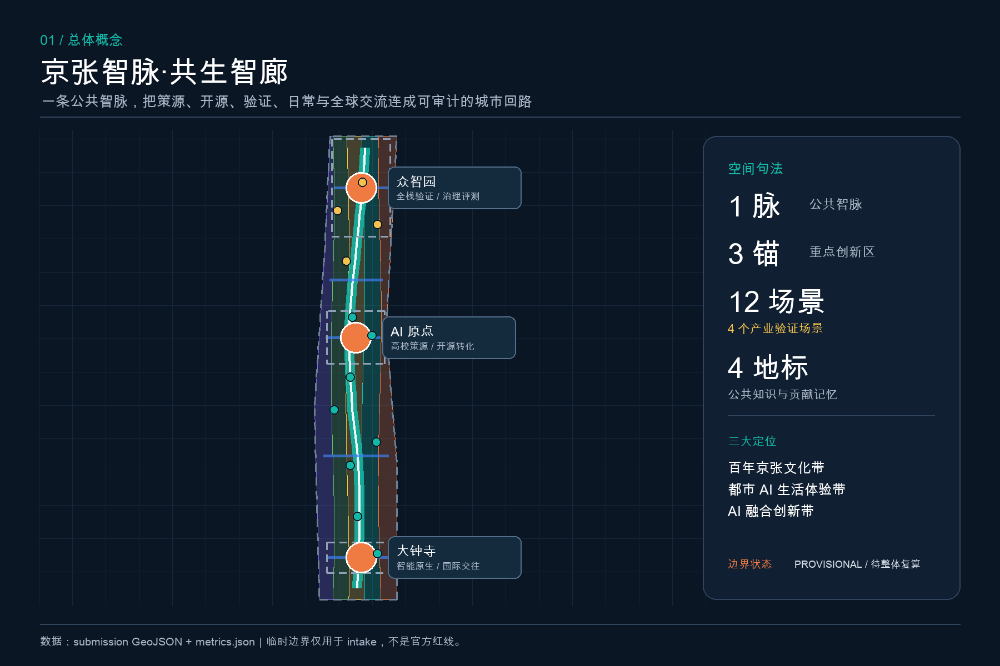
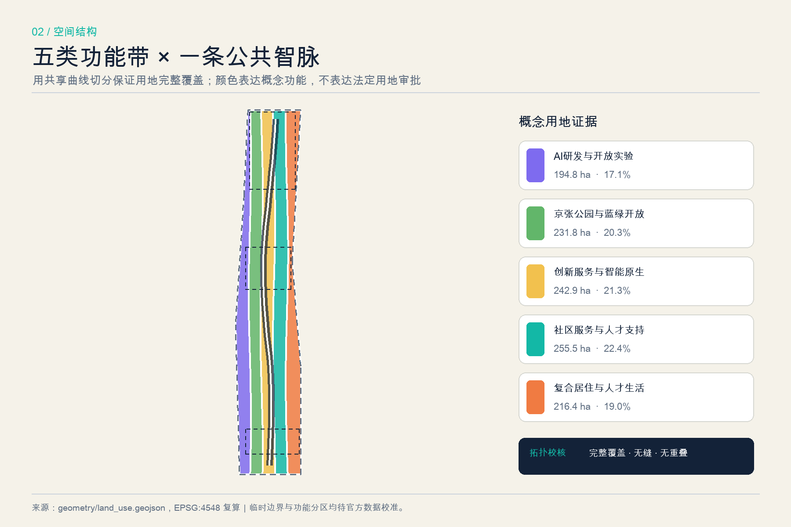
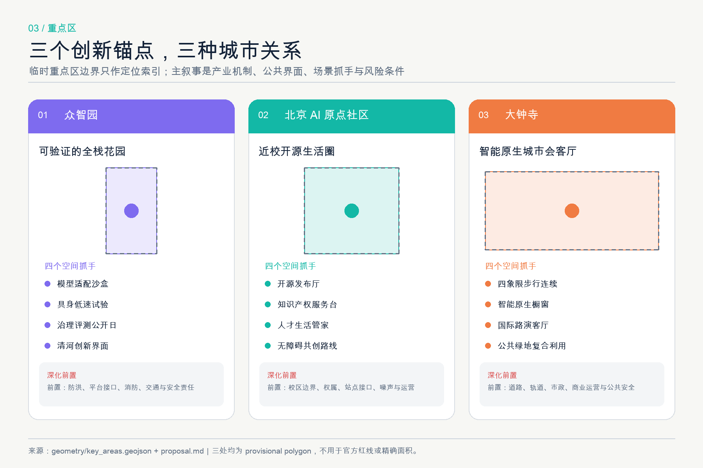
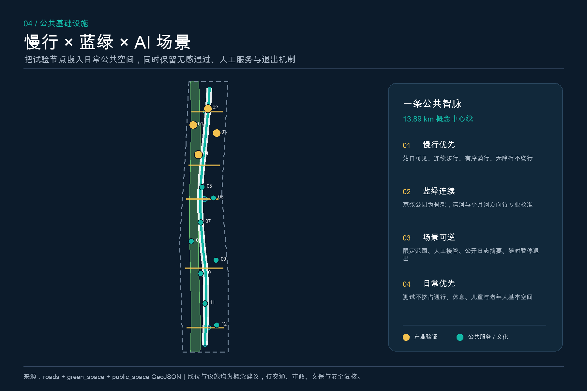
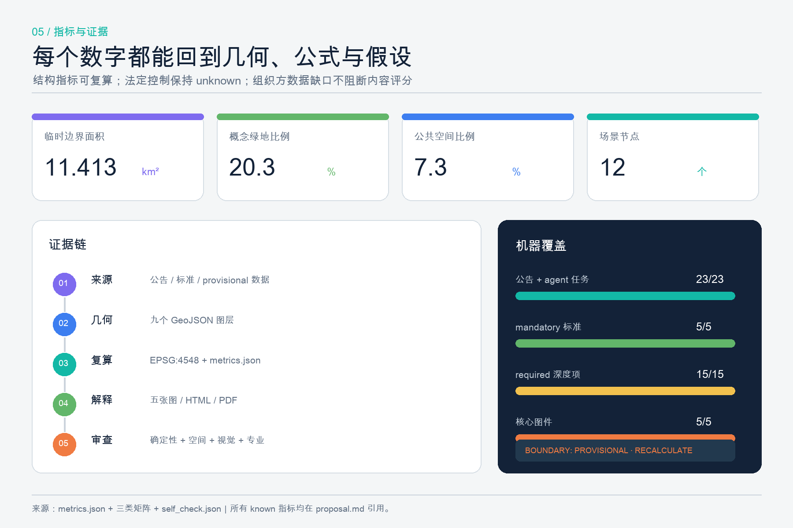

# Jing-Zhang Smart Vein · Coexistence Smart Corridor | Jing-Zhang Intelligence Commons

Jing-Zhang Intelligence Commons

## Design Basis and Source List

This scheme's judgment is divided into three layers of evidence: the first layer consists of official announcements, clearance task documents, and national professional standards that can serve as task references; the second layer includes temporary rough spatial data registered by the warehouse maintainers; and the third layer comprises the conceptual design layers, indicators, and graphics generated by this scheme. Official announcements are used to confirm the project name, three-layer scope, announced area, and design tasks [source:DATA-SRC-OFFICIAL-ANNOUNCEMENT-20260509]; the agent task book is used to confirm the three major locations, five major functions, the Three Zones and Two Wings, and the mandatory content for agent.1 to agent.6 [source:DATA-SRC-AGENT-TASKBOOK-20260518]. The registration form is only responsible for determining whether the materials can be used for formal, background, or provisional intake, and does not replace the original sources [source:SOURCE-REGISTRY]; the fact package is merely a reading navigation [source:PROCESSED-FACT-PACK].

Public Spaces, appearance, and architectural relationships in Urban Design are organized according to a snapshot of local standards [source:DATA-SRC-MOHURD-URBAN-DESIGN-MEASURES] [standard:MOHURD-URBAN-DESIGN-MEASURES]; expressions related to the control detailed planning strictly distinguish between legal conditions, Conceptual Recommendations, and pending confirmations [source:DATA-SRC-MOHURD-CONTROL-DETAILED-PLANNING] [standard:MOHURD-CONTROL-DETAILED-PLANNING]; land use codes adopt a subset of the national spatial classification from the land registry [source:DATA-SRC-MNR-LAND-USE-CLASSIFICATION-202311] [standard:MNR-LAND-USE-CLASSIFICATION-GUIDE]. The project announcement and agent task book are mapped to [standard:PROJECT-OFFICIAL-ANNOUNCEMENT] and [standard:PROJECT-AGENT-OPEN-CALL-TASKBOOK], respectively. The architectural engineering design depth standard currently lacks an official document text and is only used as a subsequent deepening gap. It does not take the third-party mirror upgrade as the basis [standard:MOHURD-ARCH-DESIGN-DEPTH-2016].

The current warehouse does not have official precise overall Official Planning Boundaries and three key polygon areas. This plan uses the provisional geometry provided by the maintainer [source:DATA-SRC-PROVISIONAL-BOUNDARIES-20260605], corresponding to [data:geometry/site_boundary.geojson#SITE-001] and [data:geometry/key_areas.geojson#PROV-KEY-001]. These graphics only support open-source submissions intake, topological testing, visualization, and directional discussions, but cannot be used as official planning boundaries, precise areas, land ownership, legal controls, or construction implementation references. Once the official polygons are released, the site boundary, key areas, land use, buildings, roads, green spaces, public spaces, phasing, all indicators, the five charts, A3/A0, and HTML must be recalculated in their entirety, rather than being locally replaced. (Official Planning Boundary) The current diagnosis therefore presents "known task facts, temporary spatial constraints, and pending professional documentation" in parallel [depth:existing_conditions_diagnosis].

## Three-Level Scope Framework

The Coordinated Research Area covers approximately 43.6 square kilometers and is responsible for addressing how the AI Innovation Ecosystem in Haidian should integrate with universities, enterprises, communities, technology services, and the coordinated development of the Beijing-Tianjin-Hebei region. The Overall Design Area covers approximately 11.4 square kilometers and is responsible for translating the judgment of industry and future cities into Urban Renewal, Public Space, active transportation, utilities, and service networks. The Key-Area Detailed Design Area covers approximately 368.4 hectares and is responsible for validating spatial strategies through three directional pilot areas: Zhongzhiyuan, Beijing AI Origin Community, and Dazhongsi. These three levels are not three sets of unrelated drawings, but a closed loop of "strategic assumptions—spatial prototypes—local validation—indicator feedback" [source:DATA-SRC-OFFICIAL-ANNOUNCEMENT-20260509] [depth:three_level_scope_framework].

This proposal outlines a structure of "one vein, three anchors, two wings, twelve scenes, and four public memory points." The one vein is the public wisdom vein organized along the Jing-Zhang Heritage Park. The three anchors correspond to three key areas. The two wings correspond to the Zhongguancun Technology Services Wing and the Xiaoyue River Scenario Enablement Wing. The twelve scenes ground the industrial validation and daily services at locatable nodes. The four public memory points connect the Jing-Zhang Railway, Zhongguancun innovation, and AI new culture into a walkable narrative. The land use, cycling and pedestrian paths, Public Spaces, scenes, and phased developments all derive from a single Provisional Boundary [data:geometry/land_use.geojson#LU-RD-001] [data:geometry/roads.geojson#ROAD-SPINE-001] [data:geometry/public_space.geojson#PUBLIC-COMMONS-001], and are recalculated using EPSG:4548, without resorting to graphical estimates as a substitute for structured data.

The responsibility boundaries for the three levels of outcomes are also different: the coordinated level only proposes cooperative mechanisms and regional relationships; the overall level forms spatial structures, functional zoning, and project interfaces that are available for in-depth study by professional teams; the key area level forms conceptually detailed designs, which do not replace the control plan, comprehensive implementation plan, or engineering design. All matters involving the Floor Area Ratio, height, Building Coverage Ratio, road red lines, municipal capacity, cultural heritage controls, ownership, and specific Demolish–Renovate–Retain Strategy items are kept in assumptions.json for confirmation and are uniformly indexed by [data:geometry/constraints.geojson#GAP-CONTROLS-001].

## Coordinated Research Area: Industry and Future City Research

The core of "Jing-Zhang Intelligence Commons" is not to recreate a closed park, but to view AI innovation as a public knowledge infrastructure. The Chinese main name "Jing-Zhang Intelligence Commons" translates the physical connections brought by the railway into a continuous connection of data, knowledge, talent, and community; the sub-name "Coexistence Corridor" emphasizes the shared network of research, industry, residents, and culture. The English name "Jing-Zhang Intelligence Commons" uses "Commons" rather than "Park," indicating that it is first and foremost a set of mechanisms that can be collectively used, governed, and audited. The logo direction features a continuous line: two parallel short lines come from the railway imagery, the middle segment becomes an open circuit, three nodes represent three key areas, and the end leaves an opening to represent open-source collaboration. The colors are limited to "railway deep gray, innovation blue, ginkgo green, and signal orange," using system fonts and original geometric designs without replicating any corporate trademarks or existing visual assets [source:DATA-SRC-AGENT-TASKBOOK-20260518]. (Public Space)

The three primary orientations are distributed within the same structure: the Jing-Zhang Cultural Belt provides temporal depth, the Urban AI Living Experience Belt provides public perceptibility, and the AI Fusion Innovation Belt provides technological and industrial transformation. The five functional components form a cycle: Zhongzhiyuan bears full-stack independent innovation and governance evaluation; the AI Origin community bears university-originated innovation, open-source collaboration, and technology transfer; Dazhongsi bears intelligent native business forms and international exchanges; the Zhongguancun Technology Services Wing provides intellectual property, capital, talent, and professional service interfaces; and the Xiaoyue River Scenario Enablement Wing provides public scenario testing, resident feedback, and urban service validation. The spatial structure is expressed by [data:geometry/land_use.geojson#LU-INNO-001], [data:geometry/public_space.geojson#SCN-01], and [depth:overall_spatial_structure], and cannot remain merely in naming and slogans.

Six international case studies are used only for background mechanism comparison and do not derive the red lines, control values, investment, or institutional commitments for Haidian.

| Case | Verifiable Mechanism | Translation of Jing-Zhang Zhi Mai | Applied Boundaries |
| --- | --- | --- | --- |
| MIT Kendall Square | Research, Innovation Space, Housing, Retail, and Mixed-Use Organization [source:CASE-KENDALL-MIT] | Connecting Labs, Community, and Culture through Public Space and Ground-Level Shared Interfaces | Only as Mixed-Use Background |
| Toronto MaRS | Supports the growth of innovative projects through interdisciplinary collaboration to promote adoption and scaling [source:CASE-MARS-TORONTO] | Establishes a scenario transformation ledger for "validation—procurement/adoption—review" | Does not cite its scale or funding |
| Paris STATION F | Concentrate entrepreneurial support, partner co-construction, experimental zones, and community operations [source:CASE-STATION-F] | Consolidate the open-source release, mentor services, and small-scale validation from the original community into an accessible public interface | Avoid replicating physical scale |
| Barcelona 22@ | Urban Renewal with Technology, Creative Industries, Knowledge Sector, and Public Connectivity [source:CASE-BARCELONA-22AT] | Promote the synchronized advancement of industrial spaces, housing services, and blue-green Public Spaces with minimal disruption | No assumption of land or zoning changes |
| Singapore one-north | Related industry clusters, living accompaniments, and living lab testing mechanism [source:CASE-ONE-NORTH-JTC] | Forming a tiered safety review scenario and exit pilot agreement for industrial validation | Does not represent that the test has been approved |
| London Knowledge Quarter | Cross-Institutional Alliance, Knowledge Openness, Community Connection, and Unified Regional Brand [source:CASE-KQ-LONDON] | Replacing single-park operation with member covenant, annual themes, and public knowledge pathways | No commitment to members or events |

Six examples collectively suggest that the competitiveness of an innovation district does not stem solely from building area, but from proximity collaboration, public interaction, verifiable scenarios, continuous operation, and clear branding. Jing-Zhang Smart Vein establishes a "source creation—open source—validation—adoption—public feedback—redevelopment" collaborative loop; each step retains the source, responsible party, Human Review, and exit mechanism. The number of cases is recorded by [metric:global_case_count], and the mechanism response is located by the agent.2 entry in compliance_matrix.json.

## Overall Design Area: Urban Renewal and Regulatory-Plan-Level Urban Design

The overall design concept employs "one public smart vein, five functional belts, three groups of stitching horizontal links, and distributed public nodes." The five functional belts are not proposed statutory land uses but a topological safety scheme divided by shared curves: the west side for AI research and development and open experiments, the mid-west side for the Jing-Zhang Park and blue-green open spaces, the center for innovation services and intelligent native industries, the mid-east side for community services and talent support, and the east side for mixed residential use and talent living. They fully cover the temporary overall boundary seamlessly and without overlap, respectively falling within [data:geometry/land_use.geojson#LU-RD-001], [data:geometry/land_use.geojson#LU-GREEN-001], [data:geometry/land_use.geojson#LU-INNO-001], [data:geometry/land_use.geojson#LU-CIVIC-001], and [data:geometry/land_use.geojson#LU-LIVING-001] [depth:land_use_layout].

The update method is not based on a direct map judgment of retention or demolition, but rather establishes a four-step screening process: first, verify the building, ownership, cultural heritage, and safety conditions; then, assess public accessibility, industrial suitability, carbon emissions, and operational value; subsequently, compare various paths including retention, minor renovation, functional replacement, supplementation, and reconstruction; and finally, determine the outcome through statutory planning, professional evaluation, and public participation. The buildings in geometry/buildings.geojson are merely a set of conceptual capacity prototypes used to test the relationship between Public Space and functional zones [data:geometry/buildings.geojson#BLDG-001], and do not correspond to actual conclusions regarding the demolition or construction of specific parcels. Development Intensity, total building scale, and height remain unknown [depth:development_intensity_controls], avoiding the creation of a Provisional Boundary to instill a sense of finality.

Urban Design controls are divided into three layers: "must maintain, suggest form, and await professional confirmation." What must be maintained includes public interest, continuous pedestrian and bicycle access, green open spaces, respect for cultural resources, accessibility, and scene exitability; what is suggested to form includes the first-floor open interface, shared meeting and exhibition spaces, mixed services, flexible experimental units, and public corridors; what awaits confirmation includes Building Height, massing boundaries, roof equipment, fire safety, utilities, traffic capacity, cultural heritage line of sight, and four lines. The suggested architectural style should focus on restrained industrial heritage materials, reversible lightweight components, clear first floors, and low-carbon updates, without relying on giant screens or decorative "futuristic" elements to replace urban quality [depth:height_massing_character].

## Detailed Design of Key Areas

Three key areas polygons are all derived from provisional data and are only used for directional detailed design. The status can be found at [data:geometry/key_areas.geojson#PROV-KEY-001], [data:geometry/key_areas.geojson#PROV-KEY-002], and [data:geometry/key_areas.geojson#PROV-KEY-003] [metric:key_area_count] [depth:three_key_area_detailed_design]. The drawings reduce the temporary rectangular boundaries to light dashed lines and focus on functional loops, public interfaces, scenario nodes, and dependency conditions.

### Zhongzhiyuan: A Verifiable Full-Stack Garden

Located as a garden-type district for innovative self-reliance and governance evaluation. Spatially, it features the Qinghe direction's blue-green interface as the public living room, with a "reservation-only" model adaptable sandbox, embodied intelligence low-speed test loop, end-side computational and energy collaboration testing, and AI governance evaluation nodes forming a "research—validation—display—review" loop. Building updates prioritize evaluating whether existing carriers can be low-disturbance renovated through shared experimental units, ground-level exhibitions, and integration of rooftop energy and equipment. External transportation only proposes park shuttle services, prioritizing pedestrian and bicycle traffic, and cross-5th-ring research, without specifying road alignments or bridge conclusions. The Qinghe Blue Line, flood control, road right-of-way, national platform interfaces, and safety responsibilities must be confirmed in depth [data:geometry/public_space.geojson#SCN-01].

### Beijing AI Origin Community: Near School Open Source Living Circle

Positioned as a near-campus innovation community that fosters university-originated innovation, open-source collaboration, technology transfer, and the visibility of talent. Spatially, it is recommended to form four types of public interfaces: "Open-Source Exhibition Hall—Intellectual Property and Legal Service Counter—Talent Life Manager—Barrier-Free Collaborative Pathway," which are connected by walkable routes linking research, incubation, residence, culture, and services. The update strategy focuses on small-scale first-floor openness, courtyard sharing, zoned nighttime activities, staggered quiet R&D and public events, and avoids turning residential communities into 24/7 exhibition spaces. The relationships with stations such as Wudaokou and the west end of Tsinghua East Road are only for integrated research directions, and the actual interfaces must be confirmed by the rail, traffic, and campus management authorities [data:geometry/public_space.geojson#SCN-05].

### Dazhongsi: Intelligent Native City Living Room

Positioned as a city-type innovation district for intelligent bodies, smart terminals, content consumption, and international exchanges. With the quadrants of the Dazhongsi station as the primary public issue, transform corporate displays from closed exhibition halls into city lounges that are bookable, explainable, and do not over-collect data; smart-native consumption theaters showcase product capabilities, applicable boundaries, risks, and access points for human services. Planning for green spaces emphasizes compatibility with daily leisure, short-term roadshows, and public testing periods, without prioritizing events over basic public services. Junction connections, underground spaces, non-motorized vehicle parking, and key enterprise interfaces are merely reference solutions that must be reviewed by property rights, traffic, municipal, and safety specialists [data:geometry/public_space.geojson#SCN-12].

## AI Innovation Ecosystem, Personas, and AI+ Scenarios

Ecological design is based on the fundamental unit of "who is using, what problem they are solving, in what space, what data they need, and who can halt it." The six types of profiles are not individual profile libraries but anonymous role models for service needs; they do not record individual trajectories or use the profiles for targeted commercial purposes, with the count seen at [metric:persona_count].

| User Profile | Core Needs | Spatial Response | Public Interest Constraints |
| --- | --- | --- | --- |
| University Researchers | Trustworthy Transformation, Interdisciplinary Collaboration, Short-Term Validation | Original Community Open Source Release Hall and Nearby Collaborative Space | Prioritize Research Outcomes and Participant Authorization |
| Open Source Developers and Startup Teams | Low-Threshold Collaboration, Computing Power Entry, Reputation Recording | Zhongzhiyuan Sandbox, Public Contribution Wall, Nighttime Zoning Space | Contributions Reversible, No Forced Identity Display |
| Mature Enterprise R&D and Visitor Engagement | Product Validation, Collaboration Facilitation, International Reception | Dazhongsi Urban Living Room and Booking Display Interface | Avoid Making the Business Attraction Sound Like a Promise |
| Surrounding Residents and Families | Quiet, Safe, Convenient Services and Accessible Parks | Community Service Points, Pedestrian Circles, Activity Period Grading | Residents Can Opt Out of Testing, Maintain Non-Digital Services |
| Elderly, Children, and Persons with Disabilities | Barrier-Free, Explainable, With Backup | Barrier-Free Co-Creation Path, Onsite Service Desk, Priority Entry for Humans | High-Risk Recommendations Should Not Be Automated |
| Frontline Service Personnel and Urban Managers | Clear Work Orders, Manageable Burden, Traceable Responsibility | Operations Collaboration Platform, Human Review Station, and Post-Event Reflection Space | AI Enhances Capabilities but Does Not Replace Responsibility Subject |

Four scenario cards out of twelve belong to the industrial Testing and Validation Scenario, all adopting the protocol of "limited scope, minimal data, tiered review, human takeover, log auditing, public notification, and post-exit debriefing" [metric:scenario_node_count] [metric:industrial_validation_scenario_count] [depth:municipal_new_infrastructure]:

| Identifier and Scenario | Type / Space | Service Object and Operational Data | Human Review, Operations, and Risk Boundaries |
| --- | --- | --- | --- |
| 01 Full Stack Model Adaptation Sandbox | Industry Validation / Zhongzhiyuan | Developer; Public Test Set, Authorized Samples, and Performance Logs | Independently Evaluated by an External Assessor, Not Integrated into Production Systems; Conceptual Operational Entity is the Scenario Committee |
| 02 Bodily Intelligence Low-Speed Test Loop | Industrial Validation / Edge of Zhongzhiyuan Green Space | Robot Team and Public; Equipment Status, Closed Test Records | Physical Isolation, On-Site Safety Officer, Emergency Stop; Not Equivalent to Road Operation Approval |
| 03 End-Side Computational Energy Coordination Testing | Industrial Validation / Service Node | Enterprise and Facility Operations; Energy Consumption, Temperature, and Anonymous Load | Facility Engineer Review, Capacity and Fire Safety Conditions Pending Confirmation |
| 04 AI Governance Evaluation and Red Team Public Day | Industry Validation / Zhongzhiyuan | Model Teams, Researchers, and the Public; Authorized Model Outputs and Issue Reports | Results Reviewed by Experts, Sensitive Cases Anonymized, No Ranking Endorsement |
| 05 Open Source Release Hall | Public Innovation / Origin Community | Higher Education Institutions, Teams, and the Public; Voluntarily Submitted Project Metadata | Contributor Confirmation License, With Retraction and Correction Windows |
| 06 Talent Life Manager | Public Services / Origin Community | New Talent and Families; User-Initiated Service Preferences | On-site Service Desk as a Last Resort, No Cross-Scenario Personal Profile Established |
| 07 AI Pedestrian and Cyclist Protection | Transportation / Jing-Zhang Public Smart Vein | Pedestrians, cyclists; aggregation of passenger flow, manual patrol, and construction work orders | Provides route suggestions, traffic management confirmed by personnel |
| 08 Accessible Route Co-Creation | Inclusive / Public Space | Mobility Impaired, Seniors, and Stroller Families; Voluntary Feedback and Facility Status | Participants Can Remain Anonymous, Issue Fixes Confirmed by Responsible Units |
| 09 Community Health Navigation | Public Services / Community Nodes | Residents; Public Service Directory and User Active Input | Only for medical appointment navigation, not for diagnosis or replacement of medical personnel |
| 10 Intellectual Property and Legal Services Desk | Business Services / Origin Community | Teams and Researchers; Public Regulations and Authorization Documents | Reviewed by Lawyers or Professional Personnel, No Definitive Legal Conclusions Output |
| 11 Jing-Zhang Memory Tour | Culture / Heritage Park | Residents and Visitors; Qing Rights Historical Materials, Location, and Accessibility Information | Facts Reviewed by Curators and Heritage Conservation Staff, No Fictional Character Narratives Generated |
| 12 Intelligent Native Consumption Theater | Urban Life / Dazhongsi | Consumers and Product Teams; Voluntary Experience Feedback | Explicitly Define AI Boundaries, Preserve Human Service, Do Not Perform Emotion or Facial Profiling |

The authoritative positioning of the scenes and spaces is from [data:geometry/public_space.geojson#SCN-01] to SCN-12, with all operational statuses being conceptual_pilot_subject_to_approval. The public experience route connects the scenes but does not require each visitor to use digital services; equivalent offline paths are provided for those without a smartphone, different languages, hearing or visual impairments, and children [depth:overall_spatial_structure].

## Land Use, Building Scale, and Retain-Renovate-Demolish Strategy

Submit the recalculated boundary area of approximately 1141.28 hectares, which is merely a geometric result of the temporary graphic [metric:site_area_sqm], and not to be substituted for the announced area of about 11.4 square kilometers or the future Official Planning Boundary. Five categories of conceptual land uses are uniformly coded and fully cover the boundaries: research and development (0802), park green spaces (1401), commercial and service industries (05), community services (0702), and urban residential areas (0701). The areas of each zone are written into metrics.json, serving to check spatial allocation and plan consistency, not for the approval land use balance sheet [standard:MNR-LAND-USE-CLASSIFICATION-GUIDE].

The Building Footprint consists of 20 envelopes, with areas and coverage ratios specified in [metric:building_footprint_area_sqm] and [metric:conceptual_building_coverage_ratio], respectively. They only test whether "research and development—sharing—living—Public Space" are mutually supportive at the pedestrian scale, and do not represent the actual building conditions, ownership, or construction volumes. The demolish–renovate–retain strategy is implemented using the method of "survey—value assessment—multiple scheme comparison—statutory confirmation": buildings with historical, structural, and continuous usage value are prioritized for retention; buildings that can be improved through first-floor openness, energy efficiency, and functional replacement are prioritized for minor renovations; only when safety, public connectivity, and professional evaluations support it, will larger updates be discussed. Specific objects are all pending clearance and investigation for retention, renovation, or demolition [depth:retain_renovate_demolish]. (Demolish–Renovate–Retain Strategy)

The building massing is suggested to emphasize modular research and development units that are both divisible and combinable, a clear ground-floor public interface, and efficient logistics flows with a focus on low-carbon updates; when near cultural and green spaces, prioritize line-of-sight corridors, scale transitions, and quiet interfaces. The total built scale, Floor Area Ratio, and Building Height remain unspecified because of the lack of approved control plans, current conditions, and cultural heritage constraints [metric:floor_area_ratio] [metric:total_floor_area_sqm] [metric:building_height_m]. This is not a gap in the deliverables but an intentional retention of legal and professional judgment boundaries [standard:MOHURD-CONTROL-DETAILED-PLANNING].

## Transport, Rail, Municipal Infrastructure, and Public Services

The traffic structure is conceptualized with a north-south public slow-moving spine and five east-west stitching links [data:geometry/roads.geojson#ROAD-SPINE-001]. The spine connects three key areas, the Jing-Zhang Relic Park node, and the public service interface; the links respectively respond to the ring road crossing study, the connection between Wudaokou and the west end of Tsinghua East Road, the integration of campus, park, and community areas, and the Dazhongsi quadrants pedestrian connections. geometry/roads.geojson only expresses the centerline relationships, with a recalculated total length of approximately 13.89 kilometers [metric:mobility_spine_length_m]; due to the lack of road boundaries and traffic specializations, road_area_sqm remains unknown [metric:road_area_sqm] [depth:traffic_rail_slow_parking].

Track transfer suggestions should adopt an experience checklist of "visible stations, continuous walking, orderly cycling, shaded waiting, and first-floor access," without pre-setting underground passages, bridges, or road renovation projects. Parking strategies should prioritize managing demand and shared usage periods before discussing additional supply; non-motorized vehicles should have a baseline of not occupying accessible or fire lanes. Each discontinuity should form a closed loop of "current evidence—responsible party—low-cost trial—effect review—professional design," rather than directly using AI-generated alignments.

Municipal infrastructure and New Infrastructure adopt the "public node plug-and-play" approach: computational power, communication, energy monitoring, charging, rain gardens, emergency, and human services are ideally shared through maintainable interfaces. Any device access must undergo cybersecurity, energy, fire safety, noise, landscape, and maintenance assessments; algorithmic services should have versions, logs, human takeover, and exit mechanisms. Traditional public services are not canceled due to digitalization; community services, health navigation, legal, and intellectual property support are retained with offline windows. Facility capacity and service radius must be confirmed after official documentation and professional calculations are completed [data:geometry/constraints.geojson#GAP-CONTROLS-001] [depth:municipal_new_infrastructure].

## Blue-Green Network, Public Space, and Urban Character

The Blue-Green System regards the Jing-Zhang Site Park as a continuous infrastructure for urban public life and innovative collaboration, rather than a decorative green belt between projects. Conceptual green spaces occupy approximately 20.31% of the Provisional Boundary [metric:green_space_area_sqm] [metric:green_ratio], while public shared spaces account for about 7.31% [metric:public_space_area_sqm] [metric:public_space_ratio]. These proportions are derived from the geometric recalculations of [data:geometry/green_space.geojson#GREEN-SPINE-001] and [data:geometry/public_space.geojson#PUBLIC-COMMONS-001], which are only for comparative purposes; the official blue-green lines, ecological features, flood protection measures, and green space ratios must be redone according to official documentation [depth:blue_green_public_space].

Public Space adopts four rules: "daily priority, experimental reversibility, quiet boundaries, and universal reversibility." During the day, it serves commuting, resting, and learning; at night, activities are zoned, time-limited, and subject to noise control. Industrial tests occupy only a controlled small area, without encroaching on basic passage and recreation. All interactive facilities provide seamless passage and manual alternatives. Feedback records are public, detailing issue types and resolution progress but not personal information. Design components include movable discussion tables, combined shade and charging stations, accessible information kiosks, interchangeable display tracks, low-level wayfinding, and manned assistance points, all of which are components available for professional teams to further develop.

Four "AI Pilgrimage Landmarks" are defined as public knowledge nodes rather than exaggerated sculptures, with a total count of [metric:pilgrimage_landmark_count]:

1. Zhongzhiyuan "Full Stack Compass," which showcases technology stacks, standards, and governance responsibilities;
2. Origin Community "Zeroth Open Source Station," which records authorized open source contributions and transformation pathways;
3. Dazhongsi "Intelligent Native Showcase," which displays product capabilities, limitations, and human service alongside;
4. Jing-Zhang Ruins Park "Century—Century Time Gate," which uses Qing-era historical records to connect railway construction, Zhongguancun innovation, and AI public culture.

Specific site selection, architectural forms, historical facts, cultural heritage protection, and property rights must undergo specialized review.

Urban Character adopts the three chapters of "Track—Circuit—Community": the track explains how the Jing-Zhang Railway connects the city with its era; the circuit explains how Zhongguancun forms knowledge, education, and industrial collaboration; the community explains that AI infrastructure must be constrained by public values, transparency, and human dignity. The wayfinding system distinguishes between the overall logo, cultural route markers, and scene status markers: the overall brand uses continuous lines; the cultural route uses a time scale; the scene status uses four clear words—open, restricted, suspended, and manual service—without relying on color judgments. Urban Character is characterized by restraint, durability, and maintainability [standard:MOHURD-URBAN-DESIGN-MEASURES].

## Renewal Projects, Implementation Policy, and Phasing

Nine projects are conceptual items, with the count specified in [metric:renewal_project_count], expressed in order through [data:geometry/phasing.geojson#PHASE-001] to PHASE-003, and do not constitute an investment, approval, or construction sequence commitment [depth:renewal_project_list] [depth:phasing_implementation]:

| Number | Concept Project | Recent Research or Lightweight Actions | Deepen Prerequisites |
| --- | --- | --- | --- |
| JZ-01 | Provisional Boundary and Completion of Current Data | Establish versioned documentation and difference calculation scripts | official polygons, clear title GIS/CAD |
| JZ-02 | Jing-Zhang Slow Travel Discontinuity Measurement | Public Pedestrian Audit, Barrier-Free Co-Creation, and Manual Inspection | Road Right-of-Way, Traffic Safety, Responsibility Entity |
| JZ-03 | Zhongzhiyuan Full Stack Validation Code of Conduct | Define safety levels, human take-over, and exit rules | Platform interfaces, fire safety, network, and site permits |
| JZ-04 | Original Point Open Source Release Hall Prototype | Small-scale Event, Clear Rights Display, and Contribution Record Standards | Ownership, Operations, Noise, and Intellectual Property Rights |
| JZ-05 | Dazhongsi Urban Living Room Prototype | First-floor public interface and artificial service process testing | Station Interface, Commercial Operations, and Traffic Review |
| JZ-06 | Public Wisdom Pulse Component Library | Shade, Seats, Signage, Accessibility, and Emergency Points Prototype | Cultural Heritage, Green Spaces, Municipal, and Maintenance Responsibilities |
| JZ-07 | Study of End-Side Computational and Energy Interfaces | List of Load, Energy Consumption, Thermal Management, and Safety Conditions | Energy Capacity, Communication, Fire Safety, and Cybersecurity |
| JZ-08 | Jing-Zhang Centennial Digital Curatorial Exhibition | Record Cleaning, Oral History Standardization, and Multilingual Guiding Scripts | Review by Cultural Heritage, Copyright, Academic, and Community Stakeholders |
| JZ-09 | Scenario Access and Public Feedback Platform | Release issues, boundaries, log summaries, and exit reports | Data governance, procurement, complaints, and audit systems |

Phase one will prioritize the completion of documentation, low-impact public scenes, and component prototypes, corresponding to [metric:phase_1_area_sqm]; phase two will deepen three key areas and service networks after professional conditions are clarified, corresponding to [metric:phase_2_area_sqm]; phase three will discuss full-scale collaboration, international promotion, and long-term spatial updates, corresponding to [metric:phase_3_area_sqm]. The phase division is a work package and does not indicate a priority for construction from south to north or from one district to another, nor does it indicate that funding and implementation entities have been determined.

Long-term operational recommendations suggest establishing a multi-stakeholder mechanism including the "Jing-Zhang Smart Pulse Covenant Committee + Scenario Responsibility Holders + Public Observers + Professional Review Group." An annual rhythm could include spring problem collection and data auditing, summer developer co-creation and small-scale validation, autumn Global AI Commons Week, and winter exit reviews and the release of next year's agenda; monthly activities could include resident open tables and maintenance days. The event brand would be JZ Commons Week, covering open-source, industrial validation, public services, culture, and urban experiences. Each activity must first announce its goals, data usage, risks, human access points, and cancellation conditions; international communication would focus on reusable methods and failure debriefs, without creating noise through unverified partnership lists or promotional numbers.

## Metrics, Area Recalculation, and Compliance Matrix

The metrics are divided into three categories. The first category consists of structural metrics that are recalculated directly from the submitted geometry, including the Provisional Boundary area, five categories of land use, green spaces, Public Spaces, Building Footprint, pedestrian length, and phased area. The second category includes control metrics that require statutory or professional documentation, such as Floor Area Ratio, height, road area, green space ratio control, and municipal capacity, with unknowns kept as is. The third category comprises operational counts, including 6 cases, 12 scenarios, 4 industrial validation scenarios, 6 types of profiles, 4 landmarks, and 9 projects. Geometric metrics use EPSG:4548, with formulas, sources, confidence levels, and assumptions documented in metrics.json [depth:metrics_recalculation].

The meaning of the core structure is not about pursuing the highest possible ratios: the concept green space ratio is 20.31% to ensure a continuous blue-green backbone; the public shared space ratio is 7.31% to accommodate daily interactions and reversible scenarios; the concept building coverage ratio is 6.25% to test the relationship between open spaces and the carrier [metric:conceptual_building_coverage_ratio]. Any value cannot replace formal zoning indicators. Land areas are recorded as [metric:land_use_research_area_sqm], [metric:land_use_park_green_area_sqm], [metric:land_use_innovation_service_area_sqm], [metric:land_use_community_service_area_sqm], and [metric:land_use_talent_living_area_sqm].

compliance_matrix.json covers 17 items from announcement 17 and 6 items from agent taskbook 6, totaling 23 items [metric:compliance_requirement_count]; standard_matrix.json responds to 5 mandatory standards and lists the missing building depth standard as a data gap [metric:professional_standard_count]; design_depth_matrix.json completes 15 required depth items [metric:design_depth_item_count]. The machine-readable index of known metrics is provided below for reviewers to verify each item: [metric:site_area_sqm] [metric:green_space_area_sqm] [metric:green_ratio] [metric:public_space_area_sqm] [metric:public_space_ratio] [metric:building_footprint_area_sqm] [metric:conceptual_building_coverage_ratio] [metric:mobility_spine_length_m] [metric:key_area_count] [metric:scenario_node_count] [metric:industrial_validation_scenario_count] [metric:persona_count] [metric:global_case_count] [metric:pilgrimage_landmark_count] [metric:renewal_project_count] [metric:compliance_requirement_count] [metric:professional_standard_count] [metric:design_depth_item_count] [metric:land_use_research_area_sqm] [metric:land_use_park_green_area_sqm] [metric:land_use_innovation_service_area_sqm] [metric:land_use_community_service_area_sqm] [metric:land_use_talent_living_area_sqm] [metric:phase_1_area_sqm] [metric:phase_2_area_sqm] [metric:phase_3_area_sqm]

All depth items are as follows: [depth:existing_conditions_diagnosis] [depth:three_level_scope_framework] [depth:overall_spatial_structure] [depth:land_use_layout] [depth:development_intensity_controls] [depth:height_massing_character] [depth:retain_renovate_demolish] [depth:traffic_rail_slow_parking] [depth:municipal_new_infrastructure] [depth:blue_green_public_space] [depth:three_key_area_detailed_design] [depth:renewal_project_list] [depth:phasing_implementation] [depth:metrics_recalculation] [depth:risk_missing_data]

## Risk, Copyright, and Compliance

The highest risk is that the Provisional Boundary is misread as the Official Planning Boundary. To address this, all boundaries, focus areas, maps, HTML, PDF, sources.json, assumptions.json, and self_check.json use clear terms such as provisional, rough provisional, and pending recalculation; the maps use low-contrast dashed lines and do not treat the boundary as a formal compositional element. The second category of risk is the use of conceptual buildings, roads, and phased developments to implement determinacy, therefore all related features are annotated with concept_only, conceptual_envelope, or conceptual_sequence; the text does not provide Floor Area Ratios, height, engineering alignment, investment, or approval conclusions [depth:risk_missing_data].

AI scenario risks are managed in five categories: "data, model, physical safety, service fairness, and operational responsibility." Data is handled with minimization, purpose limitation, authorization, aggregation, and traceability; model outputs must be explainable to support Human Review; embodied and traffic scenarios are set with physical isolation and emergency stop mechanisms; public services maintain non-digital channels; and each scenario clearly identifies the responsible party, appeals process, suspension, and exit. Residents, children, the elderly, those with mobility impairments, and frontline service personnel are not passive test subjects but can refuse, correct errors, and participate in joint decision-making [source:DATA-SRC-AGENT-TASKBOOK-20260518].

Core text, GeoJSON, infographics, HTML, and PDF were generated by OpenAI Codex in this task; graphics only use the structured data and original geometric language in this submission, not external map tiles, news images, company logos, portraits, or unlicensed fonts. The six case studies only reference the background mechanisms on official pages, and are marked as submission_background_only in sources.json; no images or trademarks are copied. The full statement can be found in report/copyright_statement.md. This proposal is an Open Co-Creation initiative, not a substitute for formal planning, and does not constitute an official government review conclusion. The final judgment is completed by humans, professional teams, and legal procedures.

## References

The main control sources include the public announcements from Haidian District, the intelligent body task book, the Urban Design Management Measures, the Control Detailed Planning Compilation and Approval Measures, the Land Use Classification Guide for Spatial Planning, the warehouse material registration form, the fact package, and the Provisional Boundary. They respectively play eight different roles such as "task facts, participation rules, professional principles, legal boundaries, classification language, material hierarchy, reading navigation, and temporary spatial constraints," and are irreplaceable for each other [source:DATA-SRC-OFFICIAL-ANNOUNCEMENT-20260509] [source:DATA-SRC-AGENT-TASKBOOK-20260518] [source:SOURCE-REGISTRY] [source:PROCESSED-FACT-PACK]. (Regulatory Detailed Planning)

International examples include MIT Kendall Square, Toronto MaRS, Paris STATION F, Barcelona 22@, Singapore one-north, and London Knowledge Quarter. They only illustrate mixed-use functions, interdisciplinary collaboration, entrepreneurial support, Urban Renewal, living labs, and alliance governance mechanisms [source:CASE-KENDALL-MIT] [source:CASE-MARS-TORONTO] [source:CASE-STATION-F] [source:CASE-BARCELONA-22AT] [source:CASE-ONE-NORTH-JTC] [source:CASE-KQ-LONDON], without extrapolating to the statutory planning, investment, attraction, or implementation for Haidian.

The machine evidence for this plan includes nine GeoJSON files: site boundary, key areas, land use, buildings, roads, green space, public space, constraints, and phasing. Readable indices are [data:geometry/site_boundary.geojson#SITE-001] [data:geometry/key_areas.geojson#PROV-KEY-001] [data:geometry/land_use.geojson#LU-RD-001] [data:geometry/buildings.geojson#BLDG-001] [data:geometry/roads.geojson#ROAD-SPINE-001] [data:geometry/green_space.geojson#GREEN-SPINE-001] [data:geometry/public_space.geojson#PUBLIC-COMMONS-001] [data:geometry/constraints.geojson#GAP-CONTROLS-001] [data:geometry/phasing.geojson#PHASE-001] These files, including metrics.json, three matrices, five charts, A3/A0 prints, and offline HTML, together constitute an open-source submission package that is recalculable, auditable, and capable of further refinement.
