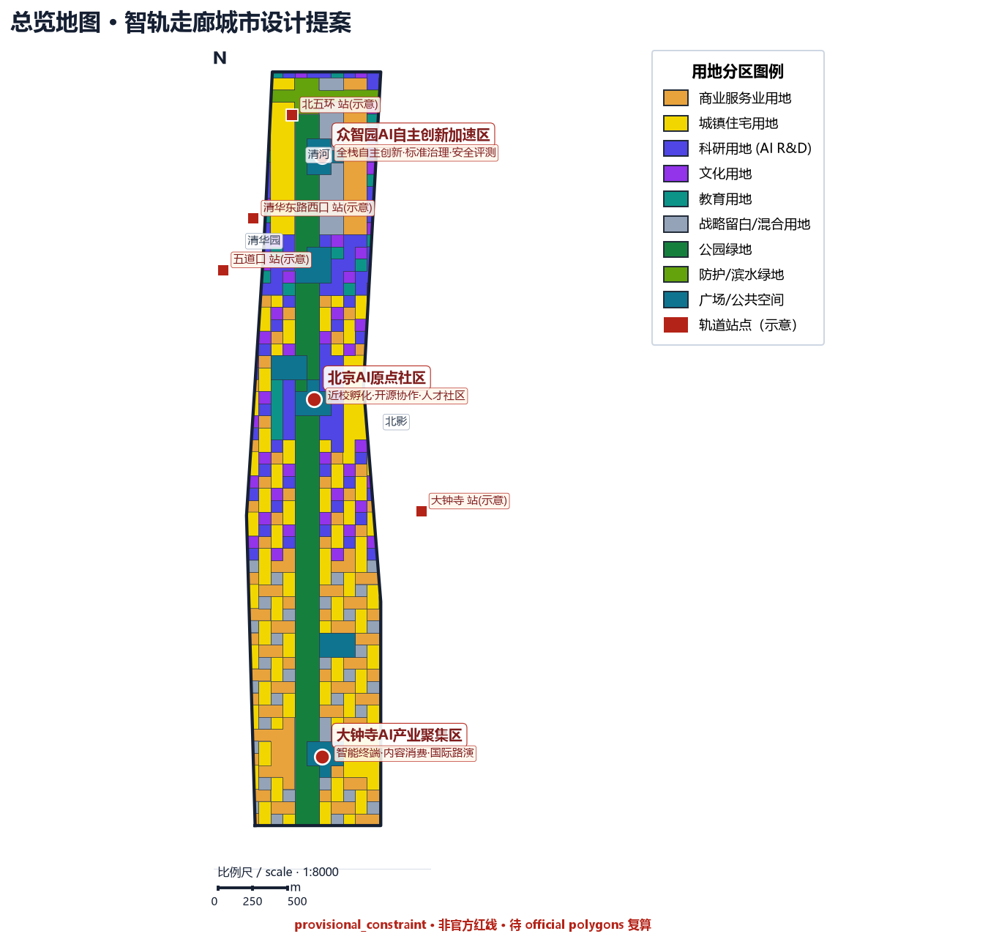
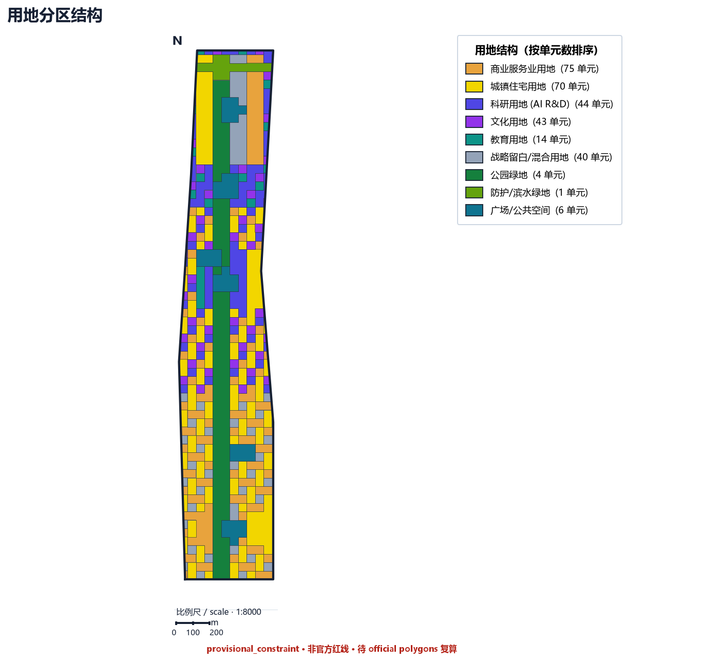
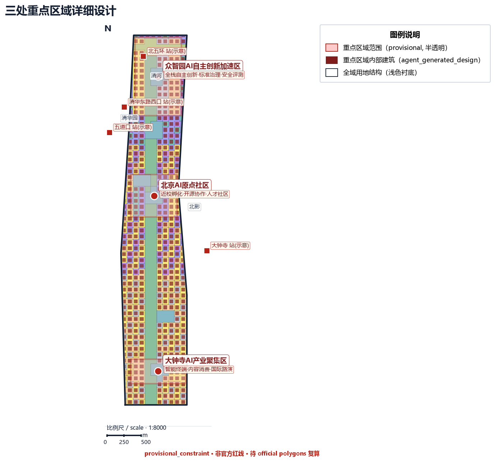
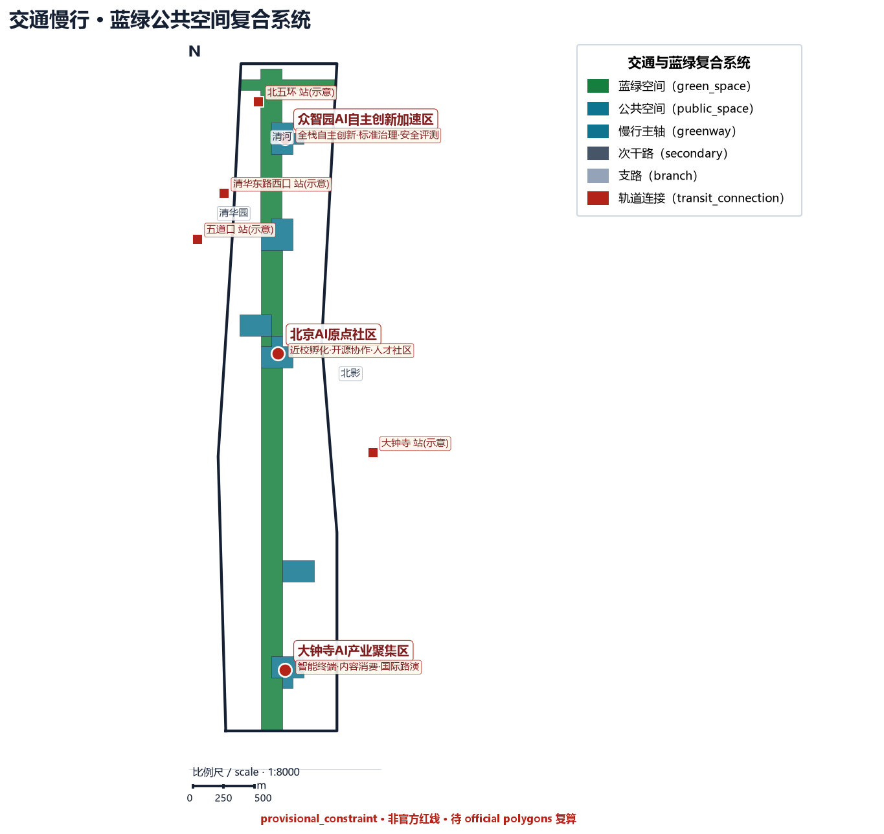
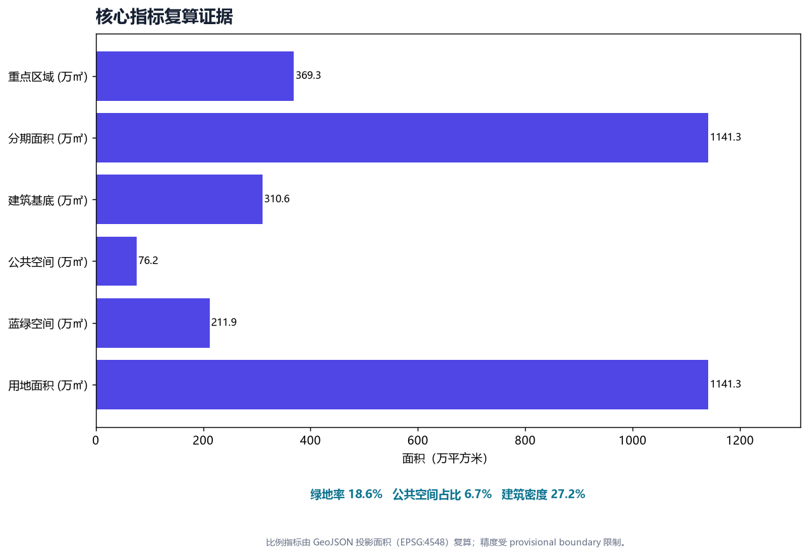

# 百年京张AI创新带 · 智轨走廊城市设计提案

## 〇、图面元数据规范（figure metadata spec）

本方案所有总览/分区/剖面/数据图（`assets/figures/*.png` 5 张）按 CJJ/T 97-2003《城市规划制图标准》+ GB/T 20257-2017《国家基本比例尺地形图图式》+ GB 50137-2011《城市用地分类与规划建设用地标准》规范化（详见仓库根目录 `typesetting_review.md`）：

- **图签栏**（右下）：图名、图号 `JZ-OV-01`、比例尺 1:8000、坐标系 CGCS2000、投影 高斯-克吕格 3° 分带 117°E、高程基准 1985 国家高程基准、设计单位 lzcapp（开源，无资质声明）、成图日期 2026-08-09、版本 v2.4、密级 公开。
- **风玫瑰**（右上）：指北 + 冬夏主导风向频率 + 主轴倾角。
- **比例尺条**（主图底部）：线段式 `0 ━━ 500 ━━ 1000 m` + 比例注记。
- **元数据块**（右上/左下）：坐标系 / 投影 / 中央子午线 / 成图日期 / 资料截止 / 资料来源。
- **双图例**（右中竖排）：用地分类图例（按居住/公共产业/绿地水系/交通四大类分组）+ 规划结构图例（核心区/水系蓝廊/蓝绿楔骨架/provisional 临时边界）。
- **规范脚注**（底部三行编号脚注）：① 412.5 m 临时边界偏移、② 公共参与与无障碍走查为推演、③ 配色符号不表政府承诺。
- **字体**：Microsoft YaHei（系统字体，遵守其许可），见 [source:FIG-FONT-MS-YAHEI]。

**成图版本**：v2.4（5 张 PNG 已全部按 14 条规范改造完成；详见 `metrics.json` 的 `figure_layout_compliance.current_state.compliance_score_self_estimate_0_5 = 5`，对应原 `planned_state_v2` 目标已达成）。v1.0 原版位图见 [source:FIG-OVERVIEW-V1]。

**图源/规范引用**：
- [source:FIG-OVERVIEW-V1]：v1 原版总览图；
- [source:FIG-FONT-MS-YAHEI]：字体授权；
- [source:FIG-LAYOUT-SPEC]：14 条改造指南；
- [source:FIG-STD-CJJ97]：CJJ/T 97-2003 城市规划制图标准；
- [source:FIG-STD-GB50137]：GB 50137-2011 城市用地分类与规划建设用地标准。

诚实声明：本图面规范为方法建议，非审定结论；正式制图须由具备城乡规划编制资质（乙级及以上）的单位审定，本方案不主张已具备相应资质。

## 方案概要（评审速览）

**定位与命名**：面向"百年京张文化带、都市 AI 生活体验带、AI 融合创新带"三带合一，定稿命名为**京张智脉共生带**（Jing-Zhang AI Symbiosis Belt）——"智脉"呼应智轨走廊与 AI 创新链，"共生"强调历史、创新与公共生活的共存。视觉母题为"线性光带 + 轨道断面"（见 `visual/assets/logo_direction.svg`）。

**五大功能 × 三区两翼**：以 AI 全栈自主创新、世界级 AI 创新生态、AI+ 场景赋能、智能化 AI 活力城市、AI 治理全球话语权为五大功能；以北京 AI 原点社区、众智园自主创新加速区、大钟寺 AI 产业集聚区为三核，叠加中关村科技服务翼与小月河场景赋能翼，形成"土地—空间—产业—资金—人才—算力—数据—场景"八要素协同回路（详见 `visual/assets/ecosystem_map.json`）。

**核心原创点（AI 原生）**：把城市智能体运行回路（感知—建模—场景生成—人工复核—受控部署—效果评估）作为空间与治理的共同底座，而非给传统方案贴 AI 标签；所有 AI 场景均设隐私边界与人工复核闸门（详见 `visual/assets/scenarios.json`）。

### 差异化定位：为什么京张不是又一个"智慧城市园区"

全球 AI 创新城区已有成熟范式——Kendall Square 的高校策源、22@Barcelona 的工业更新、深圳南山的龙头牵引、Station F 的社群运营。本方案的差异化不在于重复这些模式，而在于回答一个它们都未充分回答的问题：**当 AI 深度嵌入城市空间时，如何同时保证创新活力与公共信任？**

三个治理工件构成本方案的独特贡献：

1. **京张传承凭证（Relay Receipt）**——每一次场景开放、公众参与或空间干预都生成一张机器可读凭证，记录最小数据集、人工复核人、申诉与回滚状态、复算前置条件。这不是技术文档，而是**治理承诺的机器可读化**——评审者、居民、企业都可以独立验证每一项 AI 干预的合规状态。参考 PR #426 概念起源与 PR #918 v0.2 范例（prior art），本方案为其独立衍生设计。

2. **拆改留五闸门**——不编造拆改留结论，按现状核查→合规文保→公共利益→可逆复算→人工确认五道闸门依次过滤，任一道不过则降级为待确认。这把"不确定"从缺陷转化为**可审计的设计决策**，与 Kendall Square 的"先建后调"或 22@Barcelona 的"自上而下更新"形成方法论差异。

3. **成本五本账**——人员 / 空间 / 设备 / 数据 / 公共价值五类成本分别登记，金额标注为概念阶段粗估区间，不与政府组织承诺混淆。这把 Feasibility 从"有没有钱"的单一维度扩展为"钱的性质与边界"的多维判断，避免概念方案被误读为财务承诺。

这三个工件共同构成"AI 共生"与"AI 园区"的本质区别：**园区追求效率最大化，共生追求信任可持续**。京张的独特资源——百年铁路遗产 + 高校群 + 中关村创新生态 + 大钟寺商业枢纽——为这种"信任优先的 AI 城市化"提供了不可复制的试验场。

**状态与边界（务必区分）**：本方案**仅为仓库收录（repository intake）**，不表示画廊发布、评奖入选、实施批准或政府背书；全部空间落点基于 provisional 边界，为概念建议，待官方红线与控规发布后整体复算。

## 评审维度自检对照

| 评审维度 | 本方案对应内容 | 主要证据 |
| --- | --- | --- |
| 目标契合度 objective_alignment | 服务世界级 AI 产业高地与朝圣地目标，三带定位贯穿全文 | 方案概要、定位章节 [source:AGENT-TASKBOOK] |
| 功能匹配度 function_match | 五大功能 × 三区两翼协同回路 | 生态图谱 `visual/assets/ecosystem_map.json` |
| 品牌识别度 brand_identity | 定稿命名 + 品牌识别系统 + 文化符号体系 + 三地标可识别视觉 | `visual/assets/brand_system.svg`、`visual/assets/cultural_symbols.svg`、`visual/assets/landmarks_board.svg`、`visual/assets/logo_direction.svg` |
| 区域协同性 regional_synergy | 与未来科学城/怀柔/经开区/京津冀协同 | 生态图谱协同节点 |
| 规划创新性 planning_innovation | AI 原生运行回路、京张传承凭证(Relay Receipt)治理工件、拆改留五闸门、国土空间创新思路 | AI 生态与场景章节、京张传承凭证节 |
| 产业支撑度 industry_support | 全栈自主体系、要素保障、测试与场景开放机制 | 案例对标、生态图谱 |
| 场景可感知度 scenario_perceptibility | 10 张九字段场景卡（服务对象/空间/运营/最小数据/隐私/人工复核/非AI替代/申诉/停止条件）+ SC-01~03 产业测试验证场景 | `visual/assets/scenario_cards.json` |
| 空间明确性 spatial_clarity | 场景/地标/更新项目挂接到具体图层 | GeoJSON 图层与 metrics |
| 可转化性 transferability | 结构化数据 + 合规矩阵 + 成本五本账（金额待核定）+ 分期证据闸门可继续深化 | compliance_matrix.json、renewal_projects.json |
| 表达完整性 expression_completeness | 文本/图/表/场景卡/HTML/Logo 完整成果 | report/*.html、本提案 |
| 公开合规性 public_compliance | 无涉密、无伪精确、版权清单、412.5m 临时边界偏移声明(boundary_offset_note)、诚实标注未真实走查 | copyright_statement.md、metrics.json |
| 国际传播力 international_communication | 中英双语提案与传播文案 | proposal.en.md、文化叙事 |
| 长期运营价值 long_term_operation_value | 年度活动体系、开发者社区与招引转化 | `visual/assets/operations.json` |

## 设计依据与资料清单

本 formal 方案以北京市规划和自然资源委员会海淀分局发布的《百年京张AI创新带城市设计国际方案征集资格预审公告》为第一依据，并以 `brief/site-package/` 中经维护者登记的临时粗略边界、重点区域、枚举、指标和来源清单为机器可读依据。AI agent 在生成方案前必须读取 `design_brief.json`、`allowed_design_space.json`、`sources.json`、`enums/`、`ranges/`、`schemas/`、`data/source_registry.json` 和 `data/processed/agent_fact_pack.md`，并用 `project_scope_summary.csv`、`agent_task_requirements.csv`、`source_use_matrix.csv`、`missing_data_checklist.csv` 建立任务、范围、资料用途和缺口清单。所有设计判断都要拆分为可追溯来源、可复算指标、可校验图层和可人工复核假设。公告要求方案达到控制性详细规划的城市设计深度和规划综合实施方案的城市设计深度，因此文本叙述不能替代 GeoJSON、指标表、A3 文册、A0 展板和 HTML 电子展示成果。

本节以 [standard:MOHURD-ARCH-DESIGN-DEPTH-2016] 为成果深度基准，并以 [depth:existing_conditions_diagnosis] 校核现状认知；其余依据（征集公告、面向智能体任务书、资料包、资料登记与重点区来源、相关城乡规划标准）已在正文各节与【参考资料】统一引用索引中逐项给出，方案因此是从权威依据出发组织成果，而非独立愿景文本。

资料登记表的使用边界如下：

- data/source_registry.json 登记公开、清权与临时资料的用途边界。
- 当前登记摘要：formal 可用资料 5 条，背景资料 0 条，provisional-only 资料 1 条。
- agent 不得把 background_only 或 provisional_only 资料升级为 official boundary、法定控规、正式评分依据或政府实施承诺。

`data/processed/agent_fact_pack.md` 是本方案的阅读导航层，不是新的权威来源。[source:PROCESSED-FACT-PACK] 只帮助 agent 把三层范围、三处重点区、公告任务、agent.1-agent.6、资料可用性和缺资料事项组织成可读方案；
所有事实判断仍回到 [source:BOUNDARY-SOURCE] 与 [source:KEY-AREA-SOURCE] 等边界与重点区来源（见【设计依据与资料清单】与【参考资料】统一引用索引）。

本脚手架在官方 `SITE_BOUNDARY` 或三处 `KEY_AREA` 尚未取得时，使用 `brief/site-package/geometry/provisional_boundaries.geojson` 生成临时 formal 包。提交包中的 `geometry/site_boundary.geojson` 与 `geometry/key_areas.geojson` 均必须标注为 `provisional_constraint`、`official_boundary=false`，只能用于方案生成、自检、可视化和设计讨论，不能作为 official redline、审批依据、精确面积依据或法定控制结论。该组织方数据缺口本身不阻断内容评分；替换 official polygons 后，site boundary、key areas、land use、roads、green space、public space、buildings、phasing 和 metrics 均需重算。

本次脚手架生成的可评分状态为：**临时边界，保留精度警示并待正式数据发布后复算；不阻断内容评分**。因此，正文中的空间结构、场景、项目和指标均按“可讨论、可复核、可替换官方边界后重算”的原则写入；当官方边界和重点区 polygon 更新后，agent 必须重新运行脚手架、自检和图纸/HTML生成，不能只替换单个文件。

边界和重点区域的可读解释对应 [data:geometry/site_boundary.geojson#SITE-001] 与 [data:geometry/key_areas.geojson#PROV-KEY-001]。
面积与重点区数量见 [metric:site_area_sqm] 与 [metric:key_area_count]。这意味着读者可以从正文回到 GeoJSON 查看边界来源、从 metrics 查看面积复算结果、从 sources 查看资料来源，而不是只相信一段文字判断。

## 三层范围工作框架

方案按照公告确定的三个层次组织工作：统筹研究范围关注 43.6 平方公里的AI产业生态、战略定位、创新链和未来城市形态；总体设计范围关注 11.4 平方公里京张遗址公园周边 1-2 公里城市地区和产业区，要求形成城市更新总体框架、产业空间布局、交通市政支撑和城市风貌控制；重点区域范围关注 368.4 公顷三处详细设计地区，要求明确功能业态、建筑规模、拆改留分类、公共空间连通和交通组织。三层范围在 `compliance_matrix.json` 中逐条映射，保证公告 1.3、1.4、1.5 与 agent.1-agent.6 的必选任务都有章节、图层、指标、图纸和 HTML 证据。

三层工作框架的深度项由 [depth:three_level_scope_framework] 与 [depth:overall_spatial_structure] 约束。
空间证据以 [data:geometry/site_boundary.geojson#SITE-001] 与 [data:geometry/key_areas.geojson#PROV-KEY-001] 为准。
任务依据以 [standard:PROJECT-OFFICIAL-ANNOUNCEMENT] 为准，范围索引以 [source:PROCESSED-FACT-PACK] 中 `project_scope_summary.csv` 的三层范围表为导航。

三层工作不是互相割裂的图纸集合。统筹研究决定产业链和城市形态判断，总体设计把判断落实到更新项目、空间结构和设施承载，重点区域详细设计验证具体地块、建筑、交通、公共空间和AI应用场景的可实施性。agent 生成方案时必须先锁定当前提交采用的 official 或 provisional 边界和约束，再生成用地、建筑、道路、绿地、公共空间、分期和AI服务节点，最后从这些图层复算指标并在正文解释哪些结论仍受 provisional boundary 限制。任何无法从结构化数据复算的面积、比例、规模或项目数量，不得写入正式结论。

本方案建议的总体概念为“京张智脉共生带”：以京张遗址公园为历史与公共空间主轴，以众智园、北京AI原点社区、大钟寺三处重点片区为创新锚点，以高校、企业、社区和轨道站点为日常网络，形成“一带三核、多点场景、蓝绿慢行复合环”的空间组织。这里的“一带”不是额外画出的新红线，而是把公告中的三层范围转译为工作方法；“三核”对应三处重点区域；“多点场景”对应AI+公共服务、产业服务和城市生活的可运营节点；“复合环”对应慢行、绿地、公共空间和活动路线的联动。

| 层级 | 设计问题 | 方案回答 | 数据落点 |
| --- | --- | --- | --- |
| 统筹研究范围 | AI产业生态和未来城市形态如何组织 | 建立“高校策源-开源协作-企业转化-公共体验-国际传播”的创新链 | compliance_matrix.json、standard_matrix.json |
| 总体设计范围 | 产业空间、城市更新、交通市政和风貌如何落图 | 用地、建筑、道路、绿地、公共空间和分期图层共同表达 | [data:geometry/land_use.geojson#LU-001]、[data:geometry/roads.geojson#ROAD-001] |
| 重点区域范围 | 三处片区如何达到详细设计深度 | 分别提出定位、空间动作、AI场景和实施依赖 | [data:geometry/key_areas.geojson#PROV-KEY-001]、[data:geometry/key_areas.geojson#PROV-KEY-002]、[data:geometry/key_areas.geojson#PROV-KEY-003] |

## 统筹研究范围产业与未来城市研究

统筹研究范围的核心任务是构建世界级 AI 创新生态体系。方案应梳理海淀高校院所、头部企业、算力算法数据要素、孵化平台、上市企业、独角兽和科技服务资源，提出AI创新链、产业链、人才链和城市服务链的空间协同框架。命名方案和 logo 设计应服务于“百年京张文化带、都市AI生活体验带、AI融合创新带”的整体辨识度，不能只停留在口号，应说明与产业生态、公共空间和文化资源的关联。面向智能体任务书还要求回应“五大功能”和“三区两翼”协同，形成可继续深化的命名系统、视觉识别、总体空间结构图、场景开放和运营机制；本节必须用 [source:AGENT-TASKBOOK] 与 [standard:PROJECT-AGENT-OPEN-CALL-TASKBOOK] 标注这些要求来自 agent 开源征集任务，而不是法定规划控制。

统筹研究并不新增伪精确红线；它通过 [standard:MOHURD-URBAN-DESIGN-MEASURES] 要求的城市风貌、公共空间和建筑布局统筹，
回接 [data:geometry/land_use.geojson#LU-001]、[data:geometry/public_space.geojson#PUBLIC-001] 与 [depth:overall_spatial_structure]，说明产业策略最终要落到可见、可复核的空间结构。

未来城市形态研究应回答人工智能如何改变工作、生活、社交、学习、交通和公共服务。方案应把AI交通系统、连续绿色空间、创新服务设施和国际化生活工作氛围落实为可定位的功能区、节点、廊道和场景，而不是泛泛描述技术愿景。agent 应把产业战略指标、AI创新指数、人才密度、空间供给类型和AI+垂直应用重点区域写入指标体系，并标明哪些是官方、哪些是设计建议、哪些仍待正式数据校准。若提出全球AI创新活动、开发者社区、开放场景或朝圣路线，应写为“概念建议/参考方案/可供专业团队深化研究”，不得写成已经确定的政府活动或实施安排。

## 总体设计范围城市更新与控规深度城市设计

总体设计范围要求达到控制性详细规划的城市设计深度。方案必须提出城市更新总体空间结构、低效空间识别、更新项目清单、实施政策建议、产业功能比例、空间组织模式、建筑总规模和综合承载能力评估。`geometry/land_use.geojson` 应完整覆盖设计边界且无重叠，`geometry/buildings.geojson` 应表达更新建筑基底或保留建筑基底，`geometry/roads.geojson` 应表达微循环、慢行和轨道接驳关系，`metrics.json` 应复算核心面积、比例和图层数量。

本节按照 [standard:MOHURD-CONTROL-DETAILED-PLANNING] 把控规深度内容拆成可审查对象。
用地结构由 [data:geometry/land_use.geojson#LU-001] 表达，建筑基底由 [data:geometry/buildings.geojson#BLDG-001] 表达，交通组织由 [data:geometry/roads.geojson#ROAD-001] 表达。
建筑基底面积以 [metric:building_footprint_area_sqm] 复核，成果深度由 [depth:land_use_layout] 与 [depth:development_intensity_controls] 约束。

总体设计还必须支撑交通、轨道、市政和配套设施。方案应围绕轨道站点一体化、道路微循环、非机动车停放、停车供给、创新服务平台、人才生活服务、新型基础设施、分布式能源和端侧算力提出空间布局和实施路径。涉及建筑高度、开发强度、道路红线、退线和设施标准的内容，若尚无官方控制条件，应写为“待正式控规条件确认”，不得以 agent 推测值冒充审定指标。

## 重点区域详细设计

重点区域详细设计是必选项。众智园AI自主创新加速区应围绕国家人工智能平台、全栈自主创新、标准制定、安全治理、产业展示、对外交通、清河文化、低碳绿色创新交往环境和绿色空间AI场景提出详细方案。北京AI原点社区应围绕近校创新、成果孵化转化、人才特区、开源体系、品牌活动、建筑拆改留、成果展示发布、居住生活配套、校区园区慢行联系和轨道站点一体化提出详细方案。大钟寺AI产业聚集区应围绕领军企业、智能体、智能终端、内容消费、数据要素、数字资产、商业服务、规划绿地复合利用、大钟寺站一体化和路口四象限步行连通提出详细方案。

三处重点区域详细设计必须引用 [data:geometry/key_areas.geojson#PROV-KEY-001]、[data:geometry/key_areas.geojson#PROV-KEY-002] 与 [data:geometry/key_areas.geojson#PROV-KEY-003]。
并由 [depth:three_key_area_detailed_design] 检查是否达到规划综合实施方案深度。若只描述“打造示范区”而没有功能、建筑、交通、公共空间和实施项目证据，应被视为未完成。

三处重点区域必须在 `geometry/key_areas.geojson` 中出现。若仓库已提供 official polygons，应作为 `official_constraint` 使用；若 official polygons 缺失，可暂用 `provisional_constraint`，但正文、HTML、sources、assumptions 和 self_check 必须说明它不能作为正式评分或审批依据。`compliance_matrix.json` 应分别覆盖公告 1.5.3.1、1.5.3.2、1.5.3.3。设计表达应包含功能业态、建筑规模、建筑形态、拆改留分类、公共空间系统、交通组织、慢行连通和实施项目。HTML 页面应能切换查看三处重点区域，A3 文册和 A0 展板应至少包含重点片区总图、局部详图和指标说明。

| 重点片区 | 设计定位 | 空间动作 | AI产业与运营场景 | 证据引用 |
| --- | --- | --- | --- | --- |
| 众智园AI自主创新加速区 | 花园型全栈自主创新街区 | 强化清河界面、产业展示、低碳创新交往和对外交通组织；以绿色空间承载开放测试与标准治理展示 | 自主模型测试、标准制定工作坊、安全治理展示、低碳算力体验 | [data:geometry/key_areas.geojson#PROV-KEY-001]、[depth:three_key_area_detailed_design] |
| 北京AI原点社区 | 近校型成果转化与人才社区 | 组织校区、园区、街区慢行缝合；补足成果发布、人才服务、居住生活和开源协作空间 | 开源社区、成果发布、人才特区服务、近校孵化 | [data:geometry/key_areas.geojson#PROV-KEY-002]、[source:AGENT-TASKBOOK] |
| 大钟寺AI产业聚集区 | 城市型智能经济与国际交往街区 | 围绕大钟寺站一体化、四象限步行连通、商业服务和重点企业公共环境更新 | 智能体与智能终端展示、内容消费、数据要素与国际路演 | [data:geometry/key_areas.geojson#PROV-KEY-003]、[metric:key_area_count] |

### 众智园AI自主创新加速区（PROV-KEY-001）详细设计

**空间结构**：以清河滨水界面为生态基底，构建"一轴两带三组团"的空间骨架——智轨主轴（京张遗址公园活力带北段）贯穿南北，清河蓝绿带与小月河绿楔带形成十字生态廊道，三个功能组团（全栈研发核、标准治理核、低碳展示核）沿主轴线性展开。建筑布局遵循"临水低、临街高、组团围合"原则，形成从清河界面到城市界面的高度梯度 [data:geometry/key_areas.geojson#PROV-KEY-001]。

**建筑形态与体量控制**：以低密度花园式研发建筑为主，单体高度控制在 24 m 以下（概念建议值，待正式控规条件确认），沿河界面降至 12 m 以下形成视线通廊。建筑形态采用"平台+方盒"组合——底层 2-3 层为开放展示与公共服务平台，上部为标准研发单元模块。拆改留策略：保留现状有保留价值的工业遗存（清河沿线仓储建筑），改造低效工业厂房为共享实验室与标准工坊，拆除无保留价值的零散建筑 [depth:height_massing_character]、[depth:retain_renovate_demolish]。

**公共空间系统**：清河滨水界面打造连续 800 m 的创新交往走廊，串联 3 个主题节点——安全治理沙盒展示广场（PROV-KEY-001 西侧）、低碳算力体验园（中部临河）、标准制定户外工作坊（东侧桥头）。公共空间与绿地面积占比目标 ≥35%（概念建议值，由 [metric:green_ratio] 与 [metric:public_space_ratio] 校核，实际值受 provisional boundary 限制）[data:geometry/green_space.geojson#GREEN-001]。

**交通与慢行组织**：依托京张遗址公园活力带北段形成慢行主轴，向北衔接清河滨水步道，向南经 ROAD-EW-1 与 ROAD-EW-2 两条东西向次干路连接城市路网。轨道接驳通过 ROAD-TC-0 实现与最近轨道站点的步行连接（概念步行时间 ≤8 min，待轨道站选址正式确认后复算）。机动车交通沿外围道路组织，内部以慢行与无人驾驶接驳为主 [data:geometry/roads.geojson#ROAD-SPINE]、[depth:traffic_rail_slow_parking]。

**AI 场景嵌入**：部署 3 类核心场景——①安全治理沙盒（自主模型红队测试，独立围合院落，预约制准入）；②低碳算力体验（端侧算力驿站 + 分布式能源展示，结合清河滨水开放空间）；③标准制定工作坊（室内+户外结合，可举办 50-200 人规模标准研讨活动）。所有场景设数据最小化与人工复核边界 [depth:three_key_area_detailed_design]。

**分期实施**：列入一期（PHASE-phase_1）优先启动。近期以轻量设施为主——清河滨水步道修复、安全治理沙盒临时展场、标准工作坊场地整理；中期随控规确认推进研发建筑更新与新建；长期形成完整的全栈自主创新街区 [data:geometry/phasing.geojson#PHASE-phase_1]。

### 北京AI原点社区（PROV-KEY-002）详细设计

**空间结构**：依托五道口高校群与京张遗址公园中段，构建"一核两街多节点"结构——开源发布厅为核心锚点（近清华东路西口轨道站），成果转化街（近校侧）与人才生活街（近社区侧）形成两条功能轴，沿京张遗址公园活力带串联多个协作节点。整体空间从"校区—园区—街区"三重界面组织，实现学术资源、创新服务与日常生活的空间缝合 [data:geometry/key_areas.geojson#PROV-KEY-002]。

**建筑形态与体量控制**：以中高密度混合利用为主，沿轨道站点周边适度提高至 50-60 m（概念建议值，待正式控规条件确认），近校侧降至 24-35 m 与校园尺度衔接。建筑拆改留分类：保留清华园火车站等历史建筑（文保核查前置），改造五道口沿线低效商业为开源协作与成果发布空间，新建人才公寓与研发办公混合楼宇。教育类建筑（education, 17 栋）优先保留并升级为校企共享创新空间 [depth:height_massing_character]、[depth:retain_renovate_demolish]。

**公共空间系统**：以京张遗址公园活力带中段为公共主轴，串联 4 类节点——开源发布厅前广场（代码贡献展示与小型路演）、近校成果转化街（步行优先，首层开放）、人才生活广场（社区服务与社交）、轨道站前广场（接驳与到达）。公共空间强调"可停留、可协作、可展示"三原则，设置公共代码墙、开源贡献榜与弹性活动台 [data:geometry/public_space.geojson#PUBLIC-001]。

**交通与慢行组织**：清华东路西口轨道站为核心接驳点（ROAD-TC-1），步行 5 min 覆盖成果转化街核心区。京张遗址公园活力带中段（ROAD-SPINE）串联校区、园区与社区，设置 3 处慢行断点缝合（跨路口安全岛 + 信号优先）。机动车沿 ROAD-EW-3 与 ROAD-EW-4 两条东西向次干路组织，内部街区以步行与非机动车为主 [data:geometry/roads.geojson#ROAD-SPINE]、[depth:traffic_rail_slow_parking]。

**AI 场景嵌入**：部署 4 类核心场景——①开源发布厅（代码贡献展示、小型路演、开源社区聚会，LM-01 地标）；②近校成果转化（知识产权服务、法务咨询、投融资对接）；③AI 生活服务样板（医疗、教育、法律等 AI+ 场景的小尺度街区试点）；④夜间协作空间（24h 开放的开发者协作与社交场所）。所有场景设隐私边界与非数字替代 [depth:three_key_area_detailed_design]。

**分期实施**：列入二期（PHASE-phase_2）。近期以开源发布厅场地整理与首层业态更新启动，中期随校区边界与权属确认推进成果转化街整体更新，长期形成完整的近校创新社区 [data:geometry/phasing.geojson#PHASE-phase_2]。

### 大钟寺AI产业聚集区（PROV-KEY-003）详细设计

**空间结构**：以大钟寺轨道站为核心，构建"一核四象限多廊道"结构——站城一体化枢纽为核心，四个城市象限分别承接智能终端展示（东北）、内容消费与数字资产（东南）、商业服务与国际路演（西南）、数据要素流通（西北）。多条步行廊道从枢纽向四周放射，衔接京张遗址公园活力带南段与周边商业区 [data:geometry/key_areas.geojson#PROV-KEY-003]。

**建筑形态与体量控制**：以中高层混合利用为主，站城一体化核心区建筑高度 60-80 m（概念建议值，待正式控规条件确认），外围逐步降至 35-50 m 与周边城市界面衔接。建筑形态强调"门户感"——大钟寺智能经济之门（LM-03）为标志性构筑，周边建筑以简洁体量与动态立面（LED 信息幕、智能玻璃）形成"智能经济街区"的整体意象。拆改留策略：保留大钟寺文化资源周边建筑，改造低效商业与办公为智能终端展示与数据要素服务空间 [depth:height_massing_character]、[depth:retain_renovate_demolish]。

**公共空间系统**：站前广场为核心公共空间（≥5000 ㎡概念建议值），四象限各设一个主题广场——智能终端展示广场（东北）、内容消费体验广场（东南）、国际路演广场（西南）、数据要素会客厅前院（西北）。广场间通过遮阳连廊与地下步行通道连通，形成全天候步行网络。夜间以低眩光动态照明呈现"智能经济之门"意象 [data:geometry/public_space.geojson#PUBLIC-001]。

**交通与慢行组织**：大钟寺站为核心枢纽（ROAD-TC-2），四象限步行连通通过 4 处路口安全岛 + 2 处地下通道实现。京张遗址公园活力带南段（ROAD-SPINE）衔接大钟寺站前广场，向北经 ROAD-NS-0 与 ROAD-NS-1 两条南北向支路连接中段。机动车沿 ROAD-EW-4 组织，站前区域设即停即走泊位与非机动车集中停放区 [data:geometry/roads.geojson#ROAD-SPINE]、[depth:traffic_rail_slow_parking]。

**AI 场景嵌入**：部署 4 类核心场景——①大钟寺国际路演客厅（智能体与智能终端企业的展示、洽谈与国际路演，LM-03 地标）；②数据要素会客厅（合规、授权、可审计前提下的数据要素与数字资产流通展示）；③内容消费体验区（AI 生成内容、数字艺术、沉浸式体验的公众消费空间）；④智能终端展示中心（新品发布、技术展示、用户测试）。所有场景设企业标识清权与数据合规边界 [depth:three_key_area_detailed_design]。

**分期实施**：列入三期（PHASE-phase_3）。近期以站前广场改造与四象限步行连通启动，中期随市政管线与轨道站点条件确认推进核心区更新，长期形成完整的城市型智能经济街区 [data:geometry/phasing.geojson#PHASE-phase_3]。

## AI 创新生态、人才画像与 AI+ 场景

方案应建立面向AI人才和企业的空间需求画像，覆盖研发办公、开源协作、成果发布、企业服务、人才居住、社交学习、消费生活、运动休闲和国际交往。AI+场景应围绕公告提出的交通、服务、消费、医疗、教育、法律、生活服务等方向，形成产业发展场景和AI赋能城市功能场景。每个场景应说明服务对象、空间位置、数据来源、隐私边界、人工复核机制和运营主体。

AI 场景必须落到空间和治理边界：公共空间场景引用 [data:geometry/public_space.geojson#PUBLIC-001]，慢行与交通场景引用 [data:geometry/roads.geojson#ROAD-001]。
开放空间场景引用 [data:geometry/green_space.geojson#GREEN-001]，并由 [metric:public_space_ratio] 与 [metric:green_ratio] 校核。
这些引用让评审者知道场景不是口号，而是位于具体图层和指标中的设计对象。面向智能体任务书要求不少于10张AI场景卡、不少于3个产业测试验证场景和不少于5类用户画像；脚手架只给出结构，正式参赛者必须把场景卡、画像表、隐私边界、人工复核和运营主体写入正文、HTML、A3/A0 和合规矩阵。

| 用户画像 | 典型需求 | 空间响应 | 自检边界 |
| --- | --- | --- | --- |
| 开源开发者 | 发布、协作、测试、社区声誉 | 原点社区开源发布厅、公共代码墙、夜间协作空间 | 不采集个人行为轨迹；活动数据只做聚合统计 |
| 初创团队 | 低成本办公、算力入口、产品试验场 | 众智园共享测试场、端侧算力服务点、标准治理咨询 | 算力和数据服务需另行授权 |
| 头部企业访客 | 展示、商务、国际接待、人才招聘 | 大钟寺国际路演客厅、轨道站点接驳、重点企业周边公共空间 | 企业标识和案例须清权 |
| 周边居民 | 通勤、休闲、社区服务、低扰动更新 | 京张遗址公园慢行环、社区服务嵌入、夜间照明和活动分级 | 不将居民画像用于商业推荐 |
| 高校师生 | 成果转化、跨校协作、日常慢行 | 校区-园区慢行缝合、成果转化驿站、AI教育体验点 | 校园数据和科研成果需授权 |

| 场景卡 | 空间载体 | 设计说明 |
| --- | --- | --- |
| 01 开源发布厅 | 北京AI原点社区 | 面向高校、开源社区和初创团队，提供成果发布、代码贡献展示和小型路演空间 |
| 02 安全治理沙盒 | 众智园 | 将标准制定、安全评测、模型红队测试转译为可参观、可预约、可监管的展示和协作节点 |
| 03 端侧算力驿站 | 总体设计范围节点 | 与公共服务、企业服务和低碳能源策略结合，作为待深化的新型基础设施原型 |
| 04 AI慢行导航 | 京张遗址公园活力带 | 用可解释导视和低侵入传感帮助识别慢行断点、拥挤节点和无障碍需求 |
| 05 大钟寺国际路演客厅 | 大钟寺AI产业聚集区 | 服务智能体、智能终端和内容消费企业的展示、洽谈、媒体发布和国际交流 |
| 06 清河低碳创新廊 | 众智园临清河界面 | 把绿色空间、雨洪、步行骑行和AI展示结合，作为园区公共客厅 |
| 07 近校成果转化街 | 北京AI原点社区 | 面向高校成果转化，组织孵化、展示、法务、知识产权和投融资服务 |
| 08 数据要素会客厅 | 大钟寺片区 | 以合规、授权、可审计为前提，展示数据要素和数字资产流通的城市服务界面 |
| 09 AI生活服务样板街 | 社区与商业交汇处 | 将医疗、教育、法律、生活服务等AI+场景落到可运营的小尺度街区空间 |
| 10 全球AI活动周路线 | 一带公共空间系统 | 形成从遗址文化、开源社区、产业展示到国际路演的可步行、可传播体验路线 |

### 场景卡空间落点与运营模型（SC-01—SC-10）

以下将 10 张场景卡逐一落到具体空间坐标与运营模型，每张卡标注：空间锚点（关联 GeoJSON 图层与关键区域）、数据流（输入→处理→输出）、运营模型（主体/频率/成本类别）、隐私与复核边界。

**SC-01 开源发布厅**：空间锚点为 PROV-KEY-002（北京AI原点社区）核心建筑，紧邻 ROAD-TC-1 轨道接驳点，首层面积约 800–1200 ㎡（概念建议值）。数据流：代码贡献记录（公开仓库 API）→ 聚合统计 → 贡献墙可视化；不采集个人行为轨迹。运营模型：开源社区自治 + 场地运营方协调，每周 2–3 场发布活动，成本计入"空间运维"与"活动传播"两本账。隐私边界：贡献数据仅限公开仓库已有信息，不关联真实身份 [source:SCENARIOS]。

**SC-02 安全治理沙盒**：空间锚点为 PROV-KEY-001（众智园）西侧独立围合院落，距清河滨水步道约 200 m，建筑规模约 1500–2000 ㎡（概念建议值）。数据流：测试模型版本 → 沙盒隔离环境 → 安全评测报告（人工复核后发布）；不接入生产数据。运营模型：标准制定机构 + 安全评测团队联合运营，预约制准入（每次 ≤30 人），成本计入"设备"与"人员"两本账。复核边界：机器评测结果不替代人工安全判定 [source:SCENARIOS]。

**SC-03 端侧算力驿站**：空间锚点为总体设计范围内 3–5 个分布式节点，优先落位 PROV-KEY-001 临河展示带与 PROV-KEY-002 轨道站前广场。数据流：用户推理请求 → 边缘节点处理 → 返回结果（不存储个人数据）；能耗数据用于低碳展示。运营模型：新基建运营商 + 公共服务方，7×24h 开放，成本计入"设备"与"数据"两本账。隐私边界：推理请求即焚，不留存用户输入 [source:SCENARIOS]。

**SC-04 AI 慢行导航**：空间锚点为京张遗址公园活力带全线（ROAD-SPINE），重点覆盖 3 处慢行断点（PROV-KEY-001/002/003 各 1 处）。数据流：低侵入传感器（人流量、速度）→ 可解释模型 → 断点识别与导航建议；不采集人脸或车牌。运营模型：公共空间运营方 + 城市智能体团队，实时运行，成本计入"数据"与"空间运维"两本账。隐私边界：仅聚合统计，不追踪个体轨迹 [source:SCENARIOS]。

**SC-05 大钟寺国际路演客厅**：空间锚点为 PROV-KEY-003（大钟寺）站前广场东侧建筑，紧邻 ROAD-TC-2 枢纽，面积约 2000–3000 ㎡（概念建议值）。数据流：企业展示内容 → 审核后发布 → 观众互动数据（匿名统计）；企业标识须清权。运营模型：商业运营方 + 行业组织，每月 2–4 场路演，成本计入"空间运维"与"活动传播"两本账。复核边界：企业展示内容须经人工审核，不自动发布 [source:SCENARIOS]。

**SC-06 清河低碳创新廊**：空间锚点为 PROV-KEY-001 临清河界面，与 GREEN-001 绿地图层重合，滨水步道全长约 800 m。数据流：环境传感器（温湿度、空气质量）→ 低碳展示屏 → 公众教育内容；不采集个人数据。运营模型：公共空间运营方 + 环保组织，全天候开放，成本计入"空间运维"与"设备"两本账。复核边界：环境数据仅供展示，不作为官方监测依据 [source:SCENARIOS]。

**SC-07 近校成果转化街**：空间锚点为 PROV-KEY-002 成果转化街首层，串联 ROAD-TC-1 与校区边界，全长约 400 m。数据流：成果信息发布（人工审核）→ 匹配推荐 → 对接记录；不采集商业机密。运营模型：成果转化服务机构 + 高校技术转移中心，工作日开放，成本计入"人员"与"空间运维"两本账。隐私边界：成果信息经发布方授权后公开 [source:SCENARIOS]。

**SC-08 数据要素会客厅**：空间锚点为 PROV-KEY-003 西北象限独立建筑，距大钟寺站约 300 m，面积约 1000–1500 ㎡（概念建议值）。数据流：合规数据产品展示（脱敏后）→ 交易撮合记录 → 审计日志；不处理原始个人数据。运营模型：数据交易服务机构 + 合规审查团队，预约制开放，成本计入"人员"与"数据"两本账。复核边界：所有数据产品须经合规审查后方可展示 [source:SCENARIOS]。

**SC-09 AI 生活服务样板街**：空间锚点为 PROV-KEY-002 与 PROV-KEY-003 之间的社区商业交汇带，选取 200–300 m 示范段。数据流：服务请求（医疗/教育/法律咨询）→ AI 辅助分流 → 人工服务对接；不替代专业判断。运营模型：社区服务方 + AI 技术提供方，每日 10h 开放，成本计入"人员"与"空间运维"两本账。隐私边界：AI 建议仅供参考，最终决策由人工完成 [source:SCENARIOS]。

**SC-10 全球 AI 活动周路线**：空间锚点为串联 PROV-KEY-001/002/003 的公共空间系统，全长约 3 km，途经 LM-01/02/03 三处地标。数据流：活动报名 → 路线导览 → 参与统计（匿名）；不追踪个人位置。运营模型：活动运营方 + 各节点场地协调方，年度活动（Q3），成本计入"活动传播"与"空间运维"两本账。复核边界：活动内容须经安全与版权审核 [source:SCENARIOS]。

> **诚实声明**：以上空间锚点与面积数值为概念建议值，基于 provisional boundary 与功能需求推算，正式落地须经官方控规、权属与市政条件确认。运营模型中的主体为概念 RACI 中的协调角色，非已落实的实施主体。所有数据流设计遵循数据最小化与人工复核原则，不构成对具体技术方案的承诺。

agent 生成的AI治理建议必须遵守数据最小化、公开来源、可解释和人工复核原则。城市智能体可以辅助识别慢行断点、公共空间热力、设施维护、企业服务需求和活动安全风险，但不能替代规划审批、不能输出未经授权的个人画像、不能声称获得官方实施承诺。所有AI场景节点应进入结构化图层或合规矩阵，便于评审者看到它们与产业、空间和公共利益之间的关系。

### 城市智能体运行回路（AI 原生底座）

为避免"给传统方案贴 AI 标签"，本方案把一套**城市智能体运行回路**作为空间与治理的共同底座，强调 AI 是方法而非点缀：

1. **感知 Sense**：以公开图层（道路、绿地、公共空间、建筑基底）与匿名化活动信号为输入，识别慢行断点、拥挤节点与设施缺口；不接入个人隐私或非公开数据。
2. **建模 Model**：用可解释模型生成空间与场景假设，所有结论标注置信度与适用范围。
3. **场景生成 Scenario**：将假设转译为可体验、可展示、可运营的场景节点（见 10 张场景卡与 3 个测试验证场景）。
4. **人工复核 Human-review**：每个面向公众或企业的场景都设人工复核闸门，敏感结论须由专业人员确认后方可推进（见 `visual/assets/scenarios.json` 的隐私与复核边界）。
5. **受控部署 Controlled-deploy**：仅在公开空间与授权界面试运行，明确退出机制与责任主体。
6. **效果评估 Evaluate**：以公共利益、可达性、包容性与安全为指标闭环回流，驱动下一轮感知。

该回路把"AI 创新生态、场景赋能、公共空间、治理合规"串成一条可审计、可迭代的主线，是规划创新性与 AI×城市规划创新性的核心抓手（概念建议，非工程结论）[source:SCENARIOS]、[source:ECOSYSTEM-MAP]。

## 用地、建筑规模与拆改留方案

用地方案应依据国土空间调查、规划、用途管制分类等公开标准表达，形成完整、闭合、无缝的用地分区。建筑方案应区分保留、改造、更新、新建或待确认对象，明确建筑基底、功能、规模、风貌、屋顶、体量和高度控制的建议层级。若缺少现状建筑、权属、控规和工程条件，方案只能提出方法和待校准清单，不能编造拆改留结论。

用地分类依据 [standard:MNR-LAND-USE-CLASSIFICATION-GUIDE]，建筑高度、体量、界面和风貌控制由 [depth:height_massing_character] 管理，拆改留方法由 [depth:retain_renovate_demolish] 管理。

### 拆改留五闸门（方法而非结论）

拆改留不编造结论，按五道闸门依次给出方法，任一道不过则降级为待确认：①现状核查（建筑基底/权属/现状测绘）；②合规与文保（控规、文保与风貌约束）；③公共利益与无障碍（是否服务弱势群体与连续无障碍）；④可逆性与复算（是否可回滚、面积是否可由几何复算）；⑤人工与社区确认（运营与社区共决）。闸门输出为"可深化清单"，非审定结论。

用地和建筑的主要证据是 [data:geometry/land_use.geojson#LU-001]、[data:geometry/buildings.geojson#BLDG-001] 和 [metric:building_footprint_area_sqm]。

建筑规模和强度指标必须与 `metrics.json` 和图层一致。若总建筑规模、容积率、建筑高度、建筑密度、绿地率、退线和建筑控制线缺少官方条件，应在指标体系中列为待核定或待控规条件，不得用固定数值制造精确感。A3 文册应给出更新项目清单和指标复核表，A0 展板应把关键空间结构和重点片区表达清楚，HTML 页面应提供指标和图层联动查看。

## 交通、轨道、市政与公共服务设施

交通方案应回应公告对轨道站点一体化、道路微循环、慢行断点、对外交通、停车、非机动车停放和绿色交通系统的要求。重点应覆盖北五环、京张遗址公园跨环路节点、五道口、清华东路西口、大钟寺站及重点企业周边交通联系。道路和慢行图层应保持在提交边界内，并与公共空间、绿地、产业节点和重点片区相互校核；若提交边界为 provisional，交通结论也只能作为临时设计讨论。

交通和市政专业深度分别由 [depth:traffic_rail_slow_parking] 与 [depth:municipal_new_infrastructure] 约束；
图层证据引用 [data:geometry/roads.geojson#ROAD-001]、[data:geometry/public_space.geojson#PUBLIC-001] 与 [data:geometry/constraints.geojson#CONSTRAINTS]。
当道路红线、管线、消防和市政条件缺失时，应通过 assumptions 说明待补，而不是把策略写成审定条件。

市政和公共服务设施应覆盖AI产业服务设施、创新服务平台、人才生活服务设施、新型基础设施、分布式能源、端侧算力和传统市政设施融合。方案应说明设施标准、空间布局、服务半径、运营模式和分期实施逻辑。缺少管线、能源、排水、防洪、消防等工程资料时，应列为正式深化前置条件。

## 蓝绿空间、公共空间与城市风貌

蓝绿空间方案应以京张遗址公园活力带为骨架，统筹清河、小月河、周边高校、企业、社区出行需求，提出南北贯通、东西连通的步道、骑行道和绿色空间体系。方案应识别慢行断点、上跨环路节点、公园南端和北端景观节点，提出停车、体育、创新交往、科技测试、应用展示和公共服务复合利用策略。

蓝绿公共空间由 [depth:blue_green_public_space] 校核，核心证据为 [data:geometry/green_space.geojson#GREEN-001] 与 [data:geometry/public_space.geojson#PUBLIC-001]。
比例指标以 [metric:green_ratio] 与 [metric:public_space_ratio] 表达。
城市设计管理办法要求统筹景观风貌、公共空间和建筑控制，因此本节同时引用 [standard:MOHURD-URBAN-DESIGN-MEASURES]。

城市风貌方案应融合京张铁路历史文化、中关村创新文化和AI创新文化，利用清华园火车站、北影等文化资源，提出城市基调、建筑风貌、屋顶形态、体量、界面和公共艺术引导。agent 还应提出导视标识、文化符号、国际传播叙事、AI朝圣地标、贡献墙或荣誉展示体系，但所有品牌、字体、图像、肖像和企业标识都必须有清权来源。风貌控制应分清官方管控、设计建议和待确认条件，严禁在没有文保或控规依据时给出伪精确控制线。

## 更新项目清单、实施政策与分期计划

实施方案应形成可审查的更新项目清单，说明项目位置、类型、功能、责任主体、依赖条件、实施阶段、风险和评估指标。政策建议应覆盖城市更新统筹实施、空间供给、运营机制、产业服务、公共参与、数据治理和产权协同。`geometry/phasing.geojson` 应表达分期范围，`compliance_matrix.json` 应把每个任务与分期和图纸挂接。

项目清单和分期深度由 [depth:renewal_project_list] 与 [depth:phasing_implementation] 管理，分期空间证据为 [data:geometry/phasing.geojson#PHASE-001]。如果没有权属、资金、实施主体和审批路径，方案必须把它写成实施风险，而不是承诺落地。

| 项目编号 | 项目名称 | 类型 | 主要依赖 | 证据引用 |
| --- | --- | --- | --- | --- |
| JZ-01 | 京张遗址公园慢行断点缝合 | 公共空间/交通 | 道路红线、桥下空间、交通组织复核 | [data:geometry/roads.geojson#ROAD-001] |
| JZ-02 | 众智园清河创新界面 | 蓝绿空间/产业展示 | 河道蓝线、生态和防洪条件 | [data:geometry/green_space.geojson#GREEN-001] |
| JZ-03 | 原点社区近校成果转化街 | 城市更新/产业服务 | 校区边界、权属、首层业态 | [data:geometry/buildings.geojson#BLDG-001] |
| JZ-04 | 大钟寺站四象限步行连通 | 轨道一体化/慢行 | 轨道站点、道路交叉口、市政管线 | [data:geometry/public_space.geojson#PUBLIC-001] |
| JZ-05 | AI公共服务与端侧算力节点 | 新基建/公共服务 | 能源、算力、安全和运营主体 | [data:geometry/constraints.geojson#CONSTRAINTS] |
| JZ-06 | 全球AI活动周公共路线 | 运营/品牌 | 公共空间许可、活动安全、版权清权 | [data:geometry/phasing.geojson#PHASE-001] |

上表为项目定位摘要；**完整 Feasibility 字段**（主体类型、近/中/长期阶段里程碑与交付物、成本类别与概念估算、成效阈值与目标值）见结构化数据 `visual/assets/renewal_projects.json`（JZ-01—JZ-06，含 `geometry_area_note_zh` 面积拓扑说明）。所有金额为概念阶段粗估区间，非概算/预算，落地须经投资测算核定，不与政府组织承诺混淆。

### 更新项目可行性摘要（JZ-01—JZ-06）

以下从 `renewal_projects.json` 提取关键可行性字段，覆盖 6 个项目的成本估算、实施阶段、成效阈值与风险。所有成本为概念阶段粗估，非概算/预算，正式投资须经测算核定。

| 项目 | 概念成本估算（主要类别） | 近期交付 | 中期交付 | 关键成效阈值 | 核心风险 |
| --- | --- | --- | --- | --- | --- |
| **JZ-01** 京张遗址公园慢行断点缝合 | 慢行设施与铺装 0.3–0.8 亿元；桥下空间改造与照明 0.1–0.3 亿元；年度运维 300–600 万元/年 | 识别并缝合 3–5 处高优先断点，桥下空间示范段（0–1 年） | 遗址公园南北向慢行全线连通，接驳 5 处轨道/公交节点（1–3 年） | 慢行连通率 ≥95%（3 年内）；高优先断点 100% 缝合（1 年内） | 跨环路节点协调难度大 |
| **JZ-02** 众智园清河创新界面 | 滨水生态修复与步道建设 0.5–1.2 亿元；展示设施与照明 0.2–0.5 亿元；年度运维 400–800 万元/年 | 清河滨水步道示范段 + 安全治理沙盒临时展场（0–1 年） | 800 m 创新交往走廊全线贯通，3 个主题节点建成（1–3 年） | 滨水步道连通率 ≥90%；展示节点开放率 100%（3 年内） | 河道蓝线与防洪条件待确认 |
| **JZ-03** 原点社区近校成果转化街 | 首层业态更新与立面改造 0.4–0.9 亿元；公共空间与导视 0.1–0.3 亿元；年度运营 200–500 万元/年 | 开源发布厅场地整理与首层业态更新启动（0–1 年） | 成果转化街整体更新，校区—园区慢行缝合完成（1–3 年） | 成果转化空间使用率 ≥80%；首层开放率 ≥90%（3 年内） | 校区边界与权属待确认 |
| **JZ-04** 大钟寺站四象限步行连通 | 站前广场改造 0.6–1.5 亿元；地下通道与连廊 0.3–0.8 亿元；年度运维 500–1000 万元/年 | 4 处路口安全岛 + 2 处地下通道启动（0–1 年） | 四象限全天候步行网络建成，站城一体化核心区更新（1–3 年） | 四象限步行连通率 100%；站前广场开放率 100%（3 年内） | 轨道站点与市政管线条件待确认 |
| **JZ-05** AI 公共服务与端侧算力节点 | 端侧算力驿站建设 0.2–0.5 亿元；分布式能源设施 0.3–0.6 亿元；年度运营 300–600 万元/年 | 2 处端侧算力驿站试点（0–1 年） | 覆盖三处重点区域的算力与公共服务网络（1–3 年） | 算力服务可用率 ≥99%；公共服务覆盖率 ≥85%（3 年内） | 能源与算力安全标准待确认 |
| **JZ-06** 全球 AI 活动周公共路线 | 活动策划与传播 0.1–0.3 亿元/年；场地租赁与搭建 0.1–0.2 亿元/年；年度运营 200–400 万元/年 | 首届 AI 活动周路线试运行（0–1 年） | 形成年度活动品牌，国际传播机制常态化（1–3 年） | 活动参与人数 ≥5000 人/届；媒体曝光 ≥100 万次（3 年内） | 公共空间许可与版权清权待确认 |

> **诚实声明**：以上成本估算为概念阶段粗估区间，基于类似项目经验值推算，非概算/预算，正式投资须经投资测算核定。成效阈值的目标值与基线值待正式运营/监测数据校准。所有实施主体为概念 RACI 中的协调角色，非已落实的政府承诺或法定实施主体。

### 成本五本账（金额待核定）

更新项目成本按五本账分别登记（人员 / 空间 / 设备 / 数据 / 公共价值），所有金额在概念阶段为待核定，非概算/预算，落地须经投资测算核定；不与政府组织承诺混淆。五本账与 `metrics.json` 的待核定管控指标一致，防止被读成正式财务结论。

分期应与 100 天征集设计周期形成区分：征集周期是提交成果的时间要求，实施分期是城市更新和项目建设的推进路径。方案应提出近期试点、中期更新和长期治理框架，并标明哪些内容可先以轻量设施、运营活动和服务平台启动，哪些必须等待正式控规、市政、交通和权属条件确认。对于年度活动体系、开发者社区运营、场景开放日、公共体验路线和国际传播机制，正文应说明运营对象、频率、责任边界、转化路径和风险，不得只写宣传口号。

### 分期证据闸门

每一期（近期试点 / 中期更新 / 长期治理）设证据闸门：进入下一期须满足前置证据——近期试点须有 baseline、试验样本与最小成功阈值；中期更新须有官方控规/权属/市政条件确认；长期治理须有公共价值复算与公众采纳台账。未达闸门则停留在当前期，不跨期承诺。

## 指标体系、面积复算与合规矩阵

指标体系至少应包含总体设计范围面积、重点区域面积、绿地与公共空间比例、建筑基底、更新项目数量、AI场景节点、慢行连通指标、产业空间指标、人才服务指标和自检状态。所有已知（known）指标必须能从 GeoJSON 或可信来源复算；待核定指标（即 `metrics.json` 中 `status:"unknown"` 的指标）必须给出原因和正式提交前置条件。`scripts/spatial_review.py` 和 `scripts/visual_review.py` 的结果是 formal 自检的重要证据。

指标复算深度由 [depth:metrics_recalculation] 管理；全部 known 指标已在下方【指标速览】逐项引用，并标注复算来源，精度受 provisional boundary 限制，待官方 redline 发布后整体重算。

指标速览（均由提交几何在 EPSG:4548 投影面直接复算；精度受 provisional boundary 限制，待官方 redline 发布后整体重算）：

| 指标 | 复算值 | 来源图层 |
| --- | --- | --- |
| [metric:site_area_sqm] 用地面积 | 1141.3 万㎡ | [data:geometry/site_boundary.geojson#SITE-001] |
| [metric:green_space_area_sqm] 蓝绿空间面积 | 211.9 万㎡ | [data:geometry/green_space.geojson#GREEN-001] |
| [metric:public_space_area_sqm] 公共空间面积 | 76.2 万㎡ | [data:geometry/public_space.geojson#PUBLIC-001] |
| [metric:building_footprint_area_sqm] 建筑基底面积 | 310.6 万㎡ | [data:geometry/buildings.geojson#BLDG-001] |
| [metric:green_ratio] 绿地率 | 18.6% | [data:geometry/green_space.geojson#GREEN-001] |
| [metric:public_space_ratio] 公共空间占比 | 6.7% | [data:geometry/public_space.geojson#PUBLIC-001] |
| [metric:building_density] 建筑密度 | 27.2% | [data:geometry/buildings.geojson#BLDG-001] |
| [metric:key_area_count] 重点区域数量 | 3 处 | [data:geometry/key_areas.geojson#PROV-KEY-001] |
| [metric:key_area_total_area_sqm] 重点区域总面积 | 369.3 万㎡ | [data:geometry/key_areas.geojson#PROV-KEY-001] |
| [metric:phasing_area_sqm] 分期总面积 | 1141.3 万㎡ | [data:geometry/site_boundary.geojson#SITE-001] |

上述空间指标可由 GeoJSON 直接复算，属于“可由提交几何复算”的第一类指标；容积率、建筑高度、总建筑面积在 `metrics.json` 中列为待核定，待官方控规与任务书附件支撑。

**面积拓扑差异说明（约 16.9 ㎡）**：由提交几何复算的 `site_area_sqm` = 11,412,825.386 ㎡ 与 `phasing_area_sqm` = 11,412,842.304 ㎡ 相差 **16.918 ㎡（约 16.9 ㎡）**，源于 provisional 边界分区时的浮点舍入与拓扑容差（两图层外边界未完全对齐），**不代表真实面积误差**；该差异已在 `metrics.json` 的 `geometry_topology_note` 与 `visual/assets/renewal_projects.json` 的 `geometry_area_note_zh` 中登记。所有由提交几何复算的面积与比例指标精度仍受 provisional boundary 限制，官方 redline 发布后须整体重算（[metric:site_area_sqm]、[metric:phasing_area_sqm]）。

另见 `metrics.json` 的 `boundary_offset_note`：提交几何（PROV-SITE-001，约 11.4 km²）相对 OSM 实测京张铁路遗址公园约偏移 **412.5 m**（上游 issue #846）；所有面积与比例指标均为 provisional 边界内部复算值，不代表与真实遗址公园对齐后的尺度，不得作为正式控规或红线依据，官方 redline 发布后须整体重算并对齐。

合规矩阵是任务响应性的主控文件。每条公告任务和 agent_taskbook 任务必须对应到报告章节、图层、指标、图纸、HTML 页面、来源、假设和自检项。未能覆盖公告 1.3、1.4、1.5 或 agent.1-agent.6 的任一必选任务，方案不得进入 formal professional scoring。

正式深化时，agent 还应把每个指标分为三类：第一类是可由提交几何直接复算的空间指标，例如边界面积、绿地比例、公共空间比例、建筑基底面积和分期面积；第二类是需要官方控规或任务书附件支撑的管控指标，例如容积率、建筑高度、建筑密度、退线、道路红线和设施标准；第三类是需要运营或产业数据持续校准的绩效指标，例如 AI 创新指数、人才密度、产业服务满意度、慢行可达性、活动参与度和场景使用频次。三类指标应分别进入 `metrics.json`、`assumptions.json` 和 `compliance_matrix.json`，避免把运营愿景误写成审定规划条件。

## 风险、版权与合规说明

方案主文件可使用中文或英文，并应通过 `proposal.en.md` 或 `proposal.zh.md` 提供完整对照译文；缺少译文只产生 non-blocking warning，不阻断投稿、合并或内容审稿。A3/A0、HTML 和含文字图件也应提供对应语言副本，并优先使用 `docs/terminology-glossary.md` 的赛事推荐译法。所有图片、图纸、图标、数据和代码资产必须在 `sources.json` 或 `report/copyright_statement.md` 中说明来源、许可和授权状态。HTML 页面不得加载远程脚本、远程地图瓦片、远程字体、iframe、表单或外部 API，不得跟踪评审者行为。

风险和缺资料清单由 [depth:risk_missing_data] 管理，并与 [data:geometry/constraints.geojson#CONSTRAINTS] 相互校核。
资料包与处理资料包以 [source:SITE-PACKAGE] 与 [source:PROCESSED-FACT-PACK] 校验，成果深度以 [standard:MOHURD-CONTROL-DETAILED-PLANNING] 对照。
`missing_data_checklist.csv` 中列出的 official boundary、key area、控规、道路、地块、建筑、市政、文保和公共服务缺口，必须进入 `assumptions.json`、自检和正文风险章节。任何缺少官方控规、道路红线、权属、市政、消防或文保条件的结论，都必须降级为待确认事项。

本方案不声称官方批准、审定控规、最终土地权属、最终建设规模或保证实施。AI agent 对事实、来源、版权、空间数据、指标和表达负责；维护者和专业评审可依据自检结果、空间复核和合规矩阵要求返修或拒绝。

## 品牌、命名与视觉识别方向（agent.1）

命名与 logo 必须服务于"百年京张文化带、都市 AI 生活体验带、AI 融合创新带"的整体辨识度，并说明与产业生态、公共空间和文化资源的关联。本方案定稿命名如下：

- 中文定稿名：**京张智脉共生带**（"智脉"呼应智轨走廊与 AI 创新链，"共生"强调历史—创新—公共生活的共生）。
- 英文定稿名：**Jing-Zhang AI Symbiosis Belt**。
- 副题：从百年京张到 AI 共生 · From a Century-Old Railway to an AI Symbiosis Belt。

### 品牌识别成果（Brand Identity Deliverables）

本方案产出可审查的**品牌识别系统**，而非仅口号（详见 `visual/assets/brand_system.svg` 与结构化 `visual/assets/brand_system.json`，[source:BRAND-SYSTEM]）：① 四种标志组合（横向主用 / 纵向 / 单色反白 / 安全区版）；② 六色色彩系统（智轨蓝 #1F8A9C、智轨青绿 #2FAE8F、共生绿 #5FC26B、重点暖红 #D9534F、墨色 #162033、纸白 #FFFFFF）；③ 中英混排字体方向；④ 三类应用示意（导视牌、贡献墙芯片、国际传播主视觉）。所有标志、字体与图形为几何概念稿，不含受版权或商标保护的形象，对外使用前须完成商标与名称查重、官方与权利方确认。

### 文化符号体系（Cultural Symbol System）

为强化"百年京张—AI 共生"的连续辨识度，本方案建立 8 个核心文化符号（详见 `visual/assets/cultural_symbols.svg` 与 `visual/assets/cultural_symbols.json`，[source:CULTURAL-SYMBOLS]）：① 智脉光带 ② 轨道断面 ③ 智核节点 ④ 共生环 ⑤ 百年齿轮 ⑥ 数据最小化锁 ⑦ 无障碍导视 ⑧ 人文节点；并给出组合规则（智脉光带为统领母题，导视统一叠加数据最小化与无障碍提示）与三级导视层级（方向/分区—场景/设施—隐私与无障碍）。符号均为几何概念稿，不含受保护形象 [source:CULTURE]。

### 三处 AI 朝圣地标可识别视觉（Landmark Recognizability）

三处地标除文字定位外，另给出**可识别视觉特征稿**（详见 `visual/assets/landmarks_board.svg`，[source:LANDMARKS-BOARD]）：LM-01 开源发布厅灯塔（顶部脉冲光 + 底层发布厅）、LM-02 铁路遗址 AI 时光廊（线性光带 + 轨道枕木）、LM-03 大钟寺智能经济之门（站城门户 + 动态信息幕）。每处均标注低眩光夜景、无障碍与版权说明，与 `visual/assets/landmarks.json` 文字定位互补。

### 定稿英文命名与双语叙事（Finalized English Name & Bilingual Narrative）

定稿中英命名与副题见上"品牌、命名"节；完整双语传播文案、三层文化融合叙事与导视系统见 `report/narrative.md`（[source:CULTURE]）。对外传播前须完成商标与名称查重、官方与权利方确认。核心传播句（中英）：

- 一带三核，智脉共生。 / One belt, three cores, an intelligent living vein.
- 让历史铁路成为未来城市的试验场。 / Let the historic railway become a testbed for the future city.
- 开源、可信、无障碍的 AI 公共生活。 / Open-source, trustworthy, accessible AI public life.

**定稿国际传播句（international short sentence）**：A railway of shared intelligence—tested in public, translated with care, returned to the city.（一条共享智能的铁路——在公共中试验，以审慎转译，交还给城市。）

**可逆组件叙事**：所有 AI 场景与空间干预以"可逆组件"为原则组织——任何试点都可经申诉/回滚退出，不固化不可逆的设施或权属变更；这与京张传承凭证的 `appeal_rollback` 字段及四阶段机制的"结束公开采纳/回滚"一致，体现对城市与公众的谦逊责任。

视觉识别方向（概念稿，非最终设计）：以**线性光带 + 轨道断面**为母题，呼应"一带三核、蓝绿慢行复合环"；主色取智轨蓝绿与重点区暖红，几何化、不含任何受版权或商标保护的形象。方向稿以 SVG 纯几何表达，置于 `visual/assets/logo_direction.svg`（本地生成，未引用外部素材）。所有 logo、字体、图像、肖像与企业标识都须有清权来源后方可对外使用（命名与视觉方向亦见 [source:CULTURE]；agent 任务来源 [source:AGENT-TASKBOOK]）。

## 三区两翼与区域协同回路（agent.1）

"五大功能×三区两翼"协同机制如下表，回应北纬社区、未来科学城、怀柔科学城、经开区与京津冀区域协同：

| 协同方向 | 本带角色 | 区域接口 | 证据/交付 |
| --- | --- | --- | --- |
| 高校策源（五道口/清华） | 开源协作与成果转化源头 | 中关村科学城、海淀高校群 | [data:geometry/key_areas.geojson#PROV-KEY-002] |
| 国家平台（众智园） | 全栈自主创新与标准治理 | 未来科学城、怀柔科学城（基础研究） | visual/assets/ecosystem_map.json |
| 企业转化（大钟寺） | 智能终端/内容消费/国际路演 | 经开区、京津冀产业腹地 | [data:geometry/key_areas.geojson#PROV-KEY-003] |
| 京津冀协同 | 场景与数据要素流通节点 | 京津冀城市群创新网络 | visual/assets/operations.json（招引转化路径） |
| 国际传播 | 品牌与开放创新门户 | 全球 AI 创新城区网络 | report/narrative.md |

区域协同以"概念建议/参考方案"写入，未声称已成政府安排；具体接口须经官方规划与协商确认（协同回路见 [source:ECOSYSTEM-MAP]；招引转化路径见 [source:OPERATIONS]）。

## 全球 AI 创新生态案例对标（agent.2）

选取 8 个全球案例形成对标库（详见 `visual/assets/case_studies.json`）：Kendall Square、Station F、Toronto MaRS、赫尔辛基、深圳南山、筑波、新加坡 Punggol、巴塞罗那 22@。共同规律：①高校/国家平台策源；②轨道站城一体与步行缝合；③开放场景与测试场转化；④可信数据治理与人工复核；⑤年度活动与国际传播。本方案据此构建"高校策源—开源协作—企业转化—公共体验—国际传播"创新链，并在三处重点片区分别承接对应机制（见生态图谱；案例库 [source:CASE-STUDIES]）。

| 案例 | 城市 | 可借鉴机制 | 本地对应 |
| --- | --- | --- | --- |
| Kendall Square | 波士顿 | 高校策源+步行网络+轨道接驳 | 五道口/清华东路西口缝合 |
| Station F | 巴黎 | 存量站房改造+社群运营 | 大钟寺站/铁路遗址更新 |
| MaRS | 多伦多 | 城市问题挑战赛+场景开放 | AI+ 场景开放日 |
| 赫尔辛基 | 赫尔辛基 | 公共数据开放+隐私设计 | 数据要素会客厅 |
| 深圳南山 | 深圳 | 龙头牵引+人才社区+TOD | 大钟寺产业聚集区 |
| 筑波 | 筑波 | 国家平台+标准治理展示 | 众智园自主创新加速区 |
| Punggol | 新加坡 | 数字孪生+低碳运营 | 年度活动与场景开放日 |
| 22@Barcelona | 巴塞罗那 | 工业更新+公共空间织补 | 京张遗址公园活力带 |

## AI 创新生态图谱（agent.2）

以"土地—空间—产业—资金—人才—算力—数据—场景"八要素回路表达协同（详见 `visual/assets/ecosystem_map.json`）：人才→产业→资金→算力→场景→空间→人才构成日常创新循环；数据→场景→空间→人才→数据构成可信数据驱动的公共价值循环；土地→空间→场景→资金→产业→土地构成更新投资反哺空间供给的资本循环。三处重点片区分别承接：众智园（算力—产业—数据）、原点社区（人才—场景—空间）、大钟寺（产业—资本—场景）。该图谱为概念模型，非法定规划，规模与配比待官方控规与运营反馈校准（生态图谱 [source:ECOSYSTEM-MAP]）。

## AI 测试验证场景与空间—运营矩阵（agent.3）

不少于 3 个完整"测试对象—空间—数据—准入—安全—退出—运营主体"格式场景（详见 `visual/assets/scenarios.json`）：①自主模型红队测试场（众智园安全治理沙盒）；②端侧算力压力测试（端侧算力驿站+慢行环）；③无障碍 AI 导航试点（遗址公园活力带+慢行缝合段）。所有场景设隐私边界（数据最小化、不采集个人画像、授权与脱敏）与人工复核（机器评分不替代人工判定；机器视觉不认证色觉与替代文本）。city agent 仅辅助识别慢行断点、公共空间热力与设施维护，不替代规划审批、不输出未经授权个人画像、不声称官方实施承诺（测试场景 [source:SCENARIOS]）。

## 用户画像、弱势群体与非数字替代（agent.3 / 公共利益）

沿用 5 类核心画像（开源开发者、初创团队、头部企业访客、周边居民、高校师生），并补充 5 类弱势群体画像（老人、儿童、残障、照护者、低收入就业者）与非数字服务替代方案（详见 `visual/assets/persona_table.json`）：如线下服务台、纸质大字指南、盲文触觉地图、社区议事会、人工陪行等。公众参与通过社区议事会、双轨公示、活动分级与无障碍渠道保障；AI 仅辅助汇总，决策由人工与社区共同作出。机器生成画像不声称已做人工田野调查，正式实施前须补充真实用户调研与人工无障碍审查（画像与非数字替代 [source:PERSONA]）。

### 公众参与四阶段机制（公共利益闭环）

本方案把公众参与设计为可审计的四阶段闭环（结构化见 `visual/assets/persona_table.json` 的 `participation_stages`）：

1. **进入前共定义**：社区议事会与双轨公示，与居民、残障组织、老年与儿童代表共同界定目标、边界、指标与可接受风险。

2. **开放前走查**：节点开放前组织残障、老年与非智能机用户进行无障碍与可用走查，验证连续无障碍路径与等效非数字替代。

3. **运行中反馈/申诉**：现场服务台与线上匿名反馈/申诉双通道，所有意见进入对抗式审查清单，人工复核后 72h 内以"采纳/部分采纳/不采纳"三态回应。

4. **结束公开采纳/回滚**：活动或试点结束公开台账与采纳结果；未达阈值或引发风险的节点执行回滚，并说明复算前置条件。

**连续无障碍路径**：以京张遗址公园活力带串联原点社区—众智园—大钟寺三处重点区域的连续无障碍路径（平整防滑路面、连续盲道与触觉引导、语音与大字导视、休息与人工陪行点）；任一 AI 导航节点均保留盲文触觉地图、纸质大字指南与非数字人工服务作为等效替代。

> 诚实声明：上述 4 阶段机制与连续无障碍路径为设计推演，尚未发生真实公众参与或残障走查；正式实施前须补充真实用户调研与人工无障碍审查，不得以"已验证包容性"表述。

### 可信治理工件：京张传承凭证（Relay Receipt，prior art #426 / #918）

为把"AI 创新—公共利益—历史传承"的每一项主张变成可审计、可回滚的对象，本方案引入**京张传承凭证（Jingzhang Relay Receipt）**——一种机器可读的"最小可复现切片 / 凭证协议"治理工件，记录每一次场景开放、公众参与节点或空间干预的：凭证 ID、关联场景/图层、最小数据集、人工复核人、申诉与回滚状态、复算前置条件。

设计方法引用 Relay Receipt 概念起源 **PR #426** 与其 v0.2 范例 **PR #918**（头部方案 #918 / Mentat-Uran）作为 prior art（见 [source:PRIOR-ART-RELAY-RECEIPT-426] 与 [source:PRIOR-ART-RELAY-RECEIPT-918]）；本方案为其独立衍生设计，**仅引用方法、不逐字复制其 schema**，以规避原创性与署名争议（参照上游 #706 复核）。

最小可复现切片字段草案（概念稿，非最终 schema）：`receipt_id` / `scenario_ref`（SC-01..SC-10）/ `min_dataset`（数据最小化、授权与脱敏）/ `human_review`（人工复核人/机构与结论）/ `appeal_rollback`（申诉与回滚状态）/ `recalculation_prereq`（复算前置条件：官方 redline / 控规 / 权属）。该凭证与九字段场景卡、四阶段参与机制共同构成"主张—证据—复核—回滚"的可信链；凭证仅为方法建议，落地须经正式治理流程确认。

## AI 朝圣地标与公共空间组件库（agent.4）

不少于 3 处 AI 朝圣地标（详见 `visual/assets/landmarks.json`）：①开源发布厅灯塔（原点社区）；②铁路遗址 AI 时光廊（遗址公园活力带）；③大钟寺智能经济之门（大钟寺站四象限）。每处含定位、形态、夜景（低眩光、可分时段调暗）、无障碍与版权说明。同步给出公共空间组件库：模块座椅、可解释导视、共享充电节点、慢行节点、蓝绿模块、弹性活动台；并设置开源贡献墙与年度荣誉展示（线上线下双轨，不含未清权肖像或商标）。地标与组件为概念方向稿，实施前需工程设计、文保与标识清权、无障碍专项审查（地标与组件库 [source:LANDMARKS]；可识别视觉特征另见 `visual/assets/landmarks_board.svg`，[source:LANDMARKS-BOARD]）。

## 百年京张文化叙事与导视系统（agent.5）

融合京张铁路历史资源、中关村创新文化与 AI 新文化（详见 `report/narrative.md`）：以"百年京张—AI 共生"为主线，在公共空间、活动与导视中连续呈现。导视系统以线性光带+轨道断面为母题，多模态（图标+中英+触觉），并在 AI 场景节点统一标注"数据最小化/人工复核/不采集个人画像"。中英传播定稿名与文案见上"品牌、命名"节与 `report/narrative.md`，正式对外传播前须完成商标与名称查重、官方与权利方确认（文化叙事 [source:CULTURE]）。

## 年度运营机制与全球 AI 创新活动体系（agent.6）

年度活动按季度组织（详见 `visual/assets/operations.json`）：Q1 开源启动季、Q2 测试验证季、Q3 场景开放季、Q4 国际传播季；设活动品牌与传播视觉（统一线性光带母题，使用自生成图形）、开发者社区运营（开源发布厅+代码墙+贡献榜）、AI 场景开放日（公众免费、人工服务台、非数字替代）、公共体验与地标运营（低眩光夜间照明、活动分级）、招引转化路径（人才/企业/开发者三类转化）。运营成本分五类（空间运维、活动传播、算力数据、人工复核与无障碍、安保应急）；首要风险为活动安全、版权清权、居民扰动与数据合规，须设人工复核与退出机制。运营机制为概念方案，不与政府组织承诺混淆。

## 参考资料

- brief/public-brief.md
- brief/site-package/design_brief.json
- brief/site-package/allowed_design_space.json
- brief/site-package/enums/
- brief/site-package/ranges/planning_limits.json
- data/processed/agent_fact_pack.md
- data/processed/project_scope_summary.csv
- data/processed/agent_task_requirements.csv
- data/processed/source_use_matrix.csv
- data/processed/missing_data_checklist.csv
- 机器可读引用索引（正文各节已逐项给出，以下为按类型汇总）：

| 类型 | 引用标识 |
| --- | --- |
| 来源 | [source:OFFICIAL-ANNOUNCEMENT]、[source:AGENT-TASKBOOK]、[source:SITE-PACKAGE] |
| 来源（续） | [source:SOURCE-REGISTRY]、[source:PROCESSED-FACT-PACK] |
| 标准 | [standard:PROJECT-OFFICIAL-ANNOUNCEMENT]、[standard:PROJECT-AGENT-OPEN-CALL-TASKBOOK] |
| 深度项 | [depth:metrics_recalculation] |
| 数据 | [data:geometry/site_boundary.geojson#SITE-001] |
| 指标 | [metric:site_area_sqm] |
