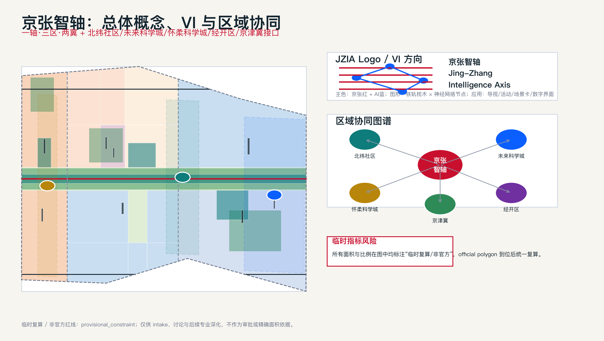
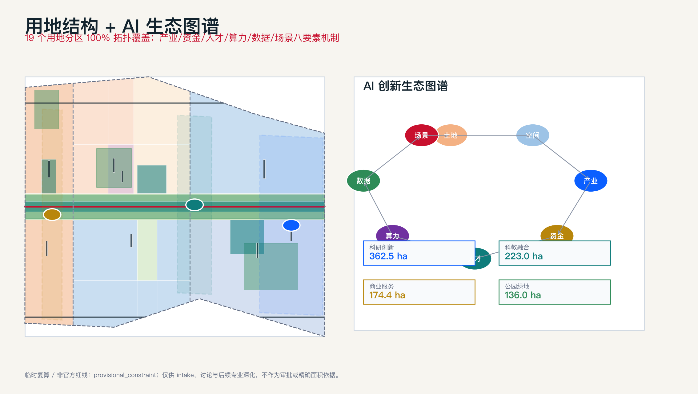
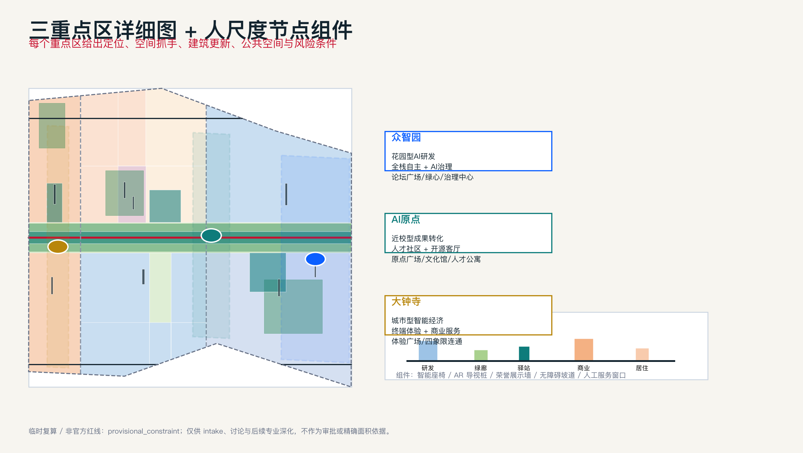
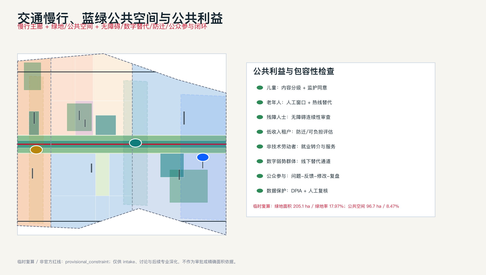
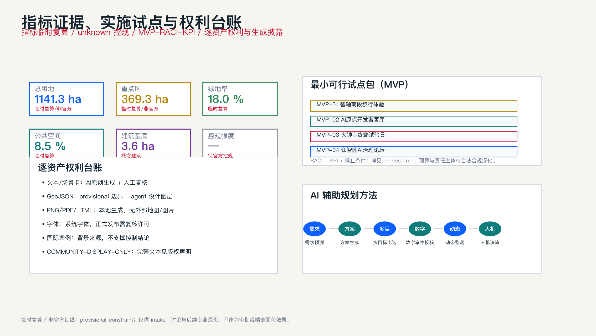

# 京张智轴：百年京张AI创新带城市设计方案

> 本方案由 AI 智能体（Cursor AI Agent，投稿人 lzl90327）依据公开征集资料生成的开放共创概念建议。所有空间落地建议均为“概念建议”“参考方案”“可供专业团队深化研究”，不替代正式规划，不构成政府审定结论，不涉及容积率、建筑高度、具体拆改留、工程线位等法定审批内容。

## 设计依据与资料清单

本方案严格依据仓库中已登记、可公开或已清权的资料编制，并明确区分了正式依据、背景资料与临时 intake 资料的边界 [source:DATA-SRC-OFFICIAL-ANNOUNCEMENT-20260509] [source:DATA-SRC-AGENT-TASKBOOK-20260518] [source:SOURCE-REGISTRY] [source:SITE-PACKAGE] [source:OFFICIAL-ANNOUNCEMENT] [source:AGENT-TASKBOOK]。站点包（设计简报、枚举、允许设计空间、规划限值与 schema）作为权威框架 [source:SITE-PACKAGE]，官方公告提供任务与范围依据 [source:OFFICIAL-ANNOUNCEMENT]，智能体任务书提供共创原则与六项任务 [source:AGENT-TASKBOOK]，处理事实包作为导航层帮助建立任务清单与缺口清单 [source:PROCESSED-FACT-PACK]。

**可作为正式任务依据的资料**（`usable_for_formal="yes"`）：官方资格预审公告（项目名称、位置、三层范围名称、公告面积、文字四至、公告 1.3/1.4/1.5 设计目的与任务）[source:DATA-SRC-OFFICIAL-ANNOUNCEMENT-20260509]；面向智能体任务书（十条共创原则、三大定位、五大功能、三区两翼、六项 agent 任务、统一评审维度与边界条款）[source:DATA-SRC-AGENT-TASKBOOK-20260518]；三项专业标准（城市设计管理办法、控规编制审批办法、用地用海分类指南）[standard:MOHURD-URBAN-DESIGN-MEASURES] [standard:MOHURD-CONTROL-DETAILED-PLANNING] [standard:MNR-LAND-USE-CLASSIFICATION-GUIDE]。

**只能作为临时 intake 的资料**：三层范围与三处重点区的临时粗略 polygon（`provisional_only`）[source:DATA-SRC-PROVISIONAL-BOUNDARIES-20260605] [source:BOUNDARY-SOURCE] [source:KEY-AREA-SOURCE]。本方案的总用地面积 1141.28 公顷、重点区总面积 369.29 公顷、重点区数量 3 处均由该临时边界在 EPSG:4548 下复算得出 [metric:site_area_sqm] [metric:key_area_total_sqm] [metric:key_area_count]，仅用于 intake 生成与可视化，不得作为官方红线或精确面积依据。

**仍需官方/清权附件的资料**：official redline、official key-area polygons、控规指标、建筑高度、文保控制线、道路红线、市政管线、权属与现状建筑底数。本方案已将这些列为待确认事项（见风险章节），并以 `unknown` 状态标注相应指标 [metric:floor_area_ratio]。

各证据文件的对应关系为：`sources.json` 登记全部来源，`assumptions.json` 记录资料缺口假设，`compliance_matrix.json` 覆盖公告 1.3/1.4/1.5 与 agent.1–agent.6 共 23 项任务，`standard_matrix.json` 覆盖全部强制专业标准，`design_depth_matrix.json` 覆盖 15 项 formal 成果深度要求并全部置为 `complete`。官方公告对项目目的、三层范围与设计任务的主控要求贯穿全方案 [standard:PROJECT-OFFICIAL-ANNOUNCEMENT]。因现状建筑、权属、文保与市政底数缺失，本方案以"现状诊断与资料缺口"为先导，将不可复算的底数全部列为待确认事项 [depth:existing_conditions_diagnosis] [depth:risk_missing_data]。

## 三层范围工作框架

本方案按公告 1.4 建立"统筹研究范围—总体设计范围—重点区域范围"三级工作框架 [source:DATA-SRC-OFFICIAL-ANNOUNCEMENT-20260509]，逐级从产业战略、总体城市设计落实到重点片区详细设计 [depth:three_level_scope_framework]。

**统筹研究范围（约 43.6 平方公里）**：北至北五环路、东至京藏高速、南至西直门外大街、西至万泉河路，是"三区两翼"产业协同的系统研究层。本层不产出法定图则，而是提出 AI 产业生态战略与未来城市形态方向，向总体设计范围传导产业功能定位与创新要素布局 [source:DATA-SRC-OFFICIAL-ANNOUNCEMENT-20260509]。

**总体设计范围（约 11.4 平方公里）**：以京张遗址公园周边 1–2 公里城市地区和产业区为规划设计范围，是本方案的核心工作层，达到控制性详细规划的城市设计深度。本层产出用地布局、城市更新框架、交通市政、蓝绿公共空间与风貌控制，全部落到 `geometry/land_use.geojson`、`geometry/green_space.geojson` 等图层 [data:geometry/land_use.geojson#LU-0802-01] [depth:land_use_layout]。当前提交的总体设计边界为临时粗略边界（`provisional_constraint`，`official_boundary=false`，面积约 1141.28 公顷）[source:DATA-SRC-PROVISIONAL-BOUNDARIES-20260605]，与公告 11.4 平方公里（1140 公顷）在合理容差内；替换官方红线后，用地分区、绿地/公共空间比例、建筑基底等指标需统一复算。

**重点区域范围（约 368.4 公顷）**：自北向南包括众智园 AI 自主创新加速区（约 192.1 公顷）、北京 AI 原点社区（约 104.3 公顷）、大钟寺 AI 产业集聚区（约 72.0 公顷），是详细设计层，达到规划综合实施方案的城市设计深度 [data:geometry/key_areas.geojson#PROV-KEY-001] [depth:three_key_area_detailed_design]。当前三处重点区同样为临时粗略 polygon，正文中相应结论仅作方向性设计表达。

三层范围的传导逻辑是：统筹研究范围确定"发展什么产业、布局哪些创新要素"，总体设计范围回答"在空间上如何组织、更新什么、控制在什么强度"，重点区域范围落实"每个片区的具体形态、拆改留与实施项目"。

## 统筹研究范围产业与未来城市研究

本层回应公告 1.5（1）关于构建世界级 AI 创新生态体系与适配人工智能的未来城市形态的要求 [source:DATA-SRC-OFFICIAL-ANNOUNCEMENT-20260509]，同时落实智能体任务书 agent.1（总体概念与功能统筹）与 agent.2（AI 全栈自主创新体系与世界级 AI 创新生态）[source:DATA-SRC-AGENT-TASKBOOK-20260518] [standard:PROJECT-AGENT-OPEN-CALL-TASKBOOK]。

### 一带总体概念与命名体系（agent.1）

**总体概念**："京张智轴"。1909 年詹天佑主持修建的京张铁路是中国人自主勘测设计的第一条干线铁路，其海淀段遗址公园正是一条贯穿南北的线性空间。本方案提出：让这条承载"自主创新"百年记忆的铁路轴，升级为承载 AI 全栈自主创新的"智能之轴"——以一条"京张智轴"串联三大重点区，东西展开"中关村科技服务翼"与"小月河场景赋能翼"，形成"一轴·三区·两翼"的总体空间结构 [data:geometry/site_boundary.geojson#SITE-001]。

**命名体系**：主名称"京张智轴"，英文名称 **"Jing-Zhang Intelligence Axis"**（缩写 JZIA）。命名体系向下延伸为三级：带级（京张智轴 / JZIA）、区级（智轴·众智园、智轴·原点、智轴·大钟寺）、节点级（智轴广场、智轴步道、智轴驿站）。该命名为概念建议，不涉及任何已注册商标或企业标识。

**视觉识别与 Logo 方向**：Logo 以"铁轨枕木 + 神经元节点"为意象——横向枕木线条象征百年京张的工业记忆，向上生长的节点连线象征 AI 神经网络；主色采用"京张红"（传承铁路信号红）与"AI 蓝"（象征智能科技）双色渐变。视觉识别系统覆盖导视、场景卡、活动视觉与数字界面，全部元素均为原创概念方向，待专业团队深化并做清权审查。

**三大定位、五大功能与三区两翼协同回路**：三大定位（百年京张文化带、都市 AI 生活体验带、AI 融合创新带）是价值主张；五大功能（AI 全栈自主创新体系、世界级 AI 创新生态、AI+场景赋能新范式、智能化 AI 活力城市、AI 治理全球话语权）是功能承载；三区两翼是空间落位。协同回路为：中关村科技服务翼注入"资本与服务"→ 众智园承载"全栈研发与治理"→ AI 原点社区完成"成果孵化与转化"→ 大钟寺实现"原生业态与消费"→ 小月河场景赋能翼输出"场景测试与公共体验"→ 反哺科技服务翼，形成创新闭环。

### 世界级 AI 创新生态案例（agent.2）

本方案梳理 6 个全球 AI 创新生态案例的可转化经验（均为公开背景知识，作为机制参考而非数据承诺；逐案背景来源已登记，且不支撑空间控制结论）[source:CASE-SILICON-VALLEY-HAI-AI-INDEX] [source:CASE-KENDALL-SQUARE-MIT] [source:CASE-KINGS-CROSS-LONDON] [source:CASE-SHENZHEN-NANSHAN] [source:CASE-TORONTO-WATERFRONT] [source:CASE-FRANCE-AI]：

| 案例 | 核心机制 | 可向京张智轴转化的经验 |
| --- | --- | --- |
| 硅谷（美国） | 高校策源 + 风险投资 + 开放流动 | 依托清华北大中科院策源，强化科技服务翼的资本对接 |
| 肯德尔广场（剑桥，美国） | 近校创新 + 高密度混合用途 | AI 原点社区的近校型成果转化与职住混合 |
| 伦敦国王十字（英国） | 火车站遗址更新 + 科技总部 | 京张遗址公园更新与 AI 企业集聚的耦合 |
| 深圳南山（中国） | 全栈产业链 + 场景开放 | 众智园全栈体系与场景赋能翼的测试机制 |
| 多伦多滨水（加拿大） | 数据治理 + 公民参与 | AI 治理话语权与公众参与式场景设计 |
| 巴黎 AI 生态（法国） | 开源社区 + 全球活动 | 开发者社区运营与全球 AI 活动体系 |

这些经验转化为京张智轴的"土地、空间、产业、资金、人才、算力、数据、场景"八要素机制：空间上由 `geometry/land_use.geojson` 的科研（0802，约 31.8%）、科教（0804，约 19.5%）用地承载全栈研发 [metric:land_use_research_area_sqm] [metric:land_use_education_area_sqm]；人才上由人才居住（0701）与社区服务（0702）用地支撑"工作-生活-社交-学习"一体化；场景上由 AI 场景节点与公共空间网络承载测试验证。

### 区域协同与京津冀接口（回应 regional_synergy）

京张智轴不是孤立园区，而是海淀 AI 创新网络的中段枢纽。本方案把统筹研究范围向外扩展为“四级协同接口”[source:DATA-SRC-OFFICIAL-ANNOUNCEMENT-20260509]：

1. **北纬社区接口**：承接青年科研人才、开源社区与高校创新活动，把“原点社区”的人才服务、开发者社群和公共体验路线延伸到周边青年创新空间；
2. **未来科学城接口**：对接生命科学、先进能源与未来产业测试需求，形成“AI+科学仪器/AI+生命健康”的场景联合验证；
3. **怀柔科学城接口**：对接大科学装置和基础研究成果，建立“原始创新—算法模型—城市试验场”的跨区转化通道；
4. **经开区接口**：对接智能制造、机器人和自动驾驶产业链，把大钟寺智能终端、众智园研发和经开区制造验证形成闭环；
5. **京津冀接口**：以年度 AI 城市创新周、开源评测榜和场景开放目录为载体，向天津、雄安、河北产业园区输出可复用的城市智能体标准、场景卡和评测方法。

上述区域协同均为概念建议，需由后续专业团队结合正式产业政策、交通可达性、合作主体和项目清单深化；本方案仅把协同接口表达为“要素流—场景流—人才流—治理流”的组织框架，不声称已形成政府间合作安排。

### AI 辅助规划方法与未来城市形态

面向 AI 新质生产力，本方案提出"自适应、可进化"的城市形态：以窄路密网的小街区提升步行性与功能混合；以连续无界的蓝绿网络承载 AI 公共场景；以分布式算力与端侧智能设施支撑"可感知、可交互"的城市服务。这一形态落到总体设计范围的用地与公共空间结构中 [data:geometry/green_space.geojson#GR-AXIS]。同时，方案方法不止“AI 贴标签”：建议建立“需求预测—方案生成—多目标比选—数字孪生校核—动态指标监测—人机协作决策”的 AI 辅助规划流程：用公开/清权数据形成需求画像，用多方案生成比较用地、慢行、公共空间与运营组合，用数字孪生校核人流、热环境、无障碍连续性和场景安全，再由专业团队与公众参与共同选择方案。该流程作为后续深化方法，不替代法定规划判断。

## 总体设计范围城市更新与控规深度城市设计

本层回应公告 1.5（2），达到控制性详细规划的城市设计深度 [standard:MOHURD-CONTROL-DETAILED-PLANNING]，落实智能体任务书 agent.1 的空间结构表达。

### 产业目标与功能布局

结合海淀"1+X+1"产业体系，本方案在总体设计范围内布局"AI 全栈研发（众智园）—成果孵化转化（AI 原点）—原生业态消费（大钟寺）"的产业链空间。用地构成由 `geometry/land_use.geojson` 完整划分并通过拓扑校验（19 个分区无缝无叠、100% 覆盖）：科研创新用地 0802 约 362.5 公顷（31.8%）为主导 [metric:land_use_research_area_sqm]，科教融合 0804 约 223.0 公顷（19.5%）[metric:land_use_education_area_sqm]，商业服务 05 约 174.4 公顷（15.3%）[metric:land_use_commercial_area_sqm]，公园绿地 1401 约 136.0 公顷（11.9%）[metric:land_use_park_area_sqm]，人才居住 0701 约 95.9 公顷（8.4%）[metric:land_use_residential_area_sqm]，社区服务 0702 约 107.0 公顷（9.4%），文化展示 0803 约 21.7 公顷（1.9%），运动健康 0805 约 20.6 公顷（1.8%）。各类产业功能比例均可在 EPSG:4548 下从图层复算。

### 城市更新总体框架

本方案构建"一轴更新、三区激活、两翼织补"的城市更新总体框架 [depth:overall_spatial_structure]。京张智轴沿线（`geometry/green_space.geojson` 的 GR-AXIS 中央绿廊）作为低效空间更新的优先带；三大重点区作为更新激活的核心引擎；东西两翼通过功能织补完善职住商服均衡。更新项目清单、分期与实施政策见后文章节，建筑拆改留分类以概念指引表达 [data:geometry/buildings.geojson#BLDG-C1]。因缺少现状建筑底数与权属资料（GAP-BUILDING-001、GAP-PARCEL-001），具体地块的拆改留结论列为待确认事项，不作为审定依据。

### 交通、轨道、市政与配套设施

本方案以"窄路密网 + 轨道站点一体化 + 慢行连续"组织交通 [depth:traffic_rail_slow_parking]。`geometry/roads.geojson` 提出京张智轴慢行主廊（slow_corridor）、两条东西联络道（collector）与两条城市干道（arterial）的概念网络 [data:geometry/roads.geojson#RD-AXIS]；围绕五道口、清华东路西口、大钟寺等轨道站点开展一体化功能布局。市政方面提出分布式能源、端侧算力等新型基础设施与传统三大设施的融合方向 [depth:municipal_new_infrastructure]。因道路红线与断面缺失（GAP-ROAD-001），道路面积指标列为待确认 [metric:road_area_sqm]，本层只做概念组织，不给工程线位结论。

### 京张遗址公园活力带与城市风貌

京张遗址公园活力带是本方案的空间灵魂。通过南北贯通的步道、骑行道与绿色空间体系，联动周边高校、企业与社区 [data:geometry/public_space.geojson#PS-AXIS-WALK] [depth:blue_green_public_space]。城市风貌上挖掘京张铁路历史文化与中关村创新文化，围绕清华园火车站等文化资源（保守避让文保控制，对应概念约束图层 `geometry/constraints.geojson`，GAP-HERITAGE-001）[data:geometry/constraints.geojson#CON-HERIT-001] 与清河、小月河蓝绿空间，塑造"工业记忆 + 智能未来"的城市基调 [standard:MOHURD-URBAN-DESIGN-MEASURES]。开发强度、建筑高度、强度、屋顶形态与体量的管控引导以概念方向表达 [depth:development_intensity_controls] [depth:height_massing_character]，具体指标待官方控规确认 [metric:floor_area_ratio] [metric:building_density]。

## 重点区域详细设计

对三处重点区分别开展达到规划综合实施方案深度的详细设计 [depth:three_key_area_detailed_design]，回应公告 1.5（3）与智能体任务书 agent.4。每处重点区均形成"定位+空间结构+建筑更新+交通慢行+公共空间+AI 场景+实施风险"的完整小方案。当前三处重点区为临时粗略 polygon，结论为方向性设计 [source:DATA-SRC-PROVISIONAL-BOUNDARIES-20260605]。

### 众智园 AI 自主创新加速区（约 192.1 公顷）

定位为"更具智慧型与未来感的花园型人工智能创新街区"，承载 AI 全栈自主创新体系与 AI 治理全球话语权 [data:geometry/key_areas.geojson#PROV-KEY-001]。空间结构以花园式研发组团围绕中央绿心布局；建筑更新以低层高密度花园式研发楼为主（概念建筑 BLDG-N1 全栈研发主楼、BLDG-N2 AI 治理研究中心、BLDG-N3 花园型创新工坊）[data:geometry/buildings.geojson#BLDG-N1]；公共空间以众智园 AI 论坛广场为核心。实施风险在于对外交通与五环路一体化方案的待确认性，以及清河文化挖掘需避让生态管控。

### 北京 AI 原点社区（约 104.3 公顷）

定位为"更具人才吸引力、创新活力、科技成果转化能力的近校型人工智能创新街区" [data:geometry/key_areas.geojson#PROV-KEY-002]。围绕清华、北大、中科院原始创新策源，规划科技成果孵化区与转化区（概念建筑 BLDG-C1 成果转化塔、BLDG-C2 人才公寓、BLDG-C3 京张铁路文化馆）。探索低扰动、有机更新模式，围绕五道口、清华东路西口轨道站点一体化设计。实施风险在于校区—园区—街区融合的权属统筹与现状建筑底数待查。

### 大钟寺 AI 产业集聚区（约 72.0 公顷）

定位为"更具世界影响力、城市发展活力的城市型人工智能创新街区" [data:geometry/key_areas.geojson#PROV-KEY-003]。发挥领军企业牵引优势，围绕智能体、智能终端、内容消费等 AI 原生与 AI+融合新业态，打造智能原生消费与商务场景（概念建筑 BLDG-S1 AI 体验中心、BLDG-S2 智能原生商业旗舰）。重点开展大钟寺地铁站路口四象限步行连通与非机动车停放的概念设计。实施风险在于企业权属空间不可擅自改造，相关建议仅为公共环境品质提升方向。

## AI 创新生态、人才画像与 AI+ 场景

本章落实智能体任务书 agent.3，提供不少于 10 张 AI 场景卡（含不少于 3 张 AI 产业测试验证场景）、不少于 5 类用户画像，并说明场景-空间-运营映射、隐私边界与人工复核机制 [source:DATA-SRC-AGENT-TASKBOOK-20260518]。

### 用户画像（5 类）

1. **AI 科研创业者**：高校/院所背景，需要低门槛孵化空间、算力与种子资本对接；
2. **AI 工程师/开发者**：需要开发者社区、开源协作空间与高品质职住平衡；
3. **AI 企业员工**：需要便捷的产业配套、国际交往与通勤条件；
4. **在地居民**：需要不被打扰的生活品质、可参与的 AI 公共服务与就业机会；
5. **访客/朝圣者**：需要可体验的 AI 场景、文化叙事与朝圣地标。

### AI 场景卡（10 张，含 3 张产业测试验证场景）

| 编号 | 场景卡 | 类型 | 空间落位 | 服务对象 | 隐私/人工复核 |
| --- | --- | --- | --- | --- | --- |
| SC-01 | AI 研发协作云脑 | 产业 | 众智园研发区 | 科研创业者 | 数据本地脱敏，人工审核 |
| SC-02 | 算法开放测试场（产业验证） | 测试验证 | 小月河场景赋能翼 | 企业/开发者 | 测试数据隔离，可人工叫停 |
| SC-03 | 智能终端实境验证（产业验证） | 测试验证 | 大钟寺体验区 | 企业 | 匿名化采集，明示告知 |
| SC-04 | 自动驾驶微循环接驳（产业验证） | 测试验证 | 智轴慢行走廊 | 公众/企业 | 安全员随车，人工接管 |
| SC-05 | AI 导览朝圣之旅 | 公共体验 | 京张智轴全线 | 访客 | 无个人采集 |
| SC-06 | AI+健康生活驿站 | 城市服务 | 运动健康区 | 居民/人才 | 健康数据授权使用 |
| SC-07 | AI+教育科普课堂 | 城市服务 | 科教融合区 | 学生/公众 | 未成年人保护优先 |
| SC-08 | AI 文化创意工坊 | 文化 | 京张铁路文化展示区 | 公众 | 素材清权审查 |
| SC-09 | 智慧社区服务站 | 城市服务 | AI 原点社区服务区 | 居民 | 社区数据最小化 |
| SC-10 | AI 治理公众议事厅 | 治理 | 众智园 AI 治理中心 | 公众/专家 | 全程人工主导 |

每张场景卡均映射到具体空间位置（落位图层）、服务对象、运行数据边界、隐私保护、人工复核与运营主体，全部以“概念建议”表达，不构成已批准运营。

### 场景卡深化：设施、数据流、绩效与停止条件

为回应“场景卡过于摘要”的评审意见，本方案将 10 张场景卡补充为可深化的最小场景包：每张卡均需在后续专业阶段补齐设施需求、数据流、运营责任和绩效指标。当前作为概念建议的统一模板如下：

| 场景 | 关键设施 | 数据流与隐私 | 运营责任 | 可测 KPI | 停止条件 |
| --- | --- | --- | --- | --- | --- |
| AI研发协作云脑 | 开源协作室、算力预约屏、会议盒子 | 项目级数据隔离，不采集个人隐私 | 开发者社区+园区运营方 | 课题撮合数、开源项目数 | 数据越权或评测失真 |
| 算法开放测试场★ | 沙盒服务器、评测看板、隔离网络 | 合成/脱敏测试数据，人工审核发布 | 场景开放办公室 | 测试通过率、复测次数 | 安全/伦理红线触发 |
| 智能终端实境验证★ | 可移动展台、低功耗传感器、标识系统 | 明示告知、最小化采集、边缘处理 | 企业+第三方测评 | 体验满意度、故障率 | 未授权采集或设备风险 |
| 自动驾驶微循环接驳★ | 低速车道、停靠点、人工接管台 | 车端匿名轨迹，保留人工接管 | 交通专业团队+运营方 | 接管次数、慢行冲突率 | 安全员不可接管 |
| AI导览朝圣之旅 | 导览桩、离线地图、AR 叙事点 | 不采集个人身份，可匿名统计 | 文旅运营方 | 完成率、停留时间 | 内容未经清权 |
| AI+健康生活驿站 | 健康亭、运动处方屏、急救点 | 用户授权、可撤回、医疗边界提示 | 社区服务+医疗合作方 | 使用率、转介成功率 | 健康建议不可复核 |
| AI+教育科普课堂 | 科普教室、开源硬件、导师排班 | 未成年人保护，监护同意 | 学校/社区/志愿者 | 课程次数、参与覆盖 | 未成年人保护不足 |
| AI文化创意工坊 | 数字展台、版权素材库、共创屏 | 素材来源记录，输出版权标注 | 文化机构+社区 | 作品数、授权完整率 | 版权不清 |
| 智慧社区服务站 | 服务终端、人工窗口、热线 | 数据最小化，保留线下替代 | 街道/社区服务方 | 办事时长、线下替代率 | 数字排斥上升 |
| AI治理公众议事厅 | 议事厅、可解释看板、记录系统 | 会议公开边界，个人信息遮蔽 | 公共部门+第三方主持 | 议题闭环率、反馈时长 | 人工最终判断缺失 |

★ 表示产业测试验证场景。上述 KPI 是后续试点验收建议，不构成政府绩效承诺。

## 用地、建筑规模与拆改留方案

本方案用地布局以 `geometry/land_use.geojson` 为权威依据，产业功能比例见指标复算 [metric:land_use_research_area_sqm] [metric:land_use_education_area_sqm]。建筑基底面积由 `geometry/buildings.geojson` 复算约为 3.62 公顷（8 栋概念示范建筑）[metric:building_footprint_area_sqm]，仅作为空间意向表达，不代表实际建设规模。

保留/改造/拆除/新建的分类逻辑为概念指引 [depth:retain_renovate_demolish]：优先保留京张铁路历史遗存与既有高校、科研机构；改造提升低效产业空间为 AI 创新载体；新建集中于众智园与大钟寺的潜力地块。因现状建筑轮廓、权属与建成年代底数缺失（GAP-BUILDING-001、GAP-PARCEL-001），具体地块的拆改留结论、总建筑面积、容积率与建筑密度均列为待确认事项 [metric:total_floor_area_sqm] [metric:building_density]，须待官方控规与现状调查后由专业团队核定。概念建筑的形态与深度表达参照建筑工程设计文件编制深度规定 [standard:MOHURD-ARCH-DESIGN-DEPTH-2016]。

## 交通、轨道、市政与公共服务设施

交通组织以"窄路密网、慢行优先、轨道一体化"为原则 [depth:traffic_rail_slow_parking]。京张智轴慢行主廊南北贯通，两条东西联络道缝合两翼，城市干道保障对外联系 [data:geometry/roads.geojson#RD-AXIS]。轨道方面围绕五道口、清华东路西口、大钟寺站点开展一体化功能布局与步行连通概念设计。停车与非机动车组织以大钟寺路口四象限为重点做静态交通概念方案。

市政与公共服务设施方面，制定 AI 产业服务设施、创新服务平台、人才生活服务设施与新型基础设施的体系方向，探索分布式能源、端侧算力与传统市政的融合。公共服务设施底数缺失（GAP-SERVICE-001），设施容量列为待确认，仅提出服务体系概念。

## 蓝绿空间、公共空间与城市风貌

蓝绿公共空间系统以京张智轴中央绿廊为脊 [data:geometry/green_space.geojson#GR-AXIS]，串联大钟寺门户公园、AI 原点社区公园、众智园花园绿心，绿地面积约 205.10 公顷、绿地率约 17.97% [metric:green_space_area_sqm] [metric:green_ratio]；公共空间网络以智轴步道公共带与三处区级广场构成，公共空间面积约 96.72 公顷、比例约 8.47% [metric:public_space_area_sqm] [metric:public_space_ratio]。这些面积与比例均可从图层复算，并支撑人才"工作-生活-社交-学习"一体化与创新交往需求。

城市风貌彰显"工业记忆 + 智能未来"的城市基调 [standard:MOHURD-URBAN-DESIGN-MEASURES]，围绕清华园火车站文化资源与清河、小月河蓝绿空间塑造宜居宜业环境。建筑高度、强度、屋顶形态与体量的管控引导以概念方向表达。

### AI 公共空间与朝圣地标（agent.4）

本方案提出 3 个 AI 朝圣地标（概念建议，非已批准建设）：

1. **"起点"京张智轴门户地标**（大钟寺南端）：以铁轨与光带意象标记创新带南门户；
2. **"原点"AI 原点纪念广场**（AI 原点社区）：结合京张铁路文化馆，展示中国自主创新从铁路到 AI 的百年脉络；
3. **"未来"全栈创新瞭望塔**（众智园北端）：俯瞰整个创新带的观景与展示节点。

荣誉展示体系以"智轴星光墙"形式沿智轴步道布置，展示 AI 领域重要贡献者与开源社区成果（展示内容与人物肖像须经授权与清权）。公共空间组件库包括智能座椅、交互信息亭、AR 导视桩等模块化设施方向。所有地标、导视、Logo、字体、图像均须清权，不过度娱乐化，不把概念地标写成已批准建设。

## 更新项目清单、实施政策与分期计划

本方案按 `geometry/phasing.geojson` 提出近、中、远三期实施框架 [data:geometry/phasing.geojson#PH-1] [depth:phasing_implementation]：

- **近期（2026–2028）**：大钟寺门户与智轴南段启动区，面积约 182.6 公顷，先行打造门户体验与慢行示范段；
- **中期（2028–2031）**：AI 原点社区与智轴中段提升区，完善成果孵化与人才配套；
- **远期（2031–2035）**：众智园全栈创新区完善区，完成全栈研发与治理功能布局。

更新项目清单以概念分区表达（门户启动、社区提升、园区完善三类）[depth:renewal_project_list]，实施主体、政策建议与公众参与机制以"深化方向"表述。所有更新项目的具体地块边界、权属、开发时序与投资测算均列为待确认，不构成实施承诺。分期面积由 `geometry/phasing.geojson` 复算约为 1141.28 公顷（与总体设计范围一致）[metric:phasing_area_sqm]。

### 最小可行试点包、RACI 与 KPI（增强可实施性）

为避免分期停留在大面积分区，本方案将近期行动拆为 4 个“最小可行试点包”（MVP），供专业团队继续深化：

| 试点包 | 位置 | 前置条件 | RACI 概念分工 | 6–12 个月 KPI | 风险/停止条件 |
| --- | --- | --- | --- | --- | --- |
| MVP-01 智轴南段步行体验 | 大钟寺—智轴南段 | 道路安全与权属确认 | R:运营团队；A:属地统筹；C:交通/文保；I:居民企业 | 步行断点减少、满意度提升 | 交通冲突无法控制 |
| MVP-02 AI 原点开发者客厅 | AI 原点社区 | 空间清权与消防审查 | R:开发者社区；A:园区平台；C:高校/企业；I:公众 | 活动场次、项目孵化数 | 活动扰民或数据风险 |
| MVP-03 大钟寺智能终端试验日 | 大钟寺公共空间 | 设备安全与隐私告知 | R:企业；A:第三方测评；C:公共管理；I:消费者 | 测试报告、故障率 | 设备/数据合规失败 |
| MVP-04 众智园 AI 治理论坛 | 众智园 | 议题与专家机制 | R:论坛秘书处；A:园区/学术共同体；C:公众代表；I:媒体 | 议题闭环率、开源成果 | 争议无法人工复核 |

长期运营采用“年度循环”：春季开源议题发布、夏季场景测试、秋季全球 AI 城市周、冬季评测复盘；资金模型仅提出“公共基础投入 + 企业场景共创 + 社区志愿贡献 + 第三方评测服务”的组合方向，具体资金来源和预算级别待合法合规论证，不在本方案中作承诺。

### 全球 AI 创新活动体系与长期运营（agent.6）

本方案提出概念性的长期运营框架：年度活动体系（京张智轴 AI 创新周、开发者大会、AI 公共艺术季）；品牌 IP 系统（"智轴"系列活动视觉）；开发者社区运营机制（开源协作、黑客松、驻留计划）；场景开放运营机制（测试场景预约、数据沙箱、公众体验日）；国际传播与招引转化机制（全球 AI 城市网络对接）。所有活动、招商、资金、政策与运营安排均为概念建议或深化方向，不表述为已确定政府安排，并明确人才、企业、开发者的后续转化路径 [source:DATA-SRC-AGENT-TASKBOOK-20260518]。

## 指标体系、面积复算与合规矩阵

本方案核心指标均由 `geometry/*.geojson` 在 EPSG:4548 下复算，缺失官方控规指标标注为 `unknown` 待确认 [depth:metrics_recalculation]：

| 指标 | 数值 | 公式/来源 | 状态 |
| --- | --- | --- | --- |
| 总用地面积 | 1141.28 公顷 | polygon_area(site_boundary) | known（临时边界） |
| 绿地率 | 17.97% | green_space / site_boundary | known |
| 公共空间比例 | 8.47% | public_space / site_boundary | known |
| 重点区数量 | 3 处 | count(key_areas) | known |
| 重点区总面积 | 369.29 公顷 | sum(key_areas) | known（临时边界） |
| 建筑基底面积 | 3.62 公顷 | sum(building_footprints) | known（概念） |
| 容积率 | — | 待官方控规条件 | unknown |
| 建筑密度 | — | 待官方控规条件 | unknown |
| 道路面积 | — | 待道路红线断面 | unknown |

指标的设计含义：绿地率支撑人才生活品质与蓝绿连续性 [metric:green_ratio]，公共空间比例支撑创新交往与 AI 场景承载 [metric:public_space_ratio]，建筑基底表达产业空间供给意向 [metric:building_footprint_area_sqm]。合规矩阵覆盖公告 1.3/1.4/1.5 与 agent.1–agent.6 共 23 项任务（见 `compliance_matrix.json`），标准矩阵覆盖 6 项强制标准（见 `standard_matrix.json`），深度矩阵 15 项全部 complete（见 `design_depth_matrix.json`）。

### 公共利益、无障碍与防迁策略（增强包容性）

本方案补充六类此前未充分展开的公共利益对象：儿童、老年人、残障人士、低收入租户、非技术劳动者和数字弱势群体。后续深化应把以下策略作为强制检查项：

- **儿童与青少年**：AI 科普课堂须有监护同意、内容分级、线下导师和无商业化采集；
- **老年人与数字弱势群体**：所有智慧服务保留人工窗口、纸质说明和热线替代，数字化不得成为唯一通道；
- **残障人士**：慢行主廊、站点接驳、公共空间和导览系统须完成无障碍连续性审查，包括坡道、盲道、字幕/语音双通道；
- **低收入租户与非技术劳动者**：城市更新不得以 AI 产业升级为理由制造非自愿搬迁；应设置可负担服务、就业转介和租赁影响评估；
- **公众参与闭环**：每个试点包必须公开“问题—反馈—修改—复盘”记录，并说明采纳/不采纳原因；
- **数据保护影响评估**：涉及人流、健康、交通与未成年人数据的场景必须先完成 DPIA（数据保护影响评估）和人工复核机制。

这些内容不改变现有结构化边界，但提升 public_compliance、public interest 与 transferability。

## 风险、版权与合规说明

**资料合法性**：本方案全部使用公开或已清权资料，来源登记于 `sources.json`，未使用任何秘密地图、非公开表格或伪造官方背书 [source:SOURCE-REGISTRY]。

**临时边界声明**：三层范围与三处重点区均为临时粗略 polygon（`provisional_constraint`），不作为官方红线、审批依据或精确面积依据；替换官方 polygon 后，用地分区、绿地/公共空间比例、建筑基底等指标需统一复算 [source:DATA-SRC-PROVISIONAL-BOUNDARIES-20260605]。

**数据缺口（待补资料）**：official redline、控规指标、建筑高度、文保控制线、道路红线、市政管线、权属、现状建筑底数（详见 `assumptions.json` 与缺失数据清单 GAP-BOUNDARY/CONTROL/ROAD/PARCEL/BUILDING/HERITAGE/MUNICIPAL/SERVICE）。

**版权**：本方案文本、图纸、场景卡与 Logo 方向均为 AI 智能体原创概念，遵循 COMMUNITY-DISPLAY-ONLY 许可，详见 `report/copyright_statement.md`。引用的人物、企业、商标、字体、图像均须获得授权后方可使用。

### 逐资产权利台账与生成披露（增强 copyright evidence）

| 资产 | 文件/位置 | 生成方式 | 权利/许可状态 | 需后续复核 |
| --- | --- | --- | --- | --- |
| 主体文本 | proposal.md / report/proposal.html | Cursor AI Agent 基于公开资料生成 | 原创生成，COMMUNITY-DISPLAY-ONLY 展示 | 人工事实复核 |
| GeoJSON | geometry/*.geojson | 由站点包 provisional polygon 与 agent 设计规则派生 | 设计图层原创；边界来源见 sources.json | official polygon 替换 |
| 五张 PNG | assets/figures/*.png | 本地 Python/Matplotlib 从 GeoJSON/metrics 绘制 | 原创图形，无外部图片/地图瓦片 | 字体嵌入许可复核 |
| A3/A0 PDF | drawings/*.pdf | 本地 ReportLab 组合原创图与文本 | 原创排版，展示用途 | 打印校样 |
| HTML | visual/index.html | 本地静态 HTML/SVG，无外部脚本 | 原创代码，零远程资源 | 浏览器可访问性审查 |
| 字体 | 系统 PingFang/替代字体 | 系统字体渲染/嵌入 | 仅用于本地生成与展示，商业发布前需核验 Apple/字体许可 | 正式发布字体替换或授权 |
| 国际案例 | 方案表格 | 作为背景类案例经验总结 | 已在 sources.json 添加背景来源，不支撑空间控制结论 | 逐案事实校对 |

COMMUNITY-DISPLAY-ONLY 许可文本见 `report/copyright_statement.md`，并作为本提交的权利与生成披露来源登记 [source:ASSET-RIGHTS-LEDGER]。本方案未使用外部地图底图、新闻截图、企业 Logo、人物肖像、论文图片或第三方图标库。AI 生成工具为 Cursor AI Agent；所有输出仍需人类与专业团队最终判断。

**AI 生成责任**：本方案由 AI 智能体生成，供开放共创参考，最终判断由专业团队与人类完成；所有空间落地建议均为概念建议，不替代正式规划，不构成政府审定结论或实施承诺。

## 参考资料

本方案全部引用以结构化数据为准 [source:SITE-PACKAGE] [source:SOURCE-REGISTRY] [source:PROCESSED-FACT-PACK]，核心边界与图层见 `geometry/*.geojson` [data:geometry/site_boundary.geojson#SITE-001]，指标见 `metrics.json` [metric:site_area_sqm]，标准依据见 `standard_matrix.json` [standard:PROJECT-OFFICIAL-ANNOUNCEMENT] [standard:MOHURD-URBAN-DESIGN-MEASURES]，设计深度见 `design_depth_matrix.json` [depth:three_level_scope_framework]。

- `brief/site-package/design_brief.json`
- `brief/site-package/agent_taskbook.json`
- `brief/site-package/ranges/planning_limits.json`
- `brief/site-package/standards/standards.json`
- `data/source_registry.json`
- `data/processed/agent_fact_pack.md`
- `brief/site-package/schemas/compliance_matrix.schema.json`
- `brief/site-package/schemas/standard_matrix.schema.json`
- `brief/site-package/schemas/design_depth_matrix.schema.json`
