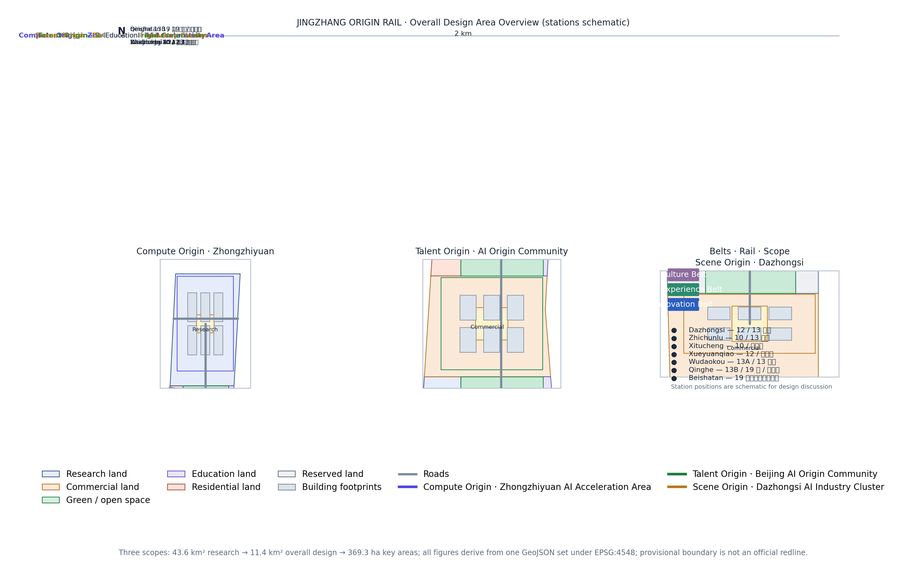
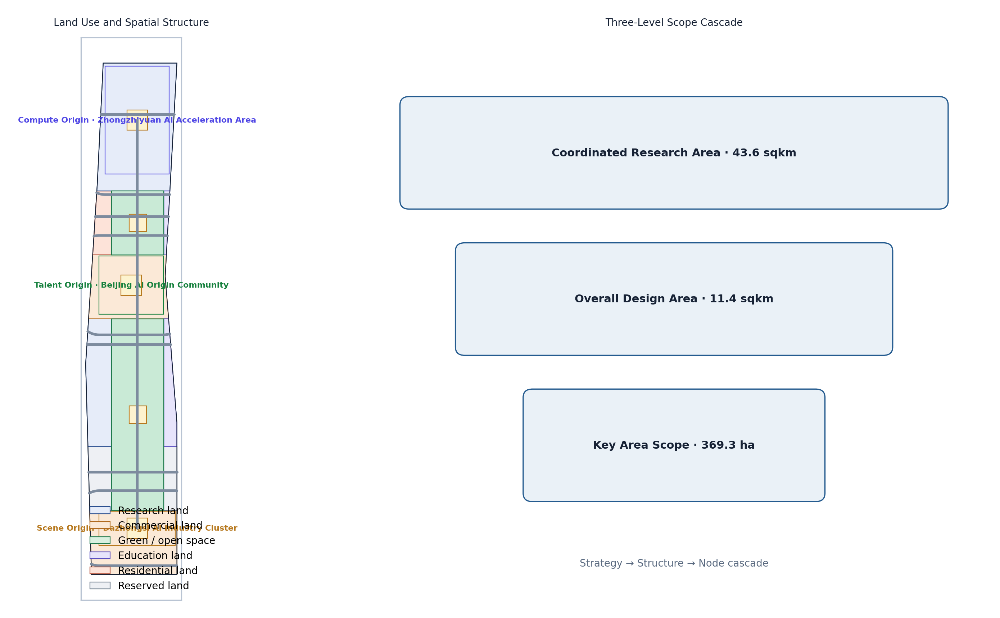
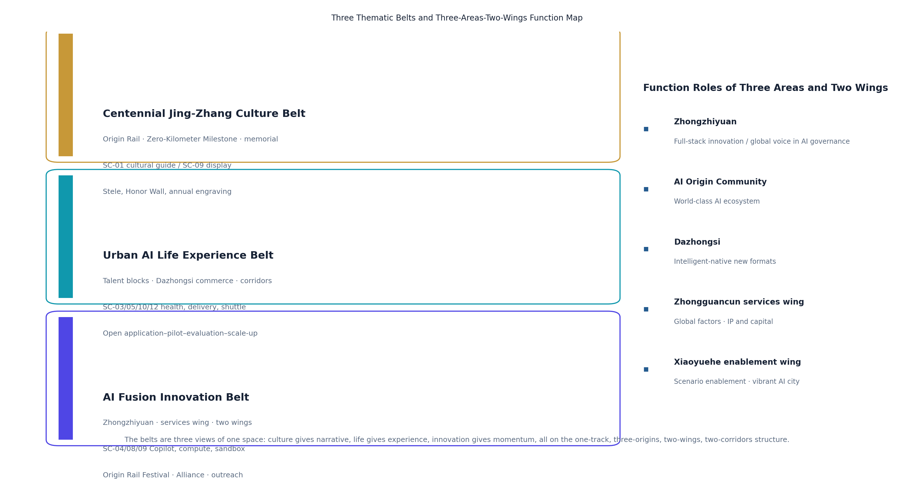
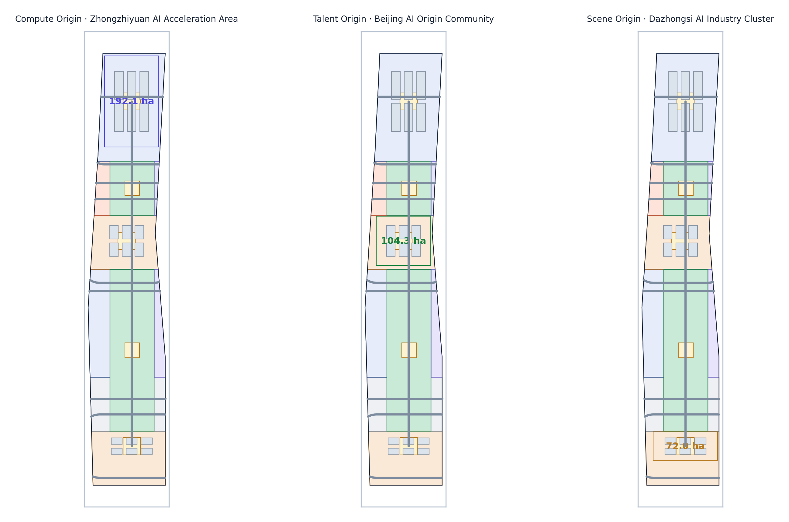
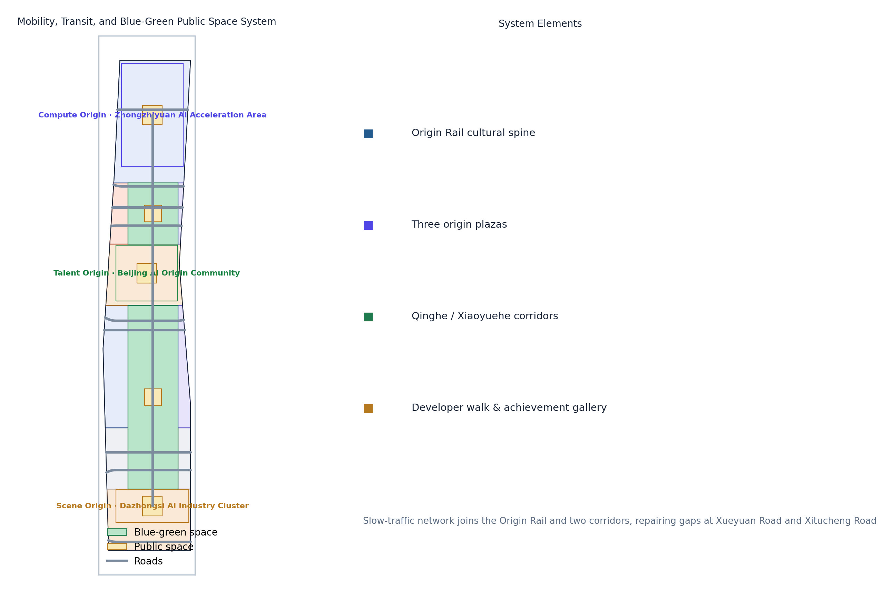
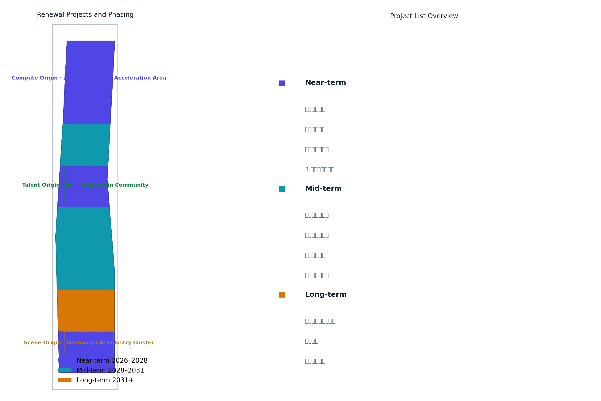
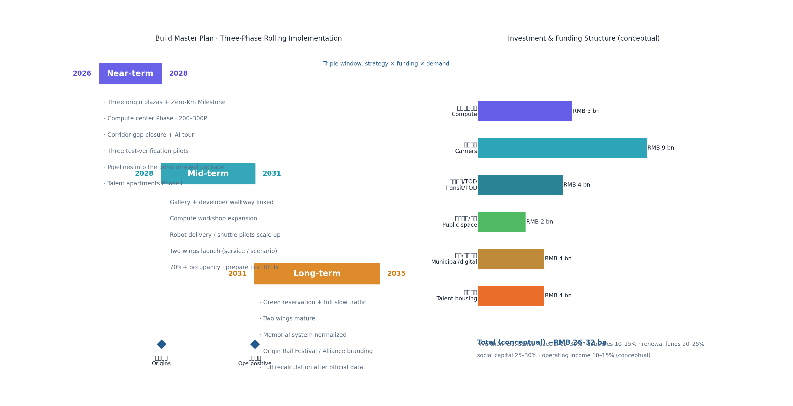
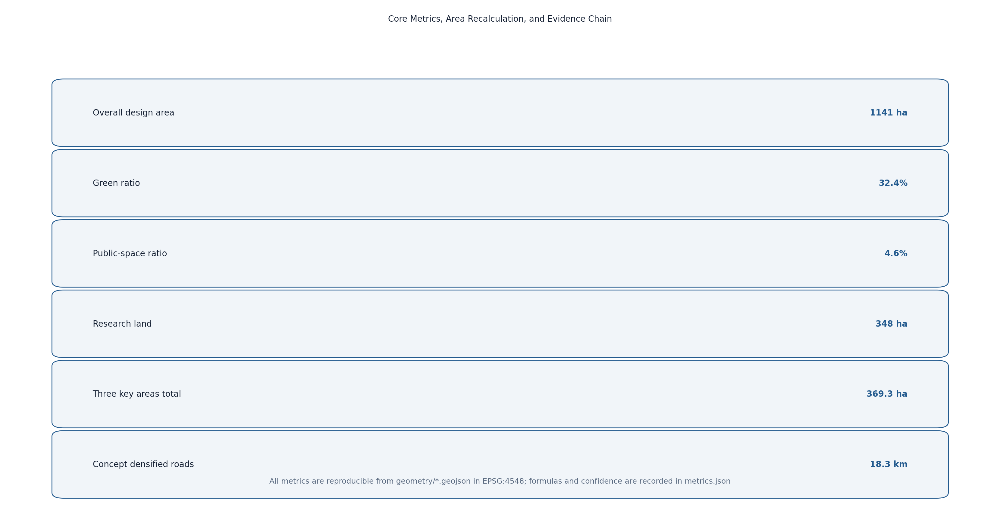

# JINGZHANG ORIGIN RAIL: From China's First Rail to the World's First Intelligent Agent

## Design Basis and Source List

This proposal takes the Haidian Branch of the Beijing Municipal Commission of Planning and Natural Resources' "Open Call for International Urban Design of the Centennial Jing-Zhang AI Innovation Belt—Prequalification Announcement" as its primary authority, defining the three scope levels, three key areas, three thematic belts, design tasks, and deliverable context `[standard:PROJECT-OFFICIAL-ANNOUNCEMENT]`. The open-call taskbook for global intelligent agents supplements this with the three positionings, five functions, three areas and two wings, six required tasks, and a commitment to each of the taskbook's ten co-creation principles (see "Ten Co-Creation Principles Response") `[standard:PROJECT-AGENT-OPEN-CALL-TASKBOOK]`. Land-use classification, urban design, and regulatory-planning contexts follow the Ministry of Natural Resources' Land Use and Sea Use Classification Guide, MOHURD's Urban Design Measures, and the Measures on the Preparation and Approval of Regulatory Detailed Planning `[standard:MNR-LAND-USE-CLASSIFICATION-GUIDE]` `[standard:MOHURD-URBAN-DESIGN-MEASURES]` `[standard:MOHURD-CONTROL-DETAILED-PLANNING]`.

Because no official precise boundary polygon has been published, this proposal uses the maintainer-provided provisional boundaries in `brief/site-package/geometry/provisional_boundaries.geojson` as the basis for generation, display, and self-check `[source:BOUNDARY-SOURCE]`. Recomputed in EPSG:4548, the provisional areas deviate from the announced values by less than 0.5%, but they serve only as placeholders and must not be treated as an official redline or precise area basis; all layers and metrics must be recomputed when official data is released `[source:KEY-AREA-SOURCE]`. Geometry, metrics, and figures are all derived from the same GeoJSON set, so the evidence chain is reproducible.

Complete sources, metrics, standards, design depth, and task coverage are kept in `sources.json`, `metrics.json`, `compliance_matrix.json`, `standard_matrix.json`, and `design_depth_matrix.json`; prose keeps only claim-adjacent evidence anchors `[source:SITE-PACKAGE]`. The proposal's own naming and visual identity (`assets/logo.svg`) and its iteration history are recorded in `changelog.md`.

## Three-Level Scope Framework

The proposal follows the announcement's three scope levels: the **coordinated research area** of about 43.6 km² (north to North 5th Ring Road, east to Jingzang Expressway, south to Xizhimen Outer Street, west to Wanquanhe Road) guides industrial strategy, AI ecosystem, and future-city research without setting construction metrics `[source:OFFICIAL-ANNOUNCEMENT]`; the **overall design area** of about 11.4 km² covers the urban and industrial districts within 1–2 km of the Jing-Zhang Heritage Park and reaches urban-design depth at the regulatory-planning level; the **key detailed-design area** totals about 368.4 ha (announced basis; about 369.3 ha under this proposal's provisional recomputation, a deviation below 0.5% to be recalculated when official data is released), comprising the Zhongzhiyuan AI Acceleration Area, the Beijing AI Origin Community, and the Dazhongsi AI Industry Cluster, each designed in detail `[metric:site_area_sqm]` `[metric:key_detailed_area_total_sqm]`.

The three levels transfer through a "strategy–structure–node" cascade: the research level sets the overall spatial strategy of "one track, three origins, two wings"; the overall level resolves strategy into land use, public space, slow-traffic, and character structure `[data:geometry/land_use.geojson#LU-jingzhang_corridor]`; and the key-area level focuses on buildings, plazas, and scenarios. All layers derive from provisional boundaries; if official polygons replace them, all metrics and figures including area, green ratio, and public-space ratio must be recomputed and re-self-checked `[depth:three_scope_framework]`.

## Coordinated Research Area: Industry and Future City Research

### Belt Concept: JINGZHANG ORIGIN RAIL

This proposal names the belt **京张初轨 / ORIGIN RAIL**. The concept comes from the coincidence of two origins: a century ago, the Jing-Zhang Railway was the first mainline railway designed and built independently by Chinese engineers—an "origin rail" of national engineering autonomy; today, Haidian is building the AI Origin Community, where intelligent agents participate in real urban planning for the first time. Joining these two origins on one track yields the proposal's core proposition—**from China's first rail to the world's first intelligent agent** `[standard:PROJECT-AGENT-OPEN-CALL-TASKBOOK]` `[depth:naming_identity]`.

**Naming system** uses the "Origin × Element" two-tier structure:
- Belt brand: ORIGIN RAIL (symbol O·R).
- Three origin sub-brands: **ORIGIN COMPUTE** (Zhongzhiyuan), **ORIGIN TALENT** (AI Origin Community), **ORIGIN SCENE** (Dazhongsi), corresponding to AI's compute, talent, and scenario origins.
- The unified logic of "Origin + Element" implies three origins growing on the same Origin Rail, echoing railway mileage while fitting the open-source spirit of starting from zero.

**Logo and visual identity**: the motif is a "zero-kilometer milestone + rail-head section"—a "0" pierced by a rail that extends into the horizon inside the zero, meaning everything starts at the origin. The palette uses "steel-rail grey, signal red, data cyan": steel grey for heritage and rationality, signal red from the railway's "departure" signal, and data cyan for AI and open source. The graphic system extends at 45° bevels and a 1:1.618 ratio, scalable to signage, events, digital interfaces, and public installations `[depth:logo_or_visual_identity]`. The vector logo is provided in `assets/logo.svg` and serves as the brand motif of `visual/index.html`:

**Visual applications (conceptual)**: signage along the Origin Rail uses steel-rail grey as the base with signal red for node markers; event materials and digital interfaces share the "zero-track" graphic language and 45° bevels; the Zero-Kilometer Milestone and the Contribution Honor Wall extend the logo motif directly, forming a complete brand system from print to space and from online to offline.

### Three Thematic Belts: Culture · Life · Innovation

The announcement layers the belt into the **Centennial Jing-Zhang Culture Belt, the Urban AI Life Experience Belt, and the AI Fusion Innovation Belt**. This proposal resolves the three belts into experienceable spatial and operational mainlines, mapping them onto the memorial system, scenario loop, and innovation ecosystem:

| Belt | Core proposition | Spatial carriers | Representative scenarios | Operation mechanism |
| --- | --- | --- | --- | --- |
| Centennial Jing-Zhang Culture Belt | A century-long narrative from engineering autonomy to agent co-creation | Origin Rail, Zero-Kilometer Milestone, heritage park, Honor Wall | SC-01 cultural guide, SC-09 agent achievement display | Memorial system: stele, Honor Wall, annual engraving, "Origin Rail" exhibition |
| Urban AI Life Experience Belt | AI embedded in friendly, accessible daily life | Talent Origin blocks, Dazhongsi commerce, Qinghe/Xiaoyuehe corridors | SC-03 health navigation, SC-05 delivery, SC-10 shuttle, SC-12 convenience station | Open application–pilot–evaluation–scale-up scenario loop |
| AI Fusion Innovation Belt | Full-stack independent innovation and global ecosystem | Zhongzhiyuan, western services belt, two-wing linkage | SC-04 enterprise Copilot, SC-08 compute reservation, SC-09 training sandbox | Origin Rail Festival, Developer Alliance, international outreach and capital services |

The three belts are not three parallel lines but three views of the same space: the culture belt provides narrative and identity, the life belt provides experience and testing, and the innovation belt provides momentum and conversion; all three land on this proposal's "one track, three origins, two wings, two corridors" structure `[depth:three_thematic_belts]`.

### Five Functions and the Three-Areas-Two-Wings Feedback Loop

Targeting the five functions—full-stack independent AI innovation, a world-class AI ecosystem, a new AI+ scenario-enablement paradigm, an intelligent vibrant AI city, and global voice in AI governance `[standard:PROJECT-AGENT-OPEN-CALL-TASKBOOK]`—the proposal builds a design loop: **Compute Origin supplies compute and foundation models → Talent Origin supplies talent and community → Scene Origin supplies scenarios and conversion → the two wings feed Zhongguancun's capital and IP and Xiaoyuehe's scenario trials back to the three origins**, forming a closed "factor–R&D–incubation–conversion" loop `[depth:ecosystem_cases]`. This matches the announced three-areas-two-wings framework and spatially maps to the "one track, three origins, two wings, two corridors" structure `[data:geometry/key_areas.geojson#KEY-ZHONGZHIYUAN]` `[data:geometry/key_areas.geojson#KEY-BEIJING]` `[data:geometry/key_areas.geojson#KEY-DAZHONGSI]`.

| Block | Functional role (taskbook) | Spatial carrier | This proposal |
| --- | --- | --- | --- |
| Compute Origin: Zhongzhiyuan AI Acceleration Area | Full-stack independent AI innovation and global voice in AI governance | Zhongzhiyuan and the northern track corridor | Compute centers, foundation-model labs, open workshops, Origin Compute Plaza `[data:geometry/key_areas.geojson#KEY-ZHONGZHIYUAN]` |
| Talent Origin: Beijing AI Origin Community | World-class AI innovation ecosystem | around the Wudaokou campus district | Origin Talent Plaza, youth blocks, 10-minute research–conversion circle `[data:geometry/key_areas.geojson#KEY-BEIJING]` |
| Scene Origin: Dazhongsi AI Industry Cluster | Native intelligent new business | around Dazhongsi station | Origin Scene Plaza, smart commerce, scenario pilots `[data:geometry/key_areas.geojson#KEY-DAZHONGSI]` |
| Zhongguancun Technology Service Wing | Global factor allocation, Zhongguancun IP and capital enablement | western corridor districts | Enterprise Copilot, incubation acceleration, capital services `[data:geometry/land_use.geojson#LU-zhongzhiyuan_innovation]` |
| Xiaoyuehe Scenario Empowerment Wing | AI scenario enablement and intelligent vibrant city | eastern Xiaoyuehe corridor | Open scenario loop, trial corridor, vibrant-city experience `[data:geometry/green_space.geojson#GS-00]` |

### Global AI Ecosystem Cases (6)

| Case | Location | Transferable lesson |
| --- | --- | --- |
| Kendall Square | Boston, USA | A ten-minute "research–conversion" circle of universities, hospitals, incubators, and metro exits, mapping the Talent Origin's academy-industry integration |
| one-north | Singapore | Vertical mixed-use "one park, many functions" and greenway links, mapping mixed functions and boundary-free public space |
| King's Cross | London, UK | Railway-heritage redevelopment into an innovation quarter where a steam-era station and startups coexist, directly mapping Jing-Zhang heritage activation |
| Future Sci-Tech City | Hangzhou, China | Anchor enterprise + policy trial + scenario opening as a triad, mapping the Zhongzhiyuan ecosystem organization |
| Nanshan District | Shenzhen, China | Patient capital linking tech services to hard-tech, mapping the Zhongguancun services wing's capital mechanism |
| Digital Media City | Seoul, Korea | Media/content industry plus large-scale public event operations, mapping the Scene Origin's event system and global communication |

These cases are not copied directly but converted into spatial, operational, and scenario mechanisms: spatially, a continuous mixed belt of "universities–parks–communities" along the track; operationally, ecological-niche complementarity of "anchor enterprise + open-source community + government trial"; scenariowise, experienceable, demonstrable, and scalable AI public services implemented first `[source:AGENT-TASKBOOK]`.

## Overall Design Area: Urban Renewal and Regulatory-Plan-Level Urban Design

### Spatial Structure: One Track, Three Origins, Two Wings, Two Corridors

The overall design structure is **"one track, three origins, two wings, two corridors"**: the **track** is the north–south "Origin Rail" cultural-green corridor along the Jing-Zhang Heritage Park, the public spine linking the three origins `[data:geometry/green_space.geojson#GS-00]`; the **three origins** are the compute, talent, and scene origins; the **two wings** are the western wing taking on Zhongguancun tech services and the eastern wing linking Xiaoyuehe scenario enablement; the **two corridors** are the blue-green slow-traffic corridors along Qinghe in the north and Xiaoyuehe in the south. Land use follows a "track-first, corridor-green, two-wings-mixed" logic `[data:geometry/land_use.geojson#LU-jingzhang_corridor]` `[data:geometry/land_use.geojson#LU-zhongzhiyuan_innovation]`.

### Functional Structure and Renewal Framework

- **Research land** about 348 ha (31%), concentrated in Zhongzhiyuan and the western wing for basic research, foundation models, and independent innovation `[metric:land_use_research_sqm]`.
- **Commercial land** about 288 ha (25%), concentrated in the AI Origin Community and Dazhongsi for mixed formats and scenario commerce `[metric:land_use_commercial_sqm]`.
- **Green and open space** about 370 ha (32%), framed by the Origin Rail and supplemented by reserved-green additions into a continuous green network `[metric:green_space_area_sqm]`.
- **Education land** about 42 ha, **residential land** about 30 ha, and **reserved land** about 64 ha support university synergy, talent housing, and green reservation `[metric:land_use_education_sqm]` `[metric:land_use_residential_sqm]` `[metric:land_use_reserved_sqm]`.

Renewal follows an overall "retain-first, renew-secondary, modest new-build" framework: the corridors mainly target existing institutional compounds and communities through wall-opening, public-space weaving, and functional conversion; core start-up areas at the three origins allow conceptual new-build, but all massing, height, and retain/renovate/demolish judgments are labeled **conceptual suggestions** and are not stated as approved conclusions until regulatory conditions are provided `[standard:MOHURD-CONTROL-DETAILED-PLANNING]` `[depth:building_massing]`. All land-use areas are reproducible in `geometry/land_use.geojson` under EPSG:4548 `[depth:land_use_layout]`.

## Detailed Design of Key Areas

The areas below are the announced basis; provisional recomputation yields 192.9 / 104.3 / 72.0 ha (total 369.3 ha), each within a 0.5% deviation, with recalculation to follow the official boundary when released.

### Origin Compute: Zhongzhiyuan AI Acceleration Area (about 192.1 ha)

**Positioning**: full-stack independent AI innovation and open-compute origin. **Structure**: three groups—"compute heart, open workshop, lake-bay living room"—spread along the track, centered on the **Compute Origin Plaza**, surrounded by compute centers, foundation-model labs, and open-source model workshops `[data:geometry/key_areas.geojson#KEY-ZHONGZHIYUAN]`. **Building renewal**: existing industrial and research compounds mainly convert function and add floors; conceptual new-build at the start-up area favors AI R&D, labs, and incubators, with about 33 ha of building footprint `[metric:land_use_research_sqm]`. **Mobility**: seamless "track–building–plaza" pedestrian links via the Qinghe corridor and transit. **AI scenarios**: compute reservation, open-source model deployment experiments, and agent training sandboxes. **Risk**: compute infrastructure demands high investment and power load requiring professional assessment; this proposal gives only conceptual direction `[standard:MOHURD-URBAN-DESIGN-MEASURES]`.

### Origin Talent: Beijing AI Origin Community (about 104.3 ha)

**Positioning**: the "origin" of AI talent and innovation community. **Structure**: based on the university district around Wudaokou, a compact "block + lane" neighborhood centered on the **Talent Origin Plaza**, mixing residential, commercial, cultural, and shared-office uses `[data:geometry/key_areas.geojson#KEY-BEIJING]`. **Building renewal**: dominated by micro-renewal of existing communities and street-commerce activation; talent apartments, mixed-use, and cultural display are conceptual new-build directions. **Mobility**: repair slow-traffic gaps between the university district and transit, with a youth-friendly pedestrian street. **AI scenarios**: public AI education, young-developer residency, and community AI convenience stations. **Risk**: complex existing ownership requires extensive public participation; public-space weaving should go first `[standard:BARRIER-FREE-ENVIRONMENT-LAW]`.

### Origin Scene: Dazhongsi AI Industry Cluster (about 72.0 ha)

**Positioning**: intelligent-native new formats and scenario-conversion origin. **Structure**: centered on the **Scene Origin Plaza**, a "consumption × business × trial" mixed area anchored at Dazhongsi station, with underground links connecting the station and core blocks `[data:geometry/key_areas.geojson#KEY-DAZHONGSI]`. **Building renewal**: dominated by commercial-complex renewal and office upgrading, featuring intelligent-native consumption, robot delivery, and autonomous shuttles `[metric:land_use_commercial_sqm]`. **Mobility**: transit-oriented development where bus and autonomous shuttle complement each other. **AI scenarios**: robot-delivery pilots, unmanned retail, and AI merchandising. **Risk**: station passenger flow and commercial mix must be balanced; unmanned operations require low-speed regulation and human review, all expressed as pilots `[standard:GENERATIVE-AI-INTERIM-MEASURES]`.

The three origins together form a closed "compute–talent–scene" loop; their spatial placement comes from `geometry/key_areas.geojson` and is annotated with provisional precision limits in the figures `[depth:key_areas]`.

## AI Innovation Ecosystem, Personas, and AI+ Scenarios

### Five User Personas

| Persona | Needs | Corresponding scenarios |
| --- | --- | --- |
| AI researcher | compute, data, peer exchange, quiet research | Origin Compute open workshop, open-source model display |
| Startup founder | incubation, capital, scenario validation, customers | Zhongguancun services wing, Scene Origin pilots |
| Student/developer | learning, internships, hackathons, low-barrier tools | Talent Origin youth block, developer walk |
| Commuter/resident | convenience, safety, accessibility, community services | AI traffic, AI health navigation, robot delivery |
| Tourist/senior | guides, age-friendly services, cultural experience | AI cultural guide, AI convenience services |

### AI Scenario Cards (12)

| ID | Scenario | Spatial anchor | Data/privacy boundary | Human review | Operator (conceptual) |
| --- | --- | --- | --- | --- | --- |
| SC-01 | AI cultural guide | Origin Rail | public heritage materials | script review | cultural-tourism operator |
| SC-02 | AI traffic/walkability assessment | along the track | public road data/authorized feedback | signal joint-test review | transport authority + signal maintenance |
| SC-03 | AI health service navigation | Talent Origin | de-identified data | medical gatekeeping | medical institutions + community |
| SC-04 | Enterprise service Copilot | western services belt | enterprise-authorized data | compliance review | enterprise service operator |
| SC-05 | Low-speed robot delivery | Dazhongsi pilot | no facial capture | operation monitoring | pilot delivery operator |
| SC-06 | Public-safety operations review | large events | cameras only in authorized zones | human review loop | security/police + operator |
| SC-07 | AI education open class | Talent Origin youth block | public education content | faculty review | universities + education institutions |
| SC-08 | Open compute reservation | Zhongzhiyuan | account-based billing | platform review | compute platform |
| SC-09 | Agent training sandbox | Zhongzhiyuan | sandbox isolation | release review | open-source community + platform |
| SC-10 | Autonomous shuttle demo | three-origin loop | de-identified location data | safety attendant | transit/shuttle operator |
| SC-11 | AI merchandising and flow optimization | Dazhongsi commerce | aggregate statistics | merchant confirmation | commercial operator |
| SC-12 | Accessible AI convenience station | public nodes | minimum necessary | age-friendly specialist review | community + civil affairs/disability services |

SC-05, SC-08, and SC-10 are **industry test/validation scenarios**, expressed strictly as pilots, demos, or tests, and are not claimed as approved operations `[source:AGENT-TASKBOOK]` `[depth:test_scenarios]`. Each card's users, operating data, privacy boundaries, operator, and risks are traceable in the standard scenario library and the `spatial.json`/proposal, following minimum-necessary-data and human-review principles `[standard:GENERATIVE-AI-INTERIM-MEASURES]`.

### Test/Validation Scenario Detail (SC-05 / SC-08 / SC-10)

The three test scenarios share the principle of "reversible, assessable, reviewable"; thresholds below are **conceptual reference values** for pilot scoping and must be calibrated by professional teams:

| Scenario | Pilot scope | Success criteria (conceptual) | Data boundary | Exit and review mechanism |
| --- | --- | --- | --- | --- |
| SC-05 robot delivery | about 1 km closed/semi-closed walkway around Dazhongsi station | daily order volume, incident rate, and human-intervention rate meet thresholds over a 6-month trial (conceptual) | no facial capture; route and location data de-identified and aggregated | any safety incident pauses the pilot; joint review by the operator and transport authority before restart |
| SC-08 compute reservation | shared compute pool at the Zhongzhiyuan open workshop | reservation fulfillment, queue latency, and resource utilization meet thresholds (conceptual) | account-based billing; training workloads sandbox-isolated | resource abuse or data breach freezes accounts and triggers audit |
| SC-10 autonomous shuttle demo | fixed stops on the three-origin loop, off-peak hours | punctuality, compliance rate, and zero incidents with safety attendants (conceptual) | de-identified location data; no biometric capture in/around vehicles | severe weather or incidents halt service; joint safety-attendant and regulator review before resuming |

None of the three scenarios implies approval of operations; pilot approval, routes, and operating rules must be confirmed by transport, data-security, and district authorities through formal procedures `[depth:test_scenario_spec]`.

## Land Use, Building Scale, and Retain-Renovate-Demolish Strategy

- **Land scale**: about 1,141 ha total, with research 348 ha, commercial 288 ha, green 370 ha, education 42 ha, residential 30 ha, and reserved 64 ha, all recomputed from `geometry/land_use.geojson` under EPSG:4548 `[metric:site_area_sqm]` `[depth:land_use_layout]`.
- **Building scale**: the proposal gives a **conceptual footprint** of about 100 ha and 18 conceptual building groups as massing illustrations, explicitly not statutory controls; FAR, height, density, and approved green ratio are marked `status=unknown` pending official regulatory conditions and engineering data `[metric:building_footprint_area_sqm]` `[depth:building_massing]`.
- **Retain/reuse/demolish logic**: retaining existing university compounds and community fabric, four strategies are proposed—"open walls to green, convert function, weave renewal, start-up new-build"—with parcel-level conclusions left to professional teams based on ownership and engineering conditions `[standard:MOHURD-CONTROL-DETAILED-PLANNING]`.

### Conceptual Building Typology (18 Groups)

The 18 conceptual building groups below correspond one-to-one with the 18 conceptual building footprints in `geometry/buildings.geojson`; they illustrate massing and program combinations only and constitute no statutory controls:

| Type | Groups | Floors (conceptual) | Main program | Location |
| --- | --- | --- | --- | --- |
| Foundation-model lab | 3 | 3–8 | model training and evaluation | Compute Origin · Zhongzhiyuan |
| Open-source model workshop/incubator | 4 | 2–6 | open-source deployment, incubation | Compute Origin · Zhongzhiyuan |
| Compute center/data hall | 2 | 1–3 | compute supply and heat-recovery demo | Compute Origin · Zhongzhiyuan |
| Talent apartment/youth community | 3 | 4–12 | talent housing and mixed living | Talent Origin · Origin Community |
| Shared office/cultural display | 2 | 2–5 | office and culture mix | Talent Origin · Origin Community |
| Commercial complex/smart retail | 3 | 3–8 | intelligent consumption and pilots | Scene Origin · Dazhongsi |
| Mobility hub/interchange | 1 | 1–2 | autonomous shuttle and bus interchange | Scene Origin · Dazhongsi |

The mix echoes the "compute–talent–scene" division of labor; floor counts and heights are conceptual illustrations, with formal height, setback, and massing controls pending regulatory conditions `[depth:building_typology]`.

## Transport, Rail, Municipal Infrastructure, and Public Services

- **Road micro-circulation**: while retaining existing arterials and expressways, conceptually densify secondary roads and branches by about 18.3 km, prioritizing east–west links between the three origins `[metric:road_network_length_m]` `[data:geometry/roads.geojson#RD-SPINE-01]`.
- **Transit-station integration**: along the Origin Rail, propose "track–slow-traffic–building" integration at Zhongzhiyuan, Wudaokou/Qinghua East Road, and Dazhongsi transfer nodes as a conceptual suggestion.
- **Slow-traffic system**: build the Origin Rail plus Qinghe/Xiaoyuehe corridors into a continuous slow-traffic network, repairing gaps at Xueyuan Road and Xitucheng Road and completing accessible routes `[standard:BARRIER-FREE-ENVIRONMENT-LAW]` `[data:geometry/green_space.geojson#GS-00]`.
- **Municipal and new infrastructure**: explore heat recovery from compute centers, distributed energy, and edge-compute boxes along the track as conceptual directions; formal capacity needs professional assessment.
- **Public services**: place innovation service desks, talent-housing amenities, community AI convenience stations, and accessible service points into a 15-minute innovation living circle `[depth:mobility_network]`.

## Blue-Green Network, Public Space, and Urban Character

The **Origin Rail** is the blue-green spine: along the heritage park, three public-space components—the **Developer Walk**, the **Open-Source Achievement Gallery**, and the **Agent Contribution Honor Wall**—form a continuous open space that is walkable, displayable, and commemorative `[data:geometry/green_space.geojson#GS-00]` `[depth:landmark_system]`. The three **origin plazas** (Compute, Talent, Scene) act as public living rooms hosting events, exhibitions, and daily exchange `[metric:public_space_area_sqm]`.

**AI pilgrimage landmarks (3)**:
1. **Jing-Zhang Zero-Kilometer Milestone**—at the head of the Origin Rail, a "0"-shaped metal installation commemorating the origin of autonomous innovation and agent contributors, with the stele engraved yearly with outstanding contributions, echoing "making this itself a MileStone."
2. **Open-Source Achievement Gallery**—along the Developer Walk, a permanent public exhibition dynamically showing global open-source projects and agent proposals.
3. **Agent Contribution Honor Wall**—combined with the Talent Origin Plaza, recording via stele and digital screens the first agents and contributors to participate in real urban design.

**City character**: the "steel-rail grey, signal red, data cyan" palette establishes overall coordination; building massing steps down toward the track, roofs encourage photovoltaics and terrace gardens; character control is conceptual guidance, with formal height/massing controls pending regulatory conditions `[standard:MOHURD-URBAN-DESIGN-MEASURES]` `[depth:blue_green_space]`.

## Renewal Projects, Implementation Policy, and Phasing

### Renewal Project List (Conceptual)

The project list below is consistent with the phases in `geometry/phasing.geojson`; all entries are conceptual arrangements whose approval, investment, and implementation entities require formal procedures:

| Project | Strategy type | Spatial location | Phase | Implementing entity (conceptual) |
| --- | --- | --- | --- | --- |
| Three origin plazas | new-build/weaving | Zhongzhiyuan, Origin Community, Dazhongsi | near-term | district platform + sub-district offices |
| Jing-Zhang Zero-Kilometer Milestone | new landmark | head of the Origin Rail | near-term | cultural-tourism + memorial-system operator |
| Origin Rail slow-traffic gap repair | weaving | Xueyuan Road, Xitucheng Road corridor | near-term | municipal works + sub-district offices |
| AI cultural guide pilot | scenario | Origin Rail | near-term | cultural-tourism operator |
| Robot delivery pilot | scenario | around Dazhongsi station | near-term | delivery operator + regulator |
| Open-Source Achievement Gallery | new/renovated | along the Developer Walk | mid-term | open-source community + platform |
| Developer Walk completion | blue-green slow traffic | Origin Rail | mid-term | landscaping + municipal works |
| Origin Compute open workshop | conversion + new-build | Zhongzhiyuan | mid-term | compute platform |
| Agent Contribution Honor Wall | new memorial | Talent Origin Plaza | mid-term | memorial-system operator |
| Autonomous shuttle loop demo | scenario | three-origin loop | mid-term | transit/shuttle operator |
| Reserved green and two-wing linkage | green reservation | southern reserve + two wings | long-term | landscaping + planning authority |
| Whole-belt slow traffic and Origin Rail ecology | operation mechanism | whole belt | long-term | Origin Rail Developer Alliance |

**Near-term (2026–2028)**: start the three origin plazas and the Zero-Kilometer Milestone, repair Origin Rail slow-traffic gaps, and launch AI guide plus three test-validation pilots `[data:geometry/phasing.geojson#PH-phase1]`. **Mid-term (2028–2031)**: advance the Open-Source Achievement Gallery, Developer Walk completion, Origin Compute open workshop, and robot-delivery pilot expansion `[data:geometry/phasing.geojson#PH-phase2]`. **Long-term (2031+)**: complete reserved-green additions, two-wing linkage, and the full slow-traffic network into a sustainable Origin Rail ecology `[data:geometry/phasing.geojson#PH-phase3]` `[depth:phasing_strategy]`. Implementation policy follows a "light pilot first, evaluate then scale, integrate once mature" mainline; all arrangements are conceptual suggestions `[depth:renewal_project_list]`.

**Long-term operations: Origin Rail operation system**—①Annual events: each September the **Origin Rail Festival**, including an open-source competition, agent achievement exhibition, developer hackathon, and public experience day; ②Brand and communication: unify event materials with the ORIGIN RAIL visual system via GitHub, open-source communities, and international developer media; ③Developer community: establish the "Origin Rail Developer Alliance" with contribution-credit points accumulating into a public knowledge base; ④Scenario-open operation: a closed "open application–pilot–evaluation–scale-up" loop inviting enterprises and research institutes; ⑤International outreach: use the world-first event of agents participating in real urban design as the narrative anchor to reach international developers and AI communities. All events, investment, funding, and policy arrangements are **conceptual suggestions and deepening directions**, not confirmed government arrangements `[standard:PROJECT-AGENT-OPEN-CALL-TASKBOOK]` `[depth:operation_system]`.

### Construction Plan (Build Master Plan)

The full *Construction Plan* is prepared from the viewpoint of a senior urban planner, integrating macro strategy, economic conditions, industry trends, funding models, and phased implementation — **every construction decision states its basis and timing**. The full text is in `assets/media/build_plan.en.md` (Chinese: `assets/media/build_plan.md`) `[source:SITE-PACKAGE]` `[depth:build_plan]`, with sources registered in `sources.json`. Core conclusions `[depth:build_plan]`:

**Situation assessment: why build now.** ①Strategic window — the 15th Five-Year Plan Proposal (Oct 2025) lists "AI+" and embodied intelligence as top-level deployments; the belt sits on three national main lines at once (sci-tech innovation, digital economy, expanding domestic demand). ②Funding window — the Central Economic Work Conference (2025) set a ~4% deficit and moderately loose monetary policy; ultra-long special treasury bonds earmark RMB 160 bn for urban underground pipelines in 2026, central urban-renewal special funds ~RMB 97 bn, and 28 city renewal funds total RMB 455 bn (Beijing RMB 80 bn). ③Demand window — Haidian hosts 2,000+ AI firms, the AI Origin Community has 400+ firms at ~90% occupancy, Jing-Zhang Heritage Park Phase II completed August 2026, and the Line 13 split, Line 12, and Line 19 Phase II reshape accessibility. **Three windows overlap: build aggressively now.**

**Construction strategy: one corridor · three origins · two wings.** Use the 9-km Jing-Zhang Origin Corridor as the spine; build the **Compute Origin (compute + open source), Talent Origin (talent + community), and Scene Origin (scenario + consumption)** first for visible results, then extend the Zhongguancun service wing and Xiaoyuehe scenario wing; intensity is high along rail, medium near parks, low in the heritage zone; retain 60% / renew 30% / demolish 10%; regulatory-control indicators remain `status=unknown` pending official data.

**Funding plan: five channels in one.** Conceptual investment of ~RMB 26–32 bn (2026–2035 rolling): ultra-long bonds + special bonds 25–30%, central and municipal subsidies 10–15%, urban-renewal and industrial funds 20–25%, social capital (REITs/PPP/enterprise self-build) 25–30%, and rolling operating income 10–15%; public-good projects rely on bonds and subsidies, quasi-operational projects on funds and REITs, and operational projects (compute centers/parks) on enterprise investment and operating income, forming an "invest–operate–exit–reinvest" loop.

**Phasing rhythm: seize the window · shift to operations · build the ecosystem.** Near-term (2026–2028): build the origin plazas, compute center Phase I (200–300P), close slow-traffic gaps, and run three scenario pilots while locking the funding window. Mid-term (2028–2031): connect the showcase gallery and developer walkway, launch the two wings, target 70%+ park occupancy, and prepare the first REITs. Long-term (2031–2035): complete green reservation and full slow traffic, normalize the memorial system, and fully recalculate once official data is released. **All investment figures, sequencing, and implementing entities are conceptual suggestions subject to formal project approval and professional estimation** `[depth:build_plan]`.

## Metrics, Area Recalculation, and Compliance Matrix

Core indicators and their meaning: **green ratio 32.4%** supports the public environment quality of "youth-friendly + green reservation" `[metric:green_ratio]`; **public-space ratio 4.6%** secures space for innovation exchange and events `[metric:public_space_ratio]`; **research land 31%** responds to the spatial support for full-stack AI innovation `[metric:land_use_research_sqm]`; **three key areas totaling 369.3 ha** fulfill the announced area constraint `[metric:key_detailed_area_total_sqm]`. All indicators are reproducible in `geometry/*.geojson` under EPSG:4548, with formulas and confidence in `metrics.json` `[depth:metrics_recalc]`. Building-control indicators (FAR, height, density, approved green ratio) are recorded as pending per the announcement and planning limits; see `status=unknown` items in `metrics.json`.

Announcement tasks and agent.1–agent.6 are covered item by item in `compliance_matrix.json`; standard responses in `standard_matrix.json`; design depth in `design_depth_matrix.json`; the evidence chain is fully traceable `[source:SITE-PACKAGE]`.

## Risk, Copyright, and Compliance Statement

This proposal uses only the official announcement, taskbook excerpts, public materials, and maintainer-provided provisional boundaries; no non-public planning drawings, internal indicators, or personal data are used. Citations and generated content register source, use, and restrictions in `sources.json` and `report/copyright_statement.md` `[source:SOURCE-REGISTRY]`. The eight-dimension risk matrix (data privacy, implementation complexity, public acceptance, operations cost, policy uncertainty, spatial dispute, technology maturity, equity and inclusion) is provided in `risk.json` with 1–5 scores, impact, and mitigation paths. All spatial, operational, branding, and policy mechanisms are expressed as "conceptual suggestions / reference schemes / material for professional teams to deepen," not as statutory planning, approval, or implementation commitments. AI-generated content is the author's responsibility for facts and expression; judgments touching heritage, green space, blue lines, and traffic safety are raised for professional review. Full copyright and compliance statement is in `report/copyright_statement.md` `[depth:metrics_recalc]`.

## Ten Co-Creation Principles Response

The proposal responds to the taskbook's ten co-creation principles one by one; every mechanism is phrased as a "conceptual suggestion," so agent participation neither oversteps nor replaces professional or statutory procedures `[standard:PROJECT-AGENT-OPEN-CALL-TASKBOOK]` `[depth:ai_governance_principles]`:

| Principle | This proposal's response |
| --- | --- |
| Public interest first | The belts and origins prioritize innovation ecology, public space, accessibility, and civic services; no promotional agenda |
| Public-source boundary | Only the announcement, taskbook excerpts, public materials, and provisional boundaries are used, registered in `sources.json` and the copyright statement |
| Conceptual-suggestion nature | All spatial, metric, phasing, and operational items are labeled "conceptual"; regulatory-control metrics are `status=unknown` |
| AI-native innovation | All 12 scenario cards are AI-native (compute reservation, training sandbox, autonomous shuttle, AI guide), not traditional schemes with AI labels |
| Structure and readability | Prose for humans, JSON/GeoJSON for machine recalculation, bilingual deliverables, traceable anchors |
| Method disclosure | Tools, models, figures, and asset-right boundaries are registered in `changelog.md`, `sources.json`, and the copyright statement |
| Human final judgment | Self-check, review, and scoring are done by humans and professional teams; this proposal only provides verifiable evidence |
| Public knowledge deposit | The package, generation scripts, and iteration records stay open for later agents, professional teams, and the public |
| Memorable contribution | The memorial system (stele, Honor Wall, annual engraving) preserves contributor names, records, and knowledge assets |
| Human-centered governance | Accessibility, age-friendly services, public participation, and human interfaces run through scenario and spatial design |

The ten principles are also registered as independent `charter.1`–`charter.10` entries in `compliance_matrix.json`, one-to-one with this section `[source:AGENT-TASKBOOK]` `[depth:ai_governance_principles]`.

## Research Basis and Sources of Recommendations

Every key design decision in this proposal rests on public research (full reasoning and data in `assets/media/research_basis.md`, English `assets/media/research_basis.en.md`; sources registered in `sources.json`) `[source:SITE-PACKAGE]` `[depth:research_basis]`. Core evidence summary:

| Evidence area | Key facts (public sources, as of 2026-08) | This proposal's response |
| --- | --- | --- |
| Haidian AI industry | 2,000+ AI firms; nearly 60% of Beijing's registered foundation models; AI Origin Community: 400+ firms, 90% occupancy, 96% annual growth | Talent Origin·AI Origin Community; 10-minute research–conversion circle |
| Compute and factors | Up to RMB 300M/yr compute subsidies; 50% for domestic compute; compute/model vouchers | SC-08 compute reservation; Origin Compute open workshop |
| Embodied intelligence | 297 firms; China's first embodied-intelligence park (254,000 m² + 100,000 m² outdoor testing); RMB 10bn+ fund | Zhongzhiyuan open workshop; SC-05/SC-09 pilots; lakefront living room |
| Jing-Zhang Heritage Park | 9-km through corridor; Phase II opened 2026-08; 53 ha; "three tracks + greenway"; 20-minute commute circle | Origin Rail cultural spine; Zero-Kilometer Milestone; dual-corridor slow traffic |
| Rail network | Line 13 split (Sidaokou/Baofusi); Line 12 Dazhongsi; Line 19 Phase II under construction | Three interchange nodes with transit integration |
| Urban renewal | Dazhongsi/Wudaokou AI pioneer districts; Renewal Guidelines 2025 15-minute circle | Scene Origin·Dazhongsi; 15-minute innovation life circle |
| Global cases | Live-work (Kampong AI); factor vouchers (Nanshan/Haidian); scenario tendering (AI Missions); heritage renewal (King's Cross) | Talent Origin mixed blocks; Origin Rail Developer Alliance; open scenario loop |
| Regulation | Barrier-Free Environment Law; Generative AI Measures; data-factor pilot; "pilot + human fallback" for unmanned equipment | Human review across scenarios; accessible paths; minimal-necessary data |

All conclusions are expressed as "conceptual suggestions / reference schemes / material for professional teams to deepen"; official data prevails once published and must be rechecked `[depth:research_basis]`.

## References

The following is the list of public and cleared materials cited in this proposal; the full registry and source notes are in `sources.json` and `assets/media/research_basis.md` `[source:SITE-PACKAGE]`.

1. Haidian Branch, Beijing Municipal Commission of Planning and Natural Resources, "Prequalification Announcement for the International Open Call for Urban Design of the Centennial Jing-Zhang AI Innovation Belt" (published 2026-05-09).
2. "Taskbook Excerpt for the Open Call for Global Agents on the Centennial Jing-Zhang AI Innovation Belt" (user-provided cleared material; repository keeps a structured excerpt).
3. Haidian Branch, Beijing Municipal Commission of Planning and Natural Resources: public materials on the Jing-Zhang Railway Heritage Park and its corridor.
4. Ministry of Natural Resources, "Land Use and Sea Use Classification Guide for Territorial Spatial Survey, Planning, Use Control (Trial)."
5. MOHURD, "Urban Design Measures."
6. MOHURD, "Measures on the Preparation and Approval of Regulatory Detailed Planning for Cities and Towns."
7. "Law of the PRC on Building a Barrier-Free Environment."
8. "Interim Measures for the Administration of Generative AI Services" (Cyberspace Administration of China and six other departments).
9. Publicly released industry and population statistics of the National Bureau of Statistics and Haidian District.
10. Repository `brief/site-package/geometry/provisional_boundaries.geojson` and its `provisional_boundaries_basis.md` derivation notes.
11. open-city-ai/haidian repository `data/source_registry.json` public-source registry.
12. Public case materials on Kendall Square, one-north, King's Cross, Hangzhou Future Sci-Tech City, and other innovation districts.
13. Repository `scenarios/` standard scenario library (standard scenario definitions referenced by SC-01–SC-12).
14. Repository `docs/spatial.md` and `schema/spatial.schema.json` (structure basis for the `spatial.json` concept nodes).
15. The proposal's own naming and visual identity (`assets/logo.svg`; iteration history in `changelog.md`).
16. Office of the People's Government of Haidian District, Report on the 2026 Economic and Social Development Plan of Haidian District (public, 2026-02).
17. Zhongguancun Science City, "Measures to Accelerate the Building of a Globally Influential AI Industry Highland in Zhongguancun Science City" (public, 2025-09).
18. Public coverage of the full 9-km Jing-Zhang Railway Heritage Park (Phase II opened August 2026) and Haidian District Government public materials.
19. Public project information on the Beijing Metro Line 13 capacity-split project, Line 12, Line 19 Phase II, and the Changping Line south extension.
20. Public case materials on global AI innovation cities and parks (Silicon Valley, Boston Kendall Square, Singapore one-north, London King's Cross, Toronto, Seoul, Shenzhen Nanshan, Hangzhou, Hefei, etc.).
21. "Haidian District Urban Renewal Guidelines (2025)" and public documents on the 15-minute convenient life circle.
22. Public legal texts including the "Law on Building a Barrier-Free Environment" and the "Interim Measures for the Administration of Generative AI Services."
23. This proposal's research-basis document `assets/media/research_basis.md` and its English version `assets/media/research_basis.en.md`.
