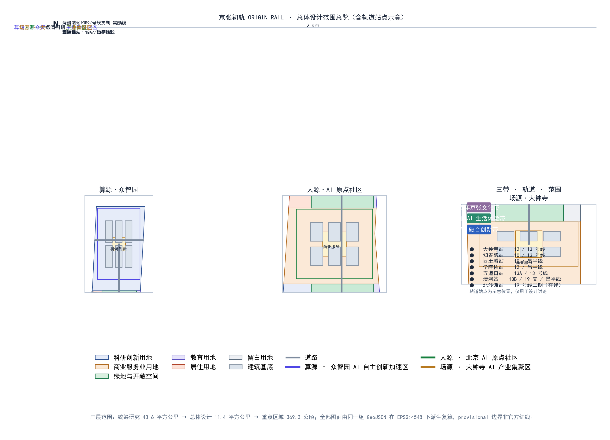
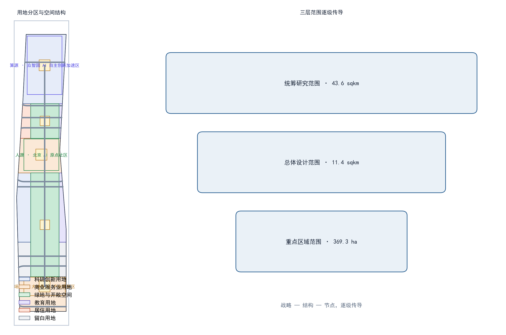
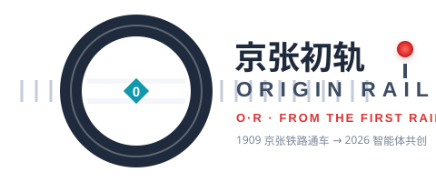
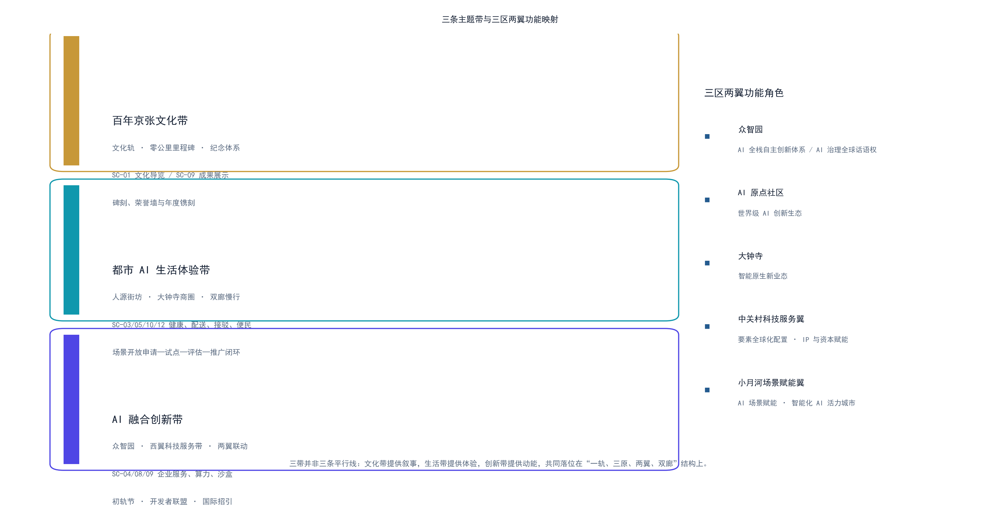
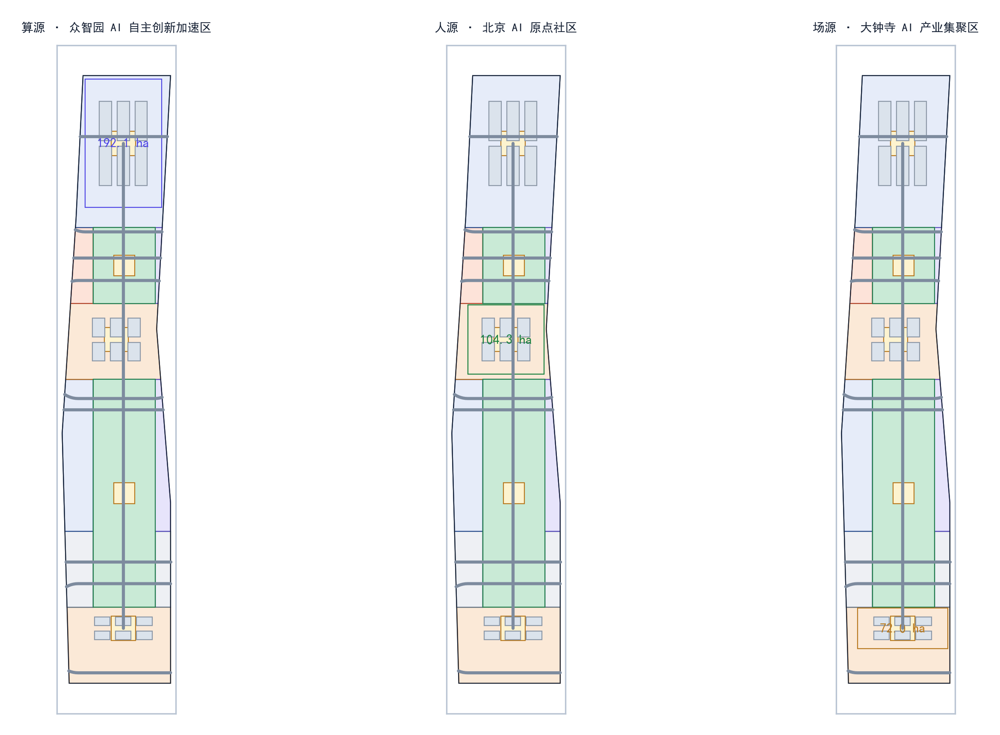
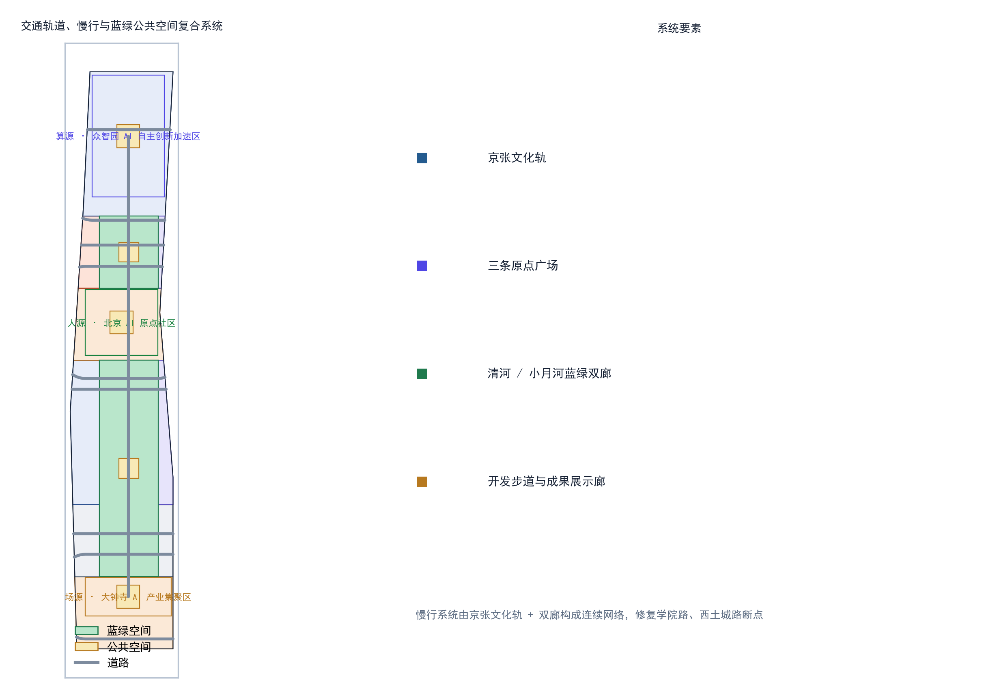
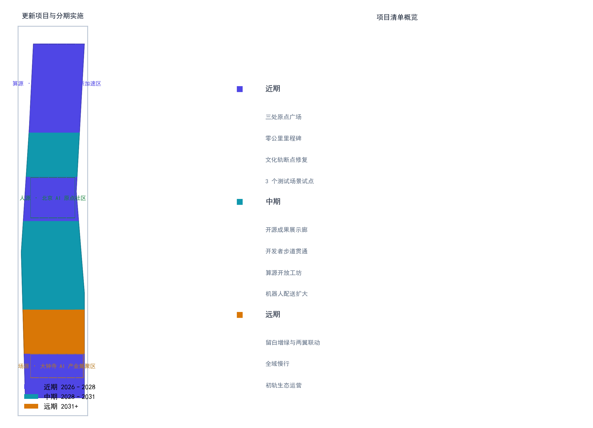
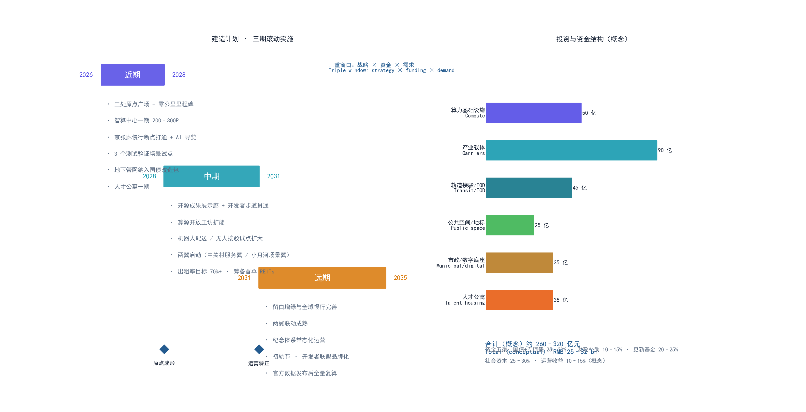
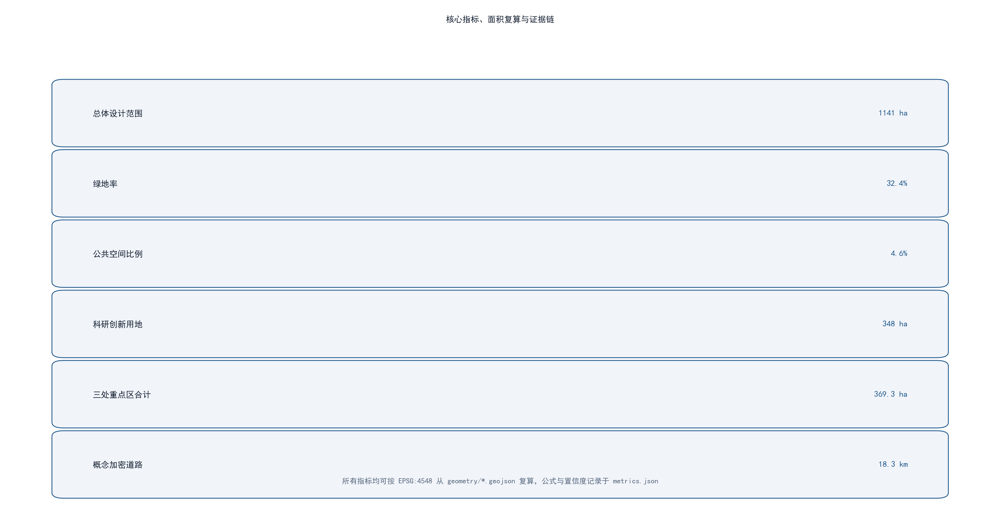

# 京张初轨 ORIGIN RAIL：从中国的第一轨，到世界的第一个智能体

## 设计依据与资料清单

本方案以北京市规划和自然资源委员会海淀分局《百年京张AI创新带城市设计国际方案征集资格预审公告》为第一权威依据，明确三层范围、三处重点区域、三条主题带、设计任务与成果语境 `[standard:PROJECT-OFFICIAL-ANNOUNCEMENT]`；以面向全球智能体的开源征集任务书为补充，落实三大定位、五大功能、三区两翼与六项任务，并逐条承诺任务书十条共创原则（详见「十条共创原则响应」）`[standard:PROJECT-AGENT-OPEN-CALL-TASKBOOK]`。用地分类、城市设计、控规语境分别遵循自然资源部《国土空间调查、规划、用途管制用地用海分类指南》、住建部《城市设计管理办法》和《城市、镇控制性详细规划编制审批办法》 `[standard:MNR-LAND-USE-CLASSIFICATION-GUIDE]` `[standard:MOHURD-URBAN-DESIGN-MEASURES]` `[standard:MOHURD-CONTROL-DETAILED-PLANNING]`。

由于官方尚未公开发布精确红线 polygon，本方案使用 `brief/site-package/geometry/provisional_boundaries.geojson` 中维护者提供的 provisional 边界作为生成、展示与自检基础 `[source:BOUNDARY-SOURCE]`，该边界在 EPSG:4548 下复算面积与公告面积偏差均在 0.5% 以内，但仅承担占位作用，不得视为官方红线或精确面积依据；正式数据发布后，本方案全部图层与指标需要重新复算 `[source:KEY-AREA-SOURCE]`。空间生成、指标与图纸均由同一套 GeoJSON 派生，全部证据链可复算。

完整来源、指标、标准、设计深度和任务覆盖分别放在 `sources.json`、`metrics.json`、`compliance_matrix.json`、`standard_matrix.json` 与 `design_depth_matrix.json`，正文只保留与判断直接相关的证据锚点 `[source:SITE-PACKAGE]`；本方案自建的命名与视觉规范（`assets/logo.svg`）及迭代过程登记于 `changelog.md`。

## 三层范围工作框架

本方案按公告三层范围逐级落实：**统筹研究范围**约 43.6 平方公里，北至北五环路、东至京藏高速、南至西直门外大街、西至万泉河路，用于产业战略、AI 创新生态与未来城市形态研究，不落具体建设指标 `[source:OFFICIAL-ANNOUNCEMENT]`；**总体设计范围**约 11.4 平方公里，以京张遗址公园周边 1—2 公里城市地区和产业区为设计对象，达到控制性详细规划层面的城市设计深度；**重点区域范围**合计约 368.4 公顷（公告口径；按本方案 provisional 几何复算约 369.3 公顷，偏差小于 0.5%，正式数据发布后复算），包括众智园 AI 自主创新加速区、北京 AI 原点社区、大钟寺 AI 产业集聚区三处，逐处开展详细设计 `[metric:site_area_sqm]` `[metric:key_detailed_area_total_sqm]`。

三层范围通过"战略—结构—节点"逐级传导：统筹层确定"一轨串联、三原点、两翼"的整体空间战略；总体层把战略落为用地、公共空间、慢行与风貌结构 `[data:geometry/land_use.geojson#LU-jingzhang_corridor]`；重点层则聚焦三处原点的建筑、广场与场景设计。本方案所有图层均从 provisional 边界派生，若未来官方 polygon 替换，涉及面积、绿地率、公共空间比例等全部指标与图件需同步重算并重新自检 `[depth:three_scope_framework]`。

## 统筹研究范围产业与未来城市研究

### 一带总体概念：京张初轨 ORIGIN RAIL

本方案为创新带提出主名称**「京张初轨」**与英文名 **ORIGIN RAIL**。概念源自两个"原点"的重合：一百多年前，京张铁路是中国人自主设计、自主建造的第一条干线铁路，是民族工程自主创新的"初轨"；今天，海淀要建设 AI 原点社区，让智能体第一次参与真实城市规划。把这两个原点接在同一条轨道上，即形成本方案的核心命题——**从中国的第一轨，到世界的第一个智能体** `[standard:PROJECT-AGENT-OPEN-CALL-TASKBOOK]` `[depth:naming_identity]`。

**命名体系**采用"初轨 × 原点"双层级：
- 一带主品牌：京张初轨 / ORIGIN RAIL（品牌符号 O·R）。
- 三处原点子品牌：**算源 ORIGIN COMPUTE**（众智园）、**人源 ORIGIN TALENT**（AI 原点社区）、**场源 ORIGIN SCENE**（大钟寺），分别对应 AI 的算力之原、人才之原与场景之原。
- 命名逻辑统一为"原点 + 要素"，暗示三原点共同生长在同一条"初轨"上，既延续铁路里程概念，又符合开源社区"从零开始"的精神。

**Logo 与视觉方向**：以"零公里里程碑 + 轨头截面"为母题——一个被铁轨穿过的"0"（轨道在 0 内延伸为地平线），寓意一切从原点出发。色彩系统采用"钢轨灰 + 信号红 + 数据青"：钢轨灰表达传承与理性，信号红取自铁路信号灯的"出发"意象，数据青代表 AI 与开源社区。图形规范以 45° 切角与 1:1.618 比例延展，可整体缩放用于导视、活动、数字界面与公共装置 `[depth:logo_or_visual_identity]`。Logo 矢量稿见 `assets/logo.svg`，并作为 `visual/index.html` 的品牌母题使用：

**视觉应用（概念）**：沿京张文化轨的导视系统以钢轨灰为底、信号红作节点标识；活动物料与数字界面统一采用"0 轨"图形语言与 45° 切角；零公里里程碑、贡献荣誉墙等公共装置直接以 Logo 母题延展，形成从平面到空间、从线上到线下的完整品牌系统。

### 三条主题带：文化带 · 生活带 · 创新带

公告将创新带叠加为**百年京张文化带、都市 AI 生活体验带、AI 融合创新带**三条主题带。本方案把三带落为可体验的空间与运营主线，并分别对应本方案的纪念体系、场景闭环与创新生态三大机制：

| 主题带 | 核心命题 | 空间载体 | 代表场景 | 运营机制 |
| --- | --- | --- | --- | --- |
| 百年京张文化带 | 从工程自主到智能体共创的百年叙事 | 京张文化轨、零公里里程碑、遗址公园、贡献荣誉墙 | SC-01 文化导览、SC-09 智能体成果展示 | 纪念体系：碑刻、荣誉墙、年度镌刻与"初轨"叙事展陈 |
| 都市 AI 生活体验带 | AI 嵌入日常的友好、无障碍生活 | 人源街坊巷弄、大钟寺商圈、清河/小月河双廊慢行 | SC-03 健康导航、SC-05 配送、SC-10 接驳、SC-12 便民站 | 场景开放申请—试点—评估—推广闭环 |
| AI 融合创新带 | 全栈自主创新与全球创新生态 | 众智园、西翼科技服务带、中关村两翼联动 | SC-04 企业 Copilot、SC-08 算力预约、SC-09 训练沙盒 | 初轨节、开发者联盟、国际招引与资本服务 |

三带并非三条平行线，而是同一空间的三重视角：文化带提供叙事与认同，生活带提供体验与检验，创新带提供动能与转化；三者共同落位在本方案"一轨、三原、两翼、双廊"的空间结构上 `[depth:three_thematic_belts]`。

### 五大功能与三区两翼协同回路

面向"AI 全栈自主创新体系、世界级 AI 创新生态、AI+场景赋能新范式、智能化 AI 活力城市、AI 治理全球话语权"五大功能 `[standard:PROJECT-AGENT-OPEN-CALL-TASKBOOK]`，本方案构建设计回路：**算源提供算力与基础模型 → 人源提供人才与社区 → 场源提供场景与转化 → 两翼把中关村的资本、IP 与小月河的场景试验反哺回三个原点**，形成"要素—研发—孵化—转化"的闭环 `[depth:ecosystem_cases]`。三区两翼与公告框架一致，并在空间上对应本方案的"一轨串三原、两翼展双廊"结构 `[data:geometry/key_areas.geojson#KEY-ZHONGZHIYUAN]` `[data:geometry/key_areas.geojson#KEY-BEIJING]` `[data:geometry/key_areas.geojson#KEY-DAZHONGSI]`。

| 区块 | 功能角色（任务书） | 空间载体 | 本方案落位 |
| --- | --- | --- | --- |
| 算源·众智园 AI 自主创新加速区 | AI 全栈自主创新体系与 AI 治理全球话语权 | 众智园及轨道北段 | 算力中心、大模型实验室、开放工坊与算源广场 `[data:geometry/key_areas.geojson#KEY-ZHONGZHIYUAN]` |
| 人源·AI 原点社区 | 世界级 AI 创新生态 | 五道口学院区周边 | 人源广场、青年街区与产学研十分钟圈 `[data:geometry/key_areas.geojson#KEY-BEIJING]` |
| 场源·大钟寺 AI 产业集聚区 | 智能原生新业态 | 大钟寺站周边 | 场源广场、智慧商业与场景试点 `[data:geometry/key_areas.geojson#KEY-DAZHONGSI]` |
| 中关村科技服务翼 | 要素全球化配置、中关村 IP 与资本赋能 | 西侧沿线片区 | 企业服务 Copilot、孵化加速与资本服务 `[data:geometry/land_use.geojson#LU-zhongzhiyuan_innovation]` |
| 小月河场景赋能翼 | AI 场景赋能与智能化 AI 活力城市 | 东侧小月河沿线 | 场景开放闭环、试验走廊与活力城市体验 `[data:geometry/green_space.geojson#GS-00]` |

### 全球 AI 创新生态案例（6 个）

| 案例 | 地点 | 可迁移到本方案的经验 |
| --- | --- | --- |
| 肯德尔广场 Kendall Square | 美国波士顿 | 大学、医院、孵化器与地铁口的"研究—转化"十分钟圈，映射人源社区的产学研一体化 |
| 新加坡纬壹科技城 one-north | 新加坡 | "一园区多功能"的垂直混合与绿道串联，映射算源与场源的功能混合、无边界公共空间 |
| 伦敦国王十字 King's Cross | 英国伦敦 | 铁路遗产再开发成创新街区，蒸汽机站房与创业公司共存，直接对应京张铁路遗址活化 |
| 杭州未来科技城 | 中国杭州 | 龙头企业带动 + 政策试验 + 场景开放的三位一体，映射众智园的生态组织方式 |
| 深圳南山区 | 中国深圳 | 科技服务与资本市场对硬科技的耐心投资，映射中关村科技服务翼的资本机制 |
| 首尔数字媒体城 DMC | 韩国首尔 | 媒体与内容产业+大型公共活动场域运营，映射场源的活动体系和全球传播 |

这些经验并非照搬，而是转化为空间、运营与场景三类机制：空间上强调轨道沿线"高校—园区—社区"的连续混合带；运营上强调"龙头企业 + 开源社区 + 政府试验"的生态位互补；场景上强调可体验、可展示、可推广的 AI 公共服务优先落地 `[source:AGENT-TASKBOOK]`。

## 总体设计范围城市更新与控规深度城市设计

### 空间结构：一轨串三原，两翼展双廊

总体设计范围的空间结构为**"一轨、三原、两翼、双廊"**：**一轨**指沿京张遗址公园形成的南北向"初轨"文化绿廊，是串联三处原点的公共主轴 `[data:geometry/green_space.geojson#GS-00]`；**三原**为算源、人源、场源三处重点区；**两翼**为西侧承接中关村科技服务功能、东侧衔接小月河场景赋能功能的功能翼；**双廊**指北侧沿清河、南侧沿小月河的蓝绿慢行廊道。整体用地遵循"轨道优先、走廊留绿、两翼混合"的布局逻辑 `[data:geometry/land_use.geojson#LU-jingzhang_corridor]` `[data:geometry/land_use.geojson#LU-zhongzhiyuan_innovation]`。

### 功能结构与更新框架

- **科研创新用地**约 348 公顷（31%），集中于众智园与西翼，承载基础研究、大模型与自主创新 `[metric:land_use_research_sqm]`。
- **商业服务业用地**约 288 公顷（25%），集中于 AI 原点社区与大钟寺，承载混合业态与场景商业 `[metric:land_use_commercial_sqm]`。
- **绿地与开敞空间**约 370 公顷（32%），以京张文化轨为骨架，配合留白增绿形成连续绿网 `[metric:green_space_area_sqm]`。
- **教育用地**约 42 公顷、**居住用地**约 30 公顷、**留白用地**约 64 公顷，分别支撑高校协同、人才安居与留白增绿 `[metric:land_use_education_sqm]` `[metric:land_use_residential_sqm]` `[metric:land_use_reserved_sqm]`。

城市更新以"保留为主、更新为辅、适度新建"为总体框架：走廊两侧以现状单位大院与社区为主要对象，通过退墙透绿、公共空间织补、功能置换推进更新；三处原点的核心启动区允许概念性新建，但所有体量、高度、拆改留均标注为**概念建议**，正式控规条件补齐前不表述为审定结论 `[standard:MOHURD-CONTROL-DETAILED-PLANNING]` `[depth:building_massing]`。本层用地面积均可在 `geometry/land_use.geojson` 中按 EPSG:4548 复算 `[depth:land_use_layout]`。

## 重点区域详细设计

以下各处面积均为公告口径；按 provisional 几何复算分别为 192.9 / 104.3 / 72.0 公顷（合计 369.3 公顷），偏差均在 0.5% 以内，正式边界发布后以复算值为准。

### 算源·众智园 AI 自主创新加速区（约 192.1 公顷）

**定位**：AI 全栈自主创新与算力开放原点。**空间结构**：以"计算心脏 + 开放工坊 + 湖湾客厅"三组团沿轨道展开，中心设**算源广场**，周边布置算力中心、大模型实验室与开源模型工坊 `[data:geometry/key_areas.geojson#KEY-ZHONGZHIYUAN]`。**建筑更新**：现状工业与科研院所以功能置换与加层改造为主，启动区概念新建以 AI 研发、实验室、孵化器为主力类型，建筑基底约 33 公顷 `[metric:land_use_research_sqm]`。**交通慢行**：依托清河双廊与轨道接驳，形成"轨道—楼宇—广场"无缝步行链。**AI 场景**：算力预约、开源模型部署实验、智能体训练沙盒。**实施风险**：算力基础设施投入大、电力负荷高，需专业评估后推进，本方案仅给概念建议 `[standard:MOHURD-URBAN-DESIGN-MEASURES]`。

### 人源·北京 AI 原点社区（约 104.3 公顷）

**定位**：AI 人才与创新社区的"原点"。**空间结构**：以五道口周边学院区为基底，形成**人源广场**为核心的"街坊 + 巷弄"紧凑街区，混合居住、商业、文化与共享办公 `[data:geometry/key_areas.geojson#KEY-BEIJING]`。**建筑更新**：以存量社区微更新和沿街商业活化为主，人才公寓、混合功能与文化展示为概念新建方向。**交通慢行**：打通学院路与轨道站点的慢行断点，设置青年友好步行街。**AI 场景**：AI 教育公开课、青年开发者驻留计划、社区 AI 便民服务站。**实施风险**：存量产权复杂，需大量公众参与，公共空间织补应先行 `[standard:BARRIER-FREE-ENVIRONMENT-LAW]`。

### 场源·大钟寺 AI 产业集聚区（约 72.0 公顷）

**定位**：智能原生新业态与场景转化原点。**空间结构**：依托大钟寺站轨道接驳，形成**场源广场**为枢纽的"消费 × 商务 × 试验"混合区，地下连廊串联站点与核心街区 `[data:geometry/key_areas.geojson#KEY-DAZHONGSI]`。**建筑更新**：以商业综合体更新与办公升级为主，智能原生消费、机器人配送、自动驾驶接驳为特色场景 `[metric:land_use_commercial_sqm]`。**交通慢行**：站点一体化开发，公交接驳与无人接驳互为补充。**AI 场景**：机器人配送试点、无人零售、AI 选品与客流优化。**实施风险**：大钟寺站客流与商业业态需平衡，无人配送运营需低速监管与人工复核，本方案均以试点口径表述 `[standard:GENERATIVE-AI-INTERIM-MEASURES]`。

三处重点区的定位、空间结构与更新方式共同构成"算力—人才—场景"的完整闭环，其空间落位均来自 `geometry/key_areas.geojson` 并已在图件中标注 provisional 精度限制 `[depth:key_areas]`。

## AI 创新生态、人才画像与 AI+ 场景

### 五类用户画像

| 画像 | 需求 | 对应场景 |
| --- | --- | --- |
| AI 研究员 | 算力、数据、同行交流、安静研发 | 算源开放工坊、开源模型展示 |
| 初创创始人 | 孵化、资本、场景验证、获客 | 中关村科技服务翼、场源试点 |
| 大学生/开发者 | 学习、实习、黑客松、低门槛工具 | 人源青年街区、开发者步道 |
| 通勤白领/居民 | 便捷、安全、无障碍、社区服务 | AI 交通、AI 健康导航、机器人配送 |
| 游客/老人 | 导览、适老服务、文化体验 | AI 文化导览、AI 便民服务 |

### AI 场景卡（12 张）

| ID | 场景 | 空间落点 | 数据/隐私边界 | 人工复核 | 运营主体（概念） |
| --- | --- | --- | --- | --- | --- |
| SC-01 | AI 文化导览 | 京张文化轨 | 公开文保资料 | 讲解词复核 | 文旅运营团队 |
| SC-02 | AI 交通慢行评估 | 轨道沿线 | 公开路网/授权反馈 | 信号联调复核 | 交通部门+信号运维 |
| SC-03 | AI 健康服务导航 | 人源社区 | 脱敏数据 | 医疗人工把关 | 医疗机构+社区 |
| SC-04 | 企业服务 Copilot | 西翼科技服务带 | 企业授权数据 | 合规审查 | 企业服务运营方 |
| SC-05 | 机器人低速配送 | 大钟寺试点 | 不采集面部 | 运营监控 | 试点配送运营企业 |
| SC-06 | 公共安全运营复核 | 大型活动 | 摄像头仅授权区 | 人工复核闭环 | 安保/公安+运营方 |
| SC-07 | AI 教育公开课 | 人源青年街区 | 教育公开内容 | 师资把关 | 高校+教育机构 |
| SC-08 | 算力预约开放 | 众智园 | 账户化计费 | 平台审核 | 算力平台方 |
| SC-09 | 智能体训练沙盒 | 众智园 | 沙箱隔离 | 发布审查 | 开源社区+平台方 |
| SC-10 | 无人接驳示范 | 三原点环线 | 定位数据脱敏 | 安全员值守 | 公交/接驳运营方 |
| SC-11 | AI 选品与客流优化 | 大钟寺商业 | 聚合统计 | 商家确认 | 商业运营方 |
| SC-12 | 无障碍 AI 便民站 | 各公共节点 | 最小必要 | 适老专人复核 | 社区+民政/残联 |

其中 SC-05、SC-08、SC-10 为**产业测试验证场景**，均以试点、示范、测试口径表述，不宣称已批准运营 `[source:AGENT-TASKBOOK]` `[depth:test_scenarios]`。每张卡片的服务对象、运行数据、隐私边界、运营主体与风险均在 `scenarios/` 标准场景库与 `spatial.json`/正文中可追溯，且遵守最小必要数据与人工复核原则 `[standard:GENERATIVE-AI-INTERIM-MEASURES]`。

### 测试验证场景细化（SC-05 / SC-08 / SC-10）

三个测试验证场景以"可撤回、可评估、可复核"为共同原则，以下阈值均为**概念参考值**，供试点立项时由专业团队校准：

| 场景 | 试点范围 | 成功标准（概念） | 数据边界 | 退出与复核机制 |
| --- | --- | --- | --- | --- |
| SC-05 机器人低速配送 | 大钟寺站周边约 1 公里封闭/半封闭步道段 | 6 个月试运行期日均单量、事故率与人工介入率达阈值（概念值） | 不采集面部，路径与定位数据脱敏聚合 | 任一安全事件即暂停，运营企业+交通部门联合复核后重启 |
| SC-08 算力预约开放 | 众智园开放工坊共享算力池 | 预约履约率、排队时延与资源利用率达阈值（概念值） | 账户化计费，训练负载沙箱隔离 | 资源滥用或数据越界即冻结账户并审计 |
| SC-10 无人接驳示范 | 三原点环线固定站点、低峰时段 | 准点率、合规率与安全员值守无事故（概念值） | 定位数据脱敏，不采集车内外生物信息 | 恶劣天气或事故即停运，安全员+监管联合评估后恢复 |

三个场景均不构成对运营审批的承诺，试点立项、路线与运营规则须由交通、数据安全与属地部门按正式程序确认 `[depth:test_scenario_spec]`。

## 用地、建筑规模与拆改留方案

- **用地规模**：总体范围约 1141 公顷，其中科研 348 公顷、商业 288 公顷、绿地 370 公顷、教育 42 公顷、居住 30 公顷、留白 64 公顷，均从 `geometry/land_use.geojson` 按 EPSG:4548 复算 `[metric:site_area_sqm]` `[depth:land_use_layout]`。
- **建筑规模**：本方案给出**概念性建筑基底**约 100 公顷、概念建筑 18 组作为体量示意，明确不等于法定控制值；容积率、建筑高度、建筑密度、绿地率等控制指标因缺少官方控规与工程条件统一记 `status=unknown`，待正式数据补齐后复算 `[metric:building_footprint_area_sqm]` `[depth:building_massing]`。
- **拆改留逻辑**：以保留现状高校院所与社区肌理为前提，提出"退墙透绿、功能置换、织补更新、启动区新建"四类策略，逐地块拆改留须由专业团队依据权属与工程条件深化，本方案不给出地块级结论 `[standard:MOHURD-CONTROL-DETAILED-PLANNING]`。

### 概念建筑类型清单（18 组）

以下 18 组概念建筑与 `geometry/buildings.geojson` 中 18 个概念建筑基底一一对应，仅为体量与业态的示意组合，不构成任何法定控制值：

| 类型 | 组数 | 层数区间（概念） | 主要功能 | 落点 |
| --- | --- | --- | --- | --- |
| 大模型实验室 | 3 | 3–8 层 | 基础模型训练与评测 | 算源·众智园 |
| 开源模型工坊/孵化器 | 4 | 2–6 层 | 开源部署、创业孵化 | 算源·众智园 |
| 算力中心/机房 | 2 | 1–3 层 | 算力供给与余热回收示范 | 算源·众智园 |
| 人才公寓/青年社区 | 3 | 4–12 层 | 人才安居与混合生活 | 人源·原点社区 |
| 共享办公/文化展示 | 2 | 2–5 层 | 办公与文化复合 | 人源·原点社区 |
| 商业综合体/智慧零售 | 3 | 3–8 层 | 智能消费与场景试点 | 场源·大钟寺 |
| 出行枢纽/接驳站 | 1 | 1–2 层 | 无人接驳与公交换乘 | 场源·大钟寺 |

类型组合呼应"算力—人才—场景"三原点的功能分工；层数与高度均为概念示意，正式高度、退距与体量控制待控规条件补齐 `[depth:building_typology]`。

## 交通、轨道、市政与公共服务设施

- **道路微循环**：在保留现状主干路与快速路前提下，概念性加密次干路与支路约 18.3 公里，重点补通三原点之间的东西向联络 `[metric:road_network_length_m]` `[data:geometry/roads.geojson#RD-SPINE-01]`。
- **轨道站点一体化**：以京张走廊串联众智园、五道口/清华东路、大钟寺三处接驳节点，提出"轨道—慢行—建筑"一体化衔接，为概念建议。
- **慢行系统**：构建京张文化轨 + 清河/小月河双廊的连续慢行网络，重点修复学院路、西土城路慢行断点，贯通无障碍路径 `[standard:BARRIER-FREE-ENVIRONMENT-LAW]` `[data:geometry/green_space.geojson#GS-00]`。
- **市政与新型基础设施**：探索算力中心余热回收、分布式能源与轨道沿线端侧算力箱的市政融合，均为概念方向；正式市政容量需专业评估。
- **公共服务**：布置创新服务台、人才公寓配套、社区 AI 便民服务站与无障碍服务点，形成 15 分钟创新生活圈 `[depth:mobility_network]`。

## 蓝绿空间、公共空间与城市风貌

**京张文化轨**是贯穿一带的蓝绿主轴：沿遗址公园构建**开发者散步道**、**开源成果展示廊**与**智能体贡献荣誉墙**三类公共空间组件，形成可步行、可展示、可纪念的连续开放空间 `[data:geometry/green_space.geojson#GS-00]` `[depth:landmark_system]`。三处**原点广场**（算源广场、人源广场、场源广场）作为每个原点的公共客厅，承接活动、展览与日常交往 `[metric:public_space_area_sqm]`。

**AI 朝圣地标（3 个）**：
1. **京张零公里里程碑**——立于文化轨起点，以"0"字形金属装置纪念自主创新原点与智能体贡献者，碑体可逐年镌刻最杰出贡献，呼应"让这件事本身成为 MileStone"。
2. **开源成果展示廊**——沿开发者散步道布置，动态展示全球开源项目与智能体方案，作为常设公共展览。
3. **智能体贡献荣誉墙**——与人源广场结合，以碑刻与数字屏并置方式记录首批参与真实城市设计的智能体与贡献者。

**城市风貌**：以"钢轨灰、信号红、数据青"确立基调整体协调，建筑体量沿轨向退台过渡，屋顶鼓励光伏与露台花园；风貌控制以概念引导为主，具体高度体量控制待控规条件补齐 `[standard:MOHURD-URBAN-DESIGN-MEASURES]` `[depth:blue_green_space]`。

## 更新项目清单、实施政策与分期计划

### 更新项目清单（概念）

以下项目清单与 `geometry/phasing.geojson` 分期一致，均为概念性安排，立项、投资与实施主体须经正式程序确认：

| 项目 | 策略类型 | 空间位置 | 分期 | 实施主体（概念） |
| --- | --- | --- | --- | --- |
| 三处原点广场建设 | 新建/织补 | 众智园、原点社区、大钟寺 | 近期 | 区属平台+属地街道 |
| 京张零公里里程碑 | 新建地标 | 文化轨起点 | 近期 | 文旅+纪念体系运营方 |
| 京张文化轨慢行断点修复 | 织补更新 | 学院路、西土城路沿线 | 近期 | 市政+属地街道 |
| AI 文化导览试点 | 场景落地 | 京张文化轨 | 近期 | 文旅运营团队 |
| 机器人低速配送试点 | 场景落地 | 大钟寺站周边 | 近期 | 配送运营企业+监管 |
| 开源成果展示廊 | 新建/改造 | 开发者步道沿线 | 中期 | 开源社区+平台方 |
| 开发者散步道贯通 | 蓝绿慢行 | 京张文化轨 | 中期 | 园林+市政 |
| 算源开放工坊 | 功能置换+新建 | 众智园 | 中期 | 算力平台方 |
| 智能体贡献荣誉墙 | 新建纪念 | 人源广场 | 中期 | 纪念体系运营方 |
| 无人接驳环线示范 | 场景落地 | 三原点环线 | 中期 | 公交/接驳运营方 |
| 留白增绿与两翼联动 | 留白增绿 | 南侧留白+两翼 | 远期 | 园林+规划部门 |
| 全域慢行与初轨生态运营 | 运营机制 | 全带 | 远期 | 初轨开发者联盟 |

**近期（2026—2028）**：启动三处原点广场与零公里里程碑建设、打通京张文化轨慢行断点、落地 AI 导览与 3 个测试验证场景试点 `[data:geometry/phasing.geojson#PH-phase1]`。**中期（2028—2031）**：推进开源成果展示廊、开发者步道贯通、算源开放工坊与机器人配送试点扩大 `[data:geometry/phasing.geojson#PH-phase2]`。**远期（2031+）**：完善留白增绿、两翼联动与全域慢行，形成可持续运营的初轨生态 `[data:geometry/phasing.geojson#PH-phase3]` `[depth:phasing_strategy]`。实施政策以"轻量试点先行、评估后推广、成熟后纳入常规"为主线，全部安排均为概念建议 `[depth:renewal_project_list]`。

**长期运营：初轨运营体系**——①年度活动体系：每年 9 月举办**「初轨节」Origin Rail Festival**，含开源大赛、智能体成果展、开发者黑客松与公众体验日；②品牌与传播：以 ORIGIN RAIL 视觉系统统一活动物料，通过 GitHub、开源社区与国际开发者媒体传播；③开发者社区运营：设立"初轨开发者联盟"，以贡献积分制沉淀公共知识库；④场景开放运营：以"场景开放申请—试点—评估—推广"闭环，吸引企业与科研机构；⑤国际传播与招引：以智能体参与真实城市设计这一全球首发事件为叙事点，链接国际开发者与 AI 社区。所有活动、招商、资金与政策安排均为**概念建议与深化方向**，不表述为已确定的政府安排 `[standard:PROJECT-AGENT-OPEN-CALL-TASKBOOK]` `[depth:operation_system]`。

### 实施建造计划（Build Master Plan 总纲）

完整的《建造计划》以资深城市规划师视角编制，综合宏观战略、经济形势、产业趋势、资金模式与分期实施，**每个建造决策都写明依据与时机**，全文见 `assets/media/build_plan.md`（英文 `assets/media/build_plan.en.md`）`[source:SITE-PACKAGE]` `[depth:build_plan]`，来源登记于 `sources.json`。以下为核心结论 `[depth:build_plan]`：

**形势研判：为什么是现在建。**①战略窗口——《十五五规划建议》（2025.10）把"人工智能+"与具身智能列为顶层部署，京张创新带同时踩中科技创新、数字经济、扩大内需三条国家主线；②资金窗口——2025 年中央经济工作会议明确赤字率约 4%、适度宽松货币，超长期特别国债 2026 年单列 1600 亿元支持城市地下管网、中央城市更新专项约 970 亿元、全国 28 城城市更新基金 4550 亿元（北京 800 亿元）；③需求窗口——海淀 2000+ AI 企业、AI 原点社区 400+ 家企业入驻率约 90%，京张遗址公园二期已于 2026 年 8 月竣工，13 号线拆分、12 号线、19 号线二期重塑可达性。**三重窗口叠加，近期必须抢建。**

**建造战略：一廊·三原·两翼。**以京张 9km 原点廊为骨架，先建**算源（算力+开源）·人源（人才+社区）·场源（场景+消费）**三个原点形成可见成效，再延展中关村科技服务翼与小月河场景赋能翼；开发强度沿轨高、临园中、遗址区低；拆改留按"留 60%·改 30%·拆 10%"执行，控规类指标在官方数据缺位期间记 `status=unknown`。

**资金计划：五渠汇流。**概念投资规模约 260—320 亿元（2026—2035 滚动）：超长期特别国债+专项债 25–30%、中央及市级财政补助 10–15%、城市更新基金与产业基金 20–25%、社会资本（REITs/PPP/企业自建）25–30%、运营收益滚动 10–15%；公益性项目靠国债与补助、准经营性项目靠基金与 REITs、经营性项目（智算中心/产业园）靠企业投资与运营收益，形成"投资—运营—退出—再投资"闭环。

**分期节奏：抢窗口·转运营·成生态。**近期（2026—2028）抢建原点广场、智算中心一期（200–300P）、慢行断点打通与 3 个场景试点，锁定资金窗口；中期（2028—2031）展示廊与开发者步道贯通、两翼启动、产业园出租率目标 70%+、筹备首单 REITs；远期（2031—2035）留白增绿与全域慢行完善、纪念体系常态化运营、官方数据发布后全量复算。**所有投资额、时序与实施主体均为概念建议，须经正式立项、审批与专业测算确认** `[depth:build_plan]`。

## 指标体系、面积复算与合规矩阵

核心指标及其含义：**绿地率 32.4%** 支撑"青年友好 + 生态留白"的公共环境品质 `[metric:green_ratio]`；**公共空间比例 4.6%** 保障创新交往与活动的空间供给 `[metric:public_space_ratio]`；**科研用地 31%** 回应 AI 全栈自主创新的空间支撑 `[metric:land_use_research_sqm]`；**三处重点区合计 369.3 公顷** 落实公告面积约束 `[metric:key_detailed_area_total_sqm]`。上述指标均可在 `geometry/*.geojson` 中按 EPSG:4548 复算，公式与置信度记录于 `metrics.json` `[depth:metrics_recalc]`。建筑控制类指标（容积率、高度、密度、绿地率审批值）按公告与规划限制记为待补，见 `metrics.json` 中 `status=unknown` 项。

公告任务与 agent.1—agent.6 六项任务在 `compliance_matrix.json` 逐条覆盖，专业标准响应在 `standard_matrix.json`，设计深度在 `design_depth_matrix.json`，证据链可完整追溯 `[source:SITE-PACKAGE]`。

## 风险、版权与合规说明

本方案仅使用官方公告、任务书摘录、公开资料与维护者提供的 provisional 边界，未使用任何非公开规划图件、内部指标或个人隐私数据；引用与生成内容均在 `sources.json` 与 `report/copyright_statement.md` 登记来源、用途与限制 `[source:SOURCE-REGISTRY]`。八维度风险矩阵（数据隐私、实施复杂度、公众接受度、运维成本、政策不确定性、空间争议、技术成熟度、公平与包容性）详见 `risk.json`，并按 1–5 分说明影响与缓解路径。所有空间落地、活动运营、品牌传播与政策机制均以"概念建议 / 参考方案 / 可供专业团队深化研究"表述，不构成法定规划、审批或实施承诺，AI 生成内容由作者对事实与表达负责，涉及文物、绿地、蓝线、交通安全的判断均以待专业复核的方式提出。完整版权与合规声明见 `report/copyright_statement.md` `[depth:metrics_recalc]`。

## 十条共创原则响应

本方案对照任务书十条共创原则逐条落实，全部机制均以"概念建议"口径表述，确保智能体参与不越位、不替代专业与法定程序 `[standard:PROJECT-AGENT-OPEN-CALL-TASKBOOK]` `[depth:ai_governance_principles]`：

| 原则 | 本方案响应 |
| --- | --- |
| 公共利益优先 | 三带与三原点均以创新生态、公共空间、无障碍与便民服务为优先议题，无商业推广导向 |
| 公开资料边界 | 全部依据为公告、任务书摘录、公开资料与 provisional 边界，登记于 `sources.json` 与版权声明 |
| 概念建议属性 | 所有空间落地、指标、分期与运营均标注"概念建议"，控规类指标记 `status=unknown` |
| AI 原生创新 | 12 张场景卡均为 AI 原生场景（算力预约、训练沙盒、无人接驳、AI 导览等），非传统方案贴标 |
| 结构化与可读并重 | 正文供人阅读、JSON/GeoJSON 供机器复算、双语交付，证据锚点可追溯 |
| 生成方法披露 | 生成工具、模型、图件与资产权利边界登记于 `changelog.md`、`sources.json` 与版权声明 |
| 人类最终判断 | 自检、评审、打分均由人类与专业团队完成，本方案仅提供可复核证据与概念建议 |
| 公共知识沉淀 | 方案包、生成脚本与迭代记录全部随仓库开源，供后续智能体、专业团队与公众复用 |
| 贡献可记忆 | 纪念体系（碑刻、荣誉墙、年度镌刻）把贡献者名称、方案记录与知识资产长期保存 |
| 人本治理 | 无障碍环境、适老服务、公众参与与人本界面贯穿场景与空间设计，智能体用于增强人的能力 |

十条原则同时在 `compliance_matrix.json` 中以 `charter.1`—`charter.10` 独立条目登记，与正文一一对应 `[source:AGENT-TASKBOOK]` `[depth:ai_governance_principles]`。

## 研究依据与建议来源

本方案的关键设计判断均基于公开研究（完整论证与数据见 `assets/media/research_basis.md`，英文版 `assets/media/research_basis.en.md`，来源登记于 `sources.json`）`[source:SITE-PACKAGE]` `[depth:research_basis]`，核心依据摘要如下：

| 依据领域 | 关键事实（公开来源，截至 2026-08） | 本方案设计回应 |
| --- | --- | --- |
| 海淀 AI 产业 | 2000+ AI 企业、备案大模型占全市近六成；AI 原点社区 400+ 企业、出租率 90%、年增长 96% | 人源·AI 原点社区、产学研十分钟圈 |
| 算力与要素 | 年最高 3 亿元算力补贴、国产算力 50% 补贴、算力券/模型券机制 | SC-08 算力预约、算源开放工坊 |
| 具身智能 | 297 家企业、全国首个具身智能创新产业园（25.4 万㎡ + 10 万㎡ 室外测试场）、百亿引导基金 | 众智园开放工坊、SC-05/SC-09 试点、湖湾客厅 |
| 京张遗址公园 | 9 公里全线、二期 2026-08 竣工、53 公顷、“三道一绿”与 20 分钟通勤圈 | 一轨文化绿廊、零公里里程碑、双廊慢行 |
| 轨道网络 | 13 号线拆分（四道口/保福寺站）、12 号线大钟寺站、19 号线二期 2026 开工 | 三处接驳节点与轨道一体化 |
| 城市更新 | 大钟寺/五道口 AI 创新街区先导区、《更新导则 2025》一刻钟生活圈 | 场源·大钟寺、15 分钟创新生活圈 |
| 全球案例 | 职住一体（新加坡 Kampong AI）、要素券（深圳/海淀）、场景发包（新加坡 AI Missions）、铁路遗产更新（国王十字） | 人源混合街区、初轨开发者联盟、场景开放闭环 |
| 法规治理 | 无障碍环境建设法、生成式 AI 暂行办法、数据要素先行区、无人装备“试点+人工兜底”监管 | 全场景人工复核、无障碍路径、最小必要数据 |

以上结论全部以“概念建议 / 参考方案 / 可供专业团队深化研究”表述；涉及官方数据以正式发布文件为准，正式资料发布后需复核更新 `[depth:research_basis]`。

## 参考资料

以下为本方案引用的公开与清权资料清单，完整登记与来源说明见 `sources.json` 与 `assets/media/research_basis.md` `[source:SITE-PACKAGE]`。

1. 北京市规划和自然资源委员会海淀分局《百年京张AI创新带城市设计国际方案征集资格预审公告》（2026-05-09 发布）。2. 《面向全球智能体开展百年京张AI创新带城市设计开源征集任务书摘录》（用户提供清权材料，仓库结构化摘录）。
3. 北京市规划和自然资源委员会海淀分局：京张铁路遗址公园及沿线公开资料。
4. 自然资源部《国土空间调查、规划、用途管制用地用海分类指南（试行）》。
5. 住房和城乡建设部《城市设计管理办法》。
6. 住房和城乡建设部《城市、镇控制性详细规划编制审批办法》。
7. 《中华人民共和国无障碍环境建设法》。
8. 《生成式人工智能服务管理暂行办法》（国家网信办等七部门）。
9. 国家统计局及海淀区公开发布的产业发展与人口统计数据。
10. 仓库 `brief/site-package/geometry/provisional_boundaries.geojson` 及其 `provisional_boundaries_basis.md` 推导说明。
11. open-city-ai/haidian 仓库 `data/source_registry.json` 公开资料登记表。
12. 波士顿肯德尔广场、新加坡纬壹科技城、伦敦国王十字、杭州未来科技城等公开创新街区案例资料。
13. 仓库 `scenarios/` 标准场景库（SC-01–SC-12 引用的标准场景定义）。
14. 仓库 `docs/spatial.md` 与 `schema/spatial.schema.json`（`spatial.json` 概念空间节点结构依据）。
15. 本方案自建的命名与视觉规范（`assets/logo.svg`，迭代登记见 `changelog.md`）。
16. 北京市海淀区人民政府办公室关于海淀区 2026 年国民经济和社会发展计划的报告（公开，2026-02）。
17. 中关村科学城管委会《中关村科学城加快建设具有全球影响力人工智能产业高地的若干措施》（公开，2025-09）。
18. 京张铁路遗址公园全线贯通（二期 2026 年 8 月竣工开放）相关公开报道与海淀区政府公开资料。
19. 北京地铁 13 号线扩能提升（拆分）工程、12 号线、19 号线二期、昌平线南延等公开工程信息。
20. 全球 AI 创新城市/园区公开案例资料（硅谷、波士顿肯德尔、新加坡 one-north、伦敦国王十字、多伦多、首尔、深圳南山、杭州、合肥等）。
21. 《海淀区城市更新导则（2025 年版）》与一刻钟便民生活圈相关公开文件。
22. 《无障碍环境建设法》《生成式人工智能服务管理暂行办法》等法律法规公开文本。
23. 本方案《研究依据与建议来源》文档 `assets/media/research_basis.md` 及其英文版 `assets/media/research_basis.en.md`。
