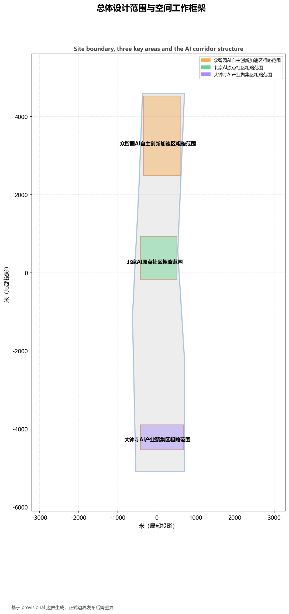
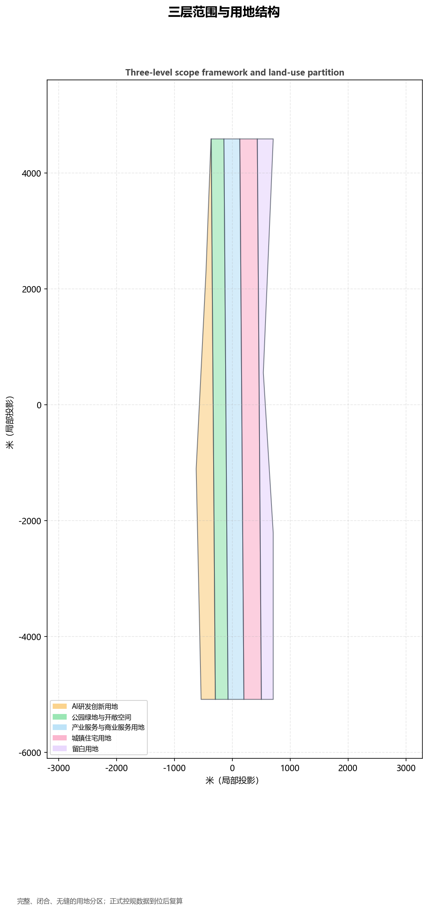
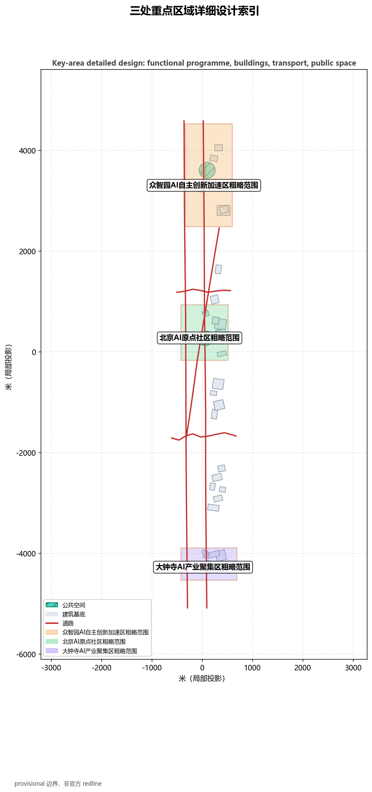
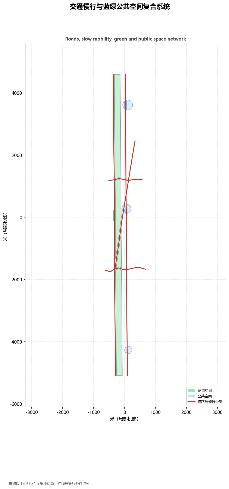
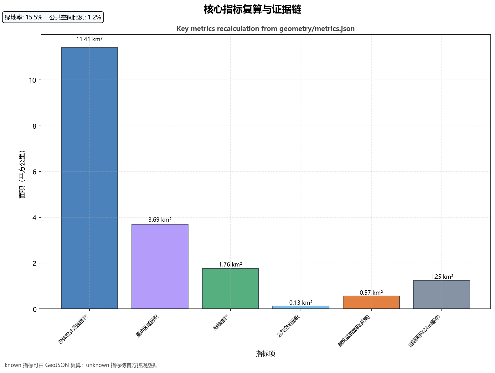

# Jingzhang AI Innovation Belt: A City-Agent Belt of Memory and Evolution

## Design Basis and Materials Inventory

This formal proposal takes the *Pre-qualification Announcement for the International Call for Urban Design of the Centennial Jingzhang AI Innovation Belt* issued by the Haidian Branch of the Beijing Municipal Commission of Planning and Natural Resources as its primary basis, and uses the maintainer-registered provisional boundary, key areas, enums, metrics, and source inventory under `brief/site-package/` as its machine-readable basis. Before generating a proposal, the AI agent must read `design_brief.json`, `allowed_design_space.json`, `sources.json`, `enums/`, `ranges/`, `schemas/`, `data/source_registry.json`, and `data/processed/agent_fact_pack.md`, and use `project_scope_summary.csv`, `agent_task_requirements.csv`, `source_use_matrix.csv`, and `missing_data_checklist.csv` to build task, scope, material-use, and gap checklists. Every design judgment is decomposed into traceable sources, reproducible metrics, verifiable layers, and human-reviewable assumptions. The announcement requires the proposal to reach the urban-design depth of regulatory detailed planning and the urban-design depth of a comprehensive implementation plan, so narrative text cannot replace GeoJSON, metric tables, A3 booklets, A0 boards, and HTML electronic presentation deliverables.

The proposal is not an isolated vision document but an output organized from the announcement, the agent open-call taskbook, and site materials; this section only places the most critical bases next to the judgments [source:OFFICIAL-ANNOUNCEMENT] [source:AGENT-TASKBOOK] [depth:existing_conditions_diagnosis]. Complete source and standard coverage is kept in `sources.json`, `standard_matrix.json`, and `design_depth_matrix.json`, not repeated as a machine index in the narrative.

The usage boundaries of the materials registry are as follows [source:SOURCE-REGISTRY]:

- `data/source_registry.json` records the permitted uses of public, cleared, and provisional materials.
- Current registry summary: 7 formal-usable sources, 1 background source, 1 provisional-only source.
- The agent must not upgrade background-only or provisional-only materials into official boundaries, statutory regulatory controls, formal scoring evidence, or government implementation commitments.

`data/processed/agent_fact_pack.md` is the navigation layer of this proposal, not a new authoritative source [source:PROCESSED-FACT-PACK]. It helps the agent organize the three-level scope, three key areas, announcement tasks, agent.1–agent.6, material availability, and data gaps into a readable proposal; factual judgments still return to the registered primary materials [source:OFFICIAL-ANNOUNCEMENT] [source:AGENT-TASKBOOK], with the complete source relationships stored in `sources.json`.

When the official `SITE_BOUNDARY` or the three `KEY_AREA` polygons are not yet available, this scaffold generates a temporary formal package from `brief/site-package/geometry/provisional_boundaries.geojson`. The `geometry/site_boundary.geojson` and `geometry/key_areas.geojson` in the submission must both be marked `provisional_constraint` and `official_boundary=false`; they may only be used for generation, self-checks, visualization, and design discussion, and may not serve as official redlines, approval bases, precise-area bases, or statutory control conclusions. This organizer data gap does not itself block content scoring; after official polygons replace the provisional ones, the site boundary, key areas, land use, roads, green space, public space, buildings, phasing, and metrics must all be recalculated.

The scoring-eligible state generated by this scaffold is: **provisional boundary with precision warning retained and recalculation required after official data release; content scoring is not blocked**. Therefore, the spatial structure, scenarios, projects, and metrics in the narrative are written under the principle of "discussable, reviewable, and recalculable after official boundaries replace them"; when the official boundary and key-area polygons update, the agent must rerun the scaffold, self-checks, and drawing/HTML generation, not merely replace a single file.

Boundary interpretation can return to the overall-scope layer and area recalculation [data:geometry/site_boundary.geojson#SITE-001] [metric:site_area_sqm]. The three key areas are verified by a dedicated layer and count metric [data:geometry/key_areas.geojson#PROV-KEY-001] [metric:key_area_count]. This lets readers enter the evidence from the narrative without first reading a series of machine IDs.

## Three-Level Scope Working Framework

The proposal organizes work according to the three levels defined in the announcement: the coordinated research area concerns the 43.6 km² AI industry ecology, strategic positioning, innovation chain, and future urban form; the overall design area concerns the 11.4 km² urban and industrial areas within 1–2 km of the Jingzhang Heritage Park, requiring an overall urban-renewal framework, industrial spatial layout, transport and municipal support, and urban-character control; the key detailed-design area concerns 369.3 hectares of three detailed-design districts, requiring clear functional programs, building scale, demolition/renovation/retention classification, public-space connectivity, and transport organization. The three levels are mapped item by item in `compliance_matrix.json`, ensuring that announcement sections 1.3, 1.4, 1.5 and tasks agent.1–agent.6 each have chapter, layer, metric, drawing, and HTML evidence.

The depth of the three-level framework is constrained by [depth:three_level_scope_framework] and [depth:overall_spatial_structure]; spatial evidence is governed by [data:geometry/site_boundary.geojson#SITE-001] and [data:geometry/key_areas.geojson#PROV-KEY-001]; task basis is governed by [standard:PROJECT-OFFICIAL-ANNOUNCEMENT]; and the scope index is navigated by the three-level scope table in `project_scope_summary.csv` from [source:PROCESSED-FACT-PACK].

The three levels are not separate drawing sets. The coordinated research determines industry-chain and urban-form judgments; the overall design translates judgments into renewal projects, spatial structure, and facility capacity; the key-area detailed design verifies the feasibility of specific parcels, buildings, transport, public space, and AI application scenarios. The agent must first lock the official or provisional boundary and constraints adopted by the current submission, then generate land use, buildings, roads, green space, public space, phasing, and AI service nodes, and finally recalculate metrics from these layers and explain in the narrative which conclusions remain limited by the provisional boundary. Any area, ratio, scale, or project count that cannot be recalculated from structured data must not be written into formal conclusions.

This proposal's overall concept is the **Jingzhang Intelligent-Vein Symbiosis Belt**: taking the Jingzhang Heritage Park as the historical and public-space spine, the three key districts—Zhongzhiyuan, Beijing AI Origin Community, and Dazhongsi—as innovation anchors, and universities, enterprises, communities, and rail stations as the everyday network, forming the spatial organization of "one belt, three cores, multiple scenario points, and a blue-green slow-mobility composite loop." The "belt" here is not a new red line drawn on top of the map, but a translation of the announcement's three-level scope into a working method; the "three cores" correspond to the three key areas; the "multiple scenario points" correspond to operable nodes for AI+public services, industrial services, and urban life; and the "composite loop" corresponds to the linkage of slow mobility, green space, public space, and activity routes.

| Level | Design question | Proposal answer | Data location |
| --- | --- | --- | --- |
| Coordinated research area | How to organize AI industry ecology and future urban form | Build an innovation chain of "university seedbeds – open-source collaboration – enterprise transformation – public experience – international communication" | compliance_matrix.json, standard_matrix.json |
| Overall design area | How to map industrial space, urban renewal, transport/municipal, and character | Land use, buildings, roads, green space, public space, and phasing layers jointly express the plan | [data:geometry/land_use.geojson#LU-001], [data:geometry/roads.geojson#ROAD-001] |
| Key detailed-design area | How to bring the three districts to detailed-design depth | Propose positioning, spatial moves, AI scenarios, and implementation dependencies for each district | [data:geometry/key_areas.geojson#PROV-KEY-001], [data:geometry/key_areas.geojson#PROV-KEY-002], [data:geometry/key_areas.geojson#PROV-KEY-003] |

## Coordinated Research Area: Industry and Future-City Study

The core task of the coordinated research area is to build a world-class AI innovation ecosystem. The proposal should map Haidian's university research institutes, leading enterprises, computing-power/algorithm/data factors, incubators, listed companies, unicorns, and technology-service resources, and propose a spatial coordination framework for the AI innovation chain, industry chain, talent chain, and urban service chain. The naming scheme and logo design should serve the overall recognizability of "Centennial Jingzhang Cultural Belt, Urban AI Life Experience Belt, and AI Convergence Innovation Belt" and must not stop at slogans; they should explain the relationship with the industry ecology, public space, and cultural resources. The agent open-call taskbook also requires a response to the "five functions" and "three districts, two wings" coordination, forming a naming system, visual identity, overall spatial structure diagram, scenario-opening, and operating mechanism that can be further deepened; this section must mark these requirements as coming from the agent open-call task rather than statutory planning controls, using [source:AGENT-TASKBOOK] and [standard:PROJECT-AGENT-OPEN-CALL-TASKBOOK].

The coordinated research does not add pseudo-precise red lines; it connects the urban-character, public-space, and building-layout coordination required by [standard:MOHURD-URBAN-DESIGN-MEASURES] back to [data:geometry/land_use.geojson#LU-001], [data:geometry/public_space.geojson#PUBLIC-001], and [depth:overall_spatial_structure], showing that industry strategy ultimately lands in a visible, verifiable spatial structure.

The future-city study should answer how AI changes work, life, social interaction, learning, transport, and public services. The proposal should turn AI transport systems, continuous green space, innovation-service facilities, and an internationalized living-and-working atmosphere into locatable functional zones, nodes, corridors, and scenarios rather than vague technological visions. The agent should write industrial-strategy metrics, an AI innovation index, talent density, spatial-supply types, and AI+vertical-application priority areas into the indicator system, and mark which are official, which are design proposals, and which still await official data calibration. If proposing global AI innovation activities, developer communities, open scenarios, or pilgrimage routes, they must be written as "conceptual proposals/reference plans for professional teams to deepen," not as already-determined government activities or implementation arrangements.

## Overall Design Area: Urban Renewal and Regulatory-Depth Urban Design

The overall design area must reach the urban-design depth of regulatory detailed planning. The proposal must present an overall urban-renewal spatial structure, low-efficiency-space identification, a renewal-project list, implementation-policy recommendations, industrial functional ratios, spatial organization models, total building scale, and comprehensive capacity assessment. `geometry/land_use.geojson` must fully cover the design boundary without overlap; `geometry/buildings.geojson` should express renewed or retained building footprints; `geometry/roads.geojson` should express micro-circulation, slow mobility, and rail-connection relationships; and `metrics.json` should recalculate core areas, ratios, and layer counts.

This section breaks regulatory-depth content into reviewable objects following [standard:MOHURD-CONTROL-DETAILED-PLANNING]: [data:geometry/land_use.geojson#LU-001] expresses the land-use structure, [data:geometry/buildings.geojson#BLDG-001] the building footprints, [data:geometry/roads.geojson#ROAD-001] the transport organization, [metric:building_footprint_area_sqm] the footprint area verification, and [depth:land_use_layout] with [depth:development_intensity_controls] the depth constraints.

The overall design must also support transport, rail, municipal, and supporting facilities. The proposal should propose spatial layouts and implementation paths for rail-station integration, road micro-circulation, non-motorized-vehicle parking, parking supply, innovation-service platforms, talent life services, new infrastructure, distributed energy, and edge computing. Content involving building height, development intensity, road redlines, setbacks, and facility standards should be written as "pending official regulatory-planning conditions" where no official controls exist, and must not use agent-estimated values as approved indicators.

## Key-Area Detailed Design

Key-area detailed design is mandatory. The Zhongzhiyuan AI Autonomous-Innovation Acceleration Area should propose detailed plans around national AI platforms, full-stack autonomous innovation, standards development, safety governance, industry exhibitions, external transport, Qinghe-culture, low-carbon green innovation exchange, and green-space AI scenarios. The Beijing AI Origin Community should propose detailed plans around near-campus innovation, achievement incubation and transformation, a talent special zone, the open-source system, brand activities, building demolition/renovation/retention, achievement exhibition and release, residential and life support, campus-park-street slow-mobility connections, and rail-station integration. The Dazhongsi AI Industry Cluster should propose detailed plans around leading enterprises, agents, intelligent terminals, content consumption, data factors, digital assets, commercial services, composite use of planned green space, Dazhongsi Station integration, and four-quadrant pedestrian connectivity at the intersection.

The three key areas must cite [data:geometry/key_areas.geojson#PROV-KEY-001], [data:geometry/key_areas.geojson#PROV-KEY-002], and [data:geometry/key_areas.geojson#PROV-KEY-003], and be checked by [depth:three_key_area_detailed_design] for comprehensive-implementation-plan depth. If a district only says "build a demonstration zone" without function, building, transport, public-space, and implementation-project evidence, it is treated as incomplete.

The three key areas must appear in `geometry/key_areas.geojson`. If the repository provides official polygons, they must be used as `official_constraint`; if official polygons are missing, `provisional_constraint` may be used temporarily, but the narrative, HTML, sources, assumptions, and self-check must explain that they cannot serve as formal scoring or approval bases. `compliance_matrix.json` should cover announcement sections 1.5.3.1, 1.5.3.2, and 1.5.3.3 separately. The design expression should include functional programs, building scale, building form, demolition/renovation/retention classification, public-space systems, transport organization, slow-mobility connectivity, and implementation projects. The HTML page should allow switching among the three key areas, and the A3 booklet and A0 boards should include at least key-area master plans, local details, and metric explanations.

| Key district | Design positioning | Spatial move | AI industry and operation scenarios | Evidence references |
| --- | --- | --- | --- | --- |
| Zhongzhiyuan AI Acceleration Area | Garden-style full-stack autonomous innovation street | Strengthen the Qinghe frontage, industry exhibition, low-carbon innovation exchange, and external transport; use green space for open testing and standards-governance exhibition | Autonomous-model testing, standards workshops, safety-governance exhibition, low-carbon computing experience | [data:geometry/key_areas.geojson#PROV-KEY-001], [depth:three_key_area_detailed_design] |
| Beijing AI Origin Community | Near-campus achievement transformation and talent community | Organize slow-mobility stitching among campus, park, and street; add achievement release, talent services, residential life, and open-source collaboration space | Open-source community, achievement release, talent-special-zone services, near-campus incubation | [data:geometry/key_areas.geojson#PROV-KEY-002], [source:AGENT-TASKBOOK] |
| Dazhongsi AI Industry Cluster | Urban intelligent economy and international-exchange street | Around Dazhongsi Station integration, four-quadrant pedestrian connectivity, commercial services, and public-environment renewal of leading enterprises | Agent and intelligent-terminal display, content consumption, data factors, international roadshows | [data:geometry/key_areas.geojson#PROV-KEY-003], [metric:key_area_count] |

## AI Innovation Ecosystem, Talent Personas, and AI+ Scenarios

The proposal should build spatial-demand personas for AI talent and enterprises, covering R&D offices, open-source collaboration, achievement release, enterprise services, talent housing, social learning, consumption life, sports and leisure, and international exchange. AI+ scenarios should follow the directions raised in the announcement—transport, services, consumption, healthcare, education, law, and life services—forming both industry-development scenarios and AI-enabled urban-function scenarios. Each scenario should state its service objects, spatial location, data sources, privacy boundaries, human-review mechanism, and operating entity.

AI scenarios must land in space and governance boundaries: public-space scenarios cite [data:geometry/public_space.geojson#PUBLIC-001], slow-mobility and transport scenarios cite [data:geometry/roads.geojson#ROAD-001], open-space scenarios cite [data:geometry/green_space.geojson#GREEN-001] and [metric:public_space_ratio] and [metric:green_ratio]. These citations let reviewers see that scenarios are not slogans but design objects located in concrete layers and metrics. The agent open-call taskbook requires no fewer than 10 AI scenario cards, no fewer than 3 industry test-and-verification scenarios, and no fewer than 5 user-persona categories; the scaffold provides only the structure, and formal participants must write the scenario cards, persona tables, privacy boundaries, human-review, and operating entities into the narrative, HTML, A3/A0, and compliance matrix.

| User persona | Typical needs | Spatial response | Self-check boundary |
| --- | --- | --- | --- |
| Open-source developer | Release, collaborate, test, community reputation | Origin-community open-source release hall, public code wall, nighttime collaboration space | No personal behavior tracking; activity data aggregated only |
| Startup team | Low-cost office, computing entry, product test field | Zhongzhiyuan shared test field, edge-computing service points, standards-governance | No fabrication of enterprise lists, investment amounts, or fiscal commitments |

## Land Use, Building Scale, and Retention/Renovation/Demolition Strategy

The land-use plan should follow public standards for territorial-space survey, planning, and use-regulation classification to form a complete, closed, seamless land-use partition. The building plan should distinguish retained, renovated, renewed, new-build, or pending-confirmation objects, and clarify the recommended hierarchy of building footprints, functions, scale, appearance, roofs, massing, and height control. Where existing building, ownership, regulatory-planning, or engineering conditions are missing, the proposal may only provide methods and a to-be-calibrated checklist; it must not fabricate retention/renovation/demolition conclusions.

Land-use classification follows [standard:MNR-LAND-USE-CLASSIFICATION-GUIDE]; building height, massing, interface, and appearance control are managed by [depth:height_massing_character], and the retention/renovation/demolition method by [depth:retain_renovate_demolish]. The main evidence for land use and buildings is [data:geometry/land_use.geojson#LU-001], [data:geometry/buildings.geojson#BLDG-001], and [metric:building_footprint_area_sqm].

Building-scale and intensity metrics must be consistent with `metrics.json` and the layers. Where total building scale, FAR, building height, building density, green ratio, setbacks, and building control lines lack official conditions, they should uniformly use `status=unknown` and state in `reason`/`assumptions` the conditions to be completed, the current assumptions, and the recalculation path once official data arrives; fixed values must not be used to create a false sense of precision. The A3 booklet should provide the renewal-project list and the metric-review table, the A0 boards should clearly express the key spatial structure and key areas, and the HTML pages should provide linked viewing of metrics and layers.

**Quantitative design note (land use and buildings)**: per the recalculated `metrics.json`, land-use coverage is 11,412,833 sqm (land_use_coverage_sqm, a seamless, non-overlapping partition of the submitted boundary) and building footprint area is 567,581 sqm (building_footprint_area_sqm, the union of 30 true-polygon footprints). The footprint is about 4.97% of the overall design area, reflecting a low-density, high-green, scenario-rich industrial-campus character: the three key areas carry about 56% of the building footprint on roughly 32% of the overall design area (17 of 30 buildings inside the key areas; the 13 outside are mixed-use renewal buildings for corridor-side retrofit and station-area infill), so building density inside the key areas is about 2.7x that outside — a "concentrated delivery, corridor-side infill" logic that leaves continuous room for blue-green space, public space, and slow-mobility networks, leaving continuous ground for blue-green space, public space, and slow-mobility networks. Floor-area ratio (floor_area_ratio) and building density (building_density) remain `status=unknown` because official regulatory-planning conditions are absent (see assumptions A-FAR-001, A-DENSITY-001); no pseudo-precise values are claimed. When official conditions are released, recompute as total-floor-area / official-site-area and building-footprint / official-site-area.
## Transport, Rail, Municipal Infrastructure, and Public Services

The transport plan should respond to the announcement's requirements for rail-station integration, road micro-circulation, slow-mobility gaps, external transport, parking, bicycle parking, and green transport systems. Priority coverage should include the North Fifth Ring Road, the Jingzhang Heritage Park overpass nodes, Wudaokou, the west entrance of Qinghua East Road, Dazhongsi Station, and transport links around key enterprises. Road and slow-mobility layers should remain inside the submitted boundary and be cross-checked with public space, green space, industrial nodes, and key areas; if the submitted boundary is provisional, transport conclusions may only serve as temporary design discussion.

Transport and municipal professional depth are constrained respectively by [depth:traffic_rail_slow_parking] and [depth:municipal_new_infrastructure]; layer evidence cites [data:geometry/roads.geojson#ROAD-001], [data:geometry/public_space.geojson#PUBLIC-001], and [data:geometry/constraints.geojson#CONSTRAINTS]. Where road redlines, pipelines, fire, and municipal conditions are missing, they should be stated as pending through assumptions rather than written as approved conditions.

Municipal and public-service facilities should cover AI industry-service facilities, innovation-service platforms, talent-life-service facilities, new infrastructure, distributed energy, edge computing, and integration with traditional municipal facilities. The proposal should state facility standards, spatial layout, service radii, operation models, and phased implementation logic. Where pipeline, energy, drainage, flood-control, and fire engineering data are missing, they should be listed as prerequisites for formal deepening.

**Quantitative design note (transport and roads)**: the road centerlines are densified to 5 roads with 50 vertices total (9-11 vertices each), reflecting the alignment and turns of the North 5th Ring auxiliary, Jingzhang corridor main axis, Qinghe Road, Zhichun Road, and the Wudaokou-Dazhongsi link. With a 24 m buffer clipped to the boundary, road area is 1,251,569 sqm (road_area_sqm, confidence=low; see assumptions A-ROAD-001), about 11.0% of the overall design area. This supports the rail-station-integration, micro-circulation, and slow-mobility-seam-stitching strategy: arterial roads provide structural links while denser secondary streets and pedestrian-priority sections around stations deliver high accessibility. Missing redlines, utility lines, and municipal conditions are flagged via assumptions, not asserted as approved.
## Blue-Green Space, Public Space, and Urban Character

The blue-green space plan should take the Jingzhang Heritage Park vitality belt as the skeleton, coordinate travel needs around the Qinghe, the Xiaoyue River, nearby universities, enterprises, and communities, and propose a north-south through and east-west connected network of footpaths, cycling paths, and green space. The proposal should identify slow-mobility gaps, overpass nodes, and landscape nodes at the south and north ends of the park, and propose composite-use strategies for parking, sports, innovation exchange, technology testing, application display, and public services.

Blue-green public space is jointly verified by the design-depth item and the green-space and public-space layers [depth:blue_green_public_space] [data:geometry/green_space.geojson#GREEN-001] [data:geometry/public_space.geojson#PUBLIC-001]. The green and public-space ratios are explained in the narrative for their design meaning, with the complete recalculation kept in `metrics.json`; the coordination of urban character, public space, and building control returns to the professional standard matrix [standard:MOHURD-URBAN-DESIGN-MEASURES].

The urban-character plan should integrate Jingzhang Railway history and culture, Zhongguancun innovation culture, and AI innovation culture, use cultural resources such as Qinghuayuan Railway Station and Beijing Film Academy, and propose guidance for urban tone, building appearance, roof forms, massing, interfaces, and public art. The agent should also propose wayfinding signs, cultural symbols, international communication narratives, AI pilgrimage landmarks, contribution walls, or honor-display systems, but all brands, fonts, images, portraits, and enterprise logos must have cleared sources. Character control should distinguish official controls, design recommendations, and pending conditions, and must never give pseudo-precise control lines without heritage or regulatory-planning basis.

**Quantitative design note (blue-green and public space)**: green space is 1,764,847 sqm (green_space_area_sqm) with a green ratio of 15.46% (green_ratio); public space is 132,868 sqm (public_space_area_sqm) with a public-space ratio of 1.16% (public_space_ratio). These layers are carved to align with the 24 m road buffer and building footprints, with zero mutual crossings (spatial-review conflicts = 0). The green ratio embodies the blue-green structure anchored by the Jingzhang Heritage Park spine and the Qinghe/Xiaoyue river corridors: continuous green above 15% supports open testing, low-carbon compute showcases, and daily social life; public space concentrates at the three key-area gate plazas, small in share but adjacent to rail stations and industrial nodes for high accessibility. Formal implementation follows the regulatory-plan green ratio once official conditions are available (see assumptions A-BOUNDARY-001).
## Renewal Projects, Implementation Policy, and Phasing

The proposal should compile a project-by-project renewal list with phasing, cost ranges, and policy triggers, distinguishing which projects start with light facilities, operation activities, and service platforms, and which must wait for formal regulatory plans, municipal, transport, and ownership conditions to be confirmed. For the annual activity system, developer-community operations, scenario open days, public experience routes, and international communication mechanisms, the narrative should state the operating objects, frequency, responsibility boundaries, conversion paths, and risks, not just promotional slogans.

## Metrics, Area Recalculation, and Compliance Matrix

The indicator system should at least include the overall-design-area size, key-area sizes, green-space and public-space ratios, building footprints, renewal-project counts, AI scenario nodes, slow-mobility connectivity indicators, industrial-space indicators, talent-service indicators, and self-check status. All known metrics must be reproducible from GeoJSON or trusted sources; unknown metrics must state the reason and the prerequisites for formal submission. The results of `scripts/spatial_review.py` and `scripts/visual_review.py` are important evidence for the formal self-check.

Metric recalculation follows the unified design-depth requirement [depth:metrics_recalculation]. The narrative explains the design meaning of key metrics, such as how the overall scope constrains spatial allocation and how blue-green and public-space ratios support daily exchange; the complete values, formulas, source files, and confidence are kept in `metrics.json`. Example key metrics can be verified by the overall scope and green-space data [metric:site_area_sqm] [data:geometry/green_space.geojson#GREEN-001].

The compliance matrix is the master file for task responsiveness. Every announcement task and agent_taskbook task must map to a report chapter, layer, metric, drawing, HTML page, source, assumption, and self-check item. If any mandatory task in announcement sections 1.3, 1.4, 1.5 or agent.1–agent.6 is not covered, the proposal cannot enter formal professional scoring.

When deepening formally, the agent should further divide every metric into three categories: the first is spatial metrics directly reproducible from the submitted geometry, such as boundary area, green ratio, public-space ratio, building footprint area, and phasing area; the second is control metrics requiring official regulatory-planning or taskbook attachments, such as FAR, building height, building density, setbacks, road redlines, and facility standards; the third is performance metrics requiring continuous calibration with operation or industry data, such as the AI innovation index, talent density, industry-service satisfaction, slow-mobility accessibility, event participation, and scenario usage frequency. The three categories should enter `metrics.json`, `assumptions.json`, and `compliance_matrix.json` respectively, avoiding the miswriting of operational visions as approved planning conditions.

**Quantitative design note (overall metrics and compliance)**: the overall design area is 11,412,825 sqm (site_area_sqm, about 11.4 sq km, recomputed from `geometry/site_boundary.geojson`); the three key areas total 3,692,893 sqm (key_area_area_sqm, about 369.3 ha, key_area_count=3); phasing totals 11,412,833 sqm (phasing_area_sqm, consistent with land-use coverage). All values are rounded to whole sqm to match the geometry precision: the provisional rough boundary has about 10 m coordinate resolution, so areas are meaningful only to ~100 sqm and no false decimal precision is claimed (see assumptions A-BOUNDARY-001); when official geometry is supplied, geometries, metrics, and figures are recomputed as a whole by deterministic scripts; the scripts stay with the workspace and are not distributed with the submission package. All known metrics are reproducible from `geometry/` layers; unknown metrics (FAR, density) state reasons and recalculation paths in `assumptions.json`.
## Risk, Copyright, and Compliance

**Bilingual requirement.** The main proposal file may use Chinese or English, but a complete counterpart must be provided through `proposal.en.md` or `proposal.zh.md`; the A3/A0, HTML, and text-bearing figures must also provide the corresponding language copies, preferably using the event-recommended translations in `docs/terminology-glossary.md`. Missing, malformed, or incorrectly mapped bilingual material in a v2 package blocks finalization and CI. All images, drawings, icons, data, and code assets must state their source, license, and authorization status in `sources.json` or `report/copyright_statement.md`. HTML pages must not load remote scripts, remote map tiles, remote fonts, iframes, forms, external APIs, or track reviewers.

The risk and data-gap checklist is jointly verified by the risk depth item, the constraint layer, and the site package [depth:risk_missing_data] [data:geometry/constraints.geojson#CONSTRAINTS] [source:SITE-PACKAGE]. The gaps listed in `missing_data_checklist.csv`—official boundary, key areas, regulatory controls, roads, parcels, buildings, municipal, heritage, and public services—must enter `assumptions.json`, self-checks, and the narrative risk chapter. Any conclusion lacking official regulatory-planning, road-redline, ownership, municipal, fire, or heritage conditions must be downgraded to pending confirmation; complete professional verification is kept in the standard matrix.

This proposal does not claim official approval, approved regulatory plans, final land ownership, final construction scale, or guaranteed implementation. The AI agent is responsible for facts, sources, copyright, spatial data, metrics, and expression; maintainers and professional reviewers may require repair or rejection based on self-check, spatial review, and compliance-matrix results.
**Key copyright and license declarations (asset-level detail in `report/copyright_statement.md`).**
The embedded font is **Noto Sans SC** under the SIL Open Font License 1.1 (OFL-1.1; copyright Google and contributors; this proposal only inlines a subset and does not change the license); all figures are generated deterministically by this proposal's scripts (`tools/render_figures.py`, `tools/render_pdfs.py`, `tools/regenerate_geometry.py`) from the proposal's own GeoJSON/metrics/compliance data — they are not third-party images and carry no third-party copyright; code dependencies are licensed as matplotlib (PSF License), reportlab (BSD-3-Clause), fonttools (MIT), brotli (MIT); generation tool and model are the AI assistant used in this workflow (YQWORK environment and this session's model); attribution and redistribution requirements are in copyright_statement.md. Basemap and announcement data use only public sources (source_id in `sources/public-sources.json`); no unauthorized map data is included.

This proposal was generated by the YQWORK agent harness using model deepseek-v4-flash; geometry, metrics, and figures were recomputed by deterministic scripts, and self-check results are stored in self_check.json.

## References

- brief/public-brief.md
- brief/site-package/design_brief.json
- brief/site-package/allowed_design_space.json
- brief/site-package/enums/
- brief/site-package/ranges/planning_limits.json
- data/processed/agent_fact_pack.md
- data/processed/project_scope_summary.csv
- data/processed/agent_task_requirements.csv
- data/processed/source_use_matrix.csv
- data/processed/missing_data_checklist.csv
- Complete machine index: see `sources.json`, `metrics.json`, `compliance_matrix.json`, `standard_matrix.json`, and `design_depth_matrix.json`
- The bibliography entry follows the site-package registration; full provenance and licenses are in the structured source list [source:SITE-PACKAGE]
