# 京张同班 / ALL SHIFTS JING-ZHANG

> **让每一种城市劳动都有体面位置。** 创新带不仅属于研发者，也属于凌晨清扫街道、维护机房、配送餐食、守护站点、经营小店和照护家人的人。方案以“同班”替代“后台”：劳动者不再被藏在创新叙事之后，而成为空间、服务与AI治理的共同设计者。

## 设计依据与资料清单

方案以官方公告和面向智能体任务书确定工作范围、任务与成果边界；仓库场地包负责结构化导航，不创造新的法定依据 [source:OFFICIAL-ANNOUNCEMENT] [source:AGENT-TASKBOOK] [depth:existing_conditions_diagnosis]。统筹研究范围 43.6 平方公里、总体设计范围 11.4 平方公里、三处重点区域合计约 368.4 公顷来自公告；提交几何则来自仓库的**临时粗略边界**，不是 official redline。

总体设计边界按临时 polygon 复算为 11,412,825.386 平方米 [data:geometry/site_boundary.geojson#SITE-001] [metric:site_area_sqm]。三处重点区的名称和数量有公告依据，位置 polygon 仍为临时推定 [data:geometry/key_areas.geojson#PROV-KEY-001] [metric:key_area_count]。正式边界发布后，所有用地、绿地、公共空间、建筑、分期和指标必须整体重算；容积率、高度、密度、退线、道路红线、权属、市政、消防与文保条件均未被本方案假定。

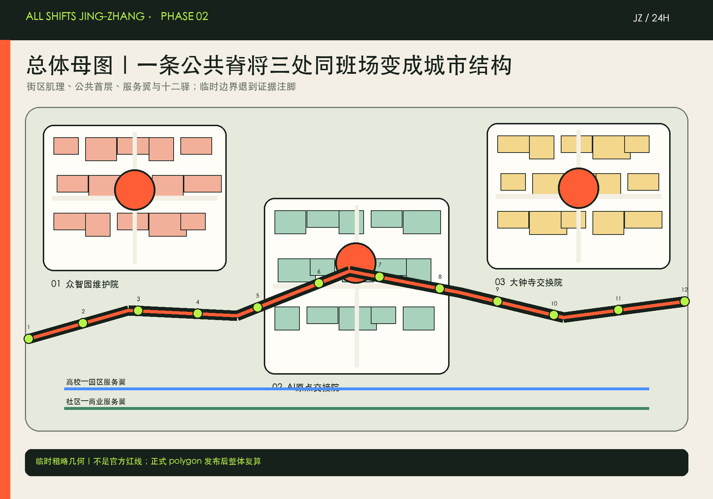

## 三层范围工作框架

三层工作不是三张互不相干的图：43.6 平方公里研究层回答“谁被算作创新生态”；11.4 平方公里总体层回答“服务怎样进入更新结构”；三处重点区回答“一个具体场所如何在昼夜交班中工作”。这套关系由三层范围和总体结构深度项控制 [depth:three_level_scope_framework] [depth:overall_spatial_structure] [standard:PROJECT-OFFICIAL-ANNOUNCEMENT]。

空间结构为**一条同班主脊、三处同班场、两翼服务网络、十二处同班驿**。同班主脊借京张文化与公共空间脉络串联服务；三处同班场分别承担维护、学习与交换；两翼把高校—园区与社区—商业接入；十二驿形成无需扫码也能使用的休息、饮水、卫生间、充电、人工求助与换班信息网络。它是概念网络，不是新增道路或法定设施红线。

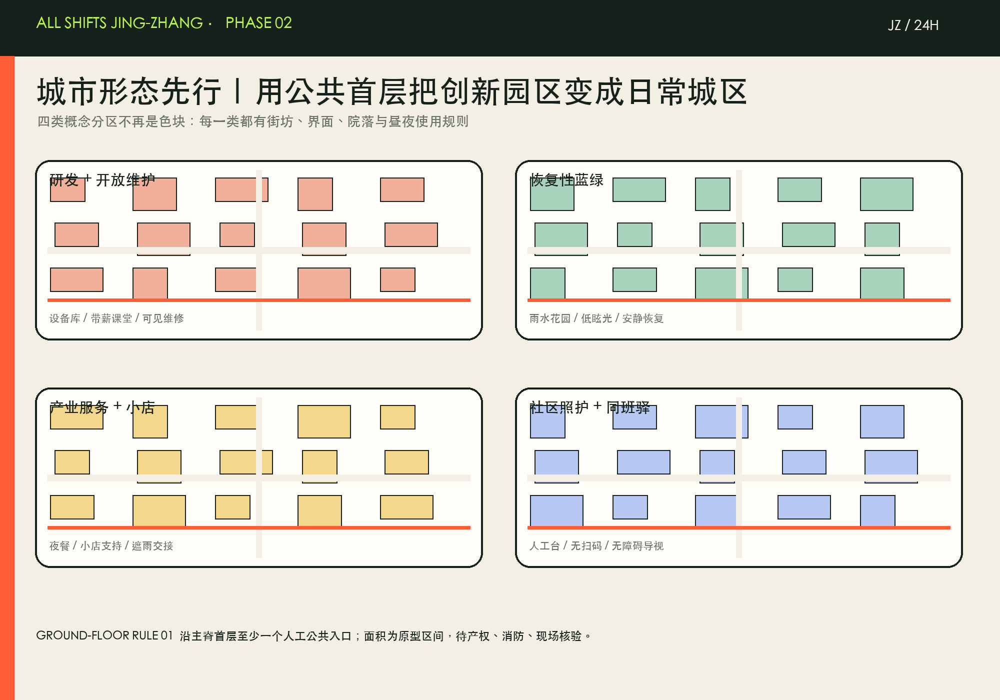

## 统筹研究范围产业与未来城市研究

“京张同班”的产业判断是：AI全栈不仅有模型、算力、数据和应用，也有安装、维护、保洁、配送、安保、客服和照护。只有这些劳动获得稳定空间、培训入口、人工申诉和可见荣誉，创新生态才具备韧性。命名中的“班”同时指工作班次、共同一班和铁路班次；符号以两条并行轨线在换班点交汇构成 **JZ / 24H**，橙色代表交班、荧光绿代表可达的公共支持。命名与活动系统回应 agent 任务书，而不构成政府品牌承诺 [source:AGENT-TASKBOOK] [standard:PROJECT-AGENT-OPEN-CALL-TASKBOOK]。

六个全球案例只提取机制，不作为本地控制证据：

| 案例 | 可转移机制 | 京张转译 |
| --- | --- | --- |
| one-north, Singapore | 以 work–live–play–learn 的混合生态和公共空间活动，把科研园区变成日常城区。 | 借鉴“研发与日常服务同场”，不复制其空间尺度。 |
| STATION F, Paris | 用明确项目制和服务台连接创业者，而不是只提供办公面积。 | 为一线运维者设置同等可见的培训、申诉和服务项目。 |
| MaRS, Toronto | 以伙伴网络和技术采用平台连接初创企业、机构与城市问题。 | 把设备维护与公共服务难题转为可审计的场景任务。 |
| Knowledge Quarter, London | 跨机构知识集群同时关注地方、公共可达和人才网络。 | 创新带的“人才”定义纳入维持城市运转的劳动者。 |
| Maria 01, Helsinki | 以既有医院建筑适应性再利用承载创业社区。 | 优先把可安全使用的存量首层改为同班驿与培训空间。 |
| Cortex Innovation Community, St. Louis | 在创新区建设与运营中明确包容、公平和片区设计指引。 | 把劳动尊严、无障碍和无监控原则写入场景准入。 |

这六类机制共同指向“空间 + 项目 + 治理”三位一体：混合日常、项目服务、伙伴网络、公共可达、存量再用与公平准入 [source:CASE-ONE-NORTH] [source:CASE-CORTEX]。本方案最关键的差异，是把一线劳动者从创新区的服务对象提升为共同生产者。

## 总体设计范围城市更新与控规深度城市设计

临时边界内的概念用地完整覆盖四类功能：研发与开放维护学习、蓝绿恢复与夜间安全开敞、产业服务与小店支持、社区照护与同班驿网络 [data:geometry/land_use.geojson#LU-001] [depth:land_use_layout]。这些 polygon 是设计分区，不是调整法定用地；用地代码参照国土空间调查规划用途分类指引 [standard:MNR-LAND-USE-CLASSIFICATION-GUIDE]。

建筑策略采用“先辨识、再分类”：有安全与文化价值的存量首层优先**保留 + 开放**；结构可用但界面封闭的建筑**改造 + 混合**；经鉴定存在风险且无法经济修复者才进入**拆除 + 补建**候选。当前只有概念建筑基底 310,807.184 平方米可复算 [data:geometry/buildings.geojson#BLDG-001] [metric:building_footprint_area_sqm]；无建筑普查，因此不得逐栋下结论。高度、体量和拆改留须在正式条件下复核 [depth:height_massing_character] [depth:retain_renovate_demolish]。

方案达到的是“可审查的城市设计建议”，不是审定控规。开发强度全部保持 unknown，分区、建筑、道路与设施仍待 official boundary、控规和专业工程条件确认 [standard:MOHURD-CONTROL-DETAILED-PLANNING] [depth:development_intensity_controls]。

## 重点区域详细设计

三处“同班场”在同一伦理下承担不同角色，临时 polygon 仅用于概念定位 [data:geometry/key_areas.geojson#PROV-KEY-001] [data:geometry/key_areas.geojson#PROV-KEY-002] [depth:three_key_area_detailed_design]。

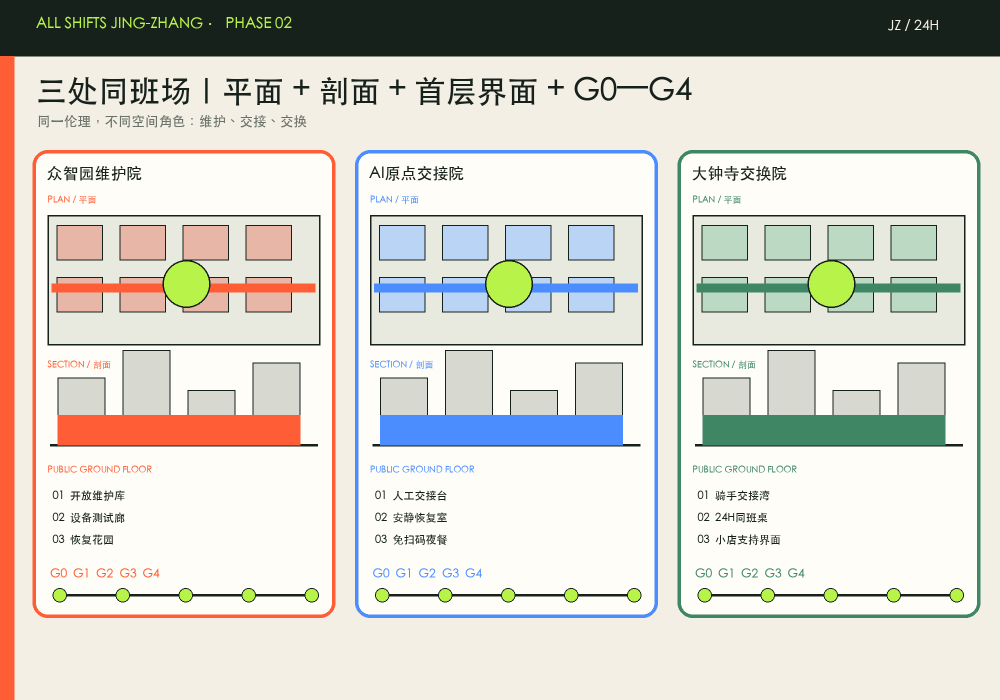

| 重点区域 | 同班角色 | 空间动作 | 首发场景 |
| --- | --- | --- | --- |
| 众智园AI自主创新加速区 | **研发与维护同场** | 以开放维护库、设备测试廊与恢复性绿地连接研发楼首层；维护者拥有与开发者同等入口 | 设备维护副驾驶、带薪再技能课堂、公共算法值班牌 |
| 北京AI原点社区 | **学习与照护同场** | 以人机交接台、安静恢复室、近校学习点与24小时社区服务补全生活链 | 人机服务交接、无障碍导视、免扫码夜餐 |
| 大钟寺AI产业聚集区 | **交换与小店同场** | 以轨道换乘周边的同班桌、骑手交接湾和小店支持界面组织四象限步行联系 | 骑手遮雨交接、小店副驾驶、应急与申诉站 |

众智园约 192.1 公顷、AI原点社区约 104.3 公顷、大钟寺约 72.0 公顷为公告量级；几何面积只作临时校核。任何站点、一层改造与路口连接均需现场、产权、消防、交通与文保核验。

## 第二阶段深化：从“概念网络”到可运营空间

本轮深化把“同班”落实为三种可识别的城市形态：众智园**维护院**、AI原点**交接院**、大钟寺**交换院**。每处均以“平面—典型剖面—公共首层—G0至G4运营门槛”联动表达；公共界面不再是建筑余量，而是与研发、轨道和社区共同组织街区的基础设施。

### 十二处同班驿：四级原型

同班驿采用 S（18—25㎡）、M（45—70㎡）、L（120—180㎡）、XL（300—500㎡）四个**非指标性原型面积带**。建议组合为 3×XL + 3×L + 3×M + 3×S；确切点位和面积须经产权、消防、无障碍、运营及付费劳动者共创确认，不能据此直接立项或报建。

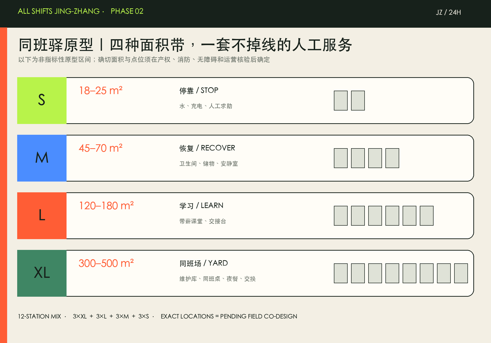

### 一座城的四次交班

06—10 时服务晨间交接与配送，10—18 时承担学习、维护和公共服务，18—24 时支持骑手交换、夜餐与社区活动，00—06 时转入恢复、应急与设备维护。空间可以换挡，但人工升级、无扫码入口、无障碍路线和公共值班牌不得下线。

### 从概念到责任

实施采用 G0 付费共创、G1 权属/消防/可达核验、G2 90天可逆试点、G3 独立隐私/劳动/无障碍审计、G4 扩大—修正—停止五道门。相对 CAPEX/OPEX 仅用于比较工作量，不是投资估算；牵头方写为主体类型，不冒充已确认单位。

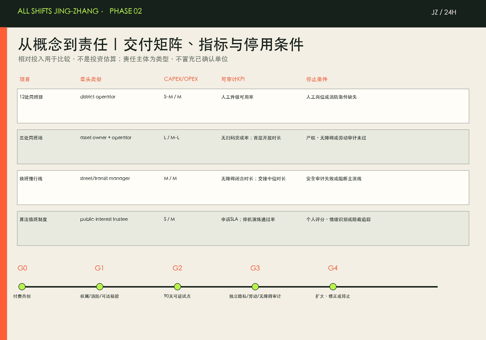

核心审计指标包括：人工升级可用率、无扫码服务完成率、交接中位时长、无障碍路线闭合时长、付费共创场次、申诉处理 SLA 和停机演练通过率。若出现个人评分、情绪识别、隐蔽追踪、自动惩罚或人工入口缺失，试点必须停止。

以下表现图由生成式图像工具依据本方案文字合成，仅用于说明空间氛围与使用关系，不是现场照片、设计定稿或官方依据。

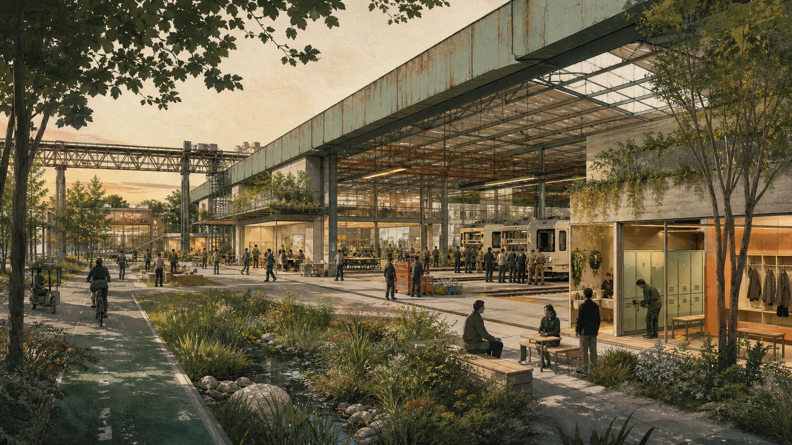

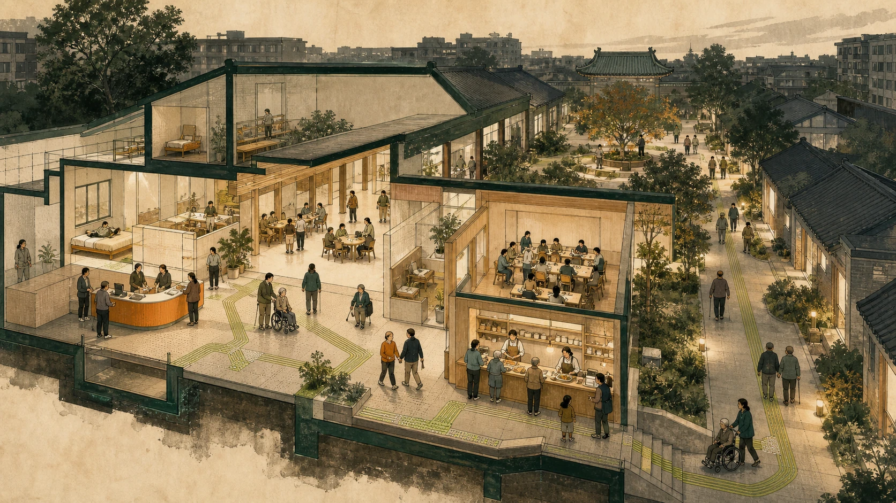

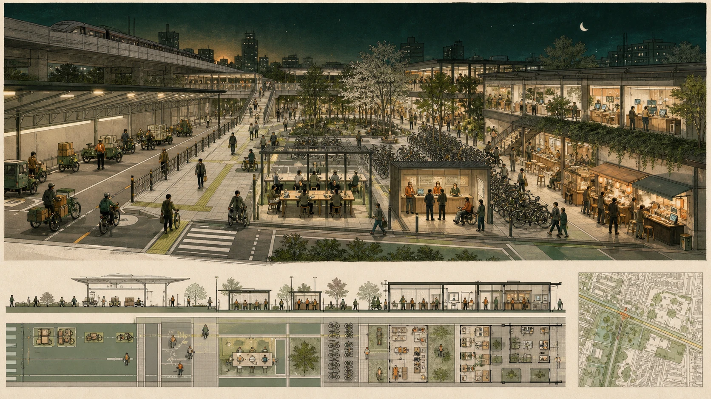

## 第三阶段：众智园维护院 90 天可逆试点包

众智园是“研发与维护同场”的首个试点原型，但**不是已确定的项目、点位、投资或施工方案**。官方公告要求其围绕 AI 全栈自主创新、标准与安全治理、绿色空间、清河文化和花园型创新街区深化；当前公开资料仍缺少精确地块、权属、建筑、消防、交通和市政条件。因此，本包只提出一个可撤除、可审计、可暂停的 90 天方法，不认定任何具体建筑或建设规模 [source:OFFICIAL-ANNOUNCEMENT] [data:geometry/key_areas.geojson#PROV-KEY-001]。

### 五个可逆空间组件

在 G1 现场核验通过后，试点以五个可移动组件临时组织公共首层：人工入口、非生产性维护工作台、带薪学习桌、交接与申诉台、恢复花园。它们服务于“看得见维护、找得到人工、进得去学习、随时可退出”，不接入生产系统、不采集个人绩效、不作永久改造；任一产权、消防、无障碍或安全条件不满足，组件即不安装或撤除 [standard:PROJECT-AGENT-OPEN-CALL-TASKBOOK]。

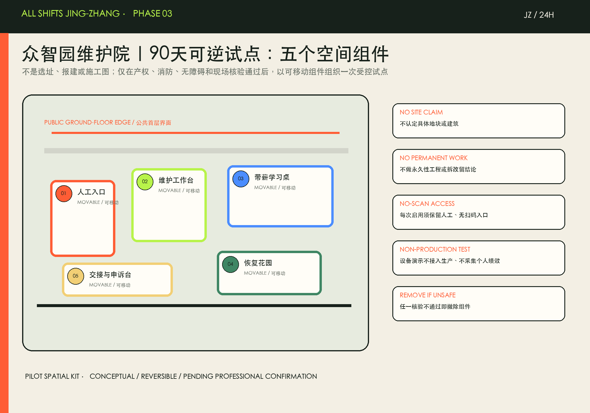

### 90 天节奏与四班模板

第 01—14 天完成付费共创：维护技师、保洁/物业、研发人员、无障碍使用者与运营代表共同定义启用时段、设备清单、人工交接和申诉路径。第 15—30 天只做现场、责任、消防、无障碍、用电和撤场核验。第 31—75 天才在预约及公开时段运行非生产性维护演示、带薪学习和人工交接；第 76—90 天由独立角色复核记录，并决定扩大、修正或停止。06—10、10—18、18—24、00—06 的四班模板仅在已完成付费排班和安全核验的时段启用；没有人手或条件，服务不开放 [metric:pilot_day_count] [metric:pilot_gate_count]。

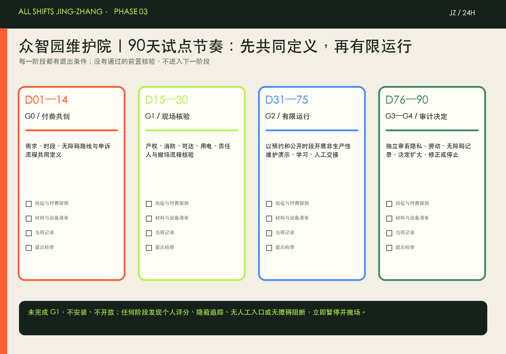

### 当班记录不是劳动者评分

试点只记录服务是否可达、人工交接是否完成、无障碍路线是否闭合、问题是否被修复及申诉是否闭环。日志按时段、去标识事件和公开月度摘要组织，禁止记录个人绩效、情绪、精确轨迹或生产性工单。每次启用必须有人工、无扫码入口；一旦出现个人评分、情绪识别、隐蔽追踪、自动惩罚、生产系统接入、人工入口缺失或无障碍阻断未修复，立即暂停并撤场，交由独立复核 [source:AGENT-TASKBOOK] [standard:GENERATIVE-AI-INTERIM-MEASURES]。

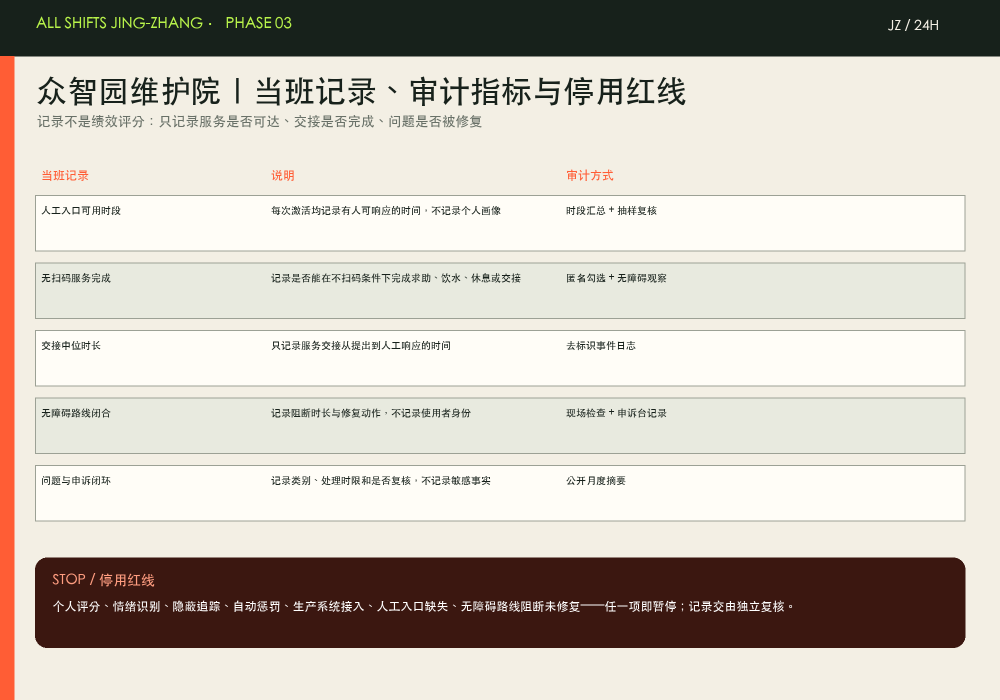

本试点包的“成功”不是预设招商、效率或客流数字，而是完成五项可审计问题：服务能否在不扫码条件下获得、人工升级是否可用、交接是否及时、无障碍路线是否持续可用、问题是否得到可追溯处理。正式扩展前仍须补齐官方边界与专项条件，并由专业团队与参与者共同判断。

### G1 现场核验清单（本地工作版）

90 天试点进入任何安装或开放前，现场必须逐项完成范围与授权、消防与人身安全、无障碍连续路线、用电与设备隔离、当班责任与付费、告示/数据/申诉、撤场与事件预案七类核验。每一项均须对应可核验的证据、责任角色和“通过/暂停”结论；任何缺项或不通过即不安装、不开放。G1 只确认是否可以开始一个可逆试点，不替代审批、设计、消防、产权、劳动或无障碍专项结论 [standard:BARRIER-FREE-ENVIRONMENT-LAW] [metric:g1_verification_domain_count]。

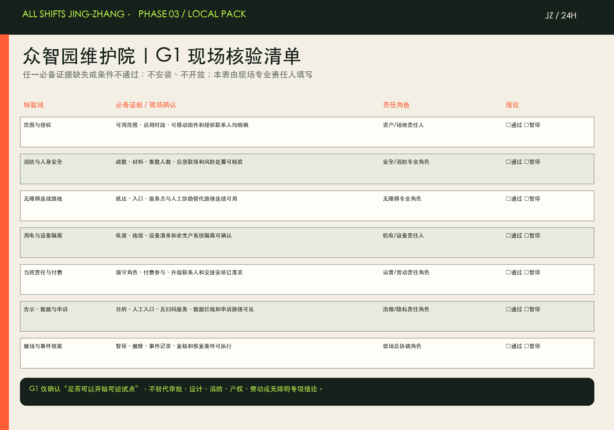

### 付费共创工作坊包（本地工作版）

共创不是无偿访谈。以维护技师、保洁/物业、AI 研发、无障碍/照护使用者、资产/运营五类角色为基本席位，通过边界与付费说明、共同走读、问题卡片、组件试摆、排序与交接五步，产出服务时段愿望单、人工协助与无障碍路线图、五组件清单、停用条件、G1 证据责任表和公开版纪要。具体报酬、工时归属、个人信息与录音规则在活动前书面确认；没有确认便不招募、不记录 [source:AGENT-TASKBOOK] [metric:codesign_participant_role_count]。

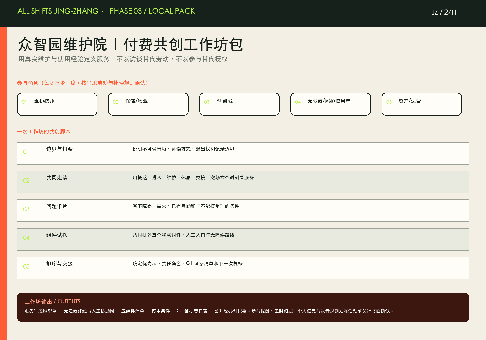

### 当班记录模板（本地工作版）

当班表只记录启用条件、服务可达、人工交接、路线修复、问题/申诉、收班撤除与下一次复核，按角色和去标识事件汇总；不写入姓名、个人绩效、情绪、精确位置或生产性工单。每班都必须勾选人工入口、无扫码服务、连续无障碍路线、设备隔离和可撤场条件；出现任一停用红线即在表内标记暂停/撤场并进入独立复核 [standard:GENERATIVE-AI-INTERIM-MEASURES] [metric:shift_log_record_category_count]。

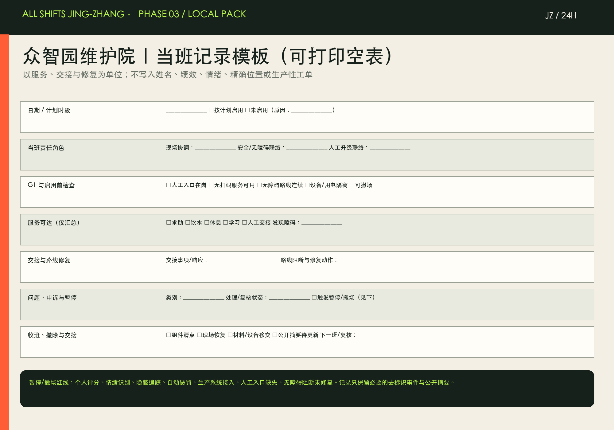

## 第三阶段深化：三处场景 × 一日行动剧本

这组行动剧本把三处“同班场”放进同一日的四段节奏：06—10 抵达与晨间交接，10—18 共同工作、学习与照护，18—24 夜餐、交换与社区服务，00—06 恢复、应急与安全离开。它不是已确认的班表、客流预测、现场调查或实施授权，而是把既有角色、场景卡和空间原型组织为“人如何抵达—获得什么服务—在哪个空间交接—何时转向人工”的概念性工作流 [metric:daily_script_area_count] [metric:daily_script_shift_count]。

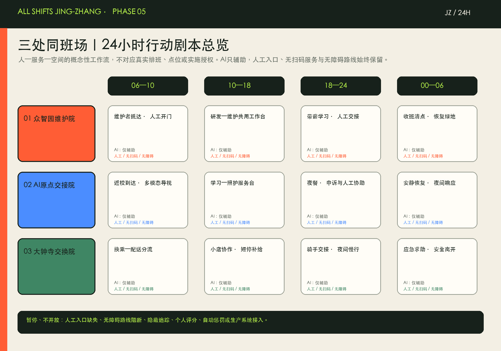

众智园维护院让维护技师、研发者和人工支持在公共首层交班：晨间分开设备到达与步行流线，白天共享维护台与学习桌，晚间由人工交接台回应求助与申诉，夜间清点可移动组件并恢复绿地。AI只处理授权设备状态或辅助文档检索，不能记录个人表现 [source:AGENT-TASKBOOK]。

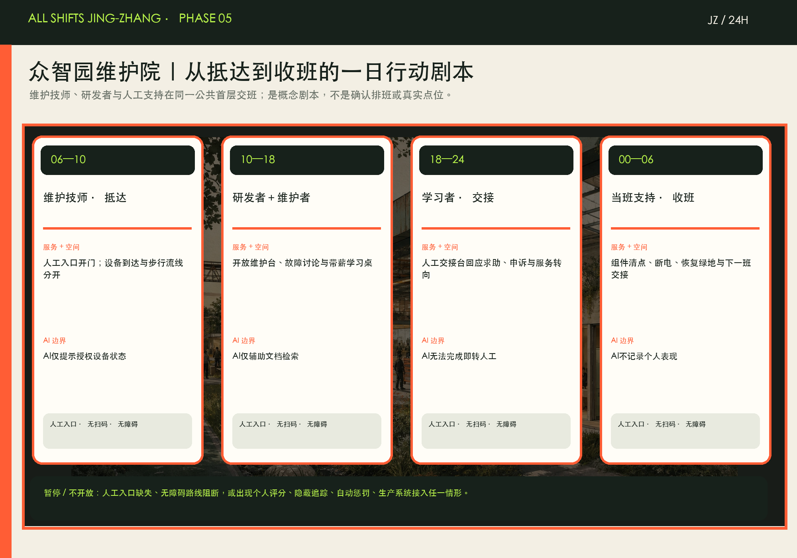

AI 原点交接院把学习者、照护者与低数字素养使用者放在同一服务链：近校抵达时使用视觉、语音和人工导视，白天连接学习桌、休息座和服务台，夜间保留无扫码夜餐、申诉入口和安静恢复空间。AI仅给出可解释的导向或服务辅助，不能替代照护判断、推断身份或情绪 [standard:BARRIER-FREE-ENVIRONMENT-LAW]。

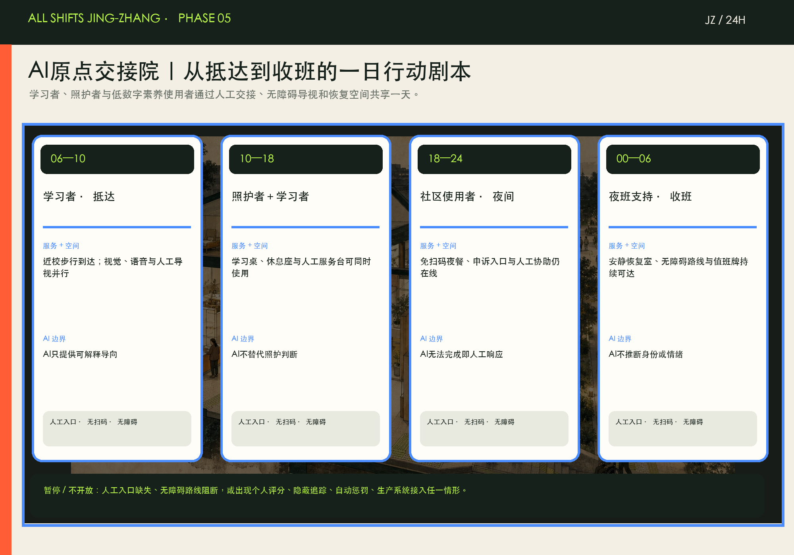

大钟寺交换院把骑手、小店经营者和夜班人员的换乘、短停和安全离开组织在一起：早间分开换乘、配送与步行，白天开放同班桌和小店协作界面，晚间以遮雨交接湾、夜餐和慢行线完成交接，夜间保留人工求助和申诉转介。AI仅发布聚合导向或在店主控制下辅助经营，不追踪个人路线、不自动惩罚或封禁 [standard:GENERATIVE-AI-INTERIM-MEASURES]。

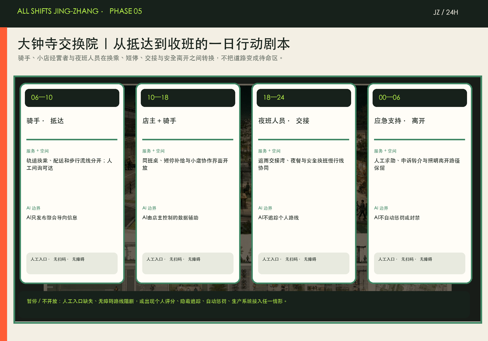

无论哪一处、哪个时段，人工入口、无扫码服务、连续无障碍路线与公开责任信息都不得下线。人工入口缺失、无障碍路线阻断、隐蔽追踪、个人评分、自动惩罚或生产系统接入，任一情形均意味着暂停、不开放；这些剧本不替代真实场地、消防、产权、劳动或专业核验结论。

## 第五阶段深化：三处场景 × 84 秒无障碍导览

离线导览把上述四段行动剧本压缩为 84 秒的静音可理解序列：06—10 的众智园维护与人工交接，10—18 的 AI 原点学习、照护与无障碍导视，18—24 的大钟寺换乘、短停与求助，以及 00—06 的恢复和安全离开。视频只有既有概念场景、剧本图和抽象路径/服务图层；中文与英文各有字幕和完整文字稿，不需要旁白、音乐或扫码才可理解 [metric:accessibility_tour_duration_seconds] [metric:accessibility_tour_time_window_count]。

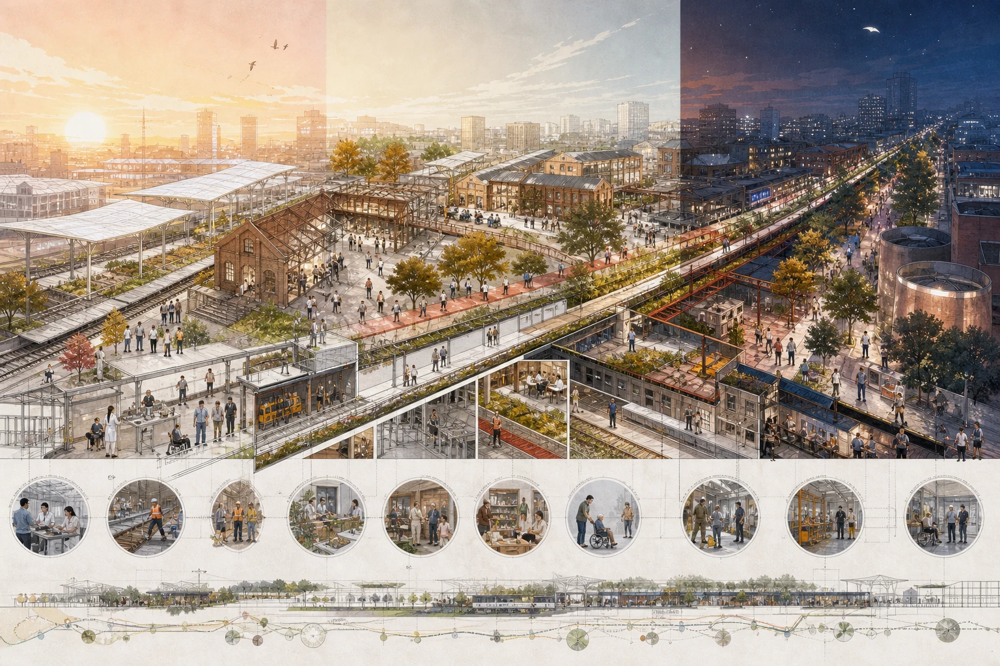

[在离线网页中播放导览](visual/index.html#accessible-tour) · [中文文字稿](assets/media/three-area-access-tour-zh.md) · [English transcript](assets/media/three-area-access-tour-en.md)

导览仍是设计研究表达：它不确认真实点位、班表、客流、开放时段或实施授权。每段都以“AI仅辅助、人工入口、无扫码服务、连续无障碍路线”为前提；任何人工入口缺失、无障碍中断、隐蔽追踪、个人评分、自动惩罚或生产系统接入，均应暂停而非继续运行 [metric:accessibility_tour_silent_equivalence_count]。

## AI 创新生态、人才画像与 AI+ 场景

八类画像把技术岗位与城市运行岗位放在同一张需求表中：

| 画像 | 核心需求 | Core needs (EN) |
| --- | --- | --- |
| AI研发者与创业者 | 夜间协作、可信测试、生活服务 | Late collaboration, trusted testing, daily services |
| MLOps与设施维护技师 | 设备文档、故障协同、带薪学习 | Equipment documentation, fault coordination, paid learning |
| 保洁与物业劳动者 | 休息饮水、储物、申诉、合理排班 | Rest, water, lockers, grievance and humane scheduling |
| 骑手与快递员 | 遮雨交接、充电、卫生间、清晰门牌 | Sheltered handover, charging, toilets and legible addresses |
| 夜班安保与交通人员 | 安全换班路线、热餐、短时恢复 | Safe shift-change routes, warm meals and recovery |
| 小商户经营者 | 低门槛工具、合规帮助、客流信息 | Low-friction tools, compliance help and aggregate footfall |
| 照护者与老年居民 | 人工服务、无扫码入口、休憩与陪护 | Human service, no-scan access, rest and care |
| 残障访客与低数字素养者 | 无障碍导视、人工交接、多模态信息 | Accessible wayfinding, human handover and multimodal information |

十二张场景卡均有空间载体、人工兜底和数据边界 [data:geometry/public_space.geojson#PUBLIC-001] [metric:scenario_card_count]：

| 编号 | 场景 | 空间与治理说明 |
| --- | --- | --- |
| SCN-01 | 24小时同班驿 | 休息、饮水、卫生间、储物、充电；无需扫码进入。 |
| SCN-02 | 设备维护副驾驶 | 只读取授权设备日志，辅助故障定位；不评价劳动者。 |
| SCN-03 | 人机服务交接台 | AI无法完成时一键转人工，并保留可审计交接记录。 |
| SCN-04 | 骑手遮雨交接湾 | 将取送、短停、休息与步行流线分开，减少冲突。 |
| SCN-05 | 免扫码夜餐支持 | 现金与人工窗口保留，供夜班热餐和应急物资。 |
| SCN-06 | 无障碍多模态导视 | 视觉、语音、触觉与人工指引并行。 |
| SCN-07 | 带薪再技能课堂 | 设备、数据安全与服务技能学习计入工时。 |
| SCN-08 | 公共算法值班牌 | 公开系统目的、数据、责任人、申诉和停用状态。 |
| SCN-09 | 安全换班慢行线 | 照明、可见性、过街与夜间公交信息共同设计。 |
| SCN-10 | 安静恢复室 | 为感官敏感、夜班和照护者提供短时低刺激空间。 |
| SCN-11 | 小店经营副驾驶 | 由店主控制数据，辅助库存、翻译和合规提醒。 |
| SCN-12 | 应急与申诉站 | 提供人工应急、劳动权益转介和系统问题申诉。 |

三项产业测试只作为**验证任务**：①设备优先预测维护仅处理授权设备日志，禁止个人绩效评分；②隐私保护换班路线只发布聚合状态，不保存个人轨迹；③人机服务连续性交接测试人工升级的时延与完整性，AI不得关闭人工入口 [metric:test_scenario_count] [source:AGENT-TASKBOOK]。所有测试须先通过劳动者共同评审、隐私影响评估、无障碍测试和可退出审查。

四处朝圣型公共地标把“看见劳动”做成城市体验，而不是技术雕塑：

| 地标 | 公共意义 |
| --- | --- |
| 零点交班厅 | 把每日换班变成可见的城市仪式与跨职业信息交接。 |
| 百工荣誉墙 | 记录贡献而非排名个人，展示城市运行的共同劳动。 |
| 开放维护库 | 公开设备维修、再利用和安全训练，连接工程与市民。 |
| 24小时同班桌 | 一张可吃饭、开会、求助、学习的公共长桌。 |

## 用地、建筑规模与拆改留方案

概念用地分区是“研发—绿地—服务—社区”四类连续拼合，服务空间不是研发用地的剩余角落。绿地约 1,408,600.768 平方米、公共空间约 836,345.643 平方米，按临时边界复算比例分别为 12.3423% 与 7.3281% [data:geometry/green_space.geojson#GREEN-001] [metric:green_ratio] [metric:public_space_ratio]。这些是方案几何值，不是法定绿地率或公共空间指标。

拆改留采用五问门槛：是否安全、是否有遗产/社区价值、是否支持无障碍、是否可低碳改造、是否能提供昼夜公共界面。只有专业调查完成后才形成逐栋表；当前建筑 polygon 仅为概念基底。城市设计统筹依据城市设计管理要求，但不替代建筑、消防和无障碍专项 [standard:MOHURD-URBAN-DESIGN-MEASURES]。

## 交通、轨道、市政与公共服务设施

同班主脊不是新路，而是“夜间也完整”的步行—骑行—轨道接驳服务链：连续照明、可见过街、遮雨短停、无障碍导视、夜间公交信息、同班驿和人工求助共同工作 [data:geometry/roads.geojson#ROAD-001] [depth:traffic_rail_slow_parking]。道路红线、信号配时、站口衔接和停车数量均待交通专项。

市政与新基建采用“设备可维护性优先”：公开设备资产编号与维护责任，不采集个人轨迹；边缘计算仅处理最低必要数据；任何公共AI系统必须有物理人工按钮、值班责任人和停用状态展示 [depth:municipal_new_infrastructure] [data:geometry/constraints.geojson#CONSTRAINTS]。公共服务设施保留现金、人工、纸质和语音入口，避免“只有手机才能使用城市”。

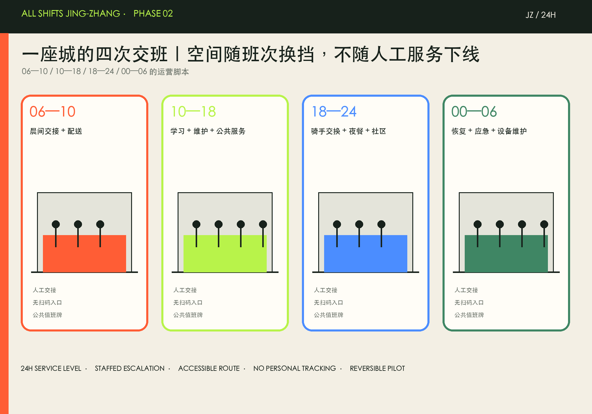

## 蓝绿空间、公共空间与城市风貌

蓝绿系统承担三种同等重要的功能：白天的生态与慢行、夜间换班的安全与恢复、极端天气下的遮蔽与应急。设计将恢复性绿地、公共界面和同班驿串为连续网络 [depth:blue_green_public_space] [data:geometry/public_space.geojson#PUBLIC-001]。照明强调均匀、低眩光与可维护，不以高亮屏幕制造“AI感”。

城市风貌使用“铁路运营日志”而非“未来科技蓝”：深墨绿为城市底盘，交班橙标记人工服务，荧光绿标记可达支持，细轨线与时间戳构成导视语法。零点交班厅、百工荣誉墙、开放维护库与24小时同班桌形成四个可识别锚点；个人不被排名，劳动贡献以团队、事件和维修成果呈现。

## 更新项目清单、实施政策与分期计划

| 编号 | 项目 | 分期 | 主要依赖 |
| --- | --- | --- | --- |
| R-01 | 12处同班驿轻量试点 | 近期 | 运营先行；点位须现场核验 |
| R-02 | 三处同班场首层更新 | 近期 | 以安全可用存量建筑为优先 |
| R-03 | 安全换班慢行线 | 近期 | 不替代道路红线与交通审批 |
| R-04 | 零点交班厅与百工荣誉墙 | 中期 | 公开设计竞赛与版权清权 |
| R-05 | 开放维护库 | 中期 | 设备与消防条件待确认 |
| R-06 | 无障碍服务交接网络 | 中期 | 人工岗位与服务SLA先行 |
| R-07 | 公共算法值班制度 | 长期治理 | 先制度后系统 |
| R-08 | 年度同班城市周 | 长期运营 | 不冒充已确定政府活动 |

分期逻辑为“先服务、再空间、后系统”：0—12个月以付费共创、十二驿轻量设施、人工交接与夜间路线审计启动；1—3年在安全可用的存量首层建设三处同班场；3年以上才依据正式规划和独立评估扩展数字系统 [data:geometry/phasing.geojson#PHASE-001] [depth:renewal_project_list] [depth:phasing_implementation]。

年度运营不是一次节庆：每季度开展一次“交班审计”，每月一次开放维护日，每半年一次无障碍与人工兜底演练，每年一周“同班城市周”。劳动者参与设计与测试应付费；任何系统上线须公开目的、数据、责任人、申诉、停用和复审日期。

## 指标体系、面积复算与合规矩阵

指标分三层：**可复算但临时**——边界面积、建筑基底、绿地与公共空间比例；**结构化计数**——6案例、8画像、12场景、3测试、4地标、8项目；**保持未知**——FAR、高度、密度、退线和官方设施标准 [depth:metrics_recalculation] [metric:renewal_project_count]。指标状态、公式、来源文件、置信度和假设全部记录在 `metrics.json`。

合规矩阵把公告 1.3—1.5 与 agent.1—agent.6 映射到章节、图层、指标、图纸、网页、来源和自检；标准矩阵区分“已回应”和“待专业确认”。本方案不把容积率未知当成空缺掩盖，而把它作为阻止伪精确的治理门槛 [standard:MOHURD-CONTROL-DETAILED-PLANNING]。

## 风险、版权与合规说明

首要风险是官方 polygon 缺失；临时边界与 OSM 公园要素存在已登记的空间不确定性，不能据此断言哪一方正确 [source:BOUNDARY-SOURCE] [depth:risk_missing_data]。其余缺口包括控规、道路、建筑与权属、市政、文保、公共服务与真实班次需求。正式深化须以官方数据替换、现场调查、付费劳动者共创和专业专项审查闭环。

AI红线为：不做隐蔽监控、不做情绪识别、不做劳动者画像交易、不做个人排名或自动惩罚；不以“效率”为由取消人工服务；不把测试称为部署。任何试点都必须可解释、可申诉、可退出、可停机、可独立审计。

本包的文本、图件、网页与排版为 agent 原创；官方与案例材料仅以文字机制引用，未嵌入第三方图片、地图瓦片、远程字体、脚本、API、iframe 或跟踪器。许可与来源详见 `sources.json` 和 `report/copyright_statement.md`。

## 参考资料

- 北京市规划和自然资源委员会海淀分局，百年京张AI创新带城市设计国际方案征集资格预审公告 [source:OFFICIAL-ANNOUNCEMENT]
- 面向智能体的开源征集任务书及仓库场地包 [source:AGENT-TASKBOOK] [source:SITE-PACKAGE]
- 六个国际案例的官方机构页面；只作机制参考，详见 `sources.json`
- 结构化证据：`metrics.json`、`assumptions.json`、`compliance_matrix.json`、`standard_matrix.json`、`design_depth_matrix.json`
