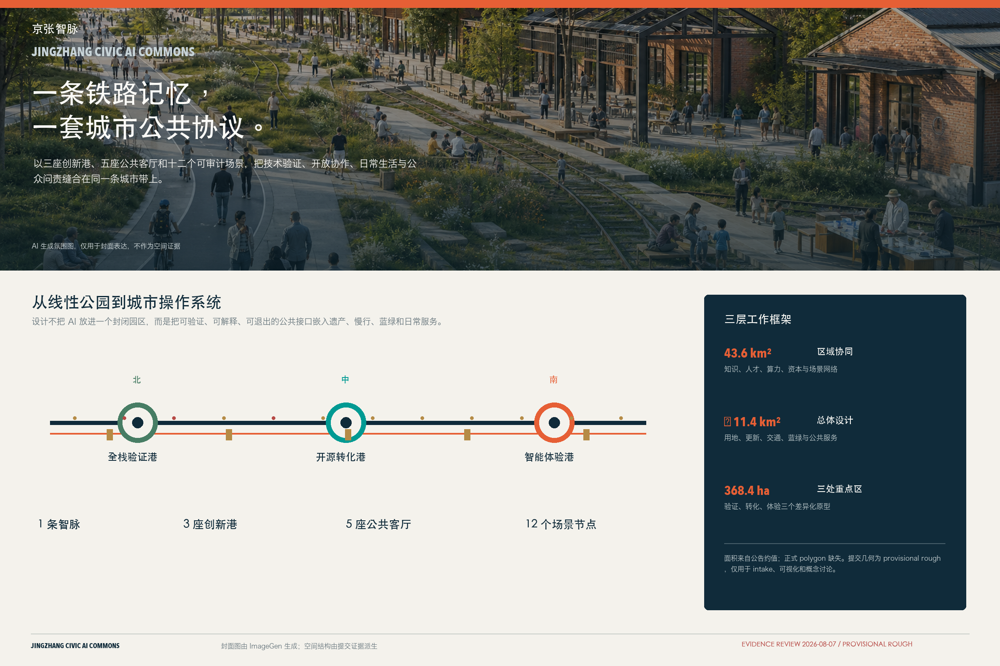
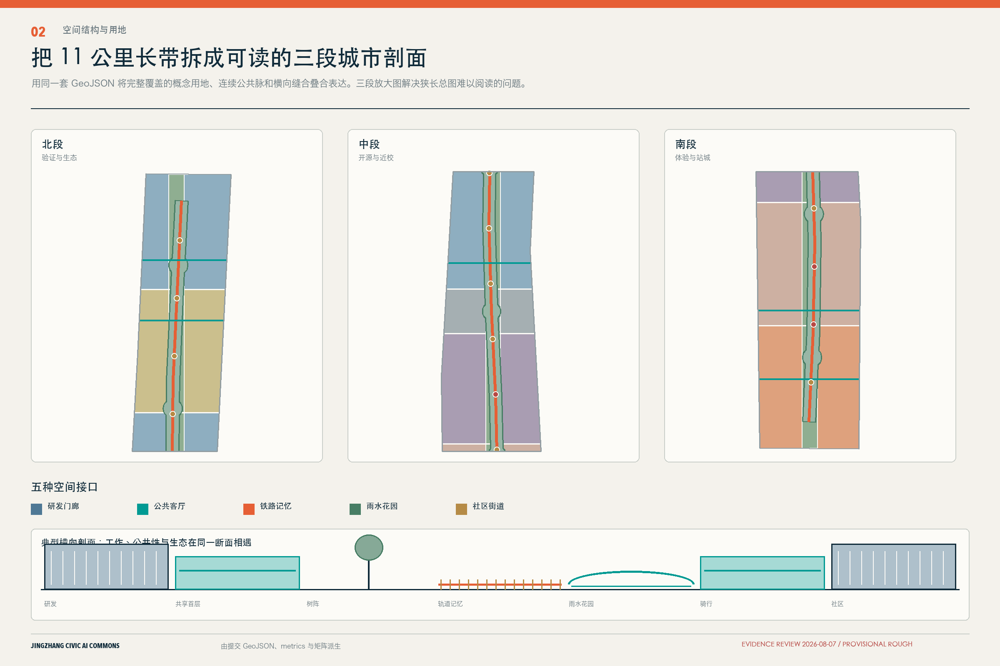
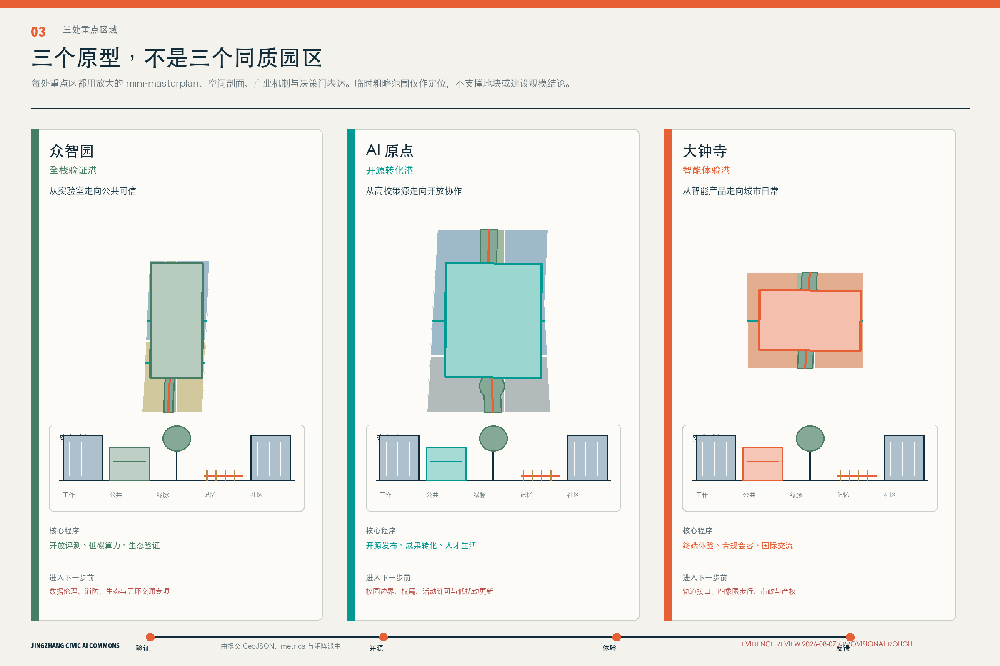
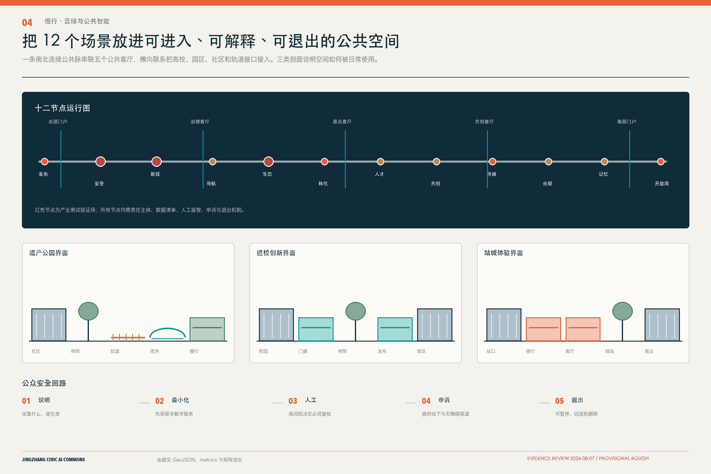
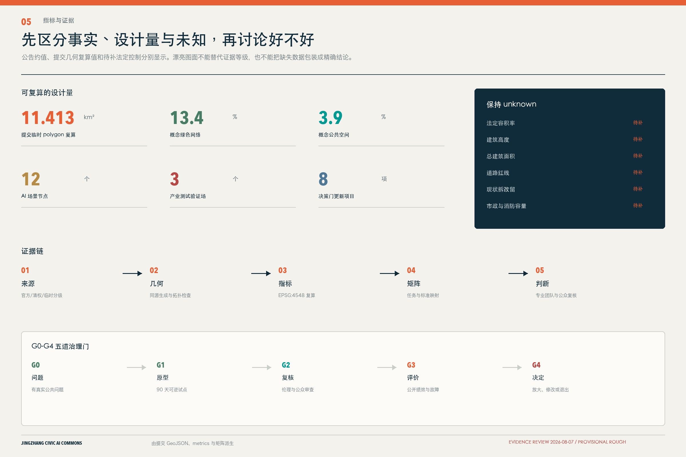

# 京张智脉：可验证的城市AI公共实验带

## 设计依据与资料清单

本方案把“百年京张”理解为一条持续更新的公共知识基础设施，而不是在传统园区方案上叠加 AI 标签。设计依据来自公开公告、面向智能体的清权任务书、城市设计与控规编制标准、用地分类指南及仓库资料登记表；资料用途严格区分 formal-ready、background-only 与 provisional-only。[source:SITE-PACKAGE] 是结构化任务与标准总入口；[source:OFFICIAL-ANNOUNCEMENT] 用于确认项目名称、三层范围约面积、任务和成果语境；[source:AGENT-TASKBOOK] 用于确认三大定位、五大功能、六项智能体任务和统一边界；[source:SOURCE-REGISTRY] 决定每条资料能支撑什么，不能支撑什么。[standard:PROJECT-OFFICIAL-ANNOUNCEMENT] [standard:PROJECT-AGENT-OPEN-CALL-TASKBOOK]

当前唯一可用的空间边界来自 [source:BOUNDARY-SOURCE] 与 [source:KEY-AREA-SOURCE]，两者均为仓库维护的临时粗略 polygon。它们只用于 intake、概念设计、离线可视化和拓扑自检，不是官方红线、审批依据、精确面积依据或法定控规。提交边界在 EPSG:4548 中复算约为 11.413 平方公里，[data:geometry/site_boundary.geojson#SITE-001] [metric:site_area_sqm]；公告“约 11.4 平方公里”仍是任务层的权威描述。三处重点区均标记 `official_boundary=false` 与 `geometry_role=provisional_constraint`，[data:geometry/key_areas.geojson#PROV-KEY-001] [data:geometry/key_areas.geojson#PROV-KEY-002] [data:geometry/key_areas.geojson#PROV-KEY-003]。

专业依据使用仓库本地快照而非只引用 URL：城市设计以平面与立体空间、公共空间、风貌和历史传承的统筹为原则 [standard:MOHURD-URBAN-DESIGN-MEASURES]；用地、强度、道路、市政和实施管理应区分已知控制、设计建议与待确认事项 [standard:MOHURD-CONTROL-DETAILED-PLANNING]；用地代码采用项目枚举所对应的国土空间分类逻辑 [standard:MNR-LAND-USE-CLASSIFICATION-GUIDE]。建筑设计文件深度规定当前缺少官方可访问文件，故 [standard:MOHURD-ARCH-DESIGN-DEPTH-2016] 只作为数据缺口，不作为已满足的权威依据。现状诊断把“确知事实”与“缺失资料”并列呈现 [depth:existing_conditions_diagnosis]，不根据新闻图、OSM、文字四至或 AI 推测补造红线、现状建筑和控规。

本方案所有插图均由本提交的 GeoJSON、metrics、矩阵与自检状态重新生成，没有使用商业地图、远程瓦片、新闻图片、人物肖像、企业商标或未授权字体图像。外部六个案例只用于机制比较，全部标记 background-only，不参与本项目边界、面积、强度或政府承诺的推导。[source:PROCESSED-FACT-PACK]

### 场地不是一张空白底图

本次深化首先改正“从零建设一条创新带”的错误想象。京张铁路遗址公园一期已经建成开放，官方公布范围为清华东路至知春路、总长度 2.5 公里、总面积 16.8 公顷；它应被视为已经承载通勤、休憩与铁路记忆的公共资产，而不是本方案新增绿地。[source:BJ-JINGZHANG-PARK-PHASE1] 2021 年规划解读还揭示了线性空间长期存在的多层铁路并行、东西断点、多权属和分段实施问题，[source:BJ-JINGZHANG-PLANNING] 因而本方案的主任务不是再画一条彩带，而是补足横向连接、公共运营和可问责的场景协议。

同样需要作为协同底板的还有三组既有或在建行动：清河海淀段滨水空间已有项目批复；小月河滨水空间处于建设推进语境；清华东路南侧约 6.87 万平方米公共空间改造已经获批，包含从京张遗址公园到小月河绿廊的七个节点。[source:BJ-QINGHE-APPROVAL] [source:BJ-XIAOYUEHE-WATERFRONT] [source:BJ-XUEYUANLU-SEVEN-NODES] 这些项目只标记为“既有/协同接口”，不计入本方案新增建设量、面积或绩效。二期开放状态在公开报道中快速变化，正式深化前必须以现场和最新官方资料刷新，当前不把某一报道日期的状态当成固定事实。

清华园车站旧址已公布文物保护范围与建设控制要求，但当前没有可核验的官方 GIS 图层。[source:BJ-QINGHUAYUAN-HERITAGE] 本方案因此只设置“文保图层导入与专业核验门”，不依据文字四至自行绘制红线。任何邻近建筑、装置、地下工程和人流组织都必须在正式保护范围、建控地带和考古要求导入后再判断。

## 三层范围工作框架

三层范围采用“区域协同—总体结构—三港验证”的传导关系。[depth:three_level_scope_framework] 统筹研究范围约 43.6 平方公里，关注高校、科研、产业、资本、人才、算力、数据与场景如何协同；总体设计范围约 11.4 平方公里，关注京张遗址公共空间周边的用地、更新、交通、市政、蓝绿、公共服务与风貌；重点区域约 368.4 公顷，分别验证众智园、AI 原点和大钟寺的差异化机制。三层面积是公告约值，提交 polygon 仍为 provisional，不能用图面精度覆盖公告和正式附件的权威层级。

总体空间结构为“一脉、三港、五厅、十二节点”。“一脉”是京张历史叙事、慢行、蓝绿和公共智能服务的复合走廊；“三港”是北部全栈验证港、中部开源转化港、南部智能体验港；“五厅”是可进入、可停留、可共同决策的公共客厅；“十二节点”把 AI 场景放进具体公共空间并记录隐私、伦理、人工复核和运营边界。[depth:overall_spatial_structure] [data:geometry/roads.geojson#ROAD-001] [data:geometry/public_space.geojson#PUBLIC-001]

三层之间通过四条反馈链闭环：区域生态提出知识、人才与场景需求；总体设计把需求转成空间类型和公共接口；三港以小规模、可撤回、可审计的原型验证；验证结果再回到专业团队、社区和管理部门，决定继续、调整或退出。这里的任何“落位”都是概念建议和参考方案，可供专业团队深化研究，不构成政府审定、土地权属、投资或建设承诺。

为了让“一脉”真正具有城市厚度，总体设计采用三种可替换的横向剖面，而非一条等宽绿带：

1. **铁路与公园并行段**按“运营安全界面、铁路记忆、连续慢行、雨洪花园、社区日常”组织，桥下与高架空间另设照明、噪声、结构、消防和夜间管理审查；
2. **校园与园区边界段**按“受控研发、共享门廊、可见但脱敏的工作过程、公共客厅、夜间安静边界”组织，使开放发生在可管理的一层，而不是假设校园和实验室无条件开放；
3. **社区与水岸段**按“行洪/运维、生态缓冲、慢行、全龄停留、非数字替代服务、建筑界面”组织，AI 只承担信息公开、报修和无障碍提示，不替代水务监测或增加未经审查的亲水构筑物。

三类剖面都坚持“原物优先、日常优先、维护优先”。遗产不是造型素材，蓝绿不是科技展陈背景，公共空间也不是设备部署容器。只有在原有使用、管理责任和退出条件被说明后，场景才进入下一道门。[source:BJ-INNOVATION-CENTER-REGULATION]

## 统筹研究范围产业与未来城市研究

方案主名称为“京张智脉”，英文名为 **Jingzhang Civic AI Commons**。命名强调三层含义：Jingzhang 保留百年铁路记忆；Civic 将公共利益、人的尊严和共同治理放在技术之前；Commons 表示算力、数据、场景、知识与公共空间需要可进入、可问责的共享协议。Logo 方向使用“平行轨线 + 开源括号 + 一枚橙色道岔点”，形成 J/Z 的负形；视觉系统采用铁路技术图谱式网格、海淀水绿与信号橙，不使用企业标识或未授权图像。命名可延展为“全栈验证港 / Open Validation Port”“开源转化港 / Open Source Transfer Port”“智能体验港 / Civic Experience Port”。

五大功能通过一条公共协议链组织：全栈自主创新把模型、芯片、系统、算力与安全评测接入众智园；世界级创新生态把高校策源、开源社区、企业转化和全球协作接入 AI 原点；AI+ 场景赋能通过小月河场景翼和京张公共空间形成可观察试验；智能化活力城市将服务放入社区、慢行和日常消费；AI 治理话语权则由标准、审计、公众参与和贡献记录共同形成。空间方案不编造企业名单、产值、投资额或政策资金。[source:AGENT-TASKBOOK]

六个全球案例只做机制对照，[metric:global_case_count]。本次深化不再把它们写成六个“成功园区”标签，而同时读取运营者资料、公共审计、监管意见和独立研究：

| 案例 | 真正可借鉴的机制 | 京张具体转译 | 失败教训与不可照搬 |
| --- | --- | --- | --- |
| Singapore one-north [source:CASE-JTC-ONE-NORTH] [source:CASE-LTA-TESTING] | 小地块、多用途、跨群体路径；真实环境测试有申请、保险、黑匣子和分级放行 | 三港拆成可步行穿越的创新街坊；场景按风险逐级测试 | 不复制国家土地与招商制度，不以 `work-live-play` 口号证明包容 |
| Paris-Saclay [source:CASE-PARIS-AUDIT] [source:CASE-PARIS-PUI] | 联合转化办公室和创新观测站，补足机构之间的组织协同 | 建立跨高校企业服务接口，公开网络协同、社区和交通指标 | 公共审计警告“地理邻近不等于协同”；不复制远郊巨型集中搬迁 |
| Waterfront Toronto [source:CASE-WATERFRONT-AUDIT] [source:CASE-WATERFRONT-IPC] | 法定责任链、公共授权、独立监督和可撤回的项目边界 | 数据目的、最小化、审计、删除、事故、申诉和退出在采购前明确 | Sidewalk 的准公共数据机构与扩域争议是反例，企业不能定义规则并评价自己 |
| Barcelona 22@ [source:CASE-BARCELONA-2020] | 开发增量绑定公共收益台账，周期性公众复盘并可改规则 | 将开放首层、可负担空间、遗产、绿地、服务和运营经费写入协议 | 不复制具体容积率或缴地比例，不以创新更新清退居民、小店和生产空间 |
| Cambridge Kendall Square [source:CASE-KENDALL-K2C2] | 首层、街道、广场构成“第三空间”，公共收益随开发协议分期交付 | 用连续知识公共客厅连接站点、校园与街区，并配置全年运营日历 | 早期清地、超级街区和高租金单一产业地产是必须避免的反例 |
| Mila Montréal [source:CASE-MILA] [source:CASE-MILA-GENTRIFICATION] | 开放科学、责任 AI、跨校共同体与年度影响披露 | 开源成果登记、责任训练和公众论坛，与社区空间治理分轨问责 | 研究机构不是城市设计母版，AI 品牌不能掩盖制造业和小微主体承压 |

六案收敛成八个可操作构件：小地块混合、知识公共客厅、联合转化办公室、场景分级测试门、数据法定责任链、公共收益契约、常年运营机构、独立影响观测站。它们分别进入空间、场景、分期和运营章节，避免只在案例页“打卡”。所有案例均为 background-only，不参与京张边界、法定指标、投资规模或政府承诺的推导。

产业空间不以静态“园区名单”组织，而以八类可转换要素组织：土地以可逆更新和公共界面为前置，空间按实验—协作—发布—生活组合，产业按全栈—垂直应用—智能原生连接，资金与招商保持政策建议属性，人才以工作—生活—社交—学习全周期服务，算力以共享入口和能效披露为原则，数据以授权、最小化和审计为前置，场景以小规模试验和退出机制为前置。该框架是产业与空间的共同语言，不是对政府、企业或资本的确定承诺。

## 总体设计范围城市更新与控规深度城市设计

总体设计不是把临时边界填成若干大色块，而是先建立完整、可复算的空间底盘。`geometry/land_use.geojson` 由同一 3×7 切分网格一次裁剪形成，所有相邻单元共享切线，完整覆盖提交边界且无面积重叠。[data:geometry/land_use.geojson#LU-001] [depth:land_use_layout] 科研、商务、人才与社区、文化、站城接口、绿地等代码均来自项目枚举；用地面积分别由 [metric:land_use_area_0802_sqm] [metric:land_use_area_05_sqm] [metric:land_use_area_07_sqm] [metric:land_use_area_1401_sqm] 复算。它们是概念功能分区，不是已批控规用途。

更新逻辑采用“公共界面先行、测试节点先行、建筑决策后置”。第一层先用导视、活动、可移动设施、公共代码荣誉和预约测试建立低成本公共接口；第二层以慢行、绿地和横向缝合连接高校、园区、社区与轨道；第三层才在取得官方红线、现状建筑、权属、控规和市政资料后，开展建筑保留、修缮、改造或新建的专业判断。[depth:development_intensity_controls] 总建筑面积 [metric:total_floor_area_sqm] 与容积率 [metric:floor_area_ratio] 维持 unknown，不用概念体量制造精确感。

`geometry/buildings.geojson` 中的 18 个对象是概念体量测试 envelope，面积 [metric:building_footprint_area_sqm] 和 [metric:building_density_design_envelope] 只说明设计方案占地关系，不能被理解为现状建筑、拆除对象、已批新建或建设规模。[data:geometry/buildings.geojson#BLDG-001] [depth:height_massing_character] [depth:retain_renovate_demolish] 建筑风貌采取“轨旁低扰动、节点聚合、首层开放、屋顶可逆”的方法：沿公共脉保持视线与步行连续，门户以共享大厅而非孤立地标聚合人流，临历史界面使用克制材料与细部，数值高度和体量边界待正式控规与文保条件确认。

总体设计还预留公共服务、新型基础设施和城市运营接口：五座公共客厅可承载成果发布、居民议事、无障碍共创、数据合规说明和应急人工接管；端侧算力与分布式能源节点只给出“服务—能效—审计”关系，不给设备容量；所有场景必须有责任主体、开放时间、数据清单、人工复核、投诉和退出机制。

## 重点区域详细设计

三座创新港使用 [metric:key_area_count] 个 provisional polygons 作为临时定位，其精确界面、面积和项目落位需正式附件替换。[depth:three_key_area_detailed_design]

**众智园全栈验证港。** 定位为“从自主技术到公共可信”的花园型验证街区。空间动作包括：以连续绿脉连接产业展示、评测协作与公共休憩；将模型红队、端侧算力能效和生态感知三个产业测试场放入可预约、可围观但数据受控的公共界面；以清河文化和低碳景观形成日常而非展会式环境。交通只提出对外接驳、园区慢行和入口共享的概念网络，不给出五环跨越或道路线位工程结论。[data:geometry/key_areas.geojson#PROV-KEY-001]

其空间原型不是玻璃展厅，而是“受控测试室、共享温室/庭院、脱敏观察廊、清河生态接口”的四层梯度。高风险验证留在室内，公众只接触方法说明和经过授权的结果。面向清河一侧先服从行洪、生态和运维，再讨论课程与公众科学；任何新增亲水界面均需与既有工程和水务条件核对。[source:BJ-QINGHE-APPROVAL]

**AI 原点开源转化港。** 定位为“从高校策源到开放协作”的近校型街区。空间动作包括：开源发布厅、成果转化门廊、公共代码荣誉廊、知识产权与法务服务、人才生活服务台；用五分钟公共客厅串联学习、工作、社交和休憩；以低扰动首层激活、可移动设施和时间共享优先，避免在缺少建筑与权属资料时给出拆改留结论。与五道口、清华东路西口等站点的联系仅表达步行和骑行目标，需交通专项校准。[data:geometry/key_areas.geojson#PROV-KEY-002]

这里采用“存量首层、短租项目室、概念验证前台、共享工具间、安静院落”的近校原型。学生或研究团队从实验室出发，在五到十分钟步行链上完成咨询、清权、原型展示与社区课程；到夜间，共享界面缩回到经过管理的公共客厅，研发与居住保持安静边界。学院路七节点属于协同工程，方案只补运营接口，不将其包装为原创建设成果。[source:BJ-XUEYUANLU-SEVEN-NODES]

**大钟寺智能体验港。** 定位为“从智能原生产品到城市日常”的城市型街区。空间动作包括：智能终端体验街、数据合规会客厅、国际路演客厅、夜间共享学习、非机动车友好界面和四象限步行导向；公共体验必须明确是否采集数据、是否自动决策和如何人工申诉。大钟寺站一体化、路口连通或地下空间只作为问题清单与参考方案，不声称工程可行或获批。[data:geometry/key_areas.geojson#PROV-KEY-003]

近期动作优先形成“站口、地面过街、骑行停放、遮阴停留、开放首层”的连续欢迎毯，通过导视、秩序和可逆活动改善体验。跨路连桥、地下通道、站口扩容等只保留为专项论证接口。昼间为通勤、维修教育和产品试用，夜间转为共享学习与社区活动；任何智能体验都必须提供不注册、不扫码也可使用的等价路径。

三港通过“验证—开源—体验—反馈”循环协同：测试结果以可解释摘要进入开源转化，转化原型进入小规模公共体验，居民和用户反馈形成问题单，问题单回到验证港。任何无法公布的数据不进入公共荣誉系统；任何高风险场景可暂停并回退到人工服务。

## AI 创新生态、人才画像与 AI+ 场景

五类用户画像不是个人追踪模型，而是通过公开任务要求建立的服务假设，[metric:persona_count]：开源开发者需要发布、协作与贡献记忆；初创与中试团队需要合规测试、共享算力入口和专业服务；高校师生需要近校转化、跨机构交流和日常慢行；周边居民需要低扰动公共空间、透明数据规则和可申诉服务；国际来访者与无障碍使用者需要双语导视、连续路径和人工帮助。后续必须通过访谈、共创和无障碍审查校准，不能将画像用于商业推荐或个体风险评分。

为避免“画像”停留在名词层，方案用三条昼夜旅程校验空间是否真的工作：

| 使用者与时段 | 早晨 | 白天 | 傍晚 | 夜间与失败情形 |
| --- | --- | --- | --- | --- |
| 周边居民/照护者 | 沿连续无障碍路径通勤或送学 | 在非数字服务台查询活动与报修 | 在雨水花园和公共客厅停留 | 照明或导航失效时仍有清晰静态导视与人工电话 |
| 学生/开发者 | 从站点或校园进入短租项目室 | 完成清权、验证、开源发布 | 参与社区课程并记录问题 | 数据不同意或系统故障时可转为线下预约，不影响通行 |
| 中试团队/国际来访者 | 在众智园登记受控测试 | 只展示授权结果和能效摘要 | 在原点或大钟寺进行公众说明 | 高风险结果触发暂停，人工复核后决定修改或退出 |

旅程不是对真实人流的统计，而是一组需要通过观察、访谈和无障碍审查验证的设计假设。评估时首先记录“是否可到达、是否看得懂、是否能拒绝、失败后是否还有服务”，再讨论技术效率。

十二张场景卡在 `geometry/public_space.geojson` 中以 SCENARIO_NODE 记录，[metric:ai_scenario_node_count]；其中三项为产业测试验证场 [metric:industry_test_scenario_count]。所有卡片均要求最小化数据、聚合统计、人工复核、责任主体和退出机制。[data:geometry/public_space.geojson#SCN-01]

| # | 场景卡 | 主要空间 | 服务与运营 | 数据/人工边界 |
| --- | --- | --- | --- | --- |
| 01 | 开源发布厅 | AI 原点公共客厅 | 代码、模型与成果的开放发布 | 只展示授权成果；贡献者可更正与撤回 |
| 02 | **模型安全治理沙盒（测试）** | 众智园验证港 | 红队、鲁棒性和审计工作坊 | 隔离环境；高风险结果由专业人员复核 |
| 03 | **端侧算力与能效验证站（测试）** | 众智园共享节点 | 设备兼容、能效和热管理测试 | 不承诺容量；能源与消防专项前置 |
| 04 | 低侵入慢行导航 | 京张智脉 | 无障碍提示、拥挤解释与人工引导 | 不保存个人轨迹；提供非数字替代路径 |
| 05 | **清河生态感知实验（测试）** | 北部绿色界面 | 公开生态指标、公众科学与维护 | 不替代环保监测；传感点需生态审查 |
| 06 | 近校成果转化门廊 | AI 原点 | 法务、知识产权、验证与路演 | 不承诺投资或政策；成果必须清权 |
| 07 | 人才生活服务台 | 社区公共客厅 | 居住、教育、运动与社交导航 | 不做个体排序；人工窗口始终可用 |
| 08 | 无障碍共创工坊 | 五座公共客厅 | 让残障与老年使用者共同测试服务 | 参与自愿；不采集健康敏感数据 |
| 09 | 智能终端体验街 | 大钟寺体验港 | 产品试用、内容消费与维修教育 | 明示采集；儿童与敏感人群加强保护 |
| 10 | 数据合规会客厅 | 大钟寺 | 授权、用途、审计和争议处理展示 | 不交易个人数据；案例去标识化 |
| 11 | 京张记忆导览 | 历史叙事节点 | 铁路、中关村和 AI 新文化串联 | 史实由专业机构复核；不生成伪史料 |
| 12 | 全球 AI 开放周路线 | 三港与五厅 | 开发者节、公众课、场景开放日 | 活动是概念建议；许可、安全另行审批 |

场景—空间—运营采用共同模板：先明确公共问题，再选择最小技术介入；先建立人工服务基线，再测试 AI 是否提高可达性与可解释性；先公开数据清单与退出规则，再决定规模。城市智能体不替代规划许可、专业审查和公共决策，也不以指定供应商为必要条件。

## 用地、建筑规模与拆改留方案

用地分区使用 05、0701、0702、0802、0803、1207、1401 等枚举代码，结构化面积由 `metrics.json` 复算。[standard:MNR-LAND-USE-CLASSIFICATION-GUIDE] 中央 1401 概念绿脉不是现状公园权属或已批绿线；1207 站城接口不是道路红线；0802、05 和 07 类分区也不意味着地块用途已批准。图层的意义是让产业、公共空间和生活服务关系可以被专业团队检查和替换，而不是提前完成法定规划判断。

拆改留采用四步门：第一步建立清权现状建筑、年代、用途、结构、能耗、权属和使用者档案；第二步识别历史文化、公共价值和低碳再利用潜力；第三步由结构、消防、文保、交通、市政和产权专业共同评估；第四步通过公众参与和法定程序决定保留、修缮、改造、拆除或新建。当前缺少第一步资料，因此所有概念体量都写为 `massing_envelope_only`，不出现具体建筑拆除或保留承诺。[depth:retain_renovate_demolish]

建筑尺度建议采用“沿脉留白、港口聚合、首层共享、屋顶可逆”：连续公共空间两侧优先保留视线、树冠和步行界面；三港节点可用共享大厅和中庭组织复合功能；首层预留可切换的发布、测试、服务和社区空间；屋顶设备、能源和公共活动必须满足消防、噪声、结构与权属条件。建筑高度、层数、容积率和退线由官方控规与专业设计确定，本方案不提供伪精确数值。[depth:development_intensity_controls] [depth:height_massing_character]

## 交通、轨道、市政与公共服务设施

交通结构以一条南北慢行主廊和五条东西缝合联系为概念骨架；道路中心线只表达连通目标与服务对象，不是工程线位。[data:geometry/roads.geojson#ROAD-001] 用地中的概念交通接口面积和比例由 [metric:road_area_sqm] [metric:road_ratio] 复算，但不得理解为道路红线。设计优先顺序为步行与无障碍连续、骑行停放与换乘、公共交通接驳、共享装卸与服务车辆、再到机动车组织。跨五环、站城一体化、大钟寺四象限或桥下空间均需交通、轨道、结构、市政和安全专项论证。[depth:traffic_rail_slow_parking]

市政与新型基础设施采用“可插拔公共服务舱”参考方案：端侧算力提供透明的服务目录与能效看板，分布式能源只在容量和消防核准后接入，雨洪与绿地共同承担可见的生态教育，数据接口采用最小化、分级授权、日志审计和人工接管。当前没有管线、消防、防洪排涝、能源容量和现状设施底数，因此不作设备规模、管线迁改或服务半径承诺。[depth:municipal_new_infrastructure] [data:geometry/constraints.geojson#CONSTRAINTS]

公共服务以五座公共客厅为共享底座：北部门户负责访客与测试说明，中北客厅负责治理沙盒，中部原点客厅负责开源发布与人才服务，中南客厅负责无障碍共创，南部门户负责国际路演与城市体验。每个客厅设置线下人工窗口、双语信息、无障碍路径、数据说明、投诉和退出渠道；服务容量需根据后续设施底数和用户研究校准。

## 蓝绿空间、公共空间与城市风貌

京张智脉连续绿色系统由同一概念中心线缓冲并叠加五个公共节点生成，绿地面积与比例为 [metric:green_space_area_sqm] [metric:green_ratio]；公共客厅及横向缝合面积与比例为 [metric:public_space_area_sqm] [metric:public_space_ratio]。[data:geometry/green_space.geojson#GREEN-001] [data:geometry/public_space.geojson#PUBLIC-001] 这些数值只描述本提交的设计图层，不能替代官方绿线、绿地率或公园实施边界。[depth:blue_green_public_space]

三座 AI 朝圣地标不是巨型造型，而是可持续使用的公共知识设施，[metric:landmark_count]。北部“开放验证灯塔”展示测试方法、失败案例与安全治理，不展示未经授权的模型和企业品牌；中部“代码道岔广场”以开源括号和轨枕尺度构成公共发布与贡献荣誉系统，允许贡献者更正、撤回和补充；南部“百年到下一程站台”把铁路时间线、中关村创新史与 AI 伦理问题编成双语公共课程。三者都必须在文保、绿地、交通与无障碍审查后深化，避免娱乐化和网红化。

文化叙事以“轨道—道岔—开源协议”三段展开：轨道对应京张铁路的工程与公共记忆；道岔对应中关村不断选择新技术路径的创新文化；开源协议对应 AI 时代对知识共享、责任与人的尊严的共同承诺。导视系统区分一带品牌、历史文化标识与场景操作标识：品牌使用 J/Z 负形，历史标识使用时间与出处，操作标识使用数据是否采集、谁负责、如何人工申诉的统一图例。[standard:MOHURD-URBAN-DESIGN-MEASURES]

城市风貌采用“深海淀蓝、清河绿、信号橙、纸本米白”的证据型色彩，建筑界面强调可进入的首层、可见的工作过程、遮阴与停留；夜景只在活动与必要导视中使用低眩光照明。任何清华园车站、京张遗址、北影等文化资源的具体表达须由权威资料与权利人确认。

## 更新项目清单、实施政策与分期计划

八个概念更新项目均以依赖条件而非承诺开工排序，[metric:renewal_project_count] [depth:renewal_project_list]：

| 编号 | 项目 | 主要动作 | 决策门 |
| --- | --- | --- | --- |
| JZ-01 | 京张智脉连续步行计划 | 导视、遮阴、休憩与无障碍断点清单 | 官方边界、道路与交通安全 |
| JZ-02 | 众智园开放验证灯塔 | 三类产业测试的公众说明与预约界面 | 平台授权、数据伦理、消防 |
| JZ-03 | 清河生态感知实验 | 公众科学、雨洪教育与低扰动传感 | 蓝线、文保、生态与防洪 |
| JZ-04 | AI 原点代码道岔广场 | 开源发布、贡献荣誉与人才服务 | 权属、校园边界、活动许可 |
| JZ-05 | 近校成果转化门廊 | 法务、知识产权、验证和路演服务 | 机构合作与成果清权 |
| JZ-06 | 大钟寺四象限步行界面 | 导视、非机动车、首层共享与接驳 | 轨道、道路、市政与产权 |
| JZ-07 | 百年到下一程站台 | 三重文化叙事与双语公共课程 | 文保、版权与公众审查 |
| JZ-08 | 五厅十二节点运营协议 | 数据清单、人工接管、投诉和退出模板 | 运营主体、伦理与安全评估 |

每个项目必须依次通过 G0 至 G4 五道治理门，而不是按年份自动向前：

| 决策门 | 必须回答的问题 | 最低证据 | 可能结果 |
| --- | --- | --- | --- |
| G0 问题合法性 | 是否存在可核验的公共问题，而非技术寻找场景 | 现状观察、使用者访谈、责任单位确认 | 进入原型或停止 |
| G1 可逆原型 | 是否小规模、低风险、可撤回且有人工基线 | 许可、数据清单、非数字替代、撤除方案 | 90 天试点、修改或停止 |
| G2 公共与伦理复核 | 隐私、偏差、无障碍、安全、文保和社区收益是否可接受 | 影响评估、公众说明、投诉与事故流程 | 继续、限制范围或暂停 |
| G3 绩效评价 | 是否达到事先公开的空间、运营和社会阈值 | 使用、投诉、故障、维护和公平性记录 | 扩大、再次试点、修改或停止 |
| G4 放大/退出 | 谁依据什么证据决定长期化，失败如何恢复 | 公开复盘、预算与责任主体、恢复基线 | 放大、转人工服务或完整撤除 |

门的依据来自本地法规允许的可控应用试验、场景清单、公开数据、科技伦理与多主体意见机制，[source:BJ-INNOVATION-CENTER-REGULATION] 并转译 Design Council 和 World Bank 的迭代方法。[source:METHOD-DOUBLE-DIAMOND] [source:METHOD-WORLD-BANK-PLACEMAKING] 它们是治理结构，不是政府已批准的流程。

分期不是开发时序承诺，而是风险逐步下降的决策门。[data:geometry/phasing.geojson#PHASE-001] [data:geometry/phasing.geojson#PHASE-002] [data:geometry/phasing.geojson#PHASE-003] 第一期先做可移动、可撤回、低数据风险的公共场景和三港先导，面积 [metric:phase_1_area_sqm]；第二期在官方边界、交通、文保和市政审查后推进智脉与横向缝合，面积 [metric:phase_2_area_sqm]；第三期在控规、权属、资金和建筑专业条件具备后讨论街区更新，面积 [metric:phase_3_area_sqm]。[depth:phasing_implementation]

长期运营形成“一年四季、一周一开、一事一档”：春季开源发布季、夏季城市测试季、秋季全球 AI 开放周、冬季治理与失败案例复盘；每周至少一个公共客厅开放人工咨询与社区共创；每个场景保留数据清单、风险记录、人工复核、公众反馈和退出结果。开发者从贡献记录进入导师与项目协作，初创团队从沙盒进入专业验证，居民从共创进入治理委员会，国际来访者从开放周进入持续合作。活动、招商、政策和资金均为概念建议，不表述为已确定政府安排。

社区收益不以模糊的“带动活力”表述，而落到五项可核验承诺：保留不依赖手机的公共服务；公共客厅提供稳定的全龄与无障碍时段；场景预算包含维护、撤除和故障响应；本地社区、高校、园区和运营方在 G2/G3 均有席位；季度公开使用、投诉、故障与退出记录。由于缺少运营预算和责任主体，这些目前是协议建议，需在 G1 前转化为可执行合同和公开联系人。

## 指标体系、面积复算与合规矩阵

机器可读指标遵循“已知值可复算、未知值不补造、展示值与 JSON 一致”。空间几何从 EPSG:4326 投影至 EPSG:4548 计算面积；用地源于同一切分网格；绿地与公共空间源于同一智脉和节点网络；建筑基底仅为概念 envelope。核心证据链为几何 → 指标 → standard/depth/compliance 矩阵 → A3/A0 → 离线网页 → 人工判断。[depth:metrics_recalculation]

已知指标的完整机器引用如下，确保 professional review 可以逐项定位：[metric:site_area_sqm] [metric:land_use_area_0802_sqm] [metric:land_use_area_05_sqm] [metric:land_use_area_07_sqm] [metric:land_use_area_1401_sqm] [metric:road_area_sqm] [metric:road_ratio] [metric:green_space_area_sqm] [metric:green_ratio] [metric:public_space_area_sqm] [metric:public_space_ratio] [metric:building_footprint_area_sqm] [metric:building_density_design_envelope] [metric:key_area_count] [metric:phase_1_area_sqm] [metric:phase_2_area_sqm] [metric:phase_3_area_sqm] [metric:ai_scenario_node_count] [metric:industry_test_scenario_count] [metric:persona_count] [metric:landmark_count] [metric:renewal_project_count] [metric:global_case_count]

其中总体设计临时 polygon 约 11.413 平方公里；概念绿色网络约 13.40%，公共空间约 3.95%，体量测试基底约 23.46 公顷。它们是本提交几何的复算结果，不是公告约面积、官方绿地率、建筑密度或建设规模。`compliance_matrix.json` 覆盖公告 1.3、1.4、1.5 全部任务和 agent.1—agent.6；`standard_matrix.json` 覆盖五项 mandatory 标准；`design_depth_matrix.json` 覆盖 15 项 formal 深度。[data:geometry/land_use.geojson#LU-001] [data:geometry/buildings.geojson#BLDG-001]

自检首先检查边界信任和重点区状态，再检查用地拓扑、图层是否在边界内、指标复算、离线网页、专业证据与版权；PASS 表示具备进入机器 intake 和内容评审的基础，不代表官方批准、工程可行或方案获奖。官方 polygon 到位后需同时替换 site/key areas，并重新生成 land use、buildings、roads、green space、public space、constraints、phasing、figures、HTML、PDF 和 metrics，不能只改一个面积字段。

## 风险、版权与合规说明

八类关键数据缺口写入 `assumptions.json`：[depth:risk_missing_data] official 总体与重点区 polygon、控规与四线、道路和轨道接口、地块与权属、现状建筑、文保、管线与消防防洪、公共服务底数。缺口不会阻断内容评分，但会限制精度和实施判断。任何涉及容积率、高度、拆改留、道路线位、地下空间、管线、投资、开发时序、政府承诺和审批的内容，均保持“概念建议、参考方案、可供专业团队深化研究”。

AI 风险控制采用五条底线：不采集与问题无关的数据；不以黑箱模型替代公共决策；始终提供人工服务、申诉与退出；测试场小规模、可撤回、有日志；对儿童、残障、老年人与非数字使用者提供等价服务。公共安全场景只辅助整理公开信息与工作流，不替代执法、医疗、消防或应急专业判断。任何场景扩大前必须开展隐私影响、算法影响、无障碍、安全与公众接受度评估。

图表、网页和 PDF 为本次 AI 共创生成的原创技术图解，输入仅来自仓库公开/清权资料与本提交的派生几何；没有嵌入第三方地图、照片、商标、人物肖像或论文图片。外部案例 URL 只作为 background-only 机制索引。详细著作权与生成说明见 `report/copyright_statement.md`。本开源提交平台并非政府或主办方的官方报名通道，最终判断属于维护者、人类评审与专业团队。

所有成果均为开放共创建议，不替代正式规划，不构成政府审定结论。参与者同意在仓库规则与提交元数据允许范围内供公共展示和继续讨论；任何正式使用仍须核对官方征集文件、知识产权条款和专业责任。

## 参考资料

- [source:OFFICIAL-ANNOUNCEMENT]：官方资格预审公告，用于任务、范围约值和成果语境。
- [source:AGENT-TASKBOOK]：清权任务书摘录，用于智能体六项任务与边界条款。
- [source:SOURCE-REGISTRY]：资料可用性登记表。
- [source:BOUNDARY-SOURCE]、[source:KEY-AREA-SOURCE]：临时粗略空间数据，仅限 intake。
- [source:PROCESSED-FACT-PACK]：处理资料导航层，不是新权威来源。
- 全球案例的运营者与政府入口：[source:CASE-JTC-ONE-NORTH] [source:CASE-PARIS-SACLAY] [source:CASE-WATERFRONT-TORONTO] [source:CASE-22-BARCELONA] [source:CASE-CAMBRIDGE-KENDALL] [source:CASE-MILA]；审计、监管和独立研究负责校正其自述，全部仅作 background-only。
- 图面与流程方法：[source:METHOD-NETWORK-RAIL-STATION] [source:METHOD-DOUBLE-DIAMOND] [source:METHOD-WORLD-BANK-PLACEMAKING]；仅转译端到端旅程、空间分区和阶段复核，不作为北京工程规范或法定程序。
- 专业依据：[standard:PROJECT-OFFICIAL-ANNOUNCEMENT] [standard:PROJECT-AGENT-OPEN-CALL-TASKBOOK] [standard:MOHURD-URBAN-DESIGN-MEASURES] [standard:MOHURD-CONTROL-DETAILED-PLANNING] [standard:MNR-LAND-USE-CLASSIFICATION-GUIDE] [standard:MOHURD-ARCH-DESIGN-DEPTH-2016]
- 深度索引：[depth:existing_conditions_diagnosis] [depth:three_level_scope_framework] [depth:overall_spatial_structure] [depth:land_use_layout] [depth:development_intensity_controls] [depth:height_massing_character] [depth:retain_renovate_demolish] [depth:traffic_rail_slow_parking] [depth:municipal_new_infrastructure] [depth:blue_green_public_space] [depth:three_key_area_detailed_design] [depth:renewal_project_list] [depth:phasing_implementation] [depth:metrics_recalculation] [depth:risk_missing_data]
- 数据索引：[data:geometry/site_boundary.geojson#SITE-001] [data:geometry/key_areas.geojson#PROV-KEY-001] [data:geometry/land_use.geojson#LU-001] [data:geometry/buildings.geojson#BLDG-001] [data:geometry/roads.geojson#ROAD-001] [data:geometry/green_space.geojson#GREEN-001] [data:geometry/public_space.geojson#PUBLIC-001] [data:geometry/constraints.geojson#CONSTRAINTS] [data:geometry/phasing.geojson#PHASE-001]
