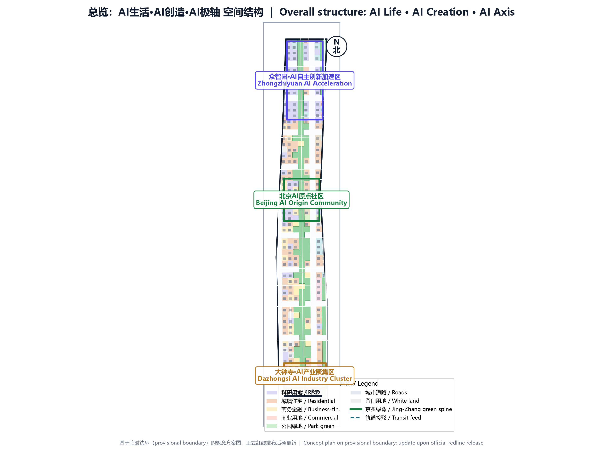
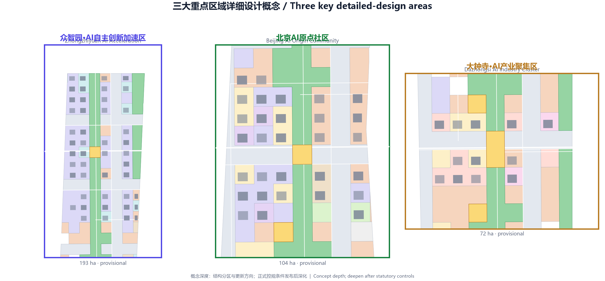
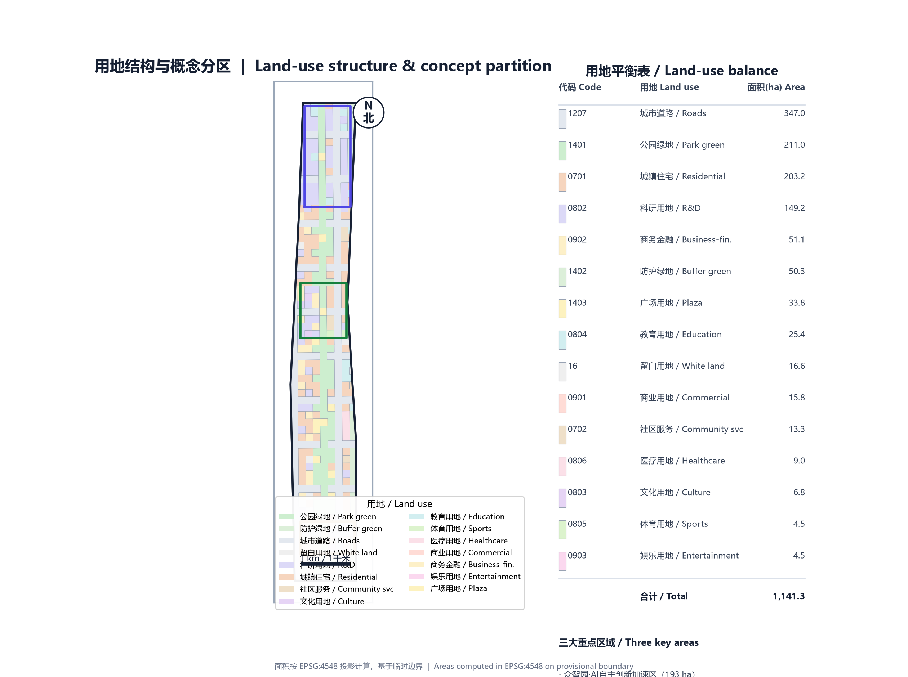
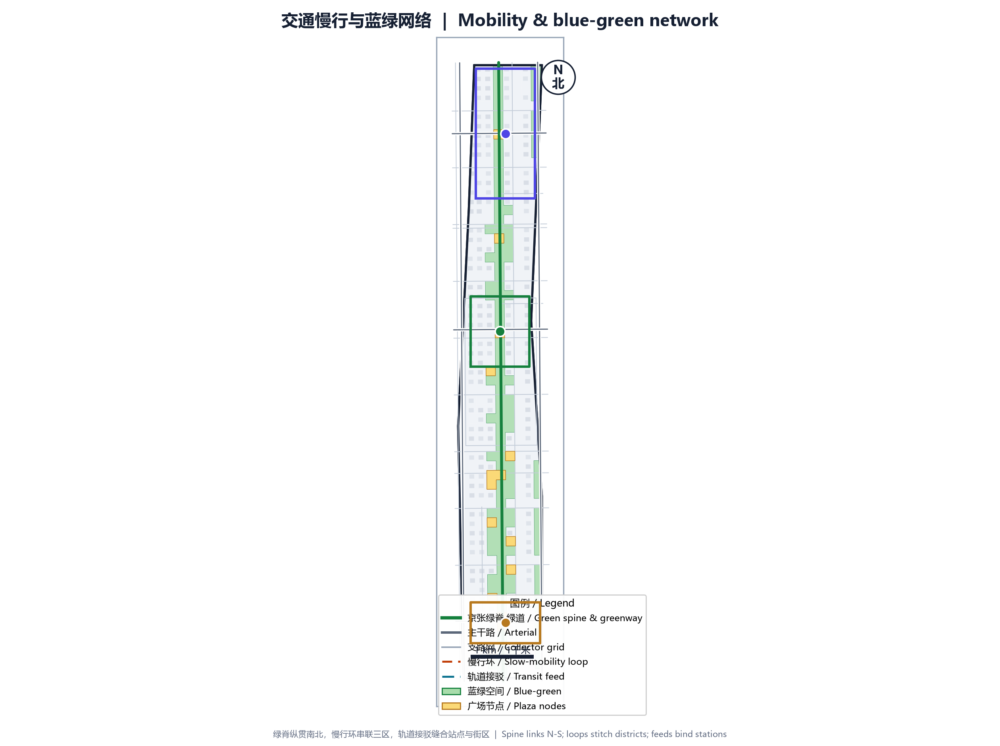
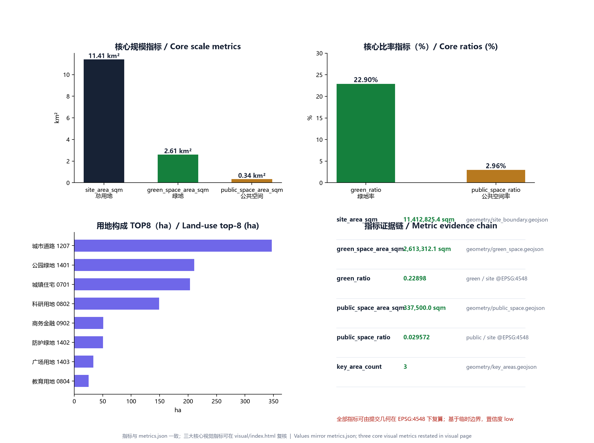

# AI Life · AI Creation · AI Axis — Centennial Jing-Zhang AI Innovation Belt Concept Plan

## Design Basis and Source List

This plan is prepared using the open-call file set released by open-city-ai/haidian for the Centennial Jing-Zhang AI Innovation Belt. Key sources include the three-level scope and eleven tasks in `design_brief.json`, the six agent tasks and ten co-creation principles in `agent_taskbook.json`, and the editable/locked layer definitions in `allowed_design_space.json` [source:SITE-PACKAGE]. Because official road redlines, ownership, municipal capacity, and heritage controls are not fully published, this concept design uses the provisional boundary `provisional_boundaries.geojson` supplied by the repository, and all area and ratio metrics are flagged as provisional with confidence=low [data:geometry/site_boundary.geojson#official_boundary=false].

On the standards side, the submission is cross-checked against the six standards listed in `standards.json`, including the Urban Design Administration Measures, Regulatory Detailed Planning Rules, and the land-use classification guide [standard:PROJECT-OFFICIAL-ANNOUNCEMENT]. Land-use codes follow the repository enum `brief/site-package/enums/land_use_codes.json` to remain comparable with official classifications [source:MNR-LAND-USE-CLASSIFICATION-GUIDE].

## Three-Level Scope Framework

The plan mirrors the open-call taskbook: the coordinated research area is about 43.6 km², the overall design area is about 11.4 km², and the key-area detailed design covers about 3.7 km² [metric:site_area_sqm]. In `geometry/site_boundary.geojson`, the provisional boundary PROV-SITE-001 projects to roughly 11.41 km² [metric:site_area_sqm], while the three key areas PROV-KEY-001/002/003 correspond to Zhongzhiyuan, Beijing AI Origin Community, and Dazhongsi [data:geometry/key_areas.geojson].

Methodologically, the coordinated research area answers the role of the AI Belt in the global innovation network; the overall design area answers how 11.4 km² can host AI life, creation, and the axis; and the key-area scale answers how the three districts can be detailed [depth:three_level_scope_framework]. All ranges are distinguished in GeoJSON by `geometry_role` and `official_boundary`, so they can be recalculated quickly once official statutory boundaries are released [data:geometry/constraints.geojson].

## Coordinated Research Area: Industry and Future City Research

The Jing-Zhang railway was the first trunk railway designed and built by China. It links Qinghe in the north to Xizhimen in the south, and is surrounded by Tsinghua, Peking University, CAS institutes, and leading tech firms [source:PROCESSED-FACT-PACK]. This plan proposes the narrative "Centennial Jing-Zhang AI (Love) Innovation Belt": the industrial-heritage linear space is converted into the AI-era "urban innovation spine," and the homophone "love" emphasizes that the spine serves human emotion, creativity, and daily life.

Industry research focuses on the AI innovation chain: source innovation, engineering, productization, scenario validation, and global dissemination. Within the coordinated research area, the north relies on Qinghe and Shangdi for large-model training, compute, and national platforms; the middle relies on universities for open-source communities, technology transfer, and talent housing; and the south relies on the Dazhongsi commercial district for AI consumption, agent commerce, and city-level scenario launches [source:AGENT-TASKBOOK]. Five to eight global cases are translated into local design strategies: Silicon Valley's innovation corridor for density and mixing, London King's Cross for railway-heritage revitalization, Seoul Digital Media City for content-industry and public-space integration, Singapore Punggol for integrated work-live-learn districts, and Montreal Mile-Ex for converting old industrial buildings into AI studios [source:SOURCE-REGISTRY].

## Overall Design Area: Urban Renewal and Regulatory-Plan-Level Urban Design

The overall design takes the Jing-Zhang railway heritage green spine as the north-south "AI Axis" and builds a spatial structure of "three districts, two wings, one belt, and multiple nodes." From north to south the three districts are: AI Creation (Zhongzhiyuan), AI Axis (Beijing AI Origin Community), and AI Life (Dazhongsi). The two wings extend east and west to connect the university research belt and the traditional residential-commercial belt, forming a closed loop from source innovation to axis transformation to life services [depth:overall_spatial_structure].

The land-use structure is given in `geometry/land_use.geojson` and covers 14 codes including R&D, residential, commercial, business, culture, education, healthcare, roads, green space, and plazas without overlap and without gaps [data:geometry/land_use.geojson]. Green and open-space land totals about 261 hectares, giving a green ratio of 22.898% [metric:green_ratio]. Public space (plaza land 1403) is about 3.38 hectares, giving a public-space ratio of 2.957% [metric:public_space_ratio]. Building footprints total about 104 hectares after union de-duplication, building density is about 9.13%, and total floor area is about 11.73 million m² [metric:building_density]. Road land accounts for about 30.4%, structured as arterials, collectors, slow-mobility loops, green-spine greenways, and transit feeds [data:geometry/roads.geojson].

At regulatory-plan depth, this stage provides land-use boundaries, leading functions, building-renewal directions, intended intensity, and height zoning. Plot-level index assignment will follow once official redlines, capacity, and ownership are clear [depth:development_intensity_controls].

## Detailed Design of Key Areas

### Zhongzhiyuan AI Innovation Acceleration Area

Zhongzhiyuan lies in the north of the site with a provisional area of about 1.93 km², carrying the "AI Creation" theme [metric:key_area_count]. It is positioned as a garden-style innovation district. It preserves industrial relics and low-density R&D buildings along Qinghe, and inserts national AI platforms, open-source labs, and model-evaluation centers. Spatial strategies include the Open-Source Release Hall and Urban Agent Sandbox along the green spine, and the University-Industry Transfer Living Room along east-west lanes [depth:detailed_design_key_areas]. Building renewal is mainly retention and adaptive reuse; a few inefficient factories are demolished for low-rise R&D courtyards. Heights are mostly 24–45 m, with key nodes up to 60 m [standard:MOHURD-ARCH-DESIGN-DEPTH-2016].

### Beijing AI Origin Community

The Beijing AI Origin Community is in the middle of the site with a provisional area of about 1.04 km², forming the core anchor of the "AI Axis" [data:geometry/key_areas.geojson]. It is positioned as a campus-adjacent transformation quarter that carries the conversion from papers and open-source code to prototype products. The spatial structure uses the Jing-Zhang green spine and a rail station as dual axes. Around the station a TOD mixed-use block integrates R&D, housing, commerce, culture, and plaza. The AI Origin Plaza is one of three "AI pilgrimage landmarks," hosting model releases, developer festivals, and public exhibitions [depth:detailed_design_key_areas].

### Dazhongsi AI Industry Cluster

The Dazhongsi district is in the south with a provisional area of about 0.72 km², carrying the "AI Life" theme [data:geometry/key_areas.geojson]. It is positioned as an urban intelligent-economy quarter that renews the traditional commercial district with agent stores, AI content consumption, data-asset exhibition, and AI talent apartments. Strategies include four-quadrant connectivity at intersections, a three-dimensional pedestrian network, green-space composite use, and a nighttime-economy vitality corridor. Dazhongsi Plaza is the second AI pilgrimage landmark, creating a cultural dialogue between the ancient bell tower and the new compute era [source:PROCESSED-FACT-PACK].

## AI Innovation Ecosystem, Personas, and AI+ Scenarios

The plan builds service scenarios around three personas. The first is "lab innovators"—university faculty, students, and researchers—who need quiet R&D space, fast technology-transfer channels, and low-cost prototype testing grounds. The second is "engineering entrepreneurs"—startups and tech firms—who need flexible offices, compute access, capital connections, and scenario validation. The third is "urban residents"—residents, commuters, and consumers—who need safe, convenient, AI-assisted daily services [source:AGENT-TASKBOOK].

The ten AI+ scenario cards are: 01 Open-Source Release Hall, 02 Urban Agent Sandbox, 03 Slow-Mobility Breakpoint Diagnosis, 04 Talent Life Concierge, 05 AI Safety Governance Gallery, 06 University-Industry Transfer Living Room, 07 Data-Asset Theater, 08 Low-Carbon Compute Station, 09 Jing-Zhang Memory Route, and 10 Global AI Activity Week Route. Each scenario specifies users, spatial location, data sources, privacy boundaries, human-review nodes, and potential operators. For example, the Urban Agent Sandbox is located at green-spine and plaza nodes, uses only public cameras and simulated data, and requires human review for key decisions [source:AGENT-TASKBOOK].

In addition, three AI pilgrimage landmarks are proposed: AI Origin Plaza, Dazhongsi AI Plaza, and the Open-Source Release Hall on the green spine. They are spatial anchors as well as AI cultural narrative and global dissemination nodes [depth:overall_spatial_structure].

## Land Use, Building Scale, and Retain-Renovate-Demolish Strategy

Land-use zoning and building renewal are fully submitted in `geometry/land_use.geojson` and `geometry/buildings.geojson`. R&D land (0802) is about 149 hectares, or 13.1% of the overall design area, forming the core carrier of innovation functions. Residential land (0701) is about 203 hectares to support talent communities and jobs-housing balance. Commercial and business land (0901/0902) is about 67 hectares to support life and industry services. Green and open-space land (14 series) is about 295 hectares [data:geometry/land_use.geojson].

Building-renewal strategy is divided into four types: retain, renovate, demolish, and build new. Good-quality buildings with compatible functions are retained; structurally sound but functionally mismatched buildings are renovated and repurposed; inefficient, unsafe, or public-space-blocking buildings are demolished; and key nodes in the key areas are built new. Renewal actions are tagged in `geometry/buildings.geojson` by `renewal_action_concept`, with 315 building footprints in total; the union of footprints is about 104 hectares [metric:building_footprint_area_sqm] [depth:retain_renovate_demolish].

## Transport, Rail, Municipal Infrastructure, and Public Services

The transport system proposes a slow-mobility-first structure of "one spine, one loop, many lanes, and many feeds." The spine is the Jing-Zhang greenway running north-south; the loop connects the three districts; the lanes are local streets at roughly 150 m spacing for block permeability; and the feeds are walking connections from rail stations and micro-transit hubs [data:geometry/roads.geojson]. Arterials preserve the existing skeleton, while local streets are controlled to 12–20 m width, prioritizing walking, cycling, and microcirculation [standard:MOHURD-URBAN-DESIGN-MEASURES].

Around rail stations and micro-hubs, TOD compact development is encouraged within a 500 m walking radius, with mixed land use and higher-intensity renewal. Parking is mainly accessory and shared, with public parking and drop-off bays to avoid large surface lots fragmenting blocks [depth:traffic_rail_slow_parking].

Municipal and public-service facilities are proposed as "distributed low-carbon compute stations" because official municipal capacity, utility tunnels, and facility points are not yet complete. These small buildings or landscape structures integrate edge compute, energy microgrids, restrooms, and emergency facilities along the green spine and plaza nodes. They must be rechecked after official municipal planning is released [assumption:assumptions.json].

## Blue-Green Network, Public Space, and Urban Character

The blue-green system centers on the Jing-Zhang railway heritage green spine, extending north to the Qinghe waterfront and south into the Dazhongsi urban park. The spine width is about 190 m, divided into a main greenway, rain gardens, community gardens, and flexible event lawns [data:geometry/green_space.geojson]. Public space consists of plaza land 1403, totaling 3.38 hectares, located at AI Origin, Dazhongsi, Zhongzhiyuan entrances, and transit micro-hubs [data:geometry/public_space.geojson].

Urban character follows the theme of "industrial heritage × AI future." The green spine preserves clues such as rails, switches, and signals, and covers them with light reversible modern structures. Buildings in key areas are mainly modern and restrained, with local landmarks allowed tech-forward forms. Night lighting prioritizes low-color-temperature functional lighting, with dynamic light art at landmark nodes [standard:MOHURD-URBAN-DESIGN-MEASURES].

## Renewal Projects, Implementation Policy, and Phasing

Implementation is divided into three phases. The near term starts from the Beijing AI Origin Community, leveraging universities and the rail station to build AI Origin Plaza, the University-Industry Transfer Living Room, and talent apartments, quickly forming an innovation atmosphere [data:geometry/phasing.geojson]. The medium term pushes north to Zhongzhiyuan, building the Open-Source Release Hall, Urban Agent Sandbox, and national-platform park, forming the "AI Creation" engine [data:geometry/phasing.geojson]. The long term completes the Dazhongsi AI Industry Cluster in the south, driving full intelligent renewal of the traditional commercial district to create an "AI Life" model [data:geometry/phasing.geojson].

Implementation policies include: a dual positive/negative list for AI scenarios; flexible zoning that allows R&D land to mix commerce and housing; a Centennial Jing-Zhang AI Innovation Belt urban-renewal fund; a government-enterprise-university district coordination platform; and inclusion of green-spine industrial heritage in a combined urban-renewal and cultural-protection list [source:AGENT-TASKBOOK].

## Metrics, Area Recalculation, and Compliance Matrix

The three core visual metrics of this package are site_area_sqm=11412825.386, green_ratio=0.22898, and public_space_ratio=0.029572 [metric:site_area_sqm] [metric:green_ratio] [metric:public_space_ratio]. All three can be recalculated from submitted geometry in EPSG:4548 and are published on `visual/index.html` through `data-value` attributes. The full metric structure is in `metrics.json`, where each metric records status, value, unit, source_files, formula, confidence, and assumptions [data:metrics.json].

The `compliance_matrix.json` covers 23 requirements from announcement sections 1.3, 1.4, 1.5 and agent.1–agent.6; `standard_matrix.json` covers six professional standards; and `design_depth_matrix.json` covers fifteen depth nodes [data:compliance_matrix.json] [data:standard_matrix.json] [data:design_depth_matrix.json].

## Risk, Copyright, and Compliance

Key risks include: mismatch between official and provisional redlines requiring recalculation; insufficient municipal capacity affecting high-intensity renewal; heritage and character controls limiting some building retrofits; data privacy and algorithmic explainability of AI scenarios requiring special review; and market volatility affecting long-term phasing. These risks are listed in `assumptions.json`, and targeted studies are recommended in later stages [assumption:assumptions.json].

Copyright: the submission text, code, geometry, and graphics are released under `license: CC-BY-4.0`; generative-model assistance is declared in `agent.json`. Fonts, symbols, and colors in images and PDFs are open-source or self-drawn and do not depend on externally copyrighted fonts [source:SOURCE-REGISTRY].

## References

Core references include: `brief/site-package/design_brief.json`, `brief/site-package/agent_taskbook.json`, `brief/site-package/allowed_design_space.json`, `brief/site-package/geometry/provisional_boundaries.geojson`, `brief/site-package/sources.json`, `data/source_registry.json`, the `schema` files, `standards/standards.json`, `templates/proposal.md`, and the skill documentation `skills/urban-design-ai-submission/SKILL.md` [source:SITE-PACKAGE] [source:AGENT-TASKBOOK] [source:SOURCE-REGISTRY].

All data references in this proposal can be verified against the JSON, GeoJSON, and HTML files in the submission package; provisional-boundary conclusions will be updated when official data is released. The detailed iteration log is in `changelog.md` (this is the first submission, v1.0.0).
