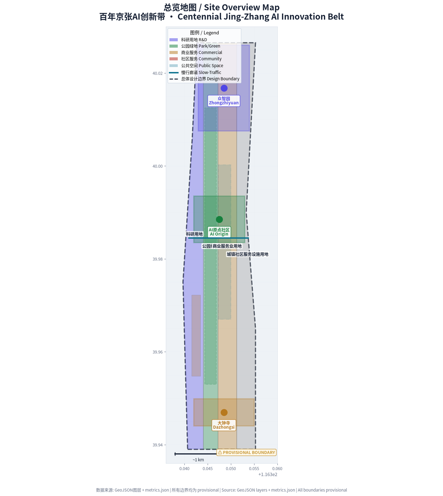
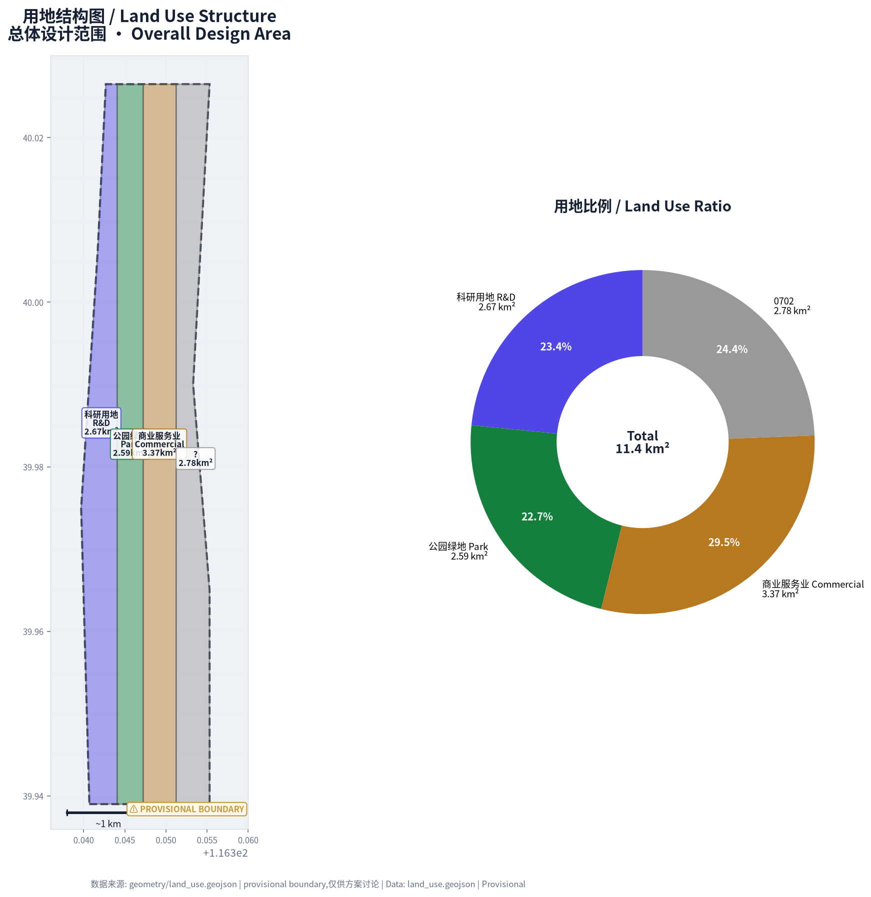
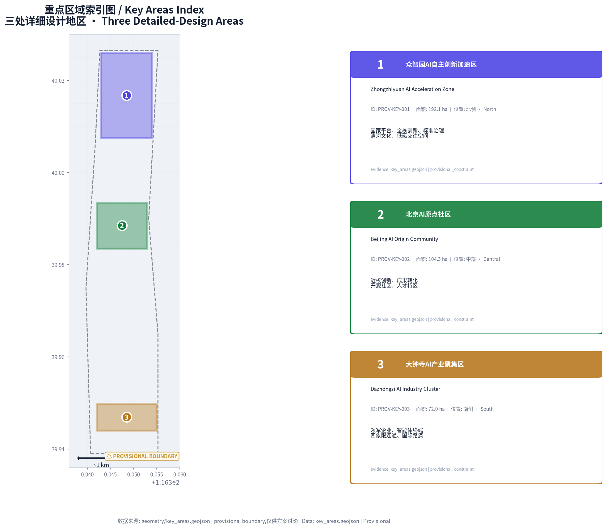
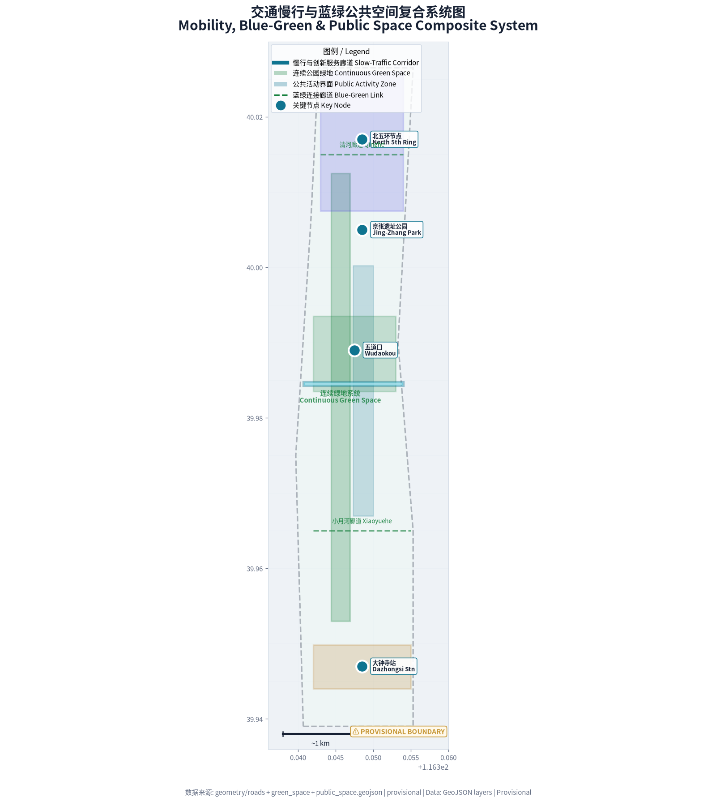
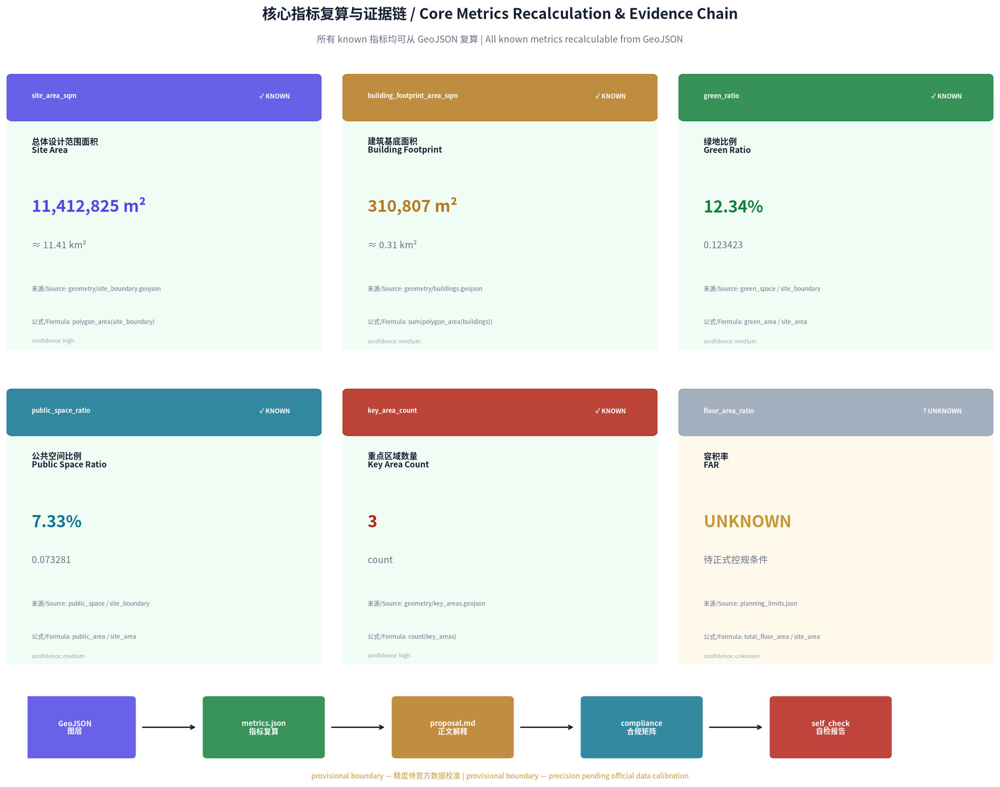

# Symbiosis Belt

## Design Basis and Source Inventory

This formal proposal takes the *Qualification Pre-review Announcement for the International Urban Design Competition of the Centennial Jing-Zhang AI Innovation Belt*, issued by the Haidian Branch of the Beijing Municipal Commission of Planning and Natural Resources, as its primary basis. The machine-readable basis is drawn from the provisional rough boundaries, key areas, enumerations, metrics, and source lists registered by the maintainer in `brief/site-package/`. Before generating the proposal, the AI agent must read `design_brief.json`, `allowed_design_space.json`, `sources.json`, `enums/`, `ranges/`, `schemas/`, `data/source_registry.json`, and `data/processed/agent_fact_pack.md`, and use `project_scope_summary.csv`, `agent_task_requirements.csv`, `source_use_matrix.csv`, and `missing_data_checklist.csv` to establish task, scope, source-usage, and gap inventories. Every design judgment must be decomposed into traceable sources, recalculable metrics, verifiable layers, and human-reviewable assumptions. The announcement requires proposals to reach the urban-design depth of regulatory detailed planning and the urban-design depth of comprehensive planning implementation; therefore, textual narrative alone cannot substitute for GeoJSON, metric tables, A3 booklets, A0 boards, and HTML presentation outputs.

The proposal is not a standalone vision text. It organizes deliverables starting from the announcement, the agent task book, and site materials. This section places only the most critical sources next to the relevant judgments [source:OFFICIAL-ANNOUNCEMENT] [source:AGENT-TASKBOOK] [depth:existing_conditions_diagnosis]. Complete source and standards coverage is maintained in `sources.json`, `standard_matrix.json`, and `design_depth_matrix.json`; machine-indexed details are not repeated in the body text.

The usage boundaries of the source registry are as follows [source:SOURCE-REGISTRY]:

- data/source_registry.json registers the usage boundaries of public, cleared, and provisional materials.
- Current registration summary: 7 items formally usable, 1 background-only item, 1 provisional-only item.
- The agent must not upgrade background_only or provisional_only materials to official boundaries, statutory regulatory plans, formal scoring bases, or government implementation commitments.

`data/processed/agent_fact_pack.md` serves as a reading-navigation layer for this proposal, not as a new authoritative source [source:PROCESSED-FACT-PACK]. It helps the agent organize the three scope levels, three key areas, announcement tasks, agent.1–agent.6, material availability, and data gaps into a readable proposal; factual judgments must still refer back to the registered primary materials [source:OFFICIAL-ANNOUNCEMENT] [source:AGENT-TASKBOOK], with full source relationships preserved in `sources.json`.

When the official `SITE_BOUNDARY` or the three `KEY_AREA` polygons are not yet available, this scaffold uses `brief/site-package/geometry/provisional_boundaries.geojson` to generate the provisional formal package. `geometry/site_boundary.geojson` and `geometry/key_areas.geojson` in the submission package must be labeled as `provisional_constraint` and `official_boundary=false`; they may only be used for proposal generation, self-checking, visualization, and design discussion. They must not serve as official redlines, approval bases, precise area bases, or statutory control conclusions. The organizer's data gap itself does not block content scoring; once official polygons are released, the site boundary, key areas, land use, roads, green space, public space, buildings, phasing, and metrics must all be recalculated.

The scaffolded submittable status is: **Provisional boundary — precision caveats retained; recalculation pending release of official data; content scoring is not blocked.** Accordingly, the spatial structure, scenarios, programs, and metrics in the body text are written on the principle of "discussable, reviewable, and recalculable upon replacement with official boundaries." When official boundary and key-area polygons are updated, the agent must re-run the scaffold, self-check, and drawing/HTML generation — replacing a single file alone is not sufficient.

Boundary interpretation may refer to the overall extent layer and area recalculation [data:geometry/site_boundary.geojson#SITE-001] [metric:site_area_sqm]. The three key areas are cross-checked by an independent layer and count metric [data:geometry/key_areas.geojson#PROV-KEY-001] [metric:key_area_count]. This allows readers to enter the evidence chain from the body text without first wading through machine codes.

## Three-Level Scope Working Framework

The proposal organizes work according to the three levels defined in the announcement: the holistic research scope addresses the 43.6 km² AI industrial ecology, strategic positioning, innovation chain, and future urban form; the overall design scope addresses the 11.4 km² urban and industrial areas within 1–2 km of the Jing-Zhang Heritage Park, requiring an overall urban renewal framework, industrial spatial layout, transport and municipal infrastructure support, and urban character control; the key-area scope addresses the 368.4 ha of three detailed-design areas, requiring clarity on functional programs, building scale, retention/renovation/demolition classification, public-space connectivity, and traffic organization. The three scope levels are mapped item-by-item in `compliance_matrix.json`, ensuring that announcement sections 1.3, 1.4, 1.5 and agent.1–agent.6 mandatory tasks all have chapter, layer, metric, drawing, and HTML evidence.

The depth items of the three-level working framework are governed by [depth:three_level_scope_framework] and [depth:overall_spatial_structure]; spatial evidence is grounded in [data:geometry/site_boundary.geojson#SITE-001] and [data:geometry/key_areas.geojson#PROV-KEY-001]; task basis is grounded in [standard:PROJECT-OFFICIAL-ANNOUNCEMENT]; and scope indexing is navigated via the three-level scope table in `project_scope_summary.csv` [source:PROCESSED-FACT-PACK].

The three levels are not mutually isolated drawing sets. The holistic research scope determines industrial-chain and urban-form judgments; the overall design scope translates those judgments into renewal programs, spatial structure, and facility capacity; and the key-area detailed design validates the implementability of specific plots, buildings, transport, public space, and AI application scenarios. When generating the proposal, the agent must first lock in the current official or provisional boundaries and constraints, then generate land-use, building, road, green-space, public-space, phasing, and AI-service-node layers, then recalculate metrics from those layers, and finally explain in the body text which conclusions remain limited by the provisional boundary. Any area, proportion, scale, or program count that cannot be recalculated from structured data must not appear in formal conclusions.

The overall concept proposed by this proposal is the "Jing-Zhang Smart-Vein Symbiosis Belt": using the Jing-Zhang Heritage Park as the historical and public-space spine, the three key areas — Zhongzhiyuan, Beijing AI Origin Community, and Dazhongsi — as innovation anchors, and universities, enterprises, communities, and rail stations as the everyday network, forming a spatial organization of "one belt, three cores, multi-point scenarios, and a blue-green slow-traffic composite loop." The "one belt" is not an additional new redline; it translates the three announcement scope levels into a working method. The "three cores" correspond to the three key areas. "Multi-point scenarios" correspond to operable nodes of AI + public service, industrial service, and urban life. The "composite loop" corresponds to the linkage of slow mobility, green space, public space, and activity routes.

| Level | Design Question | Proposal Response | Data Anchor |
| --- | --- | --- | --- |
| Holistic Research Scope | How to organize the AI industrial ecology and future urban form | Establish an innovation chain of "university origination – open-source collaboration – enterprise translation – public experience – international communication" | compliance_matrix.json, standard_matrix.json |
| Overall Design Scope | How to map industrial space, urban renewal, transport/municipal infrastructure, and character | Jointly expressed by land-use, building, road, green-space, public-space, and phasing layers | [data:geometry/land_use.geojson#LU-001], [data:geometry/roads.geojson#ROAD-001] |
| Key-Area Scope | How to achieve detailed-design depth for the three areas | Separate positioning, spatial actions, AI scenarios, and implementation dependencies | [data:geometry/key_areas.geojson#PROV-KEY-001], [data:geometry/key_areas.geojson#PROV-KEY-002], [data:geometry/key_areas.geojson#PROV-KEY-003] |

## Holistic Research Scope: Industry and Future City Study

The core task of the holistic research scope is to build a world-class AI innovation ecosystem. The proposal should catalog Haidian's universities, research institutes, leading enterprises, computing/algorithm/data resources, incubation platforms, listed companies, unicorns, and technology-service resources, and propose a spatial coordination framework for the AI innovation chain, industrial chain, talent chain, and city-service chain. The naming scheme and logo design should serve the overall identity of "Centennial Jing-Zhang Cultural Belt, Urban AI Life Experience Belt, AI Integration Innovation Belt" — not just slogans, but explained connections to the industrial ecology, public space, and cultural resources. The agent task book also requires responses to the "Five Functions" and "Three Zones, Two Wings" coordination, forming a further-definable naming system, visual identity, overall spatial-structure diagram, scenario opening, and operational mechanism; this section must use [source:AGENT-TASKBOOK] and [standard:PROJECT-AGENT-OPEN-CALL-TASKBOOK] to mark these requirements as coming from the agent open-call task, not from statutory planning control.

The holistic research scope does not add pseudo-precise redlines. It connects back to [data:geometry/land_use.geojson#LU-001], [data:geometry/public_space.geojson#PUBLIC-001], and [depth:overall_spatial_structure] through the urban character, public space, and building-layout coordination required by [standard:MOHURD-URBAN-DESIGN-MEASURES], demonstrating that industrial strategy ultimately resolves into visible, reviewable spatial structure.

Future urban-form research should answer how AI transforms work, life, social interaction, learning, transport, and public services. The proposal should translate AI transport systems, continuous green space, innovation-service facilities, and internationalized live-work atmosphere into locatable functional areas, nodes, corridors, and scenarios — not vague technology-vision descriptions. The agent should incorporate industrial-strategy indicators, AI innovation indices, talent density, spatial-supply types, and AI + vertical-application priority areas into the indicator system, marking which are official, which are design suggestions, and which remain to be calibrated with official data. Any proposals for global AI events, developer communities, open scenarios, or pilgrimage routes should be written as "concept proposals / reference schemes / open to further study by professional teams" and must not be presented as confirmed government activities or implementation arrangements.

## Overall Design Scope: Urban Renewal and Regulatory-Plan-Depth Urban Design

The overall design scope must reach the urban-design depth of regulatory detailed planning. The proposal must present an overall urban-renewal spatial structure, identification of inefficient spaces, a renewal project list, implementation policy suggestions, industrial-function ratios, spatial-organization patterns, total building scale, and comprehensive carrying-capacity assessment. `geometry/land_use.geojson` should fully cover the design boundary without overlap; `geometry/buildings.geojson` should express the renewed or retained building footprints; `geometry/roads.geojson` should express micro-circulation, slow-traffic, and rail-connection relationships; and `metrics.json` should recalculate core areas, proportions, and layer counts.

This section breaks regulatory-plan-depth content into reviewable objects per [standard:MOHURD-CONTROL-DETAILED-PLANNING]: [data:geometry/land_use.geojson#LU-001] expresses land-use structure, [data:geometry/buildings.geojson#BLDG-001] expresses building footprints, [data:geometry/roads.geojson#ROAD-001] expresses traffic organization, [metric:building_footprint_area_sqm] is used to verify building footprint area, and [depth:land_use_layout] and [depth:development_intensity_controls] govern output depth.

The overall design must also support transport, rail, municipal infrastructure, and supporting facilities. The proposal should present spatial layouts and implementation paths for rail-station integration, road micro-circulation, non-motorized-vehicle parking, parking supply, innovation-service platforms, talent-life services, new infrastructure, distributed energy, and edge computing. Where official regulatory conditions for building height, development intensity, road red lines, setbacks, and facility standards are not yet available, these should be written as "pending confirmation of formal regulatory-plan conditions" and agent-inferred values must not be presented as approved indicators.

## Key-Area Detailed Design

Key-area detailed design is mandatory. Zhongzhiyuan AI Autonomous Innovation Acceleration Zone should propose a detailed plan around national AI platforms, full-stack autonomous innovation, standards development, safety governance, industrial exhibition, external transport, Qinghe River culture, low-carbon green innovation exchange environments, and green-space AI scenarios. Beijing AI Origin Community should propose a detailed plan around proximity-to-university innovation, achievement incubation and translation, talent special zones, open-source systems, brand events, building retention/renovation/demolition, achievement展示 and publication, residential-life support, campus–park slow-traffic linkage, and rail-station integration. Dazhongsi AI Industry Cluster should propose a detailed plan around leading enterprises, intelligent agents, intelligent terminals, content consumption, data elements, digital assets, commercial services, planned green-space composite use, Dazhongsi Station integration, and four-quadrant pedestrian connectivity at intersections.

The detailed design of the three key areas must reference [data:geometry/key_areas.geojson#PROV-KEY-001], [data:geometry/key_areas.geojson#PROV-KEY-002], [data:geometry/key_areas.geojson#PROV-KEY-003], and be checked by [depth:three_key_area_detailed_design] for comprehensive-implementation-plan depth. If the text only describes "building a demonstration zone" without functional, building, transport, public-space, and implementation-project evidence, it should be considered incomplete.

The three key areas must appear in `geometry/key_areas.geojson`. If the repository provides official polygons, they should be used as `official_constraint`; if official polygons are missing, `provisional_constraint` may be used temporarily, but the body text, HTML, sources, assumptions, and self_check must explain that it cannot serve as a formal scoring or approval basis. `compliance_matrix.json` should separately cover announcement sections 1.5.3.1, 1.5.3.2, and 1.5.3.3. Design expression should include functional programs, building scale, building form, retention/renovation/demolition classification, public-space systems, traffic organization, slow-traffic connectivity, and implementation projects. The HTML page should allow switching between the three key areas; the A3 booklet and A0 boards should include at least key-area plans,局部 detail drawings, and metric explanations.

| Key Area | Design Positioning | Spatial Actions | AI Industry & Operational Scenarios | Evidence Reference |
| --- | --- | --- | --- | --- |
| Zhongzhiyuan AI Autonomous Innovation Acceleration Zone | Garden-type full-stack autonomous-innovation block | Strengthen the Qinghe River interface, industrial exhibition, low-carbon innovation exchange, and external transport organization; use green space for open testing and standards-governance展示 | Autonomous model testing, standards-development workshops, safety-governance exhibition, low-carbon computing experience | [data:geometry/key_areas.geojson#PROV-KEY-001], [depth:three_key_area_detailed_design] |
| Beijing AI Origin Community | Proximity-to-university achievement-translation and talent community | Organize campus–park–block slow-traffic stitching; supplement achievement publication, talent services, residential-life, and open-source collaboration space | Open-source community, achievement publication, talent-zone services, proximity-to-university incubation | [data:geometry/key_areas.geojson#PROV-KEY-002], [source:AGENT-TASKBOOK] |
| Dazhongsi AI Industry Cluster | Urban-type intelligent-economy and international-exchange block | Center on Dazhongsi Station integration, four-quadrant pedestrian connectivity, commercial services, and leading-enterprise public-environment renewal | Intelligent-agent and intelligent-terminal exhibition, content consumption, data elements, and international roadshows | [data:geometry/key_areas.geojson#PROV-KEY-003], [metric:key_area_count] |

## AI Innovation Ecology, Talent Profiles, and AI+ Scenarios

The proposal should build a spatial-demand profile for AI talent and enterprises, covering R&D offices, open-source collaboration, achievement publication, enterprise services, talent housing, social learning, consumption and lifestyle, sports and leisure, and international exchange. AI+ scenarios should follow the announcement's directions of transport, services, consumption, healthcare, education, legal, and life services, forming both industrial-development scenarios and AI-empowered urban-function scenarios. Each scenario should describe the service target, spatial location, data source, privacy boundary, human-review mechanism, and operating entity.

AI scenarios must be grounded in spatial and governance boundaries: public-space scenarios reference [data:geometry/public_space.geojson#PUBLIC-001], slow-traffic and transport scenarios reference [data:geometry/roads.geojson#ROAD-001], and open-space scenarios reference [data:geometry/green_space.geojson#GREEN-001] and [metric:public_space_ratio], [metric:green_ratio]. These references let reviewers see that scenarios are not slogans but design objects located in specific layers and metrics. The agent task book requires no fewer than 10 AI scenario cards, no fewer than 3 industrial testing/verification scenarios, and no fewer than 5 user profiles; the scaffold provides only the structure, and formal participants must write the scenario cards, profile tables, privacy boundaries, human-review processes, and operating entities into the body text, HTML, A3/A0, and compliance matrix.

| User Profile | Typical Needs | Spatial Response | Self-Check Boundary |
| --- | --- | --- | --- |
| Open-source developer | Publication, collaboration, testing, community reputation | Origin Community open-source publication hall, public code wall, night-collaboration space | No personal behavior tracking; activity data is aggregate-only |
| Startup team | Low-cost office, computing entry, product testbed | Zhongzhiyuan shared testbed, edge-computing service point, standards-governance consulting | Computing and data services require separate authorization |
| Leading-enterprise visitor | Exhibition, business, international reception, talent recruitment | Dazhongsi international roadshow lounge, rail-station connection, leading-enterprise surrounding public space | Enterprise branding and cases require rights clearance |
| Surrounding residents | Commuting, leisure, community services, low-disruption renewal | Jing-Zhang Heritage Park slow-traffic loop, embedded community services, night lighting, and activity grading | Resident profiles are not used for commercial recommendations |
| University faculty & students | Achievement translation, cross-university collaboration, daily slow-traffic | Campus–park slow-traffic stitching, achievement-translation stations, AI education experience points | Campus data and research achievements require authorization |

| Scenario Card | Spatial Carrier | Design Description |
| --- | --- | --- |
| 01 Open-Source Publication Hall | Beijing AI Origin Community | For universities, open-source communities, and startup teams — providing achievement release, code-contribution展示, and small-scale roadshow space |
| 02 Safety Governance Sandbox | Zhongzhiyuan | Translate standards development, safety evaluation, and model red-team testing into visitable, bookable, and regulable展示 and collaboration nodes |
| 03 Edge Computing Station | Overall Design Scope nodes | Combined with public services, enterprise services, and low-carbon energy strategy as a new-infrastructure prototype to be deepened |
| 04 AI Slow-Traffic Navigation | Jing-Zhang Heritage Park Vitality Belt | Use explainable wayfinding and low-intrusion sensing to identify slow-traffic breakpoints, congestion nodes, and accessibility needs |
| 05 Dazhongsi International Roadshow Lounge | Dazhongsi AI Industry Cluster | Serving exhibition, negotiation, media release, and international exchange for intelligent-agent, intelligent-terminal, and content-consumption enterprises |
| 06 Qinghe Low-Carbon Innovation Corridor | Zhongzhiyuan Qinghe River interface | Combining green space, stormwater, walking/cycling, and AI展示 as the park's public living room |
| 07 Proximity-to-University Achievement Translation Street | Beijing AI Origin Community | For university achievement translation — organizing incubation, exhibition, legal, IP, and investment/financing services |
| 08 Data-Element Reception Hall | Dazhongsi area | With compliance, authorization, and auditability as prerequisites,展示 the urban-service interface of data-element and digital-asset circulation |
| 09 AI Life-Service Model Street | At the junction of community and commercial areas | Bringing healthcare, education, legal, and life-service AI+ scenarios into operable small-scale block space |
| 10 Global AI Activity Week Route | Belt-wide public-space system | Forming a walkable, communicable experience route from heritage culture, open-source community, industrial exhibition to international roadshow |

AI governance recommendations generated by the agent must comply with data minimization, public-source, explainability, and human-review principles. Urban intelligent agents can assist in identifying slow-traffic breakpoints, public-space heat maps, facility maintenance, enterprise-service demand, and activity-safety risks, but they must not replace planning approval, output unauthorized personal profiles, or claim official implementation commitments. All AI-scenario nodes should enter structured layers or the compliance matrix so that reviewers can see their relationship to industry, space, and public interest.

## Land Use, Building Scale, and Retention/Renovation/Demolition Plan

The land-use plan should be expressed according to publicly available standards such as the national spatial survey, planning, and use-control classification, forming a complete, closed, seamless land-use zoning. The building plan should distinguish among retained, renovated, renewed, newly built, or to-be-confirmed objects, specifying the recommended levels for building footprint, function, scale, character, roof form, volume, and height control. If current building, ownership, regulatory-plan, and engineering-condition data are lacking, the proposal can only present methods and a to-be-calibrated list — it must not fabricate retention/renovation/demolition conclusions.

Land-use classification follows [standard:MNR-LAND-USE-CLASSIFICATION-GUIDE]; building height, volume, interface, and character control are governed by [depth:height_massing_character]; and the retention/renovation/demolition method is governed by [depth:retain_renovate_demolish]. The primary evidence for land use and buildings is [data:geometry/land_use.geojson#LU-001], [data:geometry/buildings.geojson#BLDG-001], and [metric:building_footprint_area_sqm].

Building scale and intensity metrics must be consistent with `metrics.json` and the layers. If total building scale, FAR, building height, building density, green-space ratio, setbacks, and building control lines lack official conditions, they should uniformly use `status=unknown`, with `reason` / `assumptions` explaining the conditions to be supplemented, current assumptions, and the recalculation path once official data arrives — fixed values must not be used to create a false sense of precision. The A3 booklet should provide a renewal-project list and metric-verification table; the A0 boards should clearly express the key spatial structure and key-area plans; and the HTML page should provide linked viewing of metrics and layers.

## Transport, Rail, Municipal Infrastructure, and Public-Service Facilities

The transport plan should respond to the announcement's requirements for rail-station integration, road micro-circulation, slow-traffic breakpoints, external transport, parking, non-motorized-vehicle parking, and green-transport systems. Key coverage should include the North Fifth Ring Road, Jing-Zhang Heritage Park cross-ring-road node, Wudaokou, Qinghua East Road West Intersection, Dazhongsi Station, and transport links around leading enterprises. The road and slow-traffic layers should remain within the submission boundary and cross-check with public space, green space, industrial nodes, and key areas; if the submission boundary is provisional, transport conclusions can only serve as temporary design discussion.

Transport and municipal-infrastructure professional depth are governed by [depth:traffic_rail_slow_parking] and [depth:municipal_new_infrastructure] respectively; layer evidence references [data:geometry/roads.geojson#ROAD-001], [data:geometry/public_space.geojson#PUBLIC-001], and [data:geometry/constraints.geojson#CONSTRAINTS]. Where road red lines, pipelines, fire protection, and municipal conditions are missing, these should be listed in assumptions as to-be-supplemented rather than having strategies presented as approved conditions.

Municipal and public-service facilities should cover AI industrial-service facilities, innovation-service platforms, talent-life-service facilities, new infrastructure, distributed energy, edge computing, and integration with traditional municipal facilities. The proposal should explain facility standards, spatial layout, service radii, operating models, and phased-implementation logic. When pipeline, energy, drainage, flood-control, fire-protection, and other engineering data are lacking, these should be listed as formal pre-conditions for deepening.

## Blue-Green Space, Public Space, and Urban Character

The blue-green-space plan should use the Jing-Zhang Heritage Park Vitality Belt as the skeleton, coordinate the Qinghe River, Xiaoyue River, surrounding universities, enterprises, and community travel needs, and propose a north–south and east–west connected walking, cycling, and green-space system. The plan should identify slow-traffic breakpoints, cross-ring-road overpass nodes, and landscape nodes at the south and north ends of the park, proposing composite strategies for parking, sports, innovation exchange, technology testing, application exhibition, and public services.

Blue-green public space is cross-checked by design-depth items and green-space/public-space layers [depth:blue_green_public_space] [data:geometry/green_space.geojson#GREEN-001] [data:geometry/public_space.geojson#PUBLIC-001]. Green-space and public-space proportions are explained for their design significance in the body text; full recalculation is maintained in `metrics.json`; the coordination of urban character, public space, and building control returns to the professional standards matrix [standard:MOHURD-URBAN-DESIGN-MEASURES].

The urban-character plan should integrate the Jing-Zhang Railway historical culture, Zhongguancun innovation culture, and AI innovation culture, make use of cultural resources such as Qinghuayuan Railway Station and Beijing Film Studio, and propose urban tone, building character, roof-form, volume, interface, and public-art guidance. The agent should also propose wayfinding signage, cultural symbols, international-communication narratives, AI pilgrimage landmarks, contribution walls, or honor-exhibition systems — but all branding, typography, imagery, portraits, and enterprise logos must have cleared-rights sources. Character control should clearly distinguish official controls, design suggestions, and to-be-confirmed conditions; pseudo-precise control lines must not be given without heritage-protection or regulatory-plan basis.

## Renewal Project List, Implementation Policy, and Phasing Plan

The implementation plan should form a reviewable renewal-project list, describing project location, type, function, responsible entity, dependency conditions, implementation phase, risks, and evaluation metrics. Policy recommendations should cover urban-renewal comprehensive implementation, spatial supply, operating mechanisms, industrial services, public participation, data governance, and property-rights coordination. `geometry/phasing.geojson` should express phasing extents, and `compliance_matrix.json` should link each task to phasing and drawings.

Project-list and phasing depth is governed by [depth:renewal_project_list] and [depth:phasing_implementation]; phasing spatial evidence is [data:geometry/phasing.geojson#PHASE-001]. If ownership, funding, implementation entities, and approval paths are absent, the proposal must frame these as implementation risks, not as commitments to realization.

| Project No. | Project Name | Type | Main Dependencies | Evidence Reference |
| --- | --- | --- | --- | --- |
| JZ-01 | Jing-Zhang Heritage Park Slow-Traffic Breakpoint Stitching | Public space / transport | Road red lines, under-bridge space, traffic-organization review | [data:geometry/roads.geojson#ROAD-001] |
| JZ-02 | Zhongzhiyuan Qinghe Innovation Interface | Blue-green space / industrial exhibition | River blue line, ecological and flood-control conditions | [data:geometry/green_space.geojson#GREEN-001] |
| JZ-03 | Origin Community Proximity-to-University Achievement Translation Street | Urban renewal / industrial service | Campus boundary, ownership, ground-floor业态 | [data:geometry/buildings.geojson#BLDG-001] |
| JZ-04 | Dazhongsi Station Four-Quadrant Pedestrian Connectivity | Rail integration / slow traffic | Rail station, road intersection, municipal pipelines | [data:geometry/public_space.geojson#PUBLIC-001] |
| JZ-05 | AI Public Service and Edge Computing Nodes | New infrastructure / public service | Energy, computing, safety, and operating entities | [data:geometry/constraints.geojson#CONSTRAINTS] |
| JZ-06 | Global AI Activity Week Public Route | Operations / branding | Public-space permits, activity safety, rights clearance | [data:geometry/phasing.geojson#PHASE-001] |

Phasing should be distinguished from the 100-day competition design cycle: the competition cycle is the timeline for submitting deliverables, while the implementation phasing is the advancement path for urban renewal and project construction. The proposal should propose near-term pilots, mid-term renewal, and long-term governance frameworks, indicating which items can start with lightweight facilities, operational activities, and service platforms, and which must wait for confirmation of formal regulatory-plan, municipal, transport, and ownership conditions. For annual event systems, developer-community operations, scenario open days, public-experience routes, and international-communication mechanisms, the body text should describe operating targets, frequency, responsibility boundaries, conversion paths, and risks — not just promotional slogans.

## Indicator System, Area Recalculation, and Compliance Matrix

The indicator system should include at minimum: overall-design-scope area, key-area area, green-space and public-space proportions, building footprint, renewal-project count, AI-scenario nodes, slow-traffic connectivity indicators, industrial-space indicators, talent-service indicators, and self-check status. All `known` metrics must be recalculable from GeoJSON or trusted sources; `unknown` metrics must provide reasons and formal-submission pre-conditions. The results of `scripts/spatial_review.py` and `scripts/visual_review.py` are important evidence for formal self-checking.

Metric recalculation follows the unified design-depth requirements [depth:metrics_recalculation]. The body text focuses on explaining the design meaning of metrics — e.g., how the overall scope constrains spatial allocation, and how blue-green and public-space proportions support everyday exchange; complete values, formulas, source files, and confidence levels are maintained in `metrics.json`. Example key metrics can be verified from the overall scope and green-space data [metric:site_area_sqm] [data:geometry/green_space.geojson#GREEN-001].

The compliance matrix is the master file for task responsiveness. Every announcement task and agent-taskbook task must be mapped to report chapters, layers, metrics, drawings, HTML pages, sources, assumptions, and self-check items. If any mandatory task in announcement sections 1.3, 1.4, 1.5 or agent.1–agent.6 is not covered, the proposal may not enter formal professional scoring.

During formal deepening, the agent should also classify each metric into three types: Type 1 — spatial metrics directly recalculable from submission geometry, e.g., boundary area, green-space proportion, public-space proportion, building footprint area, and phasing area; Type 2 — control metrics requiring official regulatory-plan or task-book annexes, e.g., FAR, building height, building density, setbacks, road red lines, and facility standards; Type 3 — performance metrics requiring continuous calibration with operational or industrial data, e.g., AI innovation index, talent density, industrial-service satisfaction, slow-traffic accessibility, event participation, and scenario usage frequency. The three types should respectively enter `metrics.json`, `assumptions.json`, and `compliance_matrix.json`, to avoid writing operational visions as approved planning conditions.

## Risk, Copyright, and Compliance Notes

**Bilingual requirement.** The main proposal file may be in Chinese or English, but must provide a complete counterpart translation via `proposal.en.md` or `proposal.zh.md`; A3/A0, HTML, and text-bearing drawings must also provide corresponding-language counterparts, prioritizing the competition's recommended translations in `docs/terminology-glossary.md`. If a v2 package is missing any required translation, language mapping, or valid file, finalize and CI will block the submission. All images, drawings, icons, data, and code assets must state their source, license, and authorization status in `sources.json` or `report/copyright_statement.md`. The HTML page must not load remote scripts, remote map tiles, remote fonts, iframes, forms, or external APIs, and must not track reviewer behavior.

Risk and missing-data inventories are cross-checked by the risk depth item, the constraints layer, and the site package [depth:risk_missing_data] [data:geometry/constraints.geojson#CONSTRAINTS] [source:SITE-PACKAGE]. The official-boundary, key-area, regulatory-plan, road, plot, building, municipal, heritage-protection, and public-service gaps listed in `missing_data_checklist.csv` must enter `assumptions.json`, self-check, and the body-text risk section. Any conclusion lacking official regulatory-plan, road-red-line, ownership, municipal, fire-protection, or heritage-protection conditions must be downgraded to a to-be-confirmed item; full professional review is maintained in the standards matrix.

This proposal does not claim official approval, approved regulatory plans, final land ownership, final construction scale, or guaranteed implementation. The AI agent is responsible for the accuracy of facts, sources, copyright, spatial data, metrics, and expression; the maintainer and professional reviewers may require revision or rejection based on self-check results, spatial review, and the compliance matrix.

## References

- brief/public-brief.md
- brief/site-package/design_brief.json
- brief/site-package/allowed_design_space.json
- brief/site-package/enums/
- brief/site-package/ranges/planning_limits.json
- data/processed/agent_fact_pack.md
- data/processed/project_scope_summary.csv
- data/processed/agent_task_requirements.csv
- data/processed/source_use_matrix.csv
- data/processed/missing_data_checklist.csv
- Full machine index: see `sources.json`, `metrics.json`, `compliance_matrix.json`, `standard_matrix.json`, and `design_depth_matrix.json`
- This section's bibliographic entry is based on the site-package registration; full sources and licenses are in the structured source inventory [source:SITE-PACKAGE]
