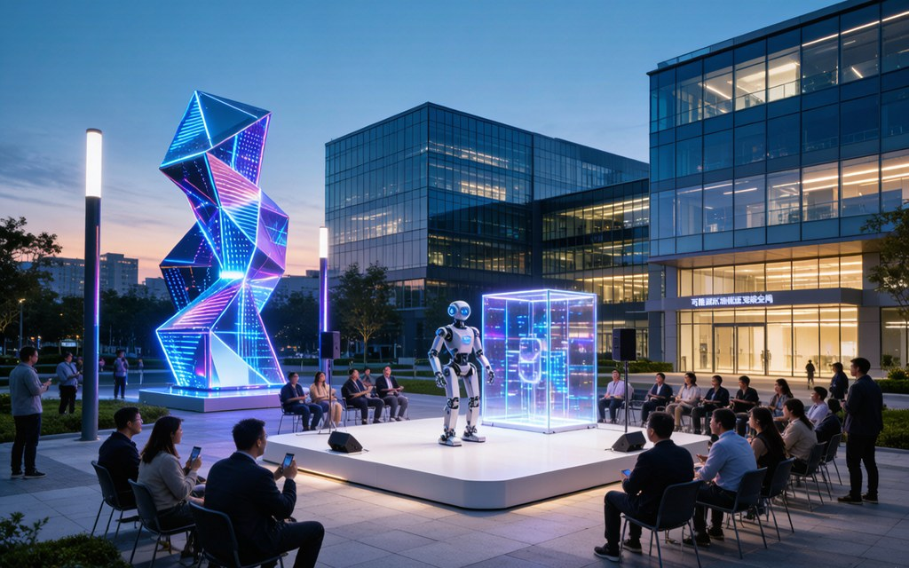
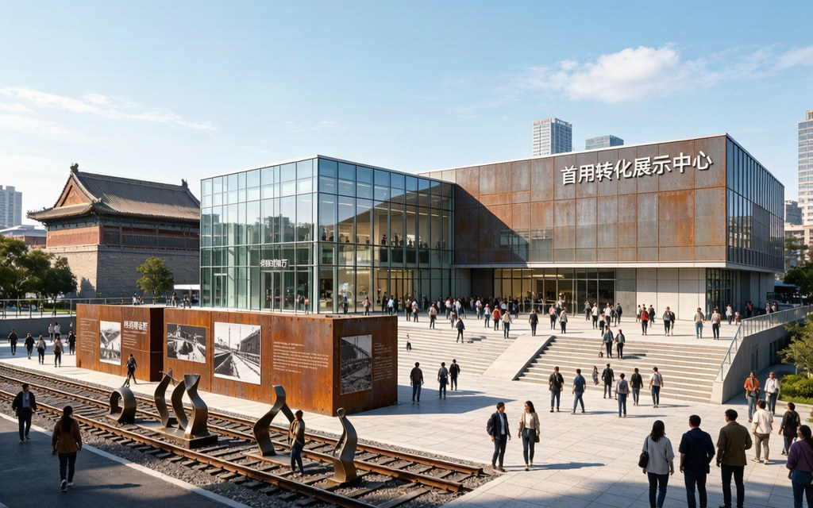
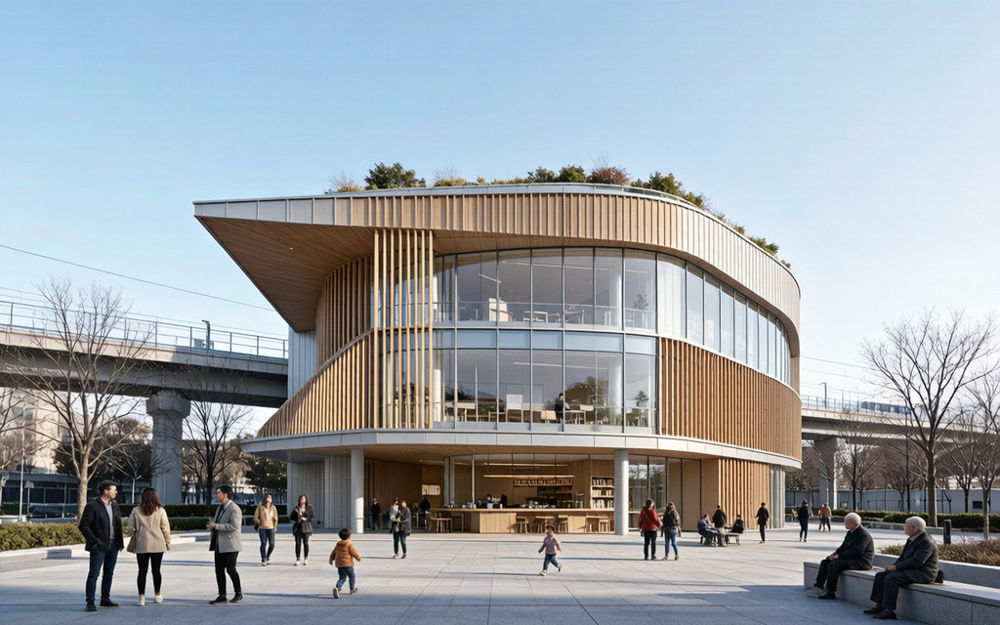
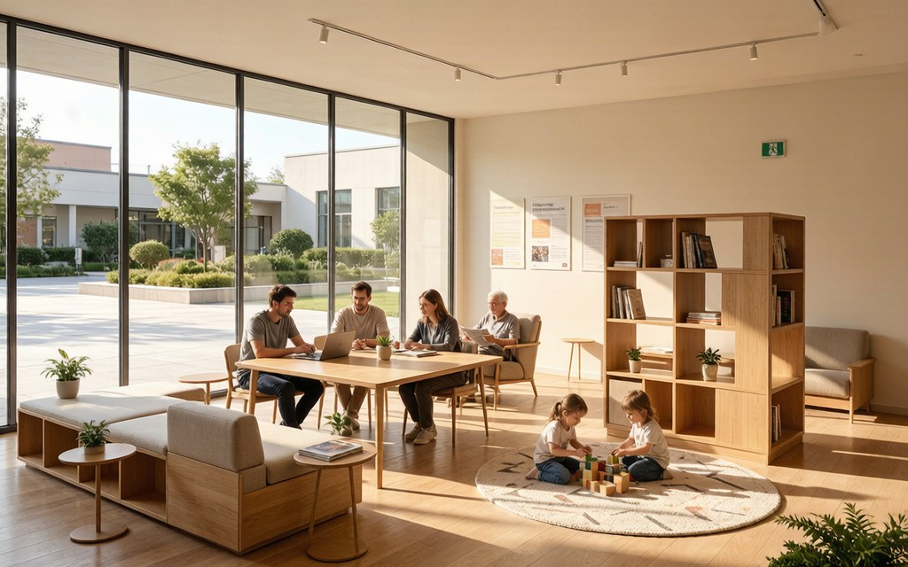
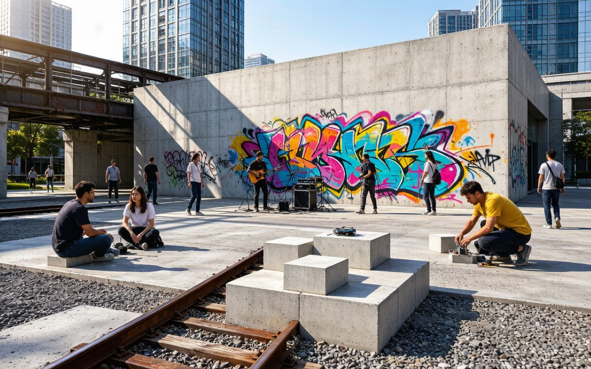
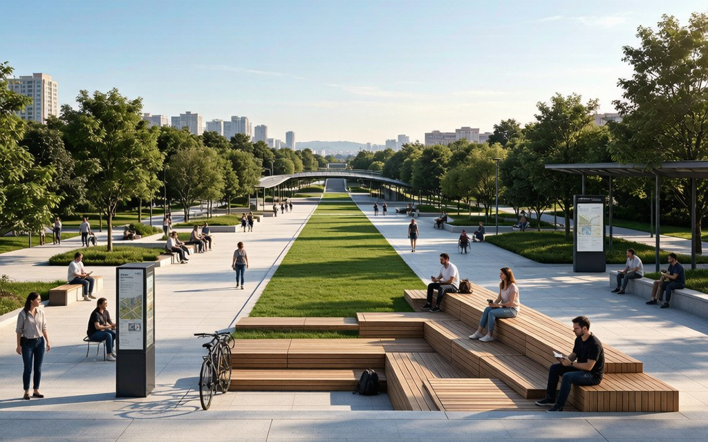
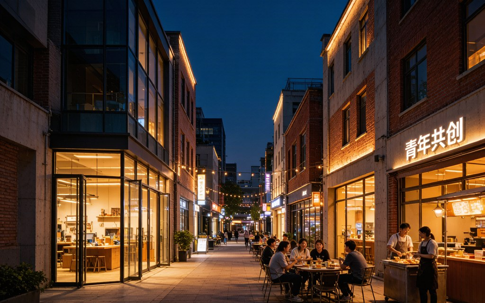
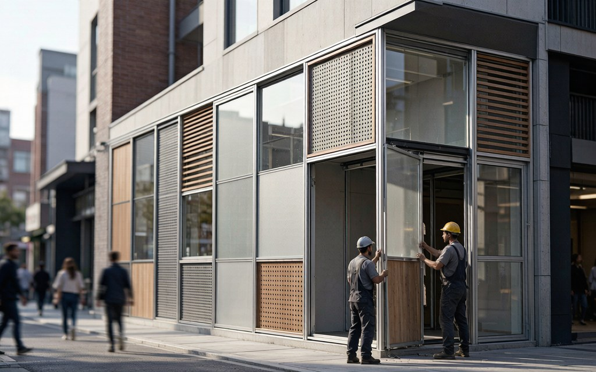
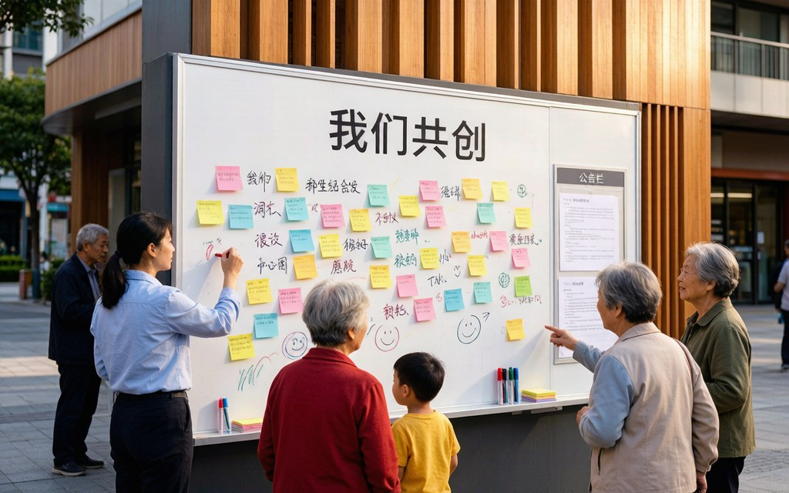

# 补充概念文档（Supplementary Narrative）

> 本文件为"智·脉 — 京张青年AI创享带"提交包的补充概念文档：《百年京张AI（爱）创新带概念规划》。它以"AI（爱）"双关与"创新公地"理论为框架，对同一场地提出的另一层概念演绎，与主方案（proposal.md）互为补充。

---

# 百年京张AI（爱）创新带概念规划

> **核心理念**：以"AI（爱）"为魂，以"织补"为法，以"公地"为壤，塑造一条有温度、有创新、有未来的城市活力脊梁。

> "我们改变不了一个组织的横轴命运，但我们能用空间，为它争取'纵轴'——让创新区内部的交流更开放、更自治、更像一片公地。"

---

## 目录

### 上篇：总体概念与系统策略
- 第一部分　项目理解与核心主张
- 第二部分　核心议题与系统策略
- 第三部分　总体空间蓝图

### 下篇：重点地段深度设计
- 第四部分　旗舰节点"中站·生活核"深化设计

### 附篇：实施策略与成果要求
- 第五部分　实施路径与公众参与
- 第六部分　可视化制作清单

---

# 上篇：总体概念与系统策略

## 第一部分　项目理解与核心主张

京张铁路见证了中国工程自主创新的百年历程。今天，这条铁路的遗址之上正在生长出一片新的创新热土。我们的任务不是设计一栋建筑或一个公园，而是为这片热土植入一种"机制"——让创新的种子在公地的土壤里自由萌发。

### 1.1　场地基因与时代机遇

本项目位于海淀区核心地带，是百年京张铁路的历史承载区，也是中国AI创新的策源地。项目总研究范围约43.6平方公里，总体设计范围约11.4平方公里，三大重点区域合计约368.4公顷。场地拥有三大不可复制的资产，它们共同构成了本方案的核心基因：

#### 一、历史资产：以"人"为本的自主创新基因

京张铁路是中国人自主设计的第一条干线铁路。1909年，詹天佑以44岁之龄主持全线工程，带领一支平均年龄不到30岁的青年技术团队，在外国人断言"中国工程师无法修筑此路"的质疑声中，创造性运用"人字形"线路设计，克服了南口至八达岭段的巨大高差难题，实现了中国铁路工程的历史性突破。这一"人"字，既是工程智慧的符号——它用最简洁的几何语言解决了最复杂的地形约束；也蕴含着"以人为本"的精神内核——它将乘客的安全与舒适置于工程难度之上，选择了一条虽然里程更长但更为安全的线路。这与今天"创新公地"所强调的"合作""共享"基因一脉相承：创新不是孤胆英雄的个人壮举，而是让不同知识在恰当场所相遇的结果。

百年后的今天，这条铁路已完成地下化改造，地面腾退出的线性空间正在转化为城市公共资源。京张铁路遗址公园一期已建成开放，二期于近期开园。全长约9公里的轴线不再是城市中割裂东西的"铁路屏障"，而是46个出入口缝合两侧城市空间的"城市公共客厅"。2025年举办各类年轻态活动60多场，游客量达到430多万人次——这片空间已不再是静止的遗址，而是一个活跃的城市生活场域。

#### 二、创新资产：全球创新网络中的中国节点

项目紧邻北京AI原点社区——这片3平方公里的热土，已汇聚30余所高校及科研机构、230余家AI企业、10万AI相关专业学子。它以"十分钟创新圈"实现核心创新要素的高效聚合，入选全球"十大创新区"，与波士顿肯德尔广场、旧金山脑谷同列。这不是一个规划出来的园区，而是在自然生长中形成的创新生态系统。

AI原点社区的成功并非偶然。其核心在于三个条件的耦合：一是高校、科研机构与企业的地理邻近——知识在"十分钟步行圈"内即可完成跨机构流通；二是多元学科的交汇——计算机科学、认知科学、脑科学、哲学伦理在此地天然交汇；三是大量非正式交流场所的存在——咖啡馆、食堂、公共绿地、实验室开放日等构成了信息的"毛细血管网"。这三个条件，恰好对应着杰森·波茨所言"创新公地"的三个结构性条件。

#### 三、空间资产：从"铁路遗址"到"创新公地"的转化场

京张铁路遗址公园的建成，为这片区域提供了极为珍贵的空间基础。这条全长约9公里的轴线拥有独特的空间特征：

| 空间特征 | 具体表现 | 对创新公地的价值 |
|---------|---------|-----------------|
| 线性连续性 | 南北纵贯9公里，无断裂 | 提供了"低成本聚集场所"的物理载体 |
| 边界渗透性 | 46个出入口，平均每200米一处 | 东西两侧社区、高校与公园无障碍连通 |
| 尺度宜人性 | 宽度40-120米不等，非巨型大道 | 适合步行、停留和非正式交流 |
| 功能混合性 | 沿线串联居住、高校、商业、科研 | 天然具备"工作-生活-社交"混合条件 |
| 历史叙事性 | 铁路遗址、老站台、记忆场所 | 提供独特的场所记忆与情感锚点 |

**【时代机遇】** 当前机遇在于，这片区域正从"铁路屏障"转变为"城市公共客厅"。其成败关键不在于景观品质——遗址公园已足够优美——而在于：能否从**物理空间的缝合**，走向**社会生活的融合**与**创新生态的聚合**。换言之，9公里绿廊只是"骨骼"，真正让它活起来的，是"公地"机制的植入——让不同背景的人在此低成本相遇，让分散的知识在此自发碰撞，让创新的种子在公地的土壤里自由萌发。

### 1.2　核心主张：以"AI（爱）"为名的城市织补术

我们提出"京张AI（爱）极轴"概念。这里的"AI"是一个双关语——它既指向"Artificial Intelligence"（人工智能），也谐音"爱"（中文），指向以人的需求和感受为核心的人文关怀。这一命名不是修辞游戏，而是对方案双重内核的精确表达：

| 层面 | 含义 | 空间表达 |
|------|------|---------|
| **技术层面（AI）** | 人工智能驱动的未来生活方式与创新生态 | AI生活场景、AI创新设施、智能公共服务 |
| **人文层面（爱）** | 以人的需求和感受为核心，营造关怀、归属与幸福 | 第三空间、留白空间、社区客厅、烟火气业态 |

我们改变不了一个组织的"横轴命运"——行政边界、权属格局、开发时序——这些是既定的约束条件。但我们能用空间设计，为它争取"纵轴"——让创新区内部的交流更开放、更自治、更像一片"公地"。具体而言，我们的设计主张包含四重织补：

1. **缝合城市的"活力带"**——通过织桥、功能互补与景观统一，消弭铁路遗留的东西裂痕，使9公里轴线成为两侧社区共享的城市客厅而非分割通道。
2. **承载记忆的"故事带"**——将詹天佑"人字形"创新精神、百年铁路遗址与当代AI创新叙事串联，形成可感知、可漫步、可参与的线性文化记忆场。
3. **激发创造的"能量带"**——以"创新公地"理论为指引，植入留白空间、第三空间网络与公地治理规则，让分散的知识在此低成本相遇，让创新的种子自发萌发。
4. **充满温情的"生活带"**——引入烟火气业态、青年友好设施与社区共治机制，让硬核创新与人间烟火并存，让每一个在此工作生活的青年都拥有归属感。

### 1.3　核心理论框架："创新公地"的启示

本方案的理论基石，源于对"创新公地"（Innovation Commons）这一当代创新范式的深刻理解。这一理论不仅是对创新发生机制的学理解释，更是本方案每一处空间决策的底层逻辑。

#### 从"公地悲剧"到"创新公地"的认知反转

**理论脉络：**

- **1968年**，生物学家加勒特·哈丁在《科学》杂志发表《公地的悲剧》，认为公共资源必然因个体逐利而枯竭——"公地"被视为无序与浪费的代名词。
- **2009年**，政治学家埃莉诺·奥斯特罗姆凭借对公地治理的研究获诺贝尔经济学奖。她用大量实证案例证明：在私有化与国家管制之外，社区完全可以长期、可持续地共管公共资源。公地不是悲剧，关键在于治理制度的设计。
- **2019年**，演化经济学家杰森·波茨在其著作《创新公地：经济增长的起源》中提出了更具颠覆性的观点——**创新的真正起源，不是企业家的行动本身，而是先有一个"公共资源池"**。企业家能发现机会，但机会本身来自公地中知识的聚集与重组。创业，是创新的下游，不是源头。

这一认知反转对城市规划具有革命性意义。过去我们设计科技园区，思路是"筑巢引凤"——建好硬件空间，招引成形企业入驻。但波茨的理论告诉我们：这种模式只服务了创新的"下游"（已发现机会、要将其商业化的企业），却错过了创新真正的"上游"——那群还在浓雾里、靠汇集信息摸索机会的创客与研究者。许多硬件一流的园区无法孵化原创突破，根源在于：它们有空间，却从未建立起滋养"上游"的公地。

#### 三个结构性条件决定公地能否发生

波茨指出，创新公地的诞生依赖三个结构性条件：

| 条件 | 含义 | 属性 |
|------|------|------|
| **① 关键知识的分布形态** | 知识是否高度分散在大量业余者手中，而非集中于少数专家 | 技术的天命——规划无法改变 |
| **② 参与的门槛** | 业余者能否低成本地真正贡献，而非仅作为被动消费者 | 技术的天命——规划难以干预 |
| **③ 让人低成本聚集的场所** | 分散的人和知识能否在物理空间中真实相遇 | 几乎完全是被"造"出来的 |

前两条是"技术的天命"——知识分布形态和参与门槛取决于技术发展水平与社会制度，规划师难以干预。但第三条——那个让人低成本聚集的场所——几乎完全是被"造"出来的。这正是城市规划与设计者的核心价值所在，也正是本方案的核心使命：**为京张极轴培育这样一片"创新公地"。**

#### 创新区的"上游"与"下游"

一座只擅长招徕成形公司的园区，服务的是创新的**"下游"**——已发现机会、要将其商业化的企业。它错过了创新真正的**"上游"**——那群还在浓雾里、靠汇集信息摸索机会的创客与研究者。许多硬件一流的园区无法孵化原创突破，根源在于：它们有空间，却从未建立起滋养"上游"的公地。而本方案的核心使命，正是**为京张极轴培育这样一片"创新公地"**——不是再建一个招租的园区，而是营造一片让创新种子自发萌发的土壤。

这意味着，本方案的衡量标准不是"引进了多少企业""建成了多少平方米"，而是：

- 是否创造了让陌生人愿意停留的场所？
- 是否降低了不同学科、不同机构之间信息交换的成本？
- 是否为使用者留出了自主改造、自发组织的余地？
- 是否建立了可持续的公地治理规则，而非单一行政管控？

### 1.4　国际案例借鉴与亮点融合

基于"创新公地"理论，我们选取以下标杆案例，将其核心机制与本方案有机融合。每一个案例的选择都不是为了简单的形式模仿，而是为了提取其背后滋养创新公地的结构性条件。

#### 案例一：MIT 20号楼（Building 20）——用"无用"和"临时"滋养公地

**核心启示：创新的温床，往往是最"不值钱"的空间。**

MIT的20号楼建于二战期间，原本是临时性建筑，因"不值钱、随时准备被拆"，研究者获得了极大的自由——可以随意在墙上打洞、拆掉两层楼的地面做实验、把走廊改造成测试轨道。更关键的是，混乱的房间编号逼着不同学科的人四处乱走、撞见彼此：语言学家、电气工程师、钢琴修复师、业余无线电爱好者，在同一栋楼里形成了人类历史上罕见的跨学科公地。这栋"临时建筑"存活了55年，走出了9位诺贝尔奖得主，孵化了雷达、LISP语言、认知科学等改变世界的发明。

**本方案融合策略：** 在节点设计中刻意保留"留白空间"和"可改造的临时性"。具体体现为：①"未完成广场"——不预设功能的粗糙空间，可被自由使用和改造；②青年街区的"可改造界面"——底层采用可拆卸橱窗和可移动隔断，任何入驻者可低成本改造；③邻里中心的"中层透明环廊"——可移动家具供自由组合，模糊室内外界限。

#### 案例二：波士顿肯德尔广场（Kendall Square）——第三空间网络

**核心启示：创新区的成功不在实验室里，而在咖啡馆的桌面上。**

肯德尔广场被誉为"全球最智慧的一平方公里"，聚集了全球最密集的生物科技企业和MIT的创新资源。其成功的关键不在于实验室的先进程度，而在于打造了大量"第三空间"——咖啡馆、屋顶餐厅、公共广场、共享实验室——让不同背景的人以极低成本相遇。研究显示，肯德尔广场的创新网络中，超过40%的跨界合作始于非正式场所的偶遇。其"校区+社区"融合模式，使得创新活动24小时不间断——白天是实验室，傍晚是公共广场，夜晚是屋顶餐厅。

**本方案融合策略：** ①借鉴其"第三空间"网络化布局，在极轴沿线每500米布局一处"AI（爱）·服务盒"，既是微商业载体也是信息据点；②借鉴"校区+社区"融合模式，在节点设计中模糊科技园与社区的物理边界；③每个节点强制混合配置创新、居住和公共服务功能，杜绝单一功能分区。

#### 案例三：北京AI原点社区——创新公地的本土实践

**核心启示：创新公地不是理论，而是正在发生的现实。**

由FTA参与设计的北京AI原点社区，正是"创新公地"理念的鲜活样本。它以"十分钟创新圈"打破校区、园区、社区边界，让知识在步行范围内完成跨机构流通；通过"城市爆点战略"快速集聚要素，3个月实现三大维度的跨越式突破；在原点大厦前打造"胜算之门"艺术装置，象征合作之桥，将科技感转化为情感记忆点；引入火锅店、星巴克、眉州东坡等近百家烟火气业态，让硬核创新与人间烟火并存。目前已吸引超过400家企业入驻，其中AI相关企业占74%，日均往来7000余人，全年120余场活动。

**本方案融合策略：** 本方案以AI原点社区为"中站·生活核"的基底，进一步深化其公地属性：①将其从"成功园区"升级为"创新公地"——补入留白空间和公地治理机制；②将其"十分钟创新圈"经验向南北延伸，形成9公里极轴上的连续公地；③保留并强化其烟火气业态策略，在青年街区延续"火锅店+实验室"的混搭基因。

---

## 第二部分　核心议题与系统策略

基于对场地基因的深度解读和"创新公地"理论框架，本方案识别出四个核心议题，并为每个议题设计了一套系统策略。每个策略都不是孤立的措施清单，而是一个由理论支撑、由案例验证、由空间落地的完整逻辑链。

### 议题一：如何实现东西缝合，消弭城市裂痕？

**问题实质：** 京张铁路在过去一个世纪中扮演了"城市切割器"的角色。它不仅是物理上的道路阻断——沿线社区被一分为二，道路在铁路处被迫中断或绕行——更是两侧社区在**心理上的疏离、功能上的割裂和风貌上的差异**。东侧集中了科技园区与高校，偏科创服务属性；西侧以居住社区为主，偏生活服务属性。两侧居民各自拥有独立的生活半径，几乎没有交叉。遗址公园的建成为物理缝合提供了条件，但"走过公园"不等于"缝合社区"——真正的缝合需要从路径、功能、景观到社群和治理的系统性介入。

**策略组合："五重织补"**

1. **路径织补——让"走过"变成"停留"**：在关键节点增设不少于5处安全、无障碍、有特色的"织桥"，确保每800米至少一处便捷通道。借鉴肯德尔广场"第三空间"理念，织桥不仅是通道，更是可停留、可交流的"相遇场所"——桥上设置座椅、绿植带与信息亭，让过桥本身成为一次微型社交。

2. **功能织补——"过桥即换境"的吸引力**：在"织桥"两端布局互补型功能：东侧偏科创服务（共享办公、实验工坊、技术展示），西侧偏社区生活（便民商业、儿童托管、社区食堂），形成"过桥即换境"的空间吸引力。这种功能互补不是规划出来的分区，而是利用两侧既有基因的自然延伸。

3. **景观织补——用统一语言拉平品质差异**：采用统一的种植风格、街道家具和铺装语言，从视觉上拉平东西两侧的空间品质差异。但"统一"不等于"单调"——在统一基底上，每段允许有自己的色彩主题和艺术装置，保持识别性的同时建立整体感。

4. **社群织补——建立新的社会连接网络**：物理缝合可以由政府完成，但社会缝合只能由人完成。通过跨东西两侧的社区市集、体育赛事、联合工作坊等活动，建立新的社会连接网络。借鉴奥斯特罗姆的公地治理原则，让两侧居民从"各自的社区"转变为"共同的公地"。

5. **管理织补——跨街道的公地治理**：借鉴创新公地的治理原则，建议成立跨街道的公共空间管理委员会，统一设施维护与活动审批。这一机制的核心不是集中管控，而是降低协同成本——让两侧社区不再因行政边界而各自为政，而是共享同一片公地的治理权与受益权。

### 议题二：如何实现南北连通，构建连续活力的主轴？

**问题实质：** 9公里公园带若仅是绿化长廊，将缺乏停留理由与持续吸引力，无法成为真正的城市活力轴。线性空间的天然风险是"两端枯萎、中间空转"——如果只有起点和终点，中间段会沦为纯粹的通行通道。解决之道不是在每一米都塞满内容，而是用"叙事节奏"创造段落感和停靠理由，让行走成为一种有意义的探索。

**策略组合："三段叙事，多点锚固"**

**主题分段：**

| 段落 | 主题 | 对应节点 | 氛围 | 特色功能 |
|------|------|---------|------|---------|
| **北段** | 创新段 | 众智园 | 偏动感，科技感 | 科技艺术装置、户外路演、可信测试验证 |
| **中段** | 生活段 | AI原点社区 | 偏温馨，烟火气 | 社区花园、青年交往、邻里中心、便民服务 |
| **南段** | 文化段 | 大钟寺 | 偏厚重，历史感 | 铁路遗址展示、成果转化、国际交流 |

三段叙事不是三种风格，而是一条故事线的三个章节。北段是"序曲"——创新的热烈与动感引你入局；中段是"高潮"——生活的温度与公地的活力让你驻足；南段是"尾声"——历史的厚重与未来的转化让你回味。每一段都在前一段的基础上递进，形成9公里的连续叙事体验。

**节点锚固：** 在每段选取1-2个重要节点进行重点设计，形成"吸引力磁场"。借鉴肯德尔广场经验，每个节点必须混合配置创新、居住和公共服务功能，杜绝单一功能分区。节点不是孤立的"点"，而是沿极轴分布的"公地核心"——每个节点都是周围社区的公共客厅、创新者的信息汇集站、青年人的社交据点。

**慢行贯通：** 设计一条独立、安全的"极轴漫游径"，与机动车完全分离。沿路布置"第三空间"序列——每500米一处咖啡、书报亭或小型展览，让行走成为探索的乐趣而非枯燥的位移。漫游径的铺装采用统一语言但每段有微妙变化，形成"连续中有差异"的步行体验。沿途设置"信息驿站"——展示今日开放问题清单、社区协作邀请、最新验证成果，让每一步都可能与一个新想法相遇。

### 议题三：如何实现公共空间活化，激发多元城市生活？

**问题实质：** 空间活化的核心不在于景观设计的好坏，而在于"内容"和"人气"。这恰恰是"创新公地"赖以运转的核心——让人低成本聚集的场所。一个公园可以很美但仍然空无一人，问题不在景观，而在缺少让人愿意停留、愿意相遇的机制。活化不是策划几场活动那么简单，而是要系统性地营造公地的三个结构性条件。

**策略组合："公地营造五法"**

1. **预留"无用"的留白空间**：在沿线规划多处不预设功能的"留白空间"，只提供基础设施（电力、给排水、网络），不指定用途。创新大量发生在没有明确产出的闲聊、游荡与偶遇中。一座把每一平米都"用尽"的园区，等于抽干了公地赖以运转的松弛空间。留白不是浪费，而是为未来的不确定性预留可能性。

2. **降低"汇集信息"的成本**：以"促成高质量的信息交换"为核心指标，经营黑客松、行业沙龙、开放实验室等非正式交流活动。衡量指标不是"举办了多少场活动"，而是"促成了多少次跨界连接"。借鉴AI原点社区全年120余场沙龙活动的成功经验，但更注重质量而非数量——一次跨学科的深度对话胜过十场单向宣讲。

3. **打造"第三空间"网络**：在"极轴"沿线布局一系列"AI（爱）·服务盒"，既是微商业（咖啡、书吧）载体，也是信息问询、应急服务的据点——它们是创新公地的"公共客厅"。服务盒采用模块化设计，可快速部署、灵活迁移，密度为每500米一处。每个服务盒既是独立业态，也是信息网络的一个节点——通过"极轴之约"信息屏互联，形成分布式信息场。

4. **策划年度活动日历**：构建"极轴四季生活节"品牌：春·创客马拉松、夏·露天艺术节、秋·社区共建周、冬·年终成果展。借鉴AI原点社区全年120余场沙龙活动的成功经验，形成持续的人气磁场。活动策划遵循公地原则——不是"自上而下"的展演，而是"自下而上"的参与：任何社区成员都可发起活动、申请场地、获得支持。

5. **建立公地治理规则**：借鉴奥斯特罗姆的设计原则，为公共空间建立相对清晰的成员边界、共同制定的使用规则、低成本的纠纷解决机制。公地的可持续不取决于空间品质，而取决于治理制度——当使用者拥有规则制定权和监督权时，公地才不会沦为"公地悲剧"。

### 议题四：如何实现青年友好，打造吸引人才的创新城区？

**问题实质：** 青年群体关心的不仅是工作机会，更是平等、开放、有趣、低成本的交流与生活场景。一个能吸引青年的创新城区，不在于有多少高端写字楼，而在于：能否让一个刚毕业的年轻人以低成本融入这里的生活？能否让一个跨学科研究者找到志同道合的对话者？能否让一个有创意但缺资源的创客找到实验场所？这三个"能否"，决定了创新区是"人才磁场"还是"人才过境站"。

**策略组合："三低三高"计划**

| 维度 | 策略 | 具体内容 | 理论依据 |
|------|------|---------|---------|
| **三低** | 低成本创新空间 | 低成本共享办公、实验工坊、快闪摊位。AI原点社区已吸引超400家企业入驻（AI相关占74%） | 降低公地参与门槛（条件②） |
| | 低门槛社交平台 | 建立线上"极轴青年社群"与线下"青年共创客厅" | 降低信息汇集成本（条件③） |
| | 低压力生活配套 | 引入火锅店等烟火气业态，补齐青年生活"刚需" | 让公地不只是工作场，也是生活场 |
| **三高** | 高活力公共界面 | 鼓励建筑底层向"极轴"开放，形成"创新展示面" | 营造低成本聚集场所（条件③核心） |
| | 高参与决策渠道 | 设立"青年规划师计划" | 奥斯特罗姆公地治理原则 |
| | 高认可价值体系 | 建立"极轴贡献积分"制度 | 建立公地的激励反馈循环 |

---

## 第三部分　总体空间蓝图

### 3.1　总体结构："一轴三站双翼"

基于场地基因分析和"创新公地"理论框架，本方案提出"一轴三站双翼"的总体空间结构。这一结构不是功能分区的排列组合，而是创新公地在空间上的具体投射——"一轴"是公地的线性载体，"三站"是公地的核心节点，"双翼"是公地的辐射网络。

#### 一轴：京张AI（爱）极轴

即京张铁路遗址公园及其沿线空间，是空间与精神的统领。全长约9公里，南北纵贯海淀区核心地带。它既是物理缝合东西的城市客厅，也是精神串联南北的故事带，更是承载创新公地机制的线性土壤。极轴的核心功能不是"通行"，而是"相遇"——每一个经过它的人，都有可能与一个新想法、一个新伙伴、一个新机会不期而遇。

#### 三站：三个主题段落的核心节点

| 站点 | 区位 | 主题 | 核心功能配置 | 公地角色 |
|------|------|------|------------|---------|
| **北站·创新核** | 众智园区域 | 创新验证 | 可信测试验证空间、户外路演场、科技艺术装置群 | 公地的"试验场" |
| **中站·生活核** | AI原点社区/五道口 | 青年共创与公地营造 | 邻里中心、极轴广场、青年共创街区、社区花园 | 公地的"公共客厅" |
| **南站·文化核** | 大钟寺区域 | 首用转化与国际交流 | 供需对接厅、评估中心、铁路遗址展示馆、国际交流站 | 公地的"出口" |

三站的分工不是割裂的：北站是"入口"——创意在这里被提出和验证；中站是"核心"——人在这里相遇、知识在这里汇集；南站是"出口"——成熟的成果在这里转化落地。三者共同构成创新公地从"上游"到"下游"的完整链条。

#### 双翼：创新公地的辐射网络

| 翼 | 方向 | 串联内容 | 公地功能 |
|------|------|---------|---------|
| **东翼（科创服务翼）** | 向东辐射 | 串联科技园区、高校实验室、孵化器 | 打造"没有围墙的科技园" |
| **西翼（场景赋能翼）** | 向西辐射 | 串联居住社区、高校、公共服务中心 | 征集AI+场景的真实需求 |

**[建议配图A]**：总体结构分析图——展示"一轴三站双翼"的空间布局，标注"第三空间"网络节点与留白空间分布。

**[建议配图B]**：创新公地理论应用图——以示意图表达"知识汇集-公地形成-机会发现-创业转化"的创新上游与下游链条，以及方案策略的作用节点。

---

# 下篇：重点地段深度设计

## 第四部分　旗舰节点"中站·生活核"深化设计

选择"中站·生活核"（五道口/AI原点社区区域）作为重点设计的旗舰节点，因为它是"创新公地"理念的最佳实践场——这里已有3平方公里的"AI原点社区"基底，日均往来7000余人，全年120余场活动，是一片充满活力的创新热土。我们的任务不是从零设计，而是为这片已有活力的热土植入更深层公地机制。

### 4.0　节点定位与设计总则

"中站·生活核"对应官方"一带一轴，两心多点"结构中的"五道口中心"，是整条极轴的"心脏"。它的核心角色是**创新公地的"公共客厅"**——一个让陌生人愿意停下来、愿意打照面的城市客厅。它不是封闭的科技园，而是没有围墙、与社区和高校无缝衔接的开放场域。

**设计总则：** 借鉴FTA的理念：建筑无法"生产"创新，正如园丁无法命令种子发芽。我们能做的，是把土壤、湿度与光照调到最适宜的状态——把入口做成欢迎的姿态，把广场做成愿意逗留的尺度，把动线做成促成偶遇的路径。本节点的所有设计决策，都服务于一个目标：**让不同背景的人在此低成本相遇，让分散的知识在此自发碰撞。**

### 4.1　节点设计"五维框架"应用

#### 维度一：空间结构与场所精神——从"园区"到"公地"

**核心任务：** 明确这个节点的角色和独特空间感受。

**设计主张：** 将"中站·生活核"打造为一片"创新公地"——一个让陌生人愿意停下来、愿意打照面的"城市客厅"。它不是封闭的科技园，而是没有围墙、与社区和高校无缝衔接的开放场域。借鉴FTA的理念：建筑无法"生产"创新，正如园丁无法命令种子发芽。我们能做的，是把土壤、湿度与光照调到最适宜的状态——把入口做成欢迎的姿态，把广场做成愿意逗留的尺度，把动线做成促成偶遇的路径。

**空间结构：**

| 方位 | 功能定位 | 空间特征 |
|------|---------|---------|
| **东侧** | 面向"极轴"的开放广场与遗址公园界面 | 开阔、通透，以铺装广场与绿地为主，是极轴与节点之间的"过渡呼吸区" |
| **中心** | "AI（爱）·邻里中心"与极轴广场组成的核心活力场 | 建筑与广场相互渗透，室内外界限模糊，是整个节点的"公地核心" |
| **西侧** | 青年共创街区，连接周边社区 | 小尺度步行街，底层开放，烟火气业态，是"公地的生活延伸" |
| **南北** | 极轴漫游径贯穿 | 连续、安全的慢行通道，沿线设置信息驿站与第三空间 |

**空间设计的"公地密码"：**

- **尺度控制：** 控制广场和街道的尺度，使其宜于逗留而非仅用于通行。极轴广场宽度控制在40-60米——足够开阔以容纳大型活动，又不至于大到让人感到空旷而不愿停留。青年街区宽度控制在8-12米——近人尺度，促进面对面交流。
- **边界模糊：** 刻意模糊室内外界限，让公共活动可以自由"溢出"。邻里中心底层全架空，广场与灰空间之间无高差；青年街区底层橱窗可完全打开，店铺内部与街道融为一体。这种模糊不是设计缺陷，而是公地赖以运转的空间条件——创新发生在"之间"。
- **可改造余地：** 保留可被使用者自主改造的余地。邻里中心的环廊家具可自由移动；青年街区底层界面可拆卸改造；"未完成广场"的地面组件可自由重组。借鉴MIT 20号楼的经验——可被"蹂躏"的空间才是公地的温床。

**[建议配图C]**：节点总平面概念图——展示与周边社区、高校的无缝衔接关系，标注"留白空间"和"第三空间"节点。

**[建议配图D]**：关键剖面示意图——展示从"极轴"到社区的渐进式空间过渡，标注室内外模糊边界的设计手法。

#### 维度二：核心地标与场所锚点——为相遇创造"容器"

**核心任务：** 设计能承载"信息汇集"功能的标志性空间。

**地标一："AI（爱）·邻里中心"——公地的"公共客厅"**

借鉴MIT 20号楼"粗糙而可改造"的精神和AI原点社区"胜算之门"的象征意义，邻里中心不是封闭建筑，而是一个**底面架空、屋顶开放、中间透明**的"城市环廊"。它的形态语言是"伸开的手臂"——微微弧形的体量，像在拥抱从极轴而来的各方来者。这不是修辞——弧形体量让从南北两个方向步行而来的人都能自然被引导进入节点核心。

| 层次 | 名称 | 功能 | 公地角色 |
|------|------|------|---------|
| **底层** | 架空灰空间 | 全天候开放，设咖啡吧、自助图书角、儿童游戏区 | 公地的"信息交换站"——风雨无阻的活力发生器 |
| **中层** | 透明环廊 | "社区客厅"，可移动家具，供自由交谈。360度视野覆盖广场、公园和街区 | 公地的"观察站"——看见别人在做什么，才知道自己可以加入什么 |
| **屋顶** | 屋顶花园 | 俯瞰整个节点与极轴南北，提供非正式社交空间 | 公地的"制高点"——换一个视角看公地，发现新的连接可能 |

**材质与形态：** 温暖木色与浅色金属的组合——木色传递温度与亲和，金属传递科技与轻盈。微微弧形的立面，像伸开的手臂拥抱各方来者——这是公地的"欢迎姿态"。不同于传统地标建筑的"纪念碑性"，邻里中心追求的是"可亲近性"——它的高度不超过24米，不让任何人感到压迫。

**[建议配图E]**：邻里中心主立面效果图——展示底层架空、透明中层、屋顶花园的形态，前景为活动的广场人群。

**[建议配图F]**：邻里中心内庭效果图——展示"社区客厅"温馨交流场景，突出可移动家具和模糊的室内外界限。

**地标二："未完成广场"——致敬"无用之用"**

在极轴广场中央，刻意保留一块**不做硬性功能定义**的"未完成"区域。它可能是一块粗糙的沙地、一片可被涂鸦的墙面、一组可被自由移动的立方体座椅。使用者可以在此自发组织活动、进行临时展示、甚至"破坏性改造"。这是对MIT 20号楼"临时性"精神的当代致敬，也是对"无用之用"的空间化诠释——**创新，往往发生在没有被规划好的"缝隙"里。**

"未完成"不是"未设计"。它的设计恰恰是最精心的：

- **粗糙材质**——使用素混凝土、夯土、碎石等低加工度材料，传达"可被改造"的信号。越精致的材料越让人不敢触碰，越粗糙的材料越鼓励动手。
- **可移动组件**——配置一组标准化的立方体座椅（60cm×60cm×60cm），可自由组合为台阶、展台、隔断、表演台。使用者的每一次重组都是一次微型的空间设计实验。
- **基础设施**——预埋电力、给排水和网络接口，但不指定用途。任何人可以接入电源做一个临时装置、接上水源做一个社区花园、连上网络做一个户外路演。
- **无管理**——不设专门管理人员，但有简洁的使用公约：先到先用、不损他人、用毕恢复。借鉴奥斯特罗姆的公地治理原则——让使用者自治。

**[建议配图G]**："未完成广场"设计意象图——展示粗糙材质、可移动组件、人们自发组织活动的场景。

#### 维度三：公共空间序列与活动策划——让偶遇发生

**核心任务：** 设计从"经过"到"停留"再到"参与"的空间序列。

创新公地的运转，依赖于人从"经过者"到"停留者"再到"参与者"的转化。本维度设计"遇-聚-停-游"四段空间序列，每一段对应不同的空间尺度、活动内容和公地功能。

| 序列 | 位置 | 空间尺度 | 活动内容 | 公地功能 |
|------|------|---------|---------|---------|
| **遇** | 极轴界面（漫游径入口） | 线形引导，弧形立面自然引导转向 | 信息驿站滚动播放开放问题清单 | 公地的"入口"——低门槛、欢迎姿态 |
| **聚** | 广场中心（未完成广场） | 40-60米开阔广场，可移动木质阶梯座椅 | 周末变身创意市集、露天小剧场 | 公地的"信息汇集场" |
| **停** | 环廊之下（邻里中心架空层） | 灰空间，共享工作桌、自助咖啡、棋牌区 | 不同背景的人在此停留、交谈 | 公地的"第三空间" |
| **游** | 青年街区（邻里中心西侧） | 8-12米小尺度步行街 | 共享工坊、快闪店、深夜食堂 | 公地的"生活延伸" |

**"遇"——极轴界面：** 沿"极轴漫游径"而来，被邻里中心的弧形立面自然引导，转向开阔的极轴广场。这是公地的"入口"，应是欢迎的、低门槛的。借鉴AI原点社区"胜算之门"的象征意义，在入口处设置"极轴之约"信息屏——不展示宏大宣传片，而是滚动播放今日开放问题清单、社区协作邀请、最新验证成果。

**"聚"——广场中心：** 围绕"未完成广场"，配置可移动木质阶梯座椅。借鉴AI原点社区做法，这里周末可变身创意市集、露天小剧场。这是公地的"信息汇集场"——不是单向展演的舞台，而是多向交流的广场。可移动座椅是关键设计：它让使用者可以自由重组空间，每一次重组都是一次微型的空间设计实验，也是一次关于"我们想怎样使用公地"的集体协商。

**"停"——环廊之下：** 邻里中心架空底层灰空间。借鉴肯德尔广场的"第三空间"策略，设共享工作桌、自助咖啡、棋牌区，让不同背景的人在此停留、交谈。这是公地中最关键的"相遇场所"——不是看演出，不是买东西，而是"待着"。"待着"看似无意义，但创新大量发生在没有明确产出的闲聊中。灰空间的设计保证了全天候可用——雨天不会取消，冬天有暖灯，夏天有遮阳。

**"游"——青年街区：** 从邻里中心西侧穿出，是通往社区的小尺度步行街。借鉴AI原点社区引入火锅店、星巴克、眉州东坡等近百家餐饮的做法，这里布局共享工坊、快闪店、深夜食堂，让烟火气成为创新的土壤。这一段的空间设计刻意"混杂"——不是整齐划一的商业街，而是高低错落、新旧并存、功能混合的"城市缝织物"。

**[建议配图H]**：空间序列与活动策划图——标注"遇-聚-停-游"四段位置、尺度、活动内容。

**[建议配图I]**：极轴广场日常场景效果图——展示"未完成广场"、木质阶梯座椅、人们休闲交谈的场景。

**[建议配图J]**：青年街区夜景效果图——展示暖色灯光、露天座位、活力夜间经济的场景。

#### 维度四：融入"AI（爱）"与"公地"主题的设计语汇

**核心任务：** 将双主线概念转化为可感知的空间细节。

"AI（爱）"与"公地"不应停留在概念口号，而应内化为节点中每一个可触摸、可使用、可感知的设计细节。以下三个设计语汇，将抽象概念转化为具象体验：

**语汇一："极轴之约"信息屏**

借鉴AI原点社区"胜算之门"的科技交互体验，在广场设置信息屏。但它不展示宏大宣传片或政府公告，而是滚动播放三类信息：**①今日开放问题清单**——社区当前正在讨论的技术/社会问题，任何人可加入；**②社区协作邀请**——正在寻找合作者的项目，注明需求技能与联系方式；**③最新验证成果**——近期在北站创新核通过测试的原型产品。

这是公地"信息汇集"的数字化界面。它的设计核心是"低门槛"——任何人经过只需3秒扫一眼，就能判断是否有自己感兴趣的内容。它不是屏幕版的宣传栏，而是公地的"脉搏监测器"——实时反映公地中正在发生什么。

**语汇二："我们共创"留言墙**

邻里中心外墙设可擦拭磁性板，任何人可写下对"极轴"的愿望、批评或建议，定期整理并公开回应。这是公地治理中"让参与者共同制定规则"的物理化表达。

留言墙的设计有三层考虑：**①可写**——使用磁性白板材质，配备可擦马克笔，随时可写可擦；**②可读**——高度控制在1.2-1.8米，确保儿童和成人都能使用；**③可回应**——每周由"极轴共治委员会"整理留言，在旁边公告栏公开回应。

**语汇三："可改造"的建筑细节**

青年街区的底层界面采用可拆卸的玻璃橱窗和可移动隔断，任何入驻者都可以低成本改造其立面。这是让物理空间拥有"可被使用者蹂躏"的可能性——如同MIT 20号楼那面可以随意钻孔的墙。

具体构造设计：橱窗框架采用标准化铝合金型材，模块尺寸1.2m×2.4m，可由两人徒手拆卸更换。面板材料可选透明玻璃、磨砂板、穿孔金属板或木质格栅——入驻者可根据业态需求自由选择。内部隔断采用轨道式移动墙，可在1.5m-3.0m宽度间自由调节。

**[建议配图K]**："可改造"界面设计详图——展示可拆卸橱窗、可移动隔断的构造示意。

**[建议配图L]**："我们共创"留言墙场景图——展示人们在留言墙前书写、阅读、交流的场景。

#### 维度五：设计边界与前提条件

**核心任务：** 明确已知条件与待核验前提，确保设计可实施。

**已知条件：**

| 序号 | 已知条件 | 对本设计的影响 |
|------|---------|--------------|
| 1 | 京张铁路遗址公园五道口段已建成开放，二期已开园 | 极轴漫游径的物理载体已就绪，无需新建公园本体 |
| 2 | 北京AI原点社区已有成熟的运营基础和日均7000余人的人气 | 节点的"公地基底"已存在，本设计是增量优化而非从零创建 |
| 3 | 《街区控规》已批复，明确了"一带一轴，两心多点"的空间结构 | 本方案的空间结构与法定规划衔接 |

**待核验前提：**

| 序号 | 待核验前提 | 影响范围 | 风险应对 |
|------|---------|---------|---------|
| 1 | 邻里中心具体建设用地尚未确权 | 影响邻里中心的选址与建设时序 | 近期可通过临时建筑/改造先行实施 |
| 2 | 青年街区现有建筑权属与改造可行性未核实 | 影响"可改造界面"的实施范围 | 近期可选择1-2栋权属清晰的建筑先行试点 |
| 3 | "未完成广场"的长期维护责任和管理规则尚待明确 | 影响广场的运营可持续性 | 建议由"极轴共治委员会"制定使用公约 |

**分期策略提示：** 本设计明确区分**近期可实施部分**（基于现有AI原点社区界面的改造——"未完成广场"的场地整理与可移动组件配置、青年街区1-2栋建筑的"可改造界面"试点、"极轴漫游径"五道口段的标识与信息驿站部署）与**待条件成熟部分**（新建邻里中心主体建筑、青年街区全面改造、公地治理制度的法定化）。近期部分可在3-6个月内见效。

**[建议配图M]**：设计前提与分期实施图——区分近期可实施部分与待条件成熟部分。

---

# 附篇：实施策略与成果要求

## 第五部分　实施路径与公众参与

### 5.1　分期实施策略

借鉴Maria 01（赫尔辛基旧医院改造的创新社区）"存量试运营"策略和"创新公地"的生命周期理论，本方案采取三阶段递进式实施路径。核心原则是：**先公地机制，后空间硬件**——空间可以分期建设，但公地机制（留白空间、第三空间、治理规则）必须在第一时间到位，否则后续空间建成了也只是空壳。

| 阶段 | 时间 | 核心任务 | 空间建设 | 公地机制 |
|------|------|---------|---------|---------|
| **近期** | 1-2年 | 基于AI原点社区现有基础，快速呈现可见变化 | "未完成广场"改造、青年街区首期提升、"极轴漫游径"五道口段 | 成立极轴共治委员会、部署首批服务盒、启动青年规划师计划 |
| **中期** | 3-5年 | 建设核心建筑，推进全轴贯通 | 建设"AI（爱）·邻里中心"主体、北站与南站节点建设、"极轴漫游径"全线贯通 | 公地治理规则法定化、第三空间网络全覆盖、极轴贡献积分体系上线 |
| **远期** | 5-10年 | 完善治理与品牌，形成成熟社群生态 | 青年街区全面改造完成、双翼辐射网络建成 | 全面推行"极轴四季生活节"与"青年共创计划" |

近期阶段借鉴AI原点社区3个月实现三大维度跨越式突破的效率标杆——快速呈现可见变化是关键。不要等到所有条件成熟才开始行动；利用已有空间先行部署公地机制，比等待新建空间更为重要。

### 5.2　可持续运营与公众参与

借鉴奥斯特罗姆的公地治理原则和肯德尔广场"校区+社区"融合模式，本方案建议建立以下运营与参与体系：

#### 一、成立"极轴共治委员会"

委员会由五类代表组成：政府代表（街道办/区级部门）、社区代表（居民选举产生）、青年代表（青年规划师计划推选）、专家代表（高校/研究机构推荐）、运营商代表（专业运营团队）。委员会负责公共空间的使用规则制定、活动审批、纠纷调解和日常维护监督。

核心运行原则：
- **清晰的成员边界**——明确谁是公地的"成员"（在极轴沿线工作、生活或学习的人），成员享有使用权和参与权。
- **共同制定的规则**——使用规则由委员会协商制定，而非由政府单方面规定。
- **低成本的纠纷解决**——设立"公地调解员"角色，纠纷先经调解，调解不成再升级。
- **分层级的制裁**——违规行为从"提醒→公示→暂停使用权"逐级升级。

#### 二、搭建"数字极轴"参与平台

建立线上参与平台，让公众可以：**①查看信息**——了解极轴上正在发生的活动、开放问题和协作机会；**②提交问题**——对公共空间的使用、维护提出意见；**③参与决策**——对重大事项进行投票。数字平台是公地的"数字镜像"。

#### 三、可持续造血机制

通过"AI（爱）·服务盒"租金与活动赞助实现部分自我造血。服务盒采用"基础租金+绩效分成"模式——基础租金覆盖维护成本，绩效分成与服务盒促成的活动数量和连接质量挂钩。同时设立"极轴公地基金"，接受企业赞助和社会捐赠。

#### 四、建立公地治理公约

借鉴奥斯特罗姆的8条设计原则：

| 原则 | 极轴公约 |
|------|---------|
| 1. 清晰边界 | 明确公地成员资格与使用范围 |
| 2. 规则匹配 | 使用规则与当地条件匹配，非一刀切 |
| 3. 集体决策 | 受影响者有权参与规则制定 |
| 4. 监督问责 | 监督者对使用者负责，或就是使用者本身 |
| 5. 分级制裁 | 违规者面对渐进式而非毁灭性后果 |
| 6. 低成本纠纷解决 | 提供快速、可及的冲突调解渠道 |
| 7. 权利认可 | 更高层级权威认可公地的自治权 |
| 8. 嵌套治理 | 大规模公地由小规模公地嵌套组成 |

---

## 第六部分　可视化制作清单

以下为本方案所有[建议配图A-M]的详细可视化制作清单，供设计团队和渲染师参考。

### [配图A] 总体结构分析图
- **图幅类型**：分析图（总平面 + 结构叠加）
- **核心表达内容**："一轴三站双翼"空间布局：9公里极轴走向、三站位置、双翼辐射方向；标注46个出入口分布、织桥位置（≥5处）、第三空间网络节点、留白空间分布
- **氛围关键词**：宏观、结构清晰、层次分明
- **制作要求**：比例1:5000-1:10000，鸟瞰视角或斜轴测，色彩编码区分三站主题色（北=科技蓝、中=暖橙、南=锈红）

### [配图B] 创新公地理论应用图
- **图幅类型**：概念示意图（信息图表）
- **核心表达内容**："知识汇集→公地形成→机会发现→创业转化"的创新上游与下游链条；标注方案中各策略在链条上的作用节点；上游/下游的视觉区分
- **氛围关键词**：逻辑清晰、概念可视化、学术感
- **制作要求**：横向流程图或瀑布图，使用图标+文字标签，上下游用冷暖色调区分

### [配图C] 节点总平面概念图
- **图幅类型**：概念总平面图
- **核心表达内容**：中站·生活核节点与周边社区、高校的无缝衔接关系；标注邻里中心、未完成广场、青年街区、极轴漫游径、留白空间和第三空间节点；东西向织桥连接
- **氛围关键词**：精细、清晰、关系明确
- **制作要求**：比例1:1000-1:2000，标注主要功能区块名称和流线

### [配图D] 关键剖面示意图
- **图幅类型**：剖面示意图
- **核心表达内容**：从"极轴"（东侧）到社区（西侧）的渐进式空间过渡；标注室内外模糊边界的设计手法
- **氛围关键词**：通透、层次丰富、边界模糊
- **制作要求**：东西向剖面，标注各段宽度、高度和功能名称，人体尺度参照

### [配图E] 邻里中心主立面效果图
- **图幅类型**：建筑效果图（人视角度）
- **核心表达内容**：邻里中心底层架空、中层透明环廊、屋顶花园的三段式形态；前景为活动的广场人群；弧形立面的"拥抱"姿态
- **氛围关键词**：温暖、开放、活力、可亲近
- **制作要求**：人视角度，自然光线，温暖木色+浅色金属材质

### [配图F] 邻里中心内庭效果图
- **图幅类型**：室内/半室内效果图
- **核心表达内容**："社区客厅"温馨交流场景：可移动家具自由组合、模糊的室内外界限、不同年龄人群在交谈
- **氛围关键词**：温馨、松弛、非正式、生活化
- **制作要求**：广角室内视角，暖色照明，木质家具+绿植

### [配图G] "未完成广场"设计意象图
- **图幅类型**：场景意象图
- **核心表达内容**：粗糙材质地面、可移动立方体座椅被自由组合、人们在自发组织活动
- **氛围关键词**：粗糙、自由、未完成、创造感
- **制作要求**：鸟瞰或45度俯视，低加工度材质质感

### [配图H] 空间序列与活动策划图
- **图幅类型**：分析图（序列+活动叠加）
- **核心表达内容**："遇-聚-停-游"四段空间序列在平面上的位置、尺度标注；各段活动内容图示；时间维度
- **氛围关键词**：叙事性、动态、时序感
- **制作要求**：平面+时间轴，四段以不同色彩编码

### [配图I] 极轴广场日常场景效果图
- **图幅类型**：场景效果图
- **核心表达内容**："未完成广场"的日常使用状态：可移动木质阶梯座椅有人坐卧、人们休闲交谈
- **氛围关键词**：松弛、日常、社交感、阳光感
- **制作要求**：人视角度，自然日光，木质座椅+绿植

### [配图J] 青年街区夜景效果图
- **图幅类型**：场景效果图（夜景）
- **核心表达内容**：暖色灯光下的青年街区夜间经济场景：露天座位、餐饮外摆、共享工坊的灯光
- **氛围关键词**：温暖、活力、烟火气、夜间感
- **制作要求**：人视角度，暖光照明（2700-3000K）

### [配图K] "可改造"界面设计详图
- **图幅类型**：构造详图
- **核心表达内容**：可拆卸橱窗的标准化铝合金框架构造、模块尺寸（1.2m×2.4m）、面板选项；可移动隔断的轨道系统
- **氛围关键词**：技术性、精确、可实施
- **制作要求**：轴测图或剖面详图，标注尺寸和材料

### [配图L] "我们共创"留言墙场景图
- **图幅类型**：场景效果图
- **核心表达内容**：人们在磁性留言墙前书写、阅读、交流；墙面布满手写文字和图画
- **氛围关键词**：参与感、民主感、手写温度
- **制作要求**：人视角度，墙面以手写文字和涂鸦为主视觉

### [配图M] 设计前提与分期实施图
- **图幅类型**：分期分析图
- **核心表达内容**：在节点总平面上区分近期可实施部分与待条件成熟部分；时间轴标注三阶段
- **氛围关键词**：清晰、务实、时序感
- **制作要求**：总平面+时间轴，近期/中期/远期以不同色阶区分

---

> **百年京张AI（爱）创新带概念规划**
> 
> 以"AI（爱）"为魂 · 以"织补"为法 · 以"公地"为壤
> 
> 研究范围 43.6km² | 设计范围 11.4km² | 重点区域 368.4hm²

---

# 附：阶段性概念配图（现状取景点位与更新改造场景）
> **说明**：以下为[建议配图E/F/G/I/J/K/L]及北站、南站节点意象的阶段性概念成果。**更新改造场景**为基于街景视角生成的AI概念意向图（见 `assets/concept/`），仅供意象传达，最终成果以第六部分制作清单规格由设计团队深化制作；**现状一侧**仅标注百度街景的取景点位、朝向与采集时间——照片因第三方版权原因未随包提交，深化制作时按点位自行取景参考。

## 极轴节点意象 · 北站 · 北站·创新核——众智园科技展示场景
- **现状取景点位**：学清路东望（百度全景 2023-01）（现状照片未随包提交）
- **更新改造场景**：户外路演场＋科技艺术装置群

左：学清路现状沿街界面；右：北站·创新核概念意向——可信测试验证空间外向开放，路演与装置让"创新验证"成为可围观的公共事件。

## 极轴节点意象 · 南站 · 南站·文化核——大钟寺首用转化场景
- **现状取景点位**：大钟寺/蓟门桥区域东望（百度全景 2023-01）（现状照片未随包提交）
- **更新改造场景**：铁路遗址展示＋供需对接厅＋首用转化氛围

左：大钟寺区域现状街景；右：南站·文化核概念意向——京张铁路遗址展示与首用转化功能并置，古刹钟声与创新的"出口"在此相遇。

## 建议配图 E · 邻里中心主立面效果图
- **现状取景点位**：五道口成府路东望（百度全景 2023-01）（现状照片未随包提交）
- **更新改造场景**：底层架空＋透明环廊＋屋顶花园

左：沿成府路的现状沿街界面；右：于同一视角植入"AI（爱）·邻里中心"的概念意向——弧形体量以"拥抱"姿态面向极轴，底层架空灰空间全天候开放。

## 建议配图 F · 邻里中心内庭效果图

更新改造场景 · "社区客厅"——可移动家具自由组合，室内外界限模糊 （内庭为室内场景，无街景现状对照）

## 建议配图 G · "未完成广场"设计意象图
- **现状取景点位**：京张铁路遗址公园五道口段北望（百度全景 2019-02）（现状照片未随包提交）
- **更新改造场景**：粗糙材质＋可移动立方体组件＋自发活动

左：公园现状步道视角；右：同视角下"未完成广场"的概念意向——保留铁路遗址记忆，以低加工度材料传达"可被改造"的信号。

## 建议配图 I · 极轴广场日常场景效果图
- **现状取景点位**：京张铁路遗址公园五道口段南望（百度全景 2019-02）（现状照片未随包提交）
- **更新改造场景**：木质阶梯座椅＋绿色轴线＋休闲交谈

左：极轴公园现状南望视角；右：同视角的日常场景意向——可移动木质阶梯座椅让人群自然停留，"经过"转化为"相遇"。

## 建议配图 J · 青年街区夜景效果图
- **现状取景点位**：五道口成府路西望（百度全景 2023-01）（现状照片未随包提交）
- **更新改造场景**：暖色灯光＋露天座位＋夜间活力业态

左：现状沿街界面；右：青年共创街区的夜间意向——8-12米近人尺度，可完全打开的底层橱窗让店铺与街道融为一体。

## 建议配图 K · "可改造"界面设计详图
- **现状取景点位**：节点北侧沿街界面（百度全景 2023-01）（现状照片未随包提交）
- **更新改造场景**：1.2m×2.4m 可拆卸橱窗＋轨道式移动隔断

左：现状固定沿街立面；右：标准化可拆卸界面概念——入驻者可徒手更换面板（玻璃/磨砂/穿孔板/木格栅），立面永远处于"变化中"。

## 建议配图 L · "我们共创"留言墙场景图
- **现状取景点位**：节点南侧沿街界面（百度全景 2023-01）（现状照片未随包提交）
- **更新改造场景**：磁性可擦拭留言墙＋人群书写阅读

左：现状沿街墙面；右："我们共创"留言墙意向——高度1.2-1.8米人人可写，每周由共治委员会公开回应，公地治理的"意见入口"。
