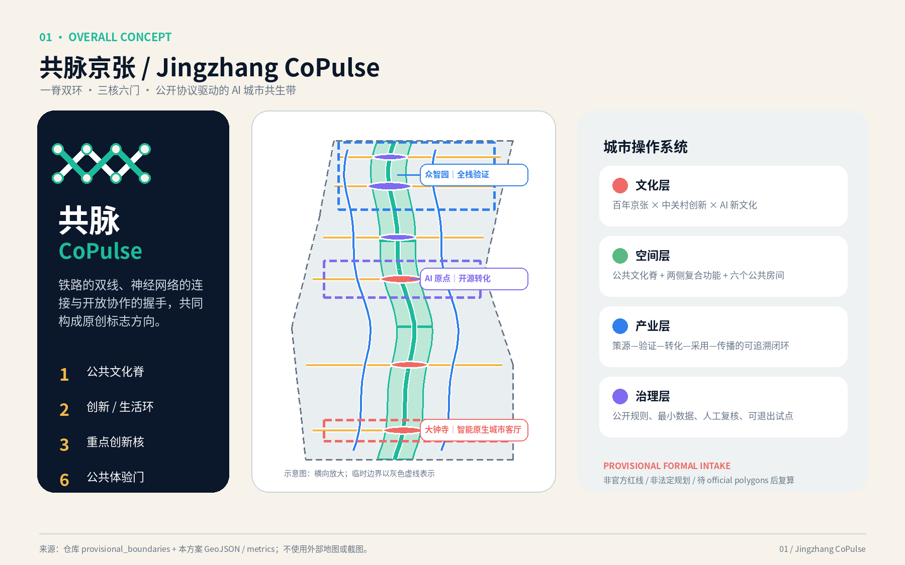
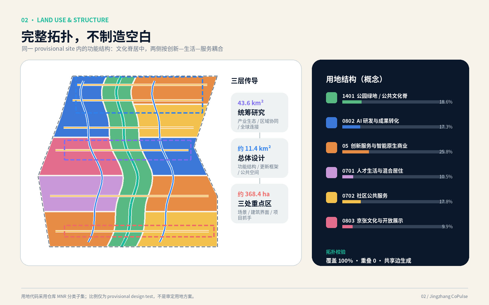
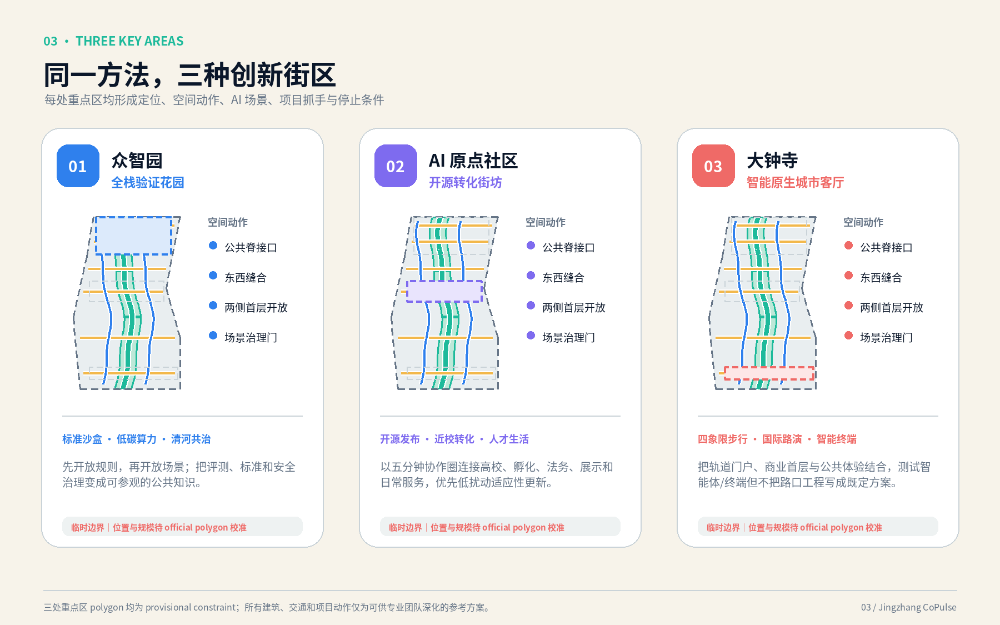
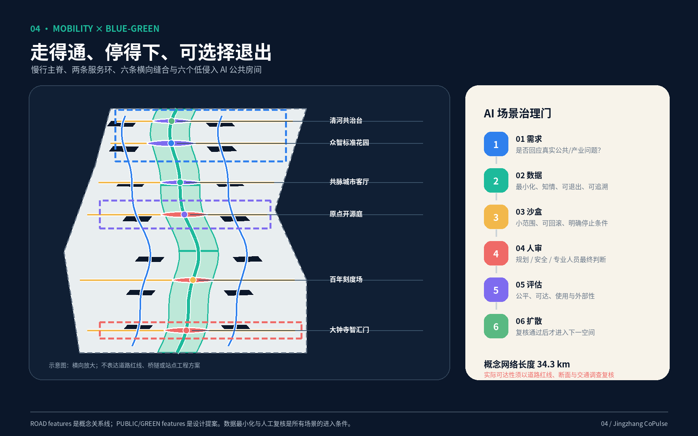
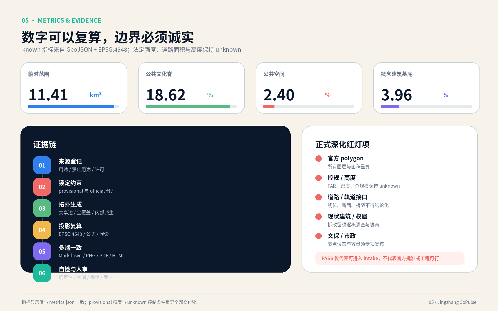

# 共脉京张：可验证、可漫游、可共治的AI城市共生带

“共脉京张 / Jingzhang CoPulse”不是以技术覆盖城市，而是让历史、产业、日常生活和公共判断共享一条可读的城市脉搏。方案以“一脊双环、三核六门”为总体结构：一条南北公共文化脊承担遗址叙事与慢行生活，两条服务环分别连接创新生产与社区生活，众智园、北京AI原点社区、大钟寺形成三种互补的创新核，六个低侵入公共房间把跨线缝合、服务、展示与人审嵌入日常。所有空间均为概念方案；临时边界、可复算指标和 unknown 控制项贯穿文本、GeoJSON、PNG、PDF 与离线 HTML。

## 设计依据与资料清单

本方案把资料分成“任务依据—可生成事实—背景启发—缺口”四层。任务依据是公开征集公告与面向智能体任务书；可生成事实来自仓库结构化 site package、来源登记和事实包；六个国际案例只用于机制比较；未取得的官方边界、控规、道路红线、现状建筑权属、文保、市政和公共服务容量则明确留空。任何背景案例都不用于推导海淀的法定指标，任何临时 polygon 都不升级为审定红线。[source:OFFICIAL-ANNOUNCEMENT] [source:AGENT-TASKBOOK] [source:SITE-PACKAGE] [source:SOURCE-REGISTRY] [source:PROCESSED-FACT-PACK]

现有 `SITE-001` 来自组织方提供的临时粗略 polygon，属性明确标注 `provisional_constraint` 与 `official_boundary=false`。其投影复算面积为 11,412,825.39 平方米，相对公告约 11.4 平方公里多 12,825.39 平方米；这个差值说明几何适合构思与一致性验证，却不具备法定测绘精度。[data:geometry/site_boundary.geojson#SITE-001] [metric:site_area_sqm] [metric:provisional_site_area_delta_sqm] 三处重点区同样是临时范围，不用于权属、征拆、审批或工程放线。[data:geometry/key_areas.geojson#PROV-KEY-001]

资料使用遵循六步证据协议：来源登记用途和许可；锁定 official/provisional 状态；只在锁定边界内派生拓扑；统一投影至 EPSG:4548 复算；同步输出 Markdown、GeoJSON、PNG、PDF 和离线 HTML；最后由确定性、空间、视觉、专业四类检查与人工复核共同把关。`constraints.geojson` 当前为空是有意的诚实表达：缺少可清权、可定位的约束几何时，不用虚构线位填图，而把缺口写入 assumptions、unknown 指标和深化清单。[data:geometry/constraints.geojson#CONSTRAINTS] [depth:existing_conditions_diagnosis]

本成果响应城市设计、控规和用地分类的公开规范，但不把规范响应等同于审批结论；建筑设计深度文件仅用于组织表达层级。[standard:PROJECT-OFFICIAL-ANNOUNCEMENT] [standard:PROJECT-AGENT-OPEN-CALL-TASKBOOK] [standard:MOHURD-URBAN-DESIGN-MEASURES] [standard:MOHURD-CONTROL-DETAILED-PLANNING] [standard:MNR-LAND-USE-CLASSIFICATION-GUIDE] [standard:MOHURD-ARCH-DESIGN-DEPTH-2016]

## 三层范围工作框架

三层范围按“战略协同—总体结构—片区验证”传导。约 43.6 平方公里统筹研究范围用于识别高校、科研、企业、开源社区、人才生活与公共文化之间的关系，不在本包中伪造外层精确边界；约 11.4 平方公里总体设计范围承载用地、更新、蓝绿、交通与设施结构；公告约 368.4 公顷重点范围在本次三个临时 polygon 中复算为约 369.29 公顷，差异由粗略边界造成，待 official polygons 到位后整体重跑。[source:OFFICIAL-ANNOUNCEMENT] [depth:three_level_scope_framework] [metric:key_area_count]

空间结构为“一脊双环、三核六门”。“一脊”是由绿色、公共空间和步行体验叠合的京张公共文化脊；“双环”是创新服务环与社区生活环，不表达道路红线；“三核”分别承载全栈验证、开源转化与城市型智能经济；“六门”是沿横向缝合位置设置的公共房间，包括清河共治台、众智标准花园、共脉城市客厅、原点开源庭、百年刻度场和大钟寺智汇门。该结构由道路中心线、公共空间与绿地三类可读图层共同表达。[data:geometry/roads.geojson#ROAD-001] [data:geometry/green_space.geojson#GREEN-001] [data:geometry/public_space.geojson#PUBLIC-001] [depth:overall_spatial_structure]

| 层级 | 决策尺度 | 本方案交付 | 必须由后续资料校准的内容 |
| --- | --- | --- | --- |
| 统筹研究 | 产业链、人才链、活动链和区域协同 | 创新生态机制、品牌命名、未来城市原则 | 43.6 平方公里外层精确范围、产业和人口基线 |
| 总体设计 | 用地、更新、交通、蓝绿与设施 | 六类全覆盖概念用地、一脊双环、项目与分期 | 控规强度、道路红线、文保、市政及权属 |
| 重点区域 | 建筑—街道—场景—运营组合 | 三处片区的定位、空间动作、治理门与停止条件 | 三处 official polygons、逐栋测绘和实施主体 |

三层之间以同一证据链闭环：战略提出机制，总体层选择空间载体，重点区通过低成本可逆试点验证，验证结果再返回战略层修订。若官方边界替换，首先裁切并重建 land use 拓扑，随后重算建筑、绿地、公共空间、道路与分期，最后更新所有图纸和指标，而不是只改一张底图。

## 统筹研究范围产业与未来城市研究

方案总名为“共脉京张 / Jingzhang CoPulse”，命名层级是“共脉京张”总品牌—“共脉脊/CoPulse Spine”空间系统—“众智标准花园、原点开源庭、大钟寺智汇门”等场所名—年度活动与场景名。Logo 建议以两条平行轨线在节点处生成脉冲与开放括号，深海军蓝代表工程记忆，青绿色代表开放共生，蓝、紫、珊瑚分别识别三处重点区；仅使用原创几何与开源字体，不嵌入企业商标。品牌不是装饰，而是让来源、场景状态与人审入口在导视、网页和展板上保持一致。[source:AGENT-TASKBOOK] [depth:overall_spatial_structure]

六个案例均为背景启发，不是海淀控制条件。Kendall Square 提示创新区要从办公集聚转向完整社区；one-north 提示以总体规划和公共空间连接科研、商业与生活；Paris-Saclay 提示科研、教育、企业与转化平台需要长期组织者；Barcelona 22@ 提示产业更新应同时回应街区与社会包容；MaRS 提示物理枢纽要叠加创业服务；Knowledge Quarter 提示跨机构联盟比单一地标更能持续生产合作。[source:CASE-KENDALL] [source:CASE-ONE-NORTH] [source:CASE-PARIS-SACLAY] [source:CASE-BARCELONA-22AT] [source:CASE-MARS] [source:CASE-KNOWLEDGE-QUARTER]

| 案例机制 | 对共脉京张的转译 | 明确不复制的部分 |
| --- | --- | --- |
| 创新区走向创新社区 | 把人才生活、公共服务和绿地纳入同一创新链 | 海外开发强度与治理制度 |
| 园区总体规划与混合使用 | 用双环连接科研、转化、生活和公共空间 | 具体用地比例与建筑尺度 |
| 科研教育企业联盟 | 建立高校—开源—企业—社区共同议题台 | 机构名单和资源承诺 |
| 产业更新兼顾社会价值 | 用公共门、低租协作空间和居民评议降低排斥 | 地价、补偿和财政工具 |
| 枢纽叠加创业服务 | 在原点社区组合发布、法务、算力和孵化入口 | 运营商与服务合同 |
| 跨机构知识网络 | 以年度议题和开放 API/场景清单形成长期协作 | 境外组织模式的直接移植 |

据此提出“基础研究—开源协作—产品验证—企业转化—城市采用—国际传播”六段创新回路。空间供给不追求单一巨构，而使用可拆分首层、共享会议、轻量测试庭、公共演示面和端侧服务舱，使小团队能进入、成熟企业能协作、居民能理解、监管与专业人员能随时停止试验。未来城市的判断标准不是部署了多少传感器，而是服务是否可选择、数据是否最小化、界面是否无障碍、失败是否可退出、经验是否能形成公开知识。[data:geometry/land_use.geojson#LU-002] [depth:land_use_layout]

## 总体设计范围城市更新与控规深度城市设计

总体设计采用“先公共骨架、后地块校准；先适应性更新、后增量建设；先规则沙盒、后场景扩散”的框架。六类概念用地从同一临时边界拓扑分割，做到全覆盖、共享边和无重叠；中部公共文化脊提供连续基底，研发转化、创新服务、人才生活、社区服务与文化展示沿两侧组织。这个布局用于检验功能关系，不改变土地用途，也不替代控规。[data:geometry/land_use.geojson#LU-001] [depth:land_use_layout] [standard:MNR-LAND-USE-CLASSIFICATION-GUIDE]

更新单元按四类处理：A 类“价值保留”保护有历史、公共或持续使用价值的建筑；B 类“适应性改造”通过首层开放、立面节能、屋顶共享与无障碍提升复用存量；C 类“轻量插入”以可拆服务舱、廊架、展亭和数字界面补足公共功能；D 类“待论证增补”只有在逐栋调查、权属协商、控规和市政校核后才进入建筑方案。当前 14 个概念建筑基底只是空间 test-fit，不代表现状建筑，也不作拆除判断。[data:geometry/buildings.geojson#BLDG-001] [depth:retain_renovate_demolish]

控规深度通过“已知—待校准—禁止推导”分层：可从方案几何复算边界、概念基底、绿地、公共空间和概念网络；正式用地性质、容积率、建筑密度、总建筑规模、高度、退线与道路面积均保持 unknown；缺少官方条件时不得用效果图反推控制指标。[standard:MOHURD-CONTROL-DETAILED-PLANNING] [depth:development_intensity_controls] 形态原则只规定公共性：临脊首层可进入、重点节点体量分段、屋顶优先绿色与共享、历史视线留有呼吸；具体高度必须经过控规、文保、景观与航空条件复核。[depth:height_massing_character]

## 重点区域详细设计

三处临时重点区共 3 个，不是征拆或工程边界。[metric:key_area_count] 众智园临时范围复算 1,929,201.88 平方米，北京AI原点社区 1,043,236.91 平方米，大钟寺 720,454.22 平方米；三者之和与公告约数存在粗略制图误差。[metric:zhongzhiyuan_submitted_area_sqm] [metric:beijing_ai_origin_submitted_area_sqm] [metric:dazhongsi_submitted_area_sqm] [data:geometry/key_areas.geojson#PROV-KEY-001] [depth:three_key_area_detailed_design]

### 众智园：全栈验证花园

定位为“规则先行的全栈自主创新加速区”。空间上以清河共治台—标准花园—公共文化脊形成T形开放骨架，产业院落两侧缝合；建筑优先保留可用基底，首层插入共享评测、标准协作与访客展示，新增体量仅作待论证增补。交通以东西公共入口接双环，测试物流与日常慢行分时、分线；公共空间承担低碳花园、开源标准墙和可预约小型测试。AI场景包括模型安全沙盒、低碳算力协同、机器人低速验证，均须数据最小化、专业人审和可立即停止。首批抓手是可拆标准亭与清河步行界面；主要风险是官方边界、河道条件、现状建筑、能耗与安全责任未明确，未闭合前不扩大场景。[data:geometry/key_areas.geojson#PROV-KEY-001]

### 北京AI原点社区：开源转化街坊

定位为“高校五分钟协作圈中的开源成果转化与人才生活社区”。空间结构由原点开源庭、近校成果转化街、人才服务环组成，以细粒度首层连接孵化、法务、展示、居住和日常消费；建筑更新遵循小单元、可合并、可逆隔断和夜间扰动分区。慢行优先缝合校区、园区与公共文化脊，机动车与装卸在外围环组织；公共空间提供发布台阶、安静协作庭和全天候无障碍路径。AI场景包括开源发布助手、企业服务 Copilot、健康服务导航和多语导览，重要建议均由授权人员确认。抓手是先开放一处首层样板与公共议题台；风险包括校园边界、知识产权、租赁成本、噪声与个人数据边界，须由高校、业主、社区和专业团队共同校准。[data:geometry/key_areas.geojson#PROV-KEY-002]

### 大钟寺：智能原生城市客厅

定位为“轨道门户型智能体、智能终端与内容经济会客厅”。空间上以大钟寺智汇门连接四象限步行网络，把站点、商业首层、规划绿地与公共文化脊串联；建筑策略优先打开沿街界面、复用可用空间承载路演和体验，避免把门户做成封闭展馆。交通组织强调步行过街、无障碍换乘、骑行停放与活动日人流预案，所有桥隧、站口和断面只是待专项深化的问题。AI场景包括多语文化导览、智能终端互操作展示和活动安全辅助复核；人群疏散、医疗与交通判断始终由专业人员负责。抓手是轻量导视与首层共用客厅；主要风险是站点接口、路口安全、市政管线、文保关联和商业运营权尚未核验。[data:geometry/key_areas.geojson#PROV-KEY-003]

## AI 创新生态、人才画像与 AI+ 场景

人才策略把“来这里工作”扩展为“能加入、能生活、能贡献、能被看见、也能退出”。六类画像包括：开源开发者需要低门槛协作与贡献声誉；科研人员和高校师生需要成果转化、安静研究与跨机构接口；初创团队需要短租空间、算力、法务和首个客户；成熟企业访客需要可信展示、招聘与国际接待；周边居民需要不被排除的公共服务、休闲和反馈入口；老年人、残障人士及国际访客需要无障碍、多语和人工服务兜底。画像只用于设计服务，不创建个人级商业标签。[source:AGENT-TASKBOOK] [data:geometry/public_space.geojson#PUBLIC-001]

每张场景卡均说明服务对象、空间、最小数据、隐私边界、人审、运营建议与主要风险；“测试”仅指可申请、可回滚的产业验证设想，不代表已开放场地或许可。

| # | 场景卡 | 服务对象与空间 | 最小数据与隐私边界 | 人审、建议运营方与风险 |
| --- | --- | --- | --- | --- |
| 01 测试 | 模型安全与标准沙盒 | 研发团队；众智标准花园 | 授权测试集、版本与日志；禁止导入无权数据 | 安全专家放行；标准/评测机构；风险为误用与能力外溢 |
| 02 测试 | 机器人低速共路验证 | 机器人企业、行人；众智园预约环 | 设备状态、匿名障碍物；原始影像短留存 | 现场安全员可急停；园区与测试机构；风险为碰撞和无障碍冲突 |
| 03 测试 | 端侧AI能源编排 | 设施运维者；可拆服务舱 | 聚合能耗与设备状态；不采个人作息 | 能源工程师确认；设施运营方；风险为误控制和容量不足 |
| 04 测试 | 智能终端互操作街 | 企业与公众；大钟寺城市客厅 | 公开接口、设备能力；用户主动授权 | 技术委员会审核；展陈运营方；风险为兼容、安全与营销误导 |
| 05 | AI慢行与无障碍导航 | 通勤者、老幼残障人士；一脊双环 | 路况、施工与用户自选偏好；不做持续轨迹画像 | 交通人员确认封路信息；公共服务团队；风险为过时路线 |
| 06 | 健康服务导航 | 居民与访客；原点人才服务环 | 机构公开信息、用户主动输入；不作诊断 | 医护/客服承接；合规服务机构；风险为错误分诊和过度依赖 |
| 07 | 开源发布与贡献助手 | 开发者、学生；原点开源庭 | 公开仓库和作者授权资料；不抓取私有代码 | 发布者最终确认；开源社区；风险为版权和错误归属 |
| 08 | 企业服务 Copilot | 初创与企业；转化街、众智园 | 公开政策、经授权企业需求；会话可删除 | 法务/政策人员复核；企业服务平台；风险为过期政策和利益冲突 |
| 09 | 百年京张多语文化导览 | 居民、游客；公共文化脊 | 清权史料、语言偏好；不做人脸识别 | 策展人与史学人员审稿；文化运营团队；风险为史实错误 |
| 10 | 公共议题翻译与摘要 | 居民、专业团队；六个公共房间 | 自愿提交意见、去标识文本；保留异议原文 | 社区主持人确认；共建议事台；风险为少数意见被压缩 |
| 11 | 活动安全辅助复核 | 活动参与者；大钟寺与百年刻度场 | 聚合客流、天气和人工巡查；不做身份追踪 | 安保、交通、医疗人员决策；活动组织方；风险为漏报和误报 |
| 12 | 公共设施维护助手 | 居民、养护人员；一脊六门 | 设施工单和位置；图片上传需主动同意 | 养护主管派单；设施管理方；风险为重复工单和隐私泄露 |

统一治理门为“需求—数据—沙盒—人审—评估—扩散”：先证明真实公共或产业问题，再给出数据清单、合法来源和最短保留期；沙盒限定范围、时段、用户与停止条件；规划、安全、医疗、法律或运维专业人员作最终判断；评估公平、可达、可用、外部性和投诉；只有复核通过才进入下一空间。任何人都可选择非AI通道，公共服务不得因拒绝数据授权而降低基本可达性。[depth:municipal_new_infrastructure]

## 用地、建筑规模与拆改留方案

六类概念用地由临时边界的共享拓扑生成：公园绿地代码1401为 2,124,585.55 平方米（18.62%）；科研代码0802为 1,977,851.64 平方米（17.33%）；商业服务代码05为 2,949,919.29 平方米（25.85%）；城镇住宅代码0701为 1,202,113.48 平方米（10.53%）；公共管理与公共服务代码0702为 2,030,111.36 平方米（17.79%）；文化设施代码0803为 1,128,266.22 平方米（9.89%）。这些数字表达设计结构，不是现状统计或法定用地平衡。[metric:land_use_1401_area_sqm] [metric:land_use_0802_area_sqm] [metric:land_use_05_area_sqm] [metric:land_use_0701_area_sqm] [metric:land_use_0702_area_sqm] [metric:land_use_0803_area_sqm] [data:geometry/land_use.geojson#LU-001]

14 个概念建筑基底合计 451,584.00 平方米，占临时边界 3.9568%，仅用于检验开放空间和街道界面。[metric:building_footprint_area_sqm] [metric:conceptual_building_footprint_ratio] 它既不是现状建筑面积，也不是审定建筑密度。总建筑规模、容积率、正式建筑密度和批准高度保持 unknown，因为缺少逐栋层数、权属测绘、控规和文保控制；不可用基底面积乘假设层数制造“总规模”。[depth:development_intensity_controls] [depth:height_massing_character]

拆改留采用五步决策树：先核对建筑身份、权属与安全；再评估历史、社会、使用和碳价值；优先日常维护和价值保留；其次做无障碍、节能、首层开放与可逆分隔；只有无法满足安全、公共价值和长期适用性时，才由有资质团队论证替换。每栋建筑需建立“一栋一档”，记录照片、测绘、结构、租户、碳账与协商过程；居民和使用者意见是输入而非装饰。建筑风貌组件包括可开启首层、3—6米可变模数界面、遮阳雨棚、可维护屋顶绿化与清晰设备带，但尺度均需专业深化。[data:geometry/buildings.geojson#BLDG-001] [depth:retain_renovate_demolish]

## 交通、轨道、市政与公共服务设施

交通结构不是新增道路方案，而是一组需要实测校验的“关系线”：一条南北慢行主脊、两条纵向服务环、六条横向缝合及重点区内支线，概念中心线总长 34,254.62 米。[metric:mobility_network_length_m] [data:geometry/roads.geojson#ROAD-001] 主脊优先步行、骑行、无障碍和公园体验；双环承接到达、服务和应急；横向缝合聚焦跨线、跨路、站点与社区入口。道路面积和道路率保持 unknown，因为没有道路红线与断面；桥隧、站口、信号、停车和消防均不能从中心线得出工程结论。[depth:traffic_rail_slow_parking]

轨道一体化遵循“站内信息—站口集散—五分钟步行—片区目的地”四层检查：大钟寺重点研究四象限可达和活动日人流，原点社区研究高校与轨道/公交的日常接续，众智园研究对外到达与测试物流分离。停车策略先做需求管理与共享，再研究增量；非机动车设置应靠近入口但不阻断盲道、消防和树池。任何具体站口连接、道路改造和跨线设施都需交通模型、勘测、产权及安全论证。[standard:MOHURD-CONTROL-DETAILED-PLANNING]

市政与新型基础设施采用“可插拔服务舱”：在公共房间预留端侧算力、通信、能源监测、雨洪与维护接口，设备可替换、可断网运行、故障可手工接管。分布式能源、算力和传感仅提出接口原则，不给出容量；正式深化需供电、通信、给排水、防洪、燃气、热力、环卫、消防和地下管线资料。公共服务以步行可达和多渠道为先，在原点社区组合人才、健康、教育、法律与知识产权入口，在众智园组合评测、标准和企业服务，在大钟寺组合文化、商业、国际接待与应急服务。[data:geometry/public_space.geojson#PUBLIC-001] [depth:municipal_new_infrastructure]

## 蓝绿空间、公共空间与城市风貌

蓝绿结构把三段概念绿地并成一条可漫游的公共文化脊，面积 2,124,585.55 平方米，占临时范围 18.6158%；六个公共房间及连接空间的去重面积为 273,522.84 平方米，占 2.3966%。[metric:green_space_area_sqm] [metric:green_ratio] [metric:public_space_area_sqm] [metric:public_space_ratio] 这些比例来自设计图层而非现状绿量调查；绿地分类、防洪、树木和公园边界仍需专项资料。[data:geometry/green_space.geojson#GREEN-001] [data:geometry/public_space.geojson#PUBLIC-001] [depth:blue_green_public_space]

公共空间按三种节奏组织：日常层提供连续步行、骑行、遮阴、休息、运动和无障碍；协作层提供小型讨论、发布、测试和居民议事；事件层在可控时段承载路演、节庆与国际交流。六个公共房间均设置非AI导视、人工服务和可见的场景治理门，避免把公园变成技术展厅。海绵、植被、照明、噪声和夜间活动以低扰动、可维护、分段实施为原则，具体植物、调蓄和照度由景观、市政与生态团队深化。[standard:MOHURD-URBAN-DESIGN-MEASURES]

四个概念地标构成“朝圣但不封闭”的城市记忆系统：大钟寺智汇门是轨道门户与多语城市客厅；百年刻度场用可更新的时间轴连接京张工程史和当代贡献；原点开源庭让代码、论文、标准、公益应用的贡献可查来源；众智标准花园把评测、安全与标准转译成公众可理解的展陈。荣誉展示采用“贡献类型—证据链接—维护者—更新时间—异议入口”五字段，不按资本规模排名。组件库包括脉冲导视柱、开放括号座椅、可拆标准亭、低位无障碍屏、贡献铭牌和数据状态灯，均建议小样验证后使用。

文化叙事分三幕：第一幕“百年工程勇气”讲自主建造、测绘与公共基础设施；第二幕“中关村开放创新”讲教育、科研、市场与开源协作；第三幕“AI共治文明”讨论人如何保留选择、质疑、修正和停止技术的权利。三幕通过材料、口述、互动和公共议题串联，不把历史简化为品牌背景，也不把未来写成单一路径。建筑形态强调分段体量、开放首层、克制标识与可维护细部；批准建筑高度仍为 unknown，所有视线、天际线和文保关系待正式条件复核。[depth:height_massing_character]

## 更新项目清单、实施政策与分期计划

九项行动按“可逆试点—空间更新—长期治理”组织。清单中的主体是建议协作角色，不是机构承诺；每项都设前置条件和停止门。[depth:renewal_project_list]

| 编号 | 行动与公共价值 | 建议协作角色 | 前置条件、停止门与阶段 |
| --- | --- | --- | --- |
| CP-01 | 一脊无障碍与慢行断点审计 | 交通、园林、残障代表、社区 | 红线和现勘；安全问题未闭合则只做调研；阶段1 |
| CP-02 | 六个公共房间轻量样板 | 业主、社区、设计与运营团队 | 权属、消防、噪声；使用冲突不可缓解即撤除；阶段1 |
| CP-03 | 众智标准花园沙盒 | 评测、安全、园区与公众代表 | 数据许可和急停责任；无现场安全员不开测；阶段1 |
| CP-04 | 原点开源庭与转化街首层 | 高校、开源社区、业主、企业服务 | 知识产权、租赁和扰动协议；排斥效应过高则调整；阶段1—2 |
| CP-05 | 大钟寺智汇门与四象限导视 | 轨道、交通、商业与无障碍顾问 | 站口和路口专项；不得阻断疏散；阶段1—2 |
| CP-06 | 清河低碳创新界面 | 河道、园林、市政与园区 | 河道、防洪、生态条件；容量不明不建设固定设施；阶段2 |
| CP-07 | 存量建筑一栋一档更新 | 业主、租户、建筑结构与碳顾问 | 逐栋测绘和协商；未完成权属核验不作拆改决定；阶段2 |
| CP-08 | 可插拔城市服务舱网络 | 市政、能源、通信、公共服务 | 管线、容量、网络安全；人工接管失败则下线；阶段2—3 |
| CP-09 | 共脉年度开放治理机制 | 开发者、居民、机构与独立评估者 | 公开规则、申诉和年度审计；重大外部性未修复则暂停扩散；阶段1—3 |

分期 polygon 仅表达工作优先级：阶段1面积复算 2,955,825.12 平方米，优先做审计、导视、首层和轻量沙盒；阶段2为 3,267,127.41 平方米，聚焦跨界缝合、建筑适应性更新和设施接口；阶段3为 5,189,858.07 平方米，只有在数据、治理和专业条件成熟后才讨论网络化扩散。[metric:phase_1_area_sqm] [metric:phase_2_area_sqm] [metric:phase_3_area_sqm] [data:geometry/phasing.geojson#PHASE-001] [depth:phasing_implementation] 分期不是政府建设时序、投资计划或审批承诺。

长期运营采用年度节奏：一季度公开场景需求与上一年度问题；二季度完成小范围共创和安全评审；三季度举办开放测试、文化路线与开发者周；四季度发布使用、投诉、公平性和退出报告。开发者社区通过维护议题、复现任务和贡献认证参与；居民通过公共房间、离线表单和人工主持参与；场景清单由跨专业委员会开放审议；国际传播提供中英双语事实页而非夸张宣传。转化路径是“问题单—原型—沙盒—独立评估—采购/合作另行决策—公开复盘”，未通过者保留失败记录，不以扩散率作为唯一绩效。

## 指标体系、面积复算与合规矩阵

所有 known 空间指标都从同一组 WGS84 GeoJSON 投影至 EPSG:4548 复算；面积对重叠要素先 union，线长按概念中心线求和，用地检查完整覆盖、共享边与无重叠。数值保留多位只为机器一致性，并不提升临时边界精度。[depth:metrics_recalculation] 当前核心读数为临时范围 11.4128 平方公里、绿地 18.6158%、公共空间 2.3966%、概念建筑基底 451,584.00 平方米、概念网络 34.2546 公里。

指标分三类管理。第一类 known 可直接复算，包括用地、重点区和分期面积；第二类 unknown 需要 official polygon、控规或专项资料，包括总建筑规模、容积率、建筑密度、道路面积、道路率和批准高度；第三类运营绩效要在真实运行后建立基线，包括可达性、参与公平、投诉、能耗、场景退出率和成果转化，不在本次用假数填充。官方边界到位后的重算顺序是：替换边界—重建用地拓扑—裁切派生图层—运行空间检查—刷新指标、图纸、HTML 与哈希—专业人审。

机器可读的 known 指标索引为：[metric:site_area_sqm] [metric:provisional_site_area_delta_sqm] [metric:building_footprint_area_sqm] [metric:conceptual_building_footprint_ratio] [metric:green_space_area_sqm] [metric:green_ratio] [metric:public_space_area_sqm] [metric:public_space_ratio] [metric:mobility_network_length_m] [metric:key_area_count] [metric:land_use_1401_area_sqm] [metric:land_use_0802_area_sqm] [metric:land_use_05_area_sqm] [metric:land_use_0701_area_sqm] [metric:land_use_0702_area_sqm] [metric:land_use_0803_area_sqm] [metric:zhongzhiyuan_submitted_area_sqm] [metric:beijing_ai_origin_submitted_area_sqm] [metric:dazhongsi_submitted_area_sqm] [metric:phase_1_area_sqm] [metric:phase_2_area_sqm] [metric:phase_3_area_sqm]。

`compliance_matrix.json` 把公告 1.3—1.5 与 agent.1—agent.6 逐项连接到章节、图层、指标、PDF、HTML、来源、假设和自检；`standard_matrix.json` 回答六项规范依据；`design_depth_matrix.json` 检查十五项专业深度。校验 PASS 只说明投稿包达到仓库 intake 的结构与一致性要求，不代表规划、建设或安全结论。正式评审仍需城市设计、交通、市政、景观、建筑、文保、数据治理和社区代表共同判断。

## 风险、版权与合规说明

首要风险是边界信任：SITE 与 KEY_AREA 均为 provisional；第二是控制缺口：FAR、密度、规模、高度和道路红线未知；第三是现状缺口：建筑、权属、租户、文保、树木、管线和设施容量未调查；第四是实施缺口：主体、资金、审批、维护和责任分配未确定；第五是AI外部性：偏差、错误建议、数据滥用、无障碍排斥、自动化依赖和供应商锁定。每类风险都以“资料到位—专业复核—公众/使用者参与—小范围试验—停止门”处理。[depth:risk_missing_data] [data:geometry/constraints.geojson#CONSTRAINTS]

约束图层为空不是遗漏：在没有可信坐标时，宁可在 `assumptions.json` 和 unknown 指标中公开缺口，也不绘制伪精确文保线、道路线或管线。正式深化最低资料包包括 official site/key-area polygons、现行控规、道路与轨道接口、现状建筑和权属测绘、文保与景观控制、市政与防洪、公共服务和树木调查；任一资料到位都应登记来源、许可、用途和禁止用途后再进入模型。

本包的文字、原创几何、图表、离线 HTML 与排版由 OpenAI Codex 在人工授权的任务范围内生成并由提交者承担发布责任；Noto Sans CJK 仅用于栅格图和 PDF 字形渲染，其开源许可已登记。[source:FONT-NOTO-CJK] 六个案例的文字均为短摘要和机制转译，不复制其图像或长篇内容。方案采用 `COMMUNITY-DISPLAY-ONLY`，版权声明见 `report/copyright_statement.md`；网页不请求远程脚本、地图瓦片、字体、表单或追踪服务。

AI只负责资料编排、概念生成、图层派生、复算与自检，不替代规划审批、工程签章、医疗/法律/安全判断和公众协商。每个高影响场景必须提供人工入口、非AI通道、申诉、日志最小化和退出机制。本成果是独立开源征集投稿，所有活动、空间动作、机构角色和分期均为概念建议，供有资质专业团队与相关利益方继续研究。

## 参考资料

本节给出完整机器引用索引，详细 URL、发布日期、许可、用途限制与访问时间见 `sources.json`。项目与公开资料：[source:SITE-PACKAGE] [source:SOURCE-REGISTRY] [source:PROCESSED-FACT-PACK] [source:OFFICIAL-ANNOUNCEMENT] [source:AGENT-TASKBOOK] [source:MOHURD-URBAN-DESIGN] [source:MOHURD-CONTROL-DETAIL] [source:MNR-LAND-USE] [source:PROVISIONAL-BOUNDARIES]。背景案例：[source:CASE-KENDALL] [source:CASE-ONE-NORTH] [source:CASE-PARIS-SACLAY] [source:CASE-BARCELONA-22AT] [source:CASE-MARS] [source:CASE-KNOWLEDGE-QUARTER]。字体：[source:FONT-NOTO-CJK]。

规范响应索引：[standard:PROJECT-OFFICIAL-ANNOUNCEMENT] [standard:PROJECT-AGENT-OPEN-CALL-TASKBOOK] [standard:MOHURD-URBAN-DESIGN-MEASURES] [standard:MOHURD-CONTROL-DETAILED-PLANNING] [standard:MNR-LAND-USE-CLASSIFICATION-GUIDE] [standard:MOHURD-ARCH-DESIGN-DEPTH-2016]。

专业深度索引：[depth:existing_conditions_diagnosis] [depth:three_level_scope_framework] [depth:overall_spatial_structure] [depth:land_use_layout] [depth:development_intensity_controls] [depth:height_massing_character] [depth:retain_renovate_demolish] [depth:traffic_rail_slow_parking] [depth:municipal_new_infrastructure] [depth:blue_green_public_space] [depth:three_key_area_detailed_design] [depth:renewal_project_list] [depth:phasing_implementation] [depth:metrics_recalculation] [depth:risk_missing_data]。

空间数据索引：[data:geometry/site_boundary.geojson#SITE-001] [data:geometry/key_areas.geojson#PROV-KEY-001] [data:geometry/land_use.geojson#LU-001] [data:geometry/buildings.geojson#BLDG-001] [data:geometry/roads.geojson#ROAD-001] [data:geometry/green_space.geojson#GREEN-001] [data:geometry/public_space.geojson#PUBLIC-001] [data:geometry/constraints.geojson#CONSTRAINTS] [data:geometry/phasing.geojson#PHASE-001]。

这些引用共同形成可追溯闭环：读者可由正文回到数据与来源，由指标回到公式与假设，由任务回到合规矩阵，由风险回到缺口清单。若引用对象、边界或来源发生变化，所有派生成果必须重新生成和复核，旧数值不得脱离版本继续传播。
