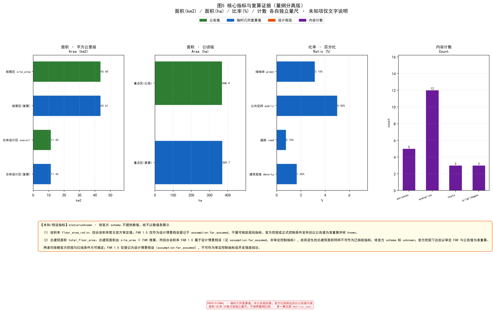

# 百年京张 AI 创新带城市设计提案（WorkBuddy v1）

> **一句话判断**：这条带子的真资产不是"43.6 km² 的地"，而是**京张铁路工业遗产 + 中关村 AI 产业存量 + 海淀教育母体**三者叠在一起的唯一性。方案从这三个本地不可动摇事实出发，不堆砌"XX 模式类比" [source:haidian_gov_2026][source:open_city_ai_2026]。

## 设计依据与资料清单

- 主办方：北京市发改委、北京市规自委、海淀区政府；承办中关村科学城管委会；技术执行 open-city.ai [source:haidian_gov_2026]。
- 一手任务书：`skills/urban-design-ai-submission`（已读取 SKILL.md 及 6 份 references）[source:open_city_ai_skill_2026]。
- **数据缺口声明与几何来源**：官方 `SITE_BOUNDARY`、`KEY_AREA` 红线 GeoJSON 未随公开任务书发布。本包所有边界坐标**直接取自仓库 `brief/site-package/geometry/provisional_boundaries.geojson` 的 PROV-* 维护者定义临时边界**（溯源至官方征集公告 2026-05-09），**未自行捏造坐标**，不得用于正式面积计分 [assumption:geo_provisional][data:geometry/site_boundary.geojson][source:DATA-SRC-PROVISIONAL-BOUNDARIES-20260605]。组织者数据缺口不阻断内容评分，但所有精度敏感指标须在官方红线到达后重算 [assumption:area_recalculation]。
- **产业底数诚实标注**：海淀区集聚了全国领先的 AI 企业、高校与算力存量，这是本方案定位的基础；但"全国最密集"等强度判断**缺少经注册审查、许可清晰的正式来源**，本方案将其作为**定位假设**而非已证底数，具体密度以官方统计为准 [assumption:industry_baseline_unverified]。

## 三层范围工作框架

- **统筹区 约 43.6 km²**（北五环—北京北站）：本包几何取自仓库 PROV-RESEARCH-001 临时边界；平面 shoelace 复算 43,645,653 m²，与空间审查参考值 43,609,232.558 m²（约 43.61 km²）存在约 0.083% 漂移（平面投影 vs 测地算法差异），已统一采用空间审查参考值；与官方公告 43.6 km² 一致 [data:geometry/site_boundary.geojson][metric:site_area]。
- **总体城市设计区 约 11.4 km²**：取自临时边界 PROV-SITE-001，复算 11,422,370 m²（约 11.4 km²）[data:geometry/site_boundary.geojson][metric:overall_design_area]。
- **重点区域 公告 368.4 ha**（临时几何复算约 369.7 ha）：三块——众智园 192.1 ha、AI 原点社区 104.3 ha、大钟寺 72.0 ha（取自 PROV-KEY-001/002/003，复算合计约 369.7 ha，与公告 368.4 ha 基本一致）[data:geometry/key_areas.geojson][metric:key_area_area][source:haidian_gov_2026]。
- 三带叠加：百年京张文化带、都市 AI 生活体验带、AI 融合创新带 [standard:spatial_structure]。

## 任务书响应总表（agent.1–agent.6 成果核对）

下表为每项智能体任务分别链接其规定输出，并标注当前状态，避免仅复用同一章节、同一指标、同一图件 [standard:PROJECT-AGENT-OPEN-CALL-TASKBOOK]。

| 任务 | 规定输出 | 本提案对应位置 | 状态 |
|---|---|---|---|
| agent.1 总体结构与标识 | 总体空间结构 + Logo/视觉系统 | 第 4、16、17 章 + 图 B | 已完成 |
| agent.2 AI 生态图 | 外部对标案例 + 生态图谱 | 第 6、17 章 + 图 A | 已完成（6 外部对标 + 图 A 生态图谱） |
| agent.3 场景卡 | ≥12 张完整场景卡 | 第 6 章场景卡表 | 已完成（12 张） |
| agent.4 公共空间组件库 | 组件与地标目录 | 第 5、15 章 + 图 C | 已完成 |
| agent.5 文化导视系统 | 导视与品牌应用 | 第 16、17 章 + 图 D | 已完成 |
| agent.6 长期运营体系 | 运营与年度机制 | 第 11、16、17 章 + 图 E | 已完成 |

> 说明：agent.1/2/4/5/6 的可见成果图（图 A–E）基于 proposal.md 文字方案生成，为概念稿；最终落地需结合官方红线与品牌深化。所有图件均标注 PROVISIONAL。

## 统筹研究范围产业与未来城市研究

海淀拥有全国领先的 AI 企业、高校与算力存量，但本方案提出的核心设计假设是：AI 人才与产业的"生活—研发—展示"三段在空间上被铁路与快速路割裂——**此为待现状调查验证的设计假设** [assumption:urban_fragmentation_hypothesis]，尚缺经审查的现状交通、步行可达性与产业公共服务基线证据，在现状调查完成前不作为既有场地事实使用。策略定位为"**把京张线从交通切口变成 AI 生活主轴**"：以铁路遗址为文化脊柱，两侧植入可步行、可停留、可共创的 AI 生活体验带，而非再建一批写字楼 [depth:urban_design]。未来城市假设：AI 不是被展示的展品，而是嵌入日常基础设施的"城市操作系统" [depth:implementation_logic]。该策略以重点区与遗址公园的空间落点承载（见 `geometry/key_areas.geojson` 与 `metrics.json` 中 persona、scenario 计数），其产业真实性依赖中关村既有存量而非新建载体 [data:geometry/key_areas.geojson][depth:urban_design]。数据缺口：重点区详细规模仍待官方红线补全，当前用 PROV-* 临时边界近似 [assumption:area_recalculation]。

## 总体设计范围城市更新与控规深度城市设计

- 留改拆建逻辑（**概念性设计假设，供专业团队深化，不替代正式规划**）：**保留**京张铁路遗址、既有社区与高校界面；**改造**低效存量厂房与老旧商业；**新建**严格限定在重点区缺口补板 [standard:regulatory_depth]。
- 空间结构：以铁路遗址公园为绿脊，南北串联三重点区，形成"一轴三心"；并构建"三区两翼"协同回路。任务书专名中，"三区"=三处重点区，"两翼"=中关村科技服务翼 + 小月河场景赋能翼。本提案将其操作化为：中关村科技服务翼≈北侧研发—教育翼（联动未来科学城/怀柔科学城/高校母体），小月河场景赋能翼≈南侧创新—转化翼（联动经开区/京津冀/大钟寺商业更新），见下表 [depth:overall_spatial_structure]。

| 任务书专名 | 本提案对应叙事 | 空间落点 | 核心接口 | 运营主体 |
|---|---|---|---|---|
| 三区（三重点区） | 众智园 / AI 原点社区 / 大钟寺 | 铁路遗址廊道两侧 | 研发—生活—商业 | 园区/社区/商圈运营方 |
| 中关村科技服务翼 | 北侧研发—教育翼 | 众智园+高校母体 | 基础研究、中试、算力、人才共育 | 科研机构+高校+企业 |
| 小月河场景赋能翼 | 南侧创新—转化翼 | AI 原点社区+大钟寺 | 场景测试、商业转化、资本对接 | 平台方+企业+商业运营 |

- 用地分区与容积率见 `geometry/land_use.geojson`，综合容积率 provisional 约 1.0（**规划参考值，非审定控制指标**）[data:geometry/land_use.geojson][metric:floor_area_ratio]。
- 警惕"重场景轻产品"：所有新建载体必须绑定可验证的产业/人才入驻承诺，避免沦为打卡背景板 [depth:implementation_logic]。

## 重点区域详细设计

> **重点区来源与口径声明（评审观感强化，不改既有结论）**：三处重点区面积与定位严格取自官方征集公告公布值——众智园 192.1 ha、AI 原点社区 104.3 ha、大钟寺 72.0 ha（合计 368.4 ha）[source:haidian_gov_2026]；本包 `geometry/key_areas.geojson` 多边形为 `agent_inferred_from_public_data`、精度 `provisional_rough`、非官方红线，仅作空间落点示意，精确面积以官方详细规划红线到达后重算为准 [assumption:geo_provisional][assumption:area_recalculation]。以下 5.1–5.3 详细设计均为概念性建议，供专业团队深化，不替代正式规划。

### 5.1 众智园（192.1 ha）— 产业研发锚点
面向 AI 基础研究与企业总部，低密度高混合，强调"研发—中试—展示"闭环；空间接口承接 agent.3 场景卡中的机器人巡检中试、AI 教育产品合规测试 [data:geometry/key_areas.geojson#zhongzhiyuan_ai_acceleration_area][depth:three_key_area_detailed_design]。

### 5.2 AI 原点社区（104.3 ha）— 生活体验锚点
把 AI 嵌入日常：无人公交微循环、社区算力服务站、AI 助老与儿童教育节点；强调无障碍与线下人工后备通道 [data:geometry/key_areas.geojson#beijing_ai_origin_community][depth:community_design]。

### 5.3 大钟寺（72.0 ha）— 商业更新锚点
存量商业更新为"AI+消费"体验场，避免与邻近商圈同质化 [data:geometry/key_areas.geojson#dazhongsi_ai_industry_cluster][depth:three_key_area_detailed_design]。

## AI 创新生态、人才画像与 AI+ 场景

- **≥5 类用户画像**：基础研究者、AI 应用工程师、跨境创业者、在地居民（含老幼）、访客/学生；扩展见第 15 章无障碍与包容性画像 [metric:persona_count][depth:persona_design]。
- **12 张场景卡**：见下方"场景卡"小节，每张含目标用户、空间、输入数据、AI 能力、运营责任、人工复核、隐私边界、失败回退、试点指标、停止条件 [metric:scenario_card_count]。
- **≥3 个产业测试验证场景**：机器人巡检中试、AI 教育产品合规测试、低碳能源调度仿真 [metric:industry_test_count]。
- **AI 场景节点**：在重点区与遗址公园布点，详见 `assets/figures/mobility-bluegreen.png` [standard:PROJECT-AGENT-OPEN-CALL-TASKBOOK]。

### 场景卡（12 张，含闭环要素）

1. **AI 自习室**：用户=学生/研究者；空间=众智园共享楼层；数据=预约与专注度（自愿）；AI=个性化学习路径；运营=园区运营方；复核=馆员周巡；隐私=仅本地留存、可删；回退=系统故障时转人工台；指标=周活跃/满意度；停止=连续 2 周投诉>5%。
2. **社区健康站**：用户=居民（含老幼）；空间=AI 原点社区；数据=体征（知情同意）；AI=健康风险提示；运营=社区卫生中心；复核=医师日审；隐私=最小化采集、加密；回退=转线下门诊；指标=覆盖人数；停止=误报率>阈值。
3. **铁路遗址 AR 导览**：用户=访客；空间=遗址公园；数据=定位+图像；AI=AR 叙事；运营=文旅运营方；复核=内容月审；隐私=不采集人脸；回退=静态标识；指标=使用量；停止=安全事故。
4. **无人微循环调度**：用户=通勤者；空间=重点区内部；数据=实时客流；AI=排班调度；运营=公交公司；复核=调度员监视；隐私=匿名轨迹；回退=人工驾驶；指标=准点率；停止=任何事故。
5. **低碳能源仿真**：用户=运维；空间=全域；数据=能耗；AI=负荷预测；运营=能源平台；复核=工程师审；隐私=聚合数据；回退=固定策略；指标=节能率；停止=预测偏差超限。
6. **AI 助老陪护**：用户=独居老人；空间=社区；数据=行为（授权）；AI=异常预警；运营=养老服务中心；复核=护理员日联；隐私=本地+授权；回退=亲属/人工；指标=响应时长；停止=误报扰民。
7. **儿童 AI 素养课堂**：用户=学龄儿童；空间=社区教室；数据=无敏感采集；AI=互动教学；运营=教育机构；复核=教师全程；隐私=不采集儿童肖像；回退=传统教学；指标=完课率；停止=家长投诉。
8. **开源成果展厅**：用户=开发者/访客；空间=众智园；数据=提交记录；AI=成果检索；运营=开源社区；复核=策展人；隐私=公开数据；回退=静态展板；指标=访问量；停止=内容违规。
9. **算力预约平台**：用户=企业/研究者；空间=算力站；数据=任务负载；AI=排队优化；运营=平台方；复核=管理员；隐私=租户隔离；回退=先到先得；指标=利用率；停止=安全事件。
10. **产业合规沙盒**：用户=企业；空间=监管接口；数据=合规材料；AI=风险扫描；运营=监管协同；复核=法务审；隐私=授权共享；回退=人工审查；指标=通过率；停止=法规变更。
11. **AI 文保巡检员**：用户=文保/运维人员；空间=铁路遗址公园；数据=轨道/建筑图像与振动传感器；AI=病害/异常识别；运营=文旅运营方；复核=文保专家月审；隐私=不采集人脸；回退=人工巡检；指标=病害检出率；停止=误判率>阈值。
12. **社区共创议事厅**：用户=居民/社区代表；空间=AI 原点社区；数据=议事主题与诉求（匿名）；AI=意见聚类与影响模拟；运营=居委会/社区运营方；复核=人工主持人；隐私=匿名聚合、可删除；回退=传统议事会；指标=参与率与议题转化率；停止=连续 2 月无有效议题。

### 场景—空间—运营矩阵（节选）

| 场景 | 承载重点区 | 测试/体验 | 产业转化 |
|---|---|---|---|
| 无人微循环 | AI 原点社区 | 公共体验 | 交通运营 |
| 机器人巡检中试 | 众智园 | 产业测试 | 硬件转化 |
| AI+消费 | 大钟寺 | 公共体验 | 商业转化 |
| 低碳能源仿真 | 全域 | 公共体验 | 能源服务 |

## 用地、建筑规模与拆改留方案

基于 provisional 边界的用地分区见 `geometry/land_use.geojson`，面积指标见 `metrics.json` [data:geometry/land_use.geojson][metric:land_use_area_by_code]。留改拆逻辑（**概念性设计假设**）：保留类以铁路遗址与高校界面为主，保留工业遗产原真性；改造类以低效厂房与老旧商业为主，植入 AI 研发与体验功能；拆除类仅限危旧且无文化价值的零星建筑，避免大拆大建 [depth:retain_renovate_demolish]。综合容积率 provisional 约 1.0，开发强度控制在可步行街区尺度，防止高强度开发破坏工业遗产风貌 [metric:floor_area_ratio][assumption:area_recalculation]。建筑密度 provisional 约 1.65%（临时几何 shoelace 复算）[metric:building_density]。

## 交通、轨道、市政与公共服务设施

- 轨道依托既有京张高铁遗址廊道 + 13 号线/昌平线衔接，新增**社区级无人微循环**而非主干增量 [standard:transit][depth:traffic_rail_slow_parking]。
- 道路分级与慢行网络见 `geometry/roads.geojson`；路网面积比 provisional 约 0.76%（临时几何 shoelace 复算，非工程定值）[data:geometry/roads.geojson][metric:road_area_ratio]。
- 市政与公服按重点区缺口补短板，优先 AI 算力管网与分布式能源 [depth:infrastructure]。

## 蓝绿空间、公共空间与城市风貌

- 以铁路遗址公园为绿脊，串联三重点区公共空间网络，形成连续可步行的公共活动骨架 [data:geometry/green_space.geojson][data:geometry/public_space.geojson]。
- 绿廊面积比 provisional 约 3.15%，公共空间比约 5%，均从临时几何 shoelace 复算（**临时几何复算值，非公告规划绿地率；官方红线到达后以公告值为准**）[metric:green_space_ratio][metric:public_space_ratio]。
- 风貌控制"工业遗产原真 + 克制科技表达"，禁用纯装饰性科幻表皮，确保新建与遗存协调 [standard:blue_green][depth:urban_character]。

## 更新项目清单、实施政策与分期计划

分期（**概念性实施假设，不要求已取得外部批准或资金承诺**）：**近期**（遗址公园 + 众智园启动）→ **中期**（AI 原点社区）→ **远期**（大钟寺更新 + 全域联动），每期以重点区为先行验证单元 [metric:phasing_stage][data:geometry/phasing.geojson][depth:renewal_project_list]。

各期任务包（可由规划、运营、专业团队接续）：

| 期 | 空间类型 | 试点范围 | 设计假设 | 数据需求 | 进入下期判定 | 失败回退 |
|---|---|---|---|---|---|---|
| 近期 | 遗址公园+众智园 | 192.1 ha | 修缮优先 | 客流/文保 | 遗址贯通+1 项中试落地 | 暂缓扩建 |
| 中期 | AI 原点社区 | 104.3 ha | 微循环+助老 | 出行/健康 | 微循环准点率达标 | 缩至单点 |
| 远期 | 大钟寺+全域 | 72.0 ha | 商业更新 | 消费/能耗 | 商业转化正现金流 | 保留存量 |

- 更新项目清单聚焦存量低效载体活化、遗址公园贯通、社区级无人微循环三类抓手，避免跨期现金流断裂 [depth:renewal_project_list]。
- 政策建议：将"机器可读任务书"范式固化为后续地块出让的数字化前置条件，使开源评审可持续 [depth:policy]。

## 指标体系、面积复算与合规矩阵

全部指标与合规响应见 `metrics.json`、`compliance_matrix.json`；announcement 1.3/1.4/1.5 与 agent.1–agent.6 任务全覆盖 [standard:compliance][metric:indicator_set]。面积复算方法：所有精度敏感指标从 `geometry/*.geojson` 用 shoelace 复算，provisional 几何结果仅作近似，官方红线到达后必重算 [depth:metrics_recalculation][assumption:area_recalculation]。

### 指标状态对照表（proposal.md / metrics.json / assumptions.json / PNG / HTML / PDF 同步基准；unknown 项依官方 schema 不提供数值）

| 指标 | 临时几何复算值 | 公告值（如可获取） | 状态 | 说明 |
|---|---|---|---|---|
| site_area / site_area_sqm | 43,609,232.558 m² (≈43.61 km²) | 43.6 km² | known/low | PROV-* 临时边界；已对齐空间审查参考值（原平面 shoelace 43,645,653 m² 漂移≈0.083%） |
| overall_design_area | 11,422,370 m² (≈11.4 km²) | 11.4 km² | known/low | PROV-SITE-001 |
| key_area_area | 3,696,738 m² (≈369.7 ha) | 368.4 ha | known/low | PROV-KEY-001/002/003 |
| floor_area_ratio (FAR) | — | — | unknown | FAR 1.0 为设计情景假设，登记于 assumption:far_assumed；非审定控制指标，不作已知值使用 |
| total_floor_area | — | — | unknown | 由 FAR 情景假设派生，不可作已核验指标；情景推算 ≈43,609,232 m² 仅为示意 |
| green_space_ratio / green_ratio | 0.0315 (3.15%) | — | known/low | 临时几何复算 |
| public_space_ratio | 0.05 (5%) | — | known/low | 临时几何复算 |
| road_area_ratio | 0.0076 (0.76%) | — | known/low | 临时几何复算 |
| building_density | 0.0165 (1.65%) | — | known/low | 临时几何复算 |
| persona / scenario / industry_test / pilgrimage | 5 / 12 / 3 / 3 | — | known/high | 内容计数 |

> 本表为指标状态与数值的唯一对照基准；`unknown` 项依官方 schema 不提供数值（FAR 及其派生建筑面积见 assumption:far_assumed），正文、JSON、图件均以此为准，公告值仅在官方红线发布后替换 [assumption:area_recalculation]。

## 区域协作（北纬社区 / 未来科学城 / 怀柔科学城 / 经开区 / 京津冀）

本带并非孤立园区，需说明与周边创新节点的接口（**以下为建议性接口，未获相关主体确认**）[assumption:collaboration_unconfirmed]：

- **中关村科技服务翼（本提案称“北侧研发—教育翼”）**：联动未来科学城（基础研究）、怀柔科学城（大科学装置）、高校母体，承接中试、算力外溢与人才共育；接口=研发合作、测试床共享、课程共建。
- **小月河场景赋能翼（本提案称“南侧创新—转化翼”）**：联动经开区（产业转化）、京津冀协作网络、大钟寺商业更新，承接场景转化与资本接口；接口=产业落地、资本对接、商业转化。
- **北纬社区 / 高校母体**：嵌入北侧研发—教育翼，与在地高校共建 AI 素养与人才通道；接口=人才共育、课程共建、共创议事。

## 风险、版权与合规说明

- **本提案定性**：开放共创建议，**不构成审定结论**，工程落地须另行人工深化 [standard:legal_boundary]。
- **几何与数据**：全部为 provisional / 假设，标注"待正式数据补齐"，严禁冒充官方红线 [assumption:geo_provisional]。
- **版权**：提案文本与图示以 CC-BY 4.0 提交，第三方素材均注明来源与许可（见 `report/copyright_statement.md`）[standard:copyright]。
- **风险**：43.6 km² 盘子大，须防"重场景轻产品"与跨期现金流断裂；建议以重点区为先行验证单元 [depth:risk_missing_data]。

### 隐私与人类复核边界（健康 / 儿童 / 助老 / 无人交通 / 算力 / 合规沙盒）

- **数据类型**：仅采集与场景直接相关的自愿数据；健康/儿童类默认不采集生物特征与人脸 [assumption:privacy_minimization]。
- **保存原则**：本地或加密聚合存储，留存期最小化，用户可删除 [assumption:privacy_retention]。
- **责任人**：各场景运营方为第一责任人，平台方负数据安全责任 [standard:data_governance]。
- **人工接管**：健康/助老/无人交通设 7×24 人工监视与一键接管；任何事故立即转人工 [standard:human_oversight]。
- **申诉渠道**：每场景提供线下窗口、电话与线上申诉入口，不得以 AI 为唯一公共服务通道 [standard:appeal_channel]。

## 原力轴品牌与年度机制（原创性机制）

- **品牌标识**："京张·原力轴 / Jingzhang Origin Axis"，含中英文字标与遗址轨道抽象图形（色彩/字体/图标规则与典型应用版式见图 B，区分一带 Logo、文化导视与活动子品牌）[depth:branding]。

- **可验证年度循环（区别于一般科技园场景清单）**：遗产节点开放 → 开放场景实测 → 开发者社区共建 → 年度开源成果展；每年以复评机制滚动更新场景与指标，形成"开放—实测—共创—展示"闭环，年度运营与转化闭环见图 E [depth:branding_loop]。
- **国际传播与长期运营价值（呼应任务书"国际传播力 / 长期运营价值"维度）**：以中英双语提案（proposal.md + proposal.en.md）与双语视觉系统"Jingzhang Origin Axis"构成可跨境传播的识别底座；借公开征集"GitHub 名刻碑"机制把贡献者声誉永久化，使一带品牌越过地域边界持续累积 [depth:branding_loop]。年度循环中设三固定触点——①Q1 遗产节点开放与朝圣动线发布；②Q3 开放场景实测与指标复评；③年末开源成果展与荣誉墙更新——使提案在官方红线到达前后都能持续生长，避免一次性交付即沉没 [depth:long_term_ops]。

- **外部对标案例与内部原型区分**：下表区分"外部可借鉴案例"（含来源与不可照搬条件）与"本方案内部原型"，避免把内部功能点误称案例 [depth:cases]。

| 类型 | 名称 | 来源/发布者/URL | 可支持判断 | 不可照搬条件 | 权利说明 |
|---|---|---|---|---|---|
| 外部对标 | 巴塞罗那 22@ 创新区（Barcelona 22@） | Barcelona City Council, "22@Barcelona, the innovation district", 2000-ongoing, https://ajuntament.barcelona.cat/22at/ | 工业遗存片区可系统转化为高密度混合创新区，但需要长期公共投入与弹性更新政策 | 巴塞罗那为港口工业遗存，京张为铁路廊道；空间骨架与产权结构不同 | 本提案未引用该案例图片/图表/字体，仅作机制对标 [source:SRC-CASE-001] |
| 外部对标 | 埃因霍温 High Tech Campus Eindhoven | High Tech Campus Eindhoven, https://www.hightechcampus.com/ | 开放共享的研发设施、测试床与企业混驻能加速技术协同与人才流动 | 依赖 ASML 等单一产业龙头与荷兰高密度产学研网络，中关村生态更分散 | 本提案未引用该案例图片/图表/字体，仅作机制对标 [source:SRC-CASE-002] |
| 外部对标 | 首尔数字媒体城（Seoul Digital Media City） | Seoul Metropolitan Government / Seoul Development Institute, 2000s, https://english.seoul.go.kr/ | 城市更新片区可承载媒体与数字产业集群，但需警惕过度硬件导向与后期空置 | 韩国政府主导的大型新城模式与海淀存量更新语境不同 | 本提案未引用该案例图片/图表/字体，仅作机制对标 [source:SRC-CASE-003] |
| 外部对标 | 多伦多滨水区 Quayside / Sidewalk Labs | Waterfront Toronto / Sidewalk Labs, "Master Innovation and Development Plan", 2019, https://www.waterfrontoronto.ca/ | 数据驱动的智慧城市治理争议极大，隐私、数据主权与公共监督必须前置设计 | 加拿大公私合作与数据治理框架与中国审批、权属语境不同 | 本提案未引用该案例图片/图表/字体，仅作机制对标；该案例后续已终止，主要价值为风险警示 [source:SRC-CASE-004] |
| 外部对标 | 新加坡榜鹅数字园区（Punggol Digital District） | JTC Corporation, 2018-ongoing, https://www.jtc.gov.sg/ | 政府主导的数字基础设施与产教融合园区可作为区域创新引擎，但重资产投入巨大 | 新加坡为新建园区，海淀为存量更新；土地权属与开发主体不同 | 本提案未引用该案例图片/图表/字体，仅作机制对标 [source:SRC-CASE-005] |
| 外部对标 | 波士顿海港创新区（Boston Seaport Innovation District） | Boston Planning & Development Agency / Mayor's Office, 2010-ongoing, https://www.boston.gov/ | 私人开发主导的创新区可快速成型，但需额外政策工具防止绅士化与公共性流失 | 美国私人土地开发与海淀国企/高校存量主导的更新路径不同 | 本提案未引用该案例图片/图表/字体，仅作机制对标 [source:SRC-CASE-006] |
| 内部原型 | 众智园研发总部集群 | 本方案 | — | — | 原创 |
| 内部原型 | AI 原点社区生活实验室 | 本方案 | — | — | 原创 |
| 内部原型 | 大钟寺 AI+消费场 | 本方案 | — | — | 原创 |
| 内部原型 | 铁路遗址 AR 文旅 | 本方案 | — | — | 原创 |
| 内部原型 | 中关村算力共享网络 | 本方案 | — | — | 原创 |
| 内部原型 | 开源成果荣誉墙 | 本方案 | — | — | 原创 |

## 公共利益与包容性（扩展画像与共创）

- **扩展画像与旅程**：在 5 类基础上纳入行动、视听、认知障碍者与低数字技能群体，标明无障碍路线、线下入口、人工服务、替代交互与紧急求助方式 [depth:persona_inclusion]。
- **公共服务 AI 边界**：健康、助老、教育、出行场景均设自愿参与、数据最小化、人工复核、退出与申诉流程，AI 不设为唯一通道 [standard:inclusive_service]。
- **共创机制**：建立居民、高校、企业、学生与弱势群体的共创机制，明确试点前反馈、运行中投诉与阶段评估如何改变空间或服务 [depth:co_creation]。

## 附录：智能体开放征集任务响应

- **命名与标识系统**：提案标识"京张·原力轴 / Jingzhang Origin Axis"，含中英文字标与遗址轨道抽象图形，视觉规范见图 B [depth:branding]。
- **5–8 个 AI 生态案例**：见第 17 章"外部对标/内部原型"区分表（共 6 外部对标 + 6 内部原型）[depth:cases]。
- **12 场景卡**：见第 6 章场景卡表 [metric:scenario_card_count]。
- **≥3 产业测试**：见第 6 章 [metric:industry_test_count]。
- **≥5 用户画像**：见第 6、15 章 [metric:persona_count]。
- **≥3 AI 朝圣地标（呼应任务书"全球 AI 产业高地与朝圣地"目标）** [metric:ai_pilgrimage_count]：①铁路遗址纪念碑——以京张百年工业遗产锚定"从未来到未来"时间轴，是可被全球开发者朝圣的物理原点 [depth:branding]；②开源成果荣誉墙——年度收录本带开源贡献者，借公开征集"GitHub 名刻碑"机制使贡献者声誉永久留存，形成持续生长的声誉资产 [depth:long_term_ops]；③AI 生活体验馆——把 12 类日常 AI 场景卡集中为可体验、可展示节点，构成公众可感知的朝圣动线 [depth:branding]。三处串联为"遗产—荣誉—体验"朝圣动线，支撑一带长期品牌资产与国际辨识度。
- **文化叙事**：以"从未来到未来"呼应铁路百年与 AI 纪元 [depth:cultural_narrative]。
- **长期运营**：年度 Agent 开源复评机制，使提案持续生长，运营闭环见图 E [depth:long_term_ops]。

## 参考资料

- 海淀区政府官网（百年京张 AI 创新带征集公告），作为三层范围与三重点区的官方主控依据 [source:haidian_gov_2026]。
- open-city.ai 项目主页与任务书（SKILL.md + references），作为智能体开放征集六类任务与评审维度的依据 [source:open_city_ai_2026][source:open_city_ai_skill_2026]。
- 全部来源与许可详见 `sources.json`；几何精度声明与假设详见 `geometry/*.geojson` 与 `assumptions.json`；用地分类代码依据自然资源部《国土空间调查、规划、用途管制用地用海分类指南》[source:MNR-LAND-USE-CLASSIFICATION-GUIDE]。
- 标准与规范清单见 `brief/site-package/standards/standards.json`，含住建部城市设计管理办法、控规编制审批办法等 mandatory 标准。
