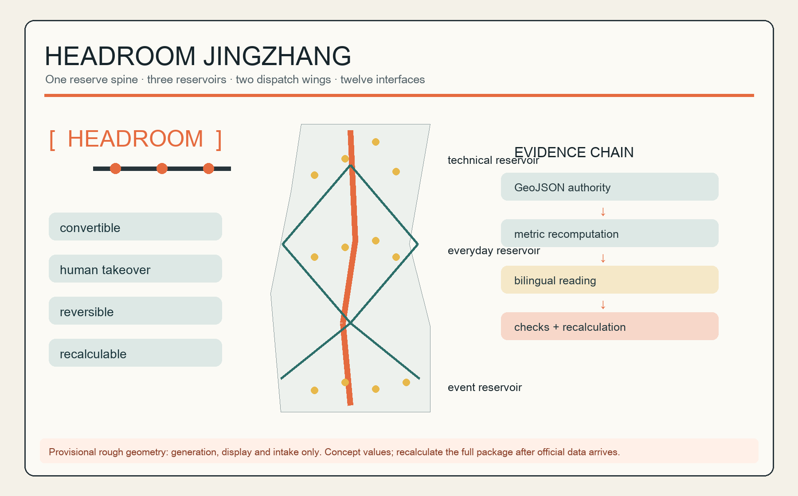
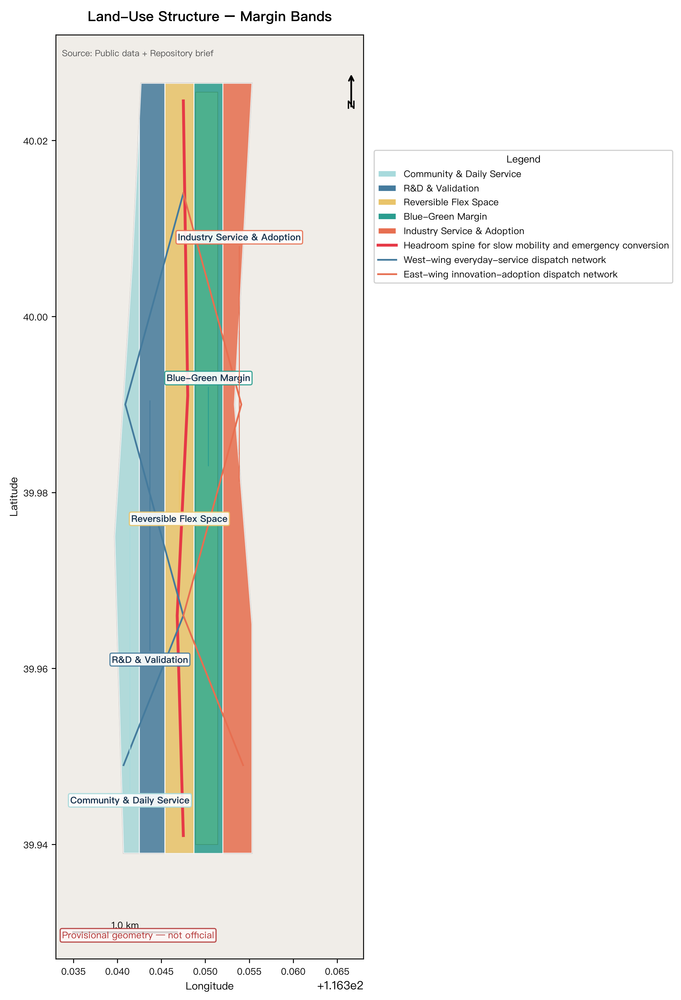
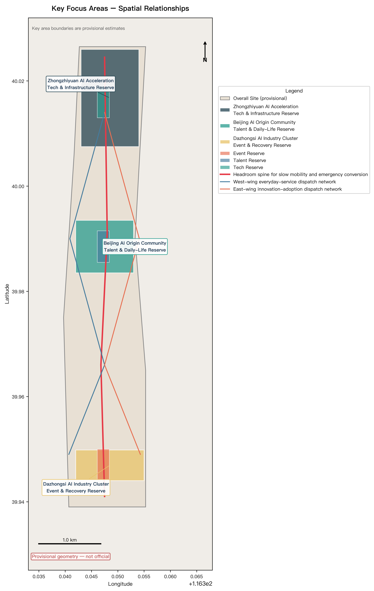
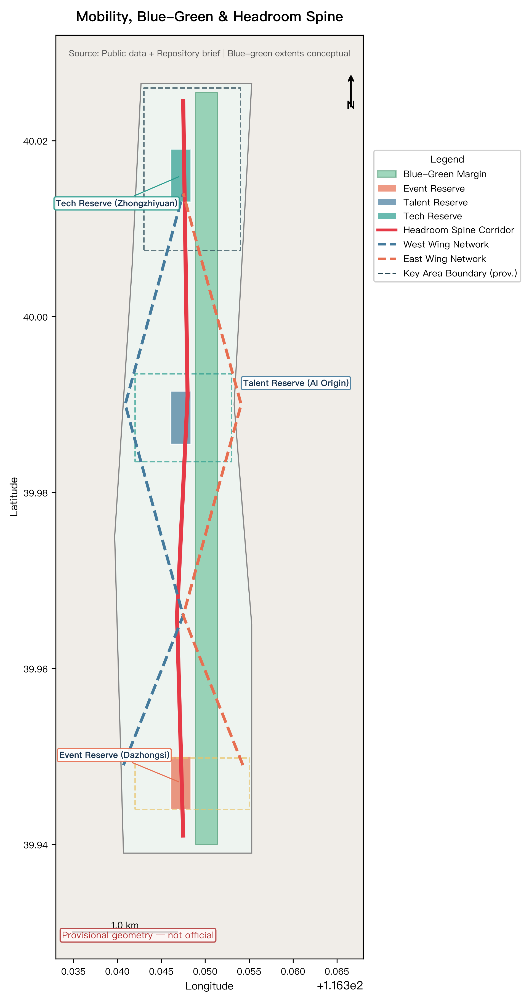
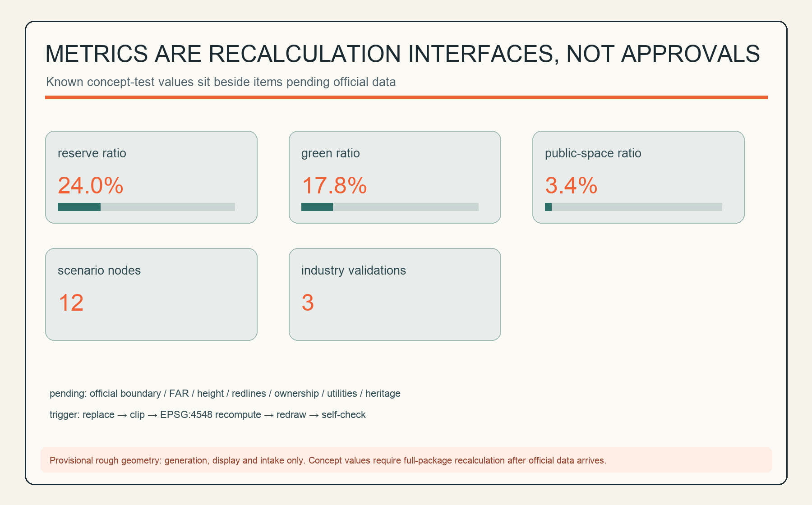

# HEADROOM JINGZHANG / 京张余量带

> An AI city should not be optimized to full capacity. This proposal turns spatial, temporal, computational, energy and public-service headroom into civic infrastructure that residents can see, operators can dispatch and reviewers can recalculate.

## Design Basis and Source List

The official announcement establishes the three scope levels, approximate areas and design tasks; the Agent taskbook establishes the branding, precedent, scenario, landmark, cultural and long-term operation requirements. Land-use codes follow the repository snapshot of the national classification guidance. The source registry permits the provisional boundaries only for generation, display and intake checks, so this report never calls them official redlines or derives statutory controls from them. [source:DATA-SRC-OFFICIAL-ANNOUNCEMENT-20260509] [source:DATA-SRC-PROVISIONAL-BOUNDARIES-20260605]

“Headroom” is a design judgment, not a claim about existing conditions: when algorithms fail, attendance surges, weather becomes extreme or a user has no account, the city retains human takeover, non-AI equivalents and recovery capacity. GeoJSON, metrics, sources and assumptions hold the complete audit trail. [standard:MOHURD-CONTROL-DETAILED-PLANNING] [depth:risk_missing_data]

## Three-Level Scope Framework

The coordinated research area addresses industry and urban institutions; the overall design area tests one spine, three reservoirs, two wings and twelve interfaces inside a provisional constraint; the three key areas receive directional detailed designs only. The provisional overall area is about 11.41 km² and the key-area count is three, but these numbers serve only this package's topology and display—not official polygons or precise area claims. [metric:site_area_sqm] [data:geometry/key_areas.geojson#PROV-KEY-001]

Official geometry triggers a full recalculation: replace site and key areas, repartition land use, clip layers, recompute in EPSG:4548, redraw all five figures and bilingual PDF/HTML artifacts, then finalize and self-check again. [depth:three_level_scope_framework] [source:DATA-SRC-PROVISIONAL-BOUNDARIES-20260605]

## Coordinated Research Area: Industry and Future City Research

HEADROOM JINGZHANG translates the three positions into one action: an AI ecosystem needs experimentation capacity, a future city needs failure capacity, and a high-quality district needs quiet, care and account-free service capacity. The mark wraps an unbroken rail line in open brackets: the openings preserve choice and orange nodes show callable public interfaces. It is original geometry and uses no corporate logo. [source:DATA-SRC-AGENT-TASKBOOK-20260518] [standard:PROJECT-AGENT-OPEN-CALL-TASKBOOK]

Five functions form a loop: R&D validation produces auditable capability; open collaboration makes common knowledge; public experience builds trust; daily life supports sustained talent; global events return adoption feedback to validation. The three reservoirs hold technical/infrastructure, talent/everyday-life and event/adoption headroom. The west wing dispatches daily services, the east wing dispatches innovation adoption, and the spine combines slow movement, evacuation, display and manual takeover. [data:geometry/roads.geojson#ROAD-HR-SPINE] [metric:headroom_spine_length_m]

Six global cases offer mechanism precedents. MIT Kendall Square combines housing, laboratory/research, retail, innovation and open space through a community-informed process, suggesting that validation capacity should connect to daily life. MaRS connects startups, research, partners and technology adoption, suggesting public-problem-led innovation. [source:CASE-KENDALL-SQUARE-MIT] [source:CASE-MARS-DISCOVERY-DISTRICT]

Knowledge Quarter's partnership among cultural, research, higher-education, life-science, community and local-government organizations suggests a common cross-institution network. Maria 01 brings early-stage teams, investors, enterprises and ecosystem organizations into a shared campus, suggesting community-based startup infrastructure. [source:CASE-KNOWLEDGE-QUARTER-LONDON] [source:CASE-MARIA-01-HELSINKI]

STATION F's multiple startup programs, partners, flexible work space and founder services on one campus suggest one-stop adoption support. District 3's sector coaching, prototyping laboratory and staged support suggest continuous gates from testing to scaling. These are design inferences from organization-primary pages; they inform mechanisms only and do not imply local firms, investment, land or implementation conditions. [source:CASE-STATION-F-PARIS] [source:CASE-DISTRICT-3-MONTREAL]

Regional synergy is organised as exchange mechanisms rather than a list of place names: sharing talent housing and everyday-service hinterland with the Beiwei community; exchanging energy and hard-tech validation scenarios with Future Science City; connecting with Huairou Science City for pilot-scale demand from basic research and large scientific facilities; exploring manufacturing and pilot-to-production chains with the Beijing Economic-Technological Development Area; and discussing compute dispatch, mutual test recognition, supply chains and touring events at the Beijing-Tianjin-Hebei level. All of these are conceptual mechanism suggestions and do not imply that the named institutions participate or commit; formal coordination requires inter-governmental and inter-institutional agreements. [source:DATA-SRC-AGENT-TASKBOOK-20260518] [depth:overall_spatial_structure]

## Overall Design Area: Urban Renewal and Regulatory-Plan-Level Urban Design

The overall structure does not seek maximum floor area. It organizes the complete land-use partition's reserve land, public reservoirs and blue-green band as reversible capacity. Five longitudinal bands share edges without overlaps or gaps; the reserve ratio is a concept test, not an approved control. [data:geometry/land_use.geojson#LU-HR-03] [metric:reserve_land_ratio] [depth:land_use_layout]

Only six small, reversible insertion units test how community services, incubation, labs, culture, mixed use and mobility services can plug into the headroom network. Without existing-building surveys, ownership, controls, heritage, fire or engineering data, the proposal makes no building-specific retain/renovate/demolish decision and states no height, floors, FAR or investment. [data:geometry/buildings.geojson#BLDG-HR-01] [standard:MOHURD-URBAN-DESIGN-MEASURES]

## Detailed Design of Key Areas

**Zhongzhiyuan | technical and infrastructure reservoir.** The concept combines a controlled test loop, a human-takeover desk and redundant compute/energy interfaces. The test loop closes along internal slow-mobility paths and is separated from public passage by time windows or grade separation; the takeover desk sits where the two meet to shorten manual response distance; redundant interfaces attach to the reversible insertion units as small equipment rooms without new permanent massing. [data:geometry/key_areas.geojson#PROV-KEY-001] [data:geometry/buildings.geojson#BLDG-HR-01]

The programme direction centres on R&D validation, open-source collaboration and joint enterprise experiments. The three industrial validation scenarios (controlled robot-street test, edge-compute disconnection drill, climate-peak microgrid validation) run in isolatable time windows, degrade immediately on failure, and never treat public passage as an experiment variable. [data:geometry/constraints.geojson#SCN-HR-01]

Each test scenario has an accountable scenario owner and an on-site safety officer, with time-window isolation, incident review and public retrospective. Near-term work is drills and simulation only—no construction—and every scenario passes the testable acceptance protocol in the AI ecosystem chapter before going live.

**AI Origin Community | talent and everyday-life reservoir.** Convertible learning/care rooms, quiet and rest spaces and an account-free desk share one schedule: rooms switch by booking, rest pods sit near the residential band, and the desk stays on the public frontage with a staffed window. Residents receive equivalent human service; algorithmic suggestions remain explainable and rejectable; behaviour recognition and individual scoring are prohibited here. [data:geometry/key_areas.geojson#PROV-KEY-002] [data:geometry/constraints.geojson#SCN-HR-04]

The programme direction is talent housing support, community services and shared learning, serving residents, carers and night-shift workers. The suggested operator is a community duty team plus professional care partners, with care taking priority in conflicts and quiet periods protected. Near-term work can start with one convertible room and one account-free desk, replicated only if usage and complaint rates pass evaluation.

**Dazhongsi | event and adoption reservoir.** Public space switches among market, demonstration, commuting and recovery modes across peak and off-peak periods, all four sharing one movable-facility inventory. The exit desk records who approved deployment, when it closes and how recovery works, and every deployed scenario carries a sunset clause and a rollback package. The provisional rectangle is not verified against station/road anchors, so the proposal does not claim a Dazhongsi-station four-quadrant design or a specific campus renewal scheme. [data:geometry/key_areas.geojson#PROV-KEY-003] [source:DATA-SRC-PROVISIONAL-BOUNDARIES-20260605]

The programme direction is launches, public experience and adoption services. Peak distribution depends on rail-station conditions; until official station data arrives the area is organised only around “commute path stays open, overload shifts to recovery mode.” The suggested operator is an event manager jointly deciding with the local authority; near-term actions are one peak-switching drill and one deployment-exit tabletop exercise.

## AI Innovation Ecosystem, Personas, and AI+ Scenarios

Five personas are: researchers needing controlled environments and trusted compute; startups needing low-threshold collaboration and living support; residents needing quiet, care and human windows; frontline workers needing explainable tools while retaining discretion; and visitors needing accessible routes, language support and the right to exit. Each maps to space, human accountability and an exit path. [source:DATA-SRC-AGENT-TASKBOOK-20260518]

The twelve scenario cards below begin with three industrial testing/validation scenarios. Every `SCN-HR-*` node requires data minimization, human review, graceful degradation and a non-AI equivalent. [metric:scenario_node_count] [metric:industry_test_scenario_count]

| # | Scenario card | Space and users | Data/human boundary | Operation and risk control |
|---|---|---|---|---|
| 01 | Controlled robot-street test | Zhongzhiyuan; teams/pedestrians | Test telemetry only; safety officer can stop | Isolated windows, incident review, non-test route always open |
| 02 | Edge-compute disconnection drill | Zhongzhiyuan; researchers/operators | Synthetic load; operator switches offline | Log recovery time; no resident data |
| 03 | Climate-peak microgrid validation | Zhongzhiyuan; facility team | Device state; human energy dispatch | Simulation only before engineering review |
| 04 | Account-free public desk | Origin Community; residents/visitors | Minimum service fields; human fallback | No mandatory registration or profile-based downgrade |
| 05 | Convertible learning/care room | Origin Community; carers/learners | Booking/capacity; staff schedule | Care priority and protected quiet periods |
| 06 | Quiet-right and rest room | Origin Community; residents/night workers | Occupancy only; human inspection | No behavior recognition or individual scoring |
| 07 | Human-takeover mobility desk | Spine; commuters/dispatchers | Anonymous flow; dispatcher decides | Paper/fixed signage during outage |
| 08 | Low-speed logistics window | Wings; shops/cyclists | Position/time window; site manager | Slow/stop on conflict |
| 09 | Algorithm-impact explanation station | Reservoirs; public/staff | Version, purpose, appeal channel | No personal results; human appeal |
| 10 | Open-model health-check kiosk | Spine; students/developers | Public tests; mentor review | Limitations shown; sensitive uploads prohibited |
| 11 | Peak/off-peak switching court | Dazhongsi; visitors/shops | Footfall count; event manager | Recovery mode on overload; commute path stays open |
| 12 | Deployment exit and recovery desk | Dazhongsi; operators/public | Deployment and incident logs; accountable sign-off | Sunset clause, rollback package and public review |

Before going live, every scenario card should pass the same testable acceptance protocol: record the baseline response time and coverage of the non-AI equivalent service; drill network-outage and model-failure cases with a capped human-takeover time; test the appeal channel and human-review deadlines; complete a privacy impact assessment and confirm the minimal data fields; and state the sunset date, rollback package and public incident-summary format. A scenario that fails acceptance does not enter public operating hours, and acceptance and drill records are published. [standard:PROJECT-AGENT-OPEN-CALL-TASKBOOK] [metric:scenario_node_count]

## Land Use, Building Scale, and Retain-Renovate-Demolish Strategy

The five-band concept—community service, R&D, reserve, blue-green and industry service—covers the full provisional site; band shares are computed from EPSG:4548 projected areas and shown to one decimal place, so the displayed values may not sum to exactly 100%. Concept building density measures only six reversible footprints. Total floor area, FAR, road area and official height remain pending official data. [metric:building_density] [metric:floor_area_ratio]

The retain/renovate/demolish process is “audit first, classify later.” Once formal surveys arrive, each building is assessed for structural safety, heritage, carbon, ownership, demand and reversibility. Until then there are no demolition polygons, insertion units are not placed over known buildings, and reserve land is not called vacant land. [depth:retain_renovate_demolish] [standard:MOHURD-CONTROL-DETAILED-PLANNING]

## Transport, Rail, Municipal Infrastructure, and Public Services

The spine is a conceptual slow-mobility/evacuation/service corridor; the wings are switchable everyday-service and innovation-adoption networks. Road geometry expresses connections, not engineering alignments or road redlines; stations, junctions, parking and fire access must be relocated after official inputs arrive. [data:geometry/roads.geojson#ROAD-HR-WEST] [depth:traffic_rail_slow_parking]

The municipal principle is “critical service N + human”: public services retain non-smart windows; edge compute retains disconnection mode; energy/charging retains manual isolation; information systems retain local rollback. Capacity and feasibility require professional load, utility and fire review. [standard:MOHURD-URBAN-DESIGN-MEASURES] [depth:municipal_new_infrastructure]

## Blue-Green Network, Public Space, and Urban Character

The blue-green band is operational headroom for heat, storms, event peaks and daily rest—not decorative background. Three public-space reservoirs support recovery, daily conversion and technical takeover. Green and public-space ratios are concept values on provisional geometry. [metric:green_ratio] [metric:public_space_ratio]

Three AI pilgrimage nodes are: the **Open-source Milestone Sleeper**, with verified public contributions on replaceable modules; the **Human Takeover Bell**, mechanically showing an automated system shifting to people; and the **Century-to-Next-Stop Signal Tower**, pairing railway signaling with model versions and sunset clauses. Together they connect railway accessibility, Zhongguancun's open experimentation and AI's auditable exit. All are original concepts for further design and contain no corporate marks. [data:geometry/public_space.geojson#PUBLIC-HR-01] [standard:PROJECT-AGENT-OPEN-CALL-TASKBOOK]

## Renewal Projects, Implementation Policy, and Phasing

Near-term work contains only low-risk, reversible pilots; mid-term work links the spine, reservoirs and wings; long-term work does not “fill the reserve”: it recalculates the whole package after official data and retains, moves or exits components based on evaluation. [data:geometry/phasing.geojson#PHASE-HR-01] [depth:phasing_implementation]

The table below grounds the concept project list in operator types, approval prerequisites, funding categories, pilot scales, exit conditions and scaling gates. Every operator, funding line and scale is a concept suggestion subject to government, owner, community and professional agreement; none of it is an investment or implementation commitment. [depth:renewal_project_list]

| Project | Phase | Operator type | Approval / procurement prerequisite | Funding category | Pilot scale | Exit / pause condition | Scaling gate |
|---|---|---|---|---|---|---|---|
| Account-free public desk | Near | Subdistrict/community + public-service operator | Service-item list confirmed; privacy impact assessment | Public-service operating budget | 1 desk, 6 months | Complaints above threshold or human fallback fails | Replicate once satisfaction and human completion rates pass |
| Quiet-right rest space | Near | Community + property/park operator | Fire and safety self-check | Community micro-renewal / philanthropic funds | 1 site, 3 months | Persistently low occupancy or nuisance complaints | Usage and protected quiet hours pass |
| Algorithm-impact explanation station | Near | Operator + third-party science-communication partner | Content compliance review | CSR / philanthropic funds | 1 station, touring with events | Inaccurate or misleading content removed | Standing operation once appeal response times pass |
| Human-takeover drills | Near | Dispatch/mobility operator + professional institute | Safety assessment; drill filing | Public-safety / drill budget | Quarterly | Uncontrollable risk exposed pauses deployment | Takeover time and coverage pass |
| Low-speed logistics windows | Near-mid | Logistics platform + local authority | Road-use permit, insurance and safety protocol | Enterprise investment + pilot subsidy | 2 time-window routes | Speed reduction or suspension on conflict threshold | Extend once conflict rate and timeliness pass |
| Spine connection and signage | Mid | Local government + professional design/build team | Official boundary and road data; engineering review | Urban-renewal / infrastructure funds | Spine demonstration segment | Redesign if official data rejects the alignment | Extend after segment evaluation passes |
| Three-reservoir joint operation | Mid | Professional operator + community + enterprise partners | Operating agreement; public-benefit rules | Operating revenue + public subsidy | 1 standing programme per reservoir | Persistent losses or weak publicness trigger redesign | Expand after annual evaluation passes |
| Package recalculation and redesign | Long | Planning institute + proposal author community | Official polygons and regulatory data arrive | Planning budget | Whole site | Restart if official data rejects the structure | Next round after recalculation review |

The long-term concept is **HEADROOM WEEK**: testing day, resident no-AI day, open retrospective day and global developer collaboration day rotate. Every deployed scenario has an owner, service level, human path, sunset date and public incident summary. Events, attraction, funding and operators remain concepts subject to government, owner, community and professional agreement. [source:DATA-SRC-AGENT-TASKBOOK-20260518] [depth:renewal_project_list]

## Metrics, Area Recalculation, and Compliance Matrix

Core recomputable measures are reserve-land ratio, green ratio, public-space ratio, spine length, wing-network length, twelve scenario nodes and three industrial validation scenarios. Their purpose is to make “how much is reserved, where, when it is called and who takes over” reviewable. [metric:reserve_land_ratio] [metric:scenario_node_count]

The compliance matrix covers announcement 1.3/1.4/1.5 and agent.1–agent.6. The standards matrix distinguishes addressed standards from the missing official architecture-depth file. The design-depth matrix exposes completed concept evidence alongside controls still awaiting official and professional confirmation. [depth:metrics_recalculation] [standard:MNR-LAND-USE-CLASSIFICATION-GUIDE]

## Risk, Copyright, and Compliance

The highest risk is provisional-boundary location and precision. Upstream Issues #1029 and #846 are risk prompts, not official facts. Missing controls, existing buildings, ownership, utilities, heritage and engineering data are also material. Survey, participation, privacy, safety, accessibility, fire and professional review are mandatory before implementation. [source:DATA-SRC-PROVISIONAL-BOUNDARIES-20260605] [depth:risk_missing_data]

Text, original diagrams, design GeoJSON and boards were generated for this submission. The package uses only repository public/cleared facts and no third-party imagery, map tiles, remote fonts or corporate logos. AI output is not government approval, engineering feasibility, investment or legal advice; the author remains responsible for source boundaries and submission. [standard:PROJECT-OFFICIAL-ANNOUNCEMENT]

## References

These twelve materials directly shape the proposal: the announcement defines scopes and tasks; the taskbook defines Agent deliverables; three professional sources constrain urban-design language, regulatory boundaries and land-use codes; the provisional polygons provide a generation container only; and six international cases provide mechanism precedents only. Case material proves no local company, land or implementation condition. `sources.json` remains the complete record of rights, uses and limitations. Official boundaries, key areas, controls, building surveys, ownership, utilities, heritage and engineering data trigger a renewed review of both this bibliography and every derived artifact. [source:DATA-SRC-OFFICIAL-ANNOUNCEMENT-20260509] [source:DATA-SRC-PROVISIONAL-BOUNDARIES-20260605]

1. Beijing Haidian Planning and Natural Resources authority, *Centennial Jing-Zhang AI Innovation Belt International Urban Design Open Call Announcement*, 2026.
2. *Agent-facing Centennial Jing-Zhang AI Innovation Belt Open Call Taskbook Extract*, cleared repository version.
3. Ministry of Housing and Urban-Rural Development, *Urban Design Management Measures*.
4. Ministry of Housing and Urban-Rural Development, *Measures for Preparing and Approving Regulatory Detailed Plans*.
5. Ministry of Natural Resources, *Land and Sea-use Classification Guide*.
6. Repository maintainers, *Provisional Rough Polygons for Three Scope Levels and Three Key Areas*, generation and intake only.
7. Massachusetts Institute of Technology, *Kendall Square Initiative*.
8. MaRS Discovery District, *About MaRS*.
9. Knowledge Quarter London, *About the Knowledge Quarter*.
10. Maria 01, *The Nordics' Leading Startup Campus*.
11. STATION F, *The World's Biggest Startup Campus*.
12. District 3 Innovation Hub, *From Idea to Impact*.
