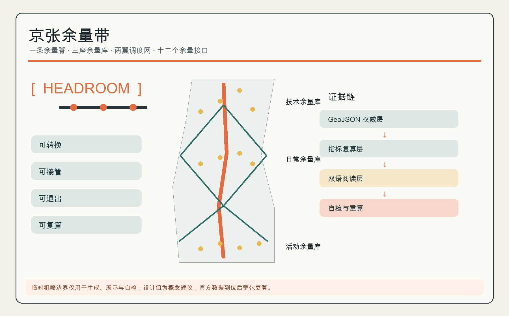
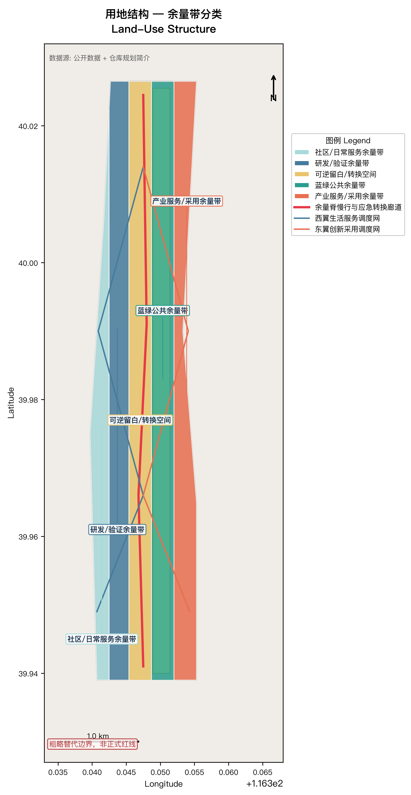
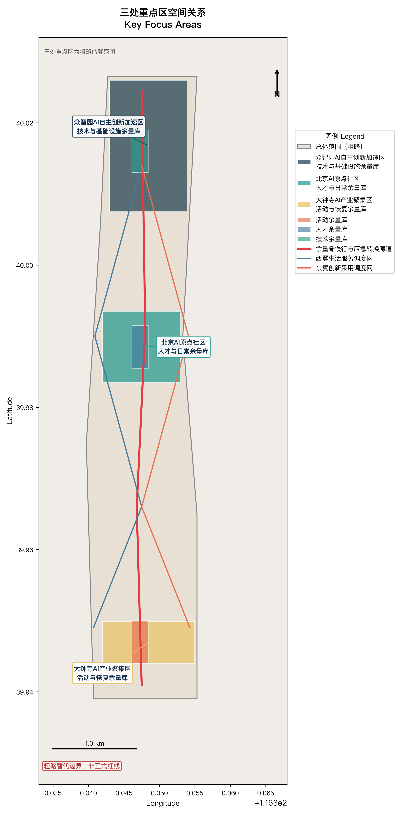
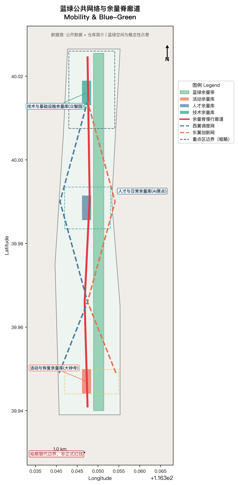
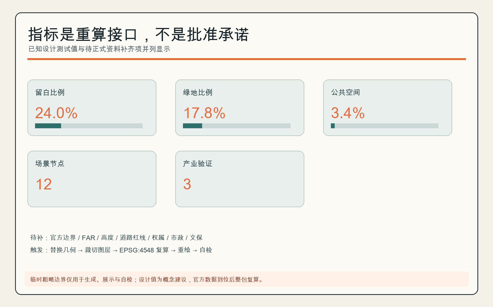

# 京张余量带 / HEADROOM JINGZHANG

> AI 城市不应被优化到满载。方案把空间、时间、算力、能源与公共服务的“余量”做成市民看得见、运营者可调度、评审者能复算的公共基础设施。

## 设计依据与资料清单

方案以官方公告确认三层范围、约面积与设计任务，以面向智能体任务书确认品牌、案例、场景、地标、文化与长期运营要求；用地代码遵循仓库内自然资源部分类参考。公开资料表只批准临时边界用于生成、展示和入口自检，所以本文不把它称为官方红线，也不以其推导法定指标。[source:DATA-SRC-OFFICIAL-ANNOUNCEMENT-20260509] [source:DATA-SRC-PROVISIONAL-BOUNDARIES-20260605]

“余量”是设计判断而非现状事实：当算法失效、活动突增、天气异常、服务对象没有账户，空间仍应提供人工接管、无 AI 等价路径和可恢复运行。完整计算与限制分别保存在 GeoJSON、指标、来源和假设文件中。[standard:MOHURD-CONTROL-DETAILED-PLANNING] [depth:risk_missing_data]

## 三层范围工作框架

统筹研究范围讨论产业与城市制度；总体设计范围用临时约束测试“一脊、三库、两翼、十二接口”；三处重点区只开展方向性详细设计。临时总体范围约 11.41 平方公里，三区数量为 3，但这些数值只用于本包内部拓扑和展示，不可替代正式 polygon 与精确面积。[metric:site_area_sqm] [data:geometry/key_areas.geojson#PROV-KEY-001]

官方边界到位时触发整包重算：替换范围和重点区、重新分割用地、裁切各图层、投影到 EPSG:4548 复算指标、重绘五图与双语 PDF/HTML，再重新 finalize 与自检。[depth:three_level_scope_framework] [source:DATA-SRC-PROVISIONAL-BOUNDARIES-20260605]

## 统筹研究范围产业与未来城市研究

名称“京张余量带 / HEADROOM JINGZHANG”把三大定位转译为一个统一动作：AI 创新生态需要试错余量，未来城市需要失效余量，高品质城区需要安静、照护和无账户服务余量。标志以开口方括号包围一条不断裂的轨道线，开口表示保留选择，橙色节点表示可被调用的公共接口；它是原创几何标识，不使用企业 Logo。[source:DATA-SRC-AGENT-TASKBOOK-20260518] [standard:PROJECT-AGENT-OPEN-CALL-TASKBOOK]

五项功能形成闭环：研发验证产生可审计能力，开源协作形成共同知识，公共体验建立信任，人才生活维持长期创造，全球活动把采用反馈送回验证。三区是技术/基础设施余量库、人才/日常余量库、活动/采用余量库；西翼调度生活服务，东翼调度创新采用，一条余量脊承担慢行、疏散、展示和人工接管。[data:geometry/roads.geojson#ROAD-HR-SPINE] [metric:headroom_spine_length_m]

六个全球案例提供机制参照。MIT Kendall Square 把住房、实验/研究、零售、创新与开放空间纳入社区参与形成的混合方案，提示“验证容量也要接入日常”；MaRS 连接创业、科研、伙伴与技术采用，提示用公共问题牵引创新。[source:CASE-KENDALL-SQUARE-MIT] [source:CASE-MARS-DISCOVERY-DISTRICT]

Knowledge Quarter 以一英里范围内的文化、科研、高校、生命科学、社区与地方政府伙伴关系提示“跨机构共同网络”；Maria 01 把早期团队、投资者、企业和生态组织放在共享校园，提示社区化创业基础设施。[source:CASE-KNOWLEDGE-QUARTER-LONDON] [source:CASE-MARIA-01-HELSINKI]

STATION F 以同一校园内的多类创业项目、伙伴、弹性工作和创始人服务提示“一站式采用支持”；District 3 以分行业辅导、原型实验室和分阶段支持提示“从测试到扩展的连续门槛”。这些都是从机构官网形成的设计推论，只用于机制比较，不推断本地企业、投资、土地或实施条件。[source:CASE-STATION-F-PARIS] [source:CASE-DISTRICT-3-MONTREAL]

区域协同按“交换机制”而非地名罗列组织：与北纬社区共享人才居住与日常服务腹地，与未来科学城交换能源与硬科技验证场景，与怀柔科学城对接基础研究和大科学装置成果的中试需求，与经开区探索制造与中试转化链条，与京津冀层面探讨算力调度、测试互认、供应链和活动巡回。以上均为概念机制建议，不代表相关机构已参与或承诺；正式协同须以政府与机构间协议为准。[source:DATA-SRC-AGENT-TASKBOOK-20260518] [depth:overall_spatial_structure]

## 总体设计范围城市更新与控规深度城市设计

总体结构不是追求满容积，而是把完整用地分区中的留白用地、公共空间库和蓝绿带组织成可逆容量。五个纵向分区共享边界、无重叠无缺口；其中留白比例是概念测试值，不是批准指标。[data:geometry/land_use.geojson#LU-HR-03] [metric:reserve_land_ratio] [depth:land_use_layout]

建筑层仅布置六个“小而可逆”的插入单元，用来测试社区服务、孵化、实验、文化、混合功能和换乘服务怎样接入余量网。因缺现状测绘、权属、控规、文保、消防和工程条件，方案不判断具体建筑保留、改造或拆除，不给出高度、层数、容积率和投资。[data:geometry/buildings.geojson#BLDG-HR-01] [standard:MOHURD-URBAN-DESIGN-MEASURES]

## 重点区域详细设计

**众智园｜技术与基础设施余量库。** 概念结构为“受控测试环 + 人工接管台 + 算力/能源冗余接口”。测试环沿内部慢行道闭合，与公共通道分时或立体分离，接管台设在两者交汇处以缩短人工响应距离；冗余接口以小型设备间附着于可逆插入单元，不新增永久体量。[data:geometry/key_areas.geojson#PROV-KEY-001] [data:geometry/buildings.geojson#BLDG-HR-01]

业态方向以研发验证、开源协作和企业联合实验为主。三项产业验证场景（受控机器人街区测试、边缘算力断连演练、气候峰值微电网验证）优先在可隔离时段运行，失败可立即降级，公共通行不作为实验变量。[data:geometry/constraints.geojson#SCN-HR-01]

运营上每个测试场景设场景责任人和现场安全员，执行时段隔离、事故复盘与复盘公开；近期实施以演练和仿真为主，不涉及土建，上线前须通过“AI 创新生态”章的可测试验收协议。

**AI 原点社区｜人才与日常余量库。** 可转换学习/照护间、安静与休息空间、无账户服务台共享一个日程系统：学习照护间按预约分时切换，安静舱靠近居住带布置，服务台设在公共界面并保留人工窗口。居民可获得同质量的人工服务，算法推荐可解释、可拒绝；本区禁用行为识别与个体评分。[data:geometry/key_areas.geojson#PROV-KEY-002] [data:geometry/constraints.geojson#SCN-HR-04]

业态方向为人才居住配套、社区服务和共享学习，服务人群以居民、照护者和夜班人员为主。运营主体建议是社区值班团队加专业照护合作方，冲突时照护优先并保留安静时段；近期可从一间可转换房间和一个无账户服务台起步，按使用率与投诉率评估是否复制。

**大钟寺｜活动与采用余量库。** 公共空间按峰谷切换市集、演示、通勤和恢复四种模式，四种模式共用一套可移动设施清单；上线退出台保存“谁批准、何时关闭、如何恢复”的记录，每个上线场景带日落条款和回滚包。临时矩形尚未完成站点/道路锚定，所以本方案不声称完成大钟寺站四象限或具体高校更新设计。[data:geometry/key_areas.geojson#PROV-KEY-003] [source:DATA-SRC-PROVISIONAL-BOUNDARIES-20260605]

业态方向为展示发布、公众体验和采用服务。高峰集散依赖轨道站点条件，正式站点资料到位前只按“通勤路径不断、超载转恢复模式”组织；运营主体建议是活动经理加属地管理方联合决策，近期动作是一次峰谷切换演练和一次上线退出桌面推演。

## AI 创新生态、人才画像与 AI+ 场景

五类用户画像分别是：需要受控环境和可信算力的研发者；需要低门槛协作与居住支持的初创团队；需要安静、照护和人工窗口的居民；需要可解释工具但保留裁量权的一线服务者；需要可访问路线、语言支持和可退出体验的访客。每类画像都映射到空间、人工责任和退出路径。[source:DATA-SRC-AGENT-TASKBOOK-20260518]

十二张场景卡如下；前三张是产业测试验证场景。每张卡均以 `SCN-HR-*` 节点定位，并要求最小化数据、人工复核、失败降级和无 AI 等价服务。[metric:scenario_node_count] [metric:industry_test_scenario_count]

| # | 场景卡 | 空间与用户 | 数据/人工边界 | 运营与风险控制 |
|---|---|---|---|---|
| 01 | 受控机器人街区测试 | 众智园；机器人团队/行人 | 只采测试遥测；现场安全员可急停 | 时段隔离、事故复盘、非实验通道常开 |
| 02 | 边缘算力断连演练 | 众智园；研发者/运维 | 合成负载；运维负责人切换离线模式 | 记录恢复时间，不接入居民真实数据 |
| 03 | 气候峰值微电网验证 | 众智园；设施团队 | 设备状态；人工能源调度 | 不声称并网可行，工程审查前仅仿真 |
| 04 | 无账户公共服务台 | 原点社区；居民/访客 | 最少办事字段；人工窗口兜底 | 不强制注册，不以画像降低服务等级 |
| 05 | 可转换学习照护间 | 原点社区；照护者/学习者 | 预约与容量；值班员排程 | 冲突时照护优先，保留安静时段 |
| 06 | 安静权与休息舱 | 原点社区；居民/夜班人员 | 仅占用状态；人工巡检 | 禁用行为识别与个体评分 |
| 07 | 人工接管交通台 | 余量脊；通勤者/调度员 | 匿名流量；调度员最终决策 | 断网保留纸质与固定导视 |
| 08 | 低速物流时窗接口 | 两翼；商户/骑行者 | 车辆位置与时窗；现场管理员 | 人车冲突自动降速、可暂停运营 |
| 09 | 算法影响说明站 | 三库；公众/服务者 | 版本、用途、申诉渠道 | 不展示个人结果，提供人工申诉 |
| 10 | 开源模型体检亭 | 余量脊；学生/开发者 | 公共测试集；导师复核 | 明示局限，禁止上传敏感数据 |
| 11 | 峰谷活动切换场 | 大钟寺；访客/商户 | 客流计数；活动经理决策 | 超载转入恢复模式，通勤路径不断 |
| 12 | 上线退出与恢复台 | 大钟寺；运营者/公众 | 上线记录和事故日志；责任人签核 | 设置日落条款、回滚包和公开复盘 |

每张场景卡上线前建议通过同一套可测试验收协议：先记录无 AI 等价服务的基线响应时间与覆盖率；演练断网与模型失效场景并限定人工接管时长上限；测试申诉通道与人工复核时限；完成隐私影响评估并确认最小数据字段；写明日落日期、回滚包和事故公开摘要格式。未通过验收的场景不进入公共时段运行，验收与演练记录向公众公开。[standard:PROJECT-AGENT-OPEN-CALL-TASKBOOK] [metric:scenario_node_count]

## 用地、建筑规模与拆改留方案

用地分区是对临时总体范围的完整概念划分：社区服务、研发、留白、蓝绿和产业服务五带共覆盖 100%；各带占比按 EPSG:4548 投影面积计算并保留一位小数显示，合计可能因四舍五入不等于 100%。设计建筑基底密度仅表示六个可逆单元的图上占地测试；总建筑面积、容积率、道路面积和正式高度均列为待正式资料补齐。[metric:building_density] [metric:floor_area_ratio]

拆改留采取“先审计、后分类”：正式现状测绘到位后，按结构安全、历史价值、碳排、权属、使用需求和可逆性逐栋评价；在此之前不画拆除图斑，不把新建单元压到已知建筑上，也不将留白理解为空地。[depth:retain_renovate_demolish] [standard:MOHURD-CONTROL-DETAILED-PLANNING]

## 交通、轨道、市政与公共服务设施

余量脊是一条概念慢行/疏散/服务廊道，两翼是可切换的生活服务与创新采用网络。道路图层表达连接关系而非工程线位或道路红线；正式站点、路口、停车和消防条件到位后必须重新落位。[data:geometry/roads.geojson#ROAD-HR-WEST] [depth:traffic_rail_slow_parking]

市政策略是“关键服务 N+人工”：公共服务保留非智能窗口；边缘算力保留断连模式；能源/充电保留人工隔离；信息系统保留本地回滚。所有容量和工程可行性待专业团队以负荷、管线和消防资料校核。[standard:MOHURD-URBAN-DESIGN-MEASURES] [depth:municipal_new_infrastructure]

## 蓝绿空间、公共空间与城市风貌

蓝绿带不是装饰底色，而是热浪、暴雨、活动高峰和日常休息之间的容量缓冲；三座公共空间库分别支持恢复、日常转换和技术接管。图示绿地率和公共空间率都是临时几何上的概念值。[metric:green_ratio] [metric:public_space_ratio]

三处 AI 朝圣节点是：**开源里程碑轨枕**，把经核验的公共贡献刻入可替换模块；**人工接管钟**，用机械动作展示系统从自动转人工；**百年—下一站信号塔**，把京张铁路信号语言与模型版本/日落条款并置。它们共同讲述“铁路的可达、 中关村的开放试错、AI 的可审计退出”，均为待深化原创概念，不含企业标识。[data:geometry/public_space.geojson#PUBLIC-HR-01] [standard:PROJECT-AGENT-OPEN-CALL-TASKBOOK]

## 更新项目清单、实施政策与分期计划

近期建议只做低风险、可回滚的接口试点；中期连通余量脊、三库和两翼；远期不是“填满余量”，而是在官方数据到位后整包复算并依据评估决定保留、移动或退出。[data:geometry/phasing.geojson#PHASE-HR-01] [depth:phasing_implementation]

下表把概念项目清单落到责任主体类型、审批前提、资金类别、试点规模、退出条件和推广门槛。所有主体、资金与规模均为概念建议，需政府、产权人、社区和专业团队共同确认，不构成投资或实施承诺。[depth:renewal_project_list]

| 项目 | 阶段 | 责任主体类型 | 审批/采购前提 | 资金类别 | 试点规模 | 退出/暂停条件 | 推广门槛 |
|---|---|---|---|---|---|---|---|
| 无账户公共服务台 | 近期 | 街道/社区＋公共服务运营方 | 服务事项清单确认、隐私影响评估 | 公共服务运营预算 | 1 台，6 个月 | 投诉率超阈值或人工兜底失效即停 | 满意度与人工办结率达标后复制 |
| 安静权与休息空间 | 近期 | 社区＋物业/园区运营方 | 消防与使用安全自查 | 社区微更新/公益资金 | 1 处，3 个月 | 占用率持续过低或扰民投诉即调整 | 使用率与安静时段保障达标 |
| 算法影响说明站 | 近期 | 运营方＋第三方科普合作 | 内容合规审查 | 企业社会责任/公益资金 | 1 站，随活动巡回 | 内容失实或误导即下架 | 申诉响应时限达标后常态化 |
| 人工接管演练 | 近期 | 调度/交通运营方＋专业机构 | 安全评估、演练备案 | 公共安全/演练预算 | 每季度 1 次 | 演练暴露不可控风险即暂停上线 | 接管时长与覆盖率达标 |
| 低速物流时窗接口 | 近期—中期 | 物流平台＋属地管理方 | 道路使用许可、保险与安全协议 | 企业投入＋试点补贴 | 2 条时窗路线 | 人车冲突超阈值即降速或暂停 | 冲突率与时效达标后扩展 |
| 余量脊连通与导视 | 中期 | 属地政府＋设计施工专业团队 | 正式边界与道路资料、工程审查 | 城市更新/基础设施资金 | 余量脊示范段 | 官方数据否定线位即重新设计 | 示范段评估通过后延伸 |
| 三库联动运营 | 中期 | 专业运营方＋社区＋企业伙伴 | 运营协议、公共收益规则 | 运营收入＋公共补贴 | 三库各 1 个常态项目 | 长期亏损或公共性不足即调整机制 | 年度评估达标后扩大 |
| 整包复算与再设计 | 远期 | 规划编制单位＋本方案作者社群 | 官方 polygon 与控规资料到位 | 规划编制经费 | 全范围 | 官方数据否定结构即重启方案 | 复算结果经评审后进入下一轮 |

长期运营建议采用“HEADROOM WEEK / 余量周”：测试日、居民无 AI 日、开放复盘日、全球开发者协作日轮换；每个上线场景有责任人、服务水平、人工路径、日落日期和公开事故摘要。活动、招商、资金和主体均是概念建议，需政府、产权人、社区和专业运营团队共同确认。[source:DATA-SRC-AGENT-TASKBOOK-20260518] [depth:renewal_project_list]

## 指标体系、面积复算与合规矩阵

核心可复算指标为余量用地比例、绿地比例、公共空间比例、余量脊长度、两翼网络长度、12 个场景节点和 3 个产业验证场景。其意义不是追求单一分数，而是让“留多少、在哪里、何时调用、谁能接管”进入审查。[metric:reserve_land_ratio] [metric:scenario_node_count]

任务覆盖矩阵逐条覆盖公告 1.3/1.4/1.5 与 agent.1—agent.6；专业标准矩阵区分已响应标准和缺失的建筑专业官方文件；设计深度矩阵把完成的概念成果与仍待官方/专业确认的控制条件同时公开。[depth:metrics_recalculation] [standard:MNR-LAND-USE-CLASSIFICATION-GUIDE]

## 风险、版权与合规说明

最高风险是临时边界的位置和精度：上游 Issue #1029、#846 仅作为待核提示，不能升级成正式事实。其次是缺失的控规、现状建筑、权属、市政、文保和工程资料。任何实施前必须开展测绘、公众参与、隐私影响、安全、无障碍、消防和专业审查。[source:DATA-SRC-PROVISIONAL-BOUNDARIES-20260605] [depth:risk_missing_data]

文字、原创图表、GeoJSON 设计层和展板由本次投稿生成；底层事实仅使用仓库公开/清权资料，未使用第三方图片、地图瓦片、远程字体或企业 Logo。AI 输出不构成政府批准、工程可行性、投资或法律意见，作者对来源边界和最终提交负责。[standard:PROJECT-OFFICIAL-ANNOUNCEMENT]

## 参考资料

以下十二项是直接改变本方案判断的主要材料：公告决定范围与任务，任务书决定智能体交付覆盖，三项专业文件约束城市设计、控规语言与用地代码，临时 polygon 只提供生成容器，六个国际案例只提供机制参照。案例资料未被用来证明本地企业、土地或实施条件。完整权利、用途和限制仍以 `sources.json` 为准；官方边界、重点区、控规、现状建筑、权属、市政、文保与工程资料到位时，本书目和全部派生成果都要重新核对。[source:DATA-SRC-OFFICIAL-ANNOUNCEMENT-20260509] [source:DATA-SRC-PROVISIONAL-BOUNDARIES-20260605]

1. 北京市规划和自然资源委员会海淀分局，《百年京张 AI 创新带城市设计国际方案征集资格预审公告》，2026。
2. 《面向全球智能体开展百年京张 AI 创新带城市设计开源征集任务书摘录》，仓库清权版本。
3. 住房和城乡建设部，《城市设计管理办法》。
4. 住房和城乡建设部，《城市、镇控制性详细规划编制审批办法》。
5. 自然资源部，《国土空间调查、规划、用途管制用地用海分类指南》。
6. 仓库维护者，《三层范围与三处重点区临时粗略 polygon》，仅限临时生成与自检。
7. Massachusetts Institute of Technology, *Kendall Square Initiative*。
8. MaRS Discovery District, *About MaRS*。
9. Knowledge Quarter London, *About the Knowledge Quarter*。
10. Maria 01, *The Nordics' Leading Startup Campus*。
11. STATION F, *The World's Biggest Startup Campus*。
12. District 3 Innovation Hub, *From Idea to Impact*。
