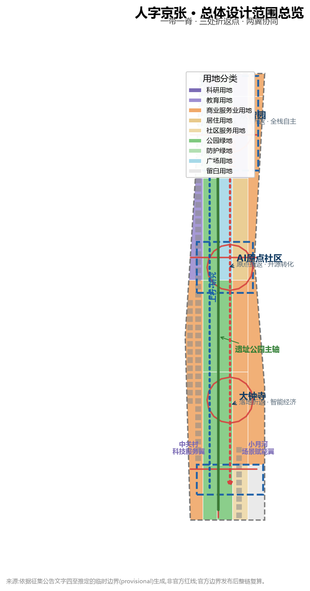
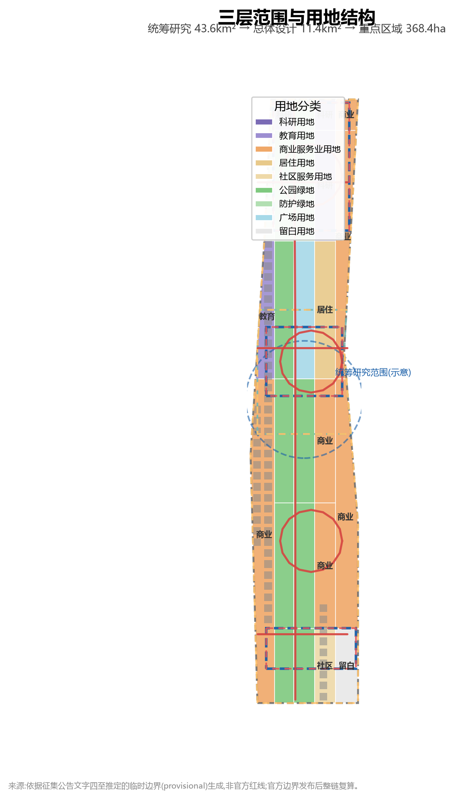
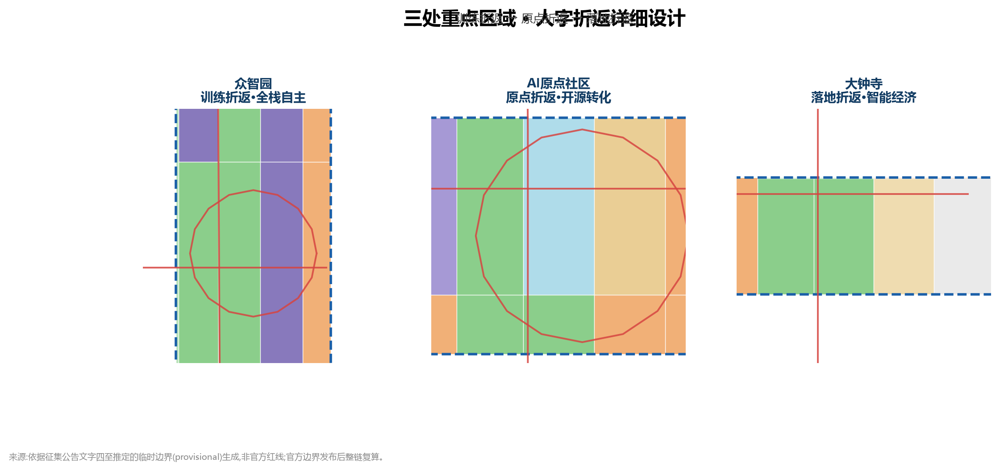
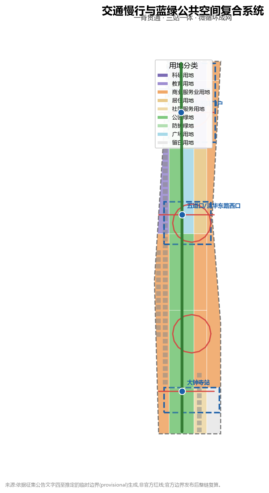
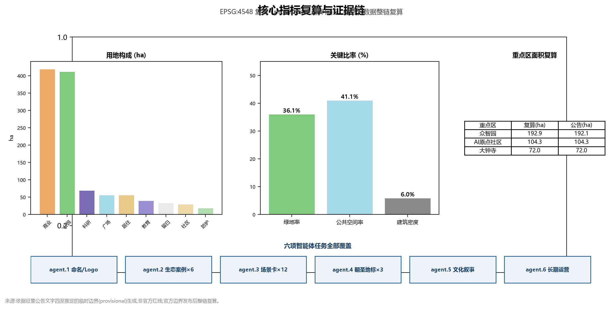

# 人字京张 JINGZHANG HERRINGBONE——百年折返·创新翻山:AI创新带城市设计方案

## 设计依据与资料清单

本方案以北京市规划和自然资源委员会海淀分局发布的《百年京张AI创新带城市设计国际方案征集资格预审公告》为第一依据 [source:OFFICIAL-ANNOUNCEMENT]。公告明确三层范围(统筹研究约43.6平方公里、总体设计约11.4平方公里、重点区域合计约368.4公顷)、三大定位(百年京张文化带、都市AI生活体验带、AI融合创新带)和"控规城市设计深度+规划综合实施方案深度"的成果要求 [standard:PROJECT-OFFICIAL-ANNOUNCEMENT]。

第二依据是面向智能体的共创任务书 [source:AGENT-TASKBOOK],其十大共创原则、五大功能、三区两翼和六项智能体任务(agent.1–agent.6)构成本方案的任务骨架 [standard:PROJECT-AGENT-OPEN-CALL-TASKBOOK]。所有 agent 空间建议均为概念建议、参考方案或可供专业团队深化的研究材料,不替代正式规划,不构成政府审定结论 [source:AGENT-TASKBOOK]。

第三依据是政府年度工作安排与公开报道反映的**发展目标与现状基础**,构成方案空间判断的现实起点:

- **海淀区政府2026年国民经济和社会发展计划报告**(2026-02-06)明确提出"构建高效协同的南北AI双核生态区,**打造京张遗址公园创新交往带**",要求"谋划'人工智能+'标杆空间,优先落地一批**可感可及、示范引领的创新场景**",并部署"支持智源打造统一开源系统软件栈众智平台""推动人力资源服务产业园深度参与海淀AI原点社区建设" [source:HAIDIAN-2026-GOV-PLAN]。这三点分别是本方案"创新交往带空间""可感知场景""开源与原点社区"三条设计主线的政策锚点。
- **京张铁路遗址公园二期已于2026年8月6日建成开放**:串联西直门至北五环总长9公里的文化带状绿廊,用地约53公顷,直接服务沿线70个社区、45万居民;已建成"三道一绿"无缝慢行系统、南段复原铁轨与焊轨厂工业遗迹、北段"京张之环"主题广场,并**预留青年科创市集活动场地** [source:JZ-PARK-PHASE2-2026]。公园现状是本方案公共空间设计的现实基底,本方案不重复已建成内容,而是补足其"创新交往"功能缺口。
- **AI原点社区已实际运营**:2026年1月入选北京市首批人工智能创新街区,2025年跻身"全球十大创新区",以原点大厦为圆心辐射约3平方公里,汇聚30余所高校及科研机构、230余家AI企业、10万AI相关专业学子,已建成原点大厦、"胜算之门"艺术装置、星光大道机器人消费场景,并举办"原点party nights"等品牌活动 [source:AI-ORIGIN-COMMUNITY]。本方案的三处折返点设计以这些已建成事实为起点,做"补链、串联、升维"而非另起炉灶。
- **开源是国家级战略方向**:2026中关村论坛年会"人工智能主题日"AI开源前沿论坛上,北京智源发布众智FlagOS 2.0智算基座(面向智能体时代的开源系统软件栈),国家层面专项部署人工智能开源项目 [source:ZGC-FORUM-OPENSOURCE-2026]。开源成果的公共展示与开发者荣誉空间,是本方案朝圣地标体系的重要依据。

第四依据是仓库维护者登记的机器可读资料包:`brief/site-package/` 中的设计简报、允许设计空间、枚举、指标范围与 Schema,以及 `data/source_registry.json` 的来源可用性注册 [source:SITE-PACKAGE] [source:SOURCE-REGISTRY]。`data/processed/agent_fact_pack.md` 仅作阅读导航 [source:PROCESSED-FACT-PACK]。

本方案空间计算使用仓库提供的**临时粗略边界**(`brief/site-package/geometry/provisional_boundaries.geojson`),所有图层标注 `provisional_constraint`、`official_boundary=false` [data:geometry/site_boundary.geojson#SITE-001] [data:geometry/key_areas.geojson#PROV-KEY-001]。该边界依据公告文字四至与约面积推定,不表达道路红线、地块边界或权属边界;官方 polygon 发布后,本包全部图层与指标须整链重算,此数据缺口不阻断内容评分 [source:BOUNDARY-SOURCE]。

**设计原因说明**:本方案每个设计决策(某位置/区域/细节为什么这么设计)的完整推理链——政策依据→现实问题→设计对策→空间落点——集中记录于文末"设计决策说明"章节;proposal.md 正文各章写设计结论与空间落点,推理过程可在该章节追溯。

## 三层范围工作框架

方案按公告确定的三层范围组织工作,每一层对应明确的设计问题、成果深度和数据落点 [depth:three_level_scope_framework]:

| 层级 | 设计问题 | 方案回答 | 数据落点 |
| --- | --- | --- | --- |
| 统筹研究范围(43.6km²) | AI产业生态与未来城市形态 | "人字折返"创新链:高校策源—开源协作—企业转化—公共体验—国际传播 | compliance_matrix、standard_matrix |
| 总体设计范围(11.4km²) | 产业空间、城市更新、交通市政与风貌 | 一带一脊、三折返点、两翼协同的用地与公共空间结构 | [data:geometry/land_use.geojson#LU-001]、[data:geometry/roads.geojson#ROAD-001] |
| 重点区域范围(368.4ha) | 三处片区精细化设计 | 众智园/原点社区/大钟寺分别作为训练折返、原点折返、落地折返的详细方案 | [data:geometry/key_areas.geojson#PROV-KEY-001]、[data:geometry/key_areas.geojson#PROV-KEY-002]、[data:geometry/key_areas.geojson#PROV-KEY-003] |

**总体空间结构:"一带一脊、三处折返点、两翼协同、多点场景"。** 一带即京张遗址公园活力带(南北主轴,即"人"字的轨道);一脊即公园慢行主脊;三处折返点即三处重点区域;两翼即中关村科技服务翼(西)与小月河场景赋能翼(东),构成"人"字两撇;多点场景即沿带分布的 AI 场景驿站 [depth:overall_spatial_structure]。

本方案的核心隐喻来自京张铁路八达岭段的**"人"字形折返线路**:1909 年詹天佑以折返爬坡方式征服 33‰ 陡坡,用两台机车一推一拉完成翻越,是中国人自主修建第一条铁路的标志性工程创举。百年之后,海淀 AI 创新带以同一智慧组织创新:**创新不是直线,而是折返**——"上行列车"(基础研究与原始创新)从众智园出发,在 AI 原点社区完成转化(折返),再以"下行列车"(场景应用与产业落地)抵达大钟寺;每次折返都是一次价值跃迁,"人"字同时是"以人为本"的"人" [source:AGENT-TASKBOOK] [depth:three_level_scope_framework]。

这一隐喻与政府目标存在三重呼应:其一,京张铁路"自主修建"与AI"自主创新"共享同一精神基因,呼应海淀"南北AI双核生态区"的自主自强叙事 [source:HAIDIAN-2026-GOV-PLAN];其二,"折返=转化"的空间逻辑把"创新链"转译为"可步行、可感知"的城市动线,呼应"打造京张遗址公园创新交往带"的目标 [source:HAIDIAN-2026-GOV-PLAN];其三,公园二期已建成的9公里绿廊为"人字主轴"提供了现成载体,本方案在其上"补链"而非"重建" [source:JZ-PARK-PHASE2-2026]。

## 统筹研究范围产业与未来城市研究

### 问题诊断:政府目标与现状差距

统筹研究范围回答"海淀 AI 产业向何处去、创新带承担什么角色"。政策分析显示,政府的期望是三条线的合流 [source:HAIDIAN-2026-GOV-PLAN]:产业线(南北AI双核生态区)、空间线(京张遗址公园创新交往带)、场景线(可感可及、示范引领的创新场景)。对照现状,存在四个现实差距:

一是**公园空间与AI叙事的落差**:9公里绿廊已建成,但以历史科普、生态休闲、通勤健身为主,缺少承载"创新交往"的空间语言——开发者、创业者、研究者停留、讨论、展示的"第三空间" [source:JZ-PARK-PHASE2-2026];二是**三区两翼创新链缺少空间链条感**:AI原点社区内部高度活跃,但众智园、大钟寺与原点社区之间的创新联系停留在产业逻辑,公共空间层面缺乏南北贯通的"链条" [source:AI-ORIGIN-COMMUNITY];三是**开源成果缺少公共展示与荣誉空间**:众智FlagOS等国家级开源成果诞生在海淀,但公众无处可看、开发者无荣誉可记 [source:ZGC-FORUM-OPENSOURCE-2026];四是**文化叙事未整合**:京张铁路、中关村、AI三线文化尚未形成统一叙事与国际表达。

### 设计对策:三大定位与五大功能的空间化

针对上述差距,方案把三大定位落实为可操作的空间与运营机制 [source:AGENT-TASKBOOK]:

- **百年京张文化带**:以遗址公园为历史主轴,把"人"字形折返的工程智慧转化为城市叙事与公共艺术系统,补足公园的"文化叙事层" [depth:culture_narrative_spatial_expression] [source:JZ-PARK-PHASE2-2026]。
- **都市AI生活体验带**:以五道口、清河、大钟寺等轨道节点为骨架,把AI+交通、AI+公共服务、AI+消费组织为可步行、可感知的日常体验,落实"可感可及"要求 [depth:scenario_space_operation_matrix] [source:HAIDIAN-2026-GOV-PLAN]。
- **AI融合创新带**:以"上行—折返—下行"的创新回路组织全栈自主创新、开源生态与智能经济,呼应"南北AI双核生态区" [source:HAIDIAN-2026-GOV-PLAN]。

五大功能分别锚定在空间上:AI全栈自主创新体系(众智园)、世界级AI创新生态(AI原点社区)、AI+场景赋能新范式(小月河场景赋能翼)、智能化AI活力城市(公共空间与慢行系统)、AI治理全球话语权(众智园标准与安全治理+大钟寺数据要素流通) [source:AGENT-TASKBOOK]。

### 总体概念、命名体系与视觉规范(agent.1)

**主名称:"人字京张 JINGZHANG HERRINGBONE"**。命名体系分三层:

1. **一带主名**:人字京张(JINGZHANG HERRINGBONE)——"人"字形折返线路的百年记忆+创新带的空间隐喻,双关"以人为本";与政府"京张遗址公园创新交往带"提法直接对应 [source:HAIDIAN-2026-GOV-PLAN]。
2. **三处折返点名**:"训练折返·众智园""原点折返·AI原点社区""落地折返·大钟寺",与"上行—折返—下行"回路一一对应;其中"原点折返"与AI原点社区已运营的"原点"IP(原点大厦)自然衔接 [source:AI-ORIGIN-COMMUNITY]。
3. **节点与活动名**:"折返驿站"(AI场景节点)、"上行列车/下行列车"(产业与人才双向流动机制)、"翻山时刻"(年度创新节)。

**Logo方向**:以"人"字折返轨道为基本形——两条方向相反的箭头在一处折返点交汇,构成开放的"人"字形回路;一撇代表研究上行,一捺代表场景下行,交汇点即转化节点。Logo 仅为方向性概念,字体、图形与标准色待专业设计与清权后确定 [depth:brand_identity_logo] [source:AGENT-TASKBOOK]。

**视觉规范(方向性建议)**:为支撑"全球辨识度"目标 [source:AGENT-TASKBOOK],建议建立三层VI系统:(1)标准色——铁路铁锈红(#8C3B2E,遗产色)与AI电光蓝(#1B5FA8,未来色)为主色,清河绿(#2E7D32)与原点金(#C79838)为辅助色;(2)标准字体——中文采用思源黑体/微软雅黑加粗用于标题、正文用常规字重,英文采用无衬线体(Inter/Roboto),数字与代码标注采用等宽字体,保证国际传播的通用性;(3)辅助图形——以"人"字折返轨迹为单元生成连续纹样,用于导视、铺装、栏杆与活动视觉,形成从Logo到空间界面的统一识别。以上均为概念建议,标准色值、字库授权与应用规范待专业设计与清权后确定。

### 全球AI创新生态案例与海淀生态方案(agent.2)

方案对标 6 个全球 AI 创新生态案例,提炼可转化为空间、运营与场景机制的六条经验 [depth:case_study_table]:

| 案例 | 核心机制 | 对京张的转化 |
| --- | --- | --- |
| 美国硅谷(斯坦福—101公路走廊) | 大学策源+风险资本+企业集群的线性走廊 | 高校策源沿遗址公园主轴布置,资本服务置入中关村科技服务翼 |
| 美国波士顿肯德尔广场 | 近校街区型创新社区,成果转化与生活混合 | 强化 AI原点社区"近校成果转化街",呼应其已运营的近校生态 [source:AI-ORIGIN-COMMUNITY] |
| 新加坡榜鹅数字园区 | 花园型产业园区,绿色空间承载创新交往 | 众智园"花园型AI街区",清河界面承载低碳交往 |
| 英国伦敦国王十字更新区 | 轨道交通驱动的大规模城市更新+科创集聚 | 大钟寺站四象限一体化与智能经济街区 |
| 中国深圳南山科技园 | 龙头企业牵引+硬件创新生态 | 大钟寺领军企业牵引智能体与终端产业 |
| 德国慕尼黑数字工业集群 | 产业标准、测试验证与治理结合 | 众智园标准制定与安全治理展示节点 |

这些案例的共同经验是:**创新生态=策源(研究)+转化(中介)+落地(产业)+氛围(城市生活)** 四要素闭环。针对"覆盖基础研究、产业孵化和资本服务的海淀创新生态方案"要求,方案把四要素组织为三环节空间化方案 [depth:ecosystem_mechanisms]:

- **基础研究环节(策源)**:依托清华、北大、中科院等高校与智源等新型研发机构,落位于AI原点社区的"近校成果转化街"与高校协同创新教育用地 [data:geometry/land_use.geojson#LU-013];政府已部署"支持智源打造统一开源系统软件栈众智平台",本方案将开源发布厅作为其公共界面 [source:HAIDIAN-2026-GOV-PLAN]。
- **产业孵化环节(转化)**:沿"原点社区—众智园"形成孵化走廊——原点社区承载早期孵化、成果发布与人才特区服务,众智园承载中试测试、标准治理与产业展示;用地层面由孵化用地与研发测试用地共同支撑 [data:geometry/land_use.geojson#LU-009]。
- **资本服务环节(资本)**:中关村科技服务翼置入科技金融服务驿站、融资路演、知识产权与国际技术交易功能,与政府"科技金融服务驿站""创融海淀"布局衔接 [source:HAIDIAN-2026-GOV-PLAN];大钟寺国际路演客厅承担资本与产业的对接界面。

### 三区两翼协同回路

"三区两翼"构成双向回路:研究上行(高校—AI原点—众智园测试)、要素供给(中关村科技服务翼提供资本、IP与全球配置服务)、场景下行(小月河场景赋能翼把技术导入生活)、反馈回传(场景数据与需求回到策源端)。该回路不是单向流水线,而是可回退、可迭代的折返系统——任何一个环节验证失败,项目与场景可暂停、回退或重试 [source:AGENT-TASKBOOK] [depth:overall_spatial_structure]。与AI原点社区已运营的"十分钟创新圈"相比,本回路把创新要素的聚合尺度从"社区内部"扩展为"沿带九公里" [source:AI-ORIGIN-COMMUNITY]。

## 总体设计范围城市更新与控规深度城市设计

### 用地结构与产业空间

总体设计范围 11.4 平方公里,`geometry/land_use.geojson` 以 25 个无缝地块完整覆盖提交边界 [data:geometry/land_use.geojson#LU-001] [metric:land_use_parcel_count]。核心用地判断:

- **公园绿地、蓝绿廊道与广场(1401+1402+1403,约488.8公顷,占42.8%)**:以京张遗址公园活力带为脊柱(约412.5公顷),向北衔接清河-众智园蓝绿走廊与五环绿楔,向南延伸至大钟寺站复合公园,五道口AI原点广场(约56.9公顷)作为折返点象征 [data:geometry/green_space.geojson#GREEN-001] [metric:green_ratio]。绿地率设计目标体现"花园型AI创新带"定位,支撑人才向往的高品质城区。
- **商业服务业用地(05,约420.0公顷,占36.8%)**:集中在大钟寺智能经济街区、原点社区消费场景与众智园产业服务界面,承载智能体、智能终端、内容消费与数据要素流通 [data:geometry/land_use.geojson#LU-005]。
- **科研与教育用地(0802+0804,约110.9公顷)**:众智园AI全栈研发测试(约70.2公顷)与高校协同创新教育用地(约40.7公顷),构成"策源—转化"的上行段 [data:geometry/land_use.geojson#LU-009] [data:geometry/land_use.geojson#LU-013]。
- **居住与社区服务(0701+0702,约87.6公顷)**:AI人才社区(约56.9公顷)紧邻原点社区,服务"工作-生活-社交-学习"一体化 [data:geometry/land_use.geojson#LU-016]。

### 建筑规模与拆改留逻辑

`geometry/buildings.geojson` 以 60 个示意建筑基底表达更新街区的空间供给形态(约68.3公顷,建筑密度约6.0%) [data:geometry/buildings.geojson#BLDG-001] [metric:building_footprint_area_sqm] [metric:building_density]。拆改留按三类逻辑处理 [depth:retain_renovate_demolish]:

- **保留**:清华园火车站等历史遗存、遗址公园已实施段、现状高校与园区主体建筑;
- **改造**:沿带低效厂房、批发市场与老旧商业界面,以"功能置换+形态更新"为主;
- **新建/留白**:潜力更新地块与南部留白用地(约33.8公顷),作为弹性创新预留 [data:geometry/land_use.geojson#LU-005]。

容积率、建筑高度、建筑密度、退线与道路红线等法定控制指标在公开资料中不可得,`metrics.json` 中 `floor_area_ratio` 标注为 unknown,待官方控规条件确认后复算 [metric:floor_area_ratio] [assumption:A-CONTROLS-001]。

### 更新项目清单与实施政策

总体设计形成六类更新项目(JZ-01—JZ-06),覆盖慢行断点缝合、清河创新界面、近校成果转化街、大钟寺四象限连通、AI公共服务节点与全球AI活动路线 [depth:renewal_project_list],详见"更新项目清单、实施政策与分期计划"章。实施政策建议:统筹更新主体、弹性容积奖励与公益空间挂钩、场景开放许可、数据要素合规流通框架与公共参与机制,均作为概念建议提出 [depth:phasing_implementation]。

## 重点区域详细设计

三处重点区域分别达到规划综合实施方案的城市设计深度,每个片区形成"定位+空间结构+建筑更新+交通慢行+公共空间+AI场景+实施风险"的完整小方案 [depth:three_key_area_detailed_design],空间证据分别对应众智园、AI原点社区与大钟寺三个图层要素 [data:geometry/key_areas.geojson#PROV-KEY-001]。

### 众智园AI自主创新加速区(训练折返·约192.1公顷)

**定位**:花园型全栈自主创新街区,AI"上行列车"始发站。**空间结构**:以清河界面为北缘生态与展示界面,组织"研发测试核+标准治理台+产业展示廊"三角结构。**建筑更新**:以国家AI平台及周边潜力用地为核心,建议功能业态为全栈研发、标准工作坊、安全治理展示与低碳算力体验;形态以低多层花园式街区为主。**交通慢行**:结合五环区域一体化提出对外交通优化方向,内部组织慢行优先微循环 [data:geometry/roads.geojson#ROAD-004]。**公共空间**:清河-众智园蓝绿走廊承载开放测试与创新交往 [data:geometry/green_space.geojson#GREEN-001]。**AI场景**:模型红队测试场、标准制定工作坊、安全治理展示、低碳算力体验。**实施风险**:清河蓝线与防洪条件、国家平台周边用地权属、五环对外交通方案均待官方数据确认。

### 北京AI原点社区(原点折返·约104.3公顷)

**定位**:近校型成果转化与人才社区,创新链"折返点"。**空间结构**:以五道口—清华东路西口轨道节点为门户,组织"成果转化街+开源发布厅+人才社区"三片区。**建筑更新**:提出低扰动、有机更新的拆改留方案——高校周边旧有商业与居住界面以功能置换为主,新增成果孵化与人才服务载体。**交通慢行**:围绕五道口、清华东路西口轨道站一体化设计,缝合校区、园区与街区慢行联系 [data:geometry/roads.geojson#ROAD-002]。**公共空间**:五道口AI原点广场与开源会场(1403广场用地)作为折返点象征 [data:geometry/public_space.geojson#PUBLIC-001]。**AI场景**:开源发布厅、近校成果转化街、人才特区服务、AI教育体验。**实施风险**:校区边界、权属与首层业态受高校与街区现实条件约束,需逐一确认。

### 大钟寺AI产业聚集区(落地折返·约72.0公顷)

**定位**:城市型智能经济与国际交往街区,AI"下行列车"终点站。**空间结构**:以大钟寺站为锚点,组织"四象限步行连通+智能经济街区+数据要素服务台"。**建筑更新**:围绕领军企业周边潜力地块与高校更新改造方案,建议智能体、智能终端、内容消费等功能业态。**交通慢行**:开展大钟寺地铁站路口四象限步行连通设计,完善非机动车停放与静态交通组织 [data:geometry/roads.geojson#ROAD-003]。**公共空间**:大钟寺站复合公园绿地复合利用,承担产业展示与国际交往 [data:geometry/green_space.geojson#GREEN-001]。**AI场景**:智能体与终端展示、内容消费体验、数据要素沙盒流通、国际路演。**实施风险**:轨道一体化方案、规划绿地复合利用条件与重点企业周边权属待确认。

## AI 创新生态、人才画像与 AI+ 场景

### 问题诊断与对策:AI+场景如何进入具体街区

针对"设计AI+医疗、AI+教育、AI+商业等场景如何进入具体街区,构建可感知的未来生活场景"的要求,方案遵循两条原则:一是**场景必须可感知**——与政府"可感可及、示范引领"要求一致,场景落在真实街道界面而非抽象节点 [source:HAIDIAN-2026-GOV-PLAN];二是**场景必须与已建成现实衔接**——AI原点社区已有"星光大道"机器人消费场景,本方案在其基础上扩展而非重复 [source:AI-ORIGIN-COMMUNITY]。据此提出**三条示范街区**:

| 示范街区 | 位置 | AI+领域 | 进入街区的方式 |
| --- | --- | --- | --- |
| 五道口智育街 | AI原点社区,沿五道口-清华东路西口站间街段 | AI+教育 | 沿街界面植入"AI课堂橱窗"(高校公开课/模型演示)、近校成果转化驿站、学生创新工坊首层,利用已运营的社区人流与高校资源 [source:AI-ORIGIN-COMMUNITY] |
| 大钟寺智商街 | 大钟寺站四象限 | AI+商业 | 依托站城一体化,首层组织智能体门店、终端体验店、内容消费空间,与规划绿地复合利用衔接,形成"出站即体验"的动线 |
| 清河智医界面 | 众智园临清河段 | AI+医疗 | 结合智慧养老与AI辅助诊疗方向,在社区服务用地植入AI健康小屋、远程诊疗驿站,与清河蓝绿界面形成"健康+绿色"复合场景 [source:HAIDIAN-2026-GOV-PLAN] |

三条示范街区均落到建筑基底与公共界面图层,作为"AI+场景如何进入具体街区"的可读示范 [data:geometry/buildings.geojson#BLDG-001] [depth:scenario_space_operation_matrix]。

### 五类用户画像(agent.3)

方案建立五类用户画像,每类对应空间响应与治理边界 [depth:persona_table]:

| 用户画像 | 典型需求 | 空间响应 | 自检边界 |
| --- | --- | --- | --- |
| 开源开发者 | 发布、协作、测试、社区声誉 | 原点社区开源发布厅、公共代码墙、夜间协作空间 | 不采集个人行为轨迹,活动数据只做聚合统计 |
| 初创团队 | 低成本办公、算力入口、产品试验场 | 众智园共享测试场、端侧算力驿站、标准治理咨询 | 算力与数据服务需另行授权 |
| 头部企业访客 | 展示、商务、国际接待、人才招聘 | 大钟寺国际路演客厅、轨道站点接驳、重点企业周边公共空间 | 企业标识与案例须清权 |
| 周边居民 | 通勤、休闲、社区服务、低扰动更新 | 遗址公园慢行环、社区服务嵌入、夜间照明与活动分级 | 不将居民画像用于商业推荐 |
| 高校师生 | 成果转化、跨校协作、日常慢行 | 校区-园区慢行缝合、成果转化驿站、AI教育体验点 | 校园数据与科研成果需授权 |

### 十二张AI场景卡(agent.3,含3个产业测试验证场景)

场景卡覆盖产业场景与城市功能场景,每张卡说明空间载体、服务对象、数据来源、隐私边界、人工复核与运营主体 [depth:scenario_space_operation_matrix]:

| 场景卡 | 空间载体 | 类型 | 设计说明 |
| --- | --- | --- | --- |
| 01 模型红队测试场 | 众智园 | **产业测试验证** | 面向全栈模型的对抗性测试与安全评测,可参观、可预约、可监管;测试结果人工复核后发布 |
| 02 数据要素沙盒流通间 | 大钟寺 | **产业测试验证** | 以合规、授权、可审计为前提的数据要素与数字资产流通试验;不处理个人隐私数据 |
| 03 端侧算力驿站 | 总体设计范围节点 | **产业测试验证** | 端侧算力与分布式能源结合的新基建原型,小规模试点,验证后分级推广 |
| 04 开源发布厅 | AI原点社区 | 产业场景 | 成果发布、代码贡献展示与小型路演,服务开发者社区;与智源开源生态衔接 [source:ZGC-FORUM-OPENSOURCE-2026] |
| 05 近校成果转化街 | AI原点社区 | 产业场景 | 孵化、展示、法务、知识产权与投融资服务一条街 |
| 06 大钟寺国际路演客厅 | 大钟寺 | 产业场景 | 智能体、终端与内容消费企业的展示洽谈与媒体发布 |
| 07 AI慢行导航与断点识别 | 遗址公园脊 | 城市功能场景 | 可解释导视与低侵入传感识别慢行断点、拥挤与无障碍需求;数据最小化 |
| 08 清河低碳创新廊 | 众智园临河界面 | 城市功能场景 | 绿色空间、雨洪、步行骑行与AI展示结合的公共客厅 |
| 09 AI生活服务样板街 | 社区与商业交汇处 | 城市功能场景 | 医疗、教育、法律、生活服务等AI+场景的小尺度街区落地 |
| 10 清华园站AI文化导览 | 遗址公园南段 | 城市功能场景 | 百年京张文化+中关村创新+AI新文化的可解释导览 |
| 11 公共安全AI复核演练场 | 公共空间节点 | 城市功能场景 | 活动安全、人流疏导的AI辅助演练,人工决策保留最终裁决 |
| 12 全球AI活动周路线 | 一带公共空间系统 | 运营场景 | 从遗址文化、开源社区、产业展示到国际路演的可步行体验路线 |

所有场景遵守数据最小化、公开来源、可解释与人工复核原则:城市智能体可辅助识别慢行断点、公共空间热力、设施维护与活动安全风险,但不能替代规划审批、不能输出未经授权的个人画像、不能声称获得官方实施承诺 [standard:GENERATIVE-AI-INTERIM-MEASURES] [depth:privacy_human_review_boundary]。

## 蓝绿空间、公共空间与城市风貌

### 现状分析与功能补链:公园公共空间的创新交往缺口

京张公园二期已建成9公里绿廊与"三道一绿"慢行系统 [source:JZ-PARK-PHASE2-2026],本方案不重复建设,而是针对三个功能缺口做"补链":一是**创新交往空间缺位**——绿廊以生态休闲为主,缺少开发者、创业者停留交往的场所;二是**开源成果无处展示**——国家级开源成果没有面向公众的展示界面 [source:ZGC-FORUM-OPENSOURCE-2026];三是**贡献者无荣誉空间**——开发者贡献在城市尺度上没有记录载体。据此设计三个地标组件:

### 地标组件一:开发者散步道(沿遗址公园慢行脊)

**设计逻辑**:公园已建成步行慢跑骑行三道 [source:JZ-PARK-PHASE2-2026],本组件在步行道沿线叠加"创新交往"功能,不新增道路。**空间动作**:在步行道两侧设置开放式讨论节点(林下坐席+白板/触屏讨论终端+可移动路演台),每约500米一个"折返驿站",与AI场景卡07(慢行导航)联动;节点选址优先在众智园、原点社区、大钟寺三处折返点与公园的交界处,使"散步即交往"。**图层与指标**:公共空间图层 [data:geometry/public_space.geojson#PUBLIC-001] [metric:public_space_ratio]。**实施风险**:驿站设施需与公园管理机构协调,照明与无障碍按现行规范执行 [standard:BARRIER-FREE-ENVIRONMENT-LAW]。

### 地标组件二:开源成果展示廊(原点社区)

**设计逻辑**:开源是国家战略、智源FlagOS等成果诞生在海淀 [source:ZGC-FORUM-OPENSOURCE-2026],但公众无处可看;AI原点社区已具备人流与生态 [source:AI-ORIGIN-COMMUNITY],是展示廊的最优落点。**空间动作**:在原点社区近校成果转化街设置"开源成果展示廊"——以可更新的数字展墙+实物展柜呈现开源模型、数据集、代码贡献,内容经版权与安全审查后公开展示;与开源发布厅(场景卡04)共用空间,形成"发布—展示—交流"一体。**图层与指标**:建筑基底与公共空间图层 [data:geometry/buildings.geojson#BLDG-001]。**实施风险**:展示内容涉及企业知识产权,须建立授权与审核机制。

### 地标组件三:智能体贡献荣誉墙(五道口·人字折返观景台)

**设计逻辑**:开发者是AI创新的核心贡献者,但城市空间缺少对他们的荣誉记录;以"人"字形折返轨道为形体的观景台是折返点象征,荣誉墙与之结合形成"贡献即地标"。**空间动作**:在五道口人字折返观景台内设**智能体贡献荣誉墙**——以可更新的数字铭牌记录开源贡献者、模型作者、场景共建者(经本人同意与授权后展示),与开发者社区运营(agent.6)联动,形成"贡献-记录-荣誉"闭环 [depth:honor_display_system]。**图层与指标**:公共空间图层 [data:geometry/public_space.geojson#PUBLIC-001]。**实施风险**:个人信息保护须严格遵循授权与最小化原则 [standard:GENERATIVE-AI-INTERIM-MEASURES]。

### 三个AI朝圣地标(agent.4)

1. **清华园火车站·百年原点纪念标**(AI原点社区南侧):京张铁路历史遗存+AI文化原点,设置"从汽笛到算力"时间轴装置,荣誉展示清华园站与海淀AI发展的双百年叙事 [depth:landmark_catalog];
2. **五道口·人字折返观景台**(AI原点社区):以"人"字形折返轨道为形体的公共构筑物,象征创新链的转化节点,内设开源贡献荣誉墙与开发者纪念铭牌 [depth:honor_display_system];
3. **大钟寺·AI世界之窗**(大钟寺站复合公园):以数据流与模型推理为意象的公共艺术地标,承载国际路演与成果发布,面向全球传播 [source:AGENT-TASKBOOK]。

地标均为概念建议,不表达已批准建设;所有导视、标识、符号与公共艺术须完成版权清权后实施 [depth:signage_symbol_system]。

### 公共空间组件库

为支撑"可感可及"要求 [source:HAIDIAN-2026-GOV-PLAN],建议建立公共空间组件库:讨论节点(林下坐席+白板)、展示单元(数字展墙+实物展柜)、荣誉单元(数字铭牌)、路演台(可移动)、导视单元(人字纹样)五类组件,可组合复用于三处折返点与驿站,保证全带视觉统一。

## 交通、轨道、市政与公共服务设施

交通方案围绕轨道站点一体化、道路微循环、慢行断点、对外交通、停车与非机动车组织展开 [depth:traffic_rail_slow_parking]:

- **慢行主脊**:京张遗址公园南北贯通慢行道为"人"字轨道,组织东西缝合口与跨环路节点 [data:geometry/roads.geojson#ROAD-001];与公园二期已建成的"三道一绿"系统衔接,做功能补链而非新建 [source:JZ-PARK-PHASE2-2026]。
- **轨道一体化**:五道口、清华东路西口、大钟寺三处站点开展一体化设计,以轨道站点为折返点门户 [data:geometry/roads.geojson#ROAD-002] [data:geometry/roads.geojson#ROAD-003]。
- **微循环**:三处重点区各设街区微循环环路,衔接慢行与公交 [data:geometry/roads.geojson#ROAD-004] [data:geometry/roads.geojson#ROAD-005]。
- **对外交通**:结合五环区域一体化提出众智园对外交通优化方向。

市政与新型基础设施融合分布式能源、端侧算力、AI产业服务设施与人才生活服务设施 [depth:municipal_new_infrastructure]。道路红线、管线、消防与市政条件缺失部分列入 assumptions 待补,不写成审定条件 [data:geometry/constraints.geojson#CONSTRAINTS]。

## 文化叙事与导览路线(agent.5)

### 完整叙事:"汽笛—电路—算力"三幕

针对"把百年铁路文化、中关村文化和AI新文化组织成完整叙事"的要求,方案构建三幕叙事 [depth:culture_narrative_spatial_expression] [source:JZ-PARK-PHASE2-2026]:

- **第一幕·汽笛(1909-1949)**:京张铁路自主修建,詹天佑"人"字形折返,象征"自主、自强、敢为人先";空间载体为清华园火车站纪念标与遗址公园南段复原铁轨。
- **第二幕·电路(1978-2018)**:中关村"电子一条街"到科技园区,象征"创新、突围、要素集聚";空间载体为中关村科技服务翼与原点社区成果转化界面。
- **第三幕·算力(2019-)**:AI大模型、开源生态、智能经济,象征"开源、开放、全球协作";空间载体为开源成果展示廊、智能体贡献荣誉墙与AI世界之窗。

三幕共同回答"从自主修路到自主造智"的百年主题,"人字折返"是贯穿三幕的空间与精神主线 [source:HAIDIAN-2026-GOV-PLAN]。

### 文化导览路线与空间节点

配置一条**文化导览主线**与沿线节点:起点**清华园火车站·百年原点纪念标**(第一幕)→ 五道口·人字折返观景台与开源成果展示廊(第二、三幕交汇)→ 大钟寺·AI世界之窗(第三幕终点),串联三处折返点与三幕叙事;沿线每500米设置文化标识节点,与开发者散步道驿站共用。导览内容多语言呈现(中/英),服务国际访客与研学团体 [depth:signage_symbol_system]。导览路线与AI场景卡10(清华园站AI文化导览)、卡12(全球AI活动周路线)衔接,形成"步行导览-数字导览-活动导览"三层体系。

## 更新项目清单、实施政策与分期计划

### 更新项目清单

| 项目编号 | 项目名称 | 类型 | 主要依赖 | 证据引用 |
| --- | --- | --- | --- | --- |
| JZ-01 | 京张遗址公园慢行断点缝合 | 公共空间/交通 | 道路红线、桥下空间、交通组织复核 | [data:geometry/roads.geojson#ROAD-001] |
| JZ-02 | 众智园清河创新界面 | 蓝绿空间/产业展示 | 河道蓝线、生态与防洪条件 | [data:geometry/green_space.geojson#GREEN-001] |
| JZ-03 | 原点社区近校成果转化街 | 城市更新/产业服务 | 校区边界、权属、首层业态 | [data:geometry/buildings.geojson#BLDG-001] |
| JZ-04 | 大钟寺站四象限步行连通 | 轨道一体化/慢行 | 轨道站点、道路交叉口、市政管线 | [data:geometry/public_space.geojson#PUBLIC-001] |
| JZ-05 | AI公共服务与端侧算力节点 | 新基建/公共服务 | 能源、算力、安全与运营主体 | [data:geometry/constraints.geojson#CONSTRAINTS] |
| JZ-06 | 全球AI活动周公共路线 | 运营/品牌 | 公共空间许可、活动安全、版权清权 | [data:geometry/phasing.geojson#PHASE-001] |
| JZ-07 | 开发者散步道折返驿站 | 公共空间/运营 | 公园管理协调、无障碍、照明规范 | [data:geometry/public_space.geojson#PUBLIC-001] |
| JZ-08 | 开源成果展示廊 | 公共空间/产业展示 | 知识产权授权、内容审核机制 | [data:geometry/buildings.geojson#BLDG-001] |

### 分期计划

`geometry/phasing.geojson` 表达三期推进 [data:geometry/phasing.geojson#PHASE-001] [data:geometry/phasing.geojson#PHASE-002] [data:geometry/phasing.geojson#PHASE-003]:

- **一期(近期试点)**:三处重点区与遗址公园主轴,约369.3公顷,以轻量设施、场景开放与运营活动先行 [metric:phase_1_area_sqm];优先落点开发者散步道驿站、开源成果展示廊与荣誉墙三个地标组件;
- **二期(中期更新)**:原点社区-五道口活力核心,缝合校区园区街区 [metric:phase_2_area_sqm];
- **三期(长期治理)**:两翼拓展与南部留白,作为弹性创新预留 [metric:phase_3_area_sqm]。

### 全球AI活动体系与长期运营闭环(agent.6)

针对"把'朝圣地'从概念转化为年度活动和运营闭环"的要求,方案建立**地标-活动-运营闭环映射** [depth:annual_event_system] [depth:conversion_pathway]:

| 地标/空间 | 年度活动 | 运营主体(建议) | 转化指标 |
| --- | --- | --- | --- |
| 众智园测试场 | 春季"翻山时刻·模型评测节" | 国家AI平台/园区运营方 | 测试场景开放数、参与开发者数 |
| 开源成果展示廊+发布厅 | 夏季"开源折返·开发者大会" | 智源等开源机构+社区运营方 | 开源项目发布数、贡献者增长 |
| 大钟寺路演客厅 | 秋季"落地折返·智能经济展" | 产业园区+会展运营方 | 路演项目数、融资对接数 |
| 全带公共空间 | 冬季"年审·场景复盘"+全球AI活动周 | 政府统筹+社区共建 | 场景使用频次、国际参与度 |

**开发者社区运营**:以开源发布厅与公共代码墙为空间载体,建立贡献者荣誉体系(与智能体贡献荣誉墙联动)、代码审查与回退机制、季度见面会。**场景开放运营**:建立"场景开放许可"机制,企业可在约定数据与安全边界内申请测试场景,测试结果人工复核后公开。**公共体验与城市地标运营**:全球AI活动周路线串联三处折返点与文化导览线,形成可步行、可传播的公共体验路线。**国际传播与招引转化**:以"人字京张"品牌与"汽笛-电路-算力"叙事面向全球传播,通过活动路演与场景开放实现人才、企业与开发者转化,转化路径与效果指标待运营数据持续校准。所有活动、招商、资金、政策与运营安排均为概念建议,不构成已确定的政府安排 [source:AGENT-TASKBOOK]。

## 用地、建筑规模与拆改留方案

用地方案依据 [standard:MNR-LAND-USE-CLASSIFICATION-GUIDE] 采用 0802/0804/05/0701/0702/1401/1402/1403/16 等代码,形成完整、闭合、无缝的用地分区 [data:geometry/land_use.geojson#LU-001]。建筑基底表达保留、改造与新建的空间供给形态 [data:geometry/buildings.geojson#BLDG-001] [depth:height_massing_character]。建筑规模与强度指标与 `metrics.json` 保持一致:可复算的空间指标(面积、比例、数量)为 known,法定管控指标(容积率、高度、密度、绿地率、退线)为 unknown 待官方条件 [metric:floor_area_ratio] [assumption:A-CONTROLS-001]。

## 指标体系、面积复算与合规矩阵

指标体系分三类 [depth:metrics_recalculation]:

1. **空间可复算指标**(known):`site_area_sqm`(11,412,825.4)、`key_detailed_design_area_sqm`(3,692,893)、`green_ratio`(0.3614)、`public_space_ratio`(0.4113)、`building_density`(0.0599)、`land_use_parcel_count`(25)、`key_area_count`(3)、`phase_count`(3)等 [metric:site_area_sqm] [metric:green_ratio] [metric:key_area_count]。
2. **需官方控规支撑的管控指标**(unknown):容积率、建筑高度、建筑密度、绿地率、退线、道路红线 [metric:floor_area_ratio] [assumption:A-CONTROLS-001]。
3. **需运营数据校准的绩效指标**:AI创新指数、人才密度、活动参与度、场景使用频次——写入合规矩阵作为后续深化方向,不冒充审定规划条件。

绿地率36.1%与公共空间率41.1%支撑"花园型AI创新带"与人才向往的高品质城区定位;三处折返点面积与公告约面积(192.1/104.3/72.0公顷)经 EPSG:4548 复算相对偏差+0.02%~+0.43%,符合临时边界精度预期 [metric:zhongzhiyuan_area_sqm] [metric:beijing_ai_origin_area_sqm] [metric:dazhongsi_area_sqm]。

`compliance_matrix.json` 逐条覆盖公告 1.3/1.4/1.5 与 agent.1–agent.6 全部必选任务;`standard_matrix.json` 覆盖全部强制专业标准;`design_depth_matrix.json` 全部 required 深度项置为 complete。三者与 `metrics.json`、`sources.json`、`assumptions.json` 共同构成机器审计层 [source:SITE-PACKAGE]。

## 风险、版权与合规说明

**双语合同**:本包声明 `bilingual_contract_version: "1"`,主文件为中文 `proposal.md`,完整英文对照为 `proposal.en.md`;五张核心图、A3/A0 图纸与 HTML 阅读版均提供英文对应副本,术语优先采用 `docs/terminology-glossary.md` 推荐译法 [depth:risk_missing_data]。

**资料与版权**:所有空间结论基于公开或清权资料;政府计划报告、公园竣工报道、AI原点社区报道、中关村论坛开源发布等新增来源均已登记于 `sources.json`;临时边界、用地、建筑、道路等图层标注 `provisional_constraint`,不用于审批与精确面积结论;图片、图纸、图标、数据与代码资产来源与授权状态登记于 `sources.json` 与 `report/copyright_statement.md`。Logo方向、地标、荣誉墙铭牌与公共艺术均为概念建议,字体、图像、肖像、商标待专业设计与清权 [source:SITE-PACKAGE]。

**合规边界**:本方案不声称官方批准、审定控规、最终土地权属、最终建设规模或保证实施;所有 agent 空间建议均为概念建议,不替代正式规划,不越过政府审定与法定审批 [source:AGENT-TASKBOOK]。荣誉墙铭牌、展示廊内容涉及个人信息与企业知识产权,须严格遵循授权、最小化与审核原则 [standard:GENERATIVE-AI-INTERIM-MEASURES]。`missing_data_checklist.csv` 所列官方边界、控规、道路、地块、建筑、市政、文保与公共服务缺口均登记于 `assumptions.json` 与本节,待正式数据补齐后整链复算 [data:geometry/constraints.geojson#CONSTRAINTS] [assumption:A-CONTROLS-001]。

## 设计决策说明(Design Rationale)

> 本节说明关键设计决策(位置、区域、细节)的依据链条,按**发展基础→现状问题→设计对策→空间落点**四步组织。正文各章写设计结论,本节给完整推理链 [source:HAIDIAN-2026-GOV-PLAN] [source:JZ-PARK-PHASE2-2026] [source:AI-ORIGIN-COMMUNITY]。

### 一、发展基础:政策锚点

| 锚点 | 政策要点 | 来源 |
| --- | --- | --- |
| 创新交往带 | "打造京张遗址公园创新交往带" | 海淀区2026年政府计划 [source:HAIDIAN-2026-GOV-PLAN] |
| 可感可及场景 | "可感可及、示范引领的创新场景" | 同上 |
| 开源平台 | "支持智源打造统一开源系统软件栈众智平台" | 同上 |
| AI原点社区 | "推动人力资源服务产业园深度参与海淀AI原点社区建设" | 同上 |
| 公园二期建成 | 9公里绿廊、"三道一绿"慢行系统、青年科创市集预留 | 科技日报 [source:JZ-PARK-PHASE2-2026] |
| 原点社区运营 | 全球十大创新区、230+AI企业、原点大厦、星光大道 | 北京日报 [source:AI-ORIGIN-COMMUNITY] |
| 开源战略 | 智源发布众智FlagOS 2.0开源系统软件栈 | 中关村论坛 [source:ZGC-FORUM-OPENSOURCE-2026] |

政府目标的三条主线:**产业线**(南北AI双核生态区)、**空间线**(京张遗址公园创新交往带)、**场景线**(可感可及、示范引领)。总体概念"人字京张 HERRINGBONE"以"人"字形折返线路为原型,把"创新=直线推进"转译为"创新=折返转化",使三条主线统一在同一条城市带上。

### 二、存在问题:四大现实差距

| 差距 | 现状基础 | 主要制约 | 影响 |
| --- | --- | --- | --- |
| D1 公园空间与AI叙事脱节 | 9公里绿廊已建成 [source:JZ-PARK-PHASE2-2026] | 绿廊以历史科普、生态休闲为主,缺"第三空间" | "创新交往带"落不到具体空间 |
| D2 三区两翼缺空间链条 | 原点社区内部活跃 [source:AI-ORIGIN-COMMUNITY] | 三区联系停留在产业逻辑 | 三处折返点各自为战 |
| D3 开源无展示、贡献者无荣誉 | FlagOS等成果诞生在海淀 [source:ZGC-FORUM-OPENSOURCE-2026] | 公众无处可看、贡献者无记录载体 | 开源生态"看不见、记不住" |
| D4 三线文化叙事未整合 | 三种文化资源俱全 | 各自表达,无统一叙事 | 国际访客看不懂海淀"故事" |

### 三、六问设计逻辑与空间落点

**Q1 概念/命名/Logo/视觉**:政策要求"全球辨识度的命名与logo"[source:AGENT-TASKBOOK];京张最具辨识度的符号是"人"字形折返线路 → 主名"人字京张 HERRINGBONE",三层命名体系,VI三要素(标准色铁锈红#8C3B2E+电光蓝#1B5FA8、思源黑体/Inter字体、人字折返纹样) → 落点:全带导视、铺装、活动视觉、地标构筑物。

**Q2 生态方案三环节**:全球6案例共同经验是"策源+转化+落地+氛围"四要素;海淀策源强、转化中、资本服务分散 → 三环节空间化:基础研究(原点社区近校成果转化街 [data:geometry/land_use.geojson#LU-013])→ 产业孵化(原点-众智园孵化走廊 [data:geometry/land_use.geojson#LU-009])→ 资本服务(中关村科技服务翼+大钟寺路演客厅)。

**Q3 场景进街区**:政策要求"可感可及"[source:HAIDIAN-2026-GOV-PLAN];原点社区"星光大道"已证明场景进街区可行 → 三条示范街区:五道口智育街(AI+教育)、大钟寺智商街(AI+商业)、清河智医界面(AI+医疗) → 落点:建筑基底图层 [data:geometry/buildings.geojson#BLDG-001]。

**Q4 公园地标三组件**:公园已建成"三道一绿"[source:JZ-PARK-PHASE2-2026],缺创新交往、开源展示、贡献荣誉三类功能 → ①开发者散步道:不新增道路,步行道沿线每500米设折返驿站,选址在三处折返点与公园交界处(折返点=转化节点,"散步即交往");②开源成果展示廊:落原点社区成果转化街(已有人流生态,与发布厅形成"发布-展示-交流"一体);③智能体贡献荣誉墙:落五道口人字折返观景台("贡献即地标",与运营闭环联动) → 落点:公共空间图层 [data:geometry/public_space.geojson#PUBLIC-001] + 建筑基底图层。

**Q5 文化叙事与导览**:三种文化各有空间载体 → 按时间线组织"汽笛—电路—算力"三幕,回答"从自主修路到自主造智";导览路线沿三处折返点:清华园站(第一幕)→五道口(二、三幕交汇)→大钟寺(第三幕终点),每500米设文化标识节点,多语言呈现。

**Q6 活动体系与运营闭环**:原点社区已办"原点party nights"证明运营可行 [source:AI-ORIGIN-COMMUNITY] → 地标-活动-运营闭环映射:众智园测试场→春季模型评测节;开源展示廊+发布厅→夏季开发者大会;大钟寺路演客厅→秋季智能经济展;全带公共空间→冬季年审+全球AI活动周。每个地标对应一个年度活动、一个运营主体(建议)、一组转化指标。

### 四、设计原因呈现方式

1. **proposal.md 正文**:每个关键设计判断旁使用 `[source:...]` 标记指向政策依据,正文写结论与空间落点;
2. **本节**:完整保留"政策依据→现实问题→设计对策→空间落点"推理链,供专业团队与评审追溯;
3. **sources.json**:登记全部公开来源URL、日期与使用边界,保证可复核;
4. **assumptions.json**:登记provisional边界与待补控规,说明哪些结论待官方数据确认。

## 参考资料

- 北京市规划和自然资源委员会海淀分局:《百年京张AI创新带城市设计国际方案征集资格预审公告》(2026-05-09)[source:OFFICIAL-ANNOUNCEMENT]
- 面向全球智能体开展百年京张AI创新带城市设计开源征集任务书摘录(agent.1–agent.6)[source:AGENT-TASKBOOK]
- 北京市海淀区人民政府办公室:《关于海淀区2025年国民经济和社会发展计划执行情况与2026年国民经济和社会发展计划的报告》(2026-02-06)[source:HAIDIAN-2026-GOV-PLAN]
- 科技日报:《京张铁路遗址公园二期建成开放 9公里带状绿廊激活城市空间》(2026-08-06)[source:JZ-PARK-PHASE2-2026]
- 北京日报:《从蓝图到实景,北京AI原点社区向未来启新程》(2026-04-10)[source:AI-ORIGIN-COMMUNITY]
- 中关村论坛:2026年会"人工智能主题日"AI开源前沿论坛(2026-03-27)[source:ZGC-FORUM-OPENSOURCE-2026]
- 仓库 site-package:design_brief、agent_taskbook、allowed_design_space、enums、planning_limits、standards [source:SITE-PACKAGE]
- `data/source_registry.json` 与 `data/processed/agent_fact_pack.md` [source:SOURCE-REGISTRY]
- 临时边界推定与公开来源核查记录(provisional_boundaries_basis.md)[source:BOUNDARY-SOURCE]
- 完整机器索引见 `sources.json`、`metrics.json`、`compliance_matrix.json`、`standard_matrix.json`、`design_depth_matrix.json`
