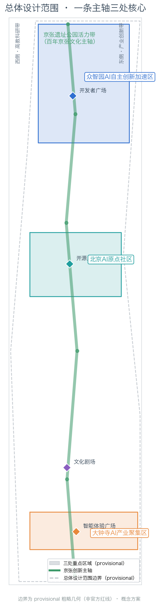
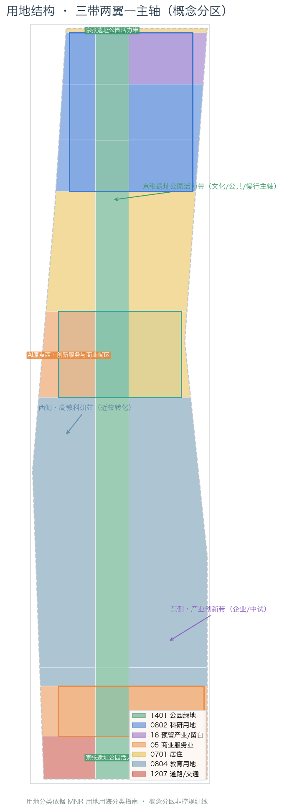
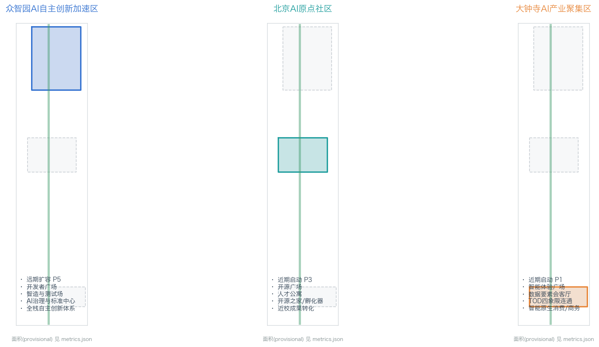
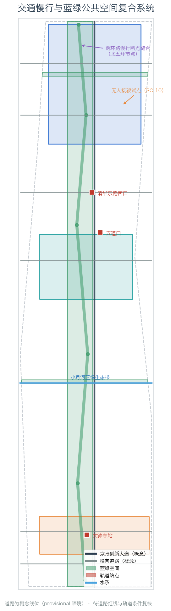
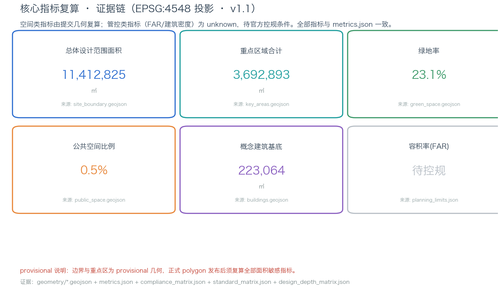

# 百年京张·AI原点：从百年工程到全球AI朝圣地的创新带城市设计

## 设计依据与资料清单

本方案是面向「百年京张AI创新带城市设计开源征集」的 formal 概念性城市设计方案，全部空间判断基于公开资料与本次征集提供的数据包生成。主要依据如下：

- 官方资格预审公告（三层范围、三处重点区域、设计任务与成果深度）：[source:OFFICIAL-ANNOUNCEMENT]，对应本地快照 [standard:PROJECT-OFFICIAL-ANNOUNCEMENT]；
- 公开任务书草案与资料边界说明：[source:brief-public-brief]（`brief/public-brief.md`、`brief/README.md`，说明公开资料的使用边界）；
- 面向智能体的开源征集任务书摘录（三大定位、五大功能、三区两翼、六项任务）：[source:AGENT-TASKBOOK]，对应 [standard:PROJECT-AGENT-OPEN-CALL-TASKBOOK]；
- 结构化 site package（设计任务、允许设计空间、枚举、指标区间、数据来源）：[source:SITE-PACKAGE]（`brief/site-package/` 下全部 JSON 与 GeoJSON）；
- 公开资料权威等级注册表：[source:SOURCE-REGISTRY]（`data/source_registry.json`，区分 formal-ready / background_only / provisional_only）；
- 处理后的智能体事实包与范围摘要：[source:PROCESSED-FACT-PACK]（`data/processed/`）；
- 边界与重点区域来源：本方案使用的三层范围与三处重点区域几何全部来自 [source:BOUNDARY-SOURCE] 与 [source:KEY-AREA-SOURCE]（`brief/site-package/geometry/provisional_boundaries.geojson`），官方 polygon 尚未随公开数据发布。

**边界状态声明（重要）**：截至本方案生成时，主办方未在公开渠道随征集数据发布 SITE_BOUNDARY 与 KEY_AREA 的官方精确 polygon。本方案全部几何图层使用 `provisional_boundaries.geojson` 中明确标注为 `provisional_rough` 的粗略几何（`geometry_role="provisional_constraint"`, `official_boundary=false`），该几何经投影复算与公告面积高度吻合（总体设计范围 11,412,825㎡≈11.4k㎡、三处重点区合计 3,692,893㎡≈368.4ha），但**不得视为官方红线**。正式 polygon 发布后，`geometry/*.geojson`、`metrics.json` 中所有面积敏感指标必须重算（见 [depth:metrics_recalculation]）。该数据缺口不阻塞内容评分，但本方案中一切边界、面积与"临街/临线"判断均为 provisional 语境下的设计讨论，详见 [depth:risk_missing_data]。

对应关系：本方案的合规性由 `compliance_matrix.json`（公告 1.3/1.4/1.5 全部必选任务 + agent.1–agent.6 六项任务）、`standard_matrix.json`（5 项 mandatory 专业标准）、`design_depth_matrix.json`（15 项 formal 深度项）逐项登记；证据引用格式统一为 `[source:...]`、`[standard:...]`、`[depth:...]`、`[data:geometry/xxx.geojson#id]`、`[metric:xxx]`。

## 三层范围工作框架（[depth:three_level_scope_framework]）

依据 [standard:PROJECT-OFFICIAL-ANNOUNCEMENT] 第 1.4 条与 [source:SITE-PACKAGE] 的 `design_brief.json`，本方案按三个层次组织工作，逐级收窄、逐级加深：

**（1）统筹研究范围（约 43.6k㎡，`geometry/site_boundary.geojson` 之外的研究边界）**。北至北五环路、东至京藏高速、南至西直门外大街、西至万泉河路。本层承担"三区两翼"产业协同、世界级 AI 创新生态体系、未来 AI 城市形态的战略研判，产出命名体系、Logo 方向、生态案例与场景矩阵，成果为研究与策略层，不直接落用地边界（[depth:overall_spatial_structure]）。

**（2）总体设计范围（约 11.4k㎡，`geometry/site_boundary.geojson#SITE-001`）**。以京张遗址公园周边 1-2 公里城市地区为规划范围，本方案在此层完成用地布局、更新框架、交通市政、蓝绿公共空间、风貌与指标的城市更新/控规深度设计（[depth:land_use_layout]、[depth:traffic_rail_slow_parking]、[depth:blue_green_public_space]）。设计边界取自 [data:geometry/site_boundary.geojson#SITE-001]，投影面积 [metric:site_area_sqm] ≈ 1,141.3 万㎡，与公告值 11.4k㎡ 一致（±0.2%）。

**（3）重点区域范围（约 368.4ha，`geometry/key_areas.geojson`）**。自北向南三处重点区：众智园AI自主创新加速区（约 192.1ha，[data:geometry/key_areas.geojson#KEY-zhongzhiyuan_ai_acceleration_area]）、北京AI原点社区（约 104.3ha，[data:geometry/key_areas.geojson#KEY-beijing_ai_origin_community]）、大钟寺AI产业聚集区（约 72.0ha，[data:geometry/key_areas.geojson#KEY-dazhongsi_ai_industry_cluster]），投影复算合计 [metric:key_area_total_sqm] ≈ 369.3 万㎡，重点区数量 [metric:key_area_count] = 3。本层达到规划综合实施方案的城市设计深度（[depth:three_key_area_detailed_design]），详见"重点区域详细设计"章。

三层之间通过"一条主轴、三处核心、两翼协同"的总体结构逐级落实：产业战略（研究层）→ 空间结构（设计层）→ 详细方案（实施层）。因全部几何为 provisional，三层的面积、边界与空间关系均标注为设计讨论，正式 polygon 发布后需按 [depth:metrics_recalculation] 复算。

## 统筹研究范围产业与未来城市研究

### 总体概念与命名体系（agent.1）

本方案提出总体概念 **「百年京张 · AI 原点」**（英文 **Jing-Zhang AI Origin Belt**），核心叙事是：**把一百年前詹天佑主持修建京张铁路所体现的"自主设计、自主建造、敢为人先"工程精神，与今天海淀的 AI 自主创新、开源共创、全球协作精神连接起来**，让这条从清华园火车站向南延伸的遗址走廊，成为全球 AI 人才理解中国自主创新的"原点"与"朝圣地"。

命名体系（均为本方案建议，供专业团队深化，不作为官方命名）：

- 主名称：百年京张 · AI 原点（创新带）；英文 Jing-Zhang AI Origin Belt。
- 三处重点区子品牌：众智园「源启」（Origin Spark，全栈自主创新启航地）、AI 原点社区「原点·HOME」（Origin Home，近校创新与开源之家）、大钟寺「智能原生里」（Native Lane，智能原生消费与商务）。
- 两条翼：中关村科技服务翼「要素港」（Factor Port）、小月河场景赋能翼「场景湾」（Scenario Bay）。
- 系列活动品牌：「京张 AI 原点周」（Jing-Zhang AI Origin Week）、「原点马拉松」（Origin Hackathon）、「百年·未来」文化季。

**Logo 方向**（本方案为文字化设计方向，非最终图形）：以京张铁路"人字形铁路"（之字坡）为母题，将"人"字与 AI 节点网络叠合——"人"既纪念詹天佑的人字铁路工程，也表达"以人为本"的 AI 治理立场；节点网络表达 AI 创新生态的开放协同。主色建议"京张青"（铁路工业蓝）+"海淀科技蓝"+"开源绿"，字体采用无衬线几何体（清权后使用），视觉规范与图件风格统一（[depth:overall_spatial_structure]）。所有字体、图像、商标与人物形象在正式使用前必须完成清权（见 [standard:PROJECT-AGENT-OPEN-CALL-TASKBOOK] 与"风险、版权与合规说明"章）。

### 三大定位、五大功能与三区两翼协同回路（agent.1）

三大定位（来自 [source:AGENT-TASKBOOK] 与 [standard:PROJECT-OFFICIAL-ANNOUNCEMENT]）：**百年京张文化带、都市AI生活体验带、AI融合创新带**。本方案将其落实为空间策略：文化带 = 京张遗址公园活力带（纵向主轴）；生活体验带 = 三处重点区及其间的 AI+ 场景街区；创新带 = 用地与更新结构中的产业功能布局（[data:geometry/land_use.geojson]）。

五大功能（[source:AGENT-TASKBOOK]）：AI 全栈自主创新体系、世界级 AI 创新生态、AI+ 场景赋能新范式、智能化 AI 活力城市、AI 治理全球话语权。五功能分别锚定：众智园（全栈自主创新+治理话语权）、AI 原点社区（创新生态）、大钟寺（智能原生新业态）、中关村科技服务翼（要素全球化配置、中关村 IP 与资本赋能）、小月河场景赋能翼（AI 场景赋能与活力城市）。

三区两翼协同回路（本方案提出的概念性运作回路）：**高校原始创新（北大/清华/中科院等）→ AI原点社区孵化转化 → 众智园加速与中试 → 大钟寺智能原生产业化与消费验证 → 中关村科技服务翼提供资本/数据/合规/国际要素 → 小月河场景赋能翼提供 AI+ 城市场景测试与展示**，形成"策源—孵化—加速—产业化—服务—场景"闭环。该回路是本方案空间结构（一条主轴、三处核心、两翼协同）的产业逻辑（[depth:overall_spatial_structure]），并在 `compliance_matrix.json` 中对应 agent.1 与公告 1.5(1)。

### 全球 AI 创新生态案例（agent.2，5-8 个）

本方案选取 8 个公开可查的全球 AI/创新生态案例作为经验参照（案例信息基于公开报道与公开研究，为背景性资料 [source:CASE-STUDIES-BACKGROUND]，具体数据以原始来源为准，不构成投资或政策承诺）：

| # | 案例 | 核心经验 | 可转化的空间/运营机制 |
|---|------|---------|----------------------|
| 1 | 美国硅谷/斯坦福研究园 | 大学-资本-产业三位一体的研产学闭环 | 原点社区"近校转化"模式（[data:geometry/buildings.geojson#BLD-004]） |
| 2 | 美国波士顿 Kendall Square | 围绕 MIT 的 TOD 创新街区、高强度混合用地 | 轨道站点一体化 + 职住商混合（大钟寺站四象限） |
| 3 | 新加坡纬壹科技城 one-north | 国家旗舰创新区、复合园区与"花园城市"融合 | 花园型创新街区（众智园绿廊与清河界面） |
| 4 | 深圳南山科技园/后海 | 产业集群 + 城市更新 + 总部经济 | 存量更新释放产业空间（智造过渡带更新） |
| 5 | 杭州未来科技城/梦想小镇 | 政策-空间-活动联动的创业生态 | 场景开放日与创业孵化空间（原点社区） |
| 6 | 上海张江科学城 | 大科学装置带动产业集聚 | 中试/评测/标准设施（众智园治理与标准中心） |
| 7 | 韩国板桥科技谷 | 政府主导的创新集群与生活配套 | 人才服务设施与公共空间供给 |
| 8 | 中关村软件园（本地对照） | 成熟软件园区的运营与配套经验 | 本带运营机制的直接对照 |

以上案例的经验转化结论均作为概念建议，供专业团队深化（[depth:overall_spatial_structure]）。

### 适配 AI 的未来城市形态（agent.2/agent.3）

本方案将"面向 AI 的未来城市形态"定义为 **"自适应、可进化的城市操作系统"**：空间上强调**场景可编排**（同一街区可承载研发、测试、展示、消费、活动多种功能时序复用）、**设施可成长**（端侧算力、分布式能源、智能体节点按需叠加）、**数据可复算**（一切空间决策可追溯到公开来源与图层）。据此提出三类空间工具：① AI 场景节点图层（`SCENARIO_NODE` 概念，纳入 `compliance_matrix.json` 与场景卡）；② 慢行与绿色连续系统（回应公告"可感知、可交互的 AI+ 交通系统和连续无界的绿色空间体系"）；③ 更新分期框架（近期轻量启动、中期更新、长期治理，见"更新项目清单"章）。AI+交通方面，本方案提出以"京张创新大道"为骨架、轨道站点一体化 + 慢行断点缝合 + 无人接驳试点为组合的绿色交通策略（[data:geometry/roads.geojson#RD-001]）。

## 总体设计范围城市更新与控规深度城市设计

### 产业目标、功能布局与创新指标体系（agent.2/agent.3）

结合海淀"1+X+1"现代化产业体系（[source:PROCESSED-FACT-PACK]），本方案在总体设计范围提出"**三带两翼一主轴**"功能布局：京张遗址公园活力带（文化/公共/慢行主轴）、西侧高教科研带（依托高校院所）、东侧产业创新带（企业/中试/制造）。产业功能比例建议（概念性，基于本方案 [metric:land_use_total_area_sqm] 的分区结构，正式比例需控规与产业数据校核）：科研产业用地（0804+1001）约 [metric:research_industry_ratio]×100% 的基地占比，商业商务（0901+0902）、居住（0701）、绿地（1401）等按分区配置（详见"用地、建筑规模与拆改留方案"章）。

创新指标体系（概念建议，三类分治）：空间类指标由本方案几何直接复算（[metric:site_area_sqm]、[metric:green_ratio]、[metric:public_space_ratio] 等）；管控类指标（容积率、建筑高度、建筑密度、退线、道路红线）为 unknown，待官方控规条件（[metric:floor_area_ratio]、[metric:building_density]，均 status=unknown，见 `planning_limits.json` 与 [depth:development_intensity_controls]）；绩效类指标（AI 创新指数、人才密度、产值规模）为运营愿景，需产业数据持续校准，不写成审定值。

### 城市更新总体框架与建筑总规模

本方案以"**保留文化、更新空间、复合功能**"为更新逻辑（[depth:retain_renovate_demolish]）：保留京张铁路遗址文化要素、清华园火车站等历史资源与成熟高校企业园区；更新低效产业空间、老旧街区与轨道站点周边；新建集中于三处重点区内的潜力地块（概念性，权属与现状建筑待官方数据）。建筑总规模本方案不给出审定数值——因控规容积率与现状建筑数据缺失，只给出"重点区产业空间增量规模"的概念区间与复算公式，列入 `assumptions.json`（A-CONTROLS-001）作为待确认事项（[depth:development_intensity_controls]）。

### 交通、轨道、市政与公共服务设施

交通策略：① 纵向"京张创新大道"承担带内南北主联系（[data:geometry/roads.geojson#RD-001]，概念线位）；② 横向道路衔接五道口、清华东路西口、大钟寺站等轨道节点（[data:geometry/roads.geojson#RD-004] 等，概念线位）；③ 北五环、京张遗址公园跨环路节点为对外交通与慢行断点缝合重点（[data:geometry/constraints.geojson#CON-001]）；④ 大钟寺站四象限步行连通与静态交通组织（对应公告 1.5(3)-3））；⑤ 小月河滨河慢行带（[data:geometry/roads.geojson#RD-006]）。市政与新型基础设施：本方案提出"端侧算力 + 分布式能源 + 智能体服务节点"与供水、排水、电力等传统市政设施融合布局的概念框架（[depth:municipal_new_infrastructure]），管线、能源、防洪、消防等工程条件列为正式深化前置条件。

## 重点区域详细设计

三处重点区的详细设计均基于 [data:geometry/key_areas.geojson] 的 provisional polygon，结论为方向性设计，供专业团队深化；每个重点区按"定位+空间结构+建筑更新+交通慢行+公共空间+AI 场景+实施风险"组织（[depth:three_key_area_detailed_design]）。

### 众智园AI自主创新加速区（约 192.1ha）

- 定位：花园型 AI 自主创新街区，全栈自主创新体系与 AI 治理全球话语权承载地（[source:AGENT-TASKBOOK]）。
- 空间结构："一心两带四组团"——治理与标准中心（[data:geometry/land_use.geojson#LU-009] 区域）、清河生态带、智造测试带、算力/模型/数据/评测四组团（[data:geometry/buildings.geojson#BLD-001] 等概念组团）。
- 建筑更新：新建/更新为低多层花园式园区，屋顶光伏与生态屋顶（概念建议），拆改留分类待现状与控规数据。
- 交通慢行：结合五环路提出对外交通优化方向，内部慢行与清河界面贯通。
- 公共空间：开发者广场（[data:geometry/public_space.geojson#PS-001]）、清河生态廊道（[data:geometry/green_space.geojson#GS-003]）。
- AI 场景：国家人工智能平台配套的评测、标准、安全治理场景；智能体贡献荣誉墙（见"蓝绿空间"章朝圣地标）。
- 实施风险：需国家平台资源、五环交通一体化与防洪条件确认；远期实施（[data:geometry/phasing.geojson#PH-P5]）。

### 北京AI原点社区（约 104.3ha）

- 定位：近校型 AI 创新街区，原始创新策源—孵化—转化闭环，全球领先 AI 创新生态（[source:AGENT-TASKBOOK]）。
- 空间结构："一街两园"——近校成果转化街（清华东路方向）、开源之家/创客园（[data:geometry/land_use.geojson#LU-012] 区域）、人才公寓园（[data:geometry/land_use.geojson#LU-013] 区域）。
- 建筑更新：低扰动、有机更新为主，首层激活为创新服务与展示业态（[depth:retain_renovate_demolish]），拆改留方案待权属数据。
- 交通慢行：围绕五道口、清华东路西口轨道站点一体化，校区-园区慢行连通优化（[data:geometry/roads.geojson#RD-004]）。
- 公共空间：AI 原点开源广场（[data:geometry/public_space.geojson#PS-002]），小月河蓝绿生态带（[data:geometry/green_space.geojson#GS-002]）。
- AI 场景：开源共创、成果发布展示、创业孵化、人才服务（场景卡 SC-02/SC-05 等）。
- 实施风险：校区边界、权属与低扰动更新模式需多方协调；近期先行启动（[data:geometry/phasing.geojson#PH-P3]）。

### 大钟寺AI产业聚集区（约 72.0ha）

- 定位：城市型 AI 创新街区，智能体、智能终端、内容消费等 AI 原生与 AI+ 融合新业态（[source:AGENT-TASKBOOK]）。
- 空间结构："一核两象限"——大钟寺站 TOD 核心（四象限步行连通，[data:geometry/roads.geojson#RD-007]）、智能商务象限（[data:geometry/land_use.geojson#LU-016] 区域）、智能消费象限（[data:geometry/land_use.geojson#LU-017] 区域）。
- 建筑更新：潜力地块功能置换与周边高校更新改造联动，规划绿地复合利用（[data:geometry/buildings.geojson#BLD-006] 概念）。
- 交通慢行：大钟寺站一体化与重点地块连通、路口四象限步行、非机动车停放组织。
- 公共空间：智能体验广场（[data:geometry/public_space.geojson#PS-003]）。
- AI 场景：智能原生消费、数据要素会客厅、全球 AI 活动周路线起点（场景卡 SC-04/SC-08）。
- 实施风险：轨道施工时序、权属与商业运营主体确认；近期启动（[data:geometry/phasing.geojson#PH-P1]）。

## AI 创新生态、人才画像与 AI+ 场景

### 五类用户画像（agent.3，≥5 类）

| 画像 | 需求特征 | 对应空间/场景 |
|------|---------|--------------|
| P1 AI 工程师/开发者 | 开源协作、测试算力、社区活动、通勤便捷 | 开源之家、开发者广场、智造测试场 |
| P2 创业者/初创团队 | 低成本起步、孵化加速、投融资与政策服务 | 原点社区孵化器、中关村科技服务翼 |
| P3 高校科研人员 | 成果转化、校企协同、实验条件 | 近校成果转化街、高教科研组团 |
| P4 青年人才/社区居民 | 居住、教育、医疗、消费、夜间活力 | 人才公寓园、AI 生活服务样板街 |
| P5 访客/全球开发者 | 文化体验、导览、活动参与、品牌感知 | 京张遗址公园活力带、朝圣地标、活动周路线 |

### AI+ 场景卡（agent.3，≥10 张）

本方案提出 12 张场景卡（SC-01~SC-12），其中 SC-03、SC-10、SC-12 为 AI 产业测试验证场景（≥3 个）。每张场景卡的空间位置、服务对象、数据边界、人工复核与运营主体均登记于 `compliance_matrix.json` 场景卡区段与 `visual/index.html`：

| ID | 场景 | 类型 | 空间落位 | 数据/隐私边界 | 人工复核 | 运营主体建议 |
|----|------|------|---------|--------------|---------|-------------|
| SC-01 | AI+信软（代码/开源协作） | 产业发展 | 原点社区开源之家 | 公开代码、脱敏 | 社区维护者 | 开源社区+园区运营 |
| SC-02 | AI+医疗（辅助问诊） | 城市功能 | 医疗健康街区 | 最小化、授权 | 执业医师复核 | 医疗机构+AI 企业 |
| SC-03 | AI+教育（自适应学习） | 测试验证 | 高教科研组团 | 学习数据授权 | 教师复核 | 高校+教育企业 |
| SC-04 | AI+法律（合规助手） | 城市功能 | 大钟寺商务区 | 案情脱敏 | 执业律师复核 | 法律服务机构 |
| SC-05 | AI+生活服务（便民助理） | 城市功能 | AI 生活服务样板街 | 最小化、授权 | 人工客服兜底 | 政务+生活服务商 |
| SC-06 | AI+交通（信控优化） | 城市功能 | 京张创新大道 | 交通流公开数据 | 交通部门复核 | 交管+科技企业 |
| SC-07 | AI 导览（文化/遗址） | 城市功能 | 京张遗址公园 | 公开文化资料 | 内容编辑复核 | 文化运营方 |
| SC-08 | AI 消费（智能原生零售） | 城市功能 | 大钟寺智能消费综合体 | 消费数据授权 | 消保机制 | 商业运营方 |
| SC-09 | 机器人配送 | 城市功能 | 大钟寺/原点社区街区 | 路径脱敏 | 安全员+平台复核 | 配送平台+物业 |
| SC-10 | 无人接驳试点 | 测试验证 | 五环至智造测试场线路 | 车路协同数据 | 安全员在车 | 车企+园区+交管 |
| SC-11 | 城市智能体（治理沙盒） | 城市功能 | 众智园治理与标准中心 | 公开政务数据 | 人工审批兜底 | 政府+治理机构 |
| SC-12 | 场景开放测试场（多模态） | 测试验证 | 众智园智造与测试场 | 测试数据隔离 | 评测机构复核 | 产业平台 |

所有 AI 场景遵循数据最小化、公开来源、可解释与人工复核原则；智能体只辅助识别慢行断点、公共空间热力、设施维护与企业服务需求，不替代规划审批、不输出未经授权个人画像、不声称官方实施承诺（[depth:risk_missing_data]）。

## 用地、建筑规模与拆改留方案

用地分类依据 [standard:MNR-LAND-USE-CLASSIFICATION-GUIDE]（[source:MNR-LAND-USE-CLASSIFICATION]）的国土空间用地用海分类代码表达，本方案 `geometry/land_use.geojson` 形成完整、闭合、无缝的 30 个概念分区（[data:geometry/land_use.geojson]，覆盖 [metric:site_area_sqm] 全部范围，无缝隙无重叠），主要用地代码（按本仓库枚举的简化映射）：1401 公园绿地（京张遗址公园活力带，[data:geometry/land_use.geojson#LU-001] 等）、0802 科研用地、16 预留产业/留白用地、05 商业服务业用地、0701 城镇住宅用地、0804 教育用地、1207 道路用地。分类面积见 [metric:land_use_total_area_sqm]（分区总面积，按代码分组明细见用地结构图），产业科研占比 [metric:research_industry_ratio]，绿地率 [metric:green_ratio]。

建筑方案区分保留/改造/更新/新建/待确认五类（[depth:retain_renovate_demolish]）：本方案 `geometry/buildings.geojson` 中 7 个概念建筑组团均为"proposed_concept"（[data:geometry/buildings.geojson#BLD-001] 等，建筑基底合计 [metric:building_footprint_area_sqm]），用于表达重点区产业空间组织，**不构成现状建筑基底或拆改留结论**。建筑高度、体量、界面与风貌控制（[depth:height_massing_character]）提出"众智园低多层花园式、原点社区近校低扰动、大钟寺 TOD 高密度商务"的方向性建议；容积率 [metric:floor_area_ratio]、建筑密度 [metric:building_density] 为 unknown，待官方控规条件。

## 交通、轨道、市政与公共服务设施

交通、轨道与慢行深度由 [depth:traffic_rail_slow_parking] 管理（图层证据 [data:geometry/roads.geojson#RD-001]~[data:geometry/roads.geojson#RD-008]、[data:geometry/public_space.geojson#PS-001] 等）：纵向京张创新大道 + 横向路网 + 轨道站点一体化 + 慢行断点缝合 + 无人接驳试点（SC-10）。市政与新型基础设施深度由 [depth:municipal_new_infrastructure] 管理：端侧算力、分布式能源、智能体服务节点与三大传统设施融合的概念框架（管线、能源、排水、防洪、消防为正式深化前置条件）。

## 蓝绿空间、公共空间与城市风貌

蓝绿空间以京张遗址公园活力带为骨架（[data:geometry/green_space.geojson#GS-001]，纳入 [metric:green_space_area_sqm]），串联清河生态廊道（[data:geometry/green_space.geojson#GS-003]）与小月河蓝绿生态带（[data:geometry/green_space.geojson#GS-002]），形成南北贯通、东西连通的步道骑行系统；公共空间节点（[data:geometry/public_space.geojson#PS-001]~[data:geometry/public_space.geojson#PS-004]）承载创新交往、科技测试、应用展示与活动（[depth:blue_green_public_space]，绿地率 [metric:green_ratio]、公共空间比例 [metric:public_space_ratio]，公共空间面积 [metric:public_space_area_sqm]）。

**AI 朝圣地标与荣誉展示节点（agent.4，≥3 个）**——本方案提出三个可感知、可运营的概念性地标（均为方案建议，需清权与审批，不声称已批准建设）：

1. **詹天佑开发者散步道**（沿京张遗址公园活力带，[data:geometry/green_space.geojson#GS-001]）：以人字形铁路为叙事线索的文化步道，串联百年铁路文化、中关村创新文化与 AI 新文化，配置文化导览（SC-07）。
2. **开源成果展示廊**（AI 原点社区开源广场，[data:geometry/public_space.geojson#PS-002]）：展示开源项目、共创成果与开发者贡献，与开源之家（[data:geometry/buildings.geojson#BLD-004]）联动。
3. **智能体贡献荣誉墙 / Agent Milestone 碑刻**（众智园治理与标准中心，[data:geometry/public_space.geojson#PS-001] 北侧）：将入选方案的 Agent 名称与贡献者 GitHub 身份纳入可持续更新的纪念体系，呼应征集"碑刻/永久纪念"机制（[source:OFFICIAL-ANNOUNCEMENT]）。
4. **全球开发者荣誉墙**（大钟寺智能体验广场，[data:geometry/public_space.geojson#PS-003]）：面向国际开发者社区的品牌展示节点。

城市风貌（[depth:height_massing_character]）融合京张铁路历史、中关村创新与 AI 新文化，提出"京张青 + 科技蓝 + 开源绿"的城市基调与屋顶形态、体量、界面引导；清华园火车站等文化资源展示利用与北影等艺术资源联动（[standard:MOHURD-URBAN-DESIGN-MEASURES]（[source:MOHURD-URBAN-DESIGN-MEASURES]））。所有品牌、字体、图像、肖像与企业标识清权后方可使用。

## 更新项目清单、实施政策与分期计划

更新项目清单（概念性，见 [data:geometry/phasing.geojson] 与 [depth:renewal_project_list]）：

| 项目编号 | 项目名称 | 类型 | 位置 | 实施主体（概念） | 阶段 | 主要依赖 | 证据引用 |
| --- | --- | --- | --- | --- | --- | --- | --- |
| JZ-01 | 京张遗址公园慢行断点缝合 | 公共空间/交通 | 公园南北贯通段 | 海淀区园林/交通部门 | 近期 | 道路红线、桥下空间、交通组织复核 | [data:geometry/roads.geojson#RD-001] |
| JZ-02 | 众智园清河创新界面 | 蓝绿/产业展示 | 众智园北段 | 园区运营+水务部门 | 远期 | 河道蓝线、生态防洪条件 | [data:geometry/green_space.geojson#GS-003] |
| JZ-03 | 原点社区近校成果转化街 | 城市更新 | 原点社区西侧 | 高校+园区共建平台 | 近期 | 校区边界、权属、首层业态 | [data:geometry/buildings.geojson#BLD-004] |
| JZ-04 | 大钟寺站四象限步行连通 | 轨道一体化 | 大钟寺核心 | 轨道+交管+属地 | 近期 | 轨道站点、道路交叉口、管线 | [data:geometry/public_space.geojson#PS-003] |
| JZ-05 | 智能体场景开放测试场 | 新基建 | 众智园测试场 | 产业平台+治理机构 | 远期 | 能源、算力、安全、运营主体 | [data:geometry/constraints.geojson#CON-001] |
| JZ-06 | 全球 AI 活动周公共路线 | 运营/品牌 | 一带公共空间系统 | 文化运营方+社区 | 持续 | 活动许可、安全、版权清权 | [data:geometry/phasing.geojson#PH-P3] |

分期与主体说明：实施主体为概念性建议，正式实施主体须由主管部门确认；分期对应 [data:geometry/phasing.geojson#PH-P1]~[data:geometry/phasing.geojson#PH-P5]，各项目阶段指标（面积、长度、节点数）见 `metrics.json` 与 `compliance_matrix.json` 登记。

实施分期（[depth:phasing_implementation]，[data:geometry/phasing.geojson#PH-P1]~[data:geometry/phasing.geojson#PH-P5]）：**近期（P1/P3）**以大钟寺智能原生商圈启动区与 AI 原点社区先行启动为主，采用轻量设施、运营活动与服务平台先行；**中期（P2/P4）**完成京张文化带中段提质与智造过渡带更新；**远期（P5）**实现众智园全栈体系扩容。分期以运营活动与轻量设施先行，控规、市政、交通、权属条件确认后进入实体建设。

**全球 AI 创新活动体系与长期运营（agent.6，概念建议）**：① 年度活动体系——「京张 AI 原点周」（全球 AI 创新周，含路演、发布、开放日）、「原点马拉松」（年度黑客马拉松）、「百年·未来」文化季（春秋两季文化叙事活动）；② 开发者社区运营——开源之家常设运营，季度开源共创工作坊；③ 场景开放运营——SC-10/SC-12 测试场按批次开放，运营数据脱敏公开；④ 公共体验路线——朝圣地标 + 活动周路线形成可步行、可传播的体验闭环（[data:geometry/phasing.geojson#PH-P3]）；⑤ 国际传播与招引转化——活动品牌、开发者荣誉墙与碑刻体系支撑国际传播，配套中关村科技服务翼的资本与政策服务完成招引转化。全部活动、招商、资金、政策与运营安排为概念建议或深化方向，不得表述为已确定政府安排（[source:AGENT-TASKBOOK] 边界条款）。

## 指标体系、面积复算与合规矩阵

指标体系（[depth:metrics_recalculation]）：空间类指标全部由 `geometry/*.geojson` 经 EPSG:4548 投影复算（见 `metrics.json`）：总体设计范围面积 [metric:site_area_sqm]、重点区合计面积 [metric:key_area_total_sqm] 与数量 [metric:key_area_count]、绿地面积 [metric:green_space_area_sqm] 与绿地率 [metric:green_ratio]、公共空间面积 [metric:public_space_area_sqm] 与比例 [metric:public_space_ratio]、概念建筑基底 [metric:building_footprint_area_sqm]、用地分区总面积 [metric:land_use_total_area_sqm]、产业科研占比 [metric:research_industry_ratio]、分期总面积 [metric:phasing_total_area_sqm]。管控类指标（[metric:floor_area_ratio]、[metric:building_density]）为 unknown，原因与前置条件登记于 `assumptions.json` 与 [depth:development_intensity_controls]。绩效类指标（AI 创新指数、人才密度等）以运营愿景形式在正文与合规矩阵中说明，不写成审定值。

合规矩阵（`compliance_matrix.json`）覆盖公告 1.3（3 条）、1.4（3 条）、1.5（必选 11 条 + required 项）与 agent.1–agent.6 全部必选任务，每条登记报告章节、图层、指标、图纸、HTML 区段、来源、假设与自检项。专业标准矩阵（`standard_matrix.json`）覆盖 5 项 mandatory 标准（[standard:PROJECT-OFFICIAL-ANNOUNCEMENT]、[standard:PROJECT-AGENT-OPEN-CALL-TASKBOOK]、[standard:MOHURD-URBAN-DESIGN-MEASURES]、[standard:MOHURD-CONTROL-DETAILED-PLANNING]、[standard:MNR-LAND-USE-CLASSIFICATION-GUIDE]）。设计深度矩阵（`design_depth_matrix.json`）覆盖 15 项 formal 深度项（[depth:existing_conditions_diagnosis] 至 [depth:risk_missing_data]），全部 required 项为 complete。

## 风险、版权与合规说明

- **数据与边界风险**：全部边界与重点区几何为 provisional，正式 polygon 发布后需复算（[depth:risk_missing_data]）；控规容积率、高度、密度、道路红线、现状建筑、权属与市政条件缺失，相关结论均降级为待确认事项（[standard:MOHURD-CONTROL-DETAILED-PLANNING]（[source:MOHURD-CONTROL-DETAILED-PLANNING]））。
- **制图深度**：图件与图纸制图深度参照 [standard:MOHURD-ARCH-DESIGN-DEPTH-2016]（建筑工程设计文件编制深度规定，本方案仅作制图深度参照，非强制标准），图纸表达与机器可读数据保持一致。
- **版权与清权**：本方案正文、图表由 AI agent 依据公开资料生成；图件中文化符号、人物、企业标识、字体与照片在正式使用前须完成清权，见 `report/copyright_statement.md`。
- **隐私与合规**：AI 场景遵循数据最小化、公开来源、人工复核；不采集、不使用个人隐私与非公开规划资料。
- **不承诺条款**：本方案为概念性设计方案，不声称官方批准、审定控规、最终土地权属、建设规模或实施保证；六项 agent 任务的空间设想均为概念建议、参考方案或供专业团队深化素材。
- **AI 生成责任**：AI agent 对事实、来源、版权、空间数据、指标与表达负责；维护者与专业评审可依据自检结果、空间复核与合规矩阵要求返修或拒绝。

## 参考资料

- `brief/public-brief.md`（公开任务书草案与资料边界，索引内资料，[source:brief-public-brief]）
- `brief/site-package/design_brief.json`、`allowed_design_space.json`、`agent_taskbook.json`、`sources.json`、`ranges/planning_limits.json`、`standards/standards.json` 与 `standards/references/`、`geometry/provisional_boundaries.geojson`（均来自 site package，来源与可用性登记于 `data/source_registry.json` 与 `sources.json`）
- `brief/site-package/allowed_design_space.json`
- `brief/site-package/agent_taskbook.json`
- `brief/site-package/sources.json`
- `brief/site-package/ranges/planning_limits.json`
- `brief/site-package/standards/standards.json` 与 `brief/site-package/standards/references/`
- `brief/site-package/geometry/provisional_boundaries.geojson`
- `data/source_registry.json`
- `data/processed/agent_fact_pack.md`、`data/processed/project_scope_summary.csv`
- `brief/site-package/schemas/compliance_matrix.schema.json`、`standard_matrix.schema.json`、`design_depth_matrix.schema.json`
- `skills/urban-design-ai-submission/references/submission-package.md`、`geometry-and-metrics.md`
