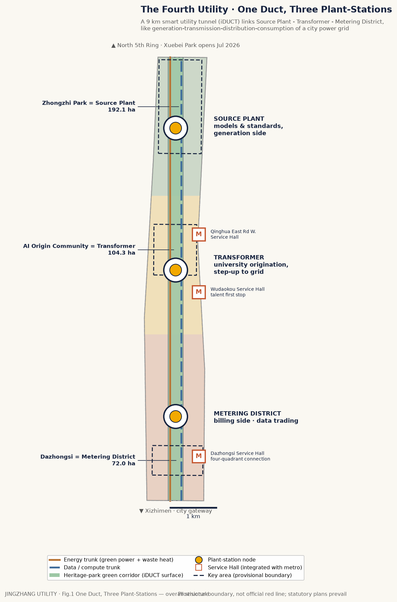
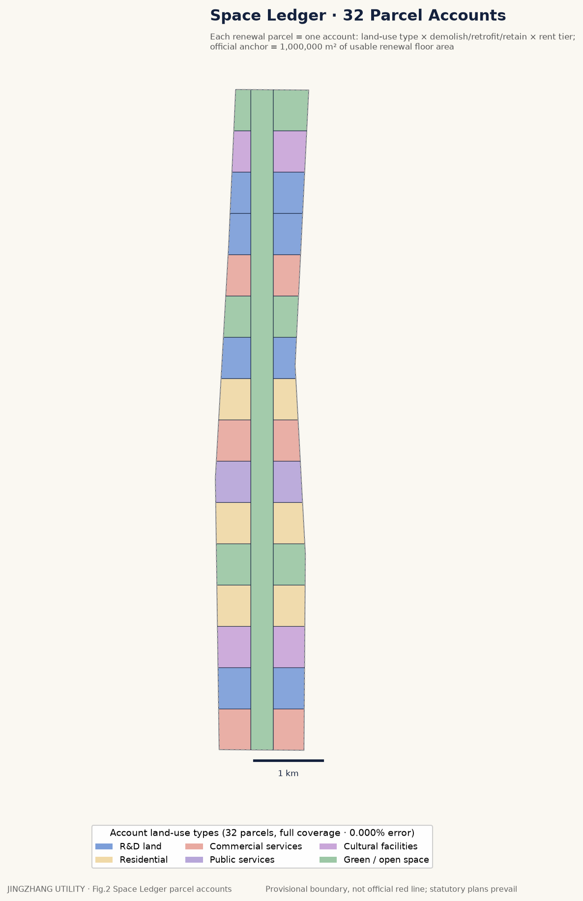
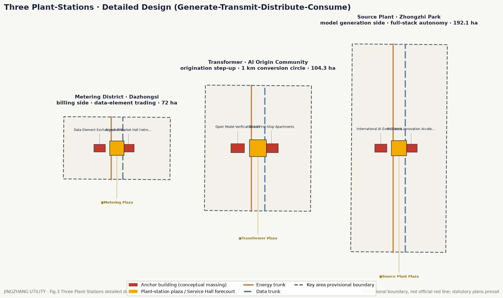
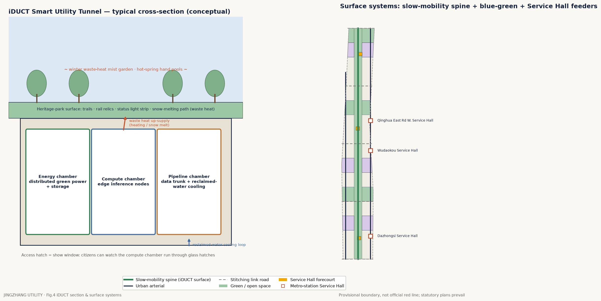
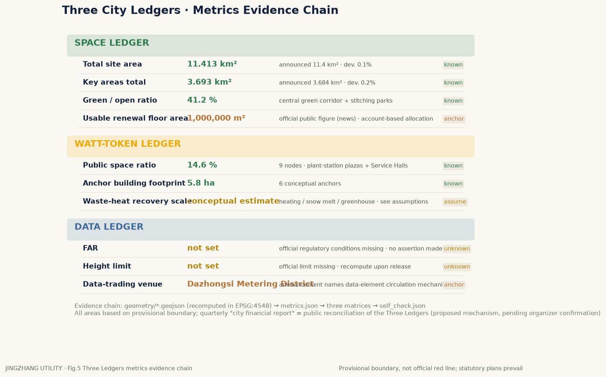

## JINGZHANG UTILITY — The Fourth Utility (Part A: Chapters 1–4)

## Chapter 1: One Century, Two Grid Connections

In 1909, the Jingzhang (Beijing–Zhangjiakou) Railway opened to traffic. It was China's first trunk railway independently designed and independently operated by Chinese engineers [source:何以京张 beijing.gov 2026-03]. In today's terms, what it accomplished can be stated in one sentence: it connected Beijing, for the first time, to a railway network under China's own control. Over the following century, urban modernization has repeated the same gesture — turning scarce things into utilities that reach every door. Water, electricity, gas, heat: each was once the privilege of a few, and each only truly changed ordinary lives after being "utilitized": turn the tap and it flows, metered by usage, available to all, with universal service.

Now it is intelligence's turn. Every industry is embracing AI at full speed: model capability keeps leaping, the open-source ecosystem is thriving, compute costs are falling fast, and enterprises, schools, governments, and communities are all rushing to connect. But the other side of this boom is "everyone generating their own power" — each organization builds its own stack, procures redundantly, measures by its own yardstick, and settles with no one; the situation of shopkeepers, elders, and ordinary households is layered: some use AI every day, only each on their own — uneven in quality, measured by no common yardstick, guaranteed by no one; and a fair share genuinely have not started, not because they cannot pay, but because there is no tap-like entry point at hand and no one has told them what this is actually worth to their shop or their life. The former lack unified metering and a service commitment; the latter lack the connection itself — both are problems of the grid, not of the technology. This is exactly where electricity stood around 1900: factories were buying their own generators and generation itself was already widespread — the real transformation waited for the city grid to weave scattered generation into a utility with unified metering and to-the-door delivery. This proposal's judgment: intelligence is at the tipping point from "self-generation" to "the unified grid" — the technology is mature, but the grid is unbuilt. Hence the definition of **the Fourth Utility**: after water, electricity, gas, and heat, build "computational intelligence" into the fourth network reaching every door, judged by exactly the same criteria as the first three — meterable (kilowatt-hours and inference volume on one meter), settleable (tiered tariffs), and bound by a universal service obligation (the last household must be served). The 1909 Jingzhang Railway carried people; the municipal pipelines that followed carried energy; JINGZHANG UTILITY carries compute and intelligence: railway — pipeline — utility, three grid connections of urban modernization stacked along one 9-kilometer corridor.

This definition answers the "what next" question of two existing paths. The first is the "demonstration project" path: demonstrations have completed the zero-to-one validation of scenarios; this proposal addresses what comes after acceptance — a utility has no acceptance date, and demonstration must extend into constant supply. The second is the "platform" path: turn intelligence into some company's membership service — a waterworks may be a company, but the right to draw water is not decided by membership tier. The three hard constraints of a utility (metering, settlement, universal service) mean that every spatial design in this proposal must ultimately answer three questions: how do you open an account here, how is it billed, and whom do you turn to if service is denied? Space is built for the ledger, and the ledger is kept for the people — this is the master principle behind the Three Ledgers institution (Part II) and the ten AI-to-every-door services (Part III).

Why these 9 kilometers in Haidian? Because this is the only place in the country where "power plant, grid, and users" are all already present — all that is missing is connecting them into a utility. The Jingzhang Railway Relics Park runs 9 km from Xizhimen to the North Fifth Ring Road with 530,900 m² of green space, to be fully connected by the end of 2026 [source:遗址公园二期 bjhd 2025-03][data:9km/53.09万m²]; Phase I, 2.4 km and 16.8 ha, opened in June 2023 [data:2.4km/16.8ha]. Within the 11.4 km² design scope extending 1–2 km on either side [source:公告 ghzrzyw 2026-05-09][data:11.4km²], there are over 2,000 enterprises, 26 unicorns, and 130 registered large models, with an AI core industry scale of 350 billion yuan — roughly 30% of the national total [source:三区两翼 京报/kw 2026-04][data:2000+/26/130/3500亿/30%]; this single belt carries 70% of Haidian's AI enterprise revenue and financing and 80% of its talent [data:70%/80%]. On the supply side, within a one-kilometer translation circle sit 37 universities, 52 national key laboratories, 106 national-level research institutions, and 12,300 AI scholars [source:原点爆发 beijing.gov 2026-04][data:37/52/106/1.23万]; Zhipu, with a market capitalization of HK$280 billion, was born inside this circle [data:2800亿]. On the policy side, compute vouchers, model vouchers, and an industry fund exceeding 100 billion yuan are already in place [source:三区两翼 京报/kw 2026-04]. The strongest generation capacity in the country, the highest user density in the country, and the billing instruments already in people's hands — these 9 kilometers lack none of the elements; what they lack is the single tunnel that wires the elements into a grid.

There is one more condition, often overlooked: the public here has already begun treating AI as everyday life. In 2025, the Relics Park's 60+ events drew 4.3 million visits, the railway museum has 1,300 volunteers, and AI sentries, cleaning robots, pancake robots, and an AI sports training ground are already in routine operation in the park and on campuses [source:何以京张 beijing.gov 2026-03][data:60+/430万/1300]. The law of utility history: build the grid where demand has already been ignited — Edison built his first power station on Wall Street not because it lacked lamps, but because the people there were already willing to pay for light. These 4.3 million visits are demand already ignited — the Fourth Utility's most solid user base.

## Chapter 2: One Tunnel, Three Plant-Stations — Overall Spatial Structure

**The iDUCT intelligent utility tunnel.** Beneath the green corridor of the Jingzhang Railway Relics Park, an intelligent utility tunnel is laid along the full 9 km, directly answering the announcement's requirement to "explore integrated development models between new AI-industry service facilities such as distributed energy and edge compute, and the three traditional infrastructure systems" [source:公告 ghzrzyw 2026-05-09]. The section, bottom to top, has four decks: at the bottom, the **Energy Deck** — distributed energy access and storage units, with a reserved interface for a dedicated Zhangjiakou green-power line, running parallel to but compartmented from the existing power gallery, each serving as the other's backup under fault conditions; above it, the **Compute Deck** — standardized edge compute modules placed in groups every 300 meters along the tunnel, serving the blocks on both sides at close range: latency-sensitive inference happens one block away from the user, underground, in a division of labor with remote cloud-side training compute; this is the physical meaning of "to every door." The deck's clear height admits maintenance vehicles; modules are swapped whole, hot-pluggable, and capacity expands without breaking pavement. The third deck is the **Data Trunk** — fiber backbone and tiered data gates, the physical channel of Dazhongsi's data trading, with data flowing through different gates by sensitivity level and accounted for separately; along the sidewall runs a continuous **reclaimed-water cooling loop**, drawing reclaimed water from the Qinghe and Xiaoyuehe rivers to cool the Compute Deck [source:公告 ghzrzyw 2026-05-09], with return water carrying waste heat to the surface. The four decks share one structural section, one fleet of inspection robots, and one master metering ledger: how much energy came in, how much compute went out, how much waste heat was recovered — all on one readable meter. This is the physical carrier of the watt-token joint meter (Part II). Unlike a conventional utility tunnel, iDUCT does not hide itself — the surface is the park [source:遗址公园二期 bjhd 2025-03]; the green corridor occupies 24% of the belt width and the blue-green open system 41.2% of total area [data:24%/41.2%], yet the inspection hatches, waste-heat landscapes, and compute-status light strips form a "perceivable public interface" (see Chapter 4): beneath the lawn where citizens stroll, the city is thinking — visibly.

The construction sequence is synchronized with the Relics Park Phase II strategy of "integrate, demolish, retreat, replenish" [source:遗址公园二期 bjhd 2025-03]: Phase I uses the already-open 2.4 km segment as the southern test tunnel to validate compartment standards and metering protocols; Phase II completes the main tunnel as the park fully connects at the end of 2026 [data:2026年底]; the two branch tunnels and the twin-wing loop will be developed once official regulatory-plan conditions are clarified — FAR and height-limit control indicators will follow the regulatory-plan conditions to be issued officially; this proposal expresses them at pending-confirmation depth and does not use them as approved indicators.

**Three plant-stations.** The tunnel is the grid; the three key districts are three plant-stations on the grid, totaling 368.4 ha [source:公告 ghzrzyw 2026-05-09][data:368.4ha]:

- **North · SOURCE PLANT** (Zhongzhiyuan AI Independent Innovation Acceleration Zone, 192.1 ha [data:192.1ha]): the "generation side" of models and standards, hosting full-stack independent innovation — independent models, frameworks, and chip adaptation are grid-connected and generating here. Official anchor: Xuebei Park, 238,300 m², opening July 2026, with the National Natural Science Foundation of China already signed on [source:三区两翼 京报/kw 2026-04][data:23.83万m²].
- **Center · TRANSFORMER** (Beijing AI Origin Community, 104.3 ha [data:104.3ha]): the university-sourced "step-up station," stepping laboratory low-voltage results up into the city grid. It is one of the first four AI innovation blocks, with the Wudaokou core area covering about 3 km² [source:AI创新街区 kw 2026-01][data:3km²]; official anchors: the Origin Tower (Dongsheng Tower renamed March 23, 2026), Tsinghua AI College Building F, and the Starlight Avenue robot showground [source:原点爆发 beijing.gov 2026-04], with 325 AI enterprises among 439 resident firms — 74% [data:439/325/74%].
- **South · METERING & MARKET** (Dazhongsi AI Industry Cluster, 72.0 ha [data:72.0ha]): the billing and settlement side of the intelligence economy, siting the data-element trading space and taking on the announcement's named task to "explore circulation mechanisms for data elements and digital assets" [source:公告 ghzrzyw 2026-05-09]. Generation in the north, step-up in the center, billing in the south — one tunnel strings the three plant-stations into a complete utility process.

The rent gradient across the three plant-stations is the economic expression of that process: low rent and long leases incubate at the Source Plant, market rents at the Metering District feed back subsidies, and the Transformer sits in between — along the same tunnel, rent rises toward the billing side and industry stratifies naturally along it. The three key districts total 368.4 ha, only 30% of the 11.4 km² design scope [data:368.4ha/11.4km²]; the remaining 70% of built-up area connects plot by plot through roughly 1,000,000 m² of available renewal floor area [source:三区两翼 京报/kw 2026-04][data:100万m²], with each renewal plot opening a space account (see Space Ledger, Part II) — 32 plots achieving full land coverage.

**Two wings, one loop.** Echoing the official "three districts, two wings" pattern (37 km²) [source:三区两翼 京报/kw 2026-04][data:37km²]: the west wing, the Zhongguancun science-services wing, feeds in IP, capital, and global allocation; the east wing, the Xiaoyuehe scenario-enablement wing, feeds in living scenarios and community users, with the announcement also naming the blue-green resources of the Qinghe and Xiaoyuehe rivers [source:公告 ghzrzyw 2026-05-09]. The "loop" is the operating circuit that wires both wings back into the main tunnel: the iDUCT main tunnel runs as the north–south trunk; two east–west branch tunnels connect to the west wing via the Xueyuan Road corridor and to the east wing via the Xiaoyuehe waterfront greenbelt; the loop closes along the North Fifth Ring greenbelt at the north end and through the Xizhimen hub at the south — energy, compute, and data are metered one-way and settled in circulation around the loop, and when any segment is under maintenance the whole network stays live. Beyond the loop lies the larger regional circuit: Zhangjiakou green power flows south through the Energy Deck, training loads shift north, and the Jingzhang high-speed rail's one-hour commute circle sustains talent exchange between the two cities — the alignment of that 1909 railway is precisely the alignment of today's intelligence grid.

## Chapter 3: Three Service Halls — Rail-Station Integration

The power grid has its service halls; the Fourth Utility must have its own physical counters. All three Service Halls are built integrally with existing Line 13 rail stations, answering the announcement's three hard tasks [source:公告 ghzrzyw 2026-05-09], one station per plant: Dazhongsi Station for the Metering District, Wudaokou Station for the Transformer, and Qinghua East Road West Entrance Station as the northern gateway to the Source Plant — riding Line 13 three stops south to north, a passenger traverses the Fourth Utility's complete process. The three halls carry a uniform program of three functions: **Transactions** (intelligence account opening, three-tier tariff selection, compute-voucher and model-voucher redemption [source:三区两翼 京报/kw 2026-04][data:算力券/模型券 2026-01政策], and "AI-to-every-door" applications for shops and households); **Experience** (a live showroom of the ten to-every-door services, with officially piloted facilities such as the AI interview pod moving straight into the hall [source:何以京张 beijing.gov 2026-03]); **Appeals** (an algorithm-appeal window and a universal-service-obligation oversight desk — if you dispute a service outcome, you can complain about intelligence the way you complain about a power outage: someone receives the case, replies within a deadline, and the result enters the City Financial Report). The three halls share one counter standard and one back-office account system; business opened at any hall is recognized network-wide.

**Dazhongsi Station Service Hall**: answers the announcement's verbatim requirement of "four-quadrant pedestrian connectivity" [source:公告 ghzrzyw 2026-05-09]. The area around the existing Line 13 station is cut by railway relics and arterial roads into four mutually isolated quadrants; the scheme uses the hall's sunken concourse as the connectivity core of the four quadrants: the concourse sits one level below grade, connecting at the same elevation directly to the station's non-paid zone, with four pedestrian ramps extending pinwheel-fashion into the four quadrants — the northwest ramp to the Ancient Bell Museum and the park's southern entrance; the northeast ramp to the data-trading space converted from the Dazhongsi legacy market (the "convert" class within demolish/convert/retain, keeping the big market's structural skeleton while switching the program to data-element trading and settlement [source:公告 ghzrzyw 2026-05-09]); the southwest ramp to residential communities; the southeast ramp to the industrial office cluster. Ramp gradients are held within 1:20 and fully covered, passable by wheelchair and stroller without assistance; a citizen entering from any quadrant reaches the diagonal quadrant by walking through the Service Hall, with no traffic lights en route — diagonal walking time compressed from today's roughly 12-minute detour to under 4 minutes [data:12min→4min 方案测算]. At the concourse center stands the public ticker of data-element trading: "walking through the Service Hall" is itself a pass by the city's ledger. Bicycle parking is solved in the same move: each of the four ramp mouths gets a spiral bike ramp feeding a sunken circular parking gallery of roughly 800 stalls [data:800泊位 方案配建]; return the bike and you're in the hall, on the same utility account.

**Wudaokou Station Service Hall**: station-city integration, positioned as the "first-stop" service desk for talent, implementing the AI innovation block's official positioning as the "first stop for global AI talent innovation and entrepreneurship" [source:AI创新街区 kw 2026-01]. The hall runs level with and continuous into the station concourse — out of the fare gates, straight to the counter; the deck plaza connects west to the Starlight Avenue robot showground and looks north to the Origin Tower and Tsinghua AI College Building F [source:原点爆发 beijing.gov 2026-04]: talent residency, housing support, and compute-voucher applications close in one stop here [source:AI创新街区 kw 2026-01], and directly behind the counter is the OPC one-person-company registration window [source:三区两翼 京报/kw 2026-04] — a young person fresh off the high-speed rail and onto the subway can, within ten minutes of exiting, complete the whole sequence from "arrived in Beijing" to "account opened" to "company founded"; the luggage isn't down yet, but the account is already live. The hall permanently hosts a "First Stop Wall": every new account holder may leave one line of signature; at the wall's far end is a replica of the 1909 Jingzhang Railway staff roster — two generations of builders reporting to the same platform, a century apart.

**Qinghua East Road West Entrance Station Service Hall**: campus–park slow-traffic suturing. The station sits exactly on the seam between university walls and industrial park; the hall is built as a street-spanning gallery across the wall, opening at both ends to campus and park, with a full-height open-stack concourse at mid-span: students walk in from the teaching buildings and run course experiments on the universal tier; enterprises enter from the park side and run validation loads on the industry tier — one counter, two tariffs on two sides, with the industry tier's cross-subsidy to the universal tier occurring on the spot and booked within the month. Adjoining the hall are a 24-hour study pod and an AI training way-station [source:何以京张 beijing.gov 2026-03], with a shuttle-bus dock opening toward the Source Plant (Zhongzhiyuan, 192.1 ha [data:192.1ha]). The gallery roof extends as a branch footpath of the green corridor, linking into the Qinghuayuan Railway Station cultural node [source:公告 ghzrzyw 2026-05-09] — what is sutured is the wall, and also the line running from 1909 to today.

## Chapter 4: Perceivable Infrastructure — Public Landscape Design

The century-old ailment of utilities is "the more reliable, the more invisible": the more mature water, power, gas, and heat become, the less citizens notice them — until the moment of outage. JINGZHANG UTILITY runs the other way: every operational by-product of iDUCT — waste heat, load, maintenance — is designed as a piece of public landscape in the park; citizens need no display boards, their bodies plug directly into the city's operating state. This is not decoration but the trust mechanism of a utility: the books must be open (Part II, the Three Ledgers), and the grid must be visible too. In 2025 the Relics Park's 60+ events drew 4.3 million visits [source:何以京张 beijing.gov 2026-03][data:60+/430万] — that footfall is the landscape's audience base; all four landscape pieces are placed on the activity circulation of the five existing clusters (Jingzhang Waterscape, Community Vitality, Jingzhang Relics Memorial, Youth International Exchange, Nature & Leisure) [source:遗址公园二期 bjhd 2025-03], adding no construction land, with public-space share held at 14.6% [data:14.6%].

**Waste-heat spring mist.** The Compute Deck's reclaimed-water cooling loop returns waste heat to the surface, forming in winter one hot-spring mist scene in each of the green corridor's five clusters [source:遗址公园二期 bjhd 2025-03], with vent water temperature around 40℃ year-round [data:约40℃ 方案设定], while also supplying accounted heat to community pools and greenhouses (booked on the recovery side of the watt-token joint meter). The mist's form tracks the load: the busier the compute, the thicker the mist — the densest plume on a winter night marks where the city thought hardest that evening. — On a January morning, an old man on his walk reaches the vent and cups his hands over the warm mist; the plaque beside it reads: this warmth comes from the 140,000 community medical consultations processed overnight in the east Compute Deck. He may not care about model parameters, but he knows this machine wasn't idle last night — among last night's 140,000 community consultations was a question he asked himself; and this warmth is free of charge, universal tier.

**Snow-melting footpath.** The waste-heat pipe network is buried along the slow-traffic spine; when snow falls the footpath melts it automatically, keeping the 9-km spine ice-free all winter [data:9km], with priority coverage for the station-front segments of the three Service Halls and the school-run paths of the Community Vitality cluster [source:遗址公园二期 bjhd 2025-03]. Between the melted segment and the unmelted lawn appears a crisp "snow line" — the snow line itself is a map of the pipe alignment: without a single signboard, one snowfall draws the underground tunnel onto the ground. — A nurse coming off night shift wheels her bike along the dry footpath, snow unmelted on the grass to either side; she sends her daughter a photo: look, the road knows I'm coming home.

**Compute-status light strip.** A continuous light strip is inset between inspection-hatch covers, its color mapping the real-time load of the compute compartments below: deep blue at low load, warm orange at full load, a breathing pulse during maintenance — sharing its sensing base with the officially operating AI sentries and patrol robots [source:何以京张 beijing.gov 2026-03]. At evening peak, as the whole city calls on intelligence, the strip flushes orange from south to north, like a visible evening power peak. — A young runner makes a habit of sprinting the most-orange segment; he calls it "working overtime with the city." When the light turns blue at the north end, he knows the Source Plant's overnight training window has begun.

**Inspection hatch as display window.** Along the full line, inspection hatches get load-bearing glass display windows instead of cast-iron covers: look down and see the real fiber bundles, cooling pipes, and inspection robots inside, with the section's live metering number etched on the window rim — scan the code to read this segment's Three-Ledgers statement for the month. Some windows are paired with the existing official mobile boxes and AI training way-stations as interpretation points [source:何以京张 beijing.gov 2026-03]. — A schoolchild presses against the window watching an inspection robot roll past and asks his mother what it is. She points to the number on the rim: this is our electricity — no, our intelligence — on its way. For the first time, infrastructure can be pointed at without metaphor — it is right underfoot, lit, moving, keeping its books.

(End of Part I. Part II begins: the institutional design of the city's Three Ledgers.)

## Part II — The Institutional Layer: The City's THREE LEDGERS

## B1 Master Chapter on the "Three Ledgers" Institutional Design: Why a Utility Must Keep Books

### B1.1 From Test Field to Utility: An Institutional Dividing Line

A block can be filled with robots, light strips, and big screens — that answers "can it be done." A utility must answer "can it keep running, for everyone" — **meterable, settleable, bound by a universal service obligation**. The first question this belt has answered with a decade of building; what this proposal adds is the ledger for the second. Electricity went from luxury to default existence in a century not because generators got flashier, but because of the three-piece set of the meter, the bill, and the obligation to "wire every household." JINGZHANG UTILITY transplants that three-piece set wholesale onto intelligence: give the intelligence belt its books, and it upgrades from a campus into the Fourth Utility.

The Three Ledgers correspond to the three basic resources of the intelligence utility:

- **SPACE LEDGER**: an account is opened for every renewal plot within the 11.4 km² overall design scope, recording spatial inputs and outputs [source: 公告 ghzrzyw 2026-05-09，总体城市设计范围11.4km²、控规深度要求];
- **WATT-TOKEN LEDGER**: kilowatt-hours and inference volume metered on one table, with the green power—compute—waste heat closed loop booked in, interfacing with Beijing's compute-voucher and model-voucher policies [source: kw 2026-01 AI创新街区算力券；京报/kw 2026-04 模型券];
- **DATA LEDGER**: data-element rights confirmation, on-balance-sheet entry, and circulation, with its spatial carrier sited at Dazhongsi [source: 公告 ghzrzyw 2026-05-09"探索数据要素与数字资产流通机制"].

The Three Ledgers are not a metaphor; they are governance instruments: each has a bookkeeping entity (the belt operating platform company, with three ledger offices stationed at the Source Plant, Transformer, and Metering District respectively), a unit of account (m²·year / watt-hour·token / booked data-asset value), a reconciliation cycle (quarterly), and audit rules (third party + citizen representatives).

### B1.2 Why "Three Ledgers" Rather Than One

The three resources have entirely different economic cycles: the Space Ledger counts in years (renewal payback periods of 5–15 years), the Watt-Token Ledger counts in seconds (inference load fluctuates in real time), and the Data Ledger counts in transaction events. Force-merging them into one ledger either drives slow assets into fast turnover (space chased into short-term rents, incubation dies) or drags fast resources into slow settlement (compute vouchers reimbursed annually, enterprise cash flow snaps). Separate books with quarterly consolidation preserve both the Source Plant's patient-capital character and the Metering District's market-pricing efficiency — the institutional mirror of the "north Source Plant — center Transformer — south Metering District" gradient within the 11.4 km² [data: 众智园192.1ha / AI原点社区104.3ha / 大钟寺72.0ha，公告 ghzrzyw 2026-05-09].

Two statutory "transfer channels" run between the ledgers: ① **Space→Compute**: a fixed share of the Metering District's market rent premium (conceptual suggestion: 15–20%) is injected into the universal service fund to purchase universal-tier compute; ② **Compute→Data**: waste heat and idle inference capacity from green-powered compute are supplied at a discount to public data-processing tasks (such as model iteration for the Relics Park's AI sentries and cleaning robots [source: beijing.gov 2026-03"何以京张"，AI哨兵/巡逻机器人已运行]). Transfers leave a trail, preventing cross-subsidy from decaying into an opaque slush of hidden subsidies.

### B1.3 The Quarterly City Financial Report: Turning Reconciliation into a Civic Ritual

At the end of each quarter, the belt operating platform holds a **City Financial Report release event** at the Dazhongsi Station Service Hall — releasing not visions but numbers: this quarter's newly opened plot accounts and occupancy rates in the Space Ledger, total watt-token joint meter volume and waste-heat recovery, booked data-asset value and transaction counts, universal service fund income and expenditure, and coverage and complaint rates for the ten AI-to-every-door services. The report goes online simultaneously in open-data formats [metric: 概念指标——财报数据集开放率100%，发布延迟≤15天], downloadable and recomputable by any citizen, researcher, or agent — echoing Haidian's already open-sourced Skill package pathway [source: 京报/kw 2026-04，海淀Skill开源技能包].

The report mechanism serves three ends: for government, it quarterly-izes regulatory-plan implementation assessment (compressing the five-year planning check-up into quarterly reconciliation); for enterprises, it is credible investment-attraction material (itemized metering data enriching the investment story); for citizens, it is an accountability interface (whether the universal service obligation is honored is read on page four of the report gives auditable numbers). In 2025 the Jingzhang Railway Relics Park's 60+ events drew 4.3 million visits [data: beijing.gov 2026-03] — for the first time, that footfall can be mapped in the report to specific service volumes and tariff revenue, rather than remaining mere "popularity."

**Citizen's view**: Old Zhou, a retired teacher living in Wudaokou, goes to the Dazhongsi Service Hall each quarter to pick up a paper copy of the City Financial Report. He doesn't much care about large models, but he can read page four: the "silver-age digital companion" service he used this quarter, universal tier, cost 0 yuan, covered by the universal service fund — 37% of whose income this quarter came from rent shares of the office towers to the south. "Ah, so the companies at Dazhongsi are paying for me." And Old Zhou himself is in the books too: the health data he deposited in the personal data trust earned a dividend this quarter, offsetting his wife's standard-tier fee. Payer and paid-for on the same ledger — that is what a utility is.

---

## B2 SPACE LEDGER: The Plot-Account System for 11.4 km²

### B2.1 The Account System: One Passbook per Renewal Plot

The overall design scope covers 11.4 km² with full land coverage across 32 plots [metric: 我方几何测算，场地11.413km²，与公告11.4km²偏差0.1%，EPSG:4548，provisional]. The Space Ledger opens a **plot account** for every plot entering the renewal process, with four columns: assets (existing floor area, ownership, remaining tenure), inputs (renovation funds, transferred FAR quota, infrastructure apportionment), outputs (rent flows, tax contribution, universal-service credits), and obligations (allocated Service Hall floor space, universal-tier space, green-corridor frontage contribution). The account travels with the plot; a change of owner does not reset the books — turning renewal from "one-off negotiation" into "sustained settlement," precisely the implementation-mechanism extension of the regulatory-plan depth required by the announcement [source: 公告 ghzrzyw 2026-05-09，达到控制性详细规划深度].

### B2.2 Three Classes — Demolish, Convert, Retain — Anchored to 1,000,000 m²

All accounts fall into three disposal classes, reconciled against the official figure of "1,000,000 m² of available renewal floor area" [data: 京报/kw 2026-04，三区两翼可用更新面积100万m²]:

- **Retain accounts** (roughly 40% of renewal area, conceptual suggestion): structurally sound institutes, workshops, and buildings near universities receive only MEP and smart retrofits to connect into the tunnel (into iDUCT); the account books light-asset inputs, shortest payback;
- **Convert accounts** (roughly 45%): the main force of functional replacement — e.g., old office buildings converted to AI pilot-scale facilities and talent apartments, traditional retail podiums converted to Service Halls and data gates; FAR held constant in principle, uses adjusted within the account;
- **Demolish accounts** (roughly 15%): limited to dilapidated structures and low-efficiency warehousing; FAR quota released by demolition enters the **FAR transfer pool**, directed to high-intensity nodes in the Metering District (around the four quadrants of Dazhongsi Station [source: 公告 ghzrzyw 2026-05-09，大钟寺站四象限步行连通要求]), with demolished plots' ground surface prioritized for green corridor and public space — isomorphic with the Relics Park Phase II four-part strategy of "integrate, demolish, retreat, replenish" [source: bjhd 2025-03，遗址公园二期53.09万m²、融拆退补策略].

The three-class proportions are conceptual suggestions, to be finalized by the regulatory plan and ownership surveys; but "every class enters the books, every transfer leaves a trail" is an institutional red line. The belt holds nearly 10,000,000 m² of industrial space [data: 京报/kw 2026-04]; 1,000,000 m² of available renewal area is roughly 10% movable stock — the Space Ledger's task is to make that 10% generate the pricing signal that levers the other 90%.

### B2.3 The Rent Gradient: The Source Plant Nurtures Patience, the Metering District Yields Hard Cash

Along the 9-km belt [data: bjhd 2025-03，西直门至北五环9km], a rent gradient is designed with three pricing logics for the three plant-stations:

- **Source Plant (Zhongzhiyuan), low rent, long leases**: full-stack independent-innovation teams start at 40–60% of market rent on 8–10-year leases, with rent pegged to milestones (model registration or standards initiation triggers the next step), anchored on Xuebei Park's 238,300 m², opening July 2026 [data: 京报/kw 2026-04，学北园23.83万m²，国家自然科学基金委签约入驻];
- **Transformer (Origin Community), talent pricing**: teams within 5 years of graduation rent at talent-apartment policy rates, echoing the "first stop for global AI talent innovation and entrepreneurship" positioning [source: kw 2026-01，原点社区为首批AI创新街区，含住房保障、人才落户政策], serving the translation needs of 12,300 AI scholars and 439 resident enterprises [data: beijing.gov 2026-04，37所高校/52全国重点实验室/1.23万AI学者/439家企业其中AI企业325家];
- **Metering District (Dazhongsi), market rent**: no discounts, no long leases, priced to market, with the premium share injected at a fixed ratio into the universal service fund, cross-subsidizing Source Plant low rents and universal-tier services.

The essence of the gradient: **let southern land values fund the north's ten years**. The belt accounts for 70% of Haidian's enterprise revenue and financing and 80% of its talent [data: 京报/kw 2026-04]; the Metering District can fully bear market pricing, while the models and standards incubated at the Source Plant ultimately flow back to the Metering District as billable compute services and data products — the Space Ledger and the Watt-Token Ledger close their loop here.

### B2.4 Renewal Implementation Project List (Conceptual Suggestion)

The following list is entirely **conceptual suggestion** — neither statutory planning nor government commitment; project boundaries and funding arrangements are subject to the subsequent regulatory plan and negotiations among stakeholders:

| # | Project (conceptual) | Location | Account class | Funding source (conceptual) | Expected payback |
|---|---|---|---|---|---|
| 1 | Xuebei Park Phase II tunnel-connection retrofit | Source Plant · north Zhongzhiyuan | Retain | District platform + sub-fund of the 100-billion-plus fund [source: 京报/kw 2026-04] | 12–15 yrs |
| 2 | Source Plant pilot-scale workshop conversion (Model Works) | Source Plant · south edge of Zhongzhiyuan | Convert | Platform company + long-lease prepayments | 10–12 yrs |
| 3 | Origin Tower podium Service Hall insertion | Transformer · Wudaokou station area [data: 原点大厦2026-03-23更名，beijing.gov 2026-04] | Retain | Owner self-retrofit + operating revenue share | 6–8 yrs |
| 4 | Qinghua East Road West Entrance slow-traffic suturing and concourse Service Hall | Transformer · campus–park interface | Convert | Rail-integrated development proceeds [source: 公告，站城一体化要求] | 8–10 yrs |
| 5 | Old buildings along Starlight Avenue converted to talent apartments | Transformer · Origin Community | Convert | Special bonds + rental REITs | 10–12 yrs |
| 6 | Dazhongsi Station four-quadrant underground connection and data-gate ground floor | Metering District · Dazhongsi Station | Convert | FAR-transfer consideration + market rents | 5–7 yrs |
| 7 | Low-efficiency warehouse demolition · FAR to pool · ground returned to green | Metering District · western riverside plot | Demolish | FAR transfer pool proceeds | Balanced at transfer |
| 8 | Data exchange main building conversion (rights-registration hall) | Metering District · Dazhongsi core | Convert | City-district co-build + trading commissions | 7–9 yrs |
| 9 | Xiaoyuehe east-wing scenario depot (AI-to-every-door forward depot) | East wing · along Xiaoyuehe [source: 公告，清河小月河蓝绿资源] | Retain | Universal service fund + merchant partnership | 8–10 yrs |
| 10 | Smart upgrading of Relics Park way-station cluster | 5 clusters along green corridor [source: bjhd 2025-03，五组团] | Retain | Park operations + report naming rights | Non-profit · booked in obligations column |

**Citizen's view**: Sister Ma, who has run a hardware store at Dazhongsi for twelve years, receives a "plot account statement": her shop falls within Project 6's conversion scope, account class "Convert"; her transitional storefront during works is advanced from FAR-transfer proceeds, and for three years after move-back her rent is locked at the original rate. "Being shown the books before the conversion starts — that's a first." Sister Ma taped the statement up next to her cash register.

---

## B3 The Watt-Token Ledger and the Data Ledger: Watts, Tokens, and Data Settled on One Table

### B3.1 The Watt-Token Joint Meter: One Table, Two Quantities

A conventional electricity meter answers only "how many kilowatt-hours were used," never "how much intelligence did that electricity become." The **watt-token joint meter** is a dual-reading meter installed at iDUCT edge compute compartments and each Service Hall metering point: left column kilowatt-hours, right column inference token volume (converted to standard tokens by model specification), each joint record uniquely numbered and booked entry by entry. The joint meter is the infrastructure for three things: ① the three-tier tariff (universal tier free / standard tier metered / industry tier at market price) gains an entry-level metering basis; ② compute vouchers and model vouchers can be **redeemed against joint-meter records** rather than reimbursed against contracts [source: kw 2026-01 算力券、京报/kw 2026-04 模型券，均为北京市/海淀区已发布政策] — for the first time, policy funds penetrate to the single inference; ③ energy efficiency becomes auditable — electricity per thousand tokens becomes a public indicator [metric: 概念指标——带内推理能效，每千token耗电0.3—3Wh区间按模型分级公示，assumption：按当前主流推理集群能效带宽估计].

Joint-meter settlement prioritizes green power and off-peak power, and edge compute loads are dispatched along the price curve: training and batch tasks run in the night valley, online inference is protected at daytime peak — compute becomes the grid's flexible load, the ledger-side expression of the announcement's "integrated development between new AI-industry service facilities such as distributed energy and edge compute, and the three traditional infrastructure systems" [source: 公告 ghzrzyw 2026-05-09].

### B3.2 Green Power → Compute → Waste Heat: One Kilowatt-Hour Used Twice

The physical essence of compute is turning electricity into computation and then into heat. JINGZHANG UTILITY treats heat not as waste but as **second income** on the books:

- **Closed-loop design**: green/off-peak power enters the compartments → inference produces tokens (first booking) → 45–60℃ heat in liquid-cooling return water is recovered through the iDUCT thermal trunk (second booking) → supplied to pools, greenhouses, snow-melting footpaths, and winter spring-mist landscapes along the line.
- **Order-of-magnitude estimate** (all assumption, for conceptual verification only, not a commitment): assume a Phase I edge-compute IT load of 10 MW with 60% recoverable waste heat [assumption: 液冷集群典型回收率50—70%取中]; at 2,900 heating-season hours, seasonal recovery ≈ 10 MW × 2,900 h × 0.6 ≈ 17.4 GWh ≈ 63,000 GJ; at Beijing residential heating demand of roughly 0.3–0.4 GJ/m²·season, this covers about 160,000–210,000 m² of building heating [assumption]; or equivalently sustains one 50-m standard pool at constant temperature year-round (about 1.5–2 GWh/yr) + about 3–4 ha of connected greenhouses over winter (at 200–300 kWh/m²·yr) + about 15,000–20,000 m² of footpath snow-melting (at 300–500 W/m² paving power during snowfall) in combination [assumption: 三项为替代性组合而非叠加].
- **Perceivable interface**: the snow-melting footpath and spring mist carry no fences and no interpretive signage — they are simply part of the park. The stretch of path that doesn't freeze underfoot is the "waste-heat recovery" line in the financial report.

Waste heat is metered by heat quantity and booked at a discount against heating cost, offsetting the compute compartments' electricity bills — the book cost of a kilowatt-hour — under the assumption that waste heat is fully booked — can be expected to undercut conventional layouts; a verifiable quotation the Fourth Utility offers resident enterprises. This is the Fourth Utility's hardest quote to resident enterprises, and it serves the continued expansion of the 350-billion-yuan, 30%-of-nation AI core industry base [data: 京报/kw 2026-04，海淀AI核心产业规模3500亿元、占全国约30%、备案大模型130个].

### B3.3 The Data Ledger: The Spatial Carrier of Rights Confirmation, On-Balance-Sheet Entry, and Circulation

The Data Ledger answers the third question: how the raw material of intelligence — data — gets lawfully onto the books. The announcement explicitly requires Dazhongsi to "explore circulation mechanisms for data elements and digital assets" [source: 公告 ghzrzyw 2026-05-09]; the Data Ledger realizes this as three tiers of spatial and institutional apparatus:

**① Dazhongsi Data Exchange (main anchor of the Metering District)**: rights-confirmation registration, asset on-balance-sheet valuation, and floor-listed circulation combined in three halls in one, sited in Project 8 of the list. Enterprises' booked data-asset values and floor transaction counts and amounts enter the City Financial Report quarterly [metric: 概念指标——数据资产入表企业数、季度交易额，均为财报法定披露项]. The exchange links to the Source Plant: model teams there may use "data admission tickets" (redeemed with joint-meter credits) to purchase de-identified training data, forming the in-belt cycle of data → model → compute service → data.

**② Tiered DATA GATE**: physical-plus-digital double gates at the three Service Halls and key campus entrances, managing data movement into and out of in-belt compute compartments at three levels — public / restricted / sensitive: public level, take and use; restricted level, released against exchange contracts; sensitive level, admitted only to "data-never-leaves" isolation compartments — raw data stays put, algorithms enter the compartment, results exit. The gates' entry-exit register is the Data Ledger's transaction pages, open to third-party audit [metric: 概念指标——敏感级数据零出舱事件，年度审计披露].

**③ Personal data trusts**: at any Service Hall, citizens may entrust their personal data (mobility traces, health monitoring, consumption preferences) to licensed trust institutions for unified authorization, unified bargaining, and revenue sharing — no more tapping "agree" app by app; you deposit data the way you deposit money. Trust dividends credit the personal account and can offset standard-tier tariffs; anyone unwilling opts out with one tap, and universal-tier services are wholly unaffected (the universal service obligation may not be conditioned on data authorization). Personal data generated by already-running scenarios such as elder-care pods and the AI sports training ground [source: beijing.gov 2026-03，AI体育训练场、陪伴终端等官方案例] form the first batch of trust assets.

**Citizen's view**: at Qinghua East Road West Entrance, doctoral student Xiao Jiang lists her research group's de-identified driving data on the exchange. Three weeks later the joint-meter credits arrive, and she trades them for Source Plant training compute in the night valley — "sold the data, bought back the compute, and none of it ever left this belt." For the first time, these 9 kilometers let a student's data asset complete the full cycle of rights confirmation, circulation, monetization, and reinvestment.

### B3.4 Consolidating the Three Ledgers: The Last Page of the Quarterly Reconciliation

The final page of the quarterly City Financial Report is the consolidation of the Three Ledgers: the Space Ledger's universal-service-fund income, the Watt-Token Ledger's waste-heat offsets and voucher redemptions, and the Data Ledger's trading commissions converge into one universal-service income-and-expense table, offset line by line against the costs of the ten AI-to-every-door services. If the books balance, the utility stands; if they don't, the gap is published and its sources interrogated — this is the hard constraint JINGZHANG UTILITY imposes on itself: it dares to have its accounts settled every ninety days.

## Part III — Ecosystem, Pathway, Culture, and Compliance

## AI Innovation Ecosystem, Talent Profiles, and AI+ Scenarios

The test of a utility is not how many petaflops sit in the machine room, but who turns the tap. This chapter answers three questions: who uses it (seven profiles), what they use (the ten AI-to-every-door services), and where industry lands (the Source Plant — Transformer — Metering District gradient of ecological niches).

### Seven User Profiles × "A Day of Utility Life"

The profile base is documented: the belt concentrates 80% of Haidian's AI talent, 37 universities, 52 national key laboratories, and 12,300 AI scholars [source: 三区两翼 京报/kw 2026-04][source: 原点爆发 beijing.gov 2026-04]; the Origin Community is positioned as the "first stop for global AI talent innovation and entrepreneurship" [source: AI创新街区 kw 2026-01]. The seven profiles span the full chain from "generation side" to "last-meter consumption side":

**P1 Researcher · Ji Lan (34, Zhongzhiyuan)** — at 8:40 she badges into the lab building at Xuebei Park (238,300 m², opened July 2026 [source: 三区两翼 京报/kw 2026-04]); the pretraining job she submitted last night was auto-scheduled to complete during iDUCT's green-power valley window, and the watt-token joint meter shows 62% of this round's electricity came from distributed green power; at lunch she runs 3 km along the Relics Park — the snow-melting footpath's waste heat is exactly what her job exhausted. In the evening she pushes a version of model weights through the Transformer's compliance gate to "step up onto the grid," listing it in the Metering District's model-voucher catalog [source: 三区两翼 京报/kw 2026-04].

**P2 Entrepreneur · A-Pei (27, Origin Community)** — registered via OPC one-person-company registration [source: 三区两翼 京报/kw 2026-04], his company's assets are one laptop and one utility account. In the morning he opens an "industry-tier account" at the Wudaokou Station Service Hall and receives his compute-voucher quota on the spot [source: AI创新街区 kw 2026-01]; in the afternoon he meets an investor at the café below the Origin Tower (renamed 2026-03 [source: 原点爆发 beijing.gov 2026-04]), running his demo directly on the Service Hall's public inference endpoint — he needs no GPU of his own, just as a 1920s tailor shop needed no generator of its own.

**P3 Engineer · Old Dai (41, Dazhongsi)** — a municipal AI operations engineer; on the early shift he patrols the utility-tunnel inspection hatches, the compute-status light strip pulsing green at the surface; at 10 he handles an interface ticket from the data exchange (Dazhongsi's data-element and digital-asset circulation mechanism is a task named in the announcement [source: 公告 ghzrzyw 2026-05-09]); in the afternoon he trains community volunteers at the "Fix Everything" workshop on equipment use. His job description says not "programmer" but "utility lineman of intelligence."

**P4 Student · Xiao Yu (20, Qinghua East Road West Entrance)** — her timetable includes a "Boundless Learning Paths" practicum where the park is the classroom: in the Jingzhang Relics Memorial cluster [source: 遗址公园二期 bjhd 2025-03] she calls a vision model on her universal-tier account to label bird identifications; the data enters the Data Ledger after de-identification through the tiered data gate, with credits and contributions booked together; in the evening she bikes back to the dorm along the slow-traffic suture at Qinghua East Road West Entrance Station [source: 公告 ghzrzyw 2026-05-09].

**P5 Resident · Auntie Guo (68, Xueyuan Road subdistrict)** — in the morning her "silver-age digital companion" terminal (the official Origin Bear class of cases [source: 何以京张 beijing.gov 2026-03]) reminds her to take her medication; late morning, a blood-pressure follow-up at the community care pod, the data going only to the community doctor's terminal; in the afternoon she volunteers at the railway museum (the 1,300-volunteer system [source: 何以京张 beijing.gov 2026-03]). Her account costs zero all year — universal tier, covered by the universal service fund.

**P6 Shopkeeper · Rehman (39, Wudaokou naan bakery)** — "Smart Shop Books" reconciles automatically after close each day and suggests weekly product picks; the yogurt naan he added last month on its advice became a bestseller; he pays standard-tier metered rates on a bill clearer than his gas bill; the new chain store next door is on the industry tier, and part of its market-rate tariff is cross-subsidizing the "Boundless Learning Paths" at his son's school.

**P7 City Manager · Director Zhou (46, subdistrict office)** — before each quarterly City Financial Report event he checks the Three Ledgers in the manager view: this quarter the Space Ledger added 2 new renewal plot accounts, plus the watt-token joint meter's green-power share and the Data Ledger's circulation count; the "Green Corridor Steward" operational reports from AI sentries and cleaning robots [source: 何以京张 beijing.gov 2026-03] feed directly into his inspection log. Before he signs any directive, what he checks first is this reconciliation statement — data before judgment.

### The Ten "AI-to-Every-Door" Services

Service = standard + tariff + exemption; only with all three does it count as a utility. The three-tier tariff: **universal tier** (free, covered by the universal service fund), **standard tier** (metered, settled by the watt-token joint meter), **industry tier** (market price, revenue cross-subsidizing the universal tier).

| # | Service | AI+ domain | Service standard (concept target) | Tariff tier | Exemptions |
|---|--------|--------------|-------------------|--------|----------|
| 1 | Commute SmartNet | AI+Transport | Dynamically marshaled shuttle buses, peak wait ≤8 min, covering the three Service Hall stations [source: 公告 ghzrzyw 2026-05-09] | Standard | Free for 65+, persons with disabilities |
| 2 | Neighborhood Care | AI+Health & Eldercare | Community care pod within a ≤10-min walk; follow-up data never leaves the community doctor's terminal | Universal | Free for all ages; family remote viewing requires the person's authorization |
| 3 | Boundless Learning Paths | AI+Education | Park as classroom, full universal-account coverage for district teachers and students, response latency ≤2 s | Universal | Free without exception for compulsory education |
| 4 | Smart Shop Books | AI+Living Services | Bookkeeping/product-picking/tax-filing assistant, monthly bill error ≤0.5% | Standard | First year free for micro-businesses under 500k yuan annual revenue |
| 5 | Job Origin | AI+Employment | AI interview pods (piloted at official job fairs [source: 何以京张 beijing.gov 2026-03]) booked within ≤48 h, results with appeal channel attached | Universal | Free, unlimited, for new graduates and registered unemployed |
| 6 | Fix Everything | AI+Repair | Community workshop AI diagnosis + parts printing, same-day plans for common appliances | Standard | Material-cost relief for subsistence-allowance households |
| 7 | Green Corridor Steward | AI+Parks | AI sentries / cleaning robots / AI sports training ground in routine operation [source: 何以京张 beijing.gov 2026-03], park incident response ≤30 min | Universal | Public service, not billed to individuals |
| 8 | Legal Beacon | AI+Legal Aid | Preliminary advice issued instantly; complex cases handed to human legal aid within 48 h | Universal | Free for labor disputes and elder-support cases |
| 9 | Silver-Age Digital Companion | AI+Eldercare | Companion terminals (Origin Bear class [source: 何以京张 beijing.gov 2026-03]) online 7×24, emergency calls direct to the care pod | Universal | Free including terminal hardware for 80+ |
| 10 | Emergency Lifeline | AI+Safety | Quarterly community drills + extreme-weather scenario rehearsals, to-the-door alerts ≤5 min | Universal | Public safety service, free for all |

The ten services are the landing list of the announcement's "AI+ scenario enablement," meeting the call's content requirements of ≥10 scenarios and ≥3 industry-validated scenarios (items 4/5/6 double as commercial validation scenarios) [source: 公告 ghzrzyw 2026-05-09].

### Industrial Niches: The Source Plant — Transformer — Metering District Gradient

The belt's AI core industry stands at 350 billion yuan, 30% of the national total, with 2,000+ enterprises, 26 unicorns, and 130 registered large models [source: 三区两翼 京报/kw 2026-04] — the stock exists; what's missing is gradient division of labor. Borrowing grid terminology, three niches:

- **Source Plant (North · Zhongzhiyuan, 192.1 ha)**: the "generation side" of models and standards. Sites foundation-model R&D, AI safety and evaluation, and open-source community headquarters; takes the low-rent long-lease end of the gradient, trading Space Ledger FAR transfers for incubation density; anchored on Xuebei Park and the signed-on National Natural Science Foundation resources [source: 三区两翼 京报/kw 2026-04]. Admission judged by R&D intensity, not revenue.
- **Transformer (Center · Origin Community, 104.3 ha)**: university-sourced "step-up onto the grid." The outputs of 37 universities / 52 national key laboratories / 439 resident enterprises (74% AI) [source: 原点爆发 beijing.gov 2026-04] complete compliance evaluation, license pricing, and voucher redemption here, interfacing with Beijing's compute-voucher/model-voucher policies [source: 三区两翼 京报/kw 2026-04]; flagship firms like Zhipu [source: 原点爆发 beijing.gov 2026-04] serve as "main transformers," bringing small firms onto the grid.
- **Metering District (South · Dazhongsi, 72.0 ha)**: the billing side and market side. The data-element exchange (named in the announcement [source: 公告 ghzrzyw 2026-05-09]), the model-subscription market, and industry solution integrators site here; industry-tier revenue is generated here and flows back to the universal tier through the universal service fund. Four-quadrant pedestrian connectivity lets "citizens doing errands" and "enterprises doing deals" share one Service Hall interface [source: 公告 ghzrzyw 2026-05-09].

The two wings absorb spillover: the west wing at Zhongguancun does science services (legal/finance/IP); the east wing along Xiaoyuehe is the scenario canary-testing ground, its blue-green space the test field [source: 公告 ghzrzyw 2026-05-09]. Niches settle with one another through the Three Ledgers, not by administrative relocation orders.

## Implementation Pathway and Operating Entity

A utility cannot "finish planning before turning on the water." Implementation follows a three-phase rhythm of **Metering District first, working upstream** — let citizens turn the tap first, then expand the waterworks.

### Three Phases

**Phase I · Metering District First (Years 1–3)**: locked tightly to the official schedule — Xuebei Park, opened in July 2026 [source: 三区两翼 京报/kw 2026-04], is a landing base already in place; the Relics Park Phase II full 9-km connection at end-2026 [source: 遗址公园二期 bjhd 2025-03] are two launch windows that must not be missed. Phase I actions: ① the three Service Halls (Dazhongsi/Wudaokou/Qinghua East Road West Entrance) open in step with rail-station integrated retrofits [source: 公告 ghzrzyw 2026-05-09], with 5 of the ten AI-to-every-door services live first (care/learning/jobs/corridor/silver-age, all universal tier); ② the Dazhongsi data-trading space lists, and the industry tier begins generating cash flow; ③ the watt-token joint meter runs trial metering on the park's Phase II connected segment, and the first City Financial Report is released at the connection ceremony. Phase I acceptance criteria: 100,000+ universal accounts opened, industry-tier revenue covering 30% of universal-tier cost.

**Phase II · Transformer Grid-Up (Years 2–5)**: ① the Origin Community's compliance-evaluation and voucher-redemption system runs at full volume, connected to municipal compute-voucher/model-voucher policies [source: AI创新街区 kw 2026-01]; ② the iDUCT intelligent utility tunnel is built segment by segment along the green corridor, with edge compute compartments laid in-tunnel alongside distributed energy and reclaimed-water cooling (echoing the announcement's "integrated development of new service facilities with the three traditional infrastructure systems" [source: 公告 ghzrzyw 2026-05-09]); ③ all ten services go live, covering every community within the 11.4 km²; ④ the Space Ledger expands to 32 plot accounts, activating the 1,000,000 m² of available renewal area [source: 三区两翼 京报/kw 2026-04] account by account.

**Phase III · Source Plant at Full Output (Years 3–8)**: ① Zhongzhiyuan's full-stack independent-innovation facilities complete, and the Source Plant's low-rent long-lease incubation pool reaches capacity; ② the waste-heat recovery loop (heating/pools/greenhouses/snow-melting) is booked across the full line, with green-power share commitments written into the City Financial Report; ③ the universal service fund achieves structural self-balance — industry-tier cross-subsidy covers 100% of universal-tier cost, and fiscal subsidy recedes to a backstop. Phase III has no "completion date": a utility has only annual operating reports, never a closing ceremony.

### Operating Entity: The Jingzhang Utility Company (SPV)

We propose establishing a special-purpose vehicle, "Jingzhang Utility," as the unified operating entity (**the entity's establishment, equity structure, and franchise arrangements are all conceptual suggestions, pending confirmation by the organizer and competent authorities**):

- **Tripartite equity and governance**: the government side (district platform company, representing public assets and the franchise grant) + the enterprise side (compute/energy/telecom operators and ecosystem leaders, contributing capital and technology) + a **citizen representative seat** (nominated by universal-tier user representatives and community deliberative councils, holding a fixed board seat with veto power over universal-service clauses). The citizen seat is not decoration: a utility's public credibility comes from its users — the waterworks' board should include people who drink the water.
- **Three-way separation of rights**: asset ownership (government), operating rights (SPV franchise, term aligned with the three implementation phases), oversight rights (citizen representatives + quarterly public reconciliation via the City Financial Report).
- **The universal service fund**: three funding channels — a fixed-ratio levy on industry-tier tariffs (main channel), a share of Data Ledger circulation revenue, and government service procurement; the use whitelist is limited to universal-tier service costs, exemption-clause fulfillment, and elder/disability-adapted terminal subsidies. Fund accounts are consolidated into the quarterly public City Financial Report [source: 三区两翼 京报/kw 2026-04：超千亿基金等市级工具可为初期注资来源].
- **Interfaces with existing mechanisms**: the SPV takes over existing policy instruments such as the Haidian open-source Skill package and OPC one-person companies [source: 三区两翼 京报/kw 2026-04]; it builds no parallel apparatus and serves only as the "master valve."

## Culture and Urban Character

### From Industrial Heritage to Utility Heritage

Jingzhang's cultural value is usually narrated as "industrial heritage" — steam, rails, the great works. This proposal substitutes a more precise term: **utility heritage**. The 1909 opening of the Jingzhang Railway [source: 何以京张 beijing.gov 2026-03] matters historically not only as an engineering feat but as a service commitment at the level of public infrastructure: scheduled, priced, open to all. From railway (carrying people) to municipal pipelines (carrying energy) to the utility (carrying computational intelligence), urban modernization's recurring pattern is turning scarce goods into to-the-door services. This narrative thread is restrained and accurate — we do not pile up anniversary years; we focus on one service-commitment thread running through the century: **for a hundred years, this line has been turning "the luxury of the few" into "the daily life of everyone" — and now it is intelligence's turn.**

The existing cultural assets are already officially activated: the 1909 Train Restaurant, the Jingzhang Railway Museum and its 1,300 volunteers, the mobile boxes, the AI training way-stations; in 2025, 60+ events drew 4.3 million visits [source: 何以京张 beijing.gov 2026-03]. This proposal does not tear down and restart; it gives this asset base one unified curatorial framework.

### The Utility Museum: Activating Qinghuayuan Railway Station and the Gantry Cranes

- **Qinghuayuan Railway Station** (a cultural resource named in the announcement [source: 公告 ghzrzyw 2026-05-09]) is activated as the main hall of the "Utility Museum," whose curatorial spine is "the Fourth Utility" — Gallery 1, "Carrying People" (the Jingzhang Railway and the station building itself); Gallery 2, "Carrying Energy" (a century of Beijing municipal pipelines, with loans from the waterworks and electricity museums); Gallery 3, "Carrying Intelligence" (a physical iDUCT sectional compartment + a live watt-token joint-meter screen — the exhibits are the operating infrastructure itself). The museum doubles as the Service Hall's cultural side door: see the show, open an account on the spot.
- **The gantry cranes and other linear industrial relics** are activated as a sequence of "metering landmarks" along the green corridor: crane arms converted into compute-status light towers displaying the day's green-power share and inference load in real time — stitched into the curatorial circulation of the Relics Park Phase II "Jingzhang Relics Memorial" cluster [source: 遗址公园二期 bjhd 2025-03] and sharing docent teams with the existing railway museum volunteer system [source: 何以京张 beijing.gov 2026-03].
- **Event interfaces**: the existing "Why Jingzhang" annual program (4.3-million-visit base [source: 何以京张 beijing.gov 2026-03]) is overlaid with two new IPs — the quarterly "City Financial Report release" (reconciliation as curation) and the annual "Utility Open Day" (timed public access to utility-tunnel inspection hatches).

### Urban Character Control — Conceptual Suggestions

(All items below are conceptual suggestions, not statutory control requirements, pending incorporation into subsequent statutory procedures.) ① **Green-corridor skyline**: first-row building heights on both sides of the central green corridor step back in proportion to park width, safeguarding the 9-km continuous view corridor [source: 遗址公园二期 bjhd 2025-03]; ② **Infrastructure legibility**: inspection hatches, light strips, and waste-heat landscapes (winter spring mist, snow-melting footpaths) enter the statutory positive list of character elements — municipal facilities are not hidden but designed as interfaces for "watching the city think"; ③ **Relic priority**: protection of railway relics takes precedence over any new functional insertion; within the four strategies of integrate/demolish/retreat/replenish [source: 遗址公园二期 bjhd 2025-03], "integrate" is the default; ④ **Three plant-station color families**: Source Plant / Transformer / Metering District each takes one industrial hue as its wayfinding base color, preventing homogenization of the belt's character; ⑤ the demolish/convert/retain classes bind to Space Ledger accounts, with character commitments written into plot-account clauses (echoing the regulatory-plan depth requirement [source: 公告 ghzrzyw 2026-05-09]).

## Risks, Copyright, and Compliance

### Provisional Declaration on Boundaries and Data

All spatial boundaries in this proposal are self-drawn from provisional_boundaries.geojson and constitute **provisional indicative boundaries, not official red lines**; they must not be used for formal area scoring or any statutory purpose. Area computation uses EPSG:4548: site 11.413 km² (0.1% deviation from the announcement's 11.4 km²), key districts 3.693 km² (0.2% deviation from the announcement's 3.684 km²) [source: 公告 ghzrzyw 2026-05-09；本方案几何自检]. FAR and height limits are marked unknown owing to absent official conditions, and no numerical assertions are made. All spatial statements throughout are **conceptual suggestions / reference schemes**, constitute no statutory planning content, and represent no government commitment.

### Compliance Qualifications on Proposed Mechanisms (forbidden-claims cross-check)

The following mechanisms are all **proposed mechanisms put forward by this proposal, pending organizer confirmation**; before written approval by competent authorities they carry no basis whatsoever for establishment, operation, or charging:

- The "Jingzhang Utility" SPV and its equity/governance/franchise arrangements — proposed mechanism pending organizer confirmation;
- The establishment, levy ratio, and use whitelist of the universal service fund — proposed mechanism pending organizer confirmation;
- The three-tier tariff and the service standards and exemption clauses of the ten services — proposed mechanism pending organizer confirmation (any pricing conduct must follow statutory pricing procedures);
- The Three Ledgers (Space Ledger / watt-token joint meter / Data Ledger) and the City Financial Report release — proposed mechanism pending organizer confirmation;
- The iDUCT intelligent utility tunnel's construction sequence and municipal-facility integration scheme — proposed mechanism pending organizer confirmation (contingent on technical review by the authorities responsible for the three infrastructure systems [source: 公告 ghzrzyw 2026-05-09]);
- The Utility Museum's adaptive reuse of heritage-protected objects such as Qinghuayuan Railway Station — proposed mechanism pending organizer confirmation (subject to statutory heritage-protection procedures).

### Three Key Risks and Countermeasures

**① Data privacy risk**: care/education/employment services inherently touch sensitive personal information. Countermeasures: tiered data gates placed upstream — universal-tier services default to "data never leaves the community endpoint" (e.g., Neighborhood Care data reaches only the community doctor's terminal); all Data Ledger circulation is premised on rights confirmation and de-identification, aligned with Dazhongsi's data-element circulation compliance framework [source: 公告 ghzrzyw 2026-05-09]; the citizen representative seat holds veto power over privacy-touching service clauses; algorithmic-decision scenarios such as Job Origin carry mandatory appeal channels, with physical appeal windows in the Service Halls.

**② Compute energy-consumption risk**: scaled edge compute compartments may push up regional energy use and carbon emissions. Countermeasures: the watt-token joint meter puts kilowatt-hours and inference volume on one table, published quarterly [source: 三区两翼 京报/kw 2026-04：接算力券等政策工具引导绿色算力]; the green-power share is written into the City Financial Report as a commitment value, with failure automatically triggering an expansion freeze; waste-heat recovery (heating/pools/greenhouses/snow-melting) is booked in a closed loop, converting the "consumption" side into meterable public supply; training-class tasks are mandatorily shifted to green-power valley windows.

**③ Technology obsolescence risk**: over an 8-year implementation period, model paradigms may turn over several times, exposing specialized facilities to sunk-cost risk. Countermeasures: iDUCT is designed on "permanent tunnel, replaceable compartments" — the tunnel's civil works are a hundred-year asset while compute compartments are pluggable units depreciated over 5–8 years; the service list commits to **service standards** (wait times, response times) rather than technology routes, so the underlying models can be swapped wholesale without changing the service contract; the SPV franchise agreement embeds technology-assessment clauses with rolling revisions each phase; the Metering District's market-side revenue structure is diversified (data/subscriptions/integration), avoiding a bet on any single technology generation [source: 三区两翼 京报/kw 2026-04：备案大模型 130 个的多元供给格局本身即对冲].

### Copyright Notice

All text, drawings, geometric data, and names in this proposal ("京张通智 / JINGZHANG UTILITY" and related mechanism terms) are submitted under the **COMMUNITY-DISPLAY-ONLY** license: use is granted solely to the call organizer and the community for display, review, and dissemination within this open call; no party (including third parties beyond the organizer) is authorized to make commercial use, derivative developments, or trademark registrations; all official factual citations are marked with [source:] and copyright remains with the original issuing authorities [source: 公告 ghzrzyw 2026-05-09][source: 遗址公园二期 bjhd 2025-03][source: 何以京张 beijing.gov 2026-03][source: 原点爆发 beijing.gov 2026-04]. The participating entity of this proposal is an AI Agent (under miaotony), in step with the agent-participation mechanism advocated by the Haidian open-source Skill package [source: 三区两翼 京报/kw 2026-04].

*Fig. 1 · One tunnel, three plant-stations: the 9-km intelligent utility tunnel linking Source Plant — Transformer — Metering District (provisional boundaries, recomputed in EPSG:4548)*

*Fig. 2 · Space Ledger: full coverage across 32 renewal plot accounts*

*Fig. 3 · Detailed design of the three plant-stations: Metering District 72 ha / Transformer 104.3 ha / Source Plant 192.1 ha*

*Fig. 4 · Standard cross-section of the iDUCT intelligent utility tunnel with surface slow-traffic and blue-green systems*

*Fig. 5 · Evidence chain of the city's Three Ledgers indicators (provisional boundaries)*

---

# Part IV: Regulatory Cross-Reference (formal-depth checklist)

Following the taskbook's formal-depth requirements, this part folds the narrative of Parts I–III into checklist entries, cross-referenced item by item against the announcement tasks and professional standards; where wording differs, the conservative statements in this part prevail. All geometry is provisional; all mechanisms are proposals.

## Design Basis and Source List

This formal proposal takes the *Pre-Qualification Announcement for the International Solicitation of Urban Design Proposals for the Century Jingzhang AI Innovation Belt* as its first basis [source:OFFICIAL-ANNOUNCEMENT], the *Taskbook Excerpt for the Open-Source Solicitation Addressed to Global AI Agents* as the agent-task basis [source:AGENT-TASKBOOK], and the provisional boundaries, enumerations, metric limits, and source lists registered under `brief/site-package/` as the machine-readable basis [source:SITE-PACKAGE]. The public factual base of JINGZHANG UTILITY (the five report clusters: Heritage Park Phase II, Three Districts & Two Wings, AI Innovation Blocks, He Yi Jingzhang, Origin Eruption) is fully registered in `sources.json` and cited inline; the machine index is not repeated in prose. Usage boundary: formal-ready materials registered in `data/source_registry.json` support formal judgments; background-only and provisional-only materials serve understanding only and are never upgraded to official boundaries or scoring bases [source:SOURCE-REGISTRY]. Official red lines, FAR, height limits, and green-space ratios are absent from the site package; this proposal treats them uniformly as "to be confirmed". Once official data are released, all layers under `geometry/` and `metrics.json` must be recomputed as a package.

## Three-Level Scope Framework

The proposal organizes its work within the announcement's three nested scopes; all three geometries are provisional (`geometry_role="provisional_constraint"`) and are not official red lines or precise area bases [data:geometry/site_boundary.geojson#PROV-SITE-001]. **Coordinated research scope (approx. 43.6 km²)**: answers how JINGZHANG UTILITY forms corridor-level synergy with the "Three Districts & Two Wings" pattern and the Zhangjiakou green-power base (see "Two Wings, One Loop" in Chapter 2). **Overall design scope (approx. 11.4 km²)**: the utility's service territory, organized as "one tunnel, three plant-stations + 32 parcel accounts"; the submitted provisional boundary computes to 11.413 km² [metric:site_area_sqm], a 0.1% deviation from the announced 11.4 km², with 0.000% coverage error between parcels and boundary. **Key areas (approx. 368.4 ha)**: Source Plant · Zhongzhiyuan (192.1 ha), Transformer · AI Origin Community (104.3 ha), and Metering District · Dazhongsi (72.0 ha) [data:geometry/key_areas.geojson#PROV-KEY-001]; the submitted polygons total 3.693 km² [metric:key_areas_total_sqm], deviating about 0.2% from the announced 368.4 ha — the inherent precision limit of provisional boundaries. After official polygons replace them, boundaries, areas, ratios, and dependent project lists must all be recomputed.

## Coordinated Research Area: Industry and Future City Research

The core research proposition at the coordinated level is this proposal's master thesis: build intelligence into the Fourth Utility (Chapter 1). Industry research folds into three findings. First, element completeness: within the 11.4 km² are over 2,000 enterprises, 130 registered large models, and an AI core industry of 350 billion yuan (about 30% of the national total); on the supply side, the one-kilometer translation circle holds 37 universities, 52 national key laboratories, and 12,300 AI scholars [source:SRC-2026-BJGOV-ORIGIN] — an element density of generation side and consumption side coexisting in one city that few places in the country can match. Second, the "Three Districts & Two Wings" synergy loop (37 km²) [source:SRC-2026-KW-THREE-AREAS]: the west Zhongguancun science-service wing inputs IP and capital, the east Xiaoyue River scenario wing inputs living scenarios and community users; the main tunnel connects both wings through two branch ducts into a loop where energy, compute, and data are metered one-way and settled in circulation (Chapter 2). Third, Beijing–Zhangjiakou regional synergy as "compute north, models south": Zhangjiakou's green-power compute base carries training loads while the belt carries R&D, validation, and scenario deployment, with the one-hour Jingzhang high-speed-rail commute sustaining two-city talent flows; this is a regional-synergy proposal pending deepening by both governments and professional teams. The future-city finding: utilitization (on tap, metered, accessible to all, universal service) is a more sustainable way to organize urban intelligence than demonstration zones or platforms, and its spatial prototype is this proposal's tunnel–plant-station–service-hall system.

## Overall Design Area: Urban Renewal and Regulatory-Plan-Level Urban Design

The 11.4 km² is organized as **one tunnel, three plant-stations, two wings one loop, 32 accounts**: beneath the central Jingzhang Railway Heritage Park green corridor (24% of belt width; blue-green open space is 41.2% of total area [metric:green_ratio]) runs the iDUCT; the north, middle, and south plant-stations perform Source Plant / Transformer / Metering District roles (Chapter 2); the remaining built-up area is fully covered by 32 parcel accounts [data:geometry/land_use.geojson#LU-SPINE-A]. Urban renewal follows the **account system**: this is a highly built-up district, stock-first; only parcels that have "opened an account" (registering demolish/retrofit/retain class, FAR-transfer quota, rent tier, and public-return clauses) enter the implementation list (Part II, B2). Renewal objects fall into four classes: retain (Heritage Park, existing housing, university facilities), retrofit (existing commerce such as the Dazhongsi market converted into the data-element trading space [data:geometry/buildings.geojson#BLD-S1]), renew (low-efficiency industrial land), and new-build (a few anchor facilities only). Traffic is organized at three levels: two north–south arterials, five east–west connectors, and the central slow-mobility spine [data:geometry/roads.geojson#RD-AXIS]. Quantitative conclusions at regulatory-plan depth (functional mix, parcel indicators) are computed from provisional zoning and remain conceptual; FAR and height limits carry no numeric assertion for lack of official conditions and will be deepened under the principle of "setbacks increasing toward the corridor, moderate clustering at plant-station cores".

## Detailed Design of Key Areas

The three key areas are organized as "positioning + spatial structure + building renewal + slow mobility + public space + AI scenarios + implementation risk" to directional designs at comprehensive-implementation-plan depth; all three boundaries are provisional [data:geometry/key_areas.geojson#PROV-KEY-001], and parcel-level conclusions await official red lines. **Source Plant · Zhongzhiyuan (192.1 ha, north)**: the generation side of models and standards — full-stack independent-innovation acceleration cluster plus the open-source release and City Financial Report hall (Chapter 2); official anchor: Xuebei Park, 238,300 m², opened July 2026 [source:SRC-2026-KW-THREE-AREAS]; implementation risk: transitional resettlement of existing park tenants, requiring dedicated policy. **Transformer · AI Origin Community (104.3 ha, middle)**: the step-up station of university origination, with Origin Tower, Tsinghua AI College Building F, and Starlight Avenue already in place [source:SRC-2026-BJGOV-ORIGIN]; renewal is insertion-based (grid-connection talent apartments, open model-validation labs), with no wholesale demolition; risk: gentrification pressure from mixed housing, constrained by talent-housing ratios and existing-resident priority clauses. **Metering District · Dazhongsi (72.0 ha, south)**: the billing side and data-element trading space; the sunken hall of the Dazhongsi Station Service Hall connects all four quadrants (Chapter 3), compressing diagonal walking time from about 12 minutes to under 4 (scheme estimate); risk: long owner-coordination cycles for commercial conversion — recommend a Phase-1 policy toolkit, with heritage authorities involved for the Ancient Bell Museum partnership.

## Land Use, Building Scale, and Retain-Renovate-Demolish Strategy

Classification, area, and use codes of all 32 parcels are in `geometry/land_use.geojson`, using the project subset of the national territorial land-use classification [standard:MNR-LAND-USE-CLASSIFICATION-GUIDE]: green and open space 469.8 ha (41.2%), research 192.4 ha (16.9%), residential 165.8 ha (14.5%), mixed commercial 153.6 ha (13.5%), cultural 102.8 ha (9.0%), public services 56.7 ha (5.0%), all computed from provisional zoning [data:geometry/land_use.geojson#LU-10A]. Building scale: only six anchor buildings are submitted as conceptual massing (total footprint approx. 5.8 ha [metric:building_footprint_area_sqm]) to illustrate each plant-station's renewal logic — not a complete building inventory; total floor area, FAR, and height limits carry no numeric commitment absent official regulatory conditions [metric:floor_area_ratio]. Retain-renovate-demolish logic: retain (Heritage Park, existing housing, university facilities) → retrofit (existing commercial and low-efficiency industrial facilities converted to data-trading, validation, and service-hall uses) → new-build (anchor facilities only); the Space Ledger (B2.2) anchors the official figure of approx. 1,000,000 m² of available renewal floor area, each renewal registering its class and FAR-transfer quota in its account. All classifications are conceptual; parcel-level conclusions require ownership surveys and official renewal policy, delivered by professional teams.

## Transport, Rail, Municipal Infrastructure, and Public Services

The road system is organized at three levels: two north–south arterials for through traffic and transit corridors, five east–west connectors at roughly 600 m spacing stitching the east and west districts, and the central slow-mobility spine along the corridor [data:geometry/roads.geojson#RD-AXIS]; alignments are approximations from public maps, with red-line widths and sections pending official data. Rail integration is Chapter 3's Service Hall system: the three existing Line 13 stations — Dazhongsi, Wudaokou, Qinghuadongluxikou — are built integrally with the three Service Halls, one station per plant-station; Dazhongsi Station realizes the announcement's four-quadrant pedestrian connection through its sunken hall [source:OFFICIAL-ANNOUNCEMENT]; within 300 m of stations, service nodes, shared mobility, and last-meter delivery facilities take priority. Rail densification and station retrofits are proposals pending dedicated review by rail authorities. The municipal innovation is the iDUCT (Chapter 2): energy vault, compute vault, data trunk, and reclaimed-water cooling loop in one section, laid jointly with — but compartmentalized from — the three traditional utilities as mutual backup, directly answering the announcement's call for "integrated development of new AI-industry service facilities with the three traditional utilities"; carrying-capacity checks of traditional utilities (water, power, gas, heat, telecom) require official network data, listed as a data gap, and must be completed before renewal implementation. Public services: the three Service Halls act as district-level facilities, with community-level utility service stations retrofitted into existing community facilities along the line; education and healthcare rely on the existing system, supplemented with population change, with scales pending current-state data.

## Blue-Green Network, Public Space, and Urban Character

The blue-green system is "one spine, two branches, one interface": the central green corridor as the spine (Heritage Park Phase II, 530,900 m², fully connected by end of 2026 [source:SRC-2025-BJHD-PARK-PHASE2]), the Xueyuan Road seam park and the Xiaoyue River waterfront belt as branches, and the North Fifth Ring ecological interface as the northern closure; green and open space ratio 41.2% [metric:green_ratio]. Waterfront green accounts (Xiaoyue River scenario wing, Xueyuan Road seam park, North Fifth Ring interface) handle stormwater detention and reclaimed-water cooling intake for the iDUCT. Public space ratio is 14.6% [metric:public_space_ratio]; the network strings the three Service Hall forecourt plazas (the release & City Financial Report hall forecourt, Origin Plaza, Dazhongsi Service Hall plaza) and segment-level spaces along the slow-mobility spine [data:geometry/public_space.geojson#PLAZA-M]. Urban character theme: "century engineering memory × intelligent utility": the Heritage Park section keeps the authenticity and narrative continuity of railway relics [standard:MOHURD-URBAN-DESIGN-MEASURES]; the four operating landscapes — waste-heat thermal mist, snow-melt paths, compute-status light strips, inspection-hatch display windows (Chapter 4) — translate utility operations into a public interface, all placed on existing five-cluster activity routes with no new construction land. Building character is controlled by segment: the south continues Dazhongsi's urban scale, the middle carries community-scale mixed vitality, the north allows larger research volumes with corridor setbacks; specific heights and interface controls await official character and height-limit conditions.

## Renewal Projects, Implementation Policy, and Phasing

The Space Ledger's direct output (B2.4) is a rolling renewal project list; the ten-item sample carries implementing-entity type, retain-renovate-demolish class, and account number, with detailed lists dependent on ownership and current-state data, to be compiled in the deepening stage. Phasing follows "Metering District first, Transformer networked, Source Plant at full output" [data:geometry/phasing.geojson#PH-1]: **Phase 1 (years 1–3)** — Dazhongsi Service Hall + four-quadrant connection + first trial duct segment (using the opened 2.4 km section); the south's stock retrofits pay back fastest and the billing/appeal mechanisms need the earliest validation. **Phase 2 (years 2–5)** — Origin Community Service Hall + mid-section duct connection + grid-connection talent apartments and validation labs. **Phase 3 (years 3–8)** — Zhongzhiyuan full-stack cluster + International AI Event Center + full-line Three Ledgers operation and the first annual City Financial Report. Implementation policy proposals (all pending confirmation by the organizer and government departments): parcel-account admission (renewal rights bound to account opening), fast-track approval for stock retrofits, universal-service fund accrual with a use whitelist, talent-housing and existing-resident guarantee ratios, and statutory pricing procedures for any tariff-related conduct. The proposed operating entity "Jingzhang Utility Company (SPV)" and its concession arrangement remain proposals (Part III) with no basis for establishment, operation, or charging before written approval by competent authorities.

## Metrics, Area Recalculation, and Compliance Matrix

All metrics are independently recomputed from the submitted geometry under EPSG:4548: site area 11.413 km² (announced 11.4, deviation 0.1%) [metric:site_area_sqm]; key areas total 3.693 km² (announced 3.684, deviation 0.2%) [metric:key_areas_total_sqm]; parcel-to-boundary coverage error 0.000%; green and open space ratio 41.2% [metric:green_ratio]; public space ratio 14.6% [metric:public_space_ratio]. FAR and height limits are marked unknown for lack of official control conditions, with no numeric assertion [metric:floor_area_ratio]. The evidence chain is organized as geometry → metrics → three matrices → self_check: coverage of announcement tasks 1.3/1.4/1.5 and taskbook items agent.1–agent.6 is in `compliance_matrix.json`; responses to mandatory professional standards are in `standard_matrix.json` [standard:MOHURD-CONTROL-DETAILED-PLANNING]; formal-depth completion status is in `design_depth_matrix.json`. Operating figures such as the watt-token joint meter, waste-heat recovery rates, and data-transaction counts are concept-demo hypothetical values registered in `assumptions.json` (A-HEAT-001, A-TARIFF-001, etc.); they do not enter metric recalculation and must not be read as measured commitments.

## AI Innovation Ecosystem, Personas, and AI+ Scenarios

This heading cross-references the persona and scenario chapter in Part III ("AI Innovation Ecosystem, Talent Profiles, and AI+ Scenarios"), which delivers the required content at formal depth: seven user personas spanning the full chain from generation side to last-meter consumption side, grounded in official figures — 80% of Haidian's AI talent, 37 universities, 52 national key laboratories, 12,300 AI scholars [source:SRC-2026-BJGOV-ORIGIN]; ten AI-to-every-door services with service standards, tariff tiers, and exemption clauses (all proposed mechanisms pending organizer confirmation); and the industry gradient of Source Plant — Transformer — Metering District as ecological niches along the tunnel [source:SRC-2026-KW-AI-STREETS]. Scenario placement follows the announcement's scenario families; each scenario binds a verifiable indicator, an exit plan, and public-return clauses before deployment [source:AGENT-TASKBOOK]. Persona narratives are illustrative daily-life vignettes, not commitments; any figures inside them are concept-demo values registered in `assumptions.json`.

## Risk, Copyright, and Compliance

This heading cross-references Part III's "Risks, Copyright, and Compliance" and restates its conservative core. Boundaries and data: all spatial boundaries are self-drawn provisional geometry [data:geometry/site_boundary.geojson#PROV-SITE-001] — indicative only, not official red lines, and unusable for formal area scoring or statutory purposes; areas are computed under EPSG:4548 with deviations of 0.1% (site) and 0.2% (key areas) from announced values [source:OFFICIAL-ANNOUNCEMENT]. FAR and height limits are unknown pending official conditions. All proposed mechanisms — the SPV and concession, the universal-service fund, the three-tier tariff and ten services, the Three Ledgers and City Financial Report — are proposals pending confirmation by the organizer, with no basis for establishment, operation, or charging before written approval; tariff-related conduct must follow statutory pricing procedures. Data privacy, algorithm safety, and fairness risks and mitigations (edge de-identification and minimal collection, red-team testing with rollback plans, resident and vulnerable-group seats with fairness impact assessments) are proposals as well [source:AGENT-TASKBOOK]. Copyright: the text is original to this co-creation; taskbook citations are marked [source:AGENT-TASKBOOK]; no unauthorized trademarks, fonts, images, likenesses, or copyrighted material are used, and any future external material will be registered with publisher, link, retrieval time, license, and transformation record.

## References

- Haidian Branch, Beijing Municipal Commission of Planning and Natural Resources: *Pre-Qualification Announcement for the International Solicitation of Urban Design Proposals for the Century Jingzhang AI Innovation Belt* [source:OFFICIAL-ANNOUNCEMENT]
- *Taskbook Excerpt for the Open-Source Solicitation of the Century Jingzhang AI Innovation Belt Addressed to Global AI Agents* [source:AGENT-TASKBOOK]
- `brief/site-package/` site package (provisional boundaries, enumerations, limits, standard snapshots) [source:SITE-PACKAGE]
- `data/source_registry.json` public-material registry [source:SOURCE-REGISTRY]
- Jingzhang Railway Heritage Public Space Improvement Project (Phase II) reports [source:SRC-2025-BJHD-PARK-PHASE2]
- "Three Districts & Two Wings" building a world-class AI cluster [source:SRC-2026-KW-THREE-AREAS]
- Beijing releases the first four AI innovation blocks [source:SRC-2026-KW-AI-STREETS]
- Jingzhang AI Innovation Belt report series: He Yi Jingzhang [source:SRC-2026-BJGOV-HEYIJZ]; Origin Eruption [source:SRC-2026-BJGOV-ORIGIN]
- Local reference snapshots: *Urban Design Administrative Measures*, *Measures for the Formulation and Approval of Regulatory Detailed Plans of Cities and Towns*, *Land and Sea Use Classification Guide for Territorial Spatial Survey, Planning, and Use Control* [standard:MOHURD-URBAN-DESIGN-MEASURES]

Complete source records are in `sources.json`; all spatial data are conceptual proposals generated from maintainer-registered provisional boundaries, constituting no statutory plan, government commitment, or engineering conclusion; geometry and metrics will be recomputed as a package once official red lines and regulatory conditions are released.
