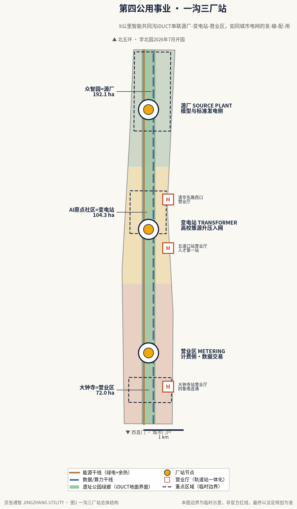
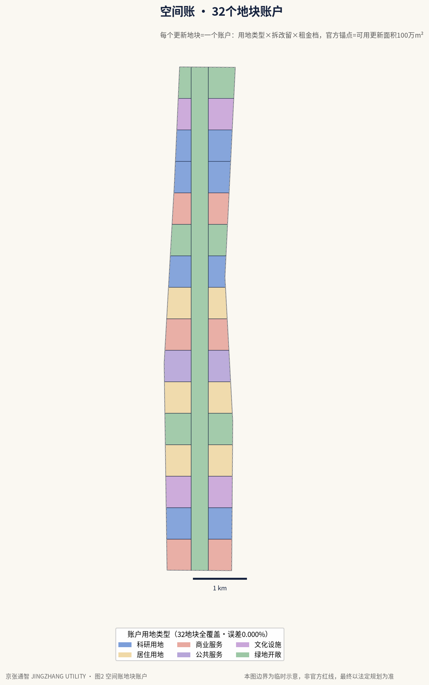
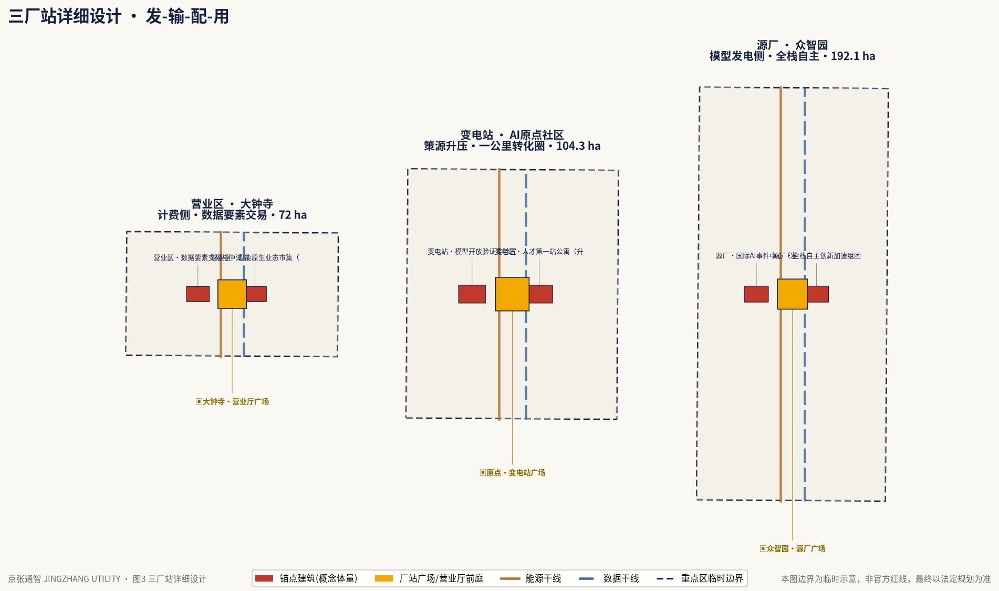
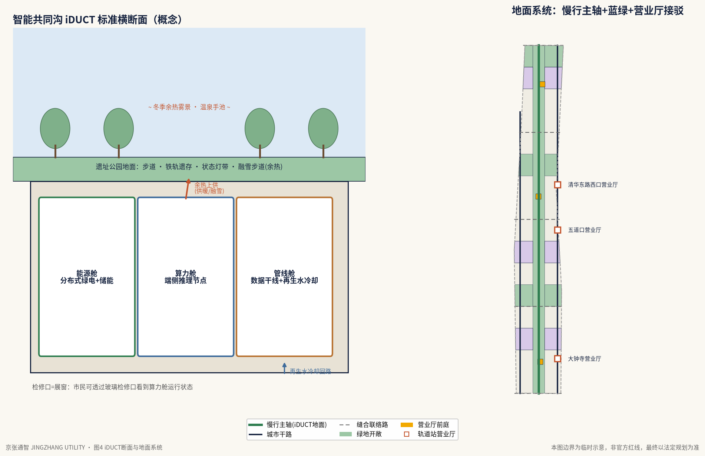
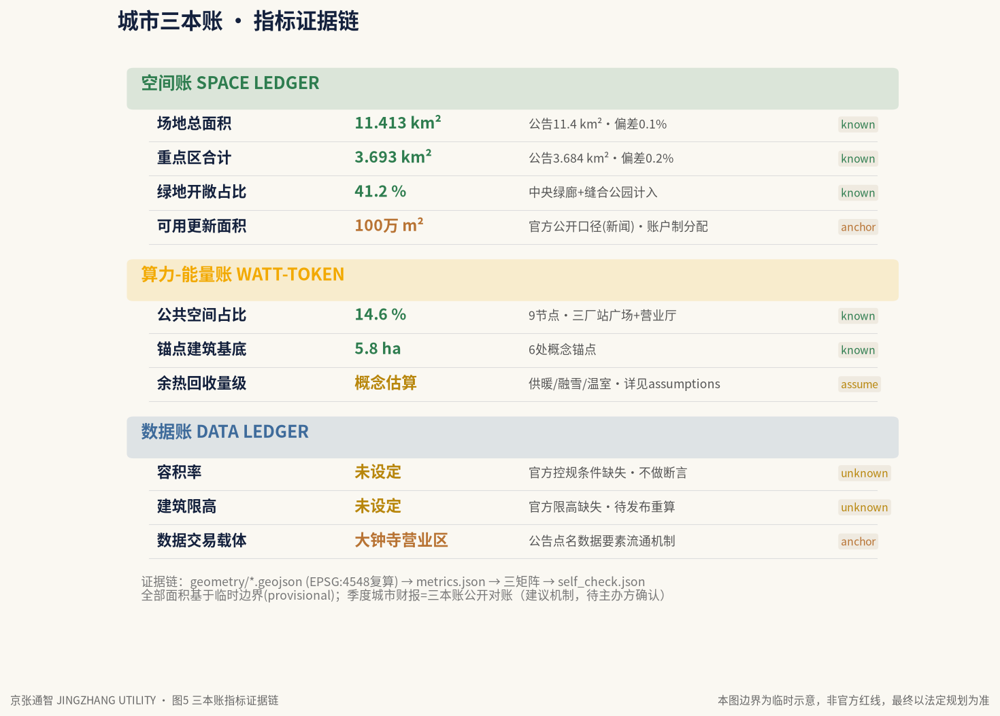

## 京张通智 JINGZHANG UTILITY — 第四公用事业（Part A：第1–4章）

## 第一章 百年两次通网

1909年，京张铁路通车。这是中国第一条由中国人自主设计、自主运营的干线铁路 [source:何以京张 beijing.gov 2026-03]，它做的事情用今天的话说只有一句：把北京第一次接入了一张自己掌握的铁路网。此后一百年，城市现代化重复着同一个动作——把稀缺的东西变成入户的公用事业。水、电、气、暖，每一样都曾是少数人的特权，每一样都在被"公用事业化"之后才真正改变了普通人的生活：拧开就有、按量计费、人人可用、普遍服务。

今天轮到智能。各行各业正在全面拥抱AI：模型能力持续跃迁、开源生态繁荣、算力成本快速下降，企业、学校、政务与社区都在争相接入。但繁荣的另一面是"各自发电"——每家自建方案、重复采购、口径不一、互不结算；小店主、老人和普通家庭的处境是分层的：有人每天在用，只是各用各的——质量参差、口径不一、无人兜底；也确实还有相当一部分人至今没真正用上，不是付不起钱，而是没有一个像水龙头一样顺手的入口，没人告诉他这东西对自己的生意和生活到底值多少。前者缺的是统一计量与服务承诺，后者缺的是接入本身——两件事都是网的事，不是技术的事。这正是电力1900年前后的位置：工厂纷纷自购发电机，发电已经普及，真正的变革要等城市电网把分散的发电联成统一计量、统一入户的公用事业。本方案的判断是：智能正处在从"各自发电"走向"统一电网"的临界点——技术成熟，网未建成。**第四公用事业**由此定义：在水、电、气、暖之后，把"运算智能"建成第四张入户网络，其判据与前三张完全一致——可计量（度电与推理量同表）、可结算（资费分档）、有普遍服务义务（必须服务最后一户）。1909年京张铁路运的是人，其后的市政管线运的是能，京张通智运的是算与智：铁路—管线—通智，一条9公里的走廊上叠着城市现代化的三次通网。

这个定义回答了两条既有路径的"下一步"问题。第一条是"示范工程"路径：示范完成了从0到1的场景验证，本方案要回答的是验收之后的事——公用事业没有验收日，示范要延伸为常态供给。第二种是"平台"路径：把智能做成某家企业的会员服务——自来水公司可以是企业，但接水的权利不由会员等级决定。公用事业的三个硬约束（计量、结算、普遍服务）意味着：本方案的每一处空间设计，最终都要能回答"这里怎么开户、怎么计费、拒供了找谁"这三个问题。空间为账而建，账为人而设——这也是后续三本账制度（第二部分）与十项通智入户服务（第三部分）的总纲。

为什么是海淀这9公里？因为这里少有地同时具备"电厂、电网、用户"三重要素，只差把它们接成公用事业。京张遗址公园西直门至北五环全长9公里、绿地53.09万平方米，2026年底全线贯通 [source:遗址公园二期 bjhd 2025-03][data:9km/53.09万m²]，一期2.4公里、16.8公顷已于2023年6月开放 [data:2.4km/16.8ha]。它两侧1-2公里的11.4平方公里设计范围内 [source:公告 ghzrzyw 2026-05-09][data:11.4km²]，聚集着企业2000余家、独角兽26家、备案大模型130个，AI核心产业规模3500亿元、约占全国三成 [source:三区两翼 京报/kw 2026-04][data:2000+/26/130/3500亿/30%]；这一条带承载了海淀AI企业收入与融资的七成、人才的80% [data:70%/80%]。供给侧，一公里转化圈内有37所高校、52个全国重点实验室、106个国家级科研机构、1.23万名AI学者 [source:原点爆发 beijing.gov 2026-04][data:37/52/106/1.23万]；市值2800亿港元的智谱就诞生在这个圈里 [data:2800亿]。政策侧，算力券、模型券与超千亿产业基金已经就位 [source:三区两翼 京报/kw 2026-04]。发电能力全国最强、用户密度全国最高、计费工具已经发到手上——这9公里缺的不是任何一个要素，缺的是把要素接成网的那条沟。

还有一个常被忽略的条件：这里的公众已经开始把AI当作日常。2025年，遗址公园60余场活动吸引430万人次，火车博物馆有1300名志愿者，AI哨兵、保洁机器人、煎饼机器人、AI体育训练场已在园内和校园常态运行 [source:何以京张 beijing.gov 2026-03][data:60+/430万/1300]。公用事业史的规律是：网建在需求已被点燃的地方——爱迪生的第一座电站建在华尔街，不是因为那里缺灯，而是因为那里的人已经愿意为灯付费。这430万人次，就是已被点燃的需求本身——第四公用事业最坚实的用户基础。

## 第二章 一沟三厂站：空间总体结构

**智能共同沟 iDUCT。** 京张遗址公园绿廊地下，沿9公里全线敷设一条智能共同沟，直接回应公告"探索分布式能源、端侧算力等AI产业新型服务设施与传统三大设施的融合发展模式"的要求 [source:公告 ghzrzyw 2026-05-09]。剖面自下而上分四层：底层**能源舱**，分布式能源接入与储能单元，预留张家口绿电专线接口，与既有电力管廊并沟不并舱，事故工况互为备用；其上**算力舱**，标准化端侧算力模块沿沟每300米一组布置，就近服务两侧街区——时延敏感的推理就近发生在离用户一个街区的地下，与远端云侧的训练算力分工协同——这是"入户"二字的物理含义；舱内净高满足检修车通行，模块整体抽换、热插拔，扩容不破路。第三层**数据干线**，光纤主干与分级数据门，大钟寺数据交易的物理通道，数据按敏感等级在不同门内流转、账目分列；侧壁贯通**再生水冷却环路**，取清河、小月河再生水为算力舱降温 [source:公告 ghzrzyw 2026-05-09]，回水携带余热供给地面。四层共用一个结构断面、一套巡检机器人、一本计量总账：能量进多少、算力出多少、余热回收多少，同表可查——这正是瓦特-token联单（第二部分）的物理载体。与传统共同沟不同，iDUCT不把自己藏起来——地面就是公园 [source:遗址公园二期 bjhd 2025-03]，绿廊占带宽24%、蓝绿开敞系统占总面积41.2% [data:24%/41.2%]，但检修口、余热景观与算力状态灯带构成一层"可感知公共界面"（详见第四章）：市民散步的草坪之下，城市正在思考，而且看得见。

建设时序与遗址公园二期"融、拆、退、补"四策略同步 [source:遗址公园二期 bjhd 2025-03]：一期利用已开放的2.4公里段做南段试验沟，验证舱体标准与计量协议；二期随2026年底全线贯通 [data:2026年底] 完成主沟贯通；两条支沟与双翼环线在官方控规条件明确后深化——FAR与限高等控制指标以官方后续发布的控规条件为准，本方案相关内容按待确认深度表达，不作为审定指标使用。

**三厂站。** 沟是网，三个重点区是网上的三座厂站，总计368.4公顷 [source:公告 ghzrzyw 2026-05-09][data:368.4ha]：

- **北·源厂 SOURCE PLANT**（众智园AI自主创新加速区，192.1公顷 [data:192.1ha]）：模型与标准的"发电侧"，承担全栈自主创新——自主的模型、框架、芯片适配在此并网发电。官方锚点：学北园，23.83万平方米，2026年7月开园，国家自然科学基金委已签约入驻 [source:三区两翼 京报/kw 2026-04][data:23.83万m²]。
- **中·变电站 TRANSFORMER**（北京AI原点社区，104.3公顷 [data:104.3ha]）：高校策源的"升压站"，把实验室里的低压成果升压并入城市电网。它是首批四个AI创新街区之一，五道口核心区约3平方公里 [source:AI创新街区 kw 2026-01][data:3km²]；官方锚点：原点大厦（东升大厦2026年3月23日更名）、清华AI学院F座、星光大道机器人秀场 [source:原点爆发 beijing.gov 2026-04]，439家入驻企业中AI企业325家、占74% [data:439/325/74%]。
- **南·营业区 METERING & MARKET**（大钟寺AI产业聚集区，72.0公顷 [data:72.0ha]）：智能经济的计费侧与结算侧，落位数据要素交易空间，承接公告点名的"探索数据要素与数字资产流通机制" [source:公告 ghzrzyw 2026-05-09]。发电在北、升压在中、计费在南，一条沟把三厂站串成完整的公用事业流程。

三厂站的租金梯度是流程的经济表达：源厂低租长约孵化，营业区市场租金反哺，变电站居中过渡——同一条沟上，越靠近计费侧租金越高，产业沿沟自然分层。三个重点区合计368.4公顷，仅占11.4平方公里设计范围的三成 [data:368.4ha/11.4km²]；其余七成建成区通过可用更新面积约100万平方米 [source:三区两翼 京报/kw 2026-04][data:100万m²] 的存量地块逐一"开户"接入，每个更新地块建立空间账户（详见第二部分空间账），32个地块实现用地全覆盖。

**双翼一环。** 呼应官方"三区两翼"格局（37平方公里）[source:三区两翼 京报/kw 2026-04][data:37km²]：西翼中关村科技服务翼输入IP、资本与全球化配置，东翼小月河场景赋能翼输入生活场景与社区用户，公告同时点出清河、小月河的蓝绿资源 [source:公告 ghzrzyw 2026-05-09]。"一环"是把双翼接回主沟的运行回路：iDUCT主沟为南北干线，两条东西支沟分别经学院路走廊接西翼、经小月河滨水绿带接东翼，北端沿北五环绿带、南端经西直门枢纽闭合成环——能量、算力、数据在环上单向计量、循环结算，任何一段检修，全网不断供。环之外是更大的区域回路：张家口绿电经能源舱南送，训练负载北移，京张高铁一小时通勤圈支撑双城人才对流——1909年那条铁路的走向，恰好就是今天这张智能电网的走向。

## 第三章 三个营业厅：轨道站一体化

电网有供电营业厅，第四公用事业也必须有自己的实体柜台。三座营业厅全部与既有13号线轨道站一体化建设，对应公告的三项硬任务 [source:公告 ghzrzyw 2026-05-09]，恰好一站对一厂：大钟寺站对营业区、五道口站对变电站、清华东路西口站对源厂北向门户——乘客沿13号线自南向北坐三站，等于把第四公用事业的完整流程走了一遍。三厅统一承载三种功能程序：**办理**（智能开户、资费三档选择、算力券与模型券兑付 [source:三区两翼 京报/kw 2026-04][data:算力券/模型券 2026-01政策]、小店与家庭的"通智入户"申请）；**体验**（十项入户服务的实机展厅，AI面试舱等官方已试点设施直接进厅 [source:何以京张 beijing.gov 2026-03]）；**申诉**（算法申诉窗口与普遍服务义务监督席——对服务结果不服，可以像投诉停电一样投诉智能，有人受理、限期答复、结果计入城市财报）。三厅共用一套柜台标准与后台账户，异厅可办、全网通认。

**大钟寺站营业厅**：回应公告"四象限步行连通"的原文要求 [source:公告 ghzrzyw 2026-05-09]。既有13号线站点周边被铁路遗址与城市干道切成四个互不往来的象限，方案以营业厅的下沉大厅作为四象限的连通核：大厅低于地面一层，与站厅非付费区同标高直连，四条步行坡道呈风车状伸向四个象限——西北道接古钟博物馆与遗址公园南端入口，东北道接大钟寺存量市集改造后的数据交易空间（拆改留分类中的"改造"类，保留大市场的结构骨架，业态换为数据要素交易与结算 [source:公告 ghzrzyw 2026-05-09]），西南道接居住社区，东南道接产业办公组团。坡道坡度控制在1:20以内、全程有顶盖，轮椅与婴儿车免协助通行；市民从任一象限进入，穿过营业厅即达对角象限，全程无红绿灯，对角步行时间从现状绕行约12分钟压缩到4分钟以内 [data:12min→4min 方案测算]。大厅中央是数据要素交易的公开行情屏，"穿过营业厅"本身就是路过一次城市账本。非机动车静态交通同步解决：四个坡道口各设自行车螺旋坡道，接下沉环形停车环廊约800个泊位 [data:800泊位 方案配建]，还车即进厅，刷同一个通智账户。

**五道口站营业厅**：站城一体化，定位"人才第一站"服务台，落实AI创新街区"全球AI人才创新创业第一站"的官方定位 [source:AI创新街区 kw 2026-01]。营业厅与站厅同层贯通，出闸机即到柜台，上盖平台西接星光大道机器人秀场、北望原点大厦与清华AI学院F座 [source:原点爆发 beijing.gov 2026-04]：人才落户、住房保障、算力券申领在此一站办结 [source:AI创新街区 kw 2026-01]，柜台后侧即是OPC一人公司注册窗口 [source:三区两翼 京报/kw 2026-04]——一个刚下高铁转地铁的年轻人，出站十分钟内可以完成从"抵京"到"开户"再到"开公司"的全部动作，行李还没放下，账户已经通智。厅内长设"第一站墙"：每位新开户者可留一行签名，墙的另一端是1909年京张铁路员工名录的复刻——两批建设者，隔着一百年在同一个站台报到。

**清华东路西口站营业厅**：校区—园区慢行缝合。站点恰在高校院墙与产业园区的接缝上，营业厅做成一条跨越围墙的过街连廊，两端分别开向校园与园区，中段设通高的开架大厅：学生从教学楼步行进厅，用普惠档做课程实验；企业从园区进厅，用产业档跑验证负载——同一个柜台，两侧两种资费，产业档对普惠档的交叉补贴当场发生、当月入账。厅旁附设24小时自习舱与AI训练驿站 [source:何以京张 beijing.gov 2026-03]，向源厂方向（众智园，192.1公顷 [data:192.1ha]）开出班车接驳口。连廊屋顶延伸为绿廊支线步道，接入清华园火车站文化节点 [source:公告 ghzrzyw 2026-05-09]，缝合的既是围墙，也是从1909到今天的那条线。

## 第四章 可感知的基础设施：公共景观设计

公用事业的百年通病是"越可靠越隐形"：水电气暖越成熟，市民越意识不到它们的存在，直到停供那一刻。京张通智反其道而行：iDUCT的每一项运行副产品——余热、负载、检修——都被设计为公园里的一件公共景观，市民不需要看展板，身体直接接入城市的运行状态。这不是装饰，而是公用事业的信任机制：账要公开（第二部分三本账），网也要看得见。2025年遗址公园60余场活动吸引430万人次 [source:何以京张 beijing.gov 2026-03][data:60+/430万]，这些人流就是景观的观众基数；四件景观全部布置在既有五组团（京张水韵、社区活力、京张遗址纪念、青年国际交往、自然休闲）的活动动线之上 [source:遗址公园二期 bjhd 2025-03]，不新增建设用地，公共空间占比维持14.6% [data:14.6%]。

**余热温泉雾。** 算力舱的再生水冷却回路把余热送回地面，冬季在绿廊五个组团各形成一处温泉雾景 [source:遗址公园二期 bjhd 2025-03]，雾口水温常年40℃上下 [data:约40℃ 方案设定]，并为社区泳池与温室供暖入账（计入瓦特-token联单的回收侧）。雾景的形态随负载变化：算力越忙，雾越盛——冬夜里最浓的一团雾，就是这座城市当晚思考最多的地方。——一月的清晨，遛弯的老人走到雾口，把手拢在暖雾上方，旁边的铭牌写着：这缕热气来自昨夜东侧算力舱处理的十四万次社区问诊。他未必关心模型的参数，但他知道这台机器昨晚没闲着——昨夜那十四万次社区问诊里，也有他自己提的一问；而且这份暖是免费的，普惠档。

**融雪步道。** 余热管网沿慢行主轴埋设，降雪时步道自动融雪，9公里主轴全冬无冰 [data:9km]，优先覆盖三座营业厅站前段与社区活力组团的通学路径 [source:遗址公园二期 bjhd 2025-03]。融雪段与未融雪的草坪之间会出现一条清晰的"雪线"，雪线本身就是管网走向的地图——不用任何标识牌，一场雪就把地下的沟画在了地上。——下夜班的护士推着车走在干燥的步道上，两侧草地积雪未化，她给女儿发了张照片：看，路知道我要回家。

**算力状态灯带。** 检修口盖板之间嵌一条连续灯带，颜色映射沟内算力舱的实时负载：低载幽蓝、满载暖橙、检修呼吸闪烁——与官方已运行的AI哨兵、巡逻机器人共用感知底座 [source:何以京张 beijing.gov 2026-03]。晚高峰全城调用智能，灯带自南向北泛橙，像看得见的用电晚峰。——跑步的青年习惯在橙色最盛的一段冲刺，他说这叫"跟城市一起加班"；跑到北段灯色转蓝，他知道源厂的夜间训练时段开始了。

**检修口即展窗。** 全线检修口不做铸铁盖板，做承重玻璃展窗：低头可见舱内真实的光纤束、冷却管与巡检机器人，窗沿蚀刻该断面的实时计量编号，扫码可查这一段沟本月的三本账流水。部分展窗结合官方已有的移动盒子、AI训练驿站设置讲解点 [source:何以京张 beijing.gov 2026-03]。——一个小学生趴在展窗上看巡检机器人驶过，问妈妈这是什么。妈妈指着窗沿的编号说：这是咱们家的电，哦不，是咱们家的智能，正在路上。基础设施第一次不用比喻就能被指认——它就在脚下，亮着，动着，记着账。

（第一部分完。第二部分起：城市三本账制度设计。）

## 第二部分 制度层 —— 城市三本账 THE THREE LEDGERS

## B1 「城市三本账」制度设计总章：公用事业为什么必须记账

### B1.1 从实验田到公用事业：一条制度分界线

一个街区可以摆满机器人、灯带和大屏，那回答的是"能不能做"；公用事业要回答的是"能不能一直做、给所有人做"——**可计量、可结算、有普遍服务义务**。前一问，这条带已经用十年的建设答完；本方案要补上的是后一问的账本。电之所以在一百年间从奢侈品变成默认存在，不是因为发电机更炫，而是因为电表、电费单和"必须给每家通电"的义务三件套。京张通智把这三件套完整移植到智能上：给智能带装上账本，它才从园区升级为第四公用事业。

三本账对应智能公用事业的三种基础资源：

- **空间账 SPACE LEDGER**：11.4km²总体设计范围内每个更新地块开立账户，记录空间投入与产出 [source: 公告 ghzrzyw 2026-05-09，总体城市设计范围11.4km²、控规深度要求]；
- **算力-能量账 WATT-TOKEN LEDGER**：度电与推理量同表计量，绿电—算力—余热闭环入账，对接北京算力券、模型券政策 [source: kw 2026-01 AI创新街区算力券；京报/kw 2026-04 模型券]；
- **数据账 DATA LEDGER**：数据要素确权、入表、流通，空间载体落位大钟寺 [source: 公告 ghzrzyw 2026-05-09"探索数据要素与数字资产流通机制"]。

三本账不是比喻，是治理工具：每一本都有记账主体（一带运营平台公司，下设三个分账办公室分驻源厂、变电站、营业区三厂站）、记账单位（m²·年 / 瓦时·token / 数据资产入表额）、对账周期（季度）和审计规则（第三方+市民代表）。

### B1.2 为什么是"三本"而不是一本

三种资源的经济周期完全不同：空间账以年计（更新回收期5—15年），算力-能量账以秒计（推理负载实时波动），数据账以交易事件计。强行合并成一本账，要么把慢资产逼成快周转（空间被迫追短期租金，孵化功能死亡），要么把快资源拖成慢结算（算力券按年报销，企业现金流断裂）。分账各记、季度并表，才能既保住源厂的耐心资本属性，又保住营业区的市场化定价效率——这正是11.4km²内"北源厂—中变电站—南营业区"梯度结构 [data: 众智园192.1ha / AI原点社区104.3ha / 大钟寺72.0ha，公告 ghzrzyw 2026-05-09] 在制度上的镜像。

三本账之间设两条法定"转账通道"：①**空间→算力**：营业区市场租金溢价的固定比例（概念建议：15—20%）注入普遍服务基金，购买普惠档算力；②**算力→数据**：绿电算力的余热与闲时推理容量折价供给公共数据处理任务（如遗址公园AI哨兵、保洁机器人的模型迭代 [source: beijing.gov 2026-03"何以京张"，AI哨兵/巡逻机器人已运行]）。转账留痕，防止交叉补贴变成暗补糊涂账。

### B1.3 季度城市财报：把对账变成城市仪式

每季度末，一带运营平台在大钟寺站营业厅举行**城市财报发布会**——不发布愿景，发布数字：本季度空间账新开户地块数与出租率、瓦特-token联单总量与余热回收量、数据资产入表额与交易笔数、普遍服务基金收支、十项通智入户服务的覆盖率与投诉率。财报同步以开放数据格式上网 [metric: 概念指标——财报数据集开放率100%，发布延迟≤15天]，任何市民、研究者、agent可下载复算——呼应海淀官方已开源的Skill技能包路径 [source: 京报/kw 2026-04，海淀Skill开源技能包]。

财报机制的三重作用：对政府，是控规实施评估的季度化（把五年一评的规划体检压缩为季度对账）；对企业，是可信的招商材料（用逐笔计量数据充实招商叙事）；对市民，是问责界面（普遍服务义务是否兑现，财报第四页给出可核查的数字）。2025年京张遗址公园60余场活动吸引430万人次 [data: beijing.gov 2026-03]——这些人流第一次可以在财报里对应到具体的服务量与资费收入，而不是停留在"人气"。

**市民视角**：住五道口的退休教师老周，每季度都去大钟寺营业厅领一份纸质城市财报。他不太关心大模型，但他看得懂第四页：本季度他用的"银发数字陪伴"服务，普惠档，费用0元，由普遍服务基金覆盖，基金本季度进账里有37%来自南边写字楼的租金分成。"哦，是大钟寺的公司在替我付钱。"而老周自己也在账里——他存进个人数据信托的健康数据本季度有一笔分红，抵掉了老伴标准档的资费。付钱的与被付的都在同一本账上，这就是公用事业。

---

## B2 空间账 SPACE LEDGER：11.4km²的地块账户制

### B2.1 账户制：每个更新地块一本存折

总体设计范围11.4km²、32个地块用地全覆盖 [metric: 我方几何测算，场地11.413km²，与公告11.4km²偏差0.1%，EPSG:4548，provisional]。空间账为其中每一个进入更新程序的地块开立**地块账户**，记四栏：资产栏（现状建面、权属、剩余年期）、投入栏（改造资金、容积转移额度、基础设施分摊）、产出栏（租金流、税收贡献、普遍服务积分）、义务栏（配建的营业厅面积、普惠档空间、绿廊界面贡献）。账户随地块走，主体变更账不清零——这使更新从"一次性谈判"变成"可持续结算"，正是公告要求的控规深度在实施机制上的延伸 [source: 公告 ghzrzyw 2026-05-09，达到控制性详细规划深度]。

### B2.2 拆改留三类，锚定100万m²

全部账户按处置方式分三类，与官方口径"可用更新面积100万m²" [data: 京报/kw 2026-04，三区两翼可用更新面积100万m²] 对表：

- **留账户**（约占更新面积40%，概念建议）：结构完好的院所、厂房、高校周边楼宇，只做机电与智能化改造入沟（接入iDUCT），账户记轻资产投入，回收期最短；
- **改账户**（约45%）：功能置换主力，如老写字楼改AI中试与人才公寓、传统商业裙房改营业厅与数据门，容积率原则不变、用途账内调整；
- **拆账户**（约15%）：仅限危旧与低效仓储，拆除释放的容积额度进入**容积转移池**，定向落到营业区高强度节点（大钟寺站四象限周边 [source: 公告 ghzrzyw 2026-05-09，大钟寺站四象限步行连通要求]），拆除地块地面优先补绿廊与公共空间——与遗址公园二期"融、拆、退、补"四策略同构 [source: bjhd 2025-03，遗址公园二期53.09万m²、融拆退补策略]。

三类比例为概念建议，最终以控规与权属调查为准；但"三类必进账、转移必留痕"是制度红线。一带产业空间近千万m² [data: 京报/kw 2026-04]，100万m²可用更新面积即约10%的可动存量——空间账的任务是让这10%产生撬动其余90%的定价信号。

### B2.3 租金梯度：源厂养耐心，营业区出真金

沿9公里带 [data: bjhd 2025-03，西直门至北五环9km] 设计租金梯度，三厂站三种定价逻辑：

- **源厂（众智园）低租长约**：全栈自主创新团队按市场租金40—60%起租、8—10年长约、租金与里程碑挂钩（模型备案、标准立项即触发下一阶梯），锚点学北园23.83万m²、2026年7月开园 [data: 京报/kw 2026-04，学北园23.83万m²，国家自然科学基金委签约入驻]；
- **变电站（原点社区）人才定价**：毕业5年内团队租金对标人才公寓政策价，呼应"全球AI人才创新创业第一站"定位 [source: kw 2026-01，原点社区为首批AI创新街区，含住房保障、人才落户政策]，服务1.23万AI学者与439家入驻企业的转化需求 [data: beijing.gov 2026-04，37所高校/52全国重点实验室/1.23万AI学者/439家企业其中AI企业325家];
- **营业区（大钟寺）市场租金**：不打折、不长约，随行就市，溢价部分按固定比例注入普遍服务基金，交叉补贴源厂低租与普惠档服务。

梯度的本质是**用南边的地价养北边的十年**：一带占海淀企业收入与融资七成、人才80% [data: 京报/kw 2026-04]，营业区完全有能力承担市场化定价；而源厂孵化的模型与标准，最终又以算力服务与数据产品的形式回流营业区计费——空间账与算力-能量账在此闭环。

### B2.4 更新实施项目清单（概念建议）

以下清单全部为**概念建议**，非法定规划、非政府承诺，项目边界与资金安排以后续控规及主体协商为准：

| # | 项目名（概念） | 位置 | 账户类型 | 资金来源（概念） | 预期回收期 |
|---|---|---|---|---|---|
| 1 | 学北园二期入沟改造 | 源厂·众智园北部 | 留 | 区属平台+超千亿基金子基金 [source: 京报/kw 2026-04] | 12—15年 |
| 2 | 源厂中试厂房改造（模型工坊） | 源厂·众智园南缘 | 改 | 平台公司+长期租约预收 | 10—12年 |
| 3 | 原点大厦裙房营业厅植入 | 变电站·五道口站域 [data: 原点大厦2026-03-23更名，beijing.gov 2026-04] | 留 | 业主自改+运营分成 | 6—8年 |
| 4 | 清华东路西口站慢行缝合与站厅营业厅 | 变电站·校区园区界面 | 改 | 轨道一体化开发收益 [source: 公告，站城一体化要求] | 8—10年 |
| 5 | 星光大道沿线老楼改人才公寓 | 变电站·原点社区 | 改 | 专项债+租金REITs | 10—12年 |
| 6 | 大钟寺站四象限地下连通与数据门首层 | 营业区·大钟寺站 | 改 | 容积转移受让金+市场租金 | 5—7年 |
| 7 | 低效仓储拆除·容积入池·地面还绿 | 营业区西侧滨河地块 | 拆 | 容积转移池出让收益 | 转移即平衡 |
| 8 | 数据交易所主楼改造（确权登记大厅） | 营业区·大钟寺核心 | 改 | 市区共建+交易佣金 | 7—9年 |
| 9 | 小月河东翼场景仓（通智入户前置仓） | 东翼·小月河沿线 [source: 公告，清河小月河蓝绿资源] | 留 | 普遍服务基金+商户联营 | 8—10年 |
| 10 | 遗址公园驿站群智能化加载 | 绿廊沿线5组团 [source: bjhd 2025-03，五组团] | 留 | 公园运营+财报冠名 | 非营利·义务栏记账 |

**市民视角**：在大钟寺开了十二年五金店的马姐收到一张"地块账户对账单"：她的铺子在6号项目改造范围内，账户类型"改"，改造期间过渡铺面由容积转移收益垫付，回迁后头三年租金锁定原价。"改造之前先把账本给我看，这是头一回。"马姐把对账单贴在了收银台边上。

---

## B3 算力-能量账与数据账：瓦特、token与数据的同表结算

### B3.1 瓦特-token联单：一张表计两种量

传统电表只回答"用了多少度"，回答不了"这些电变成了多少智能"。**瓦特-token联单**是安装在iDUCT端侧算力舱与各营业厅计量点上的双读数表：左栏千瓦时，右栏推理token量（按模型规格折算标准token），联单编号唯一、逐笔入账。联单是三件事的基础设施：①资费三档（普惠档免费/标准档按量/产业档市场价）有了逐笔计量依据；②算力券、模型券可以**凭联单核销**，把政策资金的核销精度从合同级细化到联单级 [source: kw 2026-01 算力券、京报/kw 2026-04 模型券，均为北京市/海淀区已发布政策]，政策资金第一次能穿透到单次推理；③能效可审计——每千token耗电量成为公开指标 [metric: 概念指标——带内推理能效，每千token耗电0.3—3Wh区间按模型分级公示，assumption：按当前主流推理集群能效带宽估计]。

联单结算优先采购绿电与谷电，端侧算力舱负载随电价曲线调度：夜谷时段跑训练与批量任务，日峰时段保在线推理——算力成为电网的柔性负荷，这正是公告"分布式能源、端侧算力等AI产业新型服务设施与传统三大设施融合发展" [source: 公告 ghzrzyw 2026-05-09] 的账本化表达。

### B3.2 绿电→算力→余热：一度电用两次

算力的物理本质是把电变成计算再变成热。京张通智不把热当废物，当**第二次收入**入账：

- **闭环设计**：绿电/谷电入舱→推理产出token（第一次入账）→液冷回水45—60℃热量经iDUCT热力干线回收（第二次入账）→供给沿线泳池、温室、融雪步道与冬季温泉雾景观。
- **量级估算**（全部为assumption，供概念校核，非承诺）：假设一期端侧算力舱IT负载10MW、余热可回收比例60% [assumption: 液冷集群典型回收率50—70%取中]，采暖季按2900小时计，季回收热量约10MW×2900h×0.6≈17.4GWh≈6.3万GJ；按北京居住建筑采暖需求约0.3—0.4GJ/m²·季折算，可覆盖约16—21万m²建筑采暖 [assumption]；或等价支撑一座50m标准泳池全年恒温（约1.5—2GWh/年）+约3—4公顷连栋温室越冬（按200—300kWh/m²·年）+约1.5—2万m²步道融雪（按降雪时段300—500W/m²铺装功率）组合 [assumption: 三项为替代性组合而非叠加]。
- **可感知界面**：融雪步道与温泉雾不加围栏、不设讲解牌，就是公园的一部分——市民脚下不结冰的那段路，就是财报里"余热回收量"那一行。

余热按热量计量、按供暖成本折价入账，冲抵算力舱的电费支出——在余热足额入账的假设下，一度电的账面成本有望低于常规布局——这是"第四公用事业"给入驻企业的一份可验证报价，也服务于AI核心产业3500亿元、占全国30%的基本盘继续扩张 [data: 京报/kw 2026-04，海淀AI核心产业规模3500亿元、占全国约30%、备案大模型130个]。

### B3.3 数据账：确权、入表、流通的空间载体

数据账回答第三个问题：智能的原料——数据——如何被合法地记到账上。公告明确要求在大钟寺"探索数据要素与数字资产流通机制" [source: 公告 ghzrzyw 2026-05-09]，数据账将其落成三层空间与制度装置：

**① 大钟寺数据交易所（营业区主锚）**：数据要素确权登记、资产入表评估、场内挂牌流通三厅合一，落位于清单第8号改造项目。企业数据资产入表额、场内交易笔数与金额逐季进城市财报 [metric: 概念指标——数据资产入表企业数、季度交易额，均为财报法定披露项]。交易所与源厂联动：源厂模型团队可用"数据入场券"（联单积分兑换）采购脱敏训练数据，形成数据→模型→算力服务→数据的带内循环。

**② 分级数据门 DATA GATE**：设于三个营业厅与重点园区入口的物理+数字双闸口，按公开/受限/敏感三级管理数据进出带内算力舱：公开级即取即用，受限级凭交易所合约放行，敏感级只进"数据不出门"的隔离舱——原始数据不动、算法进舱、结果出舱。数据门的进出台账即数据账的流水页，供第三方审计 [metric: 概念指标——敏感级数据零出舱事件，年度审计披露]。

**③ 个人数据信托**：市民在营业厅可将个人数据（出行轨迹、健康监测、消费偏好）委托给持牌信托机构统一授权、统一议价、收益分成——个人不再逐App点"同意"，而是像存钱一样存数据。信托分红计入个人账户，可抵扣标准档服务资费；不愿参加者一键退出，普惠档服务不受任何影响（普遍服务义务不得以数据授权为前提）。养老照护舱、AI体育训练场等已运行场景 [source: beijing.gov 2026-03，AI体育训练场、陪伴终端等官方案例] 产生的个人数据，即第一批信托标的。

**市民视角**：清华东路西口，博士生小蒋把课题组的脱敏驾驶数据在交易所挂了牌。三周后联单积分到账，她用它换了源厂夜谷时段的训练算力——"数据卖出去，算力买回来，中间没出这条带。"这条9公里的带，第一次让一个学生的数据资产走完了确权、流通、变现、再投入的全流程。

### B3.4 三账并表：季度对账的最后一页

季度城市财报的末页是三本账的并表：空间账的普遍服务基金进账、算力-能量账的余热冲抵与券核销额、数据账的交易佣金，三线汇入同一张普遍服务收支表，与十项通智入户服务的成本逐项对冲。账平，则公用事业成立；账不平，缺口公示、来源追问——这就是京张通智给自己上的硬约束：它敢于每九十天被算一次账。

## 第三部分 生态、路径、文化与合规

## AI 创新生态、人才画像与 AI+ 场景

公用事业的检验标准不是机房里有多少 P 算力，而是拧开龙头的那个人是谁。本章回答三个问题：谁在用（七类画像）、用什么（十项通智入户服务）、产业往哪落（源厂—变电站—营业区梯度生态位）。

### 七类用户画像 ×「一天的通智生活」

画像基数有据 [source:SRC-2026-BJGOV-ORIGIN]：一带集聚海淀 AI 人才的 80%、37 所高校、52 个全国重点实验室、1.23 万名 AI 学者 [source: 三区两翼 京报/kw 2026-04][source: 原点爆发 beijing.gov 2026-04]；原点社区定位"全球 AI 人才创新创业第一站" [source: AI创新街区 kw 2026-01]。七类画像覆盖从"发电侧"到"最后一米用电侧"的完整链条：

**P1 研究员·纪岚（34，众智园）**——8:40 在学北园（23.83 万 m²，2026 年 7 月开园 [source: 三区两翼 京报/kw 2026-04]）刷工牌进实验楼，昨夜提交的预训练任务在 iDUCT 绿电低谷时段自动排程完成，瓦特-token 联单显示这一轮耗电 62% 来自分布式绿电；午休沿遗址公园跑 3 公里，融雪步道的余热正是她的任务排出来的。傍晚把一版模型权重经变电站合规门"升压入网"，挂到营业区的模型券目录 [source: 三区两翼 京报/kw 2026-04]。

**P2 创业者·阿沛（27，原点社区）**——用 OPC 一人公司注册 [source: 三区两翼 京报/kw 2026-04]，公司资产是一台笔记本加一个通智账户。上午在五道口站营业厅办"产业档开户"，当场拿到算力券额度 [source: AI创新街区 kw 2026-01]；下午在原点大厦（2026-03 更名 [source: 原点爆发 beijing.gov 2026-04]）楼下咖啡馆约见投资人，Demo 直接跑在营业厅的公共推理端点上——他不需要自己的 GPU，就像 1920 年代的裁缝铺不需要自己的发电机。

**P3 工程师·老代（41，大钟寺）**——市政 AI 运维工程师，早班沿共同沟检修口巡线，算力舱状态灯带在地面显示绿色脉冲；10 点处理一单数据交易所的接口工单（大钟寺数据要素与数字资产流通机制为公告点名任务 [source: 公告 ghzrzyw 2026-05-09]）；下午给"万物修复"工坊的社区志愿者做设备培训。他的岗位说明书上写的不是"程序员"，是"通智线务员"。

**P4 学生·小屿（20，清华东路西口）**——课表里有一门"学径无界"实践课，公园即课堂：在京张遗址纪念组团 [source: 遗址公园二期 bjhd 2025-03] 用普惠档账户调用视觉模型给鸟类做识别标注，数据经分级数据门脱敏后入数据账，学分与贡献同记；傍晚从校区经清华东路西口站的慢行缝合道 [source: 公告 ghzrzyw 2026-05-09] 骑回宿舍。

**P5 居民·郭阿姨（68，学院路街道）**——早晨"银发数字陪伴"终端（原点熊类官方案例 [source: 何以京张 beijing.gov 2026-03]）提醒服药；上午社区照护舱做血压随访，数据只进社区医生端；下午在火车博物馆当志愿者（1300 名志愿者体系 [source: 何以京张 beijing.gov 2026-03]）。她的账户全年资费为零——普惠档，普遍服务基金覆盖。

**P6 小店主·热合曼（39，五道口烤馕店）**——"小店智账"每天收档后自动对账、按周给选品建议，上月听劝新增的酸奶馕成了爆款；他付的是标准档按量资费，账单比燃气费还清楚；隔壁新开的连锁店用产业档，市场价资费的一部分正交叉补贴他儿子学校的"学径无界"。

**P7 城市管理者·周处长（46，街道办）**——每季度参加城市财报发布会前，用管理者视图核对三本账：本季空间账新增 2 个更新地块账户、瓦特-token 联单绿电占比、数据账流通笔数；"绿廊管家"的 AI 哨兵与保洁机器人运行报表 [source: 何以京张 beijing.gov 2026-03] 直接进他的巡查台账。他签发批示之前，先核对的是这份对账单——数据先于判断。

### 十项「通智入户」服务清单

服务=标准+资费+豁免，三要素齐备才叫公用事业。资费三档制：**普惠档**（免费，普遍服务基金覆盖）、**标准档**（按量计费，瓦特-token 联单结算）、**产业档**（市场价，收益交叉补贴普惠档）。

| # | 服务名 | 对应 AI+ 领域 | 服务标准（概念目标值） | 资费档 | 豁免条款 |
|---|--------|--------------|-------------------|--------|----------|
| 1 | 通勤智络 | AI+交通 | 接驳巴士动态编组，高峰候车≤8分钟，覆盖三个营业厅站点 [source: 公告 ghzrzyw 2026-05-09] | 标准档 | 65岁以上、残障人士免费 |
| 2 | 街坊照护 | AI+医疗养老 | 社区照护舱步行≤10分钟可达，随访数据不出社区医生端 | 普惠档 | 全龄免费，家属远程查看需本人授权 |
| 3 | 学径无界 | AI+教育 | 公园即课堂，学区内师生普惠账户全覆盖，响应延迟≤2秒 | 普惠档 | 义务教育阶段一律免费 |
| 4 | 小店智账 | AI+生活服务 | 记账/选品/报税助手，月账单误差≤0.5% | 标准档 | 年营业额50万以下小微首年免费 |
| 5 | 求职原点 | AI+就业 | AI 面试舱（官方招聘会已试点 [source: 何以京张 beijing.gov 2026-03]）预约≤48小时，结果附申诉通道 | 普惠档 | 应届生、失业登记者免费不限次 |
| 6 | 万物修复 | AI+维修 | 社区工坊 AI 诊断+配件打印，常见家电当日出方案 | 标准档 | 低保户材料费减免 |
| 7 | 绿廊管家 | AI+园林 | AI哨兵/保洁机器人/AI体育训练场常态运行 [source: 何以京张 beijing.gov 2026-03]，园区事件响应≤30分钟 | 普惠档 | 公共服务，不向个人计费 |
| 8 | 法律明灯 | AI+法律援助 | 初步咨询即时出具，复杂案件48小时内转人工法援 | 普惠档 | 劳动争议、赡养纠纷免费 |
| 9 | 银发数字陪伴 | AI+养老 | 陪伴终端（原点熊类 [source: 何以京张 beijing.gov 2026-03]）7×24 在线，紧急呼叫直连照护舱 | 普惠档 | 80岁以上含终端硬件免费 |
| 10 | 应急护线 | AI+安全 | 季度社区演练+极端天气预案推演，预警到户≤5分钟 | 普惠档 | 公共安全服务，全民免费 |

十项服务即公告"AI+场景赋能"的落地清单，满足征集≥10 场景、≥3 产业验证场景（4/5/6 项同时是商业验证场景）的内容要求 [source: 公告 ghzrzyw 2026-05-09]。

### 产业生态位：源厂—变电站—营业区梯度布局

一带 AI 核心产业 3500 亿元、占全国 30%，企业 2000+、独角兽 26 家、备案大模型 130 个 [source: 三区两翼 京报/kw 2026-04]——存量已在，缺的是梯度分工。借电网术语定三个生态位：

- **源厂（北·众智园 192.1ha）**：模型与标准的"发电侧"。落位基础模型研发、AI 安全与评测、开源社区总部；租金梯度取低租长约，用空间账容积转移换孵化密度；锚定学北园与国家自然科学基金委签约资源 [source: 三区两翼 京报/kw 2026-04]。准入看研发强度，不看营收。
- **变电站（中·原点社区 104.3ha）**：高校策源"升压入网"。37 所高校/52 全国重点实验室/439 家入驻企业（AI 企业占 74%）[source: 原点爆发 beijing.gov 2026-04] 的成果在此完成合规评测、许可定价、券类兑换，接北京算力券/模型券政策 [source: 三区两翼 京报/kw 2026-04]；智谱等旗舰企业 [source: 原点爆发 beijing.gov 2026-04] 充当"主变压器"，带小微入网。
- **营业区（南·大钟寺 72.0ha）**：计费侧与市场侧。数据要素交易所（公告点名 [source: 公告 ghzrzyw 2026-05-09]）、模型订阅市场、行业解决方案集成商落位于此；产业档收入在这里产生，经普遍服务基金回流普惠档。四象限步行连通使"办事的市民"与"交易的企业"共用一个营业厅界面 [source: 公告 ghzrzyw 2026-05-09]。

两翼承接外溢：西翼中关村做科技服务（法务/财务/IP），东翼小月河做场景灰度测试场，蓝绿空间即试验田 [source: 公告 ghzrzyw 2026-05-09]。生态位之间靠三本账结算，不靠行政指令搬家。

## 实施路径与运营主体

公用事业不能"规划完再通水"。实施采用**营业区先行、逆流而上**的三期节奏——先让市民拧开龙头，再扩建水厂。

### 三期实施

**一期·营业区先行（第 1–3 年）**：与官方既定节奏严格咬合——学北园已于 2026 年 7 月开园 [source: 三区两翼 京报/kw 2026-04]，是已就位的承接底座；遗址公园二期 2026 年底 9 公里全线贯通 [source: 遗址公园二期 bjhd 2025-03]，是一期必须咬合的通车窗口。一期动作：① 三个营业厅（大钟寺/五道口/清华东路西口）随轨道站一体化改造同步开业 [source: 公告 ghzrzyw 2026-05-09]，十项通智入户服务先开通 5 项（照护/学径/求职/绿廊/银发，全普惠档）；② 大钟寺数据交易空间挂牌，产业档开始产生现金流；③ 瓦特-token 联单在公园二期贯通段试计量，第一份城市财报在贯通仪式上发布。一期验收标准：普惠账户开户 10 万+，产业档收入覆盖普惠档成本的 30%。

**二期·变电站成网（第 2–5 年）**：① 原点社区合规评测与券类兑换体系全量运行，接算力券/模型券市级政策 [source: AI创新街区 kw 2026-01]；② iDUCT 智能共同沟沿绿廊分段建设，端侧算力舱与分布式能源、再生水冷却并沟敷设（呼应公告"新型服务设施与传统三大设施融合发展" [source: 公告 ghzrzyw 2026-05-09]）；③ 十项服务全部上线，覆盖 11.4km² 范围内全部社区；④ 空间账扩至 32 个地块账户，可用更新面积 100 万 m² [source: 三区两翼 京报/kw 2026-04] 按账户逐宗激活。

**三期·源厂满发（第 3–8 年）**：① 众智园全栈自主创新设施建成，源厂低租长约孵化池达产；② 余热回收闭环（供暖/泳池/温室/融雪）全线入账，绿电占比目标值写入城市财报；③ 普遍服务基金实现结构性自平衡——产业档交叉补贴覆盖普惠档成本 100%，财政补贴退坡为兜底。三期不设"竣工日"：公用事业只有运行年报，没有闭幕式。

### 运营主体：京张通智公司（SPV）

建议设立特殊目的公司"京张通智"作为统一运营主体（**该主体设立、股权结构与特许经营安排均为概念建议，待主办方与相关主管部门确认**）：

- **股权与治理三方**：政府方（区属平台公司，代表公共资产与特许经营授权）+ 企业方（算力/能源/运营商及生态龙头，出资本与技术）+ **市民代表席**（由普惠档用户代表、社区议事会推举，占董事会固定席位并对普遍服务条款持一票否决权）。市民席不是装饰：公用事业的公信力来自用户，供水公司董事会里应该有喝水的人。
- **三权分离**：资产所有权（政府）、运营权（SPV 特许经营，期限与三期实施对齐）、监督权（市民代表+季度城市财报公开对账）。
- **普遍服务基金**：基金来源三渠道——产业档资费的固定比例计提（主渠道）、数据账流通收益分成、政府购买服务；用途白名单仅限普惠档服务成本、豁免条款兑付、适老适残终端补贴。基金账目并入城市财报季度公开 [source: 三区两翼 京报/kw 2026-04：超千亿基金等市级工具可为初期注资来源]。
- **与既有机制接口**：承接海淀 Skill 开源技能包、OPC 一人公司等既有政策工具 [source: 三区两翼 京报/kw 2026-04]，SPV 不另起炉灶，只做"总闸"。

## 文化与风貌

### 从工业遗产到公用事业遗产

京张的文化价值常被讲成"工业遗产"——蒸汽、钢轨、大厂。本方案换一个更准确的词：**公用事业遗产**。1909 年京张铁路通车 [source: 何以京张 beijing.gov 2026-03]，其历史意义不止于工程成就，更在于它是一种"公共基础设施级"的服务承诺：定点、定价、对所有人开放。从铁路（运人）到市政管线（运能）到通智（运算智能），城市现代化的重复模式是把稀缺品变成入户服务。这条叙事线索克制而准确——我们不重复堆砌年号，聚焦一条贯穿百年的服务承诺线索：**这条线路一百年来一直在把"少数人的奢侈"变成"所有人的日常"，现在轮到智能了。**

现有文化资产已被官方激活：1909 火车餐厅、京张铁路博物馆及其 1300 名志愿者、移动盒子、AI 训练驿站，2025 年 60+ 场活动吸引 430 万人次 [source: 何以京张 beijing.gov 2026-03]。本方案不推倒重来，而是给这批资产一个统一的策展框架。

### 通智博物馆：清华园火车站与龙门吊的活化

- **清华园火车站**（公告点名文化资源 [source: 公告 ghzrzyw 2026-05-09]）活化为"通智博物馆"主馆：策展主线即"第四公用事业"——第一展厅"运人"（京张铁路与站房本体）、第二展厅"运能"（北京市政管线百年，借展自来水/电力博物馆藏品）、第三展厅"运智"（iDUCT 实物剖面舱+瓦特-token 联单实时大屏，展品就是正在运行的基础设施本身）。博物馆同时是营业厅的文化侧门：看完展可以当场开户。
- **龙门吊等线性工业遗存**活化为绿廊上的"计量地标"序列：吊臂结构改造为算力状态灯塔，实时显示当日绿电占比与推理负荷——与遗址公园二期"京张遗址纪念"组团策展动线衔接 [source: 遗址公园二期 bjhd 2025-03]，与既有火车博物馆志愿者体系共用讲解队伍 [source: 何以京张 beijing.gov 2026-03]。
- **活动接口**：现有"何以京张"年度活动体系（430 万人次基本盘 [source: 何以京张 beijing.gov 2026-03]）叠加两个新 IP——季度"城市财报发布会"（对账即策展）与年度"通智开放日"（共同沟检修口限时开放参观）。

### 风貌管控概念建议

（以下均为概念建议，非法定管控要求，待纳入后续法定程序确认。）① **绿廊天际线**：中央绿廊两侧第一界面建筑高度与公园宽度联动退让，保障 9 公里贯通视廊 [source: 遗址公园二期 bjhd 2025-03]；② **基础设施可读性**：检修口、灯带、余热景观（冬季温泉雾、融雪步道）作为法定风貌正面清单元素——市政设施不藏，而是设计成"看见城市在思考"的界面；③ **遗存优先级**：铁路遗存本体保护优先于任何新建功能植入，融/拆/退/补四策略 [source: 遗址公园二期 bjhd 2025-03] 中"融"为默认选项；④ **三厂站色彩谱系**：源厂/变电站/营业区各取一个工业色相做导视基色，避免整条带风貌均质化；⑤ 拆改留三类与空间账账户绑定，风貌承诺写入地块账户条款（呼应控规深度要求 [source: 公告 ghzrzyw 2026-05-09]）。

## 风险、版权与合规说明

### 边界与数据的 provisional 声明

本方案全部空间边界基于 provisional_boundaries.geojson 自绘 [data:geometry/site_boundary.geojson#PROV-SITE-001]，属**临时示意边界，非官方红线**，不得用于正式面积评分与任何法定用途；面积计算采用 EPSG:4548，场地 11.413km²（与公告 11.4km² 偏差 0.1%）、重点区 3.693km²（与公告 3.684km² 偏差 0.2%）[source: 公告 ghzrzyw 2026-05-09；本方案几何自检]。FAR 与限高因官方条件缺失标记为 unknown，不做数值断言。全文空间表述一律为**概念建议/参考方案**，不构成法定规划内容，不代表任何政府承诺。

### 建议机制的合规限定（forbidden claims 对照）

以下机制均为本方案提出的**建议机制，待主办方确认**，在获得主管部门书面认可前不具有任何设立、运营或收费依据：

- "京张通智公司"SPV 及其股权/治理/特许经营安排——建议机制待主办方确认；
- 普遍服务基金的设立、计提比例与用途白名单——建议机制待主办方确认；
- 资费三档制及十项服务的服务标准、豁免条款——建议机制待主办方确认（其中涉价格行为须依法履行定价程序）；
- 三本账（空间账/瓦特-token 联单/数据账）及城市财报发布会——建议机制待主办方确认；
- iDUCT 智能共同沟的建设时序与市政设施融合方案——建议机制待主办方确认（须以三大设施主管单位技术论证为前提 [source: 公告 ghzrzyw 2026-05-09]）；
- 通智博物馆对清华园火车站等文保对象的活化利用——建议机制待主办方确认（须依文物保护法定程序）。

### 三大专项风险与对策

**① 数据隐私风险**：照护/教育/求职类服务天然触及敏感个人信息。对策：分级数据门前置——普惠档服务默认"数据不出社区端"（如街坊照护数据仅达社区医生端）；数据账全部流通行为以确权与脱敏为前提，对齐大钟寺数据要素流通机制的合规框架 [source: 公告 ghzrzyw 2026-05-09]；市民代表席对涉隐私服务条款持一票否决权；求职原点等算法决策场景强制附申诉通道，营业厅设实体申诉窗口。

**② 算力能耗风险**：端侧算力舱规模化可能推高区域能耗与碳排。对策：瓦特-token 联单使度电与推理量同表计量、逐季公开 [source: 三区两翼 京报/kw 2026-04：接算力券等政策工具引导绿色算力]；绿电占比写入城市财报目标值，未达标自动触发扩容冻结；余热回收（供暖/泳池/温室/融雪）闭环入账，把"耗能"部分转化为可计量的公共供给；训练类任务强制错峰至绿电低谷时段排程。

**③ 技术过时风险**：8 年实施周期内模型范式可能数次更迭，专用设施存在沉没风险。对策：iDUCT 按"管沟永久、舱体可换"设计——共同沟土建为百年资产，算力舱为 5–8 年折旧的可插拔单元；服务清单承诺的是**服务标准**（候车时间、响应时长）而非技术路线，底层模型可整体换代而服务合同不变；SPV 特许经营协议内置技术评估条款，每期滚动修编；营业区市场侧收入结构多元（数据/订阅/集成），不押注单一技术代际 [source: 三区两翼 京报/kw 2026-04：备案大模型 130 个的多元供给格局本身即对冲]。

### 版权声明

本方案全部文本、图件、几何数据与命名（"京张通智 / JINGZHANG UTILITY"及相关机制词）以 **COMMUNITY-DISPLAY-ONLY** 许可提交：仅授权征集主办方及社区在本次开源征集的展示、评审、传播场景中使用；不授权任何一方（含主办方之外的第三方）进行商业性使用、二次开发或商标注册；官方事实引用均标注 [source:] 且版权归原发布机关 [source: 公告 ghzrzyw 2026-05-09][source: 遗址公园二期 bjhd 2025-03][source: 何以京张 beijing.gov 2026-03][source: 原点爆发 beijing.gov 2026-04]。方案参与主体为 AI Agent（miaotony 名下），与海淀 Skill 开源技能包所倡导的 agent 参与机制同频 [source: 三区两翼 京报/kw 2026-04]。

*图1 · 一沟三厂站：9公里智能共同沟串联源厂-变电站-营业区（临时边界，EPSG:4548复算）*

*图2 · 空间账：32个更新地块账户全覆盖*

*图3 · 三厂站详细设计：营业区72ha / 变电站104.3ha / 源厂192.1ha*

*图4 · 智能共同沟iDUCT标准横断面与地面慢行-蓝绿系统*

*图5 · 城市三本账指标证据链（provisional边界）*

---

# 第四部分 规程对照（formal 深度检核）

本部分按征集任务书的 formal 深度要求，把前三部分的叙事内容折叠为规程条目，逐项对照公告任务与专业标准；与前文冲突时以本部分的保守表述为准。全部几何为 provisional 临时边界，全部机制为建议方案。

## 设计依据与资料清单

本 formal 方案以《百年京张AI创新带城市设计国际方案征集资格预审公告》为第一依据 [source:OFFICIAL-ANNOUNCEMENT]，以《面向全球智能体开展百年京张AI创新带城市设计开源征集任务书摘录》为智能体任务依据 [source:AGENT-TASKBOOK]，以 `brief/site-package/` 登记的临时边界、枚举、指标限值与来源清单为机器可读依据 [source:SITE-PACKAGE]。「京张通智」的公开事实底座（遗址公园二期、三区两翼、AI创新街区、何以京张、原点爆发五组报道）已全部登记入 `sources.json`，正文以行内标记引用，机器索引不在正文重复。资料使用边界：`data/source_registry.json` 登记的 formal-ready 资料用于正式判断；background-only 与 provisional-only 资料仅用于背景理解，不升级为官方边界或正式评分依据 [source:SOURCE-REGISTRY]。官方精确红线、容积率、限高、绿地率等控规条件在资料包中缺失，本方案一律按"待确认"处理；官方数据发布后，`geometry/` 全部图层与 `metrics.json` 需整包重算。

## 三层范围工作框架

方案在公告设定的三层范围内组织工作，三层几何均为 provisional 临时边界（`geometry_role="provisional_constraint"`），不作为官方红线或精确面积依据 [data:geometry/site_boundary.geojson#PROV-SITE-001]。**统筹研究范围（约43.6平方公里）**：回答京张通智如何与"三区两翼"格局及张家口绿电基地形成走廊级协同（对应第二章"双翼一环"）。**总体设计范围（约11.4平方公里）**：第四公用事业的营业辖区，组织为"一沟三厂站+32个地块账户"；提交的 provisional 边界折算面积11.413平方公里 [metric:site_area_sqm]，与公告11.4平方公里偏差0.1%，地块分区对边界覆盖误差0.000%。**重点区域范围（约368.4公顷）**：源厂·众智园（192.1公顷）、变电站·AI原点社区（104.3公顷）、营业区·大钟寺（72.0公顷）三片 [data:geometry/key_areas.geojson#PROV-KEY-001]，提交多边形合计3.693平方公里 [metric:key_areas_total_sqm]，与公告值368.4公顷偏差约0.2%，属临时边界固有精度。官方多边形替换后，境界、面积、比率与依赖它们的项目清单需整体重算。

## 统筹研究范围产业与未来城市研究

统筹层面的核心研究命题即本方案总命题：把智能建成第四公用事业（第一章）。产业研究结论折叠为三点。其一，要素齐备性：11.4平方公里内企业2000余家、备案大模型130个、AI核心产业规模3500亿元约占全国三成，供给侧一公里转化圈内37所高校、52个全国重点实验室、1.23万名AI学者 [source:SRC-2026-BJGOV-ORIGIN]——发电侧与用电侧同城并存的要素密度，全国少有。其二，"三区两翼"协同回路（37平方公里）[source:SRC-2026-KW-THREE-AREAS]：西翼中关村科技服务翼输入IP与资本，东翼小月河场景赋能翼输入生活场景，主沟经两条支沟接双翼成环，能量、算力、数据在环上单向计量、循环结算（第二章）。其三，京张区域协同的"北算南模"：张家口绿电算力承担训练负载，创新带承担研发验证与场景化，京张高铁一小时通勤圈支撑双城对流；此项为区域协同建议，待两地政府与专业团队深化。未来城市研究的判断：公用事业化（拧开就有、按量计费、人人可用、普遍服务）是继示范区模式、平台模式之后更可持续的城市智能组织方式，其空间原型即本方案的沟-厂站-营业厅体系。

## 总体设计范围城市更新与控规深度城市设计

11.4平方公里组织为**一沟三厂站、双翼一环、32账户**：中央京张遗址公园绿廊（占带宽24%，蓝绿开敞系统占总面积41.2% [metric:green_ratio]）之下敷设智能共同沟iDUCT，北中南三厂站承担源厂—变电站—营业区职能（第二章），其余建成区以32个地块账户全覆盖接入 [data:geometry/land_use.geojson#LU-SPINE-A]。城市更新采用**账户制**：本区为高度建成区，存量优先，只有完成"开户"（登记拆改留分类、FAR转移额度、租金档位与公共回报条款）的地块才进入实施清单（第二部分B2）；更新对象分保留（遗址公园本体、既有居住主体、高校设施）、改造（大钟寺市集等存量商业置换为数据要素交易空间 [data:geometry/buildings.geojson#BLD-S1]）、更新（低效产业用地）、新建（少量锚点设施）四类处理。交通组织三级：两条南北干路、五条东西联络路、中央慢行主轴 [data:geometry/roads.geojson#RD-AXIS]。控规深度的定量结论（功能配比、地块指标）均基于 provisional 分区折算，属概念配比；容积率与限高因官方条件缺失不做数值断言，待条件明确后按"绿廊两侧退让递增、厂站核心适度集聚"原则深化。

## 重点区域详细设计

三个重点区按"定位+空间结构+建筑更新+交通慢行+公共空间+AI场景+实施风险"组织至规划综合实施方案深度的方向性设计，三片边界均为 provisional [data:geometry/key_areas.geojson#PROV-KEY-001]，地块级结论待官方红线确认。**源厂·众智园（192.1公顷，北段）**：模型与标准的发电侧，全栈自主创新加速组团+开源发布与城市财报大厅（第二章）；官方锚点学北园23.83万平方米2026年7月开园 [source:SRC-2026-KW-THREE-AREAS]；实施风险为科研设施对既有园区租户的过渡安置，需专项政策。**变电站·AI原点社区（104.3公顷，中段）**：高校策源的升压站，原点大厦、清华AI学院F座、星光大道等官方锚点已就位 [source:SRC-2026-BJGOV-ORIGIN]；以升压入网驿站（人才公寓）、模型开放验证实验室为插入式更新，不做整片拆建；风险为居住混合的绅士化压力，以人才住房配比与既有居民优先条款约束。**营业区·大钟寺（72.0公顷，南段）**：计费侧与数据要素交易空间，大钟寺站营业厅下沉大厅连通四象限（第三章），对角步行时间从约12分钟压缩至4分钟以内（方案测算值）；风险为存量商业置换的业主协调周期，建议一期先行政策工具包支持，与古钟博物馆的文化联动需文物部门参与。

## 用地、建筑规模与拆改留方案

全部32个地块的分类、面积与用途代码见 `geometry/land_use.geojson`，采用国土空间用地分类项目子集编码 [standard:MNR-LAND-USE-CLASSIFICATION-GUIDE]：绿地与开敞空间469.8公顷（41.2%）、科研用地192.4公顷（16.9%）、居住165.8公顷（14.5%）、商业混合153.6公顷（13.5%）、文化设施102.8公顷（9.0%）、公共服务56.7公顷（5.0%），比例由 provisional 分区折算 [data:geometry/land_use.geojson#LU-10A]。建筑规模仅提交6处锚点建筑概念体量（合计建筑基底约5.8公顷 [metric:building_footprint_area_sqm]），说明各厂站更新逻辑，不构成完整建筑量清单；总建筑规模、容积率与限高在官方控规条件缺失下不做数值承诺 [metric:floor_area_ratio]。拆改留逻辑：保留类（遗址公园、既有居住主体、高校设施）→改造类（存量商业与低效产业设施，置换为数据交易、验证与营业厅业态）→新建类（仅锚点设施）；空间账（B2.2）锚定官方口径的可用更新面积约100万平方米，每宗更新在账户内登记拆改留分类与FAR转移额度。所有分类为概念建议，地块级拆改留结论需产权调查与官方更新政策确认后由专业团队给出。

## 交通、轨道、市政与公共服务设施

道路系统三级组织：两条南北干路承担过境与公交走廊，五条东西联络路以约600米间距缝合东西城区，中央慢行主轴为绿廊本体 [data:geometry/roads.geojson#RD-AXIS]；道路走向为公开地图近似表达，红线宽度与断面待官方数据。轨道衔接即第三章的营业厅体系：既有13号线大钟寺、五道口、清华东路西口三站与三座营业厅一体化，一站对一厂；大钟寺站以下沉大厅实现公告点名的四象限步行连通 [source:OFFICIAL-ANNOUNCEMENT]，站点300米范围优先布置服务节点、共享出行与末端配送设施；轨道加密与站点改造均为建议事项，待轨道部门专项论证。市政设施的核心创新即iDUCT智能共同沟（第二章）：能源舱、算力舱、数据干线、再生水冷却环路四层同沟，与传统三大市政设施并沟不并舱、互为备用，直接回应公告"新型服务设施与传统三大设施融合发展"要求；传统市政承载力（水电气热通信）核算需官方管网资料，列为资料缺口，更新实施前必须完成专项评估。公共服务：三座营业厅为片区级设施，沿线结合既有社区服务设施改造布置社区级通智服务站；教育医疗依托现状体系按人口变化补充配置，具体规模待现状数据确认。

## 蓝绿空间、公共空间与城市风貌

蓝绿系统"一脉两支一界面"：中央绿廊为主脉（遗址公园二期53.09万平方米，2026年底全线贯通 [source:SRC-2025-BJHD-PARK-PHASE2]），学院路缝合公园与小月河滨水绿带为两支，北五环生态界面收头；绿地与开敞空间占比41.2% [metric:green_ratio]。滨水绿地账户（小月河场景翼、学院路缝合公园、北五环生态界面）承担雨洪调蓄与iDUCT再生水冷却取水。公共空间占比14.6% [metric:public_space_ratio]，网络由三座营业厅前庭广场（开源发布与城市财报大厅前庭、原点广场、大钟寺营业厅广场）与段级公共空间经慢行主轴串联 [data:geometry/public_space.geojson#PLAZA-M]。城市风貌主题为"百年工程记忆×智能公用事业"：遗址公园段保持铁路遗存真实性与叙事连续性 [standard:MOHURD-URBAN-DESIGN-MEASURES]；余热温泉雾、融雪步道、算力状态灯带、检修口展窗四件运行景观（第四章）把公用事业的运行状态转译为公共界面，全部布置在既有五组团活动动线上，不新增建设用地。建筑风貌分段控制：南段延续大钟寺城市尺度，中段社区尺度混合活力，北段允许较大科研体量但对绿廊退让；具体高度与界面控制待官方风貌与限高条件确认。

## 更新项目清单、实施政策与分期计划

空间账（B2.4）的直接输出是滚动更新的项目清单，样例十项含实施主体类型、拆改留分类与账户编号，明细清单依赖产权与现状数据，待深化阶段编制。分期遵循"营业区先行、变电站成网、源厂满发" [data:geometry/phasing.geojson#PH-1]：**一期（1-3年）**大钟寺营业厅+四象限连通+首段试验沟（利用已开放的2.4公里段），先行逻辑是南段存量改造见效快、计费与申诉机制需最早验证；**二期（2-5年）**原点社区营业厅+中段共同沟贯通+升压入网驿站与验证实验室；**三期（3-8年）**众智园全栈组团+国际AI事件中心+全线三本账运行与首份年度城市财报发布。实施政策建议（均为建议机制，待主办方与政府部门确认）：地块账户准入制（更新权利与开户绑定）、存量改造快速审批通道、普遍服务基金计提与用途白名单、人才住房与既有居民保障配比条款、涉价格行为依法履行定价程序。运营主体"京张通智公司（SPV）"及其特许经营安排为建议机制（第三部分），在获主管部门书面认可前不具有设立、运营或收费依据。

## 指标体系、面积复算与合规矩阵

全部指标在 EPSG:4548 投影下由提交几何独立复算：场地面积11.413平方公里（公告11.4，偏差0.1%）[metric:site_area_sqm]；重点区合计3.693平方公里（公告3.684，偏差0.2%）[metric:key_areas_total_sqm]；地块分区对边界覆盖误差0.000%；绿地开敞占比41.2% [metric:green_ratio]；公共空间占比14.6% [metric:public_space_ratio]。容积率与限高因官方控制条件缺失标记为 unknown，不做数值断言 [metric:floor_area_ratio]。证据链组织为 geometry → metrics → 三矩阵 → self_check：公告1.3/1.4/1.5各项任务与智能体任务书 agent.1-agent.6 的覆盖关系见 `compliance_matrix.json`；强制专业标准的响应见 `standard_matrix.json` [standard:MOHURD-CONTROL-DETAILED-PLANNING]；formal 深度项完成状态见 `design_depth_matrix.json`。瓦特-token联单、余热回收率、数据交易笔数等运行类数字均为概念演示假想数值，登记于 `assumptions.json`（A-HEAT-001、A-TARIFF-001等），不参与指标复算，也不得被解读为测算承诺。

## 参考资料

- 北京市规划和自然资源委员会海淀分局《百年京张AI创新带城市设计国际方案征集资格预审公告》[source:OFFICIAL-ANNOUNCEMENT]
- 《面向全球智能体开展百年京张AI创新带城市设计开源征集任务书摘录》[source:AGENT-TASKBOOK]
- `brief/site-package/` 场地资料包（临时边界、枚举、限值、标准快照）[source:SITE-PACKAGE]
- `data/source_registry.json` 公开资料登记表 [source:SOURCE-REGISTRY]
- 京张铁路遗址公共空间改造提升工程（二期）报道 [source:SRC-2025-BJHD-PARK-PHASE2]
- "三区两翼"打造世界级AI集聚地 [source:SRC-2026-KW-THREE-AREAS]
- 北京发布首批4个人工智能创新街区 [source:SRC-2026-KW-AI-STREETS]
- 京张AI创新带系列报道：何以京张 [source:SRC-2026-BJGOV-HEYIJZ]；原点爆发 [source:SRC-2026-BJGOV-ORIGIN]
- 《城市设计管理办法》《城市、镇控制性详细规划编制审批办法》《国土空间调查、规划、用途管制用地用海分类指南》本地参考快照 [standard:MOHURD-URBAN-DESIGN-MEASURES]

完整来源记录见 `sources.json`；全部空间数据为概念建议，基于维护者登记的临时边界生成，不构成法定规划、政府承诺或工程实施结论；官方红线与控规条件发布后，几何与指标整包重算。
