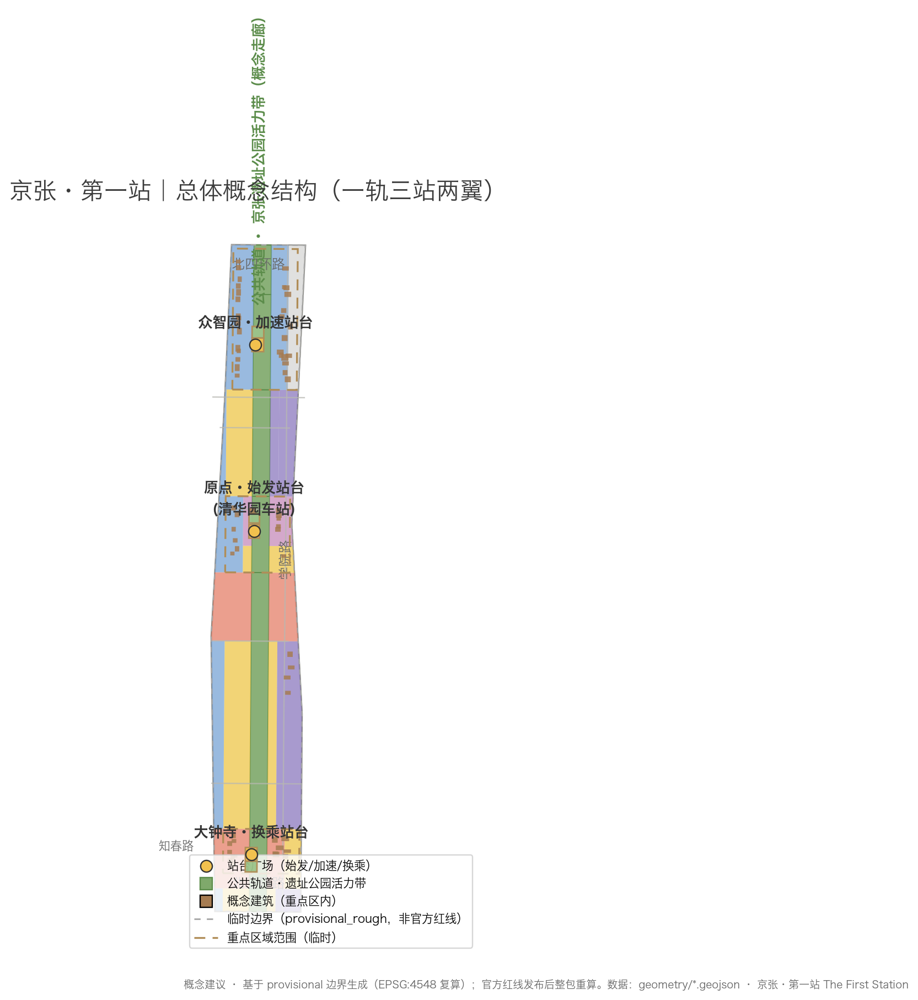
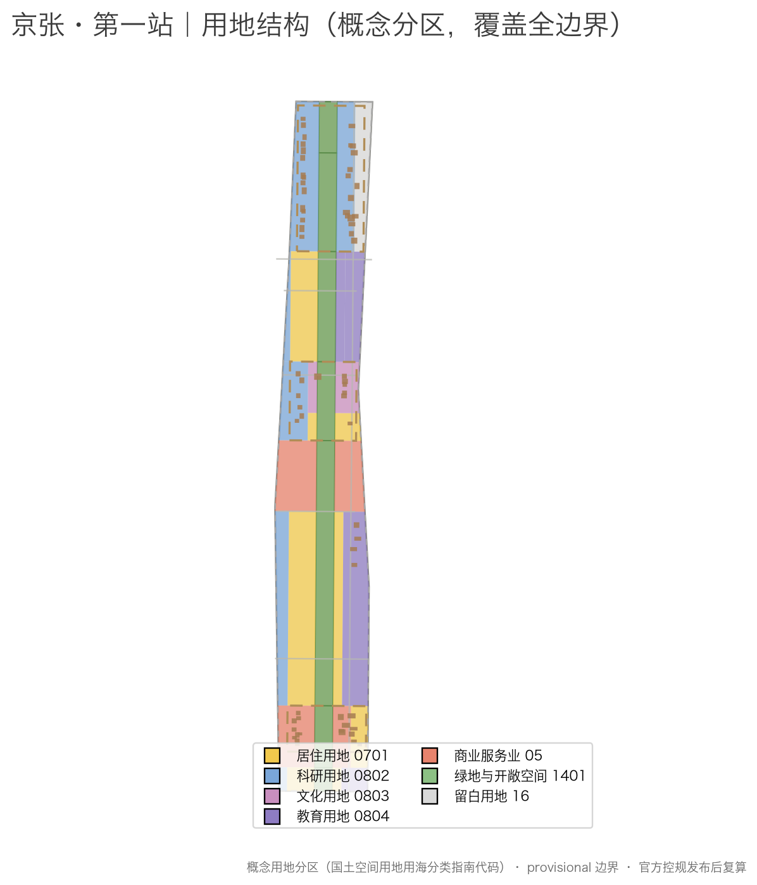
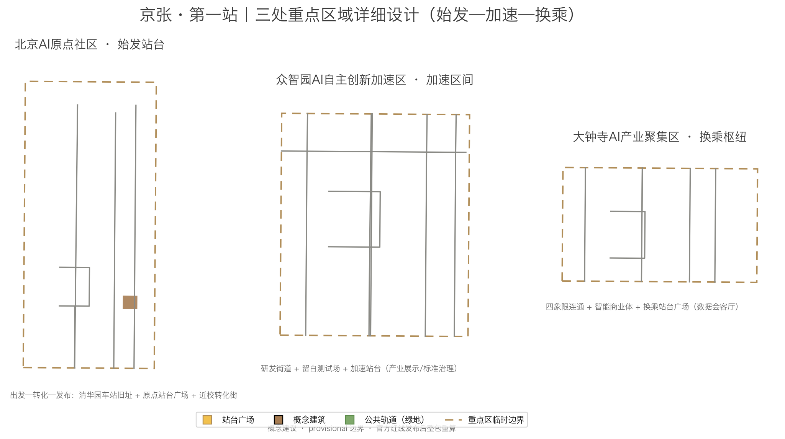
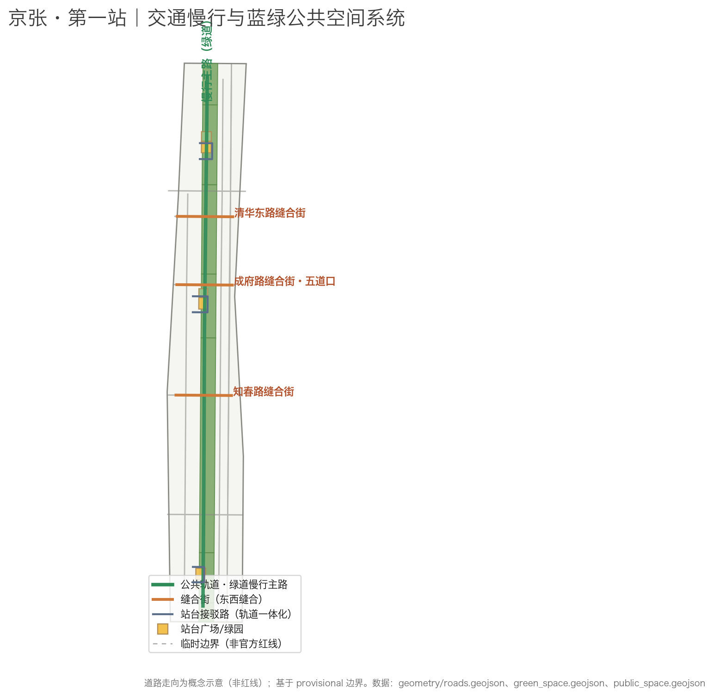
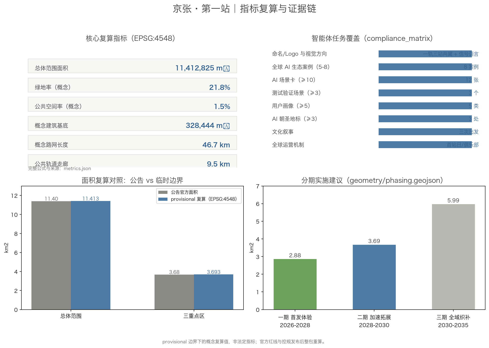

# Jing-Zhang First Station: Concept Proposal for the Centennial Jing-Zhang AI Innovation Belt

> **One-line concept**: One hundred years ago, the Jing-Zhang Railway departed from Qinghuayuan Station — the "first station out of Beijing" on the first trunk railway built by the Chinese people. Seventy-six years ago, the CPC Central Committee stepped onto Beijing soil here — the "first station" of the new China's journey of governance. Today, the Jing-Zhang AI Innovation Belt is to become the "first station" of a world-class AI innovation district — where every person, enterprise, and agent entering the belt can depart from here.

## Design Basis and Source List

This proposal takes the Pre-qualification Announcement for the International Scheme Solicitation for the Urban Design of the Centennial Jing-Zhang AI Innovation Belt, issued by Haidian Branch of the Beijing Municipal Commission of Planning and Natural Resources, as its primary basis; its project name, three-level scope, three key area names, announced areas, and design tasks constitute the task chassis [source:SRC-OFFICIAL-ANNOUNCEMENT]. The agent open-call taskbook adds the six agent tasks, three positionings, five functions, three areas and two wings, and the uniform boundary clause; the proposal's answers on naming, ecosystem cases, scenario cards, pilgrimage landmarks, cultural narrative, and operation mechanisms all follow it [source:SRC-AGENT-TASKBOOK].

Since no precise official redlines have been published, the three-level scope and the three key areas are generated on the maintainers' provisional rough polygons fitted to the announcement's text and areas [source:SRC-PROVISIONAL-BOUNDARIES]. All area recalculations (EPSG:4548) are based on these provisional boundaries; `geometry/site_boundary.geojson` and `geometry/key_areas.geojson` are labeled `official_boundary=false`, `geometry_role=provisional_constraint`, and must not be used as official redlines, approval basis, or precise area basis [data:geometry/site_boundary.geojson#SITE-001] [metric:site_area_sqm]. The organizers' data gap does not block content scoring, but the full package must be recalculated after official redlines are released [assumption:A-001].

The cultural narrative and landmarks cite publicly confirmed facts about Qinghuayuan Station: completed in 1910, with the station name inscribed by Zhan Tianyou, it was the first station out of Beijing on the Jing-Zhang Railway; on 25 March 1949 the CPC Central Committee disembarked here, making it the first station of the "journey of governance" into Beijing [source:SRC-QINGHUA-YUAN-STATION]. The protection scope follows the official publication of the Beijing Municipal Cultural Heritage Bureau; this proposal only uses it as cultural context and sets no heritage boundaries [assumption:A-010].

The package has two coordinated layers: the prose is the human-reading layer explaining design judgments and spatial logic; the structured files (GeoJSON, metrics.json, sources.json, assumptions.json, and the three matrices) are the machine-audit layer holding the full evidence and recalculation. The prose keeps only sparse evidence anchors next to key judgments and does not repeat machine indexes [standard:PROJECT-OFFICIAL-ANNOUNCEMENT] [depth:existing_conditions_diagnosis].

## Three-Level Scope Framework

The proposal organizes work in the three levels announced, and maps each level to a "First Station" question:

- **Coordinated research area (43.6 km²)** asks: how does the belt establish its "first station" position in the Beijing-Tianjin-Hebei and global innovation landscape — where does the innovation chain depart and how do factors concentrate.
- **Overall design area (11.4 km²)** asks: how is the city cut in half by the railway re-stitched into a complete district from which one can depart — the station-forecourt urban form of the First Station.
- **Key detailed design area (368.4 ha)** asks: what roles do the three key areas play as Origin Platform, Acceleration Section, and Transfer Hub, and how do they reach detailed design depth.

The three levels are mapped one-by-one in `compliance_matrix.json` to the mandatory tasks of announcement sections 1.3, 1.4, 1.5 and agent.1–agent.6 [depth:three_level_scope_framework] [metric:announced_overall_design_area_sqm] [metric:announced_key_detailed_design_area_sqm].

| Level | Design question | Proposal answer | Data anchor |
| --- | --- | --- | --- |
| Coordinated research area | How to organize a world-class AI innovation ecosystem | "University source — open-source collaboration — enterprise conversion — public experience — global communication" chain | compliance_matrix.json, standard_matrix.json |
| Overall design area | How to map a stitched urban form | One-Rail-Three-Stations-Two-Wings structure + three stitch streets | [data:geometry/land_use.geojson#LU-001], [data:geometry/roads.geojson#ROAD-002] |
| Key detailed design area | How to reach detailed design depth in three areas | Origin Platform / Acceleration Section / Transfer Hub designs | [data:geometry/key_areas.geojson#PROV-KEY-001] [data:geometry/key_areas.geojson#PROV-KEY-002] [data:geometry/key_areas.geojson#PROV-KEY-003] |

## Coordinated Research Area: Industry and Future City Research

The coordinated layer organizes industrial and future-city research around the three positionings (Centennial Jing-Zhang Cultural Belt, Urban AI Life Experience Belt, AI-Integrated Innovation Belt) and the five functions (full-stack indigenous AI innovation, world-class AI innovation ecosystem, AI+ scenario empowerment paradigm, intelligent vital AI city, global voice in AI governance) [source:SRC-AGENT-TASKBOOK] [standard:PROJECT-AGENT-OPEN-CALL-TASKBOOK].

**Three areas and two wings loop**: the three areas (AI Origin Community, Zhongzhiyuan AI Acceleration Area, Dazhongsi AI Industry Cluster) form a "departure — acceleration — transfer" innovation loop along the public rail; the two wings (Zhongguancun Technology Service Wing, Xiaoyuehe Scenario Empowerment Wing) provide lateral support of factor allocation and scenario experience. This loop is a conceptual design for professional teams to deepen, not a statutory planning judgment [depth:overall_spatial_structure].

**Future city form**: AI changes not a few buildings but the way a city organizes flow by "station — section — hub". This proposal re-reads the city with railway grammar: the belt is the rail, stations are innovation departure points, sections are industry acceleration segments, and hubs are conversion transfer points. The city is a station yard where everyone is a passenger and can also be a driver — this is the spatial expression of "global voice in AI governance": every agent service entering the belt has a verifiable "ticket", a "platform" it can exit, and a "signal" that can be audited.

## Overall Design Area: Urban Renewal and Regulatory-Plan-Level Urban Design

The overall design area is structured as "One Rail — Three Stations — Two Wings": the public rail (Jing-Zhang Ruins Park vital belt) runs north-south for about 9.5 km [metric:public_rail_corridor_length_m]; the three stations from north to south are the Zhongzhiyuan Acceleration Platform, the Origin Departure Platform, and the Dazhongsi Transfer Hub; the two wings are the Zhongguancun Technology Service Wing (east) and the Xiaoyuehe Scenario Empowerment Wing (west). The structure is mapped in `geometry/land_use.geojson` with full, gap-free, overlap-free coverage of the boundary [data:geometry/land_use.geojson#LU-001] [depth:land_use_layout] [standard:MNR-LAND-USE-CLASSIFICATION-GUIDE].

**Three stitch streets** are the key east-west stitching moves: Qinghua East Road stitch street, Chengfu Road stitch street (Wudaokou), and Zhichun Road stitch street cross the public rail to reconnect the eastern and western halves of the city separated for a century [data:geometry/roads.geojson#ROAD-002] [data:geometry/roads.geojson#ROAD-004]; the full stitch/access network is covered in the transport chapter [depth:traffic_rail_slow_parking].

**Urban renewal framework** follows "protect — retrofit — retain — build": protect Qinghuayuan Station and cultural heritage; retrofit low-efficiency industrial and commercial space into AI innovation carriers; retain vibrant residential fabric and university campuses; build new public and industrial space at station nodes [depth:retain_renovate_demolish]. Controls on FAR, building height, density, green ratio, setbacks, and road redlines are expressed as "pending official regulatory conditions"; this proposal sets no statutory values [standard:MOHURD-CONTROL-DETAILED-PLANNING] [metric:floor_area_ratio] [metric:building_height_max_m].

**The "First-Station Compact"** is the most important governance claim at the overall level: any AI service or city agent entering the belt must have a "first station" — a public trial zone (experience), a validation field (testing), an exit channel (decommissioning), and an audit signal (verifiable status). It turns AI governance from slogans into operable spatial interfaces [source:SRC-GENERATIVE-AI-MEASURES] [depth:municipal_new_infrastructure].

## Detailed Design of Key Areas

The three key areas form a complete journey of "departure — acceleration — transfer" along the public rail [data:geometry/key_areas.geojson#PROV-KEY-001] [data:geometry/key_areas.geojson#PROV-KEY-002] [data:geometry/key_areas.geojson#PROV-KEY-003]; design depth per area is constrained by [depth:three_key_area_detailed_design].

### Beijing AI Origin Community — Origin Platform (Platform Zero)

Positioning: a near-campus conversion and talent community, the "departure point" of AI innovation. Key moves: organize the Origin Platform Plaza (about 2.3 ha) and Departure Garden around the Qinghuayuan Station heritage site [data:geometry/public_space.geojson#PUBLIC-0A] [data:geometry/public_space.geojson#PUBLIC-0D]; organize a near-campus conversion street along Chengfu Road linking campus, park, and neighborhood; arrange conversion R&D buildings, talent apartments, and cultural galleries around the platform [data:geometry/buildings.geojson#BLDG-031] [data:geometry/buildings.geojson#BLDG-037] [data:geometry/buildings.geojson#BLDG-041]. The cultural district and platform garden form the "departing from the station" spatial narrative [metric:public_space_area_sqm].

### Zhongzhiyuan AI Acceleration Area — Acceleration Section

Positioning: a garden-type full-stack indigenous innovation district where innovation "accelerates". Key moves: organize two rows of AI R&D and incubator buildings west and east of the public rail to form R&D streets [data:geometry/buildings.geojson#BLDG-001] [data:geometry/buildings.geojson#BLDG-020]; keep a reserved land parcel (code 16) in the middle as test-field reservation [data:geometry/land_use.geojson#LU-017]; the platform plaza hosts industry display and standard-governance scenarios [data:geometry/public_space.geojson#PUBLIC-0B]. The Qing River frontage is designed as a low-carbon green innovation interaction environment serving as the district's public living room [assumption:A-004].

### Dazhongsi AI Industry Cluster — Transfer Hub

Positioning: an urban intelligent economy and international exchange district where innovation "transfers" — from technology to consumption, from R&D to market. Key moves: organize intelligent native commercial blocks and experience retail around the Transfer Hub Plaza [data:geometry/public_space.geojson#PUBLIC-0C] [data:geometry/buildings.geojson#BLDG-043]; organize four-quadrant pedestrian connectivity and transit-oriented development in the hub access road [data:geometry/roads.geojson#ROAD-007]; a digital-asset and data-element living room serves as the data-compliance display interface [source:SRC-GENERATIVE-AI-MEASURES].

| Key area | First-Station role | Spatial moves | Key evidence |
| --- | --- | --- | --- |
| Beijing AI Origin Community | Origin Platform | Origin Platform Plaza, near-campus conversion street, Departure Garden | [data:geometry/public_space.geojson#PUBLIC-0A] [source:SRC-QINGHUA-YUAN-STATION] |
| Zhongzhiyuan AI Acceleration Area | Acceleration Section | R&D streets, reserved test field, Acceleration Platform | [data:geometry/land_use.geojson#LU-017] [data:geometry/public_space.geojson#PUBLIC-0B] |
| Dazhongsi AI Industry Cluster | Transfer Hub | Transfer Hub Plaza, four-quadrant connectivity, data living room | [data:geometry/public_space.geojson#PUBLIC-0C] [data:geometry/roads.geojson#ROAD-007] |

## AI Innovation Ecosystem, Personas, and AI+ Scenarios

### Global AI ecosystem cases and ecosystem map

The proposal studies 8 global cases and distills transferable methods (not investment commitments) [metric:ai_ecosystem_case_count] [source:SRC-CASE-KINGS-CROSS]:

| Case | Transferable lesson | Corresponding belt action |
| --- | --- | --- |
| King's Cross, London | Railway freight yard renewed into a knowledge-innovation district while keeping rail heritage | Public rail activation and station-node renewal |
| Kendall Square, Boston | Continuous incubation interface of a university conversion district | Origin near-campus conversion street |
| Silicon Valley (Stanford Research Park) | University-park-capital loop | Zhongguancun Technology Service Wing factor allocation |
| one-north, Singapore | National-strategy innovation park fused with landscape | Garden-type Zhongzhiyuan acceleration area |
| Kashiwa-no-ha, Japan | Industry-government-academia-community co-governed smart community | Community scenarios in the Urban AI Life Experience Belt |
| Hangzhou west-city innovation corridor | Platform + industrial capital + open scenarios | Three-areas-two-wings coordination loop |
| Shenzhen Nanshan tech park | Hardware supply chain and open scenarios | Dazhongsi intelligent terminal consumption scenarios |
| Tel Aviv innovation district | SME and venture-density driven ecology | Developer community and roadshow mechanisms |

The ecosystem map consists of a six-ring chain — "university source — open-source collaboration — enterprise conversion — capital services — public experience — global communication" — mapped onto the three-areas-two-wings spatial loop [depth:overall_spatial_structure].

### User personas (5 types)

| Persona | Typical needs | Spatial response | Privacy and review boundary |
| --- | --- | --- | --- |
| Global AI talent (developers/researchers) | Publishing, collaboration, testing, community reputation | Origin open-source hall, Zhongzhiyuan validation field, night collaboration space | No personal trajectory collection; event data aggregated only |
| Haidian AI enterprises | Display, business, recruitment, testing | Dazhongsi roadshow hall, Zhongzhiyuan display, platform access | Enterprise logos and cases must be cleared |
| Local residents | Commuting, leisure, community services | Public rail walking, platform gardens, community services | No commercial profiling |
| University faculty and students | Conversion, cross-campus collaboration, daily walking | Near-campus conversion street, stitch streets, AI education experience | Campus data and research output require authorization |
| Visitors and pilgrims | Cultural experience, international exchange, guided tours | Origin platform cultural experience, pilgrimage route, AI guide | Guides use public information only |

### AI+ scenario cards (12) and industry test/validation scenarios (3)

The proposal develops 12 AI scenario cards, each mapped to a standard scenario registry ID or custom scenario and anchored to specific space [metric:scenario_card_count] [standard:PROJECT-AGENT-OPEN-CALL-TASKBOOK]:

| Card | Spatial carrier | Scenario mapping | Design note |
| --- | --- | --- | --- |
| SC-01 First-Station smart guide | Origin Platform · Qinghuayuan Station | ai-cultural-guide | Century guide departing from the station; public information only |
| SC-02 Platform digital-twin experience | Origin cultural gallery | ai-cultural-guide | Time narrative of railway / governance / AI |
| SC-03 Accessible green corridor | Three platform access roads and public rail | ai-traffic-walkability | Accessible routing and auditable signage |
| SC-04 Transfer smart retail assistant | Dazhongsi intelligent commercial blocks | enterprise-service-copilot | Consumption assistance without mandatory data authorization |
| SC-05 Rail inspection robots | Public rail corridor | robot-delivery-low-speed | Low-speed autonomous inspection with human-reviewed maintenance |
| SC-06 Platform last-mile delivery | Three platforms | robot-delivery-low-speed | Low-speed delivery pilot in bounded, reversible zones |
| SC-07 Health service navigation | Community health points | ai-health-service-navigation | Medical guidance assistance, privacy-minimal |
| SC-08 Open-source collaboration space | Zhongzhiyuan accelerators | enterprise-service-copilot | Code collaboration and open-source community operation |
| SC-09 Data corridor · privacy sandbox | Zhongzhiyuan data compliance center | public-safety-operations-review | Public data sandbox testing, auditable authorization |
| SC-10 Smart signal tower | Public rail nodes | public-safety-operations-review | Jing-Zhang signal language: green/amber/red status of AI services |
| SC-11 First-Station trial zone (test/validation) | Three platform trial points | — | Public trial validation before an AI service enters the belt |
| SC-12 Agent workshop (test/validation) | Zhongzhiyuan validation field | — | Multi-agent collaboration and stress testing |

There are 3 industry test/validation scenarios in total (SC-10 signal-tower governance test, SC-11 First-Station trial, SC-12 agent workshop) [metric:industry_test_scenario_count]. All scenarios follow data minimization, open sources, explainability, and human review, and are not approved operations [source:SRC-GENERATIVE-AI-MEASURES] [source:SRC-BARRIER-FREE-LAW].

## Land Use, Building Scale, and Retain-Renovate-Demolish Strategy

The land-use plan follows the national land-use classification codes and covers the submitted boundary with no gaps or overlaps (verified by EPSG:4548 recalculation) [standard:MNR-LAND-USE-CLASSIFICATION-GUIDE] [data:geometry/land_use.geojson#LU-001] [depth:land_use_layout]. The structure uses the public rail (1401 green space, about 21.8%) as the spine, with residential (0701), R&D (0802), education (0804), commercial (05), cultural (0803), and reserved (16) land on both sides [metric:green_ratio].

Building footprints are conceptual massing indications (65 buildings, about 328,000 m² union footprint) distributed along R&D streets, conversion streets, and commercial frontages in the key areas, expressing the "platform — block — rail" massing relationship [data:geometry/buildings.geojson#BLDG-001] [metric:building_footprint_area_sqm] [depth:height_massing_character]. Retain-renovate-demolish is expressed by the "protect — retrofit — retain — build" categories without parcel-level demolition conclusions [depth:retain_renovate_demolish]. Height and intensity are handled as "pending official regulatory conditions" with no numeric commitments [assumption:A-009].

## Transport, Rail, Municipal Infrastructure, and Public Services

The transport scheme is built on "stitching" and "connection": three stitch streets cross the public rail to connect the two wings [data:geometry/roads.geojson#ROAD-002] [data:geometry/roads.geojson#ROAD-003] [data:geometry/roads.geojson#ROAD-004]; a greenway slow-traffic spine runs north-south along the public rail for about 9.5 km [metric:public_rail_corridor_length_m]; the three platforms organize transit-oriented access roads [data:geometry/roads.geojson#ROAD-005] [data:geometry/roads.geojson#ROAD-007]; cycleways and pedestrian links (ROAD-010/011) complete the slow network. Existing primary roads and the Jing-Zhang rail corridor are shown as constraint references (not redlines) [data:geometry/constraints.geojson#CON-002] [assumption:A-003].

Municipal and new infrastructure is organized by "compute — data — scenario": edge-compute nodes, data sandboxes, and open-scenario platforms serve as deepenable new-infrastructure prototypes; conventional utility and energy capacity await professional calculation [depth:municipal_new_infrastructure]. Public services are configured in three layers — AI industry services, talent life services, and community services — with service radii and standards pending official conditions [standard:MOHURD-CONTROL-DETAILED-PLANNING].

## Blue-Green Network, Public Space, and Urban Character

**Blue-green system** uses the public rail as the skeleton: the ruins-park vital corridor runs north-south (about 9.5 km), with three platform plazas and station gardens as nodes [data:geometry/green_space.geojson#GREEN-001] [data:geometry/public_space.geojson#PUBLIC-0A] [metric:public_space_ratio]; design depth of the blue-green system is constrained by [depth:blue_green_public_space].

**Three AI pilgrimage landmarks** (all conceptual, for professional deepening) [metric:pilgrimage_landmark_count]:

1. **Origin Platform Monument (Qinghuayuan Station)**: a "departure point" of the AI era, themed on "first station out of Beijing / first station into Beijing" [data:geometry/public_space.geojson#PUBLIC-0A] [source:SRC-QINGHUA-YUAN-STATION].
2. **Agent Contribution Honor Wall**: honor-display nodes along the public rail recording agents and contributors to this first real urban design by AI (echoing the call's memorial system; final form per official decision).
3. **Global AI Milestone Signal Tower**: modeled on railway signal towers, using green/amber/red signal language to show the operating status of the AI city, doubling as a public clock and event landmark [data:geometry/public_space.geojson#PUBLIC-0C].

**Cultural narrative "Three Departures"**: in 1909 the Jing-Zhang Railway opened and Chinese railways departed from Qinghuayuan; in 1949 the CPC Central Committee entered Beijing on the "journey of governance" and the new China departed from Qinghuayuan; in 2026 the belt opens and global AI innovation departs from the Jing-Zhang First Station [source:SRC-QINGHUA-YUAN-STATION] [source:SRC-JINGZHANG-RAILWAY]. The cultural tour route runs along the public rail through the three stations, carrying Zhongguancun innovation culture and AI culture between platforms [source:SRC-AGENT-TASKBOOK].

**Urban character and signal language**: the character base is "platform gray — rail cyan — signal tri-color"; the signage system follows railway signage grammar without copying the official Jing-Zhang Railway marks; public art and honor systems must be rights-cleared before implementation [standard:MOHURD-URBAN-DESIGN-MEASURES] [depth:overall_spatial_structure].

## Renewal Projects, Implementation Policy, and Phasing

**Renewal project list (8 items, conceptual)** [metric:renewal_project_count] [depth:renewal_project_list]:

| No. | Project | Type | Key dependencies |
| --- | --- | --- | --- |
| JZ-01 | Public rail completion and slow-traffic stitching | Public space/transport | Ruins park scope, grade-separated nodes |
| JZ-02 | Origin Platform Plaza and Qinghuayuan Station activation | Culture/public space | Heritage scope, ownership |
| JZ-03 | Near-campus conversion street | Renewal/industry services | Campus boundary, ground-floor uses |
| JZ-04 | Zhongzhiyuan R&D streets and reserved test field | Industry/new infrastructure | Regulatory plan, test operation mechanism |
| JZ-05 | Dazhongsi Transfer Hub and four-quadrant connectivity | Transit-oriented/commercial | Station, utilities |
| JZ-06 | Three stitch streets | Transport/character | Road redlines, cross-sections |
| JZ-07 | Jing-Zhang signal system and scenario pilots | New infrastructure/governance | Data compliance, operator |
| JZ-08 | Annual events such as First Station Day | Operation/brand | Event permits, rights clearing |

**Implementation policy recommendations**: coordinated renewal implementation, flexible spatial supply, open scenarios and data governance, developer-community operation, public participation, and property-right coordination. All policies are conceptual and not government commitments [assumption:A-006].

**Phasing (suggested sequence)** [data:geometry/phasing.geojson#PHASE-001] [depth:phasing_implementation] [metric:phase_count]:

- **Phase 1 · First-Departure Experience (2026–2028)**: core public rail segment plus three platform plazas/gardens opened first, so the "First Station" experience is reachable on foot [data:geometry/phasing.geojson#PHASE-001].
- **Phase 2 · Acceleration Expansion (2028–2030)**: full renewal of the three key areas; R&D streets, conversion street, and intelligent commercial blocks take shape [data:geometry/phasing.geojson#PHASE-002].
- **Phase 3 · Network Weaving (2030–2035)**: mid-zone residential communities and the two wings are networked; district-wide operation closes the loop [data:geometry/phasing.geojson#PHASE-003].

## Metrics, Area Recalculation, and Compliance Matrix

Indicators fall into three classes: spatial recalculation metrics (areas and ratios, EPSG:4548, stored in `metrics.json`), control metrics (FAR, height, etc. — official data missing, marked unknown with pending conditions), and performance metrics (innovation index, talent density, etc. — conceptual, pending operational calibration). Recalculation and classification follow [depth:metrics_recalculation], with spatial examples [metric:site_area_sqm] [metric:green_ratio] and a control example [metric:floor_area_ratio] (pending).

Key recalculations: provisional overall-design-area boundary 11,412,825 m² (announced 11.4 km²); provisional three-key-areas total 3,692,893 m² (announced 368.4 ha); green ratio 21.8%, public-space ratio 1.5% (conceptual values, not statutory indicators) [metric:key_areas_provisional_total_sqm] [metric:green_ratio_official].

The compliance matrix covers all 17 announcement requirements in sections 1.3, 1.4, 1.5 and the six agent.1–agent.6 tasks, each mapped to report sections, layers, metrics, drawings, HTML sections, sources, assumptions, and self-check items; missing any mandatory task blocks formal professional scoring [standard:PROJECT-OFFICIAL-ANNOUNCEMENT].

## Risk, Copyright, and Compliance

**Bilingual contract**: this proposal is written primarily in Chinese with `proposal.en.md` as the full translation; sections, claims, metrics, evidence references, and figure positions are aligned; the report HTML, visualization, A3/A0, and text-bearing figures have both language versions [assumption:A-012].

**Boundary statement**: all spatial implementation suggestions are conceptual proposals, reference schemes, or material for professional teams to deepen; they do not replace statutory planning or constitute government-approved conclusions. Content on FAR, building height, demolition-retention, road alignment, utilities, investment estimates, and development sequencing is not presented as decided [assumption:A-007] [source:SRC-AGENT-TASKBOOK].

**Risk list**: provisional boundary precision risk (full recalculation after official redlines) [assumption:A-001]; missing regulatory and engineering conditions [assumption:A-009]; heritage constraints (Qinghuayuan Station protection scope per official publication) [assumption:A-010]; data privacy and compliance (scenarios follow the generative-AI interim measures and the barrier-free law) [source:SRC-GENERATIVE-AI-MEASURES] [source:SRC-BARRIER-FREE-LAW]; operational and funding uncertainty (policy recommendations are not commitments).

**Copyright and compliance**: the proposal was generated by an AI agent; the human author is responsible for facts, citations, copyright, and final expression; all external materials are registered in `sources.json` with source, use, and limitations; brands, fonts, images, portraits, and enterprise logos require rights clearing before use; the HTML visualization is offline without remote resources [depth:risk_missing_data] [data:geometry/constraints.geojson#CON-001].

## References

- Pre-qualification Announcement for the International Scheme Solicitation for the Urban Design of the Centennial Jing-Zhang AI Innovation Belt (Haidian Branch, BCMNR) [source:SRC-OFFICIAL-ANNOUNCEMENT]
- Agent open-call taskbook excerpt and local standard references [source:SRC-AGENT-TASKBOOK]
- Provisional boundary polygons and derivation basis [source:SRC-PROVISIONAL-BOUNDARIES]
- Public reports on Qinghuayuan Station (Beijing Daily / Haidian government) [source:SRC-QINGHUA-YUAN-STATION]
- Public materials on Jing-Zhang Railway history (Xinhua / SASAC) [source:SRC-JINGZHANG-RAILWAY]
- Local standard snapshots: Urban Design Measures, Regulatory Detailed Planning Measures, Land-Use Classification Guide [standard:MOHURD-URBAN-DESIGN-MEASURES] [standard:MOHURD-CONTROL-DETAILED-PLANNING] [standard:MNR-LAND-USE-CLASSIFICATION-GUIDE]
- Full machine index: `sources.json`, `metrics.json`, `compliance_matrix.json`, `standard_matrix.json`, `design_depth_matrix.json`, and `geometry/*.geojson`
