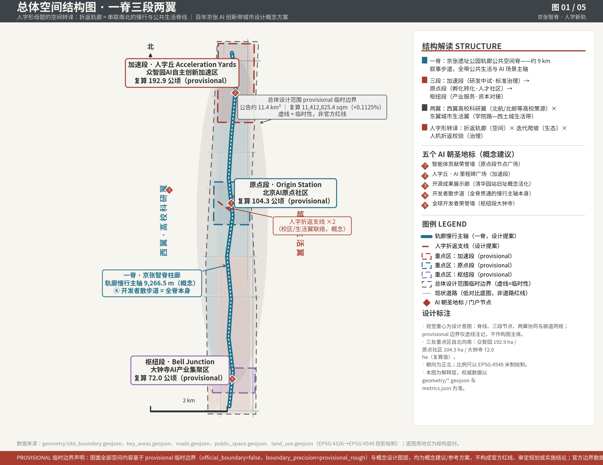
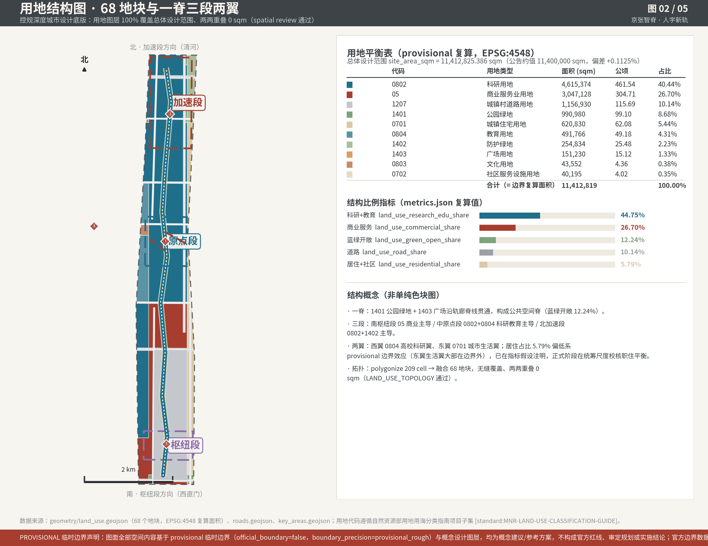
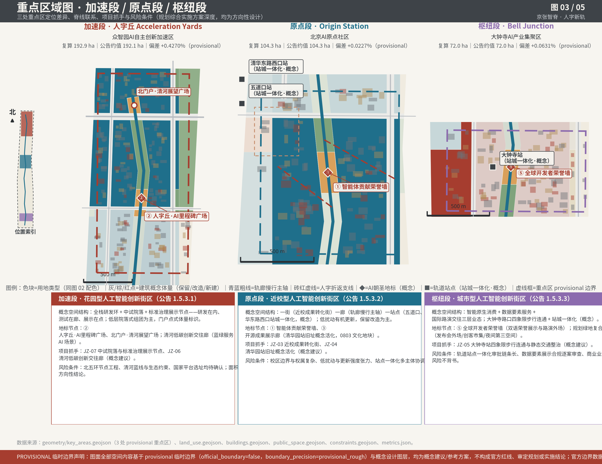
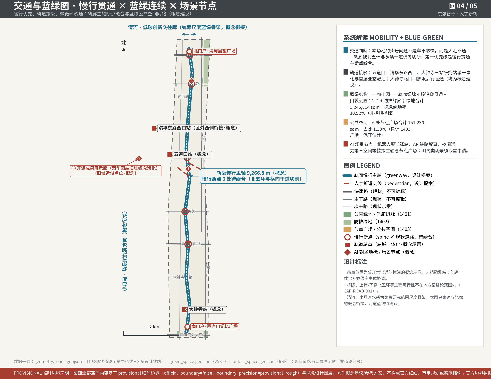
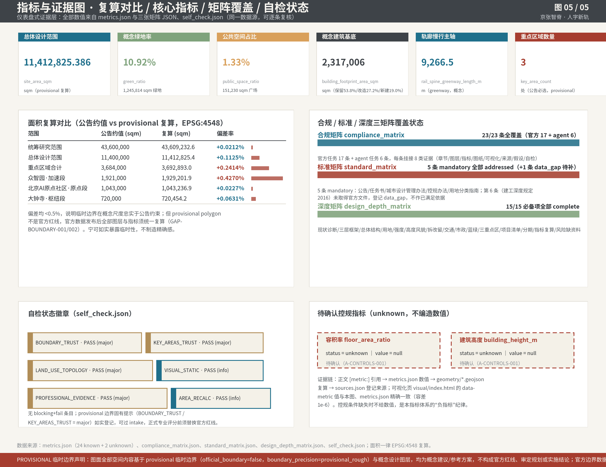

# 人字新轨 · 京张智脊——百年京张 AI 创新带城市设计概念方案

百年前，詹天佑以人字形折返线路让列车爬过青龙桥的高差；百年后，本方案把同一条折返逻辑转译为 AI 时代的城市方法：空间上，折返的轨廊成为串联南北的慢行与公共生活脊线；生态上，折返攀升对应基础研究—孵化—产业化的迭代爬坡路径；治理上，人机折返校验对应智能体提案、人类复核的治理闭环，也与本次开源征集自身的"agent 生成 + 人工复核"机制同构。本方案的全部空间落地、拆改留、强度、高度、道路线位、市政、投资、时序、活动安排与政策机制均为概念建议/参考方案，可供专业团队深化研究；所有成果均为开放共创建议，不替代正式规划，不构成政府审定结论。本文件按公告要求以中文为准，全部证据均可通过正文中的机器可读引用标签回溯至结构化数据文件，接受逐条复核。

## 设计依据与资料清单

**provisional 边界醒目声明：本投稿包当前使用的总体设计范围边界与三处重点区域边界均为 provisional 临时边界（official_boundary=false、boundary_precision=provisional_rough），依据公告文字四至与面积约值推断绘制，仅用于方案生成、自检、可视化与带标注的设计讨论，不得作为官方红线、审批依据或精确面积依据；官方边界数据发布后，全部图层与指标须统一复算。**

本方案的设计依据按可信度分三级管理。第一级为 formal-ready 依据：北京市规划和自然资源委员会海淀分局《百年京张AI创新带城市设计国际方案征集资格预审公告》提供项目名称、三层范围文字四至与面积约值、设计任务与成果深度要求 [source:OFFICIAL-ANNOUNCEMENT] [standard:PROJECT-OFFICIAL-ANNOUNCEMENT]；面向全球智能体的开源征集任务书提供共创原则、六项 agent 任务与合规边界语言 [source:AGENT-TASKBOOK] [standard:PROJECT-AGENT-OPEN-CALL-TASKBOOK]；住建部城市设计管理办法、控制性详细规划编制审批办法与自然资源部用地用海分类指南提供深度与术语参照 [standard:MOHURD-URBAN-DESIGN-MEASURES] [standard:MOHURD-CONTROL-DETAILED-PLANNING] [standard:MNR-LAND-USE-CLASSIFICATION-GUIDE]。第二级为阅读导航与登记层：`brief/site-package/` 的 design_brief、allowed_design_space、enums、ranges 与 schemas [source:SITE-PACKAGE]，`data/source_registry.json` 的资料可用性分级 [source:SOURCE-REGISTRY]，以及 `data/processed/agent_fact_pack.md` 与四张 CSV 构成的任务、范围、来源用途与缺口导航 [source:PROCESSED-FACT-PACK]——它们是组织阅读的工具，不是新的权威来源。第三级为 provisional-only 线索：临时边界与重点区 polygon [source:BOUNDARY-SOURCE] [source:KEY-AREA-SOURCE]，只可作 intake 自检与概念设计底版。

资料与结构化文件的对应关系如下：sources.json 登记全部 7 个来源 id 并在正文逐一回引；assumptions.json 登记 A-CONTROLS-001 与 GAP-BOUNDARY-001/002、GAP-ROAD-001、GAP-BUILDING-001、GAP-HERITAGE-001、GAP-COORD-001 等假设与缺口；compliance_matrix.json 覆盖公告 1.3/1.4/1.5 共 17 条官方任务与 agent.1–agent.6 共 6 条任务；standard_matrix.json 响应 5 条 mandatory 标准并以 data_gap 状态登记第 6 条待补标准 [standard:MOHURD-ARCH-DESIGN-DEPTH-2016]；design_depth_matrix.json 覆盖 15 个必备深度项，现状诊断一项即对应本章与下一章的资料、边界与问题陈述 [depth:existing_conditions_diagnosis]。

*图 1 总体空间结构：一脊三段两翼与人字形母题的空间转译，provisional 边界以虚线淡化表达，底图关系仅作视口参考。*

现状诊断的判断建立在三类可复核事实上：其一，公告确认的三层范围（统筹研究约 43.6 平方公里、总体设计约 11.4 平方公里、重点区域约 368.4 公顷）与本包 provisional 复算值偏差均小于 0.5%（详见指标体系章），说明几何底版在概念尺度上可用但不具备法定效力 [metric:site_area_sqm] [metric:site_area_announced_deviation_ratio]；其二，场地南北跨度约 9 公里、被北五环与多条城市干道横向切割，轨廊两侧的连通性与低效空间更新是公告点名的核心问题；其三，清华园站旧址等文化资源的位置只能按公开名录近似标注 [data:geometry/constraints.geojson#CON-HERITAGE-001]，精确保护范围待官方资料（GAP-HERITAGE-001）。资料缺口清单（官方红线、控规条件、道路红线、现状建筑测绘、文保精确范围、市政容量）已全部进入 assumptions.json 与风险章节，凡涉及这些条件的结论一律写为待确认。

本投稿包的成果文件体系一并说明：proposal.md 是唯一主体方案文本；九个 GeoJSON 图层与 metrics.json 是结构化权威数据；五张必备图与 A3 文册、A0 展板是解释与展示层，不承载权威数据；report/proposal.html 为本文件的离线渲染阅读版，visual/index.html 为静态电子展示页；compliance/standard/design_depth 三张矩阵与 self_check.json 记录任务响应、标准响应、深度证明与自检结果。读者如需复核任一数字，路径是：正文引用标签 → metrics.json 或 geometry 图层 → sources.json 登记的来源，全程不依赖对任何单段文字的信任。

## 三层范围工作框架

公告 1.4 条把任务分为三层，本方案据此组织三种不同深度的工作，而非三套互相割裂的图纸 [standard:PROJECT-OFFICIAL-ANNOUNCEMENT] [depth:three_level_scope_framework]。

**统筹研究范围（公告约 43,600,000 sqm，provisional 复算 43,609,232.6 sqm，偏差 +0.0212%）**：北至北五环路、东至京藏高速、南至西直门外大街、西至万泉河路。本层不新增任何空间红线，工作是产业生态与未来城市形态研究：梳理高校策源、企业转化、科技服务与公共体验的创新链，回答"三区两翼"如何在区域尺度协同。成果表达为叙事、案例、机制与指标体系的建议框架。

**总体设计范围（公告约 11,400,000 sqm [metric:announced_overall_design_area_sqm]，provisional 复算 11,412,825.386 sqm [metric:site_area_sqm]）**：京张遗址公园周边 1–2 公里城市地区。本层达到控制性详细规划的城市设计深度，成果为 68 块用地分区、1256 个概念建筑体量、14 条道路中心线、25 处绿地、6 处公共空间与三期分期图层，以及由它们复算的 24 项 known 指标 [data:geometry/site_boundary.geojson#SITE-001] [data:geometry/land_use.geojson#LU-001]。

**重点区域范围（公告约 3,684,000 sqm，三处合计 provisional 复算 3,692,893.0 sqm）**：自北向南为众智园 AI 自主创新加速区（本方案称"加速段"）、北京 AI 原点社区（"原点段"）、大钟寺 AI 产业集聚区（"枢纽段"），共 3 处 [metric:key_area_count]，达到规划综合实施方案深度 [data:geometry/key_areas.geojson#PROV-KEY-001] [data:geometry/key_areas.geojson#PROV-KEY-002] [data:geometry/key_areas.geojson#PROV-KEY-003]。

*图 2 用地结构：68 块用地分区与轨廊绿脉、三段两翼的功能分带关系，非单纯用地色块图。*

provisional 边界的来源与限制必须在此讲清：投稿包的 site boundary 与 key areas 复制自 `brief/site-package/geometry/provisional_boundaries.geojson`，属性为 official_boundary=false、geometry_role=provisional_constraint、boundary_precision=provisional_rough、source_type=agent_inferred_from_public_data，是按公告文字四至近似绘制的粗略 polygon。它支撑概念尺度的结构讨论与 intake 自检，但不支撑任何精确面积、红线或法定控制结论。官方 polygon 发布后需要重算的对象是全部九个图层（site boundary、key areas、land use、buildings、roads、green space、public space、constraints、phasing）与 metrics.json 全部派生指标——本包所有图层均由边界程序化切分派生，具备整体重算能力，不能只替换单个文件。

三层的成果表达方式各自不同：统筹研究层以叙事、案例、机制框架与指标建议为主，产出文字与关系图，不产出新红线；总体设计层以九个 GeoJSON 图层、metrics.json、五张必备图与 A3/A0 图纸为主，产出可复算的空间结构；重点区域层在前者基础上叠加功能业态、建筑形态、拆改留分类、交通组织与实施项目的逐项说明，达到规划综合实施方案的表达密度。三层共用同一套边界与坐标体系，保证任一层的结论都能回溯到同一几何底版。

三层之间的传导逻辑是：统筹研究层决定"人字形迭代爬坡"的产业方法论与命名体系；总体设计层把它落成"一脊三段两翼"的空间结构与可复算指标 [depth:overall_spatial_structure]；重点区域层在加速段、原点段、枢纽段验证功能、建筑、交通、公共空间与场景的可实施性。任何无法从结构化数据复算的面积、比例或项目数量，本方案不写入结论。

## 统筹研究范围产业与未来城市研究

本章回应公告 1.5（1）的两项任务与 agent 任务书 agent.1、agent.2 [source:AGENT-TASKBOOK] [standard:PROJECT-AGENT-OPEN-CALL-TASKBOOK]。

### 命名体系与视觉识别（agent.1）

总名"京张智脊"（JINGZHANG AI SPINE），副名"人字新轨"。"脊"是双关：既是钢轨的线性脊骨，也是海淀 AI 产业的城市脊梁；"人字新轨"点出母题——用人字形的折返智慧铺设通往智能时代的新轨道。三大主题带沿用官方定位表述：百年京张文化带、都市 AI 生活体验带、AI 融合创新带。三处核心区以铁路"车站体系"命名：众智园为"加速段"（Acceleration Yards，昵称人字丘），北京 AI 原点社区为"原点段"（Origin Station，对应清华园站这一历史原点），大钟寺为"枢纽段"（Bell Junction，钟与代码的声景地标）。这套命名不是口号包装：每一段名都对应一种产业功能（研发中试—社区孵化—产业服务）与一段铁路记忆，使导视、活动与空间设计共用同一语言。

Logo 概念方向：钢轨横断面与电路走线融合构成"人"字符，负形中藏一条向上的折线，暗示折返攀升。主色取京张铁灰（历史）、人字砖红（纪念，源自老站房红砖）、智脊青蓝（未来），辅以暖白。字体气质走技术图解/蓝图风，禁用卡通化、装饰化插画风格。视觉规范的应用分四层：导视标识层用于轨廊全线与节点广场，保证五公里外可识别、近处可阅读；图纸表达层统一本方案全部图件的色板、线型与图例；活动物料层服务大会、黑客松与公开赛的品牌一致性；数字界面层用于展示页与导览应用。四层共用一套栅格与符号，但文化叙事标识（三个自主）在色彩上保持克制，与主标识形成主从关系，避免两套系统混淆。以上为视觉方向性建议，正式识别系统需另行委托设计并完成字体、图形的清权。

### 三大定位、五大功能与三区两翼协同回路

三大定位（百年京张文化带、都市 AI 生活体验带、AI 融合创新带）在本方案中不是并列标签，而是同一条脊线上的三层时间：文化带提供叙事底盘，体验带提供日常公共生活，创新带提供产业内容。五大功能（AI 全栈自主创新体系、世界级 AI 创新生态、AI+ 场景赋能新范式、智能化 AI 活力城市、AI 治理全球话语权）按"三区两翼"分工落位：众智园加速区承担全栈自主创新与治理话语权，原点社区承载世界级创新生态，大钟寺集聚区孵化智能原生新业态，中关村科技服务翼负责要素全球化配置与 IP、资本赋能，小月河场景赋能翼承接场景开放与活力城市实验。协同回路设计为一条闭环：高校与院所的基础研究经原点社区孵化、在加速段完成中试与标准验证、到枢纽段对接资本与市场，产生的场景需求再沿小月河翼回到公共空间测试，测试数据与公众反馈回流高校——这正是"人字形"折返攀升的生态学转译。综合规划思路上，本方案主张以国土空间规划创新方式处理"空间产业融合"：产业功能不依赖新增建设用地扩张，而依赖存量更新中的功能复合与时分共享，此判断与城市设计管理办法对公共空间与功能统筹的要求一致 [standard:MOHURD-URBAN-DESIGN-MEASURES]。

### 全球 AI 创新生态案例（agent.2，七例）

**硅谷（大学—资本—产业闭环）**：做法是以斯坦福为策源，沿沙丘路聚集风险投资，形成"实验室—天使—上市"的完整转化链，空间上以低密度园区加咖啡馆式第三场所承载非正式交流。可借鉴点是转化链条的完整性与失败容忍文化。本地化转译：原点社区把清华、北大、中科院的成果转化驿站与小额开源资助机制嵌入步行尺度街区，把"咖啡馆偶遇"设计进轨廊沿线的口袋公园与首层开放界面，而非复制美式园区形态。

**波士顿 Kendall Square（校区即园区）**：做法是 MIT 把校园边缘的工业棕地渐进更新为创新街区，校企共管、分期滚动，保留部分厂房作为低成本孵化器。可借鉴点是"低扰动、渐进式"的更新节奏与校企共治结构。本地化转译：原点段的拆改留策略以保留改造为主（详见用地章），把既有厂房式大空间优先转为中试与开源协作空间，避免大拆大建切断学术社区的网络。

**伦敦 King's Cross（铁路遗产再生）**：做法是把废弃铁路场站与储气罐、卸煤场等工业构筑物保留并活化为公共空间的结构要素，新建筑围绕遗产布局，先办公后居住、分期二十年滚动。可借鉴点是遗产不是装饰而是空间组织的骨架。本地化转译：本方案以京张轨廊为公共空间脊、以清华园站旧址为叙事锚点，让新功能"让位"于遗产线索，地标节点沿轨廊串珠式布置 [data:geometry/public_space.geojson#PUBLIC-001]。

**多伦多 Quayside（数据治理教训，反面镜鉴）**：Sidewalk Labs 项目因数据权属、隐私与治理透明度争议在公众反对中终止。教训是"先技术后治理"必然失败，智慧城市必须先有数据信托与公众授权框架。本地化转译：本方案全部 12 张场景卡均先写数据最小化、隐私边界与人工复核机制，再谈空间载体；城市智能体的所有公共决策建议保留人类最终判断（详见 AI+ 场景章）。

**埃因霍温高科技园区（开放式校园）**：做法是把企业研发园区设计为无围墙校园，以中央"交流街"强制不同企业人员在午餐、会议、运动中相遇，以开放式创新对冲单一企业依赖。可借鉴点是把"相遇概率"当作空间设计指标。本地化转译：加速段以轨廊绿脉与节点广场组织跨机构交往，研发地块首层退让为可穿越界面，把交往密度作为公共空间设计的检验标准而非绿化率的附属品。

**深圳湾科技生态（场景开放）**：做法是以城市为试验场，分批次开放道路、公园、口岸等真实场景供企业测试，配套沙盒监管与快速反馈通道。可借鉴点是"场景即招商"——用真实城市需求吸引技术供给。本地化转译：本方案提出机器人配送、慢行交通组织、城市智能体公众咨询三个测试验证场景，全部以沙盒方式、概念建议形式提出，待有权部门批准后实施（详见 AI+ 场景章）。

**杭州云栖小镇（会议品牌驱动）**：做法是以一年一度的开发者大会为时间锚点，把会展流量转化为常驻社区与产业生态，会前会后以社区运营保持热度。可借鉴点是"大事件 + 日常运营"的双轮结构。本地化转译：本方案的运营机制以"京张 AI 大会 + 春秋人字黑客松 + 城市智能体公开赛"为年度节律，配合荣誉墙增补与《人字年鉴》沉淀记忆，避免一次性活动的流量浪费（详见更新项目与分期章）。

### 未来城市形态研究（公告 1.5.1.2）

适配 AI 的未来城市形态，本方案的判断是四条：零，AI 文化、社会与城市的关系是双向塑造——城市为 AI 提供真实场景与公共信任，AI 为城市提供可解释的服务界面，本征集以智能体参赛、人类评审的机制本身，就是"人机共治"城市的一次预演；一是功能复合取代功能分区，研发、居住、商业、绿地在小尺度混合，本包用地图层中科研教育与商业两大功能合计占比约 71% [metric:land_use_research_edu_share] [metric:land_use_commercial_share]，并以轨廊绿脉与口袋公园穿插其间，正是这一判断的空间表达；二是"可感知、可交互"的交通系统应从监测工具升级为公众可读的界面，慢行断点、拥挤节点以可解释导视呈现，而非后台黑箱；三是连续无界的绿色空间体系是 AI 活力的物理前提——场景测试、非正式交往、体育活动都发生在其中，轨廊脊线的连续贯通因此是本方案第一优先级的空间动作。土地、空间、产业、资金、人才、算力、数据、场景八类机制（agent.2 要求）在后续各章以概念建议展开，均不构成招商、资金或政策的确定安排。

**AI 创新生态图谱**。把上述案例经验与本区资源叠合，生态图谱可概括为"一源两器三界面"：一源是高校与院所的知识策源，沿西翼分布；两器是原点段的孵化转化器与加速段的中试标准器，分别对应创新链的两次"折返"；三界面是枢纽段的资本与市场界面、小月河翼的场景界面、轨廊全带的公众界面。海淀区"1+X+1"产业体系背景下，本带承担 AI 核心产业的空间组织功能，科技服务翼则提供知识产权、法律、投融资等专业服务支撑——这些背景判断来自公开政策叙事，本方案不据此编造企业名单、投资额或产值目标。区域协同上，本带向北联动未来科学城与怀柔科学城的科研腹地，向东呼应北京经开区的智能制造场景，向京津冀尺度输出开源生态与标准经验；协同的具体机制属政策建议范畴，有待政府间框架明确。生态图谱的空间检验标准是：每一类生态角色都能在用地、公共空间或场景卡中找到落点，找不到落点的功能一律视为口号而删除——这是本方案自检"拒绝贴 AI 标签"的方法。

## 总体设计范围城市更新与控规深度城市设计

本章回应公告 1.5（2）的全部子项，按控制性详细规划的城市设计深度组织，每个结论挂接图层、指标与待确认条件 [standard:MOHURD-CONTROL-DETAILED-PLANNING]。

**产业目标与功能布局（1.5.2.1）**。公告要求建立 AI 创新指数、人才密度、产值规模指标体系并回应"1+X+1"产业体系。本方案的判断是：指标体系必须分为三类治理——可从提交几何直接复算的空间指标（进入 metrics.json）、须官方控规支撑的管控指标（写待确认）、须运营数据校准的绩效指标（进入长期运营机制），三者不得混写。本包已复算的空间指标显示：科研与教育用地合计占比 44.75% [metric:land_use_research_edu_share]、商业服务业占比 26.70% [metric:land_use_commercial_share]、蓝绿开敞空间占比 12.24% [metric:land_use_green_open_share]，构成"科研主导、服务配套、蓝绿穿插"的产业空间结构。产业功能比例建议按"基础研究—中试加速—产业服务"沿脊线南北分段：北段加速段以全栈研发与中试为主，中段原点段以孵化转化与人才生活为主，南段枢纽段以企业服务、资本对接与智能消费为主。AI 创新指数、人才密度、产值规模属运营绩效指标，本方案只提出采集与发布机制的概念建议，不给数值承诺。

**城市更新总体框架（1.5.2.2）**。更新潜力空间的识别方法：以轨廊两侧低效用地、单一功能厂区、与高校相邻的封闭园区为重点对象，在 provisional 边界内由程序化切分生成 68 块用地分区 [data:geometry/land_use.geojson#LU-001]，完整覆盖总体设计范围且两两无重叠（拓扑自检通过，见 self_check.json 的 LAND_USE_TOPOLOGY）。总体空间结构概括为"一脊三段两翼"：一脊即京张遗址公园轨廊公共空间脊，脊上贯通一条长 9,266.5 m 的慢行主轴 [metric:rail_spine_greenway_length_m] [data:geometry/roads.geojson#ROAD-D01]；三段即加速段、原点段、枢纽段三处重点区；两翼即西翼高校科研翼与东翼城市生活翼。职住商服均衡方面，居住与社区服务占比 5.79% [metric:land_use_residential_share]，明显偏低——这是 provisional 边界效应：东翼生活翼大部分落在边界之外，已在指标假设中如实注明，正式控规阶段须在更大范围内校核职住平衡，本方案不据此偏低值做任何住宅供给结论。校区—园区—街区融合的路径是首层界面开放、慢行缝合与成果展示功能沿脊线布置。更新重点地区分布、更新空间结构与用地布局已由用地图层与图 2 表达，更新实施项目清单见分期章 [depth:land_use_layout]。

**交通轨道市政配套（1.5.2.3）与城市风貌、京张遗址公园活力带（1.5.2.4/1.5.2.5）**分别在交通章与蓝绿风貌章展开，此处只声明总体判断：交通以"慢行优先、轨道接驳、微循环疏通"为序，风貌以"铁路记忆为底、创新气质为面"为纲，活力带以"贯通断点、复合利用、南北门户"为三件事。三者与用地结构共用同一套图层证据，避免各章自说自话。

**控规深度的边界声明**。建筑总规模、容积率、建筑高度、建筑密度、绿地率、退线与道路红线等法定控制条件，本包均未取得官方附件（official_planning_controls 全部 status=missing），因此 floor_area_ratio 与 building_height_m 在 metrics.json 中登记为 unknown 并附原因，正文只提出风貌引导方向，不冒充审定指标 [depth:development_intensity_controls]。凡正式深化需要的控规条件，统一列入 A-CONTROLS-001 待确认。更新框架的空间证据为 [data:geometry/buildings.geojson#BLDG-001]、[metric:building_footprint_area_sqm]，深度受 [depth:overall_spatial_structure] 约束。

**综合承载能力评估的方法声明**。公告要求评估区域规划建筑总规模与综合承载能力。本方案的判断是：在控规条件、现状测绘与市政资料全部缺失的现阶段，任何总规模数值都是伪精确；因此本包只给出承载评估的方法与数据路径——以官方控规确定总建筑规模上限，以现状测绘校准保留与改造基数，以市政专项核定水电气热与排水容量，以交通模型校核轨道与道路承载，四者到位后由同一套程序化管线重算指标并更新图纸。概念建筑基底覆盖率约两成（1,937,714.038 sqm 基底对 11,412,825.386 sqm 边界）只说明空间结构在量级上自洽，不构成规模结论。

## 重点区域详细设计

**本章 provisional 声明：三处重点区域边界均为 provisional（official_boundary=false、boundary_precision=provisional_rough），与公告约值的复算偏差分别为加速段 +0.4270%、原点段 +0.0227%、枢纽段 +0.0631%；因此本章关于地块划分、建筑布局、项目落位的结论均为方向性设计，官方 polygon 发布后须统一复算；功能定位、空间结构与场景机制的判断相对稳定，面积与位置相关结论仅供参考。**

*图 3 重点区域：三处重点区的定位差异、脊线联系、项目抓手与风险条件一览。*

三处重点区共用一条设计逻辑：以轨廊脊线为公共空间主轴，按各自产业阶段分配空间动作，达到规划综合实施方案深度的表达要求 [depth:three_key_area_detailed_design]。

### 加速段（众智园 AI 自主创新加速区，"人字丘"）

定位：花园型人工智能创新街区，承担国家 AI 平台、全栈自主创新、标准制定与安全治理功能，对应公告 1.5.3.1。复算面积 1,929,201.877 sqm [metric:zhongzhiyuan_area_sqm] [data:geometry/key_areas.geojson#PROV-KEY-001]。

产业功能与空间布局：以科研用地（0802）为绝对主导，布局"全栈研发环 + 中试院落 + 标准治理展示节点"三层结构——核心研发院落沿内部支路组团式布置，中试与开放测试功能贴近轨廊绿脉，标准制定与安全治理的展示、工作坊空间放在人字丘里程碑广场周边，形成"研发在内、测试在廊、展示在点"的可参观创新链。建筑形态建议以低层院落式组团为主、局部点式高层标识门户，具体高度与强度待控规确认（A-CONTROLS-001）。对外交通的关键是五环路区域一体化：概念建议是研究轨廊慢行系统上跨或下穿北五环的连通方案，并优化区域到发交通与货运后勤的组织，但桥隧工程可行性须专业论证，本方案不作结论。蓝绿策略上，清河界面与文化线索是本区最独特的资源：概念建议沿清河布置低碳创新交往廊，把雨洪管理、步行骑行与 AI 测试展示复合在同一绿廊中，让绿色空间直接服务 AI 场景（无人配送测试、环境监测、低碳算力展示），而非仅作景观背景。公共空间连通与风貌控制：本区公共空间以"廊—院—场"三级组织，轨廊绿脉承担对外展示与测试，组团院落服务内部交往，人字丘里程碑广场承担仪式性聚集；建筑界面朝向绿廊开放首层，围墙概念建议全部取消或改为可穿越的绿篱与展廊。风貌取"花园里的实验室"气质：材质以砖、木、清水混凝土为主，延续京张铁灰与人字砖红的色彩规范，屋面鼓励绿化与光伏一体化，杜绝玻璃幕墙式的通用科技园表情。拆改留以改造既有科研楼宇与厂房为主，新建集中在中试院落与展示节点，具体清单待现状测绘。实施风险：北五环节点工程、清河蓝线与生态约束、国家平台选址均属待确认条件。

### 原点段（北京 AI 原点社区，Origin Station）

定位：近校型人工智能创新街区，承担清华、北大、中科院成果孵化转化、人才特区、开源体系与品牌活动功能，对应公告 1.5.3.2。复算面积 1,043,236.909 sqm [metric:beijing_ai_origin_area_sqm] [data:geometry/key_areas.geojson#PROV-KEY-002]。

更新策略：本区是三处重点区中"低扰动有机更新"要求最高的一处，拆改留概念比例以保留、改造为绝对主体（全区概念建筑基底中保留占 53.8%、改造占 27.2%，详见用地章 [metric:building_footprint_retained_sqm] [metric:building_footprint_renovated_sqm]），新建只用于缝合断点与补足人才公寓、社区服务等短板。空间结构为"一街一廊一站点"：近校成果转化街串联孵化、展示、知识产权与投融资服务；轨廊慢行主轴贯通校区与园区；五道口、清华东路西口两处轨道站点研究站城一体化与首层业态激活。成果展示发布功能集中于清华园站旧址附近的概念活化空间（开源成果展示廊，见蓝绿风貌章），以文化用地（0803）的小尺度地块承载 [data:geometry/land_use.geojson#LU-001]。居住生活配套以人才公寓与社区服务设施嵌补为主，占比与规模待控规与权属条件确认。校区园区慢行联系的具体线位、断面为概念建议，道路红线到位后复核。公共空间连通与风貌控制：本区是三区中生活气息最浓的一处，公共空间策略是"把校园的开放还给城市"——概念建议将校区与园区之间的围墙界面逐步转为可通行的绿廊与共享庭院，成果发布、展览与市集功能沿成果转化街首层铺开，五道口与清华东路西口两处站点周边补足非机动车停放与接驳广场。风貌上保护五道口既有的市井与国际化混合气质，新加建部分以小尺度、可识别的新旧并置为原则，清华园站旧址周边控制体量与色彩退让，让遗产成为视觉主角。低扰动意味着施工组织、安置与业态替换都需要精细的过渡方案，这些都属于实施深化内容。实施风险：校区边界与权属复杂、低扰动要求与更新强度之间的张力、轨道站点一体化涉及多主体协调。

### 枢纽段（大钟寺 AI 产业集聚区，Bell Junction）

定位：城市型人工智能创新街区，承担智能体、智能终端、内容消费等 AI 原生与 AI+ 新业态，对应公告 1.5.3.3。复算面积 720,454.219 sqm [metric:dazhongsi_area_sqm] [data:geometry/key_areas.geojson#PROV-KEY-003]。

产业功能：以商业服务业用地（05）为主导，组织"智能原生消费 + 数据要素服务 + 国际路演交往"三层业态——智能终端与内容消费的体验商业沿轨道站点与主要路口布置，数据要素与数字资产流通的服务功能以"合规、授权、可审计"为前提设置城市服务界面，国际路演与企业服务依托大钟寺站一体化上盖及周边首层空间。公告点名的四象限步行连通是本区最具体的交通动作：概念建议在大钟寺路口四个象限之间建立连续、无障碍的步行联系，配合非机动车停放与静态交通整治，具体工程方案待道路与轨道资料确认。规划绿地复合利用方面，本区绿地与广场节点（含全球开发者荣誉墙所在广场）兼作发布会外场、创客市集与夜间第三空间 [data:geometry/public_space.geojson#PUBLIC-001]。重点企业周边公共环境更新只提公共界面与开放空间的改善建议，不触及企业权属建筑。公共空间连通与风貌控制：本区是"城市型"街区，公共空间策略重在"路口与首层"——四象限步行连通把路口从交通瓶颈变成城市客厅，首层业态以智能体验、展示与轻餐饮为主，二层以上接入企业服务与研发办公；大钟寺站一体化区域研究上盖与地下联通的可能性，工程可行性待专业论证。风貌取"钟与代码"的声景意象：以听觉地标与铺装叙事呼应大钟寺的历史，建筑界面强调透明与可进入，全球开发者荣誉墙所在广场按可办发布会、市集与夜间活动的复合场地设计。新建体量集中在站点周边与低效地块，具体强度待控规。实施风险：轨道站点一体化审批链条长、数据要素展示内容的合规边界须逐案审查、商业业态的市场风险不由本方案背书。

## AI 创新生态、人才画像与 AI+ 场景

本章回应 agent.3：12 张 AI 场景卡（含 3 张产业测试验证场景）、6 类用户画像，以及场景—空间—运营的映射关系。全部场景为概念建议，均未获批运营；凡涉测试的须以沙盒方式另行申请 [source:AGENT-TASKBOOK]。

### 六类用户画像

**AI 研究员**：在高校院所与研发机构间流动，需要安静的深度工作空间、跨机构协作的非正式场所和成果发布的仪式性场景。空间响应：加速段研发院落、轨廊沿线口袋公园、原点段开源发布厅。自检边界：不采集个人行为轨迹，工作数据归机构管理。

**独立开发者与一人公司**：成本敏感、依赖开源生态与社区声誉，需要低成本工位、算力入口和展示机会。空间响应：原点段开发者驿站与共享测试工位、荣誉墙与年度增补机制提供声誉沉淀。自检边界：算力与数据服务另行授权，不以公共资源定向补贴特定主体。

**创业团队**：需要产品试验场、首用客户与资本对接。空间响应：加速段共享测试场、枢纽段企业服务智能体大厅与国际路演客厅。自检边界：测试场景以沙盒申请为前提，本方案不承诺任何资金支持。

**在地居民**：是更新中权重最高、声音最弱的人群，需要通勤不被干扰、日常服务更便捷、更新低扰动。空间响应：轨廊慢行环向社区开放、社区服务设施嵌补、夜间照明与活动分级管理。自检边界：居民画像只作聚合统计，不用于商业推荐。

**高校学生**：跨校选课、实习、创业预备军，需要低门槛的 AI 体验与跨校社交。空间响应：AI 教育工坊、创作市集、校区—园区慢行缝合。自检边界：校园数据与科研成果使用须授权。

**国内外访客与城市治理者**：访客需要可步行的"AI 朝觐"体验路线；治理者需要可解释、可复核的城市运行界面。空间响应：五处朝圣地标串成的体验路线、城市治理仪表盘（只展示聚合与匿名化指标，保留人工复核）。

### 12 张场景卡

每张卡按"场景—用户—空间依托—数据与合规注意"四要素陈述。

**卡 1 轨廊 AI 导览（报名场景：ai-cultural-guide）**。场景：沿 9 公里叙事步道的多语种智能导览，讲述京张铁路、中关村与 AI 三层历史。用户：访客、学生、居民。空间依托：轨廊慢行主轴与五个地标节点 [data:geometry/roads.geojson#ROAD-D01]。数据与合规：讲解内容为公开史料并注明出处；定位数据端侧处理、不留存轨迹；历史人物与影像素材须清权。

**卡 2 人字步道慢行导航（ai-traffic-walkability）**。场景：面向步行与骑行的路径建议与断点提示，识别拥挤节点与无障碍需求。用户：通勤者、老人与行动不便者。空间依托：轨廊主轴与两条人字折返支线 [data:geometry/roads.geojson#ROAD-D02]。数据与合规：只采集匿名化流量计数；建议性提示不替代交通管理措施；无障碍评估结果向公众公开。

**卡 3 机器人配送驿站（robot-delivery-low-speed，测试验证场景一）**。场景：在划定路段与时段内开展低速配送机器人公开道路试点，驿站设于轨廊节点。用户：园区从业者、社区居民、机器人企业。空间依托：加速段与原点段之间的轨廊段及驿站节点 [data:geometry/public_space.geojson#PUBLIC-001]。数据与合规：属产业测试验证场景，须以沙盒方式向有权部门申请后实施；机器人采集数据最小化、避让规则公开；设人工接管与应急预案；本方案不表述为已批准运营。

**卡 4 AI 健康驿站（ai-health-service-navigation）**。场景：社区尺度的健康咨询导航与就医分诊建议，链接周边医疗与体育资源。用户：居民、老年人群。空间依托：社区服务设施节点（0702 地块）。数据与合规：健康数据属敏感信息，只在用户主动、单次授权下处理；系统给出的是导航建议而非诊断；保留人工服务窗口，拒绝纯自动化分诊。

**卡 5 AI 教育工坊**。场景：面向中小学生与公众的 AI 通识体验，把大模型、机器人、传感网做成可动手的工作坊。用户：学生、亲子家庭。空间依托：原点段教育用地（0804）与社区节点。数据与合规：未成年人数据按最严标准处理、监护人授权；不使用商业性学生画像。

**卡 6 企业服务智能体大厅（enterprise-service-copilot）**。场景：为企业提供政策导航、空间选址、知识产权与融资对接的智能体咨询前台，人工专员兜底。用户：创业团队、中小企业、投资机构。空间依托：枢纽段企业服务节点。数据与合规：企业提交信息分级保密；智能体建议全部可由人工复核与申诉；政策内容引用公开发布文本，不构成政策承诺。

**卡 7 城市治理仪表盘（public-safety-operations-review，测试验证场景二）**。场景：城市智能体公众咨询沙盒——把慢行流量、设施报修、活动安全等议题开放给智能体汇总建议，公众可查询、质疑、申诉。用户：城市治理者、居民、研究者。空间依托：治理展示节点（枢纽段）。数据与合规：只展示聚合与匿名化指标；智能体建议须经人工复核方可进入行政流程；全程留痕、可审计，这是人机折返校验母题的治理落地。

**卡 8 自动驾驶低速接驳（测试验证场景三延伸方向）**。场景：在条件成熟路段研究低速接驳车补充"最后一公里"的可能性。用户：通勤者、访客。空间依托：枢纽段与轨道站点接驳区。数据与合规：技术成熟度与法规准入均不确定，本方案只列为深化研究方向，不写成可部署方案；任何上路测试须专项审批。

**卡 9 AR 铁路叙事**。场景：在清华园站旧址与轨廊关键节点，以 AR 叠加方式重现 1909 年铁路场景与历代站房。用户：访客、学生、文化研究者。空间依托：原点段文化地块与遗址公园节点 [data:geometry/constraints.geojson#CON-HERITAGE-001]。数据与合规：历史影像须清权；叙事经文博专业审核，不歪曲史实；文保范围内的任何实体设施须专项报批，本方案只作叙事意向。

**卡 10 AI 创作市集**。场景：周末创客与 AI 艺术市集，为独立开发者与创作者提供低成本展销与路演。用户：创作者、访客、在地居民。空间依托：枢纽段规划绿地复合利用区与广场节点。数据与合规：生成内容标注 AI 参与；版权归属事先约定；活动备案与安全管理按公共活动要求执行。

**卡 11 开发者驿站**。场景：24 小时分时开放的协作空间，夜间转为黑客松与开源聚会场所。用户：独立开发者、学生、创业团队。空间依托：原点段近校街区首层。数据与合规：出入记录最小化留存；分时开放的安全管理责任由运营主体承担；空间运营机制为概念建议。

**卡 12 夜间活力第三空间**。场景：轨廊沿线照明、轻餐饮与小型演出构成的分级夜间活力带。用户：居民、从业者、访客。空间依托：轨廊节点广场与口袋公园 [data:geometry/green_space.geojson#GREEN-001]。数据与合规：夜间活动分级管理，居住区周边限制音量与时段；视频监控仅用于公共安全且明示，不做个人识别。

### 场景—空间—运营映射与三个测试验证场景汇总

12 张卡的空间落点均挂接在轨廊主轴、节点广场、绿地与社区设施图层上，运营主体按"公共空间类由城市运营平台统筹、产业服务类由专业机构运营、测试类由申请主体负责并接受监管"三类划分。三张产业测试验证场景（机器人配送公开道路试点、城市智能体公众咨询沙盒、自动驾驶低速接驳研究）的共同原则是：沙盒申请、数据最小化、人工接管或复核、结果公开、可随时叫停。三者的选择也有分工逻辑：机器人配送验证"机器在公共空间中的安全共处"，是具身智能与城市界面最基础的考题；公众咨询沙盒验证"智能体建议如何进入治理流程"，是 AI 治理话语权议题的最小可行实验；低速接驳研究验证"自动化交通能否补上慢行断点"，直接回应本场地的头号空间问题。三个验证方向分别对应空间、治理、交通三条主线，测试结果反过来校准本方案的空间设计假设——这正是"折返"方法在运营层的体现。这一映射关系同时写入 compliance_matrix.json 的 agent.3 条目，场景所依托的开放空间规模可从 [metric:public_space_area_sqm] 与 [metric:green_space_area_sqm] 复核。

### 隐私边界与人工复核总框架

12 张卡共用一套治理底座，概括为五条：第一，数据最小化——只采集场景运行所必需的数据，默认端侧处理、默认不留存可识别个人的信息；第二，来源公开——训练与运行数据来自公开、授权或用户主动提交的渠道，不使用任何来路不明的数据；第三，可解释——面向公众的智能体建议必须说明依据与置信度，拒绝黑箱决策；第四，人工复核——凡涉公共资源配置、安全与个体权益的判断，保留人类最终决定权与申诉通道，这正是"人机折返校验"母题的治理落地；第五，可叫停——测试类场景设置明确的退出机制与责任主体。多伦多 Quayside 的教训表明，治理框架必须先于技术部署建立；本方案把这五条写在任何一张场景卡被讨论"要不要做"之前，而不是之后。

## 用地、建筑规模与拆改留方案

用地分类严格采用自然资源部用地用海分类指南的项目子集代码，术语与代码保持一致 [standard:MNR-LAND-USE-CLASSIFICATION-GUIDE]；正式法定规划前须导入完整官方代码表，此点已在 enums 说明中注明。本包用地图层由程序化切分生成：以 provisional 边界为底，叠加轨廊脊线缓冲、现状道路缓冲与节点切线，polygonize 成 209 个无缝 cell 后按"三段 × 两翼"规则赋类，融合为 68 个地块，100% 覆盖总体设计范围、两两重叠 0 sqm [data:geometry/land_use.geojson#LU-001]。

**用地结构与产业功能比例**（占总体设计范围 provisional 复算面积 11,412,825.386 sqm [metric:site_area_sqm]）：

| 代码 | 含义 | 面积（sqm，约） | 占比 | 设计意图 |
| --- | --- | ---: | ---: | --- |
| 0802 | 科研用地 | 4,615,374 | 40.44% | 全栈研发与中试的主体承载，集中于加速段与原点段 |
| 05 | 商业服务业用地 | 3,047,128 | 26.70% | 企业服务、智能消费与产业服务，集中于枢纽段 |
| 1207 | 城镇村道路用地 | 1,156,930 | 10.14% | 道路骨架与微循环预留，为概念量级 |
| 1401 | 公园绿地 | 990,980 | 8.68% | 轨廊绿脉与口袋公园网络 |
| 0701 | 城镇住宅用地 | 620,830 | 5.44% | 东翼生活翼的边界内部分，人才居住嵌补 |
| 0804 | 教育用地 | 491,766 | 4.31% | 西翼高校科研翼与教育工坊 |
| 1402 | 防护绿地 | 254,834 | 2.23% | 沿快速路与边缘的防护绿廊 |
| 1403 | 广场用地 | 151,230 | 1.33% | 五个地标节点广场及南门户广场 |
| 0803 | 文化用地 | 43,552 | 0.38% | 原点段清华园站旧址概念活化 |
| 0702 | 城镇社区服务设施用地 | 40,195 | 0.35% | 社区服务嵌补 |

比例指标可复核：科研教育合计 44.75% [metric:land_use_research_edu_share]、商业 26.70% [metric:land_use_commercial_share]、居住与社区服务 5.79% [metric:land_use_residential_share]、蓝绿开敞 12.24% [metric:land_use_green_open_share]、道路 10.14% [metric:land_use_road_share]。设计判断上，科研加教育近四成的占比是"AI 全栈自主创新体系"定位的直接空间表达；商业集中在南段枢纽段，避免全线均质化；居住占比偏低是 provisional 边界切割的固有效应而非规划意图，已在指标假设中注明，正式阶段须在统筹研究范围尺度校核职住平衡。

**建筑规模与拆改留**。概念建筑基底合计 1,937,714.038 sqm（置信度 low，非现状测绘） [metric:building_footprint_area_sqm] [data:geometry/buildings.geojson#BLDG-001]，共 1,256 个概念体量，按 renewal_strategy 分为三类：保留 667 个、基底 1,247,515.647 sqm（占 53.8%） [metric:building_footprint_retained_sqm]；改造 345 个、629,726.296 sqm（占 27.2%） [metric:building_footprint_renovated_sqm]；新建 244 个、439,763.883 sqm（占 19.0%） [metric:building_footprint_new_sqm]。拆改留比例背后的判断是：原点段与枢纽段以存量更新为主，保留改造合计约八成，呼应公告"低扰动有机更新"与 King's Cross 案例的渐进经验；新建集中在轨廊断点缝合处、加速段中试院落与人才服务短板处。需要强调：这是策略层级的比例示意，不构成任何具体地块的拆改留结论；现状建筑基底测绘（GAP-BUILDING-001）与权属资料到位前，单栋建筑的保留或拆除判断一律待确认。

**开发强度与高度**。容积率与建筑高度属待确认控规条件，metrics.json 中 floor_area_ratio、building_height_m 均登记为 unknown 并附原因，本方案不编造数值。风貌引导层面的概念建议是：沿轨廊脊线控制中低尺度、保证廊道日照与视野，门户节点允许标志性体量突出，加速段以低层院落为主，具体指标待控规确认（A-CONTROLS-001） [depth:development_intensity_controls] [depth:height_massing_character] [depth:retain_renovate_demolish]。

**全生命周期空间供给与运营策略（公告 1.3.2 回应）**。AI 企业与人才的空间需求随生命周期剧烈变化：一人公司需要一张可以按小时租用的桌子，初创团队需要可以按月进退的孵化单元，成长期企业需要可分割组合的研发楼层，头部机构需要定制化的院落与展示界面。本方案的用地与建筑策略为此预留弹性：科研与商业地块的划分按可合并、可再分的组团尺度切分，概念建筑体量在可建设地块内以组团化布置，便于按真实需求拼装；轨廊沿线的首层界面优先供给展示、发布与公共服务，把最公共的位置留给最高频的交往；人才公寓与社区服务以嵌补方式贴近就业密集段布置，缩短通勤、反哺街区活力。供给规模、配比与权属运营模式待控规与市场条件确认，本方案只保证一件事：空间结构不锁死未来的使用方式——这是"自适应、可进化"城市形态在图纸上的落实。

## 交通、轨道、市政与公共服务设施

*图 4 交通与蓝绿：慢行主轴、轨道接驳、蓝绿公共空间连续性与 AI 场景节点的复合系统。*

**道路与慢行**。图层含 11 条现状道路示意中心线（expressway/arterial/secondary，existing_condition、confidence=low，依据公告四至与公开常识走向绘制，非道路红线）与 3 条设计线路 [data:geometry/roads.geojson#ROAD-E01]：轨廊慢行主轴（greenway，复算长 9,266.5 m） [metric:rail_spine_greenway_length_m] [data:geometry/roads.geojson#ROAD-D01] 与两条人字折返支线（pedestrian） [data:geometry/roads.geojson#ROAD-D03]。设计判断是：本场地最大的交通问题不是车不够快，而是人走不通——轨廊被北五环与多条干道横向切断，因此第一优先级是慢行贯通与断点缝合，道路微循环服务于"到得了轨廊"，而非扩大机动车供给。公告点名的慢行断点优化、上跨环路节点，概念建议研究步行与骑行连续穿越方案；桥隧工程可行性不在本方案结论范围内，列为深化前置条件（GAP-ROAD-001） [depth:traffic_rail_slow_parking]。

**轨道站点一体化**。五道口、清华东路西口（原点段）与大钟寺站（枢纽段）是三处关键接驳点。概念建议围绕站点组织首层开放业态、非机动车集中停放与步行四象限连通（大钟寺），把站点从"通过空间"转为"社区客厅"。具体一体化方案涉及轨道运营与多主体协调，全部为概念建议。

**对外交通与道路微循环**。统筹研究范围尺度的对外联系依赖北五环路、京藏高速与学院路、西土城路等放射干道，这些快速路、主干路在图层权限上属不可编辑的现状条件，本方案只对它们的慢行穿越与接驳接口提概念建议 [data:geometry/roads.geojson#ROAD-E11]。微循环的设计判断有三：一是"通"优先于"宽"，打通轨廊两侧的断头支路与尽端路，让街区尺度的步行骑行可选择平行路径，不依赖干道绕行；二是"慢"优先于"快"，街区内部以稳静化断面组织人车关系，把车速让渡给停留与交往；三是"接驳"优先于"直达"，机动车到发组织在街区边缘完成，核心区内部留给慢行与配送机器人等低速交通。道路用地占比 10.14% 为概念量级 [metric:land_use_road_share]，道路红线到位后（GAP-ROAD-001）须复核断面与用地边界，任何线位调整均为概念建议。

**轨道站点一体化**。鼓励轨道接驳与慢行替代，机动车停车以存量共享为主，非机动车停放在枢纽段四象限与站点周边集中组织，不占轨廊慢行空间。具体泊位规模待交通专项。

**市政与新基建（公告 1.5.2.3）**。概念建议分三层：传统市政（给排水、电力、燃气、环卫）按更新规模同步评估容量，管线与负荷测算属待深化专业事项；分布式能源以加速段低碳创新交往环境为抓手，研究光伏屋面、储能与充电设施的园区级整合；端侧算力以"算力驿站"形式嵌入公共服务节点，为场景卡提供边缘计算支撑，能源与安全运营主体须另行明确。创新服务平台、人才生活服务设施的空间落点已在场景卡章节给出 [depth:municipal_new_infrastructure]。全部市政判断的约束图层为 [data:geometry/constraints.geojson#CON-EDGE-N] 等公告四至约束线与待确认条件清单。

**公共服务设施体系（公告 1.3.2/1.3.3 回应）**。人才向往的高品质城区需要工作、生活、社交、学习一体化的日常网络，本方案按三级组织：带级设施沿轨廊脊线布置，服务全带的展示、发布、运动与大型活动，挂接五个地标节点广场；段级设施服务三个重点区各自人群，加速段重研发配套与标准治理展示，原点段重人才服务与居住生活，枢纽段重商务与消费；社区级设施嵌补在 0702 地块与口袋公园周边，覆盖健康驿站、教育工坊、养老托育等日常需求 [data:geometry/land_use.geojson#LU-001]。设施标准与服务半径属待确认条件，本方案只给出空间组织逻辑：让任何人沿脊线步行十五分钟能遇到一处可进入的公共设施。创新服务平台的空间落点与场景卡章节一一对应，运营主体与建设时序待深化，均为概念建议。

## 蓝绿空间、公共空间与城市风貌

**蓝绿系统**。绿地图层 25 处、合计 1,245,813.992 sqm，概念绿地率 10.92%（非控规指标，official_planning_controls.green_ratio 当前 missing） [metric:green_space_area_sqm] [metric:green_ratio] [data:geometry/green_space.geojson#GREEN-001]。结构为"一廊多园"：轨廊绿脉四段沿脊贯通，14 个口袋公园嵌入街区内部，防护绿廊沿快速路与边缘布置。清河、小月河两条水系绿廊是统筹研究范围尺度的蓝绿骨架，本方案在总体设计范围内只做与轨廊的缝合衔接：加速段清河低碳创新交往廊、小月河场景赋能翼的滨水场景实验，均为概念建议，河道蓝线、生态与防洪条件待确认。步道与骑行道沿 9,266.5 m 慢行主轴组织，南北贯通、东西以支线缝合，目标是公告要求的"连续无界绿色空间体系" [depth:blue_green_public_space]。

**京张遗址公园活力带（公告 1.5.2.4）**。活力带的工作拆解为三件事。第一是断点清单化：轨廊被北五环路及多条横向干道切断的位置，逐一登记为慢行断点，概念建议以平面过街优化、桥下空间利用与必要的立体穿越研究分类应对，任何桥隧工程均为待论证事项。第二是节点门户化：南端与北端各设一处标志性城市景观节点，南门户衔接西直门方向的城市到达意象，北门户衔接清河与加速段的生态意象，上跨环路节点处理为可识别的"人字折返"地标性过街体验——形式克制，以导视、铺装与轻型构筑物为主，不做夸张雕塑。第三是功能复合化：停车、体育、创新交往设施与科技测试、应用展示功能在轨廊两侧复合布局，让活力带同时是通勤廊、运动场、测试场与展廊。历史文化展示沿廊按"三个自主"叙事分段设置解说界面，素材全部来自公开史料并注明出处。

**公共空间**。公共空间图层 6 处节点广场、合计 151,230.133 sqm，概念公共空间占比 1.33% [metric:public_space_area_sqm] [metric:public_space_ratio] [data:geometry/public_space.geojson#PUBLIC-001]。该值只统计 1403 广场用地，街道级公共界面未计入，属保守估计，已在指标假设中注明。节点设计遵循"广场即平台"：每个广场同时是交通节点、活动场地与 AI 场景展示面，停车、体育、创新交往与科技测试展示功能按公告要求复合利用。

**五个 AI 朝圣地标（agent.4）**。①智能体贡献荣誉墙（遗址公园核心节点广场）：镌刻对城市智能体生态有实质贡献的开源项目与团队，年度增补；②人字丘里程碑广场（加速段）：以碑刻序列标记中国 AI 自主创新的关键里程碑，叙事尺度克制、拒绝浮夸雕塑；③开源成果展示廊（原点段，清华园站旧址概念活化）：在老站房叙事氛围中展示开源成果，新旧并置；④开发者散步道（全脊贯通）：把 9 公里慢行主轴本身作为地标，沿途设里程碑式导视；⑤全球开发者荣誉墙（枢纽段）：面向国际社区的双语荣誉展示与路演外场。五个地标均为概念建议，建设与否、选址与形式须专业深化与审批；导视、标识、Logo、字体、图像、人物与企业标识一律须清权，不娱乐化、不网红化 [standard:MOHURD-URBAN-DESIGN-MEASURES]。

**文化叙事（agent.5）：三个自主**。本方案的文化主线是"三个自主"的时间递进：1909 年京张铁路，中国人自主勘测、自主建造的第一条干线铁路，人字形线路是自力更生智慧的物质见证；1980 年代中关村，从电子一条街到自主创新示范区，草根创业改写中国科技版图；2020 年代 AI，智能体开始参与城市的设计与治理——本征集本身即是例证。叙事空间化分三章：原点段讲"自主修路"（清华园站、AR 铁路叙事），轨廊中段讲"自主创业"（中关村记忆展示、开发者散步道），枢纽段讲"自主智能"（荣誉墙、智能原生业态）。导视与标识系统以人字形母题统一，但与一带整体 Logo 系统分层管理，文化标识服从遗产叙事的准确性。城市气质的对外表达是一句话：百年前人字形让列车爬过青龙桥，百年后人字形让城市爬向智能时代。所有历史表述以公开史料为准并经专业审核，不歪曲史实 [data:geometry/constraints.geojson#CON-HERITAGE-001]。

**城市风貌与高度体量引导**。风貌基调为"铁灰砖红的历史底盘 + 青蓝简洁的创新界面"：沿轨廊保留工业记忆的材质与肌理，新建界面简洁通透，屋顶形态鼓励第五立面绿化与光伏整合，体量沿廊控制中低尺度、门户节点允许标识性体量。更新潜力区的高度、强度、界面管控只作方向性引导，数值一律待控规确认 [depth:height_massing_character]。风貌控制的层级分清三类：官方管控（文保、蓝线、绿线，依正式文件）、设计建议（本章内容）、待确认条件（控规指标）。风貌判断还有一条值得单独说明：本方案反对把"AI 感"做成霓虹与屏幕的堆砌，AI 新文化的风貌表达应藏在空间的开放性、可测试性与可解释性里——一块可以预约做机器人测试的草坪，比一面 LED 墙更能说明这是 AI 创新带。导视系统以人字形母题、三色规范与蓝图风字体构成统一语言，从门牌、铺装、碑刻到活动物料分层应用；所有字体、图形在正式启用前完成清权。

## 更新项目清单、实施政策与分期计划

**分期框架**。分期图层三条纬向分带，合计面积等于总体设计范围边界面积 [data:geometry/phasing.geojson#PHASE-001] [data:geometry/phasing.geojson#PHASE-002] [data:geometry/phasing.geojson#PHASE-003]：一期原点段与轨廊核心段先行（3,311,868.866 sqm） [metric:phase_1_area_sqm]——理由是原点段更新扰动小、开源社区与清华园站叙事能快速建立公众认知，"先文化、先慢行、先社区"；二期枢纽段大钟寺与南门户（5,195,450.067 sqm） [metric:phase_2_area_sqm]——依托站点一体化与商业活力跟进；三期加速段众智园与北门户（2,905,504.276 sqm） [metric:phase_3_area_sqm]——等待国家平台选址、五环节点等重条件成熟。三期均为概念分期，不构成开发时序或审批判断；投资测算、土地权属与实施主体均为待确认事项 [depth:phasing_implementation]。

**更新项目清单（概念建议，均为参考方案）** [depth:renewal_project_list]：

| 编号 | 项目 | 类型 | 位置依托 | 主要依赖与风险 | 建议时序 |
| --- | --- | --- | --- | --- | --- |
| JZ-01 | 轨廊慢行主轴贯通与断点缝合 | 公共空间/交通 | [data:geometry/roads.geojson#ROAD-D01] | 道路红线、桥下空间、交通组织复核 | 近期 |
| JZ-02 | 五个地标节点广场与荣誉墙体系 | 公共空间/文化 | [data:geometry/public_space.geojson#PUBLIC-001] | 清权、文保审核、运营主体 | 近期—中期 |
| JZ-03 | 原点段近校成果转化街 | 城市更新/产业服务 | [data:geometry/land_use.geojson#LU-001] | 校区边界、权属、首层业态协调 | 近期 |
| JZ-04 | 清华园站旧址概念活化与开源展示廊 | 文化/更新 | [data:geometry/constraints.geojson#CON-HERITAGE-001] | 文保精确范围（GAP-HERITAGE-001） | 中期 |
| JZ-05 | 大钟寺站四象限步行连通与静态交通 | 轨道一体化/慢行 | [data:geometry/key_areas.geojson#PROV-KEY-003] | 轨道与道路多主体协调 | 中期 |
| JZ-06 | 清河低碳创新交往廊 | 蓝绿/产业展示 | [data:geometry/green_space.geojson#GREEN-001] | 河道蓝线、生态防洪条件 | 中期—远期 |
| JZ-07 | 加速段中试院落与标准治理展示节点 | 产业空间 | [data:geometry/key_areas.geojson#PROV-KEY-001] | 国家平台选址、控规条件 | 远期 |
| JZ-08 | 端侧算力驿站与 AI 公共服务节点 | 新基建/公共服务 | [data:geometry/constraints.geojson#CON-EDGE-S] | 能源、安全、运营主体 | 近期试点 |
| JZ-09 | 全球 AI 活动公共体验路线 | 运营/品牌 | [data:geometry/phasing.geojson#PHASE-001] | 活动许可、安全管理、清权 | 近期 |

**公众参与与运营维护**。更新的合法性来自过程而非图纸：概念建议在方案深化期设置社区议事会与高校联席会，实施期公开项目进展与扰动预案，运营期以年度公众评议检验设施与活动成效；评议结果纳入《人字年鉴》，让"被记住"同时成为对贡献者与对管理者的约束。运营维护按三类分工：轨廊脊线与节点广场等公共空间由城市运营平台统筹，日常养护标准公开；产业服务设施由专业机构按市场化方式运营，避免公共资源的定向输送；测试类场景由申请主体负责并接受监管，退出与叫停规则事先约定。所有运营安排均为概念建议。

**实施政策建议（概念方向）**：建立更新统筹实施平台协调多主体；以功能复合与时分共享提高存量空间效率；公共空间运营引入专业机构并接受公众监督；数据治理先行，所有 AI 场景遵守最小化与人工复核原则；公众参与贯穿方案深化、实施与运营评估。以上均为政策机制的概念建议，不表述为已确定政府决策。

**长期运营机制（agent.6）**。年度活动体系以三件事构成节律：年度"京张 AI 大会"（大会 + 展览 + 公众开放日，以本次开源征集为元年起点）；春秋两季"人字黑客松"（开发者赛事，赛题取自城市真实场景需求）；"城市智能体公开赛"（延续本征集机制，邀请全球智能体与团队就年度城市议题竞技，人类专家评审）。配套机制：开发者社区以开源项目制运营，赛事成果进入场景开放日测试；荣誉墙年度增补与《人字年鉴》出版沉淀贡献记忆，呼应共创原则"贡献可记忆"；公共体验路线串联五个朝圣地标，形成可步行、可传播的访客产品；国际传播以双语内容与开源社区渠道为主，招引转化路径为"活动引流—场景开放—成果转化—荣誉沉淀"闭环。开发者社区运营采取"项目制 + 荣誉制"双轨：项目制以真实城市议题发布开源任务，参与者在场景开放日将成果接入测试环境，通过评审的项目进入展示廊与公共体验路线；荣誉制以贡献墙、年鉴与人字形里程碑的形式沉淀个人与团队声誉，使贡献可记忆、可追溯。场景开放运营按"申请—沙盒—评估—开放"四步推进，每一步的准入、数据与安全规则事先公开。招引转化的路径不做承诺式设计，只描述机制：访客沿朝圣地标路线认识本带，开发者经黑客松进入社区，团队经场景测试验证产品，企业经企业服务界面评估落地条件，每一步都留有自由进出、无绑定的空间。品牌与传播视觉系统沿用"京张智脊 · 人字新轨"的命名与三色规范，国际传播以双语开源渠道为主，讲述"三个自主"的中国创新叙事。全部活动为设想与概念建议，频率、主体与经费待运营方案深化，不夸大为已确定安排。

## 指标体系、面积复算与合规矩阵

*图 5 指标与证据：指标来源、复算关系、待确认控规指标与自检状态一览。*

**面积复算方法**。全部空间指标由代码从写出的 GeoJSON 复算：交换坐标 EPSG:4326，面积一律经 pyproj 转换至 EPSG:4548（CGCS2000 三度带，中央经线 117E）后以 shapely 求面积，与 `scripts/spatial_review.py` 的方法一致；未手填任何数值 [depth:metrics_recalculation]。provisional 复算值与公告约值对照如下：

| 范围 | 公告约值（sqm） | provisional 复算（sqm） | 偏差率 |
| --- | ---: | ---: | ---: |
| 统筹研究范围 | 43,600,000 | 43,609,232.6 | +0.0212% |
| 总体设计范围 [metric:announced_overall_design_area_sqm] [metric:site_area_sqm] | 11,400,000 | 11,412,825.386 | +0.1125% [metric:site_area_announced_deviation_ratio] |
| 重点区域合计 | 3,684,000 | 3,692,893.0 | +0.2414% |
| 众智园加速段 [metric:zhongzhiyuan_area_sqm] | 1,921,000 | 1,929,201.877 | +0.4270% |
| 北京 AI 原点社区 [metric:beijing_ai_origin_area_sqm] | 1,043,000 | 1,043,236.909 | +0.0227% |
| 大钟寺集聚区 [metric:dazhongsi_area_sqm] | 720,000 | 720,454.219 | +0.0631% |

偏差全部小于 0.5%，说明临时边界在概念尺度上忠实于公告约束；但偏差的存在本身也提醒：provisional polygon 不是官方红线，官方数据发布后全部图层与指标须统一复算（GAP-BOUNDARY-001/002）。这一披露是本方案对"可复核性"的底线承诺：宁可如实暴露临时性，不制造精确感。

**核心指标的设计含义逐项解释**。总体设计范围面积 11,412,825.386 sqm 是一切比例指标的分母，其 provisional 属性传导给全部派生指标，故置信度统一标注 medium 或 low；重点区数量 3 处 [metric:key_area_count] 对应公告必选任务，缺一不可。绿地面积 1,245,813.992 sqm 与概念绿地率 10.92% [metric:green_space_area_sqm] [metric:green_ratio] 支撑人才生活品质与场景测试空间——它不是控规绿地率承诺，而是"蓝绿开敞 12.24% 用地占比"中 1401/1402 部分的复算结果 [metric:land_use_green_open_share]；公共空间 151,230.133 sqm、占比 1.33% [metric:public_space_area_sqm] [metric:public_space_ratio] 只计节点广场，是创新交往"仪式感空间"的下限保障，街道级界面另行通过风貌引导覆盖。建筑基底 1,937,714.038 sqm 及其保留 53.8%、改造 27.2%、新建 19.0% 的结构 [metric:building_footprint_area_sqm] [metric:building_footprint_retained_sqm] [metric:building_footprint_renovated_sqm] [metric:building_footprint_new_sqm] 表达低扰动更新的策略选择，置信度 low 如实反映"概念体量非现状测绘"（GAP-BUILDING-001）。用地结构五项比例 [metric:land_use_research_edu_share] [metric:land_use_commercial_share] [metric:land_use_residential_share] [metric:land_use_road_share] 对应"科研主导、商业配套、居住待校核、道路概念量级"的产业空间判断。慢行主轴 9,266.5 m [metric:rail_spine_greenway_length_m] 是"一脊"贯通度的量化表达，对应约 9 公里叙事步道概念。三期分期面积 [metric:phase_1_area_sqm] [metric:phase_2_area_sqm] [metric:phase_3_area_sqm] 合计等于边界面积，保证分期无遗漏无重叠。floor_area_ratio 与 building_height_m 为 unknown：控规条件缺失时不给数值，是本指标体系最重要的"负指标"纪律。

**合规矩阵与标准、深度证据覆盖**。compliance_matrix.json 逐条覆盖公告 17 条官方任务（1.3.1–1.5.3.3）与 agent.1–agent.6，每条挂接报告章节、图层、指标、图纸、可视化页面、来源、假设与自检项八类证据。standard_matrix.json 响应 5 条 mandatory 标准且 review_status 均为 addressed：资格预审公告约束任务与范围 [standard:PROJECT-OFFICIAL-ANNOUNCEMENT]，agent 任务书约束六项应答与合规语气 [standard:PROJECT-AGENT-OPEN-CALL-TASKBOOK]，城市设计管理办法约束公共空间与风貌统筹 [standard:MOHURD-URBAN-DESIGN-MEASURES]，控规编制审批办法约束"已知控制与待确认区分"的表达边界 [standard:MOHURD-CONTROL-DETAILED-PLANNING]，用地分类指南约束代码与术语 [standard:MNR-LAND-USE-CLASSIFICATION-GUIDE]；第 6 条建筑工程设计文件编制深度规定（2016 年版）因未取得官方文件，登记为 mandatory=false、review_status=data_gap 的待补资料项，不作为已满足依据 [standard:MOHURD-ARCH-DESIGN-DEPTH-2016]。design_depth_matrix.json 覆盖 15 个必备深度项且全部 complete：现状诊断 [depth:existing_conditions_diagnosis]、三层范围框架 [depth:three_level_scope_framework]、总体空间结构 [depth:overall_spatial_structure]、用地布局 [depth:land_use_layout]、开发强度控制 [depth:development_intensity_controls]、高度体量风貌 [depth:height_massing_character]、拆改留 [depth:retain_renovate_demolish]、交通轨道慢行停车 [depth:traffic_rail_slow_parking]、市政新基建 [depth:municipal_new_infrastructure]、蓝绿公共空间 [depth:blue_green_public_space]、三大重点区详细设计 [depth:three_key_area_detailed_design]、更新项目清单 [depth:renewal_project_list]、分期实施 [depth:phasing_implementation]、指标复算 [depth:metrics_recalculation]、风险与缺资料 [depth:risk_missing_data]，各章正文已逐一展开对应证据。自检状态方面，spatial review 已通过（用地无缝覆盖、重点区齐备、指标复算一致，仅 provisional 固有的提示级记录），self_check.json 中 BOUNDARY_TRUST 与 KEY_AREAS_TRUST 以 major 如实登记临时边界状态，AREA_RECALC 记录独立复算交叉验证通过；可视化一致性（visual/index.html 的 data-metric 精确值）在展示层重写时统一校准。

## 风险、版权与合规说明

**版权与资料合法性**。本方案只使用公开资料、开放数据与用户提供且已清权的资料，全部来源登记于 sources.json 并可追溯；不使用任何非公开渠道获得的空间资料与图件，不伪造官方背书与规划结论。版权与清权声明详见 `report/copyright_statement.md`；方案文本按 front matter 声明以 COMMUNITY-DISPLAY-ONLY 许可发布。历史影像、人物肖像、企业标识、字体与商标在本阶段一律不使用，正式深化时逐项清权 [source:SITE-PACKAGE] [source:SOURCE-REGISTRY]。

**合规声明（全文适用的边界条款）**。所有成果均为开放共创建议，不替代正式规划，不构成政府审定结论；所有空间落地建议均为"概念建议""参考方案"，可供专业团队深化研究。本方案不声称官方批准、审定控规、最终土地权属、最终建设规模或实施保证；控规调整、容积率、建筑高度、具体地块拆改留、道路线位与红线、桥隧与市政工程方案、地下空间可行性、能源负荷、投资测算、开发时序与审批判断，均不在本方案的结论范围内；场景测试与活动安排须另行申请与备案。

**风险与缺资料清单** [depth:risk_missing_data]：①边界风险——全部空间结论建立在 provisional 边界上（official_boundary=false、boundary_precision=provisional_rough），正式专业评分前须替换官方红线并整体重算，self_check.json 中 BOUNDARY_TRUST 与 KEY_AREAS_TRUST 已按 major 记录；②数据缺口——官方边界（GAP-BOUNDARY-001/002）、控规条件（A-CONTROLS-001）、道路红线（GAP-ROAD-001）、现状建筑测绘（GAP-BUILDING-001）、文保精确范围（GAP-HERITAGE-001）与坐标量化残差（GAP-COORD-001，19.5 sqm，远小于校验容差）均已登记 assumptions.json，约束图层以公告四至文字约束线与遗产近似点位表达 [data:geometry/constraints.geojson#CON-EDGE-E]；③实施风险——多主体协调（校区、轨道、企业）、资金与运营主体未定、活动与测试的审批链条；④AI 生成责任——本方案由 AI agent（明光数科）生成，生成方法、来源与限制已按共创原则 charter.6 披露，人类最终判断贯穿本征集的评审机制；⑤隐私与伦理——全部场景卡遵守数据最小化、匿名化、人工复核与可叫停原则，不使用个人隐私数据。待补资料到位后，建议由注册规划师与各专业团队对用地、交通、市政、文保、结构等逐项专业复核。

**风险维度补充**。政策不确定性：控规、文保、轨道一体化等前置条件的变化可能整体改变用地与分期判断，应对方法是保持图层与指标的程序化生成能力，官方数据到位后低成本整体重算，而非局部修补。实施复杂性：多主体协调（高校、轨道运营方、企业、社区）是更新的最大摩擦面，概念建议以统筹平台与分期试点降低单次协调成本。公众接受度：更新扰动与 AI 场景的隐私疑虑是两类主要抵触来源，前者以低扰动比例与公众参与机制回应，后者以前述五条治理底座回应。运营成本：荣誉墙、年鉴、活动体系与场景开放都需要长期投入，本方案只提出运营闭环的概念结构，经费来源与盈亏平衡待运营专项。公平与包容：场景卡设计避免只服务技术人群，健康驿站、教育工坊、夜间第三空间面向全龄与在地居民，防止创新带沦为少数人的飞地。技术成熟度：自动驾驶接驳等场景技术路线不确定，只列为研究方向。以上判断与 risk 维度框架一致，供评审与深化团队核查。

## 参考资料

- 官方公告与任务书：《百年京张AI创新带城市设计国际方案征集资格预审公告》 [source:OFFICIAL-ANNOUNCEMENT]；面向全球智能体开源征集任务书 [source:AGENT-TASKBOOK]
- 公开任务书草案与资料边界说明：`brief/public-brief.md`（百年京张 AI 创新带公开任务书草案，public-draft，作为任务背景与方案边界的基础引用）；`brief/README.md`（公开任务书资料边界说明，约束可公开与需复核资料的使用边界）
- 标准参照：城市设计管理办法 [standard:MOHURD-URBAN-DESIGN-MEASURES]；城市、镇控制性详细规划编制审批办法 [standard:MOHURD-CONTROL-DETAILED-PLANNING]；国土空间调查、规划、用途管制用地用海分类指南 [standard:MNR-LAND-USE-CLASSIFICATION-GUIDE]；建筑工程设计文件编制深度规定（2016 年版，待补资料项） [standard:MOHURD-ARCH-DESIGN-DEPTH-2016]
- site-package 主控：`brief/site-package/design_brief.json`、`allowed_design_space.json`、`agent_taskbook.json`、`sources.json`、`enums/`、`ranges/planning_limits.json`、`schemas/`、`standards/standards.json`、`geometry/provisional_boundaries.geojson` [source:SITE-PACKAGE]
- 数据登记与处理：`data/source_registry.json` [source:SOURCE-REGISTRY]；`data/processed/agent_fact_pack.md` 及 project_scope_summary.csv、agent_task_requirements.csv、source_use_matrix.csv、missing_data_checklist.csv [source:PROCESSED-FACT-PACK]
- 边界来源：`brief/site-package/geometry/provisional_boundaries.geojson`（provisional） [source:BOUNDARY-SOURCE] [source:KEY-AREA-SOURCE]
- 投稿包结构：`templates/proposal.md`；`schema/proposal.schema.json`、`schema/risk.schema.json`、`schema/spatial.schema.json`
- 本包证据文件：`metrics.json`、`geometry/`（9 个图层）、`compliance_matrix.json`、`standard_matrix.json`、`design_depth_matrix.json`、`assumptions.json`、`self_check.json`、`report/copyright_statement.md`；机器可读引用索引示例：[data:geometry/site_boundary.geojson#SITE-001]、[data:geometry/key_areas.geojson#PROV-KEY-001]、[metric:site_area_sqm]、[metric:key_area_count]、[depth:metrics_recalculation]
